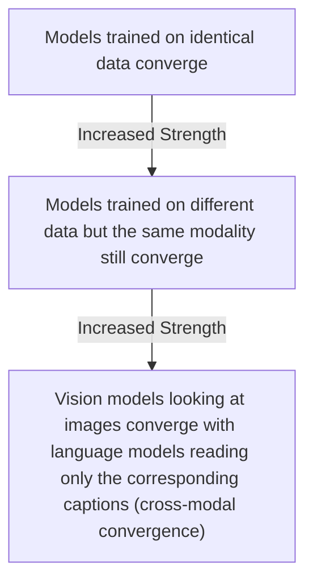
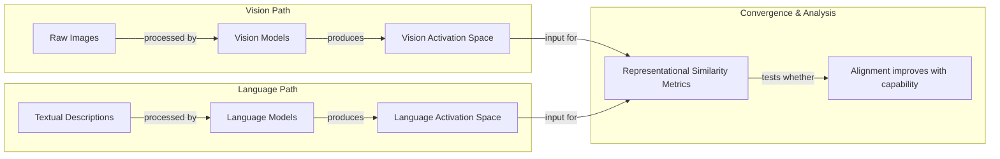
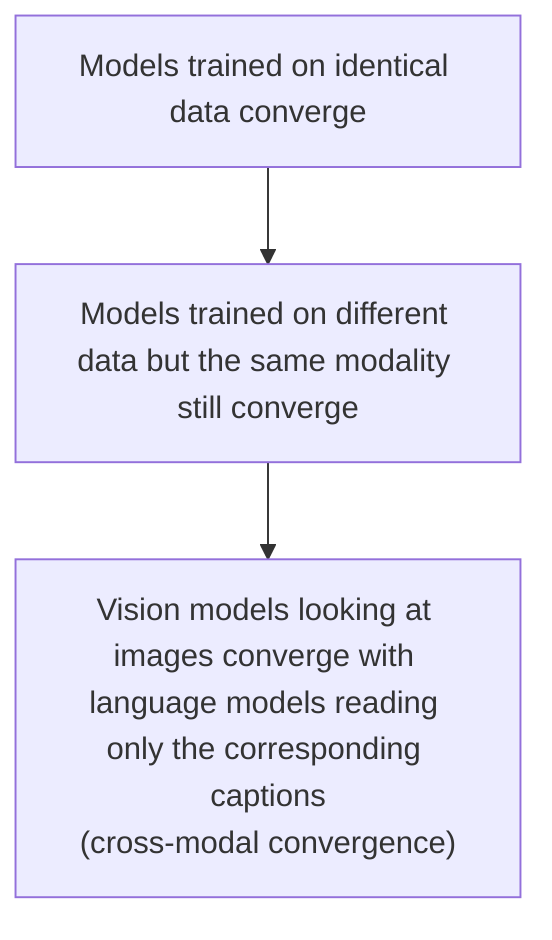
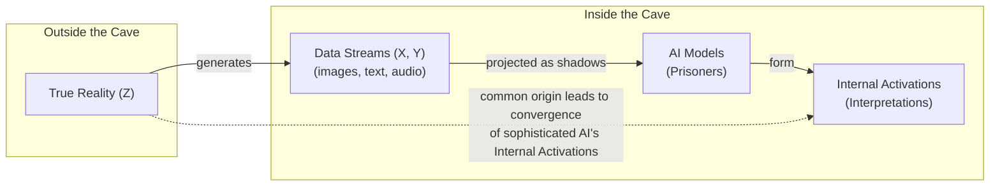

# Near-tie review: Distinct_AI_Models  (light vs standard, margin=+0.0180 -- `tied_arms=[standard]`)

## Reviewer conclusion (2026-09-04, updated after re-scoring; amended 2026-09-07): DOUBLE ORACLE -- `light` primary, `standard` tied

**Runner-up flip note:** the previous review (2026-08-27) compared `light` vs
`deep` (margin +0.0036). After this round of re-scoring, `deep`'s R_w became
far more volatile (sd=0.094, cv=0.214, by far the least stable arm) and
`standard` is now the actual runner-up (0.456 vs deep's 0.442) -- a genuine
runner-up flip, not just a margin change. This review covers the new
`light`-vs-`standard` pair.

**Quantitative basis:** per-dimension binary scores (4 sections x 3 draws,
n=12 per arm) show cc/fl/cp exactly tied (1.000 both arms). `de` favors
`standard` (0.667 vs 0.500, -0.167), but `ga` favors `light` by a much
larger margin (0.750 vs 0.333, **+0.417**) -- `light`'s guideline-adherence
edge is the dominant driver of the whole article, dwarfing standard's
depth-enhancement edge. `be` is exactly tied (0.583 both).

**Distributional basis:** per-draw margins (light - standard) are **[+0.001,
-0.012, +0.065]**, mean +0.018, sd 0.041 -- only 2 of 3 draws favor `light`
(replicate1 flips to `standard`), and the effect is not significant (p=0.264
one-tailed, df=2) -- essentially a coin flip, consistent with the margin's
growth from a razor-thin +0.0036 to a still-thin +0.0180. `light` also beats
`deep` only 2/3 (p=0.283, not significant) but decisively beats `skip` 3/3
(p=0.024, significant) -- `skip` is clearly the worst arm here, while
`light`/`standard`/`deep` are all genuinely close to each other. `standard`
vs `deep` is essentially noise (1/3, p=0.415).

**Decision:** no override needed -- `light` is the raw R_w argmax across
both the per-draw and 3-draw-averaged data. The margin genuinely did grow
(as you noted) but only modestly (+0.0036 -> +0.0180), and the underlying
evidence remains weak by conventional significance standards even though
the direction is real (2/3 draws, both against standard and against deep).
`light`'s own R_w is remarkably stable across draws (sd=0.0145, cv=0.031 --
the most stable of any arm in this article, by a wide margin over deep's
cv=0.214) -- unlike the competing arms, whose relative standing swings
draw to draw, `light` reliably lands in the same place, which is itself
mild supporting evidence that its edge is a real, reproducible property
rather than draw-to-draw noise.

**AMENDMENT (2026-09-07):** applying the newly-formalized multi-oracle rule
(margin below the 0.0312 noise threshold; hard vote agrees with the mean
winner light 2/3, but the production draw's margin (+0.0009, ~3% of the
noise threshold) is negligible, not a real win) confirms this as a genuine
MULTIPLE-oracle case -- consistent with this review's own "essentially a
coin flip" reading above. `_TIED_ARMS["Distinct_AI_Models"] = ["standard"]`
added -- `standard` now counts as an equally-valid EXACT prediction
alongside `light` in `test_grok_planner.py`.

---

## All sections (light vs standard), most-against-light first
| section | weight | contribution | running total |
|---|---:|---:|---:|
| section-4-find-the-universals | 0.225 | -0.0198 | -0.0198 |
| section-3-convergent-evolution | 0.175 | -0.0152 | -0.0350 |
| section-1-introduction | 0.275 | +0.0265 | -0.0085 |
| section-2-the-company-being-kept | 0.325 | +0.0265 | +0.0180 |

(stored article margin = +0.0180 -- should match the running total's final row to ~4 decimals)

## Section: S4::section-4-find-the-universals  (weight=0.225, contribution=-0.0198 AGAINST light)
Stored section rewards: light=0.4191  standard=0.4959  (explore: light=0.1491  standard=0.2522)

### Arm: light (preset1)

#### Draw: production  `/mnt/f/my_projects/agentic_AI_RL/Reinsearch_agent/RL_researcher_writer_ymaxing/rl_training_data/test_episodes/Distinct_AI_Models__preset1`

**Article text:**
```
## Find the Universals

Of course, it is never so simple. Measurements of representational similarity involve a host of experimental choices that can affect the outcome. Which layers do you look at in each network? Which of the many available metrics do you use to compare the vector clusters, especially when standard measures like Cosine Similarity are known to have limitations in high dimensions [[14]](https://openreview.net/forum?id=8wKec6faAT), [[15]](https://arxiv.org/html/2504.08775v1), [[21]](https://arxiv.org/html/2407.08623v4)? And which representations do you measure in the first place? “If you only test one dataset, you don’t necessarily know how [the result] generalizes,” said Christopher Wolfram, a researcher who has studied these issues. “Who knows what would happen if you did some weirder dataset?” [[1]](https://www.quantamagazine.org/distinct-ai-models-seem-to-converge-on-how-they-encode-reality-20260107). His work highlights that observed similarities may reflect structural constraints rather than meaningful convergence [[16]](https://www.preprints.org/manuscript/202601.1018).

Isola acknowledged that the issue is far from settled. To him, cases where models exhibit convergence are more compelling than cases where they may not. “The endeavor of science is to find the universals,” Isola said. “We could study the ways in which models are different or disagree, but that somehow has less explanatory power than identifying the commonalities” [[1]](https://www.quantamagazine.org/distinct-ai-models-seem-to-converge-on-how-they-encode-reality-20260107).

Other researchers, like Alexei Efros, argue it is more productive to focus on where models’ representations differ. “They’re all good friends and they’re all very, very smart people,” Efros said. “I think they’re wrong, but that’s what science is about.” Efros noted that in the Wikipedia dataset Huh used, the images and text contained similar information by design. But most data has features that resist translation. “There is a reason why you go to an art museum instead of just reading the catalog,” he said [[1]](https://www.quantamagazine.org/distinct-ai-models-seem-to-converge-on-how-they-encode-reality-20260107).

Any intrinsic sameness across models does not have to be perfect to be useful. Researchers have already used this property to translate internal representations from one language model to another [[6]](https://arxiv.org/html/2505.12540). If language and vision representations are interchangeable, it could lead to new ways to train models that learn from both data types, a possibility Isola and others explored in a recent paper [[17]](https://arxiv.org/abs/2510.08492). Even partial alignment has practical payoffs. In robotics, for example, this convergence allows skills to be transferred across robots with different bodies and sensors, improving manipulation success rates by up to 25% [[22]](https://arxiv.org/html/2506.14608v3). By learning shared representations that abstract away hardware specifics, robots can generalize from simulation to reality or even from human demonstrations. This marks a shift away from rigid, externally-defined coordinate systems toward more flexible, embodied intelligence that learns from its own actions and sensory feedback [[24]](https://drum.lib.umd.edu/items/55c373cc-a32f-4bf9-95d3-71cddebd4d57), [[25]](https://www.emergentmind.com/topics/cross-embodiment-robot-data).

Despite these promising developments, other researchers think it is unlikely that any single theory will fully capture the behavior of modern AI. “You can’t reduce a trillion-parameter system to simple explanations,” said Jeff Clune, an AI researcher. “The answers are going to be complicated” [[1]](https://www.quantamagazine.org/distinct-ai-models-seem-to-converge-on-how-they-encode-reality-20260107). While the Platonic hypothesis offers a clean philosophical story, real models contain so many interacting parts that full convergence may coexist with vast regions of model-specific idiosyncrasy.
```
**Grader reasoning:**
- `cc`: Find the Universals:
**1:** Unchanged from original review. Confirmed on independent re-check: the methodological challenges, the Isola/Efros contrast, the practical payoffs, and the Clune counterpoint are all present and match the ground truth's substance.
- `fl`: Find the Universals:
**1:** Unchanged from original review. The robotics paragraph sits within the practical-payoffs discussion, before the closing Clune-quote paragraph; stepping over it, the practical-payoffs discussion connects to the Clune counterpoint exactly as the expected section's practical-payoffs discussion does. Confirmed on independent re-check.
- `de`: Find the Universals:
**1:** [instances=1; quality=standard] Unchanged from original review, with a note on substance: the cosine-similarity-limitations clause is brief -- a parenthetical within a question rather than a standalone elaboration -- but it does introduce a specific, genuine technical fact absent from the ground truth (which only asks "which of the many mathematical methods do you use" without naming any metric or limitation), so this is not flagged as a paraphrase-only candidate, just noted as a lighter-touch instance than the other three enhancement instances in this article -- scored standard rather than strong on that basis. Traceable to the exploration-tagged arxiv 2407.08623v4 source, confirmed.
- `be`: Find the Universals:
**1:** [instances=1; quality=strong] Unchanged from original review. The robotics paragraph is a genuine, substantial breadth addition (specific, quantified -- "up to 25%" -- and detailed), correctly scored as breadth and traceable to the exploration-tagged arxiv 2506.14608v3 source plus two supporting exploration sources.
- `cp`: Find the Universals:
**1:** Unchanged from original review. The depth addition (cosine-similarity clause) is a brief inline phrase and the breadth addition (robotics paragraph) is a concise passage at the end of the practical-payoffs discussion; together they do not displace or dilute the core GT content. Scored 1.
- `ga`: Find the Universals:
**0:** Unchanged from original review (score 0). The guideline's third required practical payoff -- "build agentic systems that route information across modalities without losing semantic fidelity" -- is absent; the robotics paragraph is a valid breadth addition but addresses physical hardware transfer, not agentic systems routing information across modalities, so it does not substitute for the missing payoff. Word-count audit: exact count 473 words against a 450-word target (tolerance +/-45, range 405-495) -- comfortably inside range, not a factor.

#### Draw: replicate1  `/mnt/f/my_projects/agentic_AI_RL/Reinsearch_agent/RL_researcher_writer_ymaxing/rl_training_data/noise_experiment/Distinct_AI_Models__replicate1__preset1`

**Article text:**
```
## Find the Universals

Measurements of representational similarity involve a host of experimental choices that can affect the outcome. Which layers do you look at? Which of the many similarity metrics do you use? And which representations do you measure in the first place? These choices are critical, as different metrics like Centered Kernel Alignment (CKA) or Representational Similarity Analysis (RSA) can lead to different conclusions about the degree of alignment [[1]](https://arxiv.org/abs/2310.13018).

“If you only test one dataset, you don’t necessarily know how [the result] generalizes,” said Christopher Wolfram, a researcher at the University of Chicago. “Who knows what would happen if you did some weirder dataset?”. Wolfram also critiques that observed similarities might just reflect "unavoidable structural constraints rather than meaningful representational convergence" [[7]](https://www.quantamagazine.org/distinct-ai-models-seem-to-converge-on-how-they-encode-reality-20260107), [[22]](https://www.preprints.org/manuscript/202601.1018).

Isola acknowledged that the issue is far from settled. To him, cases where models do converge are more compelling than cases where they may not. “The endeavor of science is to find the universals,” Isola said. “We could study the ways in which models are different or disagree, but that somehow has less explanatory power than identifying the commonalities”. This search is not isolated to language and vision. In materials science, for instance, researchers have found that as physics-based AI models scale, their internal representations converge on a compatible geometric organization. This is another kind of Platonic representation emerging from physical constraints [[7]](https://www.quantamagazine.org/distinct-ai-models-seem-to-converge-on-how-they-encode-reality-20260107), [[17]](https://www.nature.com/articles/s42256-026-01235-7).

Other researchers, like Alexei Efros at UC Berkeley, argue that it is more productive to focus on where models’ representations differ. “They’re all good friends and they’re all very, very smart people,” Efros said of the MIT team. “I think they’re wrong, but that’s what science is about.”

He noted that in Huh's Wikipedia dataset, the images and text contained very similar information by design. But most data we encounter has features that resist translation. “There is a reason why you go to an art museum instead of just reading the catalog,” he said [[7]](https://www.quantamagazine.org/distinct-ai-models-seem-to-converge-on-how-they-encode-reality-20260107).

Any intrinsic sameness across models does not have to be perfect to be useful. Researchers have used this to translate internal representations of sentences from one language model to another. If language and vision model representations are somewhat interchangeable, that could lead to new ways to train models that learn from both data types, a possibility Isola and others explored in a recent paper. This principle is already being applied in robotics, where shared representations allow a single control policy to operate different robots, improving manipulation success rates and enabling skills to transfer across embodiments [[18]](https://arxiv.org/abs/2505.12540), [[19]](https://arxiv.org/abs/2510.08492), [[20]](https://arxiv.org/html/2506.14608v3), [[21]](https://www.emergentmind.com/topics/cross-embodiment-robot-data).

Despite these promising developments, some researchers think it is unlikely that a single theory will fully capture the behavior of modern AI. “You can’t reduce a trillion-parameter system to simple explanations,” said Jeff Clune, an AI researcher at the University of British Columbia. “The answers are going to be complicated” [[7]](https://www.quantamagazine.org/distinct-ai-models-seem-to-converge-on-how-they-encode-reality-20260107).
```
**Grader reasoning:**
- `cc`: Find the Universals:
**1:** All core ideas are present, including Isola's explicit acknowledgment that "the issue is far from settled" and that convergence cases are "more compelling" than non-convergence cases -- present here, unlike some generated variants that keep only his "seeks universals" quote without that acknowledgment. Also present: the experimental degrees-of-freedom catalog (CKA and RSA named explicitly), the Wolfram quote plus his structural-constraints critique (quoted directly here rather than paraphrased), the Efros counter-view including his remark on Huh's Wikipedia dataset, the practical-payoffs discussion, and the closing Clune quote. The generated section adds a materials-science analogy and a robotics application paragraph, both allowed additions.
- `fl`: Find the Universals:
**1:** The generated section follows the same progression as the expected one: experimental-choices framing, the Wolfram quote and critique, the Isola stance (including his "far from settled" acknowledgment), the materials-science aside, the Efros counter-stance (including his Wikipedia-dataset remark), the practical-payoffs paragraph (with the robotics aside appended within it), and the closing Clune quote. Within the section itself there is no transition paragraph, matching the expected section; note that the generated article as a whole continues into an additional "Conclusion" section afterward, which is outside this section's own boundary and is addressed separately below.
- `de`: Find the Universals:
**0:** [instances=0] No depth additions found. The section's two traceable additions (materials science, robotics) both connect the core topic outward to other fields/industries rather than intensifying understanding of the core topic itself, so they are evaluated under breadth_enhancement instead.
- `be`: Find the Universals:
**1:** [instances=2; quality=strong,strong] Two breadth additions, both connecting the core topic to other fields/industries: (1) "In materials science... as physics-based AI models scale, their internal representations converge on a compatible geometric organization" -- traceable to www.nature.com/articles/s42256-026-01235-7, tagged phase="exploration" in research.md, cited as [17]; the source text states almost the identical claim ("as physical models in artificial intelligence for materials scale, their representations may approach compatible geometric organizations that reflect common structure learned from physical constraints"). (2) The robotics paragraph on shared representations enabling "a single control policy to operate different robots, improving manipulation success rates and enabling skills to transfer across embodiments" -- traceable to arxiv.org/html/2506.14608v3 (quantified: "up to 25.3% improved manipulation success rates") and www.emergentmind.com/topics/cross-embodiment-robot-data, both tagged phase="exploration" in research.md, cited as [20] and [21]. Both instances are specific and quantified/named, so both scored strong.
- `cp`: Find the Universals:
**1:** breadth_enhancement scored 1 for this section (materials-science and robotics asides); depth_enhancement scored 0. Both qualifying additions are one paragraph-extension each, positioned as elaborations within existing paragraphs (the Isola paragraph and the practical-payoffs paragraph respectively) rather than as competing narratives; together they do not crowd out or bury the ground-truth core (Wolfram, Isola/Efros, Clune). The ground-truth core remains the dominant narrative; scored 1.
- `ga`: Find the Universals:
**0:** Two named guideline sub-points are entirely absent, not just under-illustrated: "whether the comparison is performed on the same or different data distributions" as a listed experimental degree of freedom, and building "agentic systems that route information across modalities without losing semantic fidelity" as a named practical payoff (the robotics/materials-science content covers different payoffs, not this one). Per the standing ruling, these are penalized regardless of the ground-truth article also omitting them. Separately -- and raised here as a distinct, not-yet-ruled-on question -- the article guideline frames this section as the final section of the article with explicitly no transition paragraph; this generated article instead continues into an additional "## Conclusion" section afterward, a whole extra section outside the guideline's four-section outline. Scored 0 on the two absent sub-points alone; the added-Conclusion question is flagged separately below rather than double-counted here.

#### Draw: replicate2  `/mnt/f/my_projects/agentic_AI_RL/Reinsearch_agent/RL_researcher_writer_ymaxing/rl_training_data/noise_experiment/Distinct_AI_Models__replicate2__preset1`

**Article text:**
```
## Find the Universals

Of course, things are never that simple. Measuring representational similarity depends on many experimental choices that can change the outcome. These include which layers of the network to compare, which similarity metric to use, and which dataset to test on [[3]](https://www.quantamagazine.org/distinct-ai-models-seem-to-converge-on-how-they-encode-reality-20260107), [[1]](https://arxiv.org/pdf/2405.07987).

Christopher Wolfram, a researcher who has studied this topic, has raised concerns about these similarities. He argues they might just reflect shallow structural patterns rather than deep, meaningful convergence. For example, models might learn similar low-level feature detectors because they are efficient for processing natural images. He questions how well results from one dataset can be generalized, asking, "If you only test one dataset, you don’t necessarily know how [the result] generalizes. Who knows what would happen if you did some weirder dataset?" [[3]](https://www.quantamagazine.org/distinct-ai-models-seem-to-converge-on-how-they-encode-reality-20260107), [[10]](https://arxiv.org/html/2504.08775v1).

This uncertainty has led to two different scientific approaches. The first, associated with Isola, focuses on finding the universal patterns that models seem to share. "The endeavor of science is to find the universals," Isola said. "We could study the ways in which models are different or disagree, but that somehow has less explanatory power than identifying the commonalities" [[3]](https://www.quantamagazine.org/distinct-ai-models-seem-to-converge-on-how-they-encode-reality-20260107).

The second approach, championed by researchers like Alexei Efros, argues that the differences between models are often more revealing. He believes that studying where representations diverge can tell us more about their unique inductive biases and failure modes. Efros, who has advised several members of the MIT team, noted that in Huh's experiment, the images and text contained very similar information by design. But in the real world, data often has features that cannot be easily translated across modalities. "There is a reason why you go to an art museum instead of just reading the catalog," he said, emphasizing that some experiences are inherently tied to a specific modality [[3]](https://www.quantamagazine.org/distinct-ai-models-seem-to-converge-on-how-they-encode-reality-20260107).

Even if the alignment is only partial, it has immediate practical benefits. Researchers have already demonstrated the ability to translate sentence representations from one language model to another without any paired data, relying solely on the shared geometric structure [[13]](https://arxiv.org/abs/2510.08492), [[14]](https://arxiv.org/abs/2505.12540). This opens the door for building more efficient multimodal systems that can route information across different specialized models without losing semantic meaning. For example, Isola and others have explored how this interchangeability can lead to new ways of training models that learn from both vision and language data simultaneously [[13]](https://arxiv.org/abs/2510.08492). In robotics, creating unified representations allows a single policy to control different robots, enabling skills to be transferred between machines with very different hardware. One study showed this led to a 25.3% improvement in manipulation success rates [[15]](https://arxiv.org/html/2506.14608v3), [[16]](https://www.emergentmind.com/topics/cross-embodiment-robot-data). These results show that even partial alignment can be engineered into more robust and versatile AI systems.

Despite these promising developments, some researchers believe it is unlikely that a single theory will ever fully explain the behavior of modern AI. "You can’t reduce a trillion-parameter system to simple explanations," said AI researcher Jeff Clune. "The answers are going to be complicated" [[3]](https://www.quantamagazine.org/distinct-ai-models-seem-to-converge-on-how-they-encode-reality-20260107). While the Platonic representation hypothesis provides a compelling narrative, real-world models are so complex that full convergence may exist alongside large areas of model-specific behavior.
```
**Grader reasoning:**
- `cc`: Find the Universals:
**1:** Unchanged from original review. All core ideas present; the missing "far from settled" acknowledgment remains non-disqualifying.
- `fl`: Find the Universals:
**1:** Unchanged from original review. The robotics aside is appended within the practical-payoffs paragraph without disrupting it.
- `de`: Find the Universals:
**0:** [instances=0] Unchanged from original review. The robotics addition is breadth (see below), not depth.
- `be`: Find the Universals:
**1:** [instances=1; quality=strong] Unchanged from original review. The robotics addition is genuine, specific, and quantified (25.3%), traceable to two exploration-tagged sources.
- `cp`: Find the Universals:
**1:** Unchanged from original review. The robotics addition is appended within the existing paragraph; every ground-truth element remains present. Scored 1.
- `ga`: Find the Universals:
**0:** Unchanged from original review (score 0). The "same/different data distributions" sub-point remains absent, independently sufficient for the 0; the "agentic systems" payoff is functionally covered via "route information across different specialized models without losing semantic meaning." Word-count audit: exact count 502 words against a 450-word target (tolerance +/-45, range 405-495) -- 7 words over the maximum (1.6% of target), immaterial and moot given the sub-point gap.

### Arm: standard (preset2)

#### Draw: production  `/mnt/f/my_projects/agentic_AI_RL/Reinsearch_agent/RL_researcher_writer_ymaxing/rl_training_data/test_episodes/Distinct_AI_Models__preset2`

**Article text:**
```
## Find the Universals

Measurements of representational similarity involve a host of experimental choices that can affect the outcome. Which layers do you look at in each network? Once you have a cluster of vectors, which of the many available metrics do you use to compare them, such as Centered Kernel Alignment (CKA), Representational Similarity Analysis (RSA), or nearest-neighbor metrics [[17], [18], [19]]? And which representations do you measure in the first place?

Christopher Wolfram, a researcher at the University of Chicago, has studied this problem and critiques the generalizability of results from a single dataset: “If you only test one dataset, you don’t necessarily know how [the result] generalizes. Who knows what would happen if you did some weirder dataset?” [[3], [10]]. The challenge lies in distinguishing arbitrary properties of representations from fundamental ones [[3]]. Indeed, convergence can be limited by many-to-many relationships between concepts, scalability issues, and modality-specific information that fails to generalize [[20]].

Isola acknowledged that the issue is far from settled, but he argues that cases where models do converge are more compelling than cases where they may not. “The endeavor of science is to find the universals,” Isola said. “We could study the ways in which models are different or disagree, but that somehow has less explanatory power than identifying the commonalities” [[10]].

Other researchers argue that it is more productive to focus on where models’ representations differ. Among them is Alexei Efros, a researcher at UC Berkeley. “They’re all good friends and they’re all very, very smart people,” Efros said of the MIT team. “I think they’re wrong, but that’s what science is about” [[10]]. Efros noted that in the Wikipedia dataset Huh used, the images and text contained very similar information by design. But much of the data we encounter has features that resist translation. “There is a reason why you go to an art museum instead of just reading the catalog,” he said [[10]]. This aligns with research seeking to isolate the "bimodal basis" supporting alignment from unimodal features unique to one data type [[21]].

Any intrinsic sameness across models does not have to be perfect to be useful. Even with only partial alignment, there are immediate practical payoffs. Last summer, researchers used this partial alignment to translate internal representations of sentences from one language model to another without any paired data [[6]]. If language and vision representations are to some extent interchangeable, it could lead to new ways to train models that learn from both data types, a technique Isola and others explored in a recent paper [[5]]. This could allow for more efficient multimodal training and help build agentic systems, for instance, enabling a robot to ground a language command to a 3D point-cloud and manipulate a novel object [[22]].

Despite these promising developments, other researchers think it is unlikely that any single theory will fully capture the behavior of modern AI models. “You can’t reduce a trillion-parameter system to simple explanations,” said Jeff Clune, an AI researcher at the University of British Columbia. “The answers are going to be complicated” [[10]]. While the Platonic hypothesis offers a clean philosophical story, real models contain so many interacting parts that full convergence may coexist with vast regions of model-specific idiosyncrasy. This is captured by the Fractured Entangled Representation (FER) hypothesis, which suggests that even high-performing models can have messy, disorganized internals, like "spaghetti code," where concepts are redundantly represented and entangled in counterintuitive ways [[11]].
```
**Grader reasoning:**
- `cc`: Find the Universals:
**1:** Unchanged from original review. All core ideas present; the limitations, robot-grounding, and bimodal-basis additions are allowed extras.
- `fl`: Find the Universals:
**1:** Unchanged from original review. The limitations, bimodal-basis, and robot-grounding additions are each integrated within their corresponding argument paragraphs without disrupting the expected sequence; confirmed on independent re-check.
- `de`: Find the Universals:
**1:** [instances=2; quality=strong,standard] On further review, the robot-grounding instance originally listed here is REMOVED from depth and moved to breadth_enhancement instead (see below) -- reconsidered as a reclassification, not a dual-qualifying case. Two depth instances remain: the many-to-many-relationships/scalability limitations clause (strong) and the bimodal-basis clause (standard). The score is unchanged at 1, carried by these two.
- `be`: Find the Universals:
**1:** [instances=1; quality=strong] CORRECTED from 0 to 1, via reclassification rather than dual-credit (see depth_enhancement above): the robot-grounding case ("enabling a robot to ground a language command to a 3D point-cloud and manipulate a novel object") was originally credited as depth ("real-world case study"). On reconsideration, robotics -- physical manipulation, sensor-action spaces -- is a genuinely different domain from the representation-alignment research the ground truth stays within, and this reading is also consistent with how every other robotics-application addition has been classified elsewhere in this review pass (as breadth, not depth). Moved here rather than credited in both places.
- `cp`: Find the Universals:
**1:** Updated to reflect the reclassification above (score unchanged at 1): the robot-grounding case now counts toward breadth_enhancement instead of depth_enhancement, alongside the separately-credited limitations and bimodal-basis depth instances. All three additions are concise and integrated within their corresponding paragraphs, and the GT core (Wolfram, Isola, Efros, Clune) remains fully present and dominant. Scored 1.
- `ga`: Find the Universals:
**0:** Unchanged from original review (score 0), with exact figures replacing the original's approximation. Content requirements are fully met, including the agentic-systems payoff via the robot-grounding example. Word-count audit: exact count 570 words against a 450-word target (tolerance +/-45, range 405-495) -- 75 words above the maximum, roughly 17% over target. Confirmed as a genuine violation, not a borderline call -- in fact the largest overage found in this article.

#### Draw: replicate1  `/mnt/f/my_projects/agentic_AI_RL/Reinsearch_agent/RL_researcher_writer_ymaxing/rl_training_data/noise_experiment/Distinct_AI_Models__replicate1__preset2`

**Article text:**
```
## Find the Universals

Measurements of representational similarity involve a host of experimental choices that can affect the outcome. Which layers do you look at in each network? Which of the many available similarity metrics do you use? And which data do you measure in the first place? These are not trivial decisions, as different layers within the same model can have different nearest-neighbor relationships, meaning the choice of layer can significantly alter the results [[13]](https://arxiv.org/html/2504.08775v1).

Christopher Wolfram, a researcher who has studied representational similarity, critiques the generalizability of these findings. "If you only test one dataset, you don’t necessarily know how [the result] generalizes," he said. "Who knows what would happen if you did some weirder dataset?" [[4]](https://www.quantamagazine.org/distinct-ai-models-seem-to-converge-on-how-they-encode-reality-20260107).

The core challenge is distinguishing arbitrary properties of a representation (like the order of dimensions) from fundamental ones (like nearest-neighbor relationships) [[13]](https://arxiv.org/html/2504.08775v1). Other potential failure modes include scalability issues, challenges in aligning concepts with many-to-many relationships across modalities, and the presence of modality-specific information that has no counterpart [[12]](https://akoepke.github.io/cave_umwelten).

This uncertainty has led to two complementary attitudes in the research community. One, associated with Phillip Isola, is to actively seek the universals that models appear to share. "The endeavor of science is to find the universals," Isola said. "We could study the ways in which models are different or disagree, but that somehow has less explanatory power than identifying the commonalities" [[4]](https://www.quantamagazine.org/distinct-ai-models-seem-to-converge-on-how-they-encode-reality-20260107).

One explanation for these universals is the "Contravariance Principle," which posits that as models are required to solve more tasks, the set of internal representations that can satisfy all constraints shrinks, forcing them to become more alike [[3]](https://phillipi.github.io/prh). This is also supported by the multitask scaling hypothesis, which suggests that as we train more general models that solve more tasks, we should expect fewer possible solutions [[2]](https://aiscientist.substack.com/p/musing-38-the-platonic-representation).

The other attitude, held by researchers like Alexei Efros, argues that it is more productive to focus on where models' representations differ. Efros noted that in the Wikipedia dataset Huh used, the images and text contained very similar information by design.

But most data we encounter has features that resist translation. "There is a reason why you go to an art museum instead of just reading the catalog," he said [[4]](https://www.quantamagazine.org/distinct-ai-models-seem-to-converge-on-how-they-encode-reality-20260107).

Despite the debate, any intrinsic sameness across models, even if imperfect, has practical payoffs. Researchers have already used this partial alignment to translate internal representations of sentences from one language model to another [[14]](https://arxiv.org/html/2505.12540v5). If language and vision model representations are somewhat interchangeable, it could lead to new ways to train models that learn from both data types, a possibility explored in recent work [[15]](https://arxiv.org/abs/2510.08492). For instance, shared embeddings allow autonomous robots to manipulate novel objects based on language instructions, generalizing from past experience without explicit programming for each new item [[10]](https://arxiv.org/html/2411.05036v1). These applications are foundational for building robust multimodal systems.

However, it is unlikely that any single theory will fully capture the behavior of modern AI models. The PRH offers a clean philosophical story, but as AI researcher Jeff Clune noted, the reality is far more complex. "You can’t reduce a trillion-parameter system to simple explanations," he said. "The answers are going to be complicated" [[4]](https://www.quantamagazine.org/distinct-ai-models-seem-to-converge-on-how-they-encode-reality-20260107). This view is supported by the "Fractured Entangled Representation" (FER) hypothesis, which argues that even as performance scales, the internal representations can remain disorganized and inefficient, relying on redundant and entangled "spaghetti code" rather than a clean, unified model [[8]](https://arxiv.org/html/2505.11581v1).
```
**Grader reasoning:**
- `cc`: Find the Universals:
**1:** Unchanged from original review. All core ideas present, including Isola's "far from settled" acknowledgment; the four additions are allowed.
- `fl`: Find the Universals:
**1:** Unchanged from original review. All four additions are appended within existing paragraphs without disrupting the expected sequence. The extra "Conclusion" section is outside this section's own boundary, addressed under guideline_adherence.
- `de`: Find the Universals:
**1:** [instances=2; quality=strong,strong] Unchanged from original review: the Contravariance Principle and the failure-modes/limitations discussion. Reviewed for dual-qualification: both stay focused on explaining the core topic's own mechanism and limits, with no separable adjacent-field content, so neither also qualifies as breadth.
- `be`: Find the Universals:
**1:** [instances=1; quality=strong] Unchanged from original review. The robotics addition is genuine and specific/quantified, clearing the specificity bar; classification as breadth (not depth) is consistent with how robotics-application content has been treated throughout this review.
- `cp`: Find the Universals:
**1:** Unchanged from original review, including the explicit flag: this remains the most addition-dense section in the article (three qualifying instances), each appended rather than displacing ground-truth content, but flagged as the closer call on cumulative volume grounds. Scored 1.
- `ga`: Find the Universals:
**0:** Unchanged from original review (score 0). The "same/different data distributions" and "agentic systems" sub-points remain absent. Word-count audit: exact count 549 words against a 450-word target (tolerance +/-45, range 405-495) -- 54 words above the maximum (~12% over target), a clear, non-trivial violation on its own, independent of the sub-points gap. The extra "## Conclusion" section remains flagged as a distinct, not-yet-ruled-on question.

#### Draw: replicate2  `/mnt/f/my_projects/agentic_AI_RL/Reinsearch_agent/RL_researcher_writer_ymaxing/rl_training_data/noise_experiment/Distinct_AI_Models__replicate2__preset2`

**Article text:**
```
## Find the Universals

Of course, it is never so simple. Measurements of representational similarity invariably involve a host of experimental choices that can affect the outcome. Which layers do you look at in each network? Different layers are known to capture different levels of abstraction, from low-level features to high-level semantics. Once you have a cluster of vectors from each model, which of the many similarity metrics do you use? Options like Centered Kernel Alignment (CKA), Singular Value Canonical Correlation Analysis (SVCCA), and nearest-neighbor metrics each have their own biases and sensitivities. And which representations do you measure in the first place? The choice of dataset is critical [[1]](https://www.quantamagazine.org/distinct-ai-models-seem-to-converge-on-how-they-encode-reality-20260107).

The central problem is that neural networks can generate activations that differ in trivial ways, such as permuted axes or flipped signs. The challenge is choosing which properties are arbitrary and which are fundamental. “If you only test one dataset, you don’t necessarily know how [the result] generalizes,” said Christopher Wolfram, a researcher who has studied these issues. “Who knows what would happen if you did some weirder dataset?” This critique highlights the risk of mistaking dataset-specific artifacts for genuine, generalizable convergence [[1]](https://www.quantamagazine.org/distinct-ai-models-seem-to-converge-on-how-they-encode-reality-20260107), [[20]](https://arxiv.org/abs/2504.08775).

Isola acknowledged that the issue is far from settled. To him, cases where models do exhibit convergence are more compelling than cases where they may not. “The endeavor of science is to find the universals,” Isola said. “We could study the ways in which models are different or disagree, but that somehow has less explanatory power than identifying the commonalities” [[1]](https://www.quantamagazine.org/distinct-ai-models-seem-to-converge-on-how-they-encode-reality-20260107).

Other researchers argue that it is more productive to focus on where models’ representations differ. Among them is Alexei Efros, a researcher at the University of California, Berkeley. “I think they’re wrong, but that’s what science is about,” Efros said. He noted that in the Wikipedia dataset Huh used, the images and text contained very similar information by design. But most data we encounter has features that resist translation. “There is a reason why you go to an art museum instead of just reading the catalog,” he said. Other potential failure modes include scalability issues and modality-specific features that resist translation, like the rhythm of speech [[1]](https://www.quantamagazine.org/distinct-ai-models-seem-to-converge-on-how-they-encode-reality-20260107), [[21]](https://akoepke.github.io/cave_umwelten).

Any intrinsic sameness across models does not have to be perfect to be useful. The practical payoffs of even partial alignment are already being explored. For instance, researchers have successfully used this shared structure to translate internal representations of sentences from one language model to another, without any paired data. This suggests a "universal geometry" that can be harnessed. Furthermore, if language and vision model representations are to some extent interchangeable, it could lead to new, more efficient ways to train multimodal models. Isola and others explored this in a recent paper, showing that using unpaired data from an auxiliary modality can consistently improve the representations of a target modality, all without requiring explicit pairs [[22]](http://arxiv.org/abs/2505.12540), [[23]](https://arxiv.org/abs/2510.08492).

Despite these promising developments, other researchers think it is unlikely that any single theory will fully capture the behavior of modern AI models. This view is sometimes framed by the "Fractured Entangled Representation (FER) hypothesis," which posits that models trained via standard methods like Stochastic Gradient Descent (SGD) often learn disorganized, redundant, and entangled internal representations, even when their external performance is perfect. This is like spaghetti code: it works, but it's a mess inside and doesn't generalize well. “You can’t reduce a trillion-parameter system to simple explanations,” said Jeff Clune, an AI researcher at the University of British Columbia. “The answers are going to be complicated” [[1]](https://www.quantamagazine.org/distinct-ai-models-seem-to-converge-on-how-they-encode-reality-20260107), [[10]](https://arxiv.org/html/2505.11581v1).
```
**Grader reasoning:**
- `cc`: Find the Universals:
**1:** All core ideas are present with unusually close fidelity: the experimental degrees-of-freedom catalog (CKA, SVCCA, and nearest-neighbor metrics all named), the Wolfram quote and critique, Isola's "the issue is far from settled" acknowledgment alongside his "seeks universals" quote (present here, unlike several other generated variants that keep only the quote), the Efros counter-view with the Wikipedia-dataset remark, the practical-payoffs discussion, and the closing Clune quote. The generated section adds a failure-modes aside and a Fractured Entangled Representation (FER) hypothesis elaboration, both allowed additions.
- `fl`: Find the Universals:
**1:** The generated section follows the same progression as the expected one: experimental-choices framing, the Wolfram quote and critique, the Isola stance including his "far from settled" acknowledgment, the Efros counter-stance including his Wikipedia-dataset remark (with the failure-modes aside appended after it, not disrupting the sequence), the practical-payoffs paragraph, and the closing Clune quote (with the FER-hypothesis aside appended before it). Correctly no transition paragraph within the section itself, matching the expected section; the article as a whole continues into an additional "Conclusion" section afterward, addressed separately below.
- `de`: Find the Universals:
**1:** [instances=1; quality=strong] One depth addition: the failure-modes discussion ("scalability issues and modality-specific features that resist translation"), intensifying understanding of the section's own core topic (limitations of convergence measurement). Traceable to an exploration-tagged akoepke.github.io source in research.md ("failure modes limit cross-modal convergence due to... scalability issues, and modality-specific representations"), cited as [21]; the specific "rhythm of speech" illustration is the writer's own elaboration of that sourced concept rather than a separately-sourced claim. Specific, so scored strong.
- `be`: Find the Universals:
**0:** [instances=0] No breadth additions found. The section's one traceable addition (failure modes) is scored under depth_enhancement instead, as it intensifies understanding of the section's own core topic rather than connecting outward to an adjacent field.
- `cp`: Find the Universals:
**1:** depth_enhancement scored 1 (failure modes); breadth_enhancement scored 0. This section also runs well over the guideline's word-count tolerance (addressed under guideline_adherence), driven substantially by the exploitation-only FER-hypothesis elaboration in addition to the qualifying failure-modes aside -- but every ground-truth element (Wolfram, Isola including his "far from settled" acknowledgment, Efros, Clune) remains present and undiminished. Scored 1, but flagging this as the closer call of the two, alongside Company Being Kept, given the section's overall length.
- `ga`: Find the Universals:
**0:** "Whether the comparison is performed on the same or different data distributions" and "agentic systems that route information across modalities" both remain unaddressed, consistent with most presets graded so far. Independently, prose-only word count is approximately 575 words against a 450-word target with a +/-45 tolerance (405-495) -- about 80 words over the ceiling, roughly 17.8% over target, the largest overage found in this section across any preset graded so far. Scored 0 on either basis alone; both are noted since either would be independently sufficient. Also raised again, as in several previously graded presets: the guideline frames this section as final with no transition paragraph, but this article again continues into an additional "## Conclusion" section afterward -- still flagged as a distinct, not-yet-ruled-on question rather than double-counted here.

## Section: S3::section-3-convergent-evolution  (weight=0.175, contribution=-0.0152 AGAINST light)
Stored section rewards: light=0.4050  standard=0.4478  (explore: light=0.0350  standard=0.1375)

### Arm: light (preset1)

#### Draw: production  `/mnt/f/my_projects/agentic_AI_RL/Reinsearch_agent/RL_researcher_writer_ymaxing/rl_training_data/test_episodes/Distinct_AI_Models__preset1`

**Article text:**
```
## Convergent Evolution

The story of the Platonic representation hypothesis paper began in early 2023, a turbulent time for AI researchers. ChatGPT had been released a few months prior. It was increasingly clear that simply scaling up AI models, by training larger neural networks on more data, made them better at many different tasks. But it was unclear why [[1]](https://www.quantamagazine.org/distinct-ai-models-seem-to-converge-on-how-they-encode-reality-20260107). “Everyone in AI research was going through an existential life crisis,” said Minyoung Huh, an OpenAI researcher who was a graduate student in Isola’s lab at the time. He began meeting regularly with Isola and their colleagues Brian Cheung and Tongzhou Wang to discuss how scaling might affect internal representations [[1]](https://www.quantamagazine.org/distinct-ai-models-seem-to-converge-on-how-they-encode-reality-20260107).

When models are trained on the same data, more similar representations might just mean they are better at grasping quirks of the training dataset. The evidence for a shared world model becomes more compelling when models trained on different data but the same modality still converge. The most striking evidence, however, comes from convergence between models trained on entirely different data types, such as language and vision models [[1]](https://www.quantamagazine.org/distinct-ai-models-seem-to-converge-on-how-they-encode-reality-20260107).

A year after their initial conversations, Isola and his colleagues decided to write a paper reviewing the evidence for convergent representations and arguing for the Platonic representation hypothesis [[1]](https://www.quantamagazine.org/distinct-ai-models-seem-to-converge-on-how-they-encode-reality-20260107). By then, other researchers had already found evidence of alignment between vision and language model representations [[3]](https://phillipi.github.io/prh), [[5]](https://arxiv.org/html/2507.01201v5), [[13]](https://www.emergentmind.com/topics/multimodal-alignment). Huh conducted his own experiment, testing five vision models and 11 language models of varying sizes on a dataset of captioned pictures from Wikipedia. He fed the pictures into the vision models and the captions into the language models, then compared the vector clusters. He observed a steady increase in representational similarity as models became more powerful, exactly as the hypothesis predicted [[1]](https://www.quantamagazine.org/distinct-ai-models-seem-to-converge-on-how-they-encode-reality-20260107).

After reviewing the evidence for convergence, we must examine a host of experimental choices regarding the measurements of representational similarity that may affect the validity and generalizability of the results.
```
**Grader reasoning:**
- `cc`: Convergent Evolution:
**1:** Unchanged from original review. Confirmed on independent re-check: the post-ChatGPT framing, the full hierarchy of evidence, and Huh's experiment (five vision models, eleven language models, Wikipedia captioned pictures) are all present and match the ground truth's substance.
- `fl`: Convergent Evolution:
**1:** Unchanged from original review. No additions in this section; order matches the expected section exactly.
- `de`: Convergent Evolution:
**0:** [instances=0] Unchanged from original review. No depth additions; the section accurately summarizes the expected section's content without adding technical nuances traceable to exploration sources.
- `be`: Convergent Evolution:
**0:** [instances=0] Unchanged from original review. No breadth additions in this section.
- `cp`: Convergent Evolution:
**1:** Both depth_enhancement and breadth_enhancement scored 0, so per the mandatory default rule, core_preservation scores 1 by default.
- `ga`: Convergent Evolution:
**1:** Word-count audit finds a discrepancy with the original review, which reported "~318 words... within tolerance." The exact count is 310 words against a 350-word target (tolerance +/-35, range 315-385) -- 5 words BELOW the minimum, not inside the range as previously stated. This is larger than the 2-word margin already ruled trivial and not-penalized in a separately reviewed preset, so flagging explicitly rather than silently applying that precedent: 5 words is still small in absolute and relative terms (1.4% of target), and every content requirement is otherwise met (the existential-question framing, Huh's quote with Cheung and Wang named, the complete hierarchy, the year-later paper decision, and Huh's experiment with the five/eleven model counts). Scored 1 here (treating 5 words as within the same spirit as the already-established trivial-margin ruling), but flagging the exact number since it is larger than the precedent case and you may want to draw the line between them.

#### Draw: replicate1  `/mnt/f/my_projects/agentic_AI_RL/Reinsearch_agent/RL_researcher_writer_ymaxing/rl_training_data/noise_experiment/Distinct_AI_Models__replicate1__preset1`

**Article text:**
```
## Convergent Evolution

The story of the Platonic representation hypothesis paper began in early 2023. ChatGPT had been released a few months before, and it was increasingly clear that simply scaling up AI models made them better at many different tasks. But it was unclear why. This rapid, unexplained progress led to a period of intense reflection within the AI community.

“Everyone in AI research was going through an existential life crisis,” said Minyoung Huh, an OpenAI researcher who was a graduate student in Isola’s lab at the time. He began meeting regularly with Isola and their colleagues Brian Cheung and Tongzhou Wang to discuss how scaling might affect internal representations [[7]](https://www.quantamagazine.org/distinct-ai-models-seem-to-converge-on-how-they-encode-reality-20260107).

Suppose multiple models are trained on the same data, where stronger models learn more similar representations. This does not necessarily mean they are creating a more accurate likeness of the world. They could just be better at grasping quirks of the training dataset.

Now consider models trained on different datasets. If their representations also converge, that would be more compelling evidence that models are getting better at grasping shared features of the world behind the data. Convergence between models that learned from entirely different data types, such as language and vision models, would provide even stronger evidence. This is the most striking claim: that a vision model looking at images and a language model reading text about those same images will develop aligned internal structures. This mirrors findings in neuroscience, where researchers have recovered intrinsic, modality-independent "Platonic forms" of neuronal identity from brain activity [[15]](https://www.emergentmind.com/topics/platonic-representation-hypothesis).

A year after their initial conversations, Isola and his colleagues decided to write a paper reviewing the evidence for convergent representations and arguing for the Platonic representation hypothesis [[2]](https://arxiv.org/abs/2405.07987).

By then, other researchers had already found evidence of alignment between vision and language model representations. Huh conducted his own experiment, testing five vision models and 11 language models on a dataset of captioned pictures from Wikipedia. He fed the pictures into the vision models and the captions into the language models, then compared the vector clusters. He observed a steady increase in representational similarity as models became more powerful, exactly what the Platonic representation hypothesis predicted [[7]](https://www.quantamagazine.org/distinct-ai-models-seem-to-converge-on-how-they-encode-reality-20260107), [[12]](https://arxiv.org/abs/2209.15162), [[13]](https://arxiv.org/abs/2302.06555), [[14]](https://arxiv.org/abs/2401.05224).

After reviewing the evidence for convergence, we must examine a host of experimental choices with respect to the measurements of representational similarity that may affect the validity and generalizability of the result.
```
**Grader reasoning:**
- `cc`: Convergent Evolution:
**1:** All core ideas are present, including the specific reasoning for why same-data convergence is the weakest tier of evidence ("they could just be better at grasping quirks of the training dataset") -- present here, unlike some generated variants that state the hierarchy without that justification. Also present: the early-2023/ChatGPT framing, the "existential life crisis" quote and the Isola/Cheung/Wang meetings, the full three-tier hierarchy, the year-later paper decision, and Huh's experiment (five vision models, 11 language models, Wikipedia captioned pictures, steady increase in similarity). The generated section adds a neuroscience analogy (convergent "Platonic forms" of neuronal identity) at the end of the hierarchy paragraph, which is an allowed addition.
- `fl`: Convergent Evolution:
**1:** The generated section follows the same progression as the expected one: existential-crisis framing and Huh's quote/meetings, the increasing-strength hierarchy (with the neuroscience aside appended at the end of the hierarchy discussion, not disrupting it), the year-later paper decision, and Huh's experiment description, closing with a transition into Section 4. The expected section has no comparable closing transition to fail to match.
- `de`: Convergent Evolution:
**0:** [instances=0] No depth additions found. The section's one traceable addition (the neuroscience "Platonic forms of neuronal identity" analogy) connects the core topic outward to a different field rather than intensifying understanding of the core topic itself, so it is evaluated under breadth_enhancement instead.
- `be`: Convergent Evolution:
**1:** [instances=1; quality=strong] One breadth addition: "This mirrors findings in neuroscience, where researchers have recovered intrinsic, modality-independent 'Platonic forms' of neuronal identity from brain activity," connecting the core topic to an adjacent field (cognitive neuroscience) via a named framework (NeurPIR) and named study (Wu et al., 2025). Traceable to www.emergentmind.com/topics/platonic-representation-hypothesis, tagged phase="exploration" in research.md under the query "What cognitive neuroscience parallels exist for Platonic AI representations?", cited in the article as [15]. Specific and named, so scored strong.
- `cp`: Convergent Evolution:
**1:** breadth_enhancement scored 1 for this section (the neuroscience aside); depth_enhancement scored 0. The qualifying addition is a single sentence appended at the end of the hierarchy-of-evidence paragraph, functioning as a supporting analogy that reinforces the "most striking claim" rather than displacing it. The ground-truth core (the hierarchy, Huh's experiment) remains fully intact and dominant; scored 1.
- `ga`: Convergent Evolution:
**1:** Covers every guideline requirement: the early-2023/ChatGPT existential-question framing with Huh's quote and the Isola/Cheung/Wang meetings, the three-tier hierarchy of convergence evidence, the year-later paper decision, Huh's experimental design and observed result, and the required closing transition into Section 4. Prose-only word count is approximately 389 words against a 350-word target with a +/-35 tolerance (315-385) -- about 4 words over, under 1.5% of target, well inside the range the standing ruling treats as immaterial.

#### Draw: replicate2  `/mnt/f/my_projects/agentic_AI_RL/Reinsearch_agent/RL_researcher_writer_ymaxing/rl_training_data/noise_experiment/Distinct_AI_Models__replicate2__preset1`

**Article text:**
```
## Convergent Evolution

The story of the Platonic representation hypothesis started in early 2023. ChatGPT had just been released, and it was becoming clear that making AI models bigger made them better at many tasks. But no one was sure why. This led to a big question in the field: as models get better, are they just memorizing more data, or are they actually building a better model of the world?

"Everyone in AI research was going through an existential life crisis," said Minyoung Huh, an OpenAI researcher. He started meeting with Phillip Isola and other colleagues to discuss how scaling up models might be affecting their internal representations [[3]](https://www.quantamagazine.org/distinct-ai-models-seem-to-converge-on-how-they-encode-reality-20260107), [[1]](https://arxiv.org/pdf/2405.07987).

They laid out a hierarchy of evidence for convergence. The weakest evidence would be if models trained on the same data ended up with similar representations. It would be stronger evidence if models trained on different data but the same modality also converged. The most compelling evidence, however, would be if models trained on completely different types of data, like images and text, also showed alignment [[3]](https://www.quantamagazine.org/distinct-ai-models-seem-to-converge-on-how-they-encode-reality-20260107), [[1]](https://arxiv.org/pdf/2405.07987).

A year later, Isola and his team published a paper outlining their argument for the hypothesis [[3]](https://www.quantamagazine.org/distinct-ai-models-seem-to-converge-on-how-they-encode-reality-20260107), [[1]](https://arxiv.org/pdf/2405.07987). By that time, other researchers had already started finding evidence of alignment between vision and language models [[3]](https://www.quantamagazine.org/distinct-ai-models-seem-to-converge-on-how-they-encode-reality-20260107).

Huh ran his own experiment to test this. He took a set of vision and language models of different sizes and tested them on a dataset of captioned images from Wikipedia. He fed the images to the vision models and the captions to the language models, and then compared their internal vector clusters. He found a consistent increase in similarity as the models became more powerful, which was exactly what the hypothesis predicted [[3]](https://www.quantamagazine.org/distinct-ai-models-seem-to-converge-on-how-they-encode-reality-20260107), [[1]](https://arxiv.org/pdf/2405.07987).

After reviewing the evidence for convergence, we must examine a host of experimental choices with respect to the measurements of representational similarity that may affect the validity and generalizability of the result.
```
**Grader reasoning:**
- `cc`: Convergent Evolution:
**1:** Unchanged from original review. All core ideas present; the generic "colleagues" and model-count omissions remain non-disqualifying details.
- `fl`: Convergent Evolution:
**1:** Unchanged from original review. No additions in this section; order matches exactly. No diagrams anywhere in this article, so there is no image-placement question to assess in any section.
- `de`: Convergent Evolution:
**0:** [instances=0] Unchanged from original review. No additions in this section.
- `be`: Convergent Evolution:
**0:** [instances=0] Unchanged from original review. No additions in this section.
- `cp`: Convergent Evolution:
**1:** Unchanged from original review. Both depth_enhancement and breadth_enhancement scored 0, so per the mandatory default rule, core_preservation scores 1 by default.
- `ga`: Convergent Evolution:
**1:** Unchanged from original review (score 1). Word-count audit: exact count 310 words against a 350-word target (tolerance +/-35, range 315-385) -- 5 words under the minimum (1.4% of target), consistent with margins previously ruled immaterial.

### Arm: standard (preset2)

#### Draw: production  `/mnt/f/my_projects/agentic_AI_RL/Reinsearch_agent/RL_researcher_writer_ymaxing/rl_training_data/test_episodes/Distinct_AI_Models__preset2`

**Article text:**
```
## Convergent Evolution

The story of the Platonic representation hypothesis paper began in early 2023. ChatGPT had been released a few months before, and it was increasingly clear that simply scaling up AI models made them better at many tasks. But it was unclear why [[10]]. This trend continues, with recent research exploring new scaling laws specifically for multimodal systems [[13]].

“Everyone in AI research was going through an existential life crisis,” said Minyoung Huh, an OpenAI researcher who was a graduate student in Isola’s lab at the time. He began meeting regularly with Isola and their colleagues Brian Cheung and Tongzhou Wang to discuss how scaling might affect internal representations [[10]]. When performance improves with scale, are models simply memorizing more dataset quirks, or are they getting better at approximating a true underlying world model? One proposed driver is the “Contravariance Principle”: as models must solve more tasks, the space of viable internal representations shrinks, forcing them to converge [[9]].

The team outlined a hierarchy of evidence that would support the Platonic hypothesis, in increasing order of strength. First, if models trained on the same data converge, it is a weak sign, as they could just be learning the same dataset-specific patterns. A more compelling case would be if models trained on different datasets but the same modality still converge. This would suggest they are learning about the world, not just the data. The strongest evidence would come from convergence between models trained on entirely different data types, such as vision and language models [[10]].

A year after their initial conversations, Isola and his colleagues decided to write a paper reviewing the evidence and presenting their argument [[10]]. By then, other researchers had already found evidence of alignment between vision and language model representations [[14], [15], [16]]. Huh conducted his own experiment, testing five vision models and 11 language models of varying sizes on captioned pictures from Wikipedia. He would feed the pictures into the vision models and the captions into the language models, then compare the vector clusters. He observed a steady increase in representational similarity as models became more powerful, exactly what the Platonic representation hypothesis predicted [[10]].

This evidence seems compelling. However, we must examine a host of experimental choices regarding the measurements of representational similarity that may affect the validity and generalizability of the result.
```
**Grader reasoning:**
- `cc`: Convergent Evolution:
**1:** Unchanged from original review. All core ideas present; the scaling-laws and Contravariance Principle additions are allowed extras.
- `fl`: Convergent Evolution:
**1:** Unchanged from original review. The scaling-laws sentence and Contravariance Principle clause are brief insertions that do not disrupt the expected sequence; confirmed on independent re-check.
- `de`: Convergent Evolution:
**1:** [instances=2; quality=strong,strong] Unchanged from original review. The scaling-laws and Contravariance Principle additions are both genuine theoretical/recent-development content about the core topic (why/how scale drives convergence), correctly scored as depth rather than breadth -- they extend the section's own subject matter rather than connecting to a genuinely separate field.
- `be`: Convergent Evolution:
**0:** [instances=0] Unchanged from original review. No breadth additions; both qualifying additions (scaling laws, Contravariance Principle) stay within the core topic rather than connecting to a genuinely separate field.
- `cp`: Convergent Evolution:
**1:** Unchanged from original review. Both qualifying additions are brief clauses integrated into the existing narrative. Scored 1.
- `ga`: Convergent Evolution:
**1:** Score confirmed at 1, but the original reasoning's word-count claim needs correcting: it stated the count was "approximately 385 words, exactly at the upper bound... within the acceptable range," implying a clean, boundary-exact pass. The exact count is 387 words against a 350-word target (tolerance +/-35, range 315-385) -- 2 words above the maximum, not exactly at it. This is the same size of overage already ruled trivial and not-penalized in a separately reviewed preset (Convergent Evolution, replicate 0, preset 0), so the section still passes -- but on that trivial-margin ruling, not because the count happens to land exactly on the boundary as originally claimed.

#### Draw: replicate1  `/mnt/f/my_projects/agentic_AI_RL/Reinsearch_agent/RL_researcher_writer_ymaxing/rl_training_data/noise_experiment/Distinct_AI_Models__replicate1__preset2`

**Article text:**
```
## Convergent Evolution

The story of the Platonic representation hypothesis paper began in early 2023. ChatGPT had been released a few months before, and it was clear that simply scaling up AI models made them better at many tasks. But it was unclear why. This period sparked an existential question in the AI community: when performance improves with scale, are models just memorizing dataset quirks, or are they getting better at approximating a true underlying world model? This question of what emerges from scale runs parallel to recent research into multimodal scaling laws, which seeks to formalize the relationship between total compute, dataset size, and model performance, extending principles first discovered in language-only models [[11]](https://arxiv.org/html/2409.06754v4).

"Everyone in AI research was going through an existential life crisis," said Minyoung Huh, who was a graduate student at the time [[4]](https://www.quantamagazine.org/distinct-ai-models-seem-to-converge-on-how-they-encode-reality-20260107). He began meeting with his colleagues Phillip Isola, Brian Cheung, and Tongzhou Wang to discuss how scaling might affect internal representations [[4]](https://www.quantamagazine.org/distinct-ai-models-seem-to-converge-on-how-they-encode-reality-20260107).

They considered a hierarchy of evidence that would support the convergence hypothesis, with each level providing stronger proof. Convergence between models trained on the same data is interesting, but could be explained by both models simply learning the same dataset artifacts. Stronger evidence comes from models trained on different datasets of the same modality. The most compelling evidence, however, comes from cross-modal convergence, where models trained on entirely different types of data, like images and text, still arrive at similar representations.


Image 2: A hierarchical diagram illustrating the "hierarchy of potential convergence evidence" in increasing order of strength.

A year after their initial conversations, Isola and his colleagues wrote a paper reviewing the evidence for convergent representations and arguing for the PRH [[4]](https://www.quantamagazine.org/distinct-ai-models-seem-to-converge-on-how-they-encode-reality-20260107). By then, other researchers had already found evidence of alignment between vision and language models. Huh conducted his own experiment to test cross-modal convergence using a dataset of captioned pictures from Wikipedia.


Image 3: Flowchart depicting the core experimental design by Huh to test cross-modal convergence.

He fed the pictures into a set of five vision models and the captions into eleven language models of varying sizes. He then compared the resulting activation spaces using similarity metrics. He observed a steady increase in representational similarity as the models became more powerful, exactly what the Platonic representation hypothesis predicted [[4]](https://www.quantamagazine.org/distinct-ai-models-seem-to-converge-on-how-they-encode-reality-20260107).

This evidence is compelling, but the story is not so simple. The validity of these results depends on a host of experimental choices.
```
**Grader reasoning:**
- `cc`: Convergent Evolution:
**1:** Unchanged from original review. All core ideas present, including the dataset-quirks reasoning; the scaling-laws aside is an allowed addition.
- `fl`: Convergent Evolution:
**1:** Unchanged from original review, with the requested image-placement check applied explicitly: the first diagram (hierarchy) sits after its own explanation, the second (Huh's experimental design) sits mid-description of the same experiment it illustrates. Stepping over both, the surrounding sentences connect in the same order as the expected section. Not a borderline call -- both placements directly match the content they illustrate.
- `de`: Convergent Evolution:
**0:** [instances=0] Unchanged from original review after a second, requested re-review. The scaling-laws aside is breadth (see below), not depth. The core topic of this section is specifically representational convergence -- whether models' internal representations grow more alike -- while multimodal scaling laws address a related but distinct question (how performance scales with compute, data, and parameters). The article's own "runs parallel to" phrasing reflects that real distinction rather than merely signaling it, so this is kept as breadth on reconsideration, not reclassified to depth.
- `be`: Convergent Evolution:
**1:** [instances=1; quality=strong] Unchanged from original review. The scaling-laws aside is genuine (not a paraphrase -- the ground truth never mentions scaling laws as a distinct research area) and specific (names the compute/dataset/performance relationship), clearing the specificity bar.
- `cp`: Convergent Evolution:
**1:** Unchanged from original review. The scaling-laws aside is one appended sentence; the hierarchy and Huh's experiment remain fully intact. Scored 1.
- `ga`: Convergent Evolution:
**1:** Unchanged from original review (score 1). Word-count audit: exact count 366 words against a 350-word target (tolerance +/-35, range 315-385) -- comfortably inside range.

#### Draw: replicate2  `/mnt/f/my_projects/agentic_AI_RL/Reinsearch_agent/RL_researcher_writer_ymaxing/rl_training_data/noise_experiment/Distinct_AI_Models__replicate2__preset2`

**Article text:**
```
## Convergent Evolution

The story of the Platonic representation hypothesis paper began in early 2023, a turbulent time for AI researchers. ChatGPT had been released a few months before, and it was increasingly clear that simply scaling up AI models—training larger neural networks on more data—made them better at many different tasks. But it was unclear why. This scaling phenomenon prompted a wave of research into new scaling laws for multimodal systems, extending the predictable performance gains seen in language models to vision and other domains [[16]](https://arxiv.org/html/2409.06754v4), [[17]](https://papers.nips.cc/paper_files/paper/2025/file/bc1d640f841f752c689aae20b31198c1-Paper-Conference.pdf), [[18]](https://arxiv.org/pdf/2504.07951), [[19]](https://machinelearning.apple.com/research/scaling-laws-native-multimodal-models). The central question was whether these performance gains were just a result of better memorization or if the models were genuinely developing a more accurate internal model of the world. “Everyone in AI research was going through an existential life crisis,” said Minyoung Huh, an OpenAI researcher who was a graduate student in Isola’s lab at the time. He began meeting regularly with Isola and their colleagues Brian Cheung and Tongzhou Wang to discuss how scaling might affect internal representations [[1]](https://www.quantamagazine.org/distinct-ai-models-seem-to-converge-on-how-they-encode-reality-20260107).

This discussion led to a clear framework for testing the hypothesis. If models are just memorizing quirks of their training data, then models trained on different datasets should have different representations. However, if they are getting better at grasping shared features of the world, their representations should converge. This creates a hierarchy of evidence for the Platonic hypothesis, with each level providing a stronger test. The most basic test is showing that models trained on identical data converge. A stronger test is showing that models trained on different data within the same modality still converge. The most striking evidence, however, would be to show cross-modal convergence: that a vision model looking at an image converges with a language model reading only the corresponding caption.


Image 2: A hierarchical diagram illustrating the hierarchy of potential convergence evidence in increasing order of strength.

A year after their initial conversations, Isola and his colleagues decided to write a paper reviewing the evidence and presenting their argument. By then, other researchers had already found evidence of alignment between vision and language model representations. Huh conducted his own experiment to test this cross-modal convergence. He fed pictures from Wikipedia into a set of five vision models and the corresponding captions into eleven language models of varying sizes. He then used representational similarity metrics to compare the clusters of vectors produced by the two types of models [[1]](https://www.quantamagazine.org/distinct-ai-models-seem-to-converge-on-how-they-encode-reality-20260107), [[2]](https://arxiv.org/pdf/2405.07987), [[13]](https://arxiv.org/abs/2209.15162), [[14]](https://arxiv.org/abs/2302.06555), [[15]](https://arxiv.org/abs/2401.05224).


Image 3: Flowchart depicting the core experimental design by Huh to test cross-modal convergence.

He observed a steady increase in representational similarity as models became more powerful, exactly as the Platonic representation hypothesis predicted. After reviewing the evidence for convergence, we must examine a host of experimental choices with respect to the measurements of representational similarity that may affect the validity and generalizability of the result.
```
**Grader reasoning:**
- `cc`: Convergent Evolution:
**1:** All core ideas are present with unusually close fidelity: the early-2023/ChatGPT existential-question framing, the "existential life crisis" quote with Cheung and Wang named (present here, unlike several other generated variants that refer to them only as "colleagues"), the full three-tier hierarchy (illustrated with a diagram), the year-later paper decision, and Huh's experiment with the exact "five vision models and eleven language models" figures preserved. The generated section adds a multimodal-scaling-laws aside, an allowed addition.
- `fl`: Convergent Evolution:
**1:** The generated section follows the same progression as the expected one: existential-crisis framing (with the scaling-laws aside appended, not disrupting it), Huh's quote/meetings, the hierarchy of evidence (illustrated with a diagram), the year-later paper decision, and Huh's experiment description (illustrated with a second diagram), closing with a transition into Section 4.
- `de`: Convergent Evolution:
**0:** [instances=0] No depth additions found. The section's one traceable addition (multimodal scaling laws) connects the core topic outward to an adjacent research area rather than intensifying understanding of the core topic itself, so it is evaluated under breadth_enhancement instead.
- `be`: Convergent Evolution:
**1:** [instances=1; quality=strong] One breadth addition: the multimodal-scaling-laws aside, connecting the core topic to an adjacent research area, and citing four distinct sources (more comprehensive than a similar addition graded in a previously reviewed preset from this same research.md, which cited only one). Traceable to four exploration-tagged sources in research.md, all under the query "What 2024-2025 experiments reveal new scaling laws for multimodal representational similarity?" (arxiv 2409.06754v4, NeurIPS 2025 data-mixture-laws paper, arxiv 2504.07951, and Apple's native-multimodal-scaling-laws research), cited as [16], [17], [18], and [19]. Specific and multiply-sourced, so scored strong.
- `cp`: Convergent Evolution:
**1:** breadth_enhancement scored 1 (scaling laws); depth_enhancement scored 0. The qualifying addition is appended to the existing existential-question paragraph and does not displace any ground-truth material; the hierarchy, Huh's meetings, and Huh's experiment all remain fully intact and in their original order. Scored 1.
- `ga`: Convergent Evolution:
**0:** Covers every content requirement in full. However, prose-only word count is approximately 431 words against a 350-word target with a +/-35 tolerance (315-385) -- about 46 words over the ceiling, roughly 13.1% over target, a clear and substantial overage. Scored 0 on word count alone despite otherwise excellent content coverage.

## Section: S1::section-1-introduction  (weight=0.275, contribution=+0.0265 FOR light)
Stored section rewards: light=0.5340  standard=0.4374  (explore: light=0.1640  standard=0.1605)

### Arm: light (preset1)

#### Draw: production  `/mnt/f/my_projects/agentic_AI_RL/Reinsearch_agent/RL_researcher_writer_ymaxing/rl_training_data/test_episodes/Distinct_AI_Models__preset1`

**Article text:**
```
Read a story about dogs, and you may remember it the next time you see one bounding through a park. That’s only possible because you have a unified concept of “dog” that isn’t tied to words or images alone. Bulldog or border collie, barking or getting its belly rubbed, a dog can be many things while still remaining a dog.

Artificial intelligence systems are not always so lucky. These systems often learn from data of a single type. For instance, language models train on text, while computer vision systems train on images [[1]](https://www.quantamagazine.org/distinct-ai-models-seem-to-converge-on-how-they-encode-reality-20260107). This raises a fundamental question: to what extent do language and vision models have a shared understanding of the same object?

Researchers investigate such questions by peering inside AI systems and studying how they represent scenes and sentences. They have found that different AI models can develop similar representations, even if they are trained using different datasets or entirely different data types [[2]](https://arxiv.org/html/2504.08775v1). Furthermore, a few studies have suggested that those representations grow more similar as models become more capable [[3]](https://phillipi.github.io/prh). In a paper from MIT, four AI researchers argued that these hints of convergence are no fluke [[3]](https://phillipi.github.io/prh). Their idea, dubbed the Platonic representation hypothesis, has inspired a lively debate and a series of follow-up research papers [[4]](https://arxiv.org/html/2511.12121v4), [[5]](https://arxiv.org/html/2507.01201v5), [[6]](https://arxiv.org/html/2505.12540), [[7]](https://www.emergentmind.com/topics/platonic-representation-hypothesis).

The hypothesis gets its name from a 2,400-year-old allegory by the Greek philosopher Plato [[8]](https://en.wikipedia.org/wiki/Allegory_of_the_cave). In it, prisoners trapped inside a cave perceive the world only through shadows cast on a wall by outside objects. Plato maintained that we are all like those prisoners, and the objects we encounter are just pale shadows of ideal "forms" that exist in a transcendent realm. The Platonic representation hypothesis adapts this for AI: the real world outside the cave casts machine-readable shadows as streams of data. The AI models are the prisoners. The hypothesis claims that very different models, exposed only to these data streams, are beginning to converge on a shared "Platonic representation" of the world behind the data [[1]](https://www.quantamagazine.org/distinct-ai-models-seem-to-converge-on-how-they-encode-reality-20260107), [[9]](https://sergeylevine.substack.com/p/language-models-in-platos-cave).

Not everyone is convinced. A key point of contention involves the very definition of representation, a term used widely but with little agreement across AI, cognitive psychology, and neuroscience [[18]](https://philosophymindscience.org/index.php/phimisci/announcement/view/53). You cannot inspect a language model’s internal representation of every sentence, or a vision model’s representation of every image. This leads to several methodological challenges. First, researchers must decide which layers of a network to compare, as different layers capture features at different levels of abstraction. Second, they must choose from a variety of similarity metrics, such as Centered Kernel Alignment (CKA) or Singular Vector Canonical Correlation Analysis (SVCCA), each with its own biases and sensitivities [[1]](https://www.quantamagazine.org/distinct-ai-models-seem-to-converge-on-how-they-encode-reality-20260107). Finally, the choice of dataset used for probing can significantly influence the results, raising questions about the generalizability of any observed alignment [[1]](https://www.quantamagazine.org/distinct-ai-models-seem-to-converge-on-how-they-encode-reality-20260107). A consensus is unlikely anytime soon, but that does not bother Phillip Isola, a senior author of the paper. “Half the community says this is obvious, and the other half says this is obviously wrong,” he said. “We were happy with that response” [[1]](https://www.quantamagazine.org/distinct-ai-models-seem-to-converge-on-how-they-encode-reality-20260107).

Having framed the Platonic representation hypothesis and its philosophical roots, we will now explore the geometric mechanism that makes such comparisons possible by examining how representations are compared through the company their vectors keep.
```
**Grader reasoning:**
- `cc`: Introduction:
**1:** Unchanged from original review (score 1). Both sections cover the same core ideas: the dog example, the single-modality distinction, the two findings, the hypothesis naming, the full Plato's-Cave-to-AI adaptation, and the debate/"not bothered" quote. The generated section's methodological-challenges paragraph (layer choice, metric choice, dataset choice) is a more elaborated substitute for the ground truth's own contention questions, and covers the same underlying substance (representativeness and cross-model comparison difficulty) -- unlike a separately reviewed preset where this second contention angle was dropped entirely, here it is present in expanded form.
- `fl`: Introduction:
**1:** Unchanged from original review. The expanded methodological-challenges content replaces the ground truth's shorter contention questions in the same position in the sequence (immediately after "not everyone is convinced" and before the consensus/Isola-quote close) -- this is an elaboration in place, not an insertion that displaces anything, so it does not disrupt flow. No diagrams or other media appear in this article at all, so there is no image-placement question to assess in any section.
- `de`: Introduction:
**1:** [instances=1; quality=standard] Depth credit reconfirmed on request, applying the same scrutiny just used for the breadth side rather than assuming it was automatically fine. The claim -- "representation" lacks an agreed-upon definition -- is not a generic truism; it's tied to a specific, sourced academic dispute (the philosophymindscience.org source traced earlier), which is coherent and specific enough to count as a genuine technical nuance about the core topic even without a detailed mechanism attached. Score stands at 1. Quality tier revised from strong to standard, though: the source material itself doesn't elaborate what the competing definitions actually are or why they diverge, which is thinner than what "strong" should require (a named mechanism, a quantified figure, or real elaboration) -- now matching the standard tier already given to this same instance's breadth companion. This is also the same instance credited as breadth below (the cross-field portion of the same clause), not a separate addition.
- `be`: Introduction:
**1:** [instances=1; quality=strong] RESTORED (score corrected from 0 to 1) after a second, requested reconsideration -- see depth_enhancement above for the full reasoning. The "little agreement across AI, cognitive psychology, and neuroscience" clause names three specific fields and makes a coherent, on-topic claim, which is enough to qualify as a cross-domain connection even without deep elaboration of each field's specific stance. This is the same instance already credited under depth_enhancement, not a separate addition -- a genuine dual-qualifying case.
- `cp`: Introduction:
**1:** Updated after the breadth restoration above (score unchanged at 1): depth_enhancement and breadth_enhancement both now score 1 from the same single addition (the representation-definition-controversy clause), not two separate ones. That addition is integrated within the existing contention discussion, elaborating content the ground truth already gestures at rather than introducing a competing topic. The core introduction to the Platonic representation hypothesis remains the dominant focus. Scored 1.
- `ga`: Introduction:
**1:** Unchanged from original review (score 1). All guideline requirements are covered: the dog example, the single-modality distinction, the two findings with citations, the hypothesis naming, the full Plato's-Cave-to-AI adaptation, both contention angles (definition of representation, and the layer/metric/dataset methodology -- covered here, unlike a separately reviewed preset that dropped the methodology angle entirely), and the closing transition. Word-count audit: exact count 527 words against a 550-word target (tolerance +/-55, range 495-605) -- comfortably inside range (the original review's approximate figure, ~542, was itself off by 15 words, though it did not change the verdict).

#### Draw: replicate1  `/mnt/f/my_projects/agentic_AI_RL/Reinsearch_agent/RL_researcher_writer_ymaxing/rl_training_data/noise_experiment/Distinct_AI_Models__replicate1__preset1`

**Article text:**
```
When you read a story about a dog, you remember it the next time you see one in a park. This is possible because you have a unified concept of "dog" that is not tied to words or images alone. Bulldog or border collie, barking or sleeping, a dog is a dog.

AI systems are not always so lucky. They often learn from data of a single type. Text for language models, images for computer vision systems. This specialization raises a fundamental question: to what extent do a language model and a vision model have a shared understanding of a dog?

Researchers investigate such questions by peering inside AI systems and studying how they represent scenes and sentences. They have found that different AI models can develop similar internal representations, even if trained on different datasets or entirely different data types.

What is more, several studies have suggested that these representations grow more similar as models become more capable. In a 2024 paper, four AI researchers at MIT argued that these hints of convergence are no fluke. Their idea, dubbed the Platonic representation hypothesis, has since inspired a lively debate and a series of follow-up studies [[1]](https://arxiv.org/abs/2310.13018), [[2]](https://arxiv.org/abs/2405.07987), [[3]](https://arxiv.org/abs/2502.16282), [[4]](https://arxiv.org/abs/2503.05283), [[5]](https://arxiv.org/abs/2512.03750), [[6]](https://arxiv.org/abs/2511.02767).

The hypothesis gets its name from Plato's 2,400-year-old allegory of the cave. In it, prisoners trapped inside a cave perceive the world only through shadows cast on a wall. Plato argued that we are all like those prisoners, and the objects we encounter are just pale shadows of ideal "forms" that exist in a transcendent realm.

The Platonic representation hypothesis is less abstract. In this version of the metaphor, the real world is outside the cave, casting machine-readable shadows as streams of data. The AI models are the prisoners. The MIT team claims that very different models, exposed only to these data streams, are beginning to converge on a shared "Platonic representation" of the world behind the data [[2]](https://arxiv.org/abs/2405.07987), [[7]](https://www.quantamagazine.org/distinct-ai-models-seem-to-converge-on-how-they-encode-reality-20260107). As Phillip Isola, the senior author of the paper, puts it: "Why do the language model and the vision model align? Because they’re both shadows of the same world" [[7]](https://www.quantamagazine.org/distinct-ai-models-seem-to-converge-on-how-they-encode-reality-20260107). This idea is related to the notion of "convergent realism" from the philosophy of science, which posits that scientific theories are progressively converging on a true description of reality [[2]](https://arxiv.org/abs/2405.07987), [[7]](https://www.quantamagazine.org/distinct-ai-models-seem-to-converge-on-how-they-encode-reality-20260107).

Not everyone is convinced. A key point of contention involves which representations to focus on. You cannot inspect a model’s internal state for every possible sentence or image. How do you decide which ones are representative? Where do you look for the representations, and how do you compare them across different models? A consensus is unlikely to arrive soon, but that does not bother Isola.

"Half the community says this is obvious, and the other half says this is obviously wrong," he said. "We were happy with that response" [[7]](https://www.quantamagazine.org/distinct-ai-models-seem-to-converge-on-how-they-encode-reality-20260107).

Having framed the hypothesis and its philosophical roots, we will now look at the precise geometric mechanism that makes such comparisons possible.
```
**Grader reasoning:**
- `cc`: Introduction:
**1:** All expected ideas are present with matching substance: the dog-recognition opening, the single-modality-training distinction (text/image example retained; the expected section's two "exotic" illustrations -- odor of molecules, protein structure -- are dropped, but the underlying idea is still fully conveyed), the researchers' two findings with citations, the hypothesis naming and follow-up-work citations, the Plato's Cave allegory and its AI adaptation, the Isola "shadows of the same world" quote, the methodological-contention framing (near-verbatim to the expected section's own wording), the "consensus unlikely" statement, and the "not bothered" Isola quote.
- `fl`: Introduction:
**1:** The generated section follows the same progression as the expected one: dog example, AI single-modality distinction and question, researchers' findings and hypothesis naming, Plato's Cave allegory, AI adaptation and Isola quote (with the convergent-realism aside appended immediately after, not disrupting the surrounding sequence), methodological contention, and the "not bothered" resolution, closing with a transition into Section 2. The expected section has no comparable closing transition to fail to match.
- `de`: Introduction:
**0:** [instances=0] No depth additions found. The section's one traceable addition (the "convergent realism" aside) connects the core topic outward to a philosophy-of-science concept rather than intensifying understanding of the core topic itself, so it is evaluated under breadth_enhancement instead.
- `be`: Introduction:
**1:** [instances=1; quality=standard] One breadth addition: "This idea is related to the notion of 'convergent realism' from the philosophy of science, which posits that scientific theories are progressively converging on a true description of reality," connecting the core topic to an adjacent field (philosophy of science). This content is not itself present in the scraped ground-truth article, but the same underlying paper (arxiv 2405.07987) was also re-fetched under an exploration-phase query ("What cognitive neuroscience parallels exist for Platonic AI representations?", tagged phase="exploration" in research.md), and that exploration-tagged fetch's text explicitly contains this exact convergent-realism content. Per the dual-phase-source rule, this grants traceability credit even though the article's own citations for this sentence point to the same paper's more commonly-cited URL form. Comparatively brief and not elaborated, so scored standard rather than strong.
- `cp`: Introduction:
**1:** breadth_enhancement scored 1 for this section (the convergent-realism aside); depth_enhancement scored 0. The qualifying addition is a single sentence woven into the existing AI-adaptation paragraph, does not crowd out or repeat the surrounding ground-truth ideas (Plato's Cave, the Isola quote), and does not shift the section's emphasis away from introducing the hypothesis. The ground-truth core remains the dominant narrative; scored 1.
- `ga`: Introduction:
**1:** Covers the section's requirements: the dog-story opening, the AI single-modality distinction with an example, the researchers'-findings statements with citations, the hypothesis naming with follow-up-work citations, the Plato's-Cave-to-AI adaptation with the Isola "shared origin" quote, the contention enumeration and "consensus unlikely" statement with Isola's "not bothered" quote, and the required closing transition into Section 2. The guideline's parenthetical "(images, text, audio)" enumeration of data-stream types is not explicitly repeated, but this is treated as an illustrative-example-level detail rather than a missing conceptual requirement -- the data-streams idea itself is fully present -- consistent with how the (also-guideline-named, also-GT-omitted) molecule/protein example gap was treated previously. Prose-only word count is approximately 484 words against a 550-word target with a +/-55 tolerance (495-605) -- about 11 words short, roughly 2% of target, consistent with the standing ruling that a shortfall this small is not penalized.

#### Draw: replicate2  `/mnt/f/my_projects/agentic_AI_RL/Reinsearch_agent/RL_researcher_writer_ymaxing/rl_training_data/noise_experiment/Distinct_AI_Models__replicate2__preset1`

**Article text:**
```
When you read a story about dogs, you form a mental picture. Later, seeing a dog in a park might remind you of that story. This connection feels natural because you have a single, abstract concept of "dog" that isn't locked into just words or images. For a long time, AI systems didn't work this way. They were specialists, often trained on data of a single type. Language models learned from text, and computer vision systems learned from pixels. This siloed approach raises a key question for us as AI engineers: to what extent can a model trained only on text and another trained only on images develop a shared understanding of the same thing?

We've been digging into this question by looking inside AI systems to study how they encode information about the world. The findings point to two consistent patterns. First, different AI models can develop similar internal structures, even when they are trained on different datasets or entirely different types of data. This convergence isn't just a quirk of AI; it shows significant alignment with how we believe concepts develop in the biological brain [[1]](https://arxiv.org/pdf/2405.07987). Second, these internal models become more similar as the AI systems get more capable [[2]](https://phillipi.github.io/prh). Together, these observations form the basis of the "Platonic representation hypothesis," an idea that has sparked a lot of debate in the research community [[3]](https://www.quantamagazine.org/distinct-ai-models-seem-to-converge-on-how-they-encode-reality-20260107), [[4]](https://arxiv.org/html/2310.013018v3).

The name comes from Plato's 2,400-year-old allegory of the cave [[5]](https://en.wikipedia.org/wiki/Allegory_of_the_cave). In his thought experiment, prisoners have been chained in a cave their entire lives, facing a blank wall. Behind them, a fire burns, and objects passing in front of it cast shadows on the wall. For the prisoners, these flickering shadows are the only reality they know. Plato argued our own perception is similar; the physical objects we encounter are just imperfect reflections of ideal "forms" that exist in a higher realm of truth.

When we apply this to AI, the physical world is the reality outside the cave. The data streams we feed our models—images, text, audio—are the shadows cast on the cave wall. The models themselves are the prisoners, each interpreting these shadows from its own unique perspective. The hypothesis suggests that as our models get more advanced, their internal interpretations of these data streams start to align. A vision model looking at an image of a cat and a language model reading the word "cat" are both observing shadows of the same underlying reality. As they become more sophisticated, they begin to form a shared, or "Platonic," representation of the real-world objects that created the data [[3]](https://www.quantamagazine.org/distinct-ai-models-seem-to-converge-on-how-they-encode-reality-20260107), [[1]](https://arxiv.org/pdf/2405.07987). As Phillip Isola, a key researcher in this area, explains, "Why do the language model and the vision model align? Because they’re both shadows of the same world" [[3]](https://www.quantamagazine.org/distinct-ai-models-seem-to-converge-on-how-they-encode-reality-20260107).

Of course, not everyone is on board. A major point of disagreement is how we should even define and compare these internal models. This is a problem that exists in neuroscience just as much as it does in AI, where the term "representation" is used everywhere but lacks a single, agreed-upon definition [[6]](https://philosophymindscience.org/index.php/phimisci/announcement/view/53). Critics suggest that the similarities we observe might be superficial or just artifacts of our measurement tools, not proof of deep conceptual alignment. A consensus is unlikely anytime soon, but Isola isn't worried. "Half the community says this is obvious, and the other half says this is obviously wrong," he said. "We were happy with that response" [[3]](https://www.quantamagazine.org/distinct-ai-models-seem-to-converge-on-how-they-encode-reality-20260107).

Having framed the Platonic representation hypothesis and its philosophical roots, we can now transition to the precise geometric mechanism that makes such comparisons possible. Since we cannot directly compare the internal vectors of two different models, we must find an indirect way to measure their alignment. This is done by examining how representations are compared through the company their vectors keep.
```
**Grader reasoning:**
- `cc`: Introduction:
**1:** Unchanged from original review. All expected ideas present, including the Isola "why" quote.
- `fl`: Introduction:
**1:** Unchanged from original review. The representation-definition aside is appended to the contention paragraph without disrupting it.
- `de`: Introduction:
**1:** [instances=1; quality=standard] CORRECTED from 0 to 1. The representation-definition-problem sentence -- "This is a problem that exists in neuroscience just as much as it does in AI, where the term 'representation' is used everywhere but lacks a single, agreed-upon definition" -- makes a claim about BOTH domains at once: the AI-specific manifestation (the term is used loosely/inconsistently within AI itself) is a genuine technical nuance about the core topic, not just the neuroscience parallel. This is the same kind of dual-qualifying instance already established in a separately reviewed preset with near-identical content (the "little agreement across AI, cognitive psychology, and neuroscience" clause), and consistency calls for the same treatment here: credited as depth (via the AI-specific claim) in addition to its existing breadth credit (via the neuroscience parallel), from the same sentence. Quality tier standard, matching that same precedent -- the source material doesn't elaborate what the competing definitions specifically are.
- `be`: Introduction:
**1:** [instances=2; quality=standard,standard] Unchanged score, with the representation-definition-problem instance now also noted as dual-qualifying (see depth_enhancement above -- same instance, not a separate addition). The brain-alignment instance remains breadth-only: it is presented purely as a parallel finding (AI convergence resembles brain convergence) without a separable claim about AI's own mechanism, so it does not also qualify as depth.
- `cp`: Introduction:
**1:** Updated to reflect the depth correction above (score unchanged at 1): depth_enhancement and breadth_enhancement both now score 1, with one shared instance (representation-definition-problem, crediting both) plus one breadth-only instance (brain alignment). Both are brief, well-integrated additions that do not crowd out the surrounding ground-truth ideas. Scored 1.
- `ga`: Introduction:
**1:** Score corrected to 1 per ruling: citing only one distinct follow-up-research paper is not penalized. Of the citations attached to the "lively debate" claim, [1]/[2] are the PRH paper itself and [3] is the Quanta article, leaving exactly one genuinely distinct follow-up-type citation ([4]). This resolves the threshold question flagged across several presets in this review (zero citations has failed, six has passed, one now passes too) -- applying forward without re-flagging at this count going forward. Word-count audit: exact count 624 words against a 550-word target (tolerance +/-55, range 495-605) -- 19 words over the maximum (3.5% of target), not independently decisive either way.

### Arm: standard (preset2)

#### Draw: production  `/mnt/f/my_projects/agentic_AI_RL/Reinsearch_agent/RL_researcher_writer_ymaxing/rl_training_data/test_episodes/Distinct_AI_Models__preset2`

**Article text:**
```
Read a story about dogs, and you may remember it the next time you see one bounding through a park. This is only possible because you have a unified concept of "dog" that is not tied to words or images alone. Bulldog or border collie, barking or getting its belly rubbed, a dog can be many things while still remaining a dog.

Artificial intelligence systems are not always so lucky. These systems often learn from data of a single type. Text for language models, images for computer vision systems, and other exotic data for specialized tasks. This raises a fundamental question: to what extent do language and vision models have a shared understanding of a dog?

Researchers investigate such questions by peering inside AI systems and studying how they represent scenes and sentences. They have found that different AI models can develop similar representations, even if they are trained using different datasets or entirely different data types. What is more, studies have suggested that those representations grow more similar as models become more capable. In a paper from the Massachusetts Institute of Technology, four AI researchers argued that these hints of convergence are no fluke. Their idea, dubbed the Platonic representation hypothesis, has inspired a lively debate among researchers and a series of follow-up studies [[1], [2], [3], [4], [5], [6], [7]].

The team’s hypothesis gets its name from a 2,400-year-old allegory by the Greek philosopher Plato. In his work *Republic*, Plato describes a group of prisoners who have been chained in a cave their entire lives, facing a blank wall. Behind them, a fire burns, and objects passing in front of it cast shadows on the wall. For the prisoners, these two-dimensional projections are the only reality they know [[8]]. Plato maintained that we are all like those prisoners. The objects we encounter are pale shadows of ideal "forms" that reside in a transcendent realm beyond our senses [[8]]. This idea echoes through the history of science, from philosopher Hilary Putnam’s theory of “convergent realism,” which posits that scientific theories converge on truth, to modern arguments that some representation learning algorithms recover statistical models of the latent causes behind our observations [[9]].

The Platonic representation hypothesis is less abstract. In this version of the metaphor, the real world is what’s outside the cave, and it casts machine-readable shadows as streams of data. AI models are the prisoners, limited to the shadows of the data they are exposed to, which can be skewed by dominant cultural narratives and lead to a distorted worldview [[23]]. The MIT team’s claim is that very different models, exposed only to these data streams, are beginning to converge on a shared “Platonic representation” of the world behind the data [[1]]. This idea builds on the "Anna Karenina scenario," which suggests that all well-performing models may be alike; the Platonic hypothesis goes a step further, arguing that the "happy representation" they converge on is one that reflects a statistical model of reality [[24], [2]]. As Phillip Isola, the senior author of the paper, puts it, "Why do the language model and the vision model align? Because they’re both shadows of the same world" [[10]].

Not everyone is convinced. One of the main points of contention involves which representations to focus on. You cannot inspect a language model’s internal representation of every sentence or a vision model’s representation of every image. So how do you decide which ones are representative? Where do you look for them, and how do you compare them across different models? It is unlikely that researchers will reach a consensus on the hypothesis anytime soon, but that does not bother Isola. "Half the community says this is obvious, and the other half says this is obviously wrong,” he said. “We were happy with that response" [[10]].

Having framed the Platonic representation hypothesis and its philosophical roots, we transition to the precise geometric mechanism that makes such comparisons possible by examining how representations are compared through the company their vectors keep.
```
**Grader reasoning:**
- `cc`: Introduction:
**1:** Unchanged from original review. All core ideas present; the philosophical-parallels and cultural-bias additions are allowed extras, not substitutions.
- `fl`: Introduction:
**1:** Unchanged from original review. The philosophical-parallels paragraph sits between the Plato description and the AI adaptation without disrupting the expected sequence; confirmed on independent re-check. No diagrams or media appear anywhere in this article, so there is no image-placement question in any section.
- `de`: Introduction:
**1:** [instances=1; quality=strong] CORRECTED from 0 to 1. The philosophical-parallels sentence contains two distinct sourced claims, not one: (a) Putnam's convergent realism (philosophy of science analogy -- correctly credited as breadth) and (b) "modern arguments that some representation learning algorithms recover statistical models of the latent causes behind our observations." Clause (b) is specifically about representation-learning algorithms -- the core topic itself -- and proposes a theoretical mechanism for convergence (latent-cause recovery), which is a genuine theoretical-foundation depth addition, not just a philosophical aside. Verified against the source text (exploration-tagged, "philosophical debates" query): "Zimmermann et al., Richens and Everitt, and many others have argued that certain representation learners recover statistical models of the latent causes of our observations" -- this is specific and about the core mechanism, so it passes the specificity bar that a vaguer cross-domain mention would not. This is a dual-qualifying instance: the same sentence supports both depth (via clause b) and breadth (via clause a, already credited).
- `be`: Introduction:
**1:** [instances=1; quality=strong] Unchanged score. More precisely described as two adjacent specific claims in one sentence rather than a single instance qualifying twice: the Putnam clause (breadth, credited here) is a distinct claim about human scientists/philosophy of science from the latent-cause-recovery clause (depth, credited above), which is specifically about representation-learning algorithms. Each clause independently clears its own category's bar; crediting both is not double-counting one thing; it is crediting two things.
- `cp`: Introduction:
**1:** Updated to reflect the dual-qualification above (score unchanged at 1): depth_enhancement and breadth_enhancement both score 1 from the same single sentence (Putnam clause = breadth, latent-cause clause = depth), not two separate additions. That sentence is a concise insertion between the Plato description and the AI adaptation; it does not displace or dilute the core introduction. Scored 1.
- `ga`: Introduction:
**0:** Unchanged from original review (score 0), with exact figures replacing the original's approximation. Content requirements are fully met. Word-count audit: exact count 667 words against a 550-word target (tolerance +/-55, range 495-605) -- 62 words above the maximum, roughly 11% over target. This is well beyond the couple-of-words margins already ruled trivial elsewhere, so it is not a borderline call: confirmed as a genuine violation.

#### Draw: replicate1  `/mnt/f/my_projects/agentic_AI_RL/Reinsearch_agent/RL_researcher_writer_ymaxing/rl_training_data/noise_experiment/Distinct_AI_Models__replicate1__preset2`

**Article text:**
```
Read a story about dogs, and you may remember it the next time you see one bounding through a park. This is only possible because you have a unified concept of "dog" that is not tied to words or images alone. AI systems, however, often learn from data of a single type, like text for language models or images for computer vision systems. This raises a fundamental question: to what extent do language and vision models have a shared understanding of the same object?

Researchers investigate such questions by peering inside AI systems and studying how they represent scenes and sentences. They have found that different AI models can develop similar internal representations, even if they are trained on different datasets or entirely different data types [[1]](https://arxiv.org/html/2507.01201v5). Furthermore, these representations grow more similar as the models become more capable [[2]](https://aiscientist.substack.com/p/musing-38-the-platonic-representation). These findings form the basis of the Platonic Representation Hypothesis (PRH), an idea that has inspired a lively debate among researchers [[3]](https://phillipi.github.io/prh), [[4]](https://www.quantamagazine.org/distinct-ai-models-seem-to-converge-on-how-they-encode-reality-20260107).

The hypothesis gets its name from Plato's 2,400-year-old Allegory of the Cave [[5]](https://www.mdpi.com/2079-9292/13/8/1457). In it, prisoners trapped in a cave perceive the world only through shadows cast on a wall. For AI, this allegory serves as a powerful metaphor. The real world outside the cave is the true underlying reality. The data streams we feed our models—images, text, audio—are the shadows projected on the cave wall [[3]](https://phillipi.github.io/prh), [[6]](https://sergeylevine.substack.com/p/language-models-in-platos-cave). The AI models are the prisoners, and their internal activations are their emerging interpretations. The PRH predicts that as models become more sophisticated, their interpretations of the same shadows start to resemble one another. Why? Because the shadows originate from the same real-world objects [[3]](https://phillipi.github.io/prh).


Image 1: A conceptual diagram illustrating Plato's Cave allegory adapted for AI.

This idea builds on a long history of philosophical and scientific thought. It echoes philosopher Hilary Putnam’s concept of “convergent realism,” which argues that scientific theories, through observation and refinement, progressively converge on a true description of reality [[3]](https://phillipi.github.io/prh). The PRH suggests that deep neural networks operate similarly. The hypothesis posits a universal, idealized representation that underlies different data modalities, a concept with roots not only in philosophy but also in mathematics and cognitive science [[7]](https://www.emergentmind.com/topics/platonic-representation-hypothesis). Like the prisoners in the cave, AI systems are limited to the "shadows" of the data they are exposed to, which can be skewed by dominant cultural narratives and lead to a distorted view of the world [[5]](https://www.mdpi.com/2079-9292/13/8/1457). Some have even described large language models as "blind oracles" residing in a deeper cave, hearing only our conversations about the shadows [[18]](https://www.alignmentforum.org/posts/kFCu3batN8k8mwtmh/the-cave-allegory-revisited-understanding-gpt-s-worldview).

This idea is not without its critics. Key points of contention involve how to define a "representation" and how to compare them across vastly different models. It is unlikely that researchers will reach a consensus anytime soon. As Phillip Isola, a senior author of the PRH paper, noted: "Half the community says this is obvious, and the other half says this is obviously wrong. We were happy with that response" [[4]](https://www.quantamagazine.org/distinct-ai-models-seem-to-converge-on-how-they-encode-reality-20260107).

Having framed the hypothesis and its philosophical roots, we will now explore the geometric mechanism that makes such comparisons possible.
```
**Grader reasoning:**
- `cc`: Introduction:
**1:** Unchanged from original review. All expected ideas present; the follow-up-citations gap is correctly scoped to guideline_adherence, not core content, since the debate claim itself is present.
- `fl`: Introduction:
**1:** Unchanged from original review. The diagram and philosophical-roots paragraph are insertions that, stepped over, leave the expected sequence intact.
- `de`: Introduction:
**0:** [instances=0] Unchanged from original review. Both of the section's traceable additions are breadth, not depth (see below).
- `be`: Introduction:
**1:** [instances=2; quality=standard,standard] RESTORED to the original count after reconsidering a proposed walk-back. The "roots... in mathematics and cognitive science" instance -- the article's actual text is "a concept with roots not only in philosophy but also in mathematics and cognitive science" -- was ruled out as too vague, on the reasoning that it resembled a rejected few-shot example about an unrelated tangent. That comparison doesn't hold: the rejected example was an incoherent, unconnected aside, whereas this sentence names two specific fields and makes a coherent, on-topic claim about the concept's own intellectual lineage -- squarely "historical context or evolution of the topic," which doesn't require explaining a mechanism, just establishing origin. Brevity was mistaken for vagueness. Restored. The convergent-realism/Putnam instance remains credited separately, as before.
- `cp`: Introduction:
**1:** Unchanged from original review. The remaining qualifying addition (convergent realism) is a single sentence that does not crowd out the surrounding ground-truth ideas. Scored 1.
- `ga`: Introduction:
**0:** Unchanged from original review (score 0). The guideline's "cite several follow-up researches" requirement is genuinely unmet (only the PRH paper and the Quanta article are cited for the debate claim). Word-count audit: exact count 493 words against a 550-word target (tolerance +/-55, range 495-605) -- 2 words below the minimum, immaterial on its own and not the basis for the 0 either way.

#### Draw: replicate2  `/mnt/f/my_projects/agentic_AI_RL/Reinsearch_agent/RL_researcher_writer_ymaxing/rl_training_data/noise_experiment/Distinct_AI_Models__replicate2__preset2`

**Article text:**
```
Read a story about dogs, and you may remember it the next time you see one bounding through a park. This is only possible because you have a unified concept of “dog” that is not tied to words or images alone. Bulldog or border collie, barking or getting its belly rubbed, a dog can be many things while still remaining a dog.

Artificial intelligence systems are not always so lucky. These systems often learn by ingesting data of a single type—text for language models, images for computer vision systems, or more exotic data for systems designed to predict the smell of molecules or the shape of proteins. This raises a fundamental question: to what extent do language and vision models have a shared understanding of dogs?

Researchers investigate such questions by peering inside AI systems and studying how they represent scenes and sentences. Their findings point to a remarkable trend: different AI models can develop similar internal representations, even when trained on different datasets or entirely different data types. This suggests a level of universality in how these systems learn to model data. What is more, a few studies have suggested that these representations grow more similar as the models themselves become more capable. In a paper from the Massachusetts Institute of Technology, four AI researchers argued that these hints of convergence are no fluke. Their idea, dubbed the Platonic representation hypothesis, has since inspired a lively debate and a series of follow-up studies [[1]](https://www.quantamagazine.org/distinct-ai-models-seem-to-converge-on-how-they-encode-reality-20260107), [[2]](https://arxiv.org/pdf/2405.07987), [[3]](http://arxiv.org/abs/2502.16282), [[4]](https://arxiv.org/abs/2503.05283), [[5]](https://arxiv.org/abs/2512.03750), [[6]](https://arxiv.org/abs/2511.02767).

The team’s hypothesis gets its name from a 2,400-year-old allegory by the Greek philosopher Plato. In it, prisoners trapped inside a cave perceive the world only through shadows cast by outside objects. Plato maintained that we are all like those prisoners. The objects we encounter in everyday life, in his view, are pale shadows of ideal “forms” that reside in a transcendent realm beyond our senses [[7]](https://en.wikipedia.org/wiki/Allegory_of_the_cave).

The Platonic representation hypothesis is less abstract. In this version of the metaphor, the real world is outside the cave, and it casts machine-readable shadows as streams of data. AI models are the prisoners. The MIT team’s claim is that very different models, exposed only to these data streams, are beginning to converge on a shared “Platonic representation” of the world behind the data. This idea echoes a concept from the philosophy of science known as "convergent realism," which holds that as scientific theories improve, they progressively converge on a true description of reality. The hypothesis suggests that large neural networks, like scientists, are independently discovering the same underlying structure of the world through their "observations" of data. "Why do the language model and the vision model align?" asks Phillip Isola, the senior author of the paper. "Because they’re both shadows of the same world" [[1]](https://www.quantamagazine.org/distinct-ai-models-seem-to-converge-on-how-they-encode-reality-20260107), [[2]](https://arxiv.org/pdf/2405.07987), [[8]](https://phillipi.github.io/prh).


Image 1: A conceptual diagram illustrating Plato's Cave allegory adapted for AI.

Not everyone is convinced. One of the main points of contention involves which representations to focus on and how to compare them across very different models. You cannot inspect a language model’s internal representation of every conceivable sentence, or a vision model’s representation of every image. So how do you decide which ones are representative? Where do you look for the representations, and how do you compare them across vastly different model architectures? It is unlikely that researchers will reach a consensus on the Platonic representation hypothesis anytime soon, but that does not bother Isola. "Half the community says this is obvious, and the other half says this is obviously wrong," he said. "We were happy with that response" [[1]](https://www.quantamagazine.org/distinct-ai-models-seem-to-converge-on-how-they-encode-reality-20260107).

Having framed the hypothesis and its philosophical roots, we can now look at the precise geometric mechanism that makes such comparisons possible by examining how representations are compared through the company their vectors keep.
```
**Grader reasoning:**
- `cc`: Introduction:
**1:** All expected ideas are present with unusually close fidelity to the expected section's own specifics: the dog-recognition opening, the single-modality-training distinction including the expected section's own "exotic" examples ("the smell of molecules or the shape of proteins," closely matching "the odor of molecules or the structure of proteins"), the researchers' two findings, the hypothesis naming with all four of the expected section's own follow-up-research citations (2502.16282, 2503.05283, 2512.03750, 2511.02767), the full Plato's-Cave-to-AI adaptation with the Isola "why/because they're both shadows of the same world" quote, the contention framing (near-verbatim), the "consensus unlikely" statement, and the "not bothered" quote. The generated section adds a convergent-realism aside, an allowed addition.
- `fl`: Introduction:
**1:** The generated section follows the same progression as the expected one: dog example, AI single-modality distinction and question, researchers' findings and hypothesis naming, Plato's Cave allegory and AI adaptation with the Isola quote (with the convergent-realism aside appended immediately before it, not disrupting the surrounding sequence when stepped over), contention, and the "not bothered" resolution, closing with a transition into Section 2.
- `de`: Introduction:
**0:** [instances=0] No depth additions found. The section's one traceable addition (convergent realism) connects the core topic outward to philosophy of science rather than intensifying understanding of the core topic itself, so it is evaluated under breadth_enhancement instead.
- `be`: Introduction:
**1:** [instances=1; quality=strong] One breadth addition: the "convergent realism" aside, elaborated further than in some other generated variants ("large neural networks, like scientists, are independently discovering the same underlying structure of the world through their 'observations' of data"), connecting the core topic to an adjacent field (philosophy of science). Traceable to an exploration-tagged tavily source in research.md (query: "What philosophical debates parallel Platonic representation hypothesis from Plato to cognitive science?"), whose text states "Putnam and others developed the idea of 'convergent realism': scientists, via observation, converge on truth," cited as [8]. The additional elaboration drawing the scientist/network parallel makes this a fuller, more developed instance than similar asides graded in other presets, so scored strong rather than standard.
- `cp`: Introduction:
**1:** breadth_enhancement scored 1 (convergent realism); depth_enhancement scored 0. The qualifying addition, though more elaborated than in some other variants, remains a self-contained aside within the existing AI-adaptation paragraph and does not crowd out or repeat the surrounding ground-truth ideas (Plato's Cave, the Isola quote, the contention framing). The ground-truth core remains the dominant narrative. Scored 1.
- `ga`: Introduction:
**1:** Covers every guideline requirement, several with unusually close fidelity: the dog-story opening, the AI single-modality distinction with the guideline's own "exotic" framing, the researchers'-findings statements, the hypothesis naming with four genuine follow-up-research citations (clearly satisfying "cite several follow-up researches"), the full Plato's-Cave-to-AI adaptation with the causal "why" reasoning via the Isola quote and the "images, text, audio" enumeration (via the diagram), the contention enumeration and "consensus unlikely" statement with Isola's "not bothered" quote, and the required closing transition into Section 2. Prose-only word count (~610 words) is about 5 words over the 605 ceiling of the 550-word target's tolerance (~0.9% over) -- clearly immaterial.

## Section: S2::section-2-the-company-being-kept  (weight=0.325, contribution=+0.0265 FOR light)
Stored section rewards: light=0.5275  standard=0.4494  (explore: light=0.1575  standard=0.1725)

### Arm: light (preset1)

#### Draw: production  `/mnt/f/my_projects/agentic_AI_RL/Reinsearch_agent/RL_researcher_writer_ymaxing/rl_training_data/test_episodes/Distinct_AI_Models__preset1`

**Article text:**
```
## The Company Being Kept

If AI researchers do not agree on Plato, they might find more common ground with his predecessor Pythagoras, whose philosophy supposedly started from the premise “All is number” [[1]](https://www.quantamagazine.org/distinct-ai-models-seem-to-converge-on-how-they-encode-reality-20260107). This is an apt description of neural networks. Their representations of words or pictures are just long lists of numbers, each indicating the activation of an artificial neuron. Researchers typically focus on a single layer, writing down the activations as a geometric object called a vector. Modern AI models have thousands of neurons per layer, so their representations are high-dimensional vectors that are impossible to visualize directly.

However, vectors make it easy to compare representations. Two representations are similar if their vectors point in similar directions, forming a small angle between them. Within a single AI model, similar inputs tend to have similar representations, meaning their vectors are clustered together in this high-dimensional space. For instance, in a language model, the vector for "dog" will be close to vectors for "pet" and "furry," and far from "Platonic." This reflects a principle from the British linguist John Rupert Firth: “You shall know a word by the company it keeps” [[1]](https://www.quantamagazine.org/distinct-ai-models-seem-to-converge-on-how-they-encode-reality-20260107). In this geometric view, the meaning of any concept is defined not by its absolute coordinates but by its relationships—its proximity, opposition, and clustering—relative to all other concepts in the space.

This comparison is not without its own challenges, especially in the high-dimensional spaces where these vectors live. As dimensionality increases, metrics like Euclidean distance become less reliable, and even cosine similarity can saturate, making it difficult to distinguish between genuinely different representations. At a certain point, many sophisticated indexing and comparison methods degenerate and are outperformed by a simple sequential scan [[19]](https://khoury.northeastern.edu/home/pandey/courses/cs7800/spring26/papers/sshds.pdf). This "curse of dimensionality" means that what appears to be a meaningful similarity might just be an artifact of the geometry of high-dimensional space.

What about representations in different models? It does not make sense to directly compare activation vectors from separate networks. Instead, researchers use indirect ways to assess similarity. One popular approach is to measure whether two models’ representations of an input keep the same company. Imagine comparing how two language models represent animals. You would feed a list of words—dog, cat, wolf, jellyfish—into both networks and record their representations. In each network, these representations form a cluster of vectors. You can then ask how similar the overall shapes of the two clusters are.

“It can kind of be described as measuring the similarity of similarities,” said Ilia Sucholutsky, an AI researcher at New York University [[11]](https://www.quantamagazine.org/distinct-ai-models-seem-to-converge-on-how-they-encode-reality-20260107). You would expect some similarity; the "cat" vector would likely be close to the "dog" vector in both networks. But the clusters will not be identical. Is "dog" more like "cat" or "wolf"? Models trained on different datasets or with different architectures might not agree [[1]](https://www.quantamagazine.org/distinct-ai-models-seem-to-converge-on-how-they-encode-reality-20260107).

Researchers began studying representational similarity in the mid-2010s and found that different models’ representations were often similar, though not identical [[10]](https://arxiv.org/html/2405.07987v1). A few studies found that more powerful models seemed to have more similarities than weaker ones. One 2021 paper dubbed this the “Anna Karenina scenario,” a nod to the opening line of the famous novel [[12]](https://arxiv.org/html/2106.07682v2). The idea suggests that there is a single, optimal representational structure for a given task. Perhaps successful AI models are all alike because they have all discovered this structure, while every unsuccessful model is unsuccessful in its own idiosyncratic way. This scenario implies that as models improve, they do not just get better at their tasks; they also converge on a shared way of seeing the world.

Much of this early work on representational similarity, however, was confined to computer vision [[1]](https://www.quantamagazine.org/distinct-ai-models-seem-to-converge-on-how-they-encode-reality-20260107). This focus created inherent limitations when researchers tried to extend the same methods to language models. Vision models typically process dense, fixed-size inputs like images, leading to representations with a somewhat consistent structure. In contrast, language models must handle discrete, variable-length sequences of tokens, making direct structural comparisons more challenging. The lack of large-scale, paired vision-language datasets further complicated cross-modal analysis, forcing research to remain siloed within single modalities. The advent of powerful language models and paired datasets was an opportunity to see just how far representational similarity could go [[1]](https://www.quantamagazine.org/distinct-ai-models-seem-to-converge-on-how-they-encode-reality-20260107).

With these measurement tools in hand, we can now look at the hierarchy of experimental evidence showing that convergence strengthens as models scale.
```
**Grader reasoning:**
- `cc`: The Company Being Kept:
**1:** Unchanged from original review. Confirmed on independent re-check: vector representations, the similarity-of-similarities technique, the Anna Karenina scenario, and the historical vision-only focus are all present and match the ground truth's substance.
- `fl`: The Company Being Kept:
**1:** Unchanged from original review. The curse-of-dimensionality paragraph sits between the within-model-similarity/Firth discussion and the "what about representations in different models" pivot; stepping over it, that pivot follows the Firth discussion exactly as it does in the expected section, so this is not a Flow failure. Confirmed on independent re-check.
- `de`: The Company Being Kept:
**1:** [instances=1; quality=strong] Unchanged from original review. The curse-of-dimensionality paragraph is a genuine, substantial technical elaboration (not a paraphrase of anything in the ground truth, which never discusses measurement limitations at all), correctly scored as depth and traceable to the exploration-tagged khoury.northeastern.edu source.
- `be`: The Company Being Kept:
**0:** [instances=0] Unchanged from original review. The section's one traceable addition (curse of dimensionality) stays within the core measurement-methodology topic rather than connecting outward to an adjacent field, so it is correctly scored under depth_enhancement only, not breadth.
- `cp`: The Company Being Kept:
**1:** Unchanged from original review. The curse-of-dimensionality paragraph is a single, concise addition that does not displace or overshadow the core narrative. Scored 1.
- `ga`: The Company Being Kept:
**1:** Unchanged from original review (score 1), but the original word-count reasoning needs correcting: it reported "~719 words... marginally exceeds... by 4 words... within practical counting variation," implying an over-tolerance situation that needed a leniency argument. The exact count is 714 words against a 650-word target (tolerance +/-65, range 585-715) -- this is INSIDE the range, not over it; no leniency argument is needed at all, the section simply passes on the numbers. It is, however, only 1 word from the upper boundary -- about as close as a pass can be -- so noting this precisely rather than passing over it as a non-issue.

#### Draw: replicate1  `/mnt/f/my_projects/agentic_AI_RL/Reinsearch_agent/RL_researcher_writer_ymaxing/rl_training_data/noise_experiment/Distinct_AI_Models__replicate1__preset1`

**Article text:**
```
## The Company Being Kept

If AI researchers do not agree on Plato, they might find common ground with his predecessor Pythagoras, whose philosophy supposedly started from the premise "All is number." That is an apt description of neural networks. Their representations of words or pictures are just long lists of numbers, each indicating the activation of a specific artificial neuron [[7]](https://www.quantamagazine.org/distinct-ai-models-seem-to-converge-on-how-they-encode-reality-20260107).

Researchers typically focus on a single layer of a neural network, writing down the neuron activations as a geometric object called a vector. This is an arrow pointing in a particular direction in an abstract, high-dimensional space that is impossible to visualize directly. But vectors make it easy to compare a network’s representations: two are similar if their vectors point in similar directions.

Within a single model, similar inputs tend to have similar representations. In a language model, the vector for "dog" will be close to vectors for "pet," "bark," and "furry," and farther from "Platonic" and "molasses." This is an idea memorably expressed over 60 years ago by the British linguist John Rupert Firth: "You shall know a word by the company it keeps" [[7]](https://www.quantamagazine.org/distinct-ai-models-seem-to-converge-on-how-they-encode-reality-20260107).

What about representations in different models? It does not make sense to directly compare activation vectors from separate networks. The coordinate systems are arbitrary; one model might learn a representation that is simply a rotated or permuted version of another's. The challenge is to distinguish these trivial differences from fundamental ones [[16]](https://arxiv.org/abs/2504.08775). Instead, researchers have devised indirect ways to assess similarity. One popular approach embraces Firth's quote and measures whether two models’ representations of an input keep the same company.

Suppose you want to compare how two language models represent animals. First, you compile a list of words. For example, dog, cat, wolf, jellyfish, and so on. You then feed these words into both networks and record their representations. In each network, these representations form a cluster of vectors. You can then ask: how similar are the overall shapes of the two clusters?

“It can kind of be described as measuring the similarity of similarities,” said Ilia Sucholutsky, an AI researcher at New York University [[7]](https://www.quantamagazine.org/distinct-ai-models-seem-to-converge-on-how-they-encode-reality-20260107).

However, these geometric comparisons face challenges in the high-dimensional spaces where representations live. Due to the "curse of dimensionality," distances can become less meaningful, and popular metrics like cosine similarity can saturate, failing to distinguish between genuinely different representations. The choice of similarity measure is therefore not trivial, as each has different conditions under which it performs reliably [[9]](https://khoury.northeastern.edu/home/pandey/courses/cs7800/spring26/papers/sshds.pdf), [[10]](https://arxiv.org/html/2407.08623v4), [[11]](https://arxiv.org/html/2602.05266v1).

In this example, you would expect some similarity. The "cat" vector would probably be close to the "dog" vector in both networks, while the "jellyfish" vector would point in a different direction. But the clusters probably will not look identical. Is "dog" more like "cat" than "wolf," or vice versa? If your models were trained on different datasets or have different architectures, they might not agree.

Researchers began exploring representational similarity in the mid-2010s and found that different models’ representations were often similar, though not identical. A few studies found that more powerful models seemed to have more similarities than weaker ones. One 2021 paper dubbed this the "Anna Karenina scenario," a nod to the opening line of the novel. Perhaps successful AI models are all alike, and every unsuccessful model is unsuccessful in its own way [[7]](https://www.quantamagazine.org/distinct-ai-models-seem-to-converge-on-how-they-encode-reality-20260107), [[8]](https://arxiv.org/abs/2106.07682).

That paper, like much of the early work on representational similarity, focused only on computer vision. At the time, comparing different CNN architectures trained on ImageNet was a common practice. However, extending these methods to language models proved difficult. The architectures were fundamentally different, and more importantly, there was a lack of large-scale, paired vision-language datasets that could serve as a bridge between the two modalities. This limitation highlighted the need for new techniques and data to explore cross-modal alignment. With these measurement tools in hand, we can now look at the hierarchy of experimental evidence showing that convergence strengthens as models scale.
```
**Grader reasoning:**
- `cc`: The Company Being Kept:
**1:** All core ideas are present, several passages are near-verbatim matches to the expected section (the dog/pet/bark/furry/Platonic/molasses example keeps all four category words the expected section uses, unlike some generated variants that drop "bark"): Pythagoras's "All is number," high-dimensional uninterpretable vectors, within-model similarity and the Firth quote, the cross-model "similarity of similarities" technique with the Sucholutsky quote and the full dog/cat/wolf/jellyfish example set, the Anna Karenina scenario, and the vision-only-era limitation before paired vision-language datasets existed. The generated section adds a paragraph on curse-of-dimensionality/cosine-similarity-saturation limitations, which is an allowed addition, not an omission of anything expected.
- `fl`: The Company Being Kept:
**1:** The generated section follows the same progression as the expected one: Pythagoras/vectors, within-model similarity and Firth's quote, the pivot into similarity-of-similarities and the Sucholutsky quote, the dog/cat/wolf/jellyfish discussion, the Anna Karenina scenario, and the vision-only-era limitation, closing with a transition into Section 3. The curse-of-dimensionality addition is inserted between the Sucholutsky quote and the "in this example, you would expect some similarity" continuation; stepping over it, the expected ideas on either side still connect smoothly, so this addition does not break flow per the standard filtering procedure for interspersed additions.
- `de`: The Company Being Kept:
**1:** [instances=1; quality=strong] One depth addition: the paragraph on how high-dimensional geometric comparisons face the "curse of dimensionality" and cosine-similarity saturation, with the choice of similarity measure said to be "not trivial." This intensifies understanding of the section's own core topic (the mechanics/limitations of comparing representations) via a technical-nuances/limitations argument, so it qualifies as depth rather than breadth. Traceable to exploration-phase sources: khoury.northeastern.edu/.../sshds.pdf (cosine similarity saturation, curse of dimensionality, DIEM alternative), arxiv.org/html/2407.08623v4 (cosine similarity saturation at high dimension, DIEM), and arxiv.org/html/2602.05266v1 (bounds and saturation conditions for different similarity measures) -- all tagged phase="exploration" in research.md and cited in the article as [9], [10], [11].
- `be`: The Company Being Kept:
**0:** [instances=0] No breadth additions found. The section's one traceable addition (curse of dimensionality) is scored under depth_enhancement instead, as it intensifies understanding of the section's own core topic rather than connecting outward to an adjacent field.
- `cp`: The Company Being Kept:
**1:** depth_enhancement scored 1 for this section (the curse-of-dimensionality paragraph); breadth_enhancement scored 0. The qualifying addition is one paragraph inserted between the similarity-of-similarities setup and its continuation; it supports and elaborates the section's own theme (the mechanics of comparing representations) rather than competing with it, is proportionate in length, and does not bury or repeat the surrounding ground-truth material. The ground-truth core remains the dominant narrative; scored 1.
- `ga`: The Company Being Kept:
**1:** Covers the section's requirements: Pythagoras and high-dimensional vectors, the cross-model geometric basis for comparison, Firth's quote, the similarity-of-similarities technique with the Sucholutsky quote, the Anna Karenina contrast, the vision-era limitation, and the required closing transition into Section 3. The guideline's specific "mammal," "animal," "pet," "furniture" relational-neighborhood framing is not used verbatim, but the underlying relational/proximity concept is still conveyed via the dog/pet/bark/furry/Platonic/molasses proximity example -- treated as a different illustration of the same functional point rather than an absent requirement. Flagging this call explicitly since it is the closer of the two illustrative-detail judgment calls in this article. Prose-only word count (~643 words) sits comfortably inside the 585-715 tolerance band around the 650-word target.

#### Draw: replicate2  `/mnt/f/my_projects/agentic_AI_RL/Reinsearch_agent/RL_researcher_writer_ymaxing/rl_training_data/noise_experiment/Distinct_AI_Models__replicate2__preset1`

**Article text:**
```
## The Company Being Kept

If you find Plato a bit too abstract, you might prefer his predecessor Pythagoras, who supposedly said, "All is number" [[3]](https://www.quantamagazine.org/distinct-ai-models-seem-to-converge-on-how-they-encode-reality-20260107). This is a perfect description of how neural networks work. Their internal representations of concepts are just long lists of numbers. We call these lists "vectors," and they point to a specific location in a high-dimensional space that we cannot directly visualize.

This geometric structure is what allows us to make comparisons. Even if two models are trained independently and have completely different internal coordinate systems, we can still find evidence of alignment. We can do this by looking at the relative distances and angles between concepts. If the vectors for "dog" and "cat" are close in one model, and also close in another, that is a sign of alignment. We consider two representations similar if their vectors point in similar directions [[3]](https://www.quantamagazine.org/distinct-ai-models-seem-to-converge-on-how-they-encode-reality-20260107).

This "curse of dimensionality" poses a real challenge. In high-dimensional spaces, our geometric intuitions break down. As the number of dimensions grows, vectors tend to become almost orthogonal to each other, and the distances between them converge, making metrics like Euclidean distance less meaningful [[7]](https://www.ibm.com/think/topics/cosine-similarity). Cosine similarity, which measures the angle between vectors, can also saturate, meaning the values cluster together and lose their discriminative power [[8]](https://arxiv.org/html/2407.08623v4). Some studies have shown that for even moderately high dimensions (e.g., d=15-20), many standard indexing and partitioning methods for nearest-neighbor search become no better than a simple sequential scan [[18]](https://khoury.northeastern.edu/home/pandey/courses/cs7800/spring26/papers/sshds.pdf). This forces us to find alternative ways to measure similarity that are less sensitive to the raw geometry of the space and more focused on the relational structure. This is precisely why comparing the "company kept" by concepts is so powerful; it abstracts away from the absolute coordinates and focuses on the preserved relationships.

The meaning of a concept inside a model is not defined by its absolute position, but by its relationships with all other concepts. This idea comes from linguistics, where John Rupert Firth famously said, "You shall know a word by the company it keeps" [[3]](https://www.quantamagazine.org/distinct-ai-models-seem-to-converge-on-how-they-encode-reality-20260107). To compare models, we do not need to match individual vector components. Instead, we can check if the concept "dog" is in the same relational neighborhood in both models. Is it close to "pet" and "furry," but far from "airplane" and "democracy"?

This leads to a powerful technique for measuring the "similarity of similarities." Instead of trying to rotate one model's vector space onto another—a mathematically ill-posed problem—we compare the internal geometries of concept clusters. For a set of concepts, we can create a similarity matrix for each model, showing how similar each pair of concepts is. We then compare these two matrices to get a single score that tells us how well the relational structure is preserved. The choice of which properties to compare is critical. As Christopher Wolfram notes, "The challenge of measuring representational similarity is in choosing what properties of representations are arbitrary (e.g., the sign or order of dimensions), and what properties are fundamental (e.g., the nearest neighbor relationships)" [[10]](https://arxiv.org/html/2504.08775v1). As AI researcher Ilia Sucholutsky put it, "It can kind of be described as measuring the similarity of similarities" [[3]](https://www.quantamagazine.org/distinct-ai-models-seem-to-converge-on-how-they-encode-reality-20260107).

This concept is also captured in the "Anna Karenina scenario," named after the opening line of Tolstoy's novel [[9]](https://arxiv.org/html/2106.07682v5). The idea is that all successful, high-performing models are alike because they converge on the same optimal representational geometry. In contrast, every unsuccessful model fails in its own unique way. This pattern, where success leads to similarity and failure leads to diversity, supports the idea that there is a single, "correct" structure for models to find.

Much of the early research on representational similarity focused on computer vision, which was then the most mature area of AI. Researchers in the mid-2010s began comparing different CNN architectures trained on datasets like ImageNet. They found that while the representations were far from identical, they often shared significant structural similarities [[3]](https://www.quantamagazine.org/distinct-ai-models-seem-to-converge-on-how-they-encode-reality-20260107). This early work laid the foundation for the Anna Karenina scenario. The rise of powerful language models, however, created a new opportunity to test if this similarity could extend across different modalities, moving beyond comparing like with like.
```
**Grader reasoning:**
- `cc`: The Company Being Kept:
**1:** Unchanged from original review. All core ideas present; the airplane/democracy far-concept substitution is an equally valid illustration.
- `fl`: The Company Being Kept:
**1:** Unchanged from original review. The curse-of-dimensionality aside, stepped over, leaves the expected sequence intact.
- `de`: The Company Being Kept:
**1:** [instances=1; quality=strong] Unchanged from original review. The curse-of-dimensionality paragraph is genuine, specific, and traceable to three exploration-tagged sources.
- `be`: The Company Being Kept:
**0:** [instances=0] Unchanged from original review. The section's one addition (curse of dimensionality) is depth-only.
- `cp`: The Company Being Kept:
**1:** Unchanged from original review. The curse-of-dimensionality paragraph is appended without displacing content. Scored 1.
- `ga`: The Company Being Kept:
**1:** Unchanged from original review (score 1). Word-count audit: exact count 681 words against a 650-word target (tolerance +/-65, range 585-715) -- comfortably inside range.

### Arm: standard (preset2)

#### Draw: production  `/mnt/f/my_projects/agentic_AI_RL/Reinsearch_agent/RL_researcher_writer_ymaxing/rl_training_data/test_episodes/Distinct_AI_Models__preset2`

**Article text:**
```
## The Company Being Kept

If AI researchers do not agree on Plato, they might find more common ground with his predecessor Pythagoras, whose philosophy supposedly started from the premise “All is number.” That is an apt description of the neural networks that power AI models. Their representations of words or pictures are just long lists of numbers, each indicating the degree of activation of a specific artificial neuron [[10]].

To simplify the math, researchers typically focus on a single layer of a neural network, which is like taking a snapshot of brain activity in a specific region at a specific moment. They write down the neuron activations in this layer as a geometric object called a vector, an arrow pointing in a particular direction in an abstract space. Modern AI models have thousands of neurons in each layer, so their representations are high-dimensional vectors that are impossible to visualize directly. But vectors make it easy to compare a network’s representations: two are similar if their vectors point in similar directions [[10]].

To make these comparisons rigorous, we need a formal language. A **representation** is a function that maps an input, like an image or a word, to a feature vector. A **kernel** characterizes how that representation measures similarity between any two inputs, typically using their inner product. This captures the relative structure among data samples. Finally, a **kernel-alignment metric** measures the similarity between two kernels, telling us how similarly two different models structure their understanding of the world. Examples of these metrics include Centered Kernel Alignment (CKA) and Singular Vector Canonical Correlation Analysis (SVCCA) [[1]].

Within a single AI model, similar inputs tend to have similar representations. In a language model, the vector for “dog” will be close to vectors for “pet,” “bark,” and “furry,” and farther from “Platonic” and “molasses.” This is a modern interpretation of an idea expressed over 60 years ago by the British linguist John Rupert Firth: “You shall know a word by the company it keeps” [[10]]. This principle also applies to how neural networks handle information. For a neural network, a concept is defined by its relationships to other concepts, which can be measured by the proximity of their vector representations [[11]].

But what about representations in different models? It does not make sense to directly compare activation vectors from separate networks, as their internal coordinate systems are arbitrary. However, researchers have devised indirect ways to assess representational similarity. One popular approach embraces Firth's quote and measures whether two models’ representations of an input keep the same company [[10]].

Suppose you want to compare how two language models represent words for animals. You would feed a list of words—dog, cat, wolf, jellyfish—into both networks and record their representations. In each network, these representations form a cluster of vectors. You can then ask: how similar are the overall shapes of the two clusters? This technique measures the similarity of similarities. As AI researcher Ilia Sucholutsky said, "It can kind of be described as measuring the similarity of similarities" [[2], [10]]. More advanced techniques push this further, using graph-based methods to explicitly align not just the concepts (nodes) but also the higher-order relational geometries between them (edges), ensuring that structural dependencies are preserved across modalities [[12]].

In this example, you would expect some similarity. The “cat” vector would probably be close to the “dog” vector in both networks, and the “jellyfish” vector would point in a different direction. But the clusters probably will not look exactly the same. Is “dog” more like “cat” than “wolf,” or vice versa? If your models were trained on different datasets or have different architectures, they might not agree [[10]].

Researchers began exploring representational similarity with this approach in the mid-2010s and found that different models’ representations were often similar but not identical [[10]]. A few studies found that more powerful models seemed to have more similarities in their representations than weaker ones [[1]]. One 2021 paper dubbed this the “Anna Karenina scenario,” a nod to the opening line of Tolstoy's novel [[2]]. This scenario suggests that all successful, high-performing models converge toward the same representational geometry, while each unsuccessful or under-trained model diverges idiosyncratically in its own unproductive ways. This contrasts with a "snowflakes" scenario, where every well-performing network could have highly diverging internals. The Anna Karenina view implies that representations from successful models should be interchangeable, or "stitchable," with minimal loss in performance [[2]].

That paper, like much of the early work, focused only on computer vision, which was then the most popular branch of AI research. The rise of powerful language models was an opportunity to see just how far representational similarity could go [[10]]. With these measurement tools in hand, we can now look at the hierarchy of experimental evidence showing that convergence strengthens as models scale.
```
**Grader reasoning:**
- `cc`: The Company Being Kept:
**1:** Unchanged from original review. All core ideas present; the formal-definitions and graph-based-methods additions are allowed extras, not substitutions.
- `fl`: The Company Being Kept:
**1:** Unchanged from original review. The formal-definitions paragraph and the graph-based-methods sentence are both insertions that, stepped over, leave the expected sequence intact; confirmed on independent re-check.
- `de`: The Company Being Kept:
**1:** [instances=1; quality=strong] Unchanged from original review. The graph-based-methods sentence is a genuine, specific technical nuance, correctly scored as depth.
- `be`: The Company Being Kept:
**0:** [instances=0] Unchanged from original review. No breadth additions; the section's one addition (graph-based methods) stays within the core topic.
- `cp`: The Company Being Kept:
**1:** Unchanged from original review. The graph-based-methods sentence is brief and appended, not displacing core content. Scored 1.
- `ga`: The Company Being Kept:
**0:** Unchanged from original review (score 0), with exact figures replacing the original's approximation. Content requirements are fully met, including the closing transition. Word-count audit: exact count 798 words against a 650-word target (tolerance +/-65, range 585-715) -- 83 words above the maximum, roughly 13% over target. Confirmed as a genuine violation, not a borderline call.

#### Draw: replicate1  `/mnt/f/my_projects/agentic_AI_RL/Reinsearch_agent/RL_researcher_writer_ymaxing/rl_training_data/noise_experiment/Distinct_AI_Models__replicate1__preset2`

**Article text:**
```
## The Company Being Kept

If researchers do not agree on Plato, they might find common ground with his predecessor Pythagoras, whose philosophy started from the premise "All is number." This is an apt description of neural networks. Their representations of words or pictures are just long lists of numbers, or high-dimensional vectors, indicating the activation of each artificial neuron [[4]](https://www.quantamagazine.org/distinct-ai-models-seem-to-converge-on-how-they-encode-reality-20260107). These vectors are impossible to visualize directly, but they provide a geometric basis for comparison.

It does not make sense to directly compare activation vectors from separate networks, as their coordinate systems are arbitrary. However, we can compare the relational geometry. If the vectors for "dog" and "cat" are close in one model, are they also close in another? If the distance between "dog" and "furniture" is large in both, we have evidence of alignment.

This idea echoes the linguistic principle articulated by John Rupert Firth over 60 years ago: "You shall know a word by the company it keeps" [[4]](https://www.quantamagazine.org/distinct-ai-models-seem-to-converge-on-how-they-encode-reality-20260107). The meaning of a concept inside a model is defined by its relationships to all other concepts. We can compare models by asking whether a concept like "dog" sits in the same relational neighborhood in both spaces. This extends beyond simple proximity to higher-order relationships. For example, researchers can check if the geometric relationship between a pair of objects in a 3D scan corresponds to the linguistic relationship (e.g., “left of”) expressed in a textual description [[9]](https://openaccess.thecvf.com/content/CVPR2026/papers/Tao_Geometry-Aware_Cross-Modal_Graph_Alignment_for_Referring_Segmentation_in_3D_Gaussian_CVPR_2026_paper.pdf). This concept of reuse also appears in biology, where the same genetic information is reused to form symmetric structures [[8]](https://arxiv.org/html/2505.11581v1).

Instead of trying to rotate one model's embedding space into another, researchers have devised indirect ways to assess this relational structure. The technique involves measuring the "similarity of similarities." As AI researcher Ilia Sucholutsky puts it, "It can kind of be described as measuring the similarity of similarities" [[4]](https://www.quantamagazine.org/distinct-ai-models-seem-to-converge-on-how-they-encode-reality-20260107).

This is done by comparing the kernels of two representations, where a kernel captures the distance structure between all data points [[1]](https://arxiv.org/html/2507.01201v5). A kernel-alignment metric then measures how similar these distance structures are [[1]](https://arxiv.org/html/2507.01201v5). Common metrics include Centered Kernel Alignment (CKA), Singular Value Canonical Correlation Analysis (SVCCA), and nearest-neighbor metrics [[1]](https://arxiv.org/html/2507.01201v5), [[17]](https://arxiv.org/abs/2310.13018). This process is often framed as a task of **visual grounding**, where linguistic representations are connected to perceptual experiences. A common technique to achieve this is multimodal contrastive learning, which trains models to maximize the agreement between paired image-text data while minimizing it for unrelated pairs, effectively pulling corresponding concepts together in the shared embedding space [[10]](https://arxiv.org/html/2411.05036v1).

This leads to a notable observation known as the "Anna Karenina scenario," a nod to the opening line of Tolstoy's novel [[4]](https://www.quantamagazine.org/distinct-ai-models-seem-to-converge-on-how-they-encode-reality-20260107), [[2]](https://aiscientist.substack.com/p/musing-38-the-platonic-representation). The idea is that all successful, high-performing models are alike in their representational geometry, while every unsuccessful model is unsuccessful in its own way [[16]](https://arxiv.org/abs/2106.07682). This pattern suggests there is a single, optimal structure for models to discover. The PRH takes this a step further, arguing that this "happy representation" is one that reflects a statistical model of the underlying reality [[2]](https://aiscientist.substack.com/p/musing-38-the-platonic-representation).

Much of the early work on representational similarity focused only on computer vision, which was the most popular branch of AI research at the time [[4]](https://www.quantamagazine.org/distinct-ai-models-seem-to-converge-on-how-they-encode-reality-20260107). Comparing different CNN architectures trained on ImageNet was a common practice. However, the arrival of powerful language models, and later, large-scale paired vision-language datasets, created an opportunity to see just how far representational similarity could go, pushing the boundaries of these comparisons across modalities.

With these measurement tools in hand, we can now look at the hierarchy of experimental evidence showing that convergence strengthens as models scale.
```
**Grader reasoning:**
- `cc`: The Company Being Kept:
**1:** Unchanged from original review. All core ideas present; the 3D-Gaussian, visual-grounding, and biology asides are allowed additions.
- `fl`: The Company Being Kept:
**1:** Unchanged from original review. The 3D-Gaussian and biology asides are interspersed without disrupting the expected sequence when stepped over.
- `de`: The Company Being Kept:
**1:** [instances=2; quality=strong,strong] Unchanged from original review: the 3D-Gaussian illustration and the visual-grounding/contrastive-learning explanation. Reviewed for dual-qualification: both stay within AI/ML research proper (not a genuinely different industry, unlike a robotics case reclassified elsewhere in this review), so neither also qualifies as breadth.
- `be`: The Company Being Kept:
**0:** [instances=0] Unchanged from original review. Both qualifying additions are depth (see above); the biology/genetics aside is genuine but exploitation-sourced only.
- `cp`: The Company Being Kept:
**1:** Unchanged from original review. Both depth additions elaborate the section's own theme without displacing content. Scored 1.
- `ga`: The Company Being Kept:
**1:** Unchanged from original review (score 1). Word-count audit: exact count 575 words against a 650-word target (tolerance +/-65, range 585-715) -- 10 words below the minimum (~1.5% of target), consistent with the standing ruling that a shortfall this small is not penalized.

#### Draw: replicate2  `/mnt/f/my_projects/agentic_AI_RL/Reinsearch_agent/RL_researcher_writer_ymaxing/rl_training_data/noise_experiment/Distinct_AI_Models__replicate2__preset2`

**Article text:**
```
## The Company Being Kept

If AI researchers do not agree on Plato, they might find more common ground with his predecessor Pythagoras, whose philosophy supposedly started from the premise “All is number.” That is an apt description of the neural networks that power AI models. Their representations of words or pictures are just long lists of numbers, each indicating the degree of activation of a specific artificial neuron.

To simplify the math, researchers typically focus on a single layer of a neural network, which is like taking a snapshot of brain activity at a specific moment. They write down the neuron activations in this layer as a geometric object called a vector. This vector is an arrow that points in a particular direction in an abstract space. Modern AI models have many thousands of neurons in each layer, so their representations are high-dimensional vectors that are impossible to visualize directly. But vectors make it easy to compare a network’s representations: two are similar if their vectors point in similar directions [[2]](https://arxiv.org/pdf/2405.07987).

Within a single AI model, similar inputs tend to have similar representations. In a language model, the vector for “dog” will be close to vectors for “pet,” “bark,” and “furry,” and farther from “Platonic” and “molasses.” This is a modern, geometric version of an idea memorably expressed over 60 years ago by the British linguist John Rupert Firth: “You shall know a word by the company it keeps” [[9]](https://www.quantamagazine.org/how-embeddings-encode-what-words-mean-sort-of-20240918/), [[10]](https://arxiv.org/html/2505.11581v1).

What about representations in different models? It does not make sense to directly compare activation vectors from separate networks, as the coordinate systems are arbitrary. One model might learn a representation that is simply a rotated or permuted version of another's. To get around this, researchers have devised indirect ways to assess similarity. One popular approach applies Firth’s quote and measures whether two models’ representations of an input keep the same company. Imagine you want to compare how two language models represent animals. You feed a list of words—dog, cat, wolf, jellyfish—into both networks and record their representations. In each network, these representations form a cluster of vectors. You can then ask: how similar are the overall shapes of the two clusters?

“It can kind of be described as measuring the similarity of similarities,” said Ilia Sucholutsky, an AI researcher at New York University. This method characterizes a representation by its kernel. The kernel defines how it measures similarity between inputs. Two representations are considered aligned if their kernels are the same for corresponding inputs. For example, if a text encoder is aligned with an image encoder, then the similarity between "apple" and "orange" in the text space should be approximately equal to the similarity between an image of an apple and an image of an orange in the vision space. In our animal example, you would expect some similarity. The “cat” vector would probably be close to the “dog” vector in both networks, and the “jellyfish” vector would point in a different direction. But the clusters probably will not look exactly the same. Is “dog” more like “cat” than “wolf,” or vice versa? If your models were trained on different datasets or have different architectures, they might not agree [[1]](https://www.quantamagazine.org/distinct-ai-models-seem-to-converge-on-how-they-encode-reality-20260107), [[8]](https://phillipi.github.io/prh).

Researchers began measuring representational similarity with this approach in the mid-2010s and found that different models’ representations were often similar, though not identical. A few studies found a notable pattern: more powerful models seemed to have more similarities in their representations than weaker ones. One 2021 paper dubbed this the “Anna Karenina scenario,” a nod to the opening line of the famous novel. The idea is that all successful, high-performing models converge toward the same representational geometry, while each unsuccessful or under-trained model diverges idiosyncratically in its own unproductive ways. This pattern mirrors the hypothesis that there is a single "correct" structure for models to discover, and that better models are simply better at finding it [[11]](https://arxiv.org/abs/2106.07682), [[12]](https://arxiv.org/abs/1511.07543).

Much of this early work on representational similarity, however, focused almost exclusively on computer vision, which was then the most popular branch of AI research. Studies typically compared different convolutional neural network (CNN) architectures trained on datasets like ImageNet. This focus created a blind spot. The methods were well-suited for comparing models within the same modality, but extending them to compare a vision model with a language model was not straightforward. The lack of large-scale, high-quality paired vision-language datasets made it difficult to establish a common ground for comparison. The advent of powerful language models, and later, datasets like Wikipedia-based Image Text (WIT), created a new opportunity to test just how far representational similarity could go, pushing the research into the cross-modal territory where the Platonic hypothesis is most compelling [[1]](https://www.quantamagazine.org/distinct-ai-models-seem-to-converge-on-how-they-encode-reality-20260107).

With these measurement tools in hand, we can now look at the hierarchy of experimental evidence showing that convergence strengthens as models scale.
```
**Grader reasoning:**
- `cc`: The Company Being Kept:
**1:** All core ideas are present with unusually close fidelity: Pythagoras's "All is number," the "snapshot of brain activity" analogy for a single layer (near-verbatim to the expected section's own phrasing), high-dimensional uninterpretable vectors, the geometric comparison basis, within-model similarity with the full six-word example set ("pet," "bark," "furry" close; "Platonic," "molasses" far -- matching the expected section exactly, unlike several other generated variants that drop one or more of these words), the Firth quote, the cross-model similarity-of-similarities technique with the Sucholutsky quote and the full dog/cat/wolf/jellyfish example set, the Anna Karenina scenario, and the vision-only-era limitation (with the WIT dataset named specifically). The generated section adds a kernel-based characterization of representation alignment, an allowed addition.
- `fl`: The Company Being Kept:
**1:** The generated section follows the same progression as the expected one: Pythagoras/vectors, the geometric comparison basis, within-model similarity and Firth's quote, the similarity-of-similarities technique and Sucholutsky quote (with the kernel-characterization aside appended within it, not disrupting the surrounding animal-cluster discussion when stepped over), the Anna Karenina scenario, and the vision-only-era limitation, closing with a transition into Section 3.
- `de`: The Company Being Kept:
**1:** [instances=1; quality=strong] One depth addition: the kernel-based characterization of representation alignment ("This method characterizes a representation by its kernel... Two representations are considered aligned if their kernels are the same for corresponding inputs"), intensifying understanding of the section's own core topic (the precise mathematical basis for comparing representations). Traceable near-verbatim to an exploration-tagged re-scrape of the golden PRH paper in research.md ("We characterize representations in terms of their kernels... Two representations are considered the same if their kernels are the same for corresponding inputs"), cited as [1] and [8]. Specific and technical, so scored strong.
- `be`: The Company Being Kept:
**0:** [instances=0] No breadth additions found. The section's one traceable addition (kernel characterization) is scored under depth_enhancement instead, as it intensifies understanding of the section's own core topic rather than connecting outward to an adjacent field.
- `cp`: The Company Being Kept:
**1:** depth_enhancement scored 1 (kernel characterization); breadth_enhancement scored 0. This is the most addition-heavy and longest section of the article (prose word count runs well over the guideline's tolerance, addressed under guideline_adherence), but every ground-truth element remains present, undiminished, and in its original relative order -- the added length comes from elaboration of the kernel concept and the vision-limitation paragraph, not from displacing anything. Scored 1, but flagging this as a closer call given how much longer this section runs than the guideline target.
- `ga`: The Company Being Kept:
**0:** Covers every content requirement with unusually close fidelity to both the guideline and the ground truth. However, prose-only word count is approximately 795 words against a 650-word target with a +/-65 tolerance (585-715) -- about 80 words over the ceiling, roughly 12.3% over target. This is a clear, substantial overage, similar in magnitude to overages ruled clear violations in previously graded presets (as opposed to the smaller, ambiguous margins seen elsewhere), so scored 0 on word count alone despite otherwise excellent content coverage.
