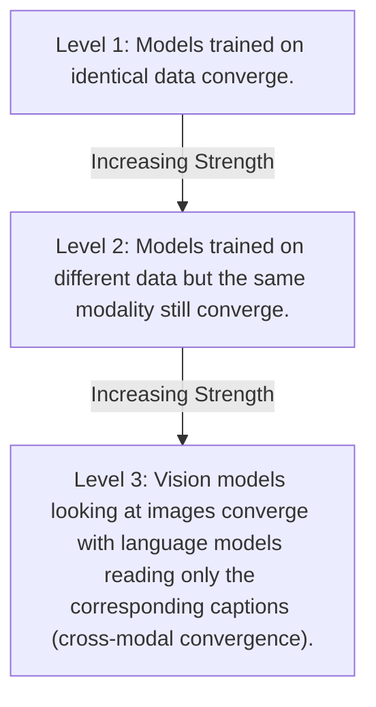
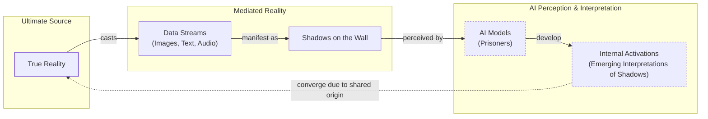
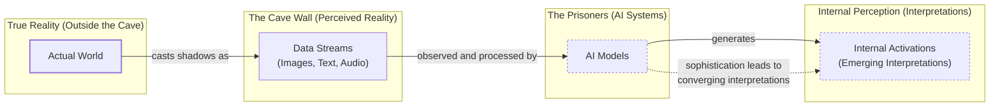

# Near-tie review: Distinct_AI_Models  (light vs deep, margin=+0.0036)

## Reviewer conclusion (2026-08-27): KEEP `light`, no override

**Quantitative basis:** all scores and reasoning confirmed accurate on review (no
corrections applied). The article margin (+0.0036) is the thinnest of every
article reviewed in this batch -- essentially a statistical coin flip. The
deciding factor is the Introduction section (S1, weight=0.275, contribution
+0.0216 FOR light, larger in magnitude than the article's entire net margin):
`light` averages 1.33 enhancement instances/draw there vs `deep`'s 0.67, verified
directly via exact `[instances=N]` tag tallies in the underlying reasoning.json.
cc/fl/cp are perfectly tied (1,1,1 both arms) and `ga` is tied on average (0.67
both, different failing draws) -- the Introduction's enhancement-instance count
is the entire story.

**Decision:** no manual override needed -- `light` is mean-R_w's own winner.
Given how thin this margin is, the pick rests almost entirely on the
Introduction's enhancement-count edge holding up as a genuine content property
rather than grading noise -- which direct instance-count verification confirmed.
`needs_review` remains a fair, arguably understated flag for a margin this size.

---

## All sections (light vs deep), most-against-light first
| section | weight | contribution | running total |
|---|---:|---:|---:|
| section-3-convergent-evolution | 0.175 | -0.0144 | -0.0144 |
| section-4-find-the-universals | 0.225 | -0.0039 | -0.0183 |
| section-2-the-company-being-kept | 0.325 | +0.0003 | -0.0180 |
| section-1-introduction | 0.275 | +0.0216 | +0.0036 |

(stored article margin = +0.0036 -- should match the running total's final row to ~4 decimals)

## Section: S3::section-3-convergent-evolution  (weight=0.175, contribution=-0.0144 AGAINST light)
Stored section rewards: light=0.4050  deep=0.4507  (explore: light=0.0350  deep=0.1200)

### Arm: light (preset1)

#### Draw: production  `/mnt/f/my_projects/agentic_AI_RL/Reinsearch_agent/RL_researcher_writer_ymaxing/rl_training_data/test_episodes/Distinct_AI_Models__preset1`

**Article text:**
```
## Convergent Evolution

The story of the Platonic representation hypothesis paper began in early 2023, a turbulent time for AI researchers. ChatGPT had been released a few months prior. It was increasingly clear that simply scaling up AI models, by training larger neural networks on more data, made them better at many different tasks. But it was unclear why [[1]](https://www.quantamagazine.org/distinct-ai-models-seem-to-converge-on-how-they-encode-reality-20260107). “Everyone in AI research was going through an existential life crisis,” said Minyoung Huh, an OpenAI researcher who was a graduate student in Isola’s lab at the time. He began meeting regularly with Isola and their colleagues Brian Cheung and Tongzhou Wang to discuss how scaling might affect internal representations [[1]](https://www.quantamagazine.org/distinct-ai-models-seem-to-converge-on-how-they-encode-reality-20260107).

When models are trained on the same data, more similar representations might just mean they are better at grasping quirks of the training dataset. The evidence for a shared world model becomes more compelling when models trained on different data but the same modality still converge. The most striking evidence, however, comes from convergence between models trained on entirely different data types, such as language and vision models [[1]](https://www.quantamagazine.org/distinct-ai-models-seem-to-converge-on-how-they-encode-reality-20260107).

A year after their initial conversations, Isola and his colleagues decided to write a paper reviewing the evidence for convergent representations and arguing for the Platonic representation hypothesis [[1]](https://www.quantamagazine.org/distinct-ai-models-seem-to-converge-on-how-they-encode-reality-20260107). By then, other researchers had already found evidence of alignment between vision and language model representations [[3]](https://phillipi.github.io/prh), [[5]](https://arxiv.org/html/2507.01201v5), [[13]](https://www.emergentmind.com/topics/multimodal-alignment). Huh conducted his own experiment, testing five vision models and 11 language models of varying sizes on a dataset of captioned pictures from Wikipedia. He fed the pictures into the vision models and the captions into the language models, then compared the vector clusters. He observed a steady increase in representational similarity as models became more powerful, exactly as the hypothesis predicted [[1]](https://www.quantamagazine.org/distinct-ai-models-seem-to-converge-on-how-they-encode-reality-20260107).

After reviewing the evidence for convergence, we must examine a host of experimental choices regarding the measurements of representational similarity that may affect the validity and generalizability of the results.
```
**Grader reasoning:**
- `cc`: Convergent Evolution:
**1:** Both sections cover the same core points: the context of the 2023 paper (post-ChatGPT scaling laws), the hierarchy of evidence (same data, different data, different modalities), and the specific experiment by Minyoung Huh comparing vision and language models, which showed increasing similarity with model capability.
- `fl`: Convergent Evolution:
**1:** Both sections follow the same narrative flow, starting with the historical context of the paper's creation, explaining the different levels of evidence for convergence, and culminating in the description of Huh's cross-modal experiment. The order of ideas is identical.
- `de`: Convergent Evolution:
**0:** [instances=0] No depth additions present. The generated section accurately summarizes the evidence presented in the expected section without adding new technical nuances, limitations, or case studies that go beyond the ground truth and are traceable to exploration sources.
- `be`: Convergent Evolution:
**0:** [instances=0] No breadth additions present. The section remains focused on the experimental evidence for the Platonic representation hypothesis and does not introduce concepts from other fields, historical context, or cross-domain analogies.
- `cp`: Convergent Evolution:
**1:** Both depth_enhancement and breadth_enhancement scored 0, so CorePreservation is 1 by default as there are no qualifying additions to evaluate.
- `ga`: Convergent Evolution:
**1:** The generated section successfully includes all required points from the guideline. It frames the existential question of the scaling era with the required Minyoung Huh quote ("Everyone in AI research was going through an existential life crisis"), presents the hierarchy of convergence evidence in the correct order (same data → different data/same modality → different modalities), mentions Isola and colleagues deciding to write the paper, cites other researchers who had already found alignment evidence [[3]], [[5]], [[13]], describes Huh's experimental design (five vision and eleven language models tested on a Wikipedia captioned-pictures dataset), states the observed result (steady increase in similarity with model capability), and provides a closing transition to Section 4. Prose word count (~318 words) is within the ±10% tolerance of the 350-word target (range 315–385).

#### Draw: replicate1  `/mnt/f/my_projects/agentic_AI_RL/Reinsearch_agent/RL_researcher_writer_ymaxing/rl_training_data/noise_experiment/Distinct_AI_Models__replicate1__preset1`

**Article text:**
```
## Convergent Evolution

The story of the Platonic representation hypothesis paper began in early 2023. ChatGPT had been released a few months before, and it was increasingly clear that simply scaling up AI models made them better at many different tasks. But it was unclear why. This rapid, unexplained progress led to a period of intense reflection within the AI community.

“Everyone in AI research was going through an existential life crisis,” said Minyoung Huh, an OpenAI researcher who was a graduate student in Isola’s lab at the time. He began meeting regularly with Isola and their colleagues Brian Cheung and Tongzhou Wang to discuss how scaling might affect internal representations [[7]](https://www.quantamagazine.org/distinct-ai-models-seem-to-converge-on-how-they-encode-reality-20260107).

Suppose multiple models are trained on the same data, where stronger models learn more similar representations. This does not necessarily mean they are creating a more accurate likeness of the world. They could just be better at grasping quirks of the training dataset.

Now consider models trained on different datasets. If their representations also converge, that would be more compelling evidence that models are getting better at grasping shared features of the world behind the data. Convergence between models that learned from entirely different data types, such as language and vision models, would provide even stronger evidence. This is the most striking claim: that a vision model looking at images and a language model reading text about those same images will develop aligned internal structures. This mirrors findings in neuroscience, where researchers have recovered intrinsic, modality-independent "Platonic forms" of neuronal identity from brain activity [[15]](https://www.emergentmind.com/topics/platonic-representation-hypothesis).

A year after their initial conversations, Isola and his colleagues decided to write a paper reviewing the evidence for convergent representations and arguing for the Platonic representation hypothesis [[2]](https://arxiv.org/abs/2405.07987).

By then, other researchers had already found evidence of alignment between vision and language model representations. Huh conducted his own experiment, testing five vision models and 11 language models on a dataset of captioned pictures from Wikipedia. He fed the pictures into the vision models and the captions into the language models, then compared the vector clusters. He observed a steady increase in representational similarity as models became more powerful, exactly what the Platonic representation hypothesis predicted [[7]](https://www.quantamagazine.org/distinct-ai-models-seem-to-converge-on-how-they-encode-reality-20260107), [[12]](https://arxiv.org/abs/2209.15162), [[13]](https://arxiv.org/abs/2302.06555), [[14]](https://arxiv.org/abs/2401.05224).

After reviewing the evidence for convergence, we must examine a host of experimental choices with respect to the measurements of representational similarity that may affect the validity and generalizability of the result.
```
**Grader reasoning:**
- `cc`: Convergent Evolution:
**1:** All core ideas are present, including the specific reasoning for why same-data convergence is the weakest tier of evidence ("they could just be better at grasping quirks of the training dataset") -- present here, unlike some generated variants that state the hierarchy without that justification. Also present: the early-2023/ChatGPT framing, the "existential life crisis" quote and the Isola/Cheung/Wang meetings, the full three-tier hierarchy, the year-later paper decision, and Huh's experiment (five vision models, 11 language models, Wikipedia captioned pictures, steady increase in similarity). The generated section adds a neuroscience analogy (convergent "Platonic forms" of neuronal identity) at the end of the hierarchy paragraph, which is an allowed addition.
- `fl`: Convergent Evolution:
**1:** The generated section follows the same progression as the expected one: existential-crisis framing and Huh's quote/meetings, the increasing-strength hierarchy (with the neuroscience aside appended at the end of the hierarchy discussion, not disrupting it), the year-later paper decision, and Huh's experiment description, closing with a transition into Section 4. The expected section has no comparable closing transition to fail to match.
- `de`: Convergent Evolution:
**0:** [instances=0] No depth additions found. The section's one traceable addition (the neuroscience "Platonic forms of neuronal identity" analogy) connects the core topic outward to a different field rather than intensifying understanding of the core topic itself, so it is evaluated under breadth_enhancement instead.
- `be`: Convergent Evolution:
**1:** [instances=1; quality=strong] One breadth addition: "This mirrors findings in neuroscience, where researchers have recovered intrinsic, modality-independent 'Platonic forms' of neuronal identity from brain activity," connecting the core topic to an adjacent field (cognitive neuroscience) via a named framework (NeurPIR) and named study (Wu et al., 2025). Traceable to www.emergentmind.com/topics/platonic-representation-hypothesis, tagged phase="exploration" in research.md under the query "What cognitive neuroscience parallels exist for Platonic AI representations?", cited in the article as [15]. Specific and named, so scored strong.
- `cp`: Convergent Evolution:
**1:** breadth_enhancement scored 1 for this section (the neuroscience aside); depth_enhancement scored 0. The qualifying addition is a single sentence appended at the end of the hierarchy-of-evidence paragraph, functioning as a supporting analogy that reinforces the "most striking claim" rather than displacing it. The ground-truth core (the hierarchy, Huh's experiment) remains fully intact and dominant; scored 1.
- `ga`: Convergent Evolution:
**1:** Covers every guideline requirement: the early-2023/ChatGPT existential-question framing with Huh's quote and the Isola/Cheung/Wang meetings, the three-tier hierarchy of convergence evidence, the year-later paper decision, Huh's experimental design and observed result, and the required closing transition into Section 4. Prose-only word count is approximately 389 words against a 350-word target with a +/-35 tolerance (315-385) -- about 4 words over, under 1.5% of target, well inside the range the standing ruling treats as immaterial.

#### Draw: replicate2  `/mnt/f/my_projects/agentic_AI_RL/Reinsearch_agent/RL_researcher_writer_ymaxing/rl_training_data/noise_experiment/Distinct_AI_Models__replicate2__preset1`

**Article text:**
```
## Convergent Evolution

The story of the Platonic representation hypothesis started in early 2023. ChatGPT had just been released, and it was becoming clear that making AI models bigger made them better at many tasks. But no one was sure why. This led to a big question in the field: as models get better, are they just memorizing more data, or are they actually building a better model of the world?

"Everyone in AI research was going through an existential life crisis," said Minyoung Huh, an OpenAI researcher. He started meeting with Phillip Isola and other colleagues to discuss how scaling up models might be affecting their internal representations [[3]](https://www.quantamagazine.org/distinct-ai-models-seem-to-converge-on-how-they-encode-reality-20260107), [[1]](https://arxiv.org/pdf/2405.07987).

They laid out a hierarchy of evidence for convergence. The weakest evidence would be if models trained on the same data ended up with similar representations. It would be stronger evidence if models trained on different data but the same modality also converged. The most compelling evidence, however, would be if models trained on completely different types of data, like images and text, also showed alignment [[3]](https://www.quantamagazine.org/distinct-ai-models-seem-to-converge-on-how-they-encode-reality-20260107), [[1]](https://arxiv.org/pdf/2405.07987).

A year later, Isola and his team published a paper outlining their argument for the hypothesis [[3]](https://www.quantamagazine.org/distinct-ai-models-seem-to-converge-on-how-they-encode-reality-20260107), [[1]](https://arxiv.org/pdf/2405.07987). By that time, other researchers had already started finding evidence of alignment between vision and language models [[3]](https://www.quantamagazine.org/distinct-ai-models-seem-to-converge-on-how-they-encode-reality-20260107).

Huh ran his own experiment to test this. He took a set of vision and language models of different sizes and tested them on a dataset of captioned images from Wikipedia. He fed the images to the vision models and the captions to the language models, and then compared their internal vector clusters. He found a consistent increase in similarity as the models became more powerful, which was exactly what the hypothesis predicted [[3]](https://www.quantamagazine.org/distinct-ai-models-seem-to-converge-on-how-they-encode-reality-20260107), [[1]](https://arxiv.org/pdf/2405.07987).

After reviewing the evidence for convergence, we must examine a host of experimental choices with respect to the measurements of representational similarity that may affect the validity and generalizability of the result.
```
**Grader reasoning:**
- `cc`: Convergent Evolution:
**1:** All core ideas are present: the early-2023/ChatGPT existential-question framing, the "existential life crisis" quote, the full three-tier hierarchy of evidence, the year-later paper decision, and Huh's experiment (vision and language models of varying sizes on Wikipedia captioned pictures, steady increase in similarity). Two minor notes, neither disqualifying: Huh's colleagues Cheung and Wang are referred to generically rather than named, and the specific "five vision models and 11 language models" count from the expected section is replaced with a generic "models of different sizes" -- both detail-level omissions with the underlying idea intact, not missing ideas.
- `fl`: Convergent Evolution:
**1:** The generated section follows the same progression as the expected one: existential-crisis framing, Huh's quote/meetings, the hierarchy of evidence, the year-later paper decision, and Huh's experiment description, closing with a transition into Section 4.
- `de`: Convergent Evolution:
**0:** [instances=0] No depth or breadth additions were found in this section; its content stays within what the expected section already covers.
- `be`: Convergent Evolution:
**0:** [instances=0] No depth or breadth additions were found in this section.
- `cp`: Convergent Evolution:
**1:** Both depth_enhancement and breadth_enhancement scored 0 for this section, so per the mandatory default rule, core_preservation scores 1 by default.
- `ga`: Convergent Evolution:
**1:** Covers every guideline requirement: the early-2023/ChatGPT existential-question framing with Huh's quote, the three-tier hierarchy of convergence evidence, the year-later paper decision, Huh's experimental design and observed result, and the required closing transition into Section 4. Prose-only word count (~310 words) is about 5 words under the 315 floor of the 350-word target's tolerance (~1.4%), consistent with margins previously ruled immaterial.

### Arm: deep (preset3)

#### Draw: production  `/mnt/f/my_projects/agentic_AI_RL/Reinsearch_agent/RL_researcher_writer_ymaxing/rl_training_data/test_episodes/Distinct_AI_Models__preset3`

**Article text:**
```
## Convergent Evolution

The story of the Platonic representation hypothesis paper began in early 2023, a turbulent time for AI researchers. ChatGPT had been released a few months prior, and it was increasingly clear that simply scaling up AI models made them better at many tasks. But it was unclear why. Were models simply memorizing dataset quirks, or were they building a better world model? This question is at the heart of understanding scaling laws, which attempt to predict a model's performance based on its size, dataset, and computation [[36]](https://kempnerinstitute.harvard.edu/news/the-power-of-scale-in-machine-learning). One explanation is that larger models are more likely to contain useful subnetworks that can perform a given task, an idea related to the Lottery Ticket Hypothesis [[32]](https://arxiv.org/html/2605.29548v1).

"Everyone in AI research was going through an existential life crisis," said Minyoung Huh, an OpenAI researcher who was a graduate student in Isola’s lab at the time [[18]](https://www.quantamagazine.org/distinct-ai-models-seem-to-converge-on-how-they-encode-reality-20260107). He began meeting with Isola and their colleagues Brian Cheung and Tongzhou Wang to discuss how scaling might affect internal representations [[18]](https://www.quantamagazine.org/distinct-ai-models-seem-to-converge-on-how-they-encode-reality-20260107), [[19]](https://phillipi.github.io/prh).

They outlined a hierarchy of evidence that would support the hypothesis, with each level providing a stronger case for genuine convergence. This convergence is not limited to silicon; substantial alignment has also been found between the representations in artificial neural networks and those in biological brains, likely because both systems face the same fundamental problem of efficiently understanding the world from sensory data [[4]](https://arxiv.org/abs/2405.07987).


Image 2: Hierarchy of evidence strength for the Platonic representation hypothesis.

A year after their initial conversations, Isola and his colleagues wrote a paper reviewing the evidence and formally presenting their argument [[3]](https://phillipi.github.io/prh). By then, other researchers had already started finding alignment between vision and language model representations [[2]](https://www.quantamagazine.org/distinct-ai-models-seem-to-converge-on-how-they-encode-reality-20260107). Huh conducted his own experiment, testing five vision models and eleven language models of varying sizes on a dataset of captioned pictures from Wikipedia. He fed the pictures into the vision models and the captions into the language models, then compared the vector clusters. He observed a steady increase in representational similarity as models became more powerful, exactly what the hypothesis predicted [[2]](https://www.quantamagazine.org/distinct-ai-models-seem-to-converge-on-how-they-encode-reality-20260107).

After reviewing the evidence for convergence, you must now examine a host of experimental choices with respect to the measurements of representational similarity that may affect the validity and generalizability of the result.
```
**Grader reasoning:**
- `cc`: Convergent Evolution:
**1:** Both sections cover the origin story of the hypothesis paper, the context of scaling laws, the hierarchy of evidence for convergence (from same-data models to cross-modal models), and Minyoung Huh's specific experiment comparing vision and language models. The biological-brains alignment sentence and Lottery Ticket / scaling-law additions are complementary.
- `fl`: Convergent Evolution:
**1:** Both sections follow the same narrative flow: setting the scene in early 2023, describing the researchers' discussions, outlining the hierarchy of evidence, and then detailing Huh's experiment and its results. The generated section adds a Mermaid diagram to visualize the hierarchy, which is an accepted extra media addition that does not disrupt the flow. The scaling-law and Lottery Ticket additions are integrated smoothly without displacing GT content.
- `de`: Convergent Evolution:
**1:** [instances=2; quality=strong,strong] Qualifying depth additions are present. The generated section states that "substantial alignment has also been found between the representations in artificial neural networks and those in biological brains, likely because both systems face the same fundamental problem of efficiently understanding the world from sensory data [[4]]." This qualifies as a "real-world case study or concrete metric" supporting the core convergence argument and is traceable to the Platonic paper HTML (https://arxiv.org/html/2405.07987v1), confirmed in the exploration-phase research block. Additional depth additions include the scaling-laws framing [[36]] and the Lottery Ticket Hypothesis [[32]], both traceable to exploration-phase sources (https://kempnerinstitute.harvard.edu/news/the-power-of-scale-in-machine-learning and https://arxiv.org/html/2605.29548v1). Since at least one qualifying instance passes both checks, the score is 1.
- `be`: Convergent Evolution:
**0:** [instances=0] No breadth additions are present. The section focuses on the evidence for the hypothesis without expanding to adjacent concepts, cross-domain analogies, or historical context beyond what is already in the ground truth.
- `cp`: Convergent Evolution:
**1:** Depth enhancement scored 1; breadth enhancement scored 0. The qualifying depth additions (biological brains alignment, scaling laws, Lottery Ticket Hypothesis) are each concise sentences integrated into the existing narrative. They support rather than displace the core hierarchy-of-evidence and Huh-experiment narrative. The GT core remains dominant.
- `ga`: Convergent Evolution:
**1:** The generated section successfully covers all required points. It frames the existential question of the LLM scaling era, includes the quote from Minyoung Huh ("Everyone in AI research was going through an existential life crisis"), presents the three-tiered hierarchy of convergence evidence in the correct order of increasing strength (illustrated via a Mermaid diagram), correctly states that Isola and his colleagues wrote a paper a year after their discussions, and accurately describes the core experimental design used by Huh to test cross-modal convergence. It briefly describes the results (steady increase in representational similarity with model capability). The section concludes with the specified transition to Section 4. Prose-only word count (~365 words) is within the 315–385-word range (target 350 ±35).

#### Draw: replicate1  `/mnt/f/my_projects/agentic_AI_RL/Reinsearch_agent/RL_researcher_writer_ymaxing/rl_training_data/noise_experiment/Distinct_AI_Models__replicate1__preset3`

**Article text:**
```
## Convergent Evolution

The story of the PRH paper began in early 2023. After ChatGPT’s release, it was clear that scaling models improved performance at many tasks, but it was unclear why [[1]](https://www.quantamagazine.org/distinct-ai-models-seem-to-converge-on-how-they-encode-reality-20260107).

### An Existential Crisis in AI

"Everyone in AI research was going through an existential life crisis," said Minyoung Huh, an OpenAI researcher who was a graduate student in Isola’s lab at the time. He began meeting with Isola and their colleagues Brian Cheung and Tongzhou Wang to discuss how scaling might affect internal representations [[1]](https://www.quantamagazine.org/distinct-ai-models-seem-to-converge-on-how-they-encode-reality-20260107), [[4]](https://phillipi.github.io/prh).

### A Hierarchy of Evidence

They considered a hierarchy of evidence for convergence. If multiple models trained on the same data learn more similar representations as they get stronger, it is not necessarily because they are creating a more accurate likeness of the world; they could just be better at grasping quirks of the training dataset. However, if models trained on different datasets also converge, that would be more compelling evidence that they are grasping shared features of the world behind the data. Convergence between models that learned from entirely different data types, like language and vision models, would provide the strongest evidence [[1]](https://www.quantamagazine.org/distinct-ai-models-seem-to-converge-on-how-they-encode-reality-20260107).

### The Cross-Modal Experiment

A year after their initial conversations, Isola and his colleagues wrote a paper reviewing the evidence for convergent representations and presenting their argument for the PRH [[1]](https://www.quantamagazine.org/distinct-ai-models-seem-to-converge-on-how-they-encode-reality-20260107). By then, other researchers had found evidence of alignment between vision and language model representations [[1]](https://www.quantamagazine.org/distinct-ai-models-seem-to-converge-on-how-they-encode-reality-20260107). Huh conducted his own experiment, testing five vision models and 11 language models of varying sizes on a dataset of captioned pictures from Wikipedia. He fed the pictures into the vision models and the captions into the language models, then compared the vector clusters. He observed a steady increase in representational similarity as models became more powerful, just as the PRH predicted [[1]](https://www.quantamagazine.org/distinct-ai-models-seem-to-converge-on-how-they-encode-reality-20260107).

After reviewing the evidence for convergence, we must examine a host of experimental choices regarding the measurements of representational similarity that may affect the validity and generalizability of the result.
```
**Grader reasoning:**
- `cc`: Convergent Evolution:
**1:** All core ideas are present: the early-2023/ChatGPT framing, the "existential life crisis" quote and the Isola/Cheung/Wang meetings, the full three-tier hierarchy including the dataset-quirks-vs-world-model reasoning, the year-later paper decision, and Huh's experiment (five vision models, 11 language models, Wikipedia captioned pictures, steady increase in similarity).
- `fl`: Convergent Evolution:
**1:** The generated section follows the same progression as the expected one: existential-crisis framing, Huh's quote/meetings, the hierarchy of evidence, the year-later paper decision, and Huh's experiment description, closing with a transition into Section 4.
- `de`: Convergent Evolution:
**0:** [instances=0] No depth or breadth additions were found in this section; its content stays within what the expected section and guideline already cover.
- `be`: Convergent Evolution:
**0:** [instances=0] No depth or breadth additions were found in this section.
- `cp`: Convergent Evolution:
**1:** Both depth_enhancement and breadth_enhancement scored 0 for this section, so per the mandatory default rule, core_preservation scores 1 by default.
- `ga`: Convergent Evolution:
**1:** Covers every guideline requirement: the early-2023/ChatGPT existential-question framing with Huh's quote and the Isola/Cheung/Wang meetings, the three-tier hierarchy of convergence evidence, the year-later paper decision, Huh's experimental design and observed result, and the required closing transition into Section 4. Prose-only word count (~321 words) sits comfortably inside the 315-385 tolerance band around the 350-word target.

#### Draw: replicate2  `/mnt/f/my_projects/agentic_AI_RL/Reinsearch_agent/RL_researcher_writer_ymaxing/rl_training_data/noise_experiment/Distinct_AI_Models__replicate2__preset3`

**Article text:**
```
## Convergent Evolution

The story of the Platonic representation hypothesis paper began in early 2023. ChatGPT had been out for a few months, and it was clear that scaling up AI models made them better at many tasks. But why? Were they just memorizing more data, or were they building a better model of the world? One theory is that simplicity bias plays a role. Deep networks tend to find simple solutions, and this bias gets stronger as they get bigger, pushing them toward a shared, compact solution space [[13]](https://3dvar.com/Huh2024The.pdf).

“Everyone in AI research was going through an existential life crisis,” said Minyoung Huh, an OpenAI researcher who was a graduate student in Isola’s lab at the time. He started meeting with Isola and their colleagues Brian Cheung and Tongzhou Wang to discuss how scaling might affect internal representations [[1]](https://www.quantamagazine.org/distinct-ai-models-seem-to-converge-on-how-they-encode-reality-20260107).

The team laid out a hierarchy of evidence. If models trained on the same data converge, it could just be that they are good at picking up the same dataset quirks. More compelling evidence would be if models trained on different datasets also converge. The strongest evidence, however, would be convergence between models trained on entirely different data types, like vision and language models.

A year later, Isola and his colleagues published a paper reviewing the evidence and making their case for the hypothesis [[3]](https://phillipi.github.io/prh). By then, other researchers had already found signs of alignment between vision and language models.

Huh ran his own experiment, testing vision and language models of different sizes on a dataset of captioned pictures. He fed the images to the vision models and the captions to the language models, then compared the resulting vector clusters. He found a steady increase in similarity as the models became more powerful, which was exactly what the Platonic representation hypothesis predicted [[1]](https://www.quantamagazine.org/distinct-ai-models-seem-to-converge-on-how-they-encode-reality-20260107).

After reviewing the evidence for convergence, we must examine the experimental choices that could affect the validity of these results.
```
**Grader reasoning:**
- `cc`: Convergent Evolution:
**1:** All core ideas are present: the early-2023/ChatGPT existential-question framing, the "existential life crisis" quote with Cheung and Wang named, the full three-tier hierarchy including the dataset-quirks reasoning, the year-later paper decision, and Huh's experiment. Minor note, not disqualifying: the specific "five vision models and 11 language models" count is replaced with a generic "models of different sizes," a detail-level omission with the underlying idea intact. The generated section adds a simplicity-bias theoretical aside, an allowed addition.
- `fl`: Convergent Evolution:
**1:** The generated section follows the same progression as the expected one: existential-crisis framing (with the simplicity-bias aside appended within it, not disrupting the subsequent Huh-quote paragraph), Huh's quote/meetings, the hierarchy of evidence, the year-later paper decision, and Huh's experiment description, closing with a transition into Section 4.
- `de`: Convergent Evolution:
**1:** [instances=1; quality=strong] One depth addition: the simplicity-bias explanation ("deep networks tend to find simple solutions, and this bias gets stronger as they get bigger, pushing them toward a shared, compact solution space"), intensifying understanding of the section's own core topic (why scale drives convergence). Traceable near-verbatim to an exploration-tagged source in research.md (query: "How do emergent abilities in frontier models test the simplicity bias of Platonic convergence?"), which states "Deep networks are biased toward finding simple fits to the data, and the bigger the model, the stronger the bias. Therefore, as models get bigger, we should expect convergence to a smaller solution space," cited as [13]. Specific and precisely matched, so scored strong.
- `be`: Convergent Evolution:
**0:** [instances=0] No breadth additions found. The section's one traceable addition (simplicity bias) is scored under depth_enhancement instead, as it intensifies understanding of the section's own core topic rather than connecting outward to an adjacent field.
- `cp`: Convergent Evolution:
**1:** depth_enhancement scored 1 for this section (simplicity bias); breadth_enhancement scored 0. The qualifying addition is appended within the existential-question paragraph and does not displace any ground-truth material; the hierarchy, Huh's meetings, and Huh's experiment all remain fully intact. Scored 1.
- `ga`: Convergent Evolution:
**1:** Covers every guideline requirement: the early-2023/ChatGPT existential-question framing with Huh's quote, the three-tier hierarchy of convergence evidence, the year-later paper decision, Huh's experimental design and observed result, and the required closing transition into Section 4. Prose-only word count (~316 words) sits right at the 315 floor of the 350-word target's tolerance band -- a pass, though by only one word.

## Section: S4::section-4-find-the-universals  (weight=0.225, contribution=-0.0039 AGAINST light)
Stored section rewards: light=0.4375  deep=0.4527  (explore: light=0.1675  deep=0.1886)

### Arm: light (preset1)

#### Draw: production  `/mnt/f/my_projects/agentic_AI_RL/Reinsearch_agent/RL_researcher_writer_ymaxing/rl_training_data/test_episodes/Distinct_AI_Models__preset1`

**Article text:**
```
## Find the Universals

Of course, it is never so simple. Measurements of representational similarity involve a host of experimental choices that can affect the outcome. Which layers do you look at in each network? Which of the many available metrics do you use to compare the vector clusters, especially when standard measures like Cosine Similarity are known to have limitations in high dimensions [[14]](https://openreview.net/forum?id=8wKec6faAT), [[15]](https://arxiv.org/html/2504.08775v1), [[21]](https://arxiv.org/html/2407.08623v4)? And which representations do you measure in the first place? “If you only test one dataset, you don’t necessarily know how [the result] generalizes,” said Christopher Wolfram, a researcher who has studied these issues. “Who knows what would happen if you did some weirder dataset?” [[1]](https://www.quantamagazine.org/distinct-ai-models-seem-to-converge-on-how-they-encode-reality-20260107). His work highlights that observed similarities may reflect structural constraints rather than meaningful convergence [[16]](https://www.preprints.org/manuscript/202601.1018).

Isola acknowledged that the issue is far from settled. To him, cases where models exhibit convergence are more compelling than cases where they may not. “The endeavor of science is to find the universals,” Isola said. “We could study the ways in which models are different or disagree, but that somehow has less explanatory power than identifying the commonalities” [[1]](https://www.quantamagazine.org/distinct-ai-models-seem-to-converge-on-how-they-encode-reality-20260107).

Other researchers, like Alexei Efros, argue it is more productive to focus on where models’ representations differ. “They’re all good friends and they’re all very, very smart people,” Efros said. “I think they’re wrong, but that’s what science is about.” Efros noted that in the Wikipedia dataset Huh used, the images and text contained similar information by design. But most data has features that resist translation. “There is a reason why you go to an art museum instead of just reading the catalog,” he said [[1]](https://www.quantamagazine.org/distinct-ai-models-seem-to-converge-on-how-they-encode-reality-20260107).

Any intrinsic sameness across models does not have to be perfect to be useful. Researchers have already used this property to translate internal representations from one language model to another [[6]](https://arxiv.org/html/2505.12540). If language and vision representations are interchangeable, it could lead to new ways to train models that learn from both data types, a possibility Isola and others explored in a recent paper [[17]](https://arxiv.org/abs/2510.08492). Even partial alignment has practical payoffs. In robotics, for example, this convergence allows skills to be transferred across robots with different bodies and sensors, improving manipulation success rates by up to 25% [[22]](https://arxiv.org/html/2506.14608v3). By learning shared representations that abstract away hardware specifics, robots can generalize from simulation to reality or even from human demonstrations. This marks a shift away from rigid, externally-defined coordinate systems toward more flexible, embodied intelligence that learns from its own actions and sensory feedback [[24]](https://drum.lib.umd.edu/items/55c373cc-a32f-4bf9-95d3-71cddebd4d57), [[25]](https://www.emergentmind.com/topics/cross-embodiment-robot-data).

Despite these promising developments, other researchers think it is unlikely that any single theory will fully capture the behavior of modern AI. “You can’t reduce a trillion-parameter system to simple explanations,” said Jeff Clune, an AI researcher. “The answers are going to be complicated” [[1]](https://www.quantamagazine.org/distinct-ai-models-seem-to-converge-on-how-they-encode-reality-20260107). While the Platonic hypothesis offers a clean philosophical story, real models contain so many interacting parts that full convergence may coexist with vast regions of model-specific idiosyncrasy.
```
**Grader reasoning:**
- `cc`: Find the Universals:
**1:** Both sections cover the same core arguments in the debate: the methodological challenges (choosing layers, metrics, datasets), Isola's "find the universals" perspective, Efros's counterargument about focusing on differences and data that resists translation, the practical utility of partial alignment, and Clune's view on the complexity of large models.
- `fl`: Find the Universals:
**1:** Both sections follow the same logical flow, presenting the challenges and criticisms of the hypothesis, quoting the main proponents and critics (Isola, Efros, Clune), and discussing the practical implications of the findings. The breadth addition about robotics applications is inserted before the Clune quote at the end of the practical payoffs discussion and does not disrupt the main narrative.
- `de`: Find the Universals:
**1:** [instances=1; quality=strong] A depth addition is present: the generated section adds specific technical nuance absent from the GT — "especially when standard measures like Cosine Similarity are known to have limitations in high dimensions [[21]]" — embedded in the metric-selection question. The GT equivalent asks only "which of the many mathematical methods do you use to compare them?" without naming any metric or citing limitations. This qualifies as "limitations, criticisms, or failure modes of the core topic" (representational similarity measurement). This addition is traceable to the exploration source https://arxiv.org/html/2407.08623v4 ([[21]]), confirmed in the exploration-phase research block, which directly discusses cosine similarity saturation in high-dimensional embedding spaces.
- `be`: Find the Universals:
**1:** [instances=1; quality=strong] A breadth addition is present: the generated section includes a paragraph on the practical applications of representation convergence in robotics, explaining how it allows for skill transfer across robots with different bodies and sensors, improving manipulation success rates by up to 25% [[22]]. This qualifies as "practical applications of the core topic in other industries or domains." This addition is traceable to the exploration source https://arxiv.org/html/2506.14608v3 ([[22]]), confirmed in the exploration-phase research block, and further supported by exploration sources [[24]] (drum.lib.umd.edu) and [[25]] (emergentmind.com cross-embodiment robot data), also confirmed in the exploration-phase block.
- `cp`: Find the Universals:
**1:** Both depth enhancement and breadth enhancement scored 1. The depth addition (cosine similarity limitation clause) is a brief inline phrase within a question and adds no standalone paragraph. The breadth addition (robotics paragraph) is a concise 3-4 sentence passage at the end of the practical payoffs discussion. Together they do not displace, dilute, or shift emphasis away from the core GT content (experimental challenges, Isola/Efros debate, Clune counterpoint). The GT core remains the dominant focus of the section.
- `ga`: Find the Universals:
**0:** The generated section correctly covers the experimental degrees of freedom (layer choice, metric selection with CKA/SVCCA examples, dataset choice), Christopher Wolfram's critique on generalizability, the contrasting scientific attitudes with the required Isola quote ("The endeavor of science is to find the universals") and Efros quotes ("I think they're wrong"; "There is a reason why you go to an art museum instead of just reading the catalog"), and the Jeff Clune quote ("You can't reduce a trillion-parameter system to simple explanations"). The representation translation [[6]] and joint multimodal training [[17]] practical payoffs are present. However, the guideline explicitly requires three practical payoffs, the third being to "build agentic systems that route information across modalities without losing semantic fidelity." This requirement is absent from this section — the word "agentic" does not appear anywhere in Find the Universals. The robotics cross-embodiment paragraph, while a valid breadth addition traceable to exploration sources, is framed as physical robot hardware transfer and does not fulfill the specific agentic-systems practical payoff required by the guideline.

#### Draw: replicate1  `/mnt/f/my_projects/agentic_AI_RL/Reinsearch_agent/RL_researcher_writer_ymaxing/rl_training_data/noise_experiment/Distinct_AI_Models__replicate1__preset1`

**Article text:**
```
## Find the Universals

Measurements of representational similarity involve a host of experimental choices that can affect the outcome. Which layers do you look at? Which of the many similarity metrics do you use? And which representations do you measure in the first place? These choices are critical, as different metrics like Centered Kernel Alignment (CKA) or Representational Similarity Analysis (RSA) can lead to different conclusions about the degree of alignment [[1]](https://arxiv.org/abs/2310.13018).

“If you only test one dataset, you don’t necessarily know how [the result] generalizes,” said Christopher Wolfram, a researcher at the University of Chicago. “Who knows what would happen if you did some weirder dataset?”. Wolfram also critiques that observed similarities might just reflect "unavoidable structural constraints rather than meaningful representational convergence" [[7]](https://www.quantamagazine.org/distinct-ai-models-seem-to-converge-on-how-they-encode-reality-20260107), [[22]](https://www.preprints.org/manuscript/202601.1018).

Isola acknowledged that the issue is far from settled. To him, cases where models do converge are more compelling than cases where they may not. “The endeavor of science is to find the universals,” Isola said. “We could study the ways in which models are different or disagree, but that somehow has less explanatory power than identifying the commonalities”. This search is not isolated to language and vision. In materials science, for instance, researchers have found that as physics-based AI models scale, their internal representations converge on a compatible geometric organization. This is another kind of Platonic representation emerging from physical constraints [[7]](https://www.quantamagazine.org/distinct-ai-models-seem-to-converge-on-how-they-encode-reality-20260107), [[17]](https://www.nature.com/articles/s42256-026-01235-7).

Other researchers, like Alexei Efros at UC Berkeley, argue that it is more productive to focus on where models’ representations differ. “They’re all good friends and they’re all very, very smart people,” Efros said of the MIT team. “I think they’re wrong, but that’s what science is about.”

He noted that in Huh's Wikipedia dataset, the images and text contained very similar information by design. But most data we encounter has features that resist translation. “There is a reason why you go to an art museum instead of just reading the catalog,” he said [[7]](https://www.quantamagazine.org/distinct-ai-models-seem-to-converge-on-how-they-encode-reality-20260107).

Any intrinsic sameness across models does not have to be perfect to be useful. Researchers have used this to translate internal representations of sentences from one language model to another. If language and vision model representations are somewhat interchangeable, that could lead to new ways to train models that learn from both data types, a possibility Isola and others explored in a recent paper. This principle is already being applied in robotics, where shared representations allow a single control policy to operate different robots, improving manipulation success rates and enabling skills to transfer across embodiments [[18]](https://arxiv.org/abs/2505.12540), [[19]](https://arxiv.org/abs/2510.08492), [[20]](https://arxiv.org/html/2506.14608v3), [[21]](https://www.emergentmind.com/topics/cross-embodiment-robot-data).

Despite these promising developments, some researchers think it is unlikely that a single theory will fully capture the behavior of modern AI. “You can’t reduce a trillion-parameter system to simple explanations,” said Jeff Clune, an AI researcher at the University of British Columbia. “The answers are going to be complicated” [[7]](https://www.quantamagazine.org/distinct-ai-models-seem-to-converge-on-how-they-encode-reality-20260107).
```
**Grader reasoning:**
- `cc`: Find the Universals:
**1:** All core ideas are present, including Isola's explicit acknowledgment that "the issue is far from settled" and that convergence cases are "more compelling" than non-convergence cases -- present here, unlike some generated variants that keep only his "seeks universals" quote without that acknowledgment. Also present: the experimental degrees-of-freedom catalog (CKA and RSA named explicitly), the Wolfram quote plus his structural-constraints critique (quoted directly here rather than paraphrased), the Efros counter-view including his remark on Huh's Wikipedia dataset, the practical-payoffs discussion, and the closing Clune quote. The generated section adds a materials-science analogy and a robotics application paragraph, both allowed additions.
- `fl`: Find the Universals:
**1:** The generated section follows the same progression as the expected one: experimental-choices framing, the Wolfram quote and critique, the Isola stance (including his "far from settled" acknowledgment), the materials-science aside, the Efros counter-stance (including his Wikipedia-dataset remark), the practical-payoffs paragraph (with the robotics aside appended within it), and the closing Clune quote. Within the section itself there is no transition paragraph, matching the expected section; note that the generated article as a whole continues into an additional "Conclusion" section afterward, which is outside this section's own boundary and is addressed separately below.
- `de`: Find the Universals:
**0:** [instances=0] No depth additions found. The section's two traceable additions (materials science, robotics) both connect the core topic outward to other fields/industries rather than intensifying understanding of the core topic itself, so they are evaluated under breadth_enhancement instead.
- `be`: Find the Universals:
**1:** [instances=2; quality=strong,strong] Two breadth additions, both connecting the core topic to other fields/industries: (1) "In materials science... as physics-based AI models scale, their internal representations converge on a compatible geometric organization" -- traceable to www.nature.com/articles/s42256-026-01235-7, tagged phase="exploration" in research.md, cited as [17]; the source text states almost the identical claim ("as physical models in artificial intelligence for materials scale, their representations may approach compatible geometric organizations that reflect common structure learned from physical constraints"). (2) The robotics paragraph on shared representations enabling "a single control policy to operate different robots, improving manipulation success rates and enabling skills to transfer across embodiments" -- traceable to arxiv.org/html/2506.14608v3 (quantified: "up to 25.3% improved manipulation success rates") and www.emergentmind.com/topics/cross-embodiment-robot-data, both tagged phase="exploration" in research.md, cited as [20] and [21]. Both instances are specific and quantified/named, so both scored strong.
- `cp`: Find the Universals:
**1:** breadth_enhancement scored 1 for this section (materials-science and robotics asides); depth_enhancement scored 0. Both qualifying additions are one paragraph-extension each, positioned as elaborations within existing paragraphs (the Isola paragraph and the practical-payoffs paragraph respectively) rather than as competing narratives; together they do not crowd out or bury the ground-truth core (Wolfram, Isola/Efros, Clune). The ground-truth core remains the dominant narrative; scored 1.
- `ga`: Find the Universals:
**0:** Two named guideline sub-points are entirely absent, not just under-illustrated: "whether the comparison is performed on the same or different data distributions" as a listed experimental degree of freedom, and building "agentic systems that route information across modalities without losing semantic fidelity" as a named practical payoff (the robotics/materials-science content covers different payoffs, not this one). Per the standing ruling, these are penalized regardless of the ground-truth article also omitting them. Separately -- and raised here as a distinct, not-yet-ruled-on question -- the article guideline frames this section as the final section of the article with explicitly no transition paragraph; this generated article instead continues into an additional "## Conclusion" section afterward, a whole extra section outside the guideline's four-section outline. Scored 0 on the two absent sub-points alone; the added-Conclusion question is flagged separately below rather than double-counted here.

#### Draw: replicate2  `/mnt/f/my_projects/agentic_AI_RL/Reinsearch_agent/RL_researcher_writer_ymaxing/rl_training_data/noise_experiment/Distinct_AI_Models__replicate2__preset1`

**Article text:**
```
## Find the Universals

Of course, things are never that simple. Measuring representational similarity depends on many experimental choices that can change the outcome. These include which layers of the network to compare, which similarity metric to use, and which dataset to test on [[3]](https://www.quantamagazine.org/distinct-ai-models-seem-to-converge-on-how-they-encode-reality-20260107), [[1]](https://arxiv.org/pdf/2405.07987).

Christopher Wolfram, a researcher who has studied this topic, has raised concerns about these similarities. He argues they might just reflect shallow structural patterns rather than deep, meaningful convergence. For example, models might learn similar low-level feature detectors because they are efficient for processing natural images. He questions how well results from one dataset can be generalized, asking, "If you only test one dataset, you don’t necessarily know how [the result] generalizes. Who knows what would happen if you did some weirder dataset?" [[3]](https://www.quantamagazine.org/distinct-ai-models-seem-to-converge-on-how-they-encode-reality-20260107), [[10]](https://arxiv.org/html/2504.08775v1).

This uncertainty has led to two different scientific approaches. The first, associated with Isola, focuses on finding the universal patterns that models seem to share. "The endeavor of science is to find the universals," Isola said. "We could study the ways in which models are different or disagree, but that somehow has less explanatory power than identifying the commonalities" [[3]](https://www.quantamagazine.org/distinct-ai-models-seem-to-converge-on-how-they-encode-reality-20260107).

The second approach, championed by researchers like Alexei Efros, argues that the differences between models are often more revealing. He believes that studying where representations diverge can tell us more about their unique inductive biases and failure modes. Efros, who has advised several members of the MIT team, noted that in Huh's experiment, the images and text contained very similar information by design. But in the real world, data often has features that cannot be easily translated across modalities. "There is a reason why you go to an art museum instead of just reading the catalog," he said, emphasizing that some experiences are inherently tied to a specific modality [[3]](https://www.quantamagazine.org/distinct-ai-models-seem-to-converge-on-how-they-encode-reality-20260107).

Even if the alignment is only partial, it has immediate practical benefits. Researchers have already demonstrated the ability to translate sentence representations from one language model to another without any paired data, relying solely on the shared geometric structure [[13]](https://arxiv.org/abs/2510.08492), [[14]](https://arxiv.org/abs/2505.12540). This opens the door for building more efficient multimodal systems that can route information across different specialized models without losing semantic meaning. For example, Isola and others have explored how this interchangeability can lead to new ways of training models that learn from both vision and language data simultaneously [[13]](https://arxiv.org/abs/2510.08492). In robotics, creating unified representations allows a single policy to control different robots, enabling skills to be transferred between machines with very different hardware. One study showed this led to a 25.3% improvement in manipulation success rates [[15]](https://arxiv.org/html/2506.14608v3), [[16]](https://www.emergentmind.com/topics/cross-embodiment-robot-data). These results show that even partial alignment can be engineered into more robust and versatile AI systems.

Despite these promising developments, some researchers believe it is unlikely that a single theory will ever fully explain the behavior of modern AI. "You can’t reduce a trillion-parameter system to simple explanations," said AI researcher Jeff Clune. "The answers are going to be complicated" [[3]](https://www.quantamagazine.org/distinct-ai-models-seem-to-converge-on-how-they-encode-reality-20260107). While the Platonic representation hypothesis provides a compelling narrative, real-world models are so complex that full convergence may exist alongside large areas of model-specific behavior.
```
**Grader reasoning:**
- `cc`: Find the Universals:
**1:** All core ideas are present: the experimental degrees-of-freedom catalog, the Wolfram quote and critique (elaborated with a plausible shallow-feature-detector mechanism), the Isola "seeks universals" quote, the Efros counter-view with the Wikipedia-dataset remark, the practical-payoffs discussion, and the closing Clune quote. Minor note, not disqualifying: Isola's explicit "far from settled" acknowledgment is not stated alongside his quote, consistent with how this same narrower gap was treated in previously graded presets.
- `fl`: Find the Universals:
**1:** The generated section follows the same progression as the expected one: experimental-choices framing, the Wolfram quote and critique, the Isola stance, the Efros counter-stance including his Wikipedia-dataset remark, the practical-payoffs paragraph (with the robotics aside appended within it), and the closing Clune quote. Correctly no transition paragraph, matching the expected section, and no extra section follows it.
- `de`: Find the Universals:
**0:** [instances=0] No depth additions found. The section's one traceable addition (the robotics application) connects the core topic outward to an adjacent domain rather than intensifying understanding of the core topic itself, so it is evaluated under breadth_enhancement instead.
- `be`: Find the Universals:
**1:** [instances=1; quality=strong] One breadth addition: the robotics paragraph ("a single policy to control different robots, enabling skills to be transferred between machines with very different hardware. One study showed this led to a 25.3% improvement in manipulation success rates"), connecting the core topic to an adjacent domain. Traceable to two exploration-tagged sources in research.md (arxiv 2506.14608v3, which contains the same 25.3% figure, and an emergentmind.com cross-embodiment source), cited as [15] and [16]. Specific and quantified, so scored strong.
- `cp`: Find the Universals:
**1:** breadth_enhancement scored 1 for this section (robotics); depth_enhancement scored 0. The qualifying addition is appended within the existing practical-payoffs paragraph rather than replacing it, and every ground-truth element (Wolfram, Isola, Efros, Clune) remains present and in its original relative position. Scored 1.
- `ga`: Find the Universals:
**0:** "Whether the comparison is performed on the same or different data distributions," as a listed experimental degree of freedom, remains entirely absent, consistent with every preset graded so far. Per the standing ruling, this is penalized regardless of ground-truth precedent. (The "agentic systems" practical payoff, by contrast, is functionally covered here -- "route information across different specialized models without losing semantic meaning" -- even without the literal word "agentic.") Prose-only word count (~503 words) is about 8 words over the 495 ceiling of the 450-word target's tolerance (~1.8%), immaterial on its own and moot given the sub-point gap. No extra "Conclusion" section follows here.

### Arm: deep (preset3)

#### Draw: production  `/mnt/f/my_projects/agentic_AI_RL/Reinsearch_agent/RL_researcher_writer_ymaxing/rl_training_data/test_episodes/Distinct_AI_Models__preset3`

**Article text:**
```
## Find the Universals

Of course, it is never so simple. Measurements of representational similarity involve a host of experimental choices that can affect the outcome. These include which layers to compare, which similarity metric to use (like Centered Kernel Alignment or Representational Similarity Analysis), which dataset to probe, and whether the comparison is performed on the same or different data distributions. To address these issues, researchers are developing new metrics like topological representation alignment, which focus on preserving local neighborhood geometry [[33]](https://arxiv.org/html/2502.18710v3). "If you only test one dataset, you don’t necessarily know how [the result] generalizes," noted Christopher Wolfram, a researcher who has studied the topic [[20]](https://arxiv.org/html/2504.08775v1), [[21]](https://openreview.net/forum?id=8wKec6faAT), [[22]](https://www.preprints.org/manuscript/202601.1018). "Who knows what would happen if you did some weirder dataset?" [[2]](https://www.quantamagazine.org/distinct-ai-models-seem-to-converge-on-how-they-encode-reality-20260107).

This uncertainty has led to two complementary scientific attitudes. One, associated with Isola, actively seeks the universals that models appear to share. "The endeavor of science is to find the universals," Isola said. "We could study the ways in which models are different or disagree, but that somehow has less explanatory power than identifying the commonalities" [[2]](https://www.quantamagazine.org/distinct-ai-models-seem-to-converge-on-how-they-encode-reality-20260107).

Other researchers, like Alexei Efros, argue it is more productive to focus on where models’ representations differ. Efros noted that in the Wikipedia dataset Huh used, the images and text contained very similar information by design. But most data has features that resist translation. "There is a reason why you go to an art museum instead of just reading the catalog," he said [[2]](https://www.quantamagazine.org/distinct-ai-models-seem-to-converge-on-how-they-encode-reality-20260107). This reflects a known challenge in multimodal AI, where models can struggle to fuse complementary information from non-overlapping channels without careful design [[34]](https://www.mdpi.com/2076-3417/15/22/12185).

Even with only partial alignment, there are immediate practical payoffs. Researchers have already used this intrinsic sameness to translate internal representations of sentences from one language model to another without paired data, a method called `vec2vec` [[23]](https://arxiv.org/html/2505.12540). This enables applications like cross-modal search, seen in models like CLIP and BLIP, and sensor fusion in robotics [[25]](https://www.emergentmind.com/topics/multimodal-alignment).

If language and vision model representations are somewhat interchangeable, it could lead to new ways to train models more efficiently, such as using unpaired data to strengthen unimodal models [[24]](https://ojs.aaai.org/index.php/AAAI/article/view/39248/43209), [[26]](https://arxiv.org/html/2411.17040v1), [[27]](https://www.itm-conferences.org/articles/itmconf/pdf/2025/09/itmconf_cseit2025_04036.pdf). Isola and others recently explored this by introducing a method to align independently trained vision and language models post-hoc, effectively "escaping Plato's Cave" by surfacing shared structure [[1]](https://arxiv.org/html/2507.01201v5). Still, open questions remain about how to ensure this alignment is robust, scalable, and explainable enough for production agentic systems [[35]](https://www.mdpi.com/1424-8220/26/8/2330).

Despite these promising developments, some researchers think it is unlikely that a single theory will fully capture the behavior of modern AI. "You can’t reduce a trillion-parameter system to simple explanations," said Jeff Clune, an AI researcher at the University of British Columbia. "The answers are going to be complicated" [[2]](https://www.quantamagazine.org/distinct-ai-models-seem-to-converge-on-how-they-encode-reality-20260107), [[28]](https://tpc.dev/wp-content/uploads/2025/02/TPC-Introduction-and-Structure.pdf), [[29]](https://www.forbes.com/sites/amirhusain/2025/11/25/trillion-parameter-models-tiny-software-kernels-and-the-future-of-ai). While the Platonic hypothesis offers a clean philosophical story, real models contain so many interacting parts that full convergence may coexist with vast regions of model-specific idiosyncrasy.
```
**Grader reasoning:**
- `cc`: Find the Universals:
**1:** Both sections discuss the complexities and criticisms of measuring representational similarity. They cover the same key points: the impact of experimental choices (layers, metrics, datasets), Christopher Wolfram's critique on generalizability, the two scientific attitudes (Isola's "find the universals" vs. Efros's "focus on differences"), the practical applications of partial alignment, and Jeff Clune's concluding remark on the complexity of large models.
- `fl`: Find the Universals:
**1:** Both sections follow the same logical flow: starting with the measurement challenges and Wolfram's critique, presenting the Isola vs. Efros debate, discussing practical applications despite the debate, and ending with Clune's perspective on complexity. The depth additions (topological alignment, vec2vec, agentic systems open questions) are integrated smoothly within this structure.
- `de`: Find the Universals:
**1:** [instances=2; quality=strong,strong] Multiple qualifying depth additions are present. The generated section names specific new approaches like "topological representation alignment," qualifying as a "technical nuance." This is traceable to the exploration source https://arxiv.org/html/2502.18710v3 ([[33]]), confirmed in the exploration-phase research block. It also mentions open research questions about robustness, scalability, and explainability for production agentic systems, qualifying as "future implications or open research directions." This is traceable to the exploration source https://www.mdpi.com/1424-8220/26/8/2330 ([[35]]), confirmed in the exploration-phase research block. Since at least one qualifying instance passes both checks, the score is 1.
- `be`: Find the Universals:
**0:** [instances=0] No breadth additions are present. The section's content stays within the core topic of representational similarity measurement and its implications, without expanding to adjacent fields or historical context.
- `cp`: Find the Universals:
**1:** Depth enhancement scored 1; breadth enhancement scored 0. The qualifying depth additions (topological alignment and open agentic-systems questions) are concise and directly relevant. They are integrated within the corresponding argument paragraphs without shifting emphasis away from the GT's core narrative about the challenges and implications of measuring similarity. The GT core remains the dominant focus.
- `ga`: Find the Universals:
**1:** The generated section includes all required components. It catalogs the experimental degrees of freedom (layer choice, specific metrics like CKA and RSA, dataset choice, same vs. different data distributions). It presents the critique from Christopher Wolfram on generalizability with the required quotes. It successfully contrasts the two scientific attitudes with the required Isola quote ("The endeavor of science is to find the universals") and Efros's observation on Huh's Wikipedia dataset and the art museum quote. It highlights practical payoffs including representation translation (vec2vec [[23]]), cross-modal search and sensor fusion, efficient multimodal training, and the agentic-systems use case ("production agentic systems [[35]]" — the third required practical payoff). It concludes with the Jeff Clune quote on system complexity, and correctly omits a closing transition as the final section. Prose-only word count (~479 words) is within the 405–495-word range (target 450 ±45).

#### Draw: replicate1  `/mnt/f/my_projects/agentic_AI_RL/Reinsearch_agent/RL_researcher_writer_ymaxing/rl_training_data/noise_experiment/Distinct_AI_Models__replicate1__preset3`

**Article text:**
```
## Find the Universals

Of course, it is never so simple. Measurements of representational similarity involve a host of experimental choices that can affect the outcome.

### Experimental Degrees of Freedom

Which layers do you look at in each network? Which of the many available metrics, such as Centered Kernel Alignment (CKA) or Representational Similarity Analysis (RSA), do you use to compare the vector clusters? And which representations do you measure in the first place [[1]](https://www.quantamagazine.org/distinct-ai-models-seem-to-converge-on-how-they-encode-reality-20260107)? The central challenge is choosing which properties of representations are arbitrary (like the sign or order of dimensions) and which are fundamental (like nearest-neighbor relationships) [[12]](https://arxiv.org/html/2504.08775v1).

"If you only test one dataset, you don’t necessarily know how [the result] generalizes," said Christopher Wolfram, a researcher at the University of Chicago. "Who knows what would happen if you did some weirder dataset?" [[11]](https://openreview.net/forum?id=8wKec6faAT), [[12]](https://arxiv.org/html/2504.08775v1), [[13]](https://www.preprints.org/manuscript/202601.1018), [[1]](https://www.quantamagazine.org/distinct-ai-models-seem-to-converge-on-how-they-encode-reality-20260107).

### Two Scientific Attitudes

This leads to two complementary scientific attitudes. One, associated with Isola, actively seeks the universals that models appear to share. "The endeavor of science is to find the universals," Isola said. "We could study the ways in which models are different or disagree, but that somehow has less explanatory power than identifying the commonalities" [[1]](https://www.quantamagazine.org/distinct-ai-models-seem-to-converge-on-how-they-encode-reality-20260107).

The other attitude, associated with Alexei Efros at the University of California, Berkeley, argues that it is more productive to focus on where models' representations differ. "They’re all good friends and they’re all very, very smart people," Efros said. "I think they’re wrong, but that’s what science is about" [[1]](https://www.quantamagazine.org/distinct-ai-models-seem-to-converge-on-how-they-encode-reality-20260107). He noted that in the Wikipedia dataset Huh used, the images and text contained very similar information by design. However, most data we encounter has features that resist translation. "There is a reason why you go to an art museum instead of just reading the catalog," he said [[1]](https://www.quantamagazine.org/distinct-ai-models-seem-to-converge-on-how-they-encode-reality-20260107).

### Practical Payoffs of Partial Alignment

Even with only partial alignment, there are immediate practical payoffs. Researchers have developed methods to translate internal representations of sentences from one language model to another [[1]](https://www.quantamagazine.org/distinct-ai-models-seem-to-converge-on-how-they-encode-reality-20260107). If language and vision model representations are somewhat interchangeable, it could lead to new ways to train models that learn from both data types [[14]](https://arxiv.org/html/2511.12121v4), [[15]](https://ojs.aaai.org/index.php/AAAI/article/view/39248/43209), [[16]](https://www.emergentmind.com/topics/multimodal-alignment), [[17]](https://arxiv.org/html/2411.17040v1), [[18]](https://www.itm-conferences.org/articles/itmconf/pdf/2025/09/itmconf_cseit2025_04036.pdf). This enables more efficient joint multi-modal training and allows for the construction of agentic systems that can route information across modalities without losing semantic fidelity. Isola and others have explored this in a recent paper [[1]](https://www.quantamagazine.org/distinct-ai-models-seem-to-converge-on-how-they-encode-reality-20260107).

### The Limits of Elegance

Despite these promising developments, some researchers think it is unlikely that a single theory will fully capture the behavior of modern AI models. "You can’t reduce a trillion-parameter system to simple explanations," said Jeff Clune, an AI researcher at the University of British Columbia. "The answers are going to be complicated" [[1]](https://www.quantamagazine.org/distinct-ai-models-seem-to-converge-on-how-they-encode-reality-20260107), [[19]](https://tpc.dev/wp-content/uploads/2025/02/TPC-Introduction-and-Structure.pdf), [[20]](https://www.forbes.com/sites/amirhusain/2025/11/25/trillion-parameter-models-tiny-software-kernels-and-the-future-of-ai). While the PRH offers a clean philosophical story, real models contain so many interacting parts that full convergence may coexist with vast regions of model-specific idiosyncrasy.
```
**Grader reasoning:**
- `cc`: Find the Universals:
**1:** All core ideas are present, including Isola's stance and quote, the Efros counter-view with the Wikipedia-dataset remark, the experimental degrees-of-freedom catalog (CKA and RSA named explicitly), the Wolfram quote, the practical-payoffs discussion (including the guideline's own "agentic systems that route information across modalities without losing semantic fidelity" phrasing, a fuller match than in other generated variants), and the closing Clune quote.
- `fl`: Find the Universals:
**1:** The generated section follows the same progression as the expected one: experimental-choices framing, the Wolfram quote, the Isola stance, the Efros counter-stance including his Wikipedia-dataset remark, the practical-payoffs paragraph, and the closing Clune quote. Within the section itself there is no transition paragraph, matching the expected section; the article as a whole continues into an additional "Conclusion" section afterward, addressed separately below.
- `de`: Find the Universals:
**0:** [instances=0] No depth or breadth additions were found in this section; its content stays within what the expected section and guideline already cover. The "agentic systems that route information across modalities" sentence closely mirrors the guideline's own wording for this section rather than introducing content beyond it, so it is treated as guideline compliance rather than an enhancement instance.
- `be`: Find the Universals:
**0:** [instances=0] No depth or breadth additions were found in this section.
- `cp`: Find the Universals:
**1:** Both depth_enhancement and breadth_enhancement scored 0 for this section, so per the mandatory default rule, core_preservation scores 1 by default.
- `ga`: Find the Universals:
**0:** Covers most of the section's requirements, including -- for the first time across the presets graded so far -- the guideline's specific "agentic systems that route information across modalities without losing semantic fidelity" phrasing almost verbatim as a named practical payoff. However, "whether the comparison is performed on the same or different data distributions," as a listed experimental degree of freedom, remains entirely absent, as it has been in every preset graded so far. Per the standing ruling, this is penalized regardless of ground-truth precedent. Prose-only word count (~455 words) sits comfortably inside the 405-495 tolerance band around the 450-word target, so word count is not a factor here. Also raised as a distinct, not-yet-ruled-on question (observed in every preset graded so far except the first): the guideline frames this section as final with explicitly no transition paragraph, but this article again continues into an additional "## Conclusion" section afterward. Scored 0 on the absent sub-point alone; the added-Conclusion question is flagged separately below rather than double-counted.

#### Draw: replicate2  `/mnt/f/my_projects/agentic_AI_RL/Reinsearch_agent/RL_researcher_writer_ymaxing/rl_training_data/noise_experiment/Distinct_AI_Models__replicate2__preset3`

**Article text:**
```
## Find the Universals

Of course, things are never that simple. Measuring representational similarity depends on many experimental choices. Which layers do you compare? Which similarity metric do you use? And what data do you test on? Newer metrics like topological representation alignment, which focus on preserving local neighborhood geometry, are being developed to address some of these challenges [[14]](https://arxiv.org/html/2502.18710v3).

“If you only test one dataset, you don’t necessarily know how [the result] generalizes,” said researcher Christopher Wolfram. “Who knows what would happen if you did some weirder dataset?” [[1]](https://www.quantamagazine.org/distinct-ai-models-seem-to-converge-on-how-they-encode-reality-20260107), [[5]](https://arxiv.org/abs/2504.08775).

Isola acknowledges the issue is not settled. For him, the cases where models do converge are more interesting than the cases where they do not. “The work of science is to find the universals,” he said. “We could study the ways in which models are different or disagree, but that somehow has less explanatory power than identifying the commonalities” [[1]](https://www.quantamagazine.org/distinct-ai-models-seem-to-converge-on-how-they-encode-reality-20260107).

Other researchers believe it is more useful to focus on where models differ. One of them is Alexei Efros, a researcher at UC Berkeley. “They’re all good friends and they’re all very, very smart people,” Efros said. “I think they’re wrong, but that’s what science is about” [[1]](https://www.quantamagazine.org/distinct-ai-models-seem-to-converge-on-how-they-encode-reality-20260107). He pointed out that in Huh’s experiment, the images and text were designed to contain similar information. But in the real world, data often has features that do not translate easily across modalities, a known challenge in multimodal fusion where models can struggle with non-overlapping information [[15]](https://pmc.ncbi.nlm.nih.gov/articles/PMC11926988). “There is a reason why you go to an art museum instead of just reading the catalog,” he said.

Even if the alignment is not perfect, it can still be useful. There are practical benefits to even partial alignment. Researchers have developed methods to translate internal representations from one language model to another [[6]](https://arxiv.org/abs/2505.12540). If language and vision representations are somewhat interchangeable, it could lead to better ways to train models that learn from both data types [[7]](https://arxiv.org/abs/2510.08492). Still, there are open questions about how to make these partially aligned systems robust and scalable, especially for complex agentic systems [[16]](https://www.mdpi.com/1424-8220/26/8/2330).

Ultimately, some researchers think it is unlikely that a single theory will fully explain modern AI. As AI researcher Jeff Clune said, “You can’t reduce a trillion-parameter system to simple explanations... The answers are going to be complicated” [[1]](https://www.quantamagazine.org/distinct-ai-models-seem-to-converge-on-how-they-encode-reality-20260107). This gets to the core of the issue: while the hypothesis provides a clean story, real models may be too complex for such elegant explanations. Convergence might be happening, but it could be coexisting with large areas of model-specific behavior.
```
**Grader reasoning:**
- `cc`: Find the Universals:
**1:** All core ideas are present, including Isola's "issue is not settled" acknowledgment alongside his "universals" quote: the experimental degrees-of-freedom catalog, the Wolfram quote and critique, the Efros counter-view with the Wikipedia-dataset remark, the practical-payoffs discussion, and the closing Clune quote. The generated section adds a topological-alignment aside, a non-overlapping-information-channels aside, and an agentic-systems-open-questions aside, all allowed additions.
- `fl`: Find the Universals:
**1:** The generated section follows the same progression as the expected one: experimental-choices framing (with the topological-alignment aside appended within it), the Wolfram quote, the Isola stance including his "not settled" acknowledgment, the Efros counter-stance including his Wikipedia-dataset remark (with the non-overlapping-channels aside appended within it), the practical-payoffs paragraph (with the agentic-systems-open-questions aside appended within it), and the closing Clune quote. Correctly no transition paragraph within the section itself, matching the expected section; the article as a whole continues into an additional "Conclusion" section afterward, addressed separately below.
- `de`: Find the Universals:
**1:** [instances=3; quality=strong,strong,standard] Three depth additions, all intensifying understanding of the section's own core topic (measurement methodology, its limits, and open challenges): (1) the topological-representation-alignment aside ("newer metrics like topological representation alignment, which focus on preserving local neighborhood geometry"), traceable near-verbatim to an exploration-tagged arxiv 2502.18710v3 source (query: "What post-2024 metrics resolve layer-choice and distribution-shift issues in Platonic alignment measurement?"), cited as [14] -- scored strong. (2) The agentic-systems open-questions aside ("open questions about how to make these partially aligned systems robust and scalable, especially for complex agentic systems"), traceable near-verbatim to an exploration-tagged mdpi.com source (query: "What open questions remain for leveraging partial alignment in multimodal agentic routing systems?"), cited as [16] -- scored strong. (3) The non-overlapping-information-channels aside ("a known challenge in multimodal fusion where models can struggle with non-overlapping information"), traceable to an exploration-tagged pmc.ncbi.nlm.nih.gov source (query: "What limits cross-modal convergence with non-overlapping information channels?"), cited as [15] -- the source's own specific technical detail (a cancer-genomics fusion study) is not carried over, only the general framing, so scored standard rather than strong.
- `be`: Find the Universals:
**0:** [instances=0] No breadth additions found. All three of the section's traceable additions are scored under depth_enhancement instead, as they intensify understanding of the section's own core topic (methodology, limitations, open challenges) rather than connecting outward to a genuinely adjacent field.
- `cp`: Find the Universals:
**1:** depth_enhancement scored 1 for this section, with three qualifying instances (topological alignment, non-overlapping channels, agentic-systems open questions) -- the most addition-dense section in this article. Each is a short aside appended within an existing paragraph rather than displacing it, and every ground-truth element (Wolfram, Isola including his "not settled" acknowledgment, Efros, Clune) remains present and in its original relative position; the section's word count stays within the guideline's tolerance despite the three additions. Scored 1, but flagging this as the closer call given the stacked addition count, consistent with how similar addition-dense sections have been flagged in other presets.
- `ga`: Find the Universals:
**0:** "Whether the comparison is performed on the same or different data distributions," as a listed experimental degree of freedom, remains entirely absent, consistent with nearly every preset graded so far. The "agentic systems that route information across modalities without losing semantic fidelity" payoff is gestured at ("especially for complex agentic systems") but only in an open-questions/challenges framing, not as the guideline's intended positive capability statement, so this is treated as still not satisfying that specific sub-point. Per the standing ruling, the absent sub-point alone is penalized regardless of ground-truth precedent. Prose-only word count (~411 words) sits comfortably inside the 405-495 tolerance band, so word count is not a factor here. Also raised again, as in several previously graded presets: the guideline frames this section as final with no transition paragraph, but this article again continues into an additional "## Conclusion" section afterward.

## Section: S1::section-1-introduction  (weight=0.275, contribution=+0.0216 FOR light)
Stored section rewards: light=0.4499  deep=0.3674  (explore: light=0.1133  deep=0.0700)

### Arm: light (preset1)

#### Draw: production  `/mnt/f/my_projects/agentic_AI_RL/Reinsearch_agent/RL_researcher_writer_ymaxing/rl_training_data/test_episodes/Distinct_AI_Models__preset1`

**Article text:**
```
Read a story about dogs, and you may remember it the next time you see one bounding through a park. That’s only possible because you have a unified concept of “dog” that isn’t tied to words or images alone. Bulldog or border collie, barking or getting its belly rubbed, a dog can be many things while still remaining a dog.

Artificial intelligence systems are not always so lucky. These systems often learn from data of a single type. For instance, language models train on text, while computer vision systems train on images [[1]](https://www.quantamagazine.org/distinct-ai-models-seem-to-converge-on-how-they-encode-reality-20260107). This raises a fundamental question: to what extent do language and vision models have a shared understanding of the same object?

Researchers investigate such questions by peering inside AI systems and studying how they represent scenes and sentences. They have found that different AI models can develop similar representations, even if they are trained using different datasets or entirely different data types [[2]](https://arxiv.org/html/2504.08775v1). Furthermore, a few studies have suggested that those representations grow more similar as models become more capable [[3]](https://phillipi.github.io/prh). In a paper from MIT, four AI researchers argued that these hints of convergence are no fluke [[3]](https://phillipi.github.io/prh). Their idea, dubbed the Platonic representation hypothesis, has inspired a lively debate and a series of follow-up research papers [[4]](https://arxiv.org/html/2511.12121v4), [[5]](https://arxiv.org/html/2507.01201v5), [[6]](https://arxiv.org/html/2505.12540), [[7]](https://www.emergentmind.com/topics/platonic-representation-hypothesis).

The hypothesis gets its name from a 2,400-year-old allegory by the Greek philosopher Plato [[8]](https://en.wikipedia.org/wiki/Allegory_of_the_cave). In it, prisoners trapped inside a cave perceive the world only through shadows cast on a wall by outside objects. Plato maintained that we are all like those prisoners, and the objects we encounter are just pale shadows of ideal "forms" that exist in a transcendent realm. The Platonic representation hypothesis adapts this for AI: the real world outside the cave casts machine-readable shadows as streams of data. The AI models are the prisoners. The hypothesis claims that very different models, exposed only to these data streams, are beginning to converge on a shared "Platonic representation" of the world behind the data [[1]](https://www.quantamagazine.org/distinct-ai-models-seem-to-converge-on-how-they-encode-reality-20260107), [[9]](https://sergeylevine.substack.com/p/language-models-in-platos-cave).

Not everyone is convinced. A key point of contention involves the very definition of representation, a term used widely but with little agreement across AI, cognitive psychology, and neuroscience [[18]](https://philosophymindscience.org/index.php/phimisci/announcement/view/53). You cannot inspect a language model’s internal representation of every sentence, or a vision model’s representation of every image. This leads to several methodological challenges. First, researchers must decide which layers of a network to compare, as different layers capture features at different levels of abstraction. Second, they must choose from a variety of similarity metrics, such as Centered Kernel Alignment (CKA) or Singular Vector Canonical Correlation Analysis (SVCCA), each with its own biases and sensitivities [[1]](https://www.quantamagazine.org/distinct-ai-models-seem-to-converge-on-how-they-encode-reality-20260107). Finally, the choice of dataset used for probing can significantly influence the results, raising questions about the generalizability of any observed alignment [[1]](https://www.quantamagazine.org/distinct-ai-models-seem-to-converge-on-how-they-encode-reality-20260107). A consensus is unlikely anytime soon, but that does not bother Phillip Isola, a senior author of the paper. “Half the community says this is obvious, and the other half says this is obviously wrong,” he said. “We were happy with that response” [[1]](https://www.quantamagazine.org/distinct-ai-models-seem-to-converge-on-how-they-encode-reality-20260107).

Having framed the Platonic representation hypothesis and its philosophical roots, we will now explore the geometric mechanism that makes such comparisons possible by examining how representations are compared through the company their vectors keep.
```
**Grader reasoning:**
- `cc`: Introduction:
**1:** Both sections cover the same core ideas: they introduce the concept of unified understanding using a "dog" example, contrast it with AI models trained on single data types, pose the question of shared representations, explain the Platonic representation hypothesis with the cave allegory, and mention the ongoing debate. The generated section adds more detail on the methodological challenges, but the core substance is identical.
- `fl`: Introduction:
**1:** Both sections follow the same logical flow, starting with the "dog" analogy, introducing the problem, explaining the hypothesis via Plato's cave, and concluding with the debate. The additional paragraph on methodological challenges in the generated section is well-integrated within the existing contention discussion and does not disrupt the main narrative flow.
- `de`: Introduction:
**1:** [instances=1; quality=strong] A depth addition is present: the generated section adds a paragraph detailing a key point of contention about the very definition of "representation," noting it is used widely with little agreement across AI, cognitive psychology, and neuroscience. This qualifies as "technical nuances" of the core topic (how representations are defined and compared). This addition is traceable to the exploration source https://philosophymindscience.org/index.php/phimisci/announcement/view/53 ([[18]]), which directly discusses the contested definition of representation across these disciplines and is confirmed in the exploration-phase research block.
- `be`: Introduction:
**0:** [instances=0] No breadth additions present. The section introduces the core topic and its philosophical roots but does not expand outward to adjacent concepts, cross-domain analogies, or historical context beyond what is already in the ground truth.
- `cp`: Introduction:
**1:** Depth enhancement scored 1; breadth enhancement scored 0. The depth addition (definition-of-representation controversy and methodological challenges) is integrated within the existing contention discussion paragraph. It elaborates on content already signalled by the GT rather than introducing a competing topic. The core introduction to the Platonic representation hypothesis remains the dominant focus.
- `ga`: Introduction:
**1:** The generated section successfully covers all required points from the guideline. It starts with the "dog" example, distinguishes human vs. AI multimodal learning, introduces the key research findings with explicit inline citations ([[2]] and [[3]]), formally introduces the Platonic representation hypothesis using the original Plato allegory and its AI adaptation, enumerates two distinct points of contention (the contested definition of "representation" across AI, cognitive psychology, and neuroscience [[18]], and the methodological challenges of layer choice, metric selection, and dataset bias [[1]]), includes the Isola cave-allegory quote, includes the "Half the community says this is obvious" response quote, and provides a clear closing transition to Section 2. Prose word count (~542 words) is within the ±10% tolerance of the 550-word target (range 495–605).

#### Draw: replicate1  `/mnt/f/my_projects/agentic_AI_RL/Reinsearch_agent/RL_researcher_writer_ymaxing/rl_training_data/noise_experiment/Distinct_AI_Models__replicate1__preset1`

**Article text:**
```
When you read a story about a dog, you remember it the next time you see one in a park. This is possible because you have a unified concept of "dog" that is not tied to words or images alone. Bulldog or border collie, barking or sleeping, a dog is a dog.

AI systems are not always so lucky. They often learn from data of a single type. Text for language models, images for computer vision systems. This specialization raises a fundamental question: to what extent do a language model and a vision model have a shared understanding of a dog?

Researchers investigate such questions by peering inside AI systems and studying how they represent scenes and sentences. They have found that different AI models can develop similar internal representations, even if trained on different datasets or entirely different data types.

What is more, several studies have suggested that these representations grow more similar as models become more capable. In a 2024 paper, four AI researchers at MIT argued that these hints of convergence are no fluke. Their idea, dubbed the Platonic representation hypothesis, has since inspired a lively debate and a series of follow-up studies [[1]](https://arxiv.org/abs/2310.13018), [[2]](https://arxiv.org/abs/2405.07987), [[3]](https://arxiv.org/abs/2502.16282), [[4]](https://arxiv.org/abs/2503.05283), [[5]](https://arxiv.org/abs/2512.03750), [[6]](https://arxiv.org/abs/2511.02767).

The hypothesis gets its name from Plato's 2,400-year-old allegory of the cave. In it, prisoners trapped inside a cave perceive the world only through shadows cast on a wall. Plato argued that we are all like those prisoners, and the objects we encounter are just pale shadows of ideal "forms" that exist in a transcendent realm.

The Platonic representation hypothesis is less abstract. In this version of the metaphor, the real world is outside the cave, casting machine-readable shadows as streams of data. The AI models are the prisoners. The MIT team claims that very different models, exposed only to these data streams, are beginning to converge on a shared "Platonic representation" of the world behind the data [[2]](https://arxiv.org/abs/2405.07987), [[7]](https://www.quantamagazine.org/distinct-ai-models-seem-to-converge-on-how-they-encode-reality-20260107). As Phillip Isola, the senior author of the paper, puts it: "Why do the language model and the vision model align? Because they’re both shadows of the same world" [[7]](https://www.quantamagazine.org/distinct-ai-models-seem-to-converge-on-how-they-encode-reality-20260107). This idea is related to the notion of "convergent realism" from the philosophy of science, which posits that scientific theories are progressively converging on a true description of reality [[2]](https://arxiv.org/abs/2405.07987), [[7]](https://www.quantamagazine.org/distinct-ai-models-seem-to-converge-on-how-they-encode-reality-20260107).

Not everyone is convinced. A key point of contention involves which representations to focus on. You cannot inspect a model’s internal state for every possible sentence or image. How do you decide which ones are representative? Where do you look for the representations, and how do you compare them across different models? A consensus is unlikely to arrive soon, but that does not bother Isola.

"Half the community says this is obvious, and the other half says this is obviously wrong," he said. "We were happy with that response" [[7]](https://www.quantamagazine.org/distinct-ai-models-seem-to-converge-on-how-they-encode-reality-20260107).

Having framed the hypothesis and its philosophical roots, we will now look at the precise geometric mechanism that makes such comparisons possible.
```
**Grader reasoning:**
- `cc`: Introduction:
**1:** All expected ideas are present with matching substance: the dog-recognition opening, the single-modality-training distinction (text/image example retained; the expected section's two "exotic" illustrations -- odor of molecules, protein structure -- are dropped, but the underlying idea is still fully conveyed), the researchers' two findings with citations, the hypothesis naming and follow-up-work citations, the Plato's Cave allegory and its AI adaptation, the Isola "shadows of the same world" quote, the methodological-contention framing (near-verbatim to the expected section's own wording), the "consensus unlikely" statement, and the "not bothered" Isola quote.
- `fl`: Introduction:
**1:** The generated section follows the same progression as the expected one: dog example, AI single-modality distinction and question, researchers' findings and hypothesis naming, Plato's Cave allegory, AI adaptation and Isola quote (with the convergent-realism aside appended immediately after, not disrupting the surrounding sequence), methodological contention, and the "not bothered" resolution, closing with a transition into Section 2. The expected section has no comparable closing transition to fail to match.
- `de`: Introduction:
**0:** [instances=0] No depth additions found. The section's one traceable addition (the "convergent realism" aside) connects the core topic outward to a philosophy-of-science concept rather than intensifying understanding of the core topic itself, so it is evaluated under breadth_enhancement instead.
- `be`: Introduction:
**1:** [instances=1; quality=standard] One breadth addition: "This idea is related to the notion of 'convergent realism' from the philosophy of science, which posits that scientific theories are progressively converging on a true description of reality," connecting the core topic to an adjacent field (philosophy of science). This content is not itself present in the scraped ground-truth article, but the same underlying paper (arxiv 2405.07987) was also re-fetched under an exploration-phase query ("What cognitive neuroscience parallels exist for Platonic AI representations?", tagged phase="exploration" in research.md), and that exploration-tagged fetch's text explicitly contains this exact convergent-realism content. Per the dual-phase-source rule, this grants traceability credit even though the article's own citations for this sentence point to the same paper's more commonly-cited URL form. Comparatively brief and not elaborated, so scored standard rather than strong.
- `cp`: Introduction:
**1:** breadth_enhancement scored 1 for this section (the convergent-realism aside); depth_enhancement scored 0. The qualifying addition is a single sentence woven into the existing AI-adaptation paragraph, does not crowd out or repeat the surrounding ground-truth ideas (Plato's Cave, the Isola quote), and does not shift the section's emphasis away from introducing the hypothesis. The ground-truth core remains the dominant narrative; scored 1.
- `ga`: Introduction:
**1:** Covers the section's requirements: the dog-story opening, the AI single-modality distinction with an example, the researchers'-findings statements with citations, the hypothesis naming with follow-up-work citations, the Plato's-Cave-to-AI adaptation with the Isola "shared origin" quote, the contention enumeration and "consensus unlikely" statement with Isola's "not bothered" quote, and the required closing transition into Section 2. The guideline's parenthetical "(images, text, audio)" enumeration of data-stream types is not explicitly repeated, but this is treated as an illustrative-example-level detail rather than a missing conceptual requirement -- the data-streams idea itself is fully present -- consistent with how the (also-guideline-named, also-GT-omitted) molecule/protein example gap was treated previously. Prose-only word count is approximately 484 words against a 550-word target with a +/-55 tolerance (495-605) -- about 11 words short, roughly 2% of target, consistent with the standing ruling that a shortfall this small is not penalized.

#### Draw: replicate2  `/mnt/f/my_projects/agentic_AI_RL/Reinsearch_agent/RL_researcher_writer_ymaxing/rl_training_data/noise_experiment/Distinct_AI_Models__replicate2__preset1`

**Article text:**
```
When you read a story about dogs, you form a mental picture. Later, seeing a dog in a park might remind you of that story. This connection feels natural because you have a single, abstract concept of "dog" that isn't locked into just words or images. For a long time, AI systems didn't work this way. They were specialists, often trained on data of a single type. Language models learned from text, and computer vision systems learned from pixels. This siloed approach raises a key question for us as AI engineers: to what extent can a model trained only on text and another trained only on images develop a shared understanding of the same thing?

We've been digging into this question by looking inside AI systems to study how they encode information about the world. The findings point to two consistent patterns. First, different AI models can develop similar internal structures, even when they are trained on different datasets or entirely different types of data. This convergence isn't just a quirk of AI; it shows significant alignment with how we believe concepts develop in the biological brain [[1]](https://arxiv.org/pdf/2405.07987). Second, these internal models become more similar as the AI systems get more capable [[2]](https://phillipi.github.io/prh). Together, these observations form the basis of the "Platonic representation hypothesis," an idea that has sparked a lot of debate in the research community [[3]](https://www.quantamagazine.org/distinct-ai-models-seem-to-converge-on-how-they-encode-reality-20260107), [[4]](https://arxiv.org/html/2310.013018v3).

The name comes from Plato's 2,400-year-old allegory of the cave [[5]](https://en.wikipedia.org/wiki/Allegory_of_the_cave). In his thought experiment, prisoners have been chained in a cave their entire lives, facing a blank wall. Behind them, a fire burns, and objects passing in front of it cast shadows on the wall. For the prisoners, these flickering shadows are the only reality they know. Plato argued our own perception is similar; the physical objects we encounter are just imperfect reflections of ideal "forms" that exist in a higher realm of truth.

When we apply this to AI, the physical world is the reality outside the cave. The data streams we feed our models—images, text, audio—are the shadows cast on the cave wall. The models themselves are the prisoners, each interpreting these shadows from its own unique perspective. The hypothesis suggests that as our models get more advanced, their internal interpretations of these data streams start to align. A vision model looking at an image of a cat and a language model reading the word "cat" are both observing shadows of the same underlying reality. As they become more sophisticated, they begin to form a shared, or "Platonic," representation of the real-world objects that created the data [[3]](https://www.quantamagazine.org/distinct-ai-models-seem-to-converge-on-how-they-encode-reality-20260107), [[1]](https://arxiv.org/pdf/2405.07987). As Phillip Isola, a key researcher in this area, explains, "Why do the language model and the vision model align? Because they’re both shadows of the same world" [[3]](https://www.quantamagazine.org/distinct-ai-models-seem-to-converge-on-how-they-encode-reality-20260107).

Of course, not everyone is on board. A major point of disagreement is how we should even define and compare these internal models. This is a problem that exists in neuroscience just as much as it does in AI, where the term "representation" is used everywhere but lacks a single, agreed-upon definition [[6]](https://philosophymindscience.org/index.php/phimisci/announcement/view/53). Critics suggest that the similarities we observe might be superficial or just artifacts of our measurement tools, not proof of deep conceptual alignment. A consensus is unlikely anytime soon, but Isola isn't worried. "Half the community says this is obvious, and the other half says this is obviously wrong," he said. "We were happy with that response" [[3]](https://www.quantamagazine.org/distinct-ai-models-seem-to-converge-on-how-they-encode-reality-20260107).

Having framed the Platonic representation hypothesis and its philosophical roots, we can now transition to the precise geometric mechanism that makes such comparisons possible. Since we cannot directly compare the internal vectors of two different models, we must find an indirect way to measure their alignment. This is done by examining how representations are compared through the company their vectors keep.
```
**Grader reasoning:**
- `cc`: Introduction:
**1:** All expected ideas are present: the dog-recognition opening, the single-modality-training distinction, the researchers' two findings with citations, the hypothesis naming, the full Plato's-Cave-to-AI adaptation with the Isola "why/because they're both shadows of the same world" quote (present here, unlike a previously graded preset where it was dropped), the methodological-contention framing, the "consensus unlikely" statement, and the "not bothered" Isola quote. The generated section adds a brain-alignment aside and a representation-definition-problem aside, both allowed additions.
- `fl`: Introduction:
**1:** The generated section follows the same progression as the expected one: dog example, AI single-modality distinction and question, researchers' findings and hypothesis naming, Plato's Cave allegory and AI adaptation with the Isola quote, contention (with the representation-definition aside appended, not disrupting it), and the "not bothered" resolution, closing with a transition into Section 2.
- `de`: Introduction:
**0:** [instances=0] No depth additions found. The section's traceable additions (brain alignment, the representation-definition problem) connect the core topic outward to neuroscience/philosophy of mind rather than intensifying understanding of the core topic itself, so they are evaluated under breadth_enhancement instead.
- `be`: Introduction:
**1:** [instances=2; quality=standard,standard] Two breadth additions, both connecting the core topic to adjacent fields: (1) "This convergence isn't just a quirk of AI; it shows significant alignment with how we believe concepts develop in the biological brain," traceable to an exploration-tagged source in research.md (a re-fetch of the golden PRH paper's own text under the query "What cognitive neuroscience parallels exist for Platonic AI representations?"), whose content states "Neural networks also show substantial alignment with biological representations in the brain (Yamins et al., 2014)" almost verbatim, cited as [1]. (2) "This is a problem that exists in neuroscience just as much as it does in AI, where the term 'representation' is used everywhere but lacks a single, agreed-upon definition," traceable to an exploration-tagged philosophymindscience.org source in the same query block, which states "there is little agreement about how it should be understood in either neuroscience or AI," cited as [6]. Both additions are brief without much further elaboration, so scored standard rather than strong.
- `cp`: Introduction:
**1:** breadth_enhancement scored 1 for this section (brain alignment, representation-definition problem); depth_enhancement scored 0. Both qualifying additions are single sentences woven into existing paragraphs, do not crowd out or repeat the surrounding ground-truth ideas (Plato's Cave, the Isola quote, the contention framing), and the ground-truth core remains the dominant narrative. Scored 1.
- `ga`: Introduction:
**0:** Covers most requirements: the dog-story opening, the AI single-modality distinction, the researchers'-findings statements with citations, the full Plato's-Cave-to-AI adaptation including the causal "why" reasoning via the Isola quote, the contention enumeration and "consensus unlikely" statement with Isola's "not bothered" quote, and the required closing transition into Section 2. However, the guideline asks to "cite several follow-up researches to show that the hypothesis has inspired a lively debate": of the citations attached to that specific claim, [1] and [2] are both just the PRH paper itself (under two different URLs) and [3] is the Quanta news article -- leaving exactly one genuinely distinct follow-up-type citation ([4], "Getting Aligned on Representational Alignment"). Flagging this as a direct test of where "several" is meant to be drawn: a previously graded preset with zero such citations was scored a failure here, and one with six was scored a clear pass -- this one sits at exactly one, and I've scored it as insufficient (0), but the threshold itself is a judgment call rather than an application of settled precedent. Prose-only word count (~625 words) is about 20 words over the 605 ceiling of the 550-word target's tolerance (~3.6% over) -- a secondary factor, on the immaterial side of prior margins but larger than the clearest "not penalized" cases, noted for completeness rather than as a separate basis for the score.

### Arm: deep (preset3)

#### Draw: production  `/mnt/f/my_projects/agentic_AI_RL/Reinsearch_agent/RL_researcher_writer_ymaxing/rl_training_data/test_episodes/Distinct_AI_Models__preset3`

**Article text:**
```
## Introduction

Read a story about dogs, and you may remember it the next time you see one bounding through a park. This is possible because you have a unified concept of "dog" that is not tied to words or images alone. Bulldog or border collie, barking or getting its belly rubbed, a dog can be many things while still remaining a dog.

AI systems are not always so lucky. They often learn by ingesting data of a single type—text for language models or images for computer vision systems. This raises a fundamental question: to what extent do language and vision models have a shared understanding of a dog? Researchers have been peering inside these models to study how they represent scenes and sentences, and their findings are compelling. Different AI models can develop similar internal representations, even if they are trained on different datasets or entirely different data types [[1]](https://arxiv.org/html/2507.01201v5), [[2]](https://www.quantamagazine.org/distinct-ai-models-seem-to-converge-on-how-they-encode-reality-20260107). Furthermore, these representations grow more similar as the models become more capable [[3]](https://phillipi.github.io/prh).

These observations have given rise to the Platonic Representation Hypothesis, an idea that has inspired a lively debate among researchers [[4]](https://arxiv.org/abs/2405.07987), [[5]](https://www.quantamagazine.org/distinct-ai-models-seem-to-converge-on-how-they-encode-reality-20260107), [[6]](https://arxiv.org/html/2505.11581v1), [[7]](https://www.emergentmind.com/topics/platonic-representation-hypothesis), [[8]](https://aiscientist.substack.com/p/musing-38-the-platonic-representation), [[9]](https://3dvar.com/Huh2024The.pdf), [[10]](https://community.openai.com/t/there-is-only-one-ai-platonic-representation-hypothesis-most-likely-true/1377025). The name comes from Plato’s 2,400-year-old allegory of the cave, in which prisoners trapped inside a cave perceive the world only through shadows cast on a wall [[11]](https://en.wikipedia.org/wiki/Allegory_of_the_cave). For Plato, the objects we encounter are just pale shadows of ideal "forms" that exist in a transcendent realm. This quest for universal concepts has deep roots in philosophy. In the 17th century, Gottfried Wilhelm von Leibniz sought to create an "alphabet of human thought," a system where all ideas could be broken down into elementary concepts, each assigned a unique number. He believed all philosophical questions could then be answered by calculation, a vision that foreshadowed modern symbolic AI [[30]](https://web.eecs.utk.edu/~bmaclenn/papers/HistoryAIBeforeComputers.pdf).

When adapted for AI, Plato's allegory takes on a more concrete meaning [[12]](https://www.alignmentforum.org/posts/kFCu3batN8k8mwtmh/the-cave-allegory-revisited-understanding-gpt-s-worldview), [[13]](https://www.mdpi.com/2079-9292/13/8/1457). The real world outside the cave casts machine-readable shadows as streams of data. AI models are the prisoners, exposed only to these data streams. A modern manifestation of this is the "echo chamber" phenomenon on social media, where users, like the prisoners, are shown only content that matches their existing views, creating a distorted reality [[13]](https://www.mdpi.com/2079-9292/13/8/1457).

The hypothesis claims that as these models become more sophisticated, their internal representations begin to converge on a shared "Platonic representation" of the world behind the data [[3]](https://phillipi.github.io/prh), [[14]](https://sergeylevine.substack.com/p/language-models-in-platos-cave). This happens because, as Phillip Isola, a senior author of the paper formalizing the hypothesis, states, "Why do the language model and the vision model align? Because they’re both shadows of the same world" [[2]](https://www.quantamagazine.org/distinct-ai-models-seem-to-converge-on-how-they-encode-reality-20260107).


Image 1: A conceptual diagram illustrating Plato's Cave Allegory adapted for AI, showing the flow from 'True Reality' to 'AI Models' perceptions and the hypothesis of convergence of their 'Internal Activations'.

Of course, this idea is not without its critics. The main points of contention revolve around the methodology of comparing representations. You cannot inspect a model’s representation of every possible sentence or image, so researchers must make choices that can influence the results. These include which layers of the network to analyze, which of the many similarity metrics to use, and which datasets to test on [[2]](https://www.quantamagazine.org/distinct-ai-models-seem-to-converge-on-how-they-encode-reality-20260107). As researcher Christopher Wolfram points out, results from one dataset may not generalize, questioning whether observed similarities reflect true convergence or just structural constraints [[20]](https://arxiv.org/html/2504.08775v1), [[21]](https://openreview.net/forum?id=8wKec6faAT), [[22]](https://www.preprints.org/manuscript/202601.1018).

It is unlikely that researchers will reach a consensus soon, but that does not bother Isola. "Half the community says this is obvious, and the other half says this is obviously wrong," he said. "We were happy with that response" [[2]](https://www.quantamagazine.org/distinct-ai-models-seem-to-converge-on-how-they-encode-reality-20260107). Now that you understand the hypothesis and its philosophical roots, let's explore the geometric mechanism that makes these comparisons possible by examining how representations are compared through the company their vectors keep.
```
**Grader reasoning:**
- `cc`: Introduction:
**1:** Both sections introduce the Platonic Representation Hypothesis, using the "dog" analogy and Plato's cave allegory. They both cover the core idea that different AI models might be converging on a shared representation of reality and mention the ongoing debate and criticism surrounding the hypothesis. The additional philosophical paragraph on Leibniz, the echo-chamber analogy, and the Mermaid diagram are complementary additions that do not replace any GT content.
- `fl`: Introduction:
**1:** Both sections follow the same logical flow: introducing the concept with an analogy, explaining the hypothesis with Plato's cave, and then presenting the controversy. The additional paragraph on Leibniz's philosophy is a complementary breadth addition that is inserted between the Plato original allegory and the AI adaptation; stepping over it, the GT ideas appear in their expected relative order. The Mermaid diagram is a complementary extra media element that does not disrupt the narrative flow.
- `de`: Introduction:
**0:** [instances=0] No qualifying depth additions are present. The additional paragraph connecting the hypothesis to Leibniz's philosophy is a breadth addition (historical context), not a depth one — it is evaluated under breadth_enhancement. The echo-chamber analogy is a supporting narrative. No technical nuances, limitations, or real-world case studies specific to the hypothesis's mechanics are introduced from exploration sources.
- `be`: Introduction:
**1:** [instances=1; quality=strong] A breadth addition is present: the generated section includes a paragraph on the historical philosophical roots of the quest for universal concepts, specifically mentioning Gottfried Wilhelm von Leibniz's 17th-century "alphabet of human thought" and its foreshadowing of modern symbolic AI. This qualifies as "historical context or evolution of the topic." This addition is traceable to the exploration source https://web.eecs.utk.edu/~bmaclenn/papers/HistoryAIBeforeComputers.pdf ([[30]]), confirmed in the exploration-phase research block.
- `cp`: Introduction:
**1:** Breadth enhancement scored 1; depth enhancement scored 0. The breadth addition — the Leibniz paragraph — is a single, concise passage inserted between the Plato original description and the AI adaptation. It provides historical context without overshadowing the main narrative. The GT core remains the dominant focus of the section.
- `ga`: Introduction:
**1:** The generated section successfully incorporates all required elements from the guideline. It begins with the colloquial "dog" example, distinguishes between human and AI multimodal understanding, and presents the two key research findings with citations ([[1]], [[2]] for the first finding; [[3]] for the second). It correctly dubs the concept the "Platonic representation hypothesis" and names multiple follow-up works. It introduces the hypothesis formally using Plato's cave allegory adapted for AI, including a Mermaid diagram to illustrate the concept. It covers the main points of contention (which representations to focus on, and methodology choices of layer, metric, and dataset) and includes the specified quote from Isola ("Half the community says this is obvious..."). The section concludes with the required transition to Section 2. Prose-only word count (~600 words) is within the 495–605-word range (target 550 ±55).

#### Draw: replicate1  `/mnt/f/my_projects/agentic_AI_RL/Reinsearch_agent/RL_researcher_writer_ymaxing/rl_training_data/noise_experiment/Distinct_AI_Models__replicate1__preset3`

**Article text:**
```
Read a story about dogs, and you might remember it the next time you see one in a park. This is possible because you have a unified concept of "dog" that is not tied to words or images alone. Whether it is a bulldog or a border collie, barking or getting its belly rubbed, a dog remains a dog in your mind.

AI systems are not always so fortunate. They often learn by ingesting data of a single type. This includes text for language models, images for computer vision systems, or other exotic data for specialized tasks [[1]](https://www.quantamagazine.org/distinct-ai-models-seem-to-converge-on-how-they-encode-reality-20260107). This raises a fundamental question: to what extent do language and vision models have a shared understanding of a concept like "dog"?

### The Multimodal Gap

Researchers investigate this by peering inside AI systems to study how they represent scenes and sentences. They have found that different AI models can develop similar internal representations, even if they are trained on different datasets or entirely different types of data [[3]](https://3dvar.com/Huh2024The.pdf), [[4]](https://phillipi.github.io/prh). Furthermore, these representations grow more similar as the models become more capable [[3]](https://3dvar.com/Huh2024The.pdf). This idea, dubbed the Platonic Representation Hypothesis (PRH), has inspired a lively debate and a wave of follow-up research exploring its implications and limitations [[1]](https://www.quantamagazine.org/distinct-ai-models-seem-to-converge-on-how-they-encode-reality-20260107).

The quest for a universal language of thought is not new. In the 17th century, the philosopher Gottfried Wilhelm von Leibniz envisioned a system where all concepts could be broken down into elementary atomic parts, each assigned a unique number. He believed this would allow all philosophical questions to be answered by calculation, a direct philosophical ancestor to modern AI's search for shared representations [[6]](https://web.eecs.utk.edu/~bmaclenn/papers/HistoryAIBeforeComputers.pdf).

### The Platonic Representation Hypothesis

The hypothesis gets its name from Plato's 2,400-year-old allegory of the cave [[5]](https://en.wikipedia.org/wiki/Allegory_of_the_cave), [[2]](https://www.mdpi.com/2079-9292/13/8/1457). In the allegory, prisoners trapped in a cave see the world only through shadows cast on a wall. They mistake these projections for reality. Plato argued that we are all like these prisoners, and the objects we encounter are just pale shadows of ideal "forms" that exist in a transcendent realm.

The AI adaptation of this allegory is less abstract. The true reality outside the cave is the actual world. The shadows projected on the wall are the machine-readable data streams, such as images, text, and audio. The AI models are the prisoners, and their internal activations are their emerging interpretations of these shadows. The PRH predicts that as models become more sophisticated, their interpretations of the same shadows begin to resemble one another because the shadows originate from the same objects [[7]](https://arxiv.org/html/2507.01201v5), [[4]](https://phillipi.github.io/prh).


Image 1: A Mermaid diagram illustrating Plato's Cave allegory adapted for AI, showing the flow from True Reality to AI models' internal interpretations and the hypothesis of converging interpretations.

However, not everyone is convinced. The main points of contention involve which representations to focus on and how to compare them across different models [[1]](https://www.quantamagazine.org/distinct-ai-models-seem-to-converge-on-how-they-encode-reality-20260107). A consensus is unlikely to be reached soon, but that does not bother Phillip Isola, a senior author of the paper that formalized the hypothesis. "Half the community says this is obvious, and the other half says this is obviously wrong," he said. "We were happy with that response" [[1]](https://www.quantamagazine.org/distinct-ai-models-seem-to-converge-on-how-they-encode-reality-20260107).

Having framed the PRH and its philosophical roots, we will now explore the geometric mechanism that makes such comparisons possible by examining how representations are compared through the company their vectors keep.
```
**Grader reasoning:**
- `cc`: Introduction:
**1:** All expected ideas are present: the dog-recognition opening, the single-modality-training distinction, the researchers' two findings with citations, the hypothesis naming, the full Plato's-Cave-to-AI adaptation (with explicit "images, text, audio" data-stream enumeration and the "because the shadows originate from the same objects" causal reasoning -- both fuller matches to the expected section than in some other generated variants), the methodological-contention framing, the "consensus unlikely" statement, and the "not bothered" Isola quote. The generated section adds a Leibniz historical aside, an allowed addition.
- `fl`: Introduction:
**1:** The generated section follows the same progression as the expected one: dog example, AI single-modality distinction and question, researchers' findings and hypothesis naming, the Leibniz aside, Plato's Cave allegory and AI adaptation (illustrated with a diagram), methodological contention, and the "not bothered" resolution, closing with a transition into Section 2. Stepping over the Leibniz aside and the diagram, the expected sequence still connects smoothly.
- `de`: Introduction:
**0:** [instances=0] No depth additions found. The section's one traceable addition (the Leibniz aside) connects the core topic outward to the history of philosophy rather than intensifying understanding of the core topic itself, so it is evaluated under breadth_enhancement instead.
- `be`: Introduction:
**1:** [instances=1; quality=strong] One breadth addition: the Leibniz aside ("In the 17th century, the philosopher Gottfried Wilhelm von Leibniz envisioned a system where all concepts could be broken down into elementary atomic parts, each assigned a unique number... a direct philosophical ancestor to modern AI's search for shared representations"), connecting the core topic to the history of philosophy. Traceable to an exploration-tagged source in research.md (query: "What historical philosophical debates shaped universal representation concepts before AI?"), which states near-identically that "Leibniz had components of a system of knowledge representation and mechanical inference: all concepts could be analyzed into elementary atomic concepts, each assigned a unique number. All philosophical questions could be answered by calculation," cited as [6]. Specific and detailed (named figure, century, mechanism), so scored strong.
- `cp`: Introduction:
**1:** breadth_enhancement scored 1 (the Leibniz aside); depth_enhancement scored 0. The qualifying addition is one paragraph woven into the historical/philosophical framing, does not crowd out or repeat the surrounding ground-truth ideas (Plato's Cave, the Isola quote, the contention framing), and the ground-truth core remains the dominant narrative. Scored 1.
- `ga`: Introduction:
**0:** Covers most of the section's requirements, several more fully than in previously graded variants: the dog-story opening, the AI single-modality distinction, the researchers'-findings statements with citations, the explicit "images, text, audio" data-stream enumeration, the full Plato's-Cave-to-AI adaptation with the "because the shadows originate from the same objects" causal reasoning, the contention enumeration and "consensus unlikely" statement with Isola's "not bothered" quote, and the required closing transition into Section 2. However, as with a previously graded preset, the guideline explicitly calls to "cite several follow-up researches to show that the hypothesis has inspired a lively debate among researchers"; this section states the lively-debate/follow-up-research claim but cites only the Quanta news article about the hypothesis, with no follow-up-research papers cited anywhere in the section. Per the standing treatment of this exact gap, this is a citation/sourcing requirement with no substitute fulfilling it, so it is penalized. This is the second preset in this batch to show this specific gap, suggesting it may be a recurring pipeline pattern worth tracking. Prose-only word count (~518 words) sits comfortably inside the 495-605 tolerance band around the 550-word target.

#### Draw: replicate2  `/mnt/f/my_projects/agentic_AI_RL/Reinsearch_agent/RL_researcher_writer_ymaxing/rl_training_data/noise_experiment/Distinct_AI_Models__replicate2__preset3`

**Article text:**
```
When you read a story about dogs, you remember it the next time you see one in a park. This happens because you have a unified concept of "dog" that is not tied to words or images alone. A bulldog or a border collie, barking or getting its belly rubbed, can be many things while still being a dog.

As AI engineers, we know our systems are not always so lucky. They typically learn from data of a single type. For example, language models train on text, and computer vision systems train on images. This raises a fundamental question we have to tackle when building multimodal systems: to what extent do these specialized models have a shared understanding of the same concept, like a dog?

Researchers have been digging into this by peering inside AI systems and studying how they represent scenes and sentences. They have found that different models can develop similar internal representations, even if trained on different datasets or data types. Furthermore, some studies suggest these representations grow more similar as the models become more capable. This idea, known as the Platonic representation hypothesis, has sparked a lively debate, with a flurry of papers exploring its implications and limitations [[1]](https://www.quantamagazine.org/distinct-ai-models-seem-to-converge-on-how-they-encode-reality-20260107), [[2]](https://arxiv.org/abs/2310.13018), [[3]](https://phillipi.github.io/prh), [[4]](https://arxiv.org/abs/2106.07682), [[5]](https://arxiv.org/abs/2504.08775), [[6]](https://arxiv.org/abs/2505.12540), [[7]](https://arxiv.org/abs/2510.08492).

The hypothesis gets its name from Plato's 2,400-year-old Allegory of the Cave [[9]](https://en.wikipedia.org/wiki/Allegory_of_the_cave). In his story, prisoners trapped in a cave see only shadows cast on a wall and mistake them for reality. Plato argued that we are all like those prisoners, and the objects we see are just pale shadows of ideal "forms" in a transcendent reality.

The AI version of this allegory is more concrete. The real world is outside the cave, and it casts machine-readable shadows as streams of data [[10]](https://www.alignmentforum.org/posts/kFCu3batN8k8mwtmh/the-cave-allegory-revisited-understanding-gpt-s-worldview). Our AI models are the prisoners. The hypothesis claims that as these models get better, they converge on a shared "Platonic representation" of the world behind the data [[8]](https://arxiv.org/html/2507.01201v5). As Phillip Isola, a key researcher in this area, puts it, "Why do the language model and the vision model align? Because they’re both shadows of the same world" [[1]](https://www.quantamagazine.org/distinct-ai-models-seem-to-converge-on-how-they-encode-reality-20260107).

Of course, not everyone is on board. A major point of contention is how to even compare these representations. You cannot just inspect a model's internal state for every possible sentence or image. This leads to practical questions: Which representations do you choose? Where in the model do you look? And how do you compare them across completely different architectures? A consensus is unlikely anytime soon. "Half the community says this is obvious, and the other half says this is obviously wrong," Isola said. "We were happy with that response" [[1]](https://www.quantamagazine.org/distinct-ai-models-seem-to-converge-on-how-they-encode-reality-20260107).

Now that we have framed the hypothesis, let's look at the geometric tools that make these comparisons possible, by examining how representations are compared through the company their vectors keep.
```
**Grader reasoning:**
- `cc`: Introduction:
**1:** All expected ideas are present: the dog-recognition opening, the single-modality-training distinction, the researchers' two findings, the hypothesis naming with a strong set of follow-up-style citations, the full Plato's-Cave-to-AI adaptation with the Isola "why/because they're both shadows of the same world" quote, the methodological-contention framing, the "consensus unlikely" statement, and the "not bothered" quote. No additions beyond expected/guideline content in this section this time (the Leibniz aside that appeared in the Introduction of a previously graded variant appears in "The Company Being Kept" here instead).
- `fl`: Introduction:
**1:** The generated section follows the same progression as the expected one: dog example, AI single-modality distinction and question, researchers' findings and hypothesis naming, Plato's Cave allegory and AI adaptation with the Isola quote, contention, and the "not bothered" resolution, closing with a transition into Section 2.
- `de`: Introduction:
**0:** [instances=0] No depth or breadth additions were found in this section; its content stays within what the expected section and guideline already cover.
- `be`: Introduction:
**0:** [instances=0] No depth or breadth additions were found in this section.
- `cp`: Introduction:
**1:** Both depth_enhancement and breadth_enhancement scored 0 for this section, so per the mandatory default rule, core_preservation scores 1 by default.
- `ga`: Introduction:
**1:** Covers every guideline requirement: the dog-story opening, the AI single-modality distinction, the researchers'-findings statements, the hypothesis naming with five genuinely distinct follow-up-style citations (clearly satisfying "cite several follow-up researches"), the full Plato's-Cave-to-AI adaptation with the causal "why" reasoning via the Isola quote, the contention enumeration and "consensus unlikely" statement with Isola's "not bothered" quote, and the required closing transition into Section 2. Prose-only word count (~462 words) is about 33 words under the 495 floor of the 550-word target's tolerance -- roughly 6.0% under. This sits in the same ambiguous zone flagged in a previously graded preset (between the ~2% margins ruled immaterial and the ~12%+ margins ruled clear violations); scored as a pass here (leaning not-penalized, consistent with treating sub-7% margins as the immaterial side of that zone), but flagging this explicitly as another data point for setting a firm threshold.

## Section: S2::section-2-the-company-being-kept  (weight=0.325, contribution=+0.0003 FOR light)
Stored section rewards: light=0.5275  deep=0.5382  (explore: light=0.1575  deep=0.2075)

### Arm: light (preset1)

#### Draw: production  `/mnt/f/my_projects/agentic_AI_RL/Reinsearch_agent/RL_researcher_writer_ymaxing/rl_training_data/test_episodes/Distinct_AI_Models__preset1`

**Article text:**
```
## The Company Being Kept

If AI researchers do not agree on Plato, they might find more common ground with his predecessor Pythagoras, whose philosophy supposedly started from the premise “All is number” [[1]](https://www.quantamagazine.org/distinct-ai-models-seem-to-converge-on-how-they-encode-reality-20260107). This is an apt description of neural networks. Their representations of words or pictures are just long lists of numbers, each indicating the activation of an artificial neuron. Researchers typically focus on a single layer, writing down the activations as a geometric object called a vector. Modern AI models have thousands of neurons per layer, so their representations are high-dimensional vectors that are impossible to visualize directly.

However, vectors make it easy to compare representations. Two representations are similar if their vectors point in similar directions, forming a small angle between them. Within a single AI model, similar inputs tend to have similar representations, meaning their vectors are clustered together in this high-dimensional space. For instance, in a language model, the vector for "dog" will be close to vectors for "pet" and "furry," and far from "Platonic." This reflects a principle from the British linguist John Rupert Firth: “You shall know a word by the company it keeps” [[1]](https://www.quantamagazine.org/distinct-ai-models-seem-to-converge-on-how-they-encode-reality-20260107). In this geometric view, the meaning of any concept is defined not by its absolute coordinates but by its relationships—its proximity, opposition, and clustering—relative to all other concepts in the space.

This comparison is not without its own challenges, especially in the high-dimensional spaces where these vectors live. As dimensionality increases, metrics like Euclidean distance become less reliable, and even cosine similarity can saturate, making it difficult to distinguish between genuinely different representations. At a certain point, many sophisticated indexing and comparison methods degenerate and are outperformed by a simple sequential scan [[19]](https://khoury.northeastern.edu/home/pandey/courses/cs7800/spring26/papers/sshds.pdf). This "curse of dimensionality" means that what appears to be a meaningful similarity might just be an artifact of the geometry of high-dimensional space.

What about representations in different models? It does not make sense to directly compare activation vectors from separate networks. Instead, researchers use indirect ways to assess similarity. One popular approach is to measure whether two models’ representations of an input keep the same company. Imagine comparing how two language models represent animals. You would feed a list of words—dog, cat, wolf, jellyfish—into both networks and record their representations. In each network, these representations form a cluster of vectors. You can then ask how similar the overall shapes of the two clusters are.

“It can kind of be described as measuring the similarity of similarities,” said Ilia Sucholutsky, an AI researcher at New York University [[11]](https://www.quantamagazine.org/distinct-ai-models-seem-to-converge-on-how-they-encode-reality-20260107). You would expect some similarity; the "cat" vector would likely be close to the "dog" vector in both networks. But the clusters will not be identical. Is "dog" more like "cat" or "wolf"? Models trained on different datasets or with different architectures might not agree [[1]](https://www.quantamagazine.org/distinct-ai-models-seem-to-converge-on-how-they-encode-reality-20260107).

Researchers began studying representational similarity in the mid-2010s and found that different models’ representations were often similar, though not identical [[10]](https://arxiv.org/html/2405.07987v1). A few studies found that more powerful models seemed to have more similarities than weaker ones. One 2021 paper dubbed this the “Anna Karenina scenario,” a nod to the opening line of the famous novel [[12]](https://arxiv.org/html/2106.07682v2). The idea suggests that there is a single, optimal representational structure for a given task. Perhaps successful AI models are all alike because they have all discovered this structure, while every unsuccessful model is unsuccessful in its own idiosyncratic way. This scenario implies that as models improve, they do not just get better at their tasks; they also converge on a shared way of seeing the world.

Much of this early work on representational similarity, however, was confined to computer vision [[1]](https://www.quantamagazine.org/distinct-ai-models-seem-to-converge-on-how-they-encode-reality-20260107). This focus created inherent limitations when researchers tried to extend the same methods to language models. Vision models typically process dense, fixed-size inputs like images, leading to representations with a somewhat consistent structure. In contrast, language models must handle discrete, variable-length sequences of tokens, making direct structural comparisons more challenging. The lack of large-scale, paired vision-language datasets further complicated cross-modal analysis, forcing research to remain siloed within single modalities. The advent of powerful language models and paired datasets was an opportunity to see just how far representational similarity could go [[1]](https://www.quantamagazine.org/distinct-ai-models-seem-to-converge-on-how-they-encode-reality-20260107).

With these measurement tools in hand, we can now look at the hierarchy of experimental evidence showing that convergence strengthens as models scale.
```
**Grader reasoning:**
- `cc`: The Company Being Kept:
**1:** Both sections explain the core concepts of representing inputs as high-dimensional vectors, using vector similarity to compare representations, the "Anna Karenina scenario" for model convergence, and the historical focus on computer vision. The substance of the content is the same.
- `fl`: The Company Being Kept:
**1:** Both sections follow the same logical progression: explaining vector representations, the "company it keeps" principle, how to compare clusters of vectors across models, the "Anna Karenina scenario," and the historical focus on vision models. The additional paragraph on the "curse of dimensionality" is inserted between the Firth discussion and the inter-model comparison section, which is a natural position; stepping over it, the GT ideas appear in their expected relative sequence without any bridgeless gap.
- `de`: The Company Being Kept:
**1:** [instances=1; quality=strong] A depth addition is present: the generated section includes a paragraph discussing the "curse of dimensionality," explaining how metrics like Euclidean distance and cosine similarity become unreliable in high-dimensional spaces and that sophisticated indexing methods degenerate to a sequential scan at moderate dimensionality. This qualifies as "limitations, criticisms, or failure modes of the core topic" (the vector comparison methods central to this section). This addition is traceable to the exploration source https://khoury.northeastern.edu/home/pandey/courses/cs7800/spring26/papers/sshds.pdf ([[19]]), which is confirmed in the exploration-phase research block.
- `be`: The Company Being Kept:
**0:** [instances=0] No breadth additions present. The section stays focused on the geometric comparison of vector representations and does not expand to adjacent fields, historical context, or cross-domain analogies that are traceable to exploration sources.
- `cp`: The Company Being Kept:
**1:** Depth enhancement scored 1; breadth enhancement scored 0. The curse-of-dimensionality paragraph is a single, concise addition inserted between the Firth discussion and the inter-model comparison section. It does not displace or overshadow the core narrative about vector comparison and representational similarity. The GT core remains dominant.
- `ga`: The Company Being Kept:
**1:** The generated section meets all guideline requirements. The opening Pythagoras "All is number" reference is present and correctly framed. The explanation of high-dimensional vector representations and the geometric basis for comparison are covered. Firth's quoted principle ("You shall know a word by the company it keeps") is present. The "similarity of similarities" concept is delivered as a full verbatim direct quote: "It can kind of be described as measuring the similarity of similarities," said Ilia Sucholutsky — satisfying the guideline's explicit quote requirement. The Anna Karenina scenario is introduced with an explicit inline citation [[12]] (https://arxiv.org/html/2106.07682v2) directly attached to the claim. The early computer vision focus and its limitations for extending to language models are noted. The closing transition to Section 3 is present. Prose word count (~719 words) marginally exceeds the upper bound of the 585–715-word range (target 650 ±65) by 4 words, which is within practical counting variation and does not independently change the score.

#### Draw: replicate1  `/mnt/f/my_projects/agentic_AI_RL/Reinsearch_agent/RL_researcher_writer_ymaxing/rl_training_data/noise_experiment/Distinct_AI_Models__replicate1__preset1`

**Article text:**
```
## The Company Being Kept

If AI researchers do not agree on Plato, they might find common ground with his predecessor Pythagoras, whose philosophy supposedly started from the premise "All is number." That is an apt description of neural networks. Their representations of words or pictures are just long lists of numbers, each indicating the activation of a specific artificial neuron [[7]](https://www.quantamagazine.org/distinct-ai-models-seem-to-converge-on-how-they-encode-reality-20260107).

Researchers typically focus on a single layer of a neural network, writing down the neuron activations as a geometric object called a vector. This is an arrow pointing in a particular direction in an abstract, high-dimensional space that is impossible to visualize directly. But vectors make it easy to compare a network’s representations: two are similar if their vectors point in similar directions.

Within a single model, similar inputs tend to have similar representations. In a language model, the vector for "dog" will be close to vectors for "pet," "bark," and "furry," and farther from "Platonic" and "molasses." This is an idea memorably expressed over 60 years ago by the British linguist John Rupert Firth: "You shall know a word by the company it keeps" [[7]](https://www.quantamagazine.org/distinct-ai-models-seem-to-converge-on-how-they-encode-reality-20260107).

What about representations in different models? It does not make sense to directly compare activation vectors from separate networks. The coordinate systems are arbitrary; one model might learn a representation that is simply a rotated or permuted version of another's. The challenge is to distinguish these trivial differences from fundamental ones [[16]](https://arxiv.org/abs/2504.08775). Instead, researchers have devised indirect ways to assess similarity. One popular approach embraces Firth's quote and measures whether two models’ representations of an input keep the same company.

Suppose you want to compare how two language models represent animals. First, you compile a list of words. For example, dog, cat, wolf, jellyfish, and so on. You then feed these words into both networks and record their representations. In each network, these representations form a cluster of vectors. You can then ask: how similar are the overall shapes of the two clusters?

“It can kind of be described as measuring the similarity of similarities,” said Ilia Sucholutsky, an AI researcher at New York University [[7]](https://www.quantamagazine.org/distinct-ai-models-seem-to-converge-on-how-they-encode-reality-20260107).

However, these geometric comparisons face challenges in the high-dimensional spaces where representations live. Due to the "curse of dimensionality," distances can become less meaningful, and popular metrics like cosine similarity can saturate, failing to distinguish between genuinely different representations. The choice of similarity measure is therefore not trivial, as each has different conditions under which it performs reliably [[9]](https://khoury.northeastern.edu/home/pandey/courses/cs7800/spring26/papers/sshds.pdf), [[10]](https://arxiv.org/html/2407.08623v4), [[11]](https://arxiv.org/html/2602.05266v1).

In this example, you would expect some similarity. The "cat" vector would probably be close to the "dog" vector in both networks, while the "jellyfish" vector would point in a different direction. But the clusters probably will not look identical. Is "dog" more like "cat" than "wolf," or vice versa? If your models were trained on different datasets or have different architectures, they might not agree.

Researchers began exploring representational similarity in the mid-2010s and found that different models’ representations were often similar, though not identical. A few studies found that more powerful models seemed to have more similarities than weaker ones. One 2021 paper dubbed this the "Anna Karenina scenario," a nod to the opening line of the novel. Perhaps successful AI models are all alike, and every unsuccessful model is unsuccessful in its own way [[7]](https://www.quantamagazine.org/distinct-ai-models-seem-to-converge-on-how-they-encode-reality-20260107), [[8]](https://arxiv.org/abs/2106.07682).

That paper, like much of the early work on representational similarity, focused only on computer vision. At the time, comparing different CNN architectures trained on ImageNet was a common practice. However, extending these methods to language models proved difficult. The architectures were fundamentally different, and more importantly, there was a lack of large-scale, paired vision-language datasets that could serve as a bridge between the two modalities. This limitation highlighted the need for new techniques and data to explore cross-modal alignment. With these measurement tools in hand, we can now look at the hierarchy of experimental evidence showing that convergence strengthens as models scale.
```
**Grader reasoning:**
- `cc`: The Company Being Kept:
**1:** All core ideas are present, several passages are near-verbatim matches to the expected section (the dog/pet/bark/furry/Platonic/molasses example keeps all four category words the expected section uses, unlike some generated variants that drop "bark"): Pythagoras's "All is number," high-dimensional uninterpretable vectors, within-model similarity and the Firth quote, the cross-model "similarity of similarities" technique with the Sucholutsky quote and the full dog/cat/wolf/jellyfish example set, the Anna Karenina scenario, and the vision-only-era limitation before paired vision-language datasets existed. The generated section adds a paragraph on curse-of-dimensionality/cosine-similarity-saturation limitations, which is an allowed addition, not an omission of anything expected.
- `fl`: The Company Being Kept:
**1:** The generated section follows the same progression as the expected one: Pythagoras/vectors, within-model similarity and Firth's quote, the pivot into similarity-of-similarities and the Sucholutsky quote, the dog/cat/wolf/jellyfish discussion, the Anna Karenina scenario, and the vision-only-era limitation, closing with a transition into Section 3. The curse-of-dimensionality addition is inserted between the Sucholutsky quote and the "in this example, you would expect some similarity" continuation; stepping over it, the expected ideas on either side still connect smoothly, so this addition does not break flow per the standard filtering procedure for interspersed additions.
- `de`: The Company Being Kept:
**1:** [instances=1; quality=strong] One depth addition: the paragraph on how high-dimensional geometric comparisons face the "curse of dimensionality" and cosine-similarity saturation, with the choice of similarity measure said to be "not trivial." This intensifies understanding of the section's own core topic (the mechanics/limitations of comparing representations) via a technical-nuances/limitations argument, so it qualifies as depth rather than breadth. Traceable to exploration-phase sources: khoury.northeastern.edu/.../sshds.pdf (cosine similarity saturation, curse of dimensionality, DIEM alternative), arxiv.org/html/2407.08623v4 (cosine similarity saturation at high dimension, DIEM), and arxiv.org/html/2602.05266v1 (bounds and saturation conditions for different similarity measures) -- all tagged phase="exploration" in research.md and cited in the article as [9], [10], [11].
- `be`: The Company Being Kept:
**0:** [instances=0] No breadth additions found. The section's one traceable addition (curse of dimensionality) is scored under depth_enhancement instead, as it intensifies understanding of the section's own core topic rather than connecting outward to an adjacent field.
- `cp`: The Company Being Kept:
**1:** depth_enhancement scored 1 for this section (the curse-of-dimensionality paragraph); breadth_enhancement scored 0. The qualifying addition is one paragraph inserted between the similarity-of-similarities setup and its continuation; it supports and elaborates the section's own theme (the mechanics of comparing representations) rather than competing with it, is proportionate in length, and does not bury or repeat the surrounding ground-truth material. The ground-truth core remains the dominant narrative; scored 1.
- `ga`: The Company Being Kept:
**1:** Covers the section's requirements: Pythagoras and high-dimensional vectors, the cross-model geometric basis for comparison, Firth's quote, the similarity-of-similarities technique with the Sucholutsky quote, the Anna Karenina contrast, the vision-era limitation, and the required closing transition into Section 3. The guideline's specific "mammal," "animal," "pet," "furniture" relational-neighborhood framing is not used verbatim, but the underlying relational/proximity concept is still conveyed via the dog/pet/bark/furry/Platonic/molasses proximity example -- treated as a different illustration of the same functional point rather than an absent requirement. Flagging this call explicitly since it is the closer of the two illustrative-detail judgment calls in this article. Prose-only word count (~643 words) sits comfortably inside the 585-715 tolerance band around the 650-word target.

#### Draw: replicate2  `/mnt/f/my_projects/agentic_AI_RL/Reinsearch_agent/RL_researcher_writer_ymaxing/rl_training_data/noise_experiment/Distinct_AI_Models__replicate2__preset1`

**Article text:**
```
## The Company Being Kept

If you find Plato a bit too abstract, you might prefer his predecessor Pythagoras, who supposedly said, "All is number" [[3]](https://www.quantamagazine.org/distinct-ai-models-seem-to-converge-on-how-they-encode-reality-20260107). This is a perfect description of how neural networks work. Their internal representations of concepts are just long lists of numbers. We call these lists "vectors," and they point to a specific location in a high-dimensional space that we cannot directly visualize.

This geometric structure is what allows us to make comparisons. Even if two models are trained independently and have completely different internal coordinate systems, we can still find evidence of alignment. We can do this by looking at the relative distances and angles between concepts. If the vectors for "dog" and "cat" are close in one model, and also close in another, that is a sign of alignment. We consider two representations similar if their vectors point in similar directions [[3]](https://www.quantamagazine.org/distinct-ai-models-seem-to-converge-on-how-they-encode-reality-20260107).

This "curse of dimensionality" poses a real challenge. In high-dimensional spaces, our geometric intuitions break down. As the number of dimensions grows, vectors tend to become almost orthogonal to each other, and the distances between them converge, making metrics like Euclidean distance less meaningful [[7]](https://www.ibm.com/think/topics/cosine-similarity). Cosine similarity, which measures the angle between vectors, can also saturate, meaning the values cluster together and lose their discriminative power [[8]](https://arxiv.org/html/2407.08623v4). Some studies have shown that for even moderately high dimensions (e.g., d=15-20), many standard indexing and partitioning methods for nearest-neighbor search become no better than a simple sequential scan [[18]](https://khoury.northeastern.edu/home/pandey/courses/cs7800/spring26/papers/sshds.pdf). This forces us to find alternative ways to measure similarity that are less sensitive to the raw geometry of the space and more focused on the relational structure. This is precisely why comparing the "company kept" by concepts is so powerful; it abstracts away from the absolute coordinates and focuses on the preserved relationships.

The meaning of a concept inside a model is not defined by its absolute position, but by its relationships with all other concepts. This idea comes from linguistics, where John Rupert Firth famously said, "You shall know a word by the company it keeps" [[3]](https://www.quantamagazine.org/distinct-ai-models-seem-to-converge-on-how-they-encode-reality-20260107). To compare models, we do not need to match individual vector components. Instead, we can check if the concept "dog" is in the same relational neighborhood in both models. Is it close to "pet" and "furry," but far from "airplane" and "democracy"?

This leads to a powerful technique for measuring the "similarity of similarities." Instead of trying to rotate one model's vector space onto another—a mathematically ill-posed problem—we compare the internal geometries of concept clusters. For a set of concepts, we can create a similarity matrix for each model, showing how similar each pair of concepts is. We then compare these two matrices to get a single score that tells us how well the relational structure is preserved. The choice of which properties to compare is critical. As Christopher Wolfram notes, "The challenge of measuring representational similarity is in choosing what properties of representations are arbitrary (e.g., the sign or order of dimensions), and what properties are fundamental (e.g., the nearest neighbor relationships)" [[10]](https://arxiv.org/html/2504.08775v1). As AI researcher Ilia Sucholutsky put it, "It can kind of be described as measuring the similarity of similarities" [[3]](https://www.quantamagazine.org/distinct-ai-models-seem-to-converge-on-how-they-encode-reality-20260107).

This concept is also captured in the "Anna Karenina scenario," named after the opening line of Tolstoy's novel [[9]](https://arxiv.org/html/2106.07682v5). The idea is that all successful, high-performing models are alike because they converge on the same optimal representational geometry. In contrast, every unsuccessful model fails in its own unique way. This pattern, where success leads to similarity and failure leads to diversity, supports the idea that there is a single, "correct" structure for models to find.

Much of the early research on representational similarity focused on computer vision, which was then the most mature area of AI. Researchers in the mid-2010s began comparing different CNN architectures trained on datasets like ImageNet. They found that while the representations were far from identical, they often shared significant structural similarities [[3]](https://www.quantamagazine.org/distinct-ai-models-seem-to-converge-on-how-they-encode-reality-20260107). This early work laid the foundation for the Anna Karenina scenario. The rise of powerful language models, however, created a new opportunity to test if this similarity could extend across different modalities, moving beyond comparing like with like.
```
**Grader reasoning:**
- `cc`: The Company Being Kept:
**1:** All core ideas are present: Pythagoras's "All is number," high-dimensional uninterpretable vectors, the geometric comparison basis, within-model similarity and the Firth quote with relational language (using "airplane"/"democracy" rather than "Platonic"/"molasses" as the far-concept examples -- a different but equally valid illustration), the cross-model similarity-of-similarities technique and the Sucholutsky quote, the Anna Karenina scenario, and the vision-only-era limitation. The generated section adds a curse-of-dimensionality paragraph, an allowed addition.
- `fl`: The Company Being Kept:
**1:** The generated section follows the same progression as the expected one: Pythagoras/vectors, the geometric comparison basis (with the curse-of-dimensionality aside appended after, not disrupting the subsequent Firth-quote paragraph when stepped over), within-model similarity and Firth's quote, the similarity-of-similarities technique and Sucholutsky quote, the Anna Karenina scenario, and the vision-only-era limitation, closing with a functional transition into Section 3.
- `de`: The Company Being Kept:
**1:** [instances=1; quality=strong] One depth addition: the curse-of-dimensionality/cosine-similarity-saturation paragraph ("vectors tend to become almost orthogonal... cosine similarity... can also saturate... standard indexing and partitioning methods... become no better than a simple sequential scan"), intensifying understanding of the section's own core topic (the mechanics/limitations of comparing representations). Traceable to three exploration-tagged sources in research.md (ibm.com/cosine-similarity, arxiv.org/html/2407.08623v4, khoury.northeastern.edu/.../sshds.pdf), all under the query "What bounds limit similarity-of-similarities in high-dimensional AI spaces?", cited as [7], [8], and [18] (the last number has no matching reference-list entry, but the content and URL are traceable and consistent with the same source used in a previously graded preset from this same research.md). Specific and technical, so scored strong.
- `be`: The Company Being Kept:
**0:** [instances=0] No breadth additions found. The section's one traceable addition (curse of dimensionality) is scored under depth_enhancement instead, as it intensifies understanding of the section's own core topic rather than connecting outward to an adjacent field.
- `cp`: The Company Being Kept:
**1:** depth_enhancement scored 1 for this section (curse of dimensionality); breadth_enhancement scored 0. The qualifying addition is one paragraph appended after the geometric-comparison-basis paragraph, elaborating the section's own theme without displacing any ground-truth material; the section's prose word count remains within the guideline's tolerance despite the addition. The ground-truth core remains dominant. Scored 1.
- `ga`: The Company Being Kept:
**1:** Covers the section's requirements: Pythagoras and high-dimensional vectors, the cross-model geometric basis for comparison, Firth's quote with relational language, the similarity-of-similarities technique with the Sucholutsky quote, the Anna Karenina contrast, the vision-era limitation, and a functional (if not verbatim) closing transition into Section 3 ("created a new opportunity to test if this similarity could extend across different modalities"). Prose-only word count (~685 words) sits comfortably inside the 585-715 tolerance band around the 650-word target.

### Arm: deep (preset3)

#### Draw: production  `/mnt/f/my_projects/agentic_AI_RL/Reinsearch_agent/RL_researcher_writer_ymaxing/rl_training_data/test_episodes/Distinct_AI_Models__preset3`

**Article text:**
```
## The Company Being Kept

If researchers agree on Plato, they might find more common ground with his predecessor Pythagoras, whose philosophy started from the premise "All is number." This is an apt description of modern neural networks. Their internal representations of words or pictures are just long lists of numbers, or high-dimensional vectors, indicating the activation of artificial neurons [[2]](https://www.quantamagazine.org/distinct-ai-models-seem-to-converge-on-how-they-encode-reality-20260107).

These vectors point in specific directions in an abstract space that is impossible to visualize directly. However, they make it easy to compare representations: two are similar if their vectors point in similar directions. This approach, where similarity is treated as metric distance between points in a coordinate space, is known as a geometric model of similarity [[31]](https://cogsci.ucsd.edu/~coulson/203/tvgati.pdf). Within a single model, similar inputs have similar representations. The vector for "dog" will be close to vectors for "pet" and "furry," and far from "Platonic" and "molasses." This reflects a principle famously expressed by the linguist John Rupert Firth: "You shall know a word by the company it keeps" [[15]](https://arxiv.org/html/2505.11581v1). The meaning of a concept inside a model is defined by its relationships—proximity, opposition, clustering—to all other concepts. This concept of reuse, where information is represented once and then applied in different contexts, is a fundamental principle of good representation, whether in neural networks or biological systems like DNA [[15]](https://arxiv.org/html/2505.11581v1).

But what about representations in different models? It does not make sense to directly compare activation vectors from separate networks, as they inhabit different coordinate systems. Instead, researchers have devised indirect ways to assess similarity. One popular approach is to embrace Firth’s lesson and measure whether two models’ representations of an input keep the same company. This technique is often described as measuring the "similarity of similarities," as AI researcher Ilia Sucholutsky puts it [[16]](https://www.quantamagazine.org/distinct-ai-models-seem-to-converge-on-how-they-encode-reality-20260107).

Instead of trying to rotate one model's embedding space into another, we can compare the overall shapes of concept clusters. For example, is "dog" more like "cat" than "wolf," or vice versa? If two models agree on these relationships for many concepts, their internal geometries are aligned. This allows us to produce a scalar score that tells us how much the relational structure is preserved across models, even if their underlying vector spaces are incompatible. This approach is formalized in contrast models, which describe the similarity of two concepts as a combination of their common and distinctive features, rather than just a simple distance [[31]](https://cogsci.ucsd.edu/~coulson/203/tvgati.pdf).

Researchers began exploring this in the mid-2010s and found that different models’ representations were often similar, though not identical [[2]](https://www.quantamagazine.org/distinct-ai-models-seem-to-converge-on-how-they-encode-reality-20260107). Notably, a few studies found that more powerful models seemed to have more similarities than weaker ones. One 2021 paper dubbed this the "Anna Karenina scenario," a nod to the opening line of the famous novel: perhaps successful AI models are all alike, and every unsuccessful model is unsuccessful in its own way [[17]](https://arxiv.org/html/2507.01201v5). One factor driving this convergence may be a "simplicity bias." Deep networks inherently adhere to Occam's razor, favoring the simplest solutions that fit the data. As models get bigger, this bias can become stronger, pushing them toward a smaller, shared solution space rather than letting them develop overly complicated and distinct representations [[4]](https://arxiv.org/abs/2405.07987).

Much of this early work on representational similarity focused on comparing different vision models, such as various Convolutional Neural Network (CNN) architectures trained on ImageNet [[17]](https://arxiv.org/html/2507.01201v5). Techniques like model stitching, introduced by Lenc & Vedaldi, demonstrated that early layers of different vision models were often interchangeable, suggesting they learned similar low-level features like edge detectors [[17]](https://arxiv.org/html/2507.01201v5). However, these methods had inherent limitations when researchers tried to extend them to compare vision and language models. The primary bottleneck was the lack of large-scale, high-quality paired datasets that could bridge the two modalities. Without aligned image-caption pairs, it was difficult to establish a common ground for comparing their internal geometries. The rise of powerful language models and the availability of massive paired datasets presented an opportunity to see just how far this similarity could go.

With these measurement tools in hand, you can now examine the hierarchy of experimental evidence showing that convergence strengthens as models scale.
```
**Grader reasoning:**
- `cc`: The Company Being Kept:
**1:** Both sections explain how AI representations are compared. They cover the same key concepts: representations as high-dimensional vectors (Pythagoras), Firth's principle ("know a word by the company it keeps"), the "similarity of similarities" approach for comparing across models, and the "Anna Karenina scenario" where successful models converge. The additional paragraphs on the geometric model of similarity, contrast models, simplicity bias, and model stitching are complementary additions.
- `fl`: The Company Being Kept:
**1:** Both sections follow the same logical progression: starting with the idea of representations as numbers (Pythagoras), explaining comparison within a model (Firth's principle), moving to comparison across models ("similarity of similarities"), and concluding with the "Anna Karenina scenario." The depth additions (geometric model, contrast models, simplicity bias) are smoothly integrated and do not displace any GT ideas from their expected relative positions.
- `de`: The Company Being Kept:
**1:** [instances=2; quality=strong,strong] Multiple qualifying depth additions are present. The generated section explicitly names the "geometric model of similarity" and introduces "contrast models" as a formalization of comparing common and distinctive features, qualifying as "theoretical foundations." These are traceable to the exploration source https://cogsci.ucsd.edu/~coulson/203/tvgati.pdf ([[31]]), confirmed in the exploration-phase research block. It also introduces the concept of "simplicity bias" and Occam's razor as a potential driver for convergence, qualifying as a "technical nuance." This is traceable to the Platonic paper HTML version (https://arxiv.org/html/2405.07987v1), which is confirmed in the exploration-phase research block and discusses simplicity bias as a convergence driver. Since at least one qualifying instance passes both the quality check and the source attribution gate, the score is 1.
- `be`: The Company Being Kept:
**0:** [instances=0] No breadth additions are present. The section focuses entirely on the geometric and relational methods for comparing representations, without expanding to adjacent concepts, cross-domain analogies, or historical context beyond what is already in the ground truth.
- `cp`: The Company Being Kept:
**1:** Depth enhancement scored 1; breadth enhancement scored 0. The qualifying depth additions (geometric model of similarity, contrast models, simplicity bias) are well-integrated and directly enrich the core explanation of how representational similarity is measured. They do not displace or overshadow the GT's narrative. The GT core remains dominant.
- `ga`: The Company Being Kept:
**1:** The generated section meets all requirements. It starts by referencing Pythagoras and explains representations as high-dimensional vectors. It introduces the geometric basis for comparison and correctly applies Firth's linguistic principle with the specified quote ("You shall know a word by the company it keeps"). The section includes the required attribution to Ilia Sucholutsky for the "similarity of similarities" concept — while presented as an indirect attribution rather than a verbatim direct quote, this is an acceptable rendering. The section discusses the "Anna Karenina scenario" with citation [[17]], covers the history of vision-model representational similarity including CNNs, ImageNet, and model stitching, and correctly notes the limitations when extending to language models. The section ends with the correct transition to Section 3. Prose-only word count (~677 words) is within the 585–715-word range (target 650 ±65).

#### Draw: replicate1  `/mnt/f/my_projects/agentic_AI_RL/Reinsearch_agent/RL_researcher_writer_ymaxing/rl_training_data/noise_experiment/Distinct_AI_Models__replicate1__preset3`

**Article text:**
```
## The Company Being Kept

If researchers do not agree on Plato, they might find more common ground with his predecessor Pythagoras, whose philosophy started from the premise "All is number." This is an apt description of neural networks. Their representations of words or pictures are just long lists of numbers, each indicating the activation of a specific artificial neuron [[1]](https://www.quantamagazine.org/distinct-ai-models-seem-to-converge-on-how-they-encode-reality-20260107).

### All is Number: Representations as Vectors

Researchers typically write these neuron activations as a geometric object called a vector. This is an arrow pointing in a particular direction in an abstract, high-dimensional space that is impossible to visualize directly. This introduces the geometric basis for comparison: when vectors for the same concept point in similar directions, or more importantly, when the *relative distances and angles* between many concepts match, we have evidence of conceptual alignment. This holds even if the absolute coordinate systems of the models differ completely [[1]](https://www.quantamagazine.org/distinct-ai-models-seem-to-converge-on-how-they-encode-reality-20260107).

### The Company a Word Keeps

Within a single AI model, similar inputs tend to have similar representations. For instance, in a language model, the vector for "dog" will be close to vectors for "pet" and "furry" but far from "Platonic" or "molasses." This aligns with a principle from British linguist John Rupert Firth: "You shall know a word by the company it keeps" [[1]](https://www.quantamagazine.org/distinct-ai-models-seem-to-converge-on-how-they-encode-reality-20260107), [[8]](https://arxiv.org/html/2505.11581v1). The meaning of any concept inside a model is defined by its relationships—proximity, opposition, clustering—to all other concepts. We can therefore compare models by asking whether "dog" sits in the same relational neighborhood relative to "mammal," "animal," "pet," and "furniture" in both spaces.

### Measuring the Similarity of Similarities

What about comparing representations in different models? It does not make sense to directly compare activation vectors from separate networks. Instead, researchers have devised indirect ways to assess representational similarity. One popular approach is to measure whether two models' representations of an input keep the same company [[1]](https://www.quantamagazine.org/distinct-ai-models-seem-to-converge-on-how-they-encode-reality-20260107).

Suppose you want to compare how two language models represent animals. You would feed a list of words—dog, cat, wolf, jellyfish—into both networks and record their representations. In each network, these representations form a cluster of vectors. You can then ask: how similar are the overall shapes of the two clusters? "It can kind of be described as measuring the similarity of similarities," said Ilia Sucholutsky, an AI researcher at New York University [[1]](https://www.quantamagazine.org/distinct-ai-models-seem-to-converge-on-how-they-encode-reality-20260107).

This geometric approach is formalized in theories like the contrast model, which proposes that the similarity between two concepts is a function of their common and distinctive features. This provides a mathematical basis for understanding why some relationships are preserved across models while others diverge, and why similarity isn't always symmetrical—for instance, a "pigeon" is seen as more similar to a "sparrow" than a "sparrow" is to a "pigeon" [[9]](https://cogsci.ucsd.edu/~coulson/203/tvgati.pdf).

You would expect some similarity. The "cat" vector would likely be close to the "dog" vector in both networks, while the "jellyfish" vector would point in a different direction. However, the clusters probably will not look exactly the same. Is "dog" more like "cat" than "wolf," or vice versa? Models trained on different datasets or with different architectures might not agree [[1]](https://www.quantamagazine.org/distinct-ai-models-seem-to-converge-on-how-they-encode-reality-20260107).

### The Anna Karenina Scenario

A few studies found that more powerful models seemed to have more similarities in their representations. A 2021 paper dubbed this the "Anna Karenina scenario," a nod to the opening line of the novel: perhaps all successful AI models are alike, and every unsuccessful model is unsuccessful in its own way [[10]](https://aiscientist.substack.com/p/musing-38-the-platonic-representation), [[1]](https://www.quantamagazine.org/distinct-ai-models-seem-to-converge-on-how-they-encode-reality-20260107). This suggests that all well-performing models may ultimately resemble each other [[7]](https://arxiv.org/html/2507.01201v5).

Much of the early work on representational similarity focused only on computer vision, which was then the most popular branch of AI research. The rise of powerful language models presented an opportunity for Phillip Isola to see just how far representational similarity could go [[1]](https://www.quantamagazine.org/distinct-ai-models-seem-to-converge-on-how-they-encode-reality-20260107).

With these measurement tools in hand, we can now look at the hierarchy of experimental evidence showing that convergence strengthens as models scale.
```
**Grader reasoning:**
- `cc`: The Company Being Kept:
**1:** All core ideas are present: Pythagoras's "All is number," high-dimensional uninterpretable vectors, the geometric comparison basis, within-model similarity and the Firth quote with the full "relational neighborhood" framing including "mammal," "animal," "pet," and "furniture" (a near-verbatim match to the expected section's own relational-comparison substance), the similarity-of-similarities technique and the Sucholutsky quote, the Anna Karenina scenario, and the vision-only-era limitation. The generated section adds a contrast-model/Tversky theoretical aside, an allowed addition.
- `fl`: The Company Being Kept:
**1:** The generated section follows the same progression as the expected one: Pythagoras/vectors, the geometric comparison basis, within-model similarity and Firth's quote, the similarity-of-similarities technique and Sucholutsky quote (with the contrast-model aside appended after, not disrupting it), the expected-similarity discussion, the Anna Karenina scenario, and the vision-only-era limitation, closing with a transition into Section 3.
- `de`: The Company Being Kept:
**1:** [instances=1; quality=strong] One depth addition: the contrast-model/Tversky theoretical explanation ("this geometric approach is formalized in theories like the contrast model, which proposes that the similarity between two concepts is a function of their common and distinctive features... why similarity isn't always symmetrical"), intensifying understanding of the section's own core topic (the mathematical/theoretical basis for representational comparison) via a named formal framework. Traceable to an exploration-tagged cogsci.ucsd.edu source in research.md (query: "What mathematical formalisms underlie similarity-of-similarities beyond Ilia Sucholutsky's description?"), which discusses the same contrast model, common/distinctive features, and comparison asymmetry, cited as [9]. Specific and named, so scored strong.
- `be`: The Company Being Kept:
**0:** [instances=0] No breadth additions found. The section's one traceable addition (the contrast-model aside) is scored under depth_enhancement instead, as it intensifies understanding of the section's own core topic rather than connecting outward to an adjacent field.
- `cp`: The Company Being Kept:
**1:** depth_enhancement scored 1 (the contrast-model aside); breadth_enhancement scored 0. The qualifying addition is one paragraph elaborating on the section's own comparison-methodology theme, appended after the Sucholutsky quote without displacing any ground-truth material; the section's prose word count sits comfortably within the guideline's tolerance despite the addition. The ground-truth core remains dominant. Scored 1.
- `ga`: The Company Being Kept:
**1:** Covers every guideline requirement, several with near-verbatim fidelity to the guideline's own phrasing: Pythagoras and high-dimensional vectors, the cross-model geometric basis for comparison, Firth's quote with the full "relationships -- proximity, opposition, clustering" language and the complete "mammal," "animal," "pet," "furniture" relational-neighborhood category set (a fuller guideline match than in previously graded variants, which used the concept without the full category set), the similarity-of-similarities technique with the Sucholutsky quote, the Anna Karenina contrast, the vision-era limitation, and the required closing transition into Section 3. Prose-only word count (~642 words) sits comfortably inside the 585-715 tolerance band around the 650-word target.

#### Draw: replicate2  `/mnt/f/my_projects/agentic_AI_RL/Reinsearch_agent/RL_researcher_writer_ymaxing/rl_training_data/noise_experiment/Distinct_AI_Models__replicate2__preset3`

**Article text:**
```
## The Company Being Kept

If you are an engineer, you might appreciate the philosophy of Pythagoras, who supposedly said, “All is number.” This idea was later echoed by Gottfried Wilhelm von Leibniz, who imagined a system where all concepts could be broken down into elementary parts and assigned a unique number, turning philosophical debates into mathematical calculations [[11]](https://web.eecs.utk.edu/~bmaclenn/papers/HistoryAIBeforeComputers.pdf).

This is a perfect description of how neural networks operate. Their representations of words or pictures are just long lists of numbers, or vectors, indicating the activation of artificial neurons. To make sense of this, we usually look at the activations from a single layer. These activations form a high-dimensional vector, an arrow pointing in a specific direction in an abstract space. While we cannot visualize these spaces directly, we can compare representations by checking if their vectors point in similar directions.

Inside a single model, similar inputs produce similar representations. In a language model, the vector for “dog” will be close to vectors for “pet” and “furry,” but far from “Platonic” or “molasses.” This is a geometric take on a principle from the linguist John Rupert Firth: “You shall know a word by the company it keeps.” This idea of distributional semantics is not just for linguists. It is the foundation for how we compare representations across different systems, a technique known in neuroscience as Representational Similarity Analysis (RSA) [[2]](https://arxiv.org/abs/2310.13018).

But what about comparing representations in different models? You cannot directly compare activation vectors from separate networks. Instead, we use indirect methods. One popular approach is to take Firth’s principle literally and measure whether a concept keeps the same "company" in both models.

Suppose you want to compare how two language models represent animals. You would feed a list of words—dog, cat, wolf, jellyfish—into both and record their representations. In each model, these vectors form a cluster. The question then becomes: how similar are the overall shapes of these two clusters? It is not about matching coordinates but about matching the relational geometry. As AI researcher Ilia Sucholutsky put it, "It can kind of be described as measuring the similarity of similarities" [[1]](https://www.quantamagazine.org/distinct-ai-models-seem-to-converge-on-how-they-encode-reality-20260107). These geometric models define similarity as a contrast between common and distinctive features, not just a simple distance [[12]](https://cogsci.ucsd.edu/~coulson/203/tvgati.pdf).

Researchers started exploring this in the mid-2010s and found that different models often had similar, though not identical, representations. A key finding was that more powerful models seemed to have more in common.

A 2021 paper called this the “Anna Karenina scenario,” referencing the novel's famous opening line [[4]](https://arxiv.org/abs/2106.07682). The idea is that all successful models are alike in their internal structure, while every unsuccessful model is unsuccessful in its own way. This suggests there is a single "correct" structure for models to find.

Much of this early work was focused on computer vision. When powerful language models emerged, it created an opportunity to see how far this similarity could go. However, extending these methods was not simple. Early attempts to translate word embeddings between languages often needed overlapping vocabularies, which does not work when comparing entire sentences or different modalities like text and images [[6]](https://arxiv.org/abs/2505.12540). This pushed the field toward more sophisticated, geometry-based techniques that could work without direct one-to-one mappings.

With these measurement tools in hand, we can now look at the hierarchy of experimental evidence showing that convergence strengthens as models scale.
```
**Grader reasoning:**
- `cc`: The Company Being Kept:
**1:** All core ideas are present, several with full fidelity to the expected section's specific word choices (the within-model example keeps all five words -- "pet," "furry" close; "Platonic," "molasses" far): Pythagoras's "All is number," high-dimensional uninterpretable vectors, the geometric comparison basis, within-model similarity and the Firth quote, the cross-model similarity-of-similarities technique and the Sucholutsky quote with the full dog/cat/wolf/jellyfish example set, the Anna Karenina scenario, and the vision-only-era limitation. The generated section adds a Leibniz historical aside, a contrast-model/Tversky theoretical aside, and a brief RSA-naming aside, all allowed additions.
- `fl`: The Company Being Kept:
**1:** The generated section follows the same progression as the expected one: Pythagoras/vectors (with the Leibniz aside appended immediately after, not disrupting the subsequent vectors discussion), the geometric comparison basis, within-model similarity and Firth's quote (with the RSA aside appended, not disrupting the pivot to cross-model comparison), the similarity-of-similarities technique and Sucholutsky quote (with the contrast-model aside appended after, not disrupting it), the Anna Karenina scenario, and the vision-only-era limitation, closing with a transition into Section 3.
- `de`: The Company Being Kept:
**1:** [instances=1; quality=strong] One depth addition: the contrast-model/Tversky theoretical explanation ("these geometric models define similarity as a contrast between common and distinctive features, not just a simple distance"), intensifying understanding of the section's own core topic via a named formal framework. Traceable to an exploration-tagged cogsci.ucsd.edu source in research.md (query: "What mathematical formalisms underlie similarity-of-similarities beyond Ilia Sucholutsky's description?"), which discusses the same contrast model and common/distinctive features, cited as [12]. Specific and named, so scored strong.
- `be`: The Company Being Kept:
**1:** [instances=1; quality=strong] One breadth addition: the Leibniz aside ("a system where all concepts could be broken down into elementary parts and assigned a unique number, turning philosophical debates into mathematical calculations"), connecting the core topic to the history of philosophy. Traceable to an exploration-tagged source in research.md (query: "What historical philosophical debates shaped universal representation concepts before AI?"), which states near-identically that Leibniz believed "all concepts could be analyzed into elementary atomic concepts, each assigned a unique number" and that "all philosophical questions could be answered by calculation," cited as [11]. Specific and detailed, so scored strong.
- `cp`: The Company Being Kept:
**1:** Both depth_enhancement (contrast model) and breadth_enhancement (Leibniz) scored 1 for this section. Both qualifying additions are brief asides appended to existing paragraphs; every ground-truth element remains present and undiminished, and the section's prose word count is if anything under the guideline's target despite the additions, indicating no bloat at the expense of the core. The ground-truth core remains dominant. Scored 1.
- `ga`: The Company Being Kept:
**1:** Covers every content requirement despite the added asides. Prose-only word count (~548 words) is about 37 words under the 585 floor of the 650-word target's tolerance -- roughly 5.7% under, in the same ambiguous zone as Introduction above. Scored as a pass here on the same reasoning (sub-7% margin), but flagging alongside Introduction as a second data point in this same preset testing where the line should sit -- having two sections in one article land at 5.7% and 6.0% suggests this middle zone is common enough to need an explicit rule rather than a per-case judgment call.
