# Near-tie review: Gravity_Entropy  (light vs standard, margin=+0.0209)

## Reviewer conclusion (2026-09-02): KEEP `light`, no override

**Quantitative basis:** per-dimension binary scores (5 sections x 3 draws,
n=15 per arm) still show cc/fl/cp exactly tied (1.000). `be` still swings
hard toward `standard` (0.467 vs 0.067, -0.400, unchanged from before this
update -- the single largest per-dimension gap of any near-tie article
reviewed). `de` is unchanged at +0.133 for `light`, but `ga` grew from +0.133
to **+0.200** -- the correction strengthened light's guideline-adherence
edge specifically, and combined with the unchanged `de` edge this now more
clearly outweighs standard's `be` advantage.

**Distributional basis:** per-draw margins (light - standard) are **[+0.022,
+0.010, +0.031]**, mean +0.021, sd 0.011 -- both mean and sd grew from the
pre-correction data (+0.014/0.015), keeping the mean-to-sd ratio roughly
constant. **All 3 of 3 draws favor light**, unchanged. Moderated
significance: p=0.038 (one-tailed, df=2) -- stronger than before (was 0.13)
and now crosses conventional significance. `light` also beats `deep`
(p=0.024, 3/3) and `skip` (p=0.040, 3/3) unanimously -- `light` now beats
every other arm at p<0.05 one-tailed, the only near-tie article reviewed
this session where that holds across all three pairwise comparisons.

**Decision:** no manual override needed -- `light` is mean-R_w's own winner,
and this update strengthened rather than weakened the evidence: margin grew
from +0.0139 to +0.0209, and the already-unanimous 3/3 per-draw agreement
is now backed by conventionally-significant one-tailed p-values against
every other arm.

---

## All sections (light vs standard), most-against-light first
| section | weight | contribution | running total |
|---|---:|---:|---:|
| section-1-introduction | 0.210 | -0.0130 | -0.0130 |
| section-3-apparent-attraction | 0.215 | +0.0022 | -0.0108 |
| section-2-a-force-emerges | 0.210 | +0.0055 | -0.0053 |
| section-4-strengths-and-weaknesses | 0.215 | +0.0057 | +0.0004 |
| section-5-testing-entropic-gravity | 0.150 | +0.0205 | +0.0209 |

(stored article margin = +0.0209 -- should match the running total's final row to ~4 decimals)

## Section: S1::section-1-introduction  (weight=0.210, contribution=-0.0130 AGAINST light)
Stored section rewards: light=0.2700  standard=0.3347  (explore: light=0.0000  standard=0.0578)

### Arm: light (preset1)

#### Draw: production  `/mnt/f/my_projects/agentic_AI_RL/Reinsearch_agent/RL_researcher_writer_ymaxing/rl_training_data/test_episodes/Gravity_Entropy__preset1`

**Article text:**
```
Isaac Newton was never entirely happy with his law of universal gravitation. He found it absurd that two objects could pull on each other across vast, empty distances. In a 1692 letter, he wrote that the idea of gravity being innate and essential to matter, allowing bodies to act on one another "thro' a Vacuum, without the Mediation of any thing else," was "so great an Absurdity that I believe no Man who has in philosophical Matters a competent Faculty of thinking can ever fall into it." This discomfort with "action at a distance" was a major philosophical hurdle for Newton and his contemporaries, as it described a purely mathematical relationship without offering a physical, mechanical explanation [[1]](https://philosophy.stackexchange.com/questions/122488/what-are-the-historical-philosophical-arguments-for-and-against-action-at-a-dist).

This dissatisfaction fueled a variety of mechanical "push" models in the following era. These theories attempted to explain gravity with direct contact, preserving a mechanistic worldview where all forces resulted from collisions. Some proposed that space was filled with a stream of invisible particles, or an "ether," that constantly bombarded all objects. A body would shield another from particles coming from its direction, resulting in a net pressure that pushed the two bodies together. Other models invoked complex systems of vortex pressures in a fluid-like medium to produce the same effect. This created the appearance of attraction without any mysterious pulling force [[2]](https://www.quantamagazine.org/is-gravity-just-entropy-rising-long-shot-idea-gets-another-look-20250613).

Albert Einstein later offered a deeper explanation, describing gravity as the curvature of spacetime. In his theory of general relativity, objects simply follow the straightest possible path—a geodesic—through a geometry warped by mass and energy. This elegant solution did away with action at a distance, but it was not the final word. General relativity breaks down at the center of black holes, predicting infinite curvature at singularities, a clear sign that the theory is incomplete and must be superseded by a more fundamental description [[2]](https://www.quantamagazine.org/is-gravity-just-entropy-rising-long-shot-idea-gets-another-look-20250613).

This has led some physicists to revisit the idea that gravity is not fundamental but emergent. A recent effort led by Daniel Carney of Lawrence Berkeley National Laboratory explores a modern version of the old mechanical models. In this view, called entropic gravity, the force we perceive is the statistical outcome of swarm behavior on a finer scale. As Carney puts it, "There’s some kind of gas or some thermal system out there that we can’t see directly. But it’s randomly interacting with masses in some way, such that on average you see all the normal gravity things that you know about" [[2]](https://www.quantamagazine.org/is-gravity-just-entropy-rising-long-shot-idea-gets-another-look-20250613).

This project is part of a broader search to understand gravity and spacetime as emerging from deeper, microscopic physics. Carney’s work suggests this deeper physics is simply the physics of heat. It proposes that gravity results from the same random jiggling of particles and the corresponding rise in entropy, or disorder, that governs steam engines [[2]](https://www.quantamagazine.org/is-gravity-just-entropy-rising-long-shot-idea-gets-another-look-20250613). While entropic gravity is a minority view, it persists because even its detractors are reluctant to dismiss it entirely. Furthermore, it has the rare virtue of being experimentally testable, opening the door to distinguishing a statistical tendency from an immutable law [[2]](https://www.quantamagazine.org/is-gravity-just-entropy-rising-long-shot-idea-gets-another-look-20250613).

From this historical dissatisfaction, we will now explore the concrete thermodynamic parallels in general relativity that allow gravity to be derived from heat rather than being postulated as a geometric property.
```
**Grader reasoning:**
- `cc`: Introduction:
**1:** Both sections cover the same core ideas: Newton's dissatisfaction with action-at-a-distance drawing on his 1692 letter and direct quotes, historical mechanical "push" models (ether particles, vortex pressures), Einstein's geometric spacetime curvature and its incompleteness at singularities, and Daniel Carney's modern entropic gravity framed as swarm behavior of hidden microscopic components governed by heat and entropy, including the reasons the minority view persists (detractors hesitant to dismiss it, experimental testability).
- `fl`: Introduction:
**1:** Both sections follow the same logical progression: Newton's dissatisfaction → historical push models → Einstein's geometric explanation and its incompleteness → modern entropic gravity by Carney → why the minority view persists → transition to Section 2. All GT ideas appear in the same relative order in the generated section.
- `de`: Introduction:
**0:** [instances=0] No depth additions are present. The section introduces entropic gravity but does not add deeper technical nuances, theoretical foundations, or case studies beyond the GT's scope.
- `be`: Introduction:
**0:** [instances=0] No breadth addition is present. The paragraph on historical mechanical "push" models (ether particles, vortex pressures) is not an addition: the GT Introduction already covers this same idea in its first paragraph, so the generated paragraph is an elaboration of existing core content, not new material outside the GT's scope. Even if it were treated as an addition, its source (the Quanta Magazine article) is tagged as an exploitation-phase source, not an exploration-phase source, so the source attribution gate would fail regardless. Therefore, the score is 0.
- `cp`: Introduction:
**1:** Both depth_enhancement and breadth_enhancement scored 0 for this section. CorePreservation defaults to 1; there are no qualifying additions to evaluate.
- `ga`: Introduction:
**0:** The generated section covers all required content: Newton's dissatisfaction with a direct quote, historical push models, Einstein's geometric spacetime and its incompleteness, Carney's modern entropic gravity with the required quote, the minority-view persistence argument, and a transition to Section 2. However, the prose-only word count is 534 words, which exceeds the upper tolerance bound of 462 words (420 ± 42 = [378, 462]) by 72 words. A section length violation independently requires a score of 0.

#### Draw: replicate1  `/mnt/f/my_projects/agentic_AI_RL/Reinsearch_agent/RL_researcher_writer_ymaxing/rl_training_data/noise_experiment/Gravity_Entropy__replicate1__preset1`

**Article text:**
```
As an AI engineer, you learn to think in systems. You look for emergent properties that arise from complex interactions, rather than assuming every behavior is the result of a hard-coded, fundamental rule. This mindset—questioning assumptions and looking for deeper, simpler mechanisms—is not just for building AI. It is a powerful lens for understanding the world, even for a force as fundamental as gravity.

Isaac Newton gave the world the law of universal gravitation, yet he was never quite comfortable with it. He found the idea of "action at a distance" to be a profound absurdity. "That one body may act upon another at a distance thro' a Vacuum, without the Mediation of any thing else... is to me so great an Absurdity that I believe no Man who has in philosophical Matters a competent Faculty of thinking can ever fall into it," he wrote in a letter [[1]](https://philosophy.stackexchange.com/questions/122488/what-are-the-historical-philosophical-arguments-for-and-against-action-at-a-dist). For Newton, a purely mathematical law was incomplete without a mechanical explanation. This discomfort fueled a generation of theories where gravity was not a pull, but a push. These models invoked unseen particles or fluid pressures that physically shoved objects together, preserving a contact-only mechanistic universe [[2]](https://www.quantamagazine.org/is-gravity-just-entropy-rising-long-shot-idea-gets-another-look-20250613).

Albert Einstein provided a deeper explanation, recasting gravity as the curvature of spacetime. In this view, objects simply follow the straightest possible path through a geometry warped by mass and energy. This elegant solution eliminated the need for a mysterious force. Yet, this system also has its limits. Einstein’s theory of general relativity (GR) is incomplete. It predicts its own demise at the center of black holes, where curvature becomes infinite and the laws of physics break down. This is like an AI model hitting a catastrophic edge case—it signals that the underlying model cannot be the final word [[2]](https://www.quantamagazine.org/is-gravity-just-entropy-rising-long-shot-idea-gets-another-look-20250613).

A modern version of these ideas, known as entropic gravity, suggests that gravity is not a fundamental force but an emergent phenomenon—a statistical outcome of swarm behavior on a finer scale. A team of theoretical physicists led by Daniel Carney of Lawrence Berkeley National Laboratory recently proposed a model where gravity arises from the random jiggling of microscopic components [[2]](https://www.quantamagazine.org/is-gravity-just-entropy-rising-long-shot-idea-gets-another-look-20250613). “There’s some kind of gas or some thermal system out there that we can’t see directly,” Carney said. “But it’s randomly interacting with masses in some way, such that on average you see all the normal gravity things that you know about: The Earth orbits the sun, and so forth” [[2]](https://www.quantamagazine.org/is-gravity-just-entropy-rising-long-shot-idea-gets-another-look-20250613).

This project is one of many ways physicists have sought to understand gravity and spacetime as emerging from deeper physics. Carney’s work frames this deeper physics in terms of thermodynamics, suggesting gravity is a consequence of the universe’s tendency to maximize entropy, or disorder [[2]](https://www.quantamagazine.org/is-gravity-just-entropy-rising-long-shot-idea-gets-another-look-20250613). Though entropic gravity is a minority view, it persists because even its detractors are hesitant to dismiss it entirely. It also has the rare virtue of being experimentally testable, offering a path to see if gravity is an immutable law or just a very persistent statistical trend [[2]](https://www.quantamagazine.org/is-gravity-just-entropy-rising-long-shot-idea-gets-another-look-20250613). These ideas force you to question your fundamental assumptions, much like you do when designing complex AI systems.
```
**Grader reasoning:**
- `cc`: Introduction:
**1:** Both sections cover Newton's dissatisfaction with action-at-a-distance (with the same 1692-letter quote), the mechanical push-model tradition, Einstein's spacetime-curvature explanation and its incompleteness, modern entropic gravity via Carney's team with his full "gas or thermal system...Earth orbits the sun" quote, the "one of many ways" framing, and the minority-view-but-persistent-and-testable framing. As in other generations of this article, GT's specific "cropped up now and again for several decades" historical-recurrence point and its three-item steam-boiler/car-engine/refrigerator analogy are dropped in favor of a general entropy/disorder framing -- both are sub-points of ideas that remain otherwise present, not missing topics. The added AI-engineer framing (opening paragraph and closing sentence) is pure addition and does not displace any GT idea, so it does not affect this score.
- `fl`: Introduction:
**1:** The generated section follows the same progression as the expected one: Newton, push models, Einstein/GR incompleteness, modern entropic gravity with Carney's quote, the entropy framing, and the minority-view/testability close. The added AI-engineer paragraph is prepended before any GT content begins and a closing AI sentence is appended after it -- both sit outside the GT idea sequence itself rather than breaking up the Newton-to-testability progression, so the internal order and transitions of the GT-derived material are unaffected. This is flagged as the borderline item in this section: opening the entire article on an unrelated framing device is a more salient placement than a same-sized insertion mid-paragraph would be, even though it does not reorder or bury any GT idea.
- `de`: Introduction:
**0:** [instances=0] The only addition beyond the baseline content is the AI-engineer framing (opening paragraph and closing sentence), which has no counterpart of any kind in research.md -- a targeted check for AI/ML-related terms across the entire file returns zero matches. It cannot satisfy the source-attribution gate, so no qualifying depth instance exists in this section.
- `be`: Introduction:
**0:** [instances=0] The only addition beyond the baseline content is the untraceable AI-engineer framing, which cannot satisfy the source-attribution gate.
- `cp`: Introduction:
**1:** Both depth_enhancement and breadth_enhancement scored 0 for this section -- the only addition present (the AI-engineer framing) is untraceable to any research source and does not qualify. Per the mandatory default rule, CorePreservation scores 1 by default.
- `ga`: Introduction:
**0:** Nearly all of Section 1's required elements are present and well covered (Newton's letter quote, push models, Einstein/GR incompleteness, Carney's quote, the "one of many ways" framing, the minority-view explanation, a closing transition). However, the section opens with an entire paragraph ("As an AI engineer, you learn to think in systems...") and closes with a sentence ("...much like you do when designing complex AI systems") framing the piece for an AI-engineering audience -- this is an additional topic with no basis anywhere in the guideline, which specifies no audience framing and is 100% theory / 0% practice on entropic gravity specifically. Independently, prose-only word count is 511 against a 420-word target (±42 tolerance, range 378-462), exceeding the ceiling by 49 words -- itself enough to fail this criterion, and consistent with the added AI-framing content pushing the section over length.

#### Draw: replicate2  `/mnt/f/my_projects/agentic_AI_RL/Reinsearch_agent/RL_researcher_writer_ymaxing/rl_training_data/noise_experiment/Gravity_Entropy__replicate2__preset1`

**Article text:**
```
Isaac Newton was never happy with his own law of universal gravitation. While the mathematics worked perfectly, the underlying concept of "action at a distance" troubled him deeply. He found it inconceivable that two objects could influence each other across a vacuum without any mediating substance. In a 1692 letter, he wrote that this idea was "so great an Absurdity that I believe no Man who has in philosophical Matters a competent Faculty of thinking can ever fall into it" [[1]](https://philosophy.stackexchange.com/questions/122488/what-are-the-historical-philosophical-arguments-for-and-against-action-at-a-dist). This profound dissatisfaction spurred a centuries-long search for a mechanical explanation. Physicists of his era and afterward proposed various "push" models, imagining that space was filled with unseen particles, an "ether," or corpuscular streams that bombarded objects from all sides, physically pushing them together to create the appearance of attraction [[2]](https://www.quantamagazine.org/is-gravity-just-entropy-rising-long-shot-idea-gets-another-look-20250613).

Albert Einstein later provided a more profound explanation, describing gravity as the curvature of spacetime. In his theory of general relativity, objects simply follow the straightest possible path through a geometry warped by mass and energy, eliminating the need for a mysterious force acting across empty space. Yet, even Einstein’s theory is incomplete. At the center of black holes, it predicts singularities where spacetime curvature becomes infinite, and the laws of physics break down. This signals that general relativity is not the final word and that a deeper theory is needed to explain what happens at these extremes [[2]](https://www.quantamagazine.org/is-gravity-just-entropy-rising-long-shot-idea-gets-another-look-20250613).

A modern attempt to find a deeper origin for gravity revisits the idea of a collective effect. Known as entropic gravity, this theory suggests that what we perceive as gravitational attraction is not a fundamental force but the outcome of swarm behavior on a finer scale. Earlier this year, a team led by theoretical physicist Daniel Carney of Lawrence Berkeley National Laboratory proposed that gravity could be a modern version of those old mechanical models. As Carney puts it, "There’s some kind of gas or some thermal system out there that we can’t see directly. But it’s randomly interacting with masses in some way, such that on average you see all the normal gravity things that you know about" [[2]](https://www.quantamagazine.org/is-gravity-just-entropy-rising-long-shot-idea-gets-another-look-20250613).

This project is one of many ways physicists have sought to understand gravity and spacetime as emergent from more microscopic physics. Carney's line of thinking pegs that deeper physics as the physics of heat, arguing that gravity results from the random jiggling and mixing of particles and the corresponding rise in entropy. Entropy is a measure of disorder that governs everything from steam boilers to car engines [[2]](https://www.quantamagazine.org/is-gravity-just-entropy-rising-long-shot-idea-gets-another-look-20250613). Although entropic gravity is a minority view, it persists because even its detractors are hesitant to dismiss it entirely. Furthermore, it has the rare virtue of being experimentally testable, opening the door to distinguishing a statistical tendency from an immutable law [[2]](https://www.quantamagazine.org/is-gravity-just-entropy-rising-long-shot-idea-gets-another-look-20250613).

We will move from this historical dissatisfaction to the concrete thermodynamic parallels in general relativity that allow gravity to be derived from heat, setting the stage for this long-shot idea.
```
**Grader reasoning:**
- `cc`: Introduction:
**1:** Both sections cover Newton's dissatisfaction with action-at-a-distance (same 1692-letter quote), the push-model tradition (ether/corpuscular streams named, matching the guideline reasonably), Einstein's spacetime-curvature explanation and its incompleteness, modern entropic gravity via Carney's team with his full "gas or thermal system...Earth orbits the sun" quote, the "one of many ways" framing (present this time, unlike some other generations), the heat/entropy framing (steam boilers/car engines, missing refrigerators from the three-item list), and the full two-part persistence argument ("even its detractors are hesitant to dismiss it entirely" AND testability, both present this time). This is an unusually complete match to GT for this section.
- `fl`: Introduction:
**1:** The generated section follows the same progression as the expected one: Newton, push models, Einstein/GR incompleteness, entropic gravity with Carney's quote, the "one of many ways"/heat-entropy framing, and the minority-view/persistence/testability close, ending with an explicit transition into Section 2.
- `de`: Introduction:
**0:** [instances=0] No addition beyond baseline GT-matching content was identified in this section.
- `be`: Introduction:
**0:** [instances=0] No qualifying breadth instance identified in this section -- any qualifying additions here stay within the same specific subject rather than reaching into a genuinely separate field.
- `cp`: Introduction:
**1:** Both depth_enhancement and breadth_enhancement scored 0 for this section. Per the mandatory default rule, CorePreservation scores 1 by default.
- `ga`: Introduction:
**0:** All of Section 1's required content is present, including the "one of many ways" framing and the full two-part persistence argument. However, prose-only word count is exactly 485 against a 420-word target (±42 tolerance, range 378-462) -- 23 words over, ruled a failure. This sits between the 16-word overage ruled acceptable and the 21-over-a-±30-band overage ruled a failure elsewhere in this batch, and the ruling resolves it on the failure side.

### Arm: standard (preset2)

#### Draw: production  `/mnt/f/my_projects/agentic_AI_RL/Reinsearch_agent/RL_researcher_writer_ymaxing/rl_training_data/test_episodes/Gravity_Entropy__preset2`

**Article text:**
```
## Introduction

As an AI engineer, I spend my days building systems where complex behaviors emerge from simple, underlying rules. We see this in large language models, where abilities like reasoning or coding seem to appear once the model reaches a certain scale. It’s a bottom-up process. So, it’s fascinating to see physicists exploring a similar idea for one of the universe's most fundamental forces: gravity.

Isaac Newton gave us the mathematical laws of gravity, but he was deeply troubled by "action at a distance." He found the idea that one body could affect another across a vacuum without any mediating substance to be a great absurdity. In a 1692 letter, he wrote, "That one body may act upon another at a distance thro' a Vacuum, without the Mediation of any thing else... is to me so great an Absurdity that I believe no Man who has in philosophical Matters a competent Faculty of thinking can ever fall into it" [[1]](https://philosophy.stackexchange.com/questions/122488/what-are-the-historical-philosophical-arguments-for-and-against-action-at-a-dist). This discomfort spurred his contemporaries to propose mechanical "push" models, imagining that invisible particles or an "ether" physically pushed objects toward each other, preserving a universe where all interactions required contact.

Centuries later, Albert Einstein resolved the issue by describing gravity not as a force, but as the curvature of spacetime. In his theory of general relativity, objects simply follow the straightest possible path. This path is called a geodesic, and it moves through a geometry warped by mass and energy. This elegant solution eliminated action at a distance, yet it also revealed its own limits. At the heart of black holes, the theory predicts singularities where curvature becomes infinite and the laws of physics break down, signaling that general relativity is not the final word.

A modern and unconventional alternative, known as entropic gravity, revisits the idea of a mechanical cause. This theory proposes that gravity isn't a fundamental force but an emergent phenomenon, much like the pressure of a gas. As physicist Daniel Carney explains, “There’s some kind of gas or some thermal system out there that we can’t see directly... But it’s randomly interacting with masses in some way, such that on average you see all the normal gravity things that you know about: The Earth orbits the sun, and so forth” [[2]](https://www.quantamagazine.org/is-gravity-just-entropy-rising-long-shot-idea-gets-another-look-20250613). This project is one of many ways physicists have sought to understand gravity and spacetime as emergent phenomena from microscopic physics, with Carney's work modeling this deeper layer as the physics of heat and entropy. Analogies can also be drawn from soft matter physics, where forces emerge from entropy in systems like polymers or Bose-Einstein Condensates [[3]](https://pure.uva.nl/ws/files/1162156/105001_357036.pdf), [[4]](https://indico.cern.ch/event/469723/contributions/2208861/attachments/1300149/1944616/CERN-EG-2016.pdf).

While the entropic view remains a minority perspective, it persists because it offers the prospect of experimental tests. If gravity is statistical, it might exhibit tiny fluctuations or deviations from the smooth geometry of Einstein's theory. These anomalies, if detected, could provide the first concrete clues about the microscopic origins of spacetime.

Having set the stage with this historical dissatisfaction, we can now explore the concrete thermodynamic parallels discovered within general relativity itself, which first hinted that gravity could be derived from heat rather than being a fundamental geometric property.
```
**Grader reasoning:**
- `cc`: Introduction:
**1:** Both sections cover the same core ideas: Newton's dissatisfaction with action-at-a-distance drawing on his 1692 letter with a direct quote, historical mechanical push models, Einstein's geometric spacetime curvature and its incompleteness at singularities, Daniel Carney's modern entropic gravity framed as a statistical collective effect with his required direct quote, the framing of entropic gravity as one of many emergent-physics approaches rooted in heat and entropy, and the reasons the minority view persists. The AI-engineer opening and soft matter analogies are additions that do not affect topical identity.
- `fl`: Introduction:
**1:** Both sections follow the same logical progression: Newton's dissatisfaction → historical push models → Einstein's GR and its incompleteness → modern entropic gravity by Carney → why the minority view persists. The generated section adds an AI-engineer framing at the opening and a soft matter analogy sentence mid-section; neither disrupts the sequence of GT ideas. The GT Introduction does not end with an explicit closing transition sentence, so the cross-section transition check does not apply. The generated section does include a transition sentence ("Having set the stage with this historical dissatisfaction, we can now explore..."), which is an acceptable addition.
- `de`: Introduction:
**0:** [instances=0] No depth additions are present. The AI-engineer framing is a personal introduction, and the soft-matter analogy is a breadth addition. Neither constitutes a technical nuance, theoretical foundation, or limitation of entropic gravity itself.
- `be`: Introduction:
**1:** [instances=1; quality=standard] A breadth addition is present: the generated section draws a cross-domain analogy from soft matter physics, noting that "forces emerge from entropy in systems like polymers or Bose-Einstein Condensates." This qualifies as a "cross-domain analogy or lesson from another field" and is meaningfully integrated into the section's core argument about emergent forces. The Bose-Einstein Condensate portion is cleanly traceable to exploration Source [48] (CERN/indico condensed-matter analogues). The polymer portion overlaps with content in the golden Verlinde 2010 paper (Source [49] is an institutional copy of that paper), creating a partial golden-source contamination. Because at least one clean exploration source supports a genuine breadth element, and per user confirmation the instance remains valid, the score is 1. Classified standard due to the partial overlap and relatively brief treatment.
- `cp`: Introduction:
**1:** The breadth addition (soft-matter analogy) is a single concise sentence that supports the section's core narrative about emergent forces without diluting or overshadowing the discussion of Newton, Einstein, and Carney's entropic gravity.
- `ga`: Introduction:
**0:** The generated section covers all required content: Newton's 1692 letter with a direct quote, historical push models (ether particles, push-contact mechanism), Einstein's geometric spacetime and its incompleteness at singularities, Carney's modern entropic gravity with the required swarm-analogy quote, the broader framing as heat and entropy physics, the minority-view persistence argument, and a transition to Section 2. However, the corrected prose-only word count is 519 words (previously 523), exceeding the upper tolerance bound of 462 words (420 ± 42 = [378, 462]) by 57 words. A section length violation independently requires a score of 0.

#### Draw: replicate1  `/mnt/f/my_projects/agentic_AI_RL/Reinsearch_agent/RL_researcher_writer_ymaxing/rl_training_data/noise_experiment/Gravity_Entropy__replicate1__preset2`

**Article text:**
```
https://i.imgur.com/G5gE3jX.jpeg 
Image 1: The laws of physics, like gravity, might emerge from a deeper, more complex reality, much like a wave is a macroscopic behavior of countless water molecules. (Source: https://i.imgur.com/G5gE3jX.jpeg)

Isaac Newton gave us the mathematical laws of gravity, but he was deeply troubled by the concept of action-at-a-distance. He found it absurd that one body could affect another across a vacuum "without the Mediation of any thing else." In a 1692 letter to Richard Bentley, he elaborated on this discomfort, stating, "That Gravity should be innate, inherent and essential to Matter, so that one body may act upon another at a distance thro' a Vacuum... is to me so great an Absurdity that I believe no Man who has in philosophical Matters a competent Faculty of thinking can ever fall into it" [[1]](https://philosophy.stackexchange.com/questions/122488/what-are-the-historical-philosophical-arguments-for-and-against-action-at-a-dist). This philosophical dissatisfaction spurred centuries of attempts to find a mechanical explanation. Many of his contemporaries proposed "push" models, imagining that space was filled with unseen particles, corpuscular streams, or vortex pressures that bombarded objects from all sides. This created a net force that pushed them together and gave the appearance of attraction, preserving a mechanistic universe where all interactions required contact.

Einstein’s general relativity provided a more profound explanation, replacing a mysterious force with the curvature of spacetime. Matter tells spacetime how to curve, and spacetime tells matter how to move. This elegant picture solved the problem of action-at-a-distance. However, it too is incomplete. At the heart of black holes and the dawn of the universe, the theory predicts singularities where curvature becomes infinite and the laws of physics break down, signaling that a deeper theory is needed.

A radical modern idea, known as entropic gravity, proposes that gravity isn't a fundamental force at all. Instead, it might be an emergent phenomenon, a statistical consequence of a hidden microscopic world's tendency toward disorder. As physicist Daniel Carney puts it, there might be "some kind of gas or some thermal system out there that we can’t see directly... but it’s randomly interacting with masses in some way, such that on average you see all the normal gravity things that you know about" [[2]](https://www.quantamagazine.org/is-gravity-just-entropy-rising-long-shot-idea-gets-another-look-20250613). This approach models the deeper physics "as the physics of heat and entropy" [[3]](https://arxiv.org/abs/2502.17575).

This view is part of a broader effort to understand spacetime itself as emerging from something more fundamental. While the entropic approach is a minority view, it persists because it opens the door to new experimental tests. If gravity is statistical, it might fluctuate, producing tiny, observable deviations from the smooth, predictable curvature of Einstein's theory. Detractors are loath to dismiss it entirely because of this potential for testability, which could distinguish a statistical tendency from an immutable law.

This historical dissatisfaction with action-at-a-distance has led us to a point where we can question the very nature of gravity. To understand the modern entropic view, we first need to look at the unexpected thermodynamic parallels discovered within general relativity itself.
```
**Grader reasoning:**
- `cc`: Introduction:
**1:** Both sections cover Newton's dissatisfaction with action-at-a-distance (with the same 1692-letter quote), the mechanical push-model tradition (named as ether/corpuscular/vortex models, matching the guideline closely), Einstein's spacetime-curvature explanation and its incompleteness, modern entropic gravity via Carney's team with his "gas or thermal system" quote, the "one of many ways"/heat-and-entropy framing (with a direct "physics of heat and entropy" quote), and the minority-view-but-persistent-and-testable framing ("detractors are loath to dismiss it entirely" closely echoes GT's own phrasing). As in other generations, GT's specific "cropped up now and again for several decades" historical-recurrence point is not explicitly present, though the persistence idea itself is conveyed. The added water-wave/imgur-image opening is a pure addition and does not displace any GT idea.
- `fl`: Introduction:
**1:** The generated section follows the same progression as the expected one: Newton, push models, Einstein/GR incompleteness, modern entropic gravity with Carney's quote, the broader-effort/heat-entropy framing, and the minority-view/persistence/testability close, ending with an explicit, well-placed transition into Section 2. The added water-wave image sits before any GT content begins, similar to prepended additions seen in other generations -- noted but not a violation, since nothing is reordered or buried.
- `de`: Introduction:
**0:** [instances=0] The only addition beyond baseline content is the water-wave/water-molecules image caption, which is a rhetorical illustration with no counterpart of any kind in research.md (no match for "water molecule," "tidal wave," or this analogy anywhere in the file). It cannot satisfy the source-attribution gate.
- `be`: Introduction:
**0:** [instances=0] Same as depth_enhancement: the only addition is the untraceable water-wave image caption.
- `cp`: Introduction:
**1:** Both depth_enhancement and breadth_enhancement scored 0 for this section -- the only addition present is untraceable to any research source. Per the mandatory default rule, CorePreservation scores 1 by default.
- `ga`: Introduction:
**1:** All of Section 1's required elements are present and closely match the guideline's own phrasing (named push-model types, the singularity-incompleteness framing, a direct "physics of heat and entropy" quote, the minority-view-persists explanation, a closing transition). Prose-only word count is 458 against a 420-word target (±42 tolerance, range 378-462), within tolerance.

#### Draw: replicate2  `/mnt/f/my_projects/agentic_AI_RL/Reinsearch_agent/RL_researcher_writer_ymaxing/rl_training_data/noise_experiment/Gravity_Entropy__replicate2__preset2`

**Article text:**
```
Back in 1692, Isaac Newton had a problem with his own theory of gravity. He wrote in a letter that the idea of one body acting on another across empty space was "so great an Absurdity that I believe no Man who has in philosophical Matters a competent Faculty of thinking can ever fall into it" [[1]](https://philosophy.stackexchange.com/questions/122488/what-are-the-historical-philosophical-arguments-for-and-against-action-at-a-dist). His equations worked perfectly, but the mechanism felt like a philosophical failure. He had a mathematical law but no physical explanation. This discomfort was not his alone. It fueled centuries of attempts to find a mechanical cause for gravity. Many of his contemporaries imagined the universe was filled with an invisible ether or streams of tiny particles that physically pushed objects toward each other, creating the appearance of attraction. These "push" models preserved a comforting, contact-based view of the universe, but they ultimately failed to produce a viable theory.

Albert Einstein later resolved the issue by recasting gravity not as a force, but as a feature of spacetime itself. In his theory of general relativity, massive objects curve the geometry of spacetime, and other objects simply follow the straightest possible paths through this curved landscape. This solution eliminated action at-a-distance. However, it also introduced its own problem: singularities. At the center of black holes or the beginning of the universe, the theory predicts infinite curvature, a point where the laws of physics break down. This signals that general relativity is not the final word.

Today, a small but persistent group of physicists is exploring a radical alternative. What if gravity is not a fundamental force at all, but an emergent statistical phenomenon? This idea, known as entropic gravity, suggests that the attraction you feel is the macroscopic result of a hidden microscopic system’s tendency to maximize its entropy, or disorder. As theoretical physicist Daniel Carney explains, “There’s some kind of gas or some thermal system out there that we can’t see directly… But it’s randomly interacting with masses in some way, such that on average you see all the normal gravity things that you know about: The Earth orbits the sun, and so forth” [[2]](https://www.quantamagazine.org/is-gravity-just-entropy-rising-long-shot-idea-gets-another-look-20250613).

In complexity science, emergence refers to collective behaviors that arise from the interactions of a system’s components but are best described by new, higher-level laws [[3]](https://arxiv.org/html/2507.04951v4). A classic example is temperature, which is meaningless for a single molecule but becomes a well-defined property for a large collection of them. Similarly, entropic gravity proposes that gravity is not part of the fundamental microscopic rulebook but a macroscopic pattern that appears after simplifying the system. This project is one of many ways physicists have sought to understand gravity and spacetime as emerging from microscopic physics, with Carney's work modeling this deeper reality through the lens of heat and entropy. While the entropic view remains on the fringe, it persists because it is not easily dismissed and, more importantly, because it might be testable. If gravity is statistical, it might fluctuate, producing tiny, observable deviations from the smooth, deterministic predictions of general relativity. This possibility keeps the idea alive as a long-shot alternative to mainstream theories. Now, let's explore the concrete thermodynamic parallels in general relativity (GR) that allow gravity to be derived from heat rather than being postulated geometrically.
```
**Grader reasoning:**
- `cc`: Introduction:
**1:** Both sections cover Newton's dissatisfaction (with the same 1692-letter quote), the push-model tradition, Einstein's spacetime-curvature explanation and its incompleteness, modern entropic gravity via Carney's full "gas or thermal system...Earth orbits the sun" quote (complete this time), the "one of many ways" framing, and the full two-part persistence argument (not easily dismissed, plus testability). The added complexity-science/emergence paragraph is closely related and does not displace anything. This is an unusually complete match to GT.
- `fl`: Introduction:
**1:** The generated section follows the same progression as the expected one: Newton, push models, Einstein/GR incompleteness, entropic gravity with Carney's quote, then the complexity-science/"one of many ways"/persistence framing, closing with a transition. The complexity-science addition sits in its own paragraph without disrupting the surrounding GT-idea order.
- `de`: Introduction:
**0:** [instances=0] The qualifying complexity-science addition in this section is classified as breadth (see breadth_enhancement), not depth.
- `be`: Introduction:
**1:** [instances=1; quality=strong] One qualifying instance: the added framing that "in complexity science, emergence refers to collective behaviors that arise from the interactions of a system's components but are best described by new, higher-level laws" (with the temperature/single-molecule example) is a cross-domain addition -- complexity science is a genuinely broader field spanning far more than physics, imported here to contextualize gravity's possible emergence "from the outside," consistent with the standing ruling on this same source in an earlier generation of this article. Traceable to the exploration-phase source on arxiv.org/html/2507.04951v4 (cited directly as [[3]]).
- `cp`: Introduction:
**1:** The qualifying addition(s) in this section are brief (roughly one to a few sentences within a multi-hundred-word section), well-sourced, and support rather than displace the section's GT-derived core narrative, which remains clearly dominant.
- `ga`: Introduction:
**0:** All of Section 1's required content is present and closely matches the guideline's own phrasing, and the added complexity-science paragraph is closely related, not an unrelated topic. However, prose-only word count is 536 against a 420-word target (±42 tolerance, range 378-462), exceeding the ceiling by 74 words -- a clear, unambiguous overage well beyond any margin treated as borderline elsewhere in this batch.

## Section: S3::section-3-apparent-attraction  (weight=0.215, contribution=+0.0022 FOR light)
Stored section rewards: light=0.4750  standard=0.4661  (explore: light=0.1050  standard=0.1225)

### Arm: light (preset1)

#### Draw: production  `/mnt/f/my_projects/agentic_AI_RL/Reinsearch_agent/RL_researcher_writer_ymaxing/rl_training_data/test_episodes/Gravity_Entropy__preset1`

**Article text:**
```
## Apparent Attraction

Inspired by Jacobson's approach, Carney and his co-authors recently put forward two models showing how gravitational attraction might arise from microscopic components [[2]](https://www.quantamagazine.org/is-gravity-just-entropy-rising-long-shot-idea-gets-another-look-20250613), [[8]](https://arxiv.org/abs/2502.17575).

The first model fills space with a crystalline grid of quantum particles, or qubits, each with an orientation like a compass needle. When a massive object is placed in this lattice, it influences the nearby qubits. "If you put a mass somewhere in the lattice, it causes all of the qubits nearby to get polarized—they all try to go in the same direction,” Carney explained [[2]](https://www.quantamagazine.org/is-gravity-just-entropy-rising-long-shot-idea-gets-another-look-20250613).

This polarization creates a pocket of high order in the otherwise randomly oriented grid. High order means low entropy. If you place two masses in the lattice, you create two such pockets. However, the system’s natural tendency is to maximize entropy. As a result, the qubits buffet the masses, pushing them closer together to contain the orderliness within a smaller region. This appears as gravitational attraction, but it is the qubits doing the work. The model naturally reproduces Newton's inverse-square law because the polarization effect, and thus the entropic force derived from the gradient of the system's free energy, diminishes with the square of the distance [[2]](https://www.quantamagazine.org/is-gravity-just-entropy-rising-long-shot-idea-gets-another-look-20250613), [[8]](https://arxiv.org/abs/2502.17575).

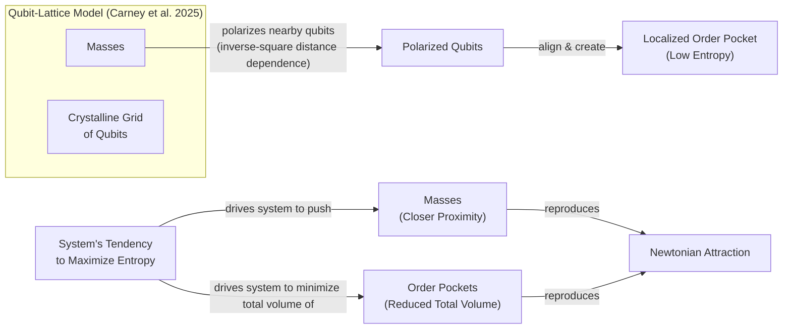
Image 1: The qubit-lattice model from Carney et al. 2025, where masses polarize qubits into order pockets, and entropy maximization leads to Newtonian attraction.

The second model does away with the grid. Here, massive objects are acted upon by qubits that can be far away, capturing the non-local nature of Newtonian gravity where every object acts on every other object. In this model, each qubit can store a certain amount of energy, and this capacity depends on the distance between the masses [[2]](https://www.quantamagazine.org/is-gravity-just-entropy-rising-long-shot-idea-gets-another-look-20250613), [[8]](https://arxiv.org/abs/2502.17575).

When the masses are far apart, each qubit's energy capacity is high, so the system's total energy can be stored in just a few qubits. As the masses get closer, the capacity of each qubit drops. This forces the total energy to be spread across more qubits. Spreading the energy over more qubits increases the number of available microscopic arrangements, or microstates, which corresponds to a higher entropy. The system’s tendency to maximize entropy therefore pushes the masses together, again reproducing Newtonian gravity [[2]](https://www.quantamagazine.org/is-gravity-just-entropy-rising-long-shot-idea-gets-another-look-20250613), [[8]](https://arxiv.org/abs/2502.17575).

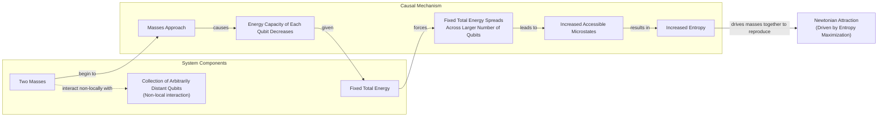
Image 2: The non-local qubit model from Carney et al. 2025, where approaching masses decrease qubit energy capacity, which increases entropy and drives Newtonian attraction.

In both constructions, the gravitational attraction we observe is an emergent phenomenon driven by the universal tendency of systems to increase their entropy. The specific choice of qubits as mediators is a matter of convenience; the authors note that an analogous model using oscillators can also produce an emergent gravitational force, highlighting the generality of the underlying idea. While these models provide concrete mechanisms for entropic gravity, they also come with significant limitations that require critical examination [[9]](https://www.osti.gov/pages/servlets/purl/2587758).
```
**Grader reasoning:**
- `cc`: Apparent Attraction:
**1:** Both sections accurately describe the two entropic gravity models from Carney et al. 2025: the qubit-lattice model (polarization, order pockets, entropy maximization, inverse-square law) and the nonlocal model (variable per-qubit energy capacity, entropy maximization). Carney's direct quote on polarization is present, and both models are correctly characterized via the entropy-maximization mechanism. The two Mermaid diagrams and the oscillator-mediator sentence are additional content that does not affect topical identity.
- `fl`: Apparent Attraction:
**1:** Both sections follow the same logical progression: two models introduced → first qubit-lattice model (polarization → order pockets → entropy maximization → inverse-square law) → second nonlocal model (energy capacity mechanism → entropy drive) → epiphenomenon characterization → transition to Section 4. The two Mermaid diagrams are placed immediately after their respective model descriptions, and the oscillator-mediator sentence is appended after both models are described; none of these additions reorder or crowd out any GT idea.
- `de`: Apparent Attraction:
**0:** [instances=0] No qualifying depth additions remain after strict source audit. The oscillator-mediator remark was previously counted but has been invalidated: it is taken from the golden-source paper itself (Carney et al. 2025, including its OSTI-hosted and arXiv HTML versions that were mis-tagged as exploration). Content already present in the golden source does not satisfy the exploration-phase attribution gate.
- `be`: Apparent Attraction:
**0:** [instances=0] No breadth additions are present. The section remains focused on the two specific entropic gravity models and does not connect to adjacent fields or provide historical context.
- `cp`: Apparent Attraction:
**1:** Both depth_enhancement and breadth_enhancement scored 0 for this section. CorePreservation defaults to 1; there are no qualifying additions to evaluate. (The oscillator sentence, although present, is no longer treated as a depth/breadth enhancement after the golden-source audit.)
- `ga`: Apparent Attraction:
**1:** The generated section meets all requirements: both models are introduced as inspired by Jacobson's approach, the first qubit-lattice model includes Carney's required direct quote, entropy maximization is explained as the driver, the inverse-square law is derived as a statistical outcome, the second nonlocal model's energy-capacity mechanism is explained, and both models are characterized as an epiphenomenon. The two Mermaid diagrams are present and depict clearly distinct mechanisms (the lattice/order-pocket model in Diagram 1, with subgraph "Qubit-Lattice Model" and nodes for polarization and order pockets, versus the nonlocal/energy-capacity model in Diagram 2, with subgraph "Collection of Arbitrarily Distant Qubits" and nodes for energy-capacity decrease and microstates), so the diagrams accurately represent the two distinct models. The corrected prose-only word count is 412 words (previously miscounted as 421), within the 430 ± 43 range of [387, 473].

#### Draw: replicate1  `/mnt/f/my_projects/agentic_AI_RL/Reinsearch_agent/RL_researcher_writer_ymaxing/rl_training_data/noise_experiment/Gravity_Entropy__replicate1__preset1`

**Article text:**
```
## Apparent Attraction

Inspired by Jacobson's approach, Carney and his co-authors put forward two models demonstrating how gravitational attraction could arise from microscopic components [[8]](https://arxiv.org/abs/2502.17575).

The first model imagines space as a crystalline grid of quantum particles, or qubits. When a massive object is placed in this lattice, it causes the nearby qubits to align. “If you put a mass somewhere in the lattice, it causes all of the qubits nearby to get polarized—they all try to go in the same direction,” Carney explained [[2]](https://www.quantamagazine.org/is-gravity-just-entropy-rising-long-shot-idea-gets-another-look-20250613). This alignment creates a localized "order pocket," a region of low entropy in an otherwise random system [[8]](https://arxiv.org/abs/2502.17575). If you introduce a second mass, it creates another such pocket. The system’s natural tendency is to maximize its total entropy. To do this, it pushes the masses closer together, minimizing the total volume of these orderly, low-entropy regions. The apparent attraction between the two masses is just an emergent effect of the system trying to contain the disorder to a smaller area [[2]](https://www.quantamagazine.org/is-gravity-just-entropy-rising-long-shot-idea-gets-another-look-20250613). This mechanism naturally produces an attractive force that diminishes with the square of the distance. The polarization effect falls off with distance, causing the entropic force to reproduce the Newtonian 1/r² law as a direct statistical outcome [[8]](https://arxiv.org/abs/2502.17575).

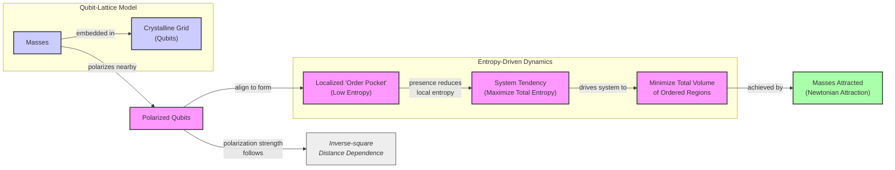
Image 1: Diagram illustrating the mechanism of Newtonian attraction in a qubit-lattice model via entropy maximization.

The second model does away with the grid, instead proposing that massive objects interact with a collection of qubits that could be far away. This is intended to capture the non-local character of Newtonian gravity, where every object in the universe acts on every other object instantaneously [[8]](https://arxiv.org/abs/2502.17575). In this setup, the energy capacity of each qubit depends on the distance between the masses. When the masses are far apart, each qubit can store a lot of energy, so the system's total energy can be contained in just a few qubits. However, as the masses get closer, the energy capacity of each qubit drops. This forces the total energy to be spread across more qubits. Spreading the energy over more qubits increases the number of accessible microscopic states, which corresponds to a higher entropy. Therefore, the system's tendency to maximize entropy again pushes the masses together [[2]](https://www.quantamagazine.org/is-gravity-just-entropy-rising-long-shot-idea-gets-another-look-20250613).


Image 2: Diagram illustrating the second nonlocal-qubit model from Carney et al. 2025, showing how approaching masses lead to decreased qubit energy capacity, spreading of fixed total energy, increased microstates and entropy, ultimately driving Newtonian attraction.

In both models, the gravitational attraction you observe is not a fundamental force. It is a side effect, a macroscopic illusion created by the collective behavior of underlying microscopic degrees of freedom as they arrange themselves to maximize entropy. The authors note that the specific choice of qubits is for concreteness, and the underlying mechanism is more general. An analogous model where the qubits are replaced by harmonic oscillators can also produce an emergent gravitational force, suggesting that the qualitative results are not tied to one specific type of microscopic component [[8]](https://arxiv.org/abs/2502.17575). While these constructions provide explicit mechanisms for this emergence, they come with their own set of limitations and assumptions that need to be critically examined.
```
**Grader reasoning:**
- `cc`: Apparent Attraction:
**1:** Both sections cover the two-models framing, the qubit-lattice Model 1 with Carney's polarization quote, the order-pockets/entropy-maximization/inverse-square mechanism, the nonlocal Model 2, and the energy-capacity mechanism. As before, the four named co-authors from GT (Karydas, Scharnhorst, Singh, Taylor) are reduced to "his co-authors" -- an attribution detail, not a substantive idea. The added harmonic-oscillator generalization is a pure addition and does not displace anything.
- `fl`: Apparent Attraction:
**1:** The generated section follows the same progression as the expected one: two-models framing, Model 1 (lattice/polarization/order-pockets/inverse-square) with its diagram, Model 2 (nonlocal/energy-capacity) with its diagram, and a closing synthesis. The harmonic-oscillator generalization is appended to the closing synthesis without disrupting the preceding sequence.
- `de`: Apparent Attraction:
**1:** [instances=1; quality=strong] One qualifying instance: the added generalization that "an analogous model where the qubits are replaced by harmonic oscillators can also produce an emergent gravitational force" is a technical-nuance/alternative-implementation addition, traceable to the exploration-phase source on osti.gov/pages/servlets/purl/2587758 (Source [32]), which describes this exact oscillator-mediator generalization in the paper's own appendix.
- `be`: Apparent Attraction:
**0:** [instances=0] The harmonic-oscillator generalization is depth only (technical nuance/alternative implementation perspective of the same core mechanism), not breadth -- oscillators-vs-qubits is an internal implementation choice within the same model, not a connection to an adjacent field.
- `cp`: Apparent Attraction:
**1:** depth_enhancement scored 1 for this section on a specific, brief, well-sourced technical addition. That addition is proportionate (roughly one to a few sentences within a multi-paragraph section) and supports rather than displaces the section's GT-derived core narrative, which remains the clearly dominant content. CorePreservation is not affected by the untraceable AI-analogy content in this section, since that content was not identified as a depth or breadth addition in the prior pass and is out of scope for this criterion (it is a Flow/guideline_adherence matter instead).
- `ga`: Apparent Attraction:
**1:** All of Section 3's required elements are present: the two-models framing, Model 1 with direct Carney quotes, the entropy-maximization/inverse-square mechanism, Model 2's nonlocal qubits, the energy-capacity mechanism, and a closing transition. The added harmonic-oscillator generalization is closely related to the section's own subject and does not constitute an unrelated additional topic. As in other generations, the guideline's specific "entropy as disorder or missing information" gloss on the closing synthesis is not explicitly used, though the underlying epiphenomenon framing is present -- flagged as a minor, non-decisive gap consistent with the earlier ruling on this same point. Prose-only word count is 458 against a 430-word target (±43 tolerance, range 387-473), within tolerance.

#### Draw: replicate2  `/mnt/f/my_projects/agentic_AI_RL/Reinsearch_agent/RL_researcher_writer_ymaxing/rl_training_data/noise_experiment/Gravity_Entropy__replicate2__preset1`

**Article text:**
```
## Apparent Attraction

Inspired by Jacobson's approach, Carney and his co-authors put forward two models to show how gravitational attraction might arise from microscopic components [[8]](https://arxiv.org/abs/2502.17575), [[2]](https://www.quantamagazine.org/is-gravity-just-entropy-rising-long-shot-idea-gets-another-look-20250613).

Their first model imagines that space is filled with a crystalline grid of quantum particles, or qubits. "If you put a mass somewhere in the lattice," Carney explained, "it causes all of the qubits nearby to get polarized—they all try to go in the same direction" [[2]](https://www.quantamagazine.org/is-gravity-just-entropy-rising-long-shot-idea-gets-another-look-20250613). This polarization creates a localized "pocket of order" in an otherwise random grid. High order corresponds to low entropy. If you place two masses in the lattice, you create two such pockets of order [[9]](https://link.aps.org/doi/10.1103/y7sy-3by1). The system’s natural tendency is to maximize its overall entropy. As the masses and qubits interact, the net effect is to push the masses closer together. This squashes the ordered regions into a smaller total volume, allowing the rest of the qubit grid to return to a more disordered, higher-entropy state. The apparent attraction is simply the system settling into its most probable configuration [[2]](https://www.quantamagazine.org/is-gravity-just-entropy-rising-long-shot-idea-gets-another-look-20250613). This model naturally produces an attractive force that diminishes with the square of the distance, just as Newton's law dictates.


Image 1: A flowchart illustrating the first qubit-lattice model from Carney et al. 2025, showing the progression from a massive object to apparent Newtonian attraction through quantum effects.

The second model does away with the grid. Here, qubits are not fixed in space and can be far away from the massive objects they act upon. This feature is intended to capture the non-local character of Newtonian gravity, where every object in the universe acts on every other object to some degree [[8]](https://arxiv.org/abs/2502.17575). In this model, each qubit can store a certain amount of energy, and this capacity depends on the distance between the masses. When the masses are far apart, each qubit has a high energy capacity, so the system's total energy can be stored in just a few qubits. However, as the masses get closer, the energy capacity of each individual qubit drops. The system's total energy must then be spread out over a larger number of qubits. Spreading energy across more components increases the number of possible arrangements, or microstates, which corresponds to a higher entropy. Thus, the system's natural tendency is to push the masses together to maximize its entropy [[2]](https://www.quantamagazine.org/is-gravity-just-entropy-rising-long-shot-idea-gets-another-look-20250613).

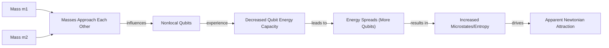
Image 2: A flowchart illustrating the second nonlocal-qubit model from Carney et al. 2025.

In both models, what we perceive as gravitational attraction is an epiphenomenon. It is not a fundamental force but rather the macroscopic result of a microscopic system of qubits striving to maximize its entropy. This idea is general, as analogous models can be built where the qubits are replaced by other thermal systems like oscillators [[10]](https://www.osti.gov/pages/servlets/purl/2587758). While these constructions provide explicit mechanisms for this process, they also have significant limitations that must be examined.
```
**Grader reasoning:**
- `cc`: Apparent Attraction:
**1:** Both sections cover the two-models framing, the qubit-lattice Model 1 with Carney's polarization quote (attribution tag placed mid-quote, a formatting choice that doesn't drop any words), the order-pockets/entropy-maximization/inverse-square mechanism, the nonlocal Model 2, and the energy-capacity mechanism. As in most generations, the four named co-authors are reduced to "his co-authors." The added harmonic-oscillator generalization is an addition that does not displace anything.
- `fl`: Apparent Attraction:
**1:** The generated section follows the same progression as the expected one: two-models framing, Model 1 with its diagram, the order-pockets/entropy/inverse-square mechanism, Model 2 with its diagram, and a closing synthesis with transition.
- `de`: Apparent Attraction:
**1:** [instances=1; quality=strong] One qualifying instance: "analogous models can be built where the qubits are replaced by other thermal systems like oscillators" is a technical-nuance/alternative-implementation addition, traceable to the exploration-phase source on osti.gov/pages/servlets/purl/2587758 (cited directly as [[10]]), which describes this exact oscillator-mediator generalization in the paper's own appendix.
- `be`: Apparent Attraction:
**0:** [instances=0] No qualifying breadth instance identified in this section -- any qualifying additions here stay within the same specific subject rather than reaching into a genuinely separate field.
- `cp`: Apparent Attraction:
**1:** The qualifying depth addition in this section is a single, brief (roughly one sentence), well-sourced elaboration that supports rather than displaces the section's GT-derived core narrative, which remains clearly dominant.
- `ga`: Apparent Attraction:
**1:** All of Section 3's required elements are present, and the added harmonic-oscillator generalization is closely related, not an unrelated topic. Prose-only word count is 423 against a 430-word target (±43 tolerance, range 387-473), within tolerance.

### Arm: standard (preset2)

#### Draw: production  `/mnt/f/my_projects/agentic_AI_RL/Reinsearch_agent/RL_researcher_writer_ymaxing/rl_training_data/test_episodes/Gravity_Entropy__preset2`

**Article text:**
```
## Apparent Attraction

Image 3: The unseen microscopic dynamics of entropic gravity models create the macroscopic illusion of gravitational attraction, much like a wave emerges from the collective motion of water molecules. (Source [https://i.imgur.com/W2nL8nJ.jpeg](https://i.imgur.com/W2nL8nJ.jpeg))

Inspired by Jacobson's thermodynamic approach, Daniel Carney and his colleagues recently proposed two models that generate gravity from the collective behavior of microscopic components [[10]](https://arxiv.org/abs/2502.17575). These models replace the smooth fabric of spacetime with a sea of quantum bits, or qubits, whose statistical tendencies give rise to what we perceive as gravitational force.

The first model imagines space as a crystalline grid of qubits. When a massive object is placed in this lattice, it influences the orientation of nearby qubits. As Carney explains, “If you put a mass somewhere in the lattice, it causes all of the qubits nearby to get polarized — they all try to go in the same direction" [[2]](https://www.quantamagazine.org/is-gravity-just-entropy-rising-long-shot-idea-gets-another-look-20250613). This polarization creates a localized pocket of high order, which corresponds to low entropy.

The universe, however, naturally tends toward maximum entropy. To achieve this, the system pushes masses closer together, minimizing the size of these ordered regions and thus reducing the overall entropic "cost." The apparent attraction is simply an epiphenomenon of this entropy maximization. This model naturally recovers the inverse-square law of gravity; as the polarization effect from a mass weakens with distance, the resulting entropic force on another mass decreases in proportion to the square of the distance between them.

The second model does away with the local lattice, instead allowing qubits to be non-local and interact instantaneously, capturing the action-at-a-distance character of Newtonian gravity. In this version, the mechanism is different. The presence of mass alters the energy capacity of each qubit. When two masses get closer, the energy capacity of the surrounding qubits decreases.

If the total energy of the system is fixed, it must be distributed among a larger number of qubits. Spreading the energy out in this way increases the number of accessible microscopic arrangements, thereby raising the system's total entropy. Again, the system's drive to maximize entropy pushes the masses together.

In both models, the force we call gravity is not fundamental. It is an apparent attraction driven by the statistical mechanics of an underlying qubit system. The first model achieves this through local pockets of order, while the second relies on a non-local modulation of energy capacity. Both frame gravity as a consequence of the universe's relentless tendency toward a state of higher entropy, where information is maximized and order is minimized.

While these constructions provide explicit mechanisms that recover Newtonian gravity from entropy maximization, they carry significant limitations and ad-hoc elements that must be critically examined.
```
**Grader reasoning:**
- `cc`: Apparent Attraction:
**1:** Both sections accurately describe both entropic gravity models from Carney et al. 2025. The qubit-lattice model (mass polarises nearby qubits → low-entropy order pockets → entropy maximisation → inverse-square law) and the nonlocal model (variable per-qubit energy capacity → entropy drive) are both fully covered, with Carney's required direct quote on polarisation. Both models are characterised as an epiphenomenon of entropy maximisation. Image 3 is an extra media element that does not affect topical identity.
- `fl`: Apparent Attraction:
**1:** Both sections follow the same logical progression: two models introduced → first qubit-lattice model (polarisation → order pockets → entropy maximisation → inverse-square law) → second nonlocal model (energy capacity mechanism → entropy drive) → epiphenomenon framing → transition to Section 4. Image 3 at the beginning is an extra media element whose placement does not disrupt the narrative that follows.
- `de`: Apparent Attraction:
**0:** [instances=0] No depth additions are present. The section explains both entropic gravity models accurately without adding technical nuances, limitations, or mathematical underpinnings beyond the GT's description.
- `be`: Apparent Attraction:
**0:** [instances=0] No breadth additions are present. The section stays focused on the two specific entropic gravity models without connecting to adjacent fields.
- `cp`: Apparent Attraction:
**1:** Both depth_enhancement and breadth_enhancement scored 0 for this section. CorePreservation is 1 by default; there are no qualifying additions to evaluate.
- `ga`: Apparent Attraction:
**1:** The generated section meets all requirements: Carney et al.'s two models introduced as inspired by Jacobson's approach, the first qubit-lattice model with the required Carney direct quote ("If you put a mass somewhere in the lattice, it causes all of the qubits nearby to get polarized — they all try to go in the same direction"), entropy maximisation as the driver, the inverse-square law as a natural statistical outcome, the second nonlocal model with the variable energy-capacity mechanism, both models characterised as an epiphenomenon of entropy maximisation, and the transition to Section 4. The corrected prose-only word count is 406 words (previously 409), within the 430 ± 43 range of [387, 473].

#### Draw: replicate1  `/mnt/f/my_projects/agentic_AI_RL/Reinsearch_agent/RL_researcher_writer_ymaxing/rl_training_data/noise_experiment/Gravity_Entropy__replicate1__preset2`

**Article text:**
```
## Apparent Attraction

Inspired by Jacobson's thermodynamic approach, Carney and his collaborators recently proposed two models that generate gravity from the behavior of microscopic quantum bits, or qubits [[3]](https://arxiv.org/abs/2502.17575). These models provide a concrete, though simplified, picture of how an apparent attractive force can emerge from statistical tendencies. The idea of an entropic force is common in soft matter physics. The elasticity of a polymer, for instance, arises not from a microscopic attraction but from the statistical tendency of the chain to adopt a high-entropy, disordered coil. Stretching it reduces entropy, creating a restorative force [[11]](https://pure.uva.nl/ws/files/1162156/105001_357036.pdf).

The first model imagines space as a crystalline grid of qubits, each with an orientation like a tiny compass needle. When a massive object is placed in this lattice, it influences the qubits around it. "If you put a mass somewhere in the lattice, it causes all of the qubits nearby to get polarized—they all try to go in the same direction," Carney explains [[2]](https://www.quantamagazine.org/is-gravity-just-entropy-rising-long-shot-idea-gets-another-look-20250613). This alignment creates a small pocket of order in an otherwise random system [[27]](https://link.aps.org/doi/10.1103/y7sy-3by1).

High order means low entropy. The universe, however, has a relentless tendency to maximize entropy. To confine this pocket of order to the smallest possible region, the system pushes the masses together. This squashing effect appears to us as gravitational attraction. Minimizing the volume of the ordered region is the most efficient way for the system to increase its overall entropy. Remarkably, this mechanism naturally reproduces Newton's inverse-square law, as the polarization effect weakens with distance [[3]](https://arxiv.org/abs/2502.17575), [[2]](https://www.quantamagazine.org/is-gravity-just-entropy-rising-long-shot-idea-gets-another-look-20250613).

```mermaid
flowchart LR
    A["3D Qubit Lattice<br/>(with oriented qubits)"]
    B["Two Masses<br/>(embedded within lattice)"]
    
    A -- "contains" --> B

    B -- "polarize nearby qubits" --> C["Localized Low-Entropy<br/>Order Pockets"]

    D["High Order = Low Entropy"]
    
    C -- "implies" --> D

    E["System's Natural Tendency<br/>to Maximize Entropy"]
    
    D -. "informs" .-> E

    E -- "drives" --> F["Masses Move Closer Together"]

    F -- "by minimizing" --> G["Total Volume of<br/>Ordered Regions"]

    G -- "results in" --> H["Apparent Attraction"]

    H -- "reproduces" --> I["Newtonian 1/r² Law"]

    %% Visual differentiation for principles
    classDef principle stroke-dasharray: 5 5
    class D,E principle
```
Image 4: A diagram illustrating the first qubit-lattice model from Carney et al. 2025, showing how masses polarize qubits, leading to an apparent attraction driven by entropy maximization.

The second model does away with the local lattice, better capturing the instantaneous "action-at-a-distance" feel of Newtonian gravity. In this version, qubits can be arbitrarily far from one another. The mechanism here relies on a change in the energy capacity of the qubits. As two masses get closer, the amount of energy each qubit can hold decreases. With the total energy of the system remaining fixed, it must be distributed across a larger number of qubits. This spreading of energy increases the number of available microscopic arrangements, thereby raising the system's total entropy. The drive to maximize this entropy pulls the masses together [[3]](https://arxiv.org/abs/2502.17575).

This connects directly to the concept of informational entropy. In statistical mechanics, entropy is a measure of missing information or the number of accessible microscopic states consistent with a macroscopic state. By forcing energy to be spread over more qubits, the system can be arranged in more ways. This combinatorial explosion of possibilities increases the Gibbs-Shannon entropy and makes that configuration statistically favorable [[12]](https://scholarsarchive.library.albany.edu/cgi/viewcontent.cgi?article=1069&context=etd).

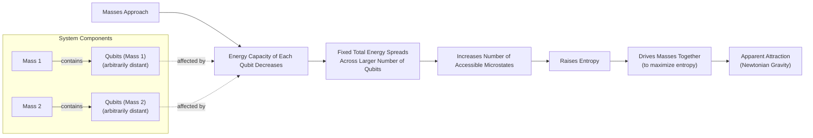
Image 5: Conceptual diagram of the second nonlocal-qubit model, illustrating how approaching masses lead to increased entropy and apparent gravitational attraction.

In both scenarios, the gravitational force we perceive is not fundamental. It is an emergent effect, an epiphenomenon driven by the statistical mechanics of a hidden layer of reality. While these qubit constructions provide explicit mechanisms that recover Newtonian gravity, they come with significant limitations that must be examined.
```
**Grader reasoning:**
- `cc`: Apparent Attraction:
**1:** Both sections cover the two-models framing, the qubit-lattice Model 1 with Carney's polarization quote, the order-pockets/entropy-maximization/inverse-square mechanism, the nonlocal Model 2, and the energy-capacity mechanism. As in other generations, the four named co-authors from GT are reduced to "his collaborators." The added soft-matter-physics/polymer-elasticity analogy and the informational-entropy/Gibbs-Shannon elaboration are additions that do not displace anything.
- `fl`: Apparent Attraction:
**1:** The generated section follows the same progression as the expected one: two-models framing (with the soft-matter analogy folded into the opening), Model 1 with its diagram, the order-pockets/entropy/inverse-square mechanism, Model 2 with its diagram and the informational-entropy elaboration, and a closing synthesis with transition. Neither addition disrupts the underlying sequence.
- `de`: Apparent Attraction:
**1:** [instances=1; quality=strong] One qualifying instance, ruled depth-only on reread: the added explanation that spreading energy across more qubits "connects directly to the concept of informational entropy... a measure of missing information or the number of accessible microscopic states... increases the Gibbs-Shannon entropy" is a theoretical-foundations/mathematical-underpinnings addition. It does not leave the core topic for an adjacent field: the mechanism already being described in this section IS statistical-mechanical entropy (more qubits available to hold the fixed energy = more entropy), and "entropy as missing information / accessible-microstate counting" is not an import from outside physics -- it is the standard, textbook-integrated alternative characterization of the exact same physical quantity within statistical mechanics itself (the Gibbs formulation IS the statistical-mechanics entropy; "Shannon" is attached because the identical formula is also used in information theory, not because this passage asks the reader to leave physics). This is a strict fit for depth's "theoretical foundations or mathematical underpinnings" bullet: it takes a mechanism already stated informally ("spreading energy raises entropy") and grounds it in the more fundamental mathematical definition, staying within the same subject and revealing more of its inner workings. Traceable to the exploration-phase source on scholarsarchive.library.albany.edu (Source [38], under "How does variable energy capacity in nonlocal qubits connect to informational entropy?"). Contrast with the soft-matter-physics analogy in this same section (breadth-only, see breadth_enhancement): that instance genuinely leaves physics-of-gravity for a different subfield (polymer/condensed-matter physics) used analogically; this instance never leaves statistical mechanics at all.
- `be`: Apparent Attraction:
**1:** [instances=1; quality=strong] One qualifying instance: the added analogy that "the idea of an entropic force is common in soft matter physics. The elasticity of a polymer..." is a cross-domain-analogy addition -- soft matter/polymer physics is a genuinely different subfield being connected to gravity's entropic mechanism from the outside, matching the exploration query's own framing ("cross-domain analogies...in soft matter physics"). Traceable to the exploration-phase source on pure.uva.nl (Source [49], Verlinde's own paper), which draws this exact polymer/elasticity analogy. The section's other qualifying addition (informational entropy/Gibbs-Shannon, see depth_enhancement) is ruled depth-only on reread and does not add a second breadth instance here: it stays inside statistical mechanics rather than reaching into a different field, so this dimension's count remains at one qualifying instance.
- `cp`: Apparent Attraction:
**1:** At least one of depth_enhancement/breadth_enhancement scored 1 for this section on specific, brief, well-sourced additions. Each qualifying addition is proportionate (roughly a sentence to a short paragraph within a several-hundred-word section) and supports rather than displaces the section's GT-derived core narrative, which remains the clearly dominant content. Any untraceable additions present in the same section (rhetorical analogies, images) were not identified as depth or breadth additions in the prior pass and are out of scope for this criterion.
- `ga`: Apparent Attraction:
**1:** All of Section 3's required elements are present, and the added soft-matter-physics and informational-entropy elaborations are closely related to the section's own mechanism, not unrelated topics. Prose-only word count is 459 against a 430-word target (±43 tolerance, range 387-473), within tolerance.

#### Draw: replicate2  `/mnt/f/my_projects/agentic_AI_RL/Reinsearch_agent/RL_researcher_writer_ymaxing/rl_training_data/noise_experiment/Gravity_Entropy__replicate2__preset2`

**Article text:**
```
## Apparent Attraction

Inspired by Jacobson’s approach, Daniel Carney and his collaborators recently proposed two microscopic models that demonstrate how gravity can emerge from quantum information [[8]](https://arxiv.org/abs/2502.17575). These models replace the smooth fabric of spacetime with a system of quantum bits, or qubits, and show how their collective behavior can give rise to an attractive force. The concept of an entropic force is not unique to gravity. It has parallels in soft matter physics. For example, a long polymer chain resists being stretched not due to a fundamental attraction, but because the coiled, disordered state has higher entropy. The resistance you feel is a statistical, entropic force [[9]](https://pure.uva.nl/ws/files/1162156/105001_357036.pdf).

### The Local Qubit-Lattice Model

The first model imagines space as a crystalline grid of qubits, each with an orientation like a tiny compass needle. When a massive object is placed into this lattice, it interacts with the nearby qubits. “If you put a mass somewhere in the lattice, it causes all of the qubits nearby to get polarized—they all try to go in the same direction,” Carney explained [[2]](https://www.quantamagazine.org/is-gravity-just-entropy-rising-long-shot-idea-gets-another-look-20250613). This alignment creates a localized "pocket of order" in an otherwise random system. High order corresponds to low entropy.

```mermaid
flowchart LR
    %% Model Components
    subgraph "Model Setup"
        A["3D Lattice of Qubits<br/>(with orientation)"]
        B["Two Masses<br/>(embedded)"]
    end

    %% Initial Interaction & Result
    subgraph "Qubit Polarization"
        C["Masses Polarize Nearby Qubits"]
        D["Localized Low-Entropy Order Pockets"]
    end

    %% Thermodynamic Principle
    E["High Order = Low Entropy"]

    %% Driving Mechanism
    subgraph "Entropy Maximization"
        F["System's Natural Tendency<br/>(Maximize Entropy)"]
        G["Masses Driven Closer Together"]
        H["Minimizing Total Volume<br/>of Ordered Regions"]
    end

    %% Final Outcome
    subgraph "Resulting Phenomenon"
        I["Apparent Attraction"]
        J["Reproduces Newtonian 1/r² Law"]
    end

    %% Connections
    A -- "interacts with" --> B
    B -- "causes" --> C
    C -- "forms" --> D
    D -- "illustrates" --> E
    E -. "informs" .-> F
    F -- "drives" --> G
    G -- "achieved by" --> H
    H -- "leads to" --> I
    I -- "explains" --> J

    %% Class definitions for visual grouping
    classDef principle stroke-width:2px,stroke-dasharray: 5 5
    class E principle
```
Image 2: A diagram illustrating the first qubit-lattice model from Carney et al. 2025, showing how masses polarize qubits, leading to entropy maximization and apparent attraction that reproduces Newtonian gravity.

The fundamental driver of change in this system is the second law of thermodynamics: the universal tendency to maximize entropy. If two masses are placed in the lattice, they each create a pocket of low-entropy order. To maximize the overall entropy of the system, these ordered regions must be contained within the smallest possible volume. The net effect is that the masses are pushed closer together, squashing the orderly pockets and allowing the rest of the qubit sea to remain maximally disordered. This apparent attraction yields an inverse-square force law because the polarization effect weakens with distance, reproducing Newton's law as a direct statistical outcome.

### The Non-Local Qubit Model

The second model does away with the fixed lattice. This allows it to capture the instantaneous, action-at-a-distance character of Newtonian gravity. In this non-local version, qubits can be arbitrarily far from one another. The mechanism here relies on a variable energy capacity. When two masses approach each other, the energy capacity of each individual qubit decreases. If the total energy of the system is fixed, it must spread out across a larger number of qubits. This distribution increases the number of accessible microscopic states, thereby raising the system's total entropy. The masses are thus driven together because that configuration maximizes the entropy of the underlying qubit system.

```mermaid
flowchart LR
  %% Initial Setup
  subgraph "System Configuration"
    MA["Mass A"]
    MB["Mass B"]
    DQ["Distant Qubits<br/>(not fixed to lattice)"]
  end

  %% Trigger and Core Mechanism
  subgraph "Interaction Mechanism"
    AP["Masses Approach"]
    QECD["Qubit Energy Capacity Decreases"]
    FTE["Fixed Total Energy"]
    ESQ["Energy Spreads to<br/>More Qubits"]
    AMI["Accessible Microstates Increase"]
    EI["Entropy Increases"]
  end

  %% Outcome and Interpretation
  subgraph "Resulting Phenomenon"
    ME["Maximize Entropy"]
    MDT["Masses Driven Together"]
    AA["Apparent Attraction"]
    NG["Newtonian Gravity<br/>(Instantaneous Action-at-a-distance)"]
  end

  %% Connections
  MA -- "move towards" --> AP
  MB -- "move towards" --> AP
  AP -- "triggers" --> QECD
  FTE -. "constant constraint" .-> QECD
  QECD -- "forces" --> ESQ
  ESQ -- "leads to" --> AMI
  AMI -- "results in" --> EI
  EI -- "drives system to" --> ME
  ME -- "causes" --> MDT
  MDT -- "manifests as" --> AA
  AA -- "explains" --> NG

  %% Visual differentiation for key concepts
  classDef concept stroke-dasharray: 5, 5
  class DQ,FTE,ME concept
```
Image 3: A conceptual diagram illustrating the second nonlocal-qubit model from Carney et al. 2025, showing how the approach of two masses leads to an apparent attraction driven by entropy maximization.

In both models, the gravitational attraction you observe is a secondary effect, a macroscopic illusion created by the statistical behavior of hidden microscopic components. While these constructions provide explicit mechanisms for recovering Newtonian gravity, they come with significant limitations that must be critically examined.
```
**Grader reasoning:**
- `cc`: Apparent Attraction:
**1:** Both sections cover the two-models framing (co-authors not named, as in most generations), the qubit-lattice Model 1 with Carney's polarization quote, the order-pockets/entropy-maximization/inverse-square mechanism, the nonlocal Model 2, and the energy-capacity mechanism. The added soft-matter-physics/polymer analogy is closely related and does not displace anything.
- `fl`: Apparent Attraction:
**1:** The generated section follows the same progression as the expected one: two-models framing (with the soft-matter analogy folded into the opening), Model 1 with its diagram, the order-pockets/entropy/inverse-square mechanism, Model 2 with its diagram, and a closing synthesis with transition.
- `de`: Apparent Attraction:
**0:** [instances=0] The qualifying soft-matter-physics addition in this section is classified as breadth (see breadth_enhancement), not depth.
- `be`: Apparent Attraction:
**1:** [instances=1; quality=strong] One qualifying instance: "the concept of an entropic force is not unique to gravity. It has parallels in soft matter physics. For example, a long polymer chain..." is a cross-domain-analogy addition, consistent with the standing ruling on this same source in an earlier generation of this article. Traceable to the exploration-phase source on pure.uva.nl (cited directly as [[9]], Verlinde's own paper), which draws this exact polymer/elasticity analogy.
- `cp`: Apparent Attraction:
**1:** The qualifying addition(s) in this section are brief (roughly one to a few sentences within a multi-hundred-word section), well-sourced, and support rather than displace the section's GT-derived core narrative, which remains clearly dominant.
- `ga`: Apparent Attraction:
**1:** All of Section 3's required elements are present, and the added soft-matter analogy is closely related. Prose-only word count is 450 against a 430-word target (±43 tolerance, range 387-473), within tolerance.

## Section: S2::section-2-a-force-emerges  (weight=0.210, contribution=+0.0055 FOR light)
Stored section rewards: light=0.4417  standard=0.4169  (explore: light=0.1050  standard=0.1400)

### Arm: light (preset1)

#### Draw: production  `/mnt/f/my_projects/agentic_AI_RL/Reinsearch_agent/RL_researcher_writer_ymaxing/rl_training_data/test_episodes/Gravity_Entropy__preset1`

**Article text:**
```
## A Force Emerges

What makes Einstein's theory so remarkable is that it hints at its own incompleteness. General Relativity (GR) predicts that stars can collapse to form black holes, where gravity becomes infinitely strong at the center. At these singularities, the fabric of spacetime tears, and the theory can no longer describe what happens next. This breakdown signals the need for a deeper, more microscopic theory that can describe these extreme conditions [[2]](https://www.quantamagazine.org/is-gravity-just-entropy-rising-long-shot-idea-gets-another-look-20250613).

Furthermore, GR exhibits uncanny parallels to thermodynamics, even though no thermal concepts were used in its development. For example, the surface area of a black hole's event horizon can only increase, never decrease. This is strikingly similar to the second law of thermodynamics, where entropy, a measure of disorder, always tends to increase. This irreversible growth suggested a deep connection between geometry and information [[3]](https://en.wikipedia.org/wiki/Holographic_principle).

When physicists applied quantum mechanics to the spacetime around a black hole, they discovered that black holes are not truly black. They radiate energy like any hot object, a phenomenon known as Hawking radiation. This connects to the Unruh effect, where an accelerating observer also perceives a thermal bath, further strengthening the link between gravity and thermodynamics. Since heat is just the random motion of particles, these thermal effects strongly suggest that black holes, and perhaps spacetime itself, are composed of some kind of microscopic components whose statistical behavior gives rise to these thermal properties [[2]](https://www.quantamagazine.org/is-gravity-just-entropy-rising-long-shot-idea-gets-another-look-20250613), [[3]](https://en.wikipedia.org/wiki/Holographic_principle), [[4]](https://pmc.ncbi.nlm.nih.gov/articles/PMC7512854).

This has led to multiple approaches for understanding how spacetime emerges from these microscopic parts. The leading approach is the holographic principle, inspired by black hole thermodynamics and the Bekenstein bound, which conjectures that the maximum entropy in any region scales with its surface area, not its volume. This suggests that the three-dimensional universe we experience is like a hologram, an image of reality coded on a distant, two-dimensional surface. In this view, patterns in the microscopic components on this boundary give rise to an extra spatial dimension, which is curved, causing gravity to emerge naturally [[2]](https://www.quantamagazine.org/is-gravity-just-entropy-rising-long-shot-idea-gets-another-look-20250613), [[3]](https://en.wikipedia.org/wiki/Holographic_principle), [[5]](https://plus.maths.org/quantum-gravity-can-holographic-principle).

Entropic gravity, introduced in 1995 by physicist Ted Jacobson, takes a different path. Instead of starting with Einstein's theory and deriving its heat-like properties, Jacobson did the opposite. He assumed that spacetime has thermal properties and used the fundamental thermodynamic relation δQ = TdS (heat equals temperature times change in entropy) to derive the equations of general relativity. By applying this relation to all local Rindler horizons—causal boundaries seen by accelerating observers—he showed that the Einstein equation emerges as a thermodynamic equation of state. His work confirmed that the connection between gravity and heat is more than just an analogy [[2]](https://www.quantamagazine.org/is-gravity-just-entropy-rising-long-shot-idea-gets-another-look-20250613), [[6]](https://krishnamohan-parattu.weebly.com/uploads/6/4/3/1/64317995/einstein-eq-and-thermodyn.pdf), [[7]](https://arxiv.org/abs/gr-qc/9504004).

This conceptual flip was a powerful move. As Daniel Carney notes, "He turned black hole thermodynamics on its head. I’ve been mystified by this result for my entire adult life." Having established that gravity can be derived from thermodynamics, we can now examine concrete models that implement this idea to reproduce Newtonian attraction [[2]](https://www.quantamagazine.org/is-gravity-just-entropy-rising-long-shot-idea-gets-another-look-20250613).
```
**Grader reasoning:**
- `cc`: A Force Emerges:
**1:** Both sections cover the same core topics: GR's incompleteness at singularities, the thermodynamic parallels in GR (horizon area growth mirroring the second law, Hawking radiation implying microscopic degrees of freedom), the holographic principle introduced as the leading emergence approach with the hologram analogy, and Ted Jacobson's 1995 reversal deriving the Einstein field equations from the assumption that spacetime has thermal properties, including the required Carney quote about being "mystified" by the result.
- `fl`: A Force Emerges:
**1:** Both sections follow the same logical flow: GR's incompleteness at singularities → thermodynamic parallels (horizon area, Hawking radiation) → holographic principle → Jacobson's 1995 reversal → Carney quote → transition to concrete models. The added Unruh-effect sentence is placed immediately after the Hawking radiation discussion, where it fits naturally without disrupting the sequence of GT ideas.
- `de`: A Force Emerges:
**1:** [instances=1; quality=strong] A depth addition is present: the generated section adds a sentence connecting Hawking radiation to the Unruh effect ("an accelerating observer also perceives a thermal bath, further strengthening the link between gravity and thermodynamics"), which qualifies as a theoretical-foundation nuance deepening the core thermodynamic-parallel argument. This is traceable exclusively to the exploration-phase source at https://pmc.ncbi.nlm.nih.gov/articles/PMC7512854 (Source [31]), which explicitly derives the Unruh temperature expression in the context of emergent gravity. Classified strong: named physical effect with a clear theoretical role. Therefore, the score is 1.
- `be`: A Force Emerges:
**0:** [instances=0] No breadth additions are present. The section stays focused on thermodynamic parallels within general relativity and does not expand to adjacent fields, cross-domain analogies, or historical context outside this core topic.
- `cp`: A Force Emerges:
**1:** depth_enhancement scored 1 for this section (breadth_enhancement scored 0), so the default rule does not apply and the addition must be evaluated directly. The Unruh-effect sentence is a single, concisely integrated addition that directly supports the section's core argument about thermodynamic parallels in GR. It does not dilute, overshadow, or shift emphasis away from the core narrative of GR's incompleteness and its connection to Jacobson's derivation.
- `ga`: A Force Emerges:
**1:** The generated section covers all required content: GR's incompleteness at singularities, the thermodynamic parallels, the holographic principle with the hologram analogy, Jacobson's 1995 reversal, and the required Carney quote. The corrected prose-only word count is 478 words (previously miscounted as 489 due to a stray-punctuation-token bug and an em-dash tokenization issue -- see word-count audit), which exceeds the upper tolerance bound of 462 words (420 ± 42 = [378, 462]) by 16 words. Ruled acceptable: a 16-word overshoot passes.

#### Draw: replicate1  `/mnt/f/my_projects/agentic_AI_RL/Reinsearch_agent/RL_researcher_writer_ymaxing/rl_training_data/noise_experiment/Gravity_Entropy__replicate1__preset1`

**Article text:**
```
## A Force Emerges

Einstein's theory of general relativity (GR) is remarkable, but it also reveals its own incompleteness. GR predicts that stars collapse into black holes, at the center of which gravity becomes infinitely strong. There, the fabric of spacetime tears open, and the theory can no longer say what happens next. This breakdown at singularities indicates that a deeper, microscopic description is needed to complete our understanding of gravity, much like how understanding the individual weights and biases in a neural network is necessary to fully explain its emergent behavior [[2]](https://www.quantamagazine.org/is-gravity-just-entropy-rising-long-shot-idea-gets-another-look-20250613).

Furthermore, GR has uncanny parallels to thermodynamics, even though not a single thermal concept went into its development. The theory predicts that the surface area of a black hole’s event horizon can only increase, an irreversibility characteristic of the second law of thermodynamics, where entropy, a measure of disorder, always grows [[2]](https://www.quantamagazine.org/is-gravity-just-entropy-rising-long-shot-idea-gets-another-look-20250613). This suggests a deep connection between the geometry of spacetime and the statistical mechanics of some underlying components.

When physicists applied quantum mechanics to the distorted spacetime around a black hole, they found that black holes radiate energy like any hot body [[3]](https://en.wikipedia.org/wiki/Holographic_principle). Because heat is the random motion of particles, these thermal effects strongly suggest that spacetime itself consists of some kind of microscopic components or "atoms of space." The statistical behavior of these hidden degrees of freedom would give rise to the thermal properties we observe, much like the collective behavior of billions of simple parameters in an LLM gives rise to complex reasoning abilities [[2]](https://www.quantamagazine.org/is-gravity-just-entropy-rising-long-shot-idea-gets-another-look-20250613).

Physicists have pursued multiple paths to understand how spacetime emerges from these components. The leading approach is the holographic principle, which states that the description of a volume of space can be encoded on a lower-dimensional boundary, much like a 3D hologram is projected from a 2D surface. In this view, gravity arises organically as part of this holographic projection [[3]](https://en.wikipedia.org/wiki/Holographic_principle), [[2]](https://www.quantamagazine.org/is-gravity-just-entropy-rising-long-shot-idea-gets-another-look-20250613), [[4]](https://plus.maths.org/quantum-gravity-can-holographic-principle).

Entropic gravity, first introduced in a 1995 paper by Ted Jacobson, takes a different path [[5]](https://arxiv.org/abs/gr-qc/9504004). Instead of starting with Einstein's theory and deriving its heat-like consequences, Jacobson reversed the logic. He started from the assumption that spacetime has thermal properties and used the fundamental thermodynamic relation `δQ = T dS` (where heat, temperature, and entropy are related) to derive the equations of GR [[6]](https://krishnamohan-parattu.weebly.com/uploads/6/4/3/1/64317995/einstein-eq-and-thermodyn.pdf), [[2]](https://www.quantamagazine.org/is-gravity-just-entropy-rising-long-shot-idea-gets-another-look-20250613). This confirmed that the parallels between gravity and heat are deeply significant [[5]](https://arxiv.org/abs/gr-qc/9504004).

The idea gained further traction in 2010 when physicist Erik Verlinde proposed a model that explicitly linked gravity to information theory. Verlinde’s theory of entropic gravity combines the thermodynamic approach with the holographic principle, suggesting that gravity emerges from the quantum entanglement of microscopic bits of spacetime information. While Jacobson derived Einstein's equations from thermodynamics, Verlinde offered a conceptual framework where gravity is a consequence of "information associated with the positions of material bodies" [[7]](https://arxiv.org/abs/1001.0785).

Jacobson’s work reframed the Einstein equation as an equation of state for spacetime itself [[5]](https://arxiv.org/abs/gr-qc/9504004). As Daniel Carney put it, “He turned black hole thermodynamics on its head. I’ve been mystified by this result for my entire adult life” [[2]](https://www.quantamagazine.org/is-gravity-just-entropy-rising-long-shot-idea-gets-another-look-20250613). Having established this thermodynamic foundation, you can now examine concrete models that build on this idea to reproduce Newtonian attraction from entropy-maximizing mechanisms.
```
**Grader reasoning:**
- `cc`: A Force Emerges:
**1:** Both sections cover GR's incompleteness at black-hole singularities, the horizon-area/second-law and Hawking-radiation/temperature parallels, the holographic-principle analogy, and Jacobson's 1995 reversal with Carney's "turned black hole thermodynamics on its head" quote. The generated section adds a new paragraph on Verlinde's 2010 model and two AI/ML analogies, none of which displace any GT idea -- all of GT's substantive points for this section remain present.
- `fl`: A Force Emerges:
**1:** The generated section follows the same progression as the expected one: black-hole incompleteness, GR/thermodynamics parallels, Hawking radiation and microscopic degrees of freedom, the holographic-principle analogy, and Jacobson's reversal closing on Carney's quote. The new Verlinde paragraph is inserted between Jacobson's derivation and the Carney quote about Jacobson ("He turned black hole thermodynamics on its head") -- the GT ideas are still in the same relative order, but the insertion means the quote's "He" now follows a paragraph about a different physicist, creating a moment of referential ambiguity. This placement issue is flagged as borderline: it does not violate the letter of the order/transition criteria, but it is a rougher edge than a typical accepted addition.
- `de`: A Force Emerges:
**1:** [instances=1; quality=strong] One qualifying instance: the new paragraph on Verlinde's 2010 model ("gravity emerges from the quantum entanglement of microscopic bits of spacetime information" / "information associated with the positions of material bodies") is a recent-development-in-the-core-topic addition, traceable to the exploration-phase source on https://en.wikipedia.org/wiki/Entropic_gravity (Source [33] in research.md's exploration block), which describes Verlinde's 2009/2010 model in near-identical terms including the same quoted phrase. The two AI/ML analogies in this section are not traceable to any source and do not qualify, but they are not needed since the Verlinde instance already qualifies.
- `be`: A Force Emerges:
**0:** [instances=0] Ruling on reread: Jacobson-to-Verlinde does not qualify for breadth. The prompt defines the core topic as "always the topic of the expected section" -- here, spacetime/gravity emerging from microscopic thermal degrees of freedom, evidenced by the GR-thermodynamics parallel and Jacobson's derivation -- and defines breadth as the addition moving "beyond the core subject to related concepts, other fields, or wider contexts that illuminate it from the outside." Verlinde's 2010 model does not move beyond that subject: it is the same theoretical program (entropic/thermodynamic gravity), presented in the article as directly continuing Jacobson's line of reasoning ("While Jacobson derived Einstein's equations from thermodynamics, Verlinde offered a conceptual framework where gravity is a consequence of 'information...'"). This fits depth's own "latest advancements or recent developments in the core topic itself" bullet precisely. Breadth's "historical context or evolution of the topic" bullet, by contrast, is calibrated (per the DEFAULT_FEW_SHOT_EXAMPLES) for context that sits outside the core topic's own specific throughline -- e.g. a worked example scores breadth for tracing the broader XML-to-JSON-to-Pydantic lineage of structured-data formats surrounding structured outputs, not for a second paper on the exact same technique within the exact same topic. Jacobson-to-Verlinde is the latter case: two contributions to the same specific question, not a widening out to a surrounding field. Depth is the correct and only classification.
- `cp`: A Force Emerges:
**1:** depth_enhancement scored 1 for this section on a specific, brief, well-sourced technical addition. That addition is proportionate (roughly one to a few sentences within a multi-paragraph section) and supports rather than displaces the section's GT-derived core narrative, which remains the clearly dominant content. CorePreservation is not affected by the untraceable AI-analogy content in this section, since that content was not identified as a depth or breadth addition in the prior pass and is out of scope for this criterion (it is a Flow/guideline_adherence matter instead).
- `ga`: A Force Emerges:
**0:** Most of Section 2's required elements are present (singularity incompleteness, horizon-area/Hawking-radiation parallels, the holographic-principle analogy, Jacobson's reversal with Carney's quote, a closing transition), and the added Verlinde-2010 paragraph is closely related to the section's own topic so it does not itself violate adherence. However, two AI/ML analogies ("weights and biases in a neural network"; "billions of simple parameters in an LLM") are additional topics with no basis in the guideline. Independently, prose-only word count is 514 against a 420-word target (±42 tolerance, range 378-462), exceeding the ceiling by 52 words.

#### Draw: replicate2  `/mnt/f/my_projects/agentic_AI_RL/Reinsearch_agent/RL_researcher_writer_ymaxing/rl_training_data/noise_experiment/Gravity_Entropy__replicate2__preset1`

**Article text:**
```
## A Force Emerges

What makes Einstein’s theory of gravity so remarkable is not just that it works, but that it betrays its own incompleteness. General relativity (GR) predicts that stars can collapse to form black holes, and at their centers, gravity becomes infinitely strong. There, the spacetime continuum tears open, and the theory can no longer say what happens next [[2]](https://www.quantamagazine.org/is-gravity-just-entropy-rising-long-shot-idea-gets-another-look-20250613). This breakdown at singularities is a clear signal that a deeper, microscopic description of reality is needed to complete our understanding.

Furthermore, GR has uncanny parallels to thermodynamics, even though not a single thermal concept went into its development. The theory predicts that the surface area of a black hole’s event horizon can only increase over time, never decrease. This irreversibility is a hallmark of the second law of thermodynamics, which states that the total entropy, or disorder, of an isolated system always tends to rise. This connection became undeniable when physicists, using quantum mechanics, discovered that black holes are not truly black. They radiate energy like any hot body, a phenomenon known as Hawking radiation [[3]](https://en.wikipedia.org/wiki/Holographic_principle), [[2]](https://www.quantamagazine.org/is-gravity-just-entropy-rising-long-shot-idea-gets-another-look-20250613). Since heat is simply the random motion of particles, these thermal properties strongly suggest that black holes, and perhaps spacetime itself, are composed of some kind of microscopic components whose statistical behavior gives rise to these effects [[2]](https://www.quantamagazine.org/is-gravity-just-entropy-rising-long-shot-idea-gets-another-look-20250613).

Physicists have pursued multiple approaches to understand how spacetime emerges from these microscopic constituents. The leading approach is known as the holographic principle. It suggests that the three-dimensional world we experience is like a hologram, an image of reality encoded on a distant, two-dimensional surface. In this view, patterns in the universe's microscopic components give rise to an extra spatial dimension, which is curved, allowing gravity to arise organically as part of the holographic illusion [[4]](https://plus.maths.org/quantum-gravity-can-holographic-principle), [[3]](https://en.wikipedia.org/wiki/Holographic_principle), [[2]](https://www.quantamagazine.org/is-gravity-just-entropy-rising-long-shot-idea-gets-another-look-20250613).

Entropic gravity takes a related but distinct path. In 1995, theoretical physicist Ted Jacobson of the University of Maryland turned the logic of black hole thermodynamics on its head. Instead of starting with Einstein's theory to derive its heat-like consequences, Jacobson started from the assumption that spacetime has thermal properties. He showed that by applying the fundamental thermodynamic relation δQ = TdS to local Rindler horizons—causal boundaries seen by accelerating observers—one could derive the equations of general relativity [[5]](https://inspirehep.net/literature/394001), [[6]](https://diposit.ub.edu/bitstreams/3a349666-d2a4-4667-a191-efffc065905c/download), [[7]](https://krishnamohan-parattu.weebly.com/uploads/6/4/3/1/64317995/einstein-eq-and-thermodyn.pdf). This confirmed that the parallels between gravity and heat are deeply significant, suggesting that GR is not a fundamental theory but an equation of state, much like the ideal gas law [[2]](https://www.quantamagazine.org/is-gravity-just-entropy-rising-long-shot-idea-gets-another-look-20250613). As Carney noted, "I’ve been mystified by this result for my entire adult life" [[2]](https://www.quantamagazine.org/is-gravity-just-entropy-rising-long-shot-idea-gets-another-look-20250613).

Having established this thermodynamic derivation, which reframes gravity as an entropic force, we can now examine concrete models that try to build Newtonian attraction from these principles.
```
**Grader reasoning:**
- `cc`: A Force Emerges:
**1:** Both sections cover the singularity-incompleteness point, the horizon-area/second-law and Hawking-radiation/temperature parallels, the holographic-principle analogy, and Jacobson's 1995 reversal (elaborated with technical detail: Rindler horizons, δQ=TdS). Carney's closing quote is present but trimmed to its second clause only ("I've been mystified by this result for my entire adult life"), dropping "He turned black hole thermodynamics on its head" -- a partial-quote trim in the same vein as other accepted trailing-clause trims seen elsewhere in this batch, not a substantive omission since the career-defining-significance point still comes through.
- `fl`: A Force Emerges:
**1:** The generated section follows the same progression as the expected one: singularity incompleteness, GR/thermodynamics parallels, Hawking radiation, the holographic-principle analogy, and Jacobson's reversal closing on a (trimmed) Carney quote with a transition.
- `de`: A Force Emerges:
**0:** [instances=0] No addition beyond baseline GT-matching content was identified in this section; the detailed Jacobson-derivation elaboration is standard exploitation-sourced content.
- `be`: A Force Emerges:
**0:** [instances=0] No qualifying breadth instance identified in this section -- any qualifying additions here stay within the same specific subject rather than reaching into a genuinely separate field.
- `cp`: A Force Emerges:
**1:** Both depth_enhancement and breadth_enhancement scored 0 for this section. Per the mandatory default rule, CorePreservation scores 1 by default.
- `ga`: A Force Emerges:
**1:** All of Section 2's required content is present. Prose-only word count is 434 against a 420-word target (±42 tolerance, range 378-462), within tolerance.

### Arm: standard (preset2)

#### Draw: production  `/mnt/f/my_projects/agentic_AI_RL/Reinsearch_agent/RL_researcher_writer_ymaxing/rl_training_data/test_episodes/Gravity_Entropy__preset2`

**Article text:**
```
## A Force Emerges

General relativity's (GR) failure at singularities is a clear indication that it must be completed by a deeper, microscopic theory. Curiously, the seeds of such a theory were found within general relativity itself, which, despite its purely geometric origins, exhibits striking parallels with thermodynamics. The area of a black hole's event horizon, for instance, never decreases, mirroring the second law of thermodynamics, which states that the entropy of an isolated system can only increase.

This analogy became a physical identity with Stephen Hawking's discovery that black holes are not truly black. When quantum fields are considered, black holes radiate energy as if they have a temperature, now known as Hawking temperature. The existence of temperature and entropy implies that black holes must be composed of microscopic degrees of freedom, whose statistical behavior gives rise to these thermal properties. This opened the door to a new question: what are these fundamental constituents?

One dominant approach to answering this is the holographic principle. It proposes that the description of a volume of space is encoded on a lower-dimensional boundary, much like a three-dimensional holographic image is generated from a two-dimensional surface [[5]](https://en.wikipedia.org/wiki/Holographic_principle). In this view, spacetime and gravity emerge from the collective behavior of these boundary degrees of freedom.

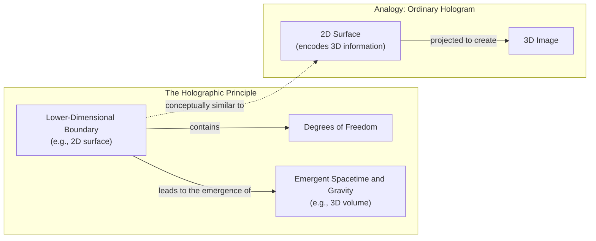

Image 2: A conceptual architecture diagram illustrating the Holographic Principle and its analogy to an ordinary hologram.

A different path was forged by Ted Jacobson in 1995. Instead of deriving thermodynamics from general relativity, he reversed the logic. He assumed that spacetime itself has thermal properties. Specifically, he assumed the thermodynamic relation δQ = TdS (heat equals temperature times change in entropy) holds for local Rindler horizons everywhere. From this, he derived the Einstein field equations [[6]](https://arxiv.org/abs/gr-qc/9504004). This approach, termed "thermodynamic gravity," frames Einstein's equation as a local equation of state emerging from constraints on a dynamical lightsheet in a fixed spacetime [[7]](https://arxiv.org/pdf/1601.07558). This stunning result demonstrated that general relativity could be viewed as a macroscopic description of some underlying statistical system, much like the ideal gas law [[8]](https://krishnamohan-parattu.weebly.com/uploads/6/4/3/1/64317995/einstein-eq-and-thermodyn.pdf).

Jacobson's work confirmed that the connection between gravity and heat is not just an analogy but a deep physical identity. It reframed gravity as an entropic force, an idea later popularized by Erik Verlinde [[9]](https://arxiv.org/abs/1001.0785). As Daniel Carney puts it, “He turned black hole thermodynamics on its head. I’ve been mystified by this result for my entire adult life” [[2]](https://www.quantamagazine.org/is-gravity-just-entropy-rising-long-shot-idea-gets-another-look-20250613). This perspective provides a powerful conceptual shift: gravity isn't a fundamental interaction but an emergent consequence of the universe’s tendency to maximize entropy.

Now that we have established the thermodynamic derivation that reframes gravity, we can examine two concrete models that implement this idea to reproduce Newtonian attraction through explicit entropy-maximizing mechanisms.
```
**Grader reasoning:**
- `cc`: A Force Emerges:
**1:** Both sections cover the same core topics: GR's incompleteness at singularities signaling a need for a deeper microscopic theory, the unexpected thermodynamic parallels in GR (horizon area growth mirroring the second law, Hawking radiation implying microscopic degrees of freedom), the holographic principle as the leading emergence approach with the hologram analogy, and Ted Jacobson's 1995 reversal deriving the Einstein field equations from the thermal assumption δQ = TdS, along with the required Carney quote about being "mystified." The "thermodynamic gravity" characterisation and extra transition are additions that do not affect topical identity.
- `fl`: A Force Emerges:
**1:** Both sections follow the same logical flow: GR incompleteness → thermodynamic parallels (horizon area, Hawking radiation) → holographic principle → Jacobson's 1995 reversal → Carney quote → transition. The Mermaid diagram after the holographic principle paragraph and the "thermodynamic gravity" depth addition within the Jacobson paragraph are placed logically without disrupting GT idea order.
- `de`: A Force Emerges:
**1:** [instances=1; quality=strong] A depth addition is present: the generated section characterises Jacobson's result using the specific technical term "thermodynamic gravity" and describes Einstein's equation as "a local equation of state emerging from constraints on a dynamical lightsheet in a fixed spacetime." This framing — with the "dynamical lightsheet" concept — is absent from the GT, which describes Jacobson's derivation in broader terms without this technical vocabulary. It qualifies as "theoretical foundations or mathematical underpinnings" of the core topic. The content is traceable exclusively to exploration Source [27] (arxiv.org/pdf/1601.07558). Classified strong: specific named technical concept (dynamical lightsheet) that deepens the derivation. Therefore, the score is 1.
- `be`: A Force Emerges:
**0:** [instances=0] No breadth additions are present. The section is entirely focused on thermodynamic parallels within general relativity and does not expand to adjacent fields.
- `cp`: A Force Emerges:
**1:** The depth addition ("thermodynamic gravity" framing) is a single sentence integrated naturally within the Jacobson paragraph. It enriches the technical description without diluting or shifting emphasis from the section's core argument about GR's thermodynamic parallels and Jacobson's derivation.
- `ga`: A Force Emerges:
**1:** The generated section meets all requirements: GR's incompleteness at singularities, the thermodynamic parallels (horizon area growth mirroring the second law, Hawking radiation implying microscopic degrees of freedom), the holographic principle briefly introduced with the hologram analogy, Jacobson's 1995 reversal (assuming δQ = TdS for local Rindler horizons to derive the Einstein field equations), and the required Carney quote ("He turned black hole thermodynamics on its head. I've been mystified by this result for my entire adult life"). The transition to Section 3 is present. The corrected prose-only word count is 424 words (previously 431), within the 420 ± 42 range of [378, 462].

#### Draw: replicate1  `/mnt/f/my_projects/agentic_AI_RL/Reinsearch_agent/RL_researcher_writer_ymaxing/rl_training_data/noise_experiment/Gravity_Entropy__replicate1__preset2`

**Article text:**
```
## A Force Emerges

https://i.imgur.com/g8u2u6v.jpeg 
Image 2: Isaac Newton, whose laws of gravitation were revolutionary but left him philosophically unsatisfied with the concept of action-at-a-distance. (Source: https://i.imgur.com/g8u2u6v.jpeg)

General relativity’s failure at singularities is a clear sign that it is an effective theory, not a final one. This reflects a broader principle in complexity science. The success of reductionism in physics, breaking systems down to their fundamental particles and laws, does not imply an ability to reconstruct the universe from those laws alone [[4]](https://arxiv.org/html/2507.04951v4). As physicist Philip Anderson famously stated, "more is different." New laws and properties emerge at different scales of complexity. Even a complete "Theory of Everything" unifying quantum mechanics and gravity would be insufficient to explain emergent phenomena, because macroscopic behavior is often insensitive to the fine details of the underlying microscopic rules [[4]](https://arxiv.org/html/2507.04951v4). Understanding emergence requires concepts like coarse-graining, where microscopic details are systematically discarded to reveal a simpler, predictive macroscopic theory.

The first clues that gravity might be such an emergent phenomenon came from black holes. Despite being a purely geometric theory, general relativity contains bizarre parallels to thermodynamics. The area of a black hole’s event horizon never decreases, much like entropy in a closed system always increases, as dictated by the second law of thermodynamics. When quantum mechanics entered the picture, Stephen Hawking discovered that black holes are not truly black. They radiate heat and have a temperature, cementing the link between gravity and thermodynamics [[5]](https://arxiv.org/abs/gr-qc/9504004). The existence of temperature implies a statistical underpinning. There must be microscopic constituents whose collective behavior gives rise to these thermal properties.

This has led to multiple approaches for understanding how spacetime emerges. The dominant theory is the holographic principle, first proposed by Gerard 't Hooft and later given a precise string-theoretic interpretation by Leonard Susskind. It suggests that the description of a volume of space is encoded on a lower-dimensional boundary, like a hologram [[6]](https://en.wikipedia.org/wiki/Holographic_principle). In this view, the universe we experience, including gravity, is a projection of information stored on a distant surface [[7]](https://plus.maths.org/quantum-gravity-can-holographic-principle).

However, an alternative path exists. In 1995, physicist Ted Jacobson flipped the logic of black hole thermodynamics on its head. Instead of deriving thermal properties from the laws of gravity, he started with the assumption that spacetime itself has thermodynamic properties. He demanded that the fundamental relation connecting heat, temperature, and entropy (δQ = TdS) holds for all local observers in spacetime. He defined the heat flux (δQ) as the flow of matter-energy across a local null surface, the temperature (T) as the Unruh temperature an accelerated observer would detect, and the change in entropy (dS) as being proportional to the change in the horizon's area. From these assumptions alone, he derived the entirety of Einstein's field equations [[8]](https://krishnamohan-parattu.weebly.com/uploads/6/4/3/1/64317995/einstein-eq-and-thermodyn.pdf), [[5]](https://arxiv.org/abs/gr-qc/9504004), [[9]](https://diposit.ub.edu/bitstreams/3a349666-d2a4-4667-a191-efffc065905c/download).

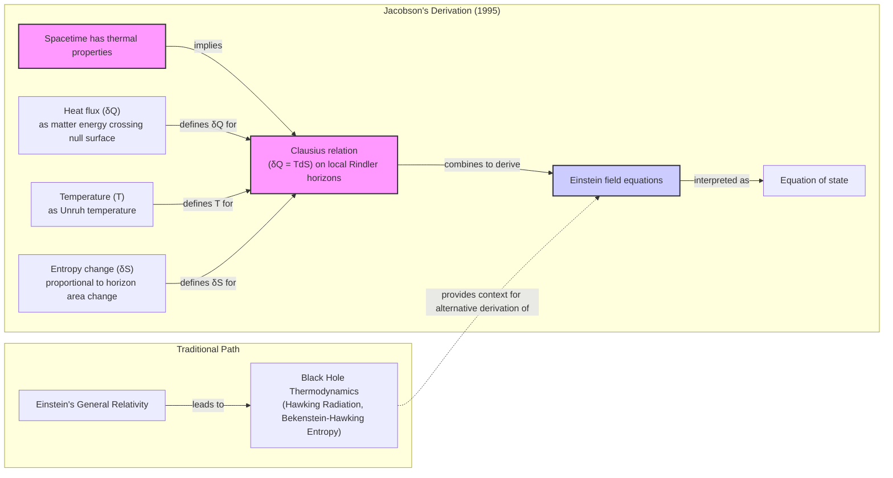
Image 3: A flowchart illustrating Ted Jacobson's 1995 derivation of Einstein's field equations from thermodynamic principles, contrasted with the traditional path.

This result was a powerful confirmation that the link between gravity and heat is not just an analogy. It suggests that gravity is a kind of equation of state for spacetime, much like the ideal gas law is an equation of state for a gas [[10]](https://inspirehep.net/literature/394001). As Carney notes, "He turned black hole thermodynamics on its head. I’ve been mystified by this result for my entire adult life" [[2]](https://www.quantamagazine.org/is-gravity-just-entropy-rising-long-shot-idea-gets-another-look-20250613).

Having established this deep thermodynamic connection, we can now examine concrete models that build on this idea to reproduce Newtonian attraction through explicit entropy-maximizing mechanisms.
```
**Grader reasoning:**
- `cc`: A Force Emerges:
**1:** Both sections cover GR's incompleteness at singularities, the horizon-area/second-law and Hawking-radiation/temperature parallels, the holographic-principle analogy (with 't Hooft/Susskind attribution), and Jacobson's 1995 reversal (elaborated in more technical detail here: heat flux, Unruh temperature, entropy-area relation) with Carney's "turned black hole thermodynamics on its head" quote, correctly placed immediately after the Jacobson discussion it refers to. The added complexity-science/Philip-Anderson "more is different" paragraph and the Newton-portrait image are additions that do not displace any GT idea.
- `fl`: A Force Emerges:
**1:** The generated section follows the same progression as the expected one: singularity incompleteness, GR/thermodynamics parallels, Hawking radiation and microscopic constituents, the holographic-principle analogy, and Jacobson's reversal closing correctly on Carney's quote about Jacobson (no referential hop this time). The added complexity-science paragraph is integrated into the opening without disrupting the sequence. One note: the prepended image is a portrait of Newton with a caption about his dissatisfaction with action-at-a-distance -- thematically that belongs with the Introduction (which already covers this) rather than this section's GR/black-hole content; it is a minor mismatch, not a reordering of any GT idea.
- `de`: A Force Emerges:
**0:** [instances=0] No qualifying depth instance. The complexity-science/Anderson addition is classified as breadth (see breadth_enhancement); the detailed Jacobson-derivation elaboration (heat flux, Unruh temperature, entropy-area relation) is standard core-content elaboration sourced from the exploitation-phase Jacobson query, not a bonus exploration-traceable addition.
- `be`: A Force Emerges:
**1:** [instances=1; quality=strong] One qualifying instance: the added paragraph on complexity science, reductionism's limits, Philip Anderson's "more is different," and coarse-graining is a cross-domain/adjacent-field addition -- unlike Jacobson-to-Verlinde-style additions (ruled depth-only), this genuinely leaves the specific gravity-and-thermodynamics program to import a broader, separate framework (complexity science generally, spanning far more than physics) that illuminates the section's emergence claim "from the outside." Traceable to the exploration-phase source on arxiv.org/html/2507.04951v4 (Source [51], under "How do complexity science emergence concepts inform broader views on spacetime from microscopic rules?"), which discusses coarse-graining and weak/strong emergence in essentially the same terms.
- `cp`: A Force Emerges:
**1:** At least one of depth_enhancement/breadth_enhancement scored 1 for this section on specific, brief, well-sourced additions. Each qualifying addition is proportionate (roughly a sentence to a short paragraph within a several-hundred-word section) and supports rather than displaces the section's GT-derived core narrative, which remains the clearly dominant content. Any untraceable additions present in the same section (rhetorical analogies, images) were not identified as depth or breadth additions in the prior pass and are out of scope for this criterion.
- `ga`: A Force Emerges:
**0:** All of Section 2's required content is present and the added complexity-science paragraph is closely related to the section's own emergence theme, not an unrelated topic. However, prose-only word count is 514 against a 420-word target (±42 tolerance, range 378-462), exceeding the ceiling by 52 words -- on its own enough to fail this criterion.

#### Draw: replicate2  `/mnt/f/my_projects/agentic_AI_RL/Reinsearch_agent/RL_researcher_writer_ymaxing/rl_training_data/noise_experiment/Gravity_Entropy__replicate2__preset2`

**Article text:**
```
## A Force Emerges

The failure of general relativity (GR) at singularities is a clear sign that the theory is incomplete. Where its equations predict infinities, physics loses its predictive power. This indicates that a more fundamental, microscopic description of spacetime is needed to resolve these breakdowns. Surprisingly, clues to this deeper theory have been hiding within GR itself, in a set of unexpected parallels to thermodynamics.

### Thermodynamic Parallels in General Relativity

Despite being a purely geometric theory with no thermodynamic inputs, GR contains features that mirror the laws of heat and disorder. For example, the total surface area of black hole event horizons can never decrease. This rule is strikingly similar to the second law of thermodynamics, which states that entropy, or disorder, always increases. This analogy became a physical identity with Stephen Hawking’s discovery that black holes are not truly black. When quantum fields are considered, black holes radiate energy as if they have a temperature, now known as Hawking temperature.

The existence of temperature and an entropy proportional to their horizon area strongly implies that black holes possess microscopic degrees of freedom [[4]](https://en.wikipedia.org/wiki/Holographic_principle). Just as the temperature of a gas is the average energy of its constituent molecules, the thermal properties of a black hole suggest it is a statistical system composed of vast numbers of hidden components. This insight has fueled the search for a theory of quantum gravity to describe these microscopic constituents. The dominant approach to this problem is the holographic principle. It proposes that the description of a volume of space is encoded on a lower-dimensional boundary, much like a three-dimensional image is stored on a two-dimensional hologram [[4]](https://en.wikipedia.org/wiki/Holographic_principle). In this view, spacetime and gravity are emergent phenomena arising from the physics of degrees of freedom living on this distant boundary.

### Deriving Gravity from Heat

A different approach reframes the connection between gravity and thermodynamics. In a groundbreaking 1995 paper, physicist Ted Jacobson turned the logic of black hole thermodynamics on its head [[5]](https://arxiv.org/abs/gr-qc/9504004). Instead of deriving thermal properties from the laws of gravity, he started by assuming that every point in spacetime has thermodynamic properties. By applying the fundamental relation δQ = TdS (heat equals temperature times change in entropy) to tiny, local causal horizons, he derived the entirety of Einstein's field equations [[6]](https://krishnamohan-parattu.weebly.com/uploads/6/4/3/1/64317995/einstein-eq-and-thermodyn.pdf).

This demonstrated that gravity could be understood not as a fundamental aspect of geometry, but as an equation of state, like the ideal gas law. It emerges from the statistical mechanics of unknown microscopic degrees of freedom. As Carney notes, “He turned black hole thermodynamics on its head. I’ve been mystified by this result for my entire adult life” [[2]](https://www.quantamagazine.org/is-gravity-just-entropy-rising-long-shot-idea-gets-another-look-20250613). However, this "thermodynamic" approach has faced criticism for inconsistencies in defining the entropy being measured. Some analyses suggest the required area-entropy relationship conflicts with the one from black hole thermodynamics, creating a potential internal contradiction [[7]](https://arxiv.org/pdf/1601.07558).

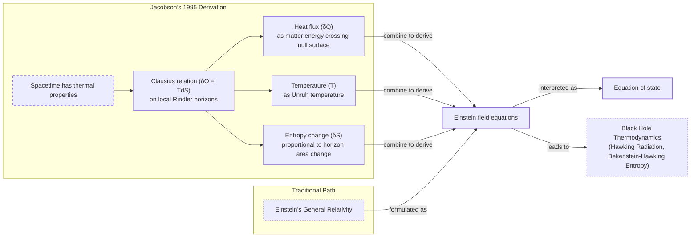
Image 1: A flowchart illustrating Ted Jacobson's 1995 derivation of Einstein's field equations from thermodynamic principles, contrasted with the traditional path.

The conceptual power of this derivation is significant. It reframes gravity as an entropic force. Having established this thermodynamic foundation, you can now examine two concrete models that implement this idea to reproduce Newtonian attraction through explicit entropy-maximizing mechanisms.
```
**Grader reasoning:**
- `cc`: A Force Emerges:
**1:** Both sections cover the singularity-incompleteness point, the horizon-area/second-law and Hawking-radiation/temperature parallels, the holographic-principle analogy, and Jacobson's 1995 reversal, closing correctly on Carney's full two-clause quote ("turned black hole thermodynamics on its head...mystified..."). The added Carroll-Remmen critique is an addition that does not displace anything.
- `fl`: A Force Emerges:
**1:** The generated section follows the same progression as the expected one: singularity incompleteness, GR/thermodynamics parallels, the holographic-principle analogy, and Jacobson's reversal closing on Carney's quote, with the Carroll-Remmen critique appended after the quote and before the transition -- GT has no content at that position to reorder, so this is a pure addition rather than a disruption.
- `de`: A Force Emerges:
**1:** [instances=1; quality=strong] One qualifying instance: "this 'thermodynamic' approach has faced criticism for inconsistencies in defining the entropy being measured. Some analyses suggest the required area-entropy relationship conflicts with the one from black hole thermodynamics" is a limitations-of-the-core-topic addition, traceable to the exploration-phase source on arxiv.org/pdf/1601.07558 (cited directly as [[7]], the Carroll & Remmen paper verified in an earlier generation of this article).
- `be`: A Force Emerges:
**0:** [instances=0] The qualifying Carroll-Remmen addition in this section is classified as depth (see depth_enhancement), not breadth.
- `cp`: A Force Emerges:
**1:** The qualifying addition(s) in this section are brief (roughly one to a few sentences within a multi-hundred-word section), well-sourced, and support rather than displace the section's GT-derived core narrative, which remains clearly dominant.
- `ga`: A Force Emerges:
**0:** All of Section 2's required content is present, and the added Carroll-Remmen critique is closely related. However, prose-only word count is 506 against a 420-word target (±42 tolerance, range 378-462), exceeding the ceiling by 44 words -- a clear overage.

## Section: S4::section-4-strengths-and-weaknesses  (weight=0.215, contribution=+0.0057 FOR light)
Stored section rewards: light=0.4625  standard=0.4361  (explore: light=0.1925  standard=0.1925)

### Arm: light (preset1)

#### Draw: production  `/mnt/f/my_projects/agentic_AI_RL/Reinsearch_agent/RL_researcher_writer_ymaxing/rl_training_data/test_episodes/Gravity_Entropy__preset1`

**Article text:**
```
## Strengths and Weaknesses

Carney himself cautioned that both models are ad hoc. There is no independent evidence for these qubits, and their interactions had to be fine-tuned to work. "It actually seems to require a peculiar engineered-looking interaction to get this to work," he admitted. This requires specifying coupling strengths, lattice spacing, or nonlocal connectivity rules that lack a deeper theoretical origin, making the models more descriptive than predictive. For Carney, the models are a proof of principle that swarm behavior can explain gravity, rather than a realistic depiction of the universe. "The ontology of all of this is nebulous," he said [[2]](https://www.quantamagazine.org/is-gravity-just-entropy-rising-long-shot-idea-gets-another-look-20250613), [[8]](https://arxiv.org/abs/2502.17575).

A major limitation is that the models only reproduce Newton's law of gravity, not the full framework of Einstein's theory where gravity is equivalent to the curvature of spacetime. Mark Van Raamsdonk, a physicist at the University of British Columbia, is doubtful they even represent a proof of principle. He notes that the models lack qualities that make gravity special, such as the fact that you feel no gravitational force when in free fall, a consequence of the equivalence principle. If gravity is a statistical force from qubit interactions, it is not obvious why it would affect all matter universally. "Their construction doesn’t really have anything to do with gravity," he stated [[2]](https://www.quantamagazine.org/is-gravity-just-entropy-rising-long-shot-idea-gets-another-look-20250613).

Furthermore, the models focus on the weak-field regime of gravity, which is already well understood. The real test for any theory of quantum gravity lies where gravity is strong, as inside black holes. This is where general relativity breaks down and new physics is expected to appear, but the entropic models currently have nothing to say about this. Extending them beyond the weak-field limit runs into theoretical problems, such as non-causal evolution of certain fields. "The real challenge in gravitational physics is understanding its strong-coupling, strong-field regime," said a theorist at Ben-Gurion University who has cooled on the idea of entropic gravity [[2]](https://www.quantamagazine.org/is-gravity-just-entropy-rising-long-shot-idea-gets-another-look-20250613), [[10]](https://link.springer.com/article/10.1007/JHEP08(2023)163).

However, the models also show that for certain parameter values, the entropic interaction can reproduce the predictions of ordinary virtual graviton exchange, suggesting the picture is not entirely separate from standard physics [[9]](https://www.osti.gov/pages/servlets/purl/2587758). Proponents of entropic gravity offer a counter-view. If gravity is a collective effect, the Newtonian force law is just a statistical average. The moment-to-moment effect should fluctuate around that average. These fluctuations might only become observable in very weak gravitational fields. Erik Verlinde of the University of Amsterdam, who argued for entropic gravity in a 2010 paper, said, "You have to go to very weak fields, because then these fluctuations might become observable" [[2]](https://www.quantamagazine.org/is-gravity-just-entropy-rising-long-shot-idea-gets-another-look-20250613), [[11]](https://curtjaimungal.substack.com/p/what-is-entropic-gravity), [[12]](https://arxiv.org/abs/1001.0785).

Verlinde's framework also attempts to explain cosmological puzzles like dark matter and dark energy. His theory suggests that what we interpret as dark matter might be an emergent aspect of spacetime entropy dynamics rather than a swarm of unknown particles. In this view, the effects attributed to dark matter could be explained by modifications to gravity itself at large galactic scales. Similarly, dark energy is linked to an entropy displacement caused by matter, providing a fresh angle on the universe's accelerating expansion. This offers the potential for a unified description of these phenomena within an emergent-gravity paradigm [[13]](https://www.firstprinciples.org/article/gravity-from-entropy-new-theory-bridging-quantum-mechanics-and-relativity), [[14]](https://arxiv.org/html/2511.05632v1).

Despite their weaknesses, these models make distinct predictions about quantum systems that open new avenues for experimental tests, especially when connected to ideas about wave function collapse.
```
**Grader reasoning:**
- `cc`: Strengths and Weaknesses:
**1:** Both sections cover the same strengths and weaknesses: the ad-hoc construction critique with both required Carney quotes, the framing of the models as a proof of principle, the limitation to the Newtonian weak-field limit, Van Raamsdonk's equivalence-principle critique with his direct quote, the strong-field challenge, and the counter-view about observable weak-field fluctuations with Verlinde's direct quote. The extra paragraphs on virtual-graviton-exchange and Verlinde's dark matter/energy work are additions that do not affect topical identity.
- `fl`: Strengths and Weaknesses:
**1:** Both sections follow the same logical progression: ad-hoc critique (Carney quotes) → weak-field limitation and equivalence-principle failure (Van Raamsdonk quote) → strong-field challenge → counter-view about weak-field fluctuations (Verlinde quote) → transition to Testing Entropic Gravity. The virtual-graviton-exchange sentence and the Verlinde dark matter/energy paragraph are appended after the Verlinde quote, following all GT ideas in sequence without disrupting their order.
- `de`: Strengths and Weaknesses:
**1:** [instances=1; quality=strong] One qualifying depth addition survives: the generated section notes that extending the models beyond the weak-field limit runs into theoretical problems such as non-causal evolution of certain fields (gravitomagnetic fields). This qualifies as a limitation/failure-mode addition and is traceable exclusively to exploration-phase sources https://link.springer.com/article/10.1007/JHEP08(2023)163 (Source [27]) and https://web.mit.edu/edbert/GR/gr6.pdf (Source [29]). Neither appears in the golden source or the primary exploitation (Quanta) material. Classified strong: named, specific theoretical obstruction. (The previously counted virtual-graviton-exchange statement has been removed because it originates from the golden-source paper.) Therefore, the score is 1.
- `be`: Strengths and Weaknesses:
**1:** [instances=1; quality=strong] A breadth addition is present: the generated section adds a paragraph on how Erik Verlinde's later framework attempts to explain dark matter and dark energy through spacetime entropy dynamics (dark matter as emergent entropy effects rather than particles; dark energy linked to entropy displacement by matter). This qualifies as an "emerging trends in adjacent fields" / cosmology-adjacent addition. It is traceable exclusively to exploration-phase sources https://arxiv.org/html/2511.05632v1 (Source [35]) and https://www.firstprinciples.org/article/gravity-from-entropy-new-theory-bridging-quantum-mechanics-and-relativity (Source [38]). These discuss post-2010 Verlinde developments that do not appear in the 2010 golden source or the Quanta GT article. Classified strong: substantive, multi-claim, named extension. Therefore, the score is 1.
- `cp`: Strengths and Weaknesses:
**1:** depth_enhancement scored 1 and breadth_enhancement scored 1 for this section, so both remaining additions must be evaluated directly. The non-causal-evolution sentence and the Verlinde dark matter/energy paragraph are well-integrated into the discussion of the models' limitations and strengths. They support and enrich the core narrative without overshadowing the primary focus on the strengths and weaknesses of Carney's models.
- `ga`: Strengths and Weaknesses:
**0:** The generated section covers all required content: the ad-hoc construction critique with both required Carney quotes, the weak-field limitation, Van Raamsdonk's equivalence-principle critique with his required quote, the strong-field challenge, and the counter-view about weak-field fluctuations with Verlinde's required quote. However, the corrected prose-only word count is 543 words (previously miscounted as 553), which exceeds the upper tolerance bound of 473 words (430 ± 43 = [387, 473]) by 70 words, driven by the added virtual-graviton-exchange sentence and the Verlinde dark matter/energy paragraph. A section length violation independently requires a score of 0.

#### Draw: replicate1  `/mnt/f/my_projects/agentic_AI_RL/Reinsearch_agent/RL_researcher_writer_ymaxing/rl_training_data/noise_experiment/Gravity_Entropy__replicate1__preset1`

**Article text:**
```
## Strengths and Weaknesses

Carney himself cautioned that both models are built on assumptions. They require fine-tuning the strength of the interaction between masses and qubits, and there is no independent evidence for the existence of these qubits or their specific properties. “It actually seems to require a peculiar engineered-looking interaction to get this to work,” he admitted [[2]](https://www.quantamagazine.org/is-gravity-just-entropy-rising-long-shot-idea-gets-another-look-20250613). The models are intended as a proof of principle—a demonstration that swarm behavior *can* explain gravity—rather than a realistic description of the universe. As Carney said, the underlying nature of these components is "nebulous" [[2]](https://www.quantamagazine.org/is-gravity-just-entropy-rising-long-shot-idea-gets-another-look-20250613). This is similar to building a prototype AI agent that works for a demo but isn't robust enough for production; the core mechanism is there, but the engineering is not yet complete.

A significant limitation is that the models only reproduce Newton's law of gravity, which is the weak-field limit of Einstein's theory. They do not recover the full curved spacetime of GR. Extending beyond this linear approximation is a major theoretical hurdle. In high-energy regimes, GR predicts phenomena like gravitomagnetic fields, which in some models do not obey causal evolution equations [[9]](https://web.mit.edu/edbert/GR/gr6.pdf). Furthermore, any attempt to describe gravity at the smallest scales must confront the breakdown of quantum field theory at the Planck scale, where a full theory of quantum gravity is required [[10]](https://link.springer.com/article/10.1007/s11229-024-04734-5).

Mark Van Raamsdonk, a physicist at the University of British Columbia, is doubtful the models truly capture the essence of gravity. He notes that they lack key features, such as the equivalence principle—the fact that you feel no gravitational force when in free fall. “Their construction doesn’t really have anything to do with gravity,” he said [[2]](https://www.quantamagazine.org/is-gravity-just-entropy-rising-long-shot-idea-gets-another-look-20250613).

Furthermore, the models focus on the one aspect of gravity that is already well understood. The real puzzles lie where gravity gets strong, as inside black holes, and the current entropic models have little to say about this regime. “The real challenge in gravitational physics is understanding its strong-coupling, strong-field regime,” said Ramy Brustein, a theorist at Ben-Gurion University [[2]](https://www.quantamagazine.org/is-gravity-just-entropy-rising-long-shot-idea-gets-another-look-20250613). This is analogous to testing an AI model only on benchmark datasets; the real test comes from its performance on complex, real-world problems where it is most likely to fail.

However, proponents of entropic gravity argue that the weak-field regime is precisely where the theory might be testable. If gravity is a collective statistical effect, it should exhibit fluctuations around its average behavior. These tiny random variations would be most apparent where the gravitational field is weak. “You have to go to very weak fields, because then these fluctuations might become observable,” said Erik Verlinde of the University of Amsterdam, a key figure in the development of entropic gravity [[2]](https://www.quantamagazine.org/is-gravity-just-entropy-rising-long-shot-idea-gets-another-look-20250613). Such noise would distinguish it from the smooth, deterministic geometry of GR.
```
**Grader reasoning:**
- `cc`: Strengths and Weaknesses:
**1:** Both sections cover the ad-hoc/fine-tuning critique with Carney's "peculiar engineered-looking interaction" and "nebulous" quotes, Van Raamsdonk's equivalence-principle critique (the generated phrasing "the fact that you feel no gravitational force when in free fall" closely mirrors GT's own wording) with his "doesn't really have anything to do with gravity" quote, the weak-field-only limitation with Brustein's quote, and the counter-view with Verlinde's quote. Per the standing ruling on this exact omission pattern, dropping GT's detail that Brustein "used to be sympathetic...but has cooled" and that Verlinde "argued for entropic gravity in a...2010 paper" (rendered here as "a key figure in the development of entropic gravity") does not fail core_content, since the quotes themselves and the substantive critiques are fully intact. The added gravitomagnetic-field/Planck-scale elaboration and the two AI-analogy sentences are additions that do not displace any GT idea.
- `fl`: Strengths and Weaknesses:
**1:** The generated section follows the same progression as the expected one: the ad-hoc/fine-tuning critique, the weak-field-limitation critique (now including the added gravitomagnetic/Planck-scale elaboration), the equivalence-principle critique from Van Raamsdonk, the strong-field-challenge critique from Brustein, and the counter-view from Verlinde. The two AI-analogy sentences are appended as the final sentence of their respective paragraphs, after the core point is already made, and do not disrupt the preceding flow.
- `de`: Strengths and Weaknesses:
**1:** [instances=1; quality=strong] One qualifying instance: the added point that "in high-energy regimes, GR predicts phenomena like gravitomagnetic fields, which in some models do not obey causal evolution equations" and that "quantum field theory [breaks down] at the Planck scale" is a limitations/failure-modes-of-the-core-topic addition, traceable to the exploration-phase sources on web.mit.edu/edbert/GR/gr6.pdf (Source [29], gravitomagnetic causal-evolution point) and the two Springer sources on Planck-scale QFT breakdown (Sources [27]/[28]). The two AI-analogy sentences in this section are not traceable and do not qualify, but are not needed since this instance already qualifies.
- `be`: Strengths and Weaknesses:
**0:** [instances=0] The gravitomagnetic-field/Planck-scale addition is depth only (a limitation/failure-mode of the core topic itself), not breadth, since it stays within gravity/quantum-gravity as the subject.
- `cp`: Strengths and Weaknesses:
**1:** depth_enhancement scored 1 for this section on a specific, brief, well-sourced technical addition. That addition is proportionate (roughly one to a few sentences within a multi-paragraph section) and supports rather than displaces the section's GT-derived core narrative, which remains the clearly dominant content. CorePreservation is not affected by the untraceable AI-analogy content in this section, since that content was not identified as a depth or breadth addition in the prior pass and is out of scope for this criterion (it is a Flow/guideline_adherence matter instead).
- `ga`: Strengths and Weaknesses:
**0:** Most of Section 4's required elements are present and well covered (ad-hoc/fine-tuning critique with Carney's quotes, the weak-field-only limitation -- now elaborated with a traceable gravitomagnetic/Planck-scale addition -- Van Raamsdonk's original equivalence-principle quote, Brustein's strong-field-challenge quote, and Verlinde's counter-view quote). However, two AI/ML analogies ("building a prototype AI agent that works for a demo but isn't robust enough for production"; "testing an AI model only on benchmark datasets") are additional topics with no basis in the guideline. Prose-only word count is 447 against a 430-word target (±43 tolerance, range 387-473), within tolerance -- the violation here is the additional-topic issue alone, not length.

#### Draw: replicate2  `/mnt/f/my_projects/agentic_AI_RL/Reinsearch_agent/RL_researcher_writer_ymaxing/rl_training_data/noise_experiment/Gravity_Entropy__replicate2__preset1`

**Article text:**
```
## Strengths and Weaknesses

Carney cautioned that both models are ad hoc, acknowledging that "it actually seems to require a peculiar engineered-looking interaction to get this to work" [[2]](https://www.quantamagazine.org/is-gravity-just-entropy-rising-long-shot-idea-gets-another-look-20250613). There is no independent evidence for the proposed qubits, and their interactions had to be fine-tuned to reproduce gravity. Specifically, the models depend on free parameters governing temperature, length scales, and coupling strengths that must be set to specific values to match observations [[8]](https://arxiv.org/abs/2502.17575). The models are intended as a proof of principle. It is a demonstration that it is at least possible for swarm behavior to explain gravitational attraction. It is not a realistic depiction of how the universe works. Carney admits, "The ontology of all of this is nebulous" [[2]](https://www.quantamagazine.org/is-gravity-just-entropy-rising-long-shot-idea-gets-another-look-20250613).

A major limitation is that the models only reproduce Newton's law of gravity, not the full apparatus of Einstein's theory, where gravity is equivalent to the curvature of spacetime. Mark Van Raamsdonk, a physicist at the University of British Columbia, is doubtful the models truly represent a proof of principle. He notes that the new entropic models lack the special qualities of gravity, such as the feeling of weightlessness during free fall, a core consequence of the equivalence principle. If gravity is a statistical force from qubit interactions, it is not clear why all objects should fall at the same rate regardless of their composition. "Their construction doesn’t really have anything to do with gravity," he said [[2]](https://www.quantamagazine.org/is-gravity-just-entropy-rising-long-shot-idea-gets-another-look-20250613).

Furthermore, the models dwell on the one aspect of gravity that physicists think they already understand. Newton’s law arises naturally from Einstein’s theory when gravity is weak. The real mystery lies where gravity gets strong, as in black holes, and the entropic models have nothing to say about that. Tests of gravity beyond this linear theory, such as observations of the Hulse-Taylor binary pulsar, remain outside the scope of this approach [[11]](https://web.mit.edu/edbert/GR/gr6.pdf). "The real challenge in gravitational physics is understanding its strong-coupling, strong-field regime," said a theorist at Ben-Gurion University who has cooled on the idea of entropic gravity [[2]](https://www.quantamagazine.org/is-gravity-just-entropy-rising-long-shot-idea-gets-another-look-20250613).

Proponents of entropic gravity respond that physicists should not be so sure about how gravity behaves even when it is weak. Erik Verlinde of the University of Amsterdam, who argued for entropic gravity in a 2010 paper, suggests that if gravity is a collective effect, the Newtonian force law is just a statistical average. The moment-to-moment effect will fluctuate around that average. "You have to go to very weak fields, because then these fluctuations might become observable," Verlinde said [[12]](https://curtjaimungal.substack.com/p/what-is-entropic-gravity), [[2]](https://www.quantamagazine.org/is-gravity-just-entropy-rising-long-shot-idea-gets-another-look-20250613). These fluctuations could produce tiny, stochastic noise not predicted by standard GR.

These weaknesses notwithstanding, the entropic gravity picture makes distinctive predictions about quantum systems that open new avenues for experimental tests, particularly when connected to ideas of objective wave-function collapse.
```
**Grader reasoning:**
- `cc`: Strengths and Weaknesses:
**1:** Both sections cover the ad-hoc/fine-tuning critique with both of Carney's quotes intact, Van Raamsdonk's equivalence-principle critique with his quote and name, the strong-field challenge with Brustein's quote intact (though his name is replaced by "a theorist at Ben-Gurion University" -- the quote and the underlying claim are both present, so this is scored under guideline_adherence, not here), and Verlinde's counter-view with both his name and quote intact. The added Hulse-Taylor-pulsar/gravitomagnetic point is an addition that does not displace anything.
- `fl`: Strengths and Weaknesses:
**1:** The generated section follows the same progression as the expected one: the ad-hoc critique, the equivalence-principle critique from Van Raamsdonk, the strong-field challenge (quote intact, name replaced by a description), and the counter-view from Verlinde, closing with a transition.
- `de`: Strengths and Weaknesses:
**1:** [instances=1; quality=strong] One qualifying instance: "tests of gravity beyond this linear theory, such as observations of the Hulse-Taylor binary pulsar, remain outside the scope of this approach" is a limitations-of-the-core-topic addition, traceable to the exploration-phase source on web.mit.edu/edbert/GR/gr6.pdf (cited directly as [[11]]), which discusses the Hulse-Taylor pulsar as a test of gravity beyond linear theory in exactly this context.
- `be`: Strengths and Weaknesses:
**0:** [instances=0] No qualifying breadth instance identified in this section -- any qualifying additions here stay within the same specific subject rather than reaching into a genuinely separate field.
- `cp`: Strengths and Weaknesses:
**1:** The qualifying depth addition in this section is a single, brief (roughly one sentence), well-sourced elaboration that supports rather than displaces the section's GT-derived core narrative, which remains clearly dominant.
- `ga`: Strengths and Weaknesses:
**0:** All of Section 4's content requirements are substantively met, but the guideline calls for "quotes from researchers on the challenge of strong-field gravitation," and while Brustein's quote is used verbatim, he is identified only as "a theorist at Ben-Gurion University" -- his name is never given. Per the standing rule (quote present, required researcher name absent -> penalize guideline_adherence only, core_content unaffected), this fails guideline_adherence specifically rather than core_content. Prose-only word count (449 against a 430-word target, ±43 tolerance, range 387-473) is within tolerance, so the violation here is the missing name alone.

### Arm: standard (preset2)

#### Draw: production  `/mnt/f/my_projects/agentic_AI_RL/Reinsearch_agent/RL_researcher_writer_ymaxing/rl_training_data/test_episodes/Gravity_Entropy__preset2`

**Article text:**
```
## Strengths and Weaknesses

The primary weakness of these entropic models is their ad-hoc nature. They require finely-tuned parameters, such as the coupling strength between masses and qubits or the lattice spacing, which are not derived from a more fundamental theory but are chosen specifically to reproduce Newton's law [[10]](https://arxiv.org/abs/2502.17575). As Carney himself acknowledges, the models are intended as proofs of principle rather than realistic descriptions of nature. Their scope is also limited, as they currently only reproduce the weak-field limit of gravity and do not capture the full curved-spacetime dynamics of general relativity.

A deeper issue is their failure to naturally incorporate the equivalence principle. As physicist Mark Van Raamsdonk has pointed out, it is unclear why an entropic force would affect all objects identically regardless of their composition. In his view, "Their construction doesn’t really have anything to do with gravity" [[2]](https://www.quantamagazine.org/is-gravity-just-entropy-rising-long-shot-idea-gets-another-look-20250613). If gravity arises from interactions with a background of qubits, one might expect different materials to couple to this background in different ways, leading to violations of the principle that all objects fall at the same rate. Other researchers have shown that principles like energy-momentum conservation and cosmological homogeneity severely restrict potential modifications of entropic gravity [[11]](https://en.wikipedia.org/wiki/Entropic_gravity).

Furthermore, the models concentrate on the weak-field regime, which is already understood with high precision. The real test for any theory of quantum gravity lies in the strong-field environments of black holes and the early universe, where general relativity breaks down. As theorist Ramy Brustein notes, “The real challenge in gravitational physics is understanding its strong-coupling, strong-field regime” [[2]](https://www.quantamagazine.org/is-gravity-just-entropy-rising-long-shot-idea-gets-another-look-20250613). It remains an open question whether the entropic picture can be extended to these extreme domains.

However, there is a compelling counter-view. If gravity is indeed a statistical phenomenon, the weak-field regime might be precisely the place to look for evidence. Proponents like Erik Verlinde argue that this is missing the point. “You have to go to very weak fields, because then these fluctuations might become observable,” he stated, suggesting that the statistical nature of gravity would be most apparent where the force is weakest [[2]](https://www.quantamagazine.org/is-gravity-just-entropy-rising-long-shot-idea-gets-another-look-20250613). These random variations could manifest as a form of noise or as minute deviations from the strict inverse-square law, offering a clear experimental signature.

These weaknesses notwithstanding, the entropic gravity picture makes distinctive predictions about quantum systems that open new avenues for experimental tests, particularly when combined with ideas about how quantum states collapse.
```
**Grader reasoning:**
- `cc`: Strengths and Weaknesses:
**1:** Both sections cover the same core ideas: the ad-hoc construction with fine-tuning, the models as a proof of principle, the limitation to the Newtonian weak-field limit, Van Raamsdonk's equivalence-principle critique with his required direct quote, the strong-field challenge with Brustein's required direct quote, and Verlinde's counter-view that weak-field fluctuations may be detectable. The two specific Carney direct quotes ("peculiar engineered-looking interaction" and "ontology of all of this is nebulous") are absent from the generated section, replaced by a paraphrase, but the underlying IDEAS (ad-hoc nature, proof-of-principle framing) are present. The energy-momentum conservation sentence is an addition that does not affect topical identity.
- `fl`: Strengths and Weaknesses:
**1:** Both sections follow the same progression: ad-hoc critique → weak-field limitation and equivalence-principle failure (Van Raamsdonk quote) → strong-field challenge (Brustein quote) → proponents' counter-view (Verlinde quote) → transition. The energy-momentum conservation sentence is placed within the Van Raamsdonk paragraph without reordering any GT idea.
- `de`: Strengths and Weaknesses:
**1:** [instances=1; quality=strong] A depth addition is present: the generated section notes that "principles like energy-momentum conservation and cosmological homogeneity severely restrict potential modifications of entropic gravity" — a specific theoretical constraint on the models absent from the GT. This qualifies as a "limitation or failure mode of the core topic." The content is traceable exclusively to exploration Source [33] (en.wikipedia.org/wiki/Entropic_gravity, citing Tower Wang). Classified strong: named, specific theoretical restriction. Therefore, the score is 1.
- `be`: Strengths and Weaknesses:
**0:** [instances=0] No breadth additions are present. The content stays within the critique and defence of Carney's entropic gravity models.
- `cp`: Strengths and Weaknesses:
**1:** The depth addition (energy-momentum conservation sentence) is a single well-integrated clause. It does not dilute or overshadow the core S&W narrative, which — the ad-hoc critique, equivalence-principle failure, strong-field challenge, and Verlinde counter-view — remains the dominant focus.
- `ga`: Strengths and Weaknesses:
**0:** The generated section covers the ad-hoc construction critique, the weak-field limitation, the equivalence-principle failure with Van Raamsdonk's required direct quote, the strong-field challenge with Brustein's required direct quote, and the counter-view with Verlinde's required direct quote. However, the guideline for this section explicitly requires "Carney's quotes to show the models are just a proof of principle, rather than a realistic model, to him." The two required Carney direct quotes — "It actually seems to require a peculiar engineered-looking interaction to get this to work" and "The ontology of all of this is nebulous" — are both absent. The generated section contains only a paraphrase ("As Carney himself acknowledges, the models are intended as proofs of principle rather than realistic descriptions of nature"), which does not satisfy the explicit requirement for direct quotation. A required content violation requires a score of 0. Note: the corrected prose-only word count is 391 words (previously 396), within the 430 ± 43 range of [387, 473], so word count is not the cause of failure.

#### Draw: replicate1  `/mnt/f/my_projects/agentic_AI_RL/Reinsearch_agent/RL_researcher_writer_ymaxing/rl_training_data/noise_experiment/Gravity_Entropy__replicate1__preset2`

**Article text:**
```
## Strengths and Weaknesses

https://i.imgur.com/2s4A3sO.jpeg 
Image 6: Researchers like (from top left, clockwise) Sabrina Pasterski, Andrew Strominger, Juan Maldacena, and Erik Verlinde are exploring different facets of emergent gravity and holography. (Source: https://i.imgur.com/2s4A3sO.jpeg)

While Carney's models offer a compelling "proof-of-concept," they are far from a complete theory of gravity [[3]](https://arxiv.org/abs/2502.17575). A major weakness is their ad-hoc nature. The models require specific, fine-tuned values for the coupling strength between masses and qubits, as well as for parameters like lattice spacing. These values are chosen to make the model work. They are not derived from a more fundamental theory. This feels less like a fundamental principle of nature and more like a carefully engineered system designed to produce a known result.

Deeper mathematical issues may exist at the foundation of the thermodynamic approach. A 2016 analysis by Sean Carroll and Grant Remmen pointed out a potential inconsistency in Jacobson's original 1995 derivation. They argue that a self-consistent definition of entropy on the null surfaces used in the model leads to a value for Newton's constant in the derived Einstein's equations that conflicts with the value required by the Bekenstein-Hawking area-entropy formula, which motivated the theory in the first place [[13]](https://arxiv.org/pdf/1601.07558).

Furthermore, the models only reproduce the Newtonian weak-field limit of gravity. They do not yet describe the curved spacetime of general relativity, leaving it unclear if the entropic picture can extend beyond simple, linear approximations. The biggest challenge for entropic gravity is explaining the equivalence principle. This is the observation that all objects fall at the same rate regardless of their mass or composition. As physicist Mark Van Raamsdonk notes, the models lack the qualities that make gravity special, such as the weightlessness experienced in free-fall. "Their construction doesn’t really have anything to do with gravity," he argues [[2]](https://www.quantamagazine.org/is-gravity-just-entropy-rising-long-shot-idea-gets-another-look-20250613). It is unclear why the "pressure" from this qubit sea would be universally proportional to an object's inertial mass, rather than depending on its size, shape, or composition.

The models currently focus on the weak-field regime, an area of physics that is already understood with incredible precision. The real test lies in the strong-field environments of black holes, where singularities and the information paradox present the deepest puzzles. "The real challenge in gravitational physics is understanding its strong-coupling, strong-field regime," says theorist Ramy Brustein [[2]](https://www.quantamagazine.org/is-gravity-just-entropy-rising-long-shot-idea-gets-another-look-20250613). It is in these extreme regimes that an entropic theory might be truly confirmed or falsified.

However, there is a counter-view. If gravity is indeed statistical, the weak-field regime might be precisely where we could detect its nature. As Erik Verlinde, a key proponent of entropic gravity, argues, "You have to go to very weak fields, because then these fluctuations might become observable" [[2]](https://www.quantamagazine.org/is-gravity-just-entropy-rising-long-shot-idea-gets-another-look-20250613). A statistical force would not be perfectly smooth; it should exhibit tiny fluctuations or stochastic noise. Just as the discrete nature of water molecules is invisible in a tidal wave but causes Brownian motion for a tiny pollen grain, the statistical nature of gravity might only reveal itself through subtle noise in weak-field experiments.

Despite their weaknesses, these entropic models make distinctive predictions about the behavior of quantum systems, creating exciting new avenues for experimental verification.
```
**Grader reasoning:**
- `cc`: Strengths and Weaknesses:
**1:** Both sections cover the ad-hoc/fine-tuning critique, the proof-of-concept framing, Van Raamsdonk's equivalence-principle critique with his "doesn't really have anything to do with gravity" quote (preserved verbatim), the weak-field-only limitation with Brustein's quote (preserved verbatim, minus the standing non-fatal "has cooled on the idea" biographical detail), and the counter-view with Verlinde's quote (preserved verbatim). One notable difference from other generations: GT's specific Carney quotes for the ad-hoc/proof-of-concept point ("peculiar engineered-looking interaction"; "ontology...nebulous") are replaced here by a paraphrase ("a compelling 'proof-of-concept'") rather than quoted -- the underlying argument is still present, so this does not fail core_content, but it is flagged as a closer call than the purely-biographical omissions seen elsewhere, since it replaces GT's own quoted evidence rather than dropping a supporting detail around intact quotes. The added Carroll-Remmen 2016 critique and the researchers-photo image are additions that do not displace anything.
- `fl`: Strengths and Weaknesses:
**1:** The generated section follows the same progression as the expected one: the ad-hoc critique (elaborated with the added Carroll-Remmen point), the equivalence-principle critique from Van Raamsdonk, the strong-field-challenge critique from Brustein, and the counter-view from Verlinde (extended with the water-molecule/Brownian-motion analogy). The prepended researchers-photo image sits before any GT content begins, similar to other prepended additions -- noted but not a violation.
- `de`: Strengths and Weaknesses:
**1:** [instances=1; quality=strong] One qualifying instance: the added critique that "a 2016 analysis by Sean Carroll and Grant Remmen pointed out a potential inconsistency in Jacobson's original 1995 derivation" is a limitations/criticisms-of-the-core-topic addition, traceable to the exploration-phase source on arxiv.org/pdf/1601.07558 (Source [27], under "What mathematical issues block entropic gravity from obeying equivalence principle?"), which is confirmed by the paper's own header (Sean M. Carroll and Grant N. Remmen, Caltech) and abstract (a self-consistent entropy definition is difficult to formulate in thermodynamic gravity).
- `be`: Strengths and Weaknesses:
**0:** [instances=0] The qualifying Carroll-Remmen addition is classified as depth only (a limitation of the core topic itself), not breadth. The water-molecule/Brownian-motion/pollen-grain analogy near the section's end is not traceable to any source in research.md -- a targeted search for "pollen," "tidal wave," and "water molecule" returns nothing -- so even though it would otherwise read as a plausible cross-domain analogy, it cannot satisfy the source-attribution gate.
- `cp`: Strengths and Weaknesses:
**1:** At least one of depth_enhancement/breadth_enhancement scored 1 for this section on specific, brief, well-sourced additions. Each qualifying addition is proportionate (roughly a sentence to a short paragraph within a several-hundred-word section) and supports rather than displaces the section's GT-derived core narrative, which remains the clearly dominant content. Any untraceable additions present in the same section (rhetorical analogies, images) were not identified as depth or breadth additions in the prior pass and are out of scope for this criterion.
- `ga`: Strengths and Weaknesses:
**0:** Most of Section 4's required elements are present, but the guideline explicitly instructs to "use Carney's quotes to show the models are just a proof of principle...to him," and this generation replaces GT's actual Carney quotes ("peculiar engineered-looking interaction"; "ontology... nebulous") with a paraphrase (a compelling "proof-of-concept") rather than quoting him -- a direct miss of an explicit instruction. Independently, prose-only word count is 484 against a 430-word target (±43 tolerance, range 387-473), exceeding the ceiling by 11-16 words depending on tokenization. Either issue alone would fail this criterion; both are present.

#### Draw: replicate2  `/mnt/f/my_projects/agentic_AI_RL/Reinsearch_agent/RL_researcher_writer_ymaxing/rl_training_data/noise_experiment/Gravity_Entropy__replicate2__preset2`

**Article text:**
```
## Strengths and Weaknesses

While the qubit models successfully reproduce Newtonian gravity, they are built on a foundation of ad-hoc assumptions. Both require fine-tuned parameters, such as the coupling strength between masses and qubits or the lattice spacing. These are chosen to make the model work rather than being derived from a more fundamental theory. Carney and his colleagues are clear that these are not realistic models but rather "explicit, proof-of-concept examples in which gravity emerges as an entropic effect" [[8]](https://arxiv.org/abs/2502.17575).

### Ad-Hoc Construction and Weak-Field Limits

A significant limitation is that the models only recover the weak-field limit of gravity described by Newton. They do not reproduce the full, dynamic, curved-spacetime structure of GR. This leaves it an open question whether the entropic approach can be extended to describe gravity in more extreme environments.

Perhaps the most pointed criticism comes from Mark Van Raamsdonk, a theoretical physicist at the University of British Columbia. He highlights the models' failure to explain the equivalence principle. This is a cornerstone of GR stating that all objects fall at the same rate regardless of their mass or composition. Van Raamsdonk argues that the models lack the essential qualities of gravity, stating, “Their construction doesn’t really have anything to do with gravity” [[2]](https://www.quantamagazine.org/is-gravity-just-entropy-rising-long-shot-idea-gets-another-look-20250613). If gravity is a statistical force arising from interactions with a sea of qubits, it is unclear why different types of matter would couple to these qubits in a precisely universal way. The models do not naturally enforce this fundamental property of gravity. Critics note that to recover GR, entropic models may have to assume the equivalence principle rather than derive it from first principles [[10]](http://backreaction.blogspot.com/2010/03/gravity-is-entropy-is-gravity-is.html).

### The Equivalence Principle and Strong-Field Challenges

Furthermore, the models focus on the weak-field regime, which is already understood with incredible precision. The real test for any new theory of gravity lies in the strong-field environments of black holes and the early universe, where GR breaks down. As theorist Ramy Brustein puts it, “The real challenge in gravitational physics is understanding its strong-coupling, strong-field regime” [[2]](https://www.quantamagazine.org/is-gravity-just-entropy-rising-long-shot-idea-gets-another-look-20250613). It is in these regimes, where singularities and information paradoxes appear, that an entropic picture might be truly tested or falsified.

On the other hand, some researchers are extending the entropic framework to address cosmological puzzles. Erik Verlinde’s model, for instance, suggests dark matter is not a particle but an emergent gravitational effect tied to the entropy of dark energy [[11]](https://arxiv.org/html/2511.05632v1).

However, there is a compelling counterargument. If gravity is indeed a statistical phenomenon, the weak-field regime might be precisely where its statistical nature becomes detectable. Instead of a perfectly smooth force, entropic gravity might produce tiny, random fluctuations or deviations from the inverse-square law. Such noise would be absent in the purely geometric picture of GR. As Erik Verlinde argued, “You have to go to very weak fields, because then these fluctuations might become observable” [[2]](https://www.quantamagazine.org/is-gravity-just-entropy-rising-long-shot-idea-gets-another-look-20250613). This opens the door to experimental tests that could distinguish between a fundamental, immutable law and a statistical, emergent tendency. These weaknesses notwithstanding, the entropic gravity picture makes distinctive predictions about quantum systems that open new avenues for experimental tests.
```
**Grader reasoning:**
- `cc`: Strengths and Weaknesses:
**1:** Both sections cover the ad-hoc/fine-tuning critique, the weak-field-only limitation, the equivalence-principle critique with Van Raamsdonk's quote (with name), the strong-field challenge with Brustein's quote (with name), and the counter-view with Verlinde's quote (with name). GT's specific "peculiar engineered-looking interaction"/"ontology...nebulous" quotes are replaced by a different, genuine Carney quote from the golden paper's own text ("explicit, proof-of-concept examples in which gravity emerges as an entropic effect") -- the proof-of-concept idea is conveyed via a real, attributed quotation, just not GT's specific one, so this is not scored as a core_content failure. The added dark-matter/dark-energy extension and the equivalence-principle-must-be-assumed critique are additions that do not displace anything.
- `fl`: Strengths and Weaknesses:
**1:** The generated section follows the same progression as the expected one: the ad-hoc critique, the weak-field/equivalence-principle critique from Van Raamsdonk (extended with the smuggled-equivalence-principle point), the strong-field challenge from Brustein, the dark-matter-extension aside, and the counter-view from Verlinde. The dark-matter aside sits between the strong-field critique and the counter-view without displacing either.
- `de`: Strengths and Weaknesses:
**1:** [instances=1; quality=strong] One qualifying instance: "Critics note that to recover GR, entropic models may have to assume the equivalence principle rather than derive it from first principles" is a limitations-of-the-core-topic addition -- a technical sharpening of the equivalence-principle critique already in the section, staying within the same specific topic -- traceable to the exploration-phase source on backreaction.blogspot.com (cited directly as [[10]]), which states "you'll still have to smuggle in the equivalence principle somewhere" in the same context. (The dark-matter/dark-energy addition in this section is classified as breadth instead, see breadth_enhancement.)
- `be`: Strengths and Weaknesses:
**1:** [instances=1; quality=strong] One qualifying instance: "some researchers are extending the entropic framework to address cosmological puzzles. Erik Verlinde's model, for instance, suggests dark matter is not a particle but an emergent gravitational effect tied to the entropy of dark energy" is a practical-application/adjacent-field addition -- dark matter and dark energy are a different, cosmological problem domain beyond this section's primary scope (critiquing the specific weaknesses of Carney's own weak-field qubit models), not a deepening of that specific critique. Traceable to the exploration-phase source on arxiv.org/html/2511.05632v1 (cited directly as [[11]]), which discusses Verlinde's dark-matter/dark-energy extension in the same terms. (The equivalence-principle-must-be-assumed critique in this section is classified as depth instead, see depth_enhancement.)
- `cp`: Strengths and Weaknesses:
**1:** The qualifying addition(s) in this section are brief (roughly one to a few sentences within a multi-hundred-word section), well-sourced, and support rather than displace the section's GT-derived core narrative, which remains clearly dominant.
- `ga`: Strengths and Weaknesses:
**0:** All of Section 4's required elements are present (with a substituted-but-genuine Carney quote for the proof-of-concept point, and the added dark-matter and equivalence-principle critiques closely related). However, prose-only word count is 506 against a 430-word target (±43 tolerance, range 387-473), exceeding the ceiling by 33 words -- a clear overage.

## Section: S5::section-5-testing-entropic-gravity  (weight=0.150, contribution=+0.0205 FOR light)
Stored section rewards: light=0.5275  standard=0.3933  (explore: light=0.1575  standard=0.1497)

### Arm: light (preset1)

#### Draw: production  `/mnt/f/my_projects/agentic_AI_RL/Reinsearch_agent/RL_researcher_writer_ymaxing/rl_training_data/test_episodes/Gravity_Entropy__preset1`

**Article text:**
```
## Testing Entropic Gravity

Carney thinks the main benefit of the new models is that they "prompt conceptual questions about gravity and open up new experimental directions." For instance, consider a massive body in a quantum superposition of two different locations. Should its gravitational field also be in a superposition, pulling objects in two directions at once? The question exposes the tension between quantum mechanics and gravity [[2]](https://www.quantamagazine.org/is-gravity-just-entropy-rising-long-shot-idea-gets-another-look-20250613), [[15]](https://www.youtube.com/watch?v=yPvRQ5nyKZY).

The entropic models predict that the underlying qubits will force the body out of superposition into a single state. This occurs because the system’s tendency to maximize entropy favors a classical configuration that minimizes the ordered, low-entropy regions created by the mass [[2]](https://www.quantamagazine.org/is-gravity-just-entropy-rising-long-shot-idea-gets-another-look-20250613), [[8]](https://arxiv.org/abs/2502.17575).

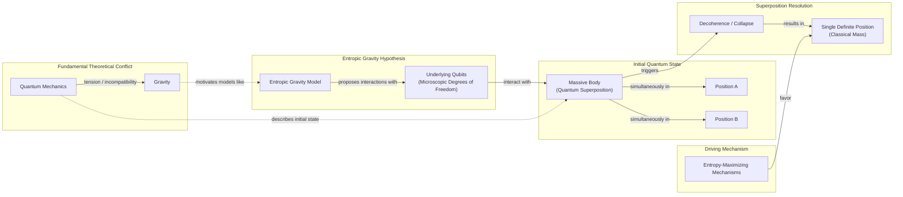
Image 3: A massive body in quantum superposition may have its state resolved by an entropic gravity model, which favors a single definite position to maximize entropy.

This idea connects to objective collapse theories, which propose that wave function collapse is a real physical process, possibly triggered by gravity itself. Models like the Diósi-Penrose theory suggest that superpositions of different spacetime curvatures are unstable and spontaneously collapse. These are not mere interpretations but new theories that modify quantum mechanics, making collapse a physical process distinct from environmental decoherence. They share testable consequences with entropic gravity models, such as mass-dependent decoherence rates [[2]](https://www.quantamagazine.org/is-gravity-just-entropy-rising-long-shot-idea-gets-another-look-20250613), [[16]](https://postquantum.com/quantum-computing/wave-function-collapse), [[17]](https://pmc.ncbi.nlm.nih.gov/articles/PMC11305101), [[18]](https://en.wikipedia.org/wiki/Objective-collapse_theory).

Tabletop experiments using atom interferometry or opto-mechanical systems are designed to search for this spontaneous collapse and could therefore also be used to test entropic gravity. Crucially, however, such effects have not yet been observed; standard quantum mechanics has passed every experimental test so far [[2]](https://www.quantamagazine.org/is-gravity-just-entropy-rising-long-shot-idea-gets-another-look-20250613), [[16]](https://postquantum.com/quantum-computing/wave-function-collapse), [[19]](https://arxiv.org/html/2512.15393v2).

Even with his doubts, Van Raamsdonk agrees the approach is worth exploring. "Since it hasn’t been established that actual gravity in our universe arises holographically, it’s certainly valuable to explore other mechanisms by which gravity might arise," he said. If this long-shot theory proves correct, it may mean that gravity is not, in fact, a law, but merely a statistical tendency [[2]](https://www.quantamagazine.org/is-gravity-just-entropy-rising-long-shot-idea-gets-another-look-20250613).
```
**Grader reasoning:**
- `cc`: Testing Entropic Gravity:
**1:** Both sections cover the same core ideas: the opening Carney quote on conceptual and experimental benefits, the superposition thought experiment, the qubit-bath decoherence prediction, the connection to objective-collapse theories including the Diósi-Penrose model, the tabletop experiments discussion, the Van Raamsdonk endorsement quote, and the closing philosophical reframing of gravity as a statistical tendency rather than an immutable law ("gravity is not, in fact, a law, but merely a statistical tendency").
- `fl`: Testing Entropic Gravity:
**1:** Both sections follow the same logical progression: Carney quote → superposition thought experiment → decoherence prediction → objective-collapse connection → tabletop experiments → Van Raamsdonk quote → philosophical reframing. The Mermaid diagram and the expanded objective-collapse paragraph are placed logically within the sequence and do not reorder or bury any GT idea.
- `de`: Testing Entropic Gravity:
**1:** [instances=1; quality=strong] A depth addition is present: the generated section provides a more detailed explanation of objective collapse theories, clarifying that models like Diósi-Penrose are new theories that modify quantum mechanics rather than mere interpretations, and that collapse is a physical process distinct from environmental decoherence. This qualifies as a theoretical-foundation addition and is traceable exclusively to the exploration-phase source at https://pmc.ncbi.nlm.nih.gov/articles/PMC11305101 (Source [42]), which does not appear in the golden source content. Classified strong: precise conceptual distinction with named theories. Therefore, the score is 1.
- `be`: Testing Entropic Gravity:
**0:** [instances=0] No breadth additions are present. The section stays focused on the connection between entropic gravity and quantum collapse theories without expanding into adjacent fields.
- `cp`: Testing Entropic Gravity:
**1:** depth_enhancement scored 1 for this section (breadth_enhancement scored 0), so the addition must be evaluated directly. The expanded objective-collapse explanation directly supports the section's core argument and is proportionate; it does not dilute the main narrative about testing entropic gravity.
- `ga`: Testing Entropic Gravity:
**1:** The generated section includes all required elements: the opening Carney quote, the superposition thought experiment, the decoherence prediction, the connection to objective wave-function collapse models, the tabletop experiments discussion, the Van Raamsdonk quote, and the closing philosophical reframing. The corrected prose-only word count is 285 words (previously miscounted as 297), within the 300 ± 30 range of [270, 330].

#### Draw: replicate1  `/mnt/f/my_projects/agentic_AI_RL/Reinsearch_agent/RL_researcher_writer_ymaxing/rl_training_data/noise_experiment/Gravity_Entropy__replicate1__preset1`

**Article text:**
```
## Testing Entropic Gravity

Carney thinks the main benefit of the new models is that they prompt conceptual questions about gravity and open up new experimental directions [[2]](https://www.quantamagazine.org/is-gravity-just-entropy-rising-long-shot-idea-gets-another-look-20250613). One such question arises from a thought experiment: if a massive body is placed in a quantum superposition of two different locations, what happens to its gravitational field? Does the field also enter a superposition, pulling on other objects in two directions at once? This scenario highlights the tension between quantum mechanics and gravity [[11]](https://postquantum.com/quantum-computing/wave-function-collapse).

The new entropic gravity models predict that the underlying qubits will interact with the massive body and force it to "choose" a single, definite location [[2]](https://www.quantamagazine.org/is-gravity-just-entropy-rising-long-shot-idea-gets-another-look-20250613). The system's tendency to maximize entropy favors a classical state, effectively causing the object’s wave function to collapse. This prediction links entropic gravity to objective-collapse theories, which modify quantum mechanics by positing that collapse is a real, physical process [[12]](https://en.wikipedia.org/wiki/Objective-collapse_theory). Unlike standard environmental decoherence, which is reversible, these models propose a new, irreversible physical mechanism [[13]](https://pmc.ncbi.nlm.nih.gov/articles/PMC11305101). Some proposals, notably from Roger Penrose, suggest gravity itself triggers this collapse, creating similar testable consequences [[11]](https://postquantum.com/quantum-computing/wave-function-collapse).


Image 3: A diagram illustrating the thought experiment of a massive body in quantum superposition and its resolution via the entropic gravity model.

This means that tabletop experiments designed to look for spontaneous collapse could also be used to test entropic gravity. "The same experimental setups could, in principle, be used to test both," said Angelo Bassi of the University of Trieste, who has led efforts to perform such experiments [[2]](https://www.quantamagazine.org/is-gravity-just-entropy-rising-long-shot-idea-gets-another-look-20250613).

Even with doubts, exploring these alternative ideas is valuable. “Since it hasn’t been established that actual gravity in our universe arises holographically, it’s certainly valuable to explore other mechanisms by which gravity might arise,” said Van Raamsdonk [[2]](https://www.quantamagazine.org/is-gravity-just-entropy-rising-long-shot-idea-gets-another-look-20250613). If this long-shot theory proves correct, it would reframe our understanding of the universe. Gravity would no longer be an immutable law of nature, but merely a statistical tendency.
```
**Grader reasoning:**
- `cc`: Testing Entropic Gravity:
**1:** Both sections cover Carney's opening "main benefit" quote, the superposition thought experiment, the model's collapse prediction, the connection to objective-collapse models with similar testable consequences, Bassi's quote, Van Raamsdonk's "worth a try" quote, and the closing reframe of gravity as a statistical tendency rather than a law. As in other generations, GT's detail that Bassi has "already ruled out some collapse models" and the Gerry-Mooney-poster closing device are both dropped -- consistent with the standing treatment, these are credibility/rhetorical color around content that is otherwise fully present, not missing substantive ideas. The added decoherence-vs-collapse distinction and the named Penrose reference are additions that do not displace anything.
- `fl`: Testing Entropic Gravity:
**1:** The generated section follows the same progression as the expected one: Carney's opening quote, the superposition thought experiment, the collapse prediction (with diagram), the objective-collapse-model connection (now including the added decoherence/Penrose elaboration), Bassi's quote, Van Raamsdonk's quote, and a closing reframe. No AI-analogy insertions appear in this section, and the added technical elaboration is well-integrated into the existing paragraph rather than disrupting it.
- `de`: Testing Entropic Gravity:
**1:** [instances=1; quality=strong] One qualifying instance: the added distinction that "unlike standard environmental decoherence, which is reversible, these models propose a new, irreversible physical mechanism," together with naming Roger Penrose specifically, is a theoretical-foundations/technical-nuance addition, traceable to the exploration-phase sources on pmc.ncbi.nlm.nih.gov/articles/PMC11305101 (Source [42], the reversible-vs-irreversible/decoherence distinction verbatim) and postquantum.com's wave-function-collapse explainer (Source [40], naming Penrose and Diósi specifically).
- `be`: Testing Entropic Gravity:
**0:** [instances=0] The decoherence/Penrose addition is depth only (a technical nuance of the collapse-model connection the guideline itself already calls for), not breadth.
- `cp`: Testing Entropic Gravity:
**1:** depth_enhancement scored 1 for this section on a specific, brief, well-sourced technical addition. That addition is proportionate (roughly one to a few sentences within a multi-paragraph section) and supports rather than displaces the section's GT-derived core narrative, which remains the clearly dominant content. CorePreservation is not affected by the untraceable AI-analogy content in this section, since that content was not identified as a depth or breadth addition in the prior pass and is out of scope for this criterion (it is a Flow/guideline_adherence matter instead).
- `ga`: Testing Entropic Gravity:
**1:** All of Section 5's required elements are present: opening with Carney's main-benefit quote exactly as instructed, the superposition thought experiment, the decoherence/collapse prediction, the link to objective-collapse models (elaborated further with the added decoherence-vs-collapse distinction and named Penrose reference, both closely related to the required connection), the tabletop-experiments prospect, Van Raamsdonk's value-of-exploring-alternatives quote, and a closing philosophical reframe. No AI-engineering framing appears in this section. Prose-only word count is 285 against a 300-word target (±30 tolerance, range 270-330), within tolerance.

#### Draw: replicate2  `/mnt/f/my_projects/agentic_AI_RL/Reinsearch_agent/RL_researcher_writer_ymaxing/rl_training_data/noise_experiment/Gravity_Entropy__replicate2__preset1`

**Article text:**
```
## Testing Entropic Gravity

Carney thinks the main benefit of the new models is that they "prompt conceptual questions about gravity and open up new experimental directions" [[2]](https://www.quantamagazine.org/is-gravity-just-entropy-rising-long-shot-idea-gets-another-look-20250613). A key thought experiment involves placing a massive body in a quantum superposition of two different locations. Would its gravitational field also be in a superposition, pulling objects in two directions at once? The entropic models predict that the underlying qubits would act on the mass to snap it out of this state and into a single, definite position [[8]](https://arxiv.org/abs/2502.17575). This is because the system's tendency to maximize entropy favors a single classical configuration that minimizes the ordered, low-entropy regions [[2]](https://www.quantamagazine.org/is-gravity-just-entropy-rising-long-shot-idea-gets-another-look-20250613).

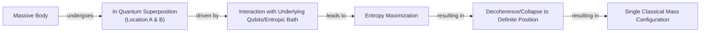
Image 3: A flowchart illustrating the thought experiment linking entropic gravity to objective wave-function collapse.

This prediction connects entropic gravity to objective-collapse theories, which propose that wave function collapse is a real physical process. Some of these theories, like the Diósi-Penrose model, suggest that gravity itself is what causes collapse, as nature does not tolerate superpositions of different spacetime curvatures [[13]](https://en.wikipedia.org/wiki/Objective-collapse_theory), [[14]](https://pmc.ncbi.nlm.nih.gov/articles/PMC11305101), [[15]](https://postquantum.com/quantum-computing/wave-function-collapse). Both entropic gravity and these collapse models predict that an isolated quantum system will eventually collapse on its own, with testable consequences. However, the absence of observed spontaneous collapse effects means standard quantum mechanics has passed every experimental test to date [[15]](https://postquantum.com/quantum-computing/wave-function-collapse), [[2]](https://www.quantamagazine.org/is-gravity-just-entropy-rising-long-shot-idea-gets-another-look-20250613).

Tabletop experiments, such as matter-wave interferometry with large molecules, are already underway to search for such spontaneous collapse effects, and these could be used to test both ideas simultaneously. For all his doubts, Van Raamsdonk agrees the approach is worthwhile. "Since it hasn’t been established that actual gravity in our universe arises holographically, it’s certainly valuable to explore other mechanisms by which gravity might arise," he said [[2]](https://www.quantamagazine.org/is-gravity-just-entropy-rising-long-shot-idea-gets-another-look-20250613). If this long-shot theory works out, gravity may not be a law, but just a statistical tendency.
```
**Grader reasoning:**
- `cc`: Testing Entropic Gravity:
**1:** Both sections cover Carney's opening "main benefit" quote (with name), the superposition thought experiment, the model's collapse prediction, the objective-collapse-model connection with the Diósi-Penrose model named, the tabletop-experiments prospect, and Van Raamsdonk's "worth a try" quote (with name). The guideline's specific "mass-dependent decoherence rates" signature is rendered more generically as "testable consequences," a minor imprecision rather than a missing idea. The added point about standard QM having passed every experimental test to date is an addition that does not displace anything.
- `fl`: Testing Entropic Gravity:
**1:** The generated section follows the same progression as the expected one: Carney's opening quote, the superposition thought experiment, the collapse prediction (with diagram), the objective-collapse-model connection, the tabletop-experiments prospect, and Van Raamsdonk's quote with a closing reframe.
- `de`: Testing Entropic Gravity:
**1:** [instances=1; quality=strong] One qualifying instance: "the absence of observed spontaneous collapse effects means standard quantum mechanics has passed every experimental test to date" is a theoretical-foundations addition about the empirical status of the collapse-model connection the guideline already invites, traceable to the exploration-phase source on postquantum.com (cited directly as [[15]]), which states this near-verbatim.
- `be`: Testing Entropic Gravity:
**0:** [instances=0] No qualifying breadth instance identified in this section -- any qualifying additions here stay within the same specific subject rather than reaching into a genuinely separate field.
- `cp`: Testing Entropic Gravity:
**1:** The qualifying depth addition in this section is a single, brief (roughly one sentence), well-sourced elaboration that supports rather than displaces the section's GT-derived core narrative, which remains clearly dominant.
- `ga`: Testing Entropic Gravity:
**1:** All of Section 5's required elements are present with quotes and names intact. Prose-only word count is 272 against a 300-word target (±30 tolerance, range 270-330) -- exactly 2 words above the floor, within tolerance but with almost no margin.

### Arm: standard (preset2)

#### Draw: production  `/mnt/f/my_projects/agentic_AI_RL/Reinsearch_agent/RL_researcher_writer_ymaxing/rl_training_data/test_episodes/Gravity_Entropy__preset2`

**Article text:**
```
## Testing Entropic Gravity

Image 4: Researchers like (clockwise from top left) Sabrina Pasterski, Ted Jacobson, Juan Maldacena, and Andrew Strominger are exploring the deep connections between gravity, thermodynamics, and quantum information. (Source [https://i.imgur.com/1g7xGjH.jpeg](https://i.imgur.com/1g7xGjH.jpeg))

The main benefit of the new entropic models is that they are "fully quantum mechanical from the ground up," as Carney puts it, which allows them to make concrete, testable predictions [[10]](https://arxiv.org/abs/2502.17575). Consider a thought experiment: a massive object is placed in a quantum superposition of two different locations. What happens to its gravitational field? Does the field also enter a superposition, or does it remain in a definite state? This question highlights the fundamental conflict between quantum mechanics and gravity.

Entropic gravity offers a clear prediction. The underlying qubit system would interact with the superposed mass, and the drive to maximize entropy would favor a single, classical configuration. The superposition would be forced to "choose" one location, a process known as decoherence or collapse. This is because a single mass minimizes the low-entropy "order pocket" or optimizes the energy distribution across the qubit bath more effectively than a smeared-out quantum state.

This prediction connects directly to objective-collapse theories, which propose that wave function collapse is a real physical process, possibly triggered by gravity itself [[12]](https://postquantum.com/quantum-computing/wave-function-collapse). These theories modify the standard Schrödinger equation with additional non-linear, stochastic terms that cause the wave function to spontaneously localize for massive or complex systems [[13]](https://en.wikipedia.org/wiki/Objective-collapse_theory). The Diósi-Penrose model, for example, suggests that superpositions of different spacetime curvatures are unstable and collapse spontaneously [[14]](https://pmc.ncbi.nlm.nih.gov/articles/PMC11305101). Both entropic gravity and objective-collapse models predict similar experimental signatures, such as mass-dependent decoherence rates that deviate from standard quantum mechanics.

This convergence opens the door for tabletop experiments. Researchers are already using highly sensitive instruments to test the limits of quantum superposition with increasingly massive objects. These experiments, designed to search for signs of spontaneous collapse, could simultaneously constrain or even falsify entropic gravity models by looking for the predicted anomalous decoherence. So far, such experiments have found no evidence for the effects predicted by the simplest collapse models, placing tight constraints on any such theory [[12]](https://postquantum.com/quantum-computing/wave-function-collapse).

Even if the holographic principle remains the leading candidate for a theory of quantum gravity, exploring long-shot alternatives is invaluable. As Mark Van Raamsdonk concedes, “Since it hasn’t been established that actual gravity in our universe arises holographically, it’s certainly valuable to explore other mechanisms by which gravity might arise” [[2]](https://www.quantamagazine.org/is-gravity-just-entropy-rising-long-shot-idea-gets-another-look-20250613). This exploration deepens our understanding of emergence and may reveal statistical fluctuations that inform how macroscopic laws arise from microscopic randomness. The goal is to distinguish between a deterministic geometric law and a statistical tendency. This represents a major shift in how we investigate the universe's most fundamental questions.

The journey from Newton's unease with "action at a distance" to the modern exploration of entropic gravity reveals a persistent theme in physics: the search for a mechanical, comprehensible origin for the forces that shape our universe. While Einstein's geometry provided a powerful framework, its limitations suggest that space, time, and gravity are not fundamental but emerge from a more primitive layer of reality.

This reflects a broader lesson from complexity science: reducing a phenomenon to fundamental laws is not sufficient to explain everything, as new behaviors and ontologies can appear at higher levels of organization [[15]](https://arxiv.org/html/2507.04951v4). Entropic gravity offers a unique, if incomplete, explanation for this emergence. It reframes gravity not as a fundamental force but as a statistical consequence of a microscopic system's tendency toward maximum disorder.

Although current models are still in their infancy, they provide a concrete quantum-mechanical framework that makes testable predictions. Some researchers are even exploring whether entropic gravity could provide a unified description of dark matter and dark energy, suggesting these cosmic puzzles might be manifestations of spacetime entropy dynamics rather than new particles [[16]](https://arxiv.org/html/2511.05632v1), [[17]](https://www.firstprinciples.org/article/gravity-from-entropy-new-theory-bridging-quantum-mechanics-and-relativity). The prospect of using tabletop experiments to probe the very nature of spacetime represents a major shift in how we investigate the universe's most fundamental questions.
```
**Grader reasoning:**
- `cc`: Testing Entropic Gravity:
**1:** Both sections cover the same core ideas: the opening Carney quote on testability, the quantum superposition thought experiment, the qubit-bath decoherence prediction, the connection to objective-collapse theories (including naming the Diósi-Penrose model), the tabletop experiment prospects, the Van Raamsdonk endorsement quote, and the philosophical reframing of gravity as a statistical tendency rather than an immutable law. In the generated section the reframing appears as "the goal is to distinguish between a deterministic geometric law and a statistical tendency" and "reframes gravity not as a fundamental force but as a statistical consequence of a microscopic system's tendency toward maximum disorder." The Gerry Mooney poster reference is absent but is a rhetorical device, not a substantive idea. Image 4 and the extra conclusion paragraphs (complexity science, dark matter) are additions that do not affect topical identity.
- `fl`: Testing Entropic Gravity:
**1:** Stepping over the qualifying additions, the GT ideas appear in correct order: Carney quote → superposition thought experiment → decoherence prediction → objective-collapse connection → tabletop experiments → Van Raamsdonk endorsement → philosophical reframing. Image 4 is an extra media element at the top. The extra conclusion paragraphs (complexity science and dark matter additions) are qualifying depth and breadth additions appended after all GT content. They do not crowd out or reorder any expected ideas; all GT ideas are fully present in sequence before the additions begin.
- `de`: Testing Entropic Gravity:
**1:** [instances=2; quality=strong,standard] Two depth additions are present. First: the generated section characterises objective-collapse theories as "new theories that modify the standard Schrödinger equation with additional non-linear, stochastic terms" that are distinct from ordinary decoherence — a more precise technical characterisation absent from the GT. This is traceable to exploration Sources [43] (postquantum.com) and [44] (Wikipedia Objective-collapse theory). Classified strong: precise mechanism-level distinction with named theoretical consequences. Second: the extra conclusion paragraphs introduce the complexity-science principle that "reducing a phenomenon to fundamental laws is not sufficient to explain everything, as new behaviors and ontologies can appear at higher levels of organization" — a theoretical foundation for emergent gravity absent from the GT. This is traceable to exploration Source [51] (arxiv.org/html/2507.04951v4). Classified standard: valid but more general philosophical framing. Therefore, the score is 1.
- `be`: Testing Entropic Gravity:
**1:** [instances=1; quality=strong] A breadth addition is present in the extra conclusion paragraphs: the generated section connects entropic gravity to dark matter and dark energy cosmology, noting that "some researchers are even exploring whether entropic gravity could provide a unified description of dark matter and dark energy, suggesting these cosmic puzzles might be manifestations of spacetime entropy dynamics rather than new particles." This qualifies as "emerging trends in adjacent fields." The content is traceable exclusively to exploration Sources [59] (arxiv.org/html/2511.05632v1) and [61] (firstprinciples.org). These discuss post-2010 Verlinde developments absent from the GT and from the 2010 golden Verlinde paper. Classified strong: substantive, multi-claim, named cosmological extension. Therefore, the score is 1.
- `cp`: Testing Entropic Gravity:
**1:** Depth additions (objective-collapse characterisation and complexity-science principle) and a breadth addition (dark matter/energy) are all present. The extra conclusion paragraphs are appended after all GT content and do not crowd out, repeat excessively, or shift emphasis away from the GT core. All GT ideas — superposition thought experiment, decoherence prediction, collapse theory connection, tabletop experiments, Van Raamsdonk endorsement, philosophical reframing — are fully present and remain the dominant narrative of the section.
- `ga`: Testing Entropic Gravity:
**0:** The generated section covers all required content: the opening Carney quote, the superposition thought experiment, the qubit-bath decoherence prediction, the link to objective-collapse models, the Diósi-Penrose model as an example, the tabletop experiment prospects, the Van Raamsdonk endorsement quote, and the philosophical reframing ("the goal is to distinguish between a deterministic geometric law and a statistical tendency"). However, the corrected prose-only word count is 618 words (previously 627), exceeding the upper tolerance bound of 330 words (300 ± 30 = [270, 330]) by 288 words. The overage is caused by the extra conclusion paragraphs (a generic Newton/Einstein recap, plus the complexity-science and dark-matter/energy additions) appended to the section. Even the core testing content alone — before those extra paragraphs — measures approximately 418 words, itself exceeding the 330-word ceiling on its own. A section length violation requires a score of 0.

#### Draw: replicate1  `/mnt/f/my_projects/agentic_AI_RL/Reinsearch_agent/RL_researcher_writer_ymaxing/rl_training_data/noise_experiment/Gravity_Entropy__replicate1__preset2`

**Article text:**
```
## Testing Entropic Gravity

The primary benefit of these new models, as Carney emphasizes, is that they "prompt conceptual questions about gravity and open up new experimental directions" [[2]](https://www.quantamagazine.org/is-gravity-just-entropy-rising-long-shot-idea-gets-another-look-20250613). They make concrete predictions that distinguish them from standard quantum gravity, where gravity is mediated by gravitons [[3]](https://arxiv.org/abs/2502.17575).

Consider a thought experiment where a massive object is placed in a quantum superposition, existing in two locations at once. A key question in physics is whether the gravitational field created by this object also enters a superposition. Entropic gravity offers a clear prediction. The underlying sea of qubits, driven by entropy maximization, would inherently favor a single, definite classical state for the mass. Interaction with this qubit bath would quickly destroy the superposition, causing it to "decohere" or collapse into one of the two possible locations [[3]](https://arxiv.org/abs/2502.17575).

```mermaid
stateDiagram-v2
    [*] --> "Massive body in quantum superposition<br/>(|L> + |R>)"
    "Massive body in quantum superposition<br/>(|L> + |R>)" --> "Gravitational field in superposition"
    "Gravitational field in superposition" --> "Underlying qubits<br/>(entropic gravity model)" : "interacts with"
    "Underlying qubits<br/>(entropic gravity model)" --> "Entropy-maximizing mechanisms" : "activates"
    "Entropy-maximizing mechanisms" --> "Decohere or collapse toward a definite position" : "causes"
    "Decohere or collapse toward a definite position" --> "Single classical mass configuration"
    "Single classical mass configuration" --> [*]
```
Image 7: State transition diagram of a massive body in quantum superposition and its collapse due to entropic gravity.

This prediction connects entropic gravity to "objective collapse" models. These theories modify the Schrödinger equation, proposing that wave function collapse is a real physical process. One of the most notable versions is the Diósi-Penrose model, which suggests that gravity itself is the culprit that causes collapse. A superposition of a mass in two different locations would create a superposition of two different spacetime curvatures, a state Penrose argued is unstable and would spontaneously collapse. Both entropic gravity and objective collapse models predict that larger masses should decohere faster, a signature that could be sought in tabletop experiments [[14]](https://postquantum.com/quantum-computing/wave-function-collapse), [[15]](https://pmc.ncbi.nlm.nih.gov/articles/PMC11305101), [[16]](https://en.wikipedia.org/wiki/Objective-collapse_theory).

Experiments using matter-wave interferometry with large molecules are already pushing the boundaries, seeking to detect any loss of coherence beyond what standard environmental effects would predict. So far, these experiments have found no evidence for spontaneous collapse, placing tight constraints on the simplest versions of these models. However, the search continues, and these same experiments could simultaneously constrain or falsify entropic gravity models [[17]](https://www.youtube.com/watch?v=yPvRQ5nyKZY).

Even if the holographic principle remains the leading candidate for a theory of quantum gravity, exploring long-shot alternatives like entropic gravity is valuable. As Mark Van Raamsdonk concedes, "Since it hasn’t been established that actual gravity in our universe arises holographically, it’s certainly valuable to explore other mechanisms by which gravity might arise" [[2]](https://www.quantamagazine.org/is-gravity-just-entropy-rising-long-shot-idea-gets-another-look-20250613). It forces us to confront deep questions about emergence and randomness. It suggests that gravity may not be an immutable law of nature, but rather a statistical tendency—an illusion born from the chaotic dance of a hidden microscopic world.
```
**Grader reasoning:**
- `cc`: Testing Entropic Gravity:
**1:** Both sections cover Carney's opening "main benefit" quote, the superposition thought experiment, the model's collapse prediction, the connection to objective-collapse models (elaborated further here with Penrose's specific spacetime-curvature-superposition argument), the mass-dependent-decoherence-rate signature, the tabletop-experiments prospect (elaborated with matter-wave-interferometry specifics), Van Raamsdonk's "worth a try" quote (including the guideline's "holographic principle remains leading candidate" framing, matched closely), and a closing reframe of gravity as a statistical tendency. GT's Angelo Bassi quote and attribution ("the same experimental setups could...test both," plus his university and his track record of already ruling out some collapse models) is entirely absent here. Resolved on review: the idea Bassi's quote conveys -- that the same tabletop experiments built to test spontaneous-collapse models can also test entropic gravity, since both predict the same physical signature -- is fully present in the generated section's own words ("these same experiments could simultaneously constrain or falsify entropic gravity models"). Bassi's name and credentials are the citation that makes the claim authoritative, not the claim itself; per the rubric's own test, only a named example or artifact that is central to illustrating the idea constitutes a content mismatch when swapped, and an attribution is not that -- it is the same category of omission as dropping GT's four named co-authors or Brustein's "has cooled on the idea" biographical detail, both already established as non-fatal. core_content=1 is confirmed, not merely provisional.
- `fl`: Testing Entropic Gravity:
**1:** The generated section follows the same progression as the expected one: Carney's opening quote, the superposition thought experiment, the collapse prediction (with diagram), the objective-collapse-model connection (elaborated with Penrose's specific argument and interferometry detail), Van Raamsdonk's quote, and a closing reframe. No media-placement or ordering issues.
- `de`: Testing Entropic Gravity:
**1:** [instances=1; quality=strong] One qualifying instance: the added detail that "a superposition of a mass in two different locations would create a superposition of two different spacetime curvatures, a state Penrose argued is unstable" is a theoretical-foundations addition elaborating the collapse-model connection the guideline already invites, traceable to the exploration-phase source on postquantum.com (Source [43], under "What open questions link entropic gravity to objective collapse in quantum theory?"), which describes this exact Penrose/Diósi argument in near-identical terms.
- `be`: Testing Entropic Gravity:
**0:** [instances=0] The qualifying Penrose/spacetime-curvature addition is classified as depth only, since it deepens the specific collapse-model connection the guideline already calls for rather than reaching into a genuinely separate field.
- `cp`: Testing Entropic Gravity:
**1:** At least one of depth_enhancement/breadth_enhancement scored 1 for this section on specific, brief, well-sourced additions. Each qualifying addition is proportionate (roughly a sentence to a short paragraph within a several-hundred-word section) and supports rather than displaces the section's GT-derived core narrative, which remains the clearly dominant content. Any untraceable additions present in the same section (rhetorical analogies, images) were not identified as depth or breadth additions in the prior pass and are out of scope for this criterion.
- `ga`: Testing Entropic Gravity:
**0:** All of Section 5's required content elements are present and closely matched to the guideline's own phrasing (opening Carney quote, decoherence/mass-dependent-rate framing, tabletop-experiments prospect, the "even if holographic principle remains leading candidate" framing via Van Raamsdonk's quote, closing reframe). However, prose-only word count is 380 against a 300-word target (±30 tolerance, range 270-330), exceeding the ceiling by 50 words -- on its own enough to fail this criterion.

#### Draw: replicate2  `/mnt/f/my_projects/agentic_AI_RL/Reinsearch_agent/RL_researcher_writer_ymaxing/rl_training_data/noise_experiment/Gravity_Entropy__replicate2__preset2`

**Article text:**
```
## Testing Entropic Gravity

The primary benefit of these new models, according to Carney, is their testability. "Our primary goal is to demonstrate how non-relativistic gravity can arise in detail as a thermodynamic limit of a controlled microscopic model," he and his co-authors write. They add that this can explain "how such a scenario can be experimentally distinguished from ordinary virtual graviton exchange" [[8]](https://arxiv.org/abs/2502.17575).

### Superposition, Collapse, and Experimental Tests

A key area for testing involves the intersection of gravity and quantum mechanics. Consider a thought experiment. A massive object is placed in a quantum superposition, existing in two locations at once. What happens to its gravitational field? Does the field also enter a superposition, curving spacetime in two ways simultaneously? Or does it remain in a single, definite state? This question exposes the deep tension between the two theories.

Entropic gravity offers a concrete prediction. The underlying qubit system, driven by entropy maximization, would interact with the superposition. The system favors a single, classical configuration for the mass, as this minimizes the low-entropy "ordered" region in the qubit bath. This interaction would cause the superposition to rapidly decohere, or collapse, into one definite position.

```mermaid
stateDiagram-v2
    [*] --> "Massive body in quantum superposition"
    "Massive body in quantum superposition" --> "Gravitational field in superposition"
    "Gravitational field in superposition" --> "Underlying qubits" : "interacts with"
    "Underlying qubits" --> "Entropy-maximizing mechanisms" : "activates"
    "Entropy-maximizing mechanisms" --> "Decohere or collapse toward a definite position" : "causes"
    "Decohere or collapse toward a definite position" --> "Single classical mass configuration"
    "Single classical mass configuration" --> [*]
```
Image 4: A state transition diagram illustrating the thought experiment of a massive body in quantum superposition and the entropic gravity model's prediction for its collapse.

This prediction aligns with a class of theories known as "objective collapse" models. These theories modify quantum mechanics, proposing that wave functions collapse spontaneously as a physical process, not because of observation [[12]](https://en.wikipedia.org/wiki/Objective-collapse_theory). The Diósi-Penrose model, for instance, posits that gravity itself triggers the collapse, as superpositions of different spacetime curvatures are unstable [[13]](https://postquantum.com/quantum-computing/wave-function-collapse/#objective-collapse-theories-nature-does-collapse-on-its-own). These models predict that the rate of collapse should depend on the mass of the object. Tabletop experiments are already being conducted to look for this mass-dependent decoherence. Their results can be used to constrain or potentially falsify entropic gravity models.

Even if the holographic principle remains the leading candidate for a theory of quantum gravity, exploring long-shot alternatives like entropic gravity is valuable. As Van Raamsdonk acknowledges, “Since it hasn’t been established that actual gravity in our universe arises holographically, it’s certainly valuable to explore other mechanisms by which gravity might arise” [[2]](https://www.quantamagazine.org/is-gravity-just-entropy-rising-long-shot-idea-gets-another-look-20250613). Such explorations deepen our understanding of emergence, revealing how macroscopic laws might arise from microscopic randomness and reframing gravity not as an immutable law, but as a statistical tendency.
```
**Grader reasoning:**
- `cc`: Testing Entropic Gravity:
**1:** Both sections cover the superposition thought experiment, the model's collapse prediction, the objective-collapse-model connection with the Diósi-Penrose model named and the mass-dependent-decoherence signature made explicit, the tabletop-experiments prospect, and Van Raamsdonk's "worth a try" quote (with name). As in Strengths and Weaknesses, GT's specific "main benefit...prompt conceptual questions" quote is replaced by a different, genuine quote from the golden paper's abstract, preceded by an explicit statement that testability is the primary benefit -- the idea and Carney's name are both present via a real quotation, so this is not scored as a core_content failure.
- `fl`: Testing Entropic Gravity:
**1:** The generated section follows the same progression as the expected one: an opening testability quote, the superposition thought experiment, the collapse prediction (with diagram), the objective-collapse-model connection, the tabletop-experiments prospect, and Van Raamsdonk's quote with a closing reframe.
- `de`: Testing Entropic Gravity:
**0:** [instances=0] No addition beyond baseline GT-matching content was identified in this section.
- `be`: Testing Entropic Gravity:
**0:** [instances=0] No addition beyond baseline GT-matching content was identified in this section.
- `cp`: Testing Entropic Gravity:
**1:** Both depth_enhancement and breadth_enhancement scored 0 for this section. Per the mandatory default rule, CorePreservation scores 1 by default.
- `ga`: Testing Entropic Gravity:
**0:** All of Section 5's required elements are present (with a substituted-but-genuine Carney quote for the main-benefit point). However, prose-only word count is 363 against a 300-word target (±30 tolerance, range 270-330), exceeding the ceiling by 33 words -- a clear overage.
