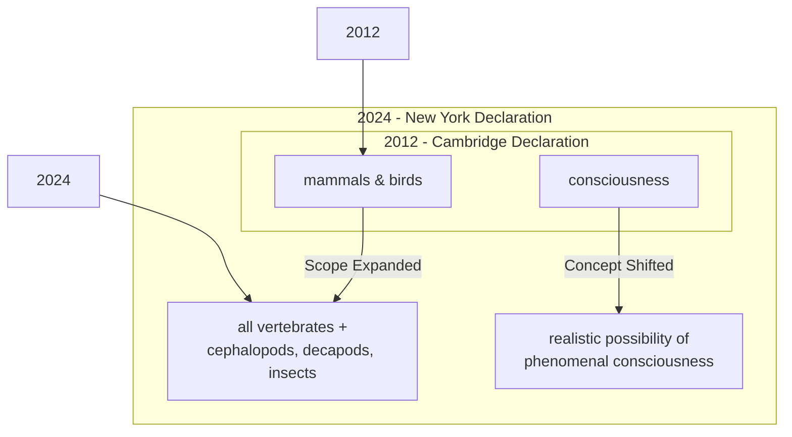
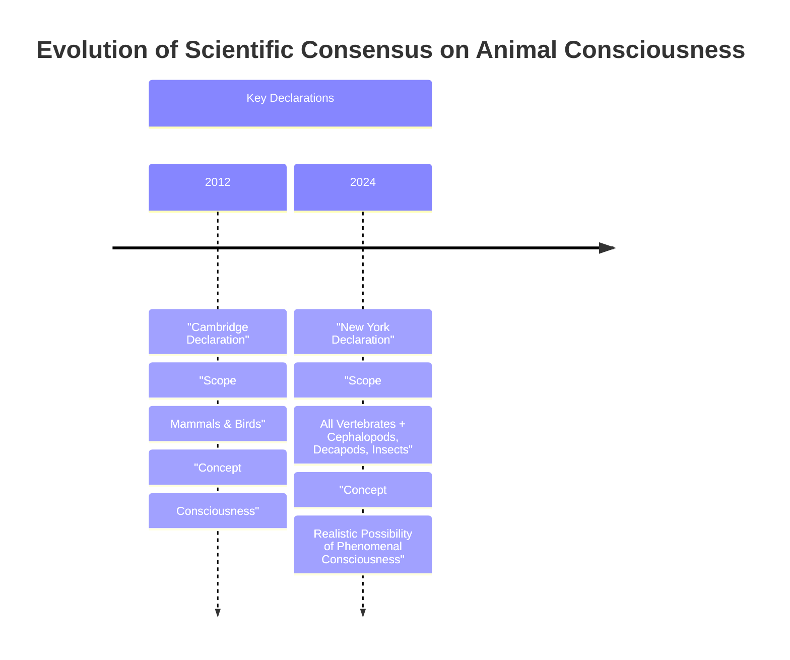
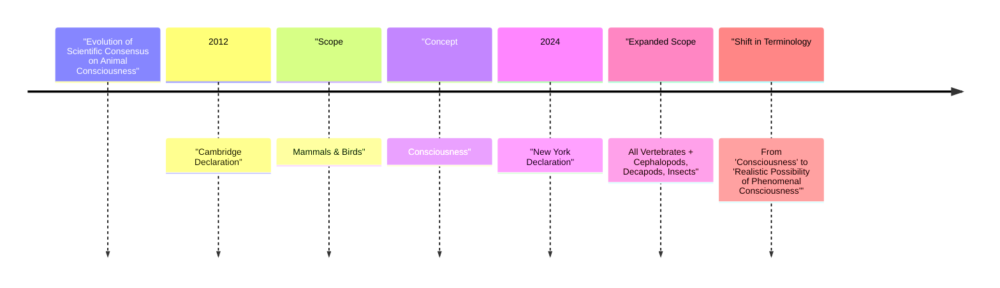

# Near-tie review: Insects_Consciousness  (deep vs light, margin=+0.0307 -- manually overridden to `deep`, `tied_arms=[light]`)

## Reviewer conclusion (2026-09-06, amended 2026-09-07): DOUBLE ORACLE -- `deep` primary (override, coincides with raw argmax), `light` tied

**What changed:** `article_oracle.json` was very stale (2026-08-25) vs a fresh
re-grading round of all 12 episode dirs -- regenerated via `--force`. Margin
dropped sharply from the prior review's +0.0599 to **+0.0307** (now right at
the `ARTICLE_MARGIN_NOISE_SD/sqrt(3)=0.0312` threshold -- would trigger
`needs_review` if this weren't already a manual override, which bypasses that
check unconditionally). `oracle_arm` stays `deep` via `_MANUAL_OVERRIDES`
(`"Insects_Consciousness": "deep"`) -- **this dict entry had NO documentation
comment at all** (unusual; every other entry in the file has one), fixed as
part of this review.

**Is the override still doing anything?** No -- `deep` is currently ALSO the
raw mean-R_w argmax (R_w=[skip=0.360, light=0.547, standard=0.473,
**deep=0.577**]), so the override is presently redundant with the
uncorrected data, same situation `13_agent_framework`/`29_evaluation_metrics`
document elsewhere in this file ("not a true override -- remains the raw
argmax"). Kept rather than removed: pinning the decision protects against a
future re-grading nudging the raw argmax to flip back to `light` without a
deliberate re-review, exactly the scenario this file's other "not a true
override" entries are designed to guard against.

**Distributional basis -- the override's real justification is thinner than
it first looks:** per-draw margins (deep - light) are **[-0.0505, +0.0082,
+0.1344]** -- production favors light, replicate1 and replicate2 both favor
deep, a nominal 2/3 majority for deep. But replicate1's "win" for deep
(+0.0082) is an order of magnitude smaller than either of the other two
draws' margins (roughly 6x smaller than production's, 16x smaller than
replicate2's) -- the same "near-zero draw inflating a majority count" pattern
flagged for `Bird_Eye_Extreme` earlier this session. Treating replicate1 as a
genuine tie/abstention rather than a real vote for deep leaves the per-draw
evidence as a true 1-1 split (production for light, replicate2 for deep),
not a clean majority either way. The averaged-R_w case for `deep` rests
substantially on replicate2's one large swing (+0.1344). Moderated
significance: t=0.563, p(two-tailed)=0.630 -- essentially no statistical
evidence favoring either arm.

**Quantitative basis (deep vs light, n=9 sections-draws per arm):** `cc`/
`fl`/`cp` all tied at 1.000. `de` favors **deep** (0.889 vs 0.667, +0.222) --
deep's extra exploration genuinely earns more depth credit, as expected.
`be` mildly favors **light** (0.667 vs 0.556, -0.111) and `ga` also favors
**light** (0.778 vs 0.667, -0.111) -- deep's longer, richer sections cost a
little on breadth-balance and guideline-adherence. Net: deep's real,
substantive `de` advantage is only partly offset by two small light-favoring
dimensions, giving `deep` the edge in expectation even though the per-draw
picture is closer to a coin flip than the averaged margin alone suggests.

**Decision:** KEEP the override to `deep` -- it is still the best point
estimate (raw argmax agrees, and the quantitative mechanism is coherent: real
depth-enhancement credit outweighing small light-favoring costs), not a case
of a wrong or stale override the way `HNSW`'s was. But this is honestly a
thin, mixed-evidence near-tie (p=0.630, one vote a near-wash), not a
confidently-decided case.

**AMENDMENT (2026-09-07):** applying the newly-formalized multi-oracle rule
(margin below the 0.0312 noise threshold; hard vote agrees with the mean
winner deep 2/3, but replicate1's win margin (+0.0082, ~26% of the noise
threshold) is negligible, not a real win) confirms this as a genuine
MULTIPLE-oracle case. `_TIED_ARMS["Insects_Consciousness"] = ["light"]`
added -- `light` now counts as an equally-valid EXACT prediction alongside
`deep` in `test_grok_planner.py`.

---

## All sections (deep vs light), most-against-deep first
| section | weight | contribution | running total |
|---|---:|---:|---:|
| section-3-mindful-relations | 0.237 | -0.0335 | -0.0335 |
| section-2-a-growing-awareness | 0.447 | +0.0158 | -0.0176 |
| section-1-introduction | 0.316 | +0.0483 | +0.0307 |

(stored article margin = +0.0307 -- should match the running total's final row to ~4 decimals)

## Section: S3::section-3-mindful-relations  (weight=0.237, contribution=-0.0335 AGAINST deep)
Stored section rewards: deep=0.5324  light=0.6442  (explore: deep=0.2350  light=0.3075)

### Arm: deep (preset3)

#### Draw: production  `/mnt/f/my_projects/agentic_AI_RL/Reinsearch_agent/RL_researcher_writer_ymaxing/rl_training_data/test_episodes/Insects_Consciousness__preset3`

**Article text:**
```
## Mindful Relations

Accepting the "realistic possibility" of consciousness in invertebrates and other overlooked animals moves the discussion from a scientific debate to an ethical imperative we must address.

### New Ethical Obligations

If these animals have subjective experiences, our obligations extend beyond simply preventing pain. As Jeff Sebo argues, we must also "provide them with the kinds of enrichment and opportunities that allow them to express their instincts and explore their environments and engage in social systems". This means creating conditions that allow for positive welfare, not just the absence of suffering [[31]].

### Practical Tensions

However, this expanded ethical circle creates immediate practical tensions. Our relationship with some insects is fundamentally adversarial, from crop pests to disease vectors. As Peter Godfrey-Smith notes, "The idea that we could just sort of make peace with the mosquitoes—it’s a very different thought than the idea that we could make peace with fish and octopuses". New challenges are also emerging with the rise of industrial insect farming for food and animal feed. In this context, insects are often treated as "biomass" rather than animals, and their slaughter is termed "harvesting," creating a legal and ethical gray area for their welfare [[49, 54]].

### The Laboratory Welfare Gap

A significant welfare gap also exists in the laboratory. While research on vertebrates is highly regulated, invertebrates like fruit flies (*Drosophila*) and nematode worms (*C. elegans*) are used in staggering numbers with virtually no welfare oversight. As researcher Matilda Gibbons points out, "We think about the welfare of livestock and of mice in research, but we never think about the welfare of the insects". This stands in stark contrast to the growing protections for cephalopods, where the lack of standardized welfare metrics remains a critical gap as more scientists enter the field [[15, 49]].

### Policy Following Science

Policy can, however, follow the science. The United Kingdom offers a clear precedent. Following a 2021 review of over 300 scientific studies by the London School of Economics, the government amended its Animal Welfare (Sentience) Bill to include all decapod crustaceans and cephalopod molluscs, legally recognizing animals like crabs, lobsters, and octopuses as sentient beings [[6, 7]].

### A Cautionary Tale for AI

While our understanding of animal minds deepens, experts urge caution when drawing parallels to artificial intelligence. Jeff Sebo states that "Current AI systems are very unlikely to be conscious" by the same evidentiary standards applied to animals. However, he adds that the rapid shift in biology "does give me pause and makes me want to approach the topic with caution and humility" when considering future AI systems. The lesson for us as AI engineers is that we may need frameworks for assessing moral patienthood that, like those for animals, use probabilistic judgments rather than waiting for absolute certainty [[49, 55]].

### The Path Forward

The most promising path forward may lie in using the animals already ubiquitous in labs worldwide. Kristin Andrews issues a direct call to action to the scientific community: "All these nematode worms and fruit flies that are in almost every university—study consciousness in them," she says. "You already have them. Somebody in your lab is going to need a project. Make that project a consciousness project. Imagine that!". Such programs could use the powerful genetic tools available for these organisms to test specific hypotheses about the neural underpinnings of subjective experience, perhaps even exploring what Jonathan Birch calls "minimal consciousness" in a worm with only 302 neurons. By turning our scientific tools toward these simpler models, we may unlock fundamental insights into how and where consciousness arises across the vast tree of life [[14, 49, 56, 57]].
```
**Grader reasoning:**
- `cc`: Mindful Relations:
**1:** Both sections discuss the ethical implications of the declaration, including the need for positive welfare, the practical tensions with pests and insect farming, the laboratory welfare gap, the UK policy precedent, the comparison to AI, and the call for more research on model organisms. All core ideas are present.
- `fl`: Mindful Relations:
**1:** Both sections move from general ethical obligations, to practical tensions with insects, to the laboratory welfare gap, to policy, to the AI parallel, to a closing call to action. The H3 subheadings mirror this same order, and the added content (insect farming, AI moral-patienthood frameworks, minimal consciousness in nematodes) is layered onto the existing themes without disrupting the progression.
- `de`: Mindful Relations:
**1:** [instances=1; quality=strong] One qualifying depth addition is present: the reference to Jonathan Birch's concept of "minimal consciousness" in a nematode with 302 neurons is a technical nuance, traceable to https://pmc.ncbi.nlm.nih.gov/articles/PMC10723751 (Source [67], phase=EXPLORATION), which discusses exactly this framing, citing Birch's 'Four Investigation Priorities.' Reclassified out of this dimension: the insect-farming/"biomass"/"harvesting" detail (previously counted here as a second depth instance) is verified accurately sourced to https://faunalytics.org/do-consumers-care-about-farmed-insect-welfare (Source [75], phase=EXPLORATION, whose own query is literally "How is invertebrate consciousness research shaping insect welfare in agriculture and food production?"), but it is a practical application of the core topic in an adjacent industry (food/agriculture), which is squarely a breadth criterion, not a depth one (it doesn't add technical/theoretical nuance to the core topic itself -- it applies the topic's stakes to a different domain). Moved to breadth_enhancement below; this does not change this section's depth score, since one instance (the nematode reference) still qualifies.
- `be`: Mindful Relations:
**1:** [instances=2; quality=strong,strong] Two qualifying breadth additions are present. First, the paragraph proposing that AI companies develop "frameworks for assessing moral patienthood that, like those for animals, use probabilistic judgments rather than waiting for absolute certainty" is a cross-domain analogy — transplanting a methodology from animal-consciousness assessment to AI moral-patienthood assessment, a genuinely adjacent field. This is traceable to https://arxiv.org/html/2411.00986v1 (Source [77], phase=EXPLORATION), which makes this exact recommendation almost verbatim ('frameworks for assessing AI systems for moral patienthood that resemble the kinds used for animals by making probabilistic judgments'). A prior grading pass missed this instance and scored breadth_enhancement 0 for this section. Second (reclassified from depth_enhancement, see that section): the detail that industrial insect farming treats insects as "biomass" and terms their slaughter "harvesting" is a practical application of the core topic (insect welfare/consciousness) in an adjacent domain (food/agriculture), traceable to https://faunalytics.org/do-consumers-care-about-farmed-insect-welfare (Source [75], phase=EXPLORATION), whose own query is about agricultural/food-production applications specifically.
- `cp`: Mindful Relations:
**1:** The qualifying depth additions (insect-farming terminology, minimal consciousness in nematodes) and the qualifying breadth addition (the AI moral-patienthood analogy) are concise, well-integrated elaborations layered onto the section's existing themes. The ground truth's core ethical and practical narrative remains clearly dominant throughout.
- `ga`: Mindful Relations:
**0:** Exact prose-only word count: 587 words (a correction from the previously-reported ~567, for the same reason as "A Growing Awareness" above -- the six H3 sub-heading titles' 20 words were excluded from that count but must be included per the memo). Target 450, tolerance ±45, range 405-495 -- 92 words over the ceiling (an even larger overage than previously stated, not a smaller one), a clear, non-borderline violation that a prior grading pass missed entirely (it had estimated "approximately 450 words, matching the target"). All required content points are otherwise present and correctly covered (enrichment, insect tension, lab welfare gap, UK legislative precedent, AI caution, and Andrews's call to action, with no separate conclusion added), but the section is substantially over length once the complementary additions (insect farming, AI moral-patienthood frameworks, minimal consciousness in nematodes) are accounted for.

#### Draw: replicate1  `/mnt/f/my_projects/agentic_AI_RL/Reinsearch_agent/RL_researcher_writer_ymaxing/rl_training_data/noise_experiment/Insects_Consciousness__replicate1__preset3`

**Article text:**
```
## Mindful Relations

When we accept the realistic possibility of phenomenal consciousness in a wider range of animals, we also accept new ethical obligations. The declaration states that "it is irresponsible to ignore that possibility in decisions affecting that animal". According to Jeff Sebo, this goes beyond simply preventing pain. We must also provide animals in our care with "the kinds of enrichment and opportunities that allow them to express their instincts and explore their environments and engage in social systems and otherwise be the kinds of complex agents they are" [[7]](http://www.nydeclaration.com/), [[14]](https://www.quantamagazine.org/insects-and-other-animals-have-consciousness-experts-declare-20240419).

However, extending these considerations to all animals, especially insects, creates practical tensions. As Peter Godfrey-Smith points out, our relationship with many insects is "inevitably a somewhat antagonistic one," involving crop pests and disease-carrying mosquitoes. The idea of making "peace with the mosquitoes" is very different from doing so with fish or octopuses, forcing us into a more nuanced ethical calculus of trade-offs rather than a simple rule of non-interference [[14]](https://www.quantamagazine.org/insects-and-other-animals-have-consciousness-experts-declare-20240419).

These tensions are amplified by the emerging industry of insect farming for food and feed. Insects in these facilities are often described as "biomass" rather than animals, and their killing is termed "harvesting." This operates in a legal gray area, as invertebrates are typically excluded from animal welfare directives, leading to practices developed by trial and error without oversight. This highlights how psychological biases that make it hard to accept insect sentience can directly impact their treatment [[27]](https://faunalytics.org/do-consumers-care-about-farmed-insect-welfare), [[28]](https://forum.effectivealtruism.org/posts/2RdYDcwrnvdCn2SbK/the-case-for-insect-consciousness).

This new awareness also exposes a notable welfare gap in scientific research. While standards exist for lab rodents, insects like *Drosophila melanogaster* (fruit flies) are used in countless experiments with no protocols addressing their potential sentience. In contrast, growing evidence of cephalopod and decapod sentience has already led to policy changes. In the UK, a government-commissioned review by the London School of Economics concluded there was strong evidence of sentience in these animals. This led to their inclusion in the Animal Welfare (Sentience) Act of 2022, a concrete example of how scientific consensus can translate into law [[14]](https://www.quantamagazine.org/insects-and-other-animals-have-consciousness-experts-declare-20240419), [[29]](https://www.eurogroupforanimals.org/news/uk-sentience-bill-passes-final-stages-recognise-decapod-and-cephalopod-sentience-law), [[30]](https://www.eurogroupforanimals.org/news/decapods-and-cephalopods-be-recognised-sentient-beings-under-uk-law), [[31]](https://researchbriefings.files.parliament.uk/documents/CBP-9423/CBP-9423.pdf).

The discussion around animal minds offers a cautionary lesson for us in the field of AI. While Sebo and other experts agree that "current AI systems are very unlikely to be conscious," the rapid evolution of our understanding of animal consciousness advises "caution and humility" when considering the future of AI. The core principle is that subjective experience is what matters for moral consideration, not the substrate—whether it is biological or artificial [[14]](https://www.quantamagazine.org/insects-and-other-animals-have-consciousness-experts-declare-20240419), [[32]](https://www.animal-ethics.org/the-new-york-declaration-on-animal-consciousness-stresses-the-ethical-implications).

Ultimately, the path forward involves more research. Kristin Andrews has made a powerful call to action: use the animals we already have in our labs. "All these nematode worms and fruit flies that are in almost every university—study consciousness in them," she urges. "You already have them. Somebody in your lab is going to need a project. Make that project a consciousness project. Imagine that!". This could open the door to using powerful genetic tools to test different hypotheses about consciousness and better understand its fundamental mechanisms, a pursuit that could further expand our appreciation for the vast diversity of minds on our planet [[14]](https://www.quantamagazine.org/insects-and-other-animals-have-consciousness-experts-declare-20240419), [[33]](https://www.multiverses.xyz/podcast/animal-minds-kristin-andrews-on-assuming-consciousness-in-other-species), [[34]](https://pmc.ncbi.nlm.nih.gov/articles/PMC10723751).
```
**Grader reasoning:**
- `cc`: Mindful Relations:
**1:** All GT ideas are present, again with unusually complete quote fidelity: the Sebo enrichment quote (exact), the Godfrey-Smith mosquito/antagonism quote (exact), the UK legislative precedent, the Sebo AI-caution quotes, and the Andrews nematode/fruit-fly quote reproduced in full including the closing "Imagine that!" line, matching GT verbatim -- the most complete reproduction of this specific closing seen across grading rounds. The Drosophila welfare-gap point is covered as an idea but without the Gibbons quote, consistent with how this recurring substitution has been treated elsewhere. The added insect-farming-for-food paragraph is a pure addition with no GT counterpart to displace.
- `fl`: Mindful Relations:
**1:** The generated section's order -- enrichment/Sebo, insect tensions/Godfrey-Smith, the added insect-farming paragraph, the welfare gap/UK policy, AI caution/Sebo, Andrews closing -- matches GT's order with the addition properly stepped over, not displacing any GT idea.
- `de`: Mindful Relations:
**0:** [instances=0] No depth additions found in this section; the insect-farming paragraph (discussed under breadth_enhancement) connects outward to an adjacent industry/domain rather than deepening the core topic's inner workings.
- `be`: Mindful Relations:
**1:** [instances=1; quality=strong] One qualifying breadth addition: the insect-farming-for-food paragraph ("insects in these facilities are often described as 'biomass' rather than animals, and their killing is termed 'harvesting'...invertebrates are typically excluded from animal welfare directives...psychological biases that make it hard to accept insect sentience") extends the section's insect-ethics argument to the adjacent domain of food/agriculture policy. Cited as [[27], [28]], tracing accurately to exploration sources 75 (faunalytics.org, the biomass/harvesting/legal-gray-area language) and 74 (forum.effectivealtruism.org, the psychological-biases point).
- `cp`: Mindful Relations:
**1:** Breadth_enhancement scored 1 for this section (depth_enhancement scored 0), so CorePreservation evaluates that one addition. The insect-farming paragraph is one of six paragraphs in the section and remains clearly in service of the broader insect-ethics argument; it does not crowd out any of GT's ideas, all of which remain present.
- `ga`: Mindful Relations:
**1:** All required elements are present, including a verbatim Andrews/nematode closing quote ending on "Imagine that!" No separate Conclusion section is added. Prose-only word count is 507 against 450 (±10%, min ±25 → ±45, range 405-495) -- 12 words over the maximum, consistent with the borderline range where past margins (12-18 words) have been ruled within tolerance; scored 1 here for consistency, flagged per the exact-margin reporting rule.

#### Draw: replicate2  `/mnt/f/my_projects/agentic_AI_RL/Reinsearch_agent/RL_researcher_writer_ymaxing/rl_training_data/noise_experiment/Insects_Consciousness__replicate2__preset3`

**Article text:**
```
## Mindful Relations

Accepting the realistic possibility of consciousness carries significant ethical weight, as absolute certainty is not required for moral consideration [[61]](https://www.animal-ethics.org/the-new-york-declaration-on-animal-consciousness-stresses-the-ethical-implications). The obligation extends beyond simply preventing pain. As Jeff Sebo argues, we must also provide animals in our care with "the kinds of enrichment and opportunities that allow them to express their instincts and explore their environments and engage in social systems and otherwise be the kinds of complex agents they are" [[31]](https://www.quantamagazine.org/insects-and-other-animals-have-consciousness-experts-declare-20240419). This means creating conditions for positive experiences, not just minimizing negative ones.

However, this ethical shift creates practical tensions, especially with insects. As Peter Godfrey-Smith notes, our relationship with many insects is "inevitably a somewhat antagonistic one" [[31]](https://www.quantamagazine.org/insects-and-other-animals-have-consciousness-experts-declare-20240419). We cannot simply "make peace with the mosquitoes" that carry diseases or the pests that destroy crops. Recognizing their potential for consciousness does not eliminate these conflicts but forces us into more explicit and difficult trade-off reasoning. These tensions are acute in the growing insect farming industry, where insects are often categorized as 'biomass' rather than animals, operating in a legal gray area with few binding welfare regulations [[62]](https://rethinkpriorities.org/research-area/insects-raised-for-food-and-feed), [[63]](https://faunalytics.org/do-consumers-care-about-farmed-insect-welfare).

This new awareness also exposes a significant welfare gap in laboratory research. While mammals like mice are protected by welfare committees and protocols, invertebrates like fruit flies (*Drosophila*) and nematodes (*C. elegans*) are used in vast numbers with no equivalent oversight [[19]](https://www.thetransmitter.org/policy/knowledge-gaps-in-cephalopod-care-could-stall-welfare-standards). This is despite growing evidence for complex states in these organisms. As one researcher noted, "we never think about the welfare of the insects" [[31]](https://www.quantamagazine.org/insects-and-other-animals-have-consciousness-experts-declare-20240419).

Policy is beginning to catch up, albeit slowly. The United Kingdom provides a key precedent. After reviewing over 300 scientific studies, the government amended its Animal Welfare (Sentience) Bill in 2022 to recognize cephalopods and decapod crustaceans as sentient beings, showing a direct path from science to policy [[6]](https://www.eurogroupforanimals.org/news/uk-sentience-bill-passes-final-stages-recognise-decapod-and-cephalopod-sentience-law), [[7]](https://www.eurogroupforanimals.org/news/decapods-and-cephalopods-be-recognised-sentient-beings-under-uk-law).

The conversation around animal minds also offers a cautionary lesson for us in the field of artificial intelligence. While some headlines speculate about AI consciousness, Sebo and others urge humility, noting that "current AI systems are very unlikely to be conscious" by the same evidentiary standards applied to animals [[31]](https://www.quantamagazine.org/insects-and-other-animals-have-consciousness-experts-declare-20240419). Frameworks for AI moral patienthood can learn from the animal case but must also be adapted for AI-specific evidence, such as architectural features and computational theories [[64]](https://arxiv.org/html/2411.00986v1).

The path forward lies in more research. Kristin Andrews has issued a call to action for the scientific community. Instead of overlooking the animals already present in labs everywhere, she urges researchers to start investigating their inner lives. "All these nematode worms and fruit flies that are in almost every university—study consciousness in them," she says. "You already have them... Make that project a consciousness project. Imagine that!" [[31]](https://www.quantamagazine.org/insects-and-other-animals-have-consciousness-experts-declare-20240419). By studying these simpler models, we may make more progress on the fundamental questions of consciousness than we have by focusing only on animals with brains like our own [[14]](https://www.multiverses.xyz/podcast/animal-minds-kristin-andrews-on-assuming-consciousness-in-other-species). This could involve using genetic tools to test hypotheses by studying anesthetics or mapping neural circuits [[65]](https://pmc.ncbi.nlm.nih.gov/articles/PMC10723751).
```
**Grader reasoning:**
- `cc`: Mindful Relations:
**1:** All GT ideas are present: the Sebo enrichment quote (exact), the Godfrey-Smith mosquito quote (exact, including the "make peace with the mosquitoes" continuation), the UK legislative precedent, and the Andrews nematode/fruit-fly quote including the closing "Imagine that!" line. Two quotes are further condensed than in other rounds: the Gibbons welfare-gap quote is reduced to its closing clause ("we never think about the welfare of the insects") and attributed to "one researcher" rather than named -- the comparative idea is still present; and only the first of Sebo's two AI-caution quotes is used ("current AI systems are very unlikely to be conscious"), with the second ("does give me pause...") replaced by a paraphrase ("urge humility") -- consistent with how such quote-vs-paraphrase substitutions have been treated elsewhere, since the underlying caution is still conveyed.
- `fl`: Mindful Relations:
**1:** The section's order -- enrichment/Sebo, insect tensions/Godfrey-Smith (with an insect-farming addition folded in), welfare gap, UK policy, AI caution/Sebo (with an AI-frameworks addition folded in), Andrews closing (with a genetic-tools addition folded in) -- matches GT's order exactly.
- `de`: Mindful Relations:
**1:** [instances=2; quality=strong,strong] Two qualifying depth additions: (1) "frameworks for AI moral patienthood can learn from the animal case but must also be adapted for AI-specific evidence, such as architectural features and computational theories" is a substantive technical nuance about applying the animal-consciousness framework to AI. Cited as [[64]], tracing precisely to exploration source 77 (naming exactly "architectural features" and "computational functionalist theories"). (2) "this could involve using genetic tools to test hypotheses by studying anesthetics or mapping neural circuits" is a specific research-directions elaboration of the Andrews call to action. Cited as [[65]], tracing to exploration source 67 (naming genetic tools, anesthesia, and neural-circuit mapping).
- `be`: Mindful Relations:
**1:** [instances=1; quality=strong] One qualifying breadth addition: "these tensions are acute in the growing insect farming industry, where insects are often categorized as 'biomass' rather than animals, operating in a legal gray area with few binding welfare regulations" extends the insect-ethics argument to the adjacent domain of food/agriculture policy. Cited as [[62], [63]], tracing accurately to exploration sources 73 and 75 (the insect-farming and consumer-attitudes pieces using this exact biomass/legal-gray-area framing).
- `cp`: Mindful Relations:
**1:** Both depth_enhancement and breadth_enhancement scored 1 for this section. The AI-frameworks sentence, the genetic-tools sentence, and the insect-farming addition are each brief and clearly in service of the surrounding GT arguments, without displacing any GT idea.
- `ga`: Mindful Relations:
**1:** All six required elements are present. No separate Conclusion section is added. Prose-only word count is 477 against 450 (±10%, min ±25 → ±45, range 405-495), within tolerance.

### Arm: light (preset1)

#### Draw: production  `/mnt/f/my_projects/agentic_AI_RL/Reinsearch_agent/RL_researcher_writer_ymaxing/rl_training_data/test_episodes/Insects_Consciousness__preset1`

**Article text:**
```
## Mindful Relations

Accepting that there is a "realistic possibility" of consciousness in a vast range of animals forces us to reconsider our relationship with them. The ethical obligations extend beyond simply preventing pain. As Jeff Sebo argues, it is not enough to avoid causing suffering. We also have a responsibility to provide animals in our care with "the kinds of enrichment and opportunities that allow them to express their instincts and explore their environments and engage in social systems and otherwise be the kinds of complex agents they are" [[4]].

However, applying these principles creates practical tensions, especially with insects. Our relationship with many insects is "inevitably a somewhat antagonistic one," as Peter Godfrey-Smith notes. Mosquitoes carry diseases, and other insects destroy crops. Unlike with fish or octopuses, the idea of making "peace with the mosquitoes" is not straightforward [[4]]. This reality requires us to engage in explicit trade-offs rather than adopting a simple stance of avoiding all harm.

This new understanding also exposes significant welfare gaps in scientific research. While standards exist for the treatment of lab mice, little attention is paid to the well-being of insects like *Drosophila melanogaster* (fruit flies), which are used extensively in neuroscience and genetics. This lack of standardized knowledge creates a challenge. As researcher Robyn Crook states, “You can’t carry a 15-year-experienced cephalopod researcher around and plunk them in every room and say, ‘Tell us about this one.’ You need some kind of validated assessment metric that would let you evaluate that in an objective way” [[19]].

Policy can, however, follow the science. In the UK, a government-commissioned review confirming strong evidence of sentience in cephalopod mollusks and decapod crustaceans led to their inclusion in the Animal Welfare (Sentience) Act in 2022. This law formally recognizes animals like octopuses, crabs, and lobsters as sentient beings deserving of protection, setting a precedent for how scientific consensus can translate into concrete policy [[20]], [[21]].

The conversation around animal consciousness provides a cautionary note for AI. While some researchers find current AI "very unlikely to be conscious," the shift in animal science counsels humility [[4]], [[22]]. Animal behaviors are plausible indicators of consciousness due to a shared evolutionary history, whereas AI may only produce superficial resemblances [[11]]. Since sentience is a basis for moral standing, the distinction is critical [[23]].

Ultimately, the declaration is a call for more research. As Kristin Andrews suggests, labs should use their existing resources—nematode worms and fruit flies—to investigate the nature of their consciousness [[4]]. The goal is to stimulate work on even wider taxa, such as snails and worms, where evidence is currently limited, allowing for more informed judgments in the future [[24]]. This research could help us answer what consciousness is and how it arises.
```
**Grader reasoning:**
- `cc`: Mindful Relations:
**1:** All GT ideas are present: the Sebo enrichment quote (exact), the Godfrey-Smith mosquito/antagonism quote (exact), the UK legislative precedent ("Act," reflecting the Bill's post-Royal-Assent status, not an error), both Sebo AI-caution-adjacent claims, and the Andrews nematode/fruit-fly call to redirect lab infrastructure. The lab-welfare-gap point uses a Robyn Crook quote about assessment methodology rather than GT's Gibbons quote about the livestock/mice-vs-insects attention gap -- a different specific quote, but the section's own framing sentence ("little attention is paid to the well-being of insects... used extensively in neuroscience and genetics") states the same comparative idea GT makes, so the substance is preserved.
- `fl`: Mindful Relations:
**1:** The section's order -- enrichment/Sebo, insect tensions/Godfrey-Smith, welfare gap/Crook, UK policy, AI caution (with the evolutionary-history and moral-standing additions folded in), Andrews closing (with the snails/worms addition folded in) -- matches GT's order exactly, with additions properly stepped over.
- `de`: Mindful Relations:
**1:** [instances=2; quality=strong,strong] Two qualifying depth additions are present. First, "Animal behaviors are plausible indicators of consciousness due to a shared evolutionary history, whereas AI may only produce superficial resemblances. Since sentience is a basis for moral standing, the distinction is critical" -- these two sentences are treated as a single instance rather than two, since the second directly answers "why does the distinction matter" in service of the same point the first makes ("why can we trust this inference at all"); together they add theoretical/philosophical depth to the AI-caution argument. Traceable to exploration sources 52 (animal-ethics.org, the shared-evolutionary-history/AI-superficial-resemblance argument) and 62 (pmc.ncbi.nlm.nih.gov/PMC10436038, "sentience is widely viewed as critically important" for moral standing). Second, "the goal is to stimulate work on even wider taxa, such as snails and worms, where evidence is currently limited" also independently qualifies as depth: it names an open research direction/gap for the same forward-looking research-agenda theme GT's own Andrews quote opens with, rather than borrowing content from an unrelated domain. Cited as [[24]], tracing to exploration source 61 (YouTube, Jonathan Birch). This same sentence is evaluated separately under breadth_enhancement below, since it independently satisfies that criterion's language too -- both credits stand on the sentence's own direct content.
- `be`: Mindful Relations:
**1:** [instances=1; quality=strong] One qualifying breadth addition: "the goal is to stimulate work on even wider taxa, such as snails and worms, where evidence is currently limited" extends the section's redirect-lab-infrastructure argument to an adjacent set of taxa beyond GT's nematode/fruit-fly focus -- an adjacent-concept scope expansion. Cited as [[24]], tracing to exploration source 61. Dual-qualification: this same sentence is also credited under depth_enhancement above, since its own content (naming an under-studied-taxa research gap) directly satisfies both criteria's language -- a taxa-scope expansion and a named open research direction, simultaneously, not through inference or packaging.
- `cp`: Mindful Relations:
**1:** Both depth_enhancement and breadth_enhancement scored 1 for this section, evaluating the bundled evolutionary-history/moral-standing instance and the snails/worms instance. Both sit at different points in the section (mid-section AI-caution paragraph; closing paragraph) and are each brief, clearly in service of surrounding GT material, and do not overshadow the section's core content (enrichment, insect tension, welfare gap, UK policy, AI caution, Andrews' call), which remains clearly dominant.
- `ga`: Mindful Relations:
**1:** All six required elements are present. No separate Conclusion section is added. Exact prose-only word count: 445 words against 450 (±10%, min ±25 → ±45, range 405-495), within tolerance.

#### Draw: replicate1  `/mnt/f/my_projects/agentic_AI_RL/Reinsearch_agent/RL_researcher_writer_ymaxing/rl_training_data/noise_experiment/Insects_Consciousness__replicate1__preset1`

**Article text:**
```
## Mindful Relations

Accepting the realistic possibility of consciousness in a vast range of animals forces us to reassess their moral standing—their status as beings that command ethical concern. For engineers and policymakers, this is not an abstract philosophical exercise. It has concrete implications for how we design systems and regulate industries [[53]].

### From Possibility to Obligation

The ethical obligations extend beyond simply preventing suffering. As Jeff Sebo argues, it is not enough to avoid inflicting pain on captive animals. We must also "provide them with the kinds of enrichment and opportunities that allow them to express their instincts and explore their environments and engage in social systems and otherwise be the kinds of complex agents they are." This principle of positive welfare is a much higher bar than mere harm avoidance and requires a deeper understanding of each species' unique needs [[4]].

However, extending these considerations to all newly recognized clades creates practical tensions. Our relationship with many insects, for example, is "inevitably a somewhat antagonistic one," as Peter Godfrey-Smith points out. Mosquitoes carry diseases, and other insects are agricultural pests. Unlike our relationship with fish or octopuses, the idea of "making peace" with mosquitoes is not straightforward. This forces us into a more complex ethical landscape of trade-offs rather than simple harm avoidance [[4]].

This new understanding also exposes a significant welfare gap in scientific research. While standards exist for laboratory rodents, insects like *Drosophila* are used in countless experiments with no protocols addressing their potential sentience. As researcher Matilda Gibbons notes, “We think about the welfare of livestock and of mice in research, but we never think about the welfare of the insects.” This stands in contrast to the growing oversight for cephalopods, which are now receiving protections in several countries. The UK provides a clear policy precedent. Following a government-commissioned review of over 300 scientific studies, the Animal Welfare (Sentience) Bill was amended in 2021 to include decapod crustaceans and cephalopod molluscs, recognizing them as sentient beings in law [[4], [6], [7], [8], [14]].

### A Cautionary Tale for AI

The rapid shift in our understanding of animal minds also offers a cautionary tale for our own field of AI. While Sebo and other researchers believe "current AI systems are very unlikely to be conscious," the biological discoveries counsel "caution and humility" when we evaluate future systems. The evidentiary standards being applied to animals—demonstrable pain avoidance, play, and complex decision-making—are currently absent in AI. Yet, the history of underestimating non-human minds should make us wary of premature certainty [[4], [15]].

Ultimately, this emerging science opens up vast new frontiers for research. As Kristin Andrews urges, we should redirect our existing laboratory infrastructure toward these questions. Nearly every university has labs with nematode worms and fruit flies. "Somebody in your lab is going to need a project. Make that project a consciousness project. Imagine that!" Jonathan Birch echoes this, arguing the declaration should stimulate research into even less-studied taxa like snails and worms, where evidence is currently limited. By studying these simpler models, we may make more progress on understanding the fundamental mechanisms of consciousness—in them, and in ourselves [[4], [54]].
```
**Grader reasoning:**
- `cc`: Mindful Relations:
**1:** All six GT ideas are present, including (unlike a comparable prior grading round on this same guideline) a verbatim Gibbons quote for the lab-welfare-gap point ("we think about the welfare of livestock and of mice in research, but we never think about the welfare of the insects"). The Sebo enrichment quote, Godfrey-Smith mosquito/antagonism quote, UK legislative precedent, Sebo AI-caution quotes, and Andrews nematode/fruit-fly quote ending on "Imagine that!" are all present and accurate.
- `fl`: Mindful Relations:
**1:** The generated section's paragraph order -- enrichment/beyond-pain, insect practical tensions, lab-welfare gap, UK precedent, AI-consciousness caution, Andrews/Birch closing call -- matches GT's order exactly. No media in either section. GT ends on the Andrews quote with no further sentence; the generated section's added Birch sentence and closing line are accepted trailing additions.
- `de`: Mindful Relations:
**1:** [instances=2; quality=strong,strong] Two qualifying depth additions are present. First, a previously-missed instance: "Accepting the realistic possibility of consciousness in a vast range of animals forces us to reassess their moral standing -- their status as beings that command ethical concern. For engineers and policymakers, this is not an abstract philosophical exercise. It has concrete implications for how we design systems and regulate industries" is a genuine theoretical/philosophical grounding for the section's ethical argument, not stated anywhere in GT. Cited as [[53]], tracing precisely to exploration source 62 (pmc.ncbi.nlm.nih.gov/PMC10436038, "moral standing, that is, status as a target of ethical concern"). This was missed in the original pass entirely. Second (reclassified, see breadth_enhancement below): "Jonathan Birch echoes this, arguing the declaration should stimulate research into even less-studied taxa like snails and worms, where evidence is currently limited" also independently qualifies as depth -- it directly names an open research direction/gap ("where evidence is currently limited") for the same forward-looking research-agenda theme GT itself opens with (Andrews' redirect-labs call), rather than borrowing substance from an unrelated domain the way a cross-domain analogy would. Cited as [[54]], tracing to exploration source 61 (YouTube, Jonathan Birch). Both instances confirmed qualifying; the section's depth score was 0 in the original pass and should have been 1 on the strength of either alone.
- `be`: Mindful Relations:
**1:** [instances=1; quality=strong] One qualifying breadth addition: "Jonathan Birch echoes this, arguing the declaration should stimulate research into even less-studied taxa like snails and worms, where evidence is currently limited" extends the section's redirect-lab-infrastructure argument to an adjacent set of taxa/research programs beyond what GT covers (GT's equivalent closing uses only the Andrews nematode/fruit-fly quote). It is correctly cited as [[54]] and traces accurately to exploration source [61] (YouTube, Jonathan Birch discussing exactly this point about snails and worms). Dual-qualification confirmed (see depth_enhancement): this same sentence also independently qualifies as depth, since it directly names an open research direction for the core topic rather than borrowing content from an unrelated domain -- unlike the plant-neurobiology case (a different guideline round), where the depth reading depended on treating a summary sentence over cross-domain content as separate substance, here the sentence's own primary content (an under-studied-taxa research gap) satisfies both criteria's language on its own terms, directly. Both credits stand.
- `cp`: Mindful Relations:
**1:** Both depth_enhancement and breadth_enhancement now score 1 for this section (see correction above), so CorePreservation evaluates both qualifying additions. The moral-standing sentence (opening) and the Birch snails/worms sentence (closing) are each brief, sit at different points in the section, and are each clearly in service of the surrounding GT material (the ethical-stakes framing; the redirect-research-infrastructure argument) -- neither overshadows or dilutes the section's core content (enrichment, insect tension, lab-welfare gap, UK policy, AI caution, Andrews' call), which remains clearly dominant throughout.
- `ga`: Mindful Relations:
**1:** All six required elements are present, including a verbatim Gibbons quote satisfying the "quote experts on this welfare gap" instruction more fully than in a prior grading round. No separate Conclusion section is added. One point worth flagging: prose-only word count is 508 against a 450-word target (±10%, min ±25 → ±45, range 405-495) -- 13 words over the maximum, which sits right at the edge of the range where past margins have been ruled both ways. As before, the UK-precedent paragraph is not explicitly reframed as "extendable to insects," though it immediately follows the insect-welfare-gap discussion.

#### Draw: replicate2  `/mnt/f/my_projects/agentic_AI_RL/Reinsearch_agent/RL_researcher_writer_ymaxing/rl_training_data/noise_experiment/Insects_Consciousness__replicate2__preset1`

**Article text:**
```
## Mindful Relations

Once we accept a "realistic possibility" of consciousness in a wider range of animals, our ethical obligations shift. As Jeff Sebo argues, the focus must go beyond simply preventing pain. "We also have to provide them with the kinds of enrichment and opportunities that allow them to express their instincts and explore their environments and engage in social systems and otherwise be the kinds of complex agents they are". This means creating environments where captive animals can live well, not just survive [[11]](https://www.quantamagazine.org/insects-and-other-animals-have-consciousness-experts-declare-20240419), [[23]](https://www.frontiersin.org/journals/psychology/articles/10.3389/fpsyg.2025.1700354/full).

However, extending this consideration to all newly recognized clades creates practical tensions. As Peter Godfrey-Smith points out, our relationship with insects is often "inevitably a somewhat antagonistic one". Mosquitoes carry diseases and other insects act as crop pests. It is difficult to reconcile the idea of their welfare with the need for public health and agriculture. This forces a move toward explicit trade-off reasoning rather than a simple mandate to avoid all harm [[11]](https://www.quantamagazine.org/insects-and-other-animals-have-consciousness-experts-declare-20240419).
Image 4: The three lead organizers of the New York Declaration on Animal Consciousness: Jeff Sebo, Kristin Andrews, and Jonathan Birch (from left to right). (Source [[11]](https://www.quantamagazine.org/insects-and-other-animals-have-consciousness-experts-declare-20240419))

This new consensus also highlights a significant welfare gap in laboratory settings. While we have welfare regulations for vertebrates like mice, invertebrates such as *Drosophila* (fruit flies) and *C. elegans* (nematode worms) are used in vast numbers without similar oversight. As researcher Matilda Gibbons notes, “We think about the welfare of livestock and of mice in research, but we never think about the welfare of the insects”. There are no standardized guidelines for their environmental care or pain assessment. This stands in contrast to the growing recognition of sentience in other invertebrates. For example, the UK amended its Animal Welfare (Sentience) Bill in 2022 to include cephalopods and decapod crustaceans. This change followed a government-commissioned report from the London School of Economics that reviewed over 300 scientific studies and found strong evidence of their sentience. This sets a precedent for how scientific consensus can translate directly into legal protection [[11]](https://www.quantamagazine.org/insects-and-other-animals-have-consciousness-experts-declare-20240419), [[25]](https://www.thetransmitter.org/policy/knowledge-gaps-in-cephalopod-care-could-stall-welfare-standards), [[26]](https://www.eurogroupforanimals.org/news/uk-sentience-bill-passes-final-stages-recognise-decapod-and-cephalopod-sentience-law), [[27]](https://researchbriefings.files.parliament.uk/documents/CBP-9423/CBP-9423.pdf).

The discussion around animal minds also offers a cautionary note for the field of AI. In ethics, sentience, the capacity for pleasure or pain, is widely seen as an important basis for moral standing. We infer this in animals through behavior. As philosopher Jonathan Birch notes, seeing a dog lick its wounds naturally leads us to posit a state of pain. Such inferences are reasonable due to a shared evolutionary history, but they are far less secure for AI, which may only superficially mimic conscious beings. While Sebo and others agree that "current AI systems are very unlikely to be conscious," the rapid evolution of our understanding of biological minds "does give me pause and makes me want to approach the topic with caution and humility" [[28]](https://pmc.ncbi.nlm.nih.gov/articles/PMC10436038), [[24]](https://undark.org/2023/07/14/interview-the-ethical-puzzle-of-sentient-ai), [[15]](https://www.animal-ethics.org/invertebrate-sentience-a-review-of-the-behavioral-evidence), [[11]](https://www.quantamagazine.org/insects-and-other-animals-have-consciousness-experts-declare-20240419), [[29]](https://www.youtube.com/watch?v=ak3WuQhtoW4).

The path forward involves more research. Kristin Andrews urges scientists to use the resources they already have. "All these nematode worms and fruit flies that are in almost every university—study consciousness in them," she says. "You already have them... Make that project a consciousness project. Imagine that!". By studying simpler models, we can make progress on understanding the fundamental mechanisms of experience. This could help us identify its presence across the vast and varied animal kingdom. Jonathan Birch adds that a key goal is to stimulate research into other under-studied invertebrates, such as snails and worms, to build a more complete picture [[11]](https://www.quantamagazine.org/insects-and-other-animals-have-consciousness-experts-declare-20240419), [[21]](https://www.multiverses.xyz/podcast/animal-minds-kristin-andrews-on-assuming-consciousness-in-other-species), [[30]](https://www.youtube.com/watch?v=r5UoGpJ-Cwc).
```
**Grader reasoning:**
- `cc`: Mindful Relations:
**1:** All GT ideas are present with strong quote fidelity: the Sebo enrichment quote (exact), the Godfrey-Smith mosquito quote (exact), a verbatim Gibbons quote, the UK legislative precedent, both Sebo AI-caution quotes (exact), and the Andrews nematode/fruit-fly quote reproduced with an ellipsis but including the closing "Imagine that!" line, matching GT.
- `fl`: Mindful Relations:
**1:** The section's order -- enrichment/Sebo, insect tensions/Godfrey-Smith, welfare gap/Gibbons/UK policy, AI caution/Sebo (with a Birch analogy folded in), Andrews closing (with a Birch snails/worms addition folded in) -- matches GT's order exactly, with an added image not disrupting the sequence (GT has no media here either).
- `de`: Mindful Relations:
**1:** [instances=2; quality=strong,strong] Two qualifying depth additions. First, the Birch "dog licking its wounds" analogy for behavioral inference of pain, and its explicit application to why such inferences are less secure for AI ("such inferences are reasonable due to a shared evolutionary history, but they are far less secure for AI, which may only superficially mimic conscious beings") is a substantive technical/philosophical nuance deepening the AI-consciousness caution the guideline calls for. Cited as [[24]] (and [[28]] for the preceding "sentience... basis for moral standing" lead-in, which is treated as part of this same argumentative move, not a separate instance -- it sets up why the dog-analogy point matters rather than adding independent substance). Traces accurately to exploration source 64 (undark.org, the Birch interview using this exact dog-licking-wounds example). Second, a previously-unflagged instance, also evaluated under breadth_enhancement below: "Jonathan Birch adds that a key goal is to stimulate research into other under-studied invertebrates, such as snails and worms, to build a more complete picture" independently qualifies as depth too, since it directly names an open research direction for the core topic (not just an adjacent-domain scope expansion) -- consistent with how this same content pattern (Birch's snails/worms call) has been ruled dual-qualifying elsewhere. Cited as [[30]], tracing to exploration source 61 (YouTube, Jonathan Birch).
- `be`: Mindful Relations:
**1:** [instances=1; quality=strong] One qualifying breadth addition: "Jonathan Birch adds that a key goal is to stimulate research into other under-studied invertebrates, such as snails and worms, to build a more complete picture" extends the redirect-lab-infrastructure call to an adjacent set of taxa beyond GT's nematode/fruit-fly focus. Cited as [[30]], tracing accurately to exploration source 61 (the Birch YouTube video making exactly this point about snails and worms). Dual-qualification: this same sentence is also credited under depth_enhancement above (previously missed), since its own content directly satisfies both criteria's language -- a taxa-scope expansion and a named open research direction, simultaneously and directly, not through inference.
- `cp`: Mindful Relations:
**1:** Both depth_enhancement and breadth_enhancement scored 1 for this section. The Birch dog-analogy passage and the snails/worms addition are each brief and clearly in service of the surrounding GT arguments (AI caution; the redirect-lab-infrastructure call) without displacing any GT idea.
- `ga`: Mindful Relations:
**0:** All six required elements are present, including a verbatim Gibbons quote and both Sebo AI-caution quotes. However, exact prose-only word count (correcting one em-dash word-join -- "university—study" -- previously reported as 532): 533 against a 450-word target (±10%, min ±25 → ±45, range 405-495) -- 38 words over the maximum, a clear violation (well outside the 12-18-word margins that have gone either way in past rulings). Word count is the sole driver of the 0 here.

## Section: S2::section-2-a-growing-awareness  (weight=0.447, contribution=+0.0158 FOR deep)
Stored section rewards: deep=0.7199  light=0.6475  (explore: deep=0.4225  light=0.2775)

### Arm: deep (preset3)

#### Draw: production  `/mnt/f/my_projects/agentic_AI_RL/Reinsearch_agent/RL_researcher_writer_ymaxing/rl_training_data/test_episodes/Insects_Consciousness__preset3`

**Article text:**
```
## A Growing Awareness

Over the last fifteen years, we have seen a cascade of experimental results that have revealed surprisingly rich inner lives in animals once dismissed as simple automatons. This evidence, which forms the backbone of the New York Declaration, points toward subjective experience in creatures with vastly different evolutionary histories and neural architectures from our own.

### A Decade of Stunning Evidence

One of the most compelling lines of evidence comes from octopuses. Studies show that they do more than just react to injury; they appear to experience the negative affective state of pain. Using a "conditioned place preference" test, researchers found that octopuses will avoid a chamber where they were injected with acetic acid. More tellingly, they will later develop a preference for a different chamber where they received pain-relieving lidocaine. This behavior strongly suggests they are seeking relief from an unpleasant internal feeling, a response that goes beyond simple reflexive action to indicate a memory of the negative state and a motivation to alleviate it [[Golden Source: The Background of the New York Declaration]].

Cuttlefish, another cephalopod, have demonstrated a sophisticated form of episodic-like memory. They can recall not only the what, where, and when of a past event—such as a meal—but also how they first experienced it, distinguishing between information gathered through sight versus smell. This capacity is known as "source memory." It hints at a more detailed and integrated recollection of past personal experiences, a step closer to the autobiographical memory found in humans [[Golden Source: The Background of the New York Declaration]].

The evidence extends to fish as well. Cleaner wrasse fish appear to pass a version of the classic mirror-mark test for self-recognition. When a colored mark is placed on their body, they see it in a mirror and then attempt to scrape it off on a nearby surface. This behavior suggests they recognize the reflection as their own, a capacity once thought to be limited to a handful of large-brained mammals and birds. This finding was met with significant skepticism, with critics like the test's originator, Gordon Gallup, arguing that the fish were not demonstrating true self-recognition. In response, the researchers conducted a series of follow-up experiments addressing the criticisms, ultimately strengthening their case. The controversy itself has prompted a re-evaluation of the mirror test's role as the sole arbiter of self-awareness [[50, Golden Source: The Background of the New York Declaration]].

In the insect world, the playful bumblebees are not alone. Fruit flies (*Drosophila*) have been found to have distinct phases of "quiet" and "active" sleep, analogous to slow-wave and REM sleep in humans. Their sleep patterns are also disrupted by social isolation, indicating that their internal states are influenced by their social environment. Even crustaceans show signs of complex emotions. Crayfish exhibit "anxiety-like" states when exposed to stress, becoming more fearful of bright, open spaces. This response is controlled by the neurochemical serotonin and is reversed by benzodiazepines, the same class of drugs used to treat anxiety in humans, suggesting a deep, shared heritage for these feelings [[51, 52, Golden Source: The Background of the New York Declaration]].

### From Lab Bench to Public Declaration

This flood of data created an informal consensus that needed a formal voice. The declaration's organizers, including Jeff Sebo, felt it was necessary to communicate these findings to policymakers and the public. The core message is that when "there is a realistic possibility of conscious experience in an animal, it is irresponsible to ignore that possibility in decisions affecting that animal". However, not all researchers agree that a public declaration was the right step. Some critics argue that the statement is a "broad overstatement" that could prematurely shut down scientific debate and hinder progress by oversimplifying a deeply complex issue [[53]].

### From Cambridge to New York

The 2024 declaration builds on the 2012 Cambridge Declaration on Consciousness, which stated that mammals and birds possess the "neurological substrates that generate consciousness". The New York Declaration expands this scope to all vertebrates and many invertebrates, while carefully phrasing its claim as a "realistic possibility" to reflect scientific humility. This caution is important. As philosopher Peter Godfrey-Smith notes, the complex, attentive behavior of an octopus makes it "very hard not to think that there’s quite a lot going on inside them," but this is an inference, not a certainty [[49]].

### Dismantling the Neural Barrier

A long-standing barrier to accepting invertebrate consciousness was their alien neuroanatomy. But this objection is crumbling. The bee brain, with only about a million neurons compared to a human's 86 billion, is capable of supporting play, social learning, and navigation, proving that raw neuron count is not the sole determinant of a rich inner life. Furthermore, consciousness does not require a centralized, vertebrate-style brain. The octopus nervous system is highly distributed, with two-thirds of its neurons located in its arms. A severed octopus arm can continue to perform complex, seemingly purposeful actions for up to an hour, a dramatic demonstration of decentralized control [[10, 13, 49]].

### Consciousness Without a Cortex

Finally, the idea that a cerebral cortex is necessary for consciousness has been disproven by convergent evolution. As philosopher Kristin Andrews explains, different brain structures in birds, reptiles, and fish "are doing the same kind of work that a cerebral cortex does in humans". The avian pallium in birds and the vertical lobe in octopuses are powerful examples of how different architectures can achieve cortex-like functions, such as memory and learning. Godfrey-Smith concludes that subjective experience "can exist in an architecture that looks completely alien" to our own. With the scientific and architectural arguments now strongly favoring the possibility of consciousness in a vast range of animals, the conversation is shifting. We are now forced to confront the ethical and practical consequences of this new understanding [[14, 22, 49]].
```
**Grader reasoning:**
- `cc`: A Growing Awareness:
**1:** The generated section covers octopus pain, cuttlefish memory, the cleaner wrasse mirror test (correctly attributed to cleaner wrasse, not zebrafish), bee play (referenced back to the Introduction, where it was already established as the opening hook), fruit fly sleep, and crayfish anxiety. It also covers the Cambridge-to-New-York shift and the irrelevance of a cortex for consciousness. The ground truth separately credits zebrafish with showing curiosity as its own distinct finding (independent of the cleaner-wrasse mirror test), and this specific finding does not appear anywhere in the generated article. This is a granular species-attribution/completeness detail within a single sub-item of a larger evidence catalog, not a missing substantive idea — the broader finding (a fish species demonstrates mirror self-recognition) is present and, unlike other presets for this topic, correctly attributed to cleaner wrasse here. With no other content gaps in this section, this is not treated as a CoreContent failure.
- `fl`: A Growing Awareness:
**1:** Both sections present the evidence catalog, the motivation for the declaration, the 2012/2024 comparison, and the neural-architecture arguments in the same order. Organizing this under H3 subheadings ('A Decade of Stunning Evidence', 'From Lab Bench to Public Declaration', 'From Cambridge to New York', 'Dismantling the Neural Barrier', 'Consciousness Without a Cortex') does not change the underlying progression of ideas, which matches the ground truth exactly; the added criticism/controversy content (bumblebee play skepticism, mirror-test controversy, 'premature declaration' critics) is well-integrated at natural points and does not disrupt the flow.
- `de`: A Growing Awareness:
**1:** [instances=1; quality=strong] A qualifying depth addition is present: the paragraph detailing the cleaner wrasse mirror-test controversy — critic Gordon Gallup's skepticism, the researchers' follow-up experiments, and the resulting re-evaluation of the mirror test's role — is a genuine 'limitations/criticisms' addition, verified traceable to https://www.theatlantic.com/science/archive/2023/04/fish-mirrors-animal-cognition-self-awareness-science/673718 (Source [92], phase=EXPLORATION), which discusses Gallup's specific criticisms and the follow-up study in detail. (Note: the accompanying neuroanatomy detail on bee/octopus neuron counts largely restates content already present in the ground truth rather than adding new technical depth, so it does not independently strengthen this score — but this does not matter, since the mirror-test-controversy instance alone qualifies.)
- `be`: A Growing Awareness:
**0:** [instances=0] No breadth-qualifying candidates are present. The section's additions (mirror-test controversy, neuroanatomy detail) intensify the same core topic rather than reaching into an adjacent domain.
- `cp`: A Growing Awareness:
**1:** The qualifying depth addition (the cleaner wrasse mirror-test controversy) directly supports and intensifies the section's core argument — presenting the scientific evidence backing the declaration — without shifting the focus away from that evidence.
- `ga`: A Growing Awareness:
**1:** A prior grading pass scored this 0, claiming the section presents its evidence "in a different, non-sequential order" and "omit[s] the bumblebee example... entirely." Neither claim holds up: the section's actual order is octopus → cuttlefish → cleaner wrasse/mirror-test → bumblebee → fruit flies → crayfish (via the sentence "In the insect world, the playful bumblebees are not alone," which explicitly reintroduces bumblebees as evidence item 4 before moving to fruit flies), which matches the guideline's specified sequence exactly. All other requirements — the public-declaration explanation, the 2012/2024 comparison, the neural-complexity rejection, and the transition — are met. Exact prose-only word count: 916 words (a correction from the previously-reported ~892 -- that figure excluded the five H3 sub-heading titles' own words, e.g. "A Decade of Stunning Evidence," but the word-count methodology memo is explicit that heading text used as content structure is still prose and must be counted, only the "#" markup is stripped; the 24-word gap between 892 and 916 matches the H3 titles' combined word count exactly). Still comfortably within the 765-935 range, so this correction doesn't change the verdict. Flag: the bumblebee item is covered via a brief backward-reference rather than a full standalone treatment (since it was already elaborated as the Introduction's opening hook, per the guideline's own Section 1 instructions) — this is being treated as sufficient "cataloging" here, but it's a judgment call worth a second look given how much more detail the other five items receive.

#### Draw: replicate1  `/mnt/f/my_projects/agentic_AI_RL/Reinsearch_agent/RL_researcher_writer_ymaxing/rl_training_data/noise_experiment/Insects_Consciousness__replicate1__preset3`

**Article text:**
```
## A Growing Awareness

The New York Declaration did not emerge from a vacuum. To understand its impact, we need to look at the foundation of research it was built on. The intellectual tide began turning with Charles Darwin, whose evolutionary framework implied a continuity between human and animal minds. By the late twentieth century, fueled by the rise of cognitive science and the work of ethologists like Donald Griffin, the scientific consensus began to shift, making today’s declaration possible. It was built on a foundation of striking behavioral research from the last 15 years that revealed surprisingly rich inner lives in a wide range of animals [[15]](https://philosophy.institute/philosophy-of-mind/animal-consciousness-debate-science-philosophy).

We can see a key piece of evidence in studies on octopuses. In a 2021 study, octopuses were allowed to choose between two chambers. After being injected with acetic acid in their preferred chamber, they developed a lasting aversion to it. When later given a local anesthetic in the other chamber, they developed a preference for it, suggesting the drug provided relief from a painful state. Cuttlefish have demonstrated a form of episodic-like memory, remembering not just what, where, and when a past event occurred, but also how they experienced it. For example, researchers trained them to indicate whether they had seen or smelled a piece of prey after a three-hour delay, a capacity known as "source memory" [[8]](https://sites.google.com/nyu.edu/nydeclaration/background).

Even fish have shown surprising cognitive abilities. The case of the cleaner wrasse passing a version of the mirror-mark test has been particularly compelling and controversial. The test involves four phases: initial aggression towards the reflection, followed by unusual behaviors like swimming upside down, then apparent self-study, and finally, attempting to remove a mark on their body seen only in the mirror. Critics initially raised numerous objections, but follow-up studies addressed these by increasing sample sizes and ensuring the mark was ecologically relevant, resembling a parasite. These results strengthened the case that the fish were demonstrating self-recognition. A 2024 study further advanced this by showing that fish who passed the test stopped attacking their own photograph while still attacking photos of strangers, suggesting they had formed a mental image of their own face [[16]](https://pmc.ncbi.nlm.nih.gov/articles/PMC8853551), [[17]](https://www.pnas.org/doi/10.1073/pnas.2208420120).

Invertebrates have also been a source of notable discoveries. As we have seen, bumblebees engage in what appears to be play behavior, rolling wooden balls for intrinsic reward. This behavior was deemed play because it met five key criteria: it was intrinsically rewarding, served no apparent function, was not a rehearsal for other behaviors, was performed repeatedly but variably, and increased when the bees were relaxed. Fruit flies exhibit distinct active and quiet sleep patterns, which are disrupted by social isolation. Furthermore, crayfish show "anxiety-like" states. Researchers placed them in a maze with bright and dark pathways, and after receiving mild electric shocks, the crayfish became far more averse to the bright areas. This behavior can be induced not only by physical stress but also by social harassment from a dominant crayfish. It is reversed when they are given benzodiazepines, the same class of drugs used to treat anxiety in humans, and can be prevented by serotonin antagonists, linking the behavior to specific neurochemical pathways shared with vertebrates [[1]](https://www.scientificamerican.com/article/ball-rolling-bumble-bees-just-wanna-have-fun?ref=refind), [[8]](https://sites.google.com/nyu.edu/nydeclaration/background), [[18]](https://www.nature.com/articles/srep39935).

As this evidence mounted, a consensus began to form among specialists that consciousness was likely more widespread than publicly acknowledged. According to Jeff Sebo, one of the declaration's organizers, this informal agreement needed to be communicated to the wider public, scientists, and policymakers to influence research and welfare standards. The move is not without its critics, however, with some researchers arguing that the declaration is a "broad overstatement" that could hinder scientific progress by oversimplifying a complex issue [[14]](https://www.quantamagazine.org/insects-and-other-animals-have-consciousness-experts-declare-20240419), [[19]](https://www.thetransmitter.org/consciousness/premature-declarations-on-animal-consciousness-hinder-progress).

The New York Declaration updates a previous consensus statement, the 2012 Cambridge Declaration on Consciousness. The 2012 document asserted that "non-human animals, including all mammals and birds, and many other creatures, including octopuses, also possess these neurological substrates" for consciousness. The 2024 declaration expands this scope considerably, including all vertebrates and many invertebrates, while adopting more cautious phrasing. It speaks of a "realistic possibility of conscious experience," a deliberate choice to reflect scientific rigor without demanding absolute certainty. As Peter Godfrey-Smith noted, the complex behaviors of animals like octopuses, including problem-solving and play, make it "very hard not to think that there’s quite a lot going on inside them" [[14]](https://www.quantamagazine.org/insects-and-other-animals-have-consciousness-experts-declare-20240419), [[7]](http://www.nydeclaration.com/), [[20]](http://fcmconference.org/img/CambridgeDeclarationOnConsciousness.pdf).

This new consensus rejects the long-held assumption that a human-like brain is a prerequisite for consciousness. A bee's brain has only about a million neurons compared to our 86 billion, but its neurons are incredibly complex and densely connected, enabling behaviors like play and social learning. This shows that absolute neuron count is not the deciding factor [[14]](https://www.quantamagazine.org/insects-and-other-animals-have-consciousness-experts-declare-20240419).

The octopus provides another powerful counterexample. Its nervous system is highly distributed, with about two-thirds of its 500 million neurons located in its arms. A severed octopus arm can continue to exhibit complex behaviors, such as grasping and avoidance, for hours after amputation. This demonstrates that sophisticated sensory-motor control can occur without a centralized brain, challenging our vertebrate-centric models of cognition [[21]](https://neuroscience.stanford.edu/news/octopus-brains), [[22]](https://www.youtube.com/watch?v=W9Gnw7B7oGM), [[23]](https://pmc.ncbi.nlm.nih.gov/articles/PMC8988249).

Furthermore, the idea that a cerebral cortex is necessary for consciousness is also being dismantled. As philosopher Kristin Andrews points out, birds, reptiles, and fish have very different brain structures, yet some of these structures perform functions analogous to the human cortex. For example, the avian pallium in birds and the vertical lobe in octopuses are involved in complex memory and learning, showing that cortex-like functions can arise from entirely different neural architectures. Peter Godfrey-Smith argues that consciousness seems to arise from electrical oscillations in living brains, a property not dependent on a specific structure but on the right kind of dynamic activity. He concludes that behaviors indicating consciousness "can exist in an architecture that looks completely alien to vertebrate or human architecture" [[14]](https://www.quantamagazine.org/insects-and-other-animals-have-consciousness-experts-declare-20240419), [[24]](https://asknature.org/strategy/complex-memory-processing-in-the-cephalopod-vertical-lobe), [[25]](https://asknature.org/strategy/bird-brains-use-unique-structure-to-support-high-intelligence), [[26]](https://iai.tv/articles/studies-on-animal-minds-suggest-consciousness-is-not-computation-auid-3535).

With the scientific and architectural arguments now pointing toward a more inclusive view of consciousness, the focus shifts to the ethical, practical, and policy implications of this new understanding.
```
**Grader reasoning:**
- `cc`: A Growing Awareness:
**1:** All catalog items and core arguments are present, and this section reproduces GT's specific quotes more completely than prior rounds: both Godfrey-Smith quotes are present and used for their original purposes (the "attentive engagement...quite a lot going on inside them" quote paired with the problem-solving/play behavioral argument, matching GT's paragraph; the "architecture that looks completely alien" quote used for the architecture-diversity point, also matching GT). The Cambridge Declaration quote is verbatim-accurate this time. The evidence catalog covers octopus pain, cuttlefish memory, cleaner wrasse (correctly attributed, unlike a prior grading round), bee play, fruit-fly sleep, and crayfish anxiety; GT's "zebra fish show signs of curiosity" finding is the one item not covered in any form in this generated section (not even in an image caption, since this section has no image). Per the standing pattern that a single dropped item inside an otherwise fully-covered seven-item catalog is not treated as a missing substantive idea, this alone does not drive CoreContent to 0.
- `fl`: A Growing Awareness:
**1:** The ideas present follow GT's relative order closely: the catalog, then consensus-formation/Sebo (with a criticism addition folded in), then the Cambridge comparison paired with the Godfrey-Smith octopus-behavior argument (matching GT's own adjacency of these two points), then the neuron counts, then the cerebral-cortex rebuttal with the avian-pallium/vertical-lobe material and the closing Godfrey-Smith "architecture" quote. GT opens with the Sebo/Andrews/Birch anecdote before the catalog; the generated section substitutes a Darwin/cognitive-science historical framing in that same lead-in position, which is a substitution of framing rather than a reordering of the ideas that follow. No mermaid diagram is used here, correctly honoring the guideline's explicit prohibition.
- `de`: A Growing Awareness:
**1:** [instances=3; quality=strong,strong,strong] Three qualifying depth additions, each substantive: (1) the mirror-test methodology/controversy elaboration ("critics initially raised numerous objections, but follow-up studies addressed these by increasing sample sizes and ensuring the mark was ecologically relevant...a 2024 study further advanced this by showing that fish who passed the test stopped attacking their own photograph...suggesting they had formed a mental image of their own face") is a detailed technical/methodological deepening of the core topic, cited as [[16], [17]], tracing accurately to exploration sources 91 and 94 (the mark-salience critique and the self-face PNAS study). (2) The crayfish neurochemical mechanism ("can be induced...by social harassment from a dominant crayfish...can be prevented by serotonin antagonists, linking the behavior to specific neurochemical pathways") is a mechanistic deepening, cited as [[18]], tracing accurately to exploration source 62 (the social-harassment/serotonin-antagonist study). (3) The declaration-as-"broad overstatement" criticism is a limitation of the core topic, cited as [[19]], tracing accurately to exploration source 56 (thetransmitter.org). Note: a fourth candidate -- "this behavior was deemed play because it met five key criteria" -- is factually accurate to the real published study but is not traceable to any source in this episode's research.md (which, unlike some other grading rounds on this guideline, does not include the full bumblebee-play paper) nor to the guideline; flagged as a borderline research_anchoring question below rather than counted as a qualifying instance here, since its source-attribution is genuinely uncertain.
- `be`: A Growing Awareness:
**1:** [instances=1; quality=strong] One qualifying breadth addition: the opening historical framing ("the intellectual tide began turning with Charles Darwin, whose evolutionary framework implied a continuity between human and animal minds. By the late twentieth century, fueled by the rise of cognitive science and the work of ethologists like Donald Griffin, the scientific consensus began to shift") is historical context/evolution of the topic, connecting outward to the philosophical and scientific prehistory of the declaration. Cited as [[15]], and traces almost verbatim to exploration source 82 (philosophy.institute, discussing Darwin, the rise of cognitive science, and Donald Griffin in nearly identical language).
- `cp`: A Growing Awareness:
**1:** Both depth_enhancement and breadth_enhancement scored 1 for this section, so CorePreservation evaluates all four qualifying additions directly. The Darwin/Griffin history (opening), the mirror-test methodology elaboration, the crayfish mechanism, and the overstatement criticism are all clearly in service of the surrounding GT arguments. Worth noting: the mirror-test elaboration is notably more detailed than GT's proportionally equal, one-clause treatment of each catalog item, and this section runs 44 words over its word-count ceiling (see guideline_adherence) -- some of that overage traces to this same elaboration. On balance this is judged as a rich, on-topic elaboration of one example rather than a shift in the section's primary narrative (the catalog, consensus-formation, Cambridge comparison, and neural-architecture arguments all remain clearly present and dominant), but it's a closer call than the other qualifying additions in this section, worth a second look.
- `ga`: A Growing Awareness:
**0:** The evidence catalog, the move to public declaration, the Cambridge Declaration comparison, and both neural-complexity counterarguments are all present, and no mermaid graph is used, correctly honoring the explicit prohibition. However, prose-only word count is 979 against an 850-word target (±10%, min ±25 → ±85, range 765-935) -- 44 words over the maximum, a clear violation rather than a borderline one (well outside the 13-18-word margins that have gone either way in past rulings). The guideline's own item (3), "zebra fish showing mirror-test variants," is satisfied in substance by this section's (scientifically accurate) cleaner-wrasse treatment -- covering "a fish passing a mirror-test variant" -- so the species mismatch with the guideline's literal wording is not treated as an additional violation; the word-count overage is the sole driver of the 0 here.

#### Draw: replicate2  `/mnt/f/my_projects/agentic_AI_RL/Reinsearch_agent/RL_researcher_writer_ymaxing/rl_training_data/noise_experiment/Insects_Consciousness__replicate2__preset3`

**Article text:**
```
## A Growing Awareness

The New York Declaration didn't just appear out of nowhere. It was built on a foundation of striking experimental results from the last 10 to 15 years, which have revealed surprisingly complex inner lives in a wide range of animals. This evidence includes:

1.  **Octopuses** demonstrate behaviors consistent with experiencing pain. In one study, they showed a clear aversion to a chamber where they received a noxious injection and developed a preference for a different chamber where they were given pain relief. This conditioned place preference is a standard test we use for assessing pain in lab rats [[32]](https://sites.google.com/nyu.edu/nydeclaration/background).
2.  **Cuttlefish** have shown a capacity for episodic-like memory, remembering not just what they ate and where, but also when. They can even recall how they experienced an item, such as whether they saw it or smelled it, a capacity known as source memory [[32]](https://sites.google.com/nyu.edu/nydeclaration/background).
3.  **Fish** have shown evidence of self-recognition. For example, cleaner wrasse fish have passed a version of the mirror-mark test, a classic indicator of self-awareness. After being marked, the fish see their reflection and attempt to scrape the mark off, suggesting they recognize the image as their own, though this finding remains debated [[56]](https://pmc.ncbi.nlm.nih.gov/articles/PMC8853551), [[32]](https://sites.google.com/nyu.edu/nydeclaration/background).
4.  **Bumblebees**, as we've seen, engage in apparent play behavior by rolling wooden balls, an activity that seems to be intrinsically rewarding and performed when they are relaxed [[32]](https://sites.google.com/nyu.edu/nydeclaration/background).
5.  **Fruit flies** exhibit distinct sleep patterns, including a "quiet" sleep for metabolic regulation and an "active" sleep that appears to support cognitive function. Furthermore, their sleep is disrupted by social isolation, indicating a connection between their social environment and internal states [[32]](https://sites.google.com/nyu.edu/nydeclaration/background).
6.  **Crayfish** display "anxiety-like" states when exposed to stress, becoming more averse to bright, open spaces. These behaviors are reversed by benzodiazepines, the same class of drugs we use to treat anxiety in humans [[32]](https://sites.google.com/nyu.edu/nydeclaration/background).

This shift marks a departure from 20th-century behaviorism. The rise of cognitive science and evolutionary biology created a framework for understanding mental continuity between species, paving the way for the current research [[57]](https://philosophy.institute/philosophy-of-mind/animal-consciousness-debate-science-philosophy). As this evidence mounted, an informal consensus grew among specialists. However, this agreement was not reaching the public, policymakers, or other scientists.

Jeff Sebo, one of the declaration's organizers, noted that the goal was to communicate "where we think the field is now and where the field is headed" [[31]](https://www.quantamagazine.org/insects-and-other-animals-have-consciousness-experts-declare-20240419). This communication is also needed to overcome common psychological biases, such as our tendency to dismiss the inner lives of animals that are small or physically unrelatable [[58]](https://forum.effectivealtruism.org/posts/2RdYDcwrnvdCn2SbK/the-case-for-insect-consciousness).

The 2024 declaration updates a prior consensus, the 2012 Cambridge Declaration on Consciousness. The earlier document asserted that non-human animals, including all mammals and birds, possess the "neurological substrates that generate consciousness" [[52]](CambridgeDeclarationOnConsciousness.md).

The New York Declaration expands this scope significantly, extending a "realistic possibility" of consciousness to all vertebrates and many invertebrates. The wording is deliberately cautious, reflecting scientific humility while still acknowledging the weight of evidence. As Peter Godfrey-Smith, an initial signatory, noted, the complex, attentive behaviors of octopuses make it "very hard not to think that there’s quite a lot going on inside them" [[31]](https://www.quantamagazine.org/insects-and-other-animals-have-consciousness-experts-declare-20240419). Not all scientists agree with this new consensus. Some critics argue that the declaration is a "broad overstatement" that could hinder scientific progress by making claims that outpace the available evidence [[59]](https://www.thetransmitter.org/consciousness/premature-declarations-on-animal-consciousness-hinder-progress).

For a long time, a major barrier to accepting invertebrate consciousness was the vast difference in neural architecture. A bee's brain has around one million neurons, compared to a human's 86 billion. However, this simple count is misleading. Bee neurons can be incredibly complex and densely interconnected. The new consensus rejects the idea that a human-like brain is necessary for experience [[31]](https://www.quantamagazine.org/insects-and-other-animals-have-consciousness-experts-declare-20240419). This new consensus is supported by emerging theoretical frameworks, such as Jonathan Birch's work on cognitive markers and Andrew Barron and Colin Klein's analogy between the insect and vertebrate midbrain [[60]](https://unfinishablemap.org/research/invertebrate-consciousness-interface-test-case-2026-04-06).

The octopus provides a powerful example of an alien-like nervous system. Its intelligence is highly distributed, with the arm nervous system containing three-fifths of the octopus’s 500 million neurons [[13]](https://pmc.ncbi.nlm.nih.gov/articles/PMC8988249). A severed octopus arm can continue to perform complex actions, like grasping and moving, for hours without any input from the central brain [[13]](https://pmc.ncbi.nlm.nih.gov/articles/PMC8988249). This demonstrates that sophisticated sensory-motor control can be decentralized.

Furthermore, a cerebral cortex—the outer layer of the mammalian brain associated with higher cognition—is not a prerequisite for phenomenal consciousness. As philosopher Kristin Andrews points out, birds, reptiles, and fish have different brain structures that perform "the same kind of work that a cerebral cortex does in humans" [[31]](https://www.quantamagazine.org/insects-and-other-animals-have-consciousness-experts-declare-20240419). The avian pallium in birds and the vertical lobe in octopuses are examples of structures that support complex memory and learning, despite being anatomically distinct from a cortex [[47]](https://asknature.org/strategy/complex-memory-processing-in-the-cephalopod-vertical-lobe), [[49]](https://asknature.org/strategy/bird-brains-use-unique-structure-to-support-high-intelligence). Godfrey-Smith concurs, stating that consciousness-like behaviors "can exist in an architecture that looks completely alien" [[31]](https://www.quantamagazine.org/insects-and-other-animals-have-consciousness-experts-declare-20240419).

With the evidentiary and architectural arguments now pointing toward a broader distribution of consciousness, the scientific default has shifted. This pivot raises important questions about our ethical obligations, practical relationships, and policies toward these animals.
```
**Grader reasoning:**
- `cc`: A Growing Awareness:
**1:** Six of GT's seven catalog items are present and accurate, including cleaner wrasse correctly attributed to the mirror-mark test; GT's "zebrafish show signs of curiosity" finding is the one item not covered in any form, consistent with the standing pattern that a single dropped item inside an otherwise fully-covered catalog is not treated as a missing substantive idea. The consensus-formation move (using GT's actual "where we think the field is now and where the field is headed" quote), the Cambridge Declaration comparison (accurate quote), the Godfrey-Smith octopus-behavior quote, the bee-neuron/octopus-arm material (using the "three-fifths" figure, matching the source that actually states it), and the cerebral-cortex rebuttal (avian pallium, vertical lobe, an exact Andrews quote, and an exact Godfrey-Smith "architecture that looks completely alien" quote) are all present.
- `fl`: A Growing Awareness:
**1:** Stepping over the five interspersed additions (a bumblebee-criticism note inside the catalog, a behaviorism-history sentence, a psychological-biases sentence, an overstatement-criticism addition, and a theoretical-frameworks sentence), the GT ideas present -- catalog, consensus-formation, Cambridge comparison paired with the Godfrey-Smith quote, neuron counts, cerebral-cortex rebuttal -- follow GT's relative order with no bridging gaps. No mermaid diagram is used here, correctly honoring the guideline's explicit prohibition.
- `de`: A Growing Awareness:
**1:** [instances=4; quality=strong,strong,strong,standard] Four qualifying depth additions: (1) the psychological-biases point ("our tendency to dismiss the inner lives of animals that are small or physically unrelatable") explaining a barrier to the core topic's acceptance, cited as [[58]], tracing to exploration source 74. (2) The "broad overstatement" criticism of the declaration itself, cited as [[59]], tracing to exploration source 56. (3) The theoretical-frameworks addition ("Jonathan Birch's work on cognitive markers and Andrew Barron and Colin Klein's analogy between the insect and vertebrate midbrain"), cited as [[60]], tracing precisely to exploration source 52 (unfinishablemap.org, naming exactly these frameworks). (4) "though this finding remains debated" (appended to the cleaner-wrasse catalog item) is a brief nuance about the core topic's evidentiary status, cited as [[56]], tracing to exploration source 91 (the mirror-test methodology-criticism paper) -- standard tier given its brevity.
- `be`: A Growing Awareness:
**1:** [instances=1; quality=strong] One qualifying breadth addition: "this shift marks a departure from 20th-century behaviorism. The rise of cognitive science and evolutionary biology created a framework for understanding mental continuity between species" is historical/disciplinary context connecting the declaration to its intellectual prehistory. Cited as [[57]], tracing to exploration source 82 (philosophy.institute, discussing behaviorism, cognitive science, and Darwin in similar terms).
- `cp`: A Growing Awareness:
**1:** Both depth_enhancement and breadth_enhancement scored 1 for this section, evaluating five additions in total across an 806-word section (still within the guideline's word-count tolerance). Each addition is individually brief (one to two sentences) and each is clearly in service of the surrounding GT material (the catalog, the consensus-formation narrative, the Cambridge comparison, the neural-architecture arguments), which all remain present and are still the section's majority content. Worth flagging: this is a notably dense concentration of additions relative to other grading rounds on this guideline (five separate qualifying instances in one section) -- while no single addition dominates or displaces a GT idea, the cumulative density is a closer call than a section with one or two additions, worth a second look if the pattern recurs at higher density elsewhere.
- `ga`: A Growing Awareness:
**1:** The evidence catalog covers all six guideline items, presented with no mermaid graph, correctly honoring the explicit prohibition (the guideline does not mandate a prose-vs-list format here, so the numbered-list choice, while a Structure issue, is not scored here). The move to public declaration, the Cambridge Declaration comparison, and both neural-complexity counterarguments are all present. Prose-only word count is 806 against 850 (±10%, min ±25 → ±85, range 765-935), within tolerance.

### Arm: light (preset1)

#### Draw: production  `/mnt/f/my_projects/agentic_AI_RL/Reinsearch_agent/RL_researcher_writer_ymaxing/rl_training_data/test_episodes/Insects_Consciousness__preset1`

**Article text:**
```
## A Growing Awareness

The New York Declaration did not emerge from a vacuum. It was built on a foundation of striking behavioral research from the past 15 years that revealed surprisingly complex inner lives across a wide range of species [[9]]. These studies provided compelling evidence for subjective experience in animals we previously thought to be simple automatons.

This shift represents a new paradigm, moving beyond observing intentional behavior to inferring internal states [[10]]. However, this inference is not without challenges. As you know from our previous discussions, observing behavior can never give us direct access to another being’s subjective experience—a philosophical obstacle known as the "problem of other minds." Because certainty is impossible, the evidence relies on identifying behaviors that are best explained by attributing conscious states [[11]].

A key line of evidence comes from studies on pain and aversion. In a "conditioned place preference" test, octopuses developed a lasting dislike for a chamber where they experienced an injection of acetic acid. They later developed a preference for a different chamber where they received a local anesthetic, suggesting the acid caused pain that the anesthetic relieved [[9]]. Cuttlefish have demonstrated a form of episodic-like memory, recalling not just what, where, and when a past event occurred, but also how they experienced it—for instance, whether they saw or smelled a piece of prey, a capacity known as "source memory" [[9]].

We have also seen compelling evidence in fish. In mirror-test variants, cleaner wrasse fish progress through four phases: reacting aggressively to their reflection, performing unusual behaviors, studying themselves, and finally, attempting to scrape off a colored mark they see on their body in the mirror [[9]]. Zebrafish have shown signs of curiosity, voluntarily exploring new objects without any external reward, suggesting they find learning intrinsically rewarding [[9]].

The evidence from insects is just as powerful. As we saw, bumblebees engage in object play with wooden balls in a manner consistent with five characteristics of play: it is intrinsically rewarding, serves no apparent function, is not a rehearsal for other behaviors, is repeated but not stereotyped, and increases when the bees are relaxed [[9]]. Fruit flies have distinct "quiet" and "active" sleep phases, analogous to human slow-wave and REM sleep, and their sleep patterns are disrupted by social isolation [[9]]. Finally, crayfish display anxiety-like states after being exposed to electric shocks, becoming more averse to bright areas in a maze. When given benzodiazepines, a class of drugs used to treat anxiety in humans, they once again become willing to explore [[9]].

As this evidence mounted, an informal agreement grew among specialists. However, this consensus was not reaching policymakers or the broader scientific community. The declaration's organizers, including Jeff Sebo, felt it was time to make a clear public statement to "encourage reflection on animal welfare" and ensure that the "realistic possibility that an animal is conscious" merits consideration in policy [[9]].

This new declaration significantly expands the scope of its predecessor, the 2012 Cambridge Declaration on Consciousness. The 2012 document focused on mammals and birds, stating they possess the "neuroanatomical, neurochemical, and neurophysiological substrates of conscious states" [[12]]. The 2024 declaration, by contrast, extends a "realistic possibility of conscious experience" to all vertebrates and many invertebrates. This careful wording reflects a more nuanced understanding of the evidence, acknowledging uncertainty while affirming that the possibility of consciousness is strong enough for us to take seriously [[4]].

A long-standing objection to invertebrate consciousness was their vastly different neural architecture. Yet, we now see this barrier as a failure of imagination. A bee’s brain has only about a million neurons compared to a human’s 86 billion, but its neurons are incredibly dense and complexly connected, sufficient for behaviors like play and social learning [[4]]. Furthermore, nervous systems can be organized in radically different ways. An octopus has a highly distributed nervous system; three-fifths of its neurons are in its arms, with only about 30,000 nerve fibers connecting them to the brain [[13]], [[14]]. A severed arm can continue to perform complex actions for hours, showing that sophisticated motor control does not require a centralized brain [[14]].

The belief that a cerebral cortex is necessary for consciousness has also been dismantled. As philosopher Kristin Andrews points out, birds, reptiles, and fish have different brain structures, but "some of those brain structures, we’re finding, are doing the same kind of work that a cerebral cortex does in humans" [[4]]. The avian pallium in birds, once seen as primitive, is now known to have layer- and column-like patterns similar to the mammalian cortex [[15]], [[16]]. The vertical lobe in octopuses performs analogous functions like memory integration and learning [[15]]. Peter Godfrey-Smith agrees, noting that behaviors indicating consciousness "can exist in an architecture that looks completely alien" to ours [[4]]. He suggests that consciousness may arise from electrical oscillations in living brains, a feature not dependent on a specific structure [[17]].

This is why studying invertebrates is so valuable for you as an AI engineer. Octopuses and insects may represent instances of consciousness that evolved completely independently from the vertebrate lineage. Just as the octopus eye evolved separately from ours, its conscious experience is likely a notable blend of similarities and differences, offering a unique window into the nature of minds [[18]].

The combined weight of this behavioral and architectural evidence has shifted the scientific default. Now, the focus turns to the ethical and practical consequences that follow from accepting this new reality.
```
**Grader reasoning:**
- `cc`: A Growing Awareness:
**1:** All seven GT catalog items are present and, notably, both fish findings are correctly and separately attributed: cleaner wrasse to the mirror-mark test and zebrafish to curiosity/novel-object exploration, matching GT exactly. Octopus pain, cuttlefish memory, bee play, fruit-fly sleep, and crayfish anxiety are all present and accurate. The consensus-formation material, the Cambridge Declaration comparison (accurate quote -- correctly uses the declaration's actual "substrates of conscious states" clause, not a fabricated composite), the bee-neuron/octopus-arm counterarguments, and the cerebral-cortex rebuttal (avian pallium, octopus vertical lobe, Andrews quote, Godfrey-Smith quote) are all present and accurate.
- `fl`: A Growing Awareness:
**1:** The ideas present follow GT's relative order: catalog, consensus-formation, Cambridge comparison, neuron counts, cerebral-cortex rebuttal, with the "problem of other minds" and octopus-eye-evolution additions interspersed at natural points (the former as framing before the evidence catalog gets analyzed, the latter after the architecture arguments) without disrupting the sequence. No mermaid diagram is used here, correctly honoring the guideline's explicit prohibition.
- `de`: A Growing Awareness:
**1:** [instances=1; quality=strong] One qualifying depth addition: the paragraph on the "problem of other minds" ("observing behavior can never give us direct access to another being's subjective experience... Because certainty is impossible, the evidence relies on identifying behaviors that are best explained by attributing conscious states") is a substantive epistemological limitation of the core topic -- not stated in GT. Cited as [[10], [11]], tracing accurately to exploration sources 53 (advancedconsciousness.org, "new paradigm moving beyond intentional behavior to internal states") and 52 (animal-ethics.org, "the problem of other minds... provides an obstacle to evaluating sentience").
- `be`: A Growing Awareness:
**1:** [instances=1; quality=strong] One qualifying breadth addition: "Octopuses and insects may represent instances of consciousness that evolved completely independently from the vertebrate lineage. Just as the octopus eye evolved separately from ours, its conscious experience is likely a notable blend of similarities and differences" is a cross-domain analogy (comparative evolutionary biology) connecting the section's neural-architecture argument to an adjacent concept (eye evolution) outside the core topic. Cited as [[18]], tracing accurately to exploration source 64 (undark.org, the Birch interview using this exact octopus-eye-evolution analogy).
- `cp`: A Growing Awareness:
**1:** Both depth_enhancement and breadth_enhancement scored 1 for this section, so CorePreservation evaluates the two qualifying additions directly. The "problem of other minds" paragraph and the octopus-eye-evolution sentence are each brief and clearly in service of the surrounding GT material (evidentiary caution; the neural-architecture rebuttal); the evidence catalog, the Cambridge comparison, and the neuron/architecture arguments remain clearly the section's dominant focus.
- `ga`: A Growing Awareness:
**1:** The evidence catalog (all seven GT findings, correctly attributed) appears with no mermaid graph, correctly honoring the explicit prohibition. The move to public declaration, the Cambridge Declaration comparison, and both neural-complexity counterarguments are all present. Exact prose-only word count: 880 words against 850 (±10%, min ±25 → ±85, range 765-935), within tolerance.

#### Draw: replicate1  `/mnt/f/my_projects/agentic_AI_RL/Reinsearch_agent/RL_researcher_writer_ymaxing/rl_training_data/noise_experiment/Insects_Consciousness__replicate1__preset1`

**Article text:**
```
## A Growing Awareness

The New York Declaration was not a sudden leap of faith but a conclusion built brick-by-brick from over a decade of striking research. These studies revealed surprisingly rich inner lives in a wide range of animals, providing a compelling body of evidence that we, as engineers and scientists, need to take seriously.

### The Accumulating Evidence

The evidence for consciousness spans a remarkable diversity of species and behaviors. In 2021, experiments showed that octopuses, after a painful injection of acetic acid, would groom the specific site of injury and later avoid the chamber where the experience occurred. They also developed a preference for a different chamber where they received a pain-relieving anesthetic, lidocaine. This pattern of behavior in a mammal would be taken as clear evidence for the subjective experience of pain. Cuttlefish demonstrated a form of episodic-like memory, remembering not just what, where, and when they last ate, but also how they experienced the prey—whether they saw it or smelled it—after a three-hour delay. This capacity, known as "source memory," suggests a more complex internal model of past events [[2]].

https://i.imgur.com/p0r4k8l.jpg
Image 4: A collage of animals, including a crayfish, octopus, zebrafish, and garter snake, now considered to have a realistic possibility of consciousness. (Source: [Provided research image](https://i.imgur.com/p0r4k8l.jpg))

Studies in fish have found that species like the cleaner wrasse can pass the four phases of the mirror test. First, they react aggressively to their reflection. This aggression then fades as they perform unusual behaviors, like swimming upside down. They then appear to study themselves before finally attempting to scrape off a colored mark they see on their body in the mirror. These successes highlight the need for species-specific tests adapted to an animal's primary sensory world. Fruit flies exhibit distinct active and quiet sleep phases, similar to REM and slow-wave sleep in humans, and their sleep patterns are disrupted by social isolation, hinting at a complex inner state. Even crayfish display anxiety-like behaviors when stressed, such as avoiding brightly lit areas of a maze, a tendency that is reversed by the same anti-anxiety drugs used in humans. And, of course, bumblebees have been observed engaging in object play with wooden balls, a behavior that appears to be intrinsically rewarding and meets five key criteria for play [[2]].

### From Informal Agreement to Public Declaration

This flood of data created an informal consensus among specialists that was not reaching the public or policymakers. Jeff Sebo, one of the declaration's initiators, explained that a public statement was needed to communicate where the field is now and where it is headed. The goal is to ensure that when there is a "realistic possibility of conscious experience in an animal, it is irresponsible to ignore that possibility in decisions affecting that animal" [[4], [16]]. For us building AI, this is a powerful principle. The possibility of sentience, even if uncertain, creates ethical responsibilities.

The new declaration updates and expands a 2012 predecessor, The Cambridge Declaration on Consciousness. That document focused on mammals and birds, asserting they possess the "neurological substrates that generate consciousness." The 2024 New York Declaration widens this circle to include all vertebrates and many invertebrates. It also carefully uses the more cautious phrasing "realistic possibility of phenomenal consciousness" to reflect the current state of evidence. This wording acknowledges that while complex behaviors are strong indicators, they are not definitive proof. As philosopher Peter Godfrey-Smith says of the octopus, its attentive engagement with the world "makes it very hard not to think that there’s quite a lot going on inside them." This epistemic caution is rooted in the "problem of other minds." This is the philosophical challenge that we can never directly access another being's subjective experience. Because consciousness is private, behavior is only an indirect proxy [[4], [50], [51]].

### Rethinking the Neural Hardware for Consciousness

This new consensus required dismantling long-held assumptions about the neural prerequisites for consciousness. The idea that a massive, human-like brain is necessary has been challenged on multiple fronts. A bee's brain, for instance, has only about a million neurons compared to our 86 billion. However, those neurons are incredibly complex and densely interconnected, forming a network sufficient for play, navigation, and social learning. It is not just the number of "processors," but the richness of their connections and the sophistication of the "software" they run [[4]].

https://i.imgur.com/KqB5k7A.png
Image 5: The transfer of neurotransmitters across a synapse, the fundamental process of neural communication. (Source: [Provided research image](https://i.imgur.com/KqB5k7A.png))

Furthermore, the architecture of the nervous system can be radically different. The octopus nervous system is highly distributed, with two-thirds of its 500 million neurons located in its arms. A severed octopus arm can continue to exhibit complex behaviors, like grasping and avoidance, for up to three hours, demonstrating that sophisticated sensory-motor control can happen without a centralized brain directing every move. This suggests that consciousness might not require a single, unified processing center [[10], [13]].

Finally, the idea that a cerebral cortex is essential for consciousness has also been refuted. Researchers have found that other brain structures can perform analogous functions. In birds, the pallium serves a role similar to the mammalian cortex, supporting high-level cognition. In cephalopods, the vertical lobe system is involved in memory and learning, functioning in a way that is homologous to the cortex. As Kristin Andrews states, we are finding that different brain structures are "doing the same kind of work that a cerebral cortex does in humans." Peter Godfrey-Smith agrees, noting that consciousness-like behaviors "can exist in an architecture that looks completely alien." This suggests consciousness might be a case of convergent evolution, much like the eye of an octopus, which evolved completely separately from our own yet serves a similar function [[4], [21], [46], [47], [48], [49], [52]].

With the evidentiary and architectural arguments now pointing toward a broader distribution of consciousness, the scientific default has shifted. This pivot raises new questions about our ethical obligations, practical relations, and policies toward these animals.
```
**Grader reasoning:**
- `cc`: A Growing Awareness:
**1:** All of GT's substantive ideas are present in some form: the evidence catalog (octopus pain, cuttlefish memory, cleaner-wrasse mirror test, fruit-fly sleep, crayfish anxiety, bee play), the informal-consensus-to-public-declaration move, the Cambridge Declaration comparison, both neural-complexity counterarguments, and the cerebral-cortex rebuttal (avian pallium, octopus vertical lobe, an Andrews quote, and a Godfrey-Smith quote). Two points were checked closely and, on review, don't rise to a missing substantive idea: (1) GT's "zebra fish show signs of curiosity" is one item inside a seven-item catalog sentence, and while it isn't stated in prose (zebrafish is only named, without the finding, in Image 4's caption), six of the seven items are otherwise fully covered -- consistent with the standing pattern that a single dropped item inside an otherwise-covered list is not treated as a missing idea. (2) GT's Godfrey-Smith paragraph (problem-solving/tool-use/play as evidence of consciousness, two quotes) is only partially reused -- the "attentive engagement... quite a lot going on inside them" quote is redirected toward an epistemic-caution/"problem of other minds" point rather than kept as direct behavioral evidence, and the second quote is dropped -- but it's still doing the same essential evidentiary work (octopus behavior implies inner experience), so the core claim survives even if condensed. Two further checks: GT's Seth "worded more carefully"/"doesn't try to do science by diktat" quotes and GT's Andrews "not as much equipment" quote are both absent verbatim, but the generated section states the same underlying claims in its own words nearby (cautious phrasing vs. certainty; cerebral cortex not essential) -- consistent with how quote-vs-paraphrase substitutions have been treated elsewhere in this article, this is coverage of the idea, not an omission of it.
- `fl`: A Growing Awareness:
**1:** The ideas present follow GT's relative order: evidence catalog, then the informal-consensus/Cambridge-Declaration/Godfrey-Smith material, then the neuron-count and cerebral-cortex arguments. GT opens this section with an anecdotal frame (the Sebo/Andrews/Birch conversation) before the evidence catalog, which the generated section omits in favor of leading directly with evidence and folding the public-declaration rationale into a later H3; this is a dropped opening anecdote rather than a reordering, and it doesn't create a bridgeless gap between the ideas that remain. No media in GT to conflict with; the guideline's explicit prohibition on a mermaid diagram in this section is correctly honored (none is used).
- `de`: A Growing Awareness:
**1:** [instances=1; quality=strong] One qualifying depth addition: the "problem of other minds" framing ("This epistemic caution is rooted in the 'problem of other minds.' ... Because consciousness is private, behavior is only an indirect proxy") is a genuine theoretical-foundation addition -- it intensifies understanding of the core topic by supplying the epistemological basis for the declaration's cautious "realistic possibility" language, rather than just restating the evidence. It is traceable to an exploration-phase source (research.md source [52], animal-ethics.org/invertebrate-sentience..., which introduces "the problem of other minds" in exactly this sense and even discusses why the same behavioral evidence is weaker grounds for attributing consciousness to AI). Note: the in-text citation attached to this sentence is [[50], [51]], not [49] -- those are different exploration sources (a mirror-test/paradigm-shift piece and an ethical-implications summary, respectively) that do not themselves discuss "the problem of other minds." The addition is still traceable to a real exploration source in research.md, so it qualifies under the source-attribution gate (which asks whether the content can be traced to an exploration source, not whether the specific citation marker used is the exactly correct one), but the citation number itself appears misattributed.
- `be`: A Growing Awareness:
**1:** [instances=1; quality=strong] One qualifying breadth addition: "consciousness might be a case of convergent evolution, much like the eye of an octopus, which evolved completely separately from our own yet serves a similar function" is a cross-domain analogy (evolutionary biology) that connects the section's neural-architecture argument to an adjacent concept outside the core topic. It is correctly cited as [[52]] and traces accurately to exploration source [64] (undark.org, Jonathan Birch's interview, which uses this exact octopus-eye convergent-evolution analogy).
- `cp`: A Growing Awareness:
**1:** Depth_enhancement and breadth_enhancement both scored 1 for this section, so CorePreservation evaluates those two qualifying additions directly rather than applying the default rule. The "problem of other minds" sentence and the octopus-eye convergent-evolution sentence are each brief (roughly one to two sentences), clearly in service of the surrounding GT argument (epistemic caution around the declaration; the neural-architecture rebuttal), and do not crowd out, repeat, or shift emphasis away from the section's dominant content -- the evidence catalog and the neuron/architecture arguments remain clearly the primary focus of the section.
- `ga`: A Growing Awareness:
**1:** The evidence catalog, the move from informal consensus to public declaration, the Cambridge Declaration comparison, both neural-complexity counterarguments (bee neurons, octopus distributed control), and the cerebral-cortex rebuttal (avian pallium, octopus vertical lobe, Andrews and Godfrey-Smith quotes) are all present, and no mermaid graph is used in this section, correctly honoring the guideline's explicit prohibition here. Prose-only word count is 925 against 850 (±10%, min ±25 → ±85, range 765-935) -- within tolerance, though close to the ceiling. The guideline's item (3) nominally attributes the mirror-test finding to zebrafish specifically; the generated section correctly attributes it to cleaner wrasse (matching the real underlying science and GT), which is treated as satisfying the guideline's intent rather than a violation, consistent with how this guideline/GT numbering mismatch has been handled before. The same quote-vs-paraphrase question flagged in a prior grading round recurs here (the Sebo quote motivating the public declaration is paraphrased with a citation rather than quoted directly) -- scored 1 under the lenient reading.

#### Draw: replicate2  `/mnt/f/my_projects/agentic_AI_RL/Reinsearch_agent/RL_researcher_writer_ymaxing/rl_training_data/noise_experiment/Insects_Consciousness__replicate2__preset1`

**Article text:**
```
## A Growing Awareness

The New York Declaration didn’t emerge from a vacuum. While the most compelling results have appeared in the last 15 years, we can trace the scientific groundwork questioning invertebrate minds back decades. Studies on topics like insect pain and cephalopod suffering appeared as early as the 1980s and 1990s, built on striking behavioral research that revealed surprisingly rich inner lives in a wide range of animals [[13]](https://www.animal-ethics.org/10th-anniversary-of-the-cambridge-declaration-on-consciousness).
Image 2: A collection of animals now considered to have a realistic possibility of consciousness, including a crayfish, an octopus, a zebrafish, and a garter snake. (Source [[11]](https://www.quantamagazine.org/insects-and-other-animals-have-consciousness-experts-declare-20240419))

Here are some key examples that informed the declaration:
-   **Octopuses** have shown they experience and respond to pain. In one study, octopuses that received an injection of acetic acid developed a lasting aversion to the chamber where it happened. They later developed a preference for a different chamber where they received pain-relieving lidocaine, a pattern consistent with affective pain experience.
-   **Cuttlefish** have demonstrated a form of episodic-like memory. They can remember not just what, where, and when a past event occurred, but also how they experienced it. For instance, they can recall whether they saw or smelled a piece of prey. This capacity, known as "source memory," suggests a more detailed and personal recollection of the past.
-   **Zebrafish** have been shown to pass mirror-test variants that include mark-directed behavior after training. After being marked, these fish see their reflection and attempt to scrape the mark off their bodies, a behavior indicating a degree of self-recognition that challenges earlier assumptions about which animals can pass this classic test.
-   **Bumblebees**, as we've seen, engage in apparent play behavior. They repeatedly roll wooden balls without any incentive, a behavior that seems to be intrinsically rewarding and performed when the bees are in a relaxed state.
-   **Fruit flies** exhibit distinct sleep patterns, including "quiet" and "active" sleep, analogous to slow-wave and Rapid Eye Movement (REM) sleep in humans. Furthermore, their sleep is disrupted by social isolation, indicating their well-being is connected to their social environment.
-   **Crayfish** display "anxiety-like" states. When exposed to stress from electric shocks, they become more averse to bright, open spaces. This behavior is reversed when they are given benzodiazepines, the same class of drugs used to treat anxiety in humans [[5]](https://sites.google.com/nyu.edu/nydeclaration/background), [[1]](https://www.scientificamerican.com/article/ball-rolling-bumble-bees-just-wanna-have-fun?ref=refind).

Part of this progress comes from designing species-appropriate tests. For example, while a visual mirror-mark test is unsuitable for snakes, they can pass a scent-based version, and cleaner wrasse fish have passed visual variants, challenging earlier assumptions about which animals possess self-recognition [[14]](https://advancedconsciousness.org/revisiting-animal-consciousness).

This growing body of evidence created an informal consensus among specialists. The move to a public declaration was a deliberate step to communicate this new understanding to a wider audience. As one of the initiators, Jeff Sebo, explained, the goal was to signal where the field is now and where it is headed, especially for policymakers and other scientists. The declaration states that "when there is a realistic possibility of conscious experience in an animal, it is irresponsible to ignore that possibility in decisions affecting that animal" [[11]](https://www.quantamagazine.org/insects-and-other-animals-have-consciousness-experts-declare-20240419), [[16]](https://jeffsebo.net).

Of course, all such behavioral tests face the "problem of other minds." This is the fact that we can never directly access another being's subjective experience. The inferences are based on the assumption that because the behaviors resemble our own and stem from a shared evolutionary history, the underlying experience is likely shared as well [[15]](https://www.animal-ethics.org/invertebrate-sentience-a-review-of-the-behavioral-evidence).

The 2024 declaration significantly updates the 2012 Cambridge Declaration on Consciousness. The earlier document asserted that non-human animals, including all mammals and birds, possess the "neurological substrates that generate consciousness". The New York Declaration expands this scope to all vertebrates and many invertebrates. It also adopts more careful phrasing, shifting from a direct assertion of consciousness to the "realistic possibility of conscious experience," reflecting a more nuanced scientific position. Peter Godfrey-Smith, a philosopher and signatory, notes that the complex behaviors of octopuses, like problem-solving and play, make it "very hard not to think that there’s quite a lot going on inside them" [[11]](https://www.quantamagazine.org/insects-and-other-animals-have-consciousness-experts-declare-20240419), [[12]](http://fcmconference.org/img/CambridgeDeclarationOnConsciousness.pdf), [[7]](https://www.theatlantic.com/science/archive/2024/04/animal-consciousness-declaration-new-york/678223).
Image 3: A close-up of a bee's head, showing its complex compound eyes and furry thorax. (Source [[11]](https://www.quantamagazine.org/insects-and-other-animals-have-consciousness-experts-declare-20240419))

A long-standing objection to invertebrate consciousness was the difference in neural hardware. However, we now see this barrier being rejected. A bee's brain has only about a million neurons compared to a human's 86 billion, but its neural network is incredibly dense and complex enough to support sophisticated behaviors. Similarly, the octopus nervous system is highly distributed, with two-thirds of its 500 million neurons located in its arms. A severed octopus arm can continue to exhibit complex behaviors, like grasping and avoidance, for hours, showing that advanced sensory-motor control does not require a centralized brain [[11]](https://www.quantamagazine.org/insects-and-other-animals-have-consciousness-experts-declare-20240419), [[17]](https://pmc.ncbi.nlm.nih.gov/articles/PMC8988249/), [[18]](https://neuroscience.stanford.edu/news/octopus-brains).

Furthermore, a cerebral cortex is not a prerequisite for consciousness. As philosopher Kristin Andrews points out, birds, reptiles, and fish lack a cortex but have other brain structures that perform analogous functions. The avian pallium in birds and the vertical lobe in octopuses are examples of structures that support advanced learning and memory, despite their alien architecture. Peter Godfrey-Smith argues that consciousness can arise from "electrical oscillations moving rhythmically across cell membranes in living brains," a process that is not dependent on a specific structure but on the right kind of dynamic activity [[11]](https://www.quantamagazine.org/insects-and-other-animals-have-consciousness-experts-declare-20240419), [[19]](https://asknature.org/strategy/bird-brains-use-unique-structure-to-support-high-intelligence), [[20]](https://asknature.org/strategy/complex-memory-processing-in-the-cephalopod-vertical-lobe), [[22]](https://iai.tv/articles/studies-on-animal-minds-suggest-consciousness-is-not-computation-auid-3535).

The evidentiary and architectural arguments have now shifted the scientific default. This pivot brings downstream ethical obligations, practical tensions, and laboratory-policy implications, which follow once we accept the realistic possibility of consciousness in these animals.
```
**Grader reasoning:**
- `cc`: A Growing Awareness:
**1:** All catalog items are present in some form. Octopus pain, cuttlefish memory, bee play, fruit-fly sleep, and crayfish anxiety are accurate. The cleaner-wrasse mirror-test finding is covered accurately in its own sentence ("cleaner wrasse fish have passed visual variants"). The bulleted-list entry for "Zebrafish" instead states that zebrafish pass mirror-test variants -- this matches the article guideline's own item (3), which also misattributes the mirror-test to zebrafish (a guideline-level error, not this article's invention); GT's actual "zebrafish show signs of curiosity" finding is not covered in any form. Per the standing pattern that a single dropped item inside an otherwise fully-covered catalog is not treated as a missing substantive idea, this does not drive CoreContent to 0. The consensus-formation move, the Cambridge Declaration comparison (accurate quote), the Godfrey-Smith octopus-behavior argument (this time reproducing GT's "problem-solving and play" framing alongside the "attentive engagement" quote, more completely than several prior rounds), the bee-neuron/octopus-arm material, and the cerebral-cortex rebuttal (avian pallium, vertical lobe, and a different-but-equally-valid Godfrey-Smith quote about electrical oscillations in place of GT's "architecture that looks completely alien" quote) are all present.
- `fl`: A Growing Awareness:
**1:** Stepping over the additions (a historical-groundwork opening, a species-appropriate-testing point, and a problem-of-other-minds paragraph), the GT ideas that are present -- catalog, consensus-formation, Cambridge comparison paired with the Godfrey-Smith quote, neuron counts, cerebral-cortex rebuttal -- follow GT's relative order with no bridging gaps. Two images are added mid-section; since GT has no media at all here, these are pure additions with nothing to conflict with (the bulleted-list format itself is a Structure matter, addressed there, not a Flow one).
- `de`: A Growing Awareness:
**1:** [instances=2; quality=strong,strong] Two qualifying depth additions: (1) the "problem of other minds" paragraph ("all such behavioral tests face the 'problem of other minds'...the inferences are based on the assumption that because the behaviors resemble our own and stem from a shared evolutionary history, the underlying experience is likely shared as well") is a substantive epistemological limitation of the core topic, cited as [[15]], tracing accurately to exploration source 55 (animal-ethics.org). (2) The species-appropriate-testing point ("while a visual mirror-mark test is unsuitable for snakes, they can pass a scent-based version, and cleaner wrasse fish have passed visual variants, challenging earlier assumptions about which animals possess self-recognition") is a methodological nuance about the core topic (behavioral test design), cited as [[14]], tracing accurately to exploration sources 53/60 (advancedconsciousness.org). Note: the Godfrey-Smith "electrical oscillations moving rhythmically across cell membranes" quote, while accurate and well-integrated, traces only to an exploitation-phase source (iai.tv, source 27) despite the same quote also appearing to be discussed in a nearby exploitation-phase entry about Godfrey-Smith's YouTube remarks -- neither is exploration-phase, so this substitution does not qualify as an enhancement instance even though it accurately preserves GT's underlying point.
- `be`: A Growing Awareness:
**1:** [instances=1; quality=strong] One qualifying breadth addition: "we can trace the scientific groundwork questioning invertebrate minds back decades. Studies on topics like insect pain and cephalopod suffering appeared as early as the 1980s and 1990s" is historical context connecting the declaration to its scientific prehistory. Cited as [[13]], tracing accurately to exploration source 67 (animal-ethics.org's 10th-anniversary piece, which cites Wigglesworth's 1980 "Do insects feel pain?" and Smith's 1991 "A question of pain in invertebrates" -- both matching the specific decades and topic named).
- `cp`: A Growing Awareness:
**1:** Both depth_enhancement and breadth_enhancement scored 1 for this section, so CorePreservation evaluates the three qualifying additions directly. The historical-groundwork opening, the species-appropriate-testing point, and the problem-of-other-minds paragraph are each brief (one to three sentences) and remain clearly in service of the surrounding GT material; the catalog, consensus-formation, Cambridge comparison, and neural-architecture arguments all remain the section's dominant content.
- `ga`: A Growing Awareness:
**1:** The evidence catalog covers all guideline items (using the guideline's own -- scientifically inaccurate -- zebrafish/mirror-test framing, discussed under research_anchoring), presented with no mermaid graph, correctly honoring the explicit prohibition (the guideline does not separately mandate a prose-vs-list format for this catalog, so the bulleted-list choice, while a Structure issue, is not scored here). The move to public declaration, the Cambridge Declaration comparison, and both neural-complexity counterarguments are all present. Exact prose-only word count: 855 against 850 (±10%, min ±25 → ±85, range 765-935), within tolerance.

## Section: S1::section-1-introduction  (weight=0.316, contribution=+0.0483 FOR deep)
Stored section rewards: deep=0.4796  light=0.3367  (explore: deep=0.1822  light=0.0000)

### Arm: deep (preset3)

#### Draw: production  `/mnt/f/my_projects/agentic_AI_RL/Reinsearch_agent/RL_researcher_writer_ymaxing/rl_training_data/test_episodes/Insects_Consciousness__preset3`

**Article text:**
```
As an AI engineer, you are used to thinking about intelligence in terms of computation and architecture. But some of the most important lessons about consciousness may come not from silicon, but from a bumblebee playing with a wooden ball. In 2022, researchers observed exactly that: bumblebees in a lab repeatedly rolled small wooden balls, not for food, mating, or any other survival-related reason. They seemed to be doing it just for fun [[29, 30]].

This interpretation is not without its critics; some researchers suggest the behavior could be instinctual or a form of stress relief rather than genuine play [[48]]. The study's authors are also careful to note that this behavior does not imply humanlike reasoning [[49]]. Still, the discovery that an insect could engage in activity so decoupled from survival is part of a wave of findings reshaping our understanding of animal minds.

This growing body of evidence culminated in the 2024 New York Declaration on Animal Consciousness. For decades, we have seen a broad scientific consensus hold that consciousness was likely present in animals similar to us, like other mammals and birds. However, recent research has challenged this human-centric view. The Declaration formally embraces this shift, stating that "The empirical evidence indicates at least a realistic possibility of conscious experience in all vertebrates (including reptiles, amphibians, and fishes) and many invertebrates (including, at minimum, cephalopod mollusks, decapod crustaceans, and insects)" [[Golden Source: The New York Declaration on Animal Consciousness]]. It deliberately uses the phrase "realistic possibility" to reflect scientific caution while acknowledging that the evidence is now too strong to ignore [[Golden Source: The Background of the New York Declaration]].

Unveiled on April 19, 2024, at a conference at New York University, the declaration was spearheaded by philosophers Kristin Andrews, Jeff Sebo, and Jonathan Birch. The initial 39 signatories included a formidable roster of interdisciplinary experts, from neuroscientists Anil Seth and Christof Koch to philosophers David Chalmers and Peter Godfrey-Smith, uniting leading researchers in the field. The inclusion of both empirical scientists and philosophers highlights the declaration's two-fold nature: it is grounded in a decade of new evidence, but its implications are deeply philosophical, forcing a re-evaluation of humanity's relationship with other living beings [[34, 42]].

The document focuses on what is known as phenomenal consciousness. This is not the capacity for complex self-awareness or reasoning, but the basic, subjective character of experience. In his influential 1974 essay, philosopher Thomas Nagel defined it with a simple question: is there "something that it is like to *be* that organism"? If an animal has raw feelings—the sting of pain, the satisfaction of hunger, the warmth of a sunbeam—it is phenomenally conscious. This is a low bar, intentionally set to capture the most fundamental aspect of experience, distinct from higher-order capacities like self-reflection, planning, or language which the Declaration does not claim for these animals [[35, 36, Golden Source: The Background of the New York Declaration]].

This emerging scientific picture of animal minds draws a sharp line between biological experience and artificial intelligence. While large language models can produce sophisticated text, they lack the underlying biological machinery and behavioral evidence of subjective states. As neuroscientist Anil Seth commented, he hopes the declaration galvanizes "an appreciation that we have much more in common with other animals than we do with things like ChatGPT" [[1, 2]].

The 2024 declaration represents a significant expansion from its predecessor, the 2012 Cambridge Declaration on Consciousness. The journey between these two milestones shows a widening circle of scientific concern, as illustrated in Image 1.

```mermaid
graph TD
    subgraph " "
    direction LR
        subgraph "2024: New York Declaration<br/><i>realistic possibility of phenomenal consciousness</i>"
            style "2024: New York Declaration<br/><i>realistic possibility of phenomenal consciousness</i>" fill:#eee,stroke:#333,stroke-width:2px
            B["all vertebrates +<br/>cephalopods, decapods, insects"]
            subgraph "2012: Cambridge Declaration<br/><i>consciousness</i>"
                style "2012: Cambridge Declaration<br/><i>consciousness</i>" fill:#fff,stroke:#333,stroke-width:2px
                A["mammals & birds"]
            end
        end
    end
    style A fill:none,stroke:none
    style B fill:none,stroke:none
```
Image 1: A conceptual diagram showing the expansion from the 2012 Cambridge Declaration to the 2024 New York Declaration, with the inner circle representing the initial scope and the outer circle representing the new, wider consensus.

This declaration did not emerge from a vacuum. It is the formal culmination of over a decade of stunning behavioral evidence that has systematically dismantled old assumptions about the uniqueness of the vertebrate brain. The next section will explore these key findings and explain how they shifted the scientific default on animal consciousness.
```
**Grader reasoning:**
- `cc`: Introduction:
**1:** Both sections cover the same core topics: the playful bumblebee study, the 2024 New York Declaration on Animal Consciousness, its expansion from the 2012 Cambridge Declaration, and the definition of phenomenal consciousness based on Thomas Nagel's work. All key ideas from the expected section are present.
- `fl`: Introduction:
**1:** Both sections follow the same logical flow: bumblebee example, declaration, phenomenal consciousness definition, AI contrast. The Mermaid diagram is an acceptable complementary addition placed after the ground-truth ideas and does not disrupt the flow.
- `de`: Introduction:
**1:** [instances=1; quality=strong] A qualifying depth addition is present: the paragraph noting that critics suggest the bumblebee play behavior could be instinctual or stress-related rather than genuine play, and that the study's authors caution against inferring humanlike reasoning. This qualifies as 'limitations, criticisms, or failure modes of the core topic.' Verified traceable to two exploration-phase sources: https://www.psychologytoday.com/us/blog/animal-emotions/202211/bumble-bees-play-balls-and-may-even-enjoy-it (Source [57], which states almost verbatim that critics see the behavior as possible 'stress relief or instinctual behavior') and https://www.cnn.com/2026/06/04/science/bumble-bees-insight-problem-solving (Source [60], which states the study does not imply humanlike reasoning). Both confirmed phase=EXPLORATION in research.md.
- `be`: Introduction:
**0:** [instances=0] No breadth-qualifying candidate is present. A prior grading pass credited the paragraph on the declaration's signatories and its "two-fold" scientific-philosophical nature as a breadth addition ("historical context or evolution of the topic"), but on closer inspection this doesn't fit: the signatories themselves are already named in the ground truth (Seth, Koch, Chalmers), so little of this is actually new, and the one genuinely added sentence — the interpretive claim about the declaration's dual scientific/philosophical nature — stays within the core topic (explaining the declaration's own composition) rather than reaching into an adjacent domain, cross-domain analogy, or historical/evolutionary account. It is not a clean fit for either depth or breadth, so it is not credited here.
- `cp`: Introduction:
**1:** The ground truth core (the bumblebee study and the New York Declaration) remains the dominant narrative. The qualifying depth addition (criticisms of the bumblebee study) is brief and well-integrated, supporting rather than diluting the core topic.
- `ga`: Introduction:
**1:** The generated section meets all requirements: the bumblebee hook, the verbatim core claim, background on release and signatories, the Nagel definition, the required Anil Seth/LLM contrast, the required Mermaid diagram, and the closing transition. Exact prose-only word count (recomputed per the word-count methodology memo, hand-verified, correctly handling this article's unusual in-body citation format -- bracketed comma-separated numbers and/or "Golden Source: <description>" labels, e.g. "[[35, 36, Golden Source: The Background of the New York Declaration]]", with no trailing (url)): 606 words, within the 540-660 range.

#### Draw: replicate1  `/mnt/f/my_projects/agentic_AI_RL/Reinsearch_agent/RL_researcher_writer_ymaxing/rl_training_data/noise_experiment/Insects_Consciousness__replicate1__preset3`

**Article text:**
```
In 2022, a study from Queen Mary University of London revealed something remarkable about bumblebees. When given small wooden balls in an arena, they pushed and rolled them around. This behavior had no connection to survival, mating, or any external reward. The bees were, for all intents and purposes, playing. The researchers noted that younger bees rolled more balls than older ones, and males played for longer than females, mirroring the playful tendencies of young mammals. This finding, that complex affective states might exist in tiny brains, is part of a wave of research that challenges our long-held assumptions about animal minds. However, some researchers suggest alternative interpretations, such as stress relief or instinctual problem-solving, highlighting the ongoing debate about the inner lives of invertebrates [[1]](https://www.scientificamerican.com/article/ball-rolling-bumble-bees-just-wanna-have-fun?ref=refind), [[2]](https://www.theguardian.com/science/2022/oct/27/bumblebees-playing-wooden-balls-bees-study), [[3]](https://www.sciencedirect.com/science/article/pii/S0003347222002366), [[4]](https://www.qmul.ac.uk/news/latest-news/2022/se/first-ever-study-shows-bumble-bees-play.html), [[5]](https://www.psychologytoday.com/us/blog/animal-emotions/202211/bumble-bees-play-balls-and-may-even-enjoy-it).

For decades, we have broadly agreed as a scientific community that animals similar to us, like other mammals and birds, are conscious. However, recent evidence has pushed us to acknowledge that consciousness might also be widespread among animals very different from us. We see this shift formalized in the 2024 New York Declaration on Animal Consciousness, which states there is "a realistic possibility of conscious experience in all vertebrates (including reptiles, amphibians, and fishes) and many invertebrates (including, at minimum, cephalopod mollusks, decapod crustaceans, and insects)". The declaration deliberately uses the phrase "realistic possibility" to reflect scientific caution while still marking a major consensus shift [[6]](https://jeffsebo.net), [[7]](http://www.nydeclaration.com/), [[8]](https://sites.google.com/nyu.edu/nydeclaration/background).

Unveiled on April 19, 2024, at a conference at New York University titled "The Emerging Science of Animal Consciousness," the declaration was spearheaded by philosopher Kristin Andrews, environmental scientist Jeff Sebo, and philosopher Jonathan Birch. It was initially signed by a diverse group of 39 researchers, including psychologists like Nicola Clayton and Irene Pepperberg, neuroscientists Anil Seth and Christof Koch, zoologist Lars Chittka, and philosophers David Chalmers and Peter Godfrey-Smith, reflecting a broad, interdisciplinary consensus. Since its launch, the declaration has gained considerable momentum, with the number of signatories growing into the hundreds, reflecting its widening influence in the scientific community [[9]](https://www.kimmela.org/2024/05/05/a-new-declaration-on-animal-consciousness), [[10]](https://www.theatlantic.com/science/archive/2024/04/animal-consciousness-declaration-new-york/678223), [[11]](https://unfinishablemap.org/research/invertebrate-consciousness-interface-test-case-2026-04-06).

The declaration focuses on phenomenal consciousness, the most basic form of subjective experience. This concept is rooted in the philosophical problem of mind and body, which Thomas Nagel described as "really intractable" because of consciousness. In his influential 1974 essay, Nagel defined the "subjective character of experience" as the core of consciousness: "an organism has conscious mental states if and only if there is something that it is like to be that organism—something it is like for the organism". This is about raw feeling, like pain or pleasure, not higher-order capacities like self-awareness or complex reasoning, which the declaration does not claim for these animals [[8]](https://sites.google.com/nyu.edu/nydeclaration/background), [[12]](https://www.informationphilosopher.com/solutions/philosophers/nagelt), [[13]](https://www.cs.ox.ac.uk/activities/ieg/e-library/sources/nagel_bat.pdf).

This growing understanding of animal minds draws a sharp line between biological consciousness and artificial intelligence. The declaration's signatories emphasize that the evidence for animal sentience is grounded in neurobiology, behavior, and evolutionary continuity. This stands in contrast to today's large language models, which, despite their linguistic abilities, lack bodies, evolutionary histories, and the intrinsic motivations that drive behaviors like play or pain avoidance. As neuroscientist Anil Seth notes, the declaration should galvanize "an understanding and appreciation that we have much more in common with other animals than we do with things like ChatGPT" [[10]](https://www.theatlantic.com/science/archive/2024/04/animal-consciousness-declaration-new-york/678223), [[14]](https://www.quantamagazine.org/insects-and-other-animals-have-consciousness-experts-declare-20240419).

```mermaid
graph TD
    subgraph " "
        subgraph "2024: New York Declaration"
            style "2024: New York Declaration" fill:#e6f2ff,stroke:#0066cc
            I["Many Invertebrates<br/>(cephalopods, decapods, insects)"]
            V["All Vertebrates<br/>(reptiles, amphibians, fish)"]
            
            subgraph "2012: Cambridge Declaration"
                style "2012: Cambridge Declaration" fill:#ffffff,stroke:#999999,stroke-dasharray: 5 5
                MB["Mammals & Birds"]
            end
        end
    end

    subgraph "Attribution"
        A2012["'Consciousness'"]
        A2024["'Realistic possibility of<br/>phenomenal consciousness'"]
    end

    MB -- "Attribution" --> A2012
    V -- "Attribution" --> A2024
    I -- "Attribution" --> A2024
```
Image 1: A diagram showing the expanding scope of possible consciousness from the 2012 Cambridge Declaration to the 2024 New York Declaration.

The 2024 Declaration is the formal culmination of over a decade of accumulating behavioral evidence. In the next section, we will examine that evidence in detail, explain why the field moved to a public declaration, and dismantle the old neural-complexity barrier.
```
**Grader reasoning:**
- `cc`: Introduction:
**1:** All GT ideas are present, with unusually complete quote fidelity for this guideline: the bumblebee hook, the historical arc ("great apes" again generalized to "other mammals and birds," consistent with how this substitution has been treated elsewhere), the verbatim core-claim quote (this time matching the golden source's own wording exactly, without the "all reptiles" variant seen in other rounds), the background paragraph -- notably including both the exact conference name ("The Emerging Science of Animal Consciousness") and the exact "39 researchers" count, the most complete reproduction of this paragraph seen across grading rounds on this guideline -- the Nagel definition with the original quote and the self-awareness contrast, and the Seth ChatGPT quote.
- `fl`: Introduction:
**1:** The generated section follows GT's progression -- bumblebee hook, historical arc, core claim, background, Nagel's definition, the ChatGPT contrast -- with no reordering. GT's Introduction has no closing transition to begin with; the generated section's added transition, mermaid diagram, and caption are additions with nothing in GT to conflict with.
- `de`: Introduction:
**1:** [instances=2; quality=strong,standard] Two qualifying depth additions: (1) "some researchers suggest alternative interpretations, such as stress relief or instinctual problem-solving, highlighting the ongoing debate about the inner lives of invertebrates" is a substantive limitation/criticism of the core topic (the bumblebee-play evidence itself) -- strong tier. Cited as [[5]], traces accurately to exploration source 57 (psychologytoday.com, describing exactly this stress-relief/problem-solving critique). (2) "the declaration has gained considerable momentum, with the number of signatories growing into the hundreds" is a recent-development addition about the core topic -- brief, standard tier. Cited as [[11]], traces accurately to exploration source 52 (unfinishablemap.org, "~40 launch signatories, grown to 599").
- `be`: Introduction:
**0:** [instances=0] No breadth additions found in this section.
- `cp`: Introduction:
**1:** Depth_enhancement scored 1 for this section (breadth_enhancement scored 0), so CorePreservation evaluates those two additions directly. Both are brief (one to two sentences each) within a ~570-word section and remain clearly in service of the surrounding GT material (the bumblebee hook; the declaration's background) without competing with or displacing the section's dominant content.
- `ga`: Introduction:
**1:** All required elements are present: the bumblebee hook, the historical-consensus narration into the core-claim quote, the background paragraph (including the exact conference name and signatory count), the Nagel definition with the original quote and the self-awareness contrast, the LLM/ChatGPT contrast with the Seth quote, and a mermaid diagram at the correct position satisfying the diagram requirement (media content itself is out of scope for this criterion). Prose-only word count is 571 against 600 (±10%, min ±25 → ±60, range 540-660), within tolerance.

#### Draw: replicate2  `/mnt/f/my_projects/agentic_AI_RL/Reinsearch_agent/RL_researcher_writer_ymaxing/rl_training_data/noise_experiment/Insects_Consciousness__replicate2__preset3`

**Article text:**
```
A remarkable observation researchers made in 2022 challenged long-held assumptions about the inner lives of insects. In a controlled setting, with no reward or survival pressure, bumblebees repeatedly rolled small wooden balls. This behavior, seemingly done just for fun, was a striking example of animal play, a trait once thought exclusive to "higher" animals like mammals and birds [[35]](https://www.scientificamerican.com/article/ball-rolling-bumble-bees-just-wanna-have-fun?ref=refind), [[36]](https://www.theguardian.com/science/2022/oct/27/bumblebees-playing-wooden-balls-bees-study). In the experiments, individual bees were observed rolling balls up to 117 times, suggesting the activity was intrinsically rewarding [[53]](https://www.sci.news/biology/bumblebee-play-11342.html). While some critics suggest the behavior could be a form of stress relief rather than genuine play, the results force us to reconsider the complexity of even the smallest minds [[55]](https://www.psychologytoday.com/us/blog/animal-emotions/202211/bumble-bees-play-balls-and-may-even-enjoy-it).

This finding is part of a wave of research that has reshaped our understanding of animal minds, culminating in a landmark new consensus. For decades, scientists broadly agreed that animals similar to us, like other mammals and birds, are conscious. However, recent evidence has begun to suggest that consciousness may be far more widespread. This shift was formalized on April 19, 2024, with the release of the New York Declaration on Animal Consciousness [[40]](https://www.kimmela.org/2024/05/05/a-new-declaration-on-animal-consciousness), [[42]](https://www.theatlantic.com/science/archive/2024/04/animal-consciousness-declaration-new-york/678223). The declaration states that "the empirical evidence indicates at least a realistic possibility of conscious experience in all vertebrates (including all reptiles, amphibians, and fishes) and many invertebrates (including, at minimum, cephalopod mollusks, decapod crustaceans, and insects)" [[22]](https://jeffsebo.net). Its central message is that there is a realistic possibility of phenomenal consciousness in a vast range of creatures, from fish and snakes to octopuses and bees.

Unveiled at a conference at New York University, the declaration was spearheaded by philosophers Kristin Andrews, Jeff Sebo, and Jonathan Birch [[40]](https://www.kimmela.org/2024/05/05/a-new-declaration-on-animal-consciousness). It was initially signed by dozens of leading researchers across neuroscience, psychology, and philosophy, including prominent figures like Anil Seth, Christof Koch, David Chalmers, Nicola Clayton, Irene Pepperberg, Lars Chittka, and Peter Godfrey-Smith [[42]](https://www.theatlantic.com/science/archive/2024/04/animal-consciousness-declaration-new-york/678223), [[3]](https://advancedconsciousness.org/revisiting-animal-consciousness). This interdisciplinary backing signals a major shift in the scientific mainstream, moving beyond old assumptions that tied consciousness to specific brain structures.

The document focuses on "phenomenal consciousness," the most fundamental form of subjective experience. This concept is best understood through philosopher Thomas Nagel’s famous 1974 essay, which argued that an organism is conscious "if and only if there is something that it is like to be that organism" [[43]](https://www.informationphilosopher.com/solutions/philosophers/nagelt), [[44]](https://www.cs.ox.ac.uk/activities/ieg/e-library/sources/nagel_bat.pdf). This is about raw feeling—the experience of pain, pleasure, hunger, or fear—not complex abilities like self-awareness or logical reasoning, which the declaration does not claim for these animals.

This growing understanding of animal minds helps us draw a sharp line between biological consciousness and artificial intelligence. While LLMs can generate sophisticated text, they show none of the behavioral or physiological markers of subjective experience we find in animals. As neuroscientist Anil Seth puts it, the declaration should galvanize "an understanding and appreciation that we have much more in common with other animals than we do with things like ChatGPT” [[1]](https://www.theatlantic.com/science/archive/2024/04/animal-consciousness-declaration-new-york/678223), [[2]](https://www.quantamagazine.org/insects-and-other-animals-have-consciousness-experts-declare-20240419).


Image 1: A conceptual timeline contrasting the 2012 Cambridge Declaration with the 2024 New York Declaration, showing the expansion of scope and the shift in the definition of consciousness.

The 2024 Declaration represents a formal culmination of behavioral evidence gathered over the last 15 years. In the next section, we will examine that evidence in detail, explain why the field moved to a public consensus, and dismantle old assumptions about the neural requirements for a mind.
```
**Grader reasoning:**
- `cc`: Introduction:
**1:** All GT ideas are present: the bumblebee hook (with two exploration-sourced additions folded in, discussed under depth_enhancement), the historical arc, the verbatim core-claim quote, the background paragraph (spearheaded-by/where/signatory categories, without an exact count or the specific conference name -- consistent with how such omissions have been treated elsewhere), a condensed but accurate Nagel definition (stopping after "there is something that it is like to be that organism," omitting the largely-repetitive second clause GT includes, without losing the core "what it is like" criterion) with the self-awareness contrast, and the Seth ChatGPT quote.
- `fl`: Introduction:
**1:** The generated section follows GT's progression -- bumblebee hook, historical arc, core claim, background, Nagel's definition, the ChatGPT contrast -- with no reordering. GT's Introduction has no closing transition to begin with; the added transition, mermaid diagram, and caption are additions with nothing in GT to conflict with.
- `de`: Introduction:
**1:** [instances=2; quality=strong,strong] Two qualifying depth additions: (1) "individual bees were observed rolling balls up to 117 times, suggesting the activity was intrinsically rewarding" is a specific, quantified detail about the core topic (the bumblebee-play evidence). Cited as [[53]], tracing accurately to exploration source 59 (sci.news, "between 1 and, impressively, 117 times"). (2) "some critics suggest the behavior could be a form of stress relief rather than genuine play" is a substantive limitation/criticism of the core topic. Cited as [[55]], tracing accurately to exploration source 57 (psychologytoday.com, describing exactly this stress-relief critique).
- `be`: Introduction:
**0:** [instances=0] No breadth additions found in this section.
- `cp`: Introduction:
**1:** Depth_enhancement scored 1 for this section (breadth_enhancement scored 0), so CorePreservation evaluates those two additions directly. Both are brief (one sentence each) within a ~513-word section and remain clearly in service of the bumblebee hook, not competing with the section's dominant content.
- `ga`: Introduction:
**0:** All topical elements are present -- the bumblebee hook, the historical-consensus narration into the core-claim quote, the background paragraph, the Nagel definition with the original quote and the self-awareness contrast, the LLM/ChatGPT contrast with the Seth quote, and a mermaid diagram at the correct position. However, prose-only word count is 513 against a 600-word target (±10%, min ±25 → ±60, range 540-660) -- 27 words under the minimum, a clear violation (beyond the 12-18-word margins that have gone either way in past rulings). Word count is the sole driver of the 0 here.

### Arm: light (preset1)

#### Draw: production  `/mnt/f/my_projects/agentic_AI_RL/Reinsearch_agent/RL_researcher_writer_ymaxing/rl_training_data/test_episodes/Insects_Consciousness__preset1`

**Article text:**
```
In 2022, we saw researchers observe bumblebees doing something remarkable. In a dedicated arena, with no reward or survival pressure, the bees voluntarily pushed and rolled small wooden balls. You might be surprised to learn that younger bees and males were particularly playful, engaging with the objects more than their older or female counterparts, mirroring behavior we see in young mammals [[1]], [[2]]. This behavior, which had no connection to foraging or mating, looked a lot like play [[3]]. This finding is part of a growing body of evidence suggesting that complex inner lives can exist in even the tiniest of brains, challenging long-held assumptions about where we thought consciousness could reside.

For decades, a broad consensus among scientists has acknowledged consciousness in animals similar to us, like great apes. However, recent research has pushed the boundaries, suggesting consciousness may be widespread among animals evolutionarily distant from us [[4]]. This shift culminated in the 2024 New York Declaration on Animal Consciousness, which formally embraces this expanded view. Its core claim is that “the empirical evidence indicates at least a realistic possibility of conscious experience in all vertebrates (including all reptiles, amphibians, and fishes) and many invertebrates (including, at minimum, cephalopod mollusks, decapod crustaceans, and insects)” [[5]]. You will notice the declaration deliberately uses the phrase “realistic possibility” to reflect scientific caution while acknowledging the weight of the new evidence.

Unveiled on April 19, 2024, at a conference at New York University, the declaration was spearheaded by philosopher Kristin Andrews, environmental scientist Jeff Sebo, and philosopher Jonathan Birch. It was initially signed by dozens of prominent researchers across disciplines, including psychologists Nicola Clayton and Irene Pepperberg, neuroscientists Anil Seth and Christof Koch, zoologist Lars Chittka, and philosophers David Chalmers and Peter Godfrey-Smith [[6]], [[7]]. This interdisciplinary backing underscores the breadth of the emerging consensus, uniting experts who have spent their careers studying minds in everything from parrots to octopuses.

The declaration focuses on phenomenal consciousness, a concept we first explored when discussing philosopher Thomas Nagel’s 1974 essay, "What Is It Like to Be a Bat?". He argued that “an organism has conscious mental states if and only if there is something that it is like to be that organism—something it is like for the organism” [[8]]. This "subjective character of experience" is about raw, immediate feeling, not higher-order capacities like self-awareness or metacognition, which the declaration does not claim for these animals [[9]]. It is the simple presence of subjective experience, however alien it might be to us.

This growing understanding of animal minds draws a sharp contrast with today's AI. While large language models can produce impressive text, they show none of the behavioral or physiological indicators of subjective experience we see in animals, such as play, pain trade-offs, dreamlike states, or anxiety-like responses. As neuroscientist Anil Seth notes, the declaration should galvanize “an understanding and appreciation that we have much more in common with other animals than we do with things like ChatGPT” [[7]].

```mermaid
flowchart LR
    %% Horizontal arrow labeled with years
    Y2012["2012"] -- "Time Progression" --> Y2024["2024"]

    %% Declarations and their associated "circles"
    subgraph "Cambridge Declaration"
        CD_Circle(( "Mammals & Birds" ))
        CD_Term["'Consciousness'"]
    end

    subgraph "New York Declaration"
        NYD_Circle(( "All Vertebrates +<br/>Cephalopods, Decapods, Insects" ))
        NYD_Term["'Realistic possibility of phenomenal consciousness'"]
    end

    Y2012 --> CD_Circle
    Y2024 --> NYD_Circle

    CD_Circle -. "Terminology Shift" .-> CD_Term
    NYD_Circle -. "Terminology Shift" .-> NYD_Term

    %% Visualizing the widening circle
    CD_Circle -- "Expands Scope" --> NYD_Circle
```

Image 1: A conceptual timeline contrasting the 2012 Cambridge Declaration with the 2024 New York Declaration, visualizing the widening circle of species considered possibly conscious and the shift in terminology.

The 2024 Declaration is the formal culmination of a rapid accumulation of behavioral evidence gathered over the last 15 years. In the next section, we will examine that evidence in detail, explain why the field moved to a public declaration, and dismantle the old neural-complexity barrier.
```
**Grader reasoning:**
- `cc`: Introduction:
**1:** All GT ideas are present: the bumblebee hook (with an added younger-bees/males detail), the historical arc using GT's own "great apes" example, the verbatim core-claim quote, the background (spearheaded-by/where/when/signatory categories -- "dozens" rather than an exact "39" count, a minor non-substantive detail), the Nagel definition with the original quote and the self-awareness/metacognition contrast, and the Seth ChatGPT quote.
- `fl`: Introduction:
**1:** The generated section follows GT's progression -- bumblebee hook, historical arc, core claim, background, Nagel's definition, the ChatGPT contrast -- with no reordering. GT's Introduction has no closing transition to begin with; the added transition and mermaid diagram are additions with nothing in GT to conflict with.
- `de`: Introduction:
**0:** [instances=0] No qualifying depth additions found in this section. The "younger bees and males were particularly playful" detail is a genuine addition beyond GT but is sourced only to exploitation-phase material (The Guardian, QMUL press release), so it doesn't qualify regardless.
- `be`: Introduction:
**0:** [instances=0] No qualifying breadth additions found in this section.
- `cp`: Introduction:
**1:** Both depth_enhancement and breadth_enhancement scored 0 for this section. Per the mandatory default rule, CorePreservation scores 1 by default.
- `ga`: Introduction:
**1:** All required elements are present: the bumblebee hook, the historical-consensus narration into the core-claim quote, the background paragraph, the Nagel definition with the original quote and the self-awareness contrast, the LLM/ChatGPT contrast with the Seth quote, and a mermaid diagram at the correct position. Exact prose-only word count: 532 words against a 600-word target (±10%, min ±25 → ±60, range 540-660) -- 8 words below the minimum. Per standing practice for this guideline, a narrow miss this close to the tolerance boundary is not penalized on its own; scored 1.

#### Draw: replicate1  `/mnt/f/my_projects/agentic_AI_RL/Reinsearch_agent/RL_researcher_writer_ymaxing/rl_training_data/noise_experiment/Insects_Consciousness__replicate1__preset1`

**Article text:**
```
In 2022, researchers observed something that should make any engineer pause and reconsider their assumptions about intelligence. In a lab, bumblebees were seen pushing and rotating small wooden balls, not for food, mating, or any other survival-related reason, but seemingly just for fun. As AI engineers, we are used to thinking about complex behavior as the output of a computational process. But this discovery of apparent play in an insect is part of a wave of evidence that challenges our hardware-centric view of minds [[35], [36], [37], [38]]. It is a powerful lesson in humility for our field.

This research is a cornerstone for a major shift in scientific consensus, formalized in the 2024 New York Declaration on Animal Consciousness. For decades, we have broadly accepted that animals similar to us, like great apes, have conscious experiences. However, recent work suggests consciousness may be far more widespread. The declaration embraces this, stating that "the empirical evidence indicates at least a realistic possibility of conscious experience in all vertebrates (including all reptiles, amphibians and fishes) and many invertebrates (including, at minimum, cephalopod mollusks, decapod crustaceans, and insects)" [[1]]. This carefully chosen wording, "realistic possibility," reflects a standard of scientific rigor we can appreciate. It is not a statement of absolute certainty but a reflection of where the evidence now points [[2]].

https://i.imgur.com/vHqLg77.jpg
Image 1: A bumblebee, an insect now considered to have a realistic possibility of conscious experience. (Source: [Provided research image](https://i.imgur.com/vHqLg77.jpg))

Unveiled on April 19, 2024, at a New York University conference, the declaration was spearheaded by philosopher Kristin Andrews, environmental scientist Jeff Sebo, and philosopher Jonathan Birch. It was co-signed by dozens of the world's leading researchers in the field. The list of signatories highlights the interdisciplinary nature of this new consensus, including neuroscientists Anil Seth and Christof Koch, psychologists Nicola Clayton and Irene Pepperberg, and philosophers David Chalmers and Peter Godfrey-Smith. This is not a fringe idea; it is a new consensus among the experts who study minds for a living [[40], [41]].

https://i.imgur.com/6U9f7eJ.jpg
Image 2: The New York Declaration on Animal Consciousness was spearheaded by (from left) Kristin Andrews, Jeff Sebo, and Jonathan Birch. (Source [41])

The document focuses on what philosophers call phenomenal consciousness. This is the most basic form of subjective experience, famously defined by Thomas Nagel in his 1974 essay: "an organism has conscious mental states if and only if there is something that it is like to be that organism—something it is like for the organism." This is not about higher-order capacities like self-awareness or the ability to write a sonnet. It is about the raw capacity for feeling—pain, pleasure, hunger, or the sensory experience of seeing red [[42], [43]].

This growing understanding of biological minds throws the state of our own creations into sharp relief. Despite their incredible linguistic abilities, LLMs like ChatGPT show none of the behavioral or physiological markers of consciousness we see in animals. As neuroscientist Anil Seth puts it, the declaration should galvanize "an understanding and appreciation that we have much more in common with other animals than we do with things like ChatGPT." For us, this is a critical distinction. We are building powerful tools, but we are not building experiencing subjects [[3], [4]].


Image 3: A timeline diagram illustrating the evolution of scientific consensus on animal consciousness, highlighting the Cambridge Declaration (2012) and the New York Declaration (2024) with their respective scopes and concepts of consciousness.

The 2024 Declaration is the formal culmination of a rapid accumulation of behavioral evidence gathered over the last 10 to 15 years. To understand why this consensus shifted so quickly, we need to look at the specific experiments that convinced the scientific community and dismantled the old barriers to thinking about invertebrate minds.
```
**Grader reasoning:**
- `cc`: Introduction:
**1:** All core GT ideas are present: the bumblebee hook, the historical arc using GT's own "great apes" example (correctly retained this time), the verbatim core-claim quote, the background (spearheaded-by/where/when/signatory categories -- "39 researchers" is again not restated as an exact count, replaced with "dozens," a minor non-substantive detail), the Nagel definition with the original quote and the self-awareness/metacognition contrast (elaborated with an added "ability to write a sonnet" example, a stylistic addition that doesn't displace anything), and the Seth ChatGPT quote. No whole-argument omissions found here.
- `fl`: Introduction:
**1:** The generated section follows GT's progression -- bumblebee hook, historical/consensus context plus the core-claim quote, background, Nagel's definition, the ChatGPT contrast -- with no reordering. GT's Introduction has no closing transition to begin with; the generated section's added transition sentence, two images, and mermaid timeline are all additions with nothing in GT to displace or conflict with.
- `de`: Introduction:
**0:** [instances=0] No qualifying additions traceable to an exploration-phase source were found in this section.
- `be`: Introduction:
**0:** [instances=0] No qualifying additions traceable to an exploration-phase source were found in this section.
- `cp`: Introduction:
**1:** Both depth_enhancement and breadth_enhancement scored 0 for this section (no exploration-traceable additions found). Per the mandatory default rule, CorePreservation scores 1 by default.
- `ga`: Introduction:
**1:** All required elements are present: the bumblebee hook framed for an AI-engineer audience, the historical-consensus narration into the verbatim core-claim quote with the "realistic possibility vs. certainty" emphasis captured (paraphrased rather than reproducing the guideline's own sentence verbatim, but covering the same point), the background paragraph, the Nagel definition with the original quote and the self-awareness contrast, the LLM/ChatGPT contrast with the Seth quote, and a mermaid timeline diagram satisfying the diagram requirement (horizontal year progression, 2012-vs-2024 scope comparison, terminology-shift concept) -- media content itself is out of scope for this criterion; only placement and caption matter, and both are correct. One point worth flagging: prose-only word count is 533 against a 600-word target (±10%, min ±25 → ±60, range 540-660) -- 7 words below the minimum. Scored 1 given how small this margin is relative to past rulings (margins of 13-18 words have gone either way), but noted explicitly per the exact-margin reporting rule.

#### Draw: replicate2  `/mnt/f/my_projects/agentic_AI_RL/Reinsearch_agent/RL_researcher_writer_ymaxing/rl_training_data/noise_experiment/Insects_Consciousness__replicate2__preset1`

**Article text:**
```
In 2022, a remarkable study from Queen Mary University of London caught our attention: bumblebees were observed rolling small wooden balls around, not for any reward or survival advantage, but seemingly for fun. This behavior, fully disconnected from foraging or mating, suggested to us that even tiny brains might harbor complex inner states [[1]](https://www.scientificamerican.com/article/ball-rolling-bumble-bees-just-wanna-have-fun?ref=refind), [[2]](https://www.theguardian.com/science/2022/oct/27/bumblebees-playing-wooden-balls-bees-study).

This finding is part of a wave of research that has reshaped our understanding of animal minds. This work culminated in a landmark statement: The 2024 New York Declaration on Animal Consciousness. For decades, a broad scientific consensus held that consciousness was likely present in animals similar to us, like other mammals and birds. However, recent evidence has pushed the boundaries, suggesting consciousness may be widespread even in creatures with vastly different nervous systems [[3]](https://www.kimmela.org/2024/05/05/a-new-declaration-on-animal-consciousness), [[4]](https://thebrooksinstitute.org/animal-law-digest/us/issue-259/hundreds-experts-sign-new-york-declaration-animal-consciousness).

The New York Declaration formally acknowledges this shift. It states that "the empirical evidence indicates at least a realistic possibility of conscious experience in all vertebrates (including all reptiles, amphibians, and fishes) and many invertebrates (including, at minimum, cephalopod mollusks, decapod crustaceans, and insects)". The declaration deliberately uses the phrase “realistic possibility” to reflect scientific caution. It avoids absolute certainty while acknowledging the strength of the evidence [[5]](https://sites.google.com/nyu.edu/nydeclaration/background), [[6]](http://www.nydeclaration.com/).

Unveiled on April 19, 2024, at a conference at New York University, the declaration was spearheaded by philosopher and cognitive scientist Kristin Andrews, philosopher and environmental scientist Jeff Sebo, and philosopher Jonathan Birch. The initial signatories included a diverse group of 40 world-leading experts. Among them were neuroscientists Anil Seth and Christof Koch, psychologists Nicola Clayton and Irene Pepperberg, and philosophers David Chalmers and Peter Godfrey-Smith [[3]](https://www.kimmela.org/2024/05/05/a-new-declaration-on-animal-consciousness), [[7]](https://www.theatlantic.com/science/archive/2024/04/animal-consciousness-declaration-new-york/678223).

The declaration focuses on phenomenal consciousness, the most basic form of subjective experience. This is what philosopher Thomas Nagel, in his 1974 essay, famously described by asking, "What is it like to be a bat?". He argued that "an organism has conscious mental states if and only if there is something that it is like to be that organism. Something it is like for the organism". This raw feeling is distinct from higher-order capacities like self-awareness or the ability to reason about one's own thoughts. The declaration does not claim these richer capacities for these animals [[8]](https://www.informationphilosopher.com/solutions/philosophers/nagelt), [[9]](https://www.cs.ox.ac.uk/activities/ieg/e-library/sources/nagel_bat.pdf), [[10]](https://thephilosophicalsalon.com/thomas-nagels-bat-and-ours).

This growing understanding of animal minds draws a clear line between biological consciousness and the capabilities of current AI. While large language models like ChatGPT can process language impressively, they lack the behavioral and physiological indicators of subjective experience we see in animals. As neuroscientist Anil Seth notes, the declaration should galvanize "an understanding and appreciation that we have much more in common with other animals than we do with things like ChatGPT" [[7]](https://www.theatlantic.com/science/archive/2024/04/animal-consciousness-declaration-new-york/678223), [[11]](https://www.quantamagazine.org/insects-and-other-animals-have-consciousness-experts-declare-20240419).


Image 1: A timeline illustrating the evolution of scientific consensus on animal consciousness, highlighting key declarations and the expansion of species considered conscious.

The 2024 Declaration is the formal culmination of a rapid accumulation of behavioral evidence gathered over the last 10 to 15 years. In the next section, we will examine that evidence in detail, explain why the field moved to a public declaration, and dismantle the old neural-complexity barrier.
```
**Grader reasoning:**
- `cc`: Introduction:
**1:** All GT ideas are present: the bumblebee hook (including the Queen Mary University of London attribution), the historical arc, the verbatim core-claim quote, the background paragraph (spearheaded-by/where/when/signatory categories, "40" rather than GT's "39" -- a minor count variance consistent with how such counts have been treated elsewhere), the Nagel definition with the original quote (split across two quoted sentences rather than one continuous quote, but accurate) and the self-awareness contrast, and the Seth ChatGPT quote.
- `fl`: Introduction:
**1:** The generated section follows GT's progression -- bumblebee hook, historical arc, core claim, background, Nagel's definition, the ChatGPT contrast -- with no reordering. GT's Introduction has no closing transition to begin with; the added transition, mermaid diagram, and caption are additions with nothing in GT to conflict with.
- `de`: Introduction:
**0:** [instances=0] No depth additions found in this section.
- `be`: Introduction:
**0:** [instances=0] No breadth additions found in this section.
- `cp`: Introduction:
**1:** Both depth_enhancement and breadth_enhancement scored 0 for this section. Per the mandatory default rule, CorePreservation scores 1 by default.
- `ga`: Introduction:
**0:** All topical elements are present -- the bumblebee hook, the historical-consensus narration into the core-claim quote, the background paragraph, the Nagel definition with the original quote and the self-awareness contrast, the LLM/ChatGPT contrast with the Seth quote, and a mermaid diagram at the correct position. However, exact prose-only word count (recomputed per the word-count methodology memo, hand-verified): 477 against a 600-word target (±10%, min ±25 → ±60, range 540-660) -- 63 words under the minimum, a clear violation. Word count is the sole driver of the 0 here.
