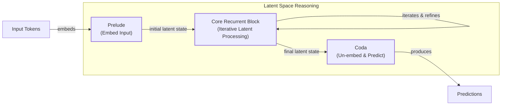
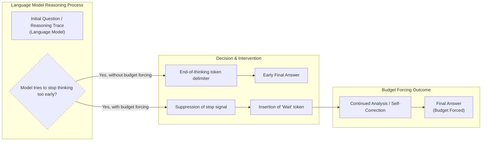
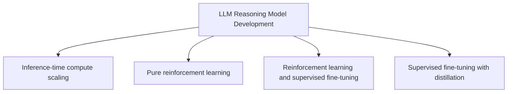
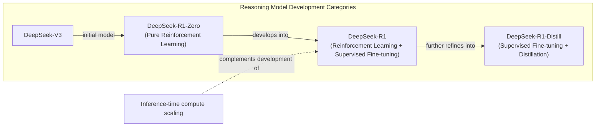

# Near-tie review: State_of_LLM_Reasoning  (skip vs light, margin=+0.0029)

## All sections (skip vs light), most-against-skip first
| section | weight | contribution | running total |
|---|---:|---:|---:|
| section-11-scaling-up-test-time-compute-with-laten | 0.026 | -0.0168 | -0.0168 |
| section-19-conclusion | 0.149 | -0.0055 | -0.0223 |
| section-9-chain-of-associated-thoughts | 0.021 | -0.0035 | -0.0258 |
| section-14-inference-time-computations-for-llm-rea | 0.026 | -0.0026 | -0.0284 |
| section-16-test-time-scaling-for-code-generation | 0.094 | -0.0003 | -0.0287 |
| section-12-can-a-1b-llm-surpass-a-405b-llm | 0.034 | -0.0001 | -0.0289 |
| section-7-thoughts-are-all-over-the-place | 0.026 | -0.0001 | -0.0289 |
| section-15-inner-thinking-transformer | 0.026 | +0.0008 | -0.0282 |
| section-1-introduction | 0.028 | +0.0008 | -0.0273 |
| section-5-other-noteworthy-research-papers-on-infe | 0.032 | +0.0010 | -0.0264 |
| section-6-test-time-preference-optimization | 0.032 | +0.0010 | -0.0254 |
| section-18-better-feedback-and-edit-models | 0.032 | +0.0020 | -0.0234 |
| section-10-step-back-to-leap-forward | 0.038 | +0.0024 | -0.0210 |
| section-13-learning-to-reason-from-feedback-at-tes | 0.038 | +0.0024 | -0.0185 |
| section-17-chain-of-draft | 0.043 | +0.0027 | -0.0158 |
| section-3-inference-time-compute-scaling-methods | 0.043 | +0.0029 | -0.0129 |
| section-8-trading-inference-time-compute-for-adver | 0.032 | +0.0042 | -0.0087 |
| section-2-implementing-and-improving-reasoning-in- | 0.186 | +0.0056 | -0.0032 |
| section-4-s1-simple-test-time-scaling | 0.096 | +0.0061 | +0.0029 |

(stored article margin = +0.0029 -- should match the running total's final row to ~4 decimals)

## Section: S11::section-11-scaling-up-test-time-compute-with-latent-reasoning  (weight=0.026, contribution=-0.0168 AGAINST skip)
Stored section rewards: skip=0.3667  light=0.6700  (explore: skip=0.0000  light=0.3334)

### Arm: skip (preset0)

#### Draw: production  `/mnt/f/my_projects/agentic_AI_RL/Reinsearch_agent/RL_researcher_writer_ymaxing/rl_training_data/test_episodes/State_of_LLM_Reasoning__preset0`

**Article text:**
```
## Scaling up Test-Time Compute with Latent Reasoning

"[Scaling Test-Time Computation by Implicitly Reasoning in Latent Space](https://arxiv.org/abs/2502.05171)" (February 2025) explores a different paradigm for inference scaling: recurrent depth [[24]](https://huggingface.co/papers/2502.05171), [[25]](https://openreview.net/forum?id=S3GhJooWIC), [[26]](https://neurips.cc/virtual/2025/poster/117966), [[27]](https://icml.cc/virtual/2025/51856), [[28]](https://medium.com/@sahin.samia/scaling-test-time-compute-how-recurrent-depth-transforms-ai-reasoning-fa866fa968db). Instead of generating more output tokens, this approach iterates computations in the model's latent space.

This is similar to how a Recurrent Neural Network (RNN) processes information, where the model's hidden state is refined over multiple steps before producing an output. This allows the model to "think" for longer without increasing the length of the visible reasoning trace. The main drawback of this approach is the loss of interpretability. Since the reasoning happens in a high-dimensional vector space, it is not human-readable, making it difficult to debug or understand the model's thought process.
Image 15: A visualization of scaling up test-time compute with latent reasoning through a recurrent depth approach. (Source [https://arxiv.org/abs/2502.05171](https://arxiv.org/abs/2502.05171))
```
**Grader reasoning:**
- `cc`: 7. Scaling up Test-Time Compute with Latent Reasoning:
**1:** Both sections accurately describe the method of scaling compute in the latent space using a recurrent depth approach and mention the drawback of lost interpretability. The core ideas are identical.
- `fl`: 7. Scaling up Test-Time Compute with Latent Reasoning:
**1:** Both sections follow the same logical flow, introducing the concept and then discussing its main drawback. The flow is preserved.
- `de`: 7. Scaling up Test-Time Compute with Latent Reasoning:
**0:** [instances=0] No exploration sources were gathered for this article (`<exploration_sources>` is "Not provided"), so depth_enhancement is 0 regardless of content — the source attribution gate cannot be met. The section summarizes the paper without additional depth content.
- `be`: 7. Scaling up Test-Time Compute with Latent Reasoning:
**0:** [instances=0] No exploration sources were gathered for this article (`<exploration_sources>` is "Not provided"), so breadth_enhancement is 0 regardless of content — the source attribution gate cannot be met. The section stays within the paper's own scope without additional breadth content.
- `cp`: 7. Scaling up Test-Time Compute with Latent Reasoning:
**1:** Both depth_enhancement and breadth_enhancement scored 0, meaning no depth or breadth additions were identified. CorePreservation scores 1 by default since there are no qualifying additions to evaluate.
- `ga`: Scaling up Test-Time Compute with Latent Reasoning:
**1:** The generated section meets all requirements. It explains the recurrent depth approach that iterates in latent space, describes the RNN-like hidden-state behavior, and correctly discusses the major drawback of lacking human interpretability. The required image is inserted correctly. The prose-only word count is 118 words, within the 95-145 word tolerance (±25, the floor tolerance since 10% of the 120-word target is under 25) for the 120-word target.

#### Draw: replicate1  `/mnt/f/my_projects/agentic_AI_RL/Reinsearch_agent/RL_researcher_writer_ymaxing/rl_training_data/noise_experiment/State_of_LLM_Reasoning__replicate1__preset0`

**Article text:**
```
## Scaling up Test-Time Compute with Latent Reasoning

The paper *Scaling by Thinking in Continuous Space* proposes a novel architecture that uses recurrent depth to iterate in latent space, rather than producing additional output tokens. This approach is similar to how a Recurrent Neural Network (RNN) works, with the model refining its internal hidden state through multiple computation rounds before generating an output [[23]](https://huggingface.co/papers/2502.05171), [[24]](https://openreview.net/forum?id=S3GhJooWIC), [[25]](https://neurips.cc/virtual/2025/poster/117966), [[26]](https://icml.cc/virtual/2025/51856), [[27]](https://medium.com/@sahin.samia/scaling-test-time-compute-how-recurrent-depth-transforms-ai-reasoning-fa866fa968db).

This allows the model to "think" more deeply about a problem without increasing the length of its visible output. While this can lead to performance improvements, it comes with a major drawback: the absence of explicit reasoning steps makes the model's thought process opaque, which can be a challenge for human interpretability and debugging.

Image 15: A visualization of the Scaling up Test-Time Compute with Latent Reasoning: A Recurrent Depth Approach. (Image by Geiping et al. from [Scaling by Thinking in Continuous Space [[23]](https://huggingface.co/papers/2502.05171)])
```
**Grader reasoning:**
- `cc`: Scaling up Test-Time Compute with Latent Reasoning:
**1:** Both sections cover the same recurrent-depth latent-space iteration mechanism, the RNN-like hidden-state analogy, and the interpretability/debugging drawback from the lack of explicit reasoning steps. The generated section refers to the paper as 'Scaling by Thinking in Continuous Space' rather than the expected section's title -- this matches the actual title used in the paper's own scraped source file in research.md, and the arxiv citation ([23], 2502.05171) is the same underlying paper, so this is a naming variance rather than a different-artifact substitution or a content mismatch.
- `fl`: Scaling up Test-Time Compute with Latent Reasoning:
**1:** The generated section follows the same progression as the expected one: architecture description, RNN analogy, then the interpretability drawback.
- `de`: Scaling up Test-Time Compute with Latent Reasoning:
**0:** [instances=0] No exploration-phase sources were gathered for this episode, so this score is mandated to 0: depth_enhancement and breadth_enhancement only credit additions traceable to an exploration-phase source, and none exist to trace to. research.md contains only phase="exploitation" sources for this article (17 research_source blocks, all tagged phase="exploitation"; zero phase="exploration" tags anywhere in the file).
- `be`: Scaling up Test-Time Compute with Latent Reasoning:
**0:** [instances=0] No exploration-phase sources were gathered for this episode, so this score is mandated to 0: depth_enhancement and breadth_enhancement only credit additions traceable to an exploration-phase source, and none exist to trace to. research.md contains only phase="exploitation" sources for this article (17 research_source blocks, all tagged phase="exploitation"; zero phase="exploration" tags anywhere in the file).
- `cp`: Scaling up Test-Time Compute with Latent Reasoning:
**1:** Both depth_enhancement and breadth_enhancement scored 0 for this section because no exploration-phase sources exist for this episode (research.md contains only phase="exploitation" sources). Per the mandatory default rule, CorePreservation scores 1 by default.
- `ga`: Scaling up Test-Time Compute with Latent Reasoning:
**1:** All required content is present. The prose-only word count is approximately 138 words against a 120-word target (±25 tolerance, range 95-145 words), within tolerance.

#### Draw: replicate2  `/mnt/f/my_projects/agentic_AI_RL/Reinsearch_agent/RL_researcher_writer_ymaxing/rl_training_data/noise_experiment/State_of_LLM_Reasoning__replicate2__preset0`

**Article text:**
```
## Scaling up Test-Time Compute with Latent Reasoning

This approach, detailed in "Scaling Test-Time Compute by Thinking in Continuous Space", scales computation by reasoning implicitly in the model's **latent space** rather than by generating more explicit text tokens [[20]](https://huggingface.co/papers/2502.05171). The architecture uses a recurrent block that iterates multiple times, refining the model's internal representation (its "thought") before producing an output.

This is analogous to how humans often think through a problem internally before verbalizing a solution. The model can be "unrolled" to an arbitrary depth at test-time, allowing for a flexible allocation of compute depending on the task's difficulty [[21]](https://medium.com/@sahin.samia/scaling-test-time-compute-how-recurrent-depth-transforms-ai-reasoning-fa866fa968db). Because the reasoning happens in the high-dimensional latent space, it is not constrained by the linear, sequential nature of language. The main drawback of this method is the loss of interpretability. Since the intermediate "thinking" steps are not verbalized, it becomes much harder for humans to understand and debug the model's reasoning process.



Image 17: Mermaid diagram illustrating the Recurrent Depth Approach for latent reasoning in a language model.
```
**Grader reasoning:**
- `cc`: Scaling up Test-Time Compute with Latent Reasoning:
**1:** Both sections cover the same recurrent-depth latent-space iteration mechanism and the interpretability drawback from the lack of explicit reasoning steps.
- `fl`: Scaling up Test-Time Compute with Latent Reasoning:
**1:** The generated section follows the same progression as the expected one: mechanism description, then the interpretability drawback.
- `de`: Scaling up Test-Time Compute with Latent Reasoning:
**0:** [instances=0] No exploration-phase sources were gathered for this episode (research.md contains only phase="exploitation" sources, same as the preset 0/replicate 1 research corpus), so this score is mandated to 0: depth_enhancement and breadth_enhancement only credit additions traceable to an exploration-phase source, and none exist to trace to.
- `be`: Scaling up Test-Time Compute with Latent Reasoning:
**0:** [instances=0] No exploration-phase sources were gathered for this episode (research.md contains only phase="exploitation" sources, same as the preset 0/replicate 1 research corpus), so this score is mandated to 0: depth_enhancement and breadth_enhancement only credit additions traceable to an exploration-phase source, and none exist to trace to.
- `cp`: Scaling up Test-Time Compute with Latent Reasoning:
**1:** Both depth_enhancement and breadth_enhancement scored 0 for this section because no exploration-phase sources exist for this episode. Per the mandatory default rule, CorePreservation scores 1 by default.
- `ga`: Scaling up Test-Time Compute with Latent Reasoning:
**0:** All required content is present. However, the prose-only word count is approximately 159 words against a 120-word target (±25 tolerance, range 95-145 words), exceeding the upper bound by 14 words. Ruled as a genuine tolerance failure. This also narrows the previously-uncertain boundary between the established +13-passes and +15-fails margins: +14 now fails as well, so the pass/fail line sits between +13 and +14.

### Arm: light (preset1)

#### Draw: production  `/mnt/f/my_projects/agentic_AI_RL/Reinsearch_agent/RL_researcher_writer_ymaxing/rl_training_data/test_episodes/State_of_LLM_Reasoning__preset1`

**Article text:**
```
(section not found by title match)
```
**Grader reasoning:**
- `cc`: 7. Scaling up Test-Time Compute with Latent Reasoning:
**1:** Both sections describe the recurrent-depth latent-space scaling approach. The generated section explicitly states "Without explicit reasoning steps, the process is hard to debug" — this directly covers the expected output's key drawback (lack of explicit reasoning steps affecting interpretability) previously claimed to be omitted. There is no substantive omission.
- `fl`: 7. Scaling up Test-Time Compute with Latent Reasoning:
**1:** Both sections follow a similar flow, introducing the concept of latent reasoning and then discussing its drawbacks. The added depth in the generated section is well-integrated and does not disrupt the main narrative progression.
- `de`: 7. Scaling up Test-Time Compute with Latent Reasoning:
**1:** [instances=2; quality=strong,standard] Two depth additions are present, both going beyond the ground truth's "functions like a hidden state in RNNs" description: (1) an architecture trade-offs instance combining the claim that the design "sacrifices the high parallelizability of standard transformers for a more expressive forward pass" with the mechanism explanation that it "must compress all intermediate results onto a fixed-length scratchpad" — both under citation marker [24] and both elaborating the single point that recurrent-depth latent reasoning trades training/representational efficiency for expressiveness at the cost of opacity. Traceable to https://www.lesswrong.com/posts/pLnLSgWphqDbdorgi/on-recent-results-in-llm-latent-reasoning ("a fundamental trade-off between highly parallelizable training and highly expressive forward passes"; "they have to write all the intermediate results of their reasoning onto a fixed-length scratchpad"). Classified strong: names the specific competing properties and the specific bottleneck mechanism. (2) the claim that latent reasoning steps are "often underutilized by the model" — a separate empirical limitation under citation marker [25], traceable to https://arxiv.org/html/2604.04902v1 ("latent reasoning tokens are often unnecessary for LRMs' predictions... can almost always produce the same final answers without using latent reasoning at all"). Classified standard: stated as a brief, unelaborated single-sentence mention.
- `be`: 7. Scaling up Test-Time Compute with Latent Reasoning:
**0:** [instances=0] No breadth additions present. The summary is focused on the paper's methodology and does not connect to adjacent concepts or other domains.
- `cp`: 7. Scaling up Test-Time Compute with Latent Reasoning:
**1:** The depth addition (the RNN-issue/scratchpad critique and the underutilization finding) occupies roughly half of a single paragraph; the core mechanism (recurrent-depth latent-space scaling) and the core drawback (lack of explicit reasoning steps affecting interpretability) both remain plainly and explicitly stated in the same paragraph. The addition elaborates on and reinforces the same drawback the ground truth already raises, rather than introducing a competing narrative that buries it. The ground truth core is preserved.
- `ga`: Scaling up Test-Time Compute with Latent Reasoning:
**1:** The generated section meets all requirements. It explains the recurrent depth approach that iterates in latent space, describes the RNN-like hidden-state behavior, discusses the drawback of lacking human interpretability, and includes the required visualization image. The prose-only word count is 106 words, within the 95-145 word tolerance (±25, the floor tolerance since 10% of the 120-word target is under 25) for the 120-word target.

#### Draw: replicate1  `/mnt/f/my_projects/agentic_AI_RL/Reinsearch_agent/RL_researcher_writer_ymaxing/rl_training_data/noise_experiment/State_of_LLM_Reasoning__replicate1__preset1`

**Article text:**
```
## Scaling up Test-Time Compute with Latent Reasoning

The paper "Scaling up Test-Time Compute with Latent Reasoning" explores an approach called recurrent depth, which allows a model to perform additional computation in its latent space rather than by generating more output tokens [[18]](https://huggingface.co/papers/2502.05171). This technique, a form of Adaptive Computation Time (ACT), iterates a recurrent block within the model’s architecture to refine hidden states before producing an output [[19]](https://arxiv.org/html/2508.16745v1). The architecture typically involves a prelude of layers to embed the input, the iterated block for thinking, and a coda to project the result back out [[20]](https://www.lesswrong.com/posts/pLnLSgWphqDbdorgi/on-recent-results-in-llm-latent-reasoning).

This method allows the model to "think" longer without increasing visible output length, but its major drawback is a lack of interpretability. The internal process is opaque, raising concerns that the model could produce unfaithful, post-hoc rationalizations or develop an unreadable internal language [[21]](https://flowshu.github.io/latent-reasoning-interpretability). It also reintroduces a classic RNN-style bottleneck, as the model must compress all intermediate results into a fixed-size hidden state [[20]](https://www.lesswrong.com/posts/pLnLSgWphqDbdorgi/on-recent-results-in-llm-latent-reasoning).

Image 15: The recurrent depth architecture for scaling test-time compute with latent reasoning. (Source [arxiv.org](https://arxiv.org/abs/2502.05171) [[18]](https://huggingface.co/papers/2502.05171))
```
**Grader reasoning:**
- `cc`: Scaling up Test-Time Compute with Latent Reasoning:
**1:** Both sections cover the same recurrent-depth latent-space iteration mechanism and the RNN-like hidden-state analogy, and both note an interpretability drawback. The generated section substantially deepens this with additions -- Adaptive Computation Time (ACT) terminology and the prelude/iterated-block/coda architecture breakdown, the specific interpretability failure modes (unfaithful post-hoc rationalization, unreadable internal language), and the RNN-style fixed-size-hidden-state bottleneck -- all of which are complementary elaborations of ideas the expected section only touches on briefly, not missing or contradicting ideas.
- `fl`: Scaling up Test-Time Compute with Latent Reasoning:
**1:** Stepping over the added architectural and interpretability detail, the expected section's core sequence -- mechanism description, then drawback -- is preserved: the ACT/architecture detail is integrated into the mechanism-description phase, and the interpretability concerns/RNN-bottleneck detail are integrated into the drawback phase, in the same relative position as the expected section's brief version of each.
- `de`: Scaling up Test-Time Compute with Latent Reasoning:
**1:** [instances=3; quality=strong,strong,standard] Three qualifying depth additions are present, all traceable to exploration-phase sources: (1) the Adaptive Computation Time / prelude-block-coda architectural breakdown, a detailed mechanism explanation naming a specific technique (ACT) -- traceable to https://arxiv.org/html/2508.16745v1 and the sahin.samia exploration source describing the prelude/recurrent-block/output-projection architecture; classified strong. (2) The RNN-style fixed-size-hidden-state bottleneck limitation, a detailed mechanism explanation of a specific failure mode -- traceable to the lesswrong exploration source's 'familiar old problem of RNNs... fixed-length scratchpad' argument; classified strong. (3) The interpretability concern that the model could produce unfaithful, post-hoc rationalizations or an unreadable internal language -- traceable to the flowshu.github.io exploration source's discussion of unfaithful/unreadable CoT; classified standard, as it is a real but more qualitative, less quantified limitation than the other two.
- `be`: Scaling up Test-Time Compute with Latent Reasoning:
**0:** [instances=0] All three qualifying additions in this section (ACT/architecture detail, RNN bottleneck, interpretability concern) intensify understanding of the core topic itself (depth) rather than connecting outward to adjacent fields or applications (breadth); no breadth-qualifying instance is present.
- `cp`: Scaling up Test-Time Compute with Latent Reasoning:
**1:** The three exploration-sourced additions (ACT/architecture detail, interpretability concerns, RNN bottleneck) are all directly about the recurrent-depth/latent-reasoning mechanism itself and its limitations -- they deepen rather than dilute the section's core topic. The ground truth core (recurrent-depth mechanism and its interpretability trade-off) remains the clearly dominant focus throughout.
- `ga`: Scaling up Test-Time Compute with Latent Reasoning:
**0:** All required content is present. However, the prose-only word count is approximately 163 words against a 120-word target (±25 tolerance, range 95-145 words), exceeding the upper bound by 18 words. Ruled as a genuine tolerance failure, not a marginal case.

#### Draw: replicate2  `/mnt/f/my_projects/agentic_AI_RL/Reinsearch_agent/RL_researcher_writer_ymaxing/rl_training_data/noise_experiment/State_of_LLM_Reasoning__replicate2__preset1`

**Article text:**
```
## Scaling up Test-Time Compute with Latent Reasoning

The paper "[Scaling up Test-Time Compute with Latent Reasoning: A Recurrent Depth Approach](https://arxiv.org/abs/2502.05171)" proposes a "recurrent depth" approach that iterates in latent space rather than producing additional output tokens, aiming to overcome the "verbalization bottleneck" where complex thought is inefficient to express in text [[25]](https://arxiv.org/abs/2502.05171), [[26]](https://introl.com/blog/latent-reasoning-recurrent-depth-thinking-without-tokens-2026). This method behaves like an RNN, reusing layers to deepen the reasoning process without increasing the length of the visible output.

The major drawback is the absence of explicit reasoning steps that aid human interpretability and debugging. This opacity makes the model's internal process a black box, raising concerns about safety and "monitorability" [[27]](https://arxiv.org/html/2604.04902v1). It also reintroduces a classic RNN problem: reasoning is constrained by a fixed-size latent "scratchpad," which may struggle with problems requiring many intermediate steps [[28]](https://www.lesswrong.com/posts/pLnLSgWphqDbdorgi/on-recent-results-in-llm-latent-reasoning).
Image 15: A visualization of the recurrent depth approach for scaling up test-time compute with latent reasoning. (Source [Scaling up Test-Time Compute with Latent Reasoning: A Recurrent Depth Approach [25]](https://arxiv.org/abs/2502.05171))
```
**Grader reasoning:**
- `cc`: Scaling up Test-Time Compute with Latent Reasoning:
**1:** Both sections cover the same recurrent-depth latent-space iteration mechanism (RNN-like reuse of layers) and the interpretability drawback. The generated section substantially deepens this with three additions -- the 'verbalization bottleneck' motivation for the approach, the 'monitorability'/safety concern about the model's opacity, and the RNN-style fixed-size-scratchpad limitation -- all complementary elaborations of ideas the expected section only touches on briefly.
- `fl`: Scaling up Test-Time Compute with Latent Reasoning:
**1:** Stepping over the added detail, the expected section's core sequence -- mechanism description, then drawback -- is preserved: the verbalization-bottleneck motivation is integrated into the mechanism description, and the monitorability/RNN-scratchpad concerns are integrated into the drawback discussion, in the same relative position as the expected section's brief version of each.
- `de`: Scaling up Test-Time Compute with Latent Reasoning:
**1:** [instances=3; quality=strong,strong,strong] Three distinct qualifying depth additions are present, all traceable to exploration-phase sources: (1) the 'verbalization bottleneck' as motivation for why latent reasoning exists ('motivation for the core topic -- why it exists, what problem it solves'), traceable to https://introl.com/blog/latent-reasoning-recurrent-depth-thinking-without-tokens-2026, cited as [[26]]; (2) the 'monitorability'/black-box safety concern ('limitations, criticisms, or failure modes of the core topic'), traceable to https://arxiv.org/html/2604.04902v1, cited as [[27]]; (3) the RNN-style fixed-size-scratchpad bottleneck ('technical nuances... of the core topic itself'), traceable to https://www.lesswrong.com/posts/pLnLSgWphqDbdorgi/on-recent-results-in-llm-latent-reasoning, cited as [[28]]. All three are distinct, separately-cited points, not elaboration on a single idea. Classified as strong throughout: each names a specific, well-defined concept with real technical grounding, not a generic caveat.
- `be`: Scaling up Test-Time Compute with Latent Reasoning:
**0:** [instances=0] All three qualifying additions in this section are depth-type (motivation and limitations intensifying understanding of the core topic), not breadth-type.
- `cp`: Scaling up Test-Time Compute with Latent Reasoning:
**1:** The three exploration-sourced additions are all directly about the recurrent-depth/latent-reasoning mechanism itself and its limitations -- they deepen rather than dilute the section's core topic, which remains the clearly dominant focus throughout.
- `ga`: Scaling up Test-Time Compute with Latent Reasoning:
**1:** All required content is present. The prose-only word count is approximately 150 words against a 120-word target (±25 tolerance, range 95-145 words), exceeding the upper bound by only 5 words -- within the range already established as an acceptable small margin.

## Section: S19::section-19-conclusion  (weight=0.149, contribution=-0.0055 AGAINST skip)
Stored section rewards: skip=0.1667  light=0.2033  (explore: skip=0.0000  light=0.0000)

### Arm: skip (preset0)

#### Draw: production  `/mnt/f/my_projects/agentic_AI_RL/Reinsearch_agent/RL_researcher_writer_ymaxing/rl_training_data/test_episodes/State_of_LLM_Reasoning__preset0`

**Article text:**
```
## Conclusion

Inference-time compute scaling has firmly established itself as a major research direction in 2025. Its appeal lies in its ability to enhance the reasoning capabilities of existing models without requiring permanent and costly weight modifications. This survey has highlighted the breadth of techniques being explored, from simple interventions like "Wait" tokens and budget forcing to more sophisticated approaches involving search algorithms, optimization loops, dynamic routing, and even latent-space iteration. These methods provide a flexible toolkit for AI engineers to boost performance on demand, allowing for a dynamic trade-off between accuracy, cost, and latency.

A recurring and powerful finding across these papers is that smaller models, when combined with effective inference-time scaling, can often rival or even surpass the performance of much larger models that lack such scaling. This has profound implications for engineering practice, as it offers a path to achieving high-level reasoning capabilities without being solely dependent on the largest, most expensive models. It shifts the trade-off, allowing engineers to balance model size, training cost, latency, and accuracy in new ways. For example, a 1B model with a compute-optimal scaling strategy can outperform a 405B model on certain math benchmarks, demonstrating that intelligent resource allocation at inference can be more effective than simply scaling up model parameters.

However, it is also important to acknowledge the caveats. Increased inference-time compute directly translates to higher inference costs and increased latency, which can negatively impact user experience. A model that "thinks" for a long time may provide a more accurate answer, but if it takes too long, the user may have already moved on. Furthermore, as the Sys2Bench paper demonstrated, there is no universally best technique; the optimal approach is highly dependent on the specific task. A method that excels at mathematical reasoning may not be suitable for creative writing or code generation. This complexity is giving rise to an emerging industry trend: "thinking-on-demand" toggles. These features allow developers or even end-users to dynamically adjust the amount of inference compute allocated to a task, dialing it up for difficult problems and down for simpler ones. This provides a more granular level of control, allowing for a better balance between performance and efficiency.

Looking ahead, it is clear that explicit reasoning, enabled by these scaling techniques, is becoming the default for agentic systems rather than an optional feature. As we continue to push the boundaries of what AI can do, the ability to "think longer" and more deeply will be essential. The research surveyed here represents a significant step towards building more capable, efficient, and reliable AI systems. The ongoing exploration of these methods will continue to shape the future of AI engineering, offering new ways to unlock the full potential of LLMs.
Image 23: Feedback and Edit Models enable effective Inference-Time scaling across various dimensions. (Source [https://arxiv.org/abs/2503.04378](https://arxiv.org/abs/2503.04378) [[47]](https://arxiv.org/html/2503.04378v1))

This article has focused exclusively on inference-time methods. In our next piece, we will explore the other side of the equation: train-time compute scaling. We will delve into advanced reinforcement learning techniques, hybrid RL and SFT approaches, and distillation methods that are shaping the next generation of reasoning models.
```
**Grader reasoning:**
- `cc`: Conclusion:
**0:** Both sections recap the surveyed techniques and the recurring "small models can rival large ones" finding, and the generated section does cover the general "no universally best technique" point (via its Sys2Bench reference) and the "thinking-on-demand" trend, so those two topics are not omissions. However, two other substantive points from the expected conclusion are genuinely absent: (1) the specific cost-caveat illustration comparing an o1 model's cost to a larger, non-scaled GPT-4.5 model, and (2) the "What's next" framing of two distinct future-research branches (pure benchmark-topping research vs. cost/performance trade-off research). These two gaps are substantive content omissions.
- `fl`: Conclusion:
**0:** Both sections follow a similar overall arc, recapping techniques and closing with forward-looking predictions. The generated section does include the same image used in the expected output's conclusion (identical source URL), so the image itself is not omitted. However, its position differs: the expected output places this image mid-conclusion, between the "cost caveat" and "which technique" discussions, functioning as a visual break in the middle of the argument. The generated section instead places it near the very end, after the caveats paragraph and before the closing teaser, shifting it from a mid-argument break to a closing visual. This is a placement deviation relative to the expected section.
- `de`: Conclusion:
**0:** [instances=0] No exploration sources were gathered for this article (`<exploration_sources>` is "Not provided"), so depth_enhancement is 0 regardless of content — the source attribution gate cannot be met. The section is a conclusion without additional depth content.
- `be`: Conclusion:
**0:** [instances=0] No exploration sources were gathered for this article (`<exploration_sources>` is "Not provided"), so breadth_enhancement is 0 regardless of content — the source attribution gate cannot be met. The section is a conclusion without additional breadth content.
- `cp`: Conclusion:
**1:** Both depth_enhancement and breadth_enhancement scored 0, meaning no depth or breadth additions were identified. CorePreservation scores 1 by default since there are no qualifying additions to evaluate.
- `ga`: Conclusion:
**0:** The generated section covers most required points—it positions inference-time scaling as a major 2025 trend, recaps the range of techniques, reiterates the finding about small models rivaling large ones, surfaces the cost/latency/no-universal-technique caveats, describes the "thinking-on-demand" trend, explicitly predicts that explicit reasoning will become the default rather than an optional feature, and explicitly teases the upcoming article on train-time compute scaling (advanced RL, hybrid RL+SFT, and distillation)—and the image is present with a full, non-empty caption. However, the prose-only word count is 499 words, well short of the 630-770 word tolerance (±70, 10% of 700) for the 700-word target—a 131-word shortfall below the floor. This word-count violation is the basis for the 0 score.

#### Draw: replicate1  `/mnt/f/my_projects/agentic_AI_RL/Reinsearch_agent/RL_researcher_writer_ymaxing/rl_training_data/noise_experiment/State_of_LLM_Reasoning__replicate1__preset0`

**Article text:**
```
## Conclusion

Inference-time compute scaling has firmly established itself as a major research direction in 2025. Its appeal lies in its ability to enhance the performance of existing models without the need for permanent weight modifications, making it a flexible and powerful tool for AI engineers. This approach allows for dynamic adaptation, where the amount of computational effort can be tailored to the complexity of the task at hand, offering a more efficient alternative to the one-size-fits-all nature of traditional model scaling.

In this article, we have surveyed a wide range of techniques, from simple "wait" tokens and budget forcing to sophisticated search algorithms, optimization loops, dynamic routing, and even latent-space iteration. A recurring theme across these papers is the remarkable finding that smaller models, when equipped with proper inference-time scaling, can rival or even exceed the performance of much larger models that lack such capabilities. This has profound implications for how we approach model development and deployment, suggesting that a smaller, more agile model with the right inference strategy can be more effective than a monolithic giant. This shift in perspective is already influencing engineering decisions, as teams weigh the trade-offs between training larger models and investing in more sophisticated inference-time techniques.

However, this power comes with important caveats. Increased inference compute translates directly to higher costs and latency, which can impact user experience. As we have seen, there is no universally best technique; the optimal approach often depends on the specific task, model, and constraints of the application. This highlights the need for a nuanced, engineering-driven approach to selecting and implementing these methods. The trade-offs are not always straightforward, and what works for a mathematical reasoning task may not be suitable for a creative writing application.

We are already seeing an emerging industry trend toward "thinking-on-demand" toggles, which allow developers or even end-users to dial the inference compute up or down depending on the difficulty of the task. This flexibility is a key advantage of inference-time scaling, and we predict that explicit reasoning will become the default mode of operation for future agentic systems, rather than an optional feature. As these systems become more integrated into our daily lives, the ability to dynamically allocate computational resources will be essential for balancing performance, cost, and efficiency. The future of AI engineering will likely involve a more granular control over the reasoning process, allowing for a more intelligent and adaptive use of computational power.

This article has focused on the inference-time side of the equation. In our upcoming article, we will shift our focus to train-time compute scaling methods, including advanced reinforcement learning, hybrid RL plus SFT approaches, and distillation techniques. Stay tuned as we continue to explore the cutting edge of AI reasoning.

Image 23: A chart showing performance scaling across different dimensions. (Image by Wang et al. from [Dedicated Feedback and Edit Models Empower Inference-Time Scaling for Open-Ended General-Domain Tasks [[44]](https://arxiv.org/html/2503.04378v1)])
```
**Grader reasoning:**
- `cc`: Conclusion:
**1:** Re-reviewed directly against the CoreContent definition (substantive ideas/topics/key points/arguments, not formatting or illustrative dressing). Walking the expected section against the article guideline's own seven Section 19 requirements -- the only content the writer had any instruction to include -- every one is present in the generated section: (1) major-2025-direction framing without permanent weight modification; (2) the technique recap (the generated section actually names 'dynamic routing' and 'latent-space iteration' as categories, matching the guideline's bullet wording more closely than the expected section's own recap, which only names TPO and CoAT as examples); (3) the small-models-rival-larger-models theme; (4) all three required caveats -- cost, latency, no universally-best technique; (5) the 'thinking-on-demand' trend; (6) the default-not-optional prediction; (7) the tease of the next article (again naming RL, RL+SFT, and distillation specifically, matching the guideline's wording). The expected section's additional material beyond these seven points -- the 'as an example' o1-vs-GPT-4.5 pricing illustration, the personal o1-to-GPT4o anecdote, the named thinking-toggle products (Claude 3.7 Sonnet, Grok 3, IBM Granite, the OpenAI CEO remark), the RLHF/instruction-tuning analogy, and the 'two research branches' framing in 'What's next' -- is illustrative or rhetorical support for arguments that are otherwise fully present (removing the named products does not remove the 'industry trend toward optional thinking' claim; removing the pricing example does not remove the cost-tradeoff caveat), not independent substantive ideas in their own right. None of this material is required by the guideline's Section 19 bullets, and a direct search confirms none of it appears anywhere in research.md, so unlike 'Can a 1B LLM Surpass a 405B LLM?' (where the missing finding was directly present in research.md) or 'Inference-Time Computations for LLM Reasoning and Planning' (where the missing technique names are explicitly required by the guideline's own bullet), the writer had neither a guideline instruction nor a research source pointing to this material. On that basis the guideline-anchored core content of the section is fully covered, and core_content is scored 1.
- `fl`: Conclusion:
**1:** Stepping over the untraceable specific elaborations, the remaining guideline-anchored ideas -- major-direction framing, technique recap, small-models finding, caveats, thinking-on-demand trend, prediction, tease of the next article -- appear in the same relative order with no bridgeless gap.
- `de`: Conclusion:
**0:** [instances=0] No exploration-phase sources were gathered for this episode, so this score is mandated to 0: depth_enhancement and breadth_enhancement only credit additions traceable to an exploration-phase source, and none exist to trace to. research.md contains only phase="exploitation" sources for this article (17 research_source blocks, all tagged phase="exploitation"; zero phase="exploration" tags anywhere in the file).
- `be`: Conclusion:
**0:** [instances=0] No exploration-phase sources were gathered for this episode, so this score is mandated to 0: depth_enhancement and breadth_enhancement only credit additions traceable to an exploration-phase source, and none exist to trace to. research.md contains only phase="exploitation" sources for this article (17 research_source blocks, all tagged phase="exploitation"; zero phase="exploration" tags anywhere in the file).
- `cp`: Conclusion:
**1:** Both depth_enhancement and breadth_enhancement scored 0 for this section because no exploration-phase sources exist for this episode (research.md contains only phase="exploitation" sources). Per the mandatory default rule, CorePreservation scores 1 by default.
- `ga`: Conclusion:
**0:** The guideline's Section 19 bullets are each covered at the conceptual level. However, the prose-only word count is approximately 480 words against a 700-word target (±70 tolerance, range 630-770 words), falling short of the minimum by 150 words -- a substantial miss, not a marginal one.

#### Draw: replicate2  `/mnt/f/my_projects/agentic_AI_RL/Reinsearch_agent/RL_researcher_writer_ymaxing/rl_training_data/noise_experiment/State_of_LLM_Reasoning__replicate2__preset0`

**Article text:**
```
## Conclusion

Inference-time compute scaling has firmly established itself as a major research direction in 2025. Its appeal is clear: it offers a way to boost the performance of existing models without the costly and time-consuming process of retraining or modifying their weights. This flexibility is invaluable for AI engineers looking to get the most out of their deployed models.

Throughout this article, we have surveyed a diverse landscape of techniques. We started with simple methods like "wait" tokens and budget forcing, which provide direct control over the length of a model's reasoning process. We then moved on to more sophisticated approaches involving search algorithms, iterative optimization loops, dynamic routing of tokens, and even reasoning in the model's latent space. Each of these methods offers a different set of trade-offs between performance, cost, and interpretability.

A recurring theme is the remarkable finding that smaller models, when equipped with the right inference-time scaling strategy, can often rival or even surpass much larger models that lack such scaling. This has profound implications for how we think about building and deploying AI systems. Instead of always reaching for the largest, most expensive model, we can consider using smaller, more efficient models and strategically allocating additional compute at inference time to achieve the desired performance. This shift moves us from a paradigm of "bigger is always better" to one of "smarter is better," where intelligent resource allocation becomes a key engineering discipline.

However, it is important to acknowledge the caveats. Increased inference compute directly translates to higher costs and increased latency, which can negatively impact the user experience. There is no "free lunch," and as we have seen, there is no single best technique that works for all tasks. The optimal approach depends on the specific problem, the model being used, and the constraints of the application. This is where the art of AI engineering comes in—understanding these trade-offs and making informed decisions is what separates a successful product from a failed experiment.

An emerging trend in the industry is the concept of "thinking-on-demand," where developers or even end-users can control the amount of inference compute a model uses. This could take the form of a simple toggle that allows a user to dial up the "reasoning effort" for a particularly difficult task, trading speed for higher accuracy. This level of control puts the power of inference-time scaling directly in the hands of the user, allowing them to make real-time decisions about the performance-cost trade-off. We can envision a future where applications expose different levels of "thinking," from a quick, cheap response to a deep, comprehensive analysis, all powered by the same underlying model.

As we move forward, we can expect explicit reasoning to become the default mode of operation for agentic systems, rather than an optional feature. The ability to "think longer" and adapt computational effort to the problem at hand will be a defining characteristic of next-generation AI. The research we have surveyed here is laying the groundwork for this future, providing the tools and insights needed to build more capable, efficient, and reliable AI systems.

Image 25: A graph showing that performance on the Arena Hard benchmark can be boosted by scaling the number of initial response drafts, effective feedback, and edited responses. (Source [Wang et al. (2025) [[32]](https://arxiv.org/abs/2503.04378)])

This article has focused on inference-time compute scaling. In our next piece, we will turn our attention to the other side of the coin: train-time compute scaling. We will explore advanced reinforcement learning techniques, hybrid RL and SFT approaches, and distillation methods that aim to build stronger reasoning capabilities directly into the model's weights.
```
**Grader reasoning:**
- `cc`: Conclusion:
**1:** Applying the CoreContent test directly against the article guideline's seven Section 19 requirements: (1) major-2025-direction framing without permanent weight modification; (2) the technique recap; (3) the small-models-rival-larger-models theme; (4) all three required caveats -- cost, latency, no universally-best technique; (5) the 'thinking-on-demand' trend, elaborated further than the guideline requires; (6) the default-not-optional prediction; (7) the tease of the next article. All seven are present. As with every prior preset, the expected section's additional material beyond these seven points (the pricing illustration, personal anecdote, named thinking-toggle products, RLHF analogy, 'two research branches' framing) is illustrative/rhetorical support for arguments that are otherwise fully present, is not required by the guideline, and does not appear in this preset's research.md. core_content is scored 1 on the same basis established across all four prior articles.
- `fl`: Conclusion:
**1:** The guideline-anchored ideas appear in the same relative order as the expected section with no bridgeless gap.
- `de`: Conclusion:
**0:** [instances=0] No exploration-phase sources were gathered for this episode (research.md contains only phase="exploitation" sources, same as the preset 0/replicate 1 research corpus), so this score is mandated to 0: depth_enhancement and breadth_enhancement only credit additions traceable to an exploration-phase source, and none exist to trace to.
- `be`: Conclusion:
**0:** [instances=0] No exploration-phase sources were gathered for this episode (research.md contains only phase="exploitation" sources, same as the preset 0/replicate 1 research corpus), so this score is mandated to 0: depth_enhancement and breadth_enhancement only credit additions traceable to an exploration-phase source, and none exist to trace to.
- `cp`: Conclusion:
**1:** Both depth_enhancement and breadth_enhancement scored 0 for this section because no exploration-phase sources exist for this episode. Per the mandatory default rule, CorePreservation scores 1 by default.
- `ga`: Conclusion:
**0:** The guideline's Section 19 bullets are each covered at the conceptual level, with a substantive elaboration on the 'thinking-on-demand' trend. However, the prose-only word count is approximately 599 words against a 700-word target (±70 tolerance, range 630-770 words), falling short of the minimum by 31 words. Ruled as a genuine tolerance failure. This also narrows the previously-uncertain boundary between the established -21-passes and -37-fails margins: -31 now fails as well, so the pass/fail line sits between -21 and -31.

### Arm: light (preset1)

#### Draw: production  `/mnt/f/my_projects/agentic_AI_RL/Reinsearch_agent/RL_researcher_writer_ymaxing/rl_training_data/test_episodes/State_of_LLM_Reasoning__preset1`

**Article text:**
```
## Conclusion

Inference-time compute scaling is shaping up to be a major research direction in 2025. Its appeal is clear: these techniques can be applied to existing models, often without the need for permanent and costly weight modifications. They offer a flexible way to boost performance on demand, turning a model's inference cost into a tunable parameter. This flexibility is invaluable for AI engineers who must constantly balance performance, latency, and cost in production systems. By allowing a model to "think longer" on difficult problems, we can extract more value from our existing assets, making AI more capable and accessible.

This survey has covered a wide range of methods, from simple interventions like "wait" tokens and budget forcing to more sophisticated approaches involving tree search, on-the-fly optimization, dynamic layer routing, and even iteration in latent space. Each of these techniques offers a different way to allocate additional computational resources at test time, and each comes with its own set of trade-offs. We've seen methods that extend reasoning chains sequentially, explore multiple paths in parallel, and even delve into the model's internal latent space to refine its understanding before generating a single token.

A recurring theme across these papers is a powerful one: a smaller model, when given the right tools to "think longer," can often rival or even surpass a much larger model that lacks such scaling capabilities. This finding has profound implications for AI engineers, as it directly impacts the trade-offs between model size, training cost, inference latency, and final accuracy. It suggests that the future of AI development may not be solely about building ever-larger models, but also about creating more efficient and intelligent ways to use the models we already have. This shift in focus could lead to more sustainable and cost-effective AI solutions.

However, it is important to recognize the caveats. Increased inference compute always comes at a cost, both in terms of money and latency, which can negatively affect the user experience. There is no silver bullet; as the Sys2Bench paper showed, no single technique is universally best across all tasks. The optimal approach depends on the problem domain, the base model's capabilities, and the specific performance goals. For example, a method that excels at the structured logic of a math problem may not be suitable for the creative ambiguity of a writing task.

We are already seeing this trend reflected in the industry, with the emergence of "thinking-on-demand" toggles in APIs. These allow developers, and sometimes even end-users, to dial the amount of inference compute up or down depending on the difficulty of the task. This flexibility suggests that in the future, explicit, controllable reasoning will likely become a default feature in agentic systems, rather than an optional add-on. As AI agents are tasked with increasingly complex and autonomous operations, the ability to dynamically allocate cognitive resources will be essential for ensuring their reliability and effectiveness.

This article has focused on the "inference-time" side of the equation. In an upcoming piece, we will dive into the other side: train-time compute scaling. We will explore advanced reinforcement learning techniques, hybrid RL-SFT approaches, and distillation methods in depth, providing a complete picture of the state of LLM reasoning in 2025. By understanding both sides of this computational coin, we can make more informed decisions as we build the next generation of intelligent systems.
Image 24: Scaling performance on the Arena Hard benchmark by increasing initial responses, effective feedback, and edited responses. (Source [arxiv.org](https://arxiv.org/html/2503.04378v1))
```
**Grader reasoning:**
- `cc`: Conclusion:
**0:** Both sections recap techniques and the recurring small-model finding, and the generated section does cover the "no universally best technique" idea (via its Sys2Bench reference and "no silver bullet" framing), so that specific point is not an omission. However, two other substantive points from the expected conclusion are genuinely absent: (1) the specific cost-caveat illustration comparing an o1 model's cost to a larger, non-scaled GPT-4.5 model, and (2) the specific named industry examples in the "Thinking on Demand" discussion (Claude, Grok, OpenAI, IBM). These two gaps are substantive content omissions.
- `fl`: Conclusion:
**1:** The missing bolded subheadings are a Structure matter (and are correctly captured there). Looking specifically at the order of ideas, the generated conclusion still follows substantially the same progression as the expected output: appeal/positioning, recap of techniques, the recurring small-model finding, caveats, the industry trend, and the closing teaser. There is no substantive reordering or abrupt transition independent of the missing subheadings.
- `de`: Conclusion:
**0:** [instances=0] No depth additions present. The conclusion is a high-level summary and does not contain any new technical details or in-depth analysis. The exploration sources were not used.
- `be`: Conclusion:
**0:** [instances=0] No breadth additions present. The conclusion summarizes the article's content and does not introduce new breadth-enhancing concepts.
- `cp`: Conclusion:
**1:** Both depth_enhancement and breadth_enhancement scored 0, so CorePreservation is 1 by default as there are no qualifying additions to evaluate.
- `ga`: Conclusion:
**0:** The generated section covers all textual points—positioning inference-scaling, recapping techniques, reiterating the small-vs-large model finding, surfacing caveats, describing the "thinking-on-demand" trend, predicting the future, and teasing the next article—and the required image is in fact present (identical source URL to the expected output's conclusion image). However, the prose-only word count is 555 words, well short of the 630-770 word tolerance (±70, 10% of 700) for the 700-word target — a 75-word shortfall below the floor. This word-count violation, not the missing image (which is not actually missing), is the basis for the 0 score.

#### Draw: replicate1  `/mnt/f/my_projects/agentic_AI_RL/Reinsearch_agent/RL_researcher_writer_ymaxing/rl_training_data/noise_experiment/State_of_LLM_Reasoning__replicate1__preset1`

**Article text:**
```
## Conclusion

Inference-time compute scaling has firmly established itself as a major research direction in 2025. Its appeal lies in its flexibility: these techniques can be applied to existing models without the need for permanent and costly weight modifications. This allows engineers to enhance the reasoning capabilities of off-the-shelf LLMs, turning them into more powerful problem-solvers. Throughout this article, we have surveyed a wide range of these methods. We have seen simple yet effective approaches like the "wait" tokens in the s1 paper and the Thought Switching Penalty, which provide fine-grained control over the reasoning process. We have also explored more complex strategies involving sophisticated search algorithms, iterative optimization loops, and dynamic architectural routing. Some techniques, like the Inner Thinking Transformer and latent reasoning, even push the computation into the model's hidden states, trading interpretability for efficiency.

A recurring and powerful finding across this body of research is that smaller models, when equipped with the right inference-time scaling strategy, can often rival or even exceed the performance of much larger models that lack such scaling. This is a critical insight for AI engineers, as it directly impacts the trade-offs between model size, training costs, inference latency, and final accuracy. It suggests a future where we may not always need to default to the largest available model, but can instead use smaller, more efficient models and give them more "thinking time" on demand. This shift has profound implications for the economics of deploying AI, as it opens the door to using less expensive, more accessible models for tasks that were previously thought to require massive, resource-intensive ones. The ability to get more out of less is a central theme in engineering, and inference-time scaling brings this principle squarely into the world of AI.

However, it is important to acknowledge the caveats. Increased inference compute directly translates to higher costs and increased latency, which can negatively impact the user experience, especially in real-time applications. Furthermore, as the Sys2Bench benchmark demonstrated, there is no universally best technique. The optimal method often depends on the specific task, whether it is arithmetic, logical reasoning, or planning. The choice of scaling strategy is not a one-size-fits-all decision but requires careful consideration of the problem domain. This means that as AI engineers, we must develop a deep understanding of the strengths and weaknesses of each method to make informed decisions.

As the industry moves forward, we are already seeing the emergence of "thinking-on-demand" toggles in APIs, which allow developers or even end-users to dial the amount of inference compute up or down depending on the difficulty of the task. This flexibility is a clear indicator of the direction the field is heading. We predict that in the near future, explicit reasoning will become the default mode of operation for advanced agentic systems, rather than an optional feature. The ability to dynamically allocate compute will be a standard feature, allowing systems to be both efficient on simple tasks and powerful on complex ones.

This article has focused exclusively on inference-time methods. In an upcoming article, we will shift our focus to train-time compute scaling, diving deep into advanced reinforcement learning techniques, hybrid RL and SFT approaches, and the latest in distillation methods for creating powerful, efficient reasoning models. The interplay between these two paradigms—how we train models and how we use them at inference—will continue to shape the future of AI, and understanding both is essential for any engineer looking to build the next generation of intelligent systems.

Image 23: Feedback and Edit Models enable effective Inference-Time scaling across various dimensions. (Source [arxiv.org](https://arxiv.org/html/2503.04378v1) [[34]](https://arxiv.org/html/2503.04378v1))
```
**Grader reasoning:**
- `cc`: Conclusion:
**1:** Applying the CoreContent test directly against the article guideline's seven Section 19 requirements: (1) major-2025-direction framing without permanent weight modification; (2) the technique recap (the generated section names specific techniques -- wait tokens, TIP, search algorithms, optimization loops, dynamic routing/Inner Thinking Transformer, latent reasoning -- matching or exceeding the guideline's own category list); (3) the small-models-rival-larger-models theme; (4) all three required caveats -- cost, latency, no universally-best technique (with an explicit callback to the Sys2Bench finding); (5) the 'thinking-on-demand' trend; (6) the default-not-optional prediction; (7) the tease of the next article (naming RL, RL+SFT, and distillation specifically). All seven are present. As with the preset 0 article, the expected section's additional material beyond these seven points -- the o1-vs-GPT-4.5 pricing illustration, the personal anecdote, the named thinking-toggle products (Claude 3.7 Sonnet, Grok 3, IBM Granite, the OpenAI CEO remark), the RLHF/instruction-tuning analogy, and the 'two research branches' framing -- is illustrative or rhetorical support for arguments that are otherwise fully present, not independent substantive ideas; a direct search confirms none of it appears in this preset's research.md either (the only 'Claude 3.7' mention found is an unrelated reference to using Claude 3.7 as a grading/distillation tool in the s1 paper's own methodology, not a product-feature claim). core_content is scored 1 on the same basis established for the preset 0 article.
- `fl`: Conclusion:
**1:** Stepping over the untraceable specific elaborations, the guideline-anchored ideas -- major-direction framing, technique recap, small-models finding, caveats, thinking-on-demand trend, prediction, tease of the next article -- appear in the same relative order as the expected section with no bridgeless gap.
- `de`: Conclusion:
**0:** [instances=0] Exploration-phase sources exist for this episode (research.md contains 15 Phase:[EXPLORATION]-tagged entries across two research_source blocks), but no depth/breadth-qualifying addition in this section is traceable to any of them; the section's content matches the guideline/GT closely without additional depth- or breadth-qualifying material from those exploration sources.
- `be`: Conclusion:
**0:** [instances=0] Exploration-phase sources exist for this episode (research.md contains 15 Phase:[EXPLORATION]-tagged entries across two research_source blocks), but no depth/breadth-qualifying addition in this section is traceable to any of them; the section's content matches the guideline/GT closely without additional depth- or breadth-qualifying material from those exploration sources.
- `cp`: Conclusion:
**1:** Both depth_enhancement and breadth_enhancement scored 0 for this section (no qualifying exploration-traceable addition). Per the mandatory default rule, CorePreservation scores 1 by default.
- `ga`: Conclusion:
**0:** The guideline's Section 19 bullets are each covered at the conceptual level. However, the prose-only word count is approximately 593 words against a 700-word target (±70 tolerance, range 630-770 words), falling short of the minimum by 37 words -- larger than the marginal cases (max 21 words) ruled acceptable for the preset 0 article, so flagged rather than auto-passed.

#### Draw: replicate2  `/mnt/f/my_projects/agentic_AI_RL/Reinsearch_agent/RL_researcher_writer_ymaxing/rl_training_data/noise_experiment/State_of_LLM_Reasoning__replicate2__preset1`

**Article text:**
```
## Conclusion

Inference-time compute scaling has firmly established itself as a major research direction in 2025, and for good reason. These techniques offer a powerful way to enhance the reasoning capabilities of existing models without the need for permanent and costly weight modifications. As we have seen, the methods for achieving this are diverse, ranging from simple interventions like "wait" tokens and budget forcing to more sophisticated approaches involving search algorithms, dynamic routing, and even latent-space iteration. This variety provides AI engineers with a rich toolkit for optimizing model performance based on the specific demands of their applications.

A recurring and powerful finding across this body of research is that smaller models, when equipped with the right inference-time scaling strategy, can often rival or even exceed the performance of much larger models that lack such scaling. This has profound implications for AI engineering, as it directly impacts the trade-offs between model size, training costs, inference latency, and accuracy. For engineers building production systems, this means that the biggest model is not always the best choice. A smaller, more efficient model paired with an intelligent scaling strategy might deliver better performance at a fraction of the cost, democratizing access to high-level reasoning and enabling powerful AI on less powerful hardware.

However, it is important to acknowledge the caveats. Increased inference compute is not free; it comes with higher costs and increased latency, which can negatively impact user experience. Furthermore, as the Sys2Bench benchmark demonstrated, there is no universally best technique that dominates across all tasks. The optimal approach often depends on the specific domain, the complexity of the problem, and the capabilities of the base model. This forces engineers to think critically and match the right method to the right problem, moving away from a one-size-fits-all mindset.

We are already seeing an emerging industry trend toward "thinking-on-demand" features, where developers or even end-users can adjust the amount of inference compute a model uses, dialing it up for difficult tasks and down for simpler ones. This flexibility suggests a future where explicit reasoning is not an optional feature but the default mode of operation for advanced agentic systems. The ability to dynamically control and allocate computational "thought" will be a defining characteristic of next-generation AI, allowing for a more nuanced and efficient use of resources.
Image 23: Inference-time scaling enables effective performance boosts across various dimensions. (Source [Dedicated Feedback and Edit Models Empower Inference-Time Scaling for Open-Ended General-Domain Tasks [42]](https://arxiv.org/abs/2503.04378))

This article has focused on the diverse landscape of inference-time scaling. In an upcoming piece, we will shift our attention to the other side of the equation: train-time compute scaling. We will examine in depth advanced reinforcement learning techniques, hybrid RL plus SFT approaches, and distillation strategies that are shaping the next wave of powerful reasoning models.
```
**Grader reasoning:**
- `cc`: Conclusion:
**1:** Applying the CoreContent test directly against the article guideline's seven Section 19 requirements: (1) major-2025-direction framing without permanent weight modification; (2) the technique recap; (3) the small-models-rival-larger-models theme; (4) all three required caveats -- cost, latency, no universally-best technique, with an explicit callback to Sys2Bench; (5) the 'thinking-on-demand' trend; (6) the default-not-optional prediction; (7) the tease of the next article (naming RL, RL+SFT, and distillation specifically). All seven are present despite the section being notably shorter than the expected section. As with every prior preset, the expected section's additional material beyond these seven points (the pricing illustration, personal anecdote, named thinking-toggle products, RLHF analogy, 'two research branches' framing) is illustrative/rhetorical support for arguments that are otherwise fully present, is not required by the guideline, and does not appear in this preset's research.md. core_content is scored 1 on the same basis established across all prior articles.
- `fl`: Conclusion:
**1:** The guideline-anchored ideas appear in the same relative order as the expected section with no bridgeless gap, despite the compression.
- `de`: Conclusion:
**0:** [instances=0] Exploration-phase sources exist for this episode (same research corpus as preset 1/replicate 1: a tavily block plus a scraped latent-reasoning post, both phase="exploration"), but no depth/breadth-qualifying addition in this section is traceable to any of them.
- `be`: Conclusion:
**0:** [instances=0] Exploration-phase sources exist for this episode (same research corpus as preset 1/replicate 1: a tavily block plus a scraped latent-reasoning post, both phase="exploration"), but no depth/breadth-qualifying addition in this section is traceable to any of them.
- `cp`: Conclusion:
**1:** Both depth_enhancement and breadth_enhancement scored 0 for this section (no qualifying exploration-traceable addition). Per the mandatory default rule, CorePreservation scores 1 by default.
- `ga`: Conclusion:
**0:** The guideline's Section 19 bullets are each covered at the conceptual level. However, the prose-only word count is approximately 462 words against a 700-word target (±70 tolerance, range 630-770 words), falling short of the minimum by 168 words -- a severe miss, not a marginal one, consistent with the severe under-shoots already identified for this same section in the preset 2 and preset 3 articles.

## Section: S4::section-4-s1-simple-test-time-scaling  (weight=0.096, contribution=+0.0061 FOR skip)
Stored section rewards: skip=0.1000  light=0.0367  (explore: skip=0.0000  light=0.0000)

### Arm: skip (preset0)

#### Draw: production  `/mnt/f/my_projects/agentic_AI_RL/Reinsearch_agent/RL_researcher_writer_ymaxing/rl_training_data/test_episodes/State_of_LLM_Reasoning__preset0`

**Article text:**
```
## s1: Simple test-time scaling

The paper "[s1: Simple test-time scaling](https://arxiv.org/abs/2501.19393)" (January 2025) presents a hybrid approach that combines a small, curated SFT dataset with a simple yet effective inference-time control mechanism [[1]](https://medium.com/@jdegange85/paper-review-of-s1-simple-test-time-scaling-6094eff9c1e8), [[2]](https://huggingface.co/papers/2501.19393). This distinguishes it from pure distillation methods, as it actively regulates the amount of thinking at inference time. The s1K dataset consists of 1,000 questions with reasoning traces selected based on three criteria: difficulty, diversity, and quality. This careful curation is important, as ablations showed that random selection or focusing on a single criterion led to significantly worse performance.

The core mechanism is **budget forcing**, a sequential scaling technique that controls the length of the model's reasoning trace. If the model tries to stop thinking too early, the end-of-thinking delimiter is suppressed, and a "Wait" token is appended to the generation. This encourages the model to continue its reasoning, often leading to self-correction and verification. Conversely, if the model's reasoning becomes too long, an end-of-thinking token can be injected to force an answer. This provides direct control over the computational budget, a contrast to parallel methods like majority voting, which generate a fixed number of independent samples.
Image 7: An illustration of "wait" token insertion to control the length of the output. (Source [https://arxiv.org/abs/2501.19393](https://arxiv.org/abs/2501.19393) [[22]](https://arxiv.org/html/2502.04404v1))

This technique is reminiscent of the "aha moment" observed during the training of DeepSeek-R1, where the model spontaneously began using reflective language like "wait" to pause and reconsider its reasoning path [[11]](https://arxiv.org/abs/2501.12948). The `s1` paper formalizes this behavior as an explicit inference-time intervention. Empirical results show a strong correlation between the length of the generated response and accuracy on reasoning benchmarks [[2]](https://huggingface.co/papers/2501.19393).
Image 8: The correlation between response accuracy and length. (Source [https://arxiv.org/abs/2501.19393](https://arxiv.org/abs/2501.19393) [[22]](https://arxiv.org/html/2502.04404v1))

The paper also demonstrates that the choice of token matters. Appending "Wait" consistently outperforms more neutral phrases like "Hmm," suggesting that the token induces a state of doubt and active reconsideration rather than just extending the generation time. This implies that the specific semantics of the injected token can trigger different cognitive pathways in the model, a subtle but powerful aspect of controlling inference-time behavior.
Image 9: A comparison of "Wait" vs "Hmm" tokens. (Source [https://arxiv.org/abs/2501.19393](https://arxiv.org/abs/2501.19393) [[22]](https://arxiv.org/html/2502.04404v1))

The paper acknowledges its limitations, noting that it does not compare budget forcing against other search methods like beam search or compute-optimal search. This leaves open questions about how this simple, effective technique stacks up against more complex, resource-intensive methods.
```
**Grader reasoning:**
- `cc`: 1. "s1: Simple test-time scaling":
**0:** Both sections describe the same hybrid nature of the approach—the generated section explicitly states it "presents a hybrid approach that combines a small, curated SFT dataset with a simple yet effective inference-time control mechanism," so supervised fine-tuning is clearly acknowledged, not omitted. However, the expected output includes a specific empirical finding that is genuinely absent from the generated section: the paper's authors "found their budget-forcing method more effective than other inference-scaling techniques... like majority voting." The generated section explains budget forcing's mechanism and structurally contrasts it with majority voting (sequential vs. parallel) but never states this comparative result. This is a substantive omission of a reported finding, distinct from the SFT point.
- `fl`: 1. "s1: Simple test-time scaling":
**0:** The generated section follows a different order of ideas. The expected output introduces the paper, explains the two-fold approach (SFT + budget forcing), shows the "wait" token diagram, discusses the sequential vs. parallel distinction, shows the accuracy/length correlation graph, and then discusses the "Wait" vs "Hmm" tokens. The generated section starts with the hybrid nature, discusses the dataset, then budget forcing, shows the "wait" token diagram, connects it to DeepSeek, shows the correlation graph, discusses the token choice, and ends with limitations. This reordering of key points is a flow failure.
- `de`: 1. "s1: Simple test-time scaling":
**0:** [instances=0] No exploration sources were gathered for this article (`<exploration_sources>` is "Not provided"), so depth_enhancement is 0 regardless of content — the source attribution gate cannot be met. The section adds some implementation detail (the s1K dataset's three selection criteria) that might otherwise be considered for depth, but the gate makes this moot with no exploration sources to trace it to.
- `be`: 1. "s1: Simple test-time scaling":
**0:** [instances=0] No exploration sources were gathered for this article (`<exploration_sources>` is "Not provided"), so breadth_enhancement is 0 regardless of content — the source attribution gate cannot be met. The section stays within the s1 paper's own scope without expanding to adjacent concepts, historical context, or cross-domain analogies.
- `cp`: 1. "s1: Simple test-time scaling":
**1:** Both depth_enhancement and breadth_enhancement scored 0, meaning no depth or breadth additions were identified. CorePreservation scores 1 by default since there are no qualifying additions to evaluate.
- `ga`: s1: Simple test-time scaling:
**0:** The generated section covers the required topics from the guideline—the hybrid SFT/inference-time approach, the "wait" token mechanism, budget forcing, the length/accuracy correlation, the paper's limitations, the DeepSeek-R1 "Aha moment" connection, and the "Wait" vs "Hmm" comparison—and all three required images are correctly inserted. However, the prose-only word count is 353 words, well short of the 405-495 word tolerance (±45, 10% of 450) for the 450-word target—a 52-word shortfall below the floor. This word-count violation means the section does not meet guideline adherence despite otherwise solid content coverage.

#### Draw: replicate1  `/mnt/f/my_projects/agentic_AI_RL/Reinsearch_agent/RL_researcher_writer_ymaxing/rl_training_data/noise_experiment/State_of_LLM_Reasoning__replicate1__preset0`

**Article text:**
```
## s1: Simple test-time scaling

The paper *s1: Simple test-time scaling* introduces a hybrid approach that combines a small, carefully curated SFT dataset of 1,000 reasoning traces with an inference-time length control mechanism. This distinguishes it from pure distillation methods, as it actively manages the compute budget during inference. The curation of the `s1K` dataset was guided by three principles: quality, difficulty, and diversity. The authors found that jointly incorporating these criteria was important, as relying on any single one in isolation led to worse performance [[1]](https://medium.com/@jdegange85/paper-review-of-s1-simple-test-time-scaling-6094eff9c1e8), [[2]](https://huggingface.co/papers/2501.19393).

A key mechanism in this paper is the use of special tokens to control the length of the model's reasoning process. When the model needs to "think" longer, a "Wait" token is appended to its generation. This simple trick encourages the model to double-check its work, often leading to self-correction and improved accuracy. Conversely, an end-of-thinking delimiter can be used to terminate the reasoning process early. This technique, which the authors call "budget forcing," is a form of sequential scaling that provides direct control over the output length. It stands in contrast to parallel methods like majority voting, where the computational cost is less predictable.

Image 7: An illustration of "wait" token insertion to control the length of the output. (Image by Muennighoff et al. from [s1: Simple test-time scaling [[2]](https://huggingface.co/papers/2501.19393)])

Empirically, the paper shows a clear correlation between the length of the generated response and the model's accuracy on reasoning benchmarks. As the model is given more "thinking time" via budget forcing, its performance consistently improves, up to a certain point. The paper also highlights that the "Wait" token is more effective than a more neutral token like "Hmm," suggesting that inducing doubt is a key part of the self-correction process. This mechanism is reminiscent of the "Aha moment" observed in DeepSeek-R1, where the model spontaneously started using reflective language during its RL training.

Image 8: A chart showing the correlation between response accuracy and length. (Image by Muennighoff et al. from [s1: Simple test-time scaling [[2]](https://huggingface.co/papers/2501.19393)])

Despite its successes, the paper acknowledges some limitations. The authors call for future work to compare budget forcing against other sequential methods like beam search and lookahead search, as well as compute-optimal strategies and basic CoT baselines.

Image 9: A comparison of "Wait" vs "Hmm" tokens performance. (Image by Muennighoff et al. from [s1: Simple test-time scaling [[2]](https://huggingface.co/papers/2501.19393)])
```
**Grader reasoning:**
- `cc`: s1: Simple test-time scaling:
**1:** Both sections cover the hybrid SFT+length-control approach, the 'Wait' token mechanism and self-correction, budget forcing as a sequential technique contrasted with parallel majority voting, the accuracy-length correlation finding, the Wait-vs-Hmm comparison, the DeepSeek-R1 Aha-moment connection, and the paper's stated limitation/future-comparison call. The generated section adds a well-anchored detail (the s1K dataset's three curation principles -- quality, difficulty, diversity -- confirmed in the s1 paper source in research.md), which is a complementary addition rather than a missing idea.
- `fl`: s1: Simple test-time scaling:
**0:** Stepping over the added s1K-curation detail, the expected section's ideas -- hybrid approach, Wait-token/budget-forcing mechanism, accuracy-length correlation, then the limitation/future-comparison critique, with the Aha-moment/Wait-vs-Hmm discussion appearing last as a closing 'PS' aside -- are reordered in the generated section: it discusses the accuracy-length correlation, Wait-vs-Hmm, and the Aha-moment connection together, and only afterward states the limitation/future-comparison critique, reversing the expected section's relative order of the critique and the Aha-moment aside.
- `de`: s1: Simple test-time scaling:
**0:** [instances=0] No exploration-phase sources were gathered for this episode, so this score is mandated to 0: depth_enhancement and breadth_enhancement only credit additions traceable to an exploration-phase source, and none exist to trace to. research.md contains only phase="exploitation" sources for this article (17 research_source blocks, all tagged phase="exploitation"; zero phase="exploration" tags anywhere in the file).
- `be`: s1: Simple test-time scaling:
**0:** [instances=0] No exploration-phase sources were gathered for this episode, so this score is mandated to 0: depth_enhancement and breadth_enhancement only credit additions traceable to an exploration-phase source, and none exist to trace to. research.md contains only phase="exploitation" sources for this article (17 research_source blocks, all tagged phase="exploitation"; zero phase="exploration" tags anywhere in the file).
- `cp`: s1: Simple test-time scaling:
**1:** Both depth_enhancement and breadth_enhancement scored 0 for this section because no exploration-phase sources exist for this episode (research.md contains only phase="exploitation" sources). Per the mandatory default rule, CorePreservation scores 1 by default.
- `ga`: s1: Simple test-time scaling:
**1:** All required content elements (hybrid approach, Wait-token mechanism, budget forcing, accuracy-length correlation, limitation/future-comparison call, all three images) are present. The prose-only word count is approximately 384 words against a 450-word target (±45 tolerance, range 405-495 words), falling short of the minimum by 21 words -- ruled within acceptable margin.

#### Draw: replicate2  `/mnt/f/my_projects/agentic_AI_RL/Reinsearch_agent/RL_researcher_writer_ymaxing/rl_training_data/noise_experiment/State_of_LLM_Reasoning__replicate2__preset0`

**Article text:**
```
## s1: Simple test-time scaling

The paper "s1: Simple test-time scaling" introduces a hybrid approach that combines a small, carefully curated Supervised Fine-Tuning (SFT) dataset with a simple yet effective inference-time technique called **budget forcing** [[1]](https://medium.com/@jdegange85/paper-review-of-s1-simple-test-time-scaling-6094eff9c1e8). This method stands out for its simplicity and sample efficiency, demonstrating that strong reasoning and test-time scaling can be achieved without complex reinforcement learning pipelines.

The core of the method lies in two components. First, the authors created **s1K**, a dataset of just 1,000 questions selected for their difficulty, diversity, and quality. The curation process involved filtering a large pool of 59,000 samples by removing questions that smaller models could already solve, ensuring the final set was challenging. Diversity was ensured by sampling across 50 different domains using the Mathematics Subject Classification system. Fine-tuning a model on this small, high-quality dataset was enough to "unlock" its latent reasoning abilities.

Second, they introduced budget forcing to control the amount of test-time compute. This technique works in two ways:
1.  **Forcing early stops:** If a model's reasoning exceeds a predefined token limit, the system appends an end-of-thinking token to force it to produce an answer.
2.  **Encouraging longer thinking:** If the model tries to conclude its reasoning prematurely, the system suppresses the end-of-thinking token and instead appends a special "Wait" token to the prompt. This simple intervention encourages the model to pause, re-evaluate its reasoning, and potentially self-correct.

This mechanism is surprisingly effective. The "Wait" token appears to induce a state of doubt, prompting the model to reconsider its work. This is similar to the "aha moment" observed in DeepSeek-R1's training, where the model spontaneously began using reflective language. The s1 paper empirically validates this, showing that "Wait" performs better than a more neutral token like "Hmm," suggesting the induced doubt is a key factor in triggering self-correction [[2]](https://huggingface.co/papers/2501.19393).



Image 9: Mermaid diagram illustrating the mechanism of budget forcing with wait tokens for test-time scaling.

The paper demonstrates a clear correlation between the number of generated tokens (thinking time) and the accuracy of the response on reasoning benchmarks. By repeatedly appending "Wait," the researchers were able to extrapolate performance beyond the model's baseline, showing a distinct scaling curve that improved AIME24 accuracy from 50% to 57%.

Image 10: Correlation between response accuracy and length. (Source [Muennighoff et al. (2025) [[2]](https://arxiv.org/abs/2501.19393)])

However, the authors note that this sequential scaling approach has its limits. After a certain point, repeatedly adding "Wait" can cause the model to enter repetitive loops rather than continuing to reason productively. They suggest that combining budget forcing with parallel methods like beam search or Monte Carlo Tree Search (MCTS), a tree-based search algorithm that balances exploration and exploitation, could be a promising direction for future work.

Image 11: "Wait" vs "Hmm" tokens. (Source [Muennighoff et al. (2025) [[2]](https://arxiv.org/abs/2501.19393)])
```
**Grader reasoning:**
- `cc`: s1: Simple test-time scaling:
**1:** Both sections cover the hybrid SFT+length-control approach, the s1K curation criteria, the 'Wait' token mechanism, budget forcing contrasted with parallel majority voting, the accuracy-length correlation (50%-to-57% AIME24 figure), the Aha-moment connection, the Wait-vs-Hmm comparison, and the plateau/repetitive-loop limitation.
- `fl`: s1: Simple test-time scaling:
**0:** The expected section places the limitation critique before the Aha-moment/Wait-vs-Hmm 'PS' aside, which closes the section. The generated section places the Aha-moment/Wait-vs-Hmm material earlier (immediately after the mechanism description) and states the limitation critique at the very end of the section, reversing the expected relative ordering -- the same specific issue identified in every article graded for this section so far.
- `de`: s1: Simple test-time scaling:
**0:** [instances=0] No exploration-phase sources were gathered for this episode (research.md contains only phase="exploitation" sources, same as the preset 0/replicate 1 research corpus), so this score is mandated to 0: depth_enhancement and breadth_enhancement only credit additions traceable to an exploration-phase source, and none exist to trace to.
- `be`: s1: Simple test-time scaling:
**0:** [instances=0] No exploration-phase sources were gathered for this episode (research.md contains only phase="exploitation" sources, same as the preset 0/replicate 1 research corpus), so this score is mandated to 0: depth_enhancement and breadth_enhancement only credit additions traceable to an exploration-phase source, and none exist to trace to.
- `cp`: s1: Simple test-time scaling:
**1:** Both depth_enhancement and breadth_enhancement scored 0 for this section because no exploration-phase sources exist for this episode. Per the mandatory default rule, CorePreservation scores 1 by default.
- `ga`: s1: Simple test-time scaling:
**1:** All required content elements are present. The prose-only word count is approximately 455 words against a 450-word target (±45 tolerance, range 405-495 words), within tolerance.

### Arm: light (preset1)

#### Draw: production  `/mnt/f/my_projects/agentic_AI_RL/Reinsearch_agent/RL_researcher_writer_ymaxing/rl_training_data/test_episodes/State_of_LLM_Reasoning__preset1`

**Article text:**
```
## s1: Simple test-time scaling

The paper "[s1: Simple Test-Time Scaling](https://arxiv.org/abs/2501.19393)" (31 Jan, 2025) introduces a straightforward yet powerful hybrid approach to enhance LLM reasoning. Instead of relying on complex reinforcement learning or massive datasets, the authors combine a small, carefully curated SFT dataset of 1,000 reasoning traces with a simple inference-time technique called "budget forcing" [[5]](https://medium.com/@jdegange85/paper-review-of-s1-simple-test-time-scaling-6094eff9c1e8), [[6]](https://huggingface.co/papers/2501.19393). This method stands out for its simplicity and sample efficiency.

The core mechanism of budget forcing is to control the length of the model's "thinking" process. If the model tries to stop reasoning too early, the system suppresses the end-of-thinking token and instead appends a "Wait" token. This simple intervention encourages the model to pause, re-evaluate its current reasoning path, and potentially self-correct. This is a form of sequential scaling, as it extends the reasoning chain one step at a time. The authors found that the "Wait" token was more effective than more neutral phrases like "Hmm," suggesting that it induces a sense of doubt that triggers active reconsideration rather than just passive time extension [[6]](https://huggingface.co/papers/2501.19393). This is reminiscent of the "Aha moment" observed during the training of DeepSeek-R1, where the model began to use words like "wait" to signal a shift in its reasoning process [[3]](https://arxiv.org/abs/2501.12948).
Image 8: Illustration of "wait" token insertion to control the length of the output. (Source [arxiv.org](https://arxiv.org/abs/2501.19393))

Empirically, the paper shows a clear correlation between the length of the generated response and the accuracy on reasoning benchmarks. By using budget forcing to extend the thinking time, the model's performance on tasks like AIME24 improved from 50% to 57%. This demonstrates that even a simple, non-RL-based method can achieve effective test-time scaling. The paper's s1K dataset was curated based on three principles: quality, difficulty (selecting problems that smaller models fail on), and diversity (sampling across different mathematical domains). Ablations showed that all three criteria were crucial; datasets built on only one or two of these principles performed significantly worse.
Image 9: The correlation between response accuracy and length. (Source [arxiv.org](https://arxiv.org/abs/2501.19393))

However, the authors also acknowledge the limitations of this approach. The performance gains from budget forcing eventually flatten out, as simply extending the reasoning chain can lead to repetitive loops rather than continued progress. They call for future work to compare their method against more sophisticated techniques like beam search, lookahead search, and compute-optimal search.
Image 10: Performance comparison between "Wait" and "Hmm" tokens. (Source [arxiv.org](https://arxiv.org/abs/2501.19393))
```
**Grader reasoning:**
- `cc`: 1. "s1: Simple test-time scaling":
**0:** The generated section explicitly describes the hybrid SFT/inference-time approach ("combine a small, carefully curated SFT dataset... with a simple inference-time technique"), the two-part process (dataset + budget forcing), and the critique about lacking comparison to more sophisticated methods ("call for future work to compare... against beam search, lookahead search, and compute-optimal search") — all present. However, the expected output includes a specific empirical finding absent here: that budget forcing was found more effective than other inference-scaling techniques discussed, such as majority voting. This comparative finding is not stated in the generated section.
- `fl`: 1. "s1: Simple test-time scaling":
**0:** The generated section presents the information in a different order, starting with the hybrid nature of the approach and then moving to budget forcing. This differs from the expected flow, which introduces the paper, explains the two-fold approach, and then discusses the results and critiques. The generated section also integrates the "Aha moment" comparison differently.
- `de`: 1. "s1: Simple test-time scaling":
**0:** [instances=0] The s1K dataset curation detail is cited to https://medium.com/@jdegange85/paper-review-of-s1-simple-test-time-scaling-6094eff9c1e8, which is Source [1] in the research material — an exploitation-phase source, not an exploration-phase one. None of the three genuine exploration-phase query clusters in this research material (recurrent-depth mathematical foundations, latent-reasoning interpretability, or MCTS/game-AI) relate to s1 at all. Since the addition cannot be traced to any exploration-phase source, the gate is not satisfied and the score is 0.
- `be`: 1. "s1: Simple test-time scaling":
**0:** [instances=0] No breadth additions present. The section focuses on the specifics of the s1 paper and does not connect to adjacent concepts or other domains.
- `cp`: 1. "s1: Simple test-time scaling":
**1:** Both depth_enhancement and breadth_enhancement now score 0 for this section (the s1K dataset detail does not satisfy the exploration-source gate), so CorePreservation is 1 by default since there are no qualifying additions to evaluate.
- `ga`: s1: Simple test-time scaling:
**0:** The generated section covers the required topics: the hybrid SFT/inference-time approach, the "wait" token mechanism, budget forcing, the length/accuracy correlation, the paper's limitations, the DeepSeek-R1 "Aha moment" connection, and the "Wait" vs "Hmm" comparison, with all three required images present. However, the prose-only word count is 356 words, short of the 405-495 word tolerance (±45, 10% of 450) for the 450-word target — a 49-word shortfall below the floor. This word-count violation means the section does not meet guideline adherence despite otherwise solid content coverage.

#### Draw: replicate1  `/mnt/f/my_projects/agentic_AI_RL/Reinsearch_agent/RL_researcher_writer_ymaxing/rl_training_data/noise_experiment/State_of_LLM_Reasoning__replicate1__preset1`

**Article text:**
```
## s1: Simple test-time scaling

The paper "s1: Simple Test-Time Scaling" presents a hybrid approach that combines a small, curated SFT dataset with an inference-time technique called budget forcing to achieve strong reasoning performance and test-time scalability [[7]](https://huggingface.co/papers/2501.19393). Unlike pure distillation, this method trains a model on just 1,000 high-quality reasoning traces and then uses a simple mechanism to control the length of its thought process during inference.

A key element of this approach is the use of "wait" tokens. When the model tries to conclude its reasoning prematurely, the system can suppress the end-of-thinking signal and instead append a "Wait" token to the generation. This encourages the model to pause, re-evaluate its current reasoning path, and potentially self-correct any errors before providing a final answer. This is in contrast to simply using an end-of-thinking delimiter to cut the process short when a certain token budget is reached. This technique is known as budget forcing, a sequential scaling method that directly controls the length of the output, unlike parallel methods like majority voting.

Image 7: Illustration of "wait" token insertion to control the length of the output. (Source [arxiv.org](https://arxiv.org/abs/2502.14382) [[3]](https://arxiv.org/abs/2502.14382))

The paper demonstrates that this simple trick can lead to performance improvements. For example, s1-32B, a Qwen2.5-32B-Instruct model fine-tuned on the 1,000-sample dataset (s1K), was able to extrapolate its performance on the AIME24 benchmark from 50% to 57% just by using budget forcing. The research also found a clear correlation between the length of the generated reasoning trace and the accuracy of the final answer, showing that more thinking time often leads to better results.

Image 8: Correlation between response accuracy and length. (Source [arxiv.org](https://arxiv.org/abs/2502.14382) [[3]](https://arxiv.org/abs/2502.14382))

The authors connect this mechanism to the "Aha moment" observed in the DeepSeek-R1 training, where the model spontaneously started to use words like "wait" to signal self-reflection. An empirical comparison in the s1 paper showed that appending "Wait" tokens led to better accuracy improvements than neutral phrases like "Hmm," suggesting that the "Wait" token specifically triggers a self-correction mechanism rather than just extending the reasoning time [[7]](https://huggingface.co/papers/2501.19393). The paper also acknowledges its limitations, calling for future work to compare budget forcing against other scaling methods like beam search, lookahead search, and compute-optimal search.

Image 9: "Wait" vs "Hmm" tokens. (Source [arxiv.org](https://arxiv.org/abs/2502.14382) [[3]](https://arxiv.org/abs/2502.14382))
```
**Grader reasoning:**
- `cc`: s1: Simple test-time scaling:
**1:** Both sections cover the hybrid SFT+length-control approach, the 'Wait' token mechanism, budget forcing as a sequential technique contrasted with parallel majority voting, the accuracy-length correlation, the Aha-moment connection, the Wait-vs-Hmm comparison, and the paper's limitation/future-comparison call. The generated section's added specific statistic -- s1-32B extrapolating AIME24 performance from 50% to 57% via budget forcing -- is confirmed verbatim in the s1 paper's own text in research.md and is a complementary addition, not a missing idea.
- `fl`: s1: Simple test-time scaling:
**0:** The expected section places the limitation/future-comparison critique before the Aha-moment/Wait-vs-Hmm 'PS' aside (which closes the section). The generated section reverses this: it discusses the Aha-moment connection and the Wait-vs-Hmm comparison first, and only then states the limitation/future-comparison call as the closing point -- the same relative-order reversal identified in the preset 0 article for this section.
- `de`: s1: Simple test-time scaling:
**0:** [instances=0] The 50%-to-57% statistic is a genuine, specific 'real-world case study or concrete metric' addition, but it is anchored in the s1 paper's own exploitation-phase source, not any exploration-phase source, so the mandatory source-attribution gate is not satisfied.
- `be`: s1: Simple test-time scaling:
**0:** [instances=0] Exploration-phase sources exist for this episode (research.md contains 15 Phase:[EXPLORATION]-tagged entries across two research_source blocks), but no depth/breadth-qualifying addition in this section is traceable to any of them; the section's content matches the guideline/GT closely without additional depth- or breadth-qualifying material from those exploration sources.
- `cp`: s1: Simple test-time scaling:
**1:** Both depth_enhancement and breadth_enhancement scored 0 for this section (no qualifying exploration-traceable addition). Per the mandatory default rule, CorePreservation scores 1 by default.
- `ga`: s1: Simple test-time scaling:
**0:** All required content elements are present. However, the prose-only word count is approximately 368 words against a 450-word target (±45 tolerance, range 405-495 words), falling short of the minimum by 37 words. Ruled as a genuine tolerance failure, not a marginal case.

#### Draw: replicate2  `/mnt/f/my_projects/agentic_AI_RL/Reinsearch_agent/RL_researcher_writer_ymaxing/rl_training_data/noise_experiment/State_of_LLM_Reasoning__replicate2__preset1`

**Article text:**
```
## s1: Simple test-time scaling

The paper "[s1: Simple test-time scaling](https://arxiv.org/abs/2501.19393)" (31 Jan, 2025) introduces a hybrid approach that combines a small, curated SFT dataset of 1,000 reasoning traces with a simple yet effective inference-time control mechanism [[7]](https://arxiv.org/abs/2501.19393), [[8]](https://medium.com/@jdegange85/paper-review-of-s1-simple-test-time-scaling-6094eff9c1e8), [[9]](https://huggingface.co/papers/2501.19393). This distinguishes it from pure distillation, as it actively regulates compute at test time. The s1K dataset was curated based on three principles: quality (filtering for formatting issues), difficulty (selecting problems that smaller models failed and that had long reasoning traces), and diversity (sampling across different subject domains).

A key mechanism in s1 is the use of "wait" tokens. When the model attempts to conclude its reasoning prematurely, the system suppresses the end-of-thinking token and instead appends "Wait". This simple intervention encourages the model to re-evaluate its current reasoning path, often leading to self-correction and improved accuracy. This is in contrast to simply using an end-of-thinking delimiter to terminate the process.
Image 7: Illustration of "wait" token insertion to control the length of the output. (Source [s1: Simple Test-Time Scaling [7]](https://arxiv.org/abs/2501.19393))

This technique is a form of sequential scaling called **budget forcing**. It gives developers direct control over the length of the reasoning trace by either forcing an early exit or extending the thinking process. This is different from parallel methods like majority voting, which generate multiple independent solutions. The paper finds a positive correlation between the length of the generated response and its accuracy on reasoning benchmarks, showing that "thinking longer" generally leads to better outcomes. The s1-32B model, fine-tuned on s1K, outperformed o1-preview on competition math by up to 27% and showed clear performance scaling with budget forcing, improving from 50% to 57% on AIME24.
Image 8: Correlation between response accuracy and length. (Source [s1: Simple Test-Time Scaling [7]](https://arxiv.org/abs/2501.19393))

This self-correction behavior is reminiscent of the "Aha moment" observed during the training of DeepSeek-R1, where the model spontaneously began to use words like "wait" to pause and rethink its approach [[4]](https://arxiv.org/abs/2501.12948). The s1 paper empirically validates this, showing that appending "Wait" improves accuracy more than neutral phrases like "Hmm," suggesting it specifically triggers a re-evaluation process rather than just extending time [[9]](https://huggingface.co/papers/2501.19393).
Image 9: "Wait" vs "Hmm" tokens. (Source [s1: Simple Test-Time Scaling [7]](https://arxiv.org/abs/2501.19393))

However, the authors state that the method has its limitations. While it provides a simple way to control compute, it does not always lead to better reasoning; forcing the model to think for too long can cause it to enter repetitive loops or exceed the context window. The paper calls for future work to compare its effectiveness against other scaling techniques, including more sophisticated search algorithms like beam search and lookahead search, as well as basic CoT baselines, to better understand its relative strengths and weaknesses.
```
**Grader reasoning:**
- `cc`: s1: Simple test-time scaling:
**1:** Both sections cover the hybrid SFT+length-control approach, the s1K curation criteria, the 'Wait' token mechanism, budget forcing contrasted with parallel majority voting, the accuracy-length correlation (27% improvement over o1-preview, 50%-to-57% AIME24), the Aha-moment connection, the Wait-vs-Hmm comparison, and the repetitive-loop/context-window limitation with its future-work call (beam search, lookahead search, CoT baselines -- matching the expected section's own named comparisons precisely, unlike some other articles graded in this lesson that added an unverified MCTS attribution here).
- `fl`: s1: Simple test-time scaling:
**0:** The expected section places the limitation/future-comparison critique before the Aha-moment/Wait-vs-Hmm 'PS' aside, which closes the section. The generated section places the Aha-moment/Wait-vs-Hmm material earlier and states the limitation critique at the very end of the section, reversing the expected relative ordering -- the same specific issue identified in every article graded for this section so far.
- `de`: s1: Simple test-time scaling:
**0:** [instances=0] Exploration-phase sources exist for this episode (same research corpus as preset 1/replicate 1: a tavily block plus a scraped latent-reasoning post, both phase="exploration"), but no depth/breadth-qualifying addition in this section is traceable to any of them.
- `be`: s1: Simple test-time scaling:
**0:** [instances=0] Exploration-phase sources exist for this episode (same research corpus as preset 1/replicate 1: a tavily block plus a scraped latent-reasoning post, both phase="exploration"), but no depth/breadth-qualifying addition in this section is traceable to any of them.
- `cp`: s1: Simple test-time scaling:
**1:** Both depth_enhancement and breadth_enhancement scored 0 for this section (no qualifying exploration-traceable addition). Per the mandatory default rule, CorePreservation scores 1 by default.
- `ga`: s1: Simple test-time scaling:
**1:** All required content elements are present, precisely matching the guideline's specified future-work comparisons. The prose-only word count is approximately 439 words against a 450-word target (±45 tolerance, range 405-495 words), within tolerance.

## Section: S2::section-2-implementing-and-improving-reasoning-in-llms-the-four-main-categories  (weight=0.186, contribution=+0.0056 FOR skip)
Stored section rewards: skip=0.3000  light=0.2700  (explore: skip=0.0000  light=0.0000)

### Arm: skip (preset0)

#### Draw: production  `/mnt/f/my_projects/agentic_AI_RL/Reinsearch_agent/RL_researcher_writer_ymaxing/rl_training_data/test_episodes/State_of_LLM_Reasoning__preset0`

**Article text:**
```
## Implementing and improving reasoning in LLMs: The four main categories

Reasoning models are a class of LLMs that generate an explicit or internal intermediate thought process before producing a final answer. This is a significant departure from direct-answer models, which perform a single forward pass to map an input directly to an output. This ability to "think" allows reasoning models to tackle more complex problems that require decomposition and multi-step logic.
Image 2: Side-by-side comparison of a basic LLM's one-line answer and a reasoning LLM's explanatory response.

There are two primary ways to improve an LLM's performance: increasing training compute or increasing inference compute. **Training compute** involves modifying the model's weights, typically through reinforcement learning or supervised fine-tuning. This is a one-time, upfront cost. **Inference compute**, on the other hand, refers to the additional FLOPs used at test time to generate a response, without altering the model's weights. The simplest example of this is chain-of-thought (CoT) prompting, which guides the model to produce a longer, more detailed reasoning trace, thereby increasing the computational cost of generating a single answer.
Image 3: Accuracy improvements can be achieved through increased training or test-time compute, where test-time compute is synonymous with inference-time compute and inference-time scaling. (Source [https://openai.com/index/learning-to-reason-with-llms/](https://openai.com/index/learning-to-reason-with-llms/))

In practice, most state-of-the-art systems combine extensive train-time preparation with dynamic test-time thinking. Relying on training alone can lead to "reward hacking," where a model learns to exploit the reward function without genuinely improving its reasoning. Conversely, pure inference scaling on a weak base model yields limited gains because the model lacks the foundational knowledge to reason effectively. This has led to four main categories for developing reasoning models [[16]](https://magazine.sebastianraschka.com/p/understanding-reasoning-llms).
Image 4: The four main categories for developing reasoning models.

**1. Inference-time compute scaling** is the core focus of this article. This approach uses additional computation at inference to improve performance without changing the model's weights. Techniques include generating multiple reasoning paths and selecting the best one (e.g., best-of-N sampling), or using search algorithms like beam search guided by a reward model. Models like OpenAI's o1 are known for this capability. The DeepSeek R1 paper reported that explicit inference-time methods were largely unsuccessful for their model, but it's important to note that their training process implicitly encourages inference scaling by producing longer, more detailed responses, which naturally increases inference costs [[11]](https://arxiv.org/abs/2501.12948). This category represents a flexible way to boost performance on-demand, allowing engineers to trade latency and cost for higher accuracy at runtime.

**2. Pure reinforcement learning** aims to teach models to reason by rewarding them for correct final answers, without providing explicit examples of how to reason. This approach, used to train DeepSeek-R1-Zero, allows the model to discover novel reasoning strategies that may differ from human thought processes. However, it faces significant challenges. The search space for complex problems is vast, and providing a reward only at the end of a long reasoning chain makes it difficult for the model to assign credit to the specific steps that led to the correct answer. This "sparse reward" problem can make training inefficient and unstable. DeepSeek-R1-Zero, for instance, developed advanced reasoning patterns like self-reflection and verification through pure RL, but also suffered from issues like poor readability and language mixing [[11]](https://arxiv.org/abs/2501.12948).

**3. Reinforcement learning and supervised fine-tuning** is a hybrid approach that combines the strengths of both methods. It starts with an SFT phase to teach the model basic reasoning patterns from human-annotated examples. This provides a strong starting point and helps stabilize the subsequent RL phase. The model is then further refined with RL, allowing it to explore and improve upon the initial strategies. This is the approach used to create the final DeepSeek-R1 from DeepSeek-R1-Zero. The initial SFT on "cold-start" data helped align the model's outputs to a more conversational, human-like style, which was then scaled and enhanced through multiple RL stages [[11]](https://arxiv.org/abs/2501.12948). This multi-stage process allows for a more controlled development of reasoning abilities, balancing exploration with alignment to human preferences.

**4. Supervised fine-tuning and model distillation** involves training a smaller "student" model to replicate the outputs of a more powerful "teacher" model. This differs from traditional distillation, where the student mimics the teacher's internal states (logits). Here, the student is trained on the high-quality reasoning traces generated by the teacher. This allows smaller, more efficient models to achieve the reasoning capabilities of much larger models. The DeepSeek-R1-Distill series is a prime example of this approach, where smaller models like Qwen and Llama were fine-tuned on outputs from the larger DeepSeek-R1, achieving strong reasoning performance with a fraction of the parameters [[11]](https://arxiv.org/abs/2501.12948), [[16]](https://magazine.sebastianraschka.com/p/understanding-reasoning-llms). This method is particularly valuable for deploying powerful reasoning capabilities in resource-constrained environments.

With these four categories mapped out, we will now focus on the first one: inference-time compute scaling.
```
**Grader reasoning:**
- `cc`: Implementing and improving reasoning in LLMs: The four main categories:
**1:** Both sections define reasoning models, distinguish between training and inference compute, and introduce the four main categories of development. The generated section provides slightly more detailed explanations for each category, but the core substance and topics covered are identical.
- `fl`: Implementing and improving reasoning in LLMs: The four main categories:
**0:** The generated section omits two images present in the expected output: one illustrating synonymous terms for inference-time scaling and another showing the DeepSeek development process. This constitutes a media placement failure.
- `de`: Implementing and improving reasoning in LLMs: The four main categories:
**0:** [instances=0] No exploration sources were gathered for this article (`<exploration_sources>` is "Not provided"), so depth_enhancement is 0 regardless of content — the source attribution gate cannot be met. The section stays within the guideline's four-category overview without additional depth content.
- `be`: Implementing and improving reasoning in LLMs: The four main categories:
**0:** [instances=0] No exploration sources were gathered for this article (`<exploration_sources>` is "Not provided"), so breadth_enhancement is 0 regardless of content — the source attribution gate cannot be met. The section stays within the guideline's four-category overview without additional breadth content.
- `cp`: Implementing and improving reasoning in LLMs: The four main categories:
**1:** Both depth_enhancement and breadth_enhancement scored 0, meaning no depth or breadth additions were identified. CorePreservation scores 1 by default since there are no qualifying additions to evaluate.
- `ga`: Implementing and improving reasoning in LLMs: The four main categories:
**0:** The generated section covers all four categories with dedicated, substantive paragraphs—including category 4's required point contrasting this approach with traditional distillation ("This differs from traditional distillation, where the student mimics the teacher's internal states (logits)... the student is trained on the high-quality reasoning traces generated by the teacher"). All four required images are present. However, the section's prose-only word count is 728 words, short of the 783-957 word tolerance (±87, 10% of 870) for the 870-word target—a 55-word shortfall below the floor. This word-count violation is the basis for the 0 score.

#### Draw: replicate1  `/mnt/f/my_projects/agentic_AI_RL/Reinsearch_agent/RL_researcher_writer_ymaxing/rl_training_data/noise_experiment/State_of_LLM_Reasoning__replicate1__preset0`

**Article text:**
```
## Implementing and improving reasoning in LLMs: The four main categories

Reasoning models are a class of LLMs that generate an explicit or internal intermediate thought process before producing a final answer. This is a notable departure from direct-answer models, which map an input directly to an output in a single forward pass. This ability to "think" allows them to tackle more complex problems that require multi-step logic.

Image 2: A side-by-side comparison of a basic LLM's one-line answer and a reasoning LLM's explanatory response.

There are two primary ways to improve an LLM’s reasoning capabilities: increasing training compute or increasing inference compute. Training compute involves modifying the model's weights through methods like reinforcement learning or supervised fine-tuning. This is a one-time, upfront cost. Inference compute, on the other hand, refers to the extra computational effort (FLOPs) used at test time to generate a better answer, without altering the model's weights. The simplest example of this is chain-of-thought (CoT) prompting, where the model generates more tokens to explain its reasoning, thereby using more compute to arrive at a solution [[47]](https://openai.com/index/o1-report/).

Image 3: Accuracy improvements can be achieved through increased training or test-time compute, where test-time compute is synonymous with inference-time compute and inference-time scaling. (Image by OpenAI from [o1 performance smoothly improves with both train-time and test-time compute [[47]](https://openai.com/index/o1-report/))

In practice, most state-of-the-art systems combine both. Heavy train-time preparation is necessary because pure inference scaling on a weak base model yields limited gains. At the same time, relying on training alone can lead to problems like reward hacking, where the model learns to exploit the reward function without genuinely improving its reasoning. This hybrid approach allows models to achieve the best results.

The development of reasoning models generally falls into four main categories [[16]](https://magazine.sebastianraschka.com/p/understanding-reasoning-llms).

Image 4: The four categories of reasoning model development.

**1. Inference-time compute scaling** is the focus of this article. This approach enhances a model's performance by allocating additional computation at inference time without changing the model's weights. Techniques like chain-of-thought, self-consistency, and various search methods fall into this category. Models like OpenAI's o1 are prime examples, demonstrating performance gains from increased test-time compute. The DeepSeek-R1 paper reported that their attempts with explicit inference-time methods were largely unsuccessful. However, the model itself demonstrates an implicit form of inference scaling: its training process encourages longer, more detailed responses, which naturally increases the compute used at inference time. This method allows for flexibility, as the amount of compute can be adjusted based on the task's difficulty, but it can also lead to higher latency and costs if not managed properly.

**2. Pure reinforcement learning** aims to teach models reasoning from scratch, using only a reward signal to guide them. This method avoids the need for human-annotated reasoning paths, allowing the model to discover its own problem-solving strategies. For example, DeepSeek-R1-Zero was trained using only RL, without any initial supervised fine-tuning. This approach allows the model to develop emergent behaviors like self-reflection and verification. While this can lead to novel reasoning patterns, it presents challenges. The search space is vast, and without good initial guidance, the model can struggle to find effective strategies, often resulting in an inefficient training process. Reward hacking is also a significant risk, as the model might find ways to achieve high rewards without actually improving its reasoning.

**3. Reinforcement learning and supervised fine-tuning** is a hybrid approach that combines the strengths of both methods. It starts with an SFT phase to provide the model with a strong foundation of human-like reasoning. This is followed by an RL phase to further refine and enhance its capabilities. The initial SFT helps to guide the RL process, making it more efficient and stable. DeepSeek-R1 is a prominent example of this category. Its training pipeline involves multiple stages of rejection sampling, RL, and SFT to balance powerful reasoning with alignment to human preferences. This multi-stage process allows the model to inherit the structured reasoning from SFT while gaining the ability to explore and self-correct through RL.

**4. Supervised fine-tuning and model distillation** involves training a smaller "student" model to mimic the outputs of a larger, more capable "teacher" model. This is different from traditional distillation, where the student model is trained on the teacher's logits or internal representations. In the context of reasoning, the student model is fine-tuned on the high-quality reasoning traces generated by the teacher. This allows the smaller model to inherit the advanced reasoning abilities of the larger one. The DeepSeek-R1-Distill series, for instance, was created by fine-tuning smaller models like Qwen and Llama on the outputs of the larger DeepSeek-R1 model. This approach is particularly useful for deploying powerful reasoning capabilities on smaller, more resource-constrained hardware.

With these four categories mapped out, we can now zoom in on the branch that forms the core of this article: inference-time compute scaling.
```
**Grader reasoning:**
- `cc`: Implementing and improving reasoning in LLMs: The four main categories:
**1:** Both sections cover the reasoning-model definition (intermediate/internal thought process vs. direct-answer single-pass), the two improvement strategies (train-time vs. test-time compute) and the fact that practical systems combine both, and all four categories (inference-time compute scaling incl. DeepSeek-R1's 'largely unsuccessful' explicit attempts and implicit scaling via longer responses; pure RL incl. reward hacking/instability/cost; RL+SFT hybrid incl. DeepSeek-R1's multi-stage pipeline; SFT+distillation incl. the contrast with traditional logit-based distillation). The generated section omits the expected section's specific point that explicit inference-time scaling is typically implemented at the application layer and that DeepSeek acknowledged it could easily be added to R1's deployment -- this specific framing does not appear in the article guideline's Section 2 bullets, nor could it be located in the DeepSeek-R1 golden source's 'Unsuccessful Attempts' discussion (which covers PRM and MCTS limitations, not an application-layer/deployment remark), so it reads as the human author's own editorial gloss rather than guideline- or research-anchored content, and its omission is not treated as a missing substantive idea under the untraceable-GT-content rule.
- `fl`: Implementing and improving reasoning in LLMs: The four main categories:
**1:** The generated section follows the same progression as the expected one: definition and comparison image, train-vs-test-compute discussion with the combined-approach note, the four-categories overview image, then each of the four categories in the same 1-2-3-4 order, closing with the same transition into Section 3.
- `de`: Implementing and improving reasoning in LLMs: The four main categories:
**0:** [instances=0] No exploration-phase sources were gathered for this episode, so this score is mandated to 0: depth_enhancement and breadth_enhancement only credit additions traceable to an exploration-phase source, and none exist to trace to. research.md contains only phase="exploitation" sources for this article (17 research_source blocks, all tagged phase="exploitation"; zero phase="exploration" tags anywhere in the file).
- `be`: Implementing and improving reasoning in LLMs: The four main categories:
**0:** [instances=0] No exploration-phase sources were gathered for this episode, so this score is mandated to 0: depth_enhancement and breadth_enhancement only credit additions traceable to an exploration-phase source, and none exist to trace to. research.md contains only phase="exploitation" sources for this article (17 research_source blocks, all tagged phase="exploitation"; zero phase="exploration" tags anywhere in the file).
- `cp`: Implementing and improving reasoning in LLMs: The four main categories:
**1:** Both depth_enhancement and breadth_enhancement scored 0 for this section because no exploration-phase sources exist for this episode (research.md contains only phase="exploitation" sources). Per the mandatory default rule, CorePreservation scores 1 by default.
- `ga`: Implementing and improving reasoning in LLMs: The four main categories:
**1:** All four categories and the required transition are covered in the specified order, matching the guideline's Section 2 instructions closely. The prose-only word count is approximately 791 words against an 870-word target (±87 tolerance, range 783-957 words), within tolerance.

#### Draw: replicate2  `/mnt/f/my_projects/agentic_AI_RL/Reinsearch_agent/RL_researcher_writer_ymaxing/rl_training_data/noise_experiment/State_of_LLM_Reasoning__replicate2__preset0`

**Article text:**
```
## Implementing and improving reasoning in LLMs: The four main categories

Reasoning models are fundamentally different from the direct-answer LLMs we have grown accustomed to. Instead of mapping an input directly to an output in a single pass, they generate an intermediate thought process before producing a final answer. This process can be explicit, like a visible chain of thought, or internal, happening within the model's latent space [[20]](https://huggingface.co/papers/2502.05171). The goal is to break down complex problems into smaller, manageable steps, which has proven essential for tackling difficult reasoning tasks.

Image 2: Side-by-side comparison of a basic LLM's one-line answer and a reasoning LLM's explanatory response.

There are two primary ways to improve a model's performance: increasing training compute or increasing inference compute. Training compute involves modifying the model's weights through methods like reinforcement learning (RL) or supervised fine-tuning (SFT). This is a one-time, upfront investment. Inference compute, on the other hand, involves allocating extra FLOPs at test time to enhance performance on a specific query without altering the model's weights. The simplest example of this is chain-of-thought (CoT) prompting, where instructing a model to "think step by step" increases the number of tokens generated, and thus the compute used, to arrive at an answer [[25]](https://aclanthology.org/2025.emnlp-main.165.pdf).

Image 3: Accuracy improvements can be achieved through increased training or test-time compute, where test-time compute is synonymous with inference-time compute and inference-time scaling. (Source [o1 performance smoothly improves with both train-time and test-time compute](https://openai.com/index/learning-to-reason-with-llms/))

In practice, the best systems often combine both. Heavy train-time preparation equips the model with strong foundational capabilities, which are then amplified by test-time thinking. Relying on training alone can lead to issues like reward hacking, where the model learns to exploit the reward function without genuinely improving its reasoning. Conversely, applying pure inference scaling on a weak base model yields limited gains because the model lacks the underlying knowledge to reason effectively. The development of reasoning models generally falls into four main categories.

Image 4: Four categories of reasoning models development



Image 5: A hierarchy of LLM Reasoning Model Development categories.

**Inference-time compute scaling** is the focus of this article. This approach enhances a model's reasoning capabilities by allocating more computational resources during inference without altering the model's parameters. This can be achieved through various techniques, including generating multiple reasoning paths and selecting the best one (Best-of-N), or using search algorithms like beam search to explore the solution space. Models like OpenAI's o1 have shown that performance can be improved by scaling test-time compute. The DeepSeek R1 paper reported that their attempts with explicit inference-time methods were largely unsuccessful; however, the model does exhibit a form of implicit inference scaling through its training, which results in longer, more detailed responses and consequently higher inference costs [[37]](https://arxiv.org/abs/2501.12948).

**Pure reinforcement learning** aims to teach models reasoning from scratch, using only a reward signal based on the correctness of the final answer. This method, exemplified by DeepSeek-R1-Zero, avoids the need for human-annotated reasoning paths, allowing the model to discover novel problem-solving strategies. This approach facilitates the emergent development of advanced reasoning patterns like self-reflection and verification. However, this approach faces challenges. It requires a reliable verifier to provide the reward signal, which is often only available for tasks with definitive answers, like math or coding. For more open-ended problems, creating a reliable verifier is difficult, and the model can be prone to "reward hacking," where it learns to achieve high rewards without actually improving its reasoning [[37]](https://arxiv.org/abs/2501.12948).

**Reinforcement learning and supervised fine-tuning** is a hybrid approach that combines the strengths of both methods. It typically starts with an SFT phase to provide the model with a strong baseline of reasoning ability, followed by an RL phase to further refine its performance. This is the approach used to create the final DeepSeek-R1 model. The initial SFT stage helps to align the model with human-like reasoning patterns and provides a good starting point for the RL training. The subsequent RL stage then allows the model to explore beyond the human-provided examples and discover more effective reasoning strategies. This multi-stage framework allows the final model to inherit strong reasoning capabilities while also aligning with human preferences for readability and safety [[37]](https://arxiv.org/abs/2501.12948).

**Supervised fine-tuning and model distillation** is the fourth category. This method involves training a smaller "student" model on the outputs of a larger, more capable "teacher" model. Unlike traditional distillation, which often focuses on mimicking the teacher's output probabilities, this approach uses the high-quality reasoning traces generated by the teacher model as training data. This allows the student model to learn the advanced reasoning patterns of the teacher, often achieving performance far beyond what would be possible with its smaller size. The DeepSeek-R1-Distill series, for example, uses this technique to create smaller, more efficient models with strong reasoning capabilities by fine-tuning models like Qwen and Llama on outputs from the larger DeepSeek-R1 model [[16]](https://magazine.sebastianraschka.com/p/understanding-reasoning-llms).

With these four categories mapped out, we will now zoom in on the inference-time compute scaling branch, which forms the core of this article.
```
**Grader reasoning:**
- `cc`: Implementing and improving reasoning in LLMs: The four main categories:
**1:** Both sections cover the reasoning-model definition, the train-vs-inference-compute distinction, and all four categories with matching substance (inference-time scaling incl. DeepSeek-R1's unsuccessful explicit attempts and implicit scaling; pure RL incl. DeepSeek-R1-Zero and reward-hacking risk; RL+SFT incl. the DeepSeek-R1 pipeline; SFT+distillation incl. the R1-Distill models).
- `fl`: Implementing and improving reasoning in LLMs: The four main categories:
**1:** The generated section follows the same progression as the expected one: definition and comparison image, train-vs-test compute with the combined-approach note, the four-categories overview image, then each category in the same order, closing with the same transition into Section 3.
- `de`: Implementing and improving reasoning in LLMs: The four main categories:
**0:** [instances=0] No exploration-phase sources were gathered for this episode (research.md contains only phase="exploitation" sources, same as the preset 0/replicate 1 research corpus), so this score is mandated to 0: depth_enhancement and breadth_enhancement only credit additions traceable to an exploration-phase source, and none exist to trace to.
- `be`: Implementing and improving reasoning in LLMs: The four main categories:
**0:** [instances=0] No exploration-phase sources were gathered for this episode (research.md contains only phase="exploitation" sources, same as the preset 0/replicate 1 research corpus), so this score is mandated to 0: depth_enhancement and breadth_enhancement only credit additions traceable to an exploration-phase source, and none exist to trace to.
- `cp`: Implementing and improving reasoning in LLMs: The four main categories:
**1:** Both depth_enhancement and breadth_enhancement scored 0 for this section because no exploration-phase sources exist for this episode. Per the mandatory default rule, CorePreservation scores 1 by default.
- `ga`: Implementing and improving reasoning in LLMs: The four main categories:
**1:** All four categories and the required transition are covered in the specified order, matching the guideline's Section 2 instructions closely. The prose-only word count is approximately 818 words against an 870-word target (±87 tolerance, range 783-957 words), within tolerance.

### Arm: light (preset1)

#### Draw: production  `/mnt/f/my_projects/agentic_AI_RL/Reinsearch_agent/RL_researcher_writer_ymaxing/rl_training_data/test_episodes/State_of_LLM_Reasoning__preset1`

**Article text:**
```
## Implementing and improving reasoning in LLMs: The four main categories

Reasoning models are a specialized class of LLMs designed to tackle problems that require intermediate steps, such as puzzles, math proofs, or complex coding challenges. Unlike standard LLMs that often provide a direct, single-pass answer, reasoning models generate a "thought process," either internally or as part of their explicit output. This mimics a more deliberate, human-like approach to problem-solving [[2]](https://magazine.sebastianraschka.com/p/understanding-reasoning-llms).
Image 2: A plain response versus a response with intermediate reasoning steps. (Source [magazine.sebastianraschka.com](https://magazine.sebastianraschka.com/p/understanding-reasoning-llms))

There are two fundamental ways to improve an LLM's reasoning capabilities: increasing training compute or increasing inference compute. Increasing training compute involves modifying the model's weights through methods like reinforcement learning (RL) or supervised fine-tuning (SFT). This is a permanent change to the model itself. In contrast, increasing inference compute involves allocating more computational resources (FLOPs) at test time to improve output quality, without altering the model's weights. The simplest example of this is chain-of-thought (CoT) prompting, where adding "Let's think step by step" makes the model generate more tokens, thereby using more compute to arrive at an answer [[1]](https://arxiv.org/abs/2205.11916).

In practice, the best-performing systems often combine both approaches. Relying solely on training can lead to issues like "reward hacking," where a model learns to exploit the reward function without genuinely improving its reasoning. On the other hand, pure inference-time scaling on a weak base model yields limited gains. A well-trained model provides a strong foundation, which can then be further enhanced at inference time.
Image 3: Performance improvements from parallel sampling depend on temperature and the number of samples. (Source [arxiv.org](https://arxiv.org/abs/2502.14382))

The development of reasoning models generally falls into four main categories, as outlined by Sebastian Raschka [[2]](https://magazine.sebastianraschka.com/p/understanding-reasoning-llms). These categories show a progression from applying test-time techniques to existing models to creating highly specialized models through intensive training.


Image 4: Mermaid diagram illustrating the four core categories of reasoning model development and their relationships within the DeepSeek R1 pipeline.

**1. Inference-time compute scaling.** This is the most straightforward approach. It involves using techniques like CoT prompting, majority voting, or search algorithms to make an existing LLM "think" more at inference time. These methods do not require any changes to the model's weights. While OpenAI’s o1 models are rumored to use this heavily, the DeepSeek R1 paper noted that many explicit inference-time methods they tried were "unsuccessful attempts." However, their training process did result in an implicit form of inference scaling, as the model learned to generate longer, more detailed responses, which naturally increases inference costs [[2]](https://magazine.sebastianraschka.com/p/understanding-reasoning-llms). This highlights that even models not explicitly designed for inference-time scaling can benefit from it, albeit in a less controlled manner.

**2. Pure reinforcement learning (RL).** This approach, exemplified by DeepSeek-R1-Zero, involves training a base model using only RL. The model is rewarded for correct final answers, without being shown human-annotated reasoning steps. This allows the model to discover its own reasoning pathways. The DeepSeek team found that this "cold start" method was enough for reasoning abilities to emerge, though it presented challenges like poor readability and language mixing [[3]](https://arxiv.org/abs/2501.12948). The key insight here is that reasoning can be an emergent behavior incentivized by outcome-based rewards, rather than something that must be explicitly taught through supervised examples. This method is research-intensive but offers a path to discovering novel, non-human-like reasoning strategies.

**3. Reinforcement learning and supervised fine-tuning (RL + SFT).** This is the approach used to build flagship reasoning models like DeepSeek-R1. It starts with a model trained via pure RL (like R1-Zero) and then refines it with additional SFT and RL stages. The SFT data often includes chain-of-thought examples, and the RL stages use a mix of rule-based rewards (for tasks like math and coding) and human preference-based rewards. This hybrid approach produces high-performance reasoning models by combining the exploratory power of RL with the alignment and stylistic control of SFT [[2]](https://magazine.sebastianraschka.com/p/understanding-reasoning-llms). It represents the current state-of-the-art for building top-tier reasoning models.

**4. Supervised fine-tuning and model distillation.** This category involves training smaller, more efficient models on the outputs of a larger, more powerful reasoning model. This is not "distillation" in the classic sense of mimicking logits, but rather a form of instruction fine-tuning on a high-quality, machine-generated dataset. The DeepSeek-R1-Distill models were created this way, using SFT data generated by DeepSeek-R1. This approach is effective for creating smaller models with strong reasoning capabilities, though their performance is ultimately limited by the teacher model [[2]](https://magazine.sebastianraschka.com/p/understanding-reasoning-llms). It is a pragmatic choice for deploying reasoning capabilities in resource-constrained environments.
Image 5: The four main approaches for building reasoning models. (Source [magazine.sebastianraschka.com](https://magazine.sebastianraschka.com/p/understanding-reasoning-llms))

With these four categories mapped out, we can now zoom in on the first one: inference-time compute scaling, which is the focus of this article.
```
**Grader reasoning:**
- `cc`: Implementing and improving reasoning in LLMs: The four main categories:
**0:** The generated section correctly defines all four categories with dedicated, substantive explanations for each (including category 4's distillation framing). However, it omits a core idea present in the expected output: that the article originally intended to cover all four categories but was narrowed to inference-time compute scaling alone, with the other categories deferred to a future article. This scope-setting idea is a substantive point specific to this section that is absent from the generated text.
- `fl`: Implementing and improving reasoning in LLMs: The four main categories:
**1:** Both sections cover the four categories in the same order (1 through 4). Weaving DeepSeek-R1 pipeline specifics into each category's explanation is a stylistic choice that does not alter that order or introduce an abrupt transition. The Mermaid diagram serves the same illustrative role as the expected output's images. This does not constitute a flow violation.
- `de`: Implementing and improving reasoning in LLMs: The four main categories:
**0:** [instances=0] No depth additions present. The section defines the categories but does not go deeper into their theoretical foundations, limitations, or implementation challenges. The exploration sources were not used.
- `be`: Implementing and improving reasoning in LLMs: The four main categories:
**0:** [instances=0] No breadth additions present. The section focuses on defining the four categories and does not expand to adjacent concepts, cross-domain analogies, or historical context.
- `cp`: Implementing and improving reasoning in LLMs: The four main categories:
**1:** Both depth_enhancement and breadth_enhancement scored 0, so CorePreservation is 1 by default as there are no qualifying additions to evaluate.
- `ga`: Implementing and improving reasoning in LLMs: The four main categories:
**0:** The generated section defines all four categories in the correct order with the correct images (side-by-side comparison, four-categories diagram) and correctly notes the DeepSeek-R1 pipeline framing for each. However, two issues independently justify the 0 score: (1) it does not include the image captioned "Accuracy improvements can be achieved through increased training or test-time compute..." — the correct image URL is present, but the caption text describing it is entirely mismatched (describing a different paper's parallel-sampling results instead), which does not satisfy the requirement to insert that specific figure; and (2) the prose-only word count is 712 words, short of the 783-957 word tolerance (±87, 10% of 870) for the 870-word target — a 71-word shortfall below the floor.

#### Draw: replicate1  `/mnt/f/my_projects/agentic_AI_RL/Reinsearch_agent/RL_researcher_writer_ymaxing/rl_training_data/noise_experiment/State_of_LLM_Reasoning__replicate1__preset1`

**Article text:**
```
## Implementing and improving reasoning in LLMs: The four main categories

Reasoning models are a specialized class of LLMs designed to tackle complex problems by generating a "thought process" before delivering a final answer. This process can be explicit, appearing as intermediate steps in the response, or internal, where the model performs multiple computational rounds that are not shown to the user [[1]](https://magazine.sebastianraschka.com/p/understanding-reasoning-llms). This contrasts with standard LLMs, which typically map an input directly to an output in a single forward pass.

Image 2: A regular LLM may provide a short answer, whereas reasoning models typically include intermediate steps. (Source [magazine.sebastianraschka.com](https://magazine.sebastianraschka.com/p/understanding-reasoning-llms) [[1]](https://magazine.sebastianraschka.com/p/understanding-reasoning-llms))

We can improve an LLM's reasoning abilities in two fundamental ways: by increasing its training compute or its inference compute. Increasing training compute involves modifying the model's weights through methods like supervised fine-tuning (SFT) or reinforcement learning (RL). This is a permanent change to the model itself. In contrast, increasing inference compute involves allocating extra FLOPs at test time to generate a better answer, without altering the model's weights. The simplest example of this is chain-of-thought (CoT) prompting, where adding a phrase like "Let's think step by step" encourages the model to generate more tokens, thereby using more compute to arrive at a solution [[2]](https://arxiv.org/abs/2205.11916), [[1]](https://magazine.sebastianraschka.com/p/understanding-reasoning-llms).

In practice, the most powerful systems often combine both approaches. A model is first prepared with extensive training to build strong foundational reasoning skills, and then at test time, it is given additional compute to "think" through difficult problems. This hybrid approach is necessary because training alone can lead to issues like reward hacking, where a model learns to exploit the reward function without genuinely improving its reasoning. On the other hand, applying pure inference scaling to a weak base model often yields limited gains [[1]](https://magazine.sebastianraschka.com/p/understanding-reasoning-llms).

Image 3: Accuracy improvements can be achieved through increased training or test-time compute, where test-time compute is synonymous with inference-time compute and inference-time scaling. (Source [arxiv.org](https://arxiv.org/abs/2502.14382) [[3]](https://arxiv.org/abs/2502.14382))

The development of reasoning models generally falls into four main categories, each representing a different strategy for balancing training and inference compute.

Image 4: The four main categories of reasoning model development. (Source [magazine.sebastianraschka.com](https://magazine.sebastianraschka.com/p/understanding-reasoning-llms) [[1]](https://magazine.sebastianraschka.com/p/understanding-reasoning-llms))

**1. Inference-time compute scaling** improves a model's performance without any additional training by allocating more computational resources during inference. This can be as simple as CoT prompting or involve more complex search and voting strategies. Models like OpenAI's o1 are suspected to heavily rely on this, which would explain their higher cost per token. While the DeepSeek R1 paper categorized many explicit inference-time methods like Process Reward Model-based search as "unsuccessful attempts," the model itself was trained to produce longer, more detailed responses. This serves as an *implicit* form of inference-time scaling, as it naturally increases the compute used at test time compared to its base model [[1]](https://magazine.sebastianraschka.com/p/understanding-reasoning-llms). This approach is attractive because it can be applied to already-trained models, but it increases operational costs and latency for every user query.

**2. Pure reinforcement learning (RL)** shows that reasoning can emerge as a learned behavior without any initial SFT. The DeepSeek-R1-Zero model demonstrated this by training the DeepSeek-V3 base model exclusively with RL. The rewards were based on the accuracy of the final answer and whether the output format was correct, such as placing reasoning steps inside `<think>` tags. This "cold start" approach, skipping the typical SFT stage, was enough for the model to develop basic reasoning skills and even led to an "Aha!" moment where it began generating its own reasoning traces [[1]](https://magazine.sebastianraschka.com/p/understanding-reasoning-llms). While this method offers insights into emergent behaviors, it is practically less effective than combining it with SFT, as it can be difficult to guide the model's exploration without some initial supervised examples.

**3. Reinforcement learning and supervised fine-tuning (RL + SFT)** is the approach used to build high-performance reasoning models like DeepSeek's flagship, DeepSeek-R1. This method improves upon the pure RL model by incorporating SFT stages. For DeepSeek-R1, the team first used the R1-Zero model to generate "cold-start" SFT data. They then used this data for instruction fine-tuning, followed by another RL stage with additional rewards, like a consistency reward to prevent language mixing. This was followed by another round of SFT data collection and a final RL stage that also included human preference labels, creating a powerful, well-rounded reasoning model [[1]](https://magazine.sebastianraschka.com/p/understanding-reasoning-llms). This is currently the key approach for building state-of-the-art reasoning models, as it combines the exploratory power of RL with the stability and guidance of supervised learning.

**4. Supervised fine-tuning (SFT) and model distillation** is an approach for creating smaller, more efficient reasoning models. In this context, "distillation" differs from the traditional deep learning method. Instead of training a student model on the logits of a larger teacher model, it refers to instruction fine-tuning smaller LLMs on an SFT dataset generated by a more powerful model. The DeepSeek team used this method to create the R1-Distill models, fine-tuning smaller Llama and Qwen models on the same SFT data used to train DeepSeek-R1. This approach serves as a cost-effective way to enhance the reasoning abilities of smaller models, showing how far pure SFT can go without RL [[1]](https://magazine.sebastianraschka.com/p/understanding-reasoning-llms). The main limitation is that it depends on an existing, stronger model to generate the training data, so it cannot be used to create the next generation of frontier models.

With these four categories now mapped, we will zoom in on the inference-time compute scaling branch that forms the core of this article.
```
**Grader reasoning:**
- `cc`: Implementing and improving reasoning in LLMs: The four main categories:
**1:** Both sections cover the reasoning-model definition, the train-vs-inference-compute distinction and combined-approach note, and all four categories with matching substance (inference-time scaling incl. DeepSeek-R1's 'unsuccessful attempts' framing and implicit scaling; pure RL incl. DeepSeek-R1-Zero's cold start; RL+SFT incl. DeepSeek-R1's multi-stage pipeline; SFT+distillation incl. the R1-Distill models). The generated section adds specific, accurate technical detail beyond the expected section (the <think>-tag reward format and the language-consistency reward against mixing) that is anchored in the golden DeepSeek-R1 source, which is an accepted complementary addition, not a missing idea.
- `fl`: Implementing and improving reasoning in LLMs: The four main categories:
**1:** The generated section follows the same progression as the expected one: definition and comparison image, train-vs-test compute with the combined-approach note, the four-categories overview image, then each category in the same 1-2-3-4 order, closing with the same transition into Section 3.
- `de`: Implementing and improving reasoning in LLMs: The four main categories:
**0:** [instances=0] The <think>-tag reward format and language-consistency-reward additions are genuine depth-type detail (technical nuances of the core topic), but they are anchored in the golden DeepSeek-R1 source (exploitation-phase), not in any exploration-phase source, so the mandatory source-attribution gate for depth_enhancement is not satisfied regardless of content quality.
- `be`: Implementing and improving reasoning in LLMs: The four main categories:
**0:** [instances=0] Exploration-phase sources exist for this episode (research.md contains 15 Phase:[EXPLORATION]-tagged entries across two research_source blocks), but no depth/breadth-qualifying addition in this section is traceable to any of them; the section's content matches the guideline/GT closely without additional depth- or breadth-qualifying material from those exploration sources.
- `cp`: Implementing and improving reasoning in LLMs: The four main categories:
**1:** Both depth_enhancement and breadth_enhancement scored 0 for this section (no qualifying exploration-traceable addition). Per the mandatory default rule, CorePreservation scores 1 by default.
- `ga`: Implementing and improving reasoning in LLMs: The four main categories:
**1:** All four categories and the required transition are covered in the specified order, matching the guideline's Section 2 instructions closely, including specific DeepSeek-R1 pipeline details the guideline calls for. The prose-only word count is approximately 880 words against an 870-word target (±87 tolerance, range 783-957 words), within tolerance.

#### Draw: replicate2  `/mnt/f/my_projects/agentic_AI_RL/Reinsearch_agent/RL_researcher_writer_ymaxing/rl_training_data/noise_experiment/State_of_LLM_Reasoning__replicate2__preset1`

**Article text:**
```
## Implementing and improving reasoning in LLMs: The four main categories

Reasoning models are a specialized class of LLMs designed to solve problems by generating intermediate steps, either internally or as part of their output, before arriving at a final answer [[1]](https://magazine.sebastianraschka.com/p/understanding-reasoning-llms). This contrasts sharply with standard LLMs, which typically produce a direct response in a single forward pass. This ability to "think" allows them to tackle complex tasks like mathematical proofs, puzzles, and coding challenges that direct-answer models often fail to solve.
Image 2: Side-by-side comparison of a basic LLM's one-line answer and a reasoning LLM's explanatory response. (Source [Understanding Reasoning LLMs [1]](https://magazine.sebastianraschka.com/p/understanding-reasoning-llms))

Improving an LLM's reasoning involves two fundamental approaches: increasing training compute or increasing inference compute. Training compute modifies the model's weights through methods like SFT or RL. Inference compute, on the other hand, involves allocating extra computational resources (FLOPs) at test time to enhance output quality without altering the model's parameters. A classic example is chain-of-thought (CoT) prompting, where adding "Let's think step by step" encourages the model to generate a reasoning trace, thereby increasing the FLOPs used for a single query [[2]](https://arxiv.org/abs/2205.11916).

In practice, the most effective systems often combine both. Training alone can lead to issues like "reward hacking," where a model learns to exploit the reward function without genuinely improving its reasoning. Conversely, relying solely on inference-time scaling with a weak base model yields limited gains. A well-trained model provides a strong foundation, which can then be amplified through techniques that allow it to "think longer" at inference time.
Image 3: Accuracy improvements can be achieved through increased training or test-time compute. Test-time compute is synonymous with inference-time compute and inference-time scaling. (Source [S*: Test Time Scaling for Code Generation [3]](https://arxiv.org/abs/2502.14382))

The development of reasoning models can be broken down into four main categories, as outlined by Sebastian Raschka [[1]](https://magazine.sebastianraschka.com/p/understanding-reasoning-llms). These categories provide a framework for understanding the current landscape of reasoning-focused LLMs.

### Inference-Time Compute Scaling

This approach improves a model's reasoning capabilities without any additional training. By allocating more computational resources at inference time, techniques like CoT prompting, majority voting, or search algorithms allow the model to explore more reasoning paths or refine its answers. Models like OpenAI's o1 are suspected to heavily rely on this method, which explains their higher cost per token [[1]](https://magazine.sebastianraschka.com/p/understanding-reasoning-llms). The DeepSeek R1 technical report noted that their explicit attempts at inference-time methods, such as those based on Process Reward Models or Monte Carlo Tree Search, were largely unsuccessful. However, the model itself demonstrates an implicit form of inference scaling, as its training encourages it to generate longer, more detailed reasoning traces, which naturally increases inference costs [[4]](https://arxiv.org/abs/2501.12948).

### Pure Reinforcement Learning

This method trains a model to reason using only RL, without a preliminary SFT stage. The DeepSeek-R1-Zero model is a prime example. It was trained from a base model using RL with rule-based accuracy and format rewards [[1]](https://magazine.sebastianraschka.com/p/understanding-reasoning-llms), [[4]](https://arxiv.org/abs/2501.12948). This "cold start" approach demonstrated that reasoning behaviors, like self-correction, can emerge without being explicitly taught through supervised examples. The researchers observed an "Aha!" moment where the model began generating reflective reasoning traces on its own, using phrases like "Wait, wait. Wait" to pause and re-evaluate its logic, despite not being explicitly trained to do so. This confirmed that reasoning can be an emergent property of pure RL. However, this method can be challenging to stabilize and may result in outputs that are not well-aligned with human readability or preferences, such as language mixing.

### Reinforcement Learning and Supervised Fine-Tuning

This hybrid approach, which is common for building high-performance reasoning models, combines the strengths of both SFT and RL. An initial SFT stage aligns the model with desired reasoning formats (often using CoT examples), creating a strong baseline. Subsequent RL stages then refine these capabilities, optimizing for correctness and other objectives. DeepSeek's flagship model, DeepSeek-R1, was developed using this method. It started from the R1-Zero model, incorporated SFT stages with "cold-start" data generated by R1-Zero, and underwent further RL with additional rewards for consistency and human preference [[1]](https://magazine.sebastianraschka.com/p/understanding-reasoning-llms), [[4]](https://arxiv.org/abs/2501.12948). This multi-stage process, which also mixed in knowledge-based SFT data, results in a model that is both a powerful reasoner and well-aligned with user expectations.

### Supervised Fine-Tuning and Model Distillation

The final category involves using SFT to transfer the reasoning capabilities of a large, powerful "teacher" model to a smaller "student" model. This is often called distillation, but it differs from the classical approach. Traditional knowledge distillation involves training a student model on the logits (the raw, unnormalized outputs) of a teacher model. In the context of modern LLMs, distillation typically refers to instruction fine-tuning a smaller model on the high-quality text outputs generated by a larger one [[1]](https://magazine.sebastianraschka.com/p/understanding-reasoning-llms). The DeepSeek team used this approach to create the R1-Distill series, where models like Llama and Qwen were fine-tuned on the 800,000 SFT samples generated during the development of DeepSeek-R1 [[4]](https://arxiv.org/abs/2501.12948). This strategy is attractive for creating smaller, more efficient models that retain strong reasoning abilities, though their performance is ultimately limited by the quality of the teacher model's outputs. Experiments showed this SFT-based distillation was more effective for smaller models than applying pure RL directly [[1]](https://magazine.sebastianraschka.com/p/understanding-reasoning-llms).
Image 4: The four categories of reasoning model development. (Source [Understanding Reasoning LLMs [1]](https://magazine.sebastianraschka.com/p/understanding-reasoning-llms))

With the four categories now mapped, we will zoom in on the inference-time compute scaling branch that forms the core of this article.
```
**Grader reasoning:**
- `cc`: Implementing and improving reasoning in LLMs: The four main categories:
**1:** Both sections cover the reasoning-model definition, the train-vs-inference-compute distinction, and all four categories with matching substance. The generated section's added details -- the specific DeepSeek-R1-Zero reward types (rule-based accuracy and format rewards) and the 800,000 total SFT samples (600K CoT + 200K knowledge-based, both individually confirmed in the golden DeepSeek-R1 source) used for the R1-Distill series -- are complementary, well-anchored additions.
- `fl`: Implementing and improving reasoning in LLMs: The four main categories:
**1:** The generated section follows the same progression as the expected one: definition and comparison image, train-vs-test compute with the combined-approach note, each category in the same order, closing with the same transition into Section 3.
- `de`: Implementing and improving reasoning in LLMs: The four main categories:
**0:** [instances=0] The reward-type and SFT-sample-count details are genuine depth-type additions, but they are anchored in the golden DeepSeek-R1 source (exploitation-phase), not any exploration-phase source, so the mandatory gate is not satisfied.
- `be`: Implementing and improving reasoning in LLMs: The four main categories:
**0:** [instances=0] Exploration-phase sources exist for this episode (same research corpus as preset 1/replicate 1: a tavily block plus a scraped latent-reasoning post, both phase="exploration"), but no depth/breadth-qualifying addition in this section is traceable to any of them.
- `cp`: Implementing and improving reasoning in LLMs: The four main categories:
**1:** Both depth_enhancement and breadth_enhancement scored 0 for this section (no qualifying exploration-traceable addition). Per the mandatory default rule, CorePreservation scores 1 by default.
- `ga`: Implementing and improving reasoning in LLMs: The four main categories:
**1:** All four categories and the required transition are covered in the specified order, matching the guideline's Section 2 instructions closely. The prose-only word count is approximately 852 words against an 870-word target (±87 tolerance, range 783-957 words), within tolerance.
