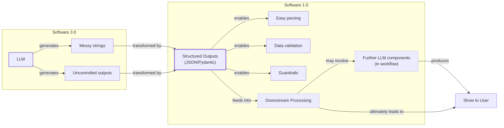

# Lesson 4: Structured Outputs

In our previous lessons, we laid the groundwork for AI Engineering. We explored the AI agent landscape, looked at the difference between rule-based LLM workflows and autonomous AI agents, and covered context engineering: the art of feeding the right information to an LLM. In this lesson, we will tackle a fundamental challenge: getting structured and reliable information *out* of an LLM.

LLMs operate in a world of unstructured data and probabilities, where we input instructions in plain English and get results as plain text. This subdomain of engineering is often called "Software 3.0". Our applications, however, rely on deterministic code and predictable data structures, which is known as "Software 1.0". Structured outputs are the bridge between these two worlds, a fundamental technique for forcing LLMs to return consistent, machine-readable data. Mastering this is essential for any AI engineer building production-grade systems.

## Understanding why structured outputs are critical

Before you start coding, it is important to understand why structured outputs are foundational to building reliable AI applications. When an LLM returns a free-form string, you face the messy task of parsing it. This often involves fragile regular expressions or string-splitting logic. These methods easily break if the model changes its phrasing even slightly, making your system unreliable in production. Structured outputs solve this by forcing the model’s response into a predictable format like JSON [[1]](https://pmc.ncbi.nlm.nih.gov/articles/PMC11751965/), [[2]](https://arxiv.org/html/2506.21585v1).

This approach offers several key benefits. First, structured outputs are easy to parse, manipulate, and debug. Instead of wrestling with raw text, you work with clean Python objects like dictionaries or, even better, Pydantic models. This allows you to programmatically access the data you need without guesswork, making your code cleaner and more predictable. Second, using libraries like Pydantic adds a layer of data and type validation. If the LLM returns a string where an integer is expected, your application raises a clear validation error immediately. This "fail-fast" behavior is essential for building reliable systems and preventing bad data from propagating [[3]](https://www.speakeasy.com/blog/pydantic-vs-dataclasses), [[4]](https://codetain.com/blog/validators-approach-in-python-pydantic-vs-dataclasses/).

Structured outputs create a formal contract between the LLM and your application code. This makes it easier to pass data to the next LLM call or downstream systems like databases, user interfaces, or APIs. For example, you can extract entities like names and dates to build knowledge graphs for advanced RAG or create natural language filters to query database records. This control also reduces costs by ensuring the LLM generates only the necessary data without useless artifacts, which reduces the number of output tokens [[5]](https://www.prompts.ai/en/blog-details/automating-knowledge-graphs-with-llm-outputs), [[6]](https://humanloop.com/blog/structured-outputs).


Image 1: A flowchart illustrating how structured outputs act as a bridge between LLM (Software 3.0) and Python (Software 1.0) for downstream processing.

To understand how structured outputs work in practice, we will explore three ways to implement them: from scratch with JSON, from scratch with Pydantic, and natively with the Gemini API.

## Implementing structured outputs from scratch using JSON

To understand what happens behind the scenes in modern LLM APIs, we will first implement structured outputs from scratch. This hands-on approach builds intuition about the challenges of parsing LLM text and highlights why native API features are so valuable. Our goal is to prompt the model to return a JSON object and then parse it into a Python dictionary. We will demonstrate this with a simple example where we extract key details from a financial document.

This "from scratch" method is a great starting point, but it is not robust enough for production. It relies on the LLM consistently following the prompt's formatting instructions. Any small deviation, like adding extra commentary or forgetting a comma, can cause the `json.loads()` function to fail with a `JSONDecodeError`. This fragility is a common source of bugs in AI systems that parse raw text [[12]](https://dev.to/pockit_tools/llm-structured-output-in-2026-stop-parsing-json-with-regex-and-do-it-right-34pk).

<aside>
💡

You can find the code for this lesson in the notebook of Lesson 4, in the GitHub repository of the course.

</aside>

1.  We begin by setting up our environment. This involves initializing the Gemini client and defining the model we will use. For our examples, we will use `gemini-1.5-flash`, which is fast and cost-effective.
    ```python
    import json
    
    from google import genai
    from utils import env
    
    env.load(required_env_vars=["GOOGLE_API_KEY"])
    
    client = genai.Client()
    
    MODEL_ID = "gemini-1.5-flash"
    ```

2.  Next, we define a sample document for analysis. This text will serve as the unstructured input from which we want to extract structured information.
    ```python
    DOCUMENT = """
    # Q3 2023 Financial Performance Analysis
    
    The Q3 earnings report shows a 20% increase in revenue and a 15% growth in user engagement, 
    beating market expectations. These impressive results reflect our successful product strategy 
    and strong market positioning.
    
    Our core business segments demonstrated remarkable resilience, with digital services leading 
    the growth at 25% year-over-year. The expansion into new markets has proven particularly 
    successful, contributing to 30% of the total revenue increase.
    
    Customer acquisition costs decreased by 10% while retention rates improved to 92%, 
    marking our best performance to date. These metrics, combined with our healthy cash flow 
    position, provide a strong foundation for continued growth into Q4 and beyond.
    """
    ```

3.  Now, we craft a prompt that instructs the LLM to extract metadata and format it as JSON. We provide a clear example of the desired structure and use XML tags like `<document>` and `<json>` to separate the input data from the formatting instructions. This is an effective prompt engineering technique for improving clarity and guiding the model’s output by creating clear boundaries that reduce ambiguity [[7]](https://aws.amazon.com/blogs/machine-learning/structured-data-response-with-amazon-bedrock-prompt-engineering-and-tool-use/), [[8]](https://help.openai.com/en/articles/6654000-best-practices-for-prompt-engineering-with-the-openai-api).
    ```python
    prompt = f"""
    Analyze the following document and extract metadata from it. 
    The output must be a single, valid JSON object with the following structure:
    <json>
    {{ 
        "summary": "A concise summary of the article.", 
        "tags": ["list", "of", "relevant", "tags"], 
        "keywords": ["list", "of", "key", "concepts"],
        "quarter": "Q...",
        "growth_rate": "...%",
    }}
    </json>
    
    Here is the document:
    <document>
    {DOCUMENT}
    </document>
    """
    ```

4.  We send the prompt to the model and inspect the raw response. As expected, the model returns a JSON object, but it is often wrapped in Markdown code blocks, which is a common behavior for LLMs when asked to generate code or structured data.
    ```python
    response = client.models.generate_content(model=MODEL_ID, contents=prompt)
    ```
    It outputs:
    ```text
    ```json
    {
        "summary": "The Q3 2023 financial report highlights a strong performance with a 20% increase in revenue and 15% growth in user engagement, surpassing market expectations. This success is attributed to a robust product strategy, effective market positioning, and successful expansion into new markets, leading to improved customer retention and reduced acquisition costs.",
        "tags": [
            "financials",
            "earnings report",
            "business performance",
            "revenue growth",
            "market expansion",
            "Q3 2023"
        ],
        "keywords": [
            "Q3 2023",
            "revenue",
            "user engagement",
            "market expectations",
            "product strategy",
            "market positioning",
            "digital services",
            "new markets",
            "customer acquisition costs",
            "retention rates",
            "cash flow"
        ],
        "quarter": "Q3 2023",
        "growth_rate": "20%"
    }
    ```
    ```

5.  To handle this, we create a helper function to strip the Markdown and XML tags, leaving a clean JSON string. This function is a simple example of the post-processing often required when not using native structured output features.
    ```python
    def extract_json_from_response(response: str) -> dict:
        """
        Extracts JSON from a response string that is wrapped in <json> or ```json tags.
        """
    
        response = response.replace("<json>", "").replace("</json>", "")
        response = response.replace("```json", "").replace("```", "")
    
        return json.loads(response)
    ```

6.  Finally, we parse the string into a Python dictionary. This dictionary can now be used in our application, allowing us to access the extracted data programmatically.
    ```python
    parsed_response = extract_json_from_response(response.text)
    ```
    It outputs:
    ```json
    {
      "summary": "The Q3 2023 financial report highlights a strong performance with a 20% increase in revenue and 15% growth in user engagement, surpassing market expectations. This success is attributed to a robust product strategy, effective market positioning, and successful expansion into new markets, leading to improved customer retention and reduced acquisition costs.",
      "tags": [
        "financials",
        "earnings report",
        "business performance",
        "revenue growth",
        "market expansion",
        "Q3 2023"
      ],
      "keywords": [
        "Q3 2023",
        "revenue",
        "user engagement",
        "market expectations",
        "product strategy",
        "market positioning",
        "digital services",
        "new markets",
        "customer acquisition costs",
        "retention rates",
        "cash flow"
      ],
      "quarter": "Q3 2023",
      "growth_rate": "20%"
    }
    ```

This manual method works, but it relies on post-processing and lacks data validation. If the LLM makes a mistake, like outputting a string instead of an integer, our application will fail. This lack of a safety net makes the approach unsuitable for production systems where reliability is key. Next, we will see how Pydantic provides a much more robust solution to this problem.

## Implementing structured outputs from scratch using Pydantic

Forcing JSON output is an improvement, but it still leaves you with a plain Python dictionary. You cannot be sure what is inside it, if the keys are correct, or if the values have the right type. This is where Pydantic helps. It is a data validation library that enforces structure and type hints at runtime, ensuring data integrity from the moment it enters your application [[3]](https://www.speakeasy.com/blog/pydantic-vs-dataclasses). It provides a single source of truth for your data structure and can automatically generate a JSON Schema from your Python class.

When an LLM produces output that does not match your Pydantic model, the library raises a `ValidationError` that clearly explains what went wrong. For example, if the model returns a string for a field defined as an integer, the error message will pinpoint the exact field and the type mismatch. This "fail-fast" behavior is essential for building reliable systems, preventing bad data from moving through your application and causing hard-to-debug errors later. This immediate feedback loop is invaluable for debugging and ensures that only valid data is processed by downstream components.

Let's refactor our previous example to use Pydantic.

1.  We define our desired data structure as a Pydantic class. This class acts as a single source of truth for your output format. Pydantic works with Python’s `typing` module, but since Python 3.10, you can use built-in types like `list` directly. For example, `tags: list[str]` is now preferred over importing `List` from `typing`.
    ```python
    from pydantic import BaseModel, Field
    
    class DocumentMetadata(BaseModel):
        """A class to hold structured metadata for a document."""
    
        summary: str = Field(description="A concise, 1-2 sentence summary of the document.")
        tags: list[str] = Field(description="A list of 3-5 high-level tags relevant to the document.")
        keywords: list[str] = Field(description="A list of specific keywords or concepts mentioned.")
        quarter: str = Field(description="The quarter of the financial year described in the document (e.g, Q3 2023).")
        growth_rate: str = Field(description="The growth rate of the company described in the document (e.g, 10%).")
    ```
    You can also nest Pydantic models to represent more complex, hierarchical data. This allows you to define intricate relationships between different pieces of information. Pydantic's validation cascades through nested models, ensuring that every part of the data structure is correct. However, it is good practice to keep schemas as simple as possible, as complex nested structures can confuse the LLM and lead to errors [[13]](https://dev.to/mechcloud_academy/going-deeper-with-pydantic-nested-models-and-data-structures-4e24).
    ```python
    class Summary(BaseModel):
        text: str
        sentiment: float
    
    class Tag(BaseModel):
        label: str
        relevance: float
    
    class ComplexDocumentMetadata(BaseModel):
        summary: Summary
        tags: list[Tag]
    ```

2.  With our Pydantic model defined, we can automatically generate a JSON Schema from it. A schema is a formal contract between your application and the LLM. This contract precisely dictates the expected fields, their types, and any validation rules. We provide this generated schema to the LLM to guide its output. This is similar to the technique used internally by APIs like Gemini and OpenAI to enforce a specific output format [[9]](https://ai.google.dev/gemini-api/docs/structured-output).
    ```python
    schema = DocumentMetadata.model_json_schema()
    ```
    The generated schema is detailed and includes descriptions from the `Field` definitions to guide the generation process.
    ```json
    {
        "description": "A class to hold structured metadata for a document.",
        "properties": {
            "summary": {
                "description": "A concise, 1-2 sentence summary of the document.",
                "title": "Summary",
                "type": "string"
            },
            "tags": {
                "description": "A list of 3-5 high-level tags relevant to the document.",
                "items": {
                    "type": "string"
                },
                "title": "Tags",
                "type": "array"
            },
            "keywords": {
                "description": "A list of specific keywords or concepts mentioned.",
                "items": {
                    "type": "string"
                },
                "title": "Keywords",
                "type": "array"
            },
            "quarter": {
                "description": "The quarter of the financial year described in the document (e.g, Q3 2023).",
                "title": "Quarter",
                "type": "string"
            },
            "growth_rate": {
                "description": "The growth rate of the company described in the document (e.g, 10%).",
                "title": "Growth Rate",
                "type": "string"
            }
        },
        "required": [
            "summary",
            "tags",
            "keywords",
            "quarter",
            "growth_rate"
        ],
        "title": "DocumentMetadata",
        "type": "object"
    }
    ```

3.  We update our prompt to include this JSON Schema. This gives the model a much more precise set of instructions than our previous plain-text example.
    ```python
    prompt = f"""
    Please analyze the following document and extract metadata from it. 
    The output must be a single, valid JSON object that conforms to the following JSON Schema:
    <json>
    {json.dumps(schema, indent=2)}
    </json>
    
    Here is the document:
    <document>
    {DOCUMENT}
    </document>
    """
    ```

4.  We call the model and extract the JSON string as before.
    ```python
    response = client.models.generate_content(model=MODEL_ID, contents=prompt)
    parsed_response = extract_json_from_response(response.text)
    ```
    It outputs:
    ```json
    {
      "summary": "The Q3 2023 earnings report indicates strong financial performance with a 20% increase in revenue and 15% growth in user engagement, driven by successful product strategy, market expansion, and improved customer retention.",
      "tags": [
        "Financial Performance",
        "Earnings Report",
        "Business Growth",
        "Market Expansion",
        "Customer Metrics"
      ],
      "keywords": [
        "Q3 2023",
        "revenue increase",
        "user engagement",
        "digital services",
        "new markets",
        "customer acquisition costs",
        "retention rates",
        "cash flow"
      ],
      "quarter": "Q3 2023",
      "growth_rate": "20%"
    }
    ```

5.  Finally, we validate the output with Pydantic.
    ```python
    try:
        document_metadata = DocumentMetadata.model_validate(parsed_response)
        print("\nValidation successful!")
    except Exception as e:
        print(f"\nValidation failed: {e}")
    ```
    It outputs:
    ```text
    Validation successful!
    ```
    The core idea is to use Pydantic objects directly in downstream components. This moves you away from obscure Python dictionaries, where you constantly have to pollute your code with `if-else` statements to check for missing keys or incorrect types. With Pydantic, you work with clean, predictable Python objects, making your code more reliable and easier to maintain.

Python’s built-in `dataclasses` or `TypedDict` can define structure, but they only provide type hints for static analysis tools. They do not perform runtime validation. If the LLM returns a string where an integer is expected, these tools will not catch the error. While `TypedDict` can be faster for simple cases, Pydantic's overhead is minimal for the robust data integrity it provides. Due to its out-of-the-box validation, Pydantic has become the most popular way to move data around in LLM workflows and AI agents [[3]](https://www.speakeasy.com/blog/pydantic-vs-dataclasses), [[4]](https://codetain.com/blog/validators-approach-in-python-pydantic-vs-dataclasses/), [[14]](https://shazaali.substack.com/p/type-safety-in-langgraph-when-to), [[15]](https://docs.pydantic.dev/latest/concepts/performance/).

## Implementing structured outputs using Gemini and Pydantic

While Pydantic brings structure and validation, we still had to construct prompts and handle responses manually. When working with modern APIs such as Gemini and OpenAI, the recommended way to generate structured outputs is by leveraging their native features. This approach is simpler, more accurate, and often more cost-effective than manual prompt engineering, as the vendor handles the optimization on top of their models. They know best what their models were trained on and how to guide them effectively. This allows you to focus on your application's logic instead of data wrangling [[9]](https://ai.google.dev/gemini-api/docs/structured-output), [[10]](https://www.vellum.ai/blog/when-should-i-use-function-calling-structured-outputs-or-json-mode), [[11]](https://www.googlecloudcommunity.com/gc/AI-ML/Structured-Output-in-vertexAI-BatchPredictionJob/m-p/866640).

Let’s see how to achieve the same result using the Gemini API's native capabilities. The process becomes much simpler and more reliable.

1.  We define a `GenerateContentConfig` object, instructing the Gemini API to set the `response_mime_type` to `"application/json"` and the `response_schema` to our `DocumentMetadata` Pydantic model. This single configuration step replaces the manual schema injection and parsing we did earlier, telling the API to handle the formatting and validation internally.
    ```python
    from google.genai import types
    
    config = types.GenerateContentConfig(response_mime_type="application/json", response_schema=DocumentMetadata)
    ```

2.  This configuration makes our prompt significantly shorter and cleaner, eliminating the need to manually inject JSON examples or full schemas. We simply ask the model to perform the task, as the output format is guided directly by the config. This separation of concerns—task instruction in the prompt, format instruction in the config—makes the code more readable and maintainable.
    ```python
    prompt = f"""
    Analyze the following document and extract its metadata.
    
    Here is the document:
    <document>
    {DOCUMENT}
    </document>
    """
    ```

3.  Now, we call the model, passing our simplified prompt and the new configuration object. The API handles the rest, ensuring the output adheres to the schema.
    ```python
    response = client.models.generate_content(model=MODEL_ID, contents=prompt, config=config)
    ```

4.  The Gemini client automatically parses the output for us. By accessing the `response.parsed` attribute, we receive a ready-to-use instance of our `DocumentMetadata` Pydantic model. This eliminates the need for custom parsing functions or manual validation steps, streamlining the entire process.
    ```python
    document_metadata = response.parsed
    print(f"Type of the response: `{type(document_metadata)}`")
    ```
    It outputs:
    ```text
    Type of the response: `<class '__main__.DocumentMetadata'>`
    ```
This native approach is the recommended way to generate structured outputs. It is robust, efficient, and requires less code. While it is the preferred method for closed-source APIs, the "from scratch" method remains useful for open-source models that may not have this built-in functionality.

## Conclusion: Structured Outputs Are Everywhere

Structured outputs are a fundamental pattern in AI engineering. They are the essential bridge connecting the probabilistic nature of LLMs with the deterministic world of software applications. Whether you are building a simple summarization workflow or a complex research agent, you will use structured outputs to ensure reliability and control. This pattern is everywhere, regardless of the domain you are working in.

This technique will be a recurring theme throughout this course. In our next lesson, we will explore the basic ingredients of LLM workflows, where we will see how structured data flows between different components. Later, when we build agents that can take action (Lesson 6) or reason about the world (Lesson 7), structured outputs will be how they parse information and decide what to do next. Mastering this is a key step toward building powerful and predictable AI systems.

## References

- [1] [Large language models for data extraction from unstructured and semi-structured electronic health records](https://pmc.ncbi.nlm.nih.gov/articles/PMC11751965/)
- [2] [Evaluation of LLM-based Strategies for the Extraction of Food Product Information from Online Shops](https://arxiv.org/html/2506.21585v1)
- [3] [Type Safety in Python: Pydantic vs. Data Classes vs. Annotations vs. TypedDicts](https://www.speakeasy.com/blog/pydantic-vs-dataclasses)
- [4] [Validators approach in Python - Pydantic vs. Dataclasses](https://codetain.com/blog/validators-approach-in-python-pydantic-vs-dataclasses/)
- [5] [Automating Knowledge Graphs with LLM Outputs](https://www.prompts.ai/en/blog-details/automating-knowledge-graphs-with-llm-outputs)
- [6] [Structured Outputs: everything you should know](https://humanloop.com/blog/structured-outputs)
- [7] [Structured data response with Amazon Bedrock: Prompt Engineering and Tool Use](https://aws.amazon.com/blogs/machine-learning/structured-data-response-with-amazon-bedrock-prompt-engineering-and-tool-use/)
- [8] [Best practices for prompt engineering with the OpenAI API](https://help.openai.com/en/articles/6654000-best-practices-for-prompt-engineering-with-the-openai-api)
- [9] [Structured output](https://ai.google.dev/gemini-api/docs/structured-output)
- [10] [When should I use function calling, structured outputs or JSON mode?](https://www.vellum.ai/blog/when-should-i-use-function-calling-structured-outputs-or-json-mode)
- [11] [Structured Output in vertexAI BatchPredictionJob](https://www.googlecloudcommunity.com/gc/AI-ML/Structured-Output-in-vertexAI-BatchPredictionJob/m-p/866640)
- [12] [LLM Structured Output in 2026: Stop Parsing JSON with Regex and Do It Right](https://dev.to/pockit_tools/llm-structured-output-in-2026-stop-parsing-json-with-regex-and-do-it-right-34pk)
- [13] [Going Deeper with Pydantic: Nested Models and Data Structures](https://dev.to/mechcloud_academy/going-deeper-with-pydantic-nested-models-and-data-structures-4e24)
- [14] [Type Safety in LangGraph: When to Use TypedDict vs. Pydantic](https://shazaali.substack.com/p/type-safety-in-langgraph-when-to)
- [15] [Pydantic Performance](https://docs.pydantic.dev/latest/concepts/performance/)