# Lesson 4: Structured Outputs

In our previous lessons, we laid the groundwork for AI Engineering. We explored the AI agent landscape, looked at the difference between rule-based LLM workflows and autonomous AI agents, and covered context engineering: the art of feeding the right information to an LLM. In this lesson, we will tackle a fundamental challenge: getting structured and reliable information *out* of an LLM.

LLMs operate in a world of unstructured data and probabilities, where we input instructions in plain English and get results as plain text. This subdomain of engineering is often called "Software 3.0". Our application, however, relies on deterministic code and predictable data structures, which is known as "Software 1.0". Structured outputs connect these two worlds by forcing LLMs to return consistent, machine-readable data. Mastering this is essential for any AI engineer building production-grade systems.

## Understanding why structured outputs are critical

Before we start coding, it is crucial to understand why structured outputs are foundational to building reliable AI applications. When an LLM returns a free-form string, you face the messy task of parsing it. This often involves fragile regular expressions or string-splitting logic. These methods easily break if the model changes its phrasing even slightly [[1]](https://pmc.ncbi.nlm.nih.gov/articles/PMC11751965/), [[2]](https://arxiv.org/html/2506.21585v1). Structured outputs solve this by forcing the model’s response into a predictable format like JSON.

This approach offers several key benefits. First, structured outputs are easy to parse, manipulate, and debug. Instead of wrestling with raw text, you work with clean Python objects like dictionaries or, even better, Pydantic models. This allows you to programmatically access the data you need without guesswork, making your code cleaner and more predictable.

Second, using libraries like Pydantic adds a layer of data and type validation [[3]](https://www.speakeasy.com/blog/pydantic-vs-dataclasses), [[4]](https://codetain.com/blog/validators-approach-in-python-pydantic-vs-dataclasses/). If the LLM returns a string where an integer is expected, your application will not crash silently with a `TypeError` or `KeyError` down the line. Instead, it will raise a clear validation error immediately. This "fail-fast" behavior is essential for building reliable systems and preventing bad data from propagating through your application.

Structured outputs create a formal contract between the LLM and your application code, making it easier to pass data around the system. Engineers use this pattern everywhere. As seen in Image 1, we leverage structured outputs to pass the right subset of information to the next LLM step or other downstream systems like databases, user interfaces, or APIs. For example, a popular use case is to extract properties like names, tags, and dates to build knowledge graphs for advanced retrieval systems or to create natural language filters for querying databases [[5]](https://www.prompts.ai/en/blog-details/automating-knowledge-graphs-with-llm-outputs), [[6]](https://humanloop.com/blog/structured-outputs).

```mermaid
flowchart LR
  %% LLM Output Stage
  LLM["LLM<br/>(Software 3.0)"]
  Unstructured["Messy & Uncontrolled Outputs"]

  %% Structured Data Bridge
  Structured["Structured Outputs<br/>(JSON/Pydantic)<br/>Benefits: Easy parsing, Data validation, Guardrails"]

  %% Downstream Processing & Integration
  Downstream["Downstream Processing<br/>(Transform & Filter)"]
  Software1["Software 1.0<br/>(Python applications)"]

  %% Data Flow
  LLM -- "produces messy and uncontrolled" --> Unstructured
  Unstructured -- "transformed into reliable" --> Structured
  Structured -- "provides schema-validated data for" --> Downstream
  Downstream -- "integrates with" --> Software1

  %% Emphasize the Structured Outputs as a key bridge/contract
  classDef contract stroke-width:2px
  class Structured contract
```


Image 1: A flowchart illustrating the transformation of unstructured LLM outputs into reliable structured data for downstream processing and application integration.

To understand how structured outputs work in practice, we will explore three ways to implement them: from scratch with JSON, from scratch with Pydantic, and natively with the Gemini API.

## Implementing structured outputs from scratch using JSON

To understand what happens behind the scenes in modern LLM APIs, we will first implement structured outputs from scratch by prompting a model to return a JSON object. This will help you build an intuition for the underlying mechanics. Our goal is to extract key details like a summary, tags, and keywords from a financial document and parse the output into a Python dictionary.

<aside>
💡 You can find the code for this lesson in the notebook for Lesson 4 in the GitHub repository of the course.
</aside>

1.  First, you set up your environment by defining the Gemini client and the model you will use. For this example, we will use `gemini-1.5-flash`, which is fast and cost-effective for simple tasks like data extraction.
    ```python
    from utils import env
    import json
    from google import genai
    
    env.load(required_env_vars=["GOOGLE_API_KEY"])
    client = genai.Client()
    MODEL_ID = "gemini-1.5-flash"
    ```

2.  Next, you define a sample document for the model to analyze. This will serve as your unstructured input text.
    ```python
    DOCUMENT = """
    # Q3 2023 Financial Performance Analysis

    The Q3 earnings report shows a 20% increase in revenue and a 15% growth in user engagement, 
    beating market expectations. These impressive results reflect our successful product strategy 
    and strong market positioning.

    Our core business segments demonstrated remarkable resilience, with digital services leading 
    the growth at 25% year-over-year. The expansion into new markets has proven particularly 
    successful, contributing to 30% of the total revenue increase.

    Customer acquisition costs decreased by 10% while retention rates improved to 92%, 
    marking our best performance to date. These metrics, combined with our healthy cash flow 
    position, provide a strong foundation for continued growth into Q4 and beyond.
    """
    ```

3.  You craft a prompt that instructs the LLM to extract metadata and format it as JSON. A key prompt engineering technique here is the use of XML tags like `<document>` and `<json>`. These tags act as clear delimiters, helping the model distinguish between the raw input data and the formatting instructions, which reduces ambiguity and improves the reliability of the output [[7]](https://help.openai.com/en/articles/6654000-best-practices-for-prompt-engineering-with-the-openai-api), [[8]](https://aws.amazon.com/blogs/machine-learning/structured-data-response-with-amazon-bedrock-prompt-engineering-and-tool-use/). Providing a concrete example of the desired JSON structure within the prompt is also critical for guiding the model.
    ```python
    prompt = f"""
    Analyze the following document and extract metadata from it. 
    The output must be a single, valid JSON object with the following structure:
    <json>
    {{ 
        "summary": "A concise summary of the article.", 
        "tags": ["list", "of", "relevant", "tags"], 
        "keywords": ["list", "of", "key", "concepts"],
        "quarter": "Q...",
        "growth_rate": "...%",
    }}
    </json>

    Here is the document:
    <document>
    {DOCUMENT}
    </document>
    """
    ```

4.  You send the prompt to the model and inspect the raw response.
    ```python
    response = client.models.generate_content(model=MODEL_ID, contents=prompt)
    ```

5.  As expected, the model returns a JSON object. However, it is common for LLMs to wrap this JSON in Markdown code blocks, which is a behavior you need to handle before parsing.
    It outputs:
    ```text
    ```json
    {
        "summary": "The Q3 2023 financial report highlights a strong performance with a 20% increase in revenue and 15% growth in user engagement, surpassing market expectations. This success is attributed to a robust product strategy, effective market positioning, and successful expansion into new markets, leading to improved customer retention and reduced acquisition costs.",
        "tags": [
            "financials",
            "earnings report",
            "business performance",
            "revenue growth",
            "market expansion",
            "Q3 2023"
        ],
        "keywords": [
            "Q3 2023",
            "revenue",
            "user engagement",
            "market expectations",
            "product strategy",
            "market positioning",
            "digital services",
            "new markets",
            "customer acquisition costs",
            "retention rates",
            "cash flow"
        ],
        "quarter": "Q3 2023",
        "growth_rate": "20%"
    }
    ```
    ```

6.  To handle this, you create a helper function to strip the Markdown tags and any other non-JSON text. This function is a simple but crucial post-processing step that cleans the raw output, leaving a pure JSON string that can be safely parsed.
    ```python
    def extract_json_from_response(response: str) -> dict:
        """
        Extracts JSON from a response string that is wrapped in <json> or ```json tags.
        """
    
        response = response.replace("<json>", "").replace("</json>", "")
        response = response.replace("```json", "").replace("```", "")
    
        return json.loads(response)
    ```
    While simple string replacement works for clean outputs, a more robust solution would use regular expressions to find the JSON block and include error handling for malformed data. For example, you could wrap the `json.loads` call in a `try...except` block to catch `JSONDecodeError` and handle cases where the LLM fails to produce valid JSON [[17]](https://machinelearningmastery.com/the-complete-guide-to-using-pydantic-for-validating-llm-outputs).

7.  You use your helper function to parse the raw text from the model's response.
    ```python
    parsed_response = extract_json_from_response(response.text)
    ```

8.  The result is a standard Python dictionary. You now have structured data that can be used programmatically in your application. However, this dictionary comes with no guarantees about its contents, which is a limitation we will address next.
    It outputs:
    ```text
    {
      "summary": "The Q3 2023 financial report highlights a strong performance with a 20% increase in revenue and 15% growth in user engagement, surpassing market expectations. This success is attributed to a robust product strategy, effective market positioning, and successful expansion into new markets, leading to improved customer retention and reduced acquisition costs.",
      "tags": [
        "financials",
        "earnings report",
        "business performance",
        "revenue growth",
        "market expansion",
        "Q3 2023"
      ],
      "keywords": [
        "Q3 2023",
        "revenue",
        "user engagement",
        "market expectations",
        "product strategy",
        "market positioning",
        "digital services",
        "new markets",
        "customer acquisition costs",
        "retention rates",
        "cash flow"
      ],
      "quarter": "Q3 2023",
      "growth_rate": "20%"
    }
    ```
This manual method works, but it relies on post-processing and lacks data validation. If the LLM makes a mistake, like outputting a string instead of an integer or missing a key, your application will fail. Next, we will see how Pydantic provides a much more robust solution.

## Implementing structured outputs from scratch using Pydantic

Forcing JSON output is an improvement, but it still leaves you with a plain Python dictionary. You cannot be sure what is inside it, whether the keys are correct, or if the values have the right type. This uncertainty can lead to bugs and make your code difficult to maintain.

Pydantic solves this problem. It is a data validation library that enforces structure and type hints at runtime, ensuring data integrity from the moment it enters your application [[3]](https://www.speakeasy.com/blog/pydantic-vs-dataclasses). It provides a single, clear definition for your data structure and can automatically generate a JSON Schema from your Python class. When an LLM produces output that does not match your Pydantic model, the library raises a `ValidationError` that clearly explains what went wrong. This "fail-fast" behavior is essential for building reliable systems, preventing bad data from moving through your application and causing hard-to-debug errors later.

1.  You define your desired data structure as a Pydantic class. This class acts as a single source of truth for your output format. It works with Python's standard `typing` library, but since Python 3.9, you can use built-in types like `list` directly. For example, `tags: list[str]` is now preferred over importing `List` from `typing`. It is also a best practice to add clear descriptions for each field using `Field`, which helps both developers and the LLM understand their purpose [[18]](https://zenvanriel.com/ai-engineer-blog/pydantic-ai-validation).
    ```python
    from pydantic import BaseModel, Field
    
    class DocumentMetadata(BaseModel):
        """A class to hold structured metadata for a document."""
    
        summary: str = Field(description="A concise, 1-2 sentence summary of the document.")
        tags: list[str] = Field(description="A list of 3-5 high-level tags relevant to the document.")
        keywords: list[str] = Field(description="A list of specific keywords or concepts mentioned.")
        quarter: str = Field(description="The quarter of the financial year described in the document (e.g, Q3 2023).")
        growth_rate: str = Field(description="The growth rate of the company described in the document (e.g, 10%).")
    ```
    You can also nest Pydantic models to represent more complex, hierarchical data. This allows you to define intricate relationships between different pieces of information. However, it is good practice to keep schemas as simple as possible, as deeply nested structures can confuse the LLM and lead to syntax or structural errors [[19]](https://dev.to/klement_gunndu/stop-parsing-json-by-hand-structured-llm-outputs-with-pydantic-1pg0). Here is an example:
    ```python
    class Summary(BaseModel):
        text: str
        sentiment: float

    class Tag(BaseModel):
        label: str
        relevance: float

    class ComplexDocumentMetadata(BaseModel):
        summary: Summary
        tags: list[Tag]
    ```

2.  With your Pydantic model defined, you can automatically generate a JSON Schema from it. A schema is the standard for defining the structure and constraints of your data, acting as a formal contract between your application and the LLM. This contract dictates the expected fields, their types, and any validation rules. This is similar to the technique used internally by APIs like Gemini and OpenAI to enforce a specific output format [[9]](https://ai.google.dev/gemini-api/docs/structured-output). This enforcement often relies on grammar-based decoding, which constrains the model's token generation to ensure the output is syntactically correct and adheres to the schema [[20]](https://tetrate.io/learn/ai/llm-output-parsing-structured-generation).
    ```python
    schema = DocumentMetadata.model_json_schema()
    ```
    The generated schema is detailed and includes descriptions from the `Field` definitions to guide the generation process.
    ```text
    {'description': 'A class to hold structured metadata for a document.',
     'properties': {'summary': {'description': 'A concise, 1-2 sentence summary of the document.',
       'title': 'Summary',
       'type': 'string'},
      'tags': {'description': 'A list of 3-5 high-level tags relevant to the document.',
       'items': {'type': 'string'},
       'title': 'Tags',
       'type': 'array'},
      'keywords': {'description': 'A list of specific keywords or concepts mentioned.',
       'items': {'type': 'string'},
       'title': 'Keywords',
       'type': 'array'},
      'quarter': {'description': 'The quarter of the financial year described in the document (e.g, Q3 2023).',
       'title': 'Quarter',
       'type': 'string'},
      'growth_rate': {'description': 'The growth rate of the company described in the document (e.g, 10%).',
       'title': 'Growth Rate',
       'type': 'string'}},
     'required': ['summary', 'tags', 'keywords', 'quarter', 'growth_rate'],
     'title': 'DocumentMetadata',
     'type': 'object'}
    ```

3.  You update your prompt to include this JSON Schema, giving the model a much more precise set of instructions.
    ```python
    prompt = f"""
    Please analyze the following document and extract metadata from it. 
    The output must be a single, valid JSON object that conforms to the following JSON Schema:
    <json>
    {json.dumps(schema, indent=2)}
    </json>

    Here is the document:
    <document>
    {DOCUMENT}
    </document>
    """
    ```

4.  You call the model and extract the JSON string as before.
    ```python
    response = client.models.generate_content(model=MODEL_ID, contents=prompt)
    parsed_response = extract_json_from_response(response.text)
    ```
    It outputs:
    ```text
    {
      "summary": "The Q3 2023 earnings report indicates strong financial performance with a 20% increase in revenue and 15% growth in user engagement, driven by successful product strategy, market expansion, and improved customer retention.",
      "tags": [
        "Financial Performance",
        "Earnings Report",
        "Business Growth",
        "Market Expansion",
        "Customer Metrics"
      ],
      "keywords": [
        "Q3 2023",
        "revenue increase",
        "user engagement",
        "digital services",
        "new markets",
        "customer acquisition costs",
        "retention rates",
        "cash flow"
      ],
      "quarter": "Q3 2023",
      "growth_rate": "20%"
    }
    ```

5.  Now, the biggest difference is that you can load the output dictionary into your Pydantic model and validate it. A more advanced pattern for handling validation errors is to implement a retry loop. If validation fails, you can automatically send a new request to the LLM, including the validation error message in the prompt to guide the model toward a correct response [[17]](https://machinelearningmastery.com/the-complete-guide-to-using-pydantic-for-validating-llm-outputs).
    ```python
    try:
        document_metadata = DocumentMetadata.model_validate(parsed_response)
        print("\nValidation successful!")
    except Exception as e:
        print(f"\nValidation failed: {e}")
    ```
    It outputs:
    ```text
    Validation successful!
    ```
    The `document_metadata` Pydantic object can now be safely used throughout your application. This is the main advantage: you move from unclear dictionaries, where you constantly check for missing keys or incorrect types, to clean, predictable Python objects with full type-hinting and attribute access.

While Python’s built-in `dataclasses` or `TypedDict` can define structure, they only provide type hints for static analysis and do not perform runtime validation [[3]](https://www.speakeasy.com/blog/pydantic-vs-dataclasses), [[4]](https://codetain.com/blog/validators-approach-in-python-pydantic-vs-dataclasses/). If the LLM returns a string where an integer is expected, these tools will not catch the error. Pydantic’s runtime validation, type constraints, and clear schema definitions make it our favorite way for structuring and validating our domain data structures.

## Implementing structured outputs using Gemini and Pydantic

While Pydantic brings structure and validation, you still had to construct the prompts and handle responses manually. When working with modern APIs such as Gemini and OpenAI, the recommended way to generate structured outputs is by using their native features. This approach is simpler, more accurate, and often more cost-effective than manual prompt engineering, as the vendor will always handle the optimization on top of their models better than your manual prompting [[9]](https://ai.google.dev/gemini-api/docs/structured-output), [[10]](https://www.vellum.ai/blog/when-should-i-use-function-calling-structured-outputs-or-json-mode), [[11]](https://www.googlecloudcommunity.com/gc/AI-ML/Structured-Output-in-vertexAI-BatchPredictionJob/m-p/866640).

Native support guarantees that the output will be a syntactically valid JSON that conforms to the provided schema. This eliminates an entire class of errors related to parsing and validation, making your application more resilient. Furthermore, because the schema is handled by the API, your prompts become much cleaner and more focused on the task itself, rather than on output formatting instructions. This separation of concerns simplifies development and maintenance.

Let’s see how to achieve the same result using the Gemini API’s native capabilities. The process becomes much simpler.

1.  You define a `GenerateContentConfig` object, instructing the Gemini API to set the `response_mime_type` to `"application/json"` and the `response_schema` to our `DocumentMetadata` Pydantic model. This configures the model to output JSON that is then automatically converted to the given Pydantic model. This single configuration step replaces the manual schema injection and parsing we did earlier. This is often done through grammar-based decoding, where the API restricts the model to only generate tokens that conform to the provided schema, offering a mathematical guarantee of a valid output structure [[20]](https://tetrate.io/learn/ai/llm-output-parsing-structured-generation).
    ```python
    from google.genai import types
    
    config = types.GenerateContentConfig(response_mime_type="application/json", response_schema=DocumentMetadata)
    ```

2.  This configuration makes your prompt significantly shorter and cleaner, eliminating the need to manually inject any type of schema. You simply ask the model to perform the task, as the output format is guided directly by the config.
    ```python
    prompt = f"""
    Analyze the following document and extract its metadata.

    Here is the document:
    <document>
    {DOCUMENT}
    </document>
    """
    ```

3.  Now, you call the model, passing your simplified prompt and the new configuration object. The API handles the rest, ensuring the output adheres to the schema.
    ```python
    response = client.models.generate_content(model=MODEL_ID, contents=prompt, config=config)
    ```

4.  The Gemini client automatically parses the output for us. By accessing the `response.parsed` attribute, you receive a ready-to-use instance of our `DocumentMetadata` Pydantic model, with no extra parsing or validation steps required on our end.
    ```python
    document_metadata = response.parsed
    print(f"Type of the response: `{type(document_metadata)}`")
    ```
    It outputs:
    ```text
    Type of the response: `<class '__main__.DocumentMetadata'>`
    ```
This native approach is robust, efficient, and requires less code.

## Structured Outputs Are Everywhere

We have covered the why and how of structured outputs, from manual prompting to native API integration. This technique is a fundamental pattern in AI engineering. It is the essential connection between the probabilistic, free-form nature of LLMs and the deterministic, structured world of software applications. Whether you are building a simple workflow to summarize articles, a coding agent to generate functions, or a complex agent that analyzes financial data, you will use structured outputs to ensure reliability and control.

This pattern will be a recurring theme throughout this course. In our next lesson, we will explore the basic ingredients of LLM workflows, where structured outputs will act as the data packets that flow between different components. Later, when we build agents that can take action (Lesson 6) or reason about the world (Lesson 7), structured outputs will be how they parse information from their environment and decide what to do next. Mastering this technique is a key step toward building powerful and predictable AI systems.

## References

- [1] Ntinopoulos, V., Biefer, H. R. C., Tudorache, I., Papadopoulos, N., Odavic, D., Risteski, P., Haeussler, A., & Dzemali, O. (2024). Large language models for data extraction from unstructured and semi-structured electronic health records: a multiple model performance evaluation. BMJ Health & Care Informatics, 32(1), e101139. [https://pmc.ncbi.nlm.nih.gov/articles/PMC11751965/](https://pmc.ncbi.nlm.nih.gov/articles/PMC11751965/)
- [2] Evaluation of LLM-based Strategies for the Extraction of Food Product Information from Online Shops. (n.d.). arXiv. [https://arxiv.org/html/2406.12584v1](https://arxiv.org/html/2406.12584v1)
- [3] Type Safety in Python: Pydantic vs. Data Classes vs. Annotations vs. TypedDicts. (2024, August 29). Speakeasy. [https://www.speakeasy.com/blog/pydantic-vs-dataclasses](https://www.speakeasy.com/blog/pydantic-vs-dataclasses)
- [4] Validators approach in Python - Pydantic vs. Dataclasses. (n.d.). Codetain. [https://codetain.com/blog/validators-approach-in-python-pydantic-vs-dataclasses/](https://codetain.com/blog/validators-approach-in-python-pydantic-vs-dataclasses/)
- [5] Automating Knowledge Graphs with LLM Outputs. (n.d.). Prompts.ai. [https://www.prompts.ai/en/blog-details/automating-knowledge-graphs-with-llm-outputs](https://www.prompts.ai/en/blog-details/automating-knowledge-graphs-with-llm-outputs)
- [6] Structured Outputs: everything you should know. (2024, February 13). Humanloop. [https://humanloop.com/blog/structured-outputs](https://humanloop.com/blog/structured-outputs)
- [7] Best practices for prompt engineering with the OpenAI API. (n.d.). OpenAI Help Center. [https://help.openai.com/en/articles/6654000-best-practices-for-prompt-engineering-with-the-openai-api](https://help.openai.com/en/articles/6654000-best-practices-for-prompt-engineering-with-the-openai-api)
- [8] Structured data response with Amazon Bedrock: Prompt Engineering and Tool Use. (2024, June 26). Amazon Web Services. [https://aws.amazon.com/blogs/machine-learning/structured-data-response-with-amazon-bedrock-prompt-engineering-and-tool-use/](https://aws.amazon.com/blogs/machine-learning/structured-data-response-with-amazon-bedrock-prompt-engineering-and-tool-use/)
- [9] Structured output. (n.d.). Google AI for Developers. [https://ai.google.dev/gemini-api/docs/structured-output](https://ai.google.dev/gemini-api/docs/structured-output)
- [10] When should I use function calling, structured outputs or JSON mode? (2024, October 10). Vellum AI Blog. [https://www.vellum.ai/blog/when-should-i-use-function-calling-structured-outputs-or-json-mode](https://www.vellum.ai/blog/when-should-i-use-function-calling-structured-outputs-or-json-mode)
- [11] Structured Output in vertexAI BatchPredictionJob. (n.d.). Google Cloud Community. [https://www.googlecloudcommunity.com/gc/AI-ML/Structured-Output-in-vertexAI-BatchPredictionJob/m-p/866640](https://www.googlecloudcommunity.com/gc/AI-ML/Structured-Output-in-vertexAI-BatchPredictionJob/m-p/866640)
- [12] Structured Outputs with Pydantic & OpenAI Function Calling. (2024, May 16). YouTube. [https://www.youtube.com/watch?v=NGEZsqEUpC0](https://www.youtube.com/watch?v=NGEZsqEUpC0)
- [13] Structured Outputs with OpenAI. (n.d.). OpenAI Platform. [https://platform.openai.com/docs/guides/structured-outputs](https://platform.openai.com/docs/guides/structured-outputs)
- [14] Steering Large Language Models with Pydantic. (n.d.). Pydantic. [https://pydantic.dev/articles/llm-intro](https://pydantic.dev/articles/llm-intro)
- [15] How to return structured data from a model. (n.d.). LangChain. [https://python.langchain.com/docs/how_to/structured_output/](https://python.langchain.com/docs/how_to/structured_output/)
- [16] YAML vs. JSON: Which Is More Efficient for Language Models? (n.d.). Better Programming. [https://betterprogramming.pub/yaml-vs-json-which-is-more-efficient-for-language-models-5bc11dd0f6df](https://betterprogramming.pub/yaml-vs-json-which-is-more-efficient-for-language-models-5bc11dd0f6df)
- [17] The Complete Guide to Using Pydantic for Validating LLM Outputs. (n.d.). MachineLearningMastery.com. [https://machinelearningmastery.com/the-complete-guide-to-using-pydantic-for-validating-llm-outputs](https://machinelearningmastery.com/the-complete-guide-to-using-pydantic-for-validating-llm-outputs)
- [18] Using Pydantic for AI Data Validation & Extraction. (n.d.). Zen van Riel. [https://zenvanriel.com/ai-engineer-blog/pydantic-ai-validation](https://zenvanriel.com/ai-engineer-blog/pydantic-ai-validation)
- [19] Stop Parsing JSON by Hand: Structured LLM Outputs with Pydantic. (n.d.). DEV Community. [https://dev.to/klement_gunndu/stop-parsing-json-by-hand-structured-llm-outputs-with-pydantic-1pg0](https://dev.to/klement_gunndu/stop-parsing-json-by-hand-structured-llm-outputs-with-pydantic-1pg0)
- [20] LLM Output Parsing and Structured Generation. (n.d.). Tetrate. [https://tetrate.io/learn/ai/llm-output-parsing-structured-generation](https://tetrate.io/learn/ai/llm-output-parsing-structured-generation)