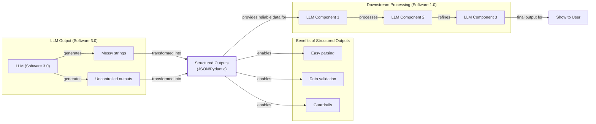

# Lesson 4: Structured Outputs

In our previous lessons, we laid the groundwork for AI Engineering. We explored the AI agent landscape, looked at the difference between rule-based LLM workflows and autonomous AI agents, and covered context engineering: the art of feeding the right information to an LLM. In this lesson, we will tackle a fundamental challenge: getting structured and reliable information *out* of an LLM.

LLMs operate in a world of unstructured data and probabilities, where we input instructions in plain English and get results as plain text. This subdomain of engineering is often called "Software 3.0". Our application, however, relies on deterministic code and predictable data structures, which is known as "Software 1.0". Structured outputs are the bridge between these two worlds, a fundamental technique for forcing LLMs to return consistent, machine-readable data. Mastering this is essential for any AI engineer building production-grade systems.

## Understanding why structured outputs are critical

Before we start coding, it is important to understand why structured outputs are foundational to building reliable AI applications. When an LLM returns a free-form string, you face the messy task of parsing it. This often involves fragile regular expressions or string-splitting logic that can easily break if the model’s phrasing changes slightly. Worse, this approach can lead to silent data corruption or failures from "schema drift," where the model adds unexpected fields, renames keys, or nests data differently than specified [[39]](https://tetrate.io/learn/ai/llm-output-parsing-structured-generation). Structured outputs solve this by forcing the model’s response into a predictable format like JSON.

This shift mirrors the evolution of web scraping, which has moved from writing brittle CSS selectors to defining a data schema and letting an LLM handle the extraction [[40]](https://bytetunnels.com/posts/llm-powered-data-extraction-schema-driven-scraping-with-structured-output). In both cases, the goal is to move from an imperative approach (telling the system *how* to get data) to a declarative one (telling it *what* data you want).

This approach offers several key benefits. First, structured outputs are easy to parse, manipulate, and debug. Instead of wrestling with raw text, you work with clean Python objects like dictionaries or, even better, Pydantic models. This makes your code more predictable. Using libraries like Pydantic adds a layer of data and type validation [[6]](https://machinelearningmastery.com/the-complete-guide-to-using-pydantic-for-validating-llm-outputs). If the LLM returns a string where an integer is expected, your application raises a clear validation error immediately, preventing bad data from propagating.

Structured outputs create a formal contract between the LLM and your application code. This makes it easier to pass data between steps in a workflow or to downstream systems like databases or APIs. For example, a common use case is extracting entities like names, tags, and dates to build knowledge graphs for advanced RAG.


Image 1: A flowchart illustrating the role of structured outputs as a bridge between Large Language Model (LLM) outputs and downstream application processing.

To see this in practice, we will now show you how to implement structured outputs in three ways: from scratch using JSON, from scratch using Pydantic, and natively with the Gemini SDK and Pydantic.

## Implementing structured outputs from scratch using JSON

To understand what happens behind the scenes in modern LLM APIs, we will first implement structured outputs from scratch by prompting the model to output JSON. Our goal is to extract key details from a financial document. This hands-on approach helps build an intuition for the challenges that more advanced tools are designed to solve.

<aside>
💡

You can find the code for this lesson in the notebook of Lesson 4, in the GitHub repository of the course.

</aside>

1.  First, we define our Gemini client and the model ID. We will use `gemini-1.5-flash`, which is fast and cost-effective.
    ```python
    import json
    
    from google import genai
    from utils import env
    
    env.load(required_env_vars=["GOOGLE_API_KEY"])
    
    client = genai.Client()
    
    MODEL_ID = "gemini-1.5-flash"
    ```

2.  Next, we define the sample document for analysis.
    ```python
    DOCUMENT = """
    # Q3 2023 Financial Performance Analysis
    
    The Q3 earnings report shows a 20% increase in revenue and a 15% growth in user engagement, 
    beating market expectations. These impressive results reflect our successful product strategy 
    and strong market positioning.
    
    Our core business segments demonstrated remarkable resilience, with digital services leading 
    the growth at 25% year-over-year. The expansion into new markets has proven particularly 
    successful, contributing to 30% of the total revenue increase.
    
    Customer acquisition costs decreased by 10% while retention rates improved to 92%, 
    marking our best performance to date. These metrics, combined with our healthy cash flow 
    position, provide a strong foundation for continued growth into Q4 and beyond.
    """
    ```

3.  Now, we craft a prompt that instructs the LLM to extract metadata and format it as JSON. This prompt uses several key techniques. We explicitly state that the output must be a single, valid JSON object. We provide a clear example of the desired structure, including keys and example value types. Finally, we use XML tags like `<document>` and `<json>` to separate the input data from the formatting instructions. This helps the model distinguish between content and commands, improving the reliability of the output [[4]](https://www.leewayhertz.com/structured-outputs-in-llms).
    ```python
    prompt = f"""
    Analyze the following document and extract metadata from it. 
    The output must be a single, valid JSON object with the following structure:
    <json>
    {{ 
        "summary": "A concise summary of the article.", 
        "tags": ["list", "of", "relevant", "tags"], 
        "keywords": ["list", "of", "key", "concepts"],
        "quarter": "Q...",
        "growth_rate": "...%",
    }}
    </json>
    
    Here is the document:
    <document>
    {DOCUMENT}
    </document>
    """
    ```

4.  We send the prompt to the model.
    ```python
    response = client.models.generate_content(model=MODEL_ID, contents=prompt)
    ```

5.  The model returns a text response. A common failure mode is that LLMs often wrap the JSON in Markdown code blocks or add conversational text like "Sure, here is the JSON you requested:" [[43]](https://dev.to/pockit_tools/llm-structured-output-in-2026-stop-parsing-json-with-regex-and-do-it-right-34pk).
    ```text
    ```json
    {
        "summary": "The Q3 2023 financial report highlights a strong performance with a 20% increase in revenue and 15% growth in user engagement, surpassing market expectations. This success is attributed to a robust product strategy, effective market positioning, and successful expansion into new markets, leading to improved customer retention and reduced acquisition costs.",
        "tags": [
            "financials",
            "earnings report",
            "business performance",
            "revenue growth",
            "market expansion",
            "Q3 2023"
        ],
        "keywords": [
            "Q3 2023",
            "revenue",
            "user engagement",
            "market expectations",
            "product strategy",
            "market positioning",
            "digital services",
            "new markets",
            "customer acquisition costs",
            "retention rates",
            "cash flow"
        ],
        "quarter": "Q3 2023",
        "growth_rate": "20%"
    }
    ```
    ```

6.  To handle this, we create a helper function to strip these extra characters, leaving a clean JSON string. This post-processing step is crucial for making the output programmatically parsable.
    ```python
    def extract_json_from_response(response: str) -> dict:
        """
        Extracts JSON from a response string that is wrapped in <json> or ```json tags.
        """
    
        response = response.replace("<json>", "").replace("</json>", "")
        response = response.replace("```json", "").replace("```", "")
    
        return json.loads(response)
    ```

7.  We can now reliably parse the JSON string into a Python dictionary.
    ```python
    parsed_response = extract_json_from_response(response.text)
    ```

8.  The final `parsed_response` is a dictionary that can be used in our application.
    ```json
    {
      "summary": "The Q3 2023 financial report highlights a strong performance with a 20% increase in revenue and 15% growth in user engagement, surpassing market expectations. This success is attributed to a robust product strategy, effective market positioning, and successful expansion into new markets, leading to improved customer retention and reduced acquisition costs.",
      "tags": [
        "financials",
        "earnings report",
        "business performance",
        "revenue growth",
        "market expansion",
        "Q3 2023"
      ],
      "keywords": [
        "Q3 2023",
        "revenue",
        "user engagement",
        "market expectations",
        "product strategy",
        "market positioning",
        "digital services",
        "new markets",
        "customer acquisition costs",
        "retention rates",
        "cash flow"
      ],
      "quarter": "Q3 2023",
      "growth_rate": "20%"
    }
    ```

This manual method works, but it relies on post-processing and lacks robust data validation. If the LLM returns a malformed string, the `json.loads` call will raise a `JSONDecodeError` [[41]](https://machinelearningmastery.com/the-complete-guide-to-using-pydantic-for-validating-llm-outputs). Even if the JSON is syntactically valid, there are no guarantees about its contents. Next, we will see how Pydantic provides a much more robust solution.

## Implementing structured outputs from scratch using Pydantic

While forcing JSON output is an improvement, it still leaves you with a plain Python dictionary. You cannot be sure what is inside that dictionary, if the keys are correct, or if the values have the right type. This uncertainty can lead to bugs and make your code difficult to maintain. This is where Pydantic helps. Pydantic is a data validation library that enforces structure and type hints at runtime, ensuring data integrity from the moment data enters your application [[6]](https://machinelearningmastery.com/the-complete-guide-to-using-pydantic-for-validating-llm-outputs).

When an LLM produces output that does not match the structure and types defined in your Pydantic model, the library raises a `ValidationError`. This error clearly explains what went wrong, allowing you to quickly identify and fix issues. This "fail-fast" behavior is essential for building reliable systems, preventing bad data from moving through your application and causing hard-to-debug errors later.

Let's refactor our previous example to use Pydantic.

1.  We define our desired data structure as a Pydantic class. This class provides a single, clear definition for your output format. We use standard Python type hints to define the expected type for each field. The `description` parameter in `Field` is not just for documentation; it’s a direct instruction to the LLM. Underlying extraction mechanisms inject these descriptions into the prompt, so a clear and specific description improves the quality of the generated output [[42]](https://mlpills.substack.com/p/issue-128-structured-llm-outputs).
    ```python
    from pydantic import BaseModel, Field
    
    class DocumentMetadata(BaseModel):
        """A class to hold structured metadata for a document."""
    
        summary: str = Field(description="A concise, 1-2 sentence summary of the document.")
        tags: list[str] = Field(description="A list of 3-5 high-level tags relevant to the document.")
        keywords: list[str] = Field(description="A list of specific keywords or concepts mentioned.")
        quarter: str = Field(description="The quarter of the financial year described in the document (e.g, Q3 2023).")
        growth_rate: str = Field(description="The growth rate of the company described in the document (e.g, 10%).")
    ```

2.  Pydantic works with Python’s `typing` module, but since Python 3.9, you can use built-in types like `list` directly. For example, `tags: list[str]` is now preferred over importing `List` from `typing`.

3.  You can also nest Pydantic models to represent more complex, hierarchical data, such as a `DocumentMetadata` model containing `Summary` and `Tag` objects. This allows you to define intricate relationships between different pieces of information. However, it is good practice to keep schemas as simple as possible, as complex nested structures can confuse the LLM [[17]](https://mlpills.substack.com/p/issue-128-structured-llm-outputs). Pydantic also allows for custom validation logic using the `@field_validator` decorator. This is useful for checks that go beyond simple type and range constraints, such as ensuring a field's value conforms to a specific business rule [[41]](https://machinelearningmastery.com/the-complete-guide-to-using-pydantic-for-validating-llm-outputs).
    ```python
    class Summary(BaseModel):
        text: str
        sentiment: float
    
    class Tag(BaseModel):
        label: str
        relevance: float
    
    class ComplexDocumentMetadata(BaseModel):
        summary: Summary
        tags: list[Tag]
    ```

### Injecting Pydantic Schema into the Prompt

1.  With our Pydantic model defined, we can automatically generate a JSON Schema from it. A schema is the standard for defining the structure and constraints of your data, acting as a formal contract between your application and the LLM [[1]](https://www.decodingai.com/p/llm-structured-outputs-the-only-way).
    ```python
    schema = DocumentMetadata.model_json_schema()
    ```

2.  The generated schema is detailed and includes descriptions from the `Field` definitions to guide the generation process. This is similar to the technique used internally by APIs like Gemini and OpenAI to enforce a specific output format [[22]](https://ai.google.dev/gemini-api/docs/structured-output).
    ```json
    {'description': 'A class to hold structured metadata for a document.',
     'properties': {'summary': {'description': 'A concise, 1-2 sentence summary of the document.',
       'title': 'Summary',
       'type': 'string'},
      'tags': {'description': 'A list of 3-5 high-level tags relevant to the document.',
       'items': {'type': 'string'},
       'title': 'Tags',
       'type': 'array'},
      'keywords': {'description': 'A list of specific keywords or concepts mentioned.',
       'items': {'type': 'string'},
       'title': 'Keywords',
       'type': 'array'},
      'quarter': {'description': 'The quarter of the financial year described in the document (e.g, Q3 2023).',
       'title': 'Quarter',
       'type': 'string'},
      'growth_rate': {'description': 'The growth rate of the company described in the document (e.g, 10%).',
       'title': 'Growth Rate',
       'type': 'string'}},
     'required': ['summary', 'tags', 'keywords', 'quarter', 'growth_rate'],
     'title': 'DocumentMetadata',
     'type': 'object'}
    ```

3.  We update our prompt to include this JSON Schema, giving the model a much more precise set of instructions.
    ```python
    prompt = f"""
    Please analyze the following document and extract metadata from it. 
    The output must be a single, valid JSON object that conforms to the following JSON Schema:
    <json>
    {json.dumps(schema, indent=2)}
    </json>
    
    Here is the document:
    <document>
    {DOCUMENT}
    </document>
    """
    ```

4.  We call the model and extract the JSON string as before.
    ```python
    response = client.models.generate_content(model=MODEL_ID, contents=prompt)
    
    parsed_response = extract_json_from_response(response.text)
    ```

5.  The output is a JSON object conforming to the schema.
    ```json
    {
        "summary": "The Q3 2023 earnings report indicates strong financial performance with a 20% increase in revenue and 15% growth in user engagement, driven by successful product strategy, market expansion, and improved customer retention.",
        "tags": [
            "Financial Performance",
            "Earnings Report",
            "Business Growth",
            "Market Expansion",
            "Customer Metrics"
        ],
        "keywords": [
            "Q3 2023",
            "revenue increase",
            "user engagement",
            "digital services",
            "new markets",
            "customer acquisition costs",
            "retention rates",
            "cash flow"
        ],
        "quarter": "Q3 2023",
        "growth_rate": "20%"
    }
    ```

6.  Now, the key difference is that we can validate the output with Pydantic.
    ```python
    try:
        document_metadata = DocumentMetadata.model_validate(parsed_response)
        print("\nValidation successful!")
    except Exception as e:
        print(f"\nValidation failed: {e}")
    ```
    It outputs:
    ```text
    
    Validation successful!
    ```

7.  The `document_metadata` object is a Pydantic model instance that can be safely used throughout your application, with full type-hinting and attribute access. This is the main advantage: you move from unclear dictionaries to clean, predictable Python objects. For example, if the LLM returned a simple string for the `tags` attribute instead of a list, Pydantic would raise a `ValidationError`, preventing the invalid data from proceeding.
    ```json
    {
      "summary": "The Q3 2023 earnings report indicates strong financial performance with a 20% increase in revenue and 15% growth in user engagement, driven by successful product strategy, market expansion, and improved customer retention.",
      "tags": [
        "Financial Performance",
        "Earnings Report",
        "Business Growth",
        "Market Expansion",
        "Customer Metrics"
      ],
      "keywords": [
        "Q3 2023",
        "revenue increase",
        "user engagement",
        "digital services",
        "new markets",
        "customer acquisition costs",
        "retention rates",
        "cash flow"
      ],
      "quarter": "Q3 2023",
      "growth_rate": "20%"
    }
    ```

Python’s built-in `dataclasses` or `TypedDict` can define structure, but they only provide type hints for static analysis tools [[36]](https://shazaali.substack.com/p/type-safety-in-langgraph-when-to), [[38]](https://www.packetcoders.io/typeddict-vs-pydantic). They do not perform runtime validation. This means if the LLM returns a string where an integer is expected, or if a required field is missing, a `dataclass` or `TypedDict` will not catch this error immediately. A type mismatch will go unnoticed until it causes an error during execution, potentially leading to difficult-to-debug issues later. While `TypedDict` can be faster for simple cases without validation, Pydantic's overhead is minimal for the robust data integrity it provides.

Overall, Pydantic’s runtime validation, type constraints, and clear schema definitions make it a strong option for structuring and validating data in LLM workflows and AI agent systems. Its features are well-suited for building reliable, production-ready applications.

While Pydantic brings structure and validation to LLM outputs, in this example, we still had to construct prompts and handle responses manually. Let’s see how we can configure modern LLM APIs like Gemini to natively output Pydantic structured outputs.

## Implementing structured outputs using Gemini and Pydantic

So far, we have implemented structured outputs from scratch. When working with modern APIs such as Gemini and OpenAI, the recommended way is to use their native features. This approach is more reliable because it uses constrained decoding, where the API programmatically forces the model to generate only tokens that conform to your JSON schema, guaranteeing a syntactically valid output [[43]](https://dev.to/pockit_tools/llm-structured-output-in-2026-stop-parsing-json-with-regex-and-do-it-right-34pk). This can improve reliability from around 36% with prompting to nearly 100% [[44]](https://humanloop.com/blog/structured-outputs).

Let’s see how to achieve the same result using the Gemini API’s native capabilities. The process becomes much simpler.

1.  We define a `GenerateContentConfig` object, instructing the Gemini API to set the `response_mime_type` to `"application/json"` and the `response_schema` to our `DocumentMetadata` Pydantic model. This single configuration step replaces the manual schema injection and parsing we did earlier.
    ```python
    from google.genai import types
    
    config = types.GenerateContentConfig(response_mime_type="application/json", response_schema=DocumentMetadata)
    ```

2.  This configuration makes our prompt significantly shorter and cleaner, eliminating the need to manually inject any schema. We simply ask the model to perform the task, as the output format is guided directly by the config.
    ```python
    prompt = f"""
    Analyze the following document and extract its metadata.
    
    Here is the document:
    <document>
    {DOCUMENT}
    </document>
    """
    ```

3.  Now, we call the model, passing our simplified prompt and the new configuration object. The API handles the rest, ensuring the output adheres to the schema.
    ```python
    response = client.models.generate_content(model=MODEL_ID, contents=prompt, config=config)
    ```

4.  The Gemini client automatically parses the output for us. By accessing the `response.parsed` attribute, we receive a ready-to-use instance of our `DocumentMetadata` Pydantic model.
    ```python
    document_metadata = response.parsed
    print(f"Type of the response: `{type(response.parsed)}`")
    ```
    It outputs:
    ```text
    Type of the response: `<class '__main__.DocumentMetadata'>`
    ```
    And here is the final object:
    ```json
    {
      "summary": "The Q3 2023 earnings report shows a 20% increase in revenue and 15% growth in user engagement, exceeding market expectations due to successful product strategy and market expansion. Customer acquisition costs decreased by 10% and retention improved to 92%, indicating a strong foundation for continued growth.",
      "tags": [
        "Financial Performance",
        "Earnings Report",
        "Revenue Growth",
        "Market Expansion",
        "User Engagement"
      ],
      "keywords": [
        "Q3 2023",
        "revenue increase",
        "user engagement",
        "product strategy",
        "market positioning",
        "digital services",
        "new markets",
        "customer acquisition costs",
        "retention rates",
        "cash flow"
      ],
      "quarter": "Q3 2023",
      "growth_rate": "20%"
    }
    ```

While robust, this approach has trade-offs. Complex schemas can increase latency due to the "schema complexity tax," and in some niche cases, may even slightly reduce semantic accuracy compared to a well-crafted prompt [[43]](https://dev.to/pockit_tools/llm-structured-output-in-2026-stop-parsing-json-with-regex-and-do-it-right-34pk), [[45]](https://dylancastillo.co/posts/gemini-structured-outputs.html). Despite this, for most production systems, the reliability of native APIs makes them the recommended choice.

## Structured Outputs Are Everywhere

We have covered the why and how of structured outputs, from manual prompting to native API integration. This technique is a fundamental pattern in AI engineering, connecting the probabilistic nature of LLMs with the deterministic world of software. Whether you are building a simple summarization workflow or a complex research agent, you will use structured outputs to ensure reliability and control.

This pattern is a recurring theme. In our next lesson, we will explore LLM workflows, where structured data flows between components. Later, when we build agents that can take action (Lesson 6), you will see a related concept: function calling. While both use schemas, structured outputs are for formatting the final answer, whereas function calling is for requesting an action during a conversation [[22]](https://ai.google.dev/gemini-api/docs/structured-output). This technique is also the foundation for multi-agent systems, enabling them to communicate reliably through standardized protocols [[46]](https://arxiv.org/html/2504.16736v2). Mastering structured outputs is a key step toward building powerful AI systems.

## References

- [1] Structured Outputs with Pydantic & OpenAI Function Calling [https://www.youtube.com/watch?v=NGEZsqEUpC0](https://www.youtube.com/watch?v=NGEZsqEUpC0)
- [2] Structured Outputs with OpenAI [https://platform.openai.com/docs/guides/structured-outputs](https://platform.openai.com/docs/guides/structured-outputs)
- [3] Steering Large Language Models with Pydantic [https://pydantic.dev/articles/llm-intro](https://pydantic.dev/articles/llm-intro)
- [4] How to return structured data from a model [https://python.langchain.com/docs/how_to/structured_output/](https://python.langchain.com/docs/how_to/structured_output/)
- [5] YAML vs. JSON: Which Is More Efficient for Language Models? [https://betterprogramming.pub/yaml-vs-json-which-is-more-efficient-for-language-models-5bc11dd0f6df](https://betterprogramming.pub/yaml-vs-json-which-is-more-efficient-for-language-models-5bc11dd0f6df)
- [6] The Complete Guide to Using Pydantic for Validating LLM Outputs [https://machinelearningmastery.com/the-complete-guide-to-using-pydantic-for-validating-llm-outputs](https://machinelearningmastery.com/the-complete-guide-to-using-pydantic-for-validating-llm-outputs)
- [7] Pydantic for Agentic AI: Ensuring Reliable Data Validation in Large Language Model Workflows [https://medium.com/@aminulpalash506/pydantic-for-agentic-ai-ensuring-reliable-data-validation-in-large-language-model-workflows-ad5eae915713](https://medium.com/@aminulpalash506/pydantic-for-agentic-ai-ensuring-reliable-data-validation-in-large-language-model-workflows-ad5eae915713)
- [8] How to Keep LLM Outputs Predictable Using Pydantic Validation [https://www.freecodecamp.org/news/how-to-keep-llm-outputs-predictable-using-pydantic-validation](https://www.freecodecamp.org/news/how-to-keep-llm-outputs-predictable-using-pydantic-validation)
- [9] How to Keep LLM Outputs Predictable Using Pydantic Validation [https://dev.to/manishmshiva/how-to-keep-llm-outputs-predictable-using-pydantic-validation-2dfe](https://dev.to/manishmshiva/how-to-keep-llm-outputs-predictable-using-pydantic-validation-2dfe)
- [10] Steering Large Language Models with Pydantic [https://pydantic.dev/articles/llm-intro](https://pydantic.dev/articles/llm-intro)
- [11] How can I get LLM to only respond in JSON strings [https://stackoverflow.com/questions/77407632/how-can-i-get-llm-to-only-respond-in-json-strings](https://stackoverflow.com/questions/77407632/how-can-i-get-llm-to-only-respond-in-json-strings)
- [12] Getting Structured JSON Responses from LLMs: A Simple Solution [https://python.plainenglish.io/getting-structured-json-responses-from-llms-a-simple-solution-f819fc389ebc](https://python.plainenglish.io/getting-structured-json-responses-from-llms-a-simple-solution-f819fc389ebc)
- [13] How to generate structured data like JSON with LLM models [https://genai.stackexchange.com/questions/202/how-to-generate-structured-data-like-json-with-llm-models](https://genai.stackexchange.com/questions/202/how-to-generate-structured-data-like-json-with-llm-models)
- [14] Going Deeper with Pydantic: Nested Models and Data Structures [https://dev.to/mechcloud_academy/going-deeper-with-pydantic-nested-models-and-data-structures-4e24](https://dev.to/mechcloud_academy/going-deeper-with-pydantic-nested-models-and-data-structures-4e24)
- [15] Issue #128: Structured LLM Outputs [https://mlpills.substack.com/p/issue-128-structured-llm-outputs](https://mlpills.substack.com/p/issue-128-structured-llm-outputs)
- [16] Nested Models for Complex Data Structures [https://codesignal.com/learn/courses/working-with-data-models-in-fastapi/lessons/nested-models-for-complex-data-structures](https://codesignal.com/learn/courses/working-with-data-models-in-fastapi/lessons/nested-models-for-complex-data-structures)
- [17] Models [https://pydantic.dev/docs/validation/latest/concepts/models](https://pydantic.dev/docs/validation/latest/concepts/models)
- [18] The Complete Guide to Using Pydantic for Validating LLM Outputs [https://machinelearningmastery.com/the-complete-guide-to-using-pydantic-for-validating-llm-outputs](https://machinelearningmastery.com/the-complete-guide-to-using-pydantic-for-validating-llm-outputs)
- [19] Output [https://pydantic.dev/docs/ai/core-concepts/output](https://pydantic.dev/docs/ai/core-concepts/output)
- [20] Gemini 2.0: use a list of pydantic objects at response_schema [https://discuss.ai.google.dev/t/gemini-2-0-use-a-list-of-pydantic-objects-at-response-schema/55935](https://discuss.ai.google.dev/t/gemini-2-0-use-a-list-of-pydantic-objects-at-response-schema/55935)
- [21] Control generated output [https://docs.cloud.google.com/gemini-enterprise-agent-platform/models/capabilities/control-generated-output](https://docs.cloud.google.com/gemini-enterprise-agent-platform/models/capabilities/control-generated-output)
- [22] Structured output [https://ai.google.dev/gemini-api/docs/structured-output](https://ai.google.dev/gemini-api/docs/structured-output)
- [23] Structured output for StateGraph [https://forum.langchain.com/t/structured-output-for-stategraph/2726](https://forum.langchain.com/t/structured-output-for-stategraph/2726)
- [24] LLM Structured Output in 2026: Stop Parsing JSON with Regex and Do It Right [https://dev.to/pockit_tools/llm-structured-output-in-2026-stop-parsing-json-with-regex-and-do-it-right-34pk](https://dev.to/pockit_tools/llm-structured-output-in-2026-stop-parsing-json-with-regex-and-do-it-right-34pk)
- [25] The Guide to Structured Outputs and Function Calling with LLMs [https://agenta.ai/blog/the-guide-to-structured-outputs-and-function-calling-with-llms](https://agenta.ai/blog/the-guide-to-structured-outputs-and-function-calling-with-llms)
- [26] Structured Outputs in LLMs [https://www.leewayhertz.com/structured-outputs-in-llms](https://www.leewayhertz.com/structured-outputs-in-llms)
- [27] If you use regex and string splits to parse... [https://www.linkedin.com/posts/pauliusztin_if-you-use-regex-and-string-splits-to-parse-activity-7386740617294282752-QHgP](https://www.linkedin.com/posts/pauliusztin_if-you-use-regex-and-string-splits-to-parse-activity-7386740617294282752-QHgP)
- [28] LLM Output Parsing and Structured Generation [https://tetrate.io/learn/ai/llm-output-parsing-structured-generation](https://tetrate.io/learn/ai/llm-output-parsing-structured-generation)
- [29] Structured output [https://ai.google.dev/gemini-api/docs/structured-output](https://ai.google.dev/gemini-api/docs/structured-output)
- [30] Structured Output with Gemini Models: Begging, Borrowing, and JSON-ing [https://medium.com/google-cloud/structured-output-with-gemini-models-begging-borrowing-and-json-ing-f70ffd60eae6](https://medium.com/google-cloud/structured-output-with-gemini-models-begging-borrowing-and-json-ing-f70ffd60eae6)
- [31] The Guide to Structured Outputs and Function Calling with LLMs [https://agenta.ai/blog/the-guide-to-structured-outputs-and-function-calling-with-llms](https://agenta.ai/blog/the-guide-to-structured-outputs-and-function-calling-with-llms)
- [32] Gemini Structured Outputs [https://dylancastillo.co/posts/gemini-structured-outputs.html](https://dylancastillo.co/posts/gemini-structured-outputs.html)
- [33] Structured Output Comparison: Popular LLM Providers [https://www.glukhov.org/llm-performance/benchmarks/structured-output-comparison-popular-llm-providers](https://www.glukhov.org/llm-performance/benchmarks/structured-output-comparison-popular-llm-providers)
- [34] Type Safety in LangGraph: When to Use TypedDict vs. Pydantic [https://shazaali.substack.com/p/type-safety-in-langgraph-when-to](https://shazaali.substack.com/p/type-safety-in-langgraph-when-to)
- [35] DataClasses vs Pydantic vs TypedDict vs NamedTuple in Python [https://dev.to/hevalhazalkurt/dataclasses-vs-pydantic-vs-typeddict-vs-namedtuple-in-python-41gg](https://dev.to/hevalhazalkurt/dataclasses-vs-pydantic-vs-typeddict-vs-namedtuple-in-python-41gg)
- [36] TypedDict vs Pydantic [https://www.packetcoders.io/typeddict-vs-pydantic](https://www.packetcoders.io/typeddict-vs-pydantic)
- [37] Pydantic vs Dataclasses: Which Excels at Python Data Validation? [https://softwarelogic.co/en/blog/pydantic-vs-dataclasses-which-excels-at-python-data-validation](https://softwarelogic.co/en/blog/pydantic-vs-dataclasses-which-excels-at-python-data-validation)
- [38] Pydantic vs Dataclasses [https://www.speakeasy.com/blog/pydantic-vs-dataclasses](https://www.speakeasy.com/blog/pydantic-vs-dataclasses)
- [39] LLM Output Parsing and Structured Generation [https://tetrate.io/learn/ai/llm-output-parsing-structured-generation](https://tetrate.io/learn/ai/llm-output-parsing-structured-generation)
- [40] Schema-Driven LLM Extraction [https://bytetunnels.com/posts/llm-powered-data-extraction-schema-driven-scraping-with-structured-output](https://bytetunnels.com/posts/llm-powered-data-extraction-schema-driven-scraping-with-structured-output)
- [41] The Complete Guide to Using Pydantic for Validating LLM Outputs [https://machinelearningmastery.com/the-complete-guide-to-using-pydantic-for-validating-llm-outputs](https://machinelearningmastery.com/the-complete-guide-to-using-pydantic-for-validating-llm-outputs)
- [42] Issue #128: Structured LLM Outputs with Pydantic [https://mlpills.substack.com/p/issue-128-structured-llm-outputs](https://mlpills.substack.com/p/issue-128-structured-llm-outputs)
- [43] LLM Structured Output in 2026: Stop Parsing JSON with Regex and Do It Right [https://dev.to/pockit_tools/llm-structured-output-in-2026-stop-parsing-json-with-regex-and-do-it-right-34pk](https://dev.to/pockit_tools/llm-structured-output-in-2026-stop-parsing-json-with-regex-and-do-it-right-34pk)
- [44] How do Structured Outputs Work? [https://humanloop.com/blog/structured-outputs](https://humanloop.com/blog/structured-outputs)
- [45] Gemini Structured Outputs [https://dylancastillo.co/posts/gemini-structured-outputs.html](https://dylancastillo.co/posts/gemini-structured-outputs.html)
- [46] Agora: A Multi-Protocol Communication Framework for LLM Agents [https://arxiv.org/html/2504.16736v2](https://arxiv.org/html/2504.16736v2)
- [47] Structured Data Generation [https://www.matt-adams.co.uk/2025/02/12/structured-data-generation.html](https://www.matt-adams.co.uk/2025/02/12/structured-data-generation.html)
- [48] MermaidSeqBench: A Benchmark for Mermaid Sequence Diagram Generation from Natural Language [https://arxiv.org/html/2511.14967v1](https://arxiv.org/html/2511.14967v1)
- [49] Mermaids [https://microsoft.github.io/genaiscript/blog/mermaids](https://microsoft.github.io/genaiscript/blog/mermaids)