# Lesson 4: Structured Outputs

In our previous lessons, we laid the groundwork for AI Engineering. We explored the AI agent landscape, looked at the difference between rule-based LLM workflows and autonomous AI agents, and covered context engineering: the art of feeding the right information to an LLM. In this lesson, we will tackle a fundamental challenge: getting structured and reliable information *out* of an LLM.

This challenge isn't new; for decades, engineers used formats like XML and YAML to make data machine-readable [[11]](https://aclanthology.org/2026.findings-eacl.91.pdf). With LLMs, the need for a reliable bridge is even more pronounced. LLMs operate in a world of unstructured data and probabilities, where we input instructions in plain English and get results as plain text. This subdomain of engineering is often called "Software 3.0". Our application, however, relies on deterministic code and predictable data structures, which is known as "Software 1.0". Structured outputs are the bridge between these two worlds, a fundamental technique for forcing LLMs to return consistent, machine-readable data. Mastering this is essential for any AI engineer building production-grade systems.

## Understanding why structured outputs are critical

Before we start coding, it is crucial to understand why structured outputs are foundational to building reliable AI applications. When an LLM returns a free-form string, you face the messy task of parsing it. This often involves fragile regular expressions or string-splitting logic. These methods easily break if the model changes its phrasing even slightly [[1]](https://pmc.ncbi.nlm.nih.gov/articles/PMC11751965/), [[2]](https://arxiv.org/html/2506.21585v1). Structured outputs solve this by forcing the model’s response into a predictable format like JSON.

This approach offers several key benefits.

First, structured outputs are easy to parse, manipulate, and debug. Instead of wrestling with raw text, you work with clean Python objects like dictionaries or, even better, Pydantic models. This allows you to programmatically access the data you need without guesswork, making your code cleaner and more predictable.

Second, using libraries like Pydantic adds a layer of data and type validation [[3]](https://www.speakeasy.com/blog/pydantic-vs-dataclasses), [[4]](https://codetain.com/blog/validators-approach-in-python-pydantic-vs-dataclasses/). If the LLM returns a string where an integer is expected, your application will not crash silently with a `TypeError` or `KeyError` down the line. Instead, it will raise a clear validation error immediately. This "fail-fast" behavior is essential for building reliable systems and preventing bad data from propagating through your application.

Structured outputs create a formal contract between the LLM and your application code, making it easier to pass data around the system. Engineers use this pattern everywhere. As seen in Image 1, we leverage structured outputs to pass the right subset of information to the next LLM step or other downstream systems like databases, user interfaces, or APIs. For example, a popular use case is to extract properties like names, tags, and dates to build knowledge graphs for advanced RAG or to create natural language filters for database records [[5]](https://www.prompts.ai/en/blog-details/automating-knowledge-graphs-with-llm-outputs), [[6]](https://humanloop.com/blog/structured-outputs).

However, this control is not without cost. Research suggests that forcing strict formats can reduce an LLM’s reasoning capabilities compared to free-form text, a key trade-off for AI engineers [[12]](https://www.llmwatch.com/p/the-downsides-of-structured-outputs).

```mermaid
flowchart LR
  %% Initial messy output
  LLM_Output["LLM Output<br/>(Messy, Unpredictable Text from Software 3.0)"]

  %% Structured Output Layer
  subgraph Structured_Output_Layer["Structured Output Layer<br/>(Bridge to Software 1.0)"]
    JSON_Extraction["JSON Extraction"]
    Schema_Validation["Schema Validation"]
    Custom_Validators["Custom Validators<br/>(Pydantic Validation Layer)"]

    JSON_Extraction -- "extracts" --> Schema_Validation
    Schema_Validation -- "validates" --> Custom_Validators
  end

  %% Final structured data and its uses
  Reliable_Structured_Data["Reliable Structured Data<br/>(Safe, Typed, Schema-Validated)"]
  Application_Integration["Application Integration<br/>(Downstream Processing)"]
  Further_LLM["Further LLM Components"]
  Show_to_User["Show to User"]

  %% Primary data flows
  LLM_Output -- "transforms" --> JSON_Extraction
  Custom_Validators -- "produces" --> Reliable_Structured_Data
  Reliable_Structured_Data -- "integrates" --> Application_Integration
  Reliable_Structured_Data -- "feeds" --> Further_LLM
  Further_LLM -- "presents" --> Show_to_User

  %% Visual grouping
  classDef input_stage stroke-dasharray: 5,5
  classDef processing_stage stroke-width:2px
  classDef output_stage stroke-dasharray: 3,3,3,3

  class LLM_Output input_stage
  class JSON_Extraction,Schema_Validation,Custom_Validators processing_stage
  class Reliable_Structured_Data,Application_Integration,Further_LLM,Show_to_User output_stage
```


Image 1: A flowchart illustrating the process of formatting LLM output into a predefined structured data format for downstream processing.

To understand how structured outputs work in practice, we will explore three ways to implement them: from scratch with JSON, from scratch with Pydantic, and natively with the Gemini API.

## Implementing structured outputs from scratch using JSON

To understand what happens behind the scenes in modern LLM APIs, we will first implement structured outputs from scratch by prompting a model to return a JSON object. We will then parse it into a Python dictionary. Our example will involve extracting key details like a summary and tags from a financial document.

<aside>
💡

You can find the code for this lesson in the notebook for Lesson 4, located in the course's GitHub repository.

</aside>

1.  First, we set up our environment by initializing the Gemini client and defining which model to use. We will use `gemini-1.5-flash`, which is fast and cost-effective for our examples.
    ```python
    import json
    
    from google import genai
    from utils import env
    
    env.load(required_env_vars=["GOOGLE_API_KEY"])
    
    client = genai.Client()
    
    MODEL_ID = "gemini-1.5-flash"
    ```
    <aside>
    💡
    
    In all our examples, we will use Google's official `google-genai` Python AI SDK to access their Gemini models. For more information, you can consult their [getting started guides](https://ai.google.dev/gemini-api/docs) or [SDK docs](https://googleapis.github.io/python-genai/index.html). Please ensure you have completed the setup steps from the course admin lesson before running the code.
    
    </aside>

2.  Next, we define a sample document for analysis.
    ```python
    DOCUMENT = """
    # Q3 2023 Financial Performance Analysis
    
    The Q3 earnings report shows a 20% increase in revenue and a 15% growth in user engagement, 
    beating market expectations. These impressive results reflect our successful product strategy 
    and strong market positioning.
    
    Our core business segments demonstrated remarkable resilience, with digital services leading 
    the growth at 25% year-over-year. The expansion into new markets has proven particularly 
    successful, contributing to 30% of the total revenue increase.
    
    Customer acquisition costs decreased by 10% while retention rates improved to 92%, 
    marking our best performance to date. These metrics, combined with our healthy cash flow 
    position, provide a strong foundation for continued growth into Q4 and beyond.
    """
    ```

3.  We craft a prompt that instructs the LLM to extract metadata and format it as JSON. We provide a clear example of the desired structure and use XML tags like `<document>` and `<json>` to separate the input from the instructions. This is an effective prompt engineering technique for improving clarity and guiding the model’s output [[6]](https://help.openai.com/en/articles/6654000-best-practices-for-prompt-engineering-with-the-openai-api), [[7]](https://aws.amazon.com/blogs/machine-learning/structured-data-response-with-amazon-bedrock-prompt-engineering-and-tool-use/).
    ```python
    prompt = f"""
    Analyze the following document and extract metadata from it. 
    The output must be a single, valid JSON object with the following structure:
    <json>
    {{ 
        "summary": "A concise summary of the article.", 
        "tags": ["list", "of", "relevant", "tags"], 
        "keywords": ["list", "of", "key", "concepts"],
        "quarter": "Q...",
        "growth_rate": "...%",
    }}
    </json>
    
    Here is the document:
    <document>
    {DOCUMENT}
    </document>
    """
    ```

4.  We send the prompt to the model and inspect the raw response. As expected, the model returns a JSON object, often wrapped in Markdown code blocks.
    ```python
    response = client.models.generate_content(model=MODEL_ID, contents=prompt)
    ```

5.  It outputs:
    ```
    ```json
    {
        "summary": "The Q3 2023 financial report highlights a strong performance with a 20% increase in revenue and 15% growth in user engagement, surpassing market expectations. This success is attributed to a robust product strategy, effective market positioning, and successful expansion into new markets, leading to improved customer retention and reduced acquisition costs.",
        "tags": [
            "financials",
            "earnings report",
            "business performance",
            "revenue growth",
            "market expansion",
            "Q3 2023"
        ],
        "keywords": [
            "Q3 2023",
            "revenue",
            "user engagement",
            "market expectations",
            "product strategy",
            "market positioning",
            "digital services",
            "new markets",
            "customer acquisition costs",
            "retention rates",
            "cash flow"
        ],
        "quarter": "Q3 2023",
        "growth_rate": "20%"
    }
    ```
    ```

6.  To handle this, we create a helper function to strip the Markdown and XML tags, leaving a clean JSON string that can be safely parsed.
    ```python
    def extract_json_from_response(response: str) -> dict:
        """
        Extracts JSON from a response string that is wrapped in <json> or ```json tags.
        """
    
        response = response.replace("<json>", "").replace("</json>", "")
        response = response.replace("```json", "").replace("```", "")
    
        return json.loads(response)
    ```

7.  We then use this function to parse the string into a Python dictionary.
    ```python
    parsed_response = extract_json_from_response(response.text)
    ```

8.  The resulting dictionary can now be used in our application.
    ```json
    {
      "summary": "The Q3 2023 financial report highlights a strong performance with a 20% increase in revenue and 15% growth in user engagement, surpassing market expectations. This success is attributed to a robust product strategy, effective market positioning, and successful expansion into new markets, leading to improved customer retention and reduced acquisition costs.",
      "tags": [
        "financials",
        "earnings report",
        "business performance",
        "revenue growth",
        "market expansion",
        "Q3 2023"
      ],
      "keywords": [
        "Q3 2023",
        "revenue",
        "user engagement",
        "market expectations",
        "product strategy",
        "market positioning",
        "digital services",
        "new markets",
        "customer acquisition costs",
        "retention rates",
        "cash flow"
      ],
      "quarter": "Q3 2023",
      "growth_rate": "20%"
    }
    ```

This manual method works, but it relies on post-processing and lacks data validation. If the LLM makes a mistake, like outputting a string instead of an integer or missing a key, our application will fail. While JSON is common, other formats like YAML can be more token-efficient, as they use indentation instead of brackets and commas. This can lead to significant cost savings at scale [[13]](https://tashif.codes/blog/JSON-YAML-LLM). Next, we will see how Pydantic provides a much more robust solution.

## Implementing structured outputs from scratch using Pydantic

Forcing JSON output is an improvement, but it still leaves you with a plain Python dictionary. You cannot be sure what is inside it, whether the keys are correct, or if the values have the right type. This uncertainty can lead to bugs and make your code difficult to maintain. Pydantic solves this problem by enforcing structure and type hints at runtime, ensuring data integrity from the moment it enters your application [[3]](https://www.speakeasy.com/blog/pydantic-vs-dataclasses).

When an LLM produces output that does not match your Pydantic model, the library raises a `ValidationError` that clearly explains what went wrong. This "fail-fast" behavior is essential for building reliable systems, preventing bad data from moving through your application and causing hard-to-debug errors later. This is a major improvement over simple JSON parsing, as it introduces a validation layer that catches errors early.

1.  We define our desired data structure as a Pydantic class, using standard Python type hints for each field. Pydantic works with Python’s `typing` module, but since Python 3.9, you can use built-in types like `list` directly. For example, `tags: list[str]` is now preferred over `from typing import List` and `tags: List[str]`.
    ```python
    from pydantic import BaseModel, Field
    
    class DocumentMetadata(BaseModel):
        """A class to hold structured metadata for a document."""
    
        summary: str = Field(description="A concise, 1-2 sentence summary of the document.")
        tags: list[str] = Field(description="A list of 3-5 high-level tags relevant to the document.")
        keywords: list[str] = Field(description="A list of specific keywords or concepts mentioned.")
        quarter: str = Field(description="The quarter of the financial year described in the document (e.g, Q3 2023).")
        growth_rate: str = Field(description="The growth rate of the company described in the document (e.g, 10%).")
    ```

2.  You can also nest Pydantic models to represent more complex, hierarchical data. This allows you to define intricate relationships between different pieces of information. However, it is good practice to keep schemas as simple as possible, as complex nested structures can confuse the LLM, lead to errors, and potentially increase latency on the first API call as the schema is processed and cached by the provider [[14]](https://community.openai.com/t/introducing-structured-outputs/896022).
    ```python
    class Summary(BaseModel):
        text: str
        sentiment: float
    
    class Tag(BaseModel):
        label: str
        relevance: float
    
    class ComplexDocumentMetadata(BaseModel):
        summary: Summary
        tags: list[Tag]
    ```

3.  With our Pydantic model defined, we can automatically generate a JSON Schema from it. A schema is the standard for defining the structure and constraints of your data, acting as a formal contract between your application and the LLM. This contract dictates the expected fields, their types, and any validation rules. This is similar to the technique used internally by APIs like Gemini and OpenAI to enforce a specific output format [[8]](https://ai.google.dev/gemini-api/docs/structured-output). This enforcement is not magic. Under the hood, modern APIs use techniques like constrained decoding. At each step of text generation, the model calculates probabilities (logits) for every possible next token. A grammar-based guide, often implemented as a finite-state machine, then applies a bias to these logits, effectively forbidding any token that would violate the schema's rules [[15]](https://www.bentoml.com/blog/structured-decoding-in-vllm-a-gentle-introduction).
    ```python
    schema = DocumentMetadata.model_json_schema()
    ```

4.  The generated schema is detailed and includes descriptions from the `Field` definitions to guide the generation process.
    ```json
    {'description': 'A class to hold structured metadata for a document.',
     'properties': {'summary': {'description': 'A concise, 1-2 sentence summary of the document.',
       'title': 'Summary',
       'type': 'string'},
      'tags': {'description': 'A list of 3-5 high-level tags relevant to the document.',
       'items': {'type': 'string'},
       'title': 'Tags',
       'type': 'array'},
      'keywords': {'description': 'A list of specific keywords or concepts mentioned.',
       'items': {'type': 'string'},
       'title': 'Keywords',
       'type': 'array'},
      'quarter': {'description': 'The quarter of the financial year described in the document (e.g, Q3 2023).',
       'title': 'Quarter',
       'type': 'string'},
      'growth_rate': {'description': 'The growth rate of the company described in the document (e.g, 10%).',
       'title': 'Growth Rate',
       'type': 'string'}},
     'required': ['summary', 'tags', 'keywords', 'quarter', 'growth_rate'],
     'title': 'DocumentMetadata',
     'type': 'object'}
    ```

5.  We update our prompt to include this JSON Schema.
    ```python
    prompt = f"""
    Please analyze the following document and extract metadata from it. 
    The output must be a single, valid JSON object that conforms to the following JSON Schema:
    <json>
    {json.dumps(schema, indent=2)}
    </json>
    
    Here is the document:
    <document>
    {DOCUMENT}
    </document>
    """
    ```

6.  We call the model and extract the JSON string as before.
    ```python
    response = client.models.generate_content(model=MODEL_ID, contents=prompt)
    
    parsed_response = extract_json_from_response(response.text)
    ```
    It outputs:
    ```json
    {
      "summary": "The Q3 2023 earnings report indicates strong financial performance with a 20% increase in revenue and 15% growth in user engagement, driven by successful product strategy, market expansion, and improved customer retention.",
      "tags": [
        "Financial Performance",
        "Earnings Report",
        "Business Growth",
        "Market Expansion",
        "Customer Metrics"
      ],
      "keywords": [
        "Q3 2023",
        "revenue increase",
        "user engagement",
        "digital services",
        "new markets",
        "customer acquisition costs",
        "retention rates",
        "cash flow"
      ],
      "quarter": "Q3 2023",
      "growth_rate": "20%"
    }
    ```

7.  Now, the biggest difference is that we can load the output dictionary into our Pydantic model and validate it.
    ```python
    try:
        document_metadata = DocumentMetadata.model_validate(parsed_response)
        print("\nValidation successful!")
    
    except Exception as e:
        print(f"\nValidation failed: {e}")
    ```
    It outputs:
    ```
    Validation successful!
    ```
    The `document_metadata` Pydantic object can now be safely used throughout your application. This is the main advantage: you move from unclear dictionaries to clean, predictable Python objects. If the LLM had returned `tags` as a simple string instead of a list, Pydantic would have caught it and the output would have been `Validation failed!`. A common production pattern is to catch the `ValidationError`, feed the error message back to the LLM, and retry. This self-correction loop, where the model learns from its mistakes, significantly improves the reliability of data extraction pipelines [[16]](https://machinelearningmastery.com/the-complete-guide-to-using-pydantic-for-validating-llm-outputs).

While Python’s built-in `dataclasses` or `TypedDict` can define structure, they only provide type hints for static analysis and do not perform runtime validation [[3]](https://www.speakeasy.com/blog/pydantic-vs-dataclasses), [[4]](https://codetain.com/blog/validators-approach-in-python-pydantic-vs-dataclasses/). If the LLM returns a string where an integer is expected, these tools will not catch the error. Pydantic’s runtime validation, type constraints, and clear schema definitions make it our favorite way for structuring and validating our domain data structures.

## Implementing structured outputs using Gemini and Pydantic

So far, we have constructed prompts manually. However, modern APIs like Gemini and OpenAI offer native features for structured outputs. This approach is simpler, more accurate, and more cost-effective, as vendors optimize these features for their own models [[8]](https://ai.google.dev/gemini-api/docs/structured-output), [[9]](https://www.vellum.ai/blog/when-should-i-use-function-calling-structured-outputs-or-json-mode), [[10]](https://www.googlecloudcommunity.com/gc/AI-ML/Structured-Output-in-vertexAI-BatchPredictionJob/m-p/866640).

Let’s see how to achieve the same result for our example using the Gemini API’s native capabilities.

1.  We define a `GenerateContentConfig` object, instructing the Gemini API to set the `response_mime_type` to `"application/json"` and the `response_schema` to our `DocumentMetadata` Pydantic model. This configures the model to output JSON that is then automatically converted to the given Pydantic model.
    ```python
    from google.genai import types
    
    config = types.GenerateContentConfig(response_mime_type="application/json", response_schema=DocumentMetadata)
    ```

2.  This configuration makes our prompt significantly shorter and cleaner, eliminating the need to manually inject any type of schema. We simply ask the model to perform the task, as the output format is guided directly by the config.
    ```python
    prompt = f"""
    Analyze the following document and extract its metadata.
    
    Here is the document:
    <document>
    {DOCUMENT}
    </document>
    """
    ```

3.  Now, we call the model, passing our simplified prompt and the new configuration object. The API handles the rest, ensuring the output adheres to the schema.
    ```python
    response = client.models.generate_content(model=MODEL_ID, contents=prompt, config=config)
    ```

4.  The Gemini client automatically parses the output for us. By accessing the `response.parsed` attribute, we receive a ready-to-use instance of our `DocumentMetadata` Pydantic model.
    ```python
    document_metadata = response.parsed
    print(f"Type of the response: `{type(document_metadata)}`")
    ```
    It outputs:
    ```
    Type of the response: `<class '__main__.DocumentMetadata'>`
    ```
This native approach is robust and efficient. However, be aware of provider-specific behaviors. For example, some benchmarks suggest Gemini's constrained decoding is less performant on certain reasoning tasks, and its API may reorder schema keys alphabetically, which can break logic that depends on field order [[17]](https://dylancastillo.co/posts/gemini-structured-outputs.html). While it is the recommended way for closed-source APIs, the “from scratch” method remains useful for open-source models that may not have this built-in functionality.

## Conclusion: Structured Outputs Are Everywhere

Structured outputs are everywhere. They are a fundamental pattern in AI engineering, connecting the probabilistic nature of LLMs with the deterministic world of software. Whether you are building a simple summarization workflow or a complex research agent, you will use structured outputs to ensure reliability and control. By making model outputs predictable and verifiable, this pattern is a key enabler for building auditable and trustworthy AI systems, which is essential for production-grade applications [[18]](https://www.leewayhertz.com/structured-outputs-in-llms).

This pattern will be a recurring theme throughout this course. In our next lesson, we will explore the basic ingredients of LLM workflows, where we will see how structured data flows between different components. Later, when we build agents that can take action (Lesson 6) or reason about the world (Lesson 7), structured outputs will be how they parse information and decide what to do next. Mastering this technique is a key step toward building powerful and predictable AI systems.

## References

- [1] Ntinopoulos, V., Biefer, H. R. C., Tudorache, I., Papadopoulos, N., Odavic, D., Risteski, P., Haeussler, A., & Dzemali, O. (2024). Large language models for data extraction from unstructured and semi-structured electronic health records: a multiple model performance evaluation. _BMJ Health & Care Informatics_, 32(1), e101139. https://pmc.ncbi.nlm.nih.gov/articles/PMC11751965/
- [2] (n.d.). Evaluation of LLM-based Strategies for the Extraction of Food Product Information from Online Shops. _arXiv_. https://arxiv.org/html/2506.21585v1
- [3] Speakeasy Team. (2024, August 29). Type Safety in Python: Pydantic vs. Data Classes vs. Annotations vs. TypedDicts. _Speakeasy_. https://www.speakeasy.com/blog/pydantic-vs-dataclasses
- [4] (n.d.). Validators approach in Python - Pydantic vs. Dataclasses. _Codetain_. https://codetain.com/blog/validators-approach-in-python-pydantic-vs-dataclasses/
- [5] (n.d.). Automating Knowledge Graphs with LLM Outputs. _Prompts.ai_. https://www.prompts.ai/en/blog-details/automating-knowledge-graphs-with-llm-outputs
- [6] Kelly, C. (2024, February 13). Structured Outputs: everything you should know. _Humanloop_. https://humanloop.com/blog/structured-outputs
- [7] (2024, June 26). Structured data response with Amazon Bedrock: Prompt Engineering and Tool Use. _Amazon Web Services_. https://aws.amazon.com/blogs/machine-learning/structured-data-response-with-amazon-bedrock-prompt-engineering-and-tool-use/
- [8] (n.d.). Structured output. _Google AI for Developers_. https://ai.google.dev/gemini-api/docs/structured-output
- [9] Sharma, A. (2024, October 10). When should I use function calling, structured outputs or JSON mode? _Vellum AI Blog_. https://www.vellum.ai/blog/when-should-i-use-function-calling-structured-outputs-or-json-mode
- [10] (n.d.). Structured Output in vertexAI BatchPredictionJob. _Google Cloud Community_. https://www.googlecloudcommunity.com/gc/AI-ML/Structured-Output-in-vertexAI-BatchPredictionJob/m-p/866640
- [11] (n.d.). Let Me Speak Freely? A Study on the Impact of Format Restrictions on Performance of Large Language Models. _ACL Anthology_. https://aclanthology.org/2026.findings-eacl.91.pdf
- [12] (2024, August 9). The Downsides of Structured Outputs. _LLM Watch_. https://www.llmwatch.com/p/the-downsides-of-structured-outputs
- [13] (n.d.). YAML Over JSON in Large Language Model Applications. _Tashif Khan_. https://tashif.codes/blog/JSON-YAML-LLM
- [14] (n.d.). Introducing Structured Outputs. _OpenAI API Community Forum_. https://community.openai.com/t/introducing-structured-outputs/896022
- [15] (n.d.). Structured Decoding in vLLM: A Gentle Introduction. _BentoML Blog_. https://www.bentoml.com/blog/structured-decoding-in-vllm-a-gentle-introduction
- [16] Priya C, B. (2025, December 4). The Complete Guide to Using Pydantic for Validating LLM Outputs. _MachineLearningMastery.com_. https://machinelearningmastery.com/the-complete-guide-to-using-pydantic-for-validating-llm-outputs
- [17] Castillo, D. (n.d.). The good, the bad, and the ugly of Gemini’s structured outputs. _Dylan Castillo_. https://dylancastillo.co/posts/gemini-structured-outputs.html
- [18] (n.d.). Structured outputs in LLMs: Definition, techniques, applications, benefits. _LeewayHertz_. https://www.leewayhertz.com/structured-outputs-in-llms