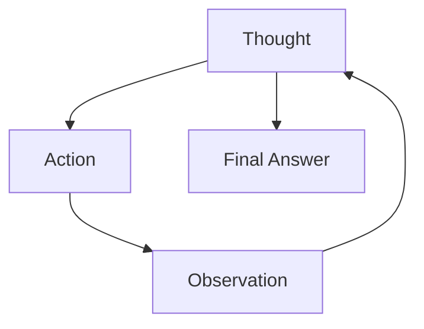
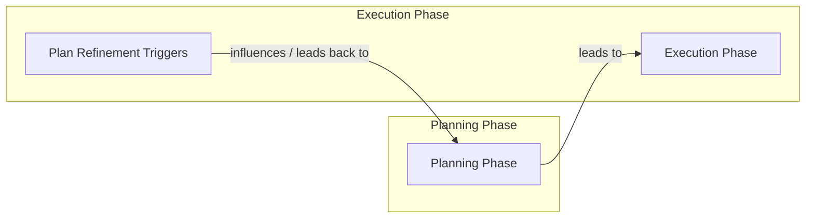

# Planning and Reasoning: The Core of Agentic AI

In our journey so far, we have built a solid foundation in AI Engineering. We have explored the landscape of AI agents, distinguished between rule-based LLM workflows and autonomous agents, and mastered context engineering to feed LLMs the right information. We learned how to get reliable structured outputs and how to give our models the ability to take action with tools.

But these components, while powerful, are not enough for complex, unpredictable tasks. An agent that can only follow a script or use a tool is like a cook who can only follow a recipe. What happens when an ingredient is missing or a customer has a unique request? To handle the messiness of the real world, an agent needs to do more than just execute; it needs to *think*.

Planning and reasoning provide these core capabilities, transforming a simple tool-using LLM into an autonomous agent. Understanding the foundational patterns that enable this "thinking," like ReAct and Plan-and-Execute, is important for any AI engineer. Even as modern models internalize some of these abilities, grasping these fundamentals gives you deeper insight into agent design, debugging, and building truly robust systems.

In this lesson, we will explore why models need to be taught how to think and plan. We will dive into core strategies like Chain-of-Thought, ReAct, and Plan-and-Execute. We will also see how these patterns appear in real-world systems and enable advanced capabilities like goal decomposition and self-correction.

## What a Non-Reasoning Model Does And Why It Fails on Complex Tasks

Let's use a recurring example to frame the problem: a "Technical Research Assistant Agent." Your goal is to give it a complex task, like "Produce a comprehensive technical report on the latest developments in edge AI deployment." This involves finding recent papers, summarizing their findings, identifying trends, and writing a structured report.

A non-reasoning model, even a powerful one, tackles this by trying to generate the answer in one go. It treats the entire complex request as a single prompt-to-text task. It might call the right tools, perhaps even in the correct order, but it does so without a higher-level strategy. It does not pause to reflect on the results of its actions or correct its course when it hits a dead end [[1]](https://www.narrativa.com/ai-reasoning-vs-non-reasoning-models-key-differences-explained).

This approach has serious consequences for complex tasks. The outputs are often superficial. The agent might find a few papers and summarize them, but it will not iterate on these partial results. It does not analyze its own output to spot gaps or contradictions. Because there is no explicit breakdown of sub-goals, it misses critical steps like verifying sources, comparing claims across different papers, or resolving conflicting information.

This brings us back to what we have learned so far. Workflows and structured outputs, which we covered in Lessons 5 and 4, give us modularity and reliability for predictable processes. Tools, from Lesson 6, enable our systems to take action. However, without explicit reasoning and planning, the agent’s performance drifts on complex tasks where adaptation is key. These are precisely the kinds of tasks where agents, rather than simple workflows, are most valuable. To address this, we must first teach the model to produce a reasoning trace—to think before it answers.

## Teaching Models to “Think” Chain-of-Thought and Its Limits

The first step in teaching an LLM to plan is to get it to externalize its thought process. Just as humans often "talk to themselves" to work through a difficult problem, we can ask an LLM to write out a reasoning trace before it gives the final answer. This technique is known as Chain-of-Thought (CoT) prompting [[11]](https://research.google/blog/react-synergizing-reasoning-and-acting-in-language-models). By generating these "thinking tokens," the model can formulate a better plan and iterate on partial solutions, leading to more accurate results on complex reasoning tasks [[9]](https://www.comet.com/site/blog/chain-of-thought-prompting).

Let's apply this to our research assistant agent. Instead of just asking for the report, we would modify the prompt:

*“Before answering, think step by step about how you will research and verify sources on edge AI deployment. Then provide the final report.”*

With this instruction, the model’s behavior changes. It first drafts a high-level plan, something like: "First, I will search for recent papers on edge AI deployment from reputable sources like arXiv.org. Then, I will read the abstracts to select the most relevant ones. After that, I will compare their findings to synthesize the main trends and write the report." This initial plan is a huge improvement over simply trying to write the report directly.

However, CoT has its limits. The plan and the final answer are generated in the same undifferentiated block of text. This makes the output difficult for a machine to parse and control. You cannot easily separate the model's reasoning from its final output, which is a problem for building agentic systems [[7]](https://apxml.com/courses/intro-llm-agents/chapter-5-basic-agent-planning/guiding-agent-reasoning-chain-of-thought). Furthermore, the model typically writes the plan once at the beginning and does not execute an iterative loop. It does not update its plan based on what it finds or correct itself if it makes a mistake. To gain the structure and control needed for a true agent, we must separate planning and reasoning from answering and acting. This is the foundation of patterns like ReAct and Plan-and-Execute.

## Separating Planning from Answering Foundations of ReAct and Plan-and-Execute

The key insight to move beyond simple Chain-of-Thought is to formally separate the model's output into two distinct types: reasoning and acting. Instead of a single stream of text, we ask the model to either (1) think about what to do next or (2) produce an answer or call a tool. This separation can be done as two distinct phases or as interleaved steps.

This separation is fundamental for building controllable and interpretable agents. It allows you to create iterative loops where the agent can act, observe the outcome, and then use that observation to update its plan. It also gives you, the engineer, clear control points. You can inspect the reasoning traces to understand the agent's logic, and you can handle the action outputs differently from the final answer.

This idea gives rise to two of the most important patterns in agent design:

1.  **ReAct (Reason + Act)**: This pattern interleaves thoughts, actions, and observations in a tight loop. The agent thinks, acts, observes the result, and then thinks again based on the new information.
2.  **Plan-and-Execute**: This pattern separates the process into two main phases. First, a "planner" creates a complete, step-by-step plan. Then, an "executor" carries out that plan, only returning to the planner if something goes wrong.

Both patterns are powerful ways to structure an agent's thought process. To understand them better, let's go deep into ReAct using our evolving research-assistant example.

## ReAct in Depth Loop, Evolving Example, Pros and Cons

The ReAct (Reason + Act) framework was introduced to bridge the gap between pure reasoning, like in Chain-of-Thought, and pure acting [[11]](https://research.google/blog/react-synergizing-reasoning-and-acting-in-language-models), [[18]](https://arxiv.org/pdf/2210.03629). It was inspired by the way humans seamlessly combine internal monologue with external actions to solve problems. The core of ReAct is an iterative loop that allows the agent to reason, act, and then reason again based on feedback from its environment.

The loop consists of three repeating steps: Thought, Action, and Observation [[12]](https://apxml.com/courses/getting-started-with-llm-toolkit/chapter-8-developing-autonomous-agents/react-pattern-for-agents).


Image 1: A flowchart illustrating the iterative ReAct loop.

1.  **Thought:** The agent reasons about the current state and decides on the next step. This is a private reasoning trace.
2.  **Action:** Based on its thought, the agent takes an action, usually by calling a tool.
3.  **Observation:** The environment returns the result of the action. This new information is fed back to the agent.

The agent repeats this cycle until it has enough information to generate a final answer.

Let's see how our Technical Research Assistant Agent would use the ReAct loop to complete its task:

*   **Thought 1:** "I need to find recent and trustworthy sources on edge AI deployment. I will start by searching for academic papers and industry reports from 2024 onwards on reputable sites."
*   **Action 1:** `search("latest developments in edge AI deployment 2024 site:arxiv.org OR site:nature.com")`
*   **Observation 1:** The search returns a list of candidate papers with titles and URLs.
*   **Thought 2:** "The search returned several promising papers. I will select the top three most cited ones and one industry report to get a balanced view. I need to check their publication dates and venues to ensure they are credible."
*   **Action 2:** `fetch_and_extract(paper_urls=["url1", "url2", "url3", "url4"])`
*   **Observation 2:** The tool returns the extracted abstracts and metadata for each source.
*   **Thought 3:** "Now I have the summaries. I will analyze each one to identify key claims about adoption rates and technical challenges. I should be on the lookout for any conflicting information."
*   **Action 3:** `summarize_and_compare(extractions)`
*   **Observation 3:** The analysis reveals that Paper A claims a 40% adoption rate in manufacturing, while Paper B reports only 25%.
*   **Thought 4:** "There is a conflict in the adoption rates. I need a third-party source to resolve this. I will search for a market analysis report from a credible firm to adjudicate."
*   **Action 4:** `search("edge AI deployment adoption market analysis 2024")`
*   **Observation 4:** A credible market analysis report is found.
*   **Thought 5:** "I have resolved the conflict using the market report. I now have enough information to synthesize the trends, identify the gaps, and structure the final report with citations."
*   **Final Answer:** The agent generates the structured report, including the resolved statistics and citations for all sources used.

The primary advantage of ReAct is its high interpretability. You can follow the agent's thought process step by step, making it easier to debug when something goes wrong. It also allows for natural error recovery, as the agent can react to unexpected observations and adjust its plan. This makes it well-suited for exploratory tasks where the path to the solution is not known in advance.

However, ReAct can be slower than other approaches because of its iterative nature. Each turn of the loop requires an LLM call, which adds latency and cost. It also requires careful tooling and robust loop control to prevent the agent from getting stuck in infinite loops or going off track. Good system prompts and guardrails are essential.

For tasks with a more predictable structure, the Plan-and-Execute pattern can be more efficient.

## Plan-and-Execute in Depth Plan, Execution, Pros and Cons

While ReAct is excellent for exploration, many tasks benefit from a more structured approach. The Plan-and-Execute pattern provides this structure by separating the agent's process into two distinct phases: an upfront planning phase and a subsequent execution phase [[16]](https://openreview.net/forum?id=ybA4EcMmUZ). This is similar to how a project manager might first create a detailed project plan and then hand it off to a team to execute.


Image 2: A flowchart illustrating the relationship between a Planning Phase and an Execution Phase, including a mechanism for plan refinement triggers.

First, a "planner" LLM generates a complete, step-by-step plan to achieve the user's goal. This plan is often a detailed list of actions to be taken. Generating accurate plans can be difficult, as LLMs are not inherently trained for this specific task. Some approaches use synthetic data generation to train the planner model more effectively [[16]](https://openreview.net/forum?id=ybA4EcMmUZ). Then, an "executor" takes this plan and carries out each step in sequence. The executor typically does not involve the planner again unless it runs into a problem, such as missing information or a failed tool call. These issues act as triggers for plan refinement, sending control back to the planner to update the strategy.

Let's revisit our Technical Research Assistant Agent, this time using the Plan-and-Execute pattern.

**Planning Phase:** The user provides the high-level goal, and the planner agent produces a detailed plan.

*Planner Output:*
```
1.  Define the scope and success criteria for the report. Key topics to cover are recent technical advancements, adoption rates, key challenges, and future trends in edge AI deployment.
2.  Conduct parallel searches across academic databases (arXiv, IEEE Xplore) and industry news sources for materials published since January 2024.
3.  From the search results, select the top 5 most relevant academic papers and 3 industry reports based on citation count, venue reputation, and keyword relevance.
4.  For each selected source, extract the abstract, key findings, and any specific data points related to adoption rates or performance metrics.
5.  Summarize the findings from each source individually.
6.  Synthesize the summaries to identify common themes, conflicting claims, and emerging trends.
7.  If any significant conflicts are found (e.g., >10% difference in reported adoption rates), perform a targeted search for a market analysis report to resolve the discrepancy.
8.  Draft an outline for the final report, including sections for Introduction, Technical Advancements, Adoption and Market Trends, Key Challenges, and Conclusion.
9.  Write the full report based on the outline, ensuring all claims are supported by inline citations.
10. Review the final report for clarity, accuracy, and completeness.
```

**Execution Phase:** The executor agent now takes this plan and executes each step. It is responsible for translating each high-level plan step into specific, environment-level actions, like tool calls. If a step fails (e.g., an API returns an error or a search yields no results), the executor reports this failure. This observation becomes a "plan refinement trigger." For example, if step 6 reveals a conflict in adoption rates, the executor would proceed to step 7 as planned. However, if step 2 returned no relevant papers, that would be an unexpected failure, and the executor would pause and send this information back to the planner. The planner would then revise the strategy, perhaps by suggesting different keywords or data sources.

The main advantage of Plan-and-Execute is its efficiency and reliability for well-defined tasks. By creating a plan upfront, the agent can often complete the task with fewer LLM calls than a ReAct agent, reducing latency and cost. The structure also makes the process more predictable and easier to manage, as you have a clear roadmap from the start. This separation of concerns also allows for architectural optimizations, such as using a highly capable model for the complex task of planning and a smaller, faster model for the more straightforward execution steps.

However, this pattern is less flexible than ReAct when dealing with highly exploratory problems where the path forward is unknown. The agent risks rigidly adhering to an imperfect initial plan. If the environment is dynamic or the task is poorly understood, frequent re-planning might be necessary, which can negate the efficiency gains and add significant overhead. The quality of the entire process is heavily dependent on the quality of the initial plan, which can be a major bottleneck.

These foundational ideas power many real-world systems, such as advanced research agents, which operationalize iterative planning and verification at scale.

## Where This Shows Up in Practice Deep Research–Style Systems

The planning and reasoning patterns we have discussed are not just theoretical concepts; they are the engines behind some of the most advanced agentic systems in production today. Systems designed for "deep research," for example, operationalize these principles to tackle complex, long-horizon tasks that would take a human researcher hours or even days [[27]](https://blog.promptlayer.com/how-deep-research-works), [[28]](https://www.jonkrohn.com/posts/2025/3/17/openais-deep-research-get-days-of-human-work-done-in-minutes).

When you ask such a system a complex question, it does not just perform a single web search. Instead, it decomposes the high-level query into a series of sub-goals. It then enters an iterative cycle of searching for information, reading and extracting content from multiple sources (including HTML pages and PDFs), comparing the findings, verifying claims, and progressively synthesizing a comprehensive answer [[30]](https://cdn.openai.com/deep-research-system-card.pdf).

This process directly mirrors the patterns we have explored. Our Technical Research Assistant Agent, for instance, would perform dozens of these micro-cycles. It would search for a paper, extract a statistic about adoption rates, then perform another search to find a second source to verify that statistic. If it finds a conflict, it initiates another sub-task to find a third source to resolve the discrepancy. It continuously updates its internal notes and knowledge base before ever starting to write the final report.

Many of these systems are built on ReAct-like loops, guided by strong system prompts and a sophisticated set of tools for browsing, parsing, and data analysis. Others are closer to a Plan-and-Execute model, where an initial research plan is generated and then executed, with periodic check-ins to re-plan if the initial strategy proves ineffective. The key is the ability to reason, plan, and adapt. These are the hallmarks of true agentic behavior. As models become more powerful, some of this behavior is becoming more implicit, with models natively generating separate "thinking" and "answer" streams.

## Modern Reasoning Models Thinking vs Answer Streams and Interleaved Thinking

The evolution of LLMs is increasingly blurring the lines between explicit prompting patterns and inherent model capabilities. Modern reasoning models are now being specifically trained to integrate planning and reasoning directly into their generation process, making some of the patterns we have discussed more implicit [[22]](https://www.ibm.com/think/topics/reasoning-model).

A key architectural innovation in these models is the separation of their output into two distinct streams: a private "thinking" stream and a public "answer" stream [[23]](https://cameronrwolfe.substack.com/p/demystifying-reasoning-models), [[21]](https://arxiv.org/html/2512.10931v1).

-   **The Thinking Stream:** This is where the model generates its internal monologue or chain of thought. It breaks down the problem, formulates a plan, considers different approaches, and decides which tools to use. This stream is often hidden from the end-user but is crucial for the model's reasoning process. This is often implemented using special tokens like `<think>` and `</think>` to logically separate the reasoning from the final output [[23]](https://cameronrwolfe.substack.com/p/demystifying-reasoning-models).
-   **The Answer Stream:** This is the public-facing output that the user sees. It is the polished, final response, generated based on the conclusions reached in the thinking stream.

This separation allows models to "think before they speak," leading to more coherent and accurate responses. Some models follow a "think first" approach, where they generate a complete reasoning trace in the thinking stream before producing the final output and any tool calls. This is analogous to the Plan-and-Execute pattern, but it happens internally within a single model call.

More advanced models support what is known as **interleaved thinking**. In this paradigm, the model can switch back and forth between thinking and acting. For example, it might generate a thought, call a tool, and then generate a new thought based on the tool's output before continuing with its final answer [[25]](https://docs.anthropic.com/en/docs/build-with-claude/extended-thinking#interleaved-thinking). This behavior is very similar to the ReAct loop, but it is a native capability of the model rather than something orchestrated by an external loop in your code. This allows for more sophisticated reasoning, as the model can dynamically adjust its plan based on intermediate results from tool calls.

An even more advanced concept is **asynchronous reasoning**. Here, the model can think, listen for new user input, and generate its public response concurrently. The thinking stream can even pause the public response stream if it needs more time to work through a complex step [[21]](https://arxiv.org/html/2512.10931v1). This is achieved through clever manipulation of the model's attention mechanism, creating different "views" of the token sequence for the thinker and the writer. The model itself can be prompted to decide when to pause, for instance, by asking it, "Are my thoughts ahead of the response by enough to continue writing it? (yes/no)". This allows for a more interactive and real-time user experience without sacrificing the depth of reasoning.

What are the implications of this for you as an AI engineer? As models become better at implicit planning, you may need to write less code to manage explicit ReAct or Plan-and-Execute loops. However, this does not make these patterns obsolete. Understanding the separation between reasoning and answering is still critical for debugging and maintaining control. Even if the model handles the loop internally, you still need to provide it with well-designed tools, clear system prompts, and robust guardrails to ensure it behaves reliably. The explicit patterns we have discussed provide a mental model for how these more advanced agents operate, making it easier to design, test, and troubleshoot them.

With a solid foundation in planning and reasoning, agents unlock advanced capabilities that are essential for true autonomy, such as goal decomposition and self-correction.

## Advanced Agent Capabilities Enabled by Planning Goal Decomposition and Self-Correction

Once an agent can plan and reason, it can start to perform more advanced, truly autonomous behaviors. Two of the most important of these are goal decomposition and self-correction.

**Goal decomposition** is the ability to take a complex, high-level goal and break it down into smaller, manageable sub-goals. For our research assistant agent, the initial goal is "write a report." A planning agent decomposes this into sub-goals like "find sources," "verify claims," "synthesize trends," and "draft sections." It can then break these down even further. In a ReAct-style agent, this decomposition often happens implicitly during the `Thought` steps, as the agent decides what to do next. You can guide this behavior with prompts that encourage the agent to think about sub-tasks.

**Self-correction** is the agent's ability to detect when something has gone wrong and update its plan accordingly. This is where the feedback loop in agentic systems becomes critical. Let's return to our example of the conflicting adoption rates: one source says 40%, another says 25%. A non-reasoning system might just report both numbers or arbitrarily pick one. An agent capable of self-correction recognizes this as a contradiction. It can then dynamically insert a new "verification" sub-goal into its plan. This might involve re-prompting itself with the error information, searching for an alternative source to resolve the conflict, re-evaluating its initial plan, or even asking the user for clarification [[26]](https://aclanthology.org/2025.acl-long.1104.pdf).

Even with powerful models that reason internally, understanding the explicit patterns of ReAct and Plan-and-Execute remains important. They provide a clear framework for debugging by tracing the agent's logic, improve consistency through explicit control loops, and offer a shared mental model for how agents think. This makes designing, building, and maintaining them much easier.

These concepts of planning, reasoning, and self-correction are the building blocks of autonomy. In our next lesson, Lesson 8, we will put this theory into practice by implementing a ReAct agent from scratch. Soon after, we will explore how to give our agents memory in Lesson 9, enhance them with advanced knowledge retrieval in Lesson 10, and enable them to process multimodal data in Lesson 11.

## Conclusion

Planning and reasoning are the capabilities that elevate a simple tool-using LLM to an autonomous agent. While a basic model can respond to prompts, an agent can formulate a strategy, execute a series of actions, and adapt its approach based on the outcomes. This is the essence of agentic behavior.

We have explored the foundational patterns that make this possible. Chain-of-Thought introduced the idea of an internal monologue, but it was the separation of thinking from acting that gave rise to powerful frameworks like ReAct and Plan-and-Execute. ReAct provides flexibility for exploratory tasks through its iterative Thought-Action-Observation loop, while Plan-and-Execute offers efficiency and predictability for well-defined problems. Understanding these patterns is essential for any AI engineer, as they provide the mental models for building and debugging even the most advanced, modern reasoning agents.

In the next lesson, we will move from theory to practice and build our own ReAct agent from the ground up.

## References

- [1] AI reasoning vs non-reasoning models: key differences explained. (n.d.). Narrativa. Retrieved July 30, 2024, from https://www.narrativa.com/ai-reasoning-vs-non-reasoning-models-key-differences-explained
- [2] Fundamental Scaling Limitations in AI Reasoning Models. (n.d.). KuppingerCole. Retrieved July 30, 2024, from https://www.kuppingercole.com/research/lb80993/fundamental-scaling-limitations-in-ai-reasoning-models
- [3] Agent Laboratory: Using LLM Agents as Research Assistants. (n.d.). LinkedIn. Retrieved July 30, 2024, from https://www.linkedin.com/posts/skphd_agent-laboratory-using-llm-agents-as-research-activity-7283233189651738625-q6xU
- [4] Reasoning Best Practices. (n.d.). OpenAI. Retrieved July 30, 2024, from https://developers.openai.com/api/docs/guides/reasoning-best-practices
- [5] Stechly, K., et al. (2024). Empirical analyses of the gains from CoT prompting in planning domains. EmergentMind. Retrieved July 30, 2024, from https://www.emergentmind.com/topics/chain-of-thought-and-planning-agents
- [6] Chain-of-Thought and Planning Agents. (n.d.). EmergentMind. Retrieved July 30, 2024, from https://www.emergentmind.com/topics/chain-of-thought-and-planning-agents
- [7] Guiding Agent Reasoning: Chain of Thought. (n.d.). APXML. Retrieved July 30, 2024, from https://apxml.com/courses/intro-llm-agents/chapter-5-basic-agent-planning/guiding-agent-reasoning-chain-of-thought
- [8] Brenndoerfer, M. (n.d.). Step-by-step problem solving: Chain-of-thought reasoning. Retrieved July 30, 2024, from https://mbrenndoerfer.com/writing/step-by-step-problem-solving-chain-of-thought-reasoning
- [9] Chain of Thought Prompting. (n.d.). Comet. Retrieved July 30, 2024, from https://www.comet.com/site/blog/chain-of-thought-prompting
- [10] Chain of thoughts. (n.d.). IBM. Retrieved July 30, 2024, from https://www.ibm.com/think/topics/chain-of-thoughts
- [11] ReAct: Synergizing Reasoning and Acting in Language Models. (2022). Google Research. Retrieved July 30, 2024, from https://research.google/blog/react-synergizing-reasoning-and-acting-in-language-models
- [12] ReAct Pattern for Agents. (n.d.). APXML. Retrieved July 30, 2024, from https://apxml.com/courses/getting-started-with-llm-toolkit/chapter-8-developing-autonomous-agents/react-pattern-for-agents
- [13] What is the ReAct Loop in AI Agent Reasoning? (n.d.). MindStudio. Retrieved July 30, 2024, from https://www.mindstudio.ai/blog/what-is-react-loop-ai-agent-reasoning
- [14] ReAct Agents. (n.d.). Salesforce. Retrieved July 30, 2024, from https://www.salesforce.com/agentforce/ai-agents/react-agents
- [15] ReAct Agent. (n.d.). IBM. Retrieved July 30, 2024, from https://www.ibm.com/think/topics/react-agent
- [16] Erdogan, L. E., et al. (2025). Plan-and-Act: Improving Planning of Agents for Long-Horizon Tasks. OpenReview. Retrieved July 30, 2024, from https://openreview.net/forum?id=ybA4EcMmUZ
- [17] AI Agent Planning. (n.d.). IBM. Retrieved July 30, 2024, from https://www.ibm.com/think/topics/ai-agent-planning
- [18] Yao, S., et al. (2022). ReAct: Synergizing Reasoning and Acting in Language Models. arXiv. Retrieved July 30, 2024, from https://arxiv.org/pdf/2210.03629
- [19] Agentic Reasoning. (n.d.). IBM. Retrieved July 30, 2024, from https://www.ibm.com/think/topics/agentic-reasoning
- [20] AI Agent Orchestration. (n.d.). IBM. Retrieved July 30, 2024, from https://www.ibm.com/think/topics/ai-agent-orchestration
- [21] Yakushev, G., et al. (2025). Asynchronous Reasoning: Training-Free Interactive Thinking LLMs. arXiv. Retrieved July 30, 2024, from https://arxiv.org/html/2512.10931v1
- [22] Reasoning Model. (n.d.). IBM. Retrieved July 30, 2024, from https://www.ibm.com/think/topics/reasoning-model
- [23] Wolfe, C. R. (n.d.). Demystifying Reasoning Models. Substack. Retrieved July 30, 2024, from https://cameronrwolfe.substack.com/p/demystifying-reasoning-models
- [24] Raschka, S. (n.d.). Understanding Reasoning LLMs. Substack. Retrieved July 30, 2024, from https://magazine.sebastianraschka.com/p/understanding-reasoning-llms
- [25] Interleaved Thinking for Reasoning LLMs. (n.d.). Anthropic. Retrieved July 30, 2024, from https://docs.anthropic.com/en/docs/build-with-claude/extended-thinking#interleaved-thinking
- [26] Ma, R., et al. (2025). S2R: Teaching LLMs to Self-verify and Self-correct via Reinforcement Learning. ACL Anthology. Retrieved July 30, 2024, from https://aclanthology.org/2025.acl-long.1104.pdf
- [27] How OpenAI's Deep Research Works. (2025). PromptLayer Blog. Retrieved July 30, 2024, from https://blog.promptlayer.com/how-deep-research-works
- [28] Krohn, J. (2025). OpenAI’s Deep Research: Get Days of Human Work Done in Minutes. Retrieved July 30, 2024, from https://www.jonkrohn.com/posts/2025/3/17/openais-deep-research-get-days-of-human-work-done-in-minutes
- [29] Building effective agents. (2024). Anthropic. Retrieved July 30, 2024, from https://www.anthropic.com/engineering/building-effective-agents
- [30] Deep Research System Card. (2025). OpenAI. Retrieved July 30, 2024, from https://cdn.openai.com/deep-research-system-card.pdf
- [31] A practical guide to building agents. (n.d.). OpenAI. Retrieved July 30, 2024, from https://cdn.openai.com/business-guides-and-resources/a-practical-guide-to-building-agents.pdf
- [32] AI Agents in 2025: Expectations vs. Reality. (n.d.). IBM. Retrieved July 30, 2024, from https://www.ibm.com/think/insights/ai-agents-2025-expectations-vs-reality
- [33] Reasoning AI Agents Transform Decision Making. (n.d.). NVIDIA Blogs. Retrieved July 30, 2024, from https://blogs.nvidia.com/blog/reasoning-ai-agents-decision-making/
- [34] Ferrag, M. A., et al. (2025). From LLM Reasoning to Autonomous AI Agents: A Comprehensive Review. arXiv. Retrieved July 30, 2024, from https://arxiv.org/pdf/2504.19678
- [35] Measuring AI Ability to Complete Long Tasks. (2025). METR. Retrieved July 30, 2024, from https://metr.org/blog/2025-03-19-measuring-ai-ability-to-complete-long-tasks/