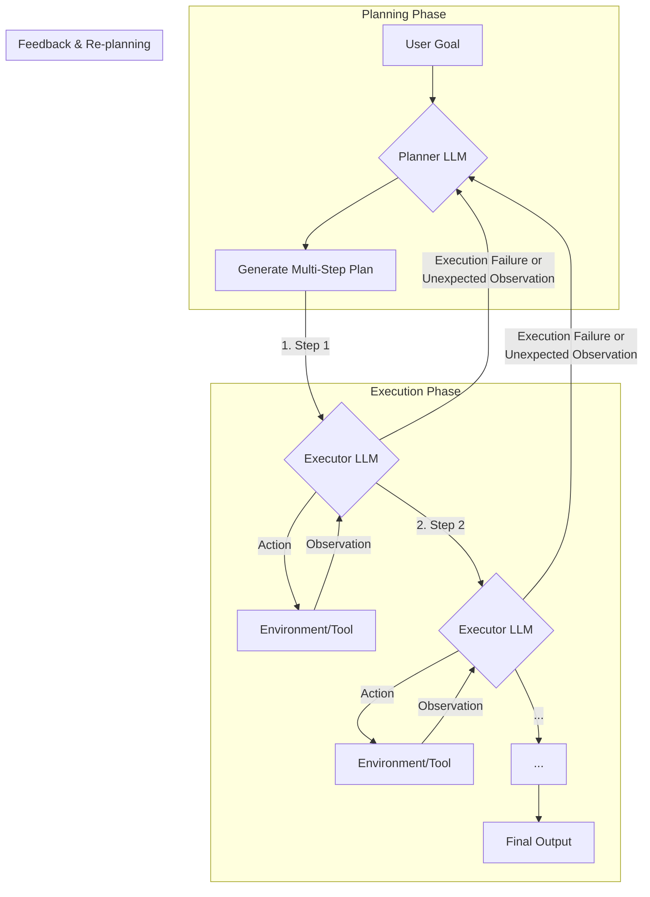

# Lesson 7: Agentic Planning and Reasoning

In our last lesson, we gave our agents tools, allowing them to perform actions and interact with the world. But giving an agent a hammer doesn't mean it knows how to build a house. It needs to know *when* to use the hammer, *which* nail to hit, and what to do if it misses. This is the essence of planning and reasoning. It is the cognitive engine that separates a simple tool-user from an autonomous agent.

Without these capabilities, agents fail at the very tasks they are meant for: complex, multi-step problems that require adaptation. They might follow a script perfectly but fall apart the moment something unexpected happens. This is because LLMs, by default, are not planners. They are predictors, trained to generate the next most likely token, not to formulate a strategy and execute it.

This lesson introduces the foundational patterns that teach an LLM to "think." We will explore how to structure an agent's thought process, moving from simple Chain-of-Thought to more robust frameworks like ReAct and Plan-and-Execute. While modern reasoning models are starting to internalize these abilities, understanding these core patterns is essential for any AI engineer. They give you the blueprint for building, debugging, and ultimately controlling intelligent systems.

## What a Non-Reasoning Model Does And Why It Fails on Complex Tasks

To understand the need for planning, let's consider a "Technical Research Assistant Agent." Its task is to produce a comprehensive report on the "latest developments in edge AI deployment." This involves finding recent papers, summarizing their findings, identifying trends, and writing a structured report.

A non-reasoning model, when given this prompt, attempts to "answer" it in a single pass. It treats the complex request as one large text generation problem [[1]](https://www.narrativa.com/ai-reasoning-vs-non-reasoning-models-key-differences-explained). It might call a search tool, read a page, and start writing, but it does so without an explicit, modifiable plan. If the first search result is irrelevant or leads to a dead end, the agent is likely to get stuck or produce a superficial summary based on incomplete information [[2]](https://arxiv.org/html/2606.07462v1). It doesn't pause to analyze its own partial results, identify gaps, or verify conflicting claims from different sources.

This behavior stems from the model's core design. Without an agentic structure, it has no mechanism for iteration or self-correction. It simply generates what it predicts is the most probable response. For complex tasks, this often results in outputs that miss critical steps, like comparing data across multiple sources or verifying the credibility of a finding. The agent fails because it never broke the problem down into manageable sub-goals [[3]](https://www.kuppingercole.com/research/lb80993/fundamental-scaling-limitations-in-ai-reasoning-models).

In our previous lessons, we built components to address parts of this. LLM workflows and structured outputs (Lessons 2 and 4) gave us modularity for predictable processes, and tools (Lesson 6) enabled actions. However, these building blocks are not enough when the path to a solution is unknown and requires adaptation. To build a truly autonomous agent, we must first teach it how to think.

## Teaching Models to “Think” Chain-of-Thought and Its Limits

The first major breakthrough in teaching models to reason was a simple prompting technique: asking the model to "think step by step." This approach, known as Chain-of-Thought (CoT) prompting, encourages the LLM to write out a reasoning trace before giving the final answer. Just like humans often talk themselves through a problem, this "inner monologue" helps the model structure its process and arrive at more accurate conclusions [[2]](https://arxiv.org/html/2606.07462v1).

Let's apply this to our research assistant. Instead of just asking for the report, we could prompt it like this: *"Before answering, think step by step about how you will research and verify sources on edge AI deployment. Then provide the final report."*

The model's behavior changes. It would first generate a high-level plan, something like:
1.  Search for recent papers on edge AI deployment from top-tier academic sources.
2.  Read the abstracts to identify key trends and findings.
3.  Compare claims across multiple papers to ensure consistency.
4.  Synthesize the information into a structured report.

This is a significant improvement. The model has created a plan, which makes its process more transparent and often more logical. However, CoT has fundamental limitations. First, it is a heuristic, not a guarantee of correctness. The model can still make logical errors in its reasoning, even if the steps appear coherent [[4]](https://apxml.com/courses/intro-llm-agents/chapter-5-basic-agent-planning/guiding-agent-reasoning-chain-of-thought). Second, it increases verbosity, which translates to higher token costs and latency, a real constraint in production environments [[5]](https://www.comet.com/site/blog/chain-of-thought-prompting).

Most importantly, a pure CoT plan is static. The model writes down what it *intends* to do, but it doesn't execute an iterative loop where it can act on one step, observe the result, and then adjust the rest of its plan accordingly. It is not a sophisticated planning algorithm that can explore alternatives or backtrack from dead ends. If the initial search fails, a pure CoT model has no mechanism to recover. It’s like writing a to-do list and then trying to complete it without ever looking at it again [[5]](https://www.comet.com/site/blog/chain-of-thought-prompting).

## Separating Planning from Answering: Foundations of ReAct and Plan-and-Execute

To overcome the limitations of Chain-of-Thought, we need to introduce structure and control. The key insight is to formally separate the model's output into two distinct phases: one for planning or reasoning, and another for acting or answering. This separation is the foundation for the most common agentic patterns.

This approach gives us several advantages. First, it makes the agent's process interpretable. We can clearly see its plan before it takes any action. Second, it gives us control. We can inspect, validate, or even modify the plan before execution. Most importantly, it enables iterative loops. An agent can take an action, observe the outcome, and then feed that observation back into its reasoning process to update its plan. This feedback mechanism is what allows an agent to adapt to unexpected results and recover from errors [[6]](https://openreview.net/forum?id=ybA4EcMmUZ).

Two foundational patterns emerged from this idea:

*   **ReAct** (Reason + Act) interleaves these phases in a tight loop: the agent generates a **Thought**, takes an **Action**, and receives an **Observation**. This cycle repeats until the task is complete [[7]](https://arxiv.org/pdf/2210.03629).
*   **Plan-and-Execute** separates the process into two major stages. First, a **Planner** creates a complete, multi-step plan. Then, an **Executor** carries out the steps of that plan, sometimes with the ability to ask the Planner for adjustments if it runs into trouble [[6]](https://openreview.net/forum?id=ybA4EcMmUZ).

These patterns provide the architectural scaffolding for an agent's cognitive loop. We will now explore each one in detail, starting with ReAct.

## ReAct in Depth: Loop, Evolving Example, Pros and Cons

The ReAct pattern was introduced to bridge the gap between pure reasoning (like Chain-of-Thought) and pure acting. It was motivated by the observation that CoT reasoning, while powerful, often leads to hallucination because it is not grounded in the external world. ReAct solves this by forcing the model to interact with an environment, using observations to correct its reasoning and inform its next steps. It recognizes that intelligent behavior comes from the synergy between thinking and doing. Instead of creating a complete plan upfront, a ReAct agent thinks, acts, observes the result, and then thinks again based on that new information. This creates a dynamic feedback loop that mirrors how humans solve problems in the real world [[7]](https://arxiv.org/pdf/2210.03629).

The core of ReAct is an iterative cycle with three phases:
*   **Thought:** The LLM reasons about the current state of the problem, what it knows, what it needs to find out, and what its next action should be.
*   **Action:** Based on its thought, the model invokes a tool, like a search engine or a code interpreter.
*   **Observation:** The environment returns the result of the action, such as search results or an error message. This observation is then fed back into the context for the next thought.

This loop continues until the agent determines it has enough information to provide a final answer.

```mermaid
flowchart LR
    Thought --> Action
    Action --> Observation
    Observation --> Thought
    Thought --> "Final Answer"
```
Image 1: A flowchart illustrating the iterative ReAct loop with Thought, Action, Observation, and Final Answer steps.

Let's see how our Technical Research Assistant Agent would use the ReAct loop to tackle its task:

*   **Thought 1:** "I need to find recent, trustworthy sources on edge AI deployment. I'll start by searching for academic papers and industry reports from the last year."
*   **Action 1:** `search("latest developments in edge AI deployment 2024 site:arxiv.org OR site:nature.com")`
*   **Observation 1:** A list of five papers with titles, authors, and snippets is returned.

*   **Thought 2:** "The search returned several relevant papers. I will select the top three most cited ones and one industry report to get a balanced view. I need to check their publication dates and venues to ensure credibility."
*   **Action 2:** `fetch_and_extract(urls=["paper_A_url", "paper_B_url", "report_C_url"])`
*   **Observation 2:** The full abstracts and metadata for the selected documents are extracted.

*   **Thought 3:** "Now I have the core information. I need to summarize each source and specifically look for claims about adoption rates. I will compare these claims to identify any conflicts."
*   **Action 3:** `summarize_and_compare(extractions, focus="adoption rates")`
*   **Observation 3:** "Summary: Paper A claims 40% adoption in manufacturing. Report C claims 25% overall adoption."

*   **Thought 4:** "There is a conflict in the adoption rates. Paper A is specific to manufacturing, while Report C is general. I need a third-party market analysis to resolve this discrepancy and understand the broader context."
*   **Action 4:** `search("edge AI deployment adoption market analysis 2024")`
*   **Observation 4:** A credible market analysis report is found.

*   **Thought 5:** "I have found a report that clarifies the adoption rates. I can now synthesize all the information, resolve the conflict, and finalize the trends and gaps for my report."
*   **Final Answer:** A structured report with citations and resolved statistics.

The ReAct pattern has clear advantages. It is highly interpretable, as each action is justified by an explicit thought, creating an auditable trail of reasoning. This makes it excellent for exploratory tasks where the path is not clear from the start, as the agent can dynamically recover from errors. The observation step also grounds the agent in external information, forcing the model to reconcile its reasoning with real-world feedback and reducing the risk of hallucination [[8]](https://mbrenndoerfer.com/writing/react-pattern-llm-reasoning-action-agents), [[19]](https://arxiv.org/html/2507.22915v1).

However, this flexibility comes at a cost. The iterative nature of the loop can be slower and more computationally expensive than other approaches. Each turn adds to the context window, leading to linear growth in token consumption and latency. Furthermore, the agent's performance is highly dependent on the quality of its tools and the observations they return. If a search tool provides noisy or irrelevant results, the agent's reasoning can be led astray. Finally, it requires careful design of tools and robust loop control logic to prevent the agent from getting stuck in repetitive cycles [[9]](https://www.ibm.com/think/topics/react-agent). For tasks with known structure, Plan-and-Execute can be more efficient and predictable.

## Plan-and-Execute in Depth: Plan, Execution, Pros and Cons

While ReAct excels at exploration, many tasks benefit from a more structured approach. The Plan-and-Execute pattern addresses this by separating the agent's process into two distinct phases: a high-level planning phase and a low-level execution phase. This is analogous to how a project manager first creates a detailed project plan, and then the team executes it step by step. This separation is like having a head chef who designs the entire menu (the plan) and a team of line cooks who execute each recipe (the actions) [[6]](https://openreview.net/forum?id=ybA4EcMmUZ).

This idea of separating planning from execution has deep roots in the history of AI. It echoes classical planning systems like STRIPS, which also focused on generating a sequence of actions to reach a goal state. More advanced concepts like hierarchical task networks, which decompose large tasks into smaller, manageable sub-tasks, also share the same core principle as modern Plan-and-Execute agents [[20]](https://arxiv.org/html/2503.12687v1).


Image 2: A diagram showing the Plan-and-Execute pattern with distinct Planning and Execution phases and a feedback loop for re-planning.

First, a **Planner** model receives the user's high-level goal and generates a structured, step-by-step plan. This plan is not just a rough outline; it's a detailed sequence of actions designed to achieve the objective. Then, an **Executor** model takes this plan and carries out each step. The executor is responsible for the low-level details, like making the correct tool calls with the right parameters.

Crucially, this is not a rigid, one-way process. If the executor encounters an error or an unexpected result during a step, it can feed this information back to the planner. The planner can then update the rest of the plan to account for this new information. This feedback loop combines the structure of upfront planning with the adaptability needed for real-world tasks.

Let's revisit our Technical Research Assistant Agent, this time using the Plan-and-Execute pattern.

**Planning Phase:** The Planner LLM receives the request and produces a detailed plan:
1.  **Define Scope:** Clarify the scope of "edge AI deployment" to focus on industrial IoT and autonomous vehicles. Set success criteria: the final report must include at least three recent trends, two major challenges, and citations from at least five sources published after 2023.
2.  **Initial Search:** Conduct parallel searches on academic databases (arXiv, IEEE Xplore) and industry news sites for the keywords "edge AI deployment trends 2024" and "edge AI challenges 2024".
3.  **Source Selection:** From the search results, select the top 5 most relevant academic papers and top 3 industry reports based on citation count, venue reputation, and relevance of the abstract.
4.  **Information Extraction:** For each selected source, extract key findings, statistics on adoption rates, and mentions of specific challenges.
5.  **Synthesize and Compare:** Aggregate the extracted information. Create a table comparing the trends identified in each source. Note any conflicting data points, especially regarding market size or adoption rates.
6.  **Outline Generation:** Draft a detailed outline for the final report, with sections for Introduction, Key Trends, Major Challenges, Future Outlook, and Conclusion.
7.  **Report Writing:** Write the full report based on the outline and synthesized findings. Ensure all claims are supported by inline citations and include a methodology section explaining the research process.

**Execution Phase:** The Executor agent begins carrying out the plan. It executes Step 2, calling the search tool with the specified queries. It then moves to Step 3, analyzing the search results to select the best sources. During Step 4, it uses a tool to extract text from the selected PDFs. However, one of the PDFs is corrupted and returns an error. The Executor sends this failure back to the Planner. The Planner updates the plan: "Replace the corrupted source with the next most relevant source from the search results and re-run the extraction step." The Executor receives the revised plan and continues, successfully completing the remaining steps to produce the final report. This dynamic re-planning is a key feature; some frameworks even re-plan after every single execution step to ensure the agent stays on the optimal path.

The main advantage of Plan-and-Execute is its efficiency and predictability for tasks with a relatively known structure. The upfront planning allows for a more organized workflow, making it easier to estimate costs and execution time. This structure also makes the agent's behavior more reliable and easier to debug, as you can trace failures back to a specific step in the plan [[10]](https://arxiv.org/pdf/2504.19678).

However, this pattern can be less flexible for highly exploratory or creative tasks where the next step is genuinely unknown. If the initial plan is fundamentally flawed, the agent might waste resources before the feedback loop triggers a re-plan, or it might rigidly adhere to a suboptimal path. The cost of re-planning can also be high, as it may require the Planner to re-evaluate the entire remaining sequence of steps. This makes the pattern less suitable for environments that change rapidly and unpredictably. These ideas power real systems like Deep Research, which operationalize iterative planning and verification at scale.

## Where This Shows Up in Practice: Deep Research–Style Systems

The theoretical patterns of ReAct and Plan-and-Execute are not just academic exercises. They are the engine behind some of the most advanced agentic systems available today, often referred to as "deep research" agents. These systems are designed to tackle long-horizon tasks that require extensive information gathering, analysis, and synthesis. This is exactly like our technical research assistant example [[11]](https://blog.promptlayer.com/how-deep-research-works).

A deep research system operationalizes planning and reasoning by breaking down a complex query into a series of sub-goals. It then enters an iterative cycle of searching for information, reading and extracting relevant content, comparing findings across different sources, verifying facts, and updating its internal knowledge base. For our research assistant, this would mean performing dozens of micro-cycles: searching for a paper, extracting a statistic, searching for another source to verify that statistic, noting a discrepancy, and initiating a new search to resolve it, all before ever writing a single sentence of the final report [[12]](https://www.jonkrohn.com/posts/2025/3/17/openais-deep-research-get-days-of-human-work-done-in-minutes).

These systems are often hybrids. They might use a Plan-and-Execute approach at a high level to structure the overall research process (e.g., Literature Search -> Data Analysis -> Report Writing). But within each of these stages, they often employ a ReAct-like loop to handle the exploratory and unpredictable nature of the sub-task. For example, the "Literature Search" stage might involve multiple Thought-Action-Observation cycles to find, filter, and read the most relevant papers. This combination of structured planning and dynamic execution allows these agents to be both efficient and robust. As models continue to evolve, some of this explicit orchestration is becoming more implicit, with the model itself handling the separation of its internal "thinking" from its final "answer."

## Modern Reasoning Models: Thinking vs. Answer Streams and Interleaved Thinking

The agentic patterns we've discussed, like ReAct and Plan-and-Execute, were initially developed to impose a reasoning structure on LLMs that lacked it. They are explicit, external frameworks. However, the latest generation of reasoning models is being trained to internalize this structure, fundamentally changing how AI engineers design agentic systems [[13]](https://www.ibm.com/think/topics/reasoning-model).

These modern models are often trained to produce two distinct streams of output: a private "thinking" stream and a public "answer" stream. The thinking stream contains the model's internal monologue—its step-by-step reasoning, analysis of information, and planning. This content is analogous to the "Thought" in a ReAct loop and is not typically shown to the end-user. The answer stream is the final, polished output [[14]](https://cameronrwolfe.substack.com/p/demystifying-reasoning-models). This separation is often handled natively by the model's API. For example, Anthropic's models can produce `thinking` content blocks before the final `text` block.

This integrated reasoning capability can be made asynchronous. The model can start streaming a public response to the user while it continues to reason in the background. This is achieved through a "dual view" system where the model simultaneously manages a "thinker" view and a "writer" view. Both views share the same underlying data but perceive it in a different order. The writer sees the thoughts as if they were generated sequentially before the answer, while the thinker sees the answer as it is being written. This allows the thinker to pause the writer if it needs more time to solve a complex sub-problem, creating a truly interactive experience [[15]](https://arxiv.org/html/2512.10931v1).

This capability manifests in a few ways. Some models adopt a "think first, then act" approach. They generate a complete block of reasoning upfront, which might include a full plan, before making any tool calls or producing the final answer. This is similar to the Plan-and-Execute pattern, but it happens within a single model turn. This approach is efficient for tasks where a complete plan can be formulated from the initial prompt, but it lacks the dynamic adaptability of more iterative methods.

A more advanced capability is **interleaved thinking**. With this, the model can emit some thoughts, produce a part of the answer or call a tool, and then emit more thoughts to process the result before continuing. For example, an agent might think about which tool to call, call it, receive the observation, and then generate a new block of thinking to analyze that observation before deciding on its next action or writing the next part of the answer. This is essentially a native, model-driven ReAct loop, where the model itself manages the cycle of reasoning, acting, and observing [[16]](https://docs.anthropic.com/en/docs/build-with-claude/extended-thinking#interleaved-thinking).

What does this mean for you as an AI engineer? It might seem like these advanced models make explicit patterns like ReAct obsolete. This is not entirely true. While you may write less code to manage the agent's control loop, the underlying principles are more important than ever. You still need to provide the model with a well-designed set of tools, clear instructions, and robust guardrails. The separation of reasoning and answering, even when handled by the model, remains a powerful concept for debugging. If an agent produces a wrong answer, you can inspect its thinking stream to understand *why* it made a mistake. These native reasoning capabilities don't replace agentic design; they provide more powerful and integrated building blocks for it. With planning and reasoning in place, agents unlock advanced capabilities like goal decomposition and self-correction.

## Advanced Agent Capabilities Enabled by Planning

Once an agent is equipped with a robust planning and reasoning framework—whether explicit like ReAct or implicit in a modern model—it unlocks more advanced capabilities that are essential for true autonomy. Two of the most important are goal decomposition and self-correction.

**Goal decomposition** is the ability to break down a large, ambiguous task into a hierarchy of smaller, concrete sub-goals. For our research assistant, the initial goal "write a report on edge AI" is too broad. A planning agent would decompose this into sub-goals like "identify key research themes," "gather supporting data," and "structure the report." Each of these can be broken down further. "Gather supporting data" might become "find three academic papers," "find two industry reports," and "extract adoption statistics." In a ReAct-style agent, this decomposition often happens implicitly in the "Thought" steps, guided by a well-crafted prompt [[17]](https://www.ibm.com/think/topics/ai-agent-planning).

**Self-correction** is the agent's ability to detect when something has gone wrong and adjust its plan accordingly. This is where the feedback loop becomes critical. In our ReAct example, the agent observed conflicting adoption rates (40% vs. 25%) and inserted a "verification" sub-goal to resolve it. This ability is a hallmark of an advanced agent, but it faces limits on long-horizon tasks. Agents can suffer from **error propagation**, where small mistakes cascade, or **context overload**, where they lose track of the original goal in a long history of actions [[18]](https://aclanthology.org/2025.acl-long.1104.pdf), [[21]](https://www.emergentmind.com/topics/long-horizon-agent-planning).

Even with the most powerful models, these agentic patterns remain relevant. They provide a clear structure for debugging, ensuring consistency, and creating a shared mental model of how the agent thinks. They are the scaffolding that turns a powerful language model into a reliable and effective problem-solver.

These foundational skills of planning and reasoning are the gateway to more complex agentic behaviors. In our next lesson, we will move from theory to practice and implement a ReAct agent from scratch. Soon after, we will explore how to give our agents memory in Lesson 9, augment them with external knowledge through advanced RAG in Lesson 10, and enable them to process multimodal data in Lesson 11.

## Conclusion

In this lesson, we've journeyed from the limitations of non-reasoning models to the sophisticated cognitive architectures that power modern AI agents. We've seen how Chain-of-Thought introduced the concept of an "inner monologue" and how frameworks like ReAct and Plan-and-Execute gave it structure, control, and a connection to the real world. These patterns are not just historical footnotes; they are the fundamental principles of agentic behavior.

As AI engineers, understanding these concepts is crucial. Even as the most advanced models begin to internalize these reasoning loops, the principles of planning, acting, observing, and correcting remain the same. By mastering these patterns, you gain the ability to design, build, and debug agents that are not just intelligent, but also reliable and predictable. In our next lesson, we will move from theory to practice and implement a ReAct agent from scratch. Soon after, we will explore how to give our agents memory, augment them with external knowledge, and enable them to process multimodal data.

## References

- [1] [AI Reasoning vs. Non-Reasoning Models: Key Differences Explained](https://www.narrativa.com/ai-reasoning-vs-non-reasoning-models-key-differences-explained)
- [2] [Act As a Real Researcher: A Suite of Benchmarks Evaluating Frontier LLMs and Agentic Harnesses in Research Lifecycle](https://arxiv.org/html/2606.07462v1)
- [3] [Fundamental Scaling Limitations in AI Reasoning Models](https://www.kuppingercole.com/research/lb80993/fundamental-scaling-limitations-in-ai-reasoning-models)
- [4] [Guiding Agent Reasoning: Chain-of-Thought](https://apxml.com/courses/intro-llm-agents/chapter-5-basic-agent-planning/guiding-agent-reasoning-chain-of-thought)
- [5] [Chain-of-Thought Prompting](https://www.comet.com/site/blog/chain-of-thought-prompting)
- [6] [Plan-and-Act: Improving Planning of Agents for Long-Horizon Tasks](https://openreview.net/forum?id=ybA4EcMmUZ)
- [7] [ReAct: Synergizing Reasoning and Acting in Language Models](https://arxiv.org/pdf/2210.03629)
- [8] [ReAct Pattern: Interleaving Reasoning and Action for LLM Agents](https://mbrenndoerfer.com/writing/react-pattern-llm-reasoning-action-agents)
- [9] [ReAct Agent - IBM](https://www.ibm.com/think/topics/react-agent)
- [10] [From LLM Reasoning to Autonomous AI Agents](https://arxiv.org/pdf/2504.19678)
- [11] [Deep Research: How It Works](https://blog.promptlayer.com/how-deep-research-works)
- [12] [OpenAI's Deep Research: Get Days of Human Work Done in Minutes](https://www.jonkrohn.com/posts/2025/3/17/openais-deep-research-get-days-of-human-work-done-in-minutes)
- [13] [Reasoning Model - IBM](https://www.ibm.com/think/topics/reasoning-model)
- [14] [Demystifying Reasoning Models](https://cameronrwolfe.substack.com/p/demystifying-reasoning-models)
- [15] [Asynchronous Reasoning: Training-Free Interactive Thinking LLMs](https://arxiv.org/html/2512.10931v1)
- [16] [Interleaved Thinking for Reasoning LLMs](https://docs.anthropic.com/en/docs/build-with-claude/extended-thinking#interleaved-thinking)
- [17] [AI Agent Planning - IBM](https://www.ibm.com/think/topics/ai-agent-planning)
- [18] [S2R: Teaching LLMs to Self-verify and Self-correct via Reinforcement Learning](https://aclanthology.org/2025.acl-long.1104.pdf)
- [19] [Retrieval-Augmented Generation for Large Language Models: A Survey](https://arxiv.org/html/2507.22915v1)
- [20] [Large Language Model based Agents: A Survey on Architectures](https://arxiv.org/html/2503.12687v1)
- [21] [Long-Horizon Agent Planning](https://www.emergentmind.com/topics/long-horizon-agent-planning)
- [22] [Agent Laboratory: Using LLM Agents as Research Assistants](https://www.linkedin.com/posts/skphd_agent-laboratory-using-llm-agents-as-research-activity-7283233189651738625-q6xU)
- [23] [Chain-of-Thought and Planning Agents](https://www.emergentmind.com/topics/chain-of-thought-and-planning-agents)
- [24] [Step-by-Step Problem Solving: Chain-of-Thought Reasoning](https://mbrenndoerfer.com/writing/step-by-step-problem-solving-chain-of-thought-reasoning)
- [25] [Chain of thoughts](https://www.ibm.com/think/topics/chain-of-thoughts)
- [26] [ReAct Pattern for Agents](https://apxml.com/courses/getting-started-with-llm-toolkit/chapter-8-developing-autonomous-agents/react-pattern-for-agents)
- [27] [What is ReAct Loop AI Agent Reasoning](https://www.mindstudio.ai/blog/what-is-react-loop-ai-agent-reasoning)
- [28] [ReAct Agents - Salesforce](https://www.salesforce.com/agentforce/ai-agents/react-agents)
- [29] [Understanding Reasoning LLMs](https://magazine.sebastianraschka.com/p/understanding-reasoning-llms)
- [30] [How Deep Research Systems Use Iterative Verification Cycles - OpenAI](https://cdn.openai.com/deep-research-system-card.pdf)
- [31] [Agentic Reasoning - IBM](https://www.ibm.com/think/topics/agentic-reasoning)
- [32] [AI Agent Orchestration - IBM](https://www.ibm.com/think/topics/ai-agent-orchestration)
- [33] [Building effective agents - Anthropic](https://www.anthropic.com/engineering/building-effective-agents)
- [34] [AI Agents in 2025: Expectations vs Reality - IBM](https://www.ibm.com/think/insights/ai-agents-2025-expectations-vs-reality)
- [35] [Reasoning AI Agents Transform Decision Making - NVIDIA](https://blogs.nvidia.com/blog/reasoning-ai-agents-decision-making/)
- [36] [ReAct - Google](https://research.google/blog/react-synergizing-reasoning-and-acting-in-language-models)
- [37] [Measuring AI Ability to Complete Long Tasks - METR](https://metr.org/blog/2025-03-19-measuring-ai-ability-to-complete-long-tasks/)