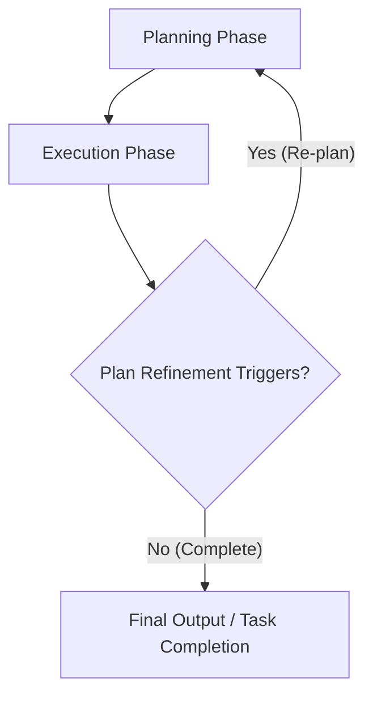

# Lesson 7: Agentic Planning and Reasoning

In our previous lessons, we have built a solid foundation in AI Engineering. We have covered context engineering, structured outputs, and how to build basic LLM workflows with tools. These components give us modularity and reliability, but they primarily address predictable processes. You tell the model what to do, and it does it.

But what happens when the path forward is not clear? What if the task is complex, requiring adaptation, exploration, and learning from mistakes? This is where agents truly begin to shine, moving beyond simple instruction-following to autonomous problem-solving. To make this leap, agents need two fundamental capabilities that LLMs do not possess by default: planning and reasoning.

This lesson introduces the core patterns that teach an LLM to "think" before it acts. We will explore foundational strategies like Chain-of-Thought, ReAct, and Plan-and-Execute. Understanding these concepts is essential for building agents that can tackle complex, multi-step tasks. While modern models are starting to internalize some of these abilities, grasping these patterns gives you a deeper insight into agent design, making your systems more robust, and easier to debug.

## What a Non-Reasoning Model Does And Why It Fails on Complex Tasks

To understand the need for planning, let's start with a recurring example: a "Technical Research Assistant Agent." Its goal is to produce a comprehensive report on the "Latest developments in edge AI deployment." This involves finding recent papers, summarizing their findings, identifying trends, and writing a structured report.

If we give this task to a standard, non-reasoning agent, it behaves like a student who starts writing an essay without an outline. It treats the entire complex request as a single prompt-and-response cycle [[1]](https://arxiv.org/html/2606.07462v1). It might call the right tools, perhaps a web search, but it does so without a structured plan. It generates the answer in one go, without iterating on its own output or correcting mistakes.

This approach quickly breaks down on complex tasks. The agent might misunderstand the intent, follow misleading evidence, or simply stop too early, resulting in a superficial report that misses key steps like source verification or cross-referencing [[1]](https://arxiv.org/html/2606.07462v1). The output is often a shallow summary, not a deep analysis, because the model never explicitly broke the problem down into sub-goals. It fails to see the forest for the trees.

In our previous lessons, we used workflows and structured outputs to build reliable systems for predictable tasks. We used tools to allow our models to take action. These are powerful building blocks, but they are not enough for tasks that require adaptation. When an agent needs to navigate unforeseen results or adjust its strategy, a simple, one-shot response is not sufficient. To solve this, we must first teach the model to produce a reasoning trace, to think before it answers.

## Teaching Models to “Think” Chain-of-Thought and Its Limits

The first major step toward agentic reasoning was a technique called Chain-of-Thought (CoT) prompting. The idea is simple but powerful: we ask the LLM to "think out loud" before giving its final answer, much like a person talks themselves through a difficult problem [[2]](https://apxml.com/courses/intro-llm-agents/chapter-5-basic-agent-planning/guiding-agent-reasoning-chain-of-thought). This encourages the model to generate a series of intermediate reasoning steps that lead to the final conclusion, improving its performance on tasks that require multi-step logic.

Let’s apply this to our research assistant agent. Instead of just asking for the report, we would modify the prompt:

*“Before answering, think step by step about how you will research and verify sources on edge AI deployment. Then provide the final report.”*

With this instruction, the model would first generate a high-level plan. It might outline steps like "First, I need to search for recent academic papers and industry reports. Second, I will select the most credible sources. Third, I will synthesize their findings and identify key trends. Finally, I will structure this into a report." This reasoning trace serves as a self-generated guide, making the final output more coherent and well-structured.

However, CoT has its limits. While it guides the LLM toward better reasoning, it is not a sophisticated planning algorithm [[2]](https://apxml.com/courses/intro-llm-agents/chapter-5-basic-agent-planning/guiding-agent-reasoning-chain-of-thought). The plan and the answer are generated together in a single, monolithic block of text. This makes it difficult to parse and programmatically control. More importantly, this initial plan is static. The model does not have a mechanism to execute the plan in an iterative loop, observe the results of its actions, and then refine its strategy. To gain that level of control and enable true interactivity, we need to separate the act of planning from the act of answering.

## Separating Planning from Answering Foundations of ReAct and Plan-and-Execute

The limitations of Chain-of-Thought led to a pivotal insight: to build more capable agents, we need to formally separate planning and reasoning from execution and action. This separation gives us two major advantages: control and interpretability, as we can see the plan before it acts, and iterative loops, allowing the agent to update its plan based on new information.

This separation mirrors dual-process theory from cognitive science, which distinguishes between fast, intuitive "System 1" thinking and slow, analytical "System 2" reasoning [[3]](https://www.frontiersin.org/journals/cognition/articles/10.3389/fcogn.2024.1356941/full). Agent patterns often recreate this division. Plan-and-Execute resembles a deliberate System 2 process creating a blueprint for a fast System 1 execution, while ReAct involves a continuous dialogue between the two modes of thought.

This core idea is the foundation for two of the most influential patterns in agent design: ReAct and Plan-and-Execute. While they share the same goal of structuring an agent's thought process, they approach it in different ways.

**ReAct (Reason + Act)** is a framework that interleaves reasoning and acting in a tight loop. The agent generates a thought, takes an action, observes the result, and then uses that observation to generate its next thought. This creates a dynamic, step-by-step problem-solving process.

**Plan-and-Execute**, on the other hand, separates the process into two distinct phases. First, the agent creates a complete, high-level plan. Then, it executes that plan step-by-step. The plan is typically only updated if the agent runs into an unexpected error or requires new information.

These patterns are not just historical footnotes; they are fundamental concepts that continue to influence how we build and understand agentic systems. First, we will go deep into ReAct, using our evolving research-assistant example to see it in action.

## ReAct in Depth Loop, Evolving Example, Pros and Cons

The ReAct framework was introduced to bridge the gap between pure reasoning (like Chain-of-Thought) and pure acting [[4]](https://mbrenndoerfer.com/writing/react-pattern-llm-reasoning-action-agents), [[5]](https://arxiv.org/pdf/2210.03629). Instead of generating a complete plan upfront or making blind tool calls, a ReAct agent thinks, acts, observes the results, and then adapts its next thought based on what it learned. This creates a dynamic feedback loop that mirrors how humans approach complex, exploratory tasks.

The process operates as a cycle of three distinct phases: **Thought**, **Action**, and **Observation** [[6]](https://apxml.com/courses/getting-started-with-llm-toolkit/chapter-8-developing-autonomous-agents/react-pattern-for-agents).

```mermaid
flowchart LR
  Thought --> Action
  Action --> Observation
  Observation --> Thought
  Thought --> "Final Answer"
```
Image 1: A flowchart illustrating the ReAct loop.

Let's see how our Technical Research Assistant Agent would use this loop to tackle its task:

- **Thought 1:** "I need to find recent, trustworthy sources on edge AI deployment. I will start by searching academic databases and reputable tech sites for papers and reports from 2024 onwards."
- **Action 1:** `search("latest developments in edge AI deployment 2024 site:arxiv.org OR site:nature.com")`
- **Observation 1:** The search returns a list of five academic papers and two industry whitepapers with their URLs and abstracts.
- **Thought 2:** "The initial search yielded good results. I will select the top three most cited papers and one industry report to ensure a balanced view. I need to fetch their full content to analyze them."
- **Action 2:** `fetch_and_extract(["url1", "url2", "url3", "url4"])`
- **Observation 2:** The full text of the selected documents is now available.
- **Thought 3:** "Now I need to read the documents and summarize their key findings, paying close attention to reported adoption rates. I will look for potential contradictions."
- **Action 3:** `summarize_and_compare(extracted_texts)`
- **Observation 3:** The summaries are generated. Paper A claims a 40% adoption rate in manufacturing, while Paper B reports only 25%. This is a conflict.
- **Thought 4:** "There is a conflict in the reported adoption rates. I need to find a third-party market analysis to resolve this discrepancy. I will search for a market research report on edge AI adoption."
- **Action 4:** `search("edge AI deployment adoption market analysis 2024")`
- **Observation 4:** A credible market analysis report is found, which suggests the 25% figure is more accurate for the broader market, while the 40% is specific to a niche within manufacturing.
- **Thought 5:** "The conflict is resolved. I can now synthesize the findings, highlight the trends, note the discrepancy and its resolution, and draft the final report with citations."
- **Final Answer:** The agent generates the structured report, incorporating all the verified information.

This example highlights the strengths of ReAct. It is highly interpretable, as each action is justified by an explicit thought. The feedback loop allows for natural error recovery and adaptation, making it well-suited for exploratory tasks where the exact steps are not known in advance. However, this dynamism comes with trade-offs. ReAct can be slower and more computationally expensive due to the multiple LLM calls. Its focus on single-step reasoning makes it less suitable for tasks requiring long-term planning, where it can struggle to form a coherent strategy [[7]](https://arxiv.org/html/2505.09970v2). In production, this can lead to failure modes like infinite loops, where an agent repeatedly retries a failing tool call or misinterprets an output without making progress [[8]](https://latitude.so/blog/ai-agent-failure-detection-guide). For tasks with a more predictable structure, the Plan-and-Execute pattern can offer a more efficient and reliable alternative.

## Plan-and-Execute in Depth Plan, Execution, Pros and Cons

While ReAct excels at exploration, many tasks benefit from a more structured approach. The Plan-and-Execute pattern provides this structure by separating the agent's process into two distinct phases: creating a comprehensive plan upfront and then executing it step-by-step [[9]](https://openreview.net/forum?id=ybA4EcMmUZ). This is like a chef first writing down the entire recipe and then gathering the cooks to execute each step in sequence.

The core idea is to dedicate a significant amount of thought to creating a high-quality plan before any actions are taken. This front-loading of reasoning helps ensure the agent has a clear, logical path to its goal. The execution phase then follows this blueprint, with re-planning only occurring when necessary, for example, if a step fails or new information invalidates the original plan [[9]](https://openreview.net/forum?id=ybA4EcMmUZ).


Image 2: A flowchart illustrating the Plan-and-Execute approach with a feedback loop for plan refinement.

Let's revisit our Technical Research Assistant Agent, this time using the Plan-and-Execute pattern.

First, the agent enters the **Planning Phase**. It receives the user's request and generates a detailed, step-by-step plan. The output of this phase might look like this:

1.  **Define Scope:** Clarify the research question, focusing on "edge AI deployment" developments in 2024. Success is a structured report with trends, gaps, and citations.
2.  **Initial Search:** Perform parallel searches on academic (arXiv, Google Scholar) and industry (market research sites) sources for relevant documents.
3.  **Source Selection:** Filter search results to select the top 5 most relevant and recent papers and 2 industry reports based on citations, abstracts, and source credibility.
4.  **Content Extraction:** For each selected source, fetch the full text and extract key sections related to new techniques, adoption statistics, and future challenges.
5.  **Summarize and Synthesize:** Create a summary for each source. Then, synthesize these summaries to identify common themes, conflicting information, and emerging trends.
6.  **Conflict Resolution:** If any factual contradictions are found (e.g., different adoption rates), create a sub-task to perform a targeted search for a definitive source to resolve the conflict.
7.  **Outline Generation:** Draft a structured outline for the final report, including sections for Introduction, Key Developments, Market Trends, Identified Gaps, and Conclusion.
8.  **Report Writing:** Write the full report based on the outline and synthesized notes, ensuring all claims are backed by inline citations.
9.  **Final Review:** Read through the generated report to check for clarity, coherence, and factual accuracy before delivering the final answer.

Once this plan is generated, the agent moves to the **Execution Phase**. It proceeds through each step of the plan, using its tools to perform searches, fetch content, and write text. The key difference from ReAct is that the agent is not re-evaluating its entire strategy after every single action. It follows the pre-defined path unless a specific trigger for re-planning occurs. For example, if Step 6 (Conflict Resolution) is triggered because of contradictory data found in Step 5, the agent might pause, return to the planning phase to generate a new sub-plan for verification, and then resume execution.

The primary advantage of Plan-and-Execute is its efficiency and predictability for well-defined tasks. By creating a complete plan upfront, it can reduce the number of LLM calls and provide a clearer roadmap, making it easier to estimate costs and completion time. However, this structure is also its main weakness. The pattern is less flexible for highly exploratory problems where the path to the solution is unknown. It risks rigidly following a flawed initial plan, and frequent re-planning can negate its efficiency benefits. These foundational ideas are not just theoretical; they power real-world systems that perform complex research at scale.

## Where This Shows Up in Practice Deep Research–Style Systems

The theoretical patterns of ReAct and Plan-and-Execute come to life in advanced AI systems designed for deep research, such as OpenAI's Deep Research agent. These systems are built to handle long-horizon tasks that take a human researcher hours or even days to complete [[10]](https://blog.promptlayer.com/how-deep-research-works). They operationalize the core principles of planning and reasoning to autonomously gather, analyze, and synthesize information from the web.

A typical deep research agent follows a process that blends elements of both ReAct and Plan-and-Execute. It starts by decomposing the user's complex query into a set of smaller, manageable sub-goals, similar to a Plan-and-Execute approach [[11]](https://www.jonkrohn.com/posts/2025/3/17/openais-deep-research-get-days-of-human-work-done-in-minutes). Once it has a high-level plan, it enters an iterative cycle of searching, reading, comparing, verifying, and writing [[10]](https://blog.promptlayer.com/how-deep-research-works). This execution phase looks very much like a ReAct loop. The agent issues a search query, reads the results, updates its internal knowledge, and then decides on the next query based on what it has learned.

For our research assistant example, this means the agent would perform dozens of micro-cycles. It would search for a paper, extract its claims about adoption rates, search for another paper, compare the claims, and if a conflict arises, it would automatically spawn a new sub-task to find a third source for verification. This iterative verification is a key feature, with the system having explicit policies to reduce hallucinations and ensure its findings are grounded in multiple sources [[12]](https://cdn.openai.com/deep-research-system-card.pdf).

These systems demonstrate that in practice, the line between ReAct and Plan-and-Execute is often blurred. Many advanced agents use a hybrid approach: they create an initial high-level plan but execute it using flexible, ReAct-style loops that allow for dynamic adaptation and course correction. As the underlying models evolve, some of this explicit looping is becoming more integrated into the model's own behavior.

## Modern Reasoning Models Thinking vs Answer Streams and Interleaved Thinking

The evolution of agentic patterns has run in parallel with the evolution of the LLMs themselves. Early models required explicit, handcrafted prompts to guide their reasoning. Modern reasoning models, however, are increasingly trained to perform this kind of structured thinking natively. This is often achieved by separating the model's output into two distinct streams: a private "thinking" stream and a public "answer" stream [[13]](https://cameronrwolfe.substack.com/p/demystifying-reasoning-models), [[14]](https://magazine.sebastianraschka.com/p/understanding-reasoning-llms).

The thinking stream contains the model's internal monologue or chain of thought. This is where it breaks down the problem, formulates a plan, and processes intermediate results. This stream is often hidden from the end-user but is crucial for the model's internal reasoning process [[13]](https://cameronrwolfe.substack.com/p/demystifying-reasoning-models). The answer stream is the final, polished response that is presented to the user. This separation allows the model to "think" extensively without cluttering the final output with its messy intermediate steps.

Some models take a "think first, then act" approach, which is analogous to the Plan-and-Execute pattern. The model generates a complete thought process in its private stream before producing the final answer or making any tool calls. This allows it to formulate a coherent plan before execution.

More advanced models support what is known as **interleaved thinking**. This is a more dynamic process that closely mirrors the ReAct loop. With interleaved thinking, the model can generate a piece of its response, pause to think, call a tool, observe the result, think some more, and then continue generating its response. For example, a model might write the introduction to a report, then use a thinking block to decide it needs a specific statistic, call a search tool to get it, use another thinking block to process the result, and then seamlessly weave that statistic into the next paragraph of the report.

This capability is now available in production models. For example, Anthropic's Claude models support interleaved thinking via a specific API parameter, allowing the model to alternate between generating private reasoning blocks and using tools within a single turn [[15]](https://docs.aws.amazon.com/bedrock/latest/userguide/claude-messages-extended-thinking.html). This power, however, comes with a significant cost. Extended thinking with tool use can consume 5 to 10 times more tokens than a standard response, a critical factor when managing production budgets [[16]](https://www.ikangai.com/the-ai-that-pauses-to-think-how-interleaved-reasoning-is-reshaping-autonomous-agents). This is reflected in API design, where a `budget_tokens` parameter for thinking can be set independently of the `max_tokens` for the final output.

A recent innovation, called asynchronous reasoning, takes this a step further. This technique allows a model to generate its public response concurrently while its private thoughts are still being formed [[17]](https://arxiv.org/html/2512.10931v1). The thinking stream can even "pause" the writing stream if it needs more time to work through a complex step, as illustrated in the image below. This reduces the latency perceived by the user, as the model can start "talking" while it is still "thinking".
Image 3: Asynchronous reasoning allows a Thinker to generate thoughts while a Writer generates the response. The Thinker can pause the Writer if it needs more time. (Source [Yakushev et al. [17]](https://arxiv.org/html/2512.10931v1))

What does this mean for AI engineers? While these increasingly powerful models handle more of the planning and reasoning process internally, the fundamental patterns have not disappeared. They have just moved to a different layer of abstraction. You may need to write fewer explicit `while` loops in your code, but you still need to provide the model with high-quality tools, clear instructions, and robust guardrails. Understanding the underlying principles of ReAct and Plan-and-Execute remains essential for debugging, controlling, and ultimately trusting the behavior of these advanced agents. With these foundational reasoning capabilities in place, agents can unlock even more sophisticated behaviors like goal decomposition and self-correction.

## Advanced Agent Capabilities Enabled by Planning

With a solid foundation in planning and reasoning, agents can unlock more advanced, autonomous capabilities. Two of the most important are goal decomposition and self-correction.

**Goal decomposition** is the ability to break a large, complex task into smaller, more manageable sub-goals. Instead of just following a linear plan, the agent can create a hierarchy of tasks. For our research assistant agent, it might decompose the main goal of "writing a report" into sub-goals like "gather sources," "analyze data," and "draft content." The "gather sources" sub-goal could be broken down even further into "search academic databases" and "search industry news." In a ReAct-style agent, this decomposition often happens implicitly within the thought steps, guided by a well-crafted prompt.

**Self-correction** is the agent's ability to detect when something has gone wrong and adjust its plan accordingly. This is where the iterative nature of reasoning loops becomes critical. Suppose our agent, in its research, finds two sources with conflicting data: one paper reports a 40% adoption rate for edge AI, while another reports 25%. A non-reasoning agent might just report both numbers or pick one at random. An agent capable of self-correction will recognize the contradiction. It will insert a new "verification" sub-goal into its plan, decide to search for a third, more authoritative source like a market analysis report, and then use that new information to resolve the conflict and revise the report [[18]](https://aclanthology.org/2025.acl-long.1104.pdf). In practice, this is difficult to implement reliably, as models often struggle to critique their own work and can stubbornly adhere to incorrect conclusions [[19]](https://assets.amazon.science/54/04/2dd88903469b9c7e2ef48769eb1c/llm-self-correction-with-decrim-decompose-critique-and-refine-for-enhanced-following-of-instructions-with-multiple-constraints.pdf).

Even as models become more powerful and internalize these behaviors, the explicit patterns we have discussed remain important. They provide a clear mental model for how the agent is "thinking," which is invaluable for debugging and ensuring consistency. They give you, the engineer, a set of levers to control the agent's behavior through explicit loops and well-defined prompts.

In our next lesson, we will move from theory to practice and implement a ReAct agent from scratch. This hands-on experience will solidify these concepts and prepare you for building more advanced systems. Soon after, we will explore how to give our agents memory, augment them with external knowledge through RAG, and enable them to process multimodal data.

## Conclusion

In this lesson, we explored the critical shift from simple instruction-following to true agentic behavior through planning and reasoning. We saw how basic LLMs fail at complex tasks and how Chain-of-Thought provides a first step toward structured thinking. We then dove into the two foundational patterns for agent design: the iterative, exploratory loop of ReAct and the structured, predictable phases of Plan-and-Execute.

We learned that these patterns are not just academic concepts but are the engines driving sophisticated, real-world systems. As models evolve, they are beginning to internalize these reasoning processes, separating their "thinking" from their "answering." However, a deep understanding of these core principles remains essential for any AI engineer. They provide the mental models needed to build, debug, and control the next generation of autonomous agents. In the next lesson, we will put this theory into practice by building our first ReAct agent from the ground up.

## References

- [1] Arxiv. (2026). [2606.07462v1] The Illusion of Thinking: A Scaling Law for Emergent Reasoning in Agents. [https://arxiv.org/html/2606.07462v1](https://arxiv.org/html/2606.07462v1)
- [2] apxml.com. (n.d.). Guiding Agent Reasoning with Chain-of-Thought. [https://apxml.com/courses/intro-llm-agents/chapter-5-basic-agent-planning/guiding-agent-reasoning-chain-of-thought](https://apxml.com/courses/intro-llm-agents/chapter-5-basic-agent-planning/guiding-agent-reasoning-chain-of-thought)
- [3] Frontiers in Cognition. (2024). Dual-process theories of thought as potential architectures for developing neuro-symbolic AI models. [https://www.frontiersin.org/journals/cognition/articles/10.3389/fcogn.2024.1356941/full](https://www.frontiersin.org/journals/cognition/articles/10.3389/fcogn.2024.1356941/full)
- [4] Brenndoerfer, M. (n.d.). The ReAct Pattern: Combining Reasoning and Acting in LLM-driven Agents. [https://mbrenndoerfer.com/writing/react-pattern-llm-reasoning-action-agents](https://mbrenndoerfer.com/writing/react-pattern-llm-reasoning-action-agents)
- [5] Arxiv. (2022). ReAct: Synergizing Reasoning and Acting in Language Models. [https://arxiv.org/pdf/2210.03629](https://arxiv.org/pdf/2210.03629)
- [6] apxml.com. (n.d.). The ReAct Pattern for Agents. [https://apxml.com/courses/getting-started-with-llm-toolkit/chapter-8-developing-autonomous-agents/react-pattern-for-agents](https://apxml.com/courses/getting-started-with-llm-toolkit/chapter-8-developing-autonomous-agents/react-pattern-for-agents)
- [7] Arxiv. (2025). [2505.09970v2] Pre-Act: A Cost-Efficient Agent with Multi-Step Planning. [https://arxiv.org/html/2505.09970v2](https://arxiv.org/html/2505.09970v2)
- [8] Latitude. (n.d.). Detecting AI Agent Failure Modes in Production. [https://latitude.so/blog/ai-agent-failure-detection-guide](https://latitude.so/blog/ai-agent-failure-detection-guide)
- [9] OpenReview. (n.d.). Plan-and-Act: Improving Planning of Agents for Long-Horizon Tasks. [https://openreview.net/forum?id=ybA4EcMmUZ](https://openreview.net/forum?id=ybA4EcMmUZ)
- [10] PromptLayer. (2025). How OpenAI's Deep Research Works. [https://blog.promptlayer.com/how-deep-research-works](https://blog.promptlayer.com/how-deep-research-works)
- [11] Krohn, J. (2025). OpenAI's Deep Research: Get Days of Human Work Done in Minutes. [https://www.jonkrohn.com/posts/2025/3/17/openais-deep-research-get-days-of-human-work-done-in-minutes](https://www.jonkrohn.com/posts/2025/3/17/openais-deep-research-get-days-of-human-work-done-in-minutes)
- [12] OpenAI. (n.d.). Deep Research System Card. [https://cdn.openai.com/deep-research-system-card.pdf](https://cdn.openai.com/deep-research-system-card.pdf)
- [13] Wolfe, C. R. (n.d.). Demystifying Reasoning Models. [https://cameronrwolfe.substack.com/p/demystifying-reasoning-models](https://cameronrwolfe.substack.com/p/demystifying-reasoning-models)
- [14] Raschka, S. (n.d.). Understanding Reasoning LLMs. [https://magazine.sebastianraschka.com/p/understanding-reasoning-llms](https://magazine.sebastianraschka.com/p/understanding-reasoning-llms)
- [15] AWS Documentation. (n.d.). Use interleaved thinking with Claude on Amazon Bedrock. [https://docs.aws.amazon.com/bedrock/latest/userguide/claude-messages-extended-thinking.html](https://docs.aws.amazon.com/bedrock/latest/userguide/claude-messages-extended-thinking.html)
- [16] IKANGAI. (n.d.). The AI That Pauses to Think: How Interleaved Reasoning Is Reshaping Autonomous Agents. [https://www.ikangai.com/the-ai-that-pauses-to-think-how-interleaved-reasoning-is-reshaping-autonomous-agents](https://www.ikangai.com/the-ai-that-pauses-to-think-how-interleaved-reasoning-is-reshaping-autonomous-agents)
- [17] Arxiv. (2025). [2512.10931v1] Asynchronous Reasoning: Training-Free Interactive Thinking LLMs. [https://arxiv.org/html/2512.10931v1](https://arxiv.org/html/2512.10931v1)
- [18] ACL Anthology. (2025). [2025.acl-long.1104] Beyond Direct Preference: Aligning Language Models with Self-Verification and Self-Correction. [https://aclanthology.org/2025.acl-long.1104.pdf](https://aclanthology.org/2025.acl-long.1104.pdf)
- [19] Amazon Science. (n.d.). LLM Self-Correction with DECRIM. [https://assets.amazon.science/54/04/2dd88903469b9c7e2ef48769eb1c/llm-self-correction-with-decrim-decompose-critique-and-refine-for-enhanced-following-of-instructions-with-multiple-constraints.pdf](https://assets.amazon.science/54/04/2dd88903469b9c7e2ef48769eb1c/llm-self-correction-with-decrim-decompose-critique-and-refine-for-enhanced-following-of-instructions-with-multiple-constraints.pdf)