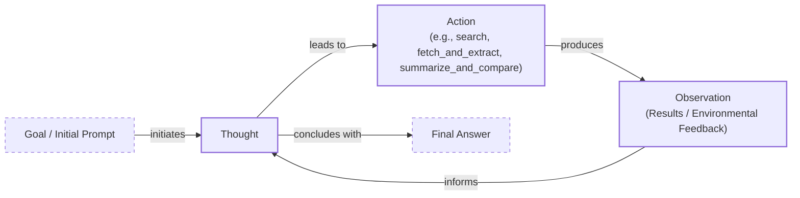
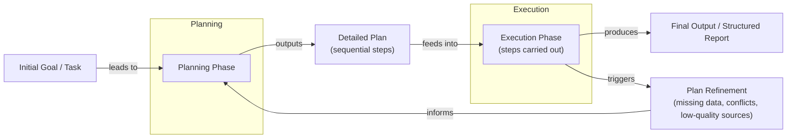

# Agentic Planning and Reasoning

## Introduction

In our previous lessons, we have assembled the core components of AI systems. We have explored the difference between rule-based workflows and autonomous agents, learned how to manage context, enforced structured outputs, and given our models tools to take action. We have built a car but have not yet taught it how to drive. An agent with tools but no plan is like a powerful engine without a steering wheel. It can perform actions but cannot navigate a complex, multi-step task to reach a destination.

This is where planning and reasoning come in. They are the cognitive engine that transforms a simple tool-using model into an autonomous agent capable of tackling complex problems. This lesson introduces these foundational ingredients of agentic behavior. We will explore historically important yet still relevant strategies like ReAct and Plan-and-Execute, which provide a structured way for agents to think. Understanding these patterns is essential for building robust and intelligent systems, even as modern models begin to internalize these abilities. In this lesson, we will explore why non-reasoning models fail at complex tasks, how Chain-of-Thought prompting teaches models to "think," and the core principles of ReAct and Plan-and-Execute. We will also see how these patterns appear in real-world systems and what advanced capabilities they unlock, such as goal decomposition and self-correction.

## What a Non-Reasoning Model Does And Why It Fails on Complex Tasks

Let's use a recurring example to frame the problem: a "Technical Research Assistant Agent." Your goal is to give it a high-level task, such as "Produce a comprehensive technical report on the latest developments in edge AI deployment," and have it autonomously find recent papers, summarize findings, identify trends, and write a structured report.

A non-reasoning model tackles this task by attempting to generate the final answer in a single pass. It relies on pattern matching from its training data to produce a response [[1]]. It might even call the right tools in the correct sequence if the task is similar to something it has seen before. However, it lacks a crucial capability: the ability to reason about its progress, adapt to unexpected results, or correct its own mistakes.

When faced with a complex, long-horizon task, this approach quickly breaks down. The agent might produce a superficial report based on the first few search results it finds. It will not stop to verify the credibility of its sources, compare conflicting information, or iterate on its own draft to improve quality. Because it does not explicitly break the task into sub-goals, it often misses critical steps like cross-source validation or identifying gaps in the research [[3]].

This is the fundamental limitation of agents without a planning mechanism. In previous lessons, we built systems with modularity and reliability for predictable processes. Workflows and structured outputs work well when the path is clear. Tools allow the agent to interact with the world. But for the complex, ambiguous tasks best suited for agents, where adaptation is key, these components are not enough. The agent needs a way to think. To address this, we must first teach the model to produce a reasoning trace before it answers.

## Teaching Models to “Think”: Chain-of-Thought and Its Limits

The first major step toward enabling model reasoning was Chain-of-Thought (CoT) prompting. The idea is simple but powerful: we ask the LLM to "think step by step" before giving its final answer. Just as humans often talk themselves through a problem, CoT prompts the model to externalize its reasoning process, generating a trace of its thinking [[9]]. This simple addition of "Let's think step by step" to a prompt can significantly improve performance on tasks that require sequential logic.

Let's apply this to our research assistant agent. Instead of just asking for the report, we would prompt it like this: "Before answering, think step by step about how you will research and verify sources on edge AI deployment. Then provide the final report."

With this instruction, the model’s behavior changes. It first drafts a high-level plan, something like:
1.  Search for recent papers on edge AI.
2.  Read the abstracts to identify relevant sources.
3.  Compare findings across papers.
4.  Synthesize the information into a structured report.

This is a clear improvement. The model is now planning its actions instead of just reacting. However, CoT has significant limitations. The reasoning trace and the final answer are generated together in the same block of text, which is difficult for a program to parse and control. The model might create a good initial plan but has no mechanism to execute it as an iterative loop where it can refine, verify, or correct its course based on new information. Furthermore, generating these long reasoning chains increases token usage, cost, and latency, and it still does not guarantee a correct answer [[7], [8]]. The reasoning can be coherent but entirely wrong [[9]].

To gain more structure and control, we need to go a step further and formally separate the act of planning from the act of answering. This separation is the foundation of the two most important patterns in agent design: ReAct and Plan-and-Execute.

## Separating Planning from Answering: Foundations of ReAct and Plan-and-Execute

The core idea that unlocks robust agentic behavior is the explicit separation of reasoning from action. Instead of generating a single, monolithic block of text containing both thought and answer, we instruct the model to treat them as distinct phases. This approach echoes principles from neuro-symbolic AI, where symbolic structures guide task decomposition and planning, while neural networks handle the pattern recognition and generation aspects of the task [[37]]. This separation provides two critical advantages: control and interpretability.

First, it allows us to build iterative loops. When an agent takes an action, it gets feedback from its environment, an observation. By feeding this observation back into the planning phase, the agent can update its strategy, correct mistakes, and dynamically adapt its course. This is impossible with a simple Chain-of-Thought prompt, which generates a static, one-time plan.

Second, it makes the agent’s behavior transparent. We can clearly see the agent's reasoning trace, the action it chose, and the result it observed. This makes debugging much easier and builds trust in the system.

Two primary architectural patterns have emerged from this principle:
*   **ReAct** interleaves **R**easoning and **Act**ing in a tight loop: Thought → Action → Observation.
*   **Plan-and-Execute** separates the process into two distinct, high-level phases: an initial Planning phase that creates a comprehensive plan, followed by an Execution phase that carries out the steps.

Though modern reasoning models are starting to perform these steps internally, understanding these explicit patterns is crucial for any AI engineer. They provide a mental model for how to structure agentic systems for reliability and control. First, we will go deep into ReAct, using our evolving research-assistant example.

## ReAct in Depth: Loop, Evolving Example, Pros and Cons

The ReAct framework was introduced to bridge the gap between the internal, free-form reasoning of Chain-of-Thought and the action-only paradigms that lacked planning capabilities. Inspired by the way humans use inner speech to plan and regulate their actions, ReAct synergizes reasoning and acting in an interleaved, iterative loop [[20], [34]]. The model is prompted to follow a cycle of Thought, Action, and Observation until it reaches a final answer.

The loop works as follows:
1.  **Thought:** The agent analyzes the current goal and its history. It generates a private reasoning trace to decide what to do next. This thought is not shown to the end-user but is crucial for the agent's internal state, helping it decompose the task, track progress, and handle exceptions [[15]].
2.  **Action:** Based on its thought, the agent selects and invokes a tool, such as performing a web search or reading a file. This action allows the agent to interface with external systems to gather information [[11]].
3.  **Observation:** The environment returns the result of the action. This could be search results, file content, or an error message. This new information is added to the agent's context, grounding its next thought in external reality [[12]].

This cycle repeats, allowing the agent to dynamically update its plan based on the feedback it receives.

Image 1: A flowchart illustrating the iterative ReAct loop.

Let’s see how our "Technical Research Assistant Agent" would use this loop to tackle its task:

*   **Thought 1:** "I need recent, trustworthy sources on edge AI deployment."
*   **Action 1:** `search("latest developments in edge AI deployment 2024 site:arxiv.org OR site:nature.com")`
*   **Observation 1:** A list of five papers and two industry blog posts is returned.
*   **Thought 2:** "Results look good. I'll select the top 3 papers and one report, then extract their abstracts."
*   **Action 2:** `fetch_and_extract(urls=["paper_url_1", "paper_url_2", "paper_url_3", "report_url_1"])`
*   **Observation 2:** The abstracts and metadata for the selected sources are extracted.
*   **Thought 3:** "Now I'll summarize and compare claims on adoption rates, flagging conflicts."
*   **Action 3:** `summarize_and_compare(extractions, focus="adoption rates")`
*   **Observation 3:** "Summary: Paper A claims 40% adoption in manufacturing. Paper B suggests 25% overall. A conflict exists."
*   **Thought 4:** "Conflict found. I need a market analysis report to resolve it."
*   **Action 4:** `search("edge AI deployment adoption market analysis 2024")`
*   **Observation 4:** A credible market analysis report is found.
*   **Thought 5:** "Resolve conflict using the report; finalize trends and gaps."
*   **Final Answer:** A structured report is generated with citations and the resolved statistics.

This iterative process makes ReAct a powerful pattern, but it has clear trade-offs.

| Pros | Cons |
| --- | --- |
| **High Interpretability:** The explicit thought-action-observation trace makes it easy to debug and understand the agent's decisions. | **Long-Horizon Drift:** In long tasks, the growing context of thoughts and observations leads to "context rot," where early, critical information is lost, causing the agent to drift off-task [[41]]. |
| **Natural Error Recovery:** When a transient action fails, the agent can reason about the failure in the next thought step and try a different approach. | **Brittle Error Recovery:** It can get stuck in non-terminating loops when facing structural failures (e.g., a hallucinated tool), repeatedly trying an action that can never succeed [[41]]. |
| **Effective for Exploratory Tasks:** It excels at tasks where the path to the solution is not known in advance and requires dynamic adaptation. | **No Consequence Awareness:** The loop does not distinguish between safe actions (like search) and irreversible ones (like deleting a file), posing a safety risk without external guardrails [[41]]. |
| **Grounded Reasoning:** By incorporating external observations, ReAct reduces the risk of hallucination compared to pure CoT reasoning [[20]]. | **Thought-Action Divergence:** The model can learn the format so well that it generates an expected action even if its thought process concluded otherwise, leading to a disconnect between reasoning and execution [[41]]. |

Table 1: The pros and cons of the ReAct framework.

For tasks with a more predictable structure, a different approach might be more efficient. This is where Plan-and-Execute offers a compelling alternative.

## Plan-and-Execute in Depth: Plan, Execution, Pros and Cons

While ReAct excels at exploratory tasks, many real-world problems have a more defined structure. For these scenarios, the Plan-and-Execute pattern offers a more efficient and predictable approach. This architecture structurally solves some of ReAct’s key limitations, namely the token bloat and sequential bottlenecks that arise from appending every intermediate step to the context [[41]]. Instead of interleaving thought and action at every step, this strategy separates the process into two distinct phases: a comprehensive upfront Planning phase, followed by a sequential Execution phase [[16]].

First, a "planner" model creates a detailed, step-by-step plan to achieve the user's goal. This plan is then passed to an "executor" model, which carries out each step. The key difference from ReAct is that the agent does not stop to re-evaluate after every single action. Instead, it executes a sequence of steps and only re-engages the planner if it encounters an error or a situation that requires a change in strategy. This separation allows for a more structured workflow, where a high-level plan guides a series of low-level actions [[16]].

Image 2: A flowchart depicting the Plan-and-Execute strategy.

Let’s revisit our "Technical Research Assistant Agent" and see how it would operate using a Plan-and-Execute model.

**1. Planning Phase**

The user provides the high-level goal. The planner agent generates a detailed plan:
1.  **Define Scope:** Clarify the report's focus on "edge AI deployment," covering recent developments, trends, and gaps. Success is a structured, cited report of approximately 1000 words.
2.  **Initial Search:** Conduct parallel searches on academic databases (e.g., arXiv) and industry news sites for articles published since 2024.
3.  **Source Selection:** From the search results, select the top five academic papers based on citation count and relevance, and the top three industry reports from reputable sources.
4.  **Content Extraction and Summarization:** For each selected source, extract the abstract, key findings, and any specific data points related to adoption rates or performance metrics. Generate a concise summary for each.
5.  **Synthesize and Compare:** Aggregate all summaries and data points. Identify common trends, conflicting information, and unanswered questions (gaps).
6.  **Draft Outline:** Create a structured outline for the final report, including sections for Introduction, Key Developments, Industry Trends, Research Gaps, and Conclusion.
7.  **Write Report:** Write the full report based on the outline, synthesizing the information and ensuring all claims are supported by inline citations.
8.  **Review and Finalize:** Perform a final review of the report for clarity, accuracy, and formatting.

**2. Execution Phase**

The executor agent now begins to carry out this plan step-by-step. It will proceed through steps 2, 3, and 4 without stopping to re-plan. However, during step 5, it might encounter a trigger for plan refinement. For example, it might find that two academic papers present conflicting statistics on adoption rates. This conflict would trigger a re-planning event. The system would pause execution, send the current state (including the identified conflict) back to the planner, and request an updated plan. The planner might then insert a new step, such as "Find a neutral third-party market analysis to resolve the statistical conflict," before allowing the executor to resume. This dynamic replanning is crucial for handling unexpected failures and ensuring the final output is accurate [[16]].

This separation of concerns brings several advantages and disadvantages.

| Pros | Cons |
| --- | --- |
| **Efficiency for Structured Tasks:** By planning upfront, it reduces the number of LLM calls during execution, making it faster and more cost-effective for predictable workflows. | **Less Flexible for Exploration:** It is not well-suited for highly exploratory problems where the path is unknown. The agent cannot adapt as quickly to unexpected findings. |
| **Predictability and Control:** The upfront plan provides a clear roadmap, making the agent's behavior more predictable and easier to manage. It's easier to estimate the cost and time required. | **Risk of Imperfect Plans:** If the initial plan is flawed or based on incomplete information, the agent may follow it rigidly, leading to suboptimal results without frequent re-planning. |
| **Clearer Stage Ownership:** The separation of planning and execution allows for specialization. You could even use different models for each phase, a powerful reasoning model for planning and a faster, cheaper model for execution. | **Requires Re-planning Mechanisms:** The system needs a robust mechanism to detect when the plan has failed and to trigger a re-planning cycle, which adds complexity. |
| **Reduced Context Overload:** Because the executor only needs the context for its current sub-task, this architecture avoids the "context rot" that can plague long-running ReAct agents [[41]]. | **Limited Grounding in Early Stages:** The initial plan is created without any real-world feedback, which can lead to inaccuracies if the planner's assumptions about the environment are wrong. |

Table 2: The pros and cons of the Plan-and-Execute framework.

In practice, many advanced systems are hybrids, combining an initial high-level plan with smaller, ReAct-style loops for executing each step. These ideas are not just theoretical; they power real-world systems that perform complex research at scale.

## Where This Shows Up in Practice: Deep Research–Style Systems

The planning and reasoning patterns we have discussed are not just academic concepts; they are the architectural backbone of advanced AI systems designed for deep research. Products like OpenAI's Deep Research operationalize these principles to tackle long-horizon tasks that would take a human researcher hours or days to complete [[28]].

These systems work by decomposing a complex query, like our "edge AI deployment" report, into a series of smaller, manageable sub-goals [[27]]. They then enter iterative cycles of searching, reading, comparing, and verifying information before synthesizing it into a final, cited report. The agent might perform dozens of micro-cycles, such as searching for a specific statistic, extracting it from a PDF, verifying it against another source, and then updating its internal notes or "scratchpad" [[27]].

This process is a practical implementation of the patterns we have explored:
*   Many of these systems are built around **ReAct-like loops**, where each search or file-read is an action, and the returned information is an observation that informs the next thought. Strong system prompts and a well-designed toolset guide the agent, ensuring it stays on track and performs necessary verification steps.
*   Others are closer to **Plan-and-Execute**, starting with a high-level research plan and then executing each stage, with periodic checks to re-plan if new information contradicts the initial strategy or reveals a dead end.

Beyond web research, these patterns are being applied in specialized professional domains. In legal reasoning, for instance, agentic systems use a controller-coordinator architecture to manage sub-agents that handle specific tasks like case analysis or litigation strategy, demonstrating how planning can be applied to complex, knowledge-based professional work [[38]].

The key takeaway is that for reliable, high-quality output on complex tasks, a simple "prompt-in, answer-out" model is insufficient. These systems rely on explicit, structured reasoning loops and strong policies to reduce hallucinations and enforce verification. As AI models evolve, some of this explicit structure is becoming more integrated into the models themselves.

## Modern Reasoning Models: Thinking vs. Answer Streams and Interleaved Thinking

As LLMs have become more powerful, they have started to internalize some of the planning and reasoning structures that we previously had to engineer with explicit loops. Modern reasoning models, such as OpenAI's o-series or Anthropic's Claude 3.5 Sonnet, are often trained to separate their internal thought process from their final output, creating two distinct streams: a private "thinking" stream and a public "answer" stream [[21], [23]].

When you send a complex query to one of these models, it does not immediately start generating the answer. Instead, it first generates a series of "thoughts" in a private, internal space. This is similar to the `Thought` step in the ReAct pattern. During this phase, the model can decompose the problem, formulate a plan, and decide which tools to use [[22]]. Some models explicitly use tags like `<think>` and `</think>` to delineate this internal monologue before producing the final output between `<answer>` and `</answer>` tags [[23]]. Only after this internal reasoning process is complete does it begin to generate the final, user-facing answer or execute a tool call.

This "think-first" behavior is a significant step forward, but the most advanced models are now capable of something even more dynamic: **interleaved thinking**. With interleaved thinking, the model does not just plan once at the beginning. Instead, it can pause, think, act, and then think again based on the result of its action. For example, after a tool call returns new data, the model can generate new thinking tokens to analyze that data, update its plan, and decide on the next action. This allows for a much more flexible and adaptive reasoning process, closely mirroring the ReAct loop but happening more implicitly within the model's own generation process. Anthropic's models, for instance, support this through a dedicated `thinking` block in their API responses, which contains the model's reasoning trace [[36]].

A recent innovation in this area is asynchronous reasoning, a training-free approach that allows a model to think, listen for new user input, and generate its response concurrently [[21]]. This is achieved by using properties of positional embeddings to manage three separate token streams—user input, private thoughts, and public response—as a single sequence. The model can even be prompted to decide for itself whether it needs to pause the public response to "think" longer, making the interaction feel more natural and real-time [[21]].

For an engineer, interacting with these streams provides a powerful debugging and control mechanism. The "thinking" stream can be logged to trace the agent's logic, or even streamed to a user interface to provide a real-time view of the agent's progress, like "Now searching for X..." or "Analyzing results from Y...". This transparency builds user trust and makes it easier to identify the source of errors.

However, this increased reasoning capability does not automatically lead to greater factuality. Paradoxically, some of the most advanced reasoning models have been observed to hallucinate *more* often than their predecessors. Internal OpenAI tests, for example, found that models like o3 hallucinated significantly more often on factual benchmarks than older models. The exact reasons are still being researched, but one hypothesis is that because these models make more claims overall as part of their reasoning process, they create more opportunities to make inaccurate ones [[39], [40]].

What does this mean for us as AI engineers? Does this make patterns like ReAct and Plan-and-Execute obsolete? Not at all. Even with models that have powerful internal reasoning, explicit agentic loops remain essential for building reliable and controllable systems. The separation of reasoning and answering, whether managed by an external framework or exposed by the model's API, is crucial for debugging. When an agent fails, we need to inspect its thought process to understand why. Explicit control loops also give us the power to enforce guardrails, manage state, and ensure the agent's behavior aligns with our requirements.

## Advanced Agent Capabilities Enabled by Planning: Goal Decomposition and Self-Correction

Once an agent is equipped with planning and reasoning capabilities, it unlocks more advanced and autonomous behaviors. Two of the most important are goal decomposition and self-correction. These are what allow an agent to move from simply following a plan to creating and repairing plans on its own.

**Goal decomposition** is the process of breaking a high-level objective into smaller, manageable sub-goals [[33]]. In a ReAct-style agent, this often happens implicitly within the `Thought` steps as the agent reasons about the overall goal and identifies the immediate next step. Well-crafted system prompts can guide this behavior, encouraging the agent to think hierarchically.

**Self-correction** is the ability to detect failures, contradictions, or low-confidence results and then update the plan to fix the issue. In our example of conflicting adoption rates (40% vs. 25%), a self-correcting agent would recognize the contradiction, insert a new sub-goal to find a tie-breaker source, and then revise its plan to continue [[32]]. This process can be formally understood through the lens of control theory. The self-correction loop acts as a closed-loop control system where the LLM is the plant, the detected error is the error signal, and the re-prompting is the control input, all designed to guide the system to a stable, correct output [[42]].

These advanced capabilities highlight why understanding the underlying patterns of reasoning still matters. Explicit frameworks provide the structure to implement self-correction loops, manage hierarchical goals, and make an agent's thinking process debuggable, consistent, and understandable.

In the next lesson, we will put this theory into practice by implementing a ReAct agent from scratch. Soon after, we will explore the memory systems that allow agents to learn over time, the knowledge-augmented retrieval techniques that ground them in facts, and how to process multimodal data.

## Conclusion

In this lesson, we explored the critical shift from simple tool-using models to true autonomous agents through the lens of planning and reasoning. We saw that without a structured way to think, agents fail at complex, multi-step tasks. Foundational patterns like Chain-of-Thought, ReAct, and Plan-and-Execute provide the architectural blueprints for building agents that can decompose goals, adapt to new information, and correct their own mistakes.

While modern models are beginning to internalize these reasoning capabilities, understanding these explicit patterns remains essential for any AI engineer. They provide the control, interpretability, and reliability needed to build production-grade systems. Planning and reasoning are what elevate agents from being simple executors to becoming dynamic problem-solvers.

In our next lesson, we will move from theory to practice and build our own ReAct agent from the ground up, giving you hands-on experience with implementing these powerful concepts.

## References

- [1] https://www.narrativa.com/ai-reasoning-vs-non-reasoning-models-key-differences-explained
- [2] https://www.kuppingercole.com/research/lb80993/fundamental-scaling-limitations-in-ai-reasoning-models
- [3] https://arxiv.org/pdf/2504.19678
- [4] https://developers.openai.com/api/docs/guides/reasoning-best-practices
- [5] https://www.linkedin.com/posts/skphd_agent-laboratory-using-llm-agents-as-research-activity-7283233189651738625-q6xU
- [6] https://www.emergentmind.com/topics/chain-of-thought-and-planning-agents
- [7] https://apxml.com/courses/intro-llm-agents/chapter-5-basic-agent-planning/guiding-agent-reasoning-chain-of-thought
- [8] https://mbrenndoerfer.com/writing/step-by-step-problem-solving-chain-of-thought-reasoning
- [9] https://www.comet.com/site/blog/chain-of-thought-prompting
- [10] https://www.ibm.com/think/topics/chain-of-thoughts
- [11] https://mbrenndoerfer.com/writing/react-pattern-llm-reasoning-action-agents
- [12] https://apxml.com/courses/getting-started-with-llm-toolkit/chapter-8-developing-autonomous-agents/react-pattern-for-agents
- [13] https://www.mindstudio.ai/blog/what-is-react-loop-ai-agent-reasoning
- [14] https://www.salesforce.com/agentforce/ai-agents/react-agents
- [15] https://www.ibm.com/think/topics/react-agent
- [16] https://openreview.net/forum?id=ybA4EcMmUZ
- [17] https://www.ibm.com/think/topics/agentic-reasoning
- [18] https://www.ibm.com/think/topics/ai-agent-orchestration
- [19] https://www.anthropic.com/engineering/building-effective-agents
- [20] https://arxiv.org/pdf/2210.03629
- [21] https://arxiv.org/html/2512.10931v1
- [22] https://www.ibm.com/think/topics/reasoning-model
- [23] https://cameronrwolfe.substack.com/p/demystifying-reasoning-models
- [24] https://magazine.sebastianraschka.com/p/understanding-reasoning-llms
- [25] https://www.ibm.com/think/insights/ai-agents-2025-expectations-vs-reality
- [26] https://arxiv.org/html/2603.28376v1
- [27] https://blog.promptlayer.com/how-deep-research-works
- [28] https://www.jonkrohn.com/posts/2025/3/17/openais-deep-research-get-days-of-human-work-done-in-minutes
- [29] https://blogs.nvidia.com/blog/reasoning-ai-agents-decision-making/
- [30] https://cdn.openai.com/deep-research-system-card.pdf
- [31] https://cdn.openai.com/business-guides-and-resources/a-practical-guide-to-building-agents.pdf
- [32] https://aclanthology.org/2025.acl-long.1104.pdf
- [33] https://www.ibm.com/think/topics/ai-agent-planning
- [34] https://research.google/blog/react-synergizing-reasoning-and-acting-in-language-models
- [35] https://metr.org/blog/2025-03-19-measuring-ai-ability-to-complete-long-tasks/
- [36] https://docs.anthropic.com/en/docs/build-with-claude/extended-thinking#interleaved-thinking
- [37] https://arxiv.org/html/2407.08516v5
- [38] https://legal.thomsonreuters.com/blog/how-agentic-ai-systems-think-learn-and-collaborate-with-legal-professionals
- [39] https://techcrunch.com/2025/04/18/openais-new-reasoning-ai-models-hallucinate-more
- [40] https://arxiv.org/html/2505.23646v1
- [41] https://www.agentengineering.io/topics/articles/react-loop-unpacked
- [42] https://arxiv.org/html/2605.17305v1
</article>