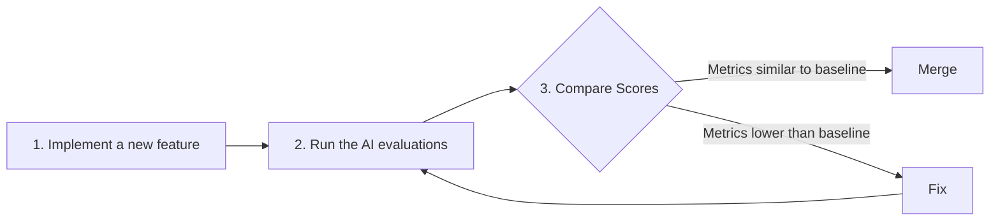
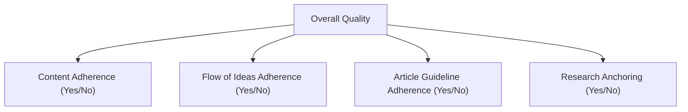

# The North Star of AI Engineering: A Guide to Evaluation-Driven Development

In our last lessons, we instrumented our AI agents with observability tools like Opik and built our first offline datasets for evaluation. We have the raw materials for testing, but raw materials do not make a product. Now, we must move to the core theoretical framework of designing the metrics themselves. In classical machine learning, we rely on rigorous standards like accuracy, precision, and F1-score to measure success. In AI engineering, however, it is all too common to rely on "vibe checks"—a subjective sense that an output "feels more coherent" or "seems better."

Investing in a proper evaluation layer can feel hard to prioritize. It delivers no immediate, user-visible feature. It requires upfront effort to design datasets and metrics, competing with the constant pressure to ship new functionality. But we have learned that this same investment dramatically accelerates long-term iteration. It gives you an objective signal on every change you make, catching regressions instantly and focusing your team on what matters.

Evals are the north star of AI engineering. They are the single source of truth that tells you exactly which modifications improve your system and which degrade it.

In this lesson, we will establish the theoretical foundation for evaluation-driven development (EDD). We will explore how to use an optimization flywheel for continuous improvement and regression testing. We will also analyze the trade-offs between different metric types for unstructured outputs, argue why custom business metrics are superior to public benchmarks and generic scores, and make the case for using binary judgments over Likert scales. With this framework, you can replace intuition with an evidence-based system for building reliable AI.

## Using Evals Through the Optimization Flywheel

To build intuition, let's examine how we can effectively integrate AI evaluations into our application development lifecycle. There are three core scenarios where a robust evaluation framework provides immense value.

### The Three Core Use Cases

First, evaluations **quantify the quality of your system**. By running your application against a curated dataset and a set of well-defined metrics, you create a baseline snapshot of its current performance. Without this baseline, you cannot know if your system is ready for production, nor can you measure whether future changes are making it better or worse.

Second, these metrics serve as **guidance when optimizing your system**. Instead of making changes based on intuition, you can run experiments and use the evaluation scores as evidence. This shifts development from a subjective, "vibe-driven" process to an evidence-based one. If changing a prompt increases your "Constraint Adherence" score by 10%, you have a clear signal that the change was effective.

Finally, evaluations act as **regression tests** that protect shared components. In complex AI systems, a single prompt, tool, or retrieval strategy might be used by multiple workflows. A change intended to improve one area can inadvertently break another. By running a full evaluation suite before merging any changes, you can ensure that new features do not degrade existing functionality. This is critical for maintaining stability as your application grows.

### The Optimization Process

How does this look in a real-world scenario? The optimization flywheel is an eight-step iterative process that provides a clear plan of attack.

1.  **Gather your dataset.** Assemble the offline dataset that represents the key scenarios and edge cases for your application.
2.  **Build your metrics.** Define the business-aligned metrics that measure what success looks like for your product.
3.  **Establish a baseline.** Run your current system against the dataset to compute your initial baseline scores.
4.  **Start the optimization.** Make one, isolated change that you believe will improve performance. This could be a prompt tweak, a model swap, or a change in your RAG strategy.
5.  **Compute the new score.** Re-run the full evaluation suite on the entire dataset with the modified system.
6.  **Compare.** Compare the new scores to your baseline.
7.  **Decide.** If the score is better, keep the change. If it is the same, consider the complexity of the change before deciding. If it is worse, revert it.
8.  **Repeat.** Continue the cycle until your scores meet the desired quality bar for production.

Image 1: A flowchart illustrating the eight-step iterative optimization flywheel for AI applications.

It is critical to change only one variable per cycle. If you modify the prompt *and* swap the model, you create confounding variables. It becomes impossible to attribute any score change to a specific modification, turning your evidence-based process back into guesswork.

Your decision to keep a change should also anchor statistical significance to actual business impact. A result is statistically significant if it is unlikely to have occurred by chance, but that does not automatically make it practically significant [[46]](https://www.nngroup.com/articles/practical-significance). For a high-volume e-commerce support bot that handles millions of queries, a 0.5% reduction in checkout errors could translate to thousands of fewer failed transactions and substantial savings [[46]](https://www.nngroup.com/articles/practical-significance). In this context, a small but statistically significant improvement has a massive business impact. In contrast, for a low-volume creative writing tool, a similar small improvement might be negligible. "Better" is always relative to the business use case.

### Regression Testing

The optimization flywheel can be adapted for regression testing. Before merging any new feature that touches a shared component—like a system prompt, tool definition, or retrieval logic—you run the full eval suite to guard against breaking existing behavior. This is an extremely powerful technique for ensuring stability.

The process has five steps:
1.  **Implement a new feature.** You write the code and verify it works locally for the new use case.
2.  **Run the AI evaluations.** You run the full suite of assessments, covering all previous use cases, not just the new one.
3.  **Compare Scores.** You compare the new scores against the established baseline for existing features.
4.  **Metrics similar to baseline.** If the scores for existing features are unchanged, your new feature has not introduced a regression. You can merge it into your production codebase.
5.  **Metrics lower than the baseline.** If any score is worse, you have introduced a regression. You must fix your code and then repeat the evaluation cycle.

Image 2: Flowchart illustrating the five-step regression testing process for AI applications.

This treats your evaluation suite like a set of integration tests. However, instead of asserting a fixed `True` or `False`, you compare performance against a moving baseline. This acknowledges that AI systems are probabilistic and allows for controlled evolution while preventing unexpected degradation.

### The Living Dataset

This entire process relies on a dataset that is a living artifact. It must continuously expand. When a new feature is added, you must add new examples that cover its edge cases. When a failure is discovered in production through observability tools like Opik, that failure trace must be converted into a new test case [[28]](https://www.comet.com/docs/opik/evaluation/advanced/manage_datasets). When you encounter a particularly hard-to-debug problem, the example that exposes it should be added to the dataset [[29]](https://www.decodingai.com/p/generate-synthetic-datasets-for-ai-evals). Instead of writing new tests in code, you broaden your test coverage by adding new samples to your dataset.

With the flywheel mechanics clear, we can now examine the different families of metrics we might plug into it when dealing with unstructured text and image outputs.

## Exploring Possible Metric Types

The core difficulty in evaluating AI systems is that their outputs—unstructured text, reasoning traces, or images—do not have a single correct answer. Unlike classical ML with its structured labels, we cannot use simple accuracy. This requires us to explore different families of metrics, each with its own trade-offs.

### 1. N-gram Overlap Metrics

Metrics like BLEU (Bilingual Evaluation Understudy) and ROUGE (Recall-Oriented Understudy for Gisting Evaluation) are based on lexical overlap. They work by counting the number of overlapping n-grams (sequences of words) between the generated text and a reference text [[30]](https://wandb.ai/ai-team-articles/llm-evaluation/reports/LLM-evaluation-benchmarking-Beyond-BLEU-and-ROUGE--VmlldzoxNTIzMTY0NQ), [[31]](https://www.traceloop.com/blog/demystifying-the-bleu-metric).

*   **Pros:** They are fast to compute, deterministic, widely understood, and do not require an additional model.
*   **Cons:** Their biggest weakness is that they are blind to semantic meaning. They cannot recognize paraphrasing, penalizing a correct answer simply because it uses different words. They also do not assess factual accuracy or logical reasoning [[30]](https://wandb.ai/ai-team-articles/llm-evaluation/reports/LLM-evaluation-benchmarking-Beyond-BLEU-and-ROUGE--VmlldzoxNTIzMTY0NQ), [[33]](https://medium.com/@sthanikamsanthosh1994/understanding-bleu-and-rouge-score-for-nlp-evaluation-1ab334ecadcb), [[34]](https://www.elastic.co/search-labs/blog/evaluating-rag-metrics).

### 2. Embedding Similarity Metrics

Metrics like BERTScore improve on n-gram methods by using contextual embeddings. They embed both the generated and reference texts into a high-dimensional vector space and measure their cosine similarity. This allows them to capture semantic closeness rather than just lexical overlap.

*   **Pros:** They are better at understanding semantic meaning and can recognize paraphrasing.
*   **Cons:** They are still fundamentally comparison metrics. They cannot verify complex business logic or ensure adherence to specific guidelines that are not present in the reference text.

### 3. LLM-as-a-Judge

The LLM-as-a-judge approach uses a powerful language model as the evaluator. You provide the judge model with the input, the generated output, and a detailed prompt containing your evaluation criteria, few-shot examples, and chain-of-thought reasoning instructions.

*   **Pros:** This method is highly flexible and customizable. It can evaluate subjective qualities like tone and creativity, check for adherence to complex business rules, and provide detailed, human-like critiques. This makes it ideal for capturing nuanced, domain-specific requirements [[35]](https://www.confident-ai.com/blog/why-llm-as-a-judge-is-the-best-llm-evaluation-method), [[38]](https://www.braintrust.dev/articles/what-is-llm-as-a-judge).
*   **Cons:** Performance is highly dependent on the quality of the prompt and the power of the judge model. LLM judges can be slower and more expensive than traditional metrics and may inherit biases from their training data if not carefully calibrated [[50]](https://www.evidentlyai.com/llm-guide/llm-as-a-judge), [[52]](https://www.linkedin.com/posts/allaabdella_llm-aijudge-genai-activity-7353053642590932994-s3sw), [[53]](https://cameronrwolfe.substack.com/p/llm-as-a-judge).

Table 1: A comparison of trade-offs between different metric families.
| Metric Family | Speed | Cost | Semantic Awareness | Business Alignment | Explainability |
| :--- | :--- | :--- | :--- | :--- | :--- |
| N-gram Overlap | Fast | Low | Low | Low | Low |
| Embedding Similarity | Medium | Medium | High | Medium | Low |
| LLM-as-a-Judge | Slow | High | Very High | Very High | High |

For the complex requirements of our capstone writing agent—such as guideline adherence, structural fidelity, and research grounding—LLM judges are the most practical choice. They are the only metric family that can be programmed with natural language to enforce our specific business logic.

Now, you have heard from us: *"business metrics here, business metrics there"*. Thus, let's understand why defining your own business metrics is such an essential and underrated step in building your AI evals strategy.

## Why Business Metrics Over Benchmarks

Using popular leaderboards or open benchmarks to select an LLM for your product is often a mistake. Benchmarks are one of the most deceiving types of metrics, and relying on them for product decisions can lead you astray for two core reasons.

First, public benchmarks often function as marketing artifacts. Once a test set is public, models can be trained on the test data, and teams can "teach to the test," hill-climbing on leaderboard scores [[11]](https://www.evidentlyai.com/llm-guide/llm-benchmarks), [[13]](https://launchdarkly.com/blog/llm-evaluation), [[15]](https://world.hey.com/bhari/ai-benchmark-scores-are-becoming-marketing-dynamic-eval-is-the-only-antidote-dedd7053). This practice of data contamination compromises the integrity of the evaluation, as the scores no longer reflect performance on unseen data. Research has shown that even powerful models suffer from "paradigm overfitting," where they memorize solution patterns for specific problems rather than developing generalizable reasoning skills.

Second, there is a fundamental mismatch between the tasks in most benchmarks and the demands of real-world business applications [[12]](https://magazine.sebastianraschka.com/p/llm-evaluation-4-approaches), [[14]](https://arxiv.org/html/2601.20617v1). A model that excels at solving grade-school math problems (like in GSM8k) or answering multiple-choice questions (like in MMLU) may not be the best choice for generating long-form creative content, performing nuanced legal analysis, or providing personalized customer support.

The proper role for benchmarks is narrow: they are useful for advancing research frontiers and for initial model filtering during early exploration. They should never be used as a proxy for product-level decisions or as the primary target for optimization.

If benchmarks are misleading, generic prefab metrics that claim to measure universal qualities are even more dangerous. We must instead build metrics that are deeply tied to our specific application.

## Why Custom Business Metrics Over Generic Metrics

Generic, off-the-shelf metrics for qualities like "toxicity," "helpfulness," or "hallucination" create a mirage. They promise an objective measure of quality but lack the context of your product, your users, and your brand. Optimizing for these scores often means you are optimizing for the wrong signal, building false confidence in a system that fails in ways that matter to your business [[16]](https://www.linkedin.com/posts/shivanshu-aggarwal_evals-aievals-llm-activity-7375884554177449985-16kP). A model can score brilliantly on "helpfulness" yet fail catastrophically on your specific constraints.

Consider the dashboard below. It looks impressive, with scores for "Truthfulness" and "Personalization." But what does a 3.7 in "Personalization" actually mean?
Image 3: A dashboard showing generic metrics like Helpfulness and Truthfulness, labeled "Don't Do This!" verbatim. (Source [The 5-Star Lie: You’re Doing AI Evaluations Wrong](https://www.decodingai.com/p/the-5-star-lie-you-are-doing-ai-evals))

Let's assume we want to check if the article written by our Brown agent contains hallucinations. If we use a generic `hallucination` score and it returns "positive," what does that tell us? Did it add information not present in the research? Did it deviate from the article guidelines? Or did it simply include a personal story that wasn't in the source text but is factually correct and relevant? A generic detector might flag an engaging personal anecdote as a fabrication, but that same anecdote may be exactly what your brand voice requires. The generic metric cannot distinguish between undesirable invention and desirable creative elaboration.

These prefab scores are limited by their absence of domain-specific constraints, their inability to localize which part of an output failed, and the statistical noise they introduce into decision-making [[18]](https://arxiv.org/html/2508.13816v1), [[20]](https://toloka.ai/blog/llm-evaluation-from-classic-metrics-to-modern-methods).

This does not mean generic metrics are useless. They have a narrow but valid role during exploratory data analysis.
1.  **Verbosity:** Sorting your outputs by length can quickly reveal if your most verbose answers are rambling and unhelpful or if your shortest answers are curt and incomplete. This helps you spot failure modes in long-form generation.
2.  **Similarity Score:** In a RAG system, you can use a similarity score to evaluate the retriever component specifically. If the similarity between the user query and the retrieved chunks is low, your retriever is likely failing. This is a valid component-level check.
3.  **BERTScore:** You can use this to audit the quality of your "golden" reference answers. If you find a cluster of outputs with a low BERTScore against a reference you expected to be similar, a manual review might reveal that the LLM found a more creative or even better solution than your reference.

In all these cases, the generic metric is a flashlight for discovery, not a report card for quality. Every production metric must be deeply application-centric, derived from concrete product requirements, user success criteria, and explicit constraints.

Once we have rejected both benchmarks and generic metrics, the remaining design choice is how to elicit judgments from our LLM judge. Here, binary pass/fail criteria outperform every alternative.

## Choosing Binary Metrics Over Anything Else

When designing these custom metrics, you will face a choice: should you use a Likert scale (e.g., 1-5 stars) or a binary pass/fail? We strongly recommend **binary metrics**.

Likert scales are a seductive trap. They seem to offer more nuance, but in practice, they introduce ambiguity and noise right where you need clarity. There are three main problems with them [[4]](https://www.decodingai.com/p/the-5-star-lie-you-are-doing-ai-evals), [[6]](https://www.scribbr.com/methodology/likert-scale):

1.  **Inconsistent Labeling:** The difference between a '3' and a '4' is subjective. One person's '4' is another's '3', leading to low inter-annotator agreement. This subjectivity makes it difficult to build a reliable evaluation system [[5]](https://www.ellamind.com/blog/binary-vs-likert-scales).
2.  **Statistical Noise:** Detecting a meaningful improvement is much harder with a Likert scale. A shift from an average score of 3.2 to 3.4 requires a much larger sample size to be statistically significant compared to a shift in a binary pass rate from 75% to 80% [[5]](https://www.ellamind.com/blog/binary-vs-likert-scales).
3.  **Lazy Decision-Making:** Raters, both human and LLM, often default to the middle value ('3') to avoid making a difficult judgment. This behavior, known as "satisficing," hides uncertainty rather than resolving it. A dashboard full of '3's tells you nothing about what to fix [[4]](https://www.decodingai.com/p/the-5-star-lie-you-are-doing-ai-evals), [[7]](https://inmoment.com/blog/likert-scale).

Binary evaluations work because they **force decisions**. An output either met the criterion or it did not. This simple constraint brings immediate benefits:

1.  **Clearer Thinking:** You cannot hide in ambiguity. A binary framework forces you to create precise, unambiguous definitions of quality.
2.  **Consistency:** Binary decisions are faster and more consistent for both humans and LLMs, leading to higher agreement and more reliable metrics.
3.  **Actionability:** The result is a clear failure signal tied to a specific problem. A drop in the "Research Anchoring" pass rate tells an engineer exactly where to start debugging.

<aside>
💡
**Note:** The 3 points above translate exceptionally well to LLM Judges. Using binary scoring is a key design choice to mitigate the inherent randomness of LLMs. LLMs are much more stable when asked to make a binary decision than when asked to assign a scalar value. A binary metric translates to a more robust and repeatable evaluation pipeline.

</aside>

### Capturing Nuance with Granular Binary Criteria

The standard objection to binary evals is, "But I'm losing nuance! A 1-5 scale captures shades of gray."

This is a misconception. The right way to capture nuance is not by making your scale fuzzier, but by making your criteria more **granular**. You should decompose a single, vague, overall quality score into multiple, specific, binary checks [[9]](https://www.ellamind.com/blog/binary-vs-likert-scales).

For our writing agent, instead of rating an article 1-5 for "Quality," we create multiple binary evaluations that capture specific dimensions of quality:
1.  **Content Adherence:** Does the generated article contain the same core concepts as the expected article? (Yes/No)
2.  **Flow of Ideas Adherence:** Does the generated article contain the ideas in the same order as the expected article? (Yes/No)
3.  **Article Guideline Adherence:** Does the generated article follow the flow of ideas from the article guideline input? (Yes/No)
4.  **Research Anchoring:** Is every claim in the article supported by the provided research? (Yes/No)

Image 4: A hierarchy diagram showing the decomposition of "Overall Quality" into four binary evaluation criteria.

By aggregating these binary signals, you get a more nuanced and actionable view of performance. A dashboard showing a 95% pass rate on "Content Adherence" but a 60% pass rate on "Research Anchoring" gives you a precise target for improvement. This approach is simple, scalable, and robust for production systems.

With the full theoretical picture in place, we can now summarize the mindset shift required and preview the hands-on implementation that follows in the next lesson.

## Conclusion

The path to building reliable AI products requires a fundamental shift in how we approach evaluation. We must move away from subjective vibe checks, misleading leaderboards, and generic scores. The alternative is a rigorous, evaluation-driven development cycle built on a foundation of custom, binary, business-aligned metrics. This framework provides the clear, objective, and actionable signal needed to iterate with confidence.

Granular pass/fail criteria deliver the clearest optimization signal while avoiding the statistical noise and subjectivity inherent in scalar ratings. This is the north star that will guide your engineering efforts. In the next lesson, we will translate this theory into practice by implementing custom LLM judges from scratch to evaluate our Brown writing workflow.

## References

- [4] The 5-Star Lie: You’re Doing AI Evaluations Wrong. (https://www.decodingai.com/p/the-5-star-lie-you-are-doing-ai-evals)
- [5] Why We Use Binary Yes/No Evaluations (And You Should Too) | ellamind Blog. (https://www.ellamind.com/blog/binary-vs-likert-scales)
- [6] Likert Scale: Examples and how to use it - Scribbr. (https://www.scribbr.com/methodology/likert-scale)
- [7] Likert Scale: What It Is, How It Works, and How to Use It. (https://inmoment.com/blog/likert-scale)
- [9] Why We Use Binary Yes/No Evaluations (And You Should Too) | ellamind Blog. (https://www.ellamind.com/blog/binary-vs-likert-scales)
- [11] 30 LLM evaluation benchmarks and how they work. (https://www.evidentlyai.com/llm-guide/llm-benchmarks)
- [12] LLM Evaluation: 4 Approaches to Assess Your Language Model. (https://magazine.sebastianraschka.com/p/llm-evaluation-4-approaches)
- [13] A practical guide to LLM evaluation. (https://launchdarkly.com/blog/llm-evaluation)
- [14] PROBE: BENCHMARKING REASONING PARADIGM OVERFITTING IN LARGE LANGUAGE MODELS. (https://arxiv.org/html/2601.20617v1)
- [15] AI — Benchmark scores are becoming marketing; dynamic eval is the only antidote. (https://world.hey.com/bhari/ai-benchmark-scores-are-becoming-marketing-dynamic-eval-is-the-only-antidote-dedd7053)
- [16] Shivanshu Aggarwal on LinkedIn: #evals #aievals #llm #generativeai #ai #artificialintelligence…. (https://www.linkedin.com/posts/shivanshu-aggarwal_evals-aievals-llm-activity-7375884554177449985-16kP)
- [18] A Meta-Evaluation of Evaluation Metrics for Cross-Lingual Summarization. (https://arxiv.org/html/2508.13816v1)
- [20] LLM Evaluation: From Classic Metrics to Modern Methods. (https://toloka.ai/blog/llm-evaluation-from-classic-metrics-to-modern-methods)
- [28] Manage datasets - Opik Documentation. (https://www.comet.com/docs/opik/evaluation/advanced/manage_datasets)
- [29] How to Generate Synthetic Datasets for AI Evals. (https://www.decodingai.com/p/generate-synthetic-datasets-for-ai-evals)
- [30] LLM evaluation & benchmarking: Beyond BLEU and ROUGE. (https://wandb.ai/ai-team-articles/llm-evaluation/reports/LLM-evaluation-benchmarking-Beyond-BLEU-and-ROUGE--VmlldzoxNTIzMTY0NQ)
- [31] Demystifying the BLEU Metric: A Comprehensive Guide to Machine Translation Evaluation. (https://www.traceloop.com/blog/demystifying-the-bleu-metric)
- [33] Understanding BLEU and ROUGE score for NLP evaluation.. | by santhosh kumar sthanikam | Medium. (https://medium.com/@sthanikamsanthosh1994/understanding-bleu-and-rouge-score-for-nlp-evaluation-1ab334ecadcb)
- [34] Evaluating RAG: a new framework with new metrics. (https://www.elastic.co/search-labs/blog/evaluating-rag-metrics)
- [35] LLM-as-a-Judge Simply Explained: The Complete Guide to Run LLM Evals at Scale. (https://www.confident-ai.com/blog/why-llm-as-a-judge-is-the-best-llm-evaluation-method)
- [38] What is LLM-as-a-judge? | Braintrust. (https://www.braintrust.dev/articles/what-is-llm-as-a-judge)
- [40] Vibe Checks Are All You Need. (https://olshansky.substack.com/p/vibe-checks-are-all-you-need)
- [42] AI Evals vs. A/B Testing: Why You Need Both to Ship GenAI. (https://www.growthbook.io/blog/ai-evals-vs-a-b-testing-why-you-need-both-to-ship-genai)
- [45] Statistical Significance - Definition, Types, and How It's Calculated. (https://corporatefinanceinstitute.com/resources/data-science/statistical-significance)
- [46] Statistical Significance Isn’t the Same as Practical Significance. (https://www.nngroup.com/articles/practical-significance)
- [48] Effective uses of effect-size statistics to demonstrate business value. (https://www.quirks.com/articles/effective-uses-of-effect-size-statistics-to-demonstrate-business-value)
- [50] LLM as a judge: what is it and how to use it in practice. (https://www.evidentlyai.com/llm-guide/llm-as-a-judge)
- [52] Alla Abdella on LinkedIn: #llm #aijudge #genai #llmapplication #evaluation #aidevelopment. (https://www.linkedin.com/posts/allaabdella_llm-aijudge-genai-activity-7353053642590932994-s3sw)
- [53] LLM as a Judge. (https://cameronrwolfe.substack.com/p/llm-as-a-judge)
- [54] LLM-as-a-Judge Simply Explained: The Complete Guide to Run LLM Evals at Scale. (https://www.confident-ai.com/blog/why-llm-as-a-judge-is-the-best-llm-evaluation-method)