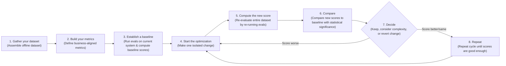
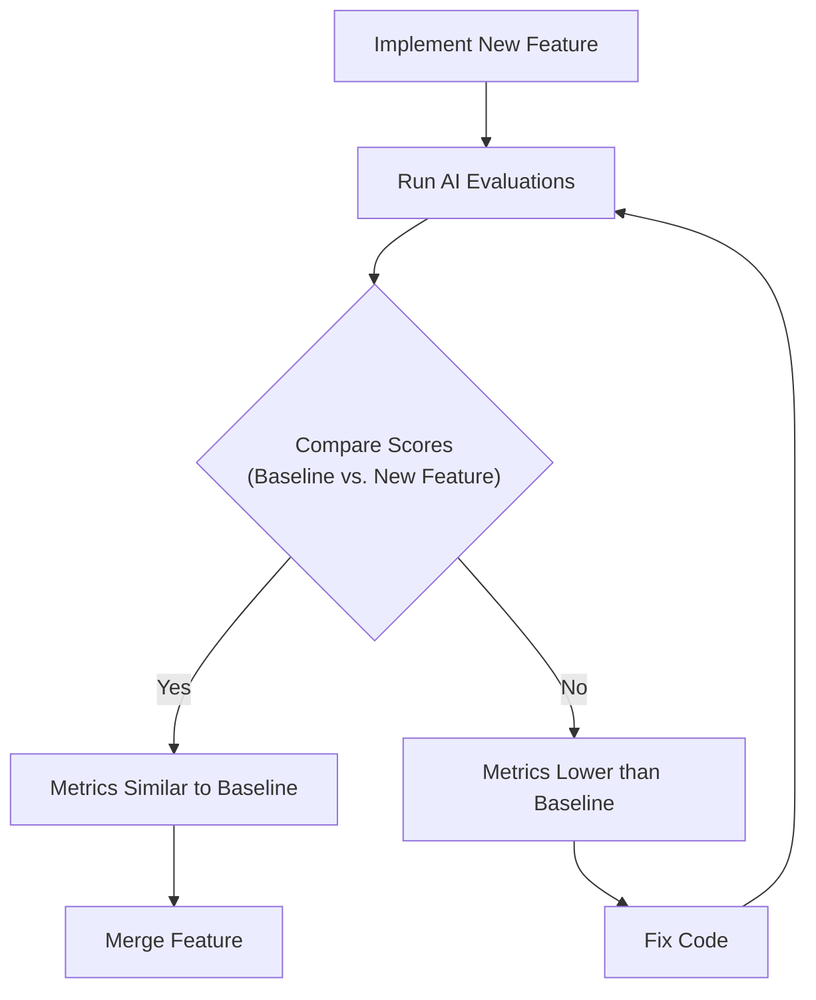

# AI Evals: From Vibe Checks to an Optimization Flywheel

In our previous lessons, we instrumented our agents with observability tools like Opik and learned how to build offline evaluation datasets from production traces and synthetic data. We now have the raw material for evaluation. The next logical step is to design the metrics that will give this data meaning. In classical machine learning, we rely on rigorous, well-understood standards like accuracy, precision, recall, and F1 scores. We demand statistical significance before declaring victory.

However, in AI engineering, the common practice is often a "vibe check." We run a few queries, look at the outputs, and if they "feel more coherent," we ship the change [[1]](https://olshansky.substack.com/p/vibe-checks-are-all-you-need). This reliance on intuition is a primary reason so many AI projects get stuck in proof-of-concept purgatory. Investing in a proper evaluation layer can feel difficult to prioritize. It delivers no immediate user-visible feature, requires upfront effort to design datasets and metrics, and competes with the pressure to ship [[2]](https://www.decodingai.com/p/escaping-poc-purgatory-evaluation). This is the vibe check trap: it’s unscalable, subjective, and statistically flawed for production systems [[3]](https://www.growthbook.io/blog/ai-evals-vs-a-b-testing-why-you-need-both-to-ship-genai).

Yet, this same investment is what accelerates long-term iteration. It gives you an objective signal on every change, catches regressions instantly, and focuses your effort on what matters. Evals are the north star of AI engineering: the single source of truth that tells you which modifications improve the system and which degrade it. They turn qualitative judgment into quantitative metrics, systematizing the vibe check so you can build reliable software on probabilistic foundations [[3]](https://www.growthbook.io/blog/ai-evals-vs-a-b-testing-why-you-need-both-to-ship-genai), [[4]](https://cloud.google.com/blog/topics/developers-practitioners/from-vibe-checks-to-continuous-evaluation-engineering-reliable-ai-agents).

In this lesson, we will cover the theoretical framework for building this system by exploring the optimization flywheel and its core use cases, the trade-offs between metric types for unstructured outputs, why custom business metrics are superior to benchmarks, and why binary judgments are more reliable than Likert scales. With the problem and its importance clear, we will now examine how to operationalize evals inside a repeatable optimization flywheel that replaces intuition with evidence.

## Using Evals Through the Optimization Flywheel

To build intuition, let's examine how we can effectively use and integrate AI evaluations into our application development lifecycle. There are three core scenarios where evaluations provide value.

First, evals **quantify the quality of your system**. They provide a snapshot of your system's current performance against a set of given metrics, establishing a baseline. This baseline is your objective measure of quality, answering the question, "How good is our system right now?" Without it, you cannot know if your system is production-ready or if your changes are actually improvements. It is the starting point for any systematic optimization effort [[5]](https://www.decodingai.com/p/stop-launching-ai-apps-without-this).

Second, these metrics serve as **guidance when optimizing your system**. By providing objective evidence for your experiments, they shift development from being intuition-based to evidence-based. You no longer have to guess if a prompt change worked; you can measure its impact precisely. This creates a virtuous cycle of continuous improvement, often called a data flywheel, where system behavior is captured, evaluated, and used to refine the model or application [[6]](https://www.nvidia.com/en-us/glossary/data-flywheel), [[7]](https://galileo.ai/blog/nvidia-data-flywheel-for-de-risking-agentic-ai).

Finally, evals act as **regression tests that protect shared components**. Unlike optimization, the goal here is stability. In complex AI systems, components like prompts, tool descriptions, and orchestration logic are often shared and interconnected. A small change in one area can cause unexpected failures in another. A robust evaluation suite, run automatically, guards against this by ensuring that improvements in one area do not cause regressions elsewhere. This is especially important for agentic applications, where complex, multi-step decision-making increases the potential points of failure [[7]](https://galileo.ai/blog/nvidia-data-flywheel-for-de-risking-agentic-ai).

### The Optimization Process

How does this look in a real-world scenario? We can follow a step-by-step plan for the optimization flywheel.

The process is an eight-step cycle:
1.  **Gather your dataset:** Assemble an offline dataset that represents the real-world scenarios your system will face. This dataset should be diverse, covering different features, user personas, and potential edge cases [[8]](https://hamel.dev/blog/posts/llm-judge/).
2.  **Build your metrics:** Define metrics that are aligned with your specific business goals and user success criteria. As we will see later, these should be custom, business-centric metrics, not generic ones.
3.  **Establish a baseline:** Run your evaluations on the current system to compute baseline scores for each metric. This score is your ground truth for all future comparisons.
4.  **Start the optimization:** Make one isolated change that you believe will improve performance, such as tweaking a prompt, changing a model parameter, or updating a retrieval strategy.
5.  **Compute the new score:** Re-evaluate the entire dataset by re-running the evals on the modified system. This ensures you are measuring the global impact of your change, not just its effect on a few cherry-picked examples.
6.  **Compare:** Compare the new scores to your baseline, assessing for statistical significance. This step tells you if the observed change is real or just random noise.
7.  **Decide:** Based on whether the score is better, the same, or worse, decide to keep the change, consider its complexity, or revert it. A small improvement might not be worth a large increase in complexity or cost.
8.  **Repeat:** Continue the cycle of making isolated changes and measuring their impact until your scores are good enough for production.

Image 1: The iterative optimization flywheel for AI applications using evaluations.

It is essential to change only one variable per cycle. If you modify the prompt, the chunking strategy, and the model all at once, you create confounding variables. It becomes impossible to attribute any score changes to a specific modification, turning your evidence-based process back into guesswork. This principle is directly borrowed from scientific methods like Randomized Controlled Trials (RCTs), the gold standard in product experimentation and clinical research. By changing only one variable, you isolate its effect and prevent other factors from becoming confounding variables that obscure the true cause of any performance change [[9]](https://www.statsig.com/perspectives/causal-inference-in-product-experimentation). When randomization is not possible, more advanced causal inference techniques can help, but the simplest and most robust starting point is disciplined, single-variable iteration [[10]](https://telnyx.com/learn-ai/casual-inference-explained).

Furthermore, you must anchor statistical significance to actual business impact, not arbitrary p-values. This is the difference between statistical significance and practical significance [[11]](https://arxiv.org/html/2605.02050v1). "Better" is always relative to the business use case. For a high-volume customer support bot, a 0.5% reduction in checkout errors might seem small. But if your product processes two million checkouts annually, that translates to 10,000 fewer failed transactions. If each failure costs $15 in lost revenue or support time, that tiny improvement is worth $150,000 per year [[12]](https://www.nngroup.com/articles/practical-significance). This calculation is a form of net benefit analysis, where you weigh the cost of misclassifications—like a false positive (unnecessary support cost) versus a false negative (lost customer)—to define a clear decision threshold for what "better" means for your bottom line [[13]](https://sarahgebauermd.substack.com/p/three-metrics-for-healthcare-ai-evaluation). In contrast, for a low-volume creative writing tool used internally, a similar percentage improvement might be statistically significant but practically negligible, not justifying the engineering effort [[14]](https://www.quirks.com/articles/effective-uses-of-effect-size-statistics-to-demonstrate-business-value).

### Regression Testing

The optimization flywheel can also be adapted for regression testing. Before merging any new feature that touches shared prompts, tool descriptions, or orchestration logic, you should run the full evaluation suite against your offline dataset to guard against breaking existing behavior. Running AI evaluations as regression tests is an extremely powerful technique to ensure new features do not degrade your system's performance.

This process can be simplified into five steps:
1.  **Implement a new feature:** You write the code and verify it works locally for the new use case. This is standard development practice.
2.  **Run the AI evaluations:** You run the full suite of assessments, covering all previous use cases, not just the new one. This is the crucial step that catches unintended side effects.
3.  **Compare Scores:** The new scores are compared against the established baseline for existing features.
4.  **Metrics similar to baseline:** If the scores are identical or within an acceptable tolerance of the baseline, your feature has not introduced a regression. You can merge it into your production codebase with confidence.
5.  **Metrics lower than the baseline:** If the scores are worse, you have introduced a regression. You must fix your code and repeat the evaluation cycle until the scores return to the baseline level.

Image 2: Integrating AI evaluations into CI pipelines for regression testing.

Unlike traditional unit or integration tests that have a strict pass/fail threshold, AI evals often compare scores against a moving baseline. The goal is to prevent degradation, not to enforce a fixed, absolute score. This allows for continuous improvement while maintaining stability.

Your evaluation dataset must be a living asset. It should continuously expand with new edge cases discovered during development, production failures captured via observability tools like Opik, and difficult examples that expose current failure modes [[15]](https://www.comet.com/docs/opik/evaluation/advanced/manage_datasets), [[16]](https://www.decodingai.com/p/generate-synthetic-datasets-for-ai-evals). In AI engineering, you do not just write new tests in code; you broaden your test coverage by adding new, challenging samples to your dataset. For instance, if you debug a production issue where the agent failed to handle a multi-part question, you should add that specific trace and several variations of it to your dataset to ensure the fix is robust and the regression never reoccurs.

With the flywheel mechanics clear, we can now examine the different families of metrics we might plug into it when dealing with unstructured outputs.

## Exploring Possible Metric Types

The core difficulty in evaluating AI systems is that we work with unstructured text, reasoning traces, or images. Unlike classical ML with structured labels, standard accuracy-style metrics are often unavailable.

There are three core families of metrics to consider.

### BLEU and ROUGE

N-gram overlap metrics like BLEU and ROUGE are the oldest and simplest. They count the overlap of words and short phrases (n-grams) between the generated output and a reference text [[17]](https://wandb.ai/ai-team-articles/llm-evaluation/reports/LLM-evaluation-benchmarking-Beyond-BLEU-and-ROUGE--VmlldzoxNTIzMTY0NQ), [[18]](https://medium.com/@sthanikamsanthosh1994/understanding-bleu-and-rouge-score-for-nlp-evaluation-1ab334ecadcb). BLEU includes a brevity penalty to avoid rewarding short sentences, while ROUGE has variants like ROUGE-L that measure the longest common subsequence to better account for word order [[19]](https://docs.galileo.ai/concepts/metrics/expression-and-readability/bleu-and-rouge).

Their main advantages are that they are fast, deterministic, and require no additional models. However, their limitations are severe. They are blind to semantic meaning and penalize correct answers that use different wording, a practice known as paraphrasing. For example, "The test was successful" would get a near-zero BLEU score if the reference is "The experiment succeeded," despite meaning the same thing.

They also cannot assess the quality of reasoning or factual accuracy [[17]](https://wandb.ai/ai-team-articles/llm-evaluation/reports/LLM-evaluation-benchmarking-Beyond-BLEU-and-ROUGE--VmlldzoxNTIzMTY0NQ). This makes them analogous to metrics like the F1 score in classification, which can be misleading because they ignore the real-world costs of different errors and can be gamed by models that do not actually make better decisions [[13]](https://sarahgebauermd.substack.com/p/three-metrics-for-healthcare-ai-evaluation).

### BERTScore

Embedding similarity metrics like BERTScore are a step up. They convert generated and reference texts into vector embeddings using a model like BERT, and the closeness of these vectors measures semantic similarity [[17]](https://wandb.ai/ai-team-articles/llm-evaluation/reports/LLM-evaluation-benchmarking-Beyond-BLEU-and-ROUGE--VmlldzoxNTIzMTY0NQ). This approach is better at capturing meaning than lexical methods but remains a comparison metric unable to verify complex business logic. It can also be more computationally expensive and inherit biases from the embedding model [[20]](https://www.evidentlyai.com/llm-guide/llm-as-a-judge).

### LLM Judges

The LLM-as-a-judge approach uses a capable LLM to evaluate an output based on detailed criteria. You provide the judge with the input, output, evaluation criteria, and often few-shot examples and chain-of-thought instructions [[21]](https://www.confident-ai.com/blog/why-llm-as-a-judge-is-the-best-llm-evaluation-method), [[22]](https://arize.com/llm-as-a-judge). This method is flexible, allowing you to evaluate subjective qualities like tone or adherence to complex guidelines. For example, a judge can check if a legal summary correctly identifies all relevant clauses.

The main advantage is their ability to provide detailed critiques tuned to specific business contexts. However, performance depends on the prompt and evaluator model. They can be slower, more expensive, and may inherit biases like position, verbosity, or self-enhancement if not carefully validated [[20]](https://www.evidentlyai.com/llm-guide/llm-as-a-judge), [[23]](https://cameronrwolfe.substack.com/p/llm-as-a-judge).

| Metric Family | Speed | Cost | Semantic Awareness | Business Alignment | Explainability |
| :--- | :--- | :--- | :--- | :--- | :--- |
| **BLEU/ROUGE** | Very Fast | Very Low | None | Very Low | High |
| **BERTScore** | Fast | Low | High | Low | Medium |
| **LLM Judges** | Slow | High | Very High | Very High | High |
Table 1: A comparison of trade-offs between different AI evaluation metric families.

For the complex requirements of our capstone writing agent, such as guideline adherence and research grounding, LLM judges are the most practical choice.

Now, you kept hearing from us: *"business metrics here, business metrics there"*. Thus, let's understand why defining your own business metrics is such an essential and underrated step in building your AI evals strategy.

## Why Business Metrics Over Benchmarks

It is a common mistake to look at popular leaderboards or open benchmarks to choose an LLM for a product. Benchmarks are often the most deceiving type of metric.

There are two core reasons for this. First, benchmarks often act as marketing artifacts. Once a test set becomes public, it is inevitable that it will leak into training data, intentionally or not. Teams begin to overfit to the benchmark, "teaching to the test" to climb the leaderboard [[24]](https://www.evidentlyai.com/llm-guide/llm-benchmarks), [[25]](https://world.hey.com/bhari/ai-benchmark-scores-are-becoming-marketing-dynamic-eval-is-the-only-antidote-dedd7053). There have been well-documented cases where models were fine-tuned on test sets to inflate their scores. This means the benchmark score no longer represents performance on unseen data, which is the entire point of evaluation. This overfitting can be subtle, where models learn the underlying reasoning patterns of a benchmark rather than developing generalizable skills, a phenomenon that recent research has started to quantify [[26]](https://openreview.net/forum?id=XbVMiW0jTM).

Second, there is a fundamental mismatch between typical benchmark tasks and real business workloads. A model’s ability to solve math problems from the GSM8k benchmark has little to do with its ability to perform long-form creative writing, nuanced legal analysis, or personalized customer support [[27]](https://magazine.sebastianraschka.com/p/llm-evaluation-4-approaches). This mirrors the requirement in high-stakes fields like medicine, where an algorithm must undergo external validation in the specific clinical environment where it will be used, not just in an artificial lab setting [[28]](https://pmc.ncbi.nlm.nih.gov/articles/PMC7909857). The proper role for benchmarks is narrow: they are useful for advancing research frontiers and for initial model filtering during early exploration, but they should never be the primary optimization target for a real product.

If benchmarks are misleading, generic prefab metrics that claim to measure universal qualities are even more dangerous. We must instead build metrics that are deeply tied to our specific application.

## Why Custom Business Metrics Over Generic Metrics

Generic, off-the-shelf metrics for qualities like "toxicity," "helpfulness," or "hallucination" are a mirage. They create a false sense of confidence by optimizing for the wrong signal, because they lack critical context about your product, your users, and your brand voice. A model can score brilliantly on a generic "helpfulness" metric but fail catastrophically on your specific constraints [[29]](https://www.linkedin.com/posts/shivanshu-aggarwal_evals-aievals-llm-activity-7375884554177449985-16kP). The core issue is that these metrics lack a clear focus on decision-analytical performance. As research from medical AI evaluation shows, a metric is only useful if it measures whether using the model leads to better decisions in a specific context. Generic scores conflate statistical performance with business utility without properly accounting for what different errors actually cost your business [[13]](https://sarahgebauermd.substack.com/p/three-metrics-for-healthcare-ai-evaluation).

Consider the dashboard below. It looks impressive, with scores for "Truthfulness" and "Personalization." But what does a 3.7 in "Personalization" actually mean? How do you improve it? These abstract scores are often unactionable.
Image 3: A dashboard showing generic metrics like Helpfulness and Truthfulness, labeled "Don't Do This!" (Source: [Decoding AI](https://www.decodingai.com/p/the-5-star-lie-you-are-doing-ai-evals)).

Let's assume we want to check if the article written by our Brown agent contains hallucinations. If we use a generic `hallucination` score and it returns "positive," what does that tell us? Did it add information not present in the research? Did it deviate from the article guidelines? Or did it simply include a personal story that was not in the source text but is factually correct and relevant? The generic metric cannot distinguish between undesirable invention and desirable creative elaboration. For a legal-tech app, inventing a non-existent case is a critical failure. For a creative writing assistant, inventing a fictional character might be a feature.

Prefab scores are limited because they lack domain-specific constraints, cannot localize which part of an output failed, and introduce statistical noise. Their only valid role is during exploratory data analysis, where they can act as a "flashlight" to surface interesting examples for manual review, not as a "report card" for grading quality [[30]](https://www.decodingai.com/p/the-mirage-of-generic-ai-metrics).

Here are a few useful examples of using generic metrics for exploration:
1.  **Verbosity:** Sort your outputs by length. This can help reveal if your most verbose answers are rambling and unhelpful, or if your shortest answers are curt and missing information. This is a simple way to find potential failure modes in long-form generation.
2.  **Similarity Score:** Use this to evaluate your RAG retriever specifically. If the similarity between the user query and the retrieved chunks is low, your retriever is likely failing to find relevant information. This is a valid and powerful component-level check.
3.  **BERTScore:** Use this to check the quality of your "golden" reference answers. If you find a cluster of outputs with a low BERTScore against a reference you expected to be similar, it might be that the LLM found a more creative or even better way to solve the problem than your reference answer.

In all these cases, the generic metric is the start of an investigation, not the final verdict. Every production metric must be application-centric, derived from your product requirements, user success criteria, and explicit constraints.

Once we have rejected both benchmarks and generic metrics, the remaining design choice is how to elicit judgments from our LLM judge. Here, binary pass/fail criteria outperform every alternative.

## Choosing Binary Metrics Over Anything Else

When designing custom metrics, you can use a Likert scale (e.g., 1-5 stars) or a binary pass/fail judgment. We strongly recommend **binary metrics**.

Likert scales promise nuance but often deliver noise. They suffer from three main problems:
1.  **Inconsistent Labeling:** The difference between a '3' and a '4' is subjective, leading to low inter-annotator agreement and debates over the rubric [[31]](https://www.decodingai.com/p/the-5-star-lie-you-are-doing-ai-evals).
2.  **Statistical Noise:** Detecting a real improvement (e.g., from 3.2 to 3.4) requires a much larger sample size than for a binary pass rate, making it hard to distinguish progress from random fluctuations [[32]](https://www.ellamind.com/blog/binary-vs-likert-scales). The continuous scale introduces more entropy, or uncertainty, obscuring the signal [[33]](https://arxiv.org/html/2602.07168).
3.  **Lazy Decision-Making:** Evaluators often default to the middle value ('3') to avoid a difficult decision. This "satisficing" behavior hides uncertainty, leaving you with a vague signal about what to fix [[31]](https://www.decodingai.com/p/the-5-star-lie-you-are-doing-ai-evals).

Binary evaluations work because they **force decisions**. This approach mirrors the concept of **quality gates** in traditional software engineering, where an automated, binary pass/fail checkpoint enforces a predefined standard [[34]](https://www.softwareseni.com/building-quality-gates-for-ai-generated-code-with-practical-implementation-strategies). They solve these problems by demanding clarity, and the benefits are immediate:
1.  **Clearer Thinking:** You cannot label an output as "Fail" without knowing why, which forces precise definitions of quality.
2.  **Consistency:** Binary decisions are faster and more consistent for both human annotators and LLM judges.
3.  **Actionability:** The output is a clear signal tied to a specific problem. A spike in the "Constraint Violation" failure rate tells an engineer exactly where to start debugging.

<aside>
💡

**Note:** The points above translate exceptionally well to LLM Judges. Using binary scoring is a key design choice to mitigate the inherent randomness of LLMs. LLMs are much more stable when asked to make a binary decision than when asked to assign a scalar value. A binary metric translates to a more robust and repeatable evaluation pipeline.

</aside>

### Capturing Nuance

The standard objection to binary evals is, "But I'm losing nuance! A 1-5 scale captures shades of gray." This is a valid concern, but a Likert scale is the wrong solution. The right way to capture nuance is not by making your scale fuzzier, but by making your criteria more **granular**.

Instead of a single, subjective rating for a complex quality, you should break it down into multiple, specific, binary checks. For our writing agent, instead of rating an article 1-5 for "Quality," we can create multiple binary evaluations for specific dimensions:
1.  **Content Adherence:** Does the generated article contain the same core concepts as the expected article? (Yes/No)
2.  **Flow of Ideas Adherence:** Does the generated article present ideas in the same order as the expected article? (Yes/No)
3.  **Article Guideline Adherence:** Does the generated article follow the flow of ideas from the article guideline input? (Yes/No)
4.  **Research Anchoring:** Is every claim in the article supported by the provided research? (Yes/No)

By aggregating these binary signals, you get a nuanced, multi-dimensional view of performance without the noise and ambiguity of a Likert scale. This approach is simple, intuitive, scalable, and robust enough for production systems.

With the full theoretical picture in place, we can now summarize the mindset shift required and preview the hands-on implementation that follows in the next lesson.

## Conclusion

The path to building reliable AI products requires a fundamental shift in mindset: from vibe checks, leaderboards, and generic scores to a rigorous, evaluation-driven development process. This process must be built on a foundation of custom, binary, and business-aligned metrics that provide a clear and actionable signal for improvement.

Granular pass/fail criteria deliver the strongest optimization signal while avoiding the statistical noise and subjectivity inherent in scalar ratings. This is how you move from building prototypes to shipping AI that works. In our next lesson, we will translate this theory into practice by implementing custom LLM judges from scratch to evaluate our Brown writing workflow.

## References

- [1] Olshansky, D. (2024, February 27). *Vibe Checks Are All You Need*. [https://olshansky.substack.com/p/vibe-checks-are-all-you-need](https://olshansky.substack.com/p/vibe-checks-are-all-you-need)
- [2] Iusztin, P., Bowne-Anderson, H., & Krawczyk, S. (2025, October 16). *Escaping POC Purgatory: Evaluation-Driven Development for AI Systems*. Decoding AI. [https://www.decodingai.com/p/escaping-poc-purgatory-evaluation](https://www.decodingai.com/p/escaping-poc-purgatory-evaluation)
- [3] GrowthBook. (n.d.). *AI Evals vs A/B Testing: Why You Need Both to Ship GenAI*. [https://www.growthbook.io/blog/ai-evals-vs-a-b-testing-why-you-need-both-to-ship-genai](https://www.growthbook.io/blog/ai-evals-vs-a-b-testing-why-you-need-both-to-ship-genai)
- [4] Google Cloud. (n.d.). *From vibe checks to continuous evaluation: engineering reliable AI agents*. [https://cloud.google.com/blog/topics/developers-practitioners/from-vibe-checks-to-continuous-evaluation-engineering-reliable-ai-agents](https://cloud.google.com/blog/topics/developers-practitioners/from-vibe-checks-to-continuous-evaluation-engineering-reliable-ai-agents)
- [5] Bowne-Anderson, H. (2025, October 30). *Stop Launching AI Apps Without This Framework*. Decoding AI. [https://www.decodingai.com/p/stop-launching-ai-apps-without-this](https://www.decodingai.com/p/stop-launching-ai-apps-without-this)
- [6] NVIDIA. (n.d.). *What Is a Data Flywheel?*. [https://www.nvidia.com/en-us/glossary/data-flywheel](https://www.nvidia.com/en-us/glossary/data-flywheel)
- [7] Galileo. (n.d.). *A Powerful Data Flywheel for De-Risking Agentic AI*. [https://galileo.ai/blog/nvidia-data-flywheel-for-de-risking-agentic-ai](https://galileo.ai/blog/nvidia-data-flywheel-for-de-risking-agentic-ai)
- [8] Husain, H. (2025, November 13). *Using LLM-as-a-Judge For Evaluation: A Complete Guide*. Hamel's Blog. [https://hamel.dev/blog/posts/llm-judge/](https://hamel.dev/blog/posts/llm-judge/)
- [9] Statsig. (n.d.). *Causal inference in product experimentation*. [https://www.statsig.com/perspectives/causal-inference-in-product-experimentation](https://www.statsig.com/perspectives/causal-inference-in-product-experimentation)
- [10] Telnyx. (n.d.). *Causal Inference Explained*. [https://telnyx.com/learn-ai/casual-inference-explained](https://telnyx.com/learn-ai/casual-inference-explained)
- [11] Benjamin, D. J., et al. (2026). *Beyond "Statistical Significance": A Graded Approach to Interpreting Evidence in AI Evaluation*. arXiv. [https://arxiv.org/html/2605.02050v1](https://arxiv.org/html/2605.02050v1)
- [12] Nielsen Norman Group. (n.d.). *Practical vs. Statistical Significance*. [https://www.nngroup.com/articles/practical-significance](https://www.nngroup.com/articles/practical-significance)
- [13] Gebauer, S. (2024). *Three Metrics for Healthcare AI Evaluation You Need to Know*. Substack. [https://sarahgebauermd.substack.com/p/three-metrics-for-healthcare-ai-evaluation](https://sarahgebauermd.substack.com/p/three-metrics-for-healthcare-ai-evaluation)
- [14] Quirk's. (n.d.). *Effective uses of effect size statistics to demonstrate business value*. [https://www.quirks.com/articles/effective-uses-of-effect-size-statistics-to-demonstrate-business-value](https://www.quirks.com/articles/effective-uses-of-effect-size-statistics-to-demonstrate-business-value)
- [15] Comet. (n.d.). *Manage datasets*. [https://www.comet.com/docs/opik/evaluation/advanced/manage_datasets](https://www.comet.com/docs/opik/evaluation/advanced/manage_datasets)
- [16] Iusztin, P. (2025, September 24). *Generate Synthetic Datasets for AI Evals*. Decoding AI. [https://www.decodingai.com/p/generate-synthetic-datasets-for-ai-evals](https://www.decodingai.com/p/generate-synthetic-datasets-for-ai-evals)
- [17] Ferrer, J. (2025, December 9). *LLM evaluation benchmarking: Beyond BLEU and ROUGE*. Weights & Biases. [https://wandb.ai/ai-team-articles/llm-evaluation/reports/LLM-evaluation-benchmarking-Beyond-BLEU-and-ROUGE--VmlldzoxNTIzMTY0NQ](https://wandb.ai/ai-team-articles/llm-evaluation/reports/LLM-evaluation-benchmarking-Beyond-BLEU-and-ROUGE--VmlldzoxNTIzMTY0NQ)
- [18] Sthanikam, S. (2023, May 15). *Understanding BLEU and ROUGE score for NLP evaluation*. Medium. [https://medium.com/@sthanikamsanthosh1994/understanding-bleu-and-rouge-score-for-nlp-evaluation-1ab334ecadcb](https://medium.com/@sthanikamsanthosh1994/understanding-bleu-and-rouge-score-for-nlp-evaluation-1ab334ecadcb)
- [19] Galileo. (n.d.). *BLEU and ROUGE*. [https://docs.galileo.ai/concepts/metrics/expression-and-readability/bleu-and-rouge](https://docs.galileo.ai/concepts/metrics/expression-and-readability/bleu-and-rouge)
- [20] Evidently AI. (n.d.). *LLM-as-a-judge: a complete guide to using LLMs for evaluations*. [https://www.evidentlyai.com/llm-guide/llm-as-a-judge](https://www.evidentlyai.com/llm-guide/llm-as-a-judge)
- [21] Confident AI. (n.d.). *Why LLM-as-a-Judge is The Best LLM Evaluation Method*. [https://www.confident-ai.com/blog/why-llm-as-a-judge-is-the-best-llm-evaluation-method](https://www.confident-ai.com/blog/why-llm-as-a-judge-is-the-best-llm-evaluation-method)
- [22] Arize AI. (n.d.). *LLM-as-a-Judge*. [https://arize.com/llm-as-a-judge](https://arize.com/llm-as-a-judge)
- [23] Wolfe, C. (2024, January 29). *LLM as a Judge*. Substack. [https://cameronrwolfe.substack.com/p/llm-as-a-judge](https://cameronrwolfe.substack.com/p/llm-as-a-judge)
- [24] Evidently AI. (n.d.). *LLM benchmarks: 30+ LLM evaluation benchmarks*. [https://www.evidentlyai.com/llm-guide/llm-benchmarks](https://www.evidentlyai.com/llm-guide/llm-benchmarks)
- [25] Hari, B. (2026, April 26). *AI — Benchmark scores are becoming marketing; dynamic eval is the only antidote*. HEY World. [https://world.hey.com/bhari/ai-benchmark-scores-are-becoming-marketing-dynamic-eval-is-the-only-antidote-dedd7053](https://world.hey.com/bhari/ai-benchmark-scores-are-becoming-marketing-dynamic-eval-is-the-only-antidote-dedd7053)
- [26] PROBE: BENCHMARKING REASONING PARADIGM OVERFITTING IN LARGE LANGUAGE MODELS. (2024). *OpenReview*. [https://openreview.net/forum?id=XbVMiW0jTM](https://openreview.net/forum?id=XbVMiW0jTM)
- [27] Raschka, S. (2024, January 23). *4 Approaches for LLM Evaluation*. Ahead of AI. [https://magazine.sebastianraschka.com/p/llm-evaluation-4-approaches](https://magazine.sebastianraschka.com/p/llm-evaluation-4-approaches)
- [28] Park, S. Y., et al. (2021). *Evaluation of artificial intelligence-based medical devices: a review of the clinical-trial and regulatory landscape*. *Journal of Korean Medical Science*. [https://pmc.ncbi.nlm.nih.gov/articles/PMC7909857](https://pmc.ncbi.nlm.nih.gov/articles/PMC7909857)
- [29] Aggarwal, S. (2024, October 21). *AI evaluation is broken when we hide behind generic metrics*. LinkedIn. [https://www.linkedin.com/posts/shivanshu-aggarwal_evals-aievals-llm-activity-7375884554177449985-16kP](https://www.linkedin.com/posts/shivanshu-aggarwal_evals-aievals-llm-activity-7375884554177449985-16kP)
- [30] Husain, H. (2025, October 19). *The Mirage of Generic AI Metrics*. Decoding AI. [https://www.decodingai.com/p/the-mirage-of-generic-ai-metrics](https://www.decodingai.com/p/the-mirage-of-generic-ai-metrics)
- [31] Iusztin, P. (2025, October 12). *The 5-Star Lie: You’re Doing AI Evaluations Wrong*. Decoding AI. [https://www.decodingai.com/p/the-5-star-lie-you-are-doing-ai-evals](https://www.decodingai.com/p/the-5-star-lie-you-are-doing-ai-evals)
- [32] Ellamind. (n.d.). *Binary vs. Likert Scales in AI Evaluation*. [https://www.ellamind.com/blog/binary-vs-likert-scales](https://www.ellamind.com/blog/binary-vs-likert-scales)
- [33] Medrano, F., et al. (2026). *An Information-Theoretic Framework for Quality Assessment in Image Processing*. arXiv. [https://arxiv.org/html/2602.07168](https://arxiv.org/html/2602.07168)
- [34] SoftwareSeni. (n.d.). *Building Quality Gates for AI-Generated Code with Practical Implementation Strategies*. [https://www.softwareseni.com/building-quality-gates-for-ai-generated-code-with-practical-implementation-strategies](https://www.softwareseni.com/building-quality-gates-for-ai-generated-code-with-practical-implementation-strategies)
- [35] Yan, E. (2025, November 20). *Evaluating the Effectiveness of LLM-Evaluators (aka LLM-as-Judge)*. Eugene Yan. [https://eugeneyan.com/writing/llm-evaluators/](https://eugeneyan.com/writing/llm-evaluators/)
- [36] LaunchDarkly. (n.d.). *A practical guide to LLM evaluation*. [https://launchdarkly.com/blog/llm-evaluation](https://launchdarkly.com/blog/llm-evaluation)
- [37] Bean, S., et al. (2025). *Benchmarking LLM Agents for Public Sector Applications*. arXiv. [https://arxiv.org/html/2601.20617v1](https://arxiv.org/html/2601.20617v1)
- [38] Belz, A., et al. (2025). *On the Validity and Consistency of Validation for Open-ended Text Generation*. arXiv. [https://arxiv.org/html/2508.13816v1](https://arxiv.org/html/2508.13816v1)
- [39] Galileo. (n.d.). *Human Evaluation Metrics in AI*. [https://galileo.ai/blog/human-evaluation-metrics-ai](https://galileo.ai/blog/human-evaluation-metrics-ai)
- [40] Toloka. (n.d.). *LLM Evaluation in 2024: From Classic Metrics to Modern Methods*. [https://toloka.ai/blog/llm-evaluation-from-classic-metrics-to-modern-methods](https://toloka.ai/blog/llm-evaluation-from-classic-metrics-to-modern-methods)
- [41] Platt, J. (2006). *Sequential Minimal Optimization for SVM*. JMLR. [http://www.jmlr.org/papers/volume7/MLOPT-intro06a/MLOPT-intro06a.pdf](http://www.jmlr.org/papers/volume7/MLOPT-intro06a/MLOPT-intro06a.pdf)
- [42] Traceloop. (n.d.). *Demystifying the BLEU Metric*. [https://www.traceloop.com/blog/demystifying-the-bleu-metric](https://www.traceloop.com/blog/demystifying-the-bleu-metric)
- [43] Elastic. (n.d.). *Evaluating RAG: A practical guide to metrics*. [https://www.elastic.co/search-labs/blog/evaluating-rag-metrics](https://www.elastic.co/search-labs/blog/evaluating-rag-metrics)
- [44] Arize AI. (2024, February 21). *LLM as a Judge: When to Use Reasoning (CoT) and Explanations*. Medium. [https://medium.com/data-science-collective/llm-as-a-judge-when-to-use-reasoning-cot-and-explanations-964ad82ebc3d](https://medium.com/data-science-collective/llm-as-a-judge-when-to-use-reasoning-cot-and-explanations-964ad82ebc3d)
- [45] Arize AI. (n.d.). *Evidence-Based Prompting Strategies for LLM-as-a-Judge: Explanations and Chain-of-Thought*. [https://arize.com/blog/evidence-based-prompting-strategies-for-llm-as-a-judge-explanations-and-chain-of-thought](https://arize.com/blog/evidence-based-prompting-strategies-for-llm-as-a-judge-explanations-and-chain-of-thought)
- [46] Braintrust. (n.d.). *What is LLM-as-a-Judge?*. [https://www.braintrust.dev/articles/what-is-llm-as-a-judge](https://www.braintrust.dev/articles/what-is-llm-as-a-judge)
- [47] Mehri, S., et al. (2024). *VibeCheck: A Self-Supervised Metric for Open-ended Text Generation*. arXiv. [https://arxiv.org/html/2410.12851v1](https://arxiv.org/html/2410.12851v1)
- [48] Towards Data Science. (n.d.). *Stop Evaluating LLMs with Vibe Checks*. [https://towardsdatascience.com/stop-evaluating-llms-with-vibe-checks](https://towardsdatascience.com/stop-evaluating-llms-with-vibe-checks)
- [49] Corporate Finance Institute. (n.d.). *Statistical Significance*. [https://corporatefinanceinstitute.com/resources/data-science/statistical-significance](https://corporatefinanceinstitute.com/resources/data-science/statistical-significance)
- [50] Statsig. (n.d.). *Understanding Statistical Significance*. [https://www.statsig.com/perspectives/understanding-statistical-significance](https://www.statsig.com/perspectives/understanding-statistical-significance)
- [51] CloudResearch. (n.d.). *What Is Statistical Significance?*. [https://www.cloudresearch.com/resources/guides/statistical-significance/what-is-statistical-significance](https://www.cloudresearch.com/resources/guides/statistical-significance)
- [52] Galileo. (n.d.). *LLM as a Judge vs. Human Evaluation*. [https://galileo.ai/blog/llm-as-a-judge-vs-human-evaluation](https://galileo.ai/blog/llm-as-a-judge-vs-human-evaluation)
- [53] Abdella, A. (2024, May 14). *LLM as a Judge*. LinkedIn. [https://www.linkedin.com/posts/allaabdella_llm-aijudge-genai-activity-7353053642590932994-s3sw](https://www.linkedin.com/posts/allaabdella_llm-aijudge-genai-activity-7353053642590932994-s3sw)
- [54] Masood, A. (2024, February 26). *Rubric-Based Evals & LLM-as-a-Judge: Methodologies and Empirical Validation in Domain Context*. Medium. [https://medium.com/@adnanmasood/rubric-based-evals-llm-as-a-judge-methodologies-and-empirical-validation-in-domain-context-71936b989e80](https://medium.com/@adnanmasood/rubric-based-evals-llm-as-a-judge-methodologies-and-empirical-validation-in-domain-context-71936b989e80)
- [55] Scribbr. (n.d.). *Likert Scale: What It Is & How to Use It*. [https://www.scribbr.com/methodology/likert-scale](https://www.scribbr.com/methodology/likert-scale)
- [56] InMoment. (n.d.). *What is a Likert Scale?*. [https://inmoment.com/blog/likert-scale](https://inmoment.com/blog/likert-scale)
- [57] Plain English. (2023, September 20). *Evaluating NLP Models: A Comprehensive Guide to ROUGE, BLEU, METEOR, and BERTScore Metrics*. [https://plainenglish.io/blog/evaluating-nlp-models-a-comprehensive-guide-to-rouge-bleu-meteor-and-bertscore-metrics-d0f1b1](https://plainenglish.io/blog/evaluating-nlp-models-a-comprehensive-guide-to-rouge-bleu-meteor-and-bertscore-metrics-d0f1b1)
- [58] Datumo. (n.d.). *Key NLP Evaluation Metrics*. [https://datumo.com/en/blog/insight/key-nlp-evaluation-metrics/](https://datumo.com/en/blog/insight/key-nlp-evaluation-metrics/)
- [59] Spot Intelligence. (2024, August 20). *BERTScore explained: A modern metric for evaluating text generation*. [https://spotintelligence.com/2024/08/20/bertscore/](https://spotintelligence.com/2024/08/20/bertscore/)

</article>