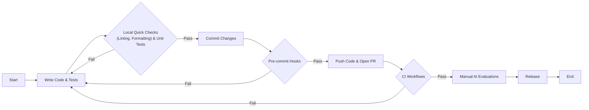

# Continuous Integration for AI Agents: From Prototypes to Production

In recent lessons, we covered observability with Opik and evaluation-driven development, giving you the visibility needed to build reliable systems. Now, we shift to Continuous Integration (CI): the automated infrastructure that keeps your codebase maintainable and prevents regressions from reaching production. We will define what CI means in an AI context and introduce a three-tier model that solves the unique challenges of testing non-deterministic agentic systems.

## What is Continuous Integration?

Continuous Integration (CI) is the practice of frequently merging code changes from multiple developers into a shared repository. Each merge triggers an automated build and test sequence, which catches integration issues early and prevents the classic "it works on my machine" problem [[43]](https://www.atlassian.com/continuous-delivery/continuous-integration). While this is standard practice in traditional software development, AI agent codebases introduce unique challenges that require a different approach.

Traditional CI focuses on deterministic logic. It checks if code compiles, passes unit tests with predictable outputs, and adheres to style guidelines. AI agents, however, are non-deterministic. Their behavior is shaped by LLM calls that can produce different outputs even for the same input, making traditional pass/fail tests unreliable [[2]](https://www.guild.ai/glossary/non-deterministic-systems). Furthermore, AI development involves rapid iteration on prompts, which can silently break agent behavior in unexpected ways. Running a full suite of evaluations on every small change is often impractical due to the high cost and latency of LLM API calls.

Without a CI system tailored for AI, teams often face three common failure modes:

1.  **Inconsistent code formatting across the team.** When team members use different formatters or apply formatting manually, the result is cluttered code. This leads to time-wasting code reviews focused on style nitpicks instead of logic and architecture.
2.  **Skipped pre-commit checks, leading to CI failures.** Under pressure to deliver features quickly, developers might forget to run local test suites before pushing code. Without automated enforcement, this leads to broken builds in the main branch, blocking the rest of the team.
3.  **Non-deterministic tests that call real LLM APIs.** Writing tests that rely on live LLM calls is a recipe for disaster. These tests are slow, expensive, and flaky. They fail unpredictably due to model variability or rate limits, slowing down the development cycle and eroding trust in the test suite [[1]](https://galileo.ai/blog/continuous-integration-ci-ai-fundamentals), [[32]](https://datagrid.com/blog/4-frameworks-test-non-deterministic-ai-agents).

To address these challenges, we use a three-tier model that calibrates our automated checks by cost and speed.

*   **Tier 1: Formatting and Linting (Always Run).** These checks are fast, taking only seconds to run, and cheap, as they involve no API calls. They catch syntactic issues and enforce style consistency across the codebase. This tier is identical to traditional CI.
*   **Tier 2: Unit and Integration Tests (Always Run).** These tests verify the deterministic logic of your agent, such as data parsing, schema validation, and routing, without calling external APIs. By mocking LLM responses, these tests run quickly (typically under a minute) and reliably, ensuring that the core components of your agent work as expected.
*   **Tier 3: AI Evaluations (Manual/Release).** This tier is unique to AI systems. It involves running expensive, LLM-based quality checks that use real API calls to evaluate your agent's performance on a curated dataset [[14]](https://kinde.com/learn/ai-for-software-engineering/ai-devops/ci-cd-for-evals-running-prompt-and-agent-regression-tests-in-github-actions). We run these evaluations selectively, either manually before a major release or automatically after a significant change to a prompt or model.

<https://images.spr.so/cdn-cgi/imagedelivery/j42No7y-dcokJuNgXeA0ig/6bf41859-7dd2-4a23-9a88-55720f54114e/image/w=1920,quality=90,fit=scale-down>
Image 1: A three-tier CI model for AI agents, showing the flow from commit checks to PR tests and finally to manual/release AI evaluations, with each tier distinctly colored.

The AI evaluations in Tier 3, which we built in previous lessons using our offline datasets and Opik traces, act as regression tests for semantic quality. They catch performance drops that traditional unit tests structurally cannot detect, such as a decline in helpfulness or an increase in hallucinations.

This lesson covers the CI essentials for building production-ready AI agents. We focus on practical techniques you will use daily: automated quality checks, testing with mocked LLMs, and structuring CI pipelines around cost constraints. We will not cover comprehensive DevOps topics like Kubernetes or Terraform. Instead, we will show you how to effectively move from a prototype to a production-ready agent.

We will cover:
*   Setting up pre-commit hooks to enforce code quality automatically.
*   Configuring Ruff for linting and formatting.
*   Writing unit tests for deterministic agent code with mocked LLM responses.
*   Building a CI pipeline that runs automatically on every change.
*   Using AI evaluations as selective regression tests in CI.

This lesson includes a hands-on notebook where you will practice running formatting checks, linting, and tests on Brown, our writing agent. With the three-tier model established, the fastest feedback comes from running the first tier locally before you even commit code. This is where pre-commit hooks come in.

## Pre-commit Hooks: Automated Local Guardrails

Pre-commit hooks are local guardrails that run automatically every time you make a commit [[25]](https://pre-commit.com/). They provide immediate feedback on your changes, catching issues like formatting errors or failing tests before the code ever reaches the shared repository. This tight feedback loop is crucial for maintaining code quality without slowing down development [[22]](https://blog.gitguardian.com/automated-guard-rails-for-vibe-coding).

The `pre-commit` framework manages these Git hooks using a declarative YAML configuration. You define the hooks you want to use in a `.pre-commit-config.yaml` file, and the framework handles their installation and execution. Hooks are typically references to external repositories, which allows the community to maintain and update them for popular tools. A key advantage of the framework is its ability to manage isolated environments for each hook, so you can use tools written in different languages (like Node.js or Ruby) without polluting your project's main environment [[25]](https://pre-commit.com/).

### Brown’s Pre-commit Configuration

<aside>
💡
You can experiment with the code for this lesson in this [Colab](https://colab.research.google.com/github/louisfb01/agent-course-notebooks/blob/main/notebooks/lesson_31_notebook.ipynb#scrollTo=b30eba1a). Alternatively, you can find the code for this lesson in the notebook for Lesson 31 of the course GitHub repository.
</aside>

In our writing agent, Brown, we use a few key hooks to automate our local checks. The configuration is defined in `lessons/writing_workflow/.pre-commit-config.yaml`:

```yaml
fail_fast: false

repos:
  - repo: https://github.com/abravalheri/validate-pyproject
    rev: v0.24.1
    hooks:
      - id: validate-pyproject

  - repo: https://github.com/pre-commit/mirrors-prettier
    rev: v3.1.0
    hooks:
      - id: prettier
        types_or: [yaml, json5]

  - repo: https://github.com/astral-sh/ruff-pre-commit
    # Ruff version. Keep in sync with the CI workflows (.github/workflows/*.yml).
    rev: v0.14.6
    hooks:
      # Run the linter.
      - id: ruff-check
        args: [--fix, --exit-non-zero-on-fix]
      # Run the formatter.
      - id: ruff-format
```

Let's walk through each of these hooks:

*   **`validate-pyproject`**: This tool validates that your `pyproject.toml` file is structurally correct according to PEP standards. A malformed `pyproject.toml` file can break your entire project, so this check is a simple but important safeguard.
*   **`prettier`**: A popular code formatter that we use for configuration files like `.github/workflows/ci.yml`. Enforcing consistent formatting makes these files more readable and helps reduce merge conflicts.
*   **`ruff-check` and `ruff-format`**: These hooks run Ruff, a modern Python linter and formatter. The `--fix` flag automatically corrects any fixable issues, and `--exit-non-zero-on-fix` ensures the hook fails even after auto-fixing. This forces you to review the changes made by the hook and re-stage them, ensuring you are aware of what is being committed. As recommended by Ruff’s authors, the `ruff-check` hook runs before `ruff-format`.

### Setting Up Pre-commit

In the `lessons/writing_workflow` repo, you can set up pre-commit hooks with these commands:

```bash
# Install dependencies (includes pre-commit)
uv sync --dev

# Install the Git hooks
pre-commit install
```

The `pre-commit install` command creates a Git hook at `.git/hooks/pre-commit`. Now, every time you run `git commit`, pre-commit will run automatically. You can also run the hooks manually on all files in the repository:

```bash
# Run all hooks on all files
make pre-commit
```

The daily workflow is simple: make your code changes, stage them with `git add`, and then run `git commit`. If any of the hooks fail, you will see the errors in your terminal. You can then review the issues, fix them, re-stage the files, and commit again. This immediate feedback loop ensures that code quality is maintained continuously, rather than being addressed in a painful, batch process during code review.

Pre-commit hooks often rely on fast tools like Ruff to do the actual work. Next, we will examine Ruff in depth and show how to configure and run it both locally and in CI.

## Ruff: Fast Python Linting and Formatting

Ruff is a high-speed Python linter and formatter written in Rust. It replaces a host of older tools like Black, isort, Flake8, and pydocstyle with a single, consolidated binary. Its performance is a game-changer, delivering sub-second feedback even on large codebases, which makes it ideal for use in pre-commit hooks and CI pipelines [[28]](https://docs.astral.sh/ruff).

It is important to distinguish between formatting and linting:

*   **Formatting** automatically rewrites your code to follow consistent style rules, such as line length, indentation, and quote style. It is opinionated and designed to be run without manual intervention.
*   **Linting** analyzes your code for bugs, suspicious patterns, and violations of best practices. This includes issues like unused variables, missing imports, and overly complex code that could be simplified.

By combining these functions, Ruff simplifies your toolchain significantly. Instead of managing separate configurations and dependencies for Black, isort, and Flake8, you configure everything in one place. This consolidation eliminates version conflicts between tools and dramatically reduces CI setup and run times. The speed improvement is not trivial; Ruff can be 10-100x faster than running these legacy tools individually, turning a multi-minute CI step into a matter of seconds [[28]](https://docs.astral.sh/ruff).

### Brown’s Ruff Configuration

Ruff is configured in the `pyproject.toml` file. Here is the configuration from `lessons/writing_workflow/pyproject.toml`:

```toml
[tool.ruff]
target-version = "py312"
line-length = 140

[tool.ruff.lint]
select = [
    "F",    # Pyflakes
    "E",    # pycodestyle errors
    "I",    # isort
]

[tool.ruff.lint.isort]
known-first-party = ["src", "tests"]

[tool.pytest.ini_options]
pythonpath = ["src"]
markers = [
    "integration: end-to-end workflow tests (mocked LLMs, no network). Select with `-m integration` or skip with `-m 'not integration'`.",
]
```

Here’s what each key does:
*   `target-version = "py312"` tells Ruff to apply rules compatible with Python 3.12 syntax.
*   `line-length = 140` sets the maximum line length for both the formatter and linter.
*   `select = ["F", "E", "I"]` enables specific rule sets: `F` for common bugs (Pyflakes), `E` for PEP 8 style violations (pycodestyle), and `I` for import sorting (isort) [[27]](https://docs.astral.sh/ruff/faq).
*   `known-first-party = ["src", "tests"]` helps the import sorter correctly group project-specific imports separately from third-party libraries.

We also provide convenient shortcuts in our `Makefile` for running these checks:

```makefile
# --- Tests & QA ---

tests: # Run tests.
	CONFIG_FILE=configs/debug.yaml uv run pytest

pre-commit: # Run pre-commit hooks.
	uv run pre-commit run --all-files

format-fix: # Auto-format Python code using ruff formatter.
	uv run ruff format $(QA_FOLDERS)

lint-fix: # Auto-fix linting issues using ruff linter.
	uv run ruff check --fix $(QA_FOLDERS)

format-check: # Check code formatting without making changes using ruff formatter.
	uv run ruff format --check $(QA_FOLDERS) 

lint-check: # Check code for linting issues without fixing them using ruff linter.
	uv run ruff check $(QA_FOLDERS)
```

Each of these targets uses `uv run` to execute commands within the project’s virtual environment. `uv` manages this environment automatically, so you do not need to manually activate it. You can run these commands from the `writing_workflow/` directory to check or fix your code before committing.

### Hands-On Example: Fixing Formatting Issues

Let's see Ruff's formatter in action.

1.  First, we create a Python file with several formatting issues.
    ```bash
    # Create a Python file with various formatting issues
    cat > test_formatting.py << 'EOF'
    # This file has formatting issues
    def  badly_formatted_function(x,y,z):
        result=x+y+z
        my_list=[1,2,3,4,5,6,7,8,9,10]
        my_dict={"key1":"value1","key2":"value2","key3":"value3"}
        if result>10:
            print("Result is greater than 10")
        else:
            print("Result is 10 or less")
        return result
    
    class   BadlyFormattedClass:
        def __init__(self,name,age):
            self.name=name
            self.age=age
        def get_info(self):
            return f"{self.name} is {self.age} years old"
    EOF
    
    echo "Created test_formatting.py"
    ```
    It outputs:
    ```text
    Created test_formatting.py
    ```
2.  Now, we run the format checker. The `--check` flag tells Ruff to report issues without modifying the file.
    ```bash
    uv run ruff format --check test_formatting.py
    ```
    It outputs:
    ```text
    warning: `VIRTUAL_ENV=/Users/jai/Documents/code-repo/agentic-ai-engineering-course/.venv` does not match the project environment path `.venv` and will be ignored; use `--active` to target the active environment instead
    Would reformat: test_formatting.py
    1 file would be reformatted
    ```
3.  To fix the issues automatically, we run the command without the `--check` flag.
    ```bash
    uv run ruff format test_formatting.py
    ```
    It outputs:
    ```text
    warning: `VIRTUAL_ENV=/Users/jai/Documents/code-repo/agentic-ai-engineering-course/.venv` does not match the project environment path `.venv` and will be ignored; use `--active` to target the active environment instead
    1 file reformatted
    ```
4.  The file is now perfectly formatted.
    ```bash
    cat test_formatting.py
    ```
    It outputs:
    ```python
    # This file has formatting issues
    def badly_formatted_function(x, y, z):
        result = x + y + z
        my_list = [1, 2, 3, 4, 5, 6, 7, 8, 9, 10]
        my_dict = {"key1": "value1", "key2": "value2", "key3": "value3"}
        if result > 10:
            print("Result is greater than 10")
        else:
            print("Result is 10 or less")
        return result
    
    
    class BadlyFormattedClass:
        def __init__(self, name, age):
            self.name = name
            self.age = age
    
        def get_info(self):
            return f"{self.name} is {self.age} years old"
    ```
    Ruff fixed all the spacing issues around operators, in function signatures, and in class definitions.

### Hands-On Example: Fixing Linting Issues

Now, let's try the linter.

1.  We create a file with several linting errors, including unused imports and an undefined variable.
    ```bash
    cat > test_linting.py << 'EOF'
    import os
    import sys
    import json # Unused import
    
    def calculate_sum(numbers):
        """Calculate sum of numbers."""
        total = 0
        for num in numbers:
            total = total + num
        return total
    
    def process_data(data):
        """Process some data."""
        result = calculate_sum(data)
        print(f"Result: {result}")
        _ = os.getcwd()  # Use os
        _ = sys.argv[0]  # Use sys
        undefined_variable = some_undefined_function()  # Using undefined name
        return result
    
    import sys # Duplicate import
    EOF
    
    echo "Created test_linting.py"
    ```
    It outputs:
    ```text
    Created test_linting.py
    ```
2.  Running the linter shows several issues, including an unused import (`F401`), a duplicate import (`F811`), and an undefined name (`F821`).
    ```bash
    uv run ruff check test_linting.py
    ```
    It outputs:
    ```text
    Found 7 errors.
    [*] 4 fixable with the `--fix` option (1 hidden fix can be enabled with the `--unsafe-fixes` option).
    ```
3.  We use the `--fix` flag to automatically correct what we can.
    ```bash
    uv run ruff check --fix test_linting.py
    ```
    It outputs:
    ```text
    Found 5 errors (3 fixed, 2 remaining).
    No fixes available (1 hidden fix can be enabled with the `--unsafe-fixes` option).
    ```
    Ruff removes the unused and duplicate imports but leaves the undefined name error. This is a logic error that requires manual intervention.

Once formatting and linting guardrails are in place, our attention turns to verifying the deterministic logic inside your agent nodes; this is the role of unit tests.

## Unit Tests for Agent Repos

The core challenge in testing AI agents is the non-determinism of LLMs. Making live API calls in your tests makes them slow, expensive, and flaky, as identical prompts can produce different outputs or hit rate limits [[1]](https://galileo.ai/blog/continuous-integration-ci-ai-fundamentals). This unpredictability breaks the core principle of a reliable test suite.

Unit tests solve this by focusing on the deterministic parts of your agent's logic. This includes any code that does not require a live LLM call, such as:

*   **Parsing and rendering:** Does your markdown loader correctly extract article content?
*   **Schema validation:** Does your Pydantic model reject invalid data structures?
*   **Routing decisions:** Given a specific state, does your workflow route to the correct node?
*   **Utilities:** Do helper functions for tasks like URL extraction or text cleaning work as expected?

### Unit Tests vs. Integration Tests

In traditional software, a **unit test** verifies a single, isolated component, like a function or a class. An **integration test** checks how multiple components work together. For AI agents, these lines can blur. A single agent "node" often combines several pieces of logic, like prompt templating, structured output parsing, and routing decisions.

We take a pragmatic approach: if a test runs quickly, uses mocked dependencies, and verifies deterministic logic, we consider it a unit test. This is true even if it exercises a complete agent node with its internal components.

To isolate our tests from external dependencies, we use mocking. There are several ways to mock LLM calls, but we have found that response injection provides the best balance of simplicity and control for most AI agent projects.

<aside>
💡
Another option to mock LLM calls in tests is HTTP mocking, where you intercept API requests and return canned responses using libraries like `responses` or `httpretty`. Some teams prefer fixture-based mocking with `pytest` fixtures and `unittest.mock.patch` to replace LLM calls with fixed outputs. There's also record and replay, which captures real API responses once and then replays them in tests using tools like `VCR.py`.
</aside>

### Our Implementation: The FakeModel Pattern

In our Brown agent, we implement response injection using a `FakeModel` class that is compatible with LangChain’s interface. This pattern has three parts:

1.  **Configuration specifies the fake model:** A dedicated configuration file, `debug.yaml`, sets all nodes to use `model_id: “fake”`.
2.  **Model factory returns FakeModel:** The model builder in our code returns an instance of `FakeModel` when the configuration specifies it.
3.  **Tests inject specific responses:** The `FakeModel` class, which extends LangChain’s `FakeListChatModel`, allows tests to provide a list of pre-scripted responses that the model will return in sequence [[9]](https://agiflow.io/blog/effective-practices-for-mocking-llm-responses-during-the-software-development-lifecycle).

Here is the implementation of our `FakeModel` from `src/brown/models/fake_model.py`:

```python
class FakeModel(FakeListChatModel):
    def __init__(self, responses: list[str]) -> None:
        super().__init__(responses=responses)

        self._structured_output_type: Type[Any] | None = None
        self._include_raw: bool = False

    ...

    async def ainvoke(self, inputs, *args, **kwargs) -> Any:
        if len(self.responses) == 0:
            return []

        if self._structured_output_type is not None:
            # For structured output, we need to handle the mocked response directly
            # without going through the parent's ainvoke method which creates AIMessage
            response_content = self.responses[0]

            if isinstance(response_content, dict):
                structured_response = self._structured_output_type(**response_content)
            elif isinstance(response_content, str):
                try:
                    data = json.loads(response_content)
                    structured_response = self._structured_output_type(**data)
                except Exception:
                    logger.warning(f"Failed to parse response as JSON: {response_content}")
                    raise ValueError(f"Failed to parse response as JSON: {response_content}")
            else:
                raise NotImplementedError(f"Unsupported response type: {type(response_content)}")

            if self._include_raw:
                # For raw output, we still need to create a proper AIMessage
                from langchain_core.messages import AIMessage

                raw_message = AIMessage(content=response_content)
                return {
                    "parsed": structured_response,
                    "raw": raw_message,
                }
            else:
                return structured_response

        # For non-structured output, use the parent's implementation
        response = await super().ainvoke(inputs, *args, **kwargs)
        return response
```

An instance of the `FakeModel` class takes a list of pre-scripted responses in its constructor. Each time `ainvoke()` is called, it returns and consumes the next response from the list. This design ensures that all unit tests run with a fake model by default, and individual tests can inject specific, predictable responses when needed.

### Example: Testing Nodes with Mocked Responses

When testing nodes that call an LLM, we use the `FakeModel` to inject a predictable response. Here is an example test from `lessons/writing_workflow/tests/brown/nodes/test_article_writer.py`:

```python
@pytest.mark.asyncio
async def test_article_writer_ainvoke_success(
    # ... pytest fixtures for mock data
) -> None:
    """Test article generation with mocked response."""
    mock_response = '{"content": "# Generated Article..."}'

    app_config = get_app_config()
    model, _ = build_model(app_config, node="write_article")
    model.responses = [mock_response]

    writer = ArticleWriter(
        # ... inject dependencies
        model=model,
    )

    result = await writer.ainvoke()

    assert isinstance(result, Article)
    assert "# Generated Article" in result.content
```

The test first defines a mock JSON response. It then builds a `FakeModel`, injects the response into it, and instantiates the `ArticleWriter` node with that fake model. When the writer is invoked, it receives the predictable mock response, allowing us to assert that the output is parsed correctly. This pattern keeps our tests fast, deterministic, and free.

Beyond testing single success cases, it is also important to verify that your response parsing logic is robust against varied and malformed outputs. Instead of writing dozens of individual tests, you can use parameterized mocks with a library like `Faker`. This allows you to test how your code handles edge cases like empty strings, verbose responses, or truncated JSON, ensuring your downstream logic does not fail on unexpected LLM behavior [[9]](https://agiflow.io/blog/effective-practices-for-mocking-llm-responses-during-the-software-development-lifecycle).

### Running Brown’s Tests

To run the complete test suite for our Brown agent, you can use the shortcut in the `Makefile`:

```bash
# From the writing_workflow directory
make tests
```

This command runs `CONFIG_FILE=configs/debug.yaml uv run pytest`. The `debug.yaml` configuration ensures all tests use the fake models and never make real LLM API calls.

Local tests and hooks provide fast feedback, but enforcement at the repository level requires automated CI workflows that run on every pull request.

## CI Workflows: Automated Enforcement

GitHub Actions is the CI platform we use for both our Brown and Nova agents. It automatically triggers workflows on events like pull requests or pushes to the main branch. It supports job isolation, matrix builds for testing across multiple environments, and parallel execution to keep feedback loops fast. Best of all, it integrates seamlessly with GitHub repositories and requires minimal setup.

### Our Complete CI Configuration

Our CI workflow is defined in a single file at `.github/workflows/ci.yml`. Here is the complete configuration we use for both agents:

```yaml
name: CI
on:
  pull_request:
    branches: [main, dev]
  push:
    branches: [main]

env:
  QA_FOLDERS: "src/brown src/nova scripts/ tests/"

jobs:
  qa:
    runs-on: ubuntu-latest
    steps:
      - name: 🛎️ Checkout
        uses: actions/checkout@v4

      - name: 📦 Install uv
        uses: astral-sh/setup-uv@v4

      - name: 🐍 Set up Python
        uses: actions/setup-python@v5
        with:
          python-version-file: ".python-version"

      - name: 🦾 Install the project
        run: |
          uv sync --dev

      - name: 💅 Format Check
        run: |
          uv run ruff format --check $QA_FOLDERS

      - name: 🔎 Lint Check
        run: uv run ruff check $QA_FOLDERS

  tests:
    runs-on: ubuntu-latest
    steps:
      - name: 🛎️ Checkout
        uses: actions/checkout@v4

      - name: 📦 Install uv
        uses: astral-sh/setup-uv@v4

      - name: 🐍 Set up Python
        uses: actions/setup-python@v5
        with:
          python-version-file: ".python-version"

      - name: 🦾 Install the project
        run: |
          uv sync

      - name: 🧪 Run tests
        run: |
          CONFIG_FILE=configs/debug.yaml uv run pytest
```

This configuration defines when the workflow runs and what checks it performs. The `on` section specifies that the workflow triggers on pull requests to the `main` and `dev` branches, as well as on direct pushes to `main`. This ensures that every code change is validated before it can be merged.

The `env` section defines an environment variable `QA_FOLDERS` that lists all the directories we want to check. Notice it includes both `src/brown` and `src/nova`, allowing us to use the same CI configuration for both agents in our monorepo structure.

### Understanding the Job Structure

The workflow defines two independent jobs that run in parallel: `qa` and `tests`. Splitting them provides clear, fast feedback. If formatting fails, you immediately see “QA job failed” without waiting for tests to complete. This parallel execution saves time and makes it easier to identify which category of checks failed.

Each job runs on `ubuntu-latest`, a virtual machine provided by GitHub. The jobs are completely isolated from each other, which means they can run simultaneously without interference.

The `qa` job focuses on code quality checks that do not require running the application. It starts by checking out your code with `actions/checkout@v4`, then installs `uv` using `astral-sh/setup-uv@v4`. The Python setup step uses `actions/setup-python@v5` and reads the Python version from your `.python-version` file, ensuring consistency between local development and CI. After syncing dependencies with `uv sync --dev` (which includes development dependencies needed for formatting and linting), it runs two checks. The format check uses `uv run ruff format --check` to verify that all code follows consistent formatting rules without modifying any files. The lint check uses `uv run ruff check` to detect code quality issues, unused imports, and potential bugs.

The `tests` job follows a similar setup process. It runs `uv sync` without the `--dev` flag since tests do not require development tools like formatters. The test step uses `CONFIG_FILE=configs/debug.yaml` to ensure tests run with the fake model configuration, preventing any real LLM API calls during CI. This keeps tests fast, deterministic, and free.

### Setting Up GitHub Actions for Your Repository

To enable this CI workflow in your repository, you need to create the workflow file in the correct location. GitHub Actions looks for workflow files in the `.github/workflows/` directory at the root of your repository.

First, create the directory structure if it does not already exist. From your repository root, run `mkdir -p .github/workflows`. Then create the file `.github/workflows/ci.yml` and paste the complete configuration shown above. Make sure your repository has a `.python-version` file at the root that specifies which Python version to use, such as `3.12`. You should also ensure that `configs/debug.yaml` exists and configures your agents to use fake models for testing.

Once you commit and push this file to GitHub, the workflow becomes active immediately. You do not need to configure anything in the GitHub UI for basic workflows, though you will need to add secrets for more advanced scenarios, such as API keys for evaluation workflows.

### Running the Pipeline and Observing Results

The pipeline runs automatically whenever its trigger conditions are met. When you push a commit directly to the `main` branch, GitHub Actions executes the workflow within seconds. When you open a pull request targeting `main` or `dev`, the workflow runs automatically and reports its status on the pull request page.

You can also trigger the workflow manually to test changes or re-run failed checks. Navigate to your repository on GitHub and click the “Actions” tab at the top. You will see a list of all your workflows. Click on “CI” to view all runs of this workflow. In the top right corner, you will see a “Run workflow” button. Click it, select the branch you want to run the workflow on, and click the green “Run workflow” button. This is particularly useful when you want to verify that a fix works without creating a new commit or pull request.

To monitor a workflow run, click any run in the list to view its details. The interface shows both jobs (`qa` and `tests`) with their current status. You can click each job to view the output of its individual steps. If a step fails, its output is expanded automatically and highlighted in red, making it easy to identify the problem. The format and lint checks show exactly which files have issues and what needs to be fixed.

### Interpreting CI Results and Fixing Issues

When the CI pipeline runs, it produces one of three outcomes for each job: success (green checkmark), failure (red X), or in progress (yellow dot). GitHub also displays the overall status on your pull request, preventing merges when checks fail.

If the `qa` job fails due to formatting, the output shows which files would be reformatted and exactly what changes Ruff would make to them. You can fix this locally by running `make format-fix` from the `writing_workflow/` directory, then committing and pushing the formatted code. If the `qa` job fails on linting, the output lists each violation with its file location, line number, and error code. Many of these can be auto-fixed by running `make lint-fix` locally.

If the `tests` job fails, the pytest output shows which test failed and why. The traceback helps you identify the issue, whether it’s a logic error, an incorrect mock response, or a missing dependency. You should fix the underlying issue, verify the fix by running `make tests` locally, then push your changes.

A critical principle is that CI should run the exact same commands you run locally. The `qa` job executes `uv run ruff format --check` and `uv run ruff check`, which are identical to the targets your Makefile runs. The `tests` job runs `CONFIG_FILE=configs/debug.yaml uv run pytest`, which is exactly what `make tests` does. This eliminates “works on my machine” problems. If tests pass locally with `make tests`, they will pass in CI, and if they fail in CI, you can reproduce the failure locally by running the same command.

### Trying It Out

The best way to understand how CI works is to intentionally trigger a failure and observe the results. Try introducing a formatting violation by creating a file with inconsistent spacing, committing it, and pushing to a branch. Open a pull request and watch the `qa` job fail with clear output showing what needs to be fixed. Then run `make format-fix` locally, commit the corrected code, and push again. The CI pipeline will re-run automatically, and this time the checks will pass.

You can also experiment with the manual trigger feature. Go to the Actions tab, run the workflow on your current branch, and observe how the jobs execute. This hands-on experience will make the abstract concept of CI concrete and help you develop confidence in the system.

The first two tiers run on every commit, but semantic quality requires a more expensive third tier. This is where AI evaluations enter as selective regression tests.

## AI Evaluations as Regression Tests

AI evaluations are critical for catching semantic quality regressions that deterministic unit tests cannot detect, such as a drop in helpfulness or an increase in hallucination rate [[15]](https://www.braintrust.dev/articles/best-ai-evals-tools-cicd-2025). They form the third and most specialized tier of our CI model.

### Why AI Evals Are Unique to AI Systems

AI evaluations are unique because each run incurs real LLM API calls, which have both a latency and a token cost. Running a comprehensive evaluation suite on every single commit would be prohibitively slow and expensive. For example, if you have a dataset of 500 examples, and each evaluation costs $0.01 in tokens, a single full run would cost $5. This adds up quickly, making it impractical for the high-frequency feedback loop of daily development.

This selective, evaluation-driven approach mirrors the concept of **Continuous Training (CT)** from the world of MLOps. In traditional machine learning, CT is the practice of automatically retraining models on new data to prevent performance drift. For AI agents, our AI evaluations serve a similar purpose: they act as a "Continuous Quality" check, ensuring that changes to prompts, models, or tools do not silently degrade the agent's semantic performance [[53]](https://www.wwt.com/blog/mlops-cicd-ct-whats-continuous-training).

For this reason, we treat AI evaluations as a Tier 3 gate, to be run selectively rather than on every commit.

### Manual-Trigger CI Workflow for AI Evals

To manage the cost and runtime of evaluations, we use a separate CI workflow that is triggered manually. This pattern, using `workflow_dispatch`, prevents accidental or unnecessary runs, reserving them for when they are most needed. Here is an illustrative example of what this workflow file, `.github/workflows/eval.yml`, could look like:

```yaml
name: AI Evaluations

on:
  workflow_dispatch:  # Manual trigger only

jobs:
  evaluate:
    runs-on: ubuntu-latest
    steps:
      - uses: actions/checkout@v4
      - uses: astral-sh/setup-uv@v4
      - uses: actions/setup-python@v5
        with:
          python-version-file: ".python-version"
      - run: uv sync
      - name: Run evaluations
        env:
          LLM_API_KEY: ${{ secrets.LLM_API_KEY }}
        run: |
          # Replace with your actual evaluation script from previous lessons
          # Example: CONFIG_FILE=./configs/production.yaml python -m scripts.run_eval
          CONFIG_FILE=./configs/production.yaml python -m scripts.run_eval
```

This workflow differs from our main CI pipeline in a few key ways:
1.  The `workflow_dispatch` trigger means it never runs automatically. You must go to the Actions tab in GitHub to run it. This is the most important control for preventing expensive API calls on every commit.
2.  The workflow uses a production configuration (`configs/production.yaml`) to ensure that evaluations are run against the real LLM models you use in production, not the fake models from your unit tests.
3.  It uses an `LLM_API_KEY` that is pulled from GitHub Secrets. You can configure this in your repository settings under **Settings → Secrets and variables → Actions**. This keeps your API keys secure and out of your codebase.

To trigger this workflow, you navigate to the Actions tab in your GitHub repository, select “**AI Evaluations**” from the list, click the “**Run workflow**” button, choose the branch you want to test, and confirm. The workflow will then execute, and you can monitor its progress and view the results in the Actions interface.

The frequency of these evaluation runs depends on the maturity of your project:
*   **Early development:** Run evaluations manually on a weekly basis or after major architectural changes to track progress.
*   **Active development:** Run them before merging significant feature branches to catch any regressions you may have introduced.
*   **Mature product:** Integrate them into your formal release process to ensure that production quality never degrades.

With all three tiers understood, we can now assemble them into a cohesive daily development workflow that keeps velocity high while protecting quality.

## Daily Development Workflow

With these tools in place, a typical daily workflow looks like this: write code and tests, run local checks like linting and formatting, and run unit tests. After committing, pre-commit hooks run automatically. Once you push and open a pull request, CI enforces all checks. Before a release, you manually run AI evaluations to catch any quality regressions. This process catches most issues in seconds and provides a strong safety net.

Image 2: A flowchart illustrating the typical daily development workflow for AI agents, including iterative feedback loops.

We have now covered the full spectrum from the theory of CI for AI agents to the daily practices that make it work. The conclusion will tie everything together.

## Conclusion

The three-tier CI model adapts traditional software practices to the unique realities of LLM-powered agents, addressing non-determinism, prompt volatility, and cost. The upfront investment in hooks, mocked tests, and selective evaluations pays off by catching regressions before they impact users, moving your project from a fragile prototype to a reliable, production-ready system.

As AI engineering matures, we are seeing the emergence of agentic tools that can automate CI/CD pipeline evolution. Tools like GitHub Copilot and GitLab Duo AI are beginning to write pipeline code, generate unit tests, and suggest changes, moving DevOps from traditional automation toward self-managing systems [[67]](https://blog.whoisjsonapi.com/integrating-agentic-ai-into-devops). In the future, AI agents may even accept natural language descriptions of testing requirements and configure complex CI/CD pipelines automatically [[69]](https://www.virtuosoqa.com/post/agentic-ai-continuous-integration-autonomous-testing-devops).

In future lessons, we will build on this foundation to cover full Continuous Deployment (CI/CD) pipelines, production monitoring, and cost optimization strategies.

## References

- [1] [How to Build a Continuous Integration Pipeline for AI Agents](https://galileo.ai/blog/continuous-integration-ci-ai-fundamentals)
- [2] [Non-Deterministic Systems](https://www.guild.ai/glossary/non-deterministic-systems)
- [3] [Integration with GitHub Actions](https://docs.astral.sh/uv/guides/integration/github/)
- [4] [LLM evaluation for CI/CD pipelines](https://www.deepchecks.com/llm-evaluation/ci-cd-pipelines/)
- [5] [Testing](https://docs.langchain.com/oss/python/langchain/test)
- [6] [pre-commit](https://pre-commit.com/)
- [7] [Ruff Linter](https://docs.astral.sh/ruff/linter/)
- [8] [ruff-pre-commit](https://github.com/astral-sh/ruff-pre-commit)
- [9] [Effective Practices for Mocking LLM Responses During the Software Development Lifecycle](https://agiflow.io/blog/effective-practices-for-mocking-llm-responses-during-the-software-development-lifecycle)
- [10] [Effective Practices for Mocking LLM Responses During the Software Development Lifecycle](https://home.mlops.community/public/blogs/effective-practices-for-mocking-llm-responses-during-the-software-development-lifecycle)
- [11] [Fake LLM](https://langchain-contrib.readthedocs.io/en/latest/llms/fake.html)
- [12] [Unit Testing Custom LangChain Agents with Mocks and VCR](https://www.iamraghuveer.com/posts/unit-testing-custom-agents)
- [13] [Fake Chat Model](https://docs.langchain.com/oss/javascript/integrations/chat/fake)
- [14] [CI/CD for Evals: Running prompt and agent regression tests in GitHub Actions](https://kinde.com/learn/ai-for-software-engineering/ai-devops/ci-cd-for-evals-running-prompt-and-agent-regression-tests-in-github-actions)
- [15] [Best AI Evals Tools for CI/CD in 2025](https://www.braintrust.dev/articles/best-ai-evals-tools-cicd-2025)
- [16] [What is AI Regression Testing?](https://testgrid.io/blog/what-is-ai-regression-testing)
- [17] [A practical guide to integrating AI evals into your CI/CD pipeline](https://dev.to/kuldeep_paul/a-practical-guide-to-integrating-ai-evals-into-your-cicd-pipeline-3mlb)
- [18] [How to use workflow_dispatch to manually trigger GitHub Actions](https://graphite.com/guides/github-actions-workflow-dispatch)
- [19] [Manually running a workflow](https://docs.github.com/actions/managing-workflow-runs/manually-running-a-workflow)
- [20] [Run evaluation in a GitHub Actions workflow](https://learn.microsoft.com/en-us/azure/foundry/how-to/evaluation-github-action)
- [21] [Some out-of-the-box hooks for pre-commit](https://github.com/pre-commit/pre-commit-hooks)
- [22] [Prevent Vibe Coding Security Vulnerabilities with Automated Guardrails](https://blog.gitguardian.com/automated-guard-rails-for-vibe-coding)
- [23] [Local Guardrails for Secrets Security](https://blog.gitguardian.com/local-guardrails-for-secrets-security)
- [24] [Git Hooks](https://www.atlassian.com/git/tutorials/git-hooks)
- [25] [pre-commit](https://pre-commit.com)
- [26] [Ruff](https://docs.astral.sh/ruff/)
- [27] [Ruff FAQ](https://docs.astral.sh/ruff/faq)
- [28] [Ruff](https://docs.astral.sh/ruff)
- [29] [astral-sh/ruff](https://github.com/astral-sh/ruff)
- [30] [Unit Testing (AI Agents)](https://www.guild.ai/glossary/unit-testing-ai-agents)
- [31] [A Guide to Testing AI Agents](https://oneuptime.com/blog/post/2026-01-30-agent-testing/view)
- [32] [4 Frameworks to Test Non-Deterministic AI Agents](https://datagrid.com/blog/4-frameworks-test-non-deterministic-ai-agents)
- [33] [Demystifying Unit Testing in AI-Agentic Software Systems](https://arxiv.org/html/2509.19185v1)
- [34] [Unit Testing for AI Systems: A Guide for Engineering Leaders](https://galileo.ai/blog/unit-testing-ai-systems)
- [35] [CI/CD Delivery for Agentic AI](https://developers.redhat.com/articles/2026/05/18/ci-cd-delivery-agentic-ai)
- [36] [Integration with pre-commit](https://docs.astral.sh/uv/guides/integration/pre-commit/)
- [37] [pyproject.toml explained](https://betterstack.com/community/guides/scaling-python/pyproject-explained/)
- [38] [Unit testing best practices: 13 ways to improve your tests](https://brightsec.com/blog/unit-testing-best-practices/)
- [39] [How to run jobs in parallel with GitHub Actions](https://dev.to/cicube/how-to-run-jobs-in-parallel-with-github-actions-4png)
- [40] [pytest documentation](https://docs.pytest.org/)
- [41] [Why Python developers should switch to uv](https://devcenter.upsun.com/posts/why-python-developers-should-switch-to-uv/)
- [42] [GitHub Actions documentation](https://docs.github.com/en/actions)
- [43] [What is continuous integration?](https://www.atlassian.com/continuous-delivery/continuous-integration)
- [44] [What is CI/CD?](https://octopus.com/devops/ci-cd)
- [45] [CI/CD Best Practices for High-Performing Teams](https://gatling.io/blog/ci-cd-best-practices)
- [46] [What is continuous integration?](https://www.ibm.com/think/topics/continuous-integration)
- [47] [CI/CD Best Practices for Data Projects: Validation and Testing](https://www.sunnydata.ai/blog/cicd-best-practices-data-projects-validation-testing)
- [48] [AI Maturity Assessment Framework: A Guide for Businesses](https://www.ness.com/blog/ai-maturity-assessment-framework)
- [49] [MITRE AI Maturity Model and Organizational Assessment Tool Guide](https://www.mitre.org/news-insights/publication/mitre-ai-maturity-model-and-organizational-assessment-tool-guide)
- [50] [Assess Your AI Maturity](https://www.infotech.com/research/ss/assess-your-ai-maturity)
- [51] [The AI Maturity Model in 2026: A Guide for Enterprise Leaders](https://sema4.ai/blog/ai-maturity-model-2026)
- [52] [OWASP AI Maturity Assessment (AIMA)](https://owasp.org/www-project-ai-maturity-assessment)
- [53] [MLOps, CI/CD and CT: What's continuous training?](https://www.wwt.com/blog/mlops-cicd-ct-whats-continuous-training)
- [54] [YAML and GitHub Actions](https://intersect-training.org/CI-CD/yaml-and-github-actions.html)
- [55] [Quickstart for GitHub Actions](https://docs.github.com/actions/get-started/quickstart)
- [56] [Week 8: Diving into CI/CD, GitHub Actions, and a little Lambda Magic](https://medium.com/@donovan.brown_75022/week-8-diving-into-ci-cd-github-actions-and-a-little-lambda-magic-997cf8a1e193)
- [57] [How Sotheby’s uses GitHub Actions to automate its development workflow](https://github.com/readme/guides/sothebys-github-actions)
- [58] [Recent advances in FakeModel mocking](https://arxiv.org/html/2604.19315)
- [59] [Recent advances in FakeModel mocking v1](https://arxiv.org/html/2604.19315v1)
- [60] [Recent advances in FakeModel mocking PDF](https://arxiv.org/pdf/2604.19315)
- [61] [Avoiding Mocks: Testing LLM Applications with LangChain in Django](https://lincolnloop.com/blog/avoiding-mocks-testing-llm-applications-with-langchain-in-django)
- [62] [MLOps Principles](https://ml-ops.org/content/mlops-principles)
- [63] [MLOps: Continuous delivery and automation pipelines in machine learning](https://docs.cloud.google.com/architecture/mlops-continuous-delivery-and-automation-pipelines-in-machine-learning)
- [64] [How to build a CI/CD system for model training (Part I)](https://cloud.google.com/blog/topics/developers-practitioners/model-training-cicd-system-part-i)
- [65] [Integrating Agentic AI into DevOps](https://blog.whoisjsonapi.com/integrating-agentic-ai-into-devops)
- [66] [Introducing Agentic Pipelines: AI automation for the other 99% of your SDLC](https://www.atlassian.com/blog/bitbucket/introducing-agentic-pipelines-ai-automation)
- [67] [Agentic AI and Continuous Integration: The Rise of Autonomous Testing in DevOps](https://www.virtuosoqa.com/post/agentic-ai-continuous-integration-autonomous-testing-devops)
- [68] [Agentic CI/CD: The Future of DevOps is Here](https://www.youtube.com/watch?v=0MQr3o8gTPI)
- [69] [AI Agents in DevOps: Revolutionizing Automation and Efficiency](https://www.xenonstack.com/blog/ai-agents-devops)
- [70] [Lesson 31: Continuous Integration (CI) for AI Engineering](https://colab.research.google.com/github/louisfb01/agent-course-notebooks/blob/main/notebooks/lesson_31_notebook.ipynb#scrollTo=b30eba1a)
- [71] [How to Build a Continuous Integration Pipeline for AI Agents](https://galileo.ai/blog/continuous-integration-ci-ai-fundamentals)
- [72] [Effective Practices for Mocking LLM Responses During the Software Development Lifecycle | Agiflow Blog](https://agiflow.io/blog/effective-practices-for-mocking-llm-responses-during-the-software-development-lifecycle)
- [73] [kinde-ci-cd-for-evals-running-prompt-agent-regression-tests-](https://kinde.com/learn/ai-for-software-engineering/ai-devops/ci-cd-for-evals-running-prompt-agent-regression-tests-in-github-actions)
- [74] [Non-Deterministic Systems](https://www.guild.ai/glossary/non-deterministic-systems)
- [75] [prevent-vibe-coding-security-vulnerabilities-with-automated-](https://blog.gitguardian.com/automated-guard-rails-for-vibe-coding)
- [76] [Unit Testing (AI Agents)](https://www.guild.ai/glossary/unit-testing-ai-agents)
- [77] [Ruff pre-commit](https://github.com/astral-sh/ruff-pre-commit)
- [78] [Notebook 1](https://github.com/towardsai/agentic-ai-engineering-course/blob/main/lessons/31_continuous_integration/notebook.ipynb)
- [79] [Integration with GitHub Actions, uv docs](https://docs.astral.sh/uv/guides/integration/github/)
- [80] [Integration with pre-commit, uv docs](https://docs.astral.sh/uv/guides/integration/pre-commit/)
- [81] [Lesson 31: Continuous Integration (CI) for AI Engineering](https://colab.research.google.com/github/louisfb01/agent-course-notebooks/blob/main/notebooks/lesson_31_notebook.ipynb#scrollTo=b30eba1a)
- [82] [LLM evaluation for CI/CD pipelines](https://www.deepchecks.com/llm-evaluation/ci-cd-pipelines/)
- [83] [pre-commit](https://pre-commit.com/)
- [84] [Ruff Docs](https://docs.astral.sh/ruff/)
- [85] [Ruff Linter](https://docs.astral.sh/ruff/linter/)
- [86] [Testing](https://docs.langchain.com/oss/python/langchain/test)
- [87] [A practical guide to integrating AI evals into your CI/CD pipeline](https://dev.to/kuldeep_paul/a-practical-guide-to-integrating-ai-evals-into-your-cicd-pipeline-3mlb)
- [88] [How to run jobs in parallel with GitHub Actions](https://dev.to/cicube/how-to-run-jobs-in-parallel-with-github-actions-4png)
- [89] [pyproject.toml explained](https://betterstack.com/community/guides/scaling-python/pyproject-explained/)
- [90] [Unit testing best practices: 13 ways to improve your tests](https://brightsec.com/blog/unit-testing-best-practices/)
- [91] [pytest documentation](https://docs.pytest.org/)
- [92] [Why Python developers should switch to uv](https://devcenter.upsun.com/posts/why-python-developers-should-switch-to-uv/)