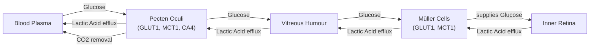

# The Anoxic Eye: How Birds Evolved Oxygen-Free Vision

In human medicine, a blocked retinal artery is an emergency. The sudden loss of blood flow, and therefore oxygen, to the eye’s light-sensing tissue leads to rapid, irreversible vision loss. Yet, when you watch a hawk spot a mouse from hundreds of feet in the air, you are witnessing a physiological marvel. Birds of prey achieve this superior visual acuity using retinas that have no blood vessels at all. This is the avascular retina paradox, a puzzle that has stumped scientists for centuries.

To appreciate the scale of this paradox, we first need to understand the retina's metabolic profile. As a specialized extension of the brain, it is one of the most energy-hungry tissues in the animal kingdom, consuming oxygen and glucose at two to three times the rate of brain tissue itself [[1]](https://www.quantamagazine.org/how-the-bird-eye-was-pushed-to-an-evolutionary-extreme-20260513). Without a constant supply of fuel, its complex network of neurons quickly fails. For this reason, most vertebrate retinas, including our own, are threaded with dense networks of blood vessels. Birds, however, evolved to have thick, avascular retinas, a feature that seems impossible. As evolutionary physiologist Christian Damsgaard notes, “According to everything we know about physiology, this tissue should not be able to function” [[2]](https://www.genengnews.com/topics/translational-medicine/how-bird-retinas-function-without-oxygen-may-inform-future-stroke-therapies).

For hundreds of years, the prevailing assumption was that birds must have a secret mechanism for acquiring oxygen. A recent study we will explore has finally solved the mystery, and the answer was more radical than anyone expected. Birds do not have a special way to get oxygen to their inner retinas; they have evolved to live without it entirely [[3]](https://doi.org/10.1038/s41586-025-09978-w). The inner half of the bird retina exists in a permanent state of oxygen deprivation, or anoxia, and is fueled by anaerobic glycolysis—a far less efficient metabolic pathway.

https://www.quantamagazine.org/wp-content/uploads/2026/05/ChristianDamsgaard-crJesperEkmann-scaled.webp
<small><em>The evolutionary physiologist Christian Damsgaard measured gas exchange in bird eyes with microsensors. Surprisingly, the inner retina, a highly active tissue, used no oxygen. - Jesper Ekmann</em></small>

This discovery reveals an evolutionary solution pushed to its absolute limit, offering a new perspective on how metabolically active tissues can survive under extreme conditions. It also carries profound implications for human medicine, potentially inspiring new treatments for conditions like stroke where oxygen deprivation causes catastrophic damage. Before we can appreciate how birds solved this paradox, we need to revisit how oxygen came to dominate complex life and why its absence is normally catastrophic for tissues like yours and ours.

## Oxygenated Life: The Great Oxidation Event and Metabolic Trade-offs

Around 3.4 billion years ago, cyanobacteria began releasing oxygen into the atmosphere as a byproduct of photosynthesis, triggering what we now call the Great Oxidation Event. This fundamentally reshaped life on Earth by unlocking a new, far more efficient way to produce cellular energy. To put this in perspective, anaerobic glycolysis, the breakdown of glucose without oxygen, yields a meager two molecules of adenosine triphosphate (ATP). In contrast, aerobic respiration can generate up to 32 molecules of ATP from a single glucose molecule [[1]](https://www.quantamagazine.org/how-the-bird-eye-was-pushed-to-an-evolutionary-extreme-20260513).

This fifteen-fold energy advantage created a powerful selective pressure. Organisms that could harness oxygen outcompeted those that could not, and complex, multicellular life became fundamentally dependent on it. As molecular physiologist Gary Lewin puts it, “We’ve been hooked on 20% [atmospheric] oxygen for millions of years” [[1]](https://www.quantamagazine.org/how-the-bird-eye-was-pushed-to-an-evolutionary-extreme-20260513). This reliance on oxygen-powered metabolism was transformative, allowing for larger bodies, more complex structures, and higher metabolic rates. However, it also created a critical vulnerability.

https://www.quantamagazine.org/wp-content/uploads/2026/05/BirdFlying-crJean-PaulWettstein-scaled.webp
<small><em>Birds, such as this alpine chough (in the crow family), use their exceptional vision to hunt, forage, and migrate. - Jean-Paul Wettstein</em></small>

This dependency defines our fragility. Your brain, an incredibly demanding organ, suffers irreversible damage after just a few minutes without oxygen. Other species show greater tolerance. The naked mole-rat, a subterranean rodent living in hypoxic burrows, can survive for 18 minutes in complete anoxia by switching its metabolism to run on fructose, which bypasses the oxygen-dependent steps of glycolysis [[4]](https://doi.org/10.1126/science.aab3896). Some freshwater turtles can survive for months at the bottom of frozen lakes without any oxygen at all. But for most vertebrates, and especially for their neural tissues, a constant oxygen supply is non-negotiable.

https://www.quantamagazine.org/wp-content/uploads/2026/05/NakedMoleRats-crJavierAbalos-scaled.webp
<small><em>Naked mole rats can survive without oxygen for 18 minutes. To generate energy without oxygen, they use anaerobic glycolysis fueled by fructose. - Javier Ábalos</em></small>

Nowhere is this more evident than in the retina. Its high metabolic rate means that any interruption to its oxygen supply, like a vascular occlusion, is devastating. Yet birds function effectively with an avascular retina. With this metabolic context established, we can now examine the mysterious vascular structure that enables birds to push the vertebrate eye to an extreme never seen in other lineages.

## A Mysterious Structure: The Pecten Oculi and Chronic Anoxia

The long-held explanation for the avian vision paradox centered on a mysterious structure called the pecten oculi. First described in the 17th century, this comb-like, highly vascularized organ protrudes into the vitreous humor of the bird eye. For centuries, its true purpose remained speculative, generating over 30 different hypotheses. Most assumed it somehow supplied oxygen to the retina, but this was never proven [[5]](https://www.eurekalert.org/news-releases/1113036). As Christian Damsgaard points out, “Nobody had really done direct physiological measurements on this structure. That’s where we came in” [[1]](https://www.quantamagazine.org/how-the-bird-eye-was-pushed-to-an-evolutionary-extreme-20260513).

https://www.quantamagazine.org/wp-content/uploads/2026/05/Bird_Retina-Fig1-crMarkBelan_Desktopv1.svg
<small><em>Mark Belan/ _Quanta Magazine_</em></small>

Performing such measurements is technically extremely challenging, requiring delicate work on a living, anesthetized animal. Damsgaard's team at Aarhus University succeeded by using microsensors to measure oxygen levels directly inside the eyes of birds. The results were definitive and shocking: there was no oxygen in the inner retina. A steep oxygen gradient from the choroid at the back of the eye was consumed entirely by the photoreceptor layer, leaving the inner layers in a state of permanent anoxia [[3]](https://doi.org/10.1038/s41586-025-09978-w). “That was striking,” Damsgaard said. “Half of the retina lives in a chronic state of anoxia, where there’s no oxygen present at all” [[1]](https://www.quantamagazine.org/how-the-bird-eye-was-pushed-to-an-evolutionary-extreme-20260513).

To understand how this was possible, the researchers used spatial transcriptomics to map gene activity across the retinal tissue. They found a clear metabolic divide. Genes for aerobic respiration were active only in the outer, oxygenated layers. In the anoxic inner retina, only genes for anaerobic glycolysis were expressed [[3]](https://doi.org/10.1038/s41586-025-09978-w). This less efficient process requires a massive amount of fuel. Further experiments using radiolabelled sugar showed that the bird retina takes up glucose at a rate 2.5 times higher than the rest of the brain [[1]](https://www.quantamagazine.org/how-the-bird-eye-was-pushed-to-an-evolutionary-extreme-20260513).

This led the team back to the pecten oculi. Their data revealed it was not an oxygen supplier but a metabolic gateway. The pecten is rich in genes for glucose transporter 1 (GLUT1), which pump huge amounts of sugar from the blood into the vitreous humor. It is also rich in genes for monocarboxylate transporter 1 (MCT1), which remove the toxic lactic acid produced by anaerobic glycolysis [[6]](https://www.thetransmitter.org/vision/inner-retina-of-birds-powers-sight-sans-oxygen). This transport is mediated by specialized glial cells called Müller cells, which span the retina and have end-feet at the vitreous interface, acting as a bridge for nutrient exchange [[3]](https://doi.org/10.1038/s41586-025-09978-w).

Diagram 1: A detailed architecture diagram illustrating the metabolic support system for the anoxic inner bird retina, showing the flow of glucose, lactic acid, and CO2 between blood plasma, pecten oculi, vitreous humour, Müller cells, and the inner retina.

https://www.quantamagazine.org/wp-content/uploads/2026/05/BirdEyeGrid-scaled.webp
<small><em>The diversity of bird eyes, lacking blood vessels (left to right). Top: Northern gannet, Eurasian eagle-owl, maguari stork. Center: rooster, rockhopper penguin, parrot (species unknown). Bottom: bald eagle, blue-and-yellow macaw, unknown species. (Left to right) Top: Chris Hellier, Jiří Dočkal, Annette Lozinski. Center: Mohammed Brzan, Nico Marín, Shyamli Kashyap. Bottom: Ingo Doerrie, David Clode, Hasan Almasi</em></small>

Thomas Baden, a neuroscientist at the University of Sussex, called the finding surprising, noting that the oxygen level “really gets properly down to zero” [[1]](https://www.quantamagazine.org/how-the-bird-eye-was-pushed-to-an-evolutionary-extreme-20260513). While cancer cells use a similar process (the Warburg effect) and our muscles resort to it temporarily during intense exercise, this is the first time a vertebrate tissue has been found to survive in a permanent, healthy anoxic state. Having established how the avian retina operates, we can now trace when and why this radical solution evolved and what it teaches us about selective pressures and future applications.

## Eyes Like a Hawk: Evolutionary Origins, Selective Pressures, and Implications

The bird’s retina and its no-oxygen power system are so unusual that they naturally raise questions about how they could have evolved. As the biologist François Jacob argued in his 1977 essay, evolution works like a tinkerer, not an engineer [[7]](https://doi.org/10.1126/science.860134). It does not produce novelties from scratch but repurposes existing parts for new functions, piecing together solutions from whatever is available. The avian eye is a prime example of this process. Instead of engineering a new way to deliver oxygen, evolution tinkered with the existing vertebrate eye plan to make it work without it.

By comparing the retinas of birds to those of their reptilian relatives, we can pinpoint when this adaptation likely arose. Reptiles like turtles and caimans have fully oxygenated retinas, suggesting the switch to anoxia tolerance occurred in the theropod dinosaur lineage, after it split from crocodilians but before the emergence of modern birds [[3]](https://doi.org/10.1038/s41586-025-09978-w). This evolutionary shift coincided with a considerable thickening of the retina, which would have been impossible without a new metabolic strategy.

The driving force behind this change was likely an intense selective pressure for exceptional vision. Birds rely on their sight for everything from hunting and foraging to navigating thousands of miles during migration, often at high altitudes where oxygen is scarce [[1]](https://www.quantamagazine.org/how-the-bird-eye-was-pushed-to-an-evolutionary-extreme-20260513). The presence of blood vessels in the retina scatters light and limits how densely neurons can be packed. By eliminating these vessels, birds were able to evolve retinas with a higher density of photoreceptors and ganglion cells. This dense packing allows for highly regular "mosaics" of photoreceptor cells, which is critical for the uniform sampling of visual space and enables the razor-sharp vision for which they are famous [[8]](https://doi.org/10.1371/journal.pone.0008992). The anoxic adaptation, therefore, provided a direct optical advantage.

It remains an open question whether the vessel-free retina was a direct adaptation for better vision or an evolutionary coincidence that was later co-opted for high-altitude flight. We must be cautious about extending these findings to every bird species. Physiologist Gary Lewin notes that the current research has not examined any migratory species, which would be a crucial test for the high-altitude hypothesis [[1]](https://www.quantamagazine.org/how-the-bird-eye-was-pushed-to-an-evolutionary-extreme-20260513).

Regardless of its precise origins, the discovery has important biomedical implications. Conditions like stroke and ischemic retinal diseases are devastating precisely because your neural tissues cannot tolerate oxygen deprivation. The bird retina and the naked mole-rat's brain offer two different natural models of how to survive anoxia. By studying these extreme adaptations, we can gain new insights into how tissues fail under hypoxic conditions and potentially develop novel therapeutic strategies. As Damsgaard suggests, “Maybe we can get inspiration for how nature solved these problems by millions of years of natural selection. There’s so much to be learned from these animals that are able to do something that we cannot do” [[1]](https://www.quantamagazine.org/how-the-bird-eye-was-pushed-to-an-evolutionary-extreme-20260513).

## Conclusion

We have explored the resolution to a centuries-old biological mystery: how birds maintain one of the most metabolically active tissues in the animal kingdom without a direct oxygen supply. The answer lies not in a novel oxygen delivery system, but in a radical adaptation to permanent anoxia, fueled by anaerobic glycolysis and supported by the unique pecten oculi structure. This finding fundamentally changes our understanding of vertebrate physiology and the limits of metabolic adaptation.

This evolutionary journey, from the oxygen-rich world created by ancient bacteria to the oxygen-starved inner retina of a modern bird, highlights nature's ability to "tinker" and repurpose existing structures to solve complex problems. For us, the story is more than just a biological curiosity. It offers a new lens through which to view human diseases caused by oxygen deprivation, opening potential avenues for therapies inspired by millions of years of natural selection.

## References

- [1] [How the Bird Eye Was Pushed to an Evolutionary Extreme](https://www.quantamagazine.org/how-the-bird-eye-was-pushed-to-an-evolutionary-extreme-20260513)
- [2] [How Bird Retinas Function Without Oxygen May Inform Future Stroke Therapies](https://www.genengnews.com/topics/translational-medicine/how-bird-retinas-function-without-oxygen-may-inform-future-stroke-therapies)
- [3] [Oxygen-free metabolism in the bird inner retina supported by the pecten](https://doi.org/10.1038/s41586-025-09978-w)
- [4] [Fructose-driven glycolysis supports anoxia resistance in the naked mole-rat](https://doi.org/10.1126/science.aab3896)
- [5] [Bird retinas function without oxygen – solving a centuries-old biological mystery](https://www.eurekalert.org/news-releases/1113036)
- [6] [Inner retina of birds powers sight sans oxygen](https://www.thetransmitter.org/vision/inner-retina-of-birds-powers-sight-sans-oxygen)
- [7] [Evolution and Tinkering](https://doi.org/10.1126/science.860134)
- [8] [Avian Cone Photoreceptors Tile the Retina as Five Independent, Self-Organizing Mosaics](https://doi.org/10.1371/journal.pone.0008992)