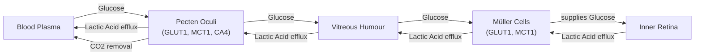

# The Anoxic Eye: How Birds Evolved Oxygen-Free Vision

In human medicine, a blocked retinal artery is an emergency. The sudden loss of blood flow, and therefore oxygen, to the eye’s light-sensing tissue leads to rapid, irreversible vision loss. Yet, birds of prey like hawks can spot a mouse from hundreds of feet in the air using retinas that have no blood vessels at all. This is the avascular retina paradox, a puzzle that has stumped scientists for centuries.

The retina is one ofthe most energy-hungry tissues in the animal kingdom, consuming oxygen and glucose at two to three times the rate of the brain [[11]](https://www.quantamagazine.org/how-the-bird-eye-was-pushed-to-an-evolutionary-extreme-20260513). Without a constant supply of fuel, its complex network of neurons quickly fails. For this reason, most vertebrate retinas, including our own, are threaded with dense networks of blood vessels. Birds, however, evolved to have thick, avascular retinas, a feature that should be physiologically impossible. As evolutionary physiologist Christian Damsgaard notes, “According to everything we know about physiology, this tissue should not be able to function” [[21]](https://www.genengnews.com/topics/translational-medicine/how-bird-retinas-function-without-oxygen-may-inform-future-stroke-therapies).

For hundreds of years, the prevailing assumption was that birds must have a secret mechanism for acquiring oxygen. A recent study finally solved the mystery, and the answer was more radical than anyone expected. Birds do not have a special way to get oxygen to their inner retinas; they have evolved to live without it entirely [[29]](https://doi.org/10.1038/s41586-025-09978-w). The inner half of the bird retina exists in a permanent state of oxygen deprivation, or anoxia, and is fueled by anaerobic glycolysis—a far less efficient metabolic pathway.

https://www.quantamagazine.org/wp-content/uploads/2026/05/ChristianDamsgaard-crJesperEkmann-scaled.webp 
Image 1: The evolutionary physiologist Christian Damsgaard measured gas exchange in bird eyes with microsensors. Surprisingly, the inner retina, a highly active tissue, used no oxygen. (Source: Jesper Ekmann from [Quanta Magazine](https://www.quantamagazine.org/how-the-bird-eye-was-pushed-to-an-evolutionary-extreme-20260513))

This discovery reveals an evolutionary solution pushed to its absolute limit, offering a new perspective on how metabolically active tissues can survive under extreme conditions. It also carries profound implications for human medicine, potentially inspiring new treatments for conditions like stroke and other ischemic diseases where oxygen deprivation causes catastrophic damage. Before we can appreciate how birds solved this paradox, we need to revisit how oxygen came to dominate complex life and why its absence is normally catastrophic.

## Oxygenated Life: The Great Oxidation Event and Metabolic Trade-offs

Around 3.4 billion years ago, cyanobacteria began releasing oxygen into the atmosphere as a byproduct of photosynthesis, triggering the Great Oxidation Event. This transformed life on Earth. Oxygen enabled a new, far more efficient way to produce cellular energy. While anaerobic glycolysis, the breakdown of glucose without oxygen, yields a meager two molecules of ATP, aerobic respiration can generate up to 32 [[11]](https://www.quantamagazine.org/how-the-bird-eye-was-pushed-to-an-evolutionary-extreme-20260513).

This fifteen-fold energy advantage was a powerful selective pressure. Organisms that could harness oxygen outcompeted those that could not, and complex, multicellular life became fundamentally dependent on it. As molecular physiologist Gary Lewin puts it, “We’ve been hooked on 20% [atmospheric] oxygen for millions of years” [[11]](https://www.quantamagazine.org/how-the-bird-eye-was-pushed-to-an-evolutionary-extreme-20260513).

https://www.quantamagazine.org/wp-content/uploads/2026/05/BirdFlying-crJean-PaulWettstein-scaled.webp 
Image 2: Birds, such as this alpine chough (in the crow family), use their exceptional vision to hunt, forage, and migrate. (Source: Jean-Paul Wettstein from [Quanta Magazine](https://www.quantamagazine.org/how-the-bird-eye-was-pushed-to-an-evolutionary-extreme-20260513))

This dependency defines our vulnerability. The human brain, an incredibly demanding organ, suffers irreversible damage after just a few minutes without oxygen. Other species show greater tolerance. The naked mole-rat, a subterranean rodent living in hypoxic burrows, can survive for 18 minutes in complete anoxia by switching to a fructose-based anaerobic metabolism [[31]](https://doi.org/10.1126/science.aab3896). Some freshwater turtles can survive for months at the bottom of frozen lakes without any oxygen at all. But for most vertebrates, and especially for their neural tissues, a constant oxygen supply is non-negotiable.

https://www.quantamagazine.org/wp-content/uploads/2026/05/NakedMoleRats-crJavierAbalos-scaled.webp 
Image 3: Naked mole rats can survive without oxygen for 18 minutes. To generate energy without oxygen, they use anaerobic glycolysis fueled by fructose. (Source: Javier Ábalos from [Quanta Magazine](https://www.quantamagazine.org/how-the-bird-eye-was-pushed-to-an-evolutionary-extreme-20260513))

Nowhere is this more evident than in the retina. Its high metabolic rate means that any interruption to its oxygen supply, like a vascular occlusion, is devastating. Yet birds thrive with an avascular retina. With this metabolic context established, we can now examine the mysterious vascular structure that enables birds to push the vertebrate eye to an extreme never seen in other lineages.

## A Mysterious Structure: The Pecten Oculi and Chronic Anoxia

The long-held explanation for the avian vision paradox centered on a mysterious structure called the pecten oculi. First described in the 17th century, this comb-like, highly vascularized organ protrudes into the vitreous humor of the bird eye. For centuries, anatomists generated over 30 different hypotheses about its function, with most assuming it somehow supplied oxygen to the retina [[20]](https://www.eurekalert.org/news-releases/1113036). However, as Christian Damsgaard points out, “Nobody had really done direct physiological measurements on this structure. That’s where we came in” [[11]](https://www.quantamagazine.org/how-the-bird-eye-was-pushed-to-an-evolutionary-extreme-20260513).

https://www.quantamagazine.org/wp-content/uploads/2026/05/Bird_Retina-Fig1-crMarkBelan_Desktopv1.svg 
Image 4: A diagram of the bird eye, showing the retina, light path, and the pecten oculi. (Source: Mark Belan/ Quanta Magazine from [Quanta Magazine](https://www.quantamagazine.org/how-the-bird-eye-was-pushed-to-an-evolutionary-extreme-20260513))

Damsgaard's team at Aarhus University used delicate microsensors to measure oxygen levels directly inside the eyes of living birds, including zebra finches, pigeons, and chickens. The results were definitive and shocking: there was no oxygen in the inner retina. A steep oxygen gradient from the choroid at the back of the eye was consumed entirely by the photoreceptor layer, leaving the inner layers in a state of permanent anoxia [[29]](https://doi.org/10.1038/s41586-025-09978-w). “That was striking,” Damsgaard said. “Half of the retina lives in a chronic state of anoxia, where there’s no oxygen present at all” [[11]](https://www.quantamagazine.org/how-the-bird-eye-was-pushed-to-an-evolutionary-extreme-20260513).

To understand how this was possible, the researchers used spatial transcriptomics to map gene activity across the retinal tissue. They found a clear metabolic divide. Genes for aerobic respiration were active only in the outer, oxygenated layers. In the anoxic inner retina, only genes for anaerobic glycolysis were expressed [[29]](https://doi.org/10.1038/s41586-025-09978-w). This less efficient process requires a massive amount of fuel. Further experiments showed that the bird retina takes up glucose at a rate 2.5 times higher than the rest of the brain [[16]](https://www.quantamagazine.org/how-the-bird-eye-was-pushed-to-an-evolutionary-extreme-20260513).

This led the team back to the pecten oculi. Their data revealed that it was not an oxygen supplier but a metabolic gateway. The pecten is rich in genes for glucose transporters (GLUT1), which pump huge amounts of sugar from the blood into the vitreous humor to fuel the retina. It is also rich in genes for lactate transporters (MCT1), which remove the toxic lactic acid produced by anaerobic glycolysis [[5]](https://www.thetransmitter.org/vision/inner-retina-of-birds-powers-sight-sans-oxygen). This elegant system allows the bird retina to function without oxygen, solving the centuries-old mystery.

Image 5: A detailed architecture diagram illustrating the metabolic support system for the anoxic inner bird retina, showing the flow of glucose, lactic acid, and CO2 between blood plasma, pecten oculi, vitreous humour, Müller cells, and the inner retina.

https://www.quantamagazine.org/wp-content/uploads/2026/05/BirdEyeGrid-scaled.webp 
Image 6: The diversity of bird eyes, lacking blood vessels (left to right). Top: Northern gannet, Eurasian eagle-owl, maguari stork. Center: rooster, rockhopper penguin, parrot (species unknown). Bottom: bald eagle, blue-and-yellow macaw, unknown species. (Source: Chris Hellier, Jiří Dočkal, Annette Lozinski, Mohammed Brzan, Nico Marín, Shyamli Kashyap, Ingo Doerrie, David Clode, Hasan Almasi from [Quanta Magazine](https://www.quantamagazine.org/how-the-bird-eye-was-pushed-to-an-evolutionary-extreme-20260513))

Thomas Baden, a neuroscientist at the University of Sussex, called the finding surprising, noting that the oxygen level “really gets properly down to zero” [[11]](https://www.quantamagazine.org/how-the-bird-eye-was-pushed-to-an-evolutionary-extreme-20260513). While cancer cells use a similar process (the Warburg effect) and our muscles resort to it temporarily during intense exercise, this is the first time a vertebrate tissue has been found to survive in a permanent, healthy anoxic state. Having established how the avian retina operates, we can now trace when and why this radical solution evolved and what it teaches us about selective pressures and future applications.

## Eyes Like a Hawk: Evolutionary Origins, Selective Pressures, and Implications

The bird’s retina and its no-oxygen power system are so unusual that they naturally raise questions about how they could have evolved. Evolution does not invent complex systems from scratch. As the biologist François Jacob argued in his 1977 essay, evolution works like a tinkerer, not an engineer [[32]](https://doi.org/10.1126/science.860134). It repurposes existing parts for new functions, piecing together solutions from whatever is available. The avian eye is a prime example of this process. Instead of engineering a new way to deliver oxygen, evolution tinkered with the existing vertebrate eye plan to make it work without it.

By comparing the retinas of birds to those of their reptilian relatives, researchers pinpointed when this adaptation likely arose. Reptiles like turtles and caimans have fully oxygenated retinas, suggesting the switch to anoxia tolerance occurred in the theropod dinosaur lineage, after it split from crocodilians but before the emergence of modern birds [[29]](https://doi.org/10.1038/s41586-025-09978-w). This evolutionary shift coincided with a significant thickening of the retina.

The driving force behind this change was likely an intense selective pressure for exceptional vision. Birds rely on their sight for everything from hunting and foraging to navigating thousands of miles during migration, often at high altitudes where oxygen is scarce [[11]](https://www.quantamagazine.org/how-the-bird-eye-was-pushed-to-an-evolutionary-extreme-20260513). The presence of blood vessels in the retina scatters light and limits how densely neurons can be packed. By eliminating these vessels, birds were able to evolve retinas with a higher density of photoreceptors and ganglion cells, enabling the razor-sharp vision for which they are famous [[33]](https://doi.org/10.1371/journal.pone.0008992). The anoxic adaptation, therefore, provided a direct optical advantage.

It remains an open question whether the vessel-free retina was a direct adaptation for better vision or an evolutionary coincidence that was later co-opted for high-altitude flight. Researchers are cautious about extending these findings to every bird species, as migratory birds have not yet been studied in this context [[11]](https://www.quantamagazine.org/how-the-bird-eye-was-pushed-to-an-evolutionary-extreme-20260513).

Regardless of its precise origins, the discovery has significant biomedical implications. Conditions like stroke and ischemic retinal diseases are devastating precisely because human neural tissues cannot tolerate oxygen deprivation. The bird retina and the naked mole-rat's brain offer two different natural models of how to survive anoxia. By studying these extreme adaptations, we can gain new insights into how tissues fail under hypoxic conditions and potentially develop novel therapeutic strategies. As Damsgaard suggests, “Maybe we can get inspiration for how nature solved these problems by millions of years of natural selection. There’s so much to be learned from these animals that are able to do something that we cannot do” [[11]](https://www.quantamagazine.org/how-the-bird-eye-was-pushed-to-an-evolutionary-extreme-20260513).

## Conclusion

The resolution of the avascular retina paradox is a powerful reminder of evolution's ingenuity. By sacrificing oxygen dependence, birds unlocked a new level of visual performance, enabling them to become masters of the sky. The pecten oculi, once a source of speculation, is now understood as a key component of an extraordinary metabolic system that fuels one of nature's most sophisticated sensors.

This story is more than a biological curiosity. It offers a blueprint for how a complex biological system can adapt to function at its absolute physiological limits. Understanding these natural solutions not only deepens our appreciation for the diversity of life but also provides a source of inspiration for solving some of the most pressing challenges in human medicine.

## References

- [1] https://uol.de/en/news/article/birds-retinas-function-without-oxygen
- [2] https://www.eurekalert.org/news-releases/1113036
- [3] https://www.sdu.dk/en/om-sdu/fakulteterne/naturvidenskab/nyheder-2026/bird-retina
- [4] https://www.quantamagazine.org/how-the-bird-eye-was-pushed-to-an-evolutionary-extreme-20260513
- [5] https://www.thetransmitter.org/vision/inner-retina-of-birds-powers-sight-sans-oxygen
- [6] https://www.quantamagazine.org/how-the-bird-eye-was-pushed-to-an-evolutionary-extreme-20260513
- [7] https://www.thetransmitter.org/vision/inner-retina-of-birds-powers-sight-sans-oxygen
- [8] https://bio.au.dk/en/about-biology/news-and-events/show/artikel/fugles-nethinder-lever-uden-ilt-aarhundredgammelt-biologisk-mysterium-er-opklaret
- [9] https://www.eurekalert.org/news-releases/1113036
- [10] https://www.genengnews.com/topics/translational-medicine/how-bird-retinas-function-without-oxygen-may-inform-future-stroke-therapies
- [11] https://www.quantamagazine.org/how-the-bird-eye-was-pushed-to-an-evolutionary-extreme-20260513
- [12] https://www.thetransmitter.org/vision/inner-retina-of-birds-powers-sight-sans-oxygen
- [13] https://www.eyefox.com/news/2724/sight-without-oxygen-secret-of-the-bird-retina-unraveled
- [14] https://www.eurekalert.org/news-releases/1113036
- [15] https://www.genengnews.com/topics/translational-medicine/how-bird-retinas-function-without-oxygen-may-inform-future-stroke-therapies
- [16] https://www.quantamagazine.org/how-the-bird-eye-was-pushed-to-an-evolutionary-extreme-20260513
- [17] https://www.thetransmitter.org/vision/inner-retina-of-birds-powers-sight-sans-oxygen
- [18] https://bio.au.dk/en/about-biology/news-and-events/show/artikel/fugles-nethinder-lever-uden-ilt-aarhundredgammelt-biologisk-mysterium-er-opklaret
- [19] https://www.eurekalert.org/news-releases/1113036
- [20] https://www.eurekalert.org/news-releases/1113036
- [21] https://www.genengnews.com/topics/translational-medicine/how-bird-retinas-function-without-oxygen-may-inform-future-stroke-therapies
- [22] https://www.sdu.dk/en/om-sdu/fakulteterne/naturvidenskab/nyheder-2026/bird-retina
- [23] https://www.thetransmitter.org/vision/inner-retina-of-birds-powers-sight-sans-oxygen
- [24] https://www.quantamagazine.org/how-the-bird-eye-was-pushed-to-an-evolutionary-extreme-20260513
- [25] https://doi.org/10.1016/j.cub.2025.12.028
- [26] https://www.eurekalert.org/news-releases/1113036
- [27] https://www.sdu.dk/en/om-sdu/fakulteterne/naturvidenskab/nyheder-2026/bird-retina
- [28] https://www.thetransmitter.org/vision/inner-retina-of-birds-powers-sight-sans-oxygen
- [29] https://doi.org/10.1038/s41586-025-09978-w
- [30] https://www.quantamagazine.org/how-the-bird-eye-was-pushed-to-an-evolutionary-extreme-20260513
- [31] https://doi.org/10.1126/science.aab3896
- [32] https://doi.org/10.1126/science.860134
- [33] https://doi.org/10.1371/journal.pone.0008992