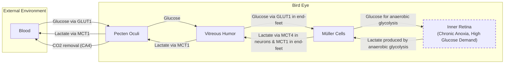

# The Paradox of Sight: How Bird Retinas Function Without Oxygen

In human medicine, a blocked retinal artery is a crisis. Within minutes, the lack of oxygen leads to irreversible vision loss. Yet, birds, whose vision is among the sharpest in the animal kingdom, operate with retinas that are completely avascular—they have no internal blood vessels at all. A hawk can spot a mouse from hundreds of feet in the air, a feat of visual acuity powered by a tissue that, by our standards, should not be able to function [[1]](https://www.quantamagazine.org/how-the-bird-eye-was-pushed-to-an-evolutionary-extreme-20260513).

The retina is one of the body’s most energy-hungry tissues, consuming glucose and oxygen at two to three times the rate of the brain [[1]](https://www.quantamagazine.org/how-the-bird-eye-was-pushed-to-an-evolutionary-extreme-20260513), [[2]](https://www.nature.com/articles/s41586-025-09978-w). In fact, it consumes more energy than any other tissue in the body [[3]](https://www.eurekalert.org/news-releases/1113036). For centuries, this created a paradox that puzzled scientists. The assumption was that birds must have some undiscovered mechanism for acquiring oxygen, because standard vertebrate physiology seemed impossible without it. As evolutionary physiologist Christian Damsgaard of Aarhus University noted, the bird retina “was a complete paradox.” According to everything known about physiology, he stated, “this tissue should not be able to function” [[1]](https://www.quantamagazine.org/how-the-bird-eye-was-pushed-to-an-evolutionary-extreme-20260513), [[4]](https://www.eurekalert.org/news-releases/1113036).

A recent study finally provides the resolution. The inner layers of the bird retina exist in a state of permanent oxygen deprivation, or chronic anoxia. Birds have not evolved a novel way to deliver oxygen; instead, they have evolved a tolerance for its complete absence, relying on a less efficient process called anaerobic glycolysis to produce energy [[2]](https://www.nature.com/articles/s41586-025-09978-w). This finding represents the first known case of a vertebrate tissue operating permanently and healthily through anaerobic metabolism, pushing the known limits of biological adaptation.
Image 1: <small><em>The evolutionary physiologist Christian Damsgaard measured gas exchange in bird eyes with microsensors. Surprisingly, the inner retina, a highly active tissue, used no oxygen. - Jesper Ekmann</em></small>

This discovery pushes our understanding of metabolic extremes and offers potential insights for treating human conditions involving oxygen deprivation, such as stroke and ischemic retinal disease [[3]](https://www.eurekalert.org/news-releases/1113036). Before we can appreciate how birds solved this paradox, we need to revisit how oxygen came to dominate complex life and why its absence is normally catastrophic.

## Oxygenated Life: The Great Oxidation Event and Metabolic Trade-offs

Around 3.4 billion years ago, cyanobacteria developed photosynthesis, slowly pumping oxygen into the atmosphere and changing the course of life on Earth. This Great Oxidation Event was a pivotal moment in evolutionary history. Oxygen enabled a new, highly efficient method of energy production known as aerobic respiration. While anaerobic glycolysis, the breakdown of glucose without oxygen, yields just two molecules of ATP (adenosine triphosphate), aerobic respiration can produce up to 32 [[1]](https://www.quantamagazine.org/how-the-bird-eye-was-pushed-to-an-evolutionary-extreme-20260513). This fifteen-fold increase in energy efficiency was a game-changer.
Image 2: <small><em>Birds, such as this alpine chough (in the crow family), use their exceptional vision to hunt, forage, and migrate. - Jean-Paul Wettstein</em></small>

This energetic advantage was transformative. Organisms that could use oxygen outcompeted those that could not, leading to a mass extinction and locking complex, multicellular life into a dependency on aerobic metabolism. As molecular physiologist Gary Lewin of the Max Delbrück Center in Berlin puts it, “We’ve been hooked on 20% [atmospheric] oxygen for millions of years” [[1]](https://www.quantamagazine.org/how-the-bird-eye-was-pushed-to-an-evolutionary-extreme-20260513).

This dependency makes most animals extremely vulnerable to oxygen deprivation. Humans suffer irreversible brain damage within minutes of anoxia. The most tolerant mammal, the naked mole-rat, can survive for 18 minutes without oxygen by switching to a fructose-based anaerobic metabolism [[5]](https://doi.org/10.1126/science.aab3896). At the far end of the spectrum, some cold-blooded animals like freshwater turtles can persist for months in anoxic conditions at the bottom of a frozen lake [[1]](https://www.quantamagazine.org/how-the-bird-eye-was-pushed-to-an-evolutionary-extreme-20260513). In metabolically demanding tissues like the brain and retina, a steady supply of oxygen is non-negotiable. Without it, energy production shuts down, cellular processes malfunction, and cells begin to die. This is why conditions like stroke, which cut off blood supply to the brain, are so devastating.
Image 3: <small><em>Naked mole rats can survive without oxygen for 18 minutes. To generate energy without oxygen, they use anaerobic glycolysis fueled by fructose. - Javier Ábalos</em></small>

With this metabolic context established, we can now examine the mysterious vascular structure that enables birds to push the vertebrate eye to an extreme never seen in other lineages.

## A Mysterious Structure: The Pecten Oculi and Chronic Anoxia

When Damsgaard first encountered the problem of the avascular bird retina, he and an interdisciplinary team embarked on an eight-year investigation [[3]](https://www.eurekalert.org/news-releases/1113036). They reviewed the existing literature, which all pointed to a single structure: the pecten oculi. First described in the 17th century, this comb-like organ, rich with blood vessels, sits in the vitreous humor of the bird eye. Over the centuries, it generated over 30 different theories about its function, with the leading hypothesis being that it delivered oxygen to the retina [[1]](https://www.quantamagazine.org/how-the-bird-eye-was-pushed-to-an-evolutionary-extreme-20260513), [[2]](https://www.nature.com/articles/s41586-025-09978-w). However, as Damsgaard noted, “Nobody had really done direct physiological measurements on this structure. That’s where we came in” [[1]](https://www.quantamagazine.org/how-the-bird-eye-was-pushed-to-an-evolutionary-extreme-20260513).
Image 4: <small><em>Mark Belan/ _Quanta Magazine_</em></small>

Using microsensors to measure oxygen levels directly in the retinas of zebra finches, pigeons, and chickens, Damsgaard’s team made a striking discovery. While the outer retina, near the oxygen-rich choroid, had oxygen, the inner retina had none. “Half of the retina lives in a chronic state of anoxia, where there’s no oxygen present at all,” Damsgaard said [[1]](https://www.quantamagazine.org/how-the-bird-eye-was-pushed-to-an-evolutionary-extreme-20260513). This finding overturned centuries of assumptions. The pecten was not an oxygen supplier, providing only about 0.76% of the total retinal oxygen supply [[2]](https://www.nature.com/articles/s41586-025-09978-w). As the study’s authors noted, their data provided direct evidence “against the prevailing hypothesis” that the pecten supplies oxygen, confirming that its function results in “inner retinal anoxia” [[6]](https://www.genengnews.com/topics/translational-medicine/how-bird-retinas-function-without-oxygen-may-inform-future-stroke-therapies).

To understand how the retina functioned without oxygen, the researchers turned to spatial transcriptomics, a technique that maps gene activity within tissues. They found a clear metabolic divide. Genes for aerobic respiration were active only in the oxygenated outer retina. In the anoxic inner retina, only genes for anaerobic glycolysis were active [[1]](https://www.quantamagazine.org/how-the-bird-eye-was-pushed-to-an-evolutionary-extreme-20260513), [[2]](https://www.nature.com/articles/s41586-025-09978-w). This immediately raised another puzzle. Anaerobic glycolysis is far less efficient, yet the bird retina has an extremely high energy demand. The team found that the inner retina’s glucose demand was 2.5 times higher than other parts of the bird brain. Further analysis of the pecten oculi revealed the answer. It wasn’t pumping oxygen; it was pumping fuel. The pecten showed high activity of genes for glucose transporters (GLUT1), which bring glucose into the eye, and lactate transporters (MCT1), which remove the toxic byproduct of anaerobic glycolysis, lactic acid [[1]](https://www.quantamagazine.org/how-the-bird-eye-was-pushed-to-an-evolutionary-extreme-20260513), [[2]](https://www.nature.com/articles/s41586-025-09978-w). The pecten acts as a metabolic gateway, supplying the immense amount of sugar needed to fuel the inefficient anaerobic process and clearing the waste to prevent toxic buildup. This exchange is facilitated by specialized glial cells known as Müller cells, which express high levels of GLUT1 and MCT1 at their "end-feet," forming an interface between the vitreous and the retina [[7]](https://uol.de/en/news/article/birds-retinas-function-without-oxygen).

This function, however, raises new questions. As one researcher commented, the pecten's proposed role in CO₂ removal “deserves study, as sustained anaerobic metabolism of glucose should not generate any CO₂,” pointing to more metabolic complexity yet to be uncovered [[8]](https://www.thetransmitter.org/vision/inner-retina-of-birds-powers-sight-sans-oxygen). Senior author Jens Randel Nyengaard summed up the discovery's impact: “We are essentially collapsing one house of cards and replacing it with another. … That is how science progresses” [[3]](https://www.eurekalert.org/news-releases/1113036).

Image 5: A flowchart illustrating the metabolic exchange in the bird eye, showing glucose and lactate flow, and the role of CA4.
Image 6: <small><em>The diversity of bird eyes, lacking blood vessels (left to right). Top: Northern gannet, Eurasian eagle-owl, maguari stork. Center: rooster, rockhopper penguin, parrot (species unknown). Bottom: bald eagle, blue-and-yellow macaw, unknown species. (Left to right) Top: Chris Hellier, Jiří Dočkal, Annette Lozinski. Center: Mohammed Brzan, Nico Marín, Shyamli Kashyap. Bottom: Ingo Doerrie, David Clode, Hasan Almasi</em></small>

The findings provided compelling evidence for a metabolic strategy never before documented in a vertebrate tissue. Thomas Baden, a neuroscientist at the University of Sussex, commented on the discovery: “The insight that the retina basically goes oxygen-free, at least in some layers, is surprising. … It really gets properly down to zero” [[1]](https://www.quantamagazine.org/how-the-bird-eye-was-pushed-to-an-evolutionary-extreme-20260513). The high rate of glycolysis itself was not entirely new—it had been observed in bird retinas since the 1920s—but the discovery that it occurs in a permanently anoxic environment was what resolved the paradox [[9]](https://pmc.ncbi.nlm.nih.gov/articles/PMC7405834). While cancer cells use a similar pathway (the Warburg effect) and our muscles resort to it temporarily during intense exercise, no vertebrate tissue was known to survive in a completely anoxic state for its entire lifetime.

Having established how the avian retina operates, we can now trace when and why this radical solution evolved and what it teaches us about selective pressures and future applications.

## Eyes Like a Hawk: Evolutionary Origins, Selective Pressures, and Implications

The bird’s retina and its no-oxygen power system are so unusual that they naturally raise questions about how they could have evolved. Evolution does not invent new systems from scratch; it acts more like a tinkerer, repurposing what already exists [[10]](https://doi.org/10.1126/science.860134). Instead of creating a new oxygen-delivery mechanism, evolution tinkered with the vertebrate eye blueprint to allow it to function without one. This process is a perfect example of how evolution works on what is already there, combining systems or transforming them for new functions rather than creating novelties from a blank slate. The vertebrate eye itself is a highly conserved structure, with origins tracing back 560 million years to a simple light-sensitive patch [[11]](https://doi.org/10.1016/j.cub.2025.12.028).

By comparing the retinas of birds to their reptilian relatives, Damsgaard’s team concluded that the anoxic inner retina likely evolved sometime during the dinosaur era, in the theropod lineage that gave rise to modern birds, after it had split from crocodiles [[1]](https://www.quantamagazine.org/how-the-bird-eye-was-pushed-to-an-evolutionary-extreme-20260513), [[2]](https://www.nature.com/articles/s41586-025-09978-w). As Damsgaard explained, the pecten’s vasculature is an ancient reptilian structure, but it “gained its metabolic support of glucose and waste removal when the retina became anoxic,” a change that allowed for a thicker, more powerful design [[8]](https://www.thetransmitter.org/vision/inner-retina-of-birds-powers-sight-sans-oxygen). Independent experts agree, with sensory biologist Dan-Eric Nilsson stating he “fully support[s] their interpretation that the anoxic retina probably evolved in the dinosaur lineage” [[8]](https://www.thetransmitter.org/vision/inner-retina-of-birds-powers-sight-sans-oxygen). This development coincided with a thickening of the retina, suggesting a link between the new metabolic strategy and the demands of more powerful vision.

Researchers can only speculate about the exact evolutionary pressures, but a leading hypothesis is the demand for exceptionally sharp vision. For hunting, foraging, and long-distance migration, high visual acuity is a significant advantage. The blood vessels present in most vertebrate retinas scatter light, which can limit visual resolution. By eliminating these vessels, birds could pack photoreceptors and other neurons more densely, enabling sharper vision [[1]](https://www.quantamagazine.org/how-the-bird-eye-was-pushed-to-an-evolutionary-extreme-20260513), [[12]](https://doi.org/10.1371/journal.pone.0008992). As biologist and study contributor Coen Elemans put it, “This pecten allows a snake eagle the incredible acuity of vision to spot a tiny still lizard from great heights” [[13]](https://www.sdu.dk/en/om-sdu/fakulteterne/naturvidenskab/nyheder-2026/bird-retina). Damsgaard suggested that this system first evolved in theropod dinosaurs for tracking prey and identifying mates. Later, as birds took to the skies, it served as a pre-adaptation, or exaptation, allowing the retina to function during high-altitude flights where oxygen is scarce [[1]](https://www.quantamagazine.org/how-the-bird-eye-was-pushed-to-an-evolutionary-extreme-20260513), [[2]](https://www.nature.com/articles/s41586-025-09978-w).

Whether this is a true adaptation or a coincidence of evolutionary history remains an open question. Physiologist Gary Lewin cautions against overextending the results to all birds, as migratory species have not yet been studied in this context [[1]](https://www.quantamagazine.org/how-the-bird-eye-was-pushed-to-an-evolutionary-extreme-20260513). Nonetheless, this unique power system helps explain what makes avian eyes so special.

The implications of this research extend beyond birds to biomedicine. Many human medical conditions, most notably stroke, involve a drop in oxygen delivery to tissues, leading to irreversible damage. As senior author Jens Randel Nyengaard explained, “In conditions like stroke, human tissues suffer because oxygen delivery is reduced and metabolic waste accumulates. In the bird retina, we see a system that copes with oxygen deprivation in a completely different way” [[3]](https://www.eurekalert.org/news-releases/1113036). The mechanisms that allow the bird retina to function without oxygen may inspire new strategies to prevent hypoxic damage in humans.

“Maybe we can get inspiration for how nature solved these problems by millions of years of natural selection,” Damsgaard said. “There’s so much to be learned from these animals that are able to do something that we cannot do” [[1]](https://www.quantamagazine.org/how-the-bird-eye-was-pushed-to-an-evolutionary-extreme-20260513).

## Conclusion

The resolution of the avascular retina paradox is a powerful demonstration of how evolution operates under constraint. By repurposing an ancient structure, the pecten oculi, birds developed a metabolic strategy that allows one of the most energy-demanding tissues in the animal kingdom to function without a direct oxygen supply. This reliance on anaerobic glycolysis, fueled by a constant influx of glucose and efficient removal of lactate, enabled the evolution of a thicker, vessel-free retina capable of extraordinary visual acuity.

This discovery not only solves a centuries-old biological mystery but also opens new avenues for medical research. Understanding the molecular mechanisms that protect the bird retina from the damaging effects of anoxia could inspire novel therapies for human conditions like stroke and ischemic diseases. It reminds us that nature, through millions of years of tinkering, has already solved many of the complex problems we face in medicine, offering a blueprint for future innovation.

## References

- [1] [How the Bird Eye Was Pushed to an Evolutionary Extreme](https://www.quantamagazine.org/how-the-bird-eye-was-pushed-to-an-evolutionary-extreme-20260513)
- [2] [Oxygen-free metabolism in the bird inner retina supported by the pecten](https://www.nature.com/articles/s41586-025-09978-w)
- [3] [Bird retinas function without oxygen – solving a centuries-old biological mystery](https://www.eurekalert.org/news-releases/1113036)
- [4] [Bird retinas function without oxygen](https://www.eurekalert.org/news-releases/1113036)
- [5] [Fructose-driven glycolysis supports anoxia resistance in the naked mole-rat](https://doi.org/10.1126/science.aab3896)
- [6] [How Bird Retinas Function Without Oxygen May Inform Future Stroke Therapies](https://www.genengnews.com/topics/translational-medicine/how-bird-retinas-function-without-oxygen-may-inform-future-stroke-therapies)
- [7] [Birds retinas function without oxygen // University of Oldenburg](https://uol.de/en/news/article/birds-retinas-function-without-oxygen)
- [8] [Inner retina of birds powers sight sans oxygen](https://www.thetransmitter.org/vision/inner-retina-of-birds-powers-sight-sans-oxygen)
- [9] [The Appearance of the Warburg Effect in the Developing Avian Eye Characterized In Ovo: How Neurogenesis Can Remodel Neuroenergetics](https://pmc.ncbi.nlm.nih.gov/articles/PMC7405834)
- [10] [Evolution and Tinkering](https://doi.org/10.1126/science.860134)
- [11] [Evolution of the vertebrate retina by repurposing of a composite ancestral median eye](https://doi.org/10.1016/j.cub.2025.12.028)
- [12] [Avian Cone Photoreceptors Tile the Retina as Five Independent, Self-Organizing Mosaics](https://doi.org/10.1371/journal.pone.0008992)
- [13] [Bird retinas work without oxygen – solving an old biological puzzle](https://www.sdu.dk/en/om-sdu/fakulteterne/naturvidenskab/nyheder-2026/bird-retina)
- [14] [Sight without oxygen: Secret of the bird retina unraveled](https://www.eyefox.com/news/2724/sight-without-oxygen-secret-of-the-bird-retina-unraveled)
- [15] [How bird retinas function without oxygen may inform future stroke therapies](https://www.genengnews.com/topics/translational-medicine/how-bird-retinas-function-without-oxygen-may-inform-future-stroke-therapies)
- [16] [Bird retina can function without oxygen](https://www.sdu.dk/en/om-sdu/fakulteterne/naturvidenskab/nyheder-2026/bird-retina)
- [17] [Bird retinas function without oxygen, centuries-old biological mystery solved](https://bio.au.dk/en/about-biology/news-and-events/show/artikel/fugles-nethinder-lever-uden-ilt-aarhundredgammelt-biologisk-mysterium-er-opklaret)
- [18] [Inner retina of birds powers sight sans oxygen](https://www.thetransmitter.org/vision/inner-retina-of-birds-powers-sight-sans-oxygen)