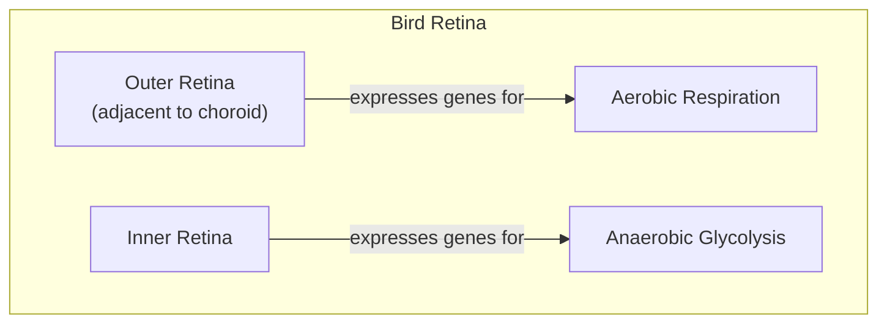
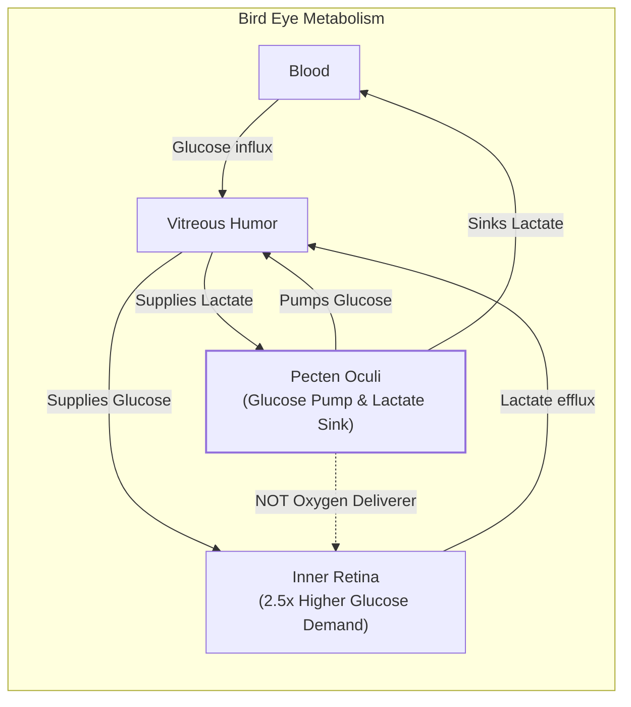
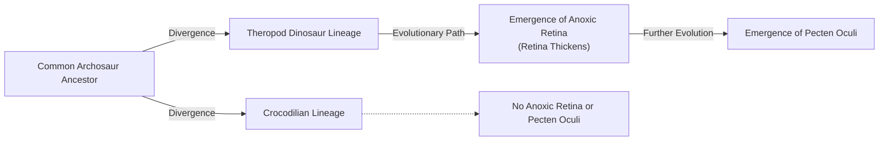

# How Bird Eyes Evolved to See Without Oxygen

In human medicine, a blocked retinal artery is a crisis. Known as a retinal vascular occlusion, it cuts off the blood supply to the light-sensitive tissue at the back of the eye, rapidly and often irreversibly destroying vision. The vascularized inner layers of the human retina are the first to die during an ischemic event. Yet, birds, whose visual acuity is among the sharpest in the animal kingdom, operate with retinas that are entirely avascular. They have no blood vessels at all. A hawk can spot a mouse from hundreds of feet in the air, a feat enabled by superior neural hardware. While humans have about 200,000 photoreceptors per square millimeter, a common buzzard packs in 1,000,000 [[7]](https://www.mdpi.com/1422-0067/22/7/3689), [[8]](https://en.wikipedia.org/wiki/Bird_vision).

The retina is one of the body's most energy-hungry tissues, consuming oxygen and glucose at a rate two to three times higher than the brain itself. This intense metabolic demand has long created a paradox for biologists. For centuries, scientists assumed that birds must possess some undiscovered mechanism for acquiring oxygen, because standard vertebrate physiology seemed impossible without a direct blood supply. The avascular retina of a short-toed snake eagle, for instance, is over 600 micrometers thick, far exceeding the diffusion limit for oxygen in mammalian neural tissue. "According to everything we know about physiology, this tissue should not be able to function," explains Christian Damsgaard, an evolutionary physiologist at Aarhus University [[1]](https://www.nature.com/articles/s41586-025-09978-w), [[2]](https://www.quantamagazine.org/how-the-bird-eye-was-pushed-to-an-evolutionary-extreme-20260513).

A recent study finally resolves this long-standing mystery. The inner layers of the bird retina exist in a state of chronic anoxia, or total oxygen deprivation. Instead of relying on a novel oxygen-delivery system, the tissue has adapted to survive and function by using anaerobic glycolysis. This is a less efficient but oxygen-free method of energy production. This discovery represents an evolutionary extreme, offering a new perspective on how metabolically active tissues can function without oxygen. This has profound implications, not just for our understanding of evolution, but also for developing treatments for human conditions like stroke and ischemia [[1]](https://www.nature.com/articles/s41586-025-09978-w).

https://www.quantamagazine.org/wp-content/uploads/2026/05/ChristianDamsgaard-crJesperEkmann-scaled.webp
<small><em>The evolutionary physiologist Christian Damsgaard measured gas exchange in bird eyes with microsensors. Surprisingly, the inner retina, a highly active tissue, used no oxygen. - Jesper Ekmann</em></small>

Before we can appreciate how birds solved this paradox, we need to revisit how oxygen came to dominate complex life and why its absence is normally catastrophic.

## Oxygenated Life: The Great Oxidation Event and Metabolic Trade-offs

Life on Earth spent its first two billion years in an anaerobic world. That changed around 2.4 billion years ago with the Great Oxidation Event, when photosynthetic cyanobacteria began releasing vast quantities of oxygen into the atmosphere. This event fundamentally reshaped our planet's chemistry and unlocked a new, far more efficient way to produce ATP, the universal energy currency of the cell. This transformation was so profound that it triggered a mass extinction of anaerobic organisms, paving the way for oxygen-breathing life to dominate [[2]](https://www.quantamagazine.org/how-the-bird-eye-was-pushed-to-an-evolutionary-extreme-20260513).

The biochemical contrast is stark. Anaerobic glycolysis, the ancient energy pathway, yields a mere two ATP molecules per molecule of glucose. Aerobic respiration, which uses oxygen, can produce up to 32 ATP from the same starting material, making it over 15 times more efficient. This enormous energetic advantage allowed for the evolution of complex, multicellular organisms and locked most of life into a deep dependency on oxygen. As molecular physiologist Gary Lewin puts it, "We’ve been hooked on 20% [atmospheric] oxygen for millions of years." This reliance on aerobic respiration became the standard metabolic model for virtually all complex life, from insects to mammals [[1]](https://www.nature.com/articles/s41586-025-09978-w), [[2]](https://www.quantamagazine.org/how-the-bird-eye-was-pushed-to-an-evolutionary-extreme-20260513).

https://www.quantamagazine.org/wp-content/uploads/2026/05/BirdFlying-crJean-PaulWettstein-scaled.webp
<small><em>Birds, such as this alpine chough (in the crow family), use their exceptional vision to hunt, forage, and migrate. - Jean-Paul Wettstein</em></small>

This dependency comes with a critical vulnerability. In humans, just a few minutes without oxygen can cause irreversible brain damage because energy-intensive processes shut down. Our own retinas are similarly fragile. Other species, however, show remarkable anoxia tolerance. The naked mole-rat, a subterranean rodent living in hypoxic burrows, can survive for 18 minutes without any oxygen by switching to a fructose-based anaerobic metabolism. Certain freshwater turtles can endure months of anoxia while hibernating in frozen ponds. These are exceptions that prove the rule. For most vertebrates, and especially for highly active neural tissues, the absence of oxygen is a death sentence [[2]](https://www.quantamagazine.org/how-the-bird-eye-was-pushed-to-an-evolutionary-extreme-20260513), [[3]](https://doi.org/10.1126/science.aab3896).

https://www.quantamagazine.org/wp-content/uploads/2026/05/NakedMoleRats-crJavierAbalos-scaled.webp
<small><em>Naked mole rats can survive without oxygen for 18 minutes. To generate energy without oxygen, they use anaerobic glycolysis fueled by fructose. - Javier Ábalos</em></small>

With this metabolic context established, we can now examine the mysterious vascular structure that enables birds to push the vertebrate eye to an extreme never seen in other lineages.

## A Mysterious Structure: The Pecten Oculi and Chronic Anoxia

The key to the bird's avascular retina lies in a structure called the pecten oculi. First described in the 17th century, this comb-like, highly vascularized organ protrudes into the vitreous humor of the bird's eye. For centuries, it has been the subject of speculation, generating over 30 competing hypotheses about its function. The most persistent theory was that it supplied oxygen to the retina, but this was never directly tested. "Nobody had really done direct physiological measurements on this structure," says Damsgaard [[1]](https://www.nature.com/articles/s41586-025-09978-w), [[2]](https://www.quantamagazine.org/how-the-bird-eye-was-pushed-to-an-evolutionary-extreme-20260513).

https://www.quantamagazine.org/wp-content/uploads/2026/05/Bird_Retina-Fig1-crMarkBelan_Desktopv1.svg
<small><em>Mark Belan/ _Quanta Magazine_</em></small>

To solve this puzzle, Damsgaard’s team performed the first-ever direct physiological measurements inside the eyes of living birds. Using incredibly fine microsensors with tips just 10-25 micrometers in diameter, they measured oxygen levels across the retinas of zebra finches, pigeons, and chickens. The results were unexpected and completely overturned centuries of assumptions. They found zero oxygen tension throughout the inner retina. "Half of the retina lives in a chronic state of anoxia, where there’s no oxygen present at all," Damsgaard reported. The pecten was not delivering oxygen; the retina was simply living without it [[1]](https://www.nature.com/articles/s41586-025-09978-w), [[2]](https://www.quantamagazine.org/how-the-bird-eye-was-pushed-to-an-evolutionary-extreme-20260513).

Image 5: A diagram illustrating the spatial distribution of metabolic gene expression within the bird retina, showing the outer retina expressing genes for aerobic respiration and the inner retina expressing genes for anaerobic glycolysis.

To understand how this was possible, the researchers turned to spatial transcriptomics, a technique that maps gene activity across tissue. They found a clear metabolic division. Genes for aerobic respiration were active only in the outer retinal layers, which receive some oxygen from the choroid, a vascular layer behind the retina. In the anoxic inner retina, only genes for anaerobic glycolysis were expressed. This metabolic mapping was further supported by the distribution of supporting cells, known as Müller cells, which contain the necessary enzymes to transport glucose and lactate, facilitating the anaerobic process [[1]](https://www.nature.com/articles/s41586-025-09978-w), [[2]](https://www.quantamagazine.org/how-the-bird-eye-was-pushed-to-an-evolutionary-extreme-20260513).

This anaerobic strategy comes at a high cost. Anaerobic glycolysis is roughly 15 times less efficient than aerobic metabolism, so the tissue must compensate with massive glucose throughput. The inner retina's glucose demand is about 2.5 times higher than other parts of the bird brain to compensate for this inefficiency. Here, the pecten oculi plays its true role. Instead of supplying oxygen, it acts as a metabolic gateway, pumping massive amounts of glucose into the eye and removing lactate, the toxic byproduct of anaerobic respiration [[4]](https://www.thetransmitter.org/vision/inner-retina-of-birds-powers-sight-sans-oxygen), [[9]](https://www.genengnews.com/topics/translational-medicine/how-bird-retinas-function-without-oxygen-may-inform-future-stroke-therapies), [[2]](https://www.quantamagazine.org/how-the-bird-eye-was-pushed-to-an-evolutionary-extreme-20260513).

The researchers found that genes for glucose transporters (GLUT1) and lactate transporters (MCT1) were highly active in the pecten, confirming its function as a fuel-in, waste-out system. This specialized transport system prevents the buildup of toxic metabolic waste that would otherwise kill the tissue. "The pecten is not an oxygen supplier," stated Jens Randel Nyengaard, a senior author on the study. "It is a transport system for fuel in and waste out" [[1]](https://www.nature.com/articles/s41586-025-09978-w), [[9]](https://www.genengnews.com/topics/translational-medicine/how-bird-retinas-function-without-oxygen-may-inform-future-stroke-therapies).

Image 6: Mermaid diagram illustrating the metabolic role of the pecten oculi in the bird eye, showing glucose and lactate pathways and the pecten's function as a glucose pump and lactate sink.

https://www.quantamagazine.org/wp-content/uploads/2026/05/BirdEyeGrid-scaled.webp
<small><em>The diversity of bird eyes, lacking blood vessels (left to right). Top: Northern gannet, Eurasian eagle-owl, maguari stork. Center: rooster, rockhopper penguin, parrot (species unknown). Bottom: bald eagle, blue-and-yellow macaw, unknown species.

(Left to right) Top: Chris Hellier, Jiří Dočkal, Annette Lozinski. Center: Mohammed Brzan, Nico Marín, Shyamli Kashyap. Bottom: Ingo Doerrie, David Clode, Hasan Almasi</em></small>

This finding—that roughly half of a bird's retina exists in a permanent state of healthy anoxia—is unprecedented in vertebrate biology. While experts were aware that the inner retina survived with low oxygen, this study confirmed it "works largely anaerobically," explained Frank Schaeffel of the University of Tübingen [[4]](https://www.thetransmitter.org/vision/inner-retina-of-birds-powers-sight-sans-oxygen).

"The insight that the retina basically goes oxygen-free, at least in some layers, is surprising," said Thomas Baden, a neuroscientist at the University of Sussex. "It really gets properly down to zero." This state is reminiscent of the Warburg effect, where cancer cells favor anaerobic glycolysis even when oxygen is present, or the temporary oxygen debt in our muscles during intense exercise. However, in the bird retina, it is a permanent and healthy condition, a metabolic strategy never before documented [[2]](https://www.quantamagazine.org/how-the-bird-eye-was-pushed-to-an-evolutionary-extreme-20260513).

Having established how the avian retina operates, we can now trace when and why this radical solution evolved and what it teaches us about selective pressures and future applications.

## Eyes Like a Hawk: Evolutionary Origins, Selective Pressures, and Implications

The bird’s retina and its no-oxygen power system are so unusual that they naturally raise questions about how they could have evolved. Evolution, as biologist François Jacob described in his 1977 paper, often works not like an engineer with a blueprint, but like a tinkerer who repurposes existing parts for new functions. This appears to be exactly what happened with the avian eye. Instead of inventing a novel oxygen-delivery system, evolution repurposed an ancient structure—the precursor to the pecten—to support a new metabolic strategy [[5]](https://doi.org/10.1126/science.860134).

Phylogenetic analysis pinpoints the timing of this innovation. The anoxic retina and the metabolically supportive pecten oculi appear to have arisen in the theropod dinosaur lineage, the ancestors of modern birds, after their split from crocodilians. To confirm this timing, researchers examined the retinas of modern reptiles like turtles and caimans, finding normal oxygen levels and no signs of anaerobic metabolism. This evolutionary change coincided with a measurable thickening of the retina, suggesting a strong link between the two events [[1]](https://www.nature.com/articles/s41586-025-09978-w), [[2]](https://www.quantamagazine.org/how-the-bird-eye-was-pushed-to-an-evolutionary-extreme-20260513).

Image 8: An evolutionary timeline illustrating the origin of the anoxic retina and pecten oculi in the theropod dinosaur lineage, following their split from crocodilians.

Fossil evidence suggests that pecten-like structures may have played a role in enhancing the visual acuity of extinct theropods, potentially aiding in nocturnal hunting and improving color discrimination. This indicates that the foundations for this unique visual system were laid long before modern birds took to the skies, driven by the sensory demands of a predatory lifestyle [[12]](https://en.wikipedia.org/wiki/Dinosaur_vision).

The selective pressures driving this change were likely strong. Predation, foraging, and long-distance migration all demand exceptionally high-acuity vision. However, blood vessels, a necessity in most thick retinas, scatter light and interfere with the optical path, limiting how densely photoreceptors and neurons can be packed. By eliminating blood vessels, the avian retina was free to evolve a thicker, more densely packed layer of neurons, directly enabling sharper resolution. This is quantified by visual acuity, measured in cycles per degree (cpd), where higher values mean finer detail can be resolved. The wedge-tailed eagle achieves an astonishing 143 cpd, more than double the human maximum, while even a small house sparrow (4.9 cpd) has a highly organized cone mosaic for its size [[10]](https://pmc.ncbi.nlm.nih.gov/articles/PMC10906485).

This vessel-free design is a key reason why birds see the world with such remarkable detail. Whether this was a direct adaptation for better vision or an evolutionary coincidence that was later co-opted for high-altitude flight—where oxygen levels are low—remains an open question. One prominent theory is that the avascular design first evolved to support a thicker retina for sharper vision, and only later served as an exaptation for flight in low-oxygen environments. This pattern is not unique; high-altitude insects also rely on anaerobic metabolism in their flight muscles to function in hypoxic conditions [[11]](https://pure.au.dk/portal/en/publications/oxygen-free-metabolism-in-the-bird-inner-retina-supported-by-the-).

This highlights a common challenge in evolutionary biology: distinguishing between a trait that evolved for a specific purpose and one that arose for other reasons and later proved useful in a new context. Gary Lewin cautions against overextending the results to all birds, given that migratory species have not yet been studied. This underscores the need for further research to fully understand the nuances of this adaptation across the avian family tree [[2]](https://www.quantamagazine.org/how-the-bird-eye-was-pushed-to-an-evolutionary-extreme-20260513), [[6]](https://doi.org/10.1016/j.cub.2025.12.028).

Beyond its evolutionary significance, this discovery has a clear biomedical payoff. Conditions like stroke and ischemic retinal disease are caused by oxygen deprivation and the buildup of metabolic waste. The bird retina offers a natural blueprint for how a complex neural tissue can not only survive but function effectively under these exact conditions. By studying the molecular machinery of the pecten and the metabolic pathways in retinal neurons, we may uncover new therapeutic strategies to protect human tissues from hypoxic damage. These insights could even inform hypoxia mitigation strategies for extreme environments like human spaceflight, where maintaining physiological function under altered atmospheric conditions is a major challenge [[1]](https://www.nature.com/articles/s41586-025-09978-w).

"Nature has solved a physiological problem in birds that makes humans sick," says Jens Randel Nyengaard. "We hope that understanding this evolutionary solution can inspire new ways of thinking about why tissues fail under oxygen deprivation in disease, and how such diseases can be treated." This sentiment is echoed by Damsgaard, who sees a wealth of knowledge in nature's extremes. "Maybe we can get inspiration for how nature solved these problems by millions of years of natural selection. There’s so much to be learned from these animals that are able to do something that we cannot do" [[2]](https://www.quantamagazine.org/how-the-bird-eye-was-pushed-to-an-evolutionary-extreme-20260513), [[9]](https://www.genengnews.com/topics/translational-medicine/how-bird-retinas-function-without-oxygen-may-inform-future-stroke-therapies).

## References

- [1] [Oxygen-free metabolism in the bird inner retina supported by the pecten](https://www.nature.com/articles/s41586-025-09978-w)
- [2] [How the Bird Eye Was Pushed to an Evolutionary Extreme](https://www.quantamagazine.org/how-the-bird-eye-was-pushed-to-an-evolutionary-extreme-20260513)
- [3] [Fructose-driven glycolysis supports anoxia resistance in the naked mole-rat](https://doi.org/10.1126/science.aab3896)
- [4] [Inner Retina of Birds Powers Sight Sans Oxygen](https://www.thetransmitter.org/vision/inner-retina-of-birds-powers-sight-sans-oxygen)
- [5] [Evolution and Tinkering](https://doi.org/10.1126/science.860134)
- [6] [Evolution of the vertebrate retina by repurposing of a composite ancestral median eye](https://doi.org/10.1016/j.cub.2025.12.028)
- [7] [Energy Metabolism in the Inner Retina in Health and Glaucoma](https://www.mdpi.com/1422-0067/22/7/3689)
- [8] [Bird vision - Wikipedia](https://en.wikipedia.org/wiki/Bird_vision)
- [9] [How Bird Retinas Function Without Oxygen May Inform Future Stroke Therapies](https://www.genengnews.com/topics/translational-medicine/how-bird-retinas-function-without-oxygen-may-inform-future-stroke-therapies)
- [10] [Ecological and morphological correlates of visual acuity in birds](https://pmc.ncbi.nlm.nih.gov/articles/PMC10906485)
- [11] [Oxygen-free metabolism in the bird inner retina supported by the pecten](https://pure.au.dk/portal/en/publications/oxygen-free-metabolism-in-the-bird-inner-retina-supported-by-the-)
- [12] [Dinosaur vision - Wikipedia](https://en.wikipedia.org/wiki/Dinosaur_vision)