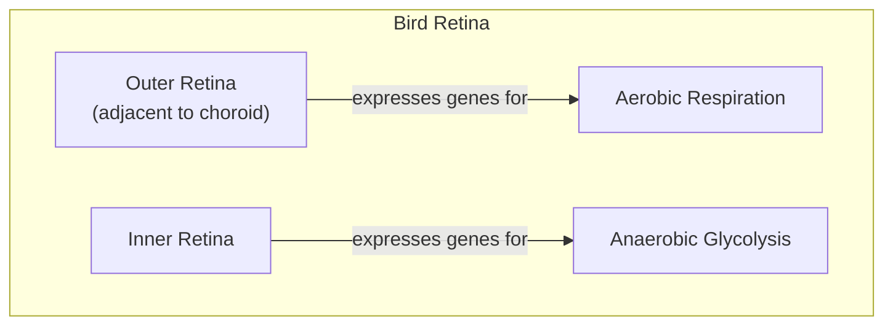
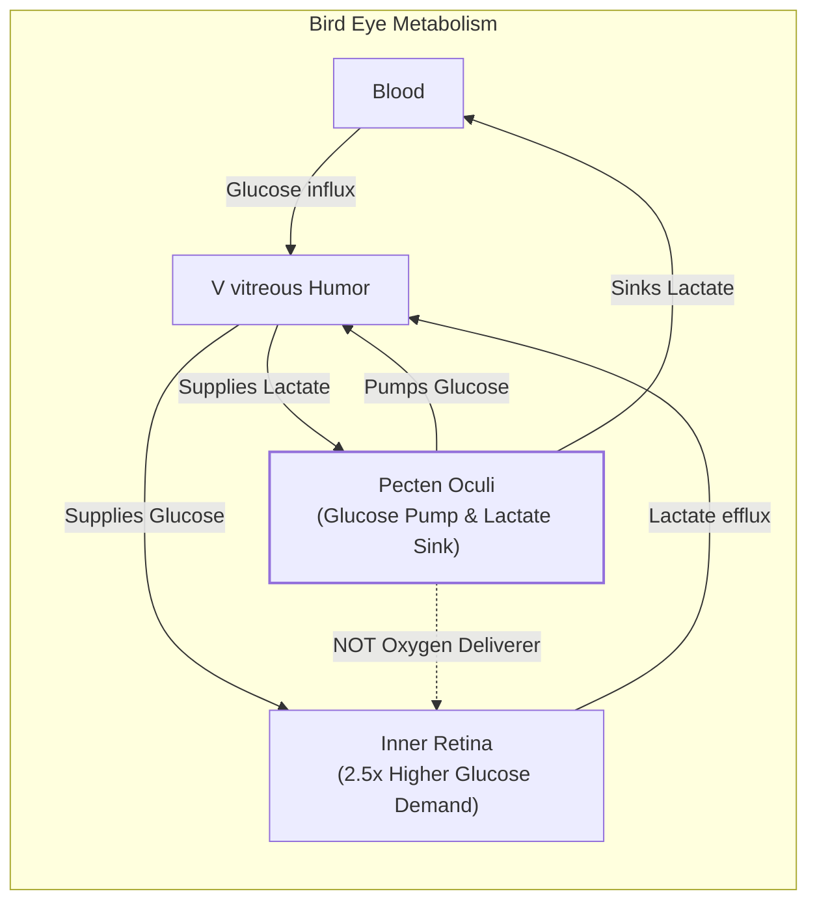
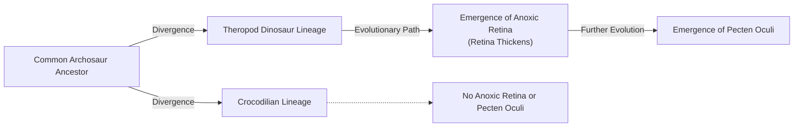

# How Bird Eyes Evolved to See Without Oxygen

In human medicine, a blocked retinal artery is a crisis. Known as a retinal vascular occlusion, it cuts off the blood supply to the light-sensitive tissue at the back of the eye, rapidly and often irreversibly destroying vision. In fact, the vascularized inner layers of the human retina are the first to die during an ischemic event [[7]](https://www.mdpi.com/1422-0067/22/7/3689). Yet, birds, whose visual acuity is among the sharpest in the animal kingdom, operate with retinas that are entirely avascular—they have no blood vessels at all. A hawk can spot a mouse from hundreds of feet in the air, a feat enabled by superior neural hardware. While humans have about 200,000 photoreceptors per square millimeter, a common buzzard packs in 1,000,000 [[8]](https://en.wikipedia.org/wiki/Bird_vision).

The retina is one of the body's most energy-hungry tissues, consuming oxygen and glucose at a rate two to three times higher than the brain itself [[1]](https://www.nature.com/articles/s41586-025-09978-w). This intense metabolic demand has long created a paradox for biologists. For centuries, scientists assumed that birds must possess some undiscovered mechanism for acquiring oxygen, because standard vertebrate physiology seemed impossible without a direct blood supply. "According to everything we know about physiology, this tissue should not be able to function," explains Christian Damsgaard, an evolutionary physiologist at Aarhus University [[2]](https://www.quantamagazine.org/how-the-bird-eye-was-pushed-to-an-evolutionary-extreme-20260513).

A recent study finally resolves this long-standing mystery. The inner layers of the bird retina exist in a state of chronic anoxia, or total oxygen deprivation. Instead of relying on a novel oxygen-delivery system, the tissue has adapted to survive and thrive by using anaerobic glycolysis—a less efficient but oxygen-free method of energy production [[1]](https://www.nature.com/articles/s41586-025-09978-w). This discovery represents an evolutionary extreme, offering a new perspective on how metabolically active tissues can function without oxygen. This has profound implications, not just for our understanding of evolution, but also for developing treatments for human conditions like stroke and ischemia.

https://www.quantamagazine.org/wp-content/uploads/2026/05/ChristianDamsgaard-crJesperEkmann-scaled.webp
Image 1: The evolutionary physiologist Christian Damsgaard measured gas exchange in bird eyes with microsensors. Surprisingly, the inner retina, a highly active tissue, used no oxygen. (Image by Jesper Ekmann from [Quanta Magazine](https://www.quantamagazine.org/how-the-bird-eye-was-pushed-to-an-evolutionary-extreme-20260513))

Before we can appreciate how birds solved this paradox, we need to revisit how oxygen came to dominate complex life and why its absence is normally catastrophic.

## Oxygenated Life: The Great Oxidation Event and Metabolic Trade-offs

Life on Earth spent its first two billion years in an anaerobic world. That changed with the Great Oxidation Event, when photosynthetic cyanobacteria began releasing vast quantities of oxygen into the atmosphere. This event fundamentally reshaped our planet's chemistry and unlocked a new, far more efficient way to produce ATP, the energy currency of the cell.

The biochemical contrast is stark. Anaerobic glycolysis, the ancient energy pathway, yields a mere two ATP molecules per molecule of glucose. Aerobic respiration, which uses oxygen, can produce up to 32 ATP from the same starting material [[1]](https://www.nature.com/articles/s41586-025-09978-w), [[2]](https://www.quantamagazine.org/how-the-bird-eye-was-pushed-to-an-evolutionary-extreme-20260513). This enormous energetic advantage allowed for the evolution of complex, multicellular organisms and locked most of life into a deep dependency on oxygen. As molecular physiologist Gary Lewin puts it, "We’ve been hooked on 20% [atmospheric] oxygen for millions of years" [[2]](https://www.quantamagazine.org/how-the-bird-eye-was-pushed-to-an-evolutionary-extreme-20260513).

https://www.quantamagazine.org/wp-content/uploads/2026/05/BirdFlying-crJean-PaulWettstein-scaled.webp
Image 2: Birds, such as this alpine chough (in the crow family), use their exceptional vision to hunt, forage, and migrate. (Image by Jean-Paul Wettstein from [Quanta Magazine](https://www.quantamagazine.org/how-the-bird-eye-was-pushed-to-an-evolutionary-extreme-20260513))

This dependency comes with a critical vulnerability. In humans, just a few minutes without oxygen can cause irreversible brain damage. Our own retinas are similarly fragile. Other species, however, show remarkable anoxia tolerance. The naked mole-rat, a subterranean rodent, can survive for 18 minutes without oxygen by switching to a fructose-based anaerobic metabolism [[3]](https://doi.org/10.1126/science.aab3896). Certain freshwater turtles can endure months of anoxia while hibernating in frozen ponds [[2]](https://www.quantamagazine.org/how-the-bird-eye-was-pushed-to-an-evolutionary-extreme-20260513). These are exceptions that prove the rule: for most vertebrates, and especially for highly active neural tissues, the absence of oxygen is a death sentence.

https://www.quantamagazine.org/wp-content/uploads/2026/05/NakedMoleRats-crJavierAbalos-scaled.webp
Image 3: Naked mole rats can survive without oxygen for 18 minutes. To generate energy without oxygen, they use anaerobic glycolysis fueled by fructose. (Image by Javier Ábalos from [Quanta Magazine](https://www.quantamagazine.org/how-the-bird-eye-was-pushed-to-an-evolutionary-extreme-20260513))

With this metabolic context established, we can now examine the mysterious vascular structure that enables birds to push the vertebrate eye to an extreme never seen in other lineages.

## A Mysterious Structure: The Pecten Oculi and Chronic Anoxia

The key to the bird's avascular retina lies in a structure called the pecten oculi. First described in the 17th century, this comb-like, highly vascularized organ protrudes into the vitreous humor of the bird's eye and has been the subject of speculation for centuries, generating over 30 competing hypotheses about its function [[1]](https://www.nature.com/articles/s41586-025-09978-w). The most persistent theory was that it supplied oxygen to the retina, but this was never directly tested. "It has been a mystery for a long time," says Damsgaard [[2]](https://www.quantamagazine.org/how-the-bird-eye-was-pushed-to-an-evolutionary-extreme-20260513).

https://www.quantamagazine.org/wp-content/uploads/2026/05/Bird_Retina-Fig1-crMarkBelan_Desktopv1.svg
Image 4: A diagram of the bird eye, showing the position of the pecten oculi. (Image by Mark Belan from [Quanta Magazine](https://www.quantamagazine.org/how-the-bird-eye-was-pushed-to-an-evolutionary-extreme-20260513))

To solve this puzzle, Damsgaard’s team performed the first-ever direct physiological measurements inside the eyes of living birds. Using incredibly fine microsensors, they measured oxygen levels across the retinas of zebra finches, pigeons, and chickens [[2]](https://www.quantamagazine.org/how-the-bird-eye-was-pushed-to-an-evolutionary-extreme-20260513). The results were stunning and completely overturned centuries of assumptions. They found zero oxygen tension throughout the inner retina. "Half of the retina lives in a chronic state of anoxia, where there’s no oxygen present at all," Damsgaard reported [[2]](https://www.quantamagazine.org/how-the-bird-eye-was-pushed-to-an-evolutionary-extreme-20260513). The pecten was not delivering oxygen; the retina was simply living without it.

Image 5: A diagram illustrating the spatial distribution of metabolic gene expression within the bird retina, showing the outer retina expressing genes for aerobic respiration and the inner retina expressing genes for anaerobic glycolysis.

To understand how this was possible, the researchers turned to spatial transcriptomics, a technique that maps gene activity across tissue. They found a clear metabolic division. Genes for aerobic respiration were active only in the outer retinal layers, which receive some oxygen from the choroid, a vascular layer behind the retina. In the anoxic inner retina, only genes for anaerobic glycolysis were expressed [[1]](https://www.nature.com/articles/s41586-025-09978-w), [[2]](https://www.quantamagazine.org/how-the-bird-eye-was-pushed-to-an-evolutionary-extreme-20260513).

This anaerobic strategy comes at a high cost. Anaerobic glycolysis is roughly 15 times less efficient than aerobic metabolism, so the tissue must compensate with massive glucose throughput [[4]](https://www.thetransmitter.org/vision/inner-retina-of-birds-powers-sight-sans-oxygen), [[9]](https://www.genengnews.com/topics/translational-medicine/how-bird-retinas-function-without-oxygen-may-inform-future-stroke-therapies). The inner retina's glucose demand is about 2.5 times higher than other parts of the bird brain to compensate for this inefficiency [[2]](https://www.quantamagazine.org/how-the-bird-eye-was-pushed-to-an-evolutionary-extreme-20260513). Here, the pecten oculi plays its true role. Instead of supplying oxygen, it acts as a metabolic gateway, pumping massive amounts of glucose into the eye and removing lactate, the toxic byproduct of anaerobic respiration [[1]](https://www.nature.com/articles/s41586-025-09978-w), [[4]](https://www.thetransmitter.org/vision/inner-retina-of-birds-powers-sight-sans-oxygen). The researchers found that genes for glucose and lactate transporters were highly active in the pecten, confirming its function as a fuel-in, waste-out system [[2]](https://www.quantamagazine.org/how-the-bird-eye-was-pushed-to-an-evolutionary-extreme-20260513). "The pecten is not an oxygen supplier," stated Jens Randel Nyengaard, a senior author on the study. "It is a transport system for fuel in and waste out" [[9]](https://www.genengnews.com/topics/translational-medicine/how-bird-retinas-function-without-oxygen-may-inform-future-stroke-therapies).

Image 6: Mermaid diagram illustrating the metabolic role of the pecten oculi in the bird eye, showing glucose and lactate pathways and the pecten's function as a glucose pump and lactate sink.

https://www.quantamagazine.org/wp-content/uploads/2026/05/BirdEyeGrid-scaled.webp
Image 7: The diversity of bird eyes, lacking blood vessels (left to right). Top: Northern gannet, Eurasian eagle-owl, maguari stork. Center: rooster, rockhopper penguin, parrot (species unknown). Bottom: bald eagle, blue-and-yellow macaw, unknown species. (Image by Chris Hellier, Jiří Dočkal, Annette Lozinski, Mohammed Brzan, Nico Marín, Shyamli Kashyap, Ingo Doerrie, David Clode, Hasan Almasi from [Quanta Magazine](https://www.quantamagazine.org/how-the-bird-eye-was-pushed-to-an-evolutionary-extreme-20260513))

This finding—that roughly half of a bird's retina exists in a permanent state of healthy anoxia—is unprecedented in vertebrate biology. While experts were aware that the inner retina survived with low oxygen, this study confirmed it "works largely anaerobically," explained Frank Schaeffel of the University of Tübingen [[4]](https://www.thetransmitter.org/vision/inner-retina-of-birds-powers-sight-sans-oxygen). "The insight that the retina basically goes oxygen-free, at least in some layers, is surprising," said Thomas Baden, a neuroscientist at the University of Sussex. "It really gets properly down to zero" [[2]](https://www.quantamagazine.org/how-the-bird-eye-was-pushed-to-an-evolutionary-extreme-20260513). This state is reminiscent of the Warburg effect, where cancer cells favor anaerobic glycolysis even when oxygen is present, or the temporary oxygen debt in our muscles during intense exercise. However, in the bird retina, it is a permanent and healthy condition, a metabolic strategy never before documented [[2]](https://www.quantamagazine.org/how-the-bird-eye-was-pushed-to-an-evolutionary-extreme-20260513).

Having established how the avian retina operates, we can now trace when and why this radical solution evolved and what it teaches us about selective pressures and future applications.

## Eyes Like a Hawk: Evolutionary Origins, Selective Pressures, and Implications

The bird’s retina and its no-oxygen power system are so unusual that they naturally raise questions about how they could have evolved. Evolution, as biologist François Jacob described in his 1977 paper, often works not like an engineer with a blueprint, but like a tinkerer who repurposes existing parts for new functions [[5]](https://doi.org/10.1126/science.860134). This appears to be exactly what happened with the avian eye. Instead of inventing a novel oxygen-delivery system, evolution repurposed an ancient structure—the precursor to the pecten—to support a new metabolic strategy.

Phylogenetic analysis pinpoints the timing of this innovation. The anoxic retina and the metabolically supportive pecten oculi appear to have arisen in the theropod dinosaur lineage, the ancestors of modern birds, after their split from crocodilians [[1]](https://www.nature.com/articles/s41586-025-09978-w), [[2]](https://www.quantamagazine.org/how-the-bird-eye-was-pushed-to-an-evolutionary-extreme-20260513). To confirm this timing, researchers examined the retinas of modern reptiles like turtles and caimans, finding normal oxygen levels and no signs of anaerobic metabolism [[2]](https://www.quantamagazine.org/how-the-bird-eye-was-pushed-to-an-evolutionary-extreme-20260513). This evolutionary change coincided with a measurable thickening of the retina, suggesting a strong link between the two events.

Image 8: An evolutionary timeline illustrating the origin of the anoxic retina and pecten oculi in the theropod dinosaur lineage, following their split from crocodilians.

The selective pressures driving this change were likely immense. Predation, foraging, and long-distance migration all demand exceptionally high-acuity vision. However, blood vessels, a necessity in most thick retinas, scatter light and interfere with the optical path, limiting how densely photoreceptors and neurons can be packed [[1]](https://www.nature.com/articles/s41586-025-09978-w). By eliminating blood vessels, the avian retina was free to evolve a thicker, more densely packed layer of neurons, directly enabling sharper resolution. Indeed, research shows that birds whose foraging requires resolving prey from a distance have significantly higher acuity [[10]](https://pmc.ncbi.nlm.nih.gov/articles/PMC10906485). This vessel-free design is a key reason why birds see the world with such incredible detail.

Whether this was a direct adaptation for better vision or an evolutionary coincidence that was later co-opted for high-altitude flight—where oxygen levels are low—remains an open question. One prominent theory is that the avascular design first evolved to support a thicker retina for sharper vision, and only later served as an exaptation for flight in low-oxygen environments [[11]](https://pure.au.dk/portal/en/publications/oxygen-free-metabolism-in-the-bird-inner-retina-supported-by-the-). It highlights a common challenge in evolutionary biology: distinguishing between a trait that evolved for a specific purpose and one that arose for other reasons and later proved useful in a new context [[6]](https://doi.org/10.1016/j.cub.2025.12.028).

Beyond its evolutionary significance, this discovery has a clear biomedical payoff. Conditions like stroke and ischemic retinal disease are caused by oxygen deprivation and the buildup of metabolic waste [[1]](https://www.nature.com/articles/s41586-025-09978-w). The bird retina offers a natural blueprint for how a complex neural tissue can not only survive but thrive under these exact conditions. By studying the molecular machinery of the pecten and the metabolic pathways in retinal neurons, we may uncover new therapeutic strategies to protect human tissues from hypoxic damage. "Nature has solved a physiological problem in birds that makes humans sick," says Jens Randel Nyengaard, a senior author on the study [[9]](https://www.genengnews.com/topics/translational-medicine/how-bird-retinas-function-without-oxygen-may-inform-future-stroke-therapies). Understanding this system could inspire future medical solutions, demonstrating once again how nature's most extreme solutions can offer profound lessons for human health.

## References

- [1] [Oxygen-free metabolism in the bird inner retina supported by the pecten](https://www.nature.com/articles/s41586-025-09978-w)
- [2] [How the Bird Eye Was Pushed to an Evolutionary Extreme](https://www.quantamagazine.org/how-the-bird-eye-was-pushed-to-an-evolutionary-extreme-20260513)
- [3] [Fructose-driven glycolysis supports anoxia resistance in the naked mole-rat](https://doi.org/10.1126/science.aab3896)
- [4] [Inner Retina of Birds Powers Sight Sans Oxygen](https://www.thetransmitter.org/vision/inner-retina-of-birds-powers-sight-sans-oxygen)
- [5] [Evolution and Tinkering](https://doi.org/10.1126/science.860134)
- [6] [Evolution of the vertebrate retina by repurposing of a composite ancestral median eye](https://doi.org/10.1016/j.cub.2025.12.028)
- [7] [Energy Metabolism in the Inner Retina in Health and Glaucoma](https://www.mdpi.com/1422-0067/22/7/3689)
- [8] [Bird vision - Wikipedia](https://en.wikipedia.org/wiki/Bird_vision)
- [9] [How Bird Retinas Function Without Oxygen May Inform Future Stroke Therapies](https://www.genengnews.com/topics/translational-medicine/how-bird-retinas-function-without-oxygen-may-inform-future-stroke-therapies)
- [10] [Ecological and morphological correlates of visual acuity in birds](https://pmc.ncbi.nlm.nih.gov/articles/PMC10906485)
- [11] [Oxygen-free metabolism in the bird inner retina supported by the pecten](https://pure.au.dk/portal/en/publications/oxygen-free-metabolism-in-the-bird-inner-retina-supported-by-the-)