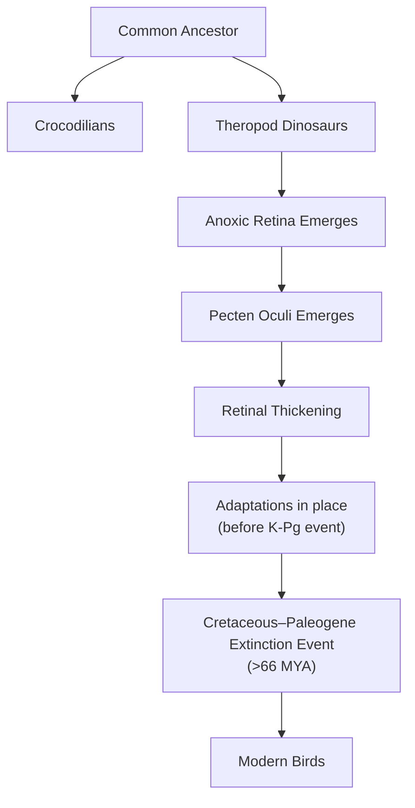

# The Unlit Engine: How Bird Eyes Function Without Oxygen

In human medicine, a retinal vascular occlusion is a critical emergency. This blockage of the blood vessels that feed the eye starves the retina of oxygen, rapidly and irreversibly destroying vision. Yet, birds operate with completely avascular retinas. They have no internal blood vessels at all. Despite this apparent handicap, they achieve visual acuity far superior to our own, with a hawk able to spot its prey from hundreds of feet in the air. This contradiction represents one of biology’s most enduring puzzles.

As engineers, we are obsessed with optimizing systems for energy efficiency. It is fascinating to see how nature, the ultimate engineer, solves similar problems under extreme constraints. The retina is one of the body’s most energy-hungry tissues, consuming oxygen and glucose at a rate two to three times higher than the brain itself [[1]](https://www.nature.com/articles/s41586-025-09978-w). For centuries, scientists assumed birds must possess some undiscovered mechanism for acquiring oxygen, because standard vertebrate physiology seemed impossible without a direct blood supply. The pecten oculi, a mysterious structure in the bird eye, has been known since the 17th century, but its function was never directly tested, leading to over 30 different theories [[3]](https://www.quantamagazine.org/how-the-bird-eye-was-pushed-to-an-evolutionary-extreme-20260513). As evolutionary physiologist Christian Damsgaard notes, “According to everything we know about physiology, this tissue should not be able to function” [[2]](https://uol.de/en/news/article/birds-retinas-function-without-oxygen).

A recent study this lesson explores finally resolves this paradox. The inner layers of the bird retina exist in a state of chronic anoxia, or total oxygen deprivation. They survive not through a novel oxygen-delivery system but by relying on anaerobic glycolysis. This is a far less efficient energy pathway that does not require oxygen [[1]](https://www.nature.com/articles/s41586-025-09978-w). This finding reframes our understanding of metabolic limits and showcases an evolutionary extreme of tissue survival. It also carries direct medical translation potential for human conditions involving ischemia, from stroke to retinal disease.
Image 1: The evolutionary physiologist Christian Damsgaard measured gas exchange in bird eyes with microsensors. (Image by Jesper Ekmann from [Quanta Magazine](https://www.quantamagazine.org/how-the-bird-eye-was-pushed-to-an-evolutionary-extreme-20260513))

Before you can appreciate how birds solved this paradox, you need to revisit how oxygen came to dominate complex life and why its absence is normally catastrophic.

## Oxygenated Life: The Great Oxidation Event and Metabolic Trade-offs

Roughly 2.4 billion years ago, cyanobacteria began releasing oxygen into the atmosphere through photosynthesis, triggering the Great Oxidation Event. This fundamentally reshaped Earth’s chemistry and unlocked a new, vastly more efficient way to produce cellular energy. While anaerobic glycolysis yields a mere two molecules of ATP per molecule of glucose, aerobic respiration can generate up to 32 [[3]](https://www.quantamagazine.org/how-the-bird-eye-was-pushed-to-an-evolutionary-extreme-20260513), [[4]](https://www.thetransmitter.org/vision/inner-retina-of-birds-powers-sight-sans-oxygen). This enormous energetic advantage was transformative, allowing oxygen-using organisms to outcompete nearly everything else and locking complex multicellular life into a dependence on aerobic metabolism.
Image 2: Birds, such as this alpine chough, use their exceptional vision for complex tasks like hunting and migration. (Image by Jean-Paul Wettstein from [Quanta Magazine](https://www.quantamagazine.org/how-the-bird-eye-was-pushed-to-an-evolutionary-extreme-20260513))

This evolutionary path has made most vertebrates extremely vulnerable to oxygen deprivation. "We’ve been hooked on 20% [atmospheric] oxygen for millions of years," says Gary Lewin, a molecular physiologist at the Max Delbrück Center in Berlin [[3]](https://www.quantamagazine.org/how-the-bird-eye-was-pushed-to-an-evolutionary-extreme-20260513). For humans, just a few minutes without oxygen can cause irreversible brain damage. The retina is similarly sensitive. In fact, the mammalian retina operates as a delicate metabolic ecosystem where photoreceptors convert glucose to lactate even when oxygen is present. This lactate serves as a primary fuel for other retinal cells, a strategy tuned to spare glucose for the most energy-intensive cells [[13]](https://elifesciences.org/articles/28899).

However, tolerance for anoxia varies across the animal kingdom. At one extreme are certain turtles, which can endure years of complete oxygen deprivation while hibernating. Diving mammals survive by inducing hypometabolism and hypothermia, drastically reducing their brain's oxygen demand [[14]](https://pmc.ncbi.nlm.nih.gov/articles/PMC3768097). A more active example is the naked mole-rat, which lives in crowded, low-oxygen burrows. It can survive for 18 minutes without any oxygen by switching to a metabolic pathway fueled by fructose. This sugar can be processed anaerobically, bypassing the feedback loops that normally shut down glycolysis [[5]](https://www.sciencemag.org/content/356/6335/307/suppl/DC1). This strategy avoids the lethal consequences of oxygen deprivation that affect other mammals. Still, these are temporary survival mechanisms. The bird retina, in contrast, represents a permanent, healthy state of anoxia in one of the body's most active tissues.
Image 3: Naked mole-rats survive anoxia by using a fructose-fueled metabolic pathway. (Image by Javier Ábalos from [Quanta Magazine](https://www.quantamagazine.org/how-the-bird-eye-was-pushed-to-an-evolutionary-extreme-20260513))

With this metabolic context established, you can now examine the mysterious vascular structure that enables birds to push the vertebrate eye to an extreme never seen in other lineages.

## A Mysterious Structure: The Pecten Oculi and Chronic Anoxia

The key to the bird’s anoxic retina is the pecten oculi, a comb-like, highly vascularized structure that protrudes into the eye's vitreous humor. First described in the 17th century, its function has been a subject of speculation for centuries, generating over 30 competing hypotheses [[2]](https://uol.de/en/news/article/birds-retinas-function-without-oxygen), [[1]](https://www.nature.com/articles/s41586-025-09978-w). The prevailing theory was that it must supply oxygen to the retina, but as Damsgaard notes, “Nobody had really done direct physiological measurements on this structure” [[3]](https://www.quantamagazine.org/how-the-bird-eye-was-pushed-to-an-evolutionary-extreme-20260513). Damsgaard and his team set out to do just that, a task he described as "technically extremely challenging," requiring delicate measurements under stable physiological conditions [[6]](https://www.eurekalert.org/news-releases/1113036).
Image 4: A diagram showing the structure of the bird eye, including the pecten oculi and the avascular retina. (Image by Mark Belan from [Quanta Magazine](https://www.quantamagazine.org/how-the-bird-eye-was-pushed-to-an-evolutionary-extreme-20260513))

Using microsensors to measure oxygen levels directly inside the eyes of zebra finches, pigeons, and chickens, the researchers made a striking discovery: there was no oxygen in the inner retina [[3]](https://www.quantamagazine.org/how-the-bird-eye-was-pushed-to-an-evolutionary-extreme-20260513). "Half of the retina lives in a chronic state of anoxia, where there’s no oxygen present at all," Damsgaard stated [[3]](https://www.quantamagazine.org/how-the-bird-eye-was-pushed-to-an-evolutionary-extreme-20260513). This finding overturned centuries of assumptions. The pecten was not delivering oxygen. In fact, it contributed only 0.76% of the retina's total oxygen supply. The vast majority came from the choroid at the back of the eye, which only oxygenates the outer photoreceptor layer [[1]](https://www.nature.com/articles/s41586-025-09978-w).

To understand how this oxygen-deprived tissue could function, the team turned to spatial transcriptomics, a technique that maps the activity of 5,000 to 10,000 genes at once, creating a "molecular GPS" for the tissue [[11]](https://www.genengnews.com/topics/translational-medicine/how-bird-retinas-function-without-oxygen-may-inform-future-stroke-therapies). The results were clear. Genes for aerobic respiration were active only in the outer retina, where oxygen was present. In the anoxic inner retina, only genes for anaerobic glycolysis were expressed [[1]](https://www.nature.com/articles/s41586-025-09978-w). This metabolic strategy comes at a cost. Anaerobic glycolysis is inefficient, so the inner retina’s glucose demand is about 2.5 times higher than other parts of the bird brain [[7]](https://bio.au.dk/en/about-biology/news-and-events/show/artikel/fugles-nethinder-lever-uden-ilt-aarhundredgammelt-biologisk-mysterium-er-opklaret), [[3]](https://www.quantamagazine.org/how-the-bird-eye-was-pushed-to-an-evolutionary-extreme-20260513).

The investigation then revealed the pecten's true function. It acts as a metabolic gateway. It is rich in glucose transporters (GLUT1) that pump fuel into the retina and monocarboxylate transporters (MCT1) that remove the waste products of anaerobic metabolism, like lactic acid, preventing toxic buildup [[8]](https://www.sdu.dk/en/om-sdu/fakulteterne/naturvidenskab/nyheder-2026/bird-retina), [[3]](https://www.quantamagazine.org/how-the-bird-eye-was-pushed-to-an-evolutionary-extreme-20260513). The data showed a steep glucose gradient from blood plasma (25.9 mM) to the eye's vitreous humor (14.9 mM), and an even steeper reverse gradient for lactate (4.2 mM in plasma vs. 24.6 mM in vitreous) [[1]](https://www.nature.com/articles/s41586-025-09978-w). This elegant solution allows the bird retina to remain free of blood vessels, which would otherwise scatter light and compromise vision.

This transport system isn't limited to the pecten. Müller cells, a type of glial cell that spans the retina, also express high levels of these transporters, helping to shuttle fuel in and waste out [[4]](https://www.thetransmitter.org/vision/inner-retina-of-birds-powers-sight-sans-oxygen). This elegant solution allows the bird retina to remain free of blood vessels, which would otherwise scatter light and compromise vision.
Image 5: The diversity of bird eyes, which lack the blood vessels common in other vertebrates. (Image by various artists from [Quanta Magazine](https://www.quantamagazine.org/how-the-bird-eye-was-pushed-to-an-evolutionary-extreme-20260513))

This finding—that roughly half of a bird's retina exists in a permanent state of anoxia—is unprecedented in vertebrates. Thomas Baden, a neuroscientist at the University of Sussex, called it surprising, noting, "It really gets properly down to zero" [[3]](https://www.quantamagazine.org/how-the-bird-eye-was-pushed-to-an-evolutionary-extreme-20260513). While cancer cells use a similar process known as the Warburg effect, and our muscles resort to it temporarily during intense exercise, this is the first known instance of a vertebrate tissue functioning in a completely anoxic state for its entire lifetime [[3]](https://www.quantamagazine.org/how-the-bird-eye-was-pushed-to-an-evolutionary-extreme-20260513).

Having established how the avian retina operates, you can now trace when and why this radical solution evolved and what it teaches us about selective pressures and future applications.

## Eyes Like a Hawk: Evolutionary Origins, Selective Pressures, and Implications

The bird’s retina and its oxygen-free power system are so unusual that they naturally raise questions about how they could have evolved. As biologist François Jacob argued in his 1977 paper, evolution does not engineer new solutions from scratch. It works like a tinkerer, repurposing existing structures for new functions [[9]](https://science.sciencemag.org/content/196/4295/1161). The vertebrate eye is an ancient structure, with its origins tracing back to a light-sensitive patch on an early chordate some 560 million years ago [[12]](https://doi.org/10.1016/j.cub.2025.12.028). Instead of inventing a novel oxygen-delivery system, evolution tinkered with the eye's metabolism to make it work without oxygen.

Phylogenetic analysis helps us pinpoint when this change occurred. By comparing oxygen levels in the retinas of birds to their relatives like turtles and caimans, which have normal oxygen levels, Damsgaard’s team concluded that the anoxic retina likely evolved in the theropod dinosaur lineage, after the split from crocodilians [[3]](https://www.quantamagazine.org/how-the-bird-eye-was-pushed-to-an-evolutionary-extreme-20260513). This adaptation coincided with a measurable thickening of the retina, which would have increased diffusion distances and created the selective pressure for a new metabolic strategy [[1]](https://www.nature.com/articles/s41586-025-09978-w). The primary driver was likely intense pressure for high-acuity vision, essential for tracking prey, foraging, and navigating complex environments.

Image 6: Phylogenetic tree illustrating the evolutionary origin of the anoxic retina and pecten oculi in birds.

The functional advantage of this design is clear. Blood vessels scatter light, which limits the packing density of neurons and compromises visual resolution. By eliminating them, birds could evolve retinas with denser arrays of photoreceptors and ganglion cells. Studies have shown that avian cones form highly regular, independent mosaics that tile the retina, ensuring uniform sampling of visual space [[10]](https://journals.plos.org/plosone/article?id=10.1371/journal.pone.0008992). This dense, orderly arrangement, which directly enables the razor-sharp vision for which birds are famous, would be impossible with a vascularized retina.

An open question remains whether this vessel-free design was a direct adaptation for sharper vision or an evolutionary coincidence that was later co-opted. The anoxic retina, once established, may have served as an exaptation. A trait that evolved for one purpose but was later used for another. Damsgaard speculates that it "served as the physiological basis for maintaining retinal function" during high-altitude flights, where low atmospheric oxygen levels would severely challenge an oxygen-dependent retina [[3]](https://www.quantamagazine.org/how-the-bird-eye-was-pushed-to-an-evolutionary-extreme-20260513). However, physiologist Gary Lewin cautions against overextending these interpretations to all birds, given that migratory species have not yet been studied [[3]](https://www.quantamagazine.org/how-the-bird-eye-was-pushed-to-an-evolutionary-extreme-20260513).

The biomedical implications are substantial. Conditions like stroke and ischemic retinal diseases are devastating precisely because our neural tissues cannot tolerate oxygen deprivation. The mechanisms that allow the bird retina to function without oxygen offer a new roadmap for developing therapies. By studying how birds manage glucose supply and waste removal in an anoxic environment, we may discover new ways to protect human tissues from hypoxic damage. Some research is even exploring whether the genes for the avian pecten's highly efficient glucose pumps could one day be engineered into human retinal implants to better nourish damaged tissue, though major challenges remain [[3]](https://www.quantamagazine.org/how-the-bird-eye-was-pushed-to-an-evolutionary-extreme-20260513). As Damsgaard puts it, "Maybe we can get inspiration for how nature solved these problems by millions of years of natural selection. There’s so much to be learned from these animals that are able to do something that we cannot do" [[3]](https://www.quantamagazine.org/how-the-bird-eye-was-pushed-to-an-evolutionary-extreme-20260513).

## Conclusion

In this lesson, you have unraveled a centuries-old biological mystery. You learned that the bird retina, one of the most metabolically active tissues in the animal kingdom, functions without a direct oxygen supply. This is made possible by a permanent switch to anaerobic glycolysis, supported by the pecten oculi, which acts as a sophisticated fuel-and-waste-exchange system.

This remarkable adaptation not only explains the superior vision of birds but also pushes the known boundaries of vertebrate physiology. It serves as a powerful example of evolutionary tinkering, where existing structures are repurposed to solve complex problems. As we continue to explore the extremes of life, the lessons from the bird's eye may one day help us develop new strategies to combat human diseases rooted in oxygen deprivation.

## References

- [1] [Oxygen-free metabolism in the bird inner retina supported by the pecten](https://www.nature.com/articles/s41586-025-09978-w)
- [2] [Birds retinas function without oxygen // University of Oldenburg](https://uol.de/en/news/article/birds-retinas-function-without-oxygen)
- [3] [How the Bird Eye Was Pushed to an Evolutionary Extreme](https://www.quantamagazine.org/how-the-bird-eye-was-pushed-to-an-evolutionary-extreme-20260513)
- [4] [Inner retina of birds powers sight sans oxygen](https://www.thetransmitter.org/vision/inner-retina-of-birds-powers-sight-sans-oxygen)
- [5] [Fructose-driven glycolysis supports anoxia resistance in the naked mole-rat](https://www.sciencemag.org/content/356/6335/307/suppl/DC1)
- [6] [Sight without oxygen: Secret of the bird retina unraveled](https://www.eurekalert.org/news-releases/1113036)
- [7] [Fugles nethinder lever uden ilt: Århundredgammelt biologisk mysterium er opklaret](https://bio.au.dk/en/about-biology/news-and-events/show/artikel/fugles-nethinder-lever-uden-ilt-aarhundredgammelt-biologisk-mysterium-er-opklaret)
- [8] [Bird retinas work without oxygen – solving an old biological puzzle](https://www.sdu.dk/en/om-sdu/fakulteterne/naturvidenskab/nyheder-2026/bird-retina)
- [9] [Evolution and Tinkering](https://science.sciencemag.org/content/196/4295/1161)
- [10] [Avian Cone Photoreceptors Tile the Retina as Five Independent, Self-Organizing Mosaics](https://journals.plos.org/plosone/article?id=10.1371/journal.pone.0008992)
- [11] [How Bird Retinas Function Without Oxygen May Inform Future Stroke Therapies](https://www.genengnews.com/topics/translational-medicine/how-bird-retinas-function-without-oxygen-may-inform-future-stroke-therapies)
- [12] [Evolution of the vertebrate retina by repurposing of a composite ancestral median eye](https://doi.org/10.1016/j.cub.2025.12.028)
- [13] [Biochemical adaptations of the retina and retinal pigment epithelium support a metabolic ecosystem in the vertebrate eye](https://elifesciences.org/articles/28899)
- [14] [Neuroglobin and cytoglobin in the brains of diving mammals](https://pmc.ncbi.nlm.nih.gov/articles/PMC3768097)