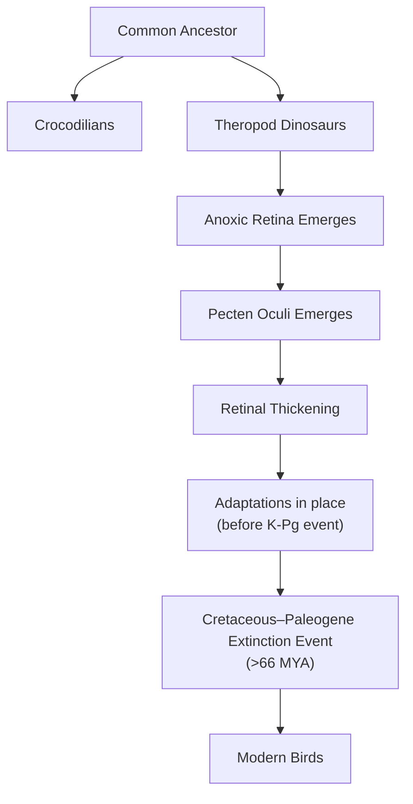

# The Unlit Engine: How Bird Eyes Thrive Without Oxygen

In human medicine, a retinal vascular occlusion—a blockage of the blood vessels that feed the eye—is a critical emergency. It starves the retina of oxygen, rapidly and irreversibly destroying vision. Yet, birds operate with completely avascular retinas, meaning they have no internal blood vessels at all. Despite this apparent handicap, they achieve visual acuity far superior to our own, with a hawk able to spot its prey from hundreds of feet in the air. This contradiction represents one of biology’s most enduring puzzles.

The retina is one of the body’s most energy-hungry tissues, consuming oxygen and glucose at a rate two to three times higher than the brain itself [[1]](https://www.nature.com/articles/s41586-025-09978-w). For centuries, scientists assumed birds must possess some undiscovered mechanism for acquiring oxygen, because standard vertebrate physiology seemed impossible without a direct blood supply. As evolutionary physiologist Christian Damsgaard notes, “According to everything we know about physiology, this tissue should not be able to function” [[2]](https://uol.de/en/news/article/birds-retinas-function-without-oxygen).

A recent study finally resolves this paradox. The inner layers of the bird retina exist in a state of chronic anoxia, or total oxygen deprivation. They survive not through a novel oxygen-delivery system but by relying on anaerobic glycolysis—a far less efficient energy pathway that does not require oxygen [[1]](https://www.nature.com/articles/s41586-025-09978-w). This finding reframes our understanding of metabolic limits and showcases an evolutionary extreme of tissue survival with direct implications for treating human conditions caused by ischemia, from stroke to retinal disease.
Image 1: The evolutionary physiologist Christian Damsgaard measured gas exchange in bird eyes with microsensors. Surprisingly, the inner retina, a highly active tissue, used no oxygen. (Source [Jesper Ekmann](https://www.quantamagazine.org/how-the-bird-eye-was-pushed-to-an-evolutionary-extreme-20260513))

Before we can appreciate how birds solved this paradox, we need to revisit how oxygen came to dominate complex life and why its absence is normally catastrophic.

## Oxygenated Life: The Great Oxidation Event and Metabolic Trade-offs

Roughly 2.4 billion years ago, cyanobacteria began releasing oxygen into the atmosphere through photosynthesis, triggering the Great Oxidation Event. This fundamentally reshaped Earth’s chemistry and unlocked a new, vastly more efficient way to produce cellular energy. While anaerobic glycolysis yields a mere two molecules of ATP per molecule of glucose, aerobic respiration can generate up to 32 [[3]](https://www.quantamagazine.org/how-the-bird-eye-was-pushed-to-an-evolutionary-extreme-20260513), [[4]](https://www.thetransmitter.org/vision/inner-retina-of-birds-powers-sight-sans-oxygen). This enormous energetic advantage allowed oxygen-using organisms to outcompete nearly everything else, locking complex multicellular life into a dependence on aerobic metabolism.
Image 2: Birds, such as this alpine chough (in the crow family), use their exceptional vision to hunt, forage, and migrate. (Source [Jean-Paul Wettstein](https://www.quantamagazine.org/how-the-bird-eye-was-pushed-to-an-evolutionary-extreme-20260513))

This evolutionary path has made most vertebrates extremely vulnerable to oxygen deprivation. "We’ve been hooked on 20% [atmospheric] oxygen for millions of years," says Gary Lewin, a molecular physiologist at the Max Delbrück Center in Berlin. For humans, just a few minutes without oxygen can cause irreversible brain damage. The retina is similarly sensitive. In fact, the mammalian retina operates as a delicate metabolic ecosystem. Its photoreceptors engage in aerobic glycolysis, converting glucose to lactate even when oxygen is present. This lactate isn't just waste; it serves as a primary fuel for other retinal cells. This system is tuned to spare glucose for the energy-intensive photoreceptors, a completely different strategy from the massive-scale anaerobic process seen in birds [[14]](https://elifesciences.org/articles/28899).

However, tolerance for anoxia varies across the animal kingdom. At one extreme are certain turtles, which can endure years of complete oxygen deprivation while hibernating. Diving mammals, for instance, survive by inducing hypometabolism and hypothermia, drastically reducing their brain's oxygen demand during a dive [[15]](https://pmc.ncbi.nlm.nih.gov/articles/PMC3768097). A more active example is the naked mole-rat, which lives in crowded, low-oxygen burrows. It can survive for 18 minutes without any oxygen by switching to a metabolic pathway fueled by fructose, a sugar that can be processed anaerobically without the feedback loops that normally shut down glycolysis [[5]](https://www.sciencemag.org/content/356/6335/307/suppl/DC1). This strategy avoids the lethal consequences of oxygen deprivation that affect other mammals. Still, these are temporary survival mechanisms. The bird retina, in contrast, represents a permanent, healthy state of anoxia in one of the body's most active tissues.
Image 3: Naked mole rats can survive without oxygen for 18 minutes. To generate energy without oxygen, they use anaerobic glycolysis fueled by fructose. (Source [Javier Ábalos](https://www.quantamagazine.org/how-the-bird-eye-was-pushed-to-an-evolutionary-extreme-20260513))

With this metabolic context established, we can now examine the mysterious vascular structure that enables birds to push the vertebrate eye to an extreme never seen in other lineages.

## A Mysterious Structure: The Pecten Oculi and Chronic Anoxia

The key to the bird’s anoxic retina is the pecten oculi, a comb-like, highly vascularized structure that protrudes into the eye's vitreous humor. First described in the 17th century, its function has been a subject of speculation for centuries, generating over 30 competing hypotheses [[2]](https://uol.de/en/news/article/birds-retinas-function-without-oxygen), [[1]](https://www.nature.com/articles/s41586-025-09978-w). The prevailing theory was that it must supply oxygen to the retina, but this was never directly tested. Damsgaard and his team set out to do just that, a task he described as "technically extremely challenging," requiring delicate measurements under stable physiological conditions [[6]](https://www.eurekalert.org/news-releases/1113036).
Image 4: A diagram illustrating the structure of a bird's eye, including the pecten oculi. (Source [Mark Belan/ Quanta Magazine](https://www.quantamagazine.org/how-the-bird-eye-was-pushed-to-an-evolutionary-extreme-20260513))

Using microsensors to measure oxygen levels directly inside the eyes of zebra finches, pigeons, and chickens, the researchers made a striking discovery: there was no oxygen in the inner retina [[3]](https://www.quantamagazine.org/how-the-bird-eye-was-pushed-to-an-evolutionary-extreme-20260513). "Half of the retina lives in a chronic state of anoxia, where there’s no oxygen present at all," Damsgaard stated [[3]](https://www.quantamagazine.org/how-the-bird-eye-was-pushed-to-an-evolutionary-extreme-20260513). This finding overturned centuries of assumptions. The pecten was not delivering oxygen; in fact, it contributed less than 1% of the retina's total oxygen supply, with the vast majority coming from the choroid at the back of the eye, which only oxygenates the outer photoreceptor layer [[1]](https://www.nature.com/articles/s41586-025-09978-w).

To understand how this oxygen-deprived tissue could function, the team turned to spatial transcriptomics, a technique that maps gene activity within tissue. The results were clear: genes for aerobic respiration were active only in the outer retina, where oxygen was present. In the anoxic inner retina, only genes for anaerobic glycolysis were expressed [[1]](https://www.nature.com/articles/s41586-025-09978-w). This metabolic strategy comes at a cost. Anaerobic glycolysis is inefficient, so the inner retina’s glucose demand is about 2.5 times higher than other parts of the bird brain [[7]](https://www.thetransmitter.org/vision/inner-retina-of-birds-powers-sight-sans-oxygen), [[3]](https://www.quantamagazine.org/how-the-bird-eye-was-pushed-to-an-evolutionary-extreme-20260513).

This is where the pecten’s true function was revealed. Instead of supplying oxygen, it acts as a metabolic gateway. It is rich in glucose transporters that pump fuel into the retina and lactate transporters that remove the waste products of anaerobic metabolism, preventing toxic buildup [[8]](https://www.sdu.dk/en/om-sdu/fakulteterne/naturvidenskab/nyheder-2026/bird-retina), [[3]](https://www.quantamagazine.org/how-the-bird-eye-was-pushed-to-an-evolutionary-extreme-20260513). This transport system isn't limited to the pecten; Müller cells, a type of glial cell that spans the retina, also express high levels of glucose and lactate transporters, helping to shuttle fuel in and waste out [[4]](https://www.thetransmitter.org/vision/inner-retina-of-birds-powers-sight-sans-oxygen). This elegant solution allows the bird retina to remain free of blood vessels, which would otherwise scatter light and compromise vision.
Image 5: The diversity of bird eyes, lacking blood vessels (left to right). Top: Northern gannet, Eurasian eagle-owl, maguari stork. Center: rooster, rockhopper penguin, parrot (species unknown). Bottom: bald eagle, blue-and-yellow macaw, unknown species. (Source [Chris Hellier, Jiří Dočkal, Annette Lozinski, Mohammed Brzan, Nico Marín, Shyamli Kashyap, Ingo Doerrie, David Clode, Hasan Almasi](https://www.quantamagazine.org/how-the-bird-eye-was-pushed-to-an-evolutionary-extreme-20260513))

This finding—that roughly half of a bird's retina exists in a permanent state of anoxia—is unprecedented in vertebrates. Thomas Baden, a neuroscientist at the University of Sussex, called it surprising, noting, "It really gets properly down to zero" [[3]](https://www.quantamagazine.org/how-the-bird-eye-was-pushed-to-an-evolutionary-extreme-20260513). While cancer cells use a similar process known as the Warburg effect, and our muscles resort to it temporarily during intense exercise, this is the first known instance of a vertebrate tissue thriving in a completely anoxic state for its entire lifetime [[3]](https://www.quantamagazine.org/how-the-bird-eye-was-pushed-to-an-evolutionary-extreme-20260513).

The role of lactate here is a stark reversal of its function in the mammalian eye. In mammals, lactate produced by photoreceptors actually suppresses glycolysis in adjacent tissues. This action spares glucose, ensuring more of it reaches the photoreceptors. In birds, the system is not designed to spare fuel but to process a deluge of it, with the pecten engineered to efficiently dispose of the resulting lactate [[14]](https://elifesciences.org/articles/28899).

Having established how the avian retina operates, we can now trace when and why this radical solution evolved and what it teaches us about selective pressures and future applications.

## Eyes Like a Hawk: Evolutionary Origins, Selective Pressures, and Implications

The bird’s retina and its oxygen-free power system are so unusual that they naturally raise questions about how they could have evolved. Evolution does not design new systems from scratch; it works like a tinkerer, repurposing existing structures for new functions [[9]](https://science.sciencemag.org/content/196/4295/1161). Rather than inventing a new oxygen-delivery mechanism, evolution modified the ancestral vertebrate eye to function without it.

Image 6: Phylogenetic tree illustrating the evolutionary origin of the anoxic retina and pecten oculi in birds.

Phylogenetic analysis pinpoints when this change occurred. The anoxic retina and the metabolic function of the pecten oculi arose in the theropod dinosaur lineage after its split from crocodilians. This adaptation coincided with a measurable thickening of the retina, suggesting a co-evolutionary relationship [[1]](https://www.nature.com/articles/s41586-025-09978-w). The primary selective driver was likely intense pressure for high-acuity vision, essential for predation, foraging, and navigating complex environments. Blood vessels scatter light, which would have limited the packing density of neurons and thus compromised visual resolution. By eliminating them, birds could evolve retinas with denser arrays of photoreceptors and ganglion cells, enabling the razor-sharp vision for which they are famous [[1]](https://www.nature.com/articles/s41586-025-09978-w), [[10]](https://journals.plos.org/plosone/article?id=10.1371/journal.pone.0008992).

An open question remains whether this vessel-free design was a direct adaptation for sharper vision or an evolutionary coincidence that was later co-opted for other purposes. The anoxic retina, once established, may have served as an exaptation—a trait that evolved for one purpose but was later used for another. Specifically, it could have been crucial for enabling high-altitude migration, where low atmospheric oxygen levels would severely challenge an oxygen-dependent retina [[1]](https://www.nature.com/articles/s41586-025-09978-w).

The biomedical implications are significant. Conditions like stroke and ischemic retinal diseases are devastating precisely because human neural tissues cannot tolerate oxygen deprivation. The mechanisms that allow the bird retina to not just survive but thrive without oxygen offer a new roadmap for developing therapies. "In conditions like stroke, human tissues suffer because oxygen delivery is reduced and metabolic waste accumulates," says senior author Jens Randel Nyengaard. "In the bird retina, we see a system that copes with oxygen deprivation in a very different way" [[2]](https://uol.de/en/news/article/birds-retinas-function-without-oxygen). By studying how birds manage glucose supply and waste removal in an anoxic environment, we may discover new ways to protect human tissues from hypoxic damage. Some research is even exploring whether the genes for the avian pecten's highly efficient glucose pumps could one day be engineered into human retinal implants to better nourish damaged tissue, though significant challenges remain [[3]](https://www.quantamagazine.org/how-the-bird-eye-was-pushed-to-an-evolutionary-extreme-20260513). Nature, through the eye of a bird, has shown us that there are ways to run a high-performance engine without the fuel we once thought was essential.

## References

- [1] [Oxygen-free metabolism in the bird inner retina supported by the pecten](https://www.nature.com/articles/s41586-025-09978-w)
- [2] [Birds retinas function without oxygen // University of Oldenburg](https://uol.de/en/news/article/birds-retinas-function-without-oxygen)
- [3] [How the Bird Eye Was Pushed to an Evolutionary Extreme](https://www.quantamagazine.org/how-the-bird-eye-was-pushed-to-an-evolutionary-extreme-20260513)
- [4] [Inner retina of birds powers sight sans oxygen](https://www.thetransmitter.org/vision/inner-retina-of-birds-powers-sight-sans-oxygen)
- [5] [Fructose-driven glycolysis supports anoxia resistance in the naked mole-rat](https://www.sciencemag.org/content/356/6335/307/suppl/DC1)
- [6] [Sight without oxygen: Secret of the bird retina unraveled](https://www.eurekalert.org/news-releases/1113036)
- [7] [Fugles nethinder lever uden ilt: Århundredgammelt biologisk mysterium er opklaret](https://bio.au.dk/en/about-biology/news-and-events/show/artikel/fugles-nethinder-lever-uden-ilt-aarhundredgammelt-biologisk-mysterium-er-opklaret)
- [8] [Bird retinas work without oxygen – solving an old biological puzzle](https://www.sdu.dk/en/om-sdu/fakulteterne/naturvidenskab/nyheder-2026/bird-retina)
- [9] [Evolution and Tinkering](https://science.sciencemag.org/content/196/4295/1161)
- [10] [Avian Cone Photoreceptors Tile the Retina as Five Independent, Self-Organizing Mosaics](https://journals.plos.org/plosone/article?id=10.1371/journal.pone.0008992)
- [11] [Sight without oxygen: Secret of the bird retina unraveled](https://www.eyefox.com/news/2724/sight-without-oxygen-secret-of-the-bird-retina-unraveled)
- [12] [How Bird Retinas Function Without Oxygen May Inform Future Stroke Therapies](https://www.genengnews.com/topics/translational-medicine/how-bird-retinas-function-without-oxygen-may-inform-future-stroke-therapies)
- [13] [Evolution of the vertebrate retina by repurposing of a composite ancestral median eye](https://doi.org/10.1016/j.cub.2025.12.028)
- [14] [Biochemical adaptations of the retina and retinal pigment epithelium support a metabolic ecosystem in the vertebrate eye](https://elifesciences.org/articles/28899)
- [15] [Neuroglobin and cytoglobin in the brains of diving mammals](https://pmc.ncbi.nlm.nih.gov/articles/PMC3768097)