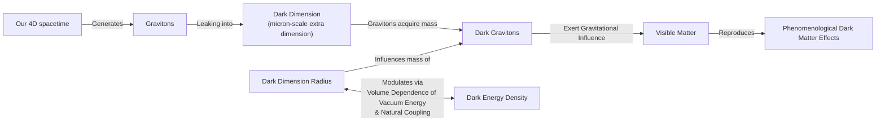

# The Cosmic Web: Are Dark Matter and Dark Energy Two Sides of the Same Coin?

According to our best estimates, the universe is a dark place. Approximately 70% of it is made of dark energy, an unknown force pushing space to expand, while another 25% is dark matter, a mysterious substance holding galaxies together. The ordinary matter we can see and interact with—stars, planets, and ourselves—makes up a mere 5% of the cosmos [[11]](https://www.quantamagazine.org/a-dark-dimension-could-link-two-of-the-universes-great-unknowns-20260622). Semantically, these components are not "dark" but invisible; they do not emit, reflect, or absorb light, making them impossible to observe directly [[11]](https://www.quantamagazine.org/a-dark-dimension-could-link-two-of-the-universes-great-unknowns-20260622).

The standard model of cosmology, Lambda-CDM, treats dark energy (as a cosmological constant, Λ) and cold dark matter (CDM) as separate, unrelated entities [[16]](https://news.fnal.gov/2025/03/new-desi-results-strengthen-hints-that-dark-energy-may-evolve). However, recent astronomical observations are beginning to challenge this assumption, suggesting the two might be physically intertwined.

Data from the Dark Energy Spectroscopic Instrument (DESI) in 2024 and 2025 indicates that the strength of dark energy hasn't been constant. The measurements suggest it peaked about two billion years ago and has been weakening ever since. More surprisingly, the data implies that in an earlier cosmic era, dark energy could have grown stronger [[5]](https://www.ohio.edu/news/2025/03/universe-might-be-changing-new-desi-data-shows-dark-energy-may-evolve-over-time), [[11]](https://www.quantamagazine.org/a-dark-dimension-could-link-two-of-the-universes-great-unknowns-20260622). Researchers describe this as dark energy entering the "phantom regime" [[11]](https://www.quantamagazine.org/a-dark-dimension-could-link-two-of-the-universes-great-unknowns-20260622). This situation is like a ball spontaneously rolling uphill, seemingly creating energy from nothing and violating conservation laws unless some external force is at play.

This is where a growing number of theorists are looking for an answer: in the ties between dark energy and dark matter. As particle physicist Tim Tait notes, while scientists have often assumed they "don’t have anything to do with each other, you can imagine a case where one influences the other. And it would not be surprising if [they] were manifestations of a kind of unified theory of the dark universe" [[11]](https://www.quantamagazine.org/a-dark-dimension-could-link-two-of-the-universes-great-unknowns-20260622).

We will now examine concrete dark-interaction models that turn this apparent phantom behavior into a bookkeeping artifact and, in the process, may help ease the long-standing Hubble tension.

## Dark Interactions

The idea that dark energy and dark matter might interact is not new. As far back as 2005, a model by Justin Khoury and collaborators posed a hypothetical question: could there be a form of dark energy whose energy density increased over time? They found that if dark energy and dark matter could affect one another, they could produce what looked like phantom behavior without actually violating energy conservation [[17]](https://www.quantamagazine.org/a-dark-dimension-could-link-two-of-the-universes-great-unknowns-20260622). Khoury explained, "It is the most natural, simplest way of achieving this" [[17]](https://www.quantamagazine.org/a-dark-dimension-could-link-two-of-the-universes-great-unknowns-20260622).

Two decades later, the DESI findings spurred Khoury and his colleagues Meng-Xiang Lin and Mark Trodden to build a model based on a dark-sector analogue of quantum chromodynamics (QCD), a fundamental theory in particle physics. In their new model, both the energy density of dark energy and the mass of dark matter particles change in concert [[17]](https://www.quantamagazine.org/a-dark-dimension-could-link-two-of-the-universes-great-unknowns-20260622), [[18]](https://indico.global/event/14705/contributions/155116/attachments/72358/141320/PASCOS2026.pptx%20(1).pdf).

A similar concept was published in January 2025. According to this model, dark matter could have transferred a small fraction of its energy to dark energy in a past cosmic era [[20]](https://www.quantamagazine.org/a-dark-dimension-could-link-two-of-the-universes-great-unknowns-20260622). Elsa Teixeira, a cosmologist and one of the study's authors, explained that since "dark matter is the main brake on [the universe’s] expansion," easing up on that brake would cause the expansion to accelerate [[20]](https://www.quantamagazine.org/a-dark-dimension-could-link-two-of-the-universes-great-unknowns-20260622).

This leads to a crucial insight: the appearance of a phantom regime might just be a result of bookkeeping. As physicist David Andriot puts it, "Any change or evolution of the mass of dark matter has been put into the box of dark energy" [[20]](https://www.quantamagazine.org/a-dark-dimension-could-link-two-of-the-universes-great-unknowns-20260622). In other words, when we assume dark matter's properties are constant, any variation caused by an interaction gets misattributed to dark energy.

Harvard physicist Cumrun Vafa agrees, stating that "the notion that you can compute dark energy independently of dark matter is wrong." He argues that this flawed assumption, which was also followed by the DESI team, "led to the physically unacceptable phantom behavior" [[20]](https://www.quantamagazine.org/a-dark-dimension-could-link-two-of-the-universes-great-unknowns-20260622).

Beyond explaining the DESI results, allowing the two dark components to interact may also help resolve some of cosmology's most persistent problems. One is the Hubble tension, the ~9% discrepancy between the universe's expansion rate as measured from the early universe (via the cosmic microwave background) and from the more recent universe (via supernovae) [[11]](https://www.quantamagazine.org/a-dark-dimension-could-link-two-of-the-universes-great-unknowns-20260622). A related issue is the S8 tension, a similar disagreement in measurements of how "clumpy" or clustered matter is across the cosmos [[26]](https://indico.cern.ch/event/1315931/timetable?view=standard). As Teixeira and her co-authors wrote, these discrepancies have "provoked heated debates in the cosmology community about whether this difference could be due to systematic errors or whether it is a signal of new physics" [[11]](https://www.quantamagazine.org/a-dark-dimension-could-link-two-of-the-universes-great-unknowns-20260622). An interacting dark sector provides a path to resolve these tensions as an expected outcome rather than a crisis.

These phenomenological models receive a natural geometric origin within string theory, which we explore next through the "dark dimension" proposal.

## A Dark Dimension

If dark energy and dark matter do interact, it could mean they share a common origin [[17]](https://www.quantamagazine.org/a-dark-dimension-could-link-two-of-the-universes-great-unknowns-20260622). Ongoing work in string theory—the idea that the universe's fundamental constituents are vibrating strings—suggests how this might work. Building on work from 2019, Vafa and collaborators proposed in 2022 that both dark matter and dark energy could be linked to a so-called "dark dimension" [[11]](https://www.quantamagazine.org/a-dark-dimension-could-link-two-of-the-universes-great-unknowns-20260622).

This line of reasoning is motivated by one of the biggest puzzles in physics: the cosmological constant problem. When theorists calculate the expected energy density of the vacuum from quantum mechanics, the result is about 120 orders of magnitude larger than the value observed by astronomers. This enormous discrepancy suggests our understanding is incomplete [[27]](https://www.advancedsciencenews.com/a-dark-dimension-could-help-explain-the-origin-of-dark-energy).

Vafa’s insight was to apply a string theory principle called the "distance conjecture" to this problem. The conjecture states that when a physical parameter in the theory—like the cosmological constant—is tuned to an extreme value (in this case, almost zero), a "tower" of new, exceptionally light particles should appear. For this to happen, one of the extra dimensions must become large [[28]](https://www.quantamagazine.org/in-a-dark-dimension-physicists-search-for-missing-matter-20240201). This is the theoretical origin of the dark dimension.

String theory posits the existence of extra dimensions beyond our familiar three of space and one of time. These are typically thought to be minuscule, near the Planck scale (10⁻³⁵ meters). However, this new proposal suggests one of these extra dimensions—the dark dimension—could be significantly larger, on the order of a micron (10⁻⁶ meters) [[9]](https://www.advancedsciencenews.com/a-dark-dimension-could-help-explain-the-origin-of-dark-energy), [[11]](https://www.quantamagazine.org/a-dark-dimension-could-link-two-of-the-universes-great-unknowns-20260622).

This relatively large size distinguishes it from other extra-dimension theories. For instance, Randall-Sundrum (RS) models often feature a single, "warped" or curved extra dimension, while Arkani-Hamed-Dimopoulos-Dvali (ADD) models typically use multiple extra dimensions [[29]](https://pmc.ncbi.nlm.nih.gov/articles/PMC5479361). A larger dimension would also explain why gravity appears so much weaker than other fundamental forces; its strength gets diluted as it leaks into the more voluminous dark dimension [[28]](https://www.quantamagazine.org/in-a-dark-dimension-physicists-search-for-missing-matter-20240201).

Image 1: A flowchart illustrating the "Dark Dimension" mechanism for unifying dark energy and dark matter.

The mechanism works like this: gravitons, the theoretical particles that carry the force of gravity, could leak into this enlarged dark dimension. In doing so, they would acquire mass and become "dark gravitons." These massive particles would reside in the dark dimension, but their gravitational effects would still be felt in our dimensions, fulfilling the role normally ascribed to dark matter [[11]](https://www.quantamagazine.org/a-dark-dimension-could-link-two-of-the-universes-great-unknowns-20260622).

This scenario provides a built-in, natural coupling between dark energy and dark matter. As physicist Georges Obied explains, "there is a very natural coupling between dark energy and dark matter," because any change in the size of the dark dimension would simultaneously affect both [[20]](https://www.quantamagazine.org/a-dark-dimension-could-link-two-of-the-universes-great-unknowns-20260622).

In a July 2025 paper, Obied and Vafa, along with Alek Bedroya and David Wu, showed that this scenario was consistent with the DESI data. Their model predicts that the strength of dark energy and the mass of dark matter will both decrease over time, with the rate of change for dark energy being proportional to its own density [[12]](https://www.quantamagazine.org/a-dark-dimension-could-link-two-of-the-universes-great-unknowns-20260622), [[13]](https://indico.global/event/551/contributions/130592/attachments/61097/117637/Dark%20Sector%20and%20the%20Swampland.pdf). Because the energy density of dark energy is so small, "it won’t change fast," Vafa said. "It’s not surprising that we didn’t see it until now. We had to wait the entire age of the universe to detect something that small" [[12]](https://www.quantamagazine.org/a-dark-dimension-could-link-two-of-the-universes-great-unknowns-20260622).

This coupling has several testable consequences. One arises from the fact that heavier dark gravitons can decay into lighter ones. The mass difference is converted into kinetic energy, giving the new particles a "kick velocity" of about one-ten-thousandth the speed of light. This velocity can be just enough for them to escape the gravitational pull of forming galaxies, resulting in slightly less massive galaxies than the standard model predicts. This effect on large-scale structure is already consistent with data from the Kilo-Degree Survey, with more stringent tests expected from the Euclid space telescope [[28]](https://www.quantamagazine.org/in-a-dark-dimension-physicists-search-for-missing-matter-20240201).

A second, more direct test involves measuring gravity itself. If gravity leaks into a micron-sized dimension, its strength should deviate from Newton's inverse-square law at that scale. Tabletop experiments are currently underway to probe gravitational interactions at these small distances [[28]](https://www.quantamagazine.org/in-a-dark-dimension-physicists-search-for-missing-matter-20240201).

The model also predicts a new long-range force between dark matter particles. In 2006, physicists Marc Kamionkowski and Michael Kesden used galactic tidal tails to set an upper limit on any such extra force. The value predicted by Vafa's team falls well within this observational bound [[22]](https://www.quantamagazine.org/a-dark-dimension-could-link-two-of-the-universes-great-unknowns-20260622). "It is interesting that we are now finding connections between that fairly abstract work and observational and experimental work," Kamionkowski said [[11]](https://www.quantamagazine.org/a-dark-dimension-could-link-two-of-the-universes-great-unknowns-20260622).

The fact that a prediction from string theory roughly agrees with astrophysical evidence does not confirm the theory's validity. But any correspondence is gratifying to Vafa, who has spent decades trying to generate testable predictions from the purely conceptual realm of string theory [[12]](https://www.quantamagazine.org/a-dark-dimension-could-link-two-of-the-universes-great-unknowns-20260622).

This convergence of ideas from observational cosmology, particle physics, and string theory highlights a powerful methodological approach. By attacking the problem of the dark sector from multiple, complementary angles, we can slowly close in on a solution. "This is how people should do science," Obied said. "It’s the job of theoretical physicists to explore everything that’s possible, to get all the possibilities on the table. And eventually, the data will help us decide" [[11]](https://www.quantamagazine.org/a-dark-dimension-could-link-two-of-the-universes-great-unknowns-20260622).

## References

- [1] DESI collaboration. (2021). Dark Energy Spectroscopic Instrument starts 5-year survey. Fermilab. https://news.fnal.gov/2021/05/dark-energy-spectroscopic-instrument-starts-5-year-survey
- [2] DESI DR2 Results II: Measurements of Baryon Acoustic Oscillations and Cosmological Constraints. (2025, March). global. https://indico.global/event/15767/contributions/138193/attachments/65687/127027/2025.12%20DPF%20Dark%20Energy%20and%20Cosmology%20v1%20(B%20Field).pdf
- [3] Brandenberger, R. (2025, September 9). Four reasons dark energy should evolve with time. CERN Courier. https://cerncourier.com/four-reasons-dark-energy-should-evolve-with-time
- [4] Basile, I., & Lüst, D. (2024). A dark dimension could help explain the origin of dark energy. Advanced Science News. https://www.advancedsciencenews.com/a-dark-dimension-could-help-explain-the-origin-of-dark-energy
- [5] Ohio University. (2025, March). Universe might be changing: New DESI data shows dark energy may evolve over time. https://www.ohio.edu/news/2025/03/universe-might-be-changing-new-desi-data-shows-dark-energy-may-evolve-over-time
- [6] Moskowitz, C. (2024, February 1). In a ‘Dark Dimension,’ Physicists Search for Missing Matter. Quanta Magazine. https://www.quantamagazine.org/in-a-dark-dimension-physicists-search-for-missing-matter-20240201
- [7] Nadis, S. (2026, June 22). A Dark Dimension Could Link Two of the Universe’s Great Unknowns. Quanta Magazine. https://www.quantamagazine.org/a-dark-dimension-could-link-two-of-the-universes-great-unknowns-20260622
- [8] Bedroya, A., Obied, G., Vafa, C., & Wu, D. H. (2025, July). Evolving Dark Sector and the Dark Dimension Scenario. https://ui.adsabs.harvard.edu/abs/2025arXiv250703090B/abstract
- [9] Vafa, C. (2025, July 10). Dark Sector and the Swampland. https://indico.global/event/551/contributions/130592/attachments/61097/117637/Dark%20Sector%20and%20the%20Swampland.pdf
- [10] Denison, M. (2026). Screened Forces in a QCD-Like Dark Sector on Galactic Scales. https://indico.global/event/14705/contributions/155116/attachments/72358/141320/PASCOS2026.pptx%20(1).pdf
- [11] Nadis, S. (2026, June 22). A Dark Dimension Could Link Two of the Universe’s Great Unknowns. Quanta Magazine. https://www.quantamagazine.org/a-dark-dimension-could-link-two-of-the-universes-great-unknowns-20260622
- [12] Nadis, S. (2026, June 22). A Dark Dimension Could Link Two of the Universe’s Great Unknowns. Quanta Magazine. https://www.quantamagazine.org/a-dark-dimension-could-link-two-of-the-universes-great-unknowns-20260622
- [13] Vafa, C. (2025, July 10). Dark Sector and the Swampland. https://indico.global/event/551/contributions/130592/attachments/61097/117637/Dark%20Sector%20and%20the%20Swampland.pdf
- [14] Ouellette, J. (2025). Could dark energy be changing over time?. PNAS. https://www.pnas.org/doi/10.1073/pnas.2524499122
- [15] Tanedo, F. (2021, June 2). New dimension in quest to understand dark matter. UCR News. https://news.ucr.edu/articles/2021/06/02/new-dimension-quest-understand-dark-matter
- [16] Fermilab. (2025, March). New DESI results strengthen hints that dark energy may evolve. https://news.fnal.gov/2025/03/new-desi-results-strengthen-hints-that-dark-energy-may-evolve
- [17] Nadis, S. (2026, June 22). A Dark Dimension Could Link Two of the Universe’s Great Unknowns. Quanta Magazine. https://www.quantamagazine.org/a-dark-dimension-could-link-two-of-the-universes-great-unknowns-20260622
- [18] Denison, M. (2026). Screened Forces in a QCD-Like Dark Sector on Galactic Scales. https://indico.global/event/14705/contributions/155116/attachments/72358/141320/PASCOS2026.pptx%20(1).pdf
- [19] Ouellette, J. (2025). Could dark energy be changing over time?. PNAS. https://www.pnas.org/doi/10.1073/pnas.2524499122
- [20] Nadis, S. (2026, June 22). A Dark Dimension Could Link Two of the Universe’s Great Unknowns. Quanta Magazine. https://www.quantamagazine.org/a-dark-dimension-could-link-two-of-the-universes-great-unknowns-20260622
- [21] Tait, T. M. P. (2015). A Dark SU(N). https://indico.cern.ch/event/473000/contributions/1993414/attachments/1209863/1764345/tait-Aspen.pdf
- [22] Nadis, S. (2026, June 22). A Dark Dimension Could Link Two of the Universe’s Great Unknowns. Quanta Magazine. https://www.quantamagazine.org/a-dark-dimension-could-link-two-of-the-universes-great-unknowns-20260622
- [23] Unified three-form dark sector. (2024). Physical Review D. https://link.aps.org/doi/10.1103/p51k-7rw2
- [24] Pospelov, M. (2024). An important aspect of this model is that the coupling of the radion to SM fields must be suppressed to avoid conflicts with limits on long range forces. EPJ C. https://link.springer.com/article/10.1140/epjc/s10052-024-12622-y
- [25] An important aspect of this model is that the coupling of the radion to SM fields must be suppressed to avoid conflicts with limits on long range forces. (2024). d-nb.info. https://d-nb.info/1336107839/34
- [26] The dark dimension hypothesis... (2024). CERN. https://indico.cern.ch/event/1315931/timetable?view=standard
- [27] Basile, I., & Lüst, D. (2025, January 27). A “dark dimension” could help explain the origin of dark energy. Advanced Science News. https://www.advancedsciencenews.com/a-dark-dimension-could-help-explain-the-origin-of-dark-energy
- [28] Nadis, S. (2024, February 1). In a ‘Dark Dimension,’ Physicists Search for the Universe’s Missing Matter. Quanta Magazine. https://www.quantamagazine.org/in-a-dark-dimension-physicists-search-for-missing-matter-20240201
- [29] Maartens, R. (2004). Brane-world gravity. Living Reviews in Relativity. https://pmc.ncbi.nlm.nih.gov/articles/PMC5479361