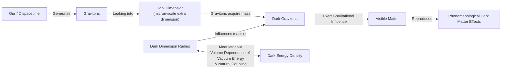

# The Cosmic Web: Are Dark Matter and Dark Energy Two Sides of the Same Coin?

As engineers, we are used to building systems where we understand most of the components. But when you look at the universe, it is a different story. About 70% of it is dark energy, a mysterious force driving cosmic expansion. Another 25% is dark matter, the invisible glue holding galaxies together. The stuff we can actually see and build with, like stars and planets, accounts for just 5% of everything [[1]](https://www.quantamagazine.org/a-dark-dimension-could-link-two-of-the-universes-great-unknowns-20260622). These components are called "dark" not because they are black, but because they are invisible. They do not emit, reflect, or absorb light, which has made them impossible to observe directly [[1]](https://www.quantamagazine.org/a-dark-dimension-could-link-two-of-the-universes-great-unknowns-20260622).

The standard model of cosmology, Lambda-Cold Dark Matter (Lambda-CDM), treats dark energy and dark matter as separate, independent parts of the system [[2]](https://news.fnal.gov/2025/03/new-desi-results-strengthen-hints-that-dark-energy-may-evolve). This model has worked well for a long time, but recent data is starting to show cracks in this assumption, suggesting the two might be physically connected through an interaction or a shared origin.

The new evidence comes from the Dark Energy Spectroscopic Instrument (DESI), which in 2024 and 2025 produced the largest 3D map of the universe ever made. These measurements indicate that the strength of dark energy has not been constant. The data suggests it peaked about two billion years ago and has been weakening since. Even more strangely, it implies that in an earlier cosmic era, dark energy could have grown stronger [[1]](https://www.quantamagazine.org/a-dark-dimension-could-link-two-of-the-universes-great-unknowns-20260622), [[3]](https://www.ohio.edu/news/2025/03/universe-might-be-changing-new-desi-data-shows-dark-energy-may-evolve-over-time).

Researchers call this entering the "phantom regime" [[1]](https://www.quantamagazine.org/a-dark-dimension-could-link-two-of-the-universes-great-unknowns-20260622). From an engineering perspective, it is like having a system that creates energy out of nowhere. Imagine a ball spontaneously rolling uphill. This would seem to violate the laws of energy conservation unless some hidden influence is pushing it. This is the puzzle that has led a growing number of theorists to investigate a direct link between dark energy and dark matter.

As particle physicist Tim Tait puts it, while we have often assumed they "don’t have anything to do with each other, you can imagine a case where one influences the other. And it would not be surprising if [they] were manifestations of a kind of unified theory of the dark universe" [[1]](https://www.quantamagazine.org/a-dark-dimension-could-link-two-of-the-universes-great-unknowns-20260622).

We will now examine concrete dark-interaction models that turn this apparent phantom behavior into a bookkeeping artifact and, in the process, may help ease the long-standing Hubble tension.

## Dark Interactions

If dark energy seems to be breaking the rules, the most straightforward engineering answer is to check for a hidden interaction. This idea is not new. Back in 2005, a model from Justin Khoury and collaborators explored what would happen if dark energy could pull energy from dark matter [[4]](https://cerncourier.com/four-reasons-dark-energy-should-evolve-with-time). They found that such an energy transfer could create the appearance of phantom behavior without actually violating energy conservation. Instead, the effect would simply be a signature of an interaction between the two sectors. As Khoury said, "It is the most natural, simplest way of achieving this" [[5]](https://www.quantamagazine.org/a-dark-dimension-could-link-two-of-the-universes-great-unknowns-20260622).

Fast forward two decades, and the DESI findings have renewed interest in this concept. Khoury, along with Meng-Xiang Lin and Mark Trodden, constructed a model based on a dark-sector analogue of quantum chromodynamics (QCD), a cornerstone of particle physics. In their framework, the energy density of dark energy and the mass of dark matter particles evolve together, providing a concrete model based on established physical principles [[5]](https://www.quantamagazine.org/a-dark-dimension-could-link-two-of-the-universes-great-unknowns-20260622), [[6]](https://indico.global/event/14705/contributions/155116/attachments/72358/141320/PASCOS2026.pptx%20(1).pdf).

Another model, published in January 2025, proposes something similar: dark matter could have transferred a small fraction of its energy to dark energy during a past cosmic era [[7]](https://www.pnas.org/doi/10.1073/pnas.2524499122), [[8]](https://www.quantamagazine.org/a-dark-dimension-could-link-two-of-the-universes-great-unknowns-20260622). Elsa Teixeira, a cosmologist and one of the study's authors, explained that since "dark matter is the main brake on [the universe’s] expansion," easing up on that brake by transferring some of its energy would naturally cause the expansion to accelerate [[8]](https://www.quantamagazine.org/a-dark-dimension-could-link-two-of-the-universes-great-unknowns-20260622).

This leads to an important insight: the phantom regime might just be a bookkeeping error. When cosmologists analyze data, they assume dark matter's density scales in a fixed way as the universe expands. If an interaction causes dark matter's mass to change over time, that unaccounted-for variation gets incorrectly assigned to the dark energy column of the ledger. Physicist David Andriot explains it this way: "Any change or evolution of the mass of dark matter has been put into the box of dark energy" [[8]](https://www.quantamagazine.org/a-dark-dimension-could-link-two-of-the-universes-great-unknowns-20260622).

Harvard physicist Cumrun Vafa argues that this separation is fundamentally flawed. He states that "the notion that you can compute dark energy independently of dark matter is wrong." According to Vafa, this incorrect assumption, also used by the DESI team, "led to the physically unacceptable phantom behavior" because the two are linked at a deeper level and must be solved for together [[8]](https://www.quantamagazine.org/a-dark-dimension-could-link-two-of-the-universes-great-unknowns-20260622).

Beyond explaining the DESI results, an interacting dark sector could also help resolve one of cosmology's most persistent problems: the Hubble tension. This is the ~9% disagreement between the universe's expansion rate measured from the early universe (via the cosmic microwave background) and the more recent universe (via supernovae) [[5]](https://www.quantamagazine.org/a-dark-dimension-could-link-two-of-the-universes-great-unknowns-20260622). As Teixeira and her co-authors wrote, this discrepancy has "provoked heated debates in the cosmology community about whether this difference could be due to systematic errors or whether it is a signal of new physics" [[5]](https://www.quantamagazine.org/a-dark-dimension-could-link-two-of-the-universes-great-unknowns-20260622). An interacting dark sector offers a way to reconcile these measurements by adjusting the expansion history over cosmic time, turning what looked like a crisis into an expected outcome of the model.

These interaction models are solid, but they are still phenomenological—they describe the "what" but not the "why." For a more fundamental explanation, we have to look at string theory, which provides a potential geometric origin for both dark components.

## A Dark Dimension

The starting point for a deeper explanation is the cosmological constant problem. When we use quantum mechanics to calculate the energy density of the vacuum, our result is about 120 orders of magnitude larger than what astronomers observe. This is not just a rounding error; it is a sign that our model is fundamentally broken [[9]](https://www.advancedsciencenews.com/a-dark-dimension-could-help-explain-the-origin-of-dark-energy). String theory offers a potential way forward through a principle called the "distance conjecture." It suggests that when a physical parameter, like the cosmological constant, is tuned to an extreme value (in this case, almost zero), a "tower" of new, extremely light particles must appear. For this to happen, one of the extra dimensions predicted by the theory must become large [[10]](https://www.quantamagazine.org/in-a-dark-dimension-physicists-search-for-missing-matter-20240201).

String theory posits the existence of extra dimensions beyond our familiar three of space and one of time. These are typically thought to be minuscule, near the Planck scale (10⁻³⁵ meters). However, the "dark dimension" proposal suggests one of these extra dimensions is much larger, on the order of a micron (10⁻⁶ meters) [[5]](https://www.quantamagazine.org/a-dark-dimension-could-link-two-of-the-universes-great-unknowns-20260622), [[9]](https://www.advancedsciencenews.com/a-dark-dimension-could-help-explain-the-origin-of-dark-energy). This relatively large size would also explain why gravity seems so much weaker than other forces; its strength gets diluted as it leaks into the more voluminous dark dimension [[10]](https://www.quantamagazine.org/in-a-dark-dimension-physicists-search-for-missing-matter-20240201).

Image 1: A flowchart illustrating the "Dark Dimension" mechanism for unifying dark energy and dark matter.

The mechanism provides a shared origin for both dark energy and dark matter. It works like this: gravitons, the theoretical particles that carry the force of gravity, can leak into this enlarged dark dimension. In doing so, they acquire a small mass determined by the dimension's radius, becoming "dark gravitons." These massive particles would reside in the dark dimension, but their combined gravitational pull on visible matter would reproduce the effects we attribute to dark matter [[5]](https://www.quantamagazine.org/a-dark-dimension-could-link-two-of-the-universes-great-unknowns-20260622).

This setup creates a natural coupling between the two dark components. As physicist Georges Obied explains, "there is a very natural coupling between dark energy and dark matter," because any change in the size of the dark dimension would simultaneously affect both [[8]](https://www.quantamagazine.org/a-dark-dimension-could-link-two-of-the-universes-great-unknowns-20260622). The dark energy density depends on the volume of the extra dimension, and the dark matter mass is set by the graviton's properties within it. The two cannot be varied independently.

In a July 2025 paper, Obied, Vafa, Alek Bedroya, and David Wu demonstrated that this scenario is consistent with the DESI data. Their model predicts that both dark energy's strength and dark matter's mass will decrease over time, with the rate of change for dark energy being proportional to its own density [[11]](https://ui.adsabs.harvard.edu/abs/2025arXiv250703090B/abstract), [[12]](https://indico.global/event/551/contributions/130592/attachments/61097/117637/Dark%20Sector%20and%20the%20Swampland.pdf). Because dark energy's density is so small, "it won’t change fast," said Vafa. "It’s not surprising that we didn’t see it until now. We had to wait the entire age of the universe to detect something that small" [[5]](https://www.quantamagazine.org/a-dark-dimension-could-link-two-of-the-universes-great-unknowns-20260622).

This coupling has testable consequences. One is the emergence of a new, long-range force between dark matter particles, separate from gravity [[13]](https://www.quantamagazine.org/a-dark-dimension-could-link-two-of-the-universes-great-unknowns-20260622). This force would alter how galaxies interact. For instance, when two galaxies pass each other, gravity can pull stars, gas, and dust into long streams called "tidal tails." If dark matter has an extra attraction to itself, it would change the shape of these tails [[5]](https://www.quantamagazine.org/a-dark-dimension-could-link-two-of-the-universes-great-unknowns-20260622).

Coincidentally, physicists Marc Kamionkowski and Michael Kesden had already searched for this effect in 2006. They did not find it, which allowed them to set an upper limit on the strength of any such extra force. The value predicted by Vafa’s team falls comfortably within this existing observational limit [[5]](https://www.quantamagazine.org/a-dark-dimension-could-link-two-of-the-universes-great-unknowns-20260622). "It is interesting that we are now finding connections between that fairly abstract work and observational and experimental work," Kamionkowski remarked [[5]](https://www.quantamagazine.org/a-dark-dimension-could-link-two-of-the-universes-great-unknowns-20260622).

The dark dimension hypothesis may also help resolve another cosmological puzzle known as the S8 tension. This refers to a discrepancy in measurements of the "clumpiness" of matter in the universe today, as inferred from the early universe versus local galaxy surveys [[14]](https://indico.cern.ch/event/1315931/timetable?view=standard), [[15]](https://indico.cern.ch/event/1544691/contributions). By linking dark energy to a micron-scale extra dimension, the model could align theoretical predictions with observed values, potentially resolving this tension as well [[9]](https://www.advancedsciencenews.com/a-dark-dimension-could-help-explain-the-origin-of-dark-energy).

The fact that a prediction from string theory roughly agrees with astrophysical evidence does not prove the theory is correct. However, this correspondence is a significant step for researchers like Vafa, who have spent decades working to produce testable predictions from a theory long criticized for being purely conceptual [[5]](https://www.quantamagazine.org/a-dark-dimension-could-link-two-of-the-universes-great-unknowns-20260622).

## Conclusion

The emerging evidence for an evolving dark energy is challenging our standard cosmological model and opening the door to new physics. The apparent phantom behavior seen by DESI may not be a violation of energy conservation but rather a sign of a deeper connection between dark energy and dark matter. Models where these two components interact or share a common origin, such as the dark dimension scenario from string theory, can explain these observations while also potentially resolving long-standing tensions in cosmology.

This convergence of ideas from observational cosmology, particle physics, and string theory highlights a powerful methodological approach. By attacking the problem of the dark sector from multiple, complementary angles, we can slowly close in on a solution. "This is how people should do science," Obied said. "It’s the job of theoretical physicists to explore everything that’s possible, to get all the possibilities on the table. And eventually, the data will help us decide" [[5]](https://www.quantamagazine.org/a-dark-dimension-could-link-two-of-the-universes-great-unknowns-20260622).

## References

- [1] Nadis, S. (2026, June 22). A Dark Dimension Could Link Two of the Universe’s Great Unknowns. Quanta Magazine. https://www.quantamagazine.org/a-dark-dimension-could-link-two-of-the-universes-great-unknowns-20260622
- [2] Fermilab. (2025, March). New DESI results strengthen hints that dark energy may evolve. https://news.fnal.gov/2025/03/new-desi-results-strengthen-hints-that-dark-energy-may-evolve
- [3] Ohio University. (2025, March). Universe might be changing: New DESI data shows dark energy may evolve over time. https://www.ohio.edu/news/2025/03/universe-might-be-changing-new-desi-data-shows-dark-energy-may-evolve-over-time
- [4] Brandenberger, R. (2025, September 9). Four reasons dark energy should evolve with time. CERN Courier. https://cerncourier.com/four-reasons-dark-energy-should-evolve-with-time
- [5] Nadis, S. (2026, June 22). A Dark Dimension Could Link Two of the Universe’s Great Unknowns. Quanta Magazine. https://www.quantamagazine.org/a-dark-dimension-could-link-two-of-the-universes-great-unknowns-20260622
- [6] Denison, M. (2026). Screened Forces in a QCD-Like Dark Sector on Galactic Scales. https://indico.global/event/14705/contributions/155116/attachments/72358/141320/PASCOS2026.pptx%20(1).pdf
- [7] Ouellette, J. (2025). Could dark energy be changing over time?. PNAS. https://www.pnas.org/doi/10.1073/pnas.2524499122
- [8] Nadis, S. (2026, June 22). A Dark Dimension Could Link Two of the Universe’s Great Unknowns. Quanta Magazine. https://www.quantamagazine.org/a-dark-dimension-could-link-two-of-the-universes-great-unknowns-20260622
- [9] Basile, I., & Lüst, D. (2024). A dark dimension could help explain the origin of dark energy. Advanced Science News. https://www.advancedsciencenews.com/a-dark-dimension-could-help-explain-the-origin-of-dark-energy
- [10] Moskowitz, C. (2024, February 1). In a ‘Dark Dimension,’ Physicists Search for Missing Matter. Quanta Magazine. https://www.quantamagazine.org/in-a-dark-dimension-physicists-search-for-missing-matter-20240201
- [11] Bedroya, A., Obied, G., Vafa, C., & Wu, D. H. (2025, July). Evolving Dark Sector and the Dark Dimension Scenario. https://ui.adsabs.harvard.edu/abs/2025arXiv250703090B/abstract
- [12] Vafa, C. (2025, July 10). Dark Sector and the Swampland. https://indico.global/event/551/contributions/130592/attachments/61097/117637/Dark%20Sector%20and%20the%20Swampland.pdf
- [13] Nadis, S. (2026, June 22). A Dark Dimension Could Link Two of the Universe’s Great Unknowns. Quanta Magazine. https://www.quantamagazine.org/a-dark-dimension-could-link-two-of-the-universes-great-unknowns-20260622
- [14] The dark dimension hypothesis... (2024). CERN. https://indico.cern.ch/event/1315931/timetable?view=standard
- [15] I will discuss the swampland distance conjecture... (2024). CERN. https://indico.cern.ch/event/1544691/contributions