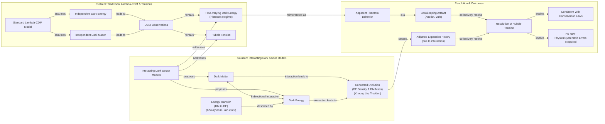
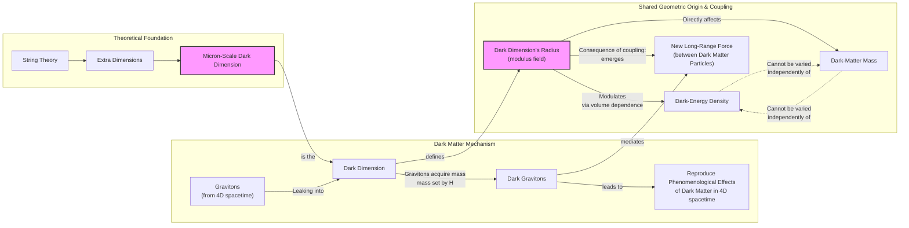

# Our Universe's Biggest Mystery: Is Dark Energy a Bookkeeping Error?

Our universe is dominated by substances we cannot see. Roughly 70% is dark energy, the mysterious force driving cosmic acceleration, and another 25% is dark matter, the unseen mass holding galaxies together. The remaining 5% is the ordinary baryonic matter that makes up stars, planets, and us. These "dark" components are not literally dark. They are semantically invisible, meaning they neither emit nor absorb light, which has made direct observation impossible [[19]](https://www.pnas.org/doi/10.1073/pnas.2524499122).

For decades, the standard Lambda-Cold Dark Matter (ΛCDM) model has treated these two components as entirely separate phenomena. In this framework, dark matter is a stable, non-interactive particle, and dark energy is a cosmological constant. This is an unchanging property of spacetime itself. This clean separation has served as the bedrock of modern cosmology, but its foundation is now being shaken by increasingly precise observational data that suggests a more complex and interconnected reality.

The challenge comes from the Dark Energy Spectroscopic Instrument (DESI), a groundbreaking project that has created the largest 3D map of the universe to date by measuring the spectra of tens of millions of galaxies and quasars [[28]](https://www.desi.lbl.gov). By tracking the influence of dark energy over 11 billion years, the 2024/2025 data releases suggest that its strength has not been constant [[3]](https://indico.global/event/15767/contributions/138193/attachments/65687/127027/2025.12%20DPF%20Dark%20Energy%20and%20Cosmology%20v1%20(B%20Field).pdf), [[5]](https://www.ohio.edu/news/2025/03/universe-might-be-changing-new-desi-data-shows-dark-energy-may-evolve-over-time). Instead, it appears to have peaked roughly two billion years ago and has been weakening ever since [[39]](https://www.quantamagazine.org/a-dark-dimension-could-link-two-of-the-universes-great-unknowns-20260622). Some models fitting this data even suggest dark energy grew stronger in an earlier era, entering a "phantom regime" where its density increases as the universe expands.

This behavior is deeply counterintuitive. It is like a ball spontaneously rolling uphill, seemingly creating energy from nothing and violating fundamental conservation laws. Such a phenomenon is physically unacceptable unless an external force is acting on the ball or it is coupled to another system. This has spurred a new wave of research exploring the possibility that dark energy and dark matter are not independent but are instead physically intertwined. As particle physicist Tim Tait noted, "you can imagine a case where one influences the other. And it would not be surprising if [they] were manifestations of a kind of unified theory of the dark universe" [[39]](https://www.quantamagazine.org/a-dark-dimension-could-link-two-of-the-universes-great-unknowns-20260622).

We next examine concrete dark-interaction models that turn the phantom appearance into a bookkeeping artifact and simultaneously ease the long-standing Hubble tension.

## Dark Interactions

The idea that an interaction between dark energy and dark matter could explain cosmological puzzles is not new, but it has gained significant traction with the latest DESI findings. These models propose that the two dark components can exchange energy or evolve in a concerted manner, which alters the expansion history of the universe in subtle but measurable ways.

The standard model's assumption of a time-independent dark energy has long been a source of tension. If the new observational data confirms that dark energy is evolving, it would necessitate a paradigm shift in cosmology, definitively ruling out the ΛCDM model as it is currently understood [[30]](https://cerncourier.com/four-reasons-dark-energy-should-evolve-with-time).

Image 1: A flowchart illustrating how interacting dark sectors resolve apparent phantom behavior and Hubble tension.

### The 2005 Khoury et al. Model

As early as 2005, physicist Justin Khoury and his collaborators posed a hypothetical question: could dark energy's density increase over time by drawing energy from dark matter? Their model showed that such an interaction could produce what looks like phantom behavior without actually violating energy conservation [[6]](https://cerncourier.com/four-reasons-dark-energy-should-evolve-with-time), [[17]](https://www.quantamagazine.org/a-dark-dimension-could-link-two-of-the-universes-great-unknowns-20260622). The apparent phantom energy is not a new, exotic substance but a reflection of this hidden energy transfer. "It is the most natural, simplest way of achieving this," Khoury explained, highlighting that the interaction provides a straightforward mechanism to explain observations that otherwise seem unphysical [[17]](https://www.quantamagazine.org/a-dark-dimension-could-link-two-of-the-universes-great-unknowns-20260622).

### The Khoury-Lin-Trodden QCD Analogue

Building on this idea, Khoury, along with Meng-Xiang Lin and Mark Trodden, recently constructed a more explicit model based on an analogue of quantum chromodynamics (QCD), the theory governing the strong nuclear force [[17]](https://www.quantamagazine.org/a-dark-dimension-could-link-two-of-the-universes-great-unknowns-20260622), [[18]](https://indico.global/event/14705/contributions/155116/attachments/72358/141320/PASCOS2026.pptx%20(1).pdf). In their framework, both the energy density of dark energy and the mass of dark matter particles change in concert. This co-evolution is governed by dynamics that mirror QCD but operate entirely within the dark sector. The model introduces density-dependent forces, mediated by a dark axion field, which are "screened" in high-density environments like the solar system but become active on galactic scales, providing a concrete field-theoretic realization of a coupled system [[18]](https://indico.global/event/14705/contributions/155116/attachments/72358/141320/PASCOS2026.pptx%20(1).pdf).

### The January 2025 Energy Transfer Model

An alternative model, published in January 2025, proposes a more direct energy transfer. In this scenario, dark matter could have transferred a small fraction of its energy to dark energy during a previous cosmic era [[20]](https://www.quantamagazine.org/a-dark-dimension-could-link-two-of-the-universes-great-unknowns-20260622). As cosmologist Elsa Teixeira, one of the authors, explained, "Dark matter is the main brake on [the universe’s] expansion," so easing up on that brake by reducing dark matter's energy would naturally cause cosmic expansion to accelerate [[20]](https://www.quantamagazine.org/a-dark-dimension-could-link-two-of-the-universes-great-unknowns-20260622). This provides a simple and intuitive explanation for the late-time acceleration observed today [[19]](https://www.pnas.org/doi/10.1073/pnas.2524499122).

### A Bookkeeping Artifact

These interaction models converge on a powerful idea: the phantom regime is not a physical reality but a "bookkeeping" artifact. Physicist David Andriot argued that this illusion arises when cosmologists mistakenly assign an evolving dark matter mass to the dark energy ledger [[20]](https://www.quantamagazine.org/a-dark-dimension-could-link-two-of-the-universes-great-unknowns-20260622). If dark matter's mass changes over time due to an interaction, its energy density will not dilute simply as the inverse cube of the scale factor (a⁻³). An observer who assumes a constant dark matter mass will misinterpret this deviation as a change in dark energy, leading to the inference of phantom behavior [[21]](https://arxiv.org/abs/2505.10410).

Physicist Cumrun Vafa of Harvard University agrees, stating that the very notion of calculating dark energy independently of dark matter is flawed. "The notion that you can compute dark energy independently of dark matter is wrong," he said. "That assumption, often made by cosmologists and also followed by the DESI team, led to the physically unacceptable phantom behavior" [[20]](https://www.quantamagazine.org/a-dark-dimension-could-link-two-of-the-universes-great-unknowns-20260622). The two quantities are fundamentally linked and must be solved for simultaneously.

### Easing the Hubble Tension

This interconnectedness may also resolve another major cosmological puzzle: the Hubble tension. This refers to the ~9% discrepancy between measurements of the universe's expansion rate today (the Hubble constant, H₀) derived from the early universe (via the cosmic microwave background) and the late universe (via supernovae). Coupled dark-sector models naturally adjust the expansion history, altering the relationship between these two epochs. As Teixeira and her co-authors wrote, this tension "has provoked heated debates... about whether this difference could be due to systematic errors or whether it is a signal of new physics" [[4]](https://link.aps.org/doi/10.1103/9lf2-33zf). In an interacting dark sector, what appeared to be a crisis becomes an expected consequence of the coupling, potentially reconciling the measurements without invoking systematic errors [[11]](https://www.quantamagazine.org/a-dark-dimension-could-link-two-of-the-universes-great-unknowns-20260622).

These phenomenological models receive a natural ultraviolet completion and common geometric origin within string theory, which we explore next through the dark-dimension proposal.

## A Dark Dimension

While interaction models provide a compelling phenomenological solution, string theory offers a deeper, more fundamental explanation by proposing a shared geometric origin for both dark energy and dark matter. This framework, developed by Cumrun Vafa and his collaborators, naturally permits varying dark energy through moduli fields and also predicts a specific mechanism for its coupling to dark matter [[12]](https://www.quantamagazine.org/a-dark-dimension-could-link-two-of-the-universes-great-unknowns-20260622), [[13]](https://indico.global/event/551/contributions/130592/attachments/61097/117637/Dark%20Sector%20and%20the%20Swampland.pdf).

Image 2: An architecture diagram explaining the Dark Dimension scenario as the shared geometric origin for dark energy and dark matter.

### String Theory Foundations

String theory posits the existence of six or seven extra spatial dimensions beyond our familiar three. This theoretical work is motivated by the "Swampland program," which aims to identify criteria that distinguish consistent theories of quantum gravity from inconsistent ones. One of its predictions, the Distance Conjecture, states that in a universe with a tiny, positive cosmological constant like ours, there must be a "tower" of light particles whose mass scales with the value of the cosmological constant itself [[31]](https://indico.in2p3.fr/event/24773/contributions/110484/attachments/70934/100876/The%20Dark%20Dimension.pdf). This requirement leads directly to the dark dimension proposal.

Traditionally, these extra dimensions are thought to be curled up at the incredibly small Planck scale (10⁻³⁵ meters). However, the dark dimension proposal suggests that one of these extra dimensions could be much larger, on the order of a micron (10⁻⁶ meters) [[11]](https://www.quantamagazine.org/a-dark-dimension-could-link-two-of-the-universes-great-unknowns-20260622). This is 29 orders of magnitude larger than the Planck length but still microscopic from our perspective [[9]](https://www.advancedsciencenews.com/a-dark-dimension-could-help-explain-the-origin-of-dark-energy).

This idea is related to a broader class of "braneworld" cosmology models, where our four-dimensional universe is a membrane, or "brane," existing within a higher-dimensional space [[33]](https://arxiv.org/abs/2507.07193). In these scenarios, the presence of extra dimensions can modify gravitational interactions on large scales, potentially explaining the observed acceleration of the universe without a traditional dark energy component [[41]](https://pmc.ncbi.nlm.nih.gov/articles/PMC5479361). The dark dimension proposal extends these concepts by linking the size of a specific extra dimension directly to the observed dark energy density, providing a mechanism for how a 4D cosmology can emerge from a higher-dimensional setup [[42]](https://www.advancedsciencenews.com/a-dark-dimension-could-help-explain-the-origin-of-dark-energy), [[43]](https://dpgeorge.net/phys/phd-thesis.pdf).

### The Dark Graviton Mechanism

This micron-scale dark dimension provides a mechanism for the origin of dark matter. According to the theory, gravitons—the hypothetical particles that mediate gravity—can "leak" into this larger dimension. In doing so, they acquire a small mass determined by the dimension's radius. These massive "dark gravitons" would reside in the dark dimension, but their gravitational influence would still be felt in our four-dimensional spacetime [[11]](https://www.quantamagazine.org/a-dark-dimension-could-link-two-of-the-universes-great-unknowns-20260622). The cumulative gravitational pull of this tower of dark gravitons would precisely mimic the effects we attribute to dark matter, providing a candidate for this elusive substance that arises naturally from the geometry of spacetime [[10]](https://www.quantamagazine.org/in-a-dark-dimension-physicists-search-for-missing-matter-20240201).

Astrophysical observations place tight constraints on this scenario. The rapid emission of Kaluza-Klein (KK) modes (the "tower" of massive gravitons) from neutron stars or supernovae could cause them to cool too quickly. These constraints effectively rule out more than one large extra dimension, leaving a single micron-scale dimension as the only viable option [[32]](https://indico.in2p3.fr/event/24773/contributions/110484/attachments/70934/100876/The%20Dark%20Dimension.pdf).

### A Natural Coupling

This scenario has a profound consequence: it creates a natural, built-in coupling between dark matter and dark energy. Any change in the radius of the dark dimension simultaneously affects both components. The dark energy density is tied to the volume of the extra dimensions, so a change in the radius modulates its value. At the same time, the mass of the dark gravitons (our dark matter) is directly set by this radius. As physicist Georges Obied noted, "there is a very natural coupling between dark energy and dark matter" in this framework [[20]](https://www.quantamagazine.org/a-dark-dimension-could-link-two-of-the-universes-great-unknowns-20260622). The two cannot be varied independently because they share a common geometric origin.

### The Obied–Vafa–Bedroya–Wu Model

In a July 2025 paper, Obied and Vafa, along with Alek Bedroya and David Wu, demonstrated that this dark dimension scenario is consistent with the DESI data [[12]](https://www.quantamagazine.org/a-dark-dimension-could-link-two-of-the-universes-great-unknowns-20260622). Their model predicts that both the strength of dark energy and the mass of dark matter should decrease slowly over time. The rate of change is proportional to the energy density of dark energy itself. Because this density is extraordinarily small, "it won’t change fast," Vafa explained [[12]](https://www.quantamagazine.org/a-dark-dimension-could-link-two-of-the-universes-great-unknowns-20260622). This prediction of a slow evolution aligns well with the DESI observations, which show a subtle weakening of dark energy in the recent cosmic past.

### A New Long-Range Force

A direct consequence of this coupling is the emergence of a new, long-range force between dark matter particles, mediated by the massive gravitons. This force would be distinct from gravity and would alter the dynamics of galaxies and galaxy clusters in a potentially testable way. As Obied said, "there could be astrophysical ways of testing this" [[22]](https://www.quantamagazine.org/a-dark-dimension-could-link-two-of-the-universes-great-unknowns-20260622).

### Observational Constraints

In fact, such tests have already been performed. In 2006, Marc Kamionkowski and Michael Kesden analyzed the tidal streams of satellite galaxies orbiting the Milky Way. They showed that an extra attractive force in the dark sector would cause stars to be preferentially stripped into the trailing tidal stream, creating a noticeable asymmetry. The near-equal streams of the Sagittarius dwarf galaxy allowed them to set an upper bound on the strength of any such force [[26]](https://arxiv.org/abs/2505.10410). Reassuringly, the specific value predicted by the dark dimension model falls comfortably within this existing observational limit. "It is interesting that we are now finding connections between that fairly abstract work and observational and experimental work," Kamionkowski said [[40]](https://www.quantamagazine.org/a-dark-dimension-could-link-two-of-the-universes-great-unknowns-20260622).

While this alignment doesn't prove the theory, Vafa noted that any correspondence between string theory and experiment is gratifying for researchers who have spent decades trying to generate testable predictions from a purely conceptual framework [[12]](https://www.quantamagazine.org/a-dark-dimension-could-link-two-of-the-universes-great-unknowns-20260622). The model is also falsifiable; laboratory experiments are currently underway to look for deviations from gravity at the micron scale, and the theory could be ruled out by a factor of 10 to 100 improvement in precision measurements of Newton's law at these short distances [[10]](https://www.quantamagazine.org/in-a-dark-dimension-physicists-search-for-missing-matter-20240201), [[31]](https://indico.in2p3.fr/event/24773/contributions/110484/attachments/70934/100876/The%20Dark%20Dimension.pdf).

This convergence of ideas underscores the value of tackling the dark sector problem from multiple, complementary directions. By combining observational cosmology from experiments like DESI, particle-physics analogues from theorists like Khoury, and ultraviolet completions from string theory, the scientific community is slowly cornering one of the biggest mysteries in physics. Future experimental tests at the intersection of cosmology and particle physics will continue to probe the model's core predictions [[34]](https://www.emergentmind.com/topics/dark-dimension-proposal). As Obied concluded, "it’s the job of theoretical physicists to explore everything that’s possible... And eventually, the data will help us decide" [[40]](https://www.quantamagazine.org/a-dark-dimension-could-link-two-of-the-universes-great-unknowns-20260622).

## References

- [1] Evolving Dark Sector and the Dark Dimension Scenario. (2025, July 3). arXiv.org. https://arxiv.org/abs/2507.03090
- [2] Montero, M., Vafa, C., & Valenzuela, I. (2022). The Dark Dimension and the Swampland. arXiv.org. https://arxiv.org/abs/2205.12293
- [3] Field, B. J. (2025, December). Dark Energy and Cosmology Science Updates. U.S. Department of Energy Office of High-Energy Physics. https://indico.global/event/15767/contributions/138193/attachments/65687/127027/2025.12%20DPF%20Dark%20Energy%20and%20Cosmology%20v1%20(B%20Field).pdf
- [4] Teixeira, E. M., Poulot, G., van de Bruck, C., Di Valentino, E., & Poulin, V. (2026, January 9). Alleviating cosmological tensions with a hybrid dark sector. Physical Review D. https://link.aps.org/doi/10.1103/9lf2-33zf
- [5] New DESI data shows dark energy may evolve over time. (2025, March 19). Ohio University. https://www.ohio.edu/news/2025/03/universe-might-be-changing-new-desi-data-shows-dark-energy-may-evolve-over-time
- [6] Four reasons dark energy should evolve with time. (2024, February 1). CERN Courier. https://cerncourier.com/four-reasons-dark-energy-should-evolve-with-time
- [7] DESI Collaboration. (2025, March 20). DESI DR2 Results II: Measurements of Baryon Acoustic Oscillations and Cosmological Constraints. arXiv.org. https://arxiv.org/abs/2503.14738
- [8] Das, S., Corasaniti, P. S., & Khoury, J. (2005). Super-acceleration as Signature of Dark Sector Interaction. arXiv.org. https://arxiv.org/abs/astro-ph/0510628
- [9] Basile, I., & Lüst, D. (2024). A ‘dark dimension’ could help explain the origin of dark energy. Advanced Science News. https://www.advancedsciencenews.com/a-dark-dimension-could-help-explain-the-origin-of-dark-energy
- [10] Ouellette, J. (2024, February 1). In a 'Dark Dimension,' Physicists Search for Missing Matter. Quanta Magazine. https://www.quantamagazine.org/in-a-dark-dimension-physicists-search-for-missing-matter-20240201
- [11] Wood, C. (2026, June 22). A Dark Dimension Could Link Two of the Universe’s Great Unknowns. Quanta Magazine. https://www.quantamagazine.org/a-dark-dimension-could-link-two-of-the-universes-great-unknowns-20260622
- [12] Wood, C. (2026, June 22). A Dark Dimension Could Link Two of the Universe’s Great Unknowns. Quanta Magazine. https://www.quantamagazine.org/a-dark-dimension-could-link-two-of-the-universes-great-unknowns-20260622
- [13] Bedroya, A., Obied, G., Vafa, C., & Wu, D. H. (2025, July). Dark Sector and the Swampland. https://indico.global/event/551/contributions/130592/attachments/61097/117637/Dark%20Sector%20and%20the%20Swampland.pdf
- [14] Bedroya, A., Obied, G., Vafa, C., & Wu, D. H. (2025). Evolving Dark Sector and the Dark Dimension Scenario. https://ui.adsabs.harvard.edu/abs/2025arXiv250703090B/abstract
- [15] Bedroya, A., Obied, G., Vafa, C., & Wu, D. H. (2025). Evolving dark sector and the dark dimension scenario. Google Scholar. https://scholar.google.com/citations?user=24NnAxcAAAAJ&hl=en
- [16] New DESI results strengthen hints that dark energy may evolve. (2025, March 19). Fermilab. https://news.fnal.gov/2025/03/new-desi-results-strengthen-hints-that-dark-energy-may-evolve
- [17] Wood, C. (2026, June 22). A Dark Dimension Could Link Two of the Universe’s Great Unknowns. Quanta Magazine. https://www.quantamagazine.org/a-dark-dimension-could-link-two-of-the-universes-great-unknowns-20260622
- [18] Denison, M. (2026, May 12). Screened Forces in a QCD-Like Dark Sector on Galactic Scales. University of Pennsylvania. https://indico.global/event/14705/contributions/155116/attachments/72358/141320/PASCOS2026.pptx%20(1).pdf
- [19] Wolchover, N. (2025, November 19). Could dark energy be changing over time? PNAS. https://www.pnas.org/doi/10.1073/pnas.2524499122
- [20] Wood, C. (2026, June 22). A Dark Dimension Could Link Two of the Universe’s Great Unknowns. Quanta Magazine. https://www.quantamagazine.org/a-dark-dimension-could-link-two-of-the-universes-great-unknowns-20260622
- [21] Andriot, D. (2025, May). Phantom matters. arXiv.org. https://arxiv.org/abs/2505.10410
- [22] Wood, C. (2026, June 22). A Dark Dimension Could Link Two of the Universe’s Great Unknowns. Quanta Magazine. https://www.quantamagazine.org/a-dark-dimension-could-link-two-of-the-universes-great-unknowns-20260622
- [23] Tanedo, F. (2021, June 2). New dimension in the quest to understand dark matter. University of California, Riverside. https://news.ucr.edu/articles/2021/06/02/new-dimension-quest-understand-dark-matter
- [24] Das, S., Deffayet, C., & Khoury, J. (2006). Dark Energy from a Fifth Dimension. https://d-nb.info/1336107839/34
- [25] Das, S., Deffayet, C., & Khoury, J. (2024). Dark energy from a fifth dimension. The European Physical Journal C, 84(3). https://link.springer.com/article/10.1140/epjc/s10052-024-12622-y
- [26] Kesden, M., & Kamionkowski, M. (2021, November 8). Galilean Equivalence for Galactic Dark Matter. arXiv.org. https://arxiv.org/abs/2505.10410
- [27] Tait, T. (2015). A Dark SU(N). Aspen Center for Physics. https://indico.cern.ch/event/473000/contributions/1993414/attachments/1209863/1764345/tait-Aspen.pdf
- [28] Home. (n.d.). DESI. https://www.desi.lbl.gov
- [29] Brandenberger, R. (2025, September 9). Four reasons dark energy should evolve with time. CERN Courier. https://cerncourier.com/four-reasons-dark-energy-should-evolve-with-time
- [30] Four reasons dark energy should evolve with time. (2025, September 9). CERN Courier. https://cerncourier.com/four-reasons-dark-energy-should-evolve-with-time
- [31] Vafa, C. (2022). The Dark Dimension and the Swampland. https://indico.in2p3.fr/event/24773/contributions/110484/attachments/70934/100876/The%20Dark%20Dimension.pdf
- [32] The Dark Dimension. https://indico.in2p3.fr/event/24773/contributions/110484/attachments/70934/100876/The%20Dark%20Dimension.pdf
- [33] Braneworld Dark Energy in light of DESI DR2. (2025, July). arXiv.org. https://arxiv.org/abs/2507.07193
- [34] The Dark Dimension Proposal. (2024). Emergent Mind. https://www.emergentmind.com/topics/dark-dimension-proposal
- [35] Kesden, M., & Kamionkowski, M. (2006, June 22). Galilean Equivalence for Galactic Dark Matter. arXiv.org. https://arxiv.org/abs/astro-ph/0606566
- [36] Andriot, D. (2025, May 20). Phantom matters. arXiv.org. https://arxiv.org/abs/2505.10410
- [37] Bedroya, A., Obied, G., Vafa, C., & Wu, D. H. (2025, July 3). Evolving Dark Sector and the Dark Dimension Scenario. arXiv.org. https://arxiv.org/abs/2507.03090
- [38] Montero, M., Vafa, C., & Valenzuela, I. (2022, May 24). The Dark Dimension and the Swampland. arXiv.org. https://arxiv.org/abs/2205.12293
- [39] Nadis, S. (2026, June 22). A Dark Dimension Could Link Two of the Universe’s Great Unknowns. Quanta Magazine. https://www.quantamagazine.org/a-dark-dimension-could-link-two-of-the-universes-great-unknowns-20260622
- [40] Nadis, S. (2026, June 22). A Dark Dimension Could Link Two of the Universe’s Great Unknowns. Quanta Magazine. https://www.quantamagazine.org/a-dark-dimension-could-link-two-of-the-universes-great-unknowns-20260622
- [41] Brane-World Gravity. (2017). PMC. https://pmc.ncbi.nlm.nih.gov/articles/PMC5479361
- [42] A ‘dark dimension’ could help explain the origin of dark energy. (2024). Advanced Science News. https://www.advancedsciencenews.com/a-dark-dimension-could-help-explain-the-origin-of-dark-energy
- [43] Domain-wall brane models of an infinite extra dimension. (n.d.). https://dpgeorge.net/phys/phd-thesis.pdf