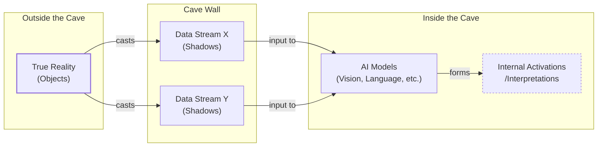
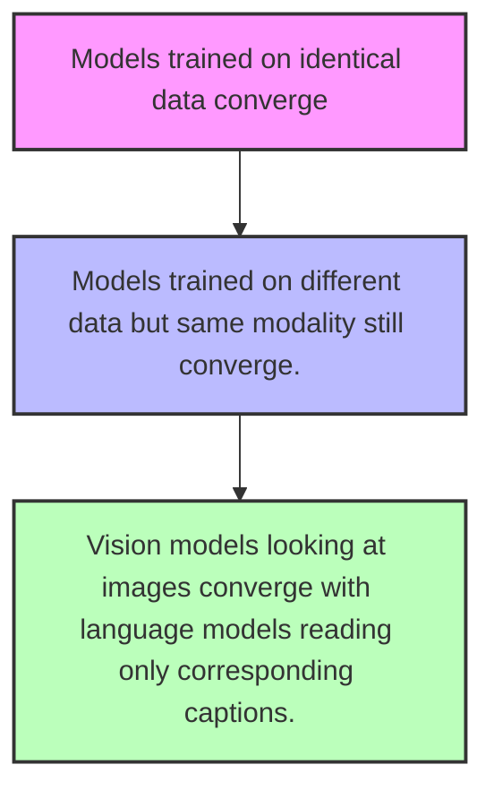

# The Platonic Representation Hypothesis: Are All AI Models Converging?

When you read a story about dogs, you might remember it the next time you see one bounding through a park. This is possible because you have a unified concept of "dog" that is not tied to words or images alone. For humans, this multimodal understanding is natural.

AI systems, however, often learn from data of a single type. A language model trains on text, a vision system on images. This raises a fundamental question for us as AI engineers: to what extent do these separate models build a shared understanding of the world? Do a language model and a vision model represent a "dog" in a similar way?

Researchers investigate these questions by peering inside AI systems to study how they represent scenes and sentences. They have found that different models, even when trained on different datasets or with different architectures, can develop similar internal representations [[1]](https://arxiv.org/abs/2310.13018). Furthermore, these representations tend to grow more similar as the models become more capable [[2]](https://arxiv.org/abs/2106.07682). These observations form the basis of what a team of MIT researchers dubbed the "Platonic Representation Hypothesis" (PRH), an idea that has since sparked a lively debate among researchers, with multiple follow-up papers extending and challenging its claims [[3]](https://arxiv.org/abs/2502.16282), [[4]](https://arxiv.org/abs/2503.05283), [[5]](https://arxiv.org/abs/2512.03750).

The hypothesis gets its name from Plato's 2,400-year-old Allegory of the Cave, where prisoners perceive the world only through shadows cast on a wall. Plato argued that our everyday reality is like these shadows, mere projections of ideal "forms." The PRH adapts this for AI: the real world is outside the cave, casting machine-readable shadows as data streams like images and text [[6]](https://arxiv.org/abs/2405.07987).

AI models are the prisoners, and the hypothesis is that as they grow more powerful, they converge on a shared "Platonic representation" of the world behind the data. "Why do the language model and the vision model align? Because they’re both shadows of the same world," said Phillip Isola, the senior author of the paper [[7]](https://www.quantamagazine.org/distinct-ai-models-seem-to-converge-on-how-they-encode-reality-20260107).

Image 1: Plato's Cave allegory adapted for AI, showing how models interpret data (shadows) cast from an underlying reality.

Of course, the hypothesis is not without its critics. Key points of contention include how to define a representation and which methods are best for comparing them across different models. You cannot simply inspect a language model’s internal representation of every sentence or a vision model’s representation of every image. So how do you decide which ones are representative? A consensus is unlikely to be reached soon. Still, this doesn't bother Isola. "Half the community says this is obvious, and the other half says this is obviously wrong," he said. "We were happy with that response" [[7]](https://www.quantamagazine.org/distinct-ai-models-seem-to-converge-on-how-they-encode-reality-20260107).

Having framed the Platonic representation hypothesis and its philosophical roots, you can now explore the precise geometric mechanism that makes such comparisons possible by examining how representations are compared through the company their vectors keep.

## The Company Being Kept

The philosopher Pythagoras supposedly started from the premise "All is number," an apt description for the neural networks that power AI models. Their representations of words or images are just long lists of numbers, each indicating the activation of a specific artificial neuron. Researchers typically represent these activations as a high-dimensional vector, an arrow pointing in a particular direction in an abstract space that is impossible to visualize directly [[7]](https://www.quantamagazine.org/distinct-ai-models-seem-to-converge-on-how-they-encode-reality-20260107).

Because the coordinate systems of two independently trained models are different, you cannot compare their representation vectors directly. However, you can compare them geometrically. If the vectors for "dog" and "cat" are close in one model, and also close in another, that suggests some alignment. If the entire relational structure of concepts matches—the distances and angles between many concepts—you have strong evidence of conceptual alignment [[8]](https://sidn.baulab.info/universality).

This brings us to a principle from the linguist John Rupert Firth: "You shall know a word by the company it keeps" [[7]](https://www.quantamagazine.org/distinct-ai-models-seem-to-converge-on-how-they-encode-reality-20260107). The meaning of a concept inside a model is defined by its relationship to all other concepts. In a language model, the vector for "dog" will be relatively close to vectors for "pet" and "furry," and farther from "molasses." You can compare models by asking if "dog" sits in a similar relational neighborhood in both spaces.

This leads to a technique called Representational Similarity Analysis (RSA), a framework for characterizing and comparing the internal geometries of different systems [[10]](https://www.emergentmind.com/topics/representational-similarity-analysis-rsa). RSA characterizes a representation by a Representational Dissimilarity Matrix (RDM). An RDM is a square matrix where each off-diagonal entry indicates the dissimilarity between the activity patterns associated with two different stimuli. Popular distance measures include correlation distance (1 minus Pearson correlation), Euclidean distance, and Mahalanobis distance [[9]](https://kriegeskortelab.zuckermaninstitute.columbia.edu/sites/default/files/content/NiliKriegeskorte_2014_PLoSComputBiol.pdf).

Instead of directly comparing the high-dimensional activation vectors, you compare these RDMs, often using rank-correlation coefficients like Spearman's ρ or Kendall's τ to see if they agree on the rank order of dissimilarities. This approach abstracts away the specific coordinate systems and focuses on the underlying geometry of the representations [[10]](https://www.emergentmind.com/topics/representational-similarity-analysis-rsa). You are no longer comparing vectors, but the shapes of the vector clusters. "It can kind of be described as measuring the similarity of similarities," said Ilia Sucholutsky, an AI researcher at New York University [[7]](https://www.quantamagazine.org/distinct-ai-models-seem-to-converge-on-how-they-encode-reality-20260107).

This idea connects to the "Anna Karenina scenario," a nod to Tolstoy's famous opening line. The hypothesis is that all successful AI models are alike in their representations, while every unsuccessful model is unsuccessful in its own way [[2]](https://arxiv.org/abs/2106.07682). If there is a single, optimal way to represent the world to solve a task, then high-performing models should converge on that solution, while weaker models will have more varied, idiosyncratic representations.

The earliest research in this area focused on computer vision, comparing different Convolutional Neural Network (CNN) architectures trained on datasets like ImageNet. Researchers found that representations were often similar, though not identical [[7]](https://www.quantamagazine.org/distinct-ai-models-seem-to-converge-on-how-they-encode-reality-20260107). However, these methods had limitations, especially when the powerful language models of today emerged, creating an opportunity to see just how far representational similarity could go. With these measurement tools in hand, you can now look at the hierarchy of experimental evidence showing that convergence strengthens as models scale.

## Convergent Evolution

The story of the PRH paper began in early 2023, a turbulent time for AI researchers. ChatGPT had been released a few months prior, and it was clear that simply scaling up models made them better at many tasks. But it was unclear why. "Everyone in AI research was going through an existential life crisis," said Minyoung Huh, an OpenAI researcher who was a graduate student in Isola’s lab at the time [[7]](https://www.quantamagazine.org/distinct-ai-models-seem-to-converge-on-how-they-encode-reality-20260107). He, along with Isola and their colleagues, began to discuss how scaling might affect internal representations. The central question was whether scaling simply led to better memorization of dataset quirks or if models were approximating a true underlying world model.

To test this, one can look at a hierarchy of evidence for convergence, with each level providing stronger support for the hypothesis.

Image 2: A hierarchy diagram showing the increasing strength of convergence evidence for the Platonic representation hypothesis.

A year after their initial conversations, Isola and his colleagues wrote their paper reviewing the evidence and formally presenting the PRH [[7]](https://www.quantamagazine.org/distinct-ai-models-seem-to-converge-on-how-they-encode-reality-20260107). By then, other researchers had already found alignment between vision and language model representations [[11]](https://arxiv.org/abs/2209.15162), [[12]](https://arxiv.org/abs/2302.06555). Huh conducted his own experiment using a dataset of 11 language models and 5 vision models of varying sizes, tested on captioned pictures from Wikipedia. He fed the images into the vision models and the captions into the language models, then compared the resulting vector clusters. He observed a steady increase in representational similarity as the models became more powerful, exactly as the PRH predicted [[7]](https://www.quantamagazine.org/distinct-ai-models-seem-to-converge-on-how-they-encode-reality-20260107), [[6]](https://arxiv.org/abs/2405.07987).

This cross-modal convergence is the most compelling evidence. If a vision model looking at a picture of a cat develops a similar internal geometry to a language model reading the word "cat," it suggests both are tapping into a shared, underlying concept rather than just surface-level statistics of their respective data types. After reviewing the evidence for convergence, you must now examine the host of experimental choices that can affect the validity and generalizability of these results.

## Find the Universals

Measuring representational similarity involves a host of experimental choices that can affect the outcome. Researchers must decide which layers to analyze in each network, which of the many similarity metrics to use, and which datasets to test on in the first place [[7]](https://www.quantamagazine.org/distinct-ai-models-seem-to-converge-on-how-they-encode-reality-20260107). The choice of metric, such as Centered Kernel Alignment (CKA) or a nearest-neighbor approach, can influence the results, as some metrics are more sensitive to global structure while others focus on local neighborhoods [[6]](https://arxiv.org/abs/2405.07987).

"If you only test one dataset, you don’t necessarily know how [the result] generalizes,” said Christopher Wolfram, a researcher who has studied these effects. “Who knows what would happen if you did some weirder dataset?" [[7]](https://www.quantamagazine.org/distinct-ai-models-seem-to-converge-on-how-they-encode-reality-20260107). This critique highlights a key challenge: ensuring that observed convergence is a general property of capable models, not an artifact of a particular benchmark.

This leads to two different scientific attitudes. One, associated with Phillip Isola, is to focus on finding the commonalities. "The endeavor of science is to find the universals," Isola said. "We could study the ways in which models are different or disagree, but that somehow has less explanatory power than identifying the commonalities" [[7]](https://www.quantamagazine.org/distinct-ai-models-seem-to-converge-on-how-they-encode-reality-20260107).

The other perspective, held by researchers like Alexei Efros, argues it is more productive to focus on where models differ. "They’re all good friends and they’re all very, very smart people," Efros said of the MIT team. "I think they’re wrong, but that’s what science is about" [[7]](https://www.quantamagazine.org/distinct-ai-models-seem-to-converge-on-how-they-encode-reality-20260107). Efros noted that in the Wikipedia dataset Huh used, the images and text were designed to contain very similar information. However, most real-world data has features that resist simple translation between modalities. "There is a reason why you go to an art museum instead of just reading the catalog," he said [[13]](https://www.quantamagazine.org/distinct-ai-models-seem-to-converge-on-how-they-encode-reality-20260107). The information unique to each modality is often what is most interesting.

Even if the alignment is not perfect, its existence has practical payoffs. Researchers have already used this property to translate internal representations of sentences from one language model to another. If language and vision representations are interchangeable to some extent, it could lead to new ways to train multimodal models more efficiently, as Isola and others explored in a recent paper [[7]](https://www.quantamagazine.org/distinct-ai-models-seem-to-converge-on-how-they-encode-reality-20260107).

Despite these promising developments, some researchers think it is unlikely that a single, elegant theory will fully capture the behavior of modern AI. "You can’t reduce a trillion-parameter system to simple explanations," said Jeff Clune, an AI researcher at the University of British Columbia. "The answers are going to be complicated" [[14]](https://www.quantamagazine.org/distinct-ai-models-seem-to-converge-on-how-they-encode-reality-20260107). Real models may contain vast regions of model-specific idiosyncrasies alongside any converged, "Platonic" core.

Follow-up work continues to test and refine these ideas. For example, research in 2025 on foundation models for computational pathology used RSA to show how architectural choices (CNN vs. Transformer) and training paradigms (self-supervised vs. contrastive) affect internal representation geometry. This provides a more granular view of convergence, revealing how different factors influence the final learned structure [[10]](https://www.emergentmind.com/topics/representational-similarity-analysis-rsa). Another line of research from 2025 uses "Turing RSA" to assess the alignment between human similarity judgments and those of LLMs. This method uses human ratings to create a "ground truth" RDM, which is then compared to model RDMs to reveal gaps in how models reproduce the structure and variability of human cognition [[10]](https://www.emergentmind.com/topics/representational-similarity-analysis-rsa). These studies move beyond a simple "converged or not" question, instead asking *how* and *where* convergence occurs, and what that tells us about building more capable and aligned AI systems.

## Conclusion

The Platonic Representation Hypothesis offers a compelling framework for understanding a fundamental trend in AI: as models become more powerful, their internal "world models" appear to be converging. By using techniques like Representational Similarity Analysis, you can look past the implementation details of different architectures and see a shared geometric structure emerge. This suggests that scaling is not just about memorizing data, but about discovering a more fundamental, modality-agnostic representation of reality.

For AI engineers, this is more than a philosophical curiosity. Understanding this convergence is key to building the next generation of multimodal, agentic systems. It implies that you can translate representations between models, train vision systems with text data, and create agents that reason across different data types with greater semantic fidelity. While the debate continues and the full picture is undoubtedly complex, the evidence for a shared "Platonic representation" points toward a future where different AI systems can understand the world, and each other, in a common language.

## References

- [1] Huh, M., Cheung, B., Wang, T., & Isola, P. (2023). The Platonic Representation Hypothesis. *arXiv*:2310.13018. [https://arxiv.org/abs/2310.13018](https://arxiv.org/abs/2310.13018)
- [2] Bansal, Y., Nakkiran, P., & Barak, B. (2021). The Anna Karenina Scenario: A Vector-Space Analysis of High-Performing Language Models. *arXiv*:2106.07682. [https://arxiv.org/abs/2106.07682](https://arxiv.org/abs/2106.07682)
- [3] Follow-up research on the Platonic Representation Hypothesis. [https://arxiv.org/abs/2502.16282](https://arxiv.org/abs/2502.16282)
- [4] Follow-up research on the Platonic Representation Hypothesis. [https://arxiv.org/abs/2503.05283](https://arxiv.org/abs/2503.05283)
- [5] Follow-up research on the Platonic Representation Hypothesis. [https://arxiv.org/abs/2512.03750](https://arxiv.org/abs/2512.03750)
- [6] Huh, M., Cheung, B., Wang, T., & Isola, P. (2024). The Platonic Representation Hypothesis. *arXiv*:2405.07987. [https://arxiv.org/abs/2405.07987](https://arxiv.org/abs/2405.07987)
- [7] Brubaker, B. (2026, January 7). Distinct AI Models Seem To Converge On How They Encode Reality. *Quanta Magazine*. [https://www.quantamagazine.org/distinct-ai-models-seem-to-converge-on-how-they-encode-reality-20260107](https://www.quantamagazine.org/distinct-ai-models-seem-to-converge-on-how-they-encode-reality-20260107)
- [8] Yao, P., & Feucht, S. (2024, November 19). Universality. *Structure and Interpretation of Deep Networks*. [https://sidn.baulab.info/universality](https://sidn.baulab.info/universality)
- [9] Nili, H., Wingfield, C., Walther, A., Su, L., Marslen-Wilson, W., & Kriegeskorte, N. (2014). A Toolbox for Representational Similarity Analysis. *PLOS Computational Biology*, 10(4), e1003553. [https://kriegeskortelab.zuckermaninstitute.columbia.edu/sites/default/files/content/NiliKriegeskorte_2014_PLoSComputBiol.pdf](https://kriegeskortelab.zuckermaninstitute.columbia.edu/sites/default/files/content/NiliKriegeskorte_2014_PLoSComputBiol.pdf)
- [10] Representational Similarity Analysis (RSA). (2025, September 29). *Emergent Mind*. [https://www.emergentmind.com/topics/representational-similarity-analysis-rsa](https://www.emergentmind.com/topics/representational-similarity-analysis-rsa)
- [11] Merullo, J., et al. (2022). Linearly Mapping from Image to Text Space. *arXiv*:2209.15162. [https://arxiv.org/abs/2209.15162](https://arxiv.org/abs/2209.15162)
- [12] Koh, J. Y., et al. (2023). Grounding Language Models to Images for Multimodal Generation. *arXiv*:2302.06555. [https://arxiv.org/abs/2302.06555](https://arxiv.org/abs/2302.06555)
- [13] Efros, A. (2026, January 7). Quote in *Distinct AI Models Seem To Converge On How They Encode Reality*. Quanta Magazine. [https://www.quantamagazine.org/distinct-ai-models-seem-to-converge-on-how-they-encode-reality-20260107](https://www.quantamagazine.org/distinct-ai-models-seem-to-converge-on-how-they-encode-reality-20260107)
- [14] Clune, J. (2026, January 7). Quote in *Distinct AI Models Seem To Converge On How They Encode Reality*. Quanta Magazine. [https://www.quantamagazine.org/distinct-ai-models-seem-to-converge-on-how-they-encode-reality-20260107](https://www.quantamagazine.org/distinct-ai-models-seem-to-converge-on-how-they-encode-reality-20260107)