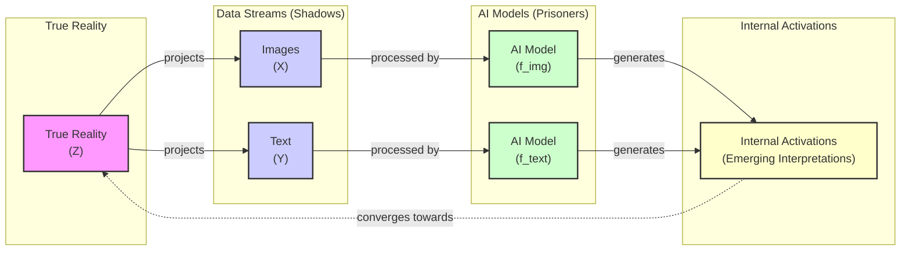

# The Platonic Representation Hypothesis

Read a story about a canine companion, and you may remember it the next time you see one bounding through a park. This is only possible because you have a unified concept of the animal that is not tied to words or images alone. It can be many things while still remaining a dog.

Artificial intelligence systems are not always so lucky. These systems learn by ingesting data in a process called training. Often, that data is all of the same type—text for language models or images for computer vision systems. This specialization has led to remarkable progress, but it also raises a fundamental question: to what extent do these distinct models develop a shared understanding of the world? When a vision model sees a dog and a language model reads the word "dog," are their internal representations capturing the same underlying concept?

Researchers investigate such questions by peering inside AI systems and studying how they represent scenes and sentences. They have found that different AI models can develop similar representations, even if they are trained using different datasets or entirely different data types. Furthermore, a few studies have suggested that those representations are growing more similar as models grow more capable [[1]](https://arxiv.org/abs/2310.13018). In a 2024 paper, four AI researchers at the Massachusetts Institute of Technology (MIT) argued that these hints of convergence are no fluke [[2]](https://arxiv.org/abs/2405.07987). Their idea, dubbed the Platonic representation hypothesis, has inspired a lively debate among researchers and a series of follow-up studies [[3]](https://www.quantamagazine.org/distinct-ai-models-seem-to-converge-on-how-they-encode-reality-20260107).

The team’s hypothesis gets its name from a 2,400-year-old allegory by the Greek philosopher Plato. In it, prisoners trapped inside a cave perceive the world only through shadows cast by outside objects. Plato maintained that we are all like those prisoners. The objects we encounter are pale shadows of ideal "forms" that reside in a transcendent realm beyond the senses. The Platonic representation hypothesis is less abstract. In this version of the metaphor, the true reality outside the cave is the actual world (Z). The shadows projected on the wall are data streams like images (X) or text (Y). The AI models are the prisoners. The MIT team’s claim is that very different models, exposed only to these data streams, are beginning to converge on a shared "Platonic representation" of the world behind the data.

Image 1: A conceptual architecture diagram illustrating Plato's Cave Allegory adapted for AI, showing the flow from True Reality to data streams, through AI models, and converging into internal activations.

Not everyone is convinced. The main points of contention involve not just which representations to focus on, but how to compare them at all. You cannot inspect a language model’s internal representation of every conceivable sentence or a vision model’s representation of every image. Furthermore, the very methods used to measure similarity across different models—with different architectures and training data—are themselves a subject of intense debate. It is unlikely that researchers will reach a consensus on the Platonic representation hypothesis anytime soon, but that does not bother Phillip Isola, the senior author of the paper. “Half the community says this is obvious, and the other half says this is obviously wrong,” he said. “We were happy with that response” [[3]](https://www.quantamagazine.org/distinct-ai-models-seem-to-converge-on-how-they-encode-reality-20260107).

Having framed the hypothesis and its philosophical roots, we will now transition to the precise geometric mechanism that makes such comparisons possible by examining how representations are compared through the company their vectors keep.

## The Company Being Kept

If AI researchers do not agree on Plato, they might find more common ground with his predecessor Pythagoras, whose philosophy supposedly started from the premise “All is number.” That is an apt description of the neural networks that power AI models. Their representations of words or pictures are just long lists of numbers, each indicating the degree of activation of a specific artificial neuron [[3]](https://www.quantamagazine.org/distinct-ai-models-seem-to-converge-on-how-they-encode-reality-20260107).

To simplify the math, researchers typically focus on a single layer of a neural network in isolation. They write down the neuron activations in this layer as a geometric object called a vector. This is an arrow that points in a particular direction in an abstract space. Modern AI models have many thousands of neurons in each layer, so their representations are high-dimensional vectors that are impossible to visualize directly. However, vectors make it easy to compare a network’s representations: two representations are similar if the corresponding vectors point in similar directions [[3]](https://www.quantamagazine.org/distinct-ai-models-seem-to-converge-on-how-they-encode-reality-20260107).

Within a single AI model, similar inputs tend to have similar representations. In a language model, the vector for "dog" will be close to vectors for "pet" and "furry," and farther from "Platonic." This reflects an idea expressed more than 60 years ago by the British linguist John Rupert Firth: “You shall know a word by the company it keeps” [[3]](https://www.quantamagazine.org/distinct-ai-models-seem-to-converge-on-how-they-encode-reality-20260107).

What about representations in different models? It does not make sense to directly compare activation vectors from separate networks, but researchers have devised indirect ways to assess representational similarity. One popular approach is to measure whether two models’ representations of an input keep the same company. Suppose we want to compare how two language models represent words for animals. We feed a list of words into both networks. This list might include concepts like dog, cat, wolf, and jellyfish. In each network, the representations form a cluster of vectors. We can then ask: How similar are the overall shapes of the two clusters?

“It can kind of be described as measuring the similarity of similarities,” said Ilia Sucholutsky, an AI researcher at New York University [[3]](https://www.quantamagazine.org/distinct-ai-models-seem-to-converge-on-how-they-encode-reality-20260107). This is done by calculating a similarity matrix within each model, where each entry represents the similarity (e.g., cosine similarity) between two concepts like 'dog' and 'cat'. The comparison then becomes a measure of how correlated these two matrices are. If the relational geometry is preserved, the matrix from one model should look very similar to the matrix from the other, even if the underlying coordinate systems are completely different. In this simple example, you would expect some similarity. The “cat” vector would probably be close to the “dog” vector in both networks. However, the two clusters probably will not look exactly the same. If your models were trained on different datasets or built on different network architectures, they might not agree on whether "dog" is more like "cat" or "wolf" [[3]](https://www.quantamagazine.org/distinct-ai-models-seem-to-converge-on-how-they-encode-reality-20260107).

The authors of the hypothesis propose a specific endpoint for this convergence. They theorize that models are learning a representation whose kernel approximates the pointwise mutual information (PMI) between the underlying real-world events that generate the data [[5]](https://phillipi.github.io/prh). A kernel is its internal measure of similarity. In this view, the similarity between the internal vectors for "apple" and "orange" in any well-trained model would converge to the PMI between the real-world concepts of apples and oranges, regardless of the data modality used for training. Under certain "smoothness" conditions in the data distribution, a contrastive learner can learn a representation whose kernel is exactly the PMI kernel, up to a constant offset [[2]](https://arxiv.org/abs/2405.07987).

A few studies found that more powerful models had more similarities in their representations. One 2021 paper dubbed this the "Anna Karenina scenario," a nod to Tolstoy's famous line. Perhaps successful AI models are all alike, and every unsuccessful model is unsuccessful in its own way [[2]](https://arxiv.org/abs/2405.07987). This suggests that as models become more competent, they are not just getting better at their tasks, but are also converging on a shared, optimal way of structuring information about the world.

That paper, like much of the early work, focused only on computer vision, which was then the most popular branch of AI research. This focus had inherent limitations. Comparing different convolutional neural network architectures trained on ImageNet was a well-defined problem, but the methods did not easily extend to other modalities. The lack of large-scale, paired vision-language datasets made it difficult to perform meaningful cross-modal comparisons, leaving the question of deeper, modality-agnostic convergence largely unanswered. The advent of powerful language models was about to change that. For Isola, it was also an opportunity to see just how far representational similarity could go [[3]](https://www.quantamagazine.org/distinct-ai-models-seem-to-converge-on-how-they-encode-reality-20260107). With these measurement tools in hand, we can now look at the hierarchy of experimental evidence showing that convergence strengthens as models scale.

## Convergent Evolution

The story of the Platonic representation hypothesis paper began in early 2023. ChatGPT had been released a few months before, and it was increasingly clear that simply scaling up AI models made them better at many different tasks. But it was unclear why.

“Everyone in AI research was going through an existential life crisis,” said Minyoung Huh, an OpenAI researcher who was a graduate student in Isola’s lab at the time [[4]](https://www.youtube.com/watch?v=oBAQLsDkZwc). He began meeting regularly with Isola and their colleagues to discuss how scaling might affect internal representations. When performance improves with scale, are models simply memorizing more dataset quirks, or are they getting better at approximating a true underlying world model? This line of questioning echoes the concept of convergent evolution in biology, where different species independently evolve similar traits to adapt to similar environments. The hypothesis suggests that AI models, like biological organisms, are converging on optimal solutions for representing the world, driven by the shared statistical structure of reality [[6]](https://3dvar.com/Huh2024The.pdf).

The hierarchy of evidence for the hypothesis grows in strength. First, models trained on identical data might converge. More compellingly, models trained on different data but the same modality could still converge. Most strikingly, vision models looking at images might converge with language models reading only the corresponding captions [[3]](https://www.quantamagazine.org/distinct-ai-models-seem-to-converge-on-how-they-encode-reality-20260107).

A year after their initial conversations, Isola and his colleagues decided to write a paper reviewing the evidence and arguing for the hypothesis [[3]](https://www.quantamagazine.org/distinct-ai-models-seem-to-converge-on-how-they-encode-reality-20260107). By then, other researchers had already found alignment between vision and language model representations [[2]](https://arxiv.org/abs/2405.07987). Huh conducted his own experiment, testing five vision models and 11 language models on a dataset of captioned pictures from Wikipedia. He fed the pictures into the vision models and the captions into the language models, then compared vector clusters. He observed a steady increase in representational similarity as models became more powerful, exactly what the hypothesis predicted [[3]](https://www.quantamagazine.org/distinct-ai-models-seem-to-converge-on-how-they-encode-reality-20260107).

After reviewing the evidence for convergence, we must examine a host of experimental choices regarding the measurements of representational similarity that may affect the validity and generalizability of the result.

## Find the Universals

Measurements of representational similarity invariably involve a host of experimental choices that can affect the outcome. These include which layers to look at in each network, which of the many available metrics to use for comparing vector clusters, and which representations to measure in the first place [[3]](https://www.quantamagazine.org/distinct-ai-models-seem-to-converge-on-how-they-encode-reality-20260107).

“If you only test one dataset, you don’t necessarily know how [the result] generalizes,” said Christopher Wolfram, a researcher at the University of Chicago. “Who knows what would happen if you did some weirder dataset?” [[3]](https://www.quantamagazine.org/distinct-ai-models-seem-to-converge-on-how-they-encode-reality-20260107).

This concern about methodology has been explored in detail. A 2026 follow-up study by A. Sophia Koepke and her colleagues at UC Berkeley systematically tested the original paper’s experimental evidence and found it to be fragile [[7]](https://arxiv.org/html/2604.18572v2). They argue that the observed alignment is an artifact of the small, sparse dataset used in the original experiments. When they scaled the evaluation from 1,024 samples to 15 million, the mutual nearest-neighbor alignment dropped from 13.5% to less than 1% [[8]](https://akoepke.github.io/cave_umwelten).

The critique highlights several key issues. First, in a sparse dataset, models may appear to agree simply because the pool of potential neighbors is too small to reveal their differences. As the dataset gets denser, each model finds better neighbors within its own modality, but their choices diverge. Second, the experiments assume a one-to-one correspondence between images and captions, which breaks down with real-world data where one image can have many descriptions. When this assumption is relaxed, alignment further degrades [[7]](https://arxiv.org/html/2604.18572v2).

Furthermore, Koepke’s team found that the reported trend of stronger language models aligning more with vision does not hold for more recent models, which seem to saturate or even decrease in alignment. Instead of converging to a single Platonic ideal, they propose an alternative view based on the biological concept of *Umwelt*: each model inhabits its own perceptual world, shaped by its modality, rather than converging on a shared reality [[7]](https://arxiv.org/html/2604.18572v2).

Isola acknowledged that the issue is far from settled. To him, cases where models do exhibit convergence are more compelling than cases where they may not. “The endeavor of science is to find the universals,” Isola said. “We could study the ways in which models are different or disagree, but that somehow has less explanatory power than identifying the commonalities” [[3]](https://www.quantamagazine.org/distinct-ai-models-seem-to-converge-on-how-they-encode-reality-20260107).

Other researchers argue that it is more productive to focus on where models’ representations differ. Among them is Alexei Efros, a researcher at the University of California, Berkeley. “They’re all good friends and they’re all very, very smart people,” Efros said of the MIT team. “I think they’re wrong, but that’s what science is about.” Efros noted that in the Wikipedia dataset Huh used, the images and text contained very similar information by design. But most data we encounter has features that resist translation. “There is a reason why you go to an art museum instead of just reading the catalog,” he said [[3]](https://www.quantamagazine.org/distinct-ai-models-seem-to-converge-on-how-they-encode-reality-20260107).

Any intrinsic sameness across models does not have to be perfect to be useful. Researchers have developed methods to translate internal representations of sentences from one language model to another, effectively creating a "Rosetta Stone" for AI models [[9]](https://arxiv.org/abs/2309.07593). If language and vision model representations are to some extent interchangeable, that could lead to new ways to train models that learn from both data types more efficiently. For agentic systems, this shared understanding is critical. It allows an agent to process visual information, reason about it using a language model, and act upon the world without losing semantic meaning at each step of the translation [[1]](https://arxiv.org/abs/2310.13018). Isola and others explored this possibility in a recent paper [[2]](https://arxiv.org/abs/2405.07987).

The hypothesis is also inspiring research far beyond computer science. In biology, researchers are testing whether models trained on different biological data—such as cell morphology (images) and gene expression (transcriptomics)—converge on a shared understanding of drug effects [[10]](https://kyrylok.substack.com/p/a-case-for-platonic-biology). The early results are promising, suggesting that different measurement modalities do indeed learn similar relational structures for how drugs affect cells. This connects the idea of Platonic representations to biological concepts like attractor states, where complex systems settle into stable patterns, much like a ball rolling into a valley in an "epigenetic landscape."

Despite these promising developments, other researchers think it is unlikely that any single theory will fully capture the behavior of modern AI models. “You can’t reduce a trillion-parameter system to simple explanations,” said Jeff Clune, an AI researcher at the University of British Columbia. “The answers are going to be complicated” [[3]](https://www.quantamagazine.org/distinct-ai-models-seem-to-converge-on-how-they-encode-reality-20260107). The debate highlights a fundamental tension in AI research. While the Platonic representation hypothesis offers an elegant philosophical framework, the sheer complexity of modern models suggests that complete convergence may coexist with vast regions of model-specific idiosyncrasy. The search for universals continues, balanced by the need to understand the unique behaviors that make each model distinct.

## References

- [1] Merullo, J., et al. (2023). Linearly Mapping from Image to Text Space. *arXiv*. https://arxiv.org/abs/2310.13018
- [2] Huh, M., Cheung, B., Wang, T., & Isola, P. (2024). The Platonic Representation Hypothesis. *arXiv*. https://arxiv.org/abs/2405.07987
- [3] Brubaker, B. (2026). Distinct AI Models Seem To Converge On How They Encode Reality. *Quanta Magazine*. https://www.quantamagazine.org/distinct-ai-models-seem-to-converge-on-how-they-encode-reality-20260107
- [4] Huh, M. (2024). The Platonic Representation Hypothesis. *YouTube*. https://www.youtube.com/watch?v=oBAQLsDkZwc
- [5] Isola, P. (2024). The Platonic Representation Hypothesis. *Project Page*. https://phillipi.github.io/prh
- [6] Huh, M., et al. (2024). The Platonic Representation Hypothesis. *3dvar.com*. https://3dvar.com/Huh2024The.pdf
- [7] Koepke, A. S., et al. (2026). Back into Plato’s Cave: Examining Cross-modal Representational Convergence at Scale. *arXiv*. https://arxiv.org/html/2604.18572v2
- [8] Koepke, A. S. (2026). Back into Plato's Cave: Examining Cross-modal Representational Convergence at Scale. *Project Page*. https://akoepke.github.io/cave_umwelten
- [9] Dravid, T. R., et al. (2023). Rosetta Neurons: A Language for Universal Interpretable Features in Deep Networks. *arXiv*. https://arxiv.org/abs/2309.07593
- [10] Kalashnikov, K. (2024). A Case for Platonic Biology. *Substack*. https://kyrylok.substack.com/p/a-case-for-platonic-biology