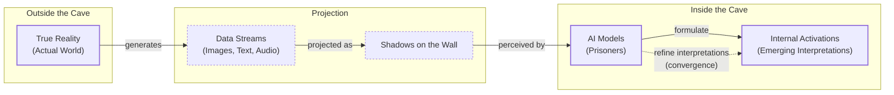
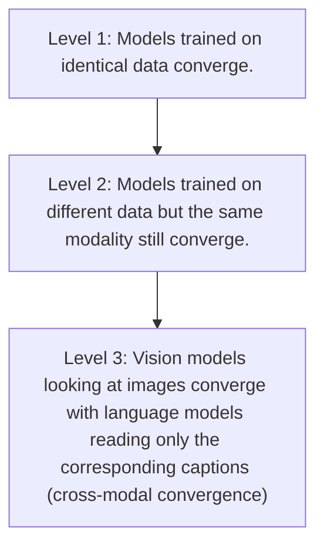

# The Platonic Representation Hypothesis: Are All AI Models Learning the Same Reality?

When you read a story about a dog, the concept lodges in your mind. Later, seeing a Golden Retriever in the park, you instantly connect it to that story. Your idea of "dog" is a unified, abstract representation, not siloed into "text dogs" and "image dogs." Humans navigate a multimodal world effortlessly. AI systems, however, usually do not. They are often specialists, trained on massive but narrow datasets of a single type, like text or images. This raises a fundamental question: can a vision model that has only ever seen pixels and a language model that has only ever processed words develop a shared understanding of a dog?

Researchers are peering inside these complex systems to find out. By studying the internal activations—the patterns of firing neurons—they are uncovering surprising trends. First, models with different architectures, trained on different data, can still develop remarkably similar internal representations [[1]](https://phillipi.github.io/prh). Second, and more importantly, these representations become *more* similar as the models become more capable. This growing body of evidence supports what has been termed the "Platonic representation hypothesis," an idea that has sparked a lively debate among AI researchers [[1]](https://phillipi.github.io/prh), [[2]](https://www.quantamagazine.org/distinct-ai-models-seem-to-converge-on-how-they-encode-reality-20260107).

The hypothesis draws its name from Plato's Allegory of the Cave. In the ancient dialogue, prisoners chained in a cave see only shadows of real objects projected on a wall and mistake this for reality. The hypothesis maps this allegory to AI. The actual world is the "true reality" outside the cave. The data we feed our models—images, text, sounds—are the "shadows on the wall." The AI models are the prisoners, and their internal neural activations are their emerging interpretations. The hypothesis predicts that as models get more powerful, their interpretations converge because they are all trying to model the same underlying reality that casts the shadows [[1]](https://phillipi.github.io/prh).

Image 1: A flowchart illustrating Plato's cave allegory adapted for AI, showing the flow from True Reality to Data Streams, Shadows on the Wall, AI Models, and their Internal Activations.

Of course, the idea is not without its critics. The debate touches on the very definition of a "representation" and the methods used to compare them across different systems. A clear consensus is unlikely to emerge soon. Yet, the researchers behind the hypothesis, including Phillip Isola, remain focused on its core ideas, seemingly unbothered by the pushback [[1]](https://phillipi.github.io/prh).

Image 2: Authors of "The Platonic Representation Hypothesis" (clockwise from top left): Phillip Isola, Minyoung Huh, Brian Cheung, and Tongzhou Wang.

Having framed the hypothesis and its philosophical roots, we need to understand the mechanics. How can we compare the internal thoughts of two completely different AI models? The answer lies not in direct comparison, but in a clever geometric approach that examines the company their concepts keep.

## The Company Being Kept

The philosopher Pythagoras, a predecessor of Plato, is said to have claimed, "All is number." For neural networks, this is literally true. When we talk about a model's "representation" of a concept like a dog, we are not talking about a human-interpretable feature. We are referring to a high-dimensional vector, a list of numbers representing neuron activations. A concept is a point or direction in a vast space whose axes have no obvious meaning to us, making it impossible to visualize or compare directly. Two models might use entirely different coordinate systems to represent the same idea.

This is where geometry provides a solution. We do not need the coordinate systems to match. Instead, we look for evidence of conceptual alignment in the *relative* distances and angles between many concepts. If the vector for "puppy" is close to the vector for "dog" in two different models, and both are far from the vector for "skyscraper," we have a hint of shared structure. This insight is the foundation of modern representational comparison.

The approach mirrors a famous principle from linguistics, articulated by J.R. Firth: "You shall know a word by the company it keeps." For AI models, we can say you shall know a *concept* by the company it keeps. The meaning of the "dog" vector is defined by its geometric relationships to all other concepts in the space. Is it near "mammal" and "pet"? Is it far from "furniture" and "vehicle"? We can compare the internal geometries of two models by asking if their concepts keep similar company.

This leads to a powerful technique: measuring the "similarity of similarities." Instead of trying to rotate one model's embedding space to align with another, which is a difficult and often ill-posed problem, we analyze the geometry itself. We compute a matrix of pairwise similarities for a set of concepts in one model and do the same for the second model. Then, we compare these two matrices. As AI researcher Ilia Sucholutsky puts it, “It can kind of be described as measuring the similarity of similarities” [[2]](https://www.quantamagazine.org/distinct-ai-models-seem-to-converge-on-how-they-encode-reality-20260107).

A widely used metric for this is Centered Kernel Alignment (CKA), which computes a similarity score between 0 (orthogonal) and 1 (perfectly aligned) to quantify representational alignment [[15]](https://orbilu.uni.lu/bitstream/10993/67222/1/Cross_M_Semantics.pdf). CKA is one of several tools, alongside Representational Similarity Analysis (RSA) and various nearest-neighbor scores [[16]](https://arxiv.org/html/2505.13899v1). Ideal metrics are robust to measurement noise and invariant to simple transformations like rotation or scaling, ensuring comparisons capture true conceptual structure [[17]](https://www.emergentmind.com/topics/representational-similarity-metrics). This gives us a single score indicating how well the relational structure is preserved across the two systems.

This pattern of convergence gives rise to an "Anna Karenina scenario," named after Tolstoy's famous opening line [[1]](https://phillipi.github.io/prh). All successful, high-performing models are alike; they converge toward a similar representational geometry. Each underperforming or poorly trained model is weak in its own way, with an idiosyncratic internal structure that fails to capture reality effectively. This observation strongly supports the hypothesis that there is a single, optimal structure for models to discover.

The earliest research using these representational similarity techniques focused on comparing different vision models, like various convolutional neural network architectures all trained on ImageNet [[1]](https://phillipi.github.io/prh). This was a natural starting point, as the models shared the same data modality. The real challenge, and the more profound test of the hypothesis, came when researchers tried to extend these methods to compare models across entirely different modalities, like vision and language. With these measurement tools in hand, we can now examine the hierarchy of experimental evidence suggesting that this convergence is real and strengthens as models scale.

## Convergent Evolution

In early 2023, with ChatGPT's influence rapidly expanding, a central question dominated AI research. As models got bigger and better, were they simply memorizing more statistical quirks from their training data, or were they building a progressively more accurate model of the world? This question, as researcher Minyoung Huh described it, provoked an "existential life crisis" among his peers, leading to discussions with Isola and others about what scaling was truly doing to a model's internal representations [[3]](https://www.youtube.com/watch?v=oBAQLsDkZwc).

This line of inquiry draws from the biological concept of convergent evolution. The idea is that when highly dissimilar systems, like AI and brains, independently arrive at similar representations, it suggests those representations are a functionally necessary solution for modeling the world [[18]](https://www.pnas.org/doi/10.1073/pnas.2319709121).

The evidence for the Platonic representation hypothesis can be organized into a hierarchy of increasing strength. At the base level, models trained on identical data converge. More impressively, models trained on different datasets within the same modality, like two vision models trained on different image collections, also converge. The most striking evidence, however, comes from cross-modal convergence: a vision model that only sees images develops representations that align with a language model that only reads corresponding captions [[1]](https://phillipi.github.io/prh).

Image 3: A hierarchy of evidence strength for the Platonic representation hypothesis.

A year after those initial conversations, Huh, Isola, and their colleagues published a paper reviewing the evidence and making a formal case for the hypothesis [[1]](https://phillipi.github.io/prh). Their core experiment to test cross-modal convergence was elegant. They took a set of vision models and a set of language models of varying sizes and capabilities. Using a dataset of paired images and captions, they fed the images to the vision models and the text to the language models. They then used similarity metrics to compare the resulting activation spaces.

The results were clear. As both vision and language models became larger and more competent at their respective tasks, their internal representations became more aligned. The geometry of concepts in a top-tier vision model looked increasingly like the geometry of the same concepts in a top-tier language model. While this evidence is compelling, the validity of such claims hinges on a host of experimental choices that can complicate the interpretation of the results. This brings us to the challenge of finding the universals amidst this complexity.

## Find the Universals

Making strong claims about representational convergence is complicated by numerous experimental degrees of freedom. Researchers must decide which model layer to extract representations from, which similarity metric to use (like Centered Kernel Alignment or Representational Similarity Analysis), and which dataset to use for probing the models' internal states. Each choice can influence the outcome, making it difficult to draw universal conclusions.

The choice of metric is particularly consequential. Some, like CKA, measure global geometry, while others focus on local neighborhoods or topology, like Representation Topology Divergence (RTD) [[19]](https://proceedings.mlr.press/v162/barannikov22a/barannikov22a.pdf). These different lenses can yield conflicting conclusions. One critique, for instance, highlights the issue of generalizability. Findings that show strong alignment on one dataset may not necessarily hold true on another, suggesting that the observed similarity could be an artifact of the specific test data rather than a fundamental property of the models [[4]](https://openreview.net/pdf/8f5b35d2ddc2eb1879dfc35e29053095d81d7d69.pdf).

This methodological uncertainty reflects two complementary attitudes in the scientific community. One camp, associated with Isola, actively seeks the universal principles and shared structures that emerge across different AI systems [[1]](https://phillipi.github.io/prh). The other, represented by researchers like Alexei Efros, deliberately studies where and why models differ, believing that these divergences often reveal the most about their underlying biases and failure modes.

Image 4: AI researcher Alexei A. Efros, a proponent of studying model differences.

Efros, for example, expressed skepticism about Huh's results, arguing that the Wikipedia dataset used was too clean. The images and text were designed to contain very similar information. In the real world, data is messier and richer. "There is a reason why you go to an art museum instead of just reading the catalog," he remarked, pointing out that different modalities capture unique information that resists simple translation [[2]](https://www.quantamagazine.org/distinct-ai-models-seem-to-converge-on-how-they-encode-reality-20260107). He concluded, "I think they’re wrong, but that’s what science is about."

More recent quantitative critiques challenge the hypothesis's core evidence. One analysis found that when scaling from 1,024 to 15 million samples, representational alignment *degraded* dramatically, dropping from 13.5% to less than 1%. The study also argued that alignment breaks down with realistic many-to-many data and that newer, more capable language models are not more aligned with vision models, contrary to predictions [[20]](https://akoepke.github.io/cave_umwelten).

Even if perfect alignment is never achieved, the discovery of partial convergence has immediate practical payoffs. It explains why we can translate representations from one model to another, making it easier to build systems that perform cross-modal tasks like visual question answering. It also suggests why joint multimodal training is so effective. This enables agentic systems, particularly in robotics, to translate between modalities—for instance, mapping visual or tactile sensor data into a shared space with language commands to perform physical tasks [[21]](https://arxiv.org/html/2507.10087v1), [[1]](https://phillipi.github.io/prh).

However, there is a tension between the elegant, philosophical appeal of the Platonic hypothesis and the raw complexity of modern AI. As Jeff Clune, an AI researcher at the University of British Columbia, noted, “You can’t reduce a trillion-parameter system to simple explanations. The answers are going to be complicated” [[2]](https://www.quantamagazine.org/distinct-ai-models-seem-to-converge-on-how-they-encode-reality-20260107). The reality may be that a general convergence toward a shared world model coexists with vast regions of model-specific knowledge and idiosyncratic behavior.

Follow-up work continues to test the hypothesis. The **Strong Platonic Representation Hypothesis** posits that the universal latent structure can be learned to translate between embedding spaces without any paired data. Researchers demonstrated this with a method called `vec2vec`, successfully translating between text models with high fidelity [[22]](https://natecombs.substack.com/p/the-strong-platonic-representation). Other work has found convergence in models trained on different astronomical data modalities, like imaging and spectroscopy [[23]](https://www.emergentmind.com/topics/platonic-representation-hypothesis). These ongoing efforts push the boundaries of our understanding, revealing a picture that is far more nuanced than a simple binary choice between convergence and divergence.

## Conclusion

The Platonic representation hypothesis offers a compelling framework for understanding a surprising trend in AI: as models scale, their internal views of the world begin to look more and more alike. Using geometric techniques to measure the "similarity of similarities," researchers have found evidence of this convergence not just within a single modality, but across vision and language models.

This convergence is not just a theoretical curiosity. It has profound implications for AI engineering, suggesting that different models can share a common "world model." This shared understanding is what enables the development of powerful multimodal systems and agents that can reason and act across different types of data. While the debate over the extent and nature of this convergence will continue, the journey to find these universal structures is pushing us toward building more integrated and capable AI.

## References

- [1] Huh, M., Cheung, B., Wang, T., & Isola, P. (2024). *The Platonic Representation Hypothesis*. [https://phillipi.github.io/prh](https://phillipi.github.io/prh)
- [2] Wood, C. (2026). *Distinct AI Models Seem to Converge on How They Encode Reality*. [https://www.quantamagazine.org/distinct-ai-models-seem-to-converge-on-how-they-encode-reality-20260107](https://www.quantamagazine.org/distinct-ai-models-seem-to-converge-on-how-they-encode-reality-20260107)
- [3] Hartnett, K. (2024). *In AI, Is Bigger Always Better?*. [https://www.youtube.com/watch?v=oBAQLsDkZwc](https://www.youtube.com/watch?v=oBAQLsDkZwc)
- [4] Ciernik, M., et al. (2024). *The pattern persists across probe datasets, implying its generalizability*. [https://openreview.net/pdf/8f5b35d2ddc2eb1879dfc35e29053095d81d7d69.pdf](https://openreview.net/pdf/8f5b35d2ddc2eb1879dfc35e29053095d81d7d69.pdf)
- [5] Nili, H., et al. (2014). *A Toolbox for Representational Similarity Analysis*. [https://kriegeskortelab.zuckermaninstitute.columbia.edu/sites/default/files/content/NiliKriegeskorte_2014_PLoSComputBiol.pdf](https://kriegeskortelab.zuckermaninstitute.columbia.edu/sites/default/files/content/NiliKriegeskorte_2014_PLoSComputBiol.pdf)
- [6] EmergentMind. (2025). *Representational Similarity Analysis (RSA)*. [https://www.emergentmind.com/topics/representational-similarity-analysis-rsa](https://www.emergentmind.com/topics/representational-similarity-analysis-rsa)
- [7] Wang, R., et al. (2025). *Brain-inspired learning for generalization*. [https://proceedings.iclr.cc/paper_files/paper/2025/file/3f9bbf77fbd858e5b6e39d39fe84ed2e-Paper-Conference.pdf](https://proceedings.iclr.cc/paper_files/paper/2025/file/3f9bbf77fbd858e5b6e39d39fe84ed2e-Paper-Conference.pdf)
- [8] Huh, M., et al. (2024). *The Platonic Representation Hypothesis*. [https://proceedings.mlr.press/v235/huh24a.html](https://proceedings.mlr.press/v235/huh24a.html)
- [9] Savanna, N. (2024). *The Platonic Representation Hypothesis*. [https://new-savanna.blogspot.com/2024/05/the-platonic-representation-hypothesis.html](https://new-savanna.blogspot.com/2024/05/the-platonic-representation-hypothesis.html)
- [10] Sidn. (n.d.). *Universality*. [https://sidn.baulab.info/universality](https://sidn.baulab.info/universality)
- [11] Two Minute Papers. (2024). *Do AIs Dream Of Platonic Forms?*. [https://www.youtube.com/watch?v=V7AyriUcXZQ](https://www.youtube.com/watch?v=V7AyriUcXZQ)
- [12] *Distinct AI Models Seem to Converge on How They Encode Reality*. [https://www.quantamagazine.org/distinct-ai-models-seem-to-converge-on-how-they-encode-reality-20260107](https://www.quantamagazine.org/distinct-ai-models-seem-to-converge-on-how-they-encode-reality-20260107)
- [13] *In AI, Is Bigger Always Better?*. [https://www.youtube.com/watch?v=oBAQLsDkZwc](https://www.youtube.com/watch?v=oBAQLsDkZwc)
- [14] *Representational Similarity Analysis (RSA)*. [https://www.emergentmind.com/topics/representational-similarity-analysis-rsa](https://www.emergentmind.com/topics/representational-similarity-analysis-rsa)
- [15] *Cross-Modal Semantics of T-BERT and CLIP*. [https://orbilu.uni.lu/bitstream/10993/67222/1/Cross_M_Semantics.pdf](https://orbilu.uni.lu/bitstream/10993/67222/1/Cross_M_Semantics.pdf)
- [16] *A large body of work has considered ways in which AI model representations*. [https://arxiv.org/html/2505.13899v1](https://arxiv.org/html/2505.13899v1)
- [17] *Representational Similarity Metrics*. [https://www.emergentmind.com/topics/representational-similarity-metrics](https://www.emergentmind.com/topics/representational-similarity-metrics)
- [18] *Brain–machine convergent evolution: Why finding parallels between brain and artificial systems is informative*. [https://www.pnas.org/doi/10.1073/pnas.2319709121](https://www.pnas.org/doi/10.1073/pnas.2319709121)
- [19] Barannikov, S., et al. (2022). *Representation Topology Divergence: a Method for Comparing Neural Network Representations*. [https://proceedings.mlr.press/v162/barannikov22a/barannikov22a.pdf](https://proceedings.mlr.press/v162/barannikov22a/barannikov22a.pdf)
- [20] Koepke, A., et al. (2024). *Back into Plato's Cave: Examining Cross-modal Representational Convergence at Scale*. [https://akoepke.github.io/cave_umwelten](https://akoepke.github.io/cave_umwelten)
- [21] *Foundation Models for Robotics: A Survey*. [https://arxiv.org/html/2507.10087v1](https://arxiv.org/html/2507.10087v1)
- [22] Combs, N. (2025). *The Strong Platonic Representation Hypothesis*. [https://natecombs.substack.com/p/the-strong-platonic-representation](https://natecombs.substack.com/p/the-strong-platonic-representation)
- [23] *Platonic Representation Hypothesis*. [https://www.emergentmind.com/topics/platonic-representation-hypothesis](https://www.emergentmind.com/topics/platonic-representation-hypothesis)