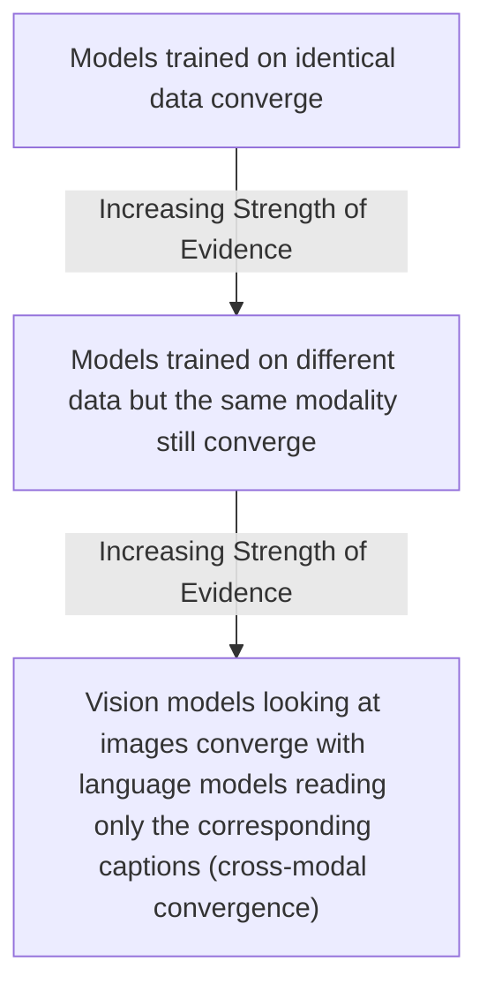

# Are All AI Models Secretly the Same? Unpacking the Platonic Representation Hypothesis

Read a story about dogs, and you may remember it the next time you see one bounding through a park. That is only possible because you have a unified concept of “dog” that is not tied to words or images alone. Bulldog or border collie, barking or getting its belly rubbed, a dog can be many things while still remaining a dog.

Artificial intelligence systems are not always so lucky. These systems learn by ingesting data in a process called training. Often, that data is all of the same type—text for language models, images for computer vision systems, or more exotic kinds of data for systems designed to predict the smell of molecules or the shape of proteins [[36]](https://www.quantamagazine.org/how-ai-revolutionized-protein-science-but-didnt-end-it-20240626). This raises a fundamental question: to what extent do language and vision models have a shared understanding of dogs?

Researchers investigate such questions by peering inside AI systems and studying how they represent scenes and sentences. A recent line of inquiry has found that different AI models can develop similar representations, even if they are trained using different datasets or entirely different data types [[1]](https://arxiv.org/html/2504.08775v1). What is more, a few studies have suggested that those representations are growing more similar as models grow more capable [[3]](https://arxiv.org/html/2507.01201v5). In a paper from the Massachusetts Institute of Technology, four AI researchers argued that these hints of convergence are no fluke [[15]](https://phillipi.github.io/prh). Their idea, dubbed the Platonic representation hypothesis, has inspired a lively debate and a series of follow-up studies [[33]](https://arxiv.org/html/2511.12121v4), [[35]](https://www.emergentmind.com/topics/multimodal-alignment).

The team’s hypothesis gets its name from a 2,400-year-old allegory by the Greek philosopher Plato. In it, prisoners trapped inside a cave perceive the world only through shadows cast by outside objects. Plato maintained that we are all like those unfortunate prisoners. The objects we encounter in everyday life, in his view, are pale shadows of ideal “forms” that reside in some transcendent realm beyond the reach of the senses [[2]](https://www.alignmentforum.org/posts/kFCu3batN8k8mwtmh/the-cave-allegory-revisited-understanding-gpt-s-worldview).

The Platonic representation hypothesis is less abstract. In this version of the metaphor, what is outside the cave is the real world, and it casts machine-readable shadows as streams of data. AI models are the prisoners. The MIT team’s claim is that very different models, exposed only to these data streams, are beginning to converge on a shared “Platonic representation” of the world behind the data. Phillip Isola, the senior author of the paper, puts it this way: “Why do the language model and the vision model align? Because they’re both shadows of the same world” [[11]](https://www.quantamagazine.org/distinct-ai-models-seem-to-converge-on-how-they-encode-reality-20260107).

Not everyone is convinced. One of the main points of contention involves which representations to focus on. You cannot inspect a language model’s internal representation of every conceivable sentence or a vision model’s representation of every image. So how do you decide which ones are representative? It is unlikely that researchers will reach a consensus on the hypothesis anytime soon, but that does not bother Isola. “Half the community says this is obvious, and the other half says this is obviously wrong,” he said. “We were happy with that response” [[11]](https://www.quantamagazine.org/distinct-ai-models-seem-to-converge-on-how-they-encode-reality-20260107).

Having framed the Platonic representation hypothesis and its philosophical roots, we will now transition to the precise geometric mechanism that makes such comparisons possible by examining how representations are compared through the company their vectors keep.

## The Company Being Kept

If AI researchers do not agree on Plato, they might find more common ground with his predecessor Pythagoras, whose philosophy supposedly started from the premise “All is number.” That is an apt description of the neural networks that power AI models. Their representations of words or pictures are just long lists of numbers, each indicating the degree of activation of a specific artificial neuron [[11]](https://www.quantamagazine.org/distinct-ai-models-seem-to-converge-on-how-they-encode-reality-20260107).

Researchers typically focus on a single layer of a neural network, which is like taking a snapshot of its activity at a specific moment. They write down the neuron activations in this layer as a geometric object called a vector—an arrow pointing in a particular direction in an abstract space. Modern AI models have thousands of neurons in each layer, so their representations are high-dimensional vectors that are impossible to visualize directly. But vectors make it easy to compare a network’s representations: two are similar if their vectors point in similar directions.

Within a single AI model, similar inputs tend to have similar representations. In a language model, the vector for “dog” will be relatively close to vectors for “pet” and “furry,” and farther from “molasses.” This is a modern incarnation of an idea expressed over 60 years ago by the British linguist John Rupert Firth: “You shall know a word by the company it keeps” [[11]](https://www.quantamagazine.org/distinct-ai-models-seem-to-converge-on-how-they-encode-reality-20260107).

What about representations in different models? It does not make sense to directly compare activation vectors from separate networks, but researchers have devised indirect ways to assess their similarity. One popular approach is to embrace Firth’s lesson and measure whether two models’ representations of an input keep the same company. Imagine you want to compare how two language models represent animals. You would feed a list of words—dog, cat, wolf, jellyfish—into both networks and record their representations. In each network, these representations form a cluster of vectors. You can then ask how similar the overall shapes of the two clusters are.

This technique measures the "similarity of similarities," as AI researcher Ilia Sucholutsky described it [[11]](https://www.quantamagazine.org/distinct-ai-models-seem-to-converge-on-how-they-encode-reality-20260107). Instead of trying to rotate one model's vector space onto another, which is often an ill-posed problem, we compare the relational geometry. We ask if "dog" is closer to "cat" than "wolf" in both models. This approach produces a scalar score indicating how much of the relational structure is preserved.

Intriguingly, a few studies found that more powerful models seemed to have more similarities in their representations than weaker ones. One 2021 paper dubbed this the “Anna Karenina scenario,” a nod to the opening line of the famous novel [[13]](https://aiscientist.substack.com/p/musing-38-the-platonic-representation). The idea is that all successful AI models are alike, while every unsuccessful model is unsuccessful in its own way. This aligns with the hypothesis that there is a single, optimal structure for them to discover [[29]](https://arxiv.org/html/2507.01201v5).

That paper, like much of the early work on representational similarity, focused only on computer vision. The advent of powerful language models was about to change that, providing an opportunity to see just how far representational similarity could go. With these measurement tools in hand, we can now look at the hierarchy of experimental evidence showing that convergence strengthens as models scale.

## Convergent Evolution

The story of the Platonic representation hypothesis paper began in early 2023, a turbulent time for AI researchers. ChatGPT had been released a few months before, and it was increasingly clear that simply scaling up AI models made them better at many different tasks. But it was unclear why. "Everyone in AI research was going through an existential life crisis,” said Minyoung Huh, an OpenAI researcher who was a graduate student in Isola’s lab at the time [[20]](https://www.quantamagazine.org/distinct-ai-models-seem-to-converge-on-how-they-encode-reality-20260107). He began meeting regularly with Isola and their colleagues Brian Cheung and Tongzhou Wang to discuss how scaling might affect internal representations.

When performance improves with scale, are models simply memorizing more dataset quirks, or are they progressively approximating a true underlying world model that exists outside any particular corpus? To answer this, we can look at a hierarchy of evidence.

Image 1: Hierarchy of increasing strength of evidence for the Platonic representation hypothesis.

If models trained on identical data converge, it might just mean they are good at grasping the training dataset's quirks. A more compelling case arises if models trained on different datasets of the same modality, like images, also converge. This suggests they are grasping shared features of the world behind the data. The strongest evidence, however, comes from cross-modal convergence. If vision models learning from images and language models learning from text develop similar internal geometries, it strongly implies they are both modeling the same underlying reality.

A year after their initial conversations, Isola and his colleagues decided to write a paper reviewing the evidence for these convergent representations and presenting their argument for the Platonic representation hypothesis [[11]](https://www.quantamagazine.org/distinct-ai-models-seem-to-converge-on-how-they-encode-reality-20260107). By then, other researchers had already found evidence of alignment between vision and language model representations [[11]](https://www.quantamagazine.org/distinct-ai-models-seem-to-converge-on-how-they-encode-reality-20260107).

Huh conducted his own experiment, testing a set of vision and language models on a dataset of captioned pictures from Wikipedia. He would feed the pictures into the vision models and the captions into the language models, then compare the resulting vector clusters. He observed a steady increase in representational similarity as models became more powerful, exactly as the Platonic representation hypothesis predicted [[11]](https://www.quantamagazine.org/distinct-ai-models-seem-to-converge-on-how-they-encode-reality-20260107).

After reviewing the evidence for convergence, we must examine the experimental choices that can affect the validity of these results.

## Find the Universals

Of course, it is never so simple. Measurements of representational similarity invariably involve a host of experimental choices that can affect the outcome. Which layers do you look at in each network? Which of the many available similarity metrics do you use? And which representations do you measure in the first place? "If you only test one dataset, you don’t necessarily know how [the result] generalizes,” said Christopher Wolfram, a researcher who has studied this problem. “Who knows what would happen if you did some weirder dataset?” [[11]](https://www.quantamagazine.org/distinct-ai-models-seem-to-converge-on-how-they-encode-reality-20260107). His work highlights the challenge of distinguishing arbitrary properties from fundamental ones in neural representations [[17]](https://openreview.net/forum?id=8wKec6faAT), [[18]](https://arxiv.org/html/2504.08775v1).

This has led to two complementary scientific attitudes. One, associated with Isola, actively seeks the universals that models appear to share. “The endeavor of science is to find the universals,” Isola said. “We could study the ways in which models are different or disagree, but that somehow has less explanatory power than identifying the commonalities” [[11]](https://www.quantamagazine.org/distinct-ai-models-seem-to-converge-on-how-they-encode-reality-20260107).

Other researchers, like Alexei Efros at UC Berkeley, argue that it is more productive to focus on where models’ representations differ. “They’re all good friends and they’re all very, very smart people,” Efros said. “I think they’re wrong, but that’s what science is about.” He noted that in the Wikipedia dataset Huh used, the images and text contained very similar information by design. But most data we encounter has features that resist translation. “There is a reason why you go to an art museum instead of just reading the catalog,” he said [[11]](https://www.quantamagazine.org/distinct-ai-models-seem-to-converge-on-how-they-encode-reality-20260107).

Any intrinsic sameness across models does not have to be perfect to be useful. Even with only partial alignment, there are immediate practical payoffs. Researchers have used this property to translate internal representations from one language model to another [[11]](https://www.quantamagazine.org/distinct-ai-models-seem-to-converge-on-how-they-encode-reality-20260107). If language and vision representations are to some extent interchangeable, it could lead to new ways to train models that learn from both data types [[11]](https://www.quantamagazine.org/distinct-ai-models-seem-to-converge-on-how-they-encode-reality-20260107). This is especially valuable in multimodal systems where strategic alignment can improve performance by leveraging redundancy between modalities [[33]](https://arxiv.org/html/2511.12121v4), [[34]](https://ojs.aaai.org/index.php/AAAI/article/view/39248/43209).

Despite these promising developments, other researchers think it is unlikely that any single theory will fully capture the behavior of modern AI. “You can’t reduce a trillion-parameter system to simple explanations,” said Jeff Clune, an AI researcher. “The answers are going to be complicated” [[11]](https://www.quantamagazine.org/distinct-ai-models-seem-to-converge-on-how-they-encode-reality-20260107). While the Platonic hypothesis offers a clean philosophical story, real models contain so many interacting parts that full convergence may coexist with vast regions of model-specific idiosyncrasy.

## Conclusion

The Platonic representation hypothesis offers a compelling framework for understanding a fundamental trend in AI: as models become more capable, their internal representations of the world appear to converge. This convergence is not just a theoretical curiosity; it is an observable phenomenon that holds even across different data modalities like vision and language. We have seen how researchers measure this "similarity of similarities" and the evidence suggesting that scale and performance are key drivers of this alignment.

However, the path to a single, universal "Platonic" representation is not straightforward. The debate continues over the best methods for measuring alignment, the significance of model differences versus their commonalities, and whether such a simple explanation can truly capture the complexity of modern AI systems.

What is clear is that understanding this convergence has practical implications. It opens doors for more efficient multimodal training, better transfer learning, and more robust agentic systems that can reason across different types of information. As we continue to build larger and more complex AI, the question of whether they are all learning the same underlying model of reality will remain one of the most important in the field.

## References

- [1] Wolfram, C., & Schein, A. (2025). Layers at Similar Depths Generate Similar Activations Across LLM Architectures. arXiv. https://arxiv.org/html/2504.08775v1
- [2] Kovič, M. (2024). The Cave Allegory Revisited: Understanding GPT's Worldview. Alignment Forum. https://www.alignmentforum.org/posts/kFCu3batN8k8mwtmh/the-cave-allegory-revisited-understanding-gpt-s-worldview
- [3] Yoon, L. H., Yue, Y., & Kim, B. (2025). Escaping Plato’s Cave: JAM for Aligning Independently Trained Vision and Language Models. arXiv. https://arxiv.org/html/2507.01201v5
- [4] Huh, M., Cheung, B., Wang, T., & Isola, P. (2024). The Platonic Representation Hypothesis. arXiv. https://3dvar.com/Huh2024The.pdf
- [5] Levine, S. (2023). Language Models in Plato's Cave. The Gradient. https://sergeylevine.substack.com/p/language-models-in-platos-cave
- [6] Wolfram, C., & Schein, A. (2025). Layers at Similar Depths Generate Similar Activations Across LLM Architectures. arXiv. https://arxiv.org/html/2504.08775v1
- [7] Wolfram, C. (2025). Critique of representational similarity generalizability. Preprint. https://www.preprints.org/manuscript/202601.1018
- [8] Wolfram, C. (2025). Layers at Similar Depths Generate Similar Activations Across LLM Architectures. arXiv. https://arxiv.org/html/2504.08775v1
- [9] Wolfram, C. (2025). Critique of representational similarity generalizability. OpenReview. https://openreview.net/forum?id=8wKec6faAT
- [10] Wolfram, C. (2025). Critique of representational similarity generalizability. Preprint. https://www.preprints.org/manuscript/202601.1018
- [11] Brubaker, B. (2026). Distinct AI Models Seem To Converge On How They Encode Reality. Quanta Magazine. https://www.quantamagazine.org/distinct-ai-models-seem-to-converge-on-how-they-encode-reality-20260107
- [12] EmergentMind. (2025). Platonic Representation Hypothesis. https://www.emergentmind.com/topics/platonic-representation-hypothesis
- [13] The AI Scientist. (2024). Musing 38: The Platonic Representation Hypothesis. Substack. https://aiscientist.substack.com/p/musing-38-the-platonic-representation
- [14] Huh, M., Cheung, B., Wang, T., & Isola, P. (2024). The Platonic Representation Hypothesis. arXiv. https://3dvar.com/Huh2024The.pdf
- [15] Isola, P., et al. (2024). The Platonic Representation Hypothesis. https://phillipi.github.io/prh
- [16] Bansal, Y., Nakkiran, P., & Barak, B. (2021). Revisiting Model Stitching to Compare Neural Representations. arXiv. https://arxiv.org/html/2507.01201v5
- [17] Wolfram, C. (2025). Critique of representational similarity generalizability. OpenReview. https://openreview.net/forum?id=8wKec6faAT
- [18] Wolfram, C. (2025). Layers at Similar Depths Generate Similar Activations Across LLM Architectures. arXiv. https://arxiv.org/html/2504.08775v1
- [19] Wolfram, C. (2025). Critique of representational similarity generalizability. Preprint. https://www.preprints.org/manuscript/202601.1018
- [20] Brubaker, B. (2026). Distinct AI Models Seem To Converge On How They Encode Reality. Quanta Magazine. https://www.quantamagazine.org/distinct-ai-models-seem-to-converge-on-how-they-encode-reality-20260107
- [21] Fang, W., Zhang, T., & Chan, A. (2025). To Align or Not to Align: Strategic Multimodal Representation Alignment for Optimal Performance. arXiv. https://arxiv.org/html/2511.12121v4
- [22] Gupta, S., et al. (2025). Better Together: Leveraging Unpaired Multimodal Data for Stronger Unimodal Models. arXiv. https://arxiv.org/html/2510.08492
- [23] Xiao, L., et al. (2023). Cross-modal fine-grained alignment and fusion network for multimodal aspect-based sentiment analysis. Information Processing & Management. https://www.itm-conferences.org/articles/itmconf/pdf/2025/09/itmconf_cseit2025_04036.pdf
- [24] Wu, T., et al. (2024). Semantic Alignment for Multimodal Large Language Models. In Proceedings of the 32nd ACM International Conference on Multimedia. https://www.itm-conferences.org/articles/itmconf/pdf/2025/09/itmconf_cseit2025_04036.pdf
- [25] Zhang, J., et al. (2024). E2e-mfd: Towards end-to-end synchronous multimodal fusion detection. Advances in Neural Information Processing Systems. https://www.itm-conferences.org/articles/itmconf/pdf/2025/09/itmconf_cseit2025_04036.pdf
- [26] Liu, Y., et al. (2024). AlignRec: Aligning and Training in Multimodal Recommendations. In Proceedings of the 33rd ACM International Conference on Multimedia. https://www.itm-conferences.org/articles/itmconf/pdf/2025/09/itmconf_cseit2025_04036.pdf
- [27] EmergentMind. (2025). Multimodal Alignment. https://www.emergentmind.com/topics/multimodal-alignment
- [28] Zhang, Y., et al. (2024). A Survey of Multimodal Alignment and Fusion. arXiv. https://arxiv.org/html/2411.17040v1
- [29] Yoon, L. H., Yue, Y., & Kim, B. (2025). Escaping Plato’s Cave: JAM for Aligning Independently Trained Vision and Language Models. arXiv. https://arxiv.org/html/2507.01201v5
- [30] Yoon, L. H., Yue, Y., & Kim, B. (2025). Escaping Plato’s Cave: JAM for Aligning Independently Trained Vision and Language Models. arXiv. https://arxiv.org/html/2507.01201v5
- [31] Yoon, L. H., Yue, Y., & Kim, B. (2025). Escaping Plato’s Cave: JAM for Aligning Independently Trained Vision and Language Models. arXiv. https://arxiv.org/html/2507.01201v5
- [32] Yoon, L. H., Yue, Y., & Kim, B. (2025). Escaping Plato’s Cave: JAM for Aligning Independently Trained Vision and Language Models. arXiv. https://arxiv.org/html/2507.01201v5
- [33] Fang, W., Zhang, T., & Chan, A. (2025). To Align or Not to Align: Strategic Multimodal Representation Alignment for Optimal Performance. arXiv. https://arxiv.org/html/2511.12121v4
- [34] Fang, W., et al. (2025). To Align or Not to Align: Strategic Multimodal Representation Alignment for Optimal Performance. AAAI. https://ojs.aaai.org/index.php/AAAI/article/view/39248/43209
- [35] EmergentMind. (2025). Multimodal Alignment. https://www.emergentmind.com/topics/multimodal-alignment
- [36] Protein Data Bank. (2024). https://www.quantamagazine.org/how-ai-revolutionized-protein-science-but-didnt-end-it-20240626