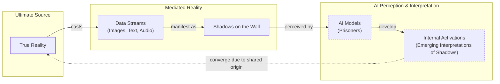
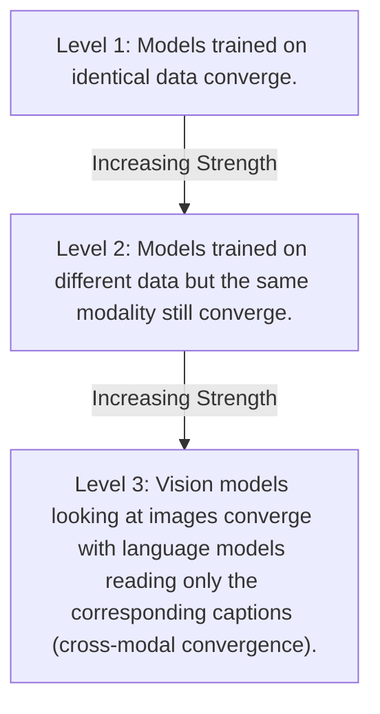

# The Platonic Representation Hypothesis: Are All AI Models Learning the Same Reality?

## Introduction

Read a story about dogs, and you may remember it the next time you see one bounding through a park. This is possible because you have a unified concept of "dog" that is not tied to words or images alone. Bulldog or border collie, barking or getting its belly rubbed, a dog can be many things while still remaining a dog.

AI systems are not always so lucky. They often learn by ingesting data of a single type—text for language models or images for computer vision systems. This raises a fundamental question: to what extent do language and vision models have a shared understanding of a dog? Researchers have been peering inside these models to study how they represent scenes and sentences, and their findings are compelling. Different AI models can develop similar internal representations, even if they are trained on different datasets or entirely different data types [[1]](https://arxiv.org/html/2507.01201v5), [[2]](https://www.quantamagazine.org/distinct-ai-models-seem-to-converge-on-how-they-encode-reality-20260107). Furthermore, these representations grow more similar as the models become more capable [[3]](https://phillipi.github.io/prh).

These observations have given rise to the Platonic Representation Hypothesis, an idea that has inspired a lively debate among researchers [[4]](https://arxiv.org/abs/2405.07987), [[5]](https://www.quantamagazine.org/distinct-ai-models-seem-to-converge-on-how-they-encode-reality-20260107), [[6]](https://arxiv.org/html/2505.11581v1), [[7]](https://www.emergentmind.com/topics/platonic-representation-hypothesis), [[8]](https://aiscientist.substack.com/p/musing-38-the-platonic-representation), [[9]](https://3dvar.com/Huh2024The.pdf), [[10]](https://community.openai.com/t/there-is-only-one-ai-platonic-representation-hypothesis-most-likely-true/1377025). The name comes from Plato’s 2,400-year-old allegory of the cave, in which prisoners trapped inside a cave perceive the world only through shadows cast on a wall [[11]](https://en.wikipedia.org/wiki/Allegory_of_the_cave). For Plato, the objects we encounter are just pale shadows of ideal "forms" that exist in a transcendent realm.

When adapted for AI, this allegory takes on a more concrete meaning [[12]](https://www.alignmentforum.org/posts/kFCu3batN8k8mwtmh/the-cave-allegory-revisited-understanding-gpt-s-worldview), [[13]](https://www.mdpi.com/2079-9292/13/8/1457). The real world outside the cave casts machine-readable shadows as streams of data. AI models are the prisoners, exposed only to these data streams. The hypothesis claims that as these models become more sophisticated, their internal representations begin to converge on a shared "Platonic representation" of the world behind the data [[3]](https://phillipi.github.io/prh), [[14]](https://sergeylevine.substack.com/p/language-models-in-platos-cave).

This quest for universal concepts has deep roots in philosophy, predating even Plato. In the 17th century, Gottfried Wilhelm von Leibniz sought to create an "alphabet of human thought," a system where all ideas could be broken down into elementary concepts, each assigned a unique number. He believed all philosophical questions could then be answered by calculation, a vision that foreshadowed modern symbolic AI [[30]](https://web.eecs.utk.edu/~bmaclenn/papers/HistoryAIBeforeComputers.pdf).

Image 1: A conceptual diagram illustrating Plato's Cave Allegory adapted for AI, showing the flow from 'True Reality' to 'AI Models' perceptions and the hypothesis of convergence of their 'Internal Activations'.

Of course, this idea is not without its critics. Key points of contention involve how to define and compare these representations. You cannot inspect a language model’s representation of every sentence or a vision model’s representation of every image, so how do you decide which ones are representative? It is unlikely that researchers will reach a consensus soon, but that does not bother Phillip Isola, a senior author of the paper that formalized the hypothesis. "Half the community says this is obvious, and the other half says this is obviously wrong," he said. "We were happy with that response" [[2]](https://www.quantamagazine.org/distinct-ai-models-seem-to-converge-on-how-they-encode-reality-20260107).

Having framed the hypothesis and its philosophical roots, we will now explore the geometric mechanism that makes these comparisons possible, by examining how representations are compared through the company their vectors keep.

## The Company Being Kept

If researchers agree on Plato, they might find more common ground with his predecessor Pythagoras, whose philosophy started from the premise "All is number." This is an apt description of modern neural networks. Their internal representations of words or pictures are just long lists of numbers, or high-dimensional vectors, indicating the activation of artificial neurons. These vectors point in specific directions in an abstract space that is impossible to visualize directly, but they make it easy to compare representations: two are similar if their vectors point in similar directions [[2]](https://www.quantamagazine.org/distinct-ai-models-seem-to-converge-on-how-they-encode-reality-20260107). This approach, where similarity is treated as metric distance between points in a coordinate space, is known as a geometric model of similarity [[31]](https://cogsci.ucsd.edu/~coulson/203/tvgati.pdf).

Within a single model, similar inputs have similar representations. The vector for "dog" will be close to vectors for "pet" and "furry," and far from "Platonic" and "molasses." This reflects a principle famously expressed by the linguist John Rupert Firth: "You shall know a word by the company it keeps" [[15]](https://arxiv.org/html/2505.11581v1). The meaning of a concept inside a model is defined by its relationships—proximity, opposition, clustering—to all other concepts.

But what about representations in different models? It does not make sense to directly compare activation vectors from separate networks. Instead, researchers have devised indirect ways to assess similarity. One popular approach is to embrace Firth’s lesson and measure whether two models’ representations of an input keep the same company. This technique is often described as measuring the "similarity of similarities," as AI researcher Ilia Sucholutsky puts it [[16]](https://www.quantamagazine.org/distinct-ai-models-seem-to-converge-on-how-they-encode-reality-20260107). Instead of trying to rotate one model's embedding space into another, we can compare the overall shapes of concept clusters. For example, is "dog" more like "cat" than "wolf," or vice versa? If two models agree on these relationships for many concepts, their internal geometries are aligned.

Researchers began exploring this in the mid-2010s and found that different models’ representations were often similar, though not identical [[2]](https://www.quantamagazine.org/distinct-ai-models-seem-to-converge-on-how-they-encode-reality-20260107). Intriguingly, a few studies found that more powerful models seemed to have more similarities than weaker ones. One 2021 paper dubbed this the "Anna Karenina scenario," a nod to the opening line of the famous novel: perhaps successful AI models are all alike, and every unsuccessful model is unsuccessful in its own way [[17]](https://arxiv.org/html/2507.01201v5).

One factor driving this convergence may be a "simplicity bias." Deep networks inherently adhere to Occam’s razor, favoring the simplest solutions that fit the data. As models get bigger, this bias can become stronger, pushing them toward a smaller, shared solution space rather than letting them develop overly complicated and distinct representations [[4]](https://arxiv.org/abs/2405.07987).

This early work on representational similarity focused mainly on computer vision, which was then the most popular branch of AI research. The rise of powerful language models presented an opportunity to see just how far this similarity could go. With these measurement tools in hand, we can now look at the hierarchy of experimental evidence showing that convergence strengthens as models scale.

## Convergent Evolution

The story of the Platonic representation hypothesis paper began in early 2023, a turbulent time for AI researchers. ChatGPT had been released a few months prior, and it was increasingly clear that simply scaling up AI models made them better at many tasks. But it was unclear why. Were models simply memorizing dataset quirks, or were they building a better world model? One explanation is that larger models are more likely to contain useful subnetworks that can perform a given task, an idea related to the Lottery Ticket Hypothesis [[32]](https://arxiv.org/html/2605.29548v1).

"Everyone in AI research was going through an existential life crisis," said Minyoung Huh, an OpenAI researcher who was a graduate student in Isola’s lab at the time [[18]](https://www.quantamagazine.org/distinct-ai-models-seem-to-converge-on-how-they-encode-reality-20260107). He began meeting with Isola and their colleagues Brian Cheung and Tongzhou Wang to discuss how scaling might affect internal representations [[18]](https://www.quantamagazine.org/distinct-ai-models-seem-to-converge-on-how-they-encode-reality-20260107), [[19]](https://phillipi.github.io/prh).

They outlined a hierarchy of evidence that would support the hypothesis, with each level providing a stronger case for genuine convergence. This convergence isn't limited to silicon; substantial alignment has also been found between the representations in artificial neural networks and those in biological brains, likely because both systems face the same fundamental problem of efficiently understanding the world from sensory data [[4]](https://arxiv.org/abs/2405.07987).

Image 2: Hierarchy of evidence strength for the Platonic representation hypothesis.

A year after their initial conversations, Isola and his colleagues wrote a paper reviewing the evidence and formally presenting their argument [[3]](https://phillipi.github.io/prh). By then, other researchers had already started finding alignment between vision and language model representations [[2]](https://www.quantamagazine.org/distinct-ai-models-seem-to-converge-on-how-they-encode-reality-20260107). Huh conducted his own experiment, testing five vision models and eleven language models of varying sizes on a dataset of captioned pictures from Wikipedia. He fed the pictures into the vision models and the captions into the language models, then compared the vector clusters. He observed a steady increase in representational similarity as models became more powerful, exactly what the hypothesis predicted [[2]](https://www.quantamagazine.org/distinct-ai-models-seem-to-converge-on-how-they-encode-reality-20260107).

After reviewing the evidence for convergence, we must examine a host of experimental choices with respect to the measurements of representational similarity that may affect the validity and generalizability of the result.

## Find the Universals

Of course, it is never so simple. Measurements of representational similarity involve a host of experimental choices that can affect the outcome. Which layers do you look at in each network? Which of the many available metrics do you use to compare them? And which representations do you measure in the first place? To address these issues, researchers are developing new metrics like topological representation alignment, which focus on preserving local neighborhood geometry [[33]](https://arxiv.org/html/2502.18710v3). "If you only test one dataset, you don’t necessarily know how [the result] generalizes," noted Christopher Wolfram, a researcher who has studied the topic [[20]](https://arxiv.org/html/2504.08775v1), [[21]](https://openreview.net/forum?id=8wKec6faAT), [[22]](https://www.preprints.org/manuscript/202601.1018). "Who knows what would happen if you did some weirder dataset?" [[2]](https://www.quantamagazine.org/distinct-ai-models-seem-to-converge-on-how-they-encode-reality-20260107).

This uncertainty has led to two complementary scientific attitudes. One, associated with Isola, actively seeks the universals that models appear to share. "The endeavor of science is to find the universals," Isola said. "We could study the ways in which models are different or disagree, but that somehow has less explanatory power than identifying the commonalities" [[2]](https://www.quantamagazine.org/distinct-ai-models-seem-to-converge-on-how-they-encode-reality-20260107).

Other researchers, like Alexei Efros, argue it is more productive to focus on where models’ representations differ. Efros noted that in the Wikipedia dataset Huh used, the images and text contained very similar information by design. But most data has features that resist translation. "There is a reason why you go to an art museum instead of just reading the catalog," he said [[2]](https://www.quantamagazine.org/distinct-ai-models-seem-to-converge-on-how-they-encode-reality-20260107). This reflects a known challenge in multimodal AI, where models can struggle to fuse complementary information from non-overlapping channels without careful design [[34]](https://www.mdpi.com/2076-3417/15/22/12185).

Even with only partial alignment, there are immediate practical payoffs. Researchers have already used this intrinsic sameness to translate internal representations of sentences from one language model to another [[23]](https://arxiv.org/html/2505.12540). If language and vision model representations are somewhat interchangeable, it could lead to new ways to train models that learn from both data types [[24]](https://ojs.aaai.org/index.php/AAAI/article/view/39248/43209), [[25]](https://www.emergentmind.com/topics/multimodal-alignment), [[26]](https://arxiv.org/html/2411.17040v1), [[27]](https://www.itm-conferences.org/articles/itmconf/pdf/2025/09/itmconf_cseit2025_04036.pdf). Isola and others recently explored this in a paper introducing a method to align independently trained vision and language models post-hoc [[1]](https://arxiv.org/html/2507.01201v5). Still, open questions remain about how to ensure this alignment is robust, scalable, and explainable enough for production agentic systems [[35]](https://www.mdpi.com/1424-8220/26/8/2330).

Despite these promising developments, some researchers think it is unlikely that a single theory will fully capture the behavior of modern AI. "You can’t reduce a trillion-parameter system to simple explanations," said Jeff Clune, an AI researcher at the University of British Columbia. "The answers are going to be complicated" [[2]](https://www.quantamagazine.org/distinct-ai-models-seem-to-converge-on-how-they-encode-reality-20260107), [[28]](https://tpc.dev/wp-content/uploads/2025/02/TPC-Introduction-and-Structure.pdf), [[29]](https://www.forbes.com/sites/amirhusain/2025/11/25/trillion-parameter-models-tiny-software-kernels-and-the-future-of-ai). While the Platonic hypothesis offers a clean philosophical story, real models contain so many interacting parts that full convergence may coexist with vast regions of model-specific idiosyncrasy.

## Conclusion

The Platonic Representation Hypothesis suggests that as AI models grow more capable, their internal "maps" of the world are becoming more and more alike. Despite being trained on different data, with different architectures, and for different tasks, they appear to be converging on a shared statistical model of reality. This is not just a philosophical curiosity; it has profound implications for the future of AI engineering.

Understanding this convergence helps us build more robust and efficient multimodal systems. If a vision model and a language model share a common understanding of "dog," we can design agents that seamlessly translate between seeing a dog and talking about one. This principle is already enabling new forms of representation translation and transfer learning, moving us closer to a world where specialized AI components can be integrated more reliably, all because they have learned to see the same shadows on the cave wall in a similar way.

## References

- [1] Yoon, L. H., Yue, Y., & Kim, B. (2025). Escaping Plato’s Cave: JAM for Aligning Independently Trained Vision and Language Models. arXiv. https://arxiv.org/html/2507.01201v5
- [2] Brubaker, B. (2026, January 7). Distinct AI Models Seem To Converge On How They Encode Reality. Quanta Magazine. https://www.quantamagazine.org/distinct-ai-models-seem-to-converge-on-how-they-encode-reality-20260107
- [3] Huh, M., Cheung, B., Wang, T., & Isola, P. (2024). The Platonic Representation Hypothesis. https://phillipi.github.io/prh
- [4] Huh, M., Cheung, B., Wang, T., & Isola, P. (2024). The Platonic Representation Hypothesis. arXiv. https://arxiv.org/abs/2405.07987
- [5] Fang, W., Zhang, T., & Chan, A. (2025). To Align or Not to Align: Strategic Multimodal Representation Alignment for Optimal Performance. arXiv. https://arxiv.org/html/2511.12121v4
- [6] Firth's principle in neural networks. (2025). arXiv. https://arxiv.org/html/2505.11581v1
- [7] Platonic Representation Hypothesis. (2025). Emergent Mind. https://www.emergentmind.com/topics/platonic-representation-hypothesis
- [8] The Platonic Representation Hypothesis. (2024). AI Scientist. https://aiscientist.substack.com/p/musing-38-the-platonic-representation
- [9] Huh, M., Cheung, B., Wang, T., & Isola, P. (2024). The Platonic Representation Hypothesis. https://3dvar.com/Huh2024The.pdf
- [10] There is only one AI, Platonic Representation Hypothesis most likely true. (2025). OpenAI Community. https://community.openai.com/t/there-is-only-one-ai-platonic-representation-hypothesis-most-likely-true/1377025
- [11] Allegory of the cave. (2024). Wikipedia. https://en.wikipedia.org/wiki/Allegory_of_the_cave
- [12] The Cave Allegory Revisited: Understanding GPT's Worldview. (2023). Alignment Forum. https://www.alignmentforum.org/posts/kFCu3batN8k8mwtmh/the-cave-allegory-revisited-understanding-gpt-s-worldview
- [13] Cultural Biases in GenAI. (2024). MDPI. https://www.mdpi.com/2079-9292/13/8/1457
- [14] Language Models in Plato's Cave. (2023). Sergey Levine's blog. https://sergeylevine.substack.com/p/language-models-in-platos-cave
- [15] Firth's principle in neural networks. (2025). arXiv. https://arxiv.org/html/2505.11581v1
- [16] Sucholutsky, I. (2026). Distinct AI Models Seem To Converge On How They Encode Reality. Quanta Magazine. https://www.quantamagazine.org/distinct-ai-models-seem-to-converge-on-how-they-encode-reality-20260107
- [17] Bansal, Y., Nakkiran, P., & Barak, B. (2021). Revisiting Model Stitching to Compare Neural Representations. arXiv. https://arxiv.org/abs/2106.07682
- [18] Huh, M. (2026). Distinct AI Models Seem To Converge On How They Encode Reality. Quanta Magazine. https://www.quantamagazine.org/distinct-ai-models-seem-to-converge-on-how-they-encode-reality-20260107
- [19] Huh, M., Cheung, B., Wang, T., & Isola, P. (2024). The Platonic Representation Hypothesis. https://phillipi.github.io/prh
- [20] Wolfram, C. (2025). Layers at Similar Depths Generate Similar Activations Across LLM Architectures. arXiv. https://arxiv.org/html/2504.08775v1
- [21] Wolfram, C. (2025). Representational similarity in large language models. OpenReview. https://openreview.net/forum?id=8wKec6faAT
- [22] Wolfram, C. (2026). Representational similarity generalizability. Preprints.org. https://www.preprints.org/manuscript/202601.1018
- [23] Jha, R., Zhang, C., Shmatikov, V., & Morris, J. X. (2025). Harnessing the Universal Geometry of Embeddings. arXiv. https://arxiv.org/html/2505.12540
- [24] Fang, W., Zhang, T., & Chan, A. (2025). To Align or Not to Align: Strategic Multimodal Representation Alignment for Optimal Performance. arXiv. https://arxiv.org/html/2511.12121v4
- [25] Multimodal Alignment. (2025). Emergent Mind. https://www.emergentmind.com/topics/multimodal-alignment
- [26] Multimodal Feature Alignment. (2024). arXiv. https://arxiv.org/html/2411.17040v1
- [27] Multimodal Aspect-Based Sentiment Analysis. (2025). ITM Web of Conferences. https://www.itm-conferences.org/articles/itmconf/pdf/2025/09/itmconf_cseit2025_04036.pdf
- [28] Trillion Parameter Consortium. (2025). TPC Introduction and Structure. https://tpc.dev/wp-content/uploads/2025/02/TPC-Introduction-and-Structure.pdf
- [29] Trillion-Parameter Models, Tiny Software Kernels And The Future Of AI. (2025). Forbes. https://www.forbes.com/sites/amirhusain/2025/11/25/trillion-parameter-models-tiny-software-kernels-and-the-future-of-ai
- [30] MacLennan, B. J. (n.d.). A History of AI Before Computers. University of Tennessee. https://web.eecs.utk.edu/~bmaclenn/papers/HistoryAIBeforeComputers.pdf
- [31] Tversky, A. (1977). Features of Similarity. Psychological Review. https://cogsci.ucsd.edu/~coulson/203/tvgati.pdf
- [32] Edelman, B. B., Goel, S., & Kakade, S. M. (2026). On the Provable Advantage of Scaling Up. arXiv. https://arxiv.org/html/2605.29548v1
- [33] Bar-Yosef, U., & Weinshall, D. (2025). Topological Representation Alignment. arXiv. https://arxiv.org/html/2502.18710v3
- [34] Liu, J., Li, Y., Wang, Y., & Zhang, Y. (2025). A Survey on Deep Learning for Multimodal Fusion. Applied Sciences. https://www.mdpi.com/2076-3417/15/22/12185
- [35] Wang, Y., Chen, J., & Li, X. (2026). A Review of Multimodal Sensor Fusion for Intelligent Systems. Sensors. https://www.mdpi.com/1424-8220/26/8/2330