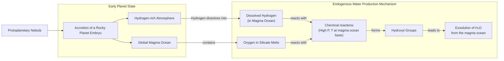

# Where Did Earth's Oceans Come From?

At this moment, a spacecraft is hurtling toward Europa, an ice-veiled moon of Jupiter believed to harbor a vast subsurface ocean. Affixed to the craft is a metal plate engraved with a poem by Ada Limón, which reads in part: “*And it is not darkness that unites us, not the cold distance of space, but the offering of water, each drop of rain, each rivulet, each pulse, each vein.*” For decades, the search for water has driven our exploration of the solar system, guided by the principle that where there is water, there could be life [[1]](https://poets.org/poem/praise-mystery-poem-europa).

It might be surprising, then, that scientists still do not have a definitive answer for how water first arrived here on Earth. For years, the leading theory was that icy comets, relics from the dawn of the solar system, delivered our oceans as they rained down on a primeval Earth. This idea was intuitive; comets are essentially giant, dirty snowballs, rich in the very substance Earth needed. However, as spacecraft got close enough to "sniff" their chemical makeup, the data revealed a persistent mismatch, creating serious challenges for the theory. After that, “comets sort of fell out of favor,” said Ashley King, a meteoriticist at the Natural History Museum in London [[2]](https://www.quantamagazine.org/where-did-earth-get-its-oceans-maybe-it-made-them-itself-20260612).

Attention then shifted to asteroids, rockier bodies whose water composition, analyzed from fallen meteorites, often looked much more like our own. This made them a promising candidate. Yet, the asteroid theory also has its own problems, particularly with matching the full suite of Earth's volatile elements. Now, a radical new idea is gaining traction, one that challenges the entire paradigm of external delivery. This theory suggests Earth may have made its own water.

This historical arc from comets to asteroids, and now to an internal source, shows a scientific field in dynamic flux. The early cometary model, once dominant, was challenged by isotopic data, opening the door for alternatives. In this article, we will explore the evidence for and against these extraterrestrial candidates before turning to the compelling possibility that Earth’s water is not an import, but homegrown.

## A Showdown Between Comets and Asteroids

Our planet formed about 4.54 billion years ago. While much of its earliest eon is lost to history, the basic story is agreed upon. Earth began as a ball of mostly molten rock and then, somehow, became a blue marble. How did this happen?

Comets were the early front-runner for delivering the water. These objects, often described as dirty snowballs, formed in the cold outer reaches of the solar system. They reside in the Kuiper Belt and the even more distant Oort cloud, where water ice is abundant. When their orbits bring them close to the sun, they develop spectacular tails of vaporized ice and gas. Compared to the drier, rockier asteroids, comets give you “a lot of bang for your buck,” said James Bryson, a meteoriticist at the University of Oxford [[3]](https://www.earth.ox.ac.uk/article/earth-sciences-conversation-james-bryson). A single large comet could deliver a significant amount of water in one impact.

The key to testing this hypothesis lies in the chemical signature of water, specifically the ratio of deuterium to hydrogen (D/H). Deuterium is a heavier form of hydrogen, containing a neutron in addition to a proton. Its proportion in water acts like a fingerprint, revealing where in the solar system the water originated. Theoretical models show this ratio should change with distance from the Sun in the early solar system [[4]](https://www.esa.int/Science_Exploration/Space_Science/Rosetta/Rosetta_fuels_debate_on_origin_of_Earth_s_oceans). If comets supplied our oceans, their D/H ratio should match that of Earth's water.

In 1986, the European Space Agency’s Giotto mission made the first deep-space flyby of a comet, intercepting the famed Halley’s Comet. Its measurements delivered a shock. The D/H ratio of water from Halley was twice that of Earth’s oceans. “It didn’t match at all,” said Karen Meech, a planetary astronomer at the University of Hawai‘i [[5]](https://research.hawaii.edu/noelo/water-and-habitability).

<https://www.quantamagazine.org/wp-content/uploads/2026/06/Giotto_launch_preparations-cr.ESA_.webp>
<https://www.quantamagazine.org/wp-content/uploads/2026/06/Giotto_images_of_Comet_Halley-cr.MPAE-courtesy-Dr.-H.U.-Keller.webp>
Image 1: ESA’s Giotto spacecraft (top) took the first close-up images of a cometary nucleus (bottom) as part of its mission to Halley’s comet. (Source: [ESA (left); Courtesy of Dr. H.U. Keller](https://www.quantamagazine.org/where-did-earth-get-its-oceans-maybe-it-made-them-itself-20260612))

This was not an isolated finding. Over the next two decades, spectroscopic observations of other comets, like Hale-Bopp, also showed high levels of deuterium [[2]](https://www.quantamagazine.org/where-did-earth-get-its-oceans-maybe-it-made-them-itself-20260612). The hammer blow to the comet-only theory came in 2014 from ESA’s Rosetta mission. Rosetta orbited and landed on Comet 67P/Churyumov-Gerasimenko, making the most precise measurements of a comet’s composition to date. It found that 67P had a D/H ratio more than three times that of Earth’s oceans, the highest ever measured in a comet [[2]](https://www.quantamagazine.org/where-did-earth-get-its-oceans-maybe-it-made-them-itself-20260612), [[4]](https://www.esa.int/Science_Exploration/Space_Science/Rosetta/Rosetta_fuels_debate_on_origin_of_Earth_s_oceans). This evidence strongly suggested that comets like 67P could not be the primary source of our planet’s water.

<https://www.quantamagazine.org/wp-content/uploads/2024/11/TheComet_crChristianStangl-Lede-2-scaled.webp>
Image 2: Comet 67P/Churyumov-Gerasimenko was photographed in 2014 by ESA’s Rosetta mission, which also sent a lander to the comet’s surface. (Image by Christian Stangl from [ESA](https://www.quantamagazine.org/where-did-earth-get-its-oceans-maybe-it-made-them-itself-20260612))

With comets falling out of favor, asteroids became the new prime suspect. These rocky bodies, mostly found in the belt between Mars and Jupiter, impact Earth far more frequently than comets. Though they contain less water overall, analysis of meteorites—fragments of asteroids that have landed on Earth—revealed a promising connection. A particular group of meteorites, carbonaceous chondrites, was found to contain water with a D/H ratio that closely matched our oceans. The 2021 fall of the Winchcombe meteorite in the UK was a pristine example. Recovered just hours after landing, its water was found to have a D/H ratio almost identical to that of Earth's water [[6]](https://www.science.org/doi/10.1126/sciadv.abq3925).

This link was strengthened by Japan's Hayabusa2 mission, which collected samples directly from the asteroid Ryugu and returned them to Earth in 2020. Analysis of these uncontaminated samples confirmed that Ryugu’s water had a D/H ratio similar to Earth’s [[7]](https://iopscience.iop.org/article/10.3847/2041-8213/acc393). This direct sampling avoided the potential for terrestrial contamination that can affect meteorites, providing strong evidence for an asteroidal water source.

<https://www.quantamagazine.org/wp-content/uploads/2026/06/arrival-bennu-full-rotation-cr.NASAs-Goddard-Space-Flight-Center_University-Of-Arizona-still.jpg>
Image 3: The asteroid Ryugu, visited by the Hayabusa2 spacecraft in 2018, contained water similar to the most common kind found on Earth. (Source: [NASA’s Goddard Space Flight Center/University of Arizona](https://www.quantamagazine.org/where-did-earth-get-its-oceans-maybe-it-made-them-itself-20260612))

However, the asteroid-only model is not perfect. While the D/H ratio is a good match, other volatile elements found in these meteorites do not align with Earth's composition. Noble gases like argon, krypton, and xenon are inert elements that act as tracers of geological processes. The isotopic mixtures of these gases in asteroidal material do not usually correspond to what we find in our planet's atmosphere [[8]](https://link.springer.com/article/10.1007/s11214-022-00929-9). Furthermore, both the comet and asteroid theories rely on a period of intense bombardment late in Earth's formation to deliver the water after the initial magma ocean phase had cooled. The existence and intensity of this "late veneer" are still heavily debated in the scientific community. The ability of either comets or asteroids to deliver our oceans relies on a degree of cosmic luck.

The unresolved tensions in both the cometary and asteroidal models have pushed scientists to consider a more radical possibility. What if Earth did not need water to be delivered at all? The next section explores the growing evidence that our planet may have manufactured its own water from the very materials it was built from.

## Hydrogen, Meet Magma

When astronomers simulate how exoplanets form, they find that many rocky worlds likely began their lives shrouded in thick, hydrogen-rich atmospheres accreted from the primordial gas disk of their star. This has led scientists to wonder if early Earth could have been similar.

The traditional view was that Earth’s building blocks were "dry." This idea was based on the study of enstatite chondrites, a type of meteorite with an isotopic composition remarkably similar to Earth's rocks. This similarity suggests they are representative of the material that formed our planet [[9]](https://www.science.org/doi/10.1126/science.aba1948). These meteorites appeared to lack hydrogen, so it was assumed Earth started out dry, too. However, more recent and detailed analyses have found that there was hydrogen in these meteorites all along. It was hidden within organic molecules, silicate glasses, and sulfur compounds [[9]](https://www.science.org/doi/10.1126/science.aba1948), [[10]](https://www.sciencedirect.com/science/article/pii/S0019103525001356). This discovery opened the possibility that Earth was awash in hydrogen from its very beginning.

If early Earth had a hydrogen-rich atmosphere blanketing a global ocean of magma, the conditions would be set for a planetary-scale chemical reaction. The magma ocean was full of oxygen locked in silicate minerals. In a 2023 paper, scientists proposed that if the atmospheric hydrogen could react with the magma’s oxygen, Earth could generate its own water [[11]](https://www.nature.com/articles/s41586-023-05823-0). The key was pressure. At the immense pressures found at the boundary between the atmosphere and the magma ocean, hydrogen would become a dense fluid, enhancing chemical reactions.

Image 4: A process flow diagram illustrating the endogenous water production model on early rocky planets.

This hypothesis was put to the test in a series of groundbreaking laboratory experiments. Researchers used diamond-anvil cells to compress hydrogen to extreme pressures and then used lasers to melt rock samples, recreating the conditions of a planetary embryo's interior [[12]](https://www.nature.com/articles/s41586-025-09630-7), [[13]](https://doi.org/10.1038/s41586-025-09816-z). The development of these techniques took five years and was fraught with challenges. “We broke a lot of diamonds,” said S.-H. Shim, a geophysicist at Arizona State University [[2]](https://www.quantamagazine.org/where-did-earth-get-its-oceans-maybe-it-made-them-itself-20260612). The results were explosive. The reaction between high-pressure hydrogen and molten rock was so efficient that it produced far more water than scientists had predicted. The experiments yielded water amounts up to 1,000 times higher than models based on low-pressure data suggested [[12]](https://www.nature.com/articles/s41586-025-09630-7). “It doesn’t seem unreasonable [that you could] produce a huge amount of water quite quickly,” said Paul Byrne, a planetary scientist at Washington University in St. Louis [[2]](https://www.quantamagazine.org/where-did-earth-get-its-oceans-maybe-it-made-them-itself-20260612). This was all "homegrown, indigenous water," with no need for delivery from comets or asteroids.

But does this model apply to a planet the size of Earth? The experiments were designed to simulate sub-Neptunes, planets more massive than Earth that can more easily hold on to their light hydrogen atmospheres. “Earth is right on the edge of where that kind of thing can start happening,” said H. W. Horn, a physicist at Lawrence Livermore National Laboratory and one of the study's authors [[2]](https://www.quantamagazine.org/where-did-earth-get-its-oceans-maybe-it-made-them-itself-20260612). Some scientists, like Anders Johansen, an astrophysicist at the University of Copenhagen, are doubtful whether an Earth-mass planet could retain enough atmospheric pressure for the reaction to occur at scale [[2]](https://www.quantamagazine.org/where-did-earth-get-its-oceans-maybe-it-made-them-itself-20260612). Quentin Williams, an experimental geophysicist at the University of California, Santa Cruz, agrees that some water could be generated this way, but asks, "How much might be generated is, however, pretty enigmatic" [[2]](https://www.quantamagazine.org/where-did-earth-get-its-oceans-maybe-it-made-them-itself-20260612).

However, others argue that the reaction is so efficient that it would not need to last long. Earth might have been a water factory for only a brief period, but that moment could have been enough to forge its oceans. If so, the implications are profound. It suggests that countless rocky planets across the galaxy could be "born water-rich," greatly expanding the potential for habitable worlds [[2]](https://www.quantamagazine.org/where-did-earth-get-its-oceans-maybe-it-made-them-itself-20260612). This endogenous mechanism provides a powerful new piece of the puzzle, but it does not necessarily exclude contributions from outside sources. The final section will weigh a mixed-source hypothesis, re-examine recent cometary data, and explore how our understanding of water’s origins continues to evolve.

## Drowning in a Sea of Possibilities

While the case for an asteroidal origin of Earth's water seemed strong, and the endogenous theory provides a compelling alternative, comets are making a comeback. The story is not as simple as it once appeared.

In 2011, ESA’s Herschel Space Observatory studied Comet Hartley 2 and found that its water had a D/H ratio much more like Earth’s. This was a striking exception to the heavy-water comets studied before [[14]](https://sci.esa.int/web/herschel/-/49386-herschel-finds-first-evidence-of-earth-like-water-in-a-comet). For a time, this was seen as an anomaly. But more recently, scientists re-investigated the Rosetta data from Comet 67P. A 2024 paper argued that the original high D/H measurements might have been skewed by dust in the comet's coma. The icy nucleus itself may have had a more Earth-like water composition after all [[15]](https://www.science.org/doi/10.1126/sciadv.adp2191). Adding to this, observations in 2025 of Comet 12P/Pons-Brooks also detected a D/H ratio similar to Earth's oceans [[2]](https://www.quantamagazine.org/where-did-earth-get-its-oceans-maybe-it-made-them-itself-20260612).

<https://www.quantamagazine.org/wp-content/uploads/2026/06/Comet-Hartley-2-cr-NASA-JPL-Caltech-UMD-still-1.jpg>
Image 5: Comet Hartley 2, studied by the Herschel Space Observatory, has an Earth-like ratio of heavy to normal water. (Source: [NASA/JPL-Caltech/UMD](https://www.quantamagazine.org/where-did-earth-get-its-oceans-maybe-it-made-them-itself-20260612))

So, where does this leave us? “I suspect it was a combination of all of them,” said Karen Meech [[2]](https://www.quantamagazine.org/where-did-earth-get-its-oceans-maybe-it-made-them-itself-20260612). The most plausible scenario is a mixed-source model. Earth's oceans are likely a cocktail, with contributions from asteroids, some comets, and water produced endogenously from its own magma ocean.

Finding a perfect extraterrestrial match for our planet's water is difficult because Earth has not stood still for 4.5 billion years. The original isotopic signatures have been altered over time by geological processes like mantle convection, atmospheric escape, and the emergence of life [[16]](https://www.aaas.org/membership/member-spotlight/where-did-earths-water-come-aaas-fellow-karen-meech-investigates). Each of these processes has acted as a filter, tweaking and remixing the planet's water budget. “We may never know,” Meech admitted [[2]](https://www.quantamagazine.org/where-did-earth-get-its-oceans-maybe-it-made-them-itself-20260612).

This deepening complexity is not a failure of science but a sign of its progress. The journey to understand the origin of Earth’s water mirrors the search for the origin of life itself. “It’s like asking, what’s the origin of life?” Meech explained. “The more you learn, the less you know — but the story becomes richer and more exciting” [[2]](https://www.quantamagazine.org/where-did-earth-get-its-oceans-maybe-it-made-them-itself-20260612). Each new mission and laboratory experiment adds another layer to the story, replacing simple certainties with a more nuanced and rich reality.

## Conclusion

The question of where Earth’s water came from has taken us on a journey across the solar system and deep into our planet’s fiery past. We have seen the leading theories evolve, from icy comets to rocky asteroids, and finally to the possibility that Earth itself was a water factory. Each new piece of evidence, whether from a distant comet or a high-pressure lab experiment, has added complexity to the story.

What is clear is that there is likely no single answer. The water in our oceans is probably a blend of sources, a cosmic cocktail mixed over billions of years. This realization connects to the broader search for life in the universe. If planets can make their own water, then habitable worlds might be more common than we once thought. The story of Earth's water is a reminder that in science, the richest answers are often not the simplest ones.

## References

- [1] [https://poets.org/poem/praise-mystery-poem-europa](https://poets.org/poem/praise-mystery-poem-europa)
- [2] [https://www.quantamagazine.org/where-did-earth-get-its-oceans-maybe-it-made-them-itself-20260612](https://www.quantamagazine.org/where-did-earth-get-its-oceans-maybe-it-made-them-itself-20260612)
- [3] [https://www.earth.ox.ac.uk/article/earth-sciences-conversation-james-bryson](https://www.earth.ox.ac.uk/article/earth-sciences-conversation-james-bryson)
- [4] [https://www.esa.int/Science_Exploration/Space_Science/Rosetta/Rosetta_fuels_debate_on_origin_of_Earth_s_oceans](https://www.esa.int/Science_Exploration/Space_Science/Rosetta/Rosetta_fuels_debate_on_origin_of_Earth_s_oceans)
- [5] [https://research.hawaii.edu/noelo/water-and-habitability](https://research.hawaii.edu/noelo/water-and-habitability)
- [6] [https://www.science.org/doi/10.1126/sciadv.abq3925](https://www.science.org/doi/10.1126/sciadv.abq3925)
- [7] [https://iopscience.iop.org/article/10.3847/2041-8213/acc393](https://iopscience.iop.org/article/10.3847/2041-8213/acc393)
- [8] [https://link.springer.com/article/10.1007/s11214-022-00929-9](https://link.springer.com/article/10.1007/s11214-022-00929-9)
- [9] [https://www.science.org/doi/10.1126/science.aba1948](https://www.science.org/doi/10.1126/science.aba1948)
- [10] [https://www.sciencedirect.com/science/article/pii/S0019103525001356](https://www.sciencedirect.com/science/article/pii/S0019103525001356)
- [11] [https://www.nature.com/articles/s41586-023-05823-0](https://www.nature.com/articles/s41586-023-05823-0)
- [12] [https://www.nature.com/articles/s41586-025-09630-7](https://www.nature.com/articles/s41586-025-09630-7)
- [13] [https://doi.org/10.1038/s41586-025-09816-z](https://doi.org/10.1038/s41586-025-09816-z)
- [14] [https://sci.esa.int/web/herschel/-/49386-herschel-finds-first-evidence-of-earth-like-water-in-a-comet](https://sci.esa.int/web/herschel/-/49386-herschel-finds-first-evidence-of-earth-like-water-in-a-comet)
- [15] [https://www.science.org/doi/10.1126/sciadv.adp2191](https://www.science.org/doi/10.1126/sciadv.adp2191)
- [16] [https://www.aaas.org/membership/member-spotlight/where-did-earths-water-come-aaas-fellow-karen-meech-investigates](https://www.aaas.org/membership/member-spotlight/where-did-earths-water-come-aaas-fellow-karen-meech-investigates)
</article>