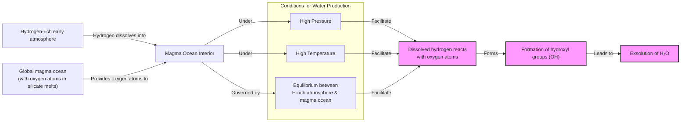

<article>
    # Where Did Earth's Water Come From? A New Theory Is Gaining Steam

At this moment, a spacecraft is headed from Earth to Europa, an ice-veiled moon of Jupiter thought to contain a vast subsurface ocean. Affixed to the craft is a metal plate engraved with a poem by Ada Limón, commissioned by NASA for the Europa Clipper mission. It reads, in part: “*And it is not darkness that unites us, not the cold distance of space, but the offering of water, each drop of rain, each rivulet, each pulse, each vein*” [[1]](https://poets.org/poem/praise-mystery-poem-europa). For decades, the search for water has dominated the exploration of the solar system, because as far as we know, water is essential for life.

It may come as a surprise to you, then, that scientists do not really know how water first arrived here on Earth. Despite years of spacecraft flybys, sample-return missions, and detailed laboratory work, the precise origin of our planet’s oceans remains an open question. For years, the top theory was that water came to our planet via comets. These are icy relics from the dawn of the solar system, and their high water content made them an obvious candidate. But in recent years, this idea has faced serious challenges from new data that you might find surprising.

After several spacecraft examined comets up close, they found that cometary water did not quite match our own based on its chemical signature. After that, “comets sort of fell out of favor,” said Ashley King, a meteoriticist at the Natural History Museum in London [[2]](https://www.quantamagazine.org/where-did-earth-get-its-oceans-maybe-it-made-them-itself-20260612). Asteroids, which are rockier and more metal-rich, then became the most popular choice. They impact Earth more frequently, and their water reserves look a lot more like those on our planet. However, the asteroid theory has its own problems, and a radical new idea is gaining steam: Earth may have made its own water.

The historical model of cometary delivery once dominated scientific thinking, but it was challenged by isotopic data. This opened the door not only to asteroidal alternatives but also to the possibility that Earth generated its water internally. In this article, we will explore the showdown between these two extraterrestrial candidates. Then, we will dive into the emerging theory of our planet’s homegrown oceans, presenting the concrete mission and meteorite evidence you need to evaluate each hypothesis.

## A Showdown Between Comets and Asteroids

Earth formed about 4.54 billion years ago. While much of its earliest eon has been lost to history, the basics are agreed upon: it began as a ball of mostly molten rock and then became a blue marble. The question is, how? Comets provided a well-motivated answer. They formed far from the sun in the Kuiper Belt and the more distant Oort cloud, where water ice could survive. When a comet passes close to the sun, its ice vaporizes, creating a brilliant tail. Because of their high water content, comets give you “a lot of bang for your buck” in terms of water delivery, said James Bryson, a meteoriticist at the University of Oxford [[3]](https://www.earth.ox.ac.uk/article/earth-sciences-conversation-james-bryson).

Scientists thought comets could have crashed into the early Earth and supplied its water, but they needed proof that cometary water matched our own. The key is the ratio of deuterium to hydrogen (D/H). Almost all water on Earth is H₂O, but a small fraction is "heavy water," containing deuterium, a heavier form of hydrogen. If comets are responsible for our oceans, their D/H ratio should be similar to Earth's. In 1986, the European Space Agency's (ESA) Giotto mission, its first deep-space endeavor, flew by Halley's comet to check [[2]](https://www.quantamagazine.org/where-did-earth-get-its-oceans-maybe-it-made-them-itself-20260612). The result was a surprise. “It didn’t seem logical that today’s oceans should match the D/H chemistry of the primordial water present at Earth’s formation,” said Karen Meech, a planetary astronomer at the University of Hawai‘i [[4]](https://research.hawaii.edu/noelo/water-and-habitability). Giotto’s measurements confirmed this suspicion; Halley's D/H ratio was twice that of Earth's oceans [[2]](https://www.quantamagazine.org/where-did-earth-get-its-oceans-maybe-it-made-them-itself-20260612), [[4]](https://research.hawaii.edu/noelo/water-and-habitability).

<https://www.quantamagazine.org/wp-content/uploads/2026/06/Giotto_launch_preparations-cr.ESA_.webp> 
<small><em>Image 1: ESA’s Giotto spacecraft during launch preparations. (Source [ESA](https://www.quantamagazine.org/where-did-earth-get-its-oceans-maybe-it-made-them-itself-20260612))</em></small>

<https://www.quantamagazine.org/wp-content/uploads/2026/06/Giotto_images_of_Comet_Halley-cr.MPAE-courtesy-Dr.-H.U.-Keller.webp> 

More cracks appeared in the comet theory during the 1990s and 2000s, as observations of other comets like Hale-Bopp also found high levels of heavy water [[2]](https://www.quantamagazine.org/where-did-earth-get-its-oceans-maybe-it-made-them-itself-20260612). The final blow arrived in 2014 when ESA's Rosetta mission made history by orbiting and sending a lander to comet 67P/Churyumov-Gerasimenko. Rosetta’s precise measurements revealed that 67P had the highest concentration of deuterium of any comet measured, more than three times that of Earth's oceans. “This surprising finding could indicate a diverse origin for the Jupiter-family comets,” said Kathrin Altwegg, principal investigator for the ROSINA instrument on Rosetta. “Our finding also rules out the idea that Jupiter-family comets contain solely Earth ocean-like water, and adds weight to models that place more emphasis on asteroids as the main delivery mechanism for Earth’s oceans” [[29]](https://www.esa.int/Science_Exploration/Space_Science/Rosetta/Rosetta_fuels_debate_on_origin_of_Earth_s_oceans).

<https://www.quantamagazine.org/wp-content/uploads/2024/11/TheComet_crChristianStangl-Lede-2-scaled.webp> 
<small><em>Image 2: Comet 67P/Churyumov-Gerasimenko, photographed in 2014 by ESA’s Rosetta mission. (Source [ESA/Christian Stangl](https://www.quantamagazine.org/where-did-earth-get-its-oceans-maybe-it-made-them-itself-20260612))</em></small>

With comets sidelined, attention turned to asteroids. These rocky bodies, mostly found between Mars and Jupiter, frequently impact our planet as meteorites. Scientists have collected thousands of them and found that a particular group, carbonaceous chondrites, contains water molecules that closely resemble our own. The meteorite that fell in Winchcombe, UK, in 2021 is a perfect example. It was recovered just hours after landing, preserving its pristine composition. Analysis showed its D/H ratio almost perfectly matched that of Earth’s oceans, providing strong evidence for an asteroidal source [[2]](https://www.quantamagazine.org/where-did-earth-get-its-oceans-maybe-it-made-them-itself-20260612), [[30]](https://www.science.org/doi/10.1126/sciadv.abq3925).

To avoid any potential terrestrial contamination, scientists have also sent spacecraft to collect samples directly from asteroids. In 2018, Japan's Hayabusa2 mission visited the asteroid Ryugu and returned samples to Earth. A 2023 analysis revealed that water from Ryugu had a D/H ratio similar to that of most water on our planet, strengthening the case for asteroids [[2]](https://www.quantamagazine.org/where-did-earth-get-its-oceans-maybe-it-made-them-itself-20260612), [[5]](https://iopscience.iop.org/article/10.3847/2041-8213/acc393). "The community is probably more favorable of asteroids than comets these days," King said [[2]](https://www.quantamagazine.org/where-did-earth-get-its-oceans-maybe-it-made-them-itself-20260612).

<https://www.quantamagazine.org/wp-content/uploads/2026/06/arrival-bennu-full-rotation-cr.NASAs-Goddard-Space-Flight-Center_University-Of-Arizona-still.jpg> 
<small><em>Image 3: The asteroid Ryugu, visited by the Hayabusa2 spacecraft in 2018, contained water similar to that found on Earth. (Source [NASA’s Goddard Space Flight Center/University of Arizona](https://www.quantamagazine.org/where-did-earth-get-its-oceans-maybe-it-made-them-itself-20260612))</em></small>

However, the D/H ratios did not close the book on the question. Asteroids also contain small amounts of noble gases like argon, krypton, and xenon, and scientists have found that these mixtures do not usually match what we find in Earth's atmosphere [[2]](https://www.quantamagazine.org/where-did-earth-get-its-oceans-maybe-it-made-them-itself-20260612), [[6]](https://link.springer.com/article/10.1007/s11214-022-00929-9). Furthermore, both comet and asteroid theories rely on a "late veneer"—a period of intense bombardment after Earth’s initial formation—whose nature and magnitude are still heavily debated. According to leading models, this assault was triggered when the giant planets shifted their orbits about 4 billion years ago, scattering debris throughout the inner solar system [[7]](https://www.space.com/36661-late-heavy-bombardment.html). Yet key details remain uncertain, including whether this was a sudden spike of impacts or a more gradual process, and how long it lasted [[8]](https://science.nasa.gov/moon/lunar-craters/what-is-the-late-heavy-bombardment). Some simulations even suggest that asteroids from the main belt could not have been responsible for most of the impacts, pointing instead to leftover "failed planets" from Earth's own formation [[9]](https://astrobites.org/2017/02/10/dont-blame-asteroids-for-the-late-heavy-bombardment). This reliance on a poorly understood cosmic event has led some scientists to consider another possibility: Earth made most of its water by itself.

The tensions in both isotopic and dynamical constraints from these exogenous delivery models remain unresolved. This leads us to examine whether Earth could have manufactured its own water by reanalyzing the very building blocks previously assumed to be dry, replacing the need for late delivery with an early, planet-internal source.

## Hydrogen, Meet Magma

When astronomers simulate the ways exoplanets, with their diverse atmospheres, took shape, they find that many could have started out with abundant hydrogen. This leads to a key question: could Earth have been similar in its formative years [[2]](https://www.quantamagazine.org/where-did-earth-get-its-oceans-maybe-it-made-them-itself-20260612)?

Scientists used to think the early Earth had little hydrogen. This conclusion was based on a group of meteorites called enstatite chondrites, which have a chemical makeup suspiciously similar to our planet. Because these meteorites seemed to lack hydrogen, it was assumed the same was true for the building blocks of Earth. However, recent studies found that there was hydrogen in these meteorites all along, hidden within organic molecules, silicate glasses, and sulfur compounds [[2]](https://www.quantamagazine.org/where-did-earth-get-its-oceans-maybe-it-made-them-itself-20260612), [[10]](https://www.science.org/doi/10.1126/science.aba1948), [[31]](https://www.sciencedirect.com/science/article/pii/S0019103525001356). This discovery suggests that Earth’s building blocks may have contained sufficient hydrogen to deliver at least three times the mass of water in its oceans [[10]](https://www.science.org/doi/10.1126/science.aba1948). Perhaps, then, the early Earth was also awash in hydrogen.

This sets the stage for a homegrown water factory. The early Earth was covered in a global ocean of magma, full of oxygen locked in silicate melts. In a 2023 paper, scientists proposed that if the hydrogen in a planet’s early atmosphere and the oxygen in its magma were to mix, water could be produced [[11]](https://www.nature.com/articles/s41586-023-05823-0), [[12]](https://arxiv.org/abs/2304.07845). This model suggests that Earth's water, core density, and oxidation state can all be explained by the equilibrium between a hydrogen-rich atmosphere and an underlying magma ocean [[11]](https://www.nature.com/articles/s41586-023-05823-0), [[13]](https://astrobiology.com/2023/04/how-did-earth-get-its-water.html), [[14]](https://www.researchgate.net/publication/370070865_Earth_shaped_by_primordial_H_2_atmospheres).

Image 4: A process flow diagram illustrating the endogenous water-production model, showing the interaction between a hydrogen-rich atmosphere and a magma ocean under specific pressure and temperature conditions leading to water formation.

Two years later, this idea was supported by a set of ambitious laboratory experiments. Researchers wanted to understand how sub-Neptunes, common exoplanets larger than Earth, can have water-rich atmospheres even when orbiting close to their stars. They suspected that a reaction between a hydrogen atmosphere and a magma ocean could be the answer, but only if the magma was under immense pressure from the hydrogen. "That higher pressure is a big part of what facilitates the water production," said H. W. Horn, a physicist at Lawrence Livermore National Laboratory. "It actually enhances the chemical reactions" [[2]](https://www.quantamagazine.org/where-did-earth-get-its-oceans-maybe-it-made-them-itself-20260612).

To test this, the team re-created the extreme conditions of an adolescent sub-Neptune using diamond-anvil cells and lasers. It took five years to develop the techniques to safely conduct these experiments, which involved putting flammable hydrogen under intense pressure and combining it with laser-melted rock samples. "We broke a lot of diamonds," said S.-H. Shim, a geophysicist at Arizona State University [[2]](https://www.quantamagazine.org/where-did-earth-get-its-oceans-maybe-it-made-them-itself-20260612). The result was dramatic: the reaction was so efficient that it produced far more water than had been predicted—up to a few tens of weight percent, which is much greater than previously thought [[16]](https://www.nature.com/articles/s41586-025-09630-7), [[17]](https://arxiv.org/pdf/2511.01351), [[15]](https://faculty.epss.ucla.edu/~eyoung/reprints/Miozzi_etal_2025.pdf). “It doesn’t seem unreasonable [that you could] produce a huge amount of water quite quickly,” said Paul Byrne, a planetary scientist at Washington University in St. Louis. And “this is all homegrown, indigenous water”—no comets or asteroids required [[2]](https://www.quantamagazine.org/where-did-earth-get-its-oceans-maybe-it-made-them-itself-20260612).

Does this mean Earth created its own oceans? This is where the waters get a little murky. "The paper doesn’t make strong claims about Earth," Horn said, but both he and Shim think it is a valid link to make [[2]](https://www.quantamagazine.org/where-did-earth-get-its-oceans-maybe-it-made-them-itself-20260612). Other scientists agree that some water could have formed this way, but perhaps not enough to fill our oceans. Quentin Williams, an experimental geophysicist at the University of California, Santa Cruz, stated, “I’d say it’s certainly possible that some water could be generated by reaction with hydrogen early on. How much might be generated is, however, pretty enigmatic” [[2]](https://www.quantamagazine.org/where-did-earth-get-its-oceans-maybe-it-made-them-itself-20260612).

The issue is whether Earth’s early atmosphere had enough hydrogen to create the necessary pressure. Sub-Neptunes are far more massive than Earth, and their gravity is better at holding on to hydrogen. “Earth is right on the edge of where that kind of thing can start happening,” Horn said [[2]](https://www.quantamagazine.org/where-did-earth-get-its-oceans-maybe-it-made-them-itself-20260612). However, Byrne noted that the experiments suggest the reaction would not need to last long to create an enormous quantity of water. Earth might have been a water factory for only a moment, but that moment may have been enough to forge oceans. If that is the case, the implications stretch far beyond our solar system. Perhaps countless rocky planets can be "born water-rich," expanding the number of potentially habitable worlds by providing a local water reservoir during formation [[18]](https://www.mpg.de/20541783/water-discovered-in-rocky-planet-forming-zone-offers-clues-on-habitability), [[19]](https://news.mit.edu/2025/planets-without-water-could-still-produce-certain-liquids-0811), [[20]](https://pmc.ncbi.nlm.nih.gov/articles/PMC12783251), [[21]](https://www.nasa.gov/missions/kepler/about-half-of-sun-like-stars-could-host-rocky-potentially-habitable-planets), [[22]](https://eos.org/editors-vox/terrestrial-planets-guide-our-search-for-habitable-exoplanets).

While the endogenous mechanism offers a powerful new perspective, it does not necessarily exclude all external contributions. The final section of our journey will weigh a mixed-source synthesis, re-examine recent cometary data, and show how increasing knowledge often replaces simple certainty with a richer, more nuanced story.

## Drowning in a Sea of Possibilities

While the homegrown water theory is compelling, that is not the end of the story. Comets are making a comeback. By the time Rosetta reached comet 67P in 2014, scientists had studied the water of 11 other comets. All had D/H ratios unlike Earth’s—except one. In 2011, ESA’s Herschel Space Observatory found that the water in the Jupiter-family comet Hartley 2 had an Earth-like signature, with a D/H ratio of 1.558 × 10⁻⁴ [[23]](https://sci.esa.int/web/herschel/-/49386-herschel-finds-first-evidence-of-earth-like-water-in-a-comet), [[24]](https://sci.esa.int/web/herschel/-/49378-the-deuterium-to-hydrogen-ratio-in-the-solar-system), [[25]](https://www.aanda.org/articles/aa/abs/2012/08/aa19744-12/aa19744-12.html), [[26]](https://www.jpl.nasa.gov/images/pia14737-heavy-and-light-just-right), [[27]](https://herscheltelescope.org.uk/results/comet-hartley-2-and-the-oceans-of-earth).

<https://www.quantamagazine.org/wp-content/uploads/2026/06/Comet-Hartley-2-cr-NASA-JPL-Caltech-UMD-still-1.jpg> 
<small><em>Image 5: Comet Hartley 2, studied by the Herschel Space Observatory, has an Earth-like ratio of heavy to normal water. (Source [NASA/JPL-Caltech/UMD](https://www.quantamagazine.org/where-did-earth-get-its-oceans-maybe-it-made-them-itself-20260612))</em></small>

This observation seemed anomalous at the time. But in a 2024 paper, scientists re-investigated Rosetta’s analysis of comet 67P and found that dust in the comet's coma may have skewed the data by increasing the local D/H ratio. The reanalysis showed that the isotope ratio measured farther from the nucleus, where the gas is well-mixed, is close to terrestrial values, suggesting the icy nucleus itself may have been more Earth-like after all [[32]](https://www.science.org/doi/10.1126/sciadv.adp2191). Then, in 2025, observations of comet 12P/Pons-Brooks also detected an Earth-like D/H ratio. So, was it comets all along? Or asteroids? Or did Earth turn on the taps independently? “I suspect it was a combination of all of them,” Meech said [[2]](https://www.quantamagazine.org/where-did-earth-get-its-oceans-maybe-it-made-them-itself-20260612).

Perhaps it is hard to find a perfect extraterrestrial match for our planet’s water because it is such a diverse cocktail. This initial mix has also been tweaked and filtered over time by Earth’s own geologic, atmospheric, and biologic processes. Karen Meech explains that these geological processes can erase original isotopic signatures over time, making it difficult to trace the water back to a single source [[28]](https://www.aaas.org/membership/member-spotlight/where-did-earths-water-come-aaas-fellow-karen-meech-investigates). This evolving understanding draws a parallel to research on the origin of life. Just as deeper knowledge of prebiotic chemistry has replaced a single "warm little pond" scenario with a richer network of possible pathways—including hydrothermal vents, evaporative pools, and mineral surfaces, each with different energy sources and catalytic properties—our growing understanding of water origins yields a more nuanced, multi-mechanism story [[33]](https://pmc.ncbi.nlm.nih.gov/articles/PMC7765580), [[34]](https://www.nature.com/nature-index/topics/l4/prebiotic-chemistry-and-origins-of-life). “We may never know,” Meech said. But that does not mean scientists will stop trying. “It’s like asking, what’s the origin of life?” Meech added. “The more you learn, the less you know. But the story becomes richer and more exciting” [[2]](https://www.quantamagazine.org/where-did-earth-get-its-oceans-maybe-it-made-them-itself-20260612).

## References

- [1] In Praise of Mystery: A Poem for Europa (https://poets.org/poem/praise-mystery-poem-europa)
- [2] Where Did Earth Get Its Oceans? Maybe It Made Them Itself. (https://www.quantamagazine.org/where-did-earth-get-its-oceans-maybe-it-made-them-itself-20260612)
- [3] Earth Sciences in Conversation: James Bryson (https://www.earth.ox.ac.uk/article/earth-sciences-conversation-james-bryson)
- [4] Water and Habitability (https://research.hawaii.edu/noelo/water-and-habitability)
- [5] Hydrogen Isotopic Composition of Hydrous Minerals in Asteroid Ryugu (https://iopscience.iop.org/article/10.3847/2041-8213/acc393)
- [6] Noble Gases and Stable Isotopes Track the Origin and Early Evolution of the Venus Atmosphere (https://link.springer.com/article/10.1007/s11214-022-00929-9)
- [7] The Late Heavy Bombardment: A Violent Assault on Young Earth (https://www.space.com/36661-late-heavy-bombardment.html)
- [8] What Is the Late Heavy Bombardment? (https://science.nasa.gov/moon/lunar-craters/what-is-the-late-heavy-bombardment)
- [9] Don’t blame asteroids for the Late Heavy Bombardment (https://astrobites.org/2017/02/10/dont-blame-asteroids-for-the-late-heavy-bombardment)
- [10] Earth’s water may have been inherited from material similar to enstatite chondrite meteorites (https://www.science.org/doi/10.1126/science.aba1948)
- [11] Earth shaped by primordial H2 atmospheres (https://www.nature.com/articles/s41586-023-05823-0)
- [12] Earth shaped by primordial H2 atmospheres (https://arxiv.org/abs/2304.07845)
- [13] How Did Earth Get Its Water? (https://astrobiology.com/2023/04/how-did-earth-get-its-water.html)
- [14] Earth shaped by primordial H 2 atmospheres (https://www.researchgate.net/publication/370070865_Earth_shaped_by_primordial_H_2_atmospheres)
- [15] Building wet planets through high-pressure magma–hydrogen reactions (https://faculty.epss.ucla.edu/~eyoung/reprints/Miozzi_etal_2025.pdf)
- [16] Building wet planets through high-pressure magma–hydrogen reactions (https://www.nature.com/articles/s41586-025-09630-7)
- [17] Building wet planets through high-pressure magma-hydrogen reactions (https://arxiv.org/pdf/2511.01351)
- [18] Water discovered in rocky-planet-forming zone offers clues on habitability (https://www.mpg.de/20541783/water-discovered-in-rocky-planet-forming-zone-offers-clues-on-habitability)
- [19] Planets without water could still produce certain liquids (https://news.mit.edu/2025/planets-without-water-could-still-produce-certain-liquids-0811)
- [20] The Role of Endogenous Water Production in Expanding Rocky-Planet Habitability (https://pmc.ncbi.nlm.nih.gov/articles/PMC12783251)
- [21] About Half of Sun-like Stars Could Host Rocky, Potentially Habitable Planets (https://www.nasa.gov/missions/kepler/about-half-of-sun-like-stars-could-host-rocky-potentially-habitable-planets)
- [22] Terrestrial Planets Guide Our Search for Habitable Exoplanets (https://eos.org/editors-vox/terrestrial-planets-guide-our-search-for-habitable-exoplanets)
- [23] Herschel finds first evidence of Earth-like water in a comet (https://sci.esa.int/web/herschel/-/49386-herschel-finds-first-evidence-of-earth-like-water-in-a-comet)
- [24] The deuterium-to-hydrogen ratio in the Solar System (https://sci.esa.int/web/herschel/-/49378-the-deuterium-to-hydrogen-ratio-in-the-solar-system)
- [25] Water in the Jupiter-family comet 103P/Hartley 2 from Herschel/HIFI observations (https://www.aanda.org/articles/aa/abs/2012/08/aa19744-12/aa19744-12.html)
- [26] Heavy and Light, Just Right (https://www.jpl.nasa.gov/images/pia14737-heavy-and-light-just-right)
- [27] Comet Hartley 2 and the oceans of Earth (https://herscheltelescope.org.uk/results/comet-hartley-2-and-the-oceans-of-earth)
- [28] Where did Earth’s water come from? AAAS Fellow Karen Meech investigates (https://www.aaas.org/membership/member-spotlight/where-did-earths-water-come-aaas-fellow-karen-meech-investigates)
- [29] Rosetta fuels debate on origin of Earth’s oceans (https://www.esa.int/Science_Exploration/Space_Science/Rosetta/Rosetta_fuels_debate_on_origin_of_Earth_s_oceans)
- [30] The Winchcombe meteorite, a unique and pristine witness from the outer solar system (https://www.science.org/doi/10.1126/sciadv.abq3925)
- [31] The source of hydrogen in earth's building blocks (https://www.sciencedirect.com/science/article/pii/S0019103525001356)
- [32] A nearly terrestrial D/H for comet 67P/Churyumov-Gerasimenko (https://www.science.org/doi/10.1126/sciadv.adp2191)
- [33] Prebiotic chemistry and origins of life (https://pmc.ncbi.nlm.nih.gov/articles/PMC7765580)
- [34] Prebiotic chemistry and origins of life (https://www.nature.com/nature-index/topics/l4/prebiotic-chemistry-and-origins-of-life)
- [35] Ada Limón Reads "In Praise of Mystery: A Poem for Europa" (https://www.youtube.com/watch?v=EgWbeDNPD6o)
- [36] In Praise of Mystery: A Poem for Europa (https://www.slowdownshow.org/story/2023/08/25/full-version-in-praise-of-mystery-a-poem-for-europa)
- [37] A Poem for Europa (https://www.loc.gov/programs/poetry-and-literature/poet-laureate/poet-laureate-projects/a-poem-for-europa)
- [38] In Praise of Mystery (https://www.bookpage.com/reviews/in-praise-of-mystery-ada-limon-book-review)
</article>