# Earth's Water: An Inside Job?

At this moment, a spacecraft is hurtling toward Europa, an ice-veiled moon of Jupiter believed to hide a vast subsurface ocean. Affixed to the craft is a metal plate engraved with a poem by Ada Limón, which reads in part: "*And it is not darkness that unites us, not the cold distance of space, but the offering of water...*" [[32]](https://poets.org/poem/praise-mystery-poem-europa). For decades, the search for water has driven our exploration of the solar system, because as far as we know, it is the one non-negotiable ingredient for life.

It might be surprising, then, to learn that scientists still do not know for sure how water first arrived here on Earth. For years, the leading theory was that comets—icy relics from the dawn of the solar system—delivered our oceans as they rained down on a primeval Earth. But as spacecraft got close enough to "taste" the water from these comets, the data told a different story. The chemical signature did not match.

This mismatch led to a major shift in thinking. After comets fell out of favor, asteroids—rockier bodies with a more Earth-like water signature—became the most popular candidates [[1]](https://www.quantamagazine.org/where-did-earth-get-its-oceans-maybe-it-made-them-itself-20260612). As Ashley King, a meteoriticist at the Natural History Museum in London, put it, "the community is probably more favorable of asteroids than comets these days" [[1]](https://www.quantamagazine.org/where-did-earth-get-its-oceans-maybe-it-made-them-itself-20260612). Yet, the asteroid theory has its own problems, leaving nagging inconsistencies in other chemical tracers. Now, a radical new idea is gaining traction: what if Earth did not need a delivery service at all? What if our planet made its own water?

The long-held view of a dry early Earth receiving water from external sources is being challenged by evidence that our planet may have had the ingredients all along. This article will explore the showdown between comets and asteroids, examining the isotopic data from key space missions that first dethroned comets. We will then dive into the emerging theory of endogenous water production, a process where a hydrogen-rich atmosphere reacted with a molten Earth to forge oceans from the inside out.

## A Showdown Between Comets and Asteroids

Earth formed about 4.54 billion years ago. While much of its earliest eon is lost to history, the basic story is agreed upon: it began as a ball of mostly molten rock before becoming the blue marble we know today. The central question is, how did it get its water?

Comets were the early frontrunner. Formed in the frigid outer reaches of the solar system, in the Kuiper Belt and the more distant Oort cloud, they are essentially dirty snowballs, rich in frozen water. Compared to the drier, rock-dominated asteroids, comets give you "a lot of bang for your buck," said James Bryson, a meteoriticist at the University of Oxford [[26]](https://www.earth.ox.ac.uk/article/earth-sciences-conversation-james-bryson). A few well-placed cometary impacts could theoretically deliver an ocean's worth of water.

The key to testing this hypothesis lies in the "flavor" of the water, specifically the ratio of deuterium to hydrogen (D/H). Deuterium is a heavier form of hydrogen, and its proportion in water acts as a chemical fingerprint, revealing where in the solar system the water formed. In 1986, the European Space Agency's Giotto mission made the first-ever close-up analysis of a comet's heart, flying through the cloud of gas and dust around Halley's comet. Its measurements were a shock: the D/H ratio was twice that of Earth's oceans. “It didn’t seem logical that today’s oceans should match the D/H chemistry of the primordial water present at Earth’s formation,” said Karen Meech, a planetary astronomer at the University of Hawai‘i, highlighting the discrepancy [[22]](https://research.hawaii.edu/noelo/water-and-habitability).

<https://www.quantamagazine.org/wp-content/uploads/2026/06/Giotto_launch_preparations-cr.ESA_.webp>
Image 1: ESA’s Giotto spacecraft during launch preparations for its mission to Halley's comet. (Source: ESA)

<https://www.quantamagazine.org/wp-content/uploads/2026/06/Giotto_images_of_Comet_Halley-cr.MPAE-courtesy-Dr.-H.U.-Keller.webp>
Image 2: A sequence of images of Comet Halley's nucleus taken by the Giotto spacecraft in 1986. (Source: MPAE/Dr. H.U. Keller)

Over the next two decades, more comets like Hale-Bopp showed similarly heavy water. The final blow to the simple comet theory came in 2014 from ESA's Rosetta mission. After orbiting and landing on Comet 67P/Churyumov-Gerasimenko, it made the most precise measurements of a comet's composition to date. The results were definitive: 67P's water had a D/H ratio more than three times that of Earth's, the highest ever measured in a comet at the time. This finding effectively ruled out comets from this region as the primary source of our planet's oceans [[1]](https://www.quantamagazine.org/where-did-earth-get-its-oceans-maybe-it-made-them-itself-20260612), [[2]](https://www.esa.int/Science_Exploration/Space_Science/Rosetta/Rosetta_fuels_debate_on_origin_of_Earth_s_oceans).

<https://www.quantamagazine.org/wp-content/uploads/2024/11/TheComet_crChristianStangl-Lede-2-scaled.webp>
Image 3: Comet 67P/Churyumov-Gerasimenko, photographed in 2014 by ESA’s Rosetta mission. (Source: ESA/Christian Stangl)

With comets on the back foot, attention turned to asteroids. These rocky objects, mostly found between Mars and Jupiter, impact our planet far more frequently. While today's asteroids are relatively dry, that may not have always been the case; during the Late Heavy Bombardment 3.8 billion years ago, they could have held much more water [[39]](https://www.space.com/36661-late-heavy-bombardment.html). Analysis of meteorites—fragments of asteroids that survive the fall to Earth—revealed a promising connection. A particular group, the carbonaceous chondrites, contains water with a D/H ratio that closely resembles our own. The 2021 fall of the Winchcombe meteorite, a pristine carbonaceous chondrite recovered just hours after landing, provided a spectacular confirmation. Its water content had a D/H ratio that was a near-perfect match for Earth's oceans [[3]](https://www.science.org/doi/10.1126/sciadv.abq3925).

To rule out terrestrial contamination, sample-return missions were sent to collect material directly from asteroids in space. Japan's Hayabusa2 mission visited the asteroid Ryugu in 2018 and returned samples to Earth. Analysis confirmed that Ryugu's water also had a D/H ratio similar to Earth's, reinforcing the link between these bodies and our planet's water [[4]](https://iopscience.iop.org/article/10.3847/2041-8213/acc393).

<https://www.quantamagazine.org/wp-content/uploads/2026/06/arrival-bennu-full-rotation-cr.NASAs-Goddard-Space-Flight-Center_University-Of-Arizona-still.jpg>
Image 4: The asteroid Ryugu, visited by the Hayabusa2 spacecraft in 2018, contained water with a D/H ratio similar to that on Earth. (Source: NASA’s Goddard Space Flight Center/University of Arizona)

However, the asteroid-only model is not a closed case. Asteroids also contain inert noble gases like argon, krypton, and xenon, and the isotopic mix of these elements in meteorites does not usually match what we find in Earth's atmosphere [[5]](https://link.springer.com/article/10.1007/s11214-022-00929-9). Furthermore, the entire scenario relies on a "late veneer"—a bombardment of asteroids late in Earth's formation—whose intensity and total delivered mass are still heavily debated. The leading theory for this event, the Nice model, suggests it was triggered by a late migration of the giant planets that scattered objects from the outer solar system, but the timing and magnitude of this bombardment remain poorly constrained [[40]](https://en.wikipedia.org/wiki/Late_Heavy_Bombardment), [[41]](https://www.nationalacademies.org/read/26522/chapter/9). These unresolved issues have pushed scientists to consider a more radical possibility: Earth did not need water delivered from space because it was capable of making its own.

This shift forces us to re-examine the very building blocks of our planet. The next section explores the evidence that Earth's raw materials were not as dry as once thought and details the high-pressure alchemy that could have turned a molten world into a water-rich one.

## Hydrogen, Meet Magma

As astronomers have discovered thousands of exoplanets, a surprising picture has emerged: many rocky worlds likely began their lives cloaked in thick, hydrogen-rich atmospheres. This challenges the conventional theory of planet formation, which holds that water-rich planets must form outside the "snow line" where temperatures are cold enough for ice to condense, and then migrate inward. The endogenous water model suggests that planets can become water-rich even when forming close to their star, framing hydrogen-rich and water-rich planets not as geographically distinct but as different evolutionary stages [[9]](https://www.nature.com/articles/s41586-025-09630-7), [[42]](https://www.aps.anl.gov/APS-Science-Highlight/2026-03-17/wet-planets-might-evolve-from-dry-hydrogen-rich-planets). This has led scientists to wonder if Earth’s early years were similar.

The traditional view held that Earth's building blocks were dry. This was based on the study of enstatite chondrites, a type of meteorite with an isotopic makeup strikingly similar to Earth's, suggesting they are representative of the material that formed our planet [[6]](https://www.science.org/doi/10.1126/science.aba1948). These meteorites appeared to lack hydrogen, leading to the conclusion that the early Earth was also hydrogen-poor. However, recent, more detailed analyses have overturned this assumption. Scientists discovered that hydrogen was there all along, hidden within organic molecules and silicate glasses [[6]](https://www.science.org/doi/10.1126/science.aba1948), [[7]](https://www.sciencedirect.com/science/article/pii/S0019103525001356). This finding opened the door to the possibility that the nascent Earth was not dry but was, in fact, awash in hydrogen.

This sets the stage for a powerful chemical reaction. The early Earth was a molten ball of rock, a global magma ocean rich in oxygen. In a 2023 study published in *Nature*, researchers from Carnegie Science and UCLA developed a model showing that interactions between a magma ocean and a molecular hydrogen atmosphere could have given rise to Earth's water and overall oxidized state [[8]](https://www.nature.com/articles/s41586-023-05823-0), [[43]](https://astrobiology.com/2023/04/how-did-earth-get-its-water.html). They concluded that this interaction could produce water, but the efficiency of the process remained uncertain.

```mermaid
flowchart LR
  %% Initial State
  subgraph "Initial Conditions"
    PN["Protoplanetary Nebula<br/>(Hydrogen-rich gas source)"]
  end

  %% Planet Formation and Layers
  subgraph "Rocky Planet Embryo Formation"
    RPE["Rocky Planet Embryo<br/>(e.g., >0.2 Earth masses)"]
    HPA["Hydrogen-rich Primary Atmosphere<br/>(Thick H2-dominated envelope)"]
    GMO["Global Magma Ocean<br/>(Molten interior, Silicate melt, FeO)"]
  end

  %% Interaction and Reactions
  subgraph "Endogenous Water Production Processes"
    IZ["Interaction Zone<br/>(High Pressure & Temperature)"]
    FeO_R["FeO Reduction Reaction<br/>(H2 + FeO -> Fe + H2O)"]
    Sil_R["Silicate Reduction/Hydride Formation<br/>(H2 + Silicates -> SiH4 + MgO + H2O)"]
    H2O_P["H2O Production<br/>(Water)"]
  end

  %% Outcome
  subgraph "Outcome"
    H2O_S["H2O Storage / Exsolution<br/>(Within Magma Ocean or Atmosphere)"]
    EWP["Endogenous Water Production<br/>(Water-rich Planet)"]
  end

  %% Flow connections
  PN -- "forms" --> RPE
  RPE -- "surrounds" --> HPA
  RPE -- "contains" --> GMO

  HPA -- "H2 dissolves into" --> GMO
  GMO -- "boundary with HPA" --> IZ
  IZ -- "drives" --> FeO_R
  IZ -- "drives" --> Sil_R

  FeO_R -- "produces" --> H2O_P
  Sil_R -- "produces" --> H2O_P

  H2O_P -- "leads to" --> H2O_S
  H2O_S -- "contributes to" --> EWP

  %% Visual differentiation
  classDef key_outcome fill:#ccf,stroke:#333,stroke-width:2px
  class EWP key_outcome
```

Image 5: An architecture diagram illustrating the endogenous water production model on early rocky planets.

The answer came from a series of ambitious laboratory experiments. Researchers recreated the extreme conditions at the boundary of a hydrogen atmosphere and a magma ocean using diamond-anvil cells to generate immense pressures (above 2 gigapascals) and lasers to melt rock samples at high temperatures (up to 1,700 K) [[44]](https://pmc.ncbi.nlm.nih.gov/articles/PMC12571897). The goal was to see if high-pressure hydrogen could react with silicate melts to produce water. The results were explosive. The reaction was so efficient that it produced far more water than scientists had predicted—in some cases, 2,000 to 3,000 times more than theoretical models suggested [[9]](https://www.nature.com/articles/s41586-025-09630-7), [[10]](https://doi.org/10.1038/s41586-025-09816-z). "It doesn’t seem unreasonable [that you could] produce a huge amount of water quite quickly," said Paul Byrne, a planetary scientist at Washington University in St. Louis. "And this is all homegrown, indigenous water" [[1]](https://www.quantamagazine.org/where-did-earth-get-its-oceans-maybe-it-made-them-itself-20260612).

But does this mean Earth created its own oceans? The experiments were designed to model sub-Neptunes, exoplanets more massive than Earth that are better at holding onto their light, hydrogen-rich atmospheres. "Earth is right on the edge of where that kind of thing can start happening," noted H. W. Horn, a physicist at Lawrence Livermore National Laboratory and one of the experiment's researchers [[1]](https://www.quantamagazine.org/where-did-earth-get-its-oceans-maybe-it-made-them-itself-20260612). Some scientists are doubtful that an Earth-mass planet could have retained enough hydrogen for this process to produce its vast oceans [[1]](https://www.quantamagazine.org/where-did-earth-get-its-oceans-maybe-it-made-them-itself-20260612).

However, the experiments also suggest the reaction is so fast that it might not need to last long. Earth could have been a water factory for only a brief period, but that moment may have been enough to forge its oceans [[1]](https://www.quantamagazine.org/where-did-earth-get-its-oceans-maybe-it-made-them-itself-20260612). If so, the implications are profound. It would mean that a key condition for life is not the result of a lucky cosmic delivery but a natural consequence of planet formation. Countless rocky planets across the galaxy could be, as Byrne said, "born water-rich" [[1]](https://www.quantamagazine.org/where-did-earth-get-its-oceans-maybe-it-made-them-itself-20260612), [[16]](https://www.mpg.de/20541783/water-discovered-in-rocky-planet-forming-zone-offers-clues-on-habitability). This is a testable hypothesis. Future observations with instruments like the James Webb Space Telescope, which can measure the composition of exoplanet atmospheres, will provide crucial data to confirm or challenge this new model of planetary evolution [[45]](https://sustainability.stanford.edu/news/plethora-planets-water-rich-atmospheres).

While this endogenous mechanism offers a powerful new explanation, it does not necessarily exclude contributions from external sources. The final picture of where our water came from is likely a composite, blending both homegrown and delivered ingredients, a topic we will explore in the concluding section.

## Drowning in a Sea of Possibilities

Just as the case against comets seemed closed, new evidence has prompted a re-evaluation. In 2011, ESA’s Herschel Space Observatory found that the comet Hartley 2 had a D/H ratio much more like Earth’s water, a surprising anomaly at the time [[11]](https://www.jpl.nasa.gov/news/space-observatory-provides-clues-to-creation-of-earths-oceans/), [[12]](https://sci.esa.int/web/herschel/-/49386-herschel-finds-first-evidence-of-earth-like-water-in-a-comet).

<https://www.quantamagazine.org/wp-content/uploads/2026/06/Comet-Hartley-2-cr-NASA-JPL-Caltech-UMD-still-1.jpg>
Image 6: Comet Hartley 2, studied by the Herschel Space Observatory, has an Earth-like ratio of heavy to normal water. (Source: NASA/JPL-Caltech/UMD)

More recently, a 2024 reanalysis of the data from Rosetta's visit to comet 67P suggested that the original high D/H measurements might have been skewed by dust in the comet's coma; the ice on the nucleus itself could be more Earth-like [[13]](https://www.science.org/doi/10.1126/sciadv.adp2191). This was followed by observations of comet 12P/Pons-Brooks in 2025, which also detected a D/H ratio similar to our oceans [[1]](https://www.quantamagazine.org/where-did-earth-get-its-oceans-maybe-it-made-them-itself-20260612). It now seems that not all comets are isotopically heavy, reopening the possibility that they contributed at least some of Earth's water.

The most plausible scenario is a mixed-source model. Earth's oceans are likely a cocktail, with ingredients supplied by asteroids, a smaller fraction from certain types of comets, and a significant contribution from the planet's own internal water factory.

Untangling these contributions is complicated by the fact that Earth is not a static museum. Over 4.5 billion years, geological processes like mantle convection, atmospheric escape, and the emergence of life have continuously processed and altered the planet's water, erasing some of the original isotopic fingerprints [[27]](https://www.aaas.org/membership/member-spotlight/where-did-earths-water-come-aaas-fellow-karen-meech-investigates). Our sister planet, Venus, is a stark reminder of this. It likely started with Earth-like water but lost it to a runaway greenhouse effect, a history now written in its atmosphere's extremely high D/H ratio [[46]](https://ntrs.nasa.gov/api/citations/20140017487/downloads/20140017487.pdf), [[47]](https://solarsystem.wustl.edu/wp-content/uploads/reprints/2004/No.%20109%20Fegley%202004%20atmospheric%20evolution%20on%20Venus%20ms..pdf). "We may never know," Meech said, but that uncertainty is what drives the science forward [[1]](https://www.quantamagazine.org/where-did-earth-get-its-oceans-maybe-it-made-them-itself-20260612).

This journey mirrors the search for the origin of life itself. The more we learn, the more we realize there is no single, simple answer. Instead of a "warm little pond," we now consider a network of possible pathways, some of which may be directly linked to water's origin. For example, the same water-rock interactions that occur in subsurface oceans on icy moons like Europa and Enceladus are known to be key sources of organic molecules, the building blocks of life [[48]](https://www.nationalacademies.org/read/26522/chapter/15). Similarly, the story of Earth's water is not a straightforward tale of cometary delivery but a rich, complex narrative with multiple authors. "The more you learn, the less you know," Meech concluded, "but the story becomes richer and more exciting" [[1]](https://www.quantamagazine.org/where-did-earth-get-its-oceans-maybe-it-made-them-itself-20260612).

## References

- [1] https://www.quantamagazine.org/where-did-earth-get-its-oceans-maybe-it-made-them-itself-20260612
- [2] https://www.esa.int/Science_Exploration/Space_Science/Rosetta/Rosetta_fuels_debate_on_origin_of_Earth_s_oceans
- [3] https://www.science.org/doi/10.1126/sciadv.abq3925
- [4] https://iopscience.iop.org/article/10.3847/2041-8213/acc393
- [5] https://link.springer.com/article/10.1007/s11214-022-00929-9
- [6] https://www.science.org/doi/10.1126/science.aba1948
- [7] https://www.sciencedirect.com/science/article/pii/S0019103525001356
- [8] https://www.nature.com/articles/s41586-023-05823-0
- [9] https://www.nature.com/articles/s41586-025-09630-7
- [10] https://doi.org/10.1038/s41586-025-09816-z
- [11] https://www.jpl.nasa.gov/news/space-observatory-provides-clues-to-creation-of-earths-oceans/
- [12] https://sci.esa.int/web/herschel/-/49386-herschel-finds-first-evidence-of-earth-like-water-in-a-comet
- [13] https://www.science.org/doi/10.1126/sciadv.adp2191
- [14] https://www.nature.com/articles/s41586-025-09630-7
- [15] https://doi.org/10.1038/s41586-025-09816-z
- [16] https://www.mpg.de/20541783/water-discovered-in-rocky-planet-forming-zone-offers-clues-on-habitability
- [17] https://news.mit.edu/2025/planets-without-water-could-still-produce-certain-liquids-0811
- [18] https://pmc.ncbi.nlm.nih.gov/articles/PMC12783251
- [19] https://www.nasa.gov/missions/kepler/about-half-of-sun-like-stars-could-host-rocky-potentially-habitable-planets
- [20] https://eos.org/editors-vox/terrestrial-planets-guide-our-search-for-habitable-exoplanets
- [21] https://www.aanda.org/articles/aa/abs/2012/08/aa19744-12/aa19744-12.html
- [22] https://research.hawaii.edu/noelo/water-and-habitability
- [23] https://sci.esa.int/web/herschel/-/49378-the-deuterium-to-hydrogen-ratio-in-the-solar-system
- [24] https://www.jpl.nasa.gov/images/pia14737-heavy-and-light-just-right
- [25] https://herscheltelescope.org.uk/results/comet-hartley-2-and-the-oceans-of-earth
- [26] https://www.earth.ox.ac.uk/article/earth-sciences-conversation-james-bryson
- [27] https://www.aaas.org/membership/member-spotlight/where-did-earths-water-come-aaas-fellow-karen-meech-investigates
- [28] https://arxiv.org/abs/2304.07845
- [29] https://astrobiology.com/2023/04/how-did-earth-get-its-water.html
- [30] https://www.researchgate.net/publication/370070865_Earth_shaped_by_primordial_H_2_atmospheres
- [31] https://arxiv.org/pdf/2511.01351
- [32] https://poets.org/poem/praise-mystery-poem-europa
- [33] https://www.youtube.com/watch?v=EgWbeDNPD63o
- [34] https://www.slowdownshow.org/story/2023/08/25/full-version-in-praise-of-mystery-a-poem-for-europa
- [35] https://www.loc.gov/programs/poetry-and-literature/poet-laureate/poet-laureate-projects/a-poem-for-europa
- [36] https://www.bookpage.com/reviews/in-praise-of-mystery-ada-limon-book-review
- [37] https://faculty.epss.ucla.edu/~eyoung/reprints/Miozzi_etal_2025.pdf
- [38] https://www.nature.com/articles/s41586-025-09630-7
- [39] https://www.space.com/36661-late-heavy-bombardment.html
- [40] https://en.wikipedia.org/wiki/Late_Heavy_Bombardment
- [41] https://www.nationalacademies.org/read/26522/chapter/9
- [42] https://www.aps.anl.gov/APS-Science-Highlight/2026-03-17/wet-planets-might-evolve-from-dry-hydrogen-rich-planets
- [43] https://astrobiology.com/2023/04/how-did-earth-get-its-water.html
- [44] https://pmc.ncbi.nlm.nih.gov/articles/PMC12571897
- [45] https://sustainability.stanford.edu/news/plethora-planets-water-rich-atmospheres
- [46] https://ntrs.nasa.gov/api/citations/20140017487/downloads/20140017487.pdf
- [47] https://solarsystem.wustl.edu/wp-content/uploads/reprints/2004/No.%20109%20Fegley%202004%20atmospheric%20evolution%20on%20Venus%20ms..pdf
- [48] https://www.nationalacademies.org/read/26522/chapter/15