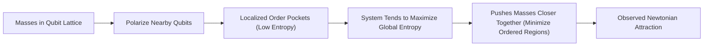
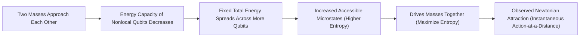
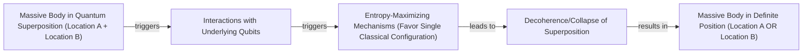

# Is Gravity Just a Statistical Illusion?

Isaac Newton was never happy with his own law of universal gravitation. In a 1692 letter, he wrote that the idea of one body acting on another at a distance through a vacuum, without any mediation, was "so great an Absurdity that I believe no Man who has in philosophical Matters a competent Faculty of thinking can ever fall into it" [[1]](https://philosophy.stackexchange.com/questions/122488/what-are-the-historical-philosophical-arguments-for-and-against-action-at-a-dist). His mathematical description was perfect, but it lacked a physical mechanism. This discomfort fueled centuries of attempts to explain gravity as a "push" rather than a pull, with theories involving unseen particles or cosmic fluids that physically pressed objects together [[25]](https://www.quantamagazine.org/is-gravity-just-entropy-rising-long-shot-idea-gets-another-look-20250613).

Albert Einstein provided a deeper explanation, reframing gravity as the curvature of spacetime. In this view, objects simply follow the straightest possible path through a geometry warped by mass and energy, eliminating the need for action-at-a-distance. Yet, even Einstein’s general relativity is incomplete. It breaks down at the center of black holes, predicting infinite curvature at singularities, a clear sign that it cannot be the final word on the matter [[25]](https://www.quantamagazine.org/is-gravity-just-entropy-rising-long-shot-idea-gets-another-look-20250613).

This brings us to a modern resurgence of the old mechanical idea, though in a new, statistical form. A recent effort led by theoretical physicist Daniel Carney proposes that gravity might be an emergent phenomenon, a collective effect arising from the swarm-like behavior of microscopic components. "There’s some kind of gas or some thermal system out there that we can’t see directly," Carney explains. "But it’s randomly interacting with masses in some way, such that on average you see all the normal gravity things that you know about" [[25]](https://www.quantamagazine.org/is-gravity-just-entropy-rising-long-shot-idea-gets-another-look-20250613).

This project, known as entropic gravity, is part of a broader search to understand spacetime itself as emerging from a deeper, microscopic reality. Carney’s approach pegs this deeper physics to the laws of heat and disorder, suggesting gravity is simply a consequence of the universe’s tendency to maximize entropy [[25]](https://www.quantamagazine.org/is-gravity-just-entropy-rising-long-shot-idea-gets-another-look-20250613). While entropic gravity remains a minority view, it persists because even its detractors are hesitant to dismiss it entirely. Furthermore, unlike many theories of quantum gravity, it offers the rare promise of being experimentally testable.

These ideas force us to reconsider the nature of one of the universe's most fundamental forces. We will explore the thermodynamic parallels in general relativity that allow gravity to be derived from heat, examine new models that reproduce Newtonian attraction from statistical mechanics, and discuss the prospects for testing whether gravity is an immutable law or merely a statistical tendency.

## A Force Emerges

What makes Einstein’s theory of gravity so remarkable is that it betrays its own incompleteness. General relativity predicts that stars can collapse to form black holes, and at their centers, gravity becomes infinitely strong. The fabric of spacetime tears, and the theory can no longer describe what happens next. This breakdown at singularities strongly suggests that a more fundamental, microscopic description of reality is needed to complete the picture [[25]](https://www.quantamagazine.org/is-gravity-just-entropy-rising-long-shot-idea-gets-another-look-20250613).

Curiously, general relativity has uncanny parallels to thermodynamics, even though not a single concept from heat physics went into its development. The theory predicts that the surface area of a black hole’s event horizon can only ever increase, a rule strikingly similar to the second law of thermodynamics, which states that entropy, or disorder, never decreases. When physicists applied quantum mechanics to the curved spacetime around a black hole, they discovered that black holes radiate energy as if they were hot objects. This Hawking radiation implies that black holes have a temperature, and if they have a temperature, they must be composed of microscopic degrees of freedom whose statistical behavior gives rise to these thermal properties [[25]](https://www.quantamagazine.org/is-gravity-just-entropy-rising-long-shot-idea-gets-another-look-20250613).

Physicists have pursued multiple avenues to understand how spacetime might emerge from these microscopic components. The leading approach is the holographic principle, which suggests that the three-dimensional reality we experience is like a hologram, an image of reality encoded on a distant, two-dimensional surface [[6]](https://en.wikipedia.org/wiki/Holographic_principle). In this view, patterns in the microscopic components on this boundary give rise to a curved, gravitational spacetime in the bulk [[25]](https://www.quantamagazine.org/is-gravity-just-entropy-rising-long-shot-idea-gets-another-look-20250613).

Entropic gravity takes a related but distinct path. In 1995, theoretical physicist Ted Jacobson flipped the logic of black hole thermodynamics on its head. Instead of starting with Einstein's theory and deriving its heat-like properties, he started from the assumption that spacetime has thermal properties and used the fundamental thermodynamic relation δQ = TdS to derive the equations of general relativity [[25]](https://www.quantamagazine.org/is-gravity-just-entropy-rising-long-shot-idea-gets-another-look-20250613), [[29]](https://arxiv.org/abs/gr-qc/9504004). Jacobson's work confirmed that the parallels between gravity and heat are deeply significant. As Carney puts it, "He turned black hole thermodynamics on its head. I’ve been mystified by this result for my entire adult life" [[25]](https://www.quantamagazine.org/is-gravity-just-entropy-rising-long-shot-idea-gets-another-look-20250613).

This reframing of gravity as an equation of state, born from the statistical mechanics of hidden degrees of freedom, opens the door to concrete models. Having established that gravity can be derived from thermodynamics, we can now examine specific implementations that reproduce Newtonian attraction through entropy-maximizing mechanisms.

## Apparent Attraction

Inspired by Jacobson's approach, Daniel Carney and his co-authors recently put forward two models demonstrating how gravitational attraction could arise from microscopic components [[25]](https://www.quantamagazine.org/is-gravity-just-entropy-rising-long-shot-idea-gets-another-look-20250613), [[28]](https://arxiv.org/abs/2502.17575). These models provide a proof of principle that what we perceive as a fundamental force might be a statistical effect.

The first model imagines space as a crystalline grid of quantum particles, or qubits. When a massive object is placed in this lattice, it influences the orientation of the qubits around it. "If you put a mass somewhere in the lattice, it causes all of the qubits nearby to get polarized—they all try to go in the same direction," Carney said [[25]](https://www.quantamagazine.org/is-gravity-just-entropy-rising-long-shot-idea-gets-another-look-20250613). This alignment creates a localized "pocket of order" in an otherwise random grid. Since high order corresponds to low entropy, this state is entropically unfavorable. If you place two masses in the lattice, you create two such pockets. The system’s natural tendency is to maximize its total entropy, and the most efficient way to do this is to minimize the size of the ordered regions. This results in an effective force that pushes the masses closer together, squashing the pockets of order into a smaller volume [[25]](https://www.quantamagazine.org/is-gravity-just-entropy-rising-long-shot-idea-gets-another-look-20250613).

Image 1: A flowchart illustrating the first qubit-lattice model from Carney et al. 2025, showing the progression from masses in a qubit lattice to observed Newtonian attraction.

Remarkably, this statistical pressure naturally reproduces Newton's inverse-square law. The polarizing effect of a mass weakens with distance, causing the entropic force to fall off as 1/r², just as gravity does. The apparent attraction is not a fundamental pull but an emergent consequence of the system striving for maximum disorder.

The second model does away with the grid, capturing the instantaneous, action-at-a-distance character of Newtonian gravity. In this version, massive objects are still acted upon by qubits, but these qubits are not fixed in space and could be far away [[25]](https://www.quantamagazine.org/is-gravity-just-entropy-rising-long-shot-idea-gets-another-look-20250613). The mechanism here relies on energy capacity. The amount of energy each qubit can store depends on the distance between the masses. When the masses are far apart, each qubit has a high energy capacity, so the system's total energy can be stored in just a few qubits. As the masses move closer, the energy capacity of each qubit drops. This forces the total energy to be spread across more qubits, which increases the number of accessible microstates and therefore raises the system's entropy. The drive to maximize entropy pushes the masses together [[25]](https://www.quantamagazine.org/is-gravity-just-entropy-rising-long-shot-idea-gets-another-look-20250613).

Image 2: A flowchart illustrating the second nonlocal-qubit model from Carney et al. 2025.

In both constructions, gravitational attraction is an epiphenomenon. It is the macroscopic manifestation of countless microscopic interactions as the underlying system of qubits seeks a state of higher entropy. While these models provide explicit mechanisms for emergent gravity, they also come with significant limitations that require critical examination.

## Strengths and Weaknesses

Carney himself is cautious, noting that both models are ad-hoc. The qubits are hypothetical, and their coupling strengths to mass must be fine-tuned to produce the right results. "It actually seems to require a peculiar engineered-looking interaction to get this to work," he admits [[25]](https://www.quantamagazine.org/is-gravity-just-entropy-rising-long-shot-idea-gets-another-look-20250613). For Carney, these are proofs of principle rather than realistic models of the universe. "The ontology of all of this is nebulous," he said [[25]](https://www.quantamagazine.org/is-gravity-just-entropy-rising-long-shot-idea-gets-another-look-20250613).

A major limitation is that the models only reproduce the Newtonian weak-field limit of gravity. They do not recover the full curved-spacetime structure of general relativity. Mark Van Raamsdonk, a physicist at the University of British Columbia, is skeptical, pointing out that the models lack qualities that make gravity special, such as the equivalence principle—the fact that you feel no gravitational force when in free fall. "Their construction doesn’t really have anything to do with gravity," he stated [[25]](https://www.quantamagazine.org/is-gravity-just-entropy-rising-long-shot-idea-gets-another-look-20250613). If gravity is a statistical force from qubit interactions, it is not clear why all objects should be affected identically, regardless of their composition.

Furthermore, the models focus on the one aspect of gravity physicists think they already understand well. The real puzzles lie where gravity gets strong, as in black holes, but the entropic models currently have little to say about this regime. "The real challenge in gravitational physics is understanding its strong-coupling, strong-field regime," said Ramy Brustein, a theorist at Ben-Gurion University [[25]](https://www.quantamagazine.org/is-gravity-just-entropy-rising-long-shot-idea-gets-another-look-20250613).

Proponents of entropic gravity offer a counter-view. If gravity is indeed a statistical effect, the weak-field regime may be precisely where its nature is revealed. The observed gravitational force would be a statistical average, and tiny fluctuations around that average might become observable. Erik Verlinde of the University of Amsterdam, who argued for entropic gravity in a 2010 paper, suggests, "You have to go to very weak fields, because then these fluctuations might become observable" [[25]](https://www.quantamagazine.org/is-gravity-just-entropy-rising-long-shot-idea-gets-another-look-20250613), [[30]](https://arxiv.org/abs/1001.0785). Such stochastic noise would distinguish it from the smooth, deterministic geometry of standard gravity.

These weaknesses notwithstanding, the entropic gravity picture makes distinctive predictions about quantum systems. This opens up new avenues for experimental tests, particularly when connected to ideas about how the quantum world gives way to the classical one.

## Testing Entropic Gravity

Carney thinks the main benefit of these new models is that they "prompt conceptual questions about gravity and open up new experimental directions" [[25]](https://www.quantamagazine.org/is-gravity-just-entropy-rising-long-shot-idea-gets-another-look-20250613). One such question arises when considering a massive body in a quantum superposition of two different locations. Would its gravitational field also be in a superposition, pulling objects in two directions at once?

Entropic gravity models predict a different outcome. The interactions with the underlying qubit bath would act to "collapse" the superposition into a single, definite position. This is because the entropy-maximizing mechanisms of the system favor a single classical configuration that minimizes the ordered, low-entropy regions. The system essentially "measures" the object's position via its gravitational interaction, forcing it out of its quantum state [[25]](https://www.quantamagazine.org/is-gravity-just-entropy-rising-long-shot-idea-gets-another-look-20250613).

Image 3: A flowchart illustrating the prediction of entropic gravity models regarding the collapse of a massive body in quantum superposition.

This prediction connects entropic gravity to objective-collapse theories, which propose that wave function collapse is a real physical process, possibly triggered by gravity itself [[15]](https://postquantum.com/quantum-computing/wave-function-collapse), [[16]](https://pmc.ncbi.nlm.nih.gov/articles/PMC11305101). The Diósi-Penrose model, for instance, suggests that a superposition of a mass in two different places creates a superposition of two different spacetimes, an instability that nature quickly resolves by collapsing the wave function [[18]](https://en.wikipedia.org/wiki/Objective-collapse_theory). Both entropic gravity and objective-collapse models predict that an isolated quantum system will eventually collapse on its own, with larger masses collapsing faster. This offers a testable consequence. As physicist Angelo Bassi notes, "The same experimental setups could, in principle, be used to test both" [[25]](https://www.quantamagazine.org/is-gravity-just-entropy-rising-long-shot-idea-gets-another-look-20250613).

Tabletop experiments using matter-wave interferometry are already pushing massive objects into larger superpositions, placing ever-tighter constraints on such collapse models [[17]](https://www.youtube.com/watch?v=yPvRQ5nyKZY). These same experiments could be used to search for the anomalous noise or decoherence predicted by entropic gravity.

For all his doubts, Van Raamsdonk agrees that the approach is worth pursuing. "Since it hasn’t been established that actual gravity in our universe arises holographically, it’s certainly valuable to explore other mechanisms by which gravity might arise," he said [[25]](https://www.quantamagazine.org/is-gravity-just-entropy-rising-long-shot-idea-gets-another-look-20250613). If this long-shot theory proves correct, it would force a profound shift in our understanding. Gravity would no longer be an immutable law of nature, but merely a statistical tendency—the universe’s inexorable drift toward disorder.

## References

- [1] [What are the historical-philosophical arguments for and against action-at-a-distance?](https://philosophy.stackexchange.com/questions/122488/what-are-the-historical-philosophical-arguments-for-and-against-action-at-a-dist)
- [2] [Is Gravity Just Entropy Rising? Long-Shot Idea Gets Another Look.](https://www.quantamagazine.org/is-gravity-just-entropy-rising-long-shot-idea-gets-another-look-20250613)
- [3] [Holographic principle](https://en.wikipedia.org/wiki/Holographic_principle)
- [4] [Carney et al. 2025 Entropic Gravity Models](https://arxiv.org/abs/2502.17575)
- [5] [Thermodynamics of Spacetime: The Einstein Equation of State](https://arxiv.org/abs/gr-qc/9504004)
- [6] [On the Origin of Gravity and the Laws of Newton](https://arxiv.org/abs/1001.0785)
- [7] [Wave Function Collapse](https://postquantum.com/quantum-computing/wave-function-collapse)
- [8] [Gravitationally-induced wave function collapse time for molecules](https://pmc.ncbi.nlm.nih.gov/articles/PMC11305101)
- [9] [Objective-collapse theory](https://en.wikipedia.org/wiki/Objective-collapse_theory)
- [10] [Penrose's Objective Reduction](https://www.youtube.com/watch?v=yPvRQ5nyKZY)
- [11] [What are the historical-philosophical arguments for and against-action-at-a-distance](https://philosophy.stackexchange.com/questions/122488/what-are-the-historical-philosophical-arguments-for-and-against-action-at-a-dist)
- [12] [Newton Rejected Action at a Distance](https://philarchive.org/archive/SFEINO)
- [13] [Einstein Equations from Thermodynamics of Spacetime](https://krishnamohan-parattu.weebly.com/uploads/6/4/3/1/64317995/einstein-eq-and-thermodyn.pdf)
- [14] [Derivation of Einstein Equations from Thermodynamics](https://diposit.ub.edu/bitstreams/3a349666-d2a4-4667-a191-efffc065905c/download)
- [15] [Thermodynamics and the Einstein Equation](https://inspirehep.net/literature/394001)
- [16] [Emergent vs Quantum Gravity](https://physics.stackexchange.com/questions/553104/how-does-the-philosophy-of-emergent-gravity-differ-from-that-of-quantum-gravi)
- [17] [Quantum Gravity and the Holographic Principle](https://plus.maths.org/quantum-gravity-can-holographic-principle)
- [18] [What is "entropic gravity"?](https://curtjaimungal.substack.com/p/what-is-entropic-gravity)
- [19] [Verlinde's Proposal on Emergent Gravity](https://www.math.columbia.edu/~woit/wordpress?p=3123)
- [20] [Erik Verlinde on Emergent Gravity](https://www.youtube.com/watch?v=BVphTl_WGEY)
- [21] [Emergent Entropic Gravity from Quantum Entanglement](https://physics.stackexchange.com/questions/794569/emergent-entropic-gravity-from-quantum-entanglement-in-de-sitter-space)
- [22] [Is Verlinde's Emergent Gravity falsifiable?](http://backreaction.blogspot.com/2017/03/is-verlindes-emergent-gravity.html)
- [23] [Roger Penrose on Gravity and Wave Function Collapse](https://www.youtube.com/watch?v=TZ6mTCbZtOI&vl=en)
- [24] [Carney et al. 2025 Qubit Models](https://link.aps.org/doi/10.1103/y7sy-3by1)