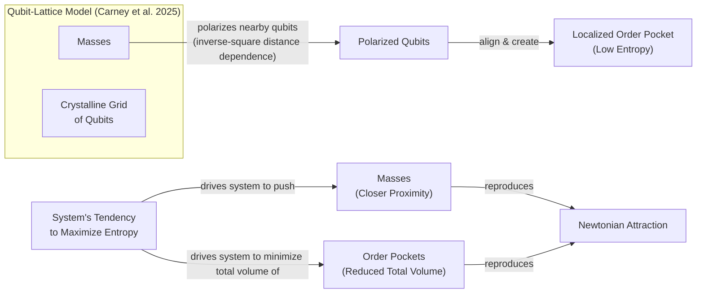
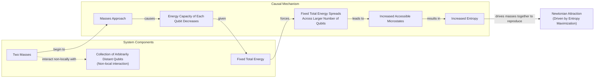
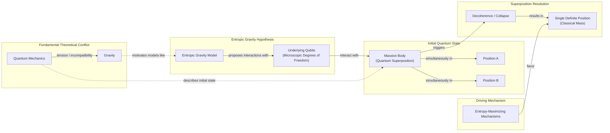

# Is Gravity an Illusion?

Isaac Newton was never entirely happy with his law of universal gravitation. He found it absurd that two objects could pull on each other across vast, empty distances. In a 1692 letter, he wrote that the idea of gravity being innate and essential to matter, allowing bodies to act on one another "thro' a Vacuum, without the Mediation of any thing else," was "so great an Absurdity that I believe no Man who has in philosophical Matters a competent Faculty of thinking can ever fall into it." This discomfort with "action at a distance" was a major philosophical hurdle for Newton and his contemporaries, as it described a purely mathematical relationship without offering a physical, mechanical explanation [[1]](https://philosophy.stackexchange.com/questions/122488/what-are-the-historical-philosophical-arguments-for-and-against-action-at-a-dist).

This dissatisfaction fueled a variety of mechanical "push" models in the following era. These theories attempted to explain gravity with direct contact, preserving a mechanistic worldview where all forces resulted from collisions. Some proposed that space was filled with a stream of invisible particles, or an "ether," that constantly bombarded all objects. A body would shield another from particles coming from its direction, resulting in a net pressure that pushed the two bodies together. Other models invoked complex systems of vortex pressures in a fluid-like medium to produce the same effect. This created the appearance of attraction without any mysterious pulling force [[2]](https://www.quantamagazine.org/is-gravity-just-entropy-rising-long-shot-idea-gets-another-look-20250613).

Albert Einstein later offered a deeper explanation, describing gravity as the curvature of spacetime. In his theory of general relativity, objects simply follow the straightest possible path—a geodesic—through a geometry warped by mass and energy. This elegant solution did away with action at a distance, but it was not the final word. General relativity breaks down at the center of black holes, predicting infinite curvature at singularities, a clear sign that the theory is incomplete and must be superseded by a more fundamental description [[2]](https://www.quantamagazine.org/is-gravity-just-entropy-rising-long-shot-idea-gets-another-look-20250613).

This has led some physicists to revisit the idea that gravity is not fundamental but emergent. A recent effort led by Daniel Carney of Lawrence Berkeley National Laboratory explores a modern version of the old mechanical models. In this view, called entropic gravity, the force we perceive is the statistical outcome of swarm behavior on a finer scale. As Carney puts it, "There’s some kind of gas or some thermal system out there that we can’t see directly. But it’s randomly interacting with masses in some way, such that on average you see all the normal gravity things that you know about" [[2]](https://www.quantamagazine.org/is-gravity-just-entropy-rising-long-shot-idea-gets-another-look-20250613).

This project is part of a broader search to understand gravity and spacetime as emerging from deeper, microscopic physics. Carney’s work suggests this deeper physics is simply the physics of heat. It proposes that gravity results from the same random jiggling of particles and the corresponding rise in entropy, or disorder, that governs steam engines [[2]](https://www.quantamagazine.org/is-gravity-just-entropy-rising-long-shot-idea-gets-another-look-20250613). While entropic gravity is a minority view, it persists because even its detractors are reluctant to dismiss it entirely. Furthermore, it has the rare virtue of being experimentally testable, opening the door to distinguishing a statistical tendency from an immutable law [[2]](https://www.quantamagazine.org/is-gravity-just-entropy-rising-long-shot-idea-gets-another-look-20250613).

From this historical dissatisfaction, we will now explore the concrete thermodynamic parallels in general relativity that allow gravity to be derived from heat rather than being postulated as a geometric property.

## A Force Emerges

What makes Einstein's theory so remarkable is that it hints at its own incompleteness. General Relativity (GR) predicts that stars can collapse to form black holes, where gravity becomes infinitely strong at the center. At these singularities, the fabric of spacetime tears, and the theory can no longer describe what happens next. This breakdown signals the need for a deeper, more microscopic theory that can describe these extreme conditions [[2]](https://www.quantamagazine.org/is-gravity-just-entropy-rising-long-shot-idea-gets-another-look-20250613).

Furthermore, GR exhibits uncanny parallels to thermodynamics, even though no thermal concepts were used in its development. For example, the surface area of a black hole's event horizon can only increase, never decrease. This is strikingly similar to the second law of thermodynamics, where entropy, a measure of disorder, always tends to increase. This irreversible growth suggested a deep connection between geometry and information [[3]](https://en.wikipedia.org/wiki/Holographic_principle).

When physicists applied quantum mechanics to the spacetime around a black hole, they discovered that black holes are not truly black. They radiate energy like any hot object, a phenomenon known as Hawking radiation. This connects to the Unruh effect, where an accelerating observer also perceives a thermal bath, further strengthening the link between gravity and thermodynamics. Since heat is just the random motion of particles, these thermal effects strongly suggest that black holes, and perhaps spacetime itself, are composed of some kind of microscopic components whose statistical behavior gives rise to these thermal properties [[2]](https://www.quantamagazine.org/is-gravity-just-entropy-rising-long-shot-idea-gets-another-look-20250613), [[3]](https://en.wikipedia.org/wiki/Holographic_principle), [[4]](https://pmc.ncbi.nlm.nih.gov/articles/PMC7512854).

This has led to multiple approaches for understanding how spacetime emerges from these microscopic parts. The leading approach is the holographic principle, inspired by black hole thermodynamics and the Bekenstein bound, which conjectures that the maximum entropy in any region scales with its surface area, not its volume. This suggests that the three-dimensional universe we experience is like a hologram, an image of reality coded on a distant, two-dimensional surface. In this view, patterns in the microscopic components on this boundary give rise to an extra spatial dimension, which is curved, causing gravity to emerge naturally [[2]](https://www.quantamagazine.org/is-gravity-just-entropy-rising-long-shot-idea-gets-another-look-20250613), [[3]](https://en.wikipedia.org/wiki/Holographic_principle), [[5]](https://plus.maths.org/quantum-gravity-can-holographic-principle).

Entropic gravity, introduced in 1995 by physicist Ted Jacobson, takes a different path. Instead of starting with Einstein's theory and deriving its heat-like properties, Jacobson did the opposite. He assumed that spacetime has thermal properties and used the fundamental thermodynamic relation δQ = TdS (heat equals temperature times change in entropy) to derive the equations of general relativity. By applying this relation to all local Rindler horizons—causal boundaries seen by accelerating observers—he showed that the Einstein equation emerges as a thermodynamic equation of state. His work confirmed that the connection between gravity and heat is more than just an analogy [[2]](https://www.quantamagazine.org/is-gravity-just-entropy-rising-long-shot-idea-gets-another-look-20250613), [[6]](https://krishnamohan-parattu.weebly.com/uploads/6/4/3/1/64317995/einstein-eq-and-thermodyn.pdf), [[7]](https://arxiv.org/abs/gr-qc/9504004).

This conceptual flip was a powerful move. As Daniel Carney notes, "He turned black hole thermodynamics on its head. I’ve been mystified by this result for my entire adult life." Having established that gravity can be derived from thermodynamics, we can now examine concrete models that implement this idea to reproduce Newtonian attraction [[2]](https://www.quantamagazine.org/is-gravity-just-entropy-rising-long-shot-idea-gets-another-look-20250613).

## Apparent Attraction

Inspired by Jacobson's approach, Carney and his co-authors recently put forward two models showing how gravitational attraction might arise from microscopic components [[2]](https://www.quantamagazine.org/is-gravity-just-entropy-rising-long-shot-idea-gets-another-look-20250613), [[8]](https://arxiv.org/abs/2502.17575).

The first model fills space with a crystalline grid of quantum particles, or qubits, each with an orientation like a compass needle. When a massive object is placed in this lattice, it influences the nearby qubits. "If you put a mass somewhere in the lattice, it causes all of the qubits nearby to get polarized—they all try to go in the same direction,” Carney explained [[2]](https://www.quantamagazine.org/is-gravity-just-entropy-rising-long-shot-idea-gets-another-look-20250613).

This polarization creates a pocket of high order in the otherwise randomly oriented grid. High order means low entropy. If you place two masses in the lattice, you create two such pockets. However, the system’s natural tendency is to maximize entropy. As a result, the qubits buffet the masses, pushing them closer together to contain the orderliness within a smaller region. This appears as gravitational attraction, but it is the qubits doing the work. The model naturally reproduces Newton's inverse-square law because the polarization effect, and thus the entropic force derived from the gradient of the system's free energy, diminishes with the square of the distance [[2]](https://www.quantamagazine.org/is-gravity-just-entropy-rising-long-shot-idea-gets-another-look-20250613), [[8]](https://arxiv.org/abs/2502.17575).

Image 1: The qubit-lattice model from Carney et al. 2025, where masses polarize qubits into order pockets, and entropy maximization leads to Newtonian attraction.

The second model does away with the grid. Here, massive objects are acted upon by qubits that can be far away, capturing the non-local nature of Newtonian gravity where every object acts on every other object. In this model, each qubit can store a certain amount of energy, and this capacity depends on the distance between the masses [[2]](https://www.quantamagazine.org/is-gravity-just-entropy-rising-long-shot-idea-gets-another-look-20250613), [[8]](https://arxiv.org/abs/2502.17575).

When the masses are far apart, each qubit's energy capacity is high, so the system's total energy can be stored in just a few qubits. As the masses get closer, the capacity of each qubit drops. This forces the total energy to be spread across more qubits. Spreading the energy over more qubits increases the number of available microscopic arrangements, or microstates, which corresponds to a higher entropy. The system’s tendency to maximize entropy therefore pushes the masses together, again reproducing Newtonian gravity [[2]](https://www.quantamagazine.org/is-gravity-just-entropy-rising-long-shot-idea-gets-another-look-20250613), [[8]](https://arxiv.org/abs/2502.17575).

Image 2: The non-local qubit model from Carney et al. 2025, where approaching masses decrease qubit energy capacity, which increases entropy and drives Newtonian attraction.

In both constructions, the gravitational attraction we observe is an emergent phenomenon driven by the universal tendency of systems to increase their entropy. The specific choice of qubits as mediators is a matter of convenience; the authors note that an analogous model using oscillators can also produce an emergent gravitational force, highlighting the generality of the underlying idea. While these models provide concrete mechanisms for entropic gravity, they also come with significant limitations that require critical examination [[9]](https://www.osti.gov/pages/servlets/purl/2587758).

## Strengths and Weaknesses

Carney himself cautioned that both models are ad hoc. There is no independent evidence for these qubits, and their interactions had to be fine-tuned to work. "It actually seems to require a peculiar engineered-looking interaction to get this to work," he admitted. This requires specifying coupling strengths, lattice spacing, or nonlocal connectivity rules that lack a deeper theoretical origin, making the models more descriptive than predictive. For Carney, the models are a proof of principle that swarm behavior can explain gravity, rather than a realistic depiction of the universe. "The ontology of all of this is nebulous," he said [[2]](https://www.quantamagazine.org/is-gravity-just-entropy-rising-long-shot-idea-gets-another-look-20250613), [[8]](https://arxiv.org/abs/2502.17575).

A major limitation is that the models only reproduce Newton's law of gravity, not the full framework of Einstein's theory where gravity is equivalent to the curvature of spacetime. Mark Van Raamsdonk, a physicist at the University of British Columbia, is doubtful they even represent a proof of principle. He notes that the models lack qualities that make gravity special, such as the fact that you feel no gravitational force when in free fall, a consequence of the equivalence principle. If gravity is a statistical force from qubit interactions, it is not obvious why it would affect all matter universally. "Their construction doesn’t really have anything to do with gravity," he stated [[2]](https://www.quantamagazine.org/is-gravity-just-entropy-rising-long-shot-idea-gets-another-look-20250613).

Furthermore, the models focus on the weak-field regime of gravity, which is already well understood. The real test for any theory of quantum gravity lies where gravity is strong, as inside black holes. This is where general relativity breaks down and new physics is expected to appear, but the entropic models currently have nothing to say about this. Extending them beyond the weak-field limit runs into theoretical problems, such as non-causal evolution of certain fields. "The real challenge in gravitational physics is understanding its strong-coupling, strong-field regime," said a theorist at Ben-Gurion University who has cooled on the idea of entropic gravity [[2]](https://www.quantamagazine.org/is-gravity-just-entropy-rising-long-shot-idea-gets-another-look-20250613), [[10]](https://link.springer.com/article/10.1007/JHEP08(2023)163).

However, the models also show that for certain parameter values, the entropic interaction can reproduce the predictions of ordinary virtual graviton exchange, suggesting the picture is not entirely separate from standard physics [[9]](https://www.osti.gov/pages/servlets/purl/2587758). Proponents of entropic gravity offer a counter-view. If gravity is a collective effect, the Newtonian force law is just a statistical average. The moment-to-moment effect should fluctuate around that average. These fluctuations might only become observable in very weak gravitational fields. Erik Verlinde of the University of Amsterdam, who argued for entropic gravity in a 2010 paper, said, "You have to go to very weak fields, because then these fluctuations might become observable" [[2]](https://www.quantamagazine.org/is-gravity-just-entropy-rising-long-shot-idea-gets-another-look-20250613), [[11]](https://curtjaimungal.substack.com/p/what-is-entropic-gravity), [[12]](https://arxiv.org/abs/1001.0785).

Verlinde's framework also attempts to explain cosmological puzzles like dark matter and dark energy. His theory suggests that what we interpret as dark matter might be an emergent aspect of spacetime entropy dynamics rather than a swarm of unknown particles. In this view, the effects attributed to dark matter could be explained by modifications to gravity itself at large galactic scales. Similarly, dark energy is linked to an entropy displacement caused by matter, providing a fresh angle on the universe's accelerating expansion. This offers the potential for a unified description of these phenomena within an emergent-gravity paradigm [[13]](https://www.firstprinciples.org/article/gravity-from-entropy-new-theory-bridging-quantum-mechanics-and-relativity), [[14]](https://arxiv.org/html/2511.05632v1).

Despite their weaknesses, these models make distinct predictions about quantum systems that open new avenues for experimental tests, especially when connected to ideas about wave function collapse.

## Testing Entropic Gravity

Carney thinks the main benefit of the new models is that they "prompt conceptual questions about gravity and open up new experimental directions." For instance, consider a massive body in a quantum superposition of two different locations. Should its gravitational field also be in a superposition, pulling objects in two directions at once? The question exposes the tension between quantum mechanics and gravity [[2]](https://www.quantamagazine.org/is-gravity-just-entropy-rising-long-shot-idea-gets-another-look-20250613), [[15]](https://www.youtube.com/watch?v=yPvRQ5nyKZY).

The entropic models predict that the underlying qubits will force the body out of superposition into a single state. This occurs because the system’s tendency to maximize entropy favors a classical configuration that minimizes the ordered, low-entropy regions created by the mass [[2]](https://www.quantamagazine.org/is-gravity-just-entropy-rising-long-shot-idea-gets-another-look-20250613), [[8]](https://arxiv.org/abs/2502.17575).

Image 3: A massive body in quantum superposition may have its state resolved by an entropic gravity model, which favors a single definite position to maximize entropy.

This idea connects to objective collapse theories, which propose that wave function collapse is a real physical process, possibly triggered by gravity itself. Models like the Diósi-Penrose theory suggest that superpositions of different spacetime curvatures are unstable and spontaneously collapse. These are not mere interpretations but new theories that modify quantum mechanics, making collapse a physical process distinct from environmental decoherence. They share testable consequences with entropic gravity models, such as mass-dependent decoherence rates [[2]](https://www.quantamagazine.org/is-gravity-just-entropy-rising-long-shot-idea-gets-another-look-20250613), [[16]](https://postquantum.com/quantum-computing/wave-function-collapse), [[17]](https://pmc.ncbi.nlm.nih.gov/articles/PMC11305101), [[18]](https://en.wikipedia.org/wiki/Objective-collapse_theory).

Tabletop experiments using atom interferometry or opto-mechanical systems are designed to search for this spontaneous collapse and could therefore also be used to test entropic gravity. Crucially, however, such effects have not yet been observed; standard quantum mechanics has passed every experimental test so far [[2]](https://www.quantamagazine.org/is-gravity-just-entropy-rising-long-shot-idea-gets-another-look-20250613), [[16]](https://postquantum.com/quantum-computing/wave-function-collapse), [[19]](https://arxiv.org/html/2512.15393v2).

Even with his doubts, Van Raamsdonk agrees the approach is worth exploring. "Since it hasn’t been established that actual gravity in our universe arises holographically, it’s certainly valuable to explore other mechanisms by which gravity might arise," he said. If this long-shot theory proves correct, it may mean that gravity is not, in fact, a law, but merely a statistical tendency [[2]](https://www.quantamagazine.org/is-gravity-just-entropy-rising-long-shot-idea-gets-another-look-20250613).

## References

- [1] https://philosophy.stackexchange.com/questions/122488/what-are-the-historical-philosophical-arguments-for-and-against-action-at-a-dist
- [2] https://www.quantamagazine.org/is-gravity-just-entropy-rising-long-shot-idea-gets-another-look-20250613
- [3] https://en.wikipedia.org/wiki/Holographic_principle
- [4] https://pmc.ncbi.nlm.nih.gov/articles/PMC7512854
- [5] https://plus.maths.org/quantum-gravity-can-holographic-principle
- [6] https://krishnamohan-parattu.weebly.com/uploads/6/4/3/1/64317995/einstein-eq-and-thermodyn.pdf
- [7] https://arxiv.org/abs/gr-qc/9504004
- [8] https://arxiv.org/abs/2502.17575
- [9] https://www.osti.gov/pages/servlets/purl/2587758
- [10] https://link.springer.com/article/10.1007/JHEP08(2023)163
- [11] https://curtjaimungal.substack.com/p/what-is-entropic-gravity
- [12] https://arxiv.org/abs/1001.0785
- [13] https://www.firstprinciples.org/article/gravity-from-entropy-new-theory-bridging-quantum-mechanics-and-relativity
- [14] https://arxiv.org/html/2511.05632v1
- [15] https://www.youtube.com/watch?v=yPvRQ5nyKZY
- [16] https://postquantum.com/quantum-computing/wave-function-collapse
- [17] https://pmc.ncbi.nlm.nih.gov/articles/PMC11305101
- [18] https://en.wikipedia.org/wiki/Objective-collapse_theory
- [19] https://arxiv.org/html/2512.15393v2