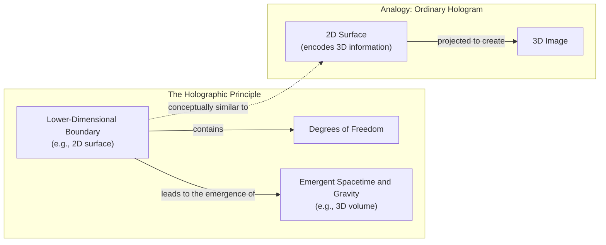

# Rethinking Gravity: An Engineer's Guide to the Entropic Force

Image 1: Physicist Erik Verlinde, a key figure in the development of modern entropic gravity theories.

## Introduction

Isaac Newton gave us the mathematical laws of gravity, but he was deeply troubled by the concept of "action at a distance." He found the idea that one body could affect another across a vacuum without any mediating substance to be a profound absurdity. In a 1692 letter, he wrote, "That one body may act upon another at a distance thro' a Vacuum, without the Mediation of any thing else... is to me so great an Absurdity that I believe no Man who has in philosophical Matters a competent Faculty of thinking can ever fall into it" [[1]](https://philosophy.stackexchange.com/questions/122488/what-are-the-historical-philosophical-arguments-for-and-against-action-at-a-dist). This dissatisfaction spurred his contemporaries to propose mechanical "push" models, imagining that invisible particles, or an "ether," physically pushed objects toward each other, preserving a universe where all interactions required contact.

Centuries later, Albert Einstein resolved the issue by describing gravity not as a force, but as the curvature of spacetime. In his theory of general relativity, objects simply follow the straightest possible path—a geodesic—through a geometry warped by mass and energy. This elegant solution eliminated action at a distance, yet it also revealed its own limits. At the heart of black holes or the beginning of the universe, the theory predicts singularities where curvature becomes infinite and the laws of physics break down, signaling that general relativity is not the final word.

A modern and unconventional alternative, known as entropic gravity, revisits the idea of a mechanical cause. This theory proposes that gravity isn't a fundamental force at all but an emergent phenomenon, much like the pressure of a gas. A gas's pressure arises from the countless random collisions of its constituent molecules; it’s a statistical effect. Similarly, entropic gravity suggests that the attraction between masses is the macroscopic outcome of a hidden system of microscopic components, like a swarm of unseen particles, tending toward maximum entropy or disorder. Physicists like Daniel Carney are modeling this deeper layer as the physics of heat and information [[2]](https://arxiv.org/abs/2502.17575). Analogies can also be drawn from soft matter physics, where forces emerge from entropy in systems like polymers or Bose-Einstein Condensates [[3]](https://pure.uva.nl/ws/files/1162156/105001_357036.pdf), [[4]](https://indico.cern.ch/event/469723/contributions/2208861/attachments/1300149/1944616/CERN-EG-2016.pdf).

While the entropic view remains a minority perspective, it persists because it offers the prospect of experimental tests. If gravity is statistical, it might exhibit tiny fluctuations or deviations from the smooth geometry of Einstein's theory. These anomalies, if detected, could provide the first concrete clues about the microscopic origins of spacetime.

Having set the stage with this historical dissatisfaction, we can now explore the concrete thermodynamic parallels discovered within general relativity itself, which first hinted that gravity could be derived from heat rather than being a fundamental geometric property.

## A Force Emerges

General relativity's (GR) failure at singularities is a clear indication that it must be completed by a deeper, microscopic theory. Curiously, the seeds of such a theory were found within general relativity itself, which, despite its purely geometric origins, exhibits profound parallels with thermodynamics. The area of a black hole's event horizon, for instance, never decreases, mirroring the second law of thermodynamics, which states that the entropy of an isolated system can only increase.

This analogy became a physical identity with Stephen Hawking's discovery that black holes are not truly black. When quantum fields are considered, black holes radiate energy as if they have a temperature, now known as Hawking temperature. The existence of temperature and entropy implies that black holes must be composed of microscopic degrees of freedom, whose statistical behavior gives rise to these thermal properties. This opened the door to a new question: what are these fundamental constituents?

One dominant approach to answering this is the holographic principle. It proposes that the description of a volume of space is encoded on a lower-dimensional boundary, much like a three-dimensional holographic image is generated from a two-dimensional surface [[5]](https://en.wikipedia.org/wiki/Holographic_principle). In this view, spacetime and gravity emerge from the collective behavior of these boundary degrees of freedom.

Image 2: A conceptual architecture diagram illustrating the Holographic Principle and its analogy to an ordinary hologram.

A different path was forged by Ted Jacobson in 1995. Instead of deriving thermodynamics from general relativity, he reversed the logic. By assuming that spacetime itself has thermal properties—specifically, that the thermodynamic relation δQ = TdS (heat equals temperature times change in entropy) holds for local Rindler horizons everywhere—he derived the Einstein field equations [[6]](https://arxiv.org/abs/gr-qc/9504004). This approach, termed "thermodynamic gravity," frames Einstein's equation as a local equation of state emerging from constraints on a dynamical lightsheet in a fixed spacetime [[7]](https://arxiv.org/pdf/1601.07558). This stunning result demonstrated that general relativity could be viewed as a macroscopic description of some underlying statistical system, much like the ideal gas law [[8]](https://krishnamohan-parattu.weebly.com/uploads/6/4/3/1/64317995/einstein-eq-and-thermodyn.pdf).

Jacobson's work confirmed that the connection between gravity and heat is not just an analogy but a deep physical identity. It reframed gravity as an entropic force, an idea later popularized by Erik Verlinde [[9]](https://arxiv.org/abs/1001.0785). As Daniel Carney puts it, “He turned black hole thermodynamics on its head. I’ve been mystified by this result for my entire adult life” [[10]](https://www.quantamagazine.org/is-gravity-just-entropy-rising-long-shot-idea-gets-another-look-20250613). This perspective provides a powerful conceptual shift: gravity isn't a fundamental interaction but an emergent consequence of the universe’s tendency to maximize entropy.

Now that we have established the thermodynamic derivation that reframes gravity, we can examine two concrete models that implement this idea to reproduce Newtonian attraction through explicit entropy-maximizing mechanisms.

## Apparent Attraction

Image 3: The unseen microscopic dynamics of entropic gravity models create the macroscopic illusion of gravitational attraction, much like a wave emerges from the collective motion of water molecules.

Inspired by Jacobson's thermodynamic approach, Daniel Carney and his colleagues recently proposed two models that generate gravity from the collective behavior of microscopic components [[2]](https://arxiv.org/abs/2502.17575). These models replace the smooth fabric of spacetime with a sea of quantum bits, or qubits, whose statistical tendencies give rise to what we perceive as gravitational force.

The first model imagines space as a crystalline grid of qubits. When a massive object is placed in this lattice, it influences the orientation of nearby qubits. As Carney explains, “If you put a mass somewhere in the lattice, it causes all of the qubits nearby to get polarized — they all try to go in the same direction" [[10]](https://www.quantamagazine.org/is-gravity-just-entropy-rising-long-shot-idea-gets-another-look-20250613). This polarization creates a localized pocket of high order, which corresponds to low entropy. The universe, however, naturally tends toward maximum entropy. To achieve this, the system pushes masses closer together, minimizing the size of these ordered regions and thus reducing the overall entropic "cost." The apparent attraction is simply an epiphenomenon of this entropy maximization. This model naturally recovers the inverse-square law of gravity; as the polarization effect from a mass weakens with distance, the resulting entropic force on another mass decreases in proportion to the square of the distance between them.

The second model does away with the local lattice, instead allowing qubits to be non-local and interact instantaneously, capturing the action-at-a-distance character of Newtonian gravity. In this version, the mechanism is different. The presence of mass alters the energy capacity of each qubit. When two masses get closer, the energy capacity of the surrounding qubits decreases. If the total energy of the system is fixed, it must be distributed among a larger number of qubits. Spreading the energy out in this way increases the number of accessible microscopic arrangements, thereby raising the system's total entropy. Again, the system's drive to maximize entropy pushes the masses together.

In both models, the force we call gravity is not fundamental. It is an apparent attraction driven by the statistical mechanics of an underlying qubit system. The first model achieves this through local pockets of order, while the second relies on a non-local modulation of energy capacity. Both frame gravity as a consequence of the universe's relentless tendency toward a state of higher entropy, where information is maximized and order is minimized.

While these constructions provide explicit mechanisms that recover Newtonian gravity from entropy maximization, they carry significant limitations and ad-hoc elements that must be critically examined.

## Strengths and Weaknesses

The primary weakness of these entropic models is their ad-hoc nature. They require finely-tuned parameters, such as the coupling strength between masses and qubits or the lattice spacing, which are not derived from a more fundamental theory but are chosen specifically to reproduce Newton's law [[2]](https://arxiv.org/abs/2502.17575). As Carney himself acknowledges, the models are intended as proofs of principle rather than realistic descriptions of nature. Their scope is also limited, as they currently only reproduce the weak-field limit of gravity and do not capture the full curved-spacetime dynamics of general relativity.

A more profound issue is their failure to naturally incorporate the equivalence principle. As physicist Mark Van Raamsdonk has pointed out, it is unclear why an entropic force would affect all objects identically regardless of their composition. In his view, "Their construction doesn’t really have anything to do with gravity" [[10]](https://www.quantamagazine.org/is-gravity-just-entropy-rising-long-shot-idea-gets-another-look-20250613). If gravity arises from interactions with a background of qubits, one might expect different materials to couple to this background in different ways, leading to violations of the principle that all objects fall at the same rate. Other researchers have shown that principles like energy-momentum conservation and cosmological homogeneity severely restrict potential modifications of entropic gravity [[11]](https://en.wikipedia.org/wiki/Entropic_gravity).

Furthermore, the models concentrate on the weak-field regime, which is already understood with high precision. The real test for any theory of quantum gravity lies in the strong-field environments of black holes and the early universe, where general relativity breaks down. As theorist Ramy Brustein notes, “The real challenge in gravitational physics is understanding its strong-coupling, strong-field regime” [[10]](https://www.quantamagazine.org/is-gravity-just-entropy-rising-long-shot-idea-gets-another-look-20250613). It remains an open question whether the entropic picture can be extended to these extreme domains.

However, there is a compelling counter-view. If gravity is indeed a statistical phenomenon, the weak-field regime might be precisely the place to look for evidence. Proponents like Erik Verlinde argue that this is missing the point. “You have to go to very weak fields, because then these fluctuations might become observable,” he stated, suggesting that the statistical nature of gravity would be most apparent where the force is weakest [[10]](https://www.quantamagazine.org/is-gravity-just-entropy-rising-long-shot-idea-gets-another-look-20250613). These random variations could manifest as a form of noise or as minute deviations from the strict inverse-square law, offering a clear experimental signature.

These weaknesses notwithstanding, the entropic gravity picture makes distinctive predictions about quantum systems that open new avenues for experimental tests, particularly when combined with ideas about how quantum states collapse.

## Testing Entropic Gravity

Image 4: Researchers like (clockwise from top left) Sabrina Pasterski, Ted Jacobson, Juan Maldacena, and Andrew Strominger are exploring the deep connections between gravity, thermodynamics, and quantum information.

The main benefit of the new entropic models is that they are "fully quantum mechanical from the ground up," as Carney puts it, which allows them to make concrete, testable predictions [[2]](https://arxiv.org/abs/2502.17575). Consider a thought experiment: a massive object is placed in a quantum superposition of two different locations. What happens to its gravitational field? Does the field also enter a superposition, or does it remain in a definite state? This question highlights the fundamental conflict between quantum mechanics and gravity.

Entropic gravity offers a clear prediction. The underlying qubit system would interact with the superposed mass, and the drive to maximize entropy would favor a single, classical configuration. The superposition would be forced to "choose" one location, a process known as decoherence or collapse. This is because a single mass minimizes the low-entropy "order pocket" or optimizes the energy distribution across the qubit bath more effectively than a smeared-out quantum state.

This prediction connects directly to objective-collapse theories, which propose that wave function collapse is a real physical process, possibly triggered by gravity itself [[12]](https://postquantum.com/quantum-computing/wave-function-collapse). These theories modify the standard Schrödinger equation with additional non-linear, stochastic terms that cause the wave function to spontaneously localize for massive or complex systems [[13]](https://en.wikipedia.org/wiki/Objective-collapse_theory). The Diósi-Penrose model, for example, suggests that superpositions of different spacetime curvatures are unstable and collapse spontaneously [[14]](https://pmc.ncbi.nlm.nih.gov/articles/PMC11305101). Both entropic gravity and objective-collapse models predict similar experimental signatures, such as mass-dependent decoherence rates that deviate from standard quantum mechanics.

This convergence opens the door for tabletop experiments. Researchers are already using highly sensitive instruments to test the limits of quantum superposition with increasingly massive objects. These experiments, designed to search for signs of spontaneous collapse, could simultaneously constrain or even falsify entropic gravity models by looking for the predicted anomalous decoherence. So far, such experiments have found no evidence for the effects predicted by the simplest collapse models, placing tight constraints on any such theory [[12]](https://postquantum.com/quantum-computing/wave-function-collapse).

Even if the holographic principle remains the leading candidate for a theory of quantum gravity, exploring long-shot alternatives is invaluable. As Mark Van Raamsdonk concedes, “Since it hasn’t been established that actual gravity in our universe arises holographically, it’s certainly valuable to explore other mechanisms by which gravity might arise” [[10]](https://www.quantamagazine.org/is-gravity-just-entropy-rising-long-shot-idea-gets-another-look-20250613). This exploration deepens our understanding of emergence and may reveal statistical fluctuations that inform how macroscopic laws arise from microscopic randomness, reframing gravity as a statistical tendency rather than an immutable law.

## Conclusion

The journey from Newton's unease with "action at a distance" to the modern exploration of entropic gravity reveals a persistent theme in physics: the search for a mechanical, comprehensible origin for the forces that shape our universe. While Einstein's geometry provided a powerful framework, its limitations suggest that space, time, and gravity are not fundamental but emerge from a more primitive layer of reality. This reflects a broader lesson from complexity science: reducing a phenomenon to fundamental laws is not sufficient to explain everything, as new behaviors and ontologies can appear at higher levels of organization [[15]](https://arxiv.org/html/2507.04951v4).

Entropic gravity offers a unique, if incomplete, explanation for this emergence. It reframes gravity not as a fundamental force but as a statistical consequence of a microscopic system's tendency toward maximum disorder. Although current models are still in their infancy, they provide a concrete quantum-mechanical framework that makes testable predictions. Some researchers are even exploring whether entropic gravity could provide a unified description of dark matter and dark energy, suggesting these cosmic puzzles might be manifestations of spacetime entropy dynamics rather than new particles [[16]](https://arxiv.org/html/2511.05632v1), [[17]](https://www.firstprinciples.org/article/gravity-from-entropy-new-theory-bridging-quantum-mechanics-and-relativity).

The prospect of using tabletop experiments to probe the very nature of spacetime—to distinguish between a deterministic geometric law and a statistical tendency—represents a profound shift in how we investigate the universe's most fundamental questions.

## References

- [1] [What are the historical-philosophical arguments for and against action at a distance?](https://philosophy.stackexchange.com/questions/122488/what-are-the-historical-philosophical-arguments-for-and-against-action-at-a-dist)
- [2] [Carney et al. 2025 Entropic Gravity Models](https://arxiv.org/abs/2502.17575)
- [3] [On the Origin of Gravity and the Laws of Newton](https://pure.uva.nl/ws/files/1162156/105001_357036.pdf)
- [4] [Emergent Gravity from Condensed Matter Analogues](https://indico.cern.ch/event/469723/contributions/2208861/attachments/1300149/1944616/CERN-EG-2016.pdf)
- [5] [Holographic principle - Wikipedia](https://en.wikipedia.org/wiki/Holographic_principle)
- [6] [Thermodynamics of Spacetime: The Einstein Equation of State](https://arxiv.org/abs/gr-qc/9504004)
- [7] [What is the Entropy in Entropic Gravity?](https://arxiv.org/pdf/1601.07558)
- [8] [Einstein's Equations from Thermodynamics](https://krishnamohan-parattu.weebly.com/uploads/6/4/3/1/64317995/einstein-eq-and-thermodyn.pdf)
- [9] [On the Origin of Gravity and the Laws of Newton](https://arxiv.org/abs/1001.0785)
- [10] [Is Gravity Just Entropy Rising? Long-Shot Idea Gets Another Look](https://www.quantamagazine.org/is-gravity-just-entropy-rising-long-shot-idea-gets-another-look-20250613)
- [11] [Entropic gravity - Wikipedia](https://en.wikipedia.org/wiki/Entropic_gravity)
- [12] [Wave Function Collapse: When Quantum Possibilities Become Reality](https://postquantum.com/quantum-computing/wave-function-collapse)
- [13] [Objective-collapse theory - Wikipedia](https://en.wikipedia.org/wiki/Objective-collapse_theory)
- [14] [The Diósi-Penrose model for quantum gravity and its generalizations](https://pmc.ncbi.nlm.nih.gov/articles/PMC11305101)
- [15] [What is emergence, after all?](https://arxiv.org/html/2507.04951v4)
- [16] [A MOND-like theory of dark matter from emergent gravity](https://arxiv.org/html/2511.05632v1)
- [17] [Gravity from Entropy: A Radical New Approach to Unifying Quantum Mechanics and General Relativity](https://www.firstprinciples.org/article/gravity-from-entropy-new-theory-bridging-quantum-mechanics-and-relativity)
- [18] [Erik Verlinde - The Universe as a Quantum Information System](https://www.youtube.com/watch?v=zkgZ0ShfbUE)
- [19] [Can quantum gravity be a hologram?](https://plus.maths.org/content/can-quantum-gravity-be-hologram)
- [20] [Thermodynamics of Spacetime: The Einstein Equation of State](https://diposit.ub.edu/bitstreams/3a349666-d2a4-4667-a191-efffc065905c/download)
- [21] [Thermodynamics of spacetime: The Einstein equation of state](https://inspirehep.net/literature/394001)
- [22] [How does the philosophy of emergent gravity differ from that of quantum gravity?](https://physics.stackexchange.com/questions/553104/how-does-the-philosophy-of-emergent-gravity-differ-from-that-of-quantum-gravi)
- [23] [What is Entropic Gravity?](https://curtjaimungal.substack.com/p/what-is-entropic-gravity)
- [24] [Verlinde on Entropic Gravity](https://www.math.columbia.edu/~woit/wordpress?p=3123)
- [25] [Erik Verlinde - A New View on Gravity and the Dark Side of the Universe](https://www.youtube.com/watch?v=BVphTl_WGEY)
- [26] [Emergent (entropic) gravity from quantum entanglement in de Sitter space](https://physics.stackexchange.com/questions/794569/emergent-entropic-gravity-from-quantum-entanglement-in-de-sitter-space)
- [27] [Is Verlinde's "Emergent Gravity" a viable theory?](http://backreaction.blogspot.com/2017/03/is-verlindes-emergent-gravity.html)
- [28] [Testing Gravity-Driven Quantum Collapse](https://www.youtube.com/watch?v=yPvRQ5nyKZY)
- [29] [Roger Penrose - The quantum collapse and the gravitational field](https://www.youtube.com/watch?v=TZ6mTCbZtOI&vl=en)
- [30] [Local spin entropic gravity](https://link.aps.org/doi/10.1103/y7sy-3by1)
- [31] [Is Newton's "action at a distance" a valid concept?](https://philarchive.org/archive/SFEINO)