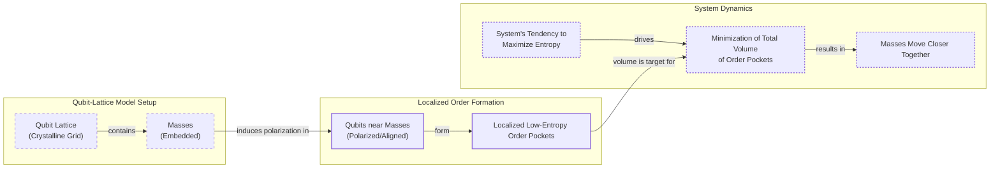

# Is Gravity an Illusion? Exploring the Entropic Force

Isaac Newton gave us the mathematical laws of gravity, but he was deeply troubled by the "how." He found the idea of action-at-a-distance, where one body could affect another across a vacuum without any medium, to be a "great Absurdity" [[1]](https://philosophy.stackexchange.com/questions/122488/what-are-the-historical-philosophical-arguments-for-and-against-action-at-a-dist). In a 1692 letter, he wrote that no person with a "competent Faculty of thinking" could ever believe that inanimate matter could operate on other matter without mutual contact [[1]](https://philosophy.stackexchange.com/questions/122488/what-are-the-historical-philosophical-arguments-for-and-against-action-at-a-dist). This dissatisfaction spurred his contemporaries to propose mechanical "push" models. These theories imagined that invisible particles or pressures in an "ether" physically pushed objects together, creating the appearance of attraction while preserving a contact-only, mechanistic universe.

Centuries later, Einstein provided a more profound explanation. He replaced the mysterious force with the curvature of spacetime. In his theory of general relativity, matter tells spacetime how to curve, and curved spacetime tells matter how to move. This elegant geometric picture eliminated action-at-a-distance. Yet, it too is incomplete. At the heart of black holes or the beginning of the universe, the theory predicts infinite curvature—a singularity—where the laws of physics break down. General relativity cannot be the final word.

A newer, more radical idea reframes gravity not as a fundamental force or a property of geometry, but as an emergent, statistical phenomenon. Physicist Daniel Carney and his colleagues are exploring models where gravity arises from the collective behavior of vast numbers of hidden, microscopic components. As Carney describes it, “There’s some kind of gas or some thermal system out there that we can’t see directly. But it’s randomly interacting with masses in some way, such that on average you see all the normal gravity things that you know about” [[2]](https://www.quantamagazine.org/is-gravity-just-entropy-rising-long-shot-idea-gets-another-look-20250613). In this view, gravity is an "entropic force," a tendency for systems to maximize their disorder [[3]](https://arxiv.org/abs/1001.0785).

This entropic gravity project is one of several ways physicists have tried to understand spacetime as emerging from something more fundamental. While the holographic principle remains the dominant approach, the entropic view persists because it makes a testable prediction: if gravity is statistical, it might fluctuate. These tiny deviations from a perfect, immutable law could be detectable in tabletop experiments, offering a rare window into the quantum nature of reality. This article explores the thermodynamic parallels in general relativity that first suggested gravity could be derived from heat. You will see new models that show how this might work and what it would take to test them.

## A Force Emerges

General relativity describes the macroscopic universe with stunning accuracy, but its breakdown at singularities signals that it is an effective theory, not a fundamental one. Like the fluid dynamics of water, which fails to describe individual H₂O molecules, GR must be replaced by a deeper, microscopic theory at the smallest scales. The first clues to this underlying structure came from the study of black holes.

Despite being developed from purely geometric principles, GR contains unexpected thermodynamic parallels. The area of a black hole’s event horizon, for instance, can never decrease, mirroring the second law of thermodynamics, which states that the entropy of a closed system never decreases [[4]](https://en.wikipedia.org/wiki/Holographic_principle). When Stephen Hawking showed that quantum effects cause black holes to radiate as if they have a temperature, the analogy became an identity. The existence of temperature and entropy implies that black holes must be composed of microscopic degrees of freedom, whose statistical behavior gives rise to these thermal properties.

Today, the dominant theory for how spacetime emerges from microscopic components is the holographic principle. First proposed by Gerard 't Hooft and later given a precise interpretation by Leonard Susskind, it suggests that the description of a volume of space is encoded on a lower-dimensional boundary, much like a three-dimensional image is stored on a two-dimensional hologram [[4]](https://en.wikipedia.org/wiki/Holographic_principle). In this view, gravity in the 3D "bulk" is an emergent effect of a quantum theory without gravity living on the 2D "boundary" [[4]](https://en.wikipedia.org/wiki/Holographic_principle), [[5]](https://plus.maths.org/quantum-gravity-can-holographic-principle).

However, a different approach stems from the work of Ted Jacobson. In 1995, he flipped the logic of black hole thermodynamics on its head [[6]](https://arxiv.org/abs/gr-qc/9504004). Instead of deriving thermodynamics from the Einstein field equations, he started by assuming that every point in spacetime has thermal properties. He posited that the fundamental relation δQ = TdS, which connects heat (δQ), temperature (T), and entropy (dS), must hold for local "Rindler horizons"—causal boundaries seen by accelerating observers. By identifying heat with the flow of energy across the horizon and entropy with the horizon's area, he derived the complete Einstein field equations [[6]](https://arxiv.org/abs/gr-qc/9504004), [[7]](https://krishnamohan-parattu.weebly.com/uploads/6/4/3/1/64317995/einstein-eq-and-thermodyn.pdf).

This result was a powerful confirmation that the link between gravity and thermodynamics is no mere coincidence. It suggests that gravity itself might be a thermodynamic equation of state, a macroscopic description of the statistical mechanics of hidden "atoms" of spacetime [[6]](https://arxiv.org/abs/gr-qc/9504004). As Carney puts it, “He turned black hole thermodynamics on its head. I’ve been mystified by this result for my entire adult life” [[2]](https://www.quantamagazine.org/is-gravity-just-entropy-rising-long-shot-idea-gets-another-look-20250613). Having established this thermodynamic foundation, we can now examine concrete models that attempt to build gravity from the ground up using the principles of entropy.

## Apparent Attraction

Inspired by Jacobson's approach, Daniel Carney and his co-authors have put forward two microscopic models that reproduce Newtonian gravity as an emergent, entropic force [[8]](https://arxiv.org/abs/2502.17575). These models replace the smooth fabric of spacetime with a system of quantum bits, or qubits, and show how their collective statistical behavior can give rise to what we perceive as gravitational attraction.

The first model imagines space as a crystalline grid of qubits [[8]](https://arxiv.org/abs/2502.17575). When a massive object is placed in this lattice, it influences the orientation of the nearby qubits. As Carney explains, “If you put a mass somewhere in the lattice, it causes all of the qubits nearby to get polarized—they all try to go in the same direction” [[2]](https://www.quantamagazine.org/is-gravity-just-entropy-rising-long-shot-idea-gets-another-look-20250613). This alignment creates a localized "pocket of order" around the mass—a region of low entropy in an otherwise disordered system [[8]](https://arxiv.org/abs/2502.17575).

Image 1: A diagram illustrating the first qubit-lattice model from Carney et al. 2025, showing how masses create low-entropy order pockets, driving them closer together to maximize overall system entropy.

If you place two masses in the lattice, you create two such pockets. The fundamental tendency of any thermal system is to maximize its total entropy. To achieve this, the system will push the masses closer together, effectively shrinking the total volume of the ordered, low-entropy regions. This "apparent attraction" is not a fundamental force but an emergent effect of the system trying to increase its overall disorder [[8]](https://arxiv.org/abs/2502.17575), [[2]](https://www.quantamagazine.org/is-gravity-just-entropy-rising-long-shot-idea-gets-another-look-20250613). The polarization effect naturally weakens with distance, causing the resulting entropic force to follow the inverse-square law of Newton's gravity.

The second model is non-local and does not require a physical lattice [[8]](https://arxiv.org/abs/2502.17575). In this version, the qubits can be anywhere, capturing the action-at-a-distance character of Newtonian gravity. The mechanism for attraction is different: the presence of masses alters the energy capacity of the qubits. When two masses get closer, the energy capacity of each individual qubit decreases. To accommodate the system's total energy, it must be spread across a larger number of qubits. This distribution increases the number of accessible microscopic states, which, by definition, increases the system's entropy [[8]](https://arxiv.org/abs/2502.17575). The masses are therefore driven together because that configuration maximizes the system's entropy.

In both models, the gravitational force we experience is an illusion—an epiphenomenon of a deeper statistical process. Whether through minimizing ordered pockets or modulating energy capacity, the attraction between masses is simply the universe's tendency to find its most probable, highest-entropy state. These models provide explicit, if simplified, mechanisms for how this could work. However, they also come with significant limitations.

## Strengths and Weaknesses

While Carney's models provide a concrete proof-of-concept for entropic gravity, they are far from a complete theory. Their construction is ad-hoc, requiring a careful tuning of parameters—like the coupling strengths between masses and qubits or the lattice spacing—that are not derived from any deeper principles [[8]](https://arxiv.org/abs/2502.17575). Carney himself cautions that both models are ad hoc, stating, “It actually seems to require a peculiar engineered-looking interaction to get this to work” [[2]](https://www.quantamagazine.org/is-gravity-just-entropy-rising-long-shot-idea-gets-another-look-20250613). Physicist Matt Visser has also raised formal challenges, arguing that the attempt to model conservative forces in this way leads to unphysical requirements for the entropy and involves an unnatural number of temperature baths [[9]](https://en.wikipedia.org/wiki/Entropic_gravity).

A major limitation is that the models only reproduce Newtonian gravity in the weak-field limit. They do not recover the full curved-spacetime geometry of general relativity, leaving it unclear how, or if, an entropic framework could describe phenomena like gravitational waves or the dynamics near a black hole [[8]](https://arxiv.org/abs/2502.17575).

Perhaps the most significant challenge is the equivalence principle—the observation that all objects fall at the same rate regardless of their mass or composition. As physicist Mark Van Raamsdonk points out, if gravity is a statistical force arising from qubit interactions, it is not obvious why it should be universal. “Their construction doesn’t really have anything to do with gravity,” he said, noting the models lack the qualities that make gravity special [[2]](https://www.quantamagazine.org/is-gravity-just-entropy-rising-long-shot-idea-gets-another-look-20250613).

Furthermore, the models focus on the weak-field regime, which is already well-understood, rather than the strong-field environments of black holes, where new physics is expected. “The real challenge in gravitational physics is understanding its strong-coupling, strong-field regime,” said Ramy Brustein, a theorist who has cooled on the idea of entropic gravity [[2]](https://www.quantamagazine.org/is-gravity-just-entropy-rising-long-shot-idea-gets-another-look-20250613). It is in these extreme regimes that an entropic picture might be truly tested or falsified.

However, there is a compelling counter-view. If gravity is indeed emergent and statistical, the weak-field regime might be precisely where we could detect its true nature. Erik Verlinde, a proponent of the idea, argues, “You have to go to very weak fields, because then these fluctuations might become observable” [[2]](https://www.quantamagazine.org/is-gravity-just-entropy-rising-long-shot-idea-gets-another-look-20250613). A statistical force should exhibit fluctuations—tiny, random variations in its strength that could be a smoking-gun signal distinguishing it from the smooth, deterministic geometry of Einstein's theory.

## Testing Entropic Gravity

The primary benefit of constructing these new models, according to Carney, is that they "prompt conceptual questions about gravity and open up new experimental directions" [[2]](https://www.quantamagazine.org/is-gravity-just-entropy-rising-long-shot-idea-gets-another-look-20250613). Entropic gravity makes concrete predictions that diverge from standard quantum mechanics and could be tested with near-term tabletop experiments.

Consider placing a massive object in a quantum superposition of two different locations. According to standard quantum theory, its gravitational field should also enter a superposition. However, entropic gravity predicts otherwise. The interaction with the underlying qubit bath would favor a single, definite position for the mass, as this configuration minimizes the entropic cost [[8]](https://arxiv.org/abs/2502.17575). The qubit system would essentially "measure" the object's location, causing its superposition to rapidly decohere, or collapse, into a classical state.

This prediction connects entropic gravity to a class of theories known as objective collapse models, such as the Ghirardi–Rimini–Weber (GRW) or Continuous Spontaneous Localization (CSL) theories [[10]](https://en.wikipedia.org/wiki/Objective-collapse_theory). These models modify quantum mechanics by suggesting that wave function collapse is a real, physical process, possibly triggered by gravity itself [[11]](https://postquantum.com/quantum-computing/wave-function-collapse), [[12]](https://pmc.ncbi.nlm.nih.gov/articles/PMC11305101). For example, Roger Penrose has proposed that a superposition of a mass in two locations creates a superposition of two different spacetimes, a state he argues is unstable and quickly collapses [[11]](https://postquantum.com/quantum-computing/wave-function-collapse).

Both entropic gravity and objective collapse models predict that larger masses should decohere more quickly, a distinctive signature that can be searched for experimentally. Tabletop experiments using nanofabricated torsion pendulums or atom interferometry are already pushing the boundaries of quantum superposition to larger masses. These setups can search for the mass-dependent decoherence predicted by entropic gravity, placing tight constraints on its parameters and potentially falsifying the entire class of models [[8]](https://arxiv.org/abs/2502.17575), [[13]](https://arxiv.org/html/2601.11366v1).

Even if the holographic principle remains the leading candidate for emergent gravity, exploring long-shot alternatives deepens our understanding. Van Raamsdonk agrees that the approach is worth a try: “Since it hasn’t been established that actual gravity in our universe arises holographically, it’s certainly valuable to explore other mechanisms by which gravity might arise” [[2]](https://www.quantamagazine.org/is-gravity-just-entropy-rising-long-shot-idea-gets-another-look-20250613). These explorations force us to confront the possibility that the immutable laws we observe may simply be the statistical tendencies of a much more chaotic, microscopic world.

## Conclusion

The idea that gravity is not a fundamental force but an emergent, statistical effect is a radical departure from centuries of physical thought. From Newton's unease with action-at-a-distance to Einstein's elegant geometry, we have sought a definitive explanation for the universe's most pervasive interaction. Entropic gravity offers a new perspective: gravity is the macroscopic manifestation of a microscopic system's relentless drive toward maximum disorder.

While current models are still in their infancy and face significant theoretical hurdles, their true value lies in their testability. By predicting subtle fluctuations and a mass-dependent breakdown of quantum superposition, they offer a rare opportunity to probe the foundations of reality with near-term experiments. Whether these tests reveal gravity to be a statistical tendency or reaffirm its status as an immutable law, they will undoubtedly push us closer to a unified understanding of the cosmos.

## References

- [1] What are the historical-philosophical arguments for and against action at a distance? (https://philosophy.stackexchange.com/questions/122488/what-are-the-historical-philosophical-arguments-for-and-against-action-at-a-dist)
- [2] Is Gravity Just Entropy Rising? Long-Shot Idea Gets Another Look (https://www.quantamagazine.org/is-gravity-just-entropy-rising-long-shot-idea-gets-another-look-20250613)
- [3] On the Origin of Gravity and the Laws of Newton (https://arxiv.org/abs/1001.0785)
- [4] Holographic principle (https://en.wikipedia.org/wiki/Holographic_principle)
- [5] Quantum gravity: is the holographic principle the theory of everything? (https://plus.maths.org/quantum-gravity-can-holographic-principle)
- [6] Thermodynamics of Spacetime: The Einstein Equation of State (https://arxiv.org/abs/gr-qc/9504004)
- [7] Einstein Equations from/as Thermodynamics of Spacetime (https://krishnamohan-parattu.weebly.com/uploads/6/4/3/1/64317995/einstein-eq-and-thermodyn.pdf)
- [8] On the quantum mechanics of entropic forces (https://arxiv.org/abs/2502.17575)
- [9] Entropic gravity (https://en.wikipedia.org/wiki/Entropic_gravity)
- [10] Objective-collapse theory (https://en.wikipedia.org/wiki/Objective-collapse_theory)
- [11] What is Wave Function Collapse? (https://postquantum.com/quantum-computing/wave-function-collapse)
- [12] Diósi–Penrose model of gravity-related wave function collapse is ruled out by the simplest experiments (https://pmc.ncbi.nlm.nih.gov/articles/PMC11305101)
- [13] Nanofabricated torsion pendulums for tabletop gravity experiments (https://arxiv.org/html/2601.11366v1)