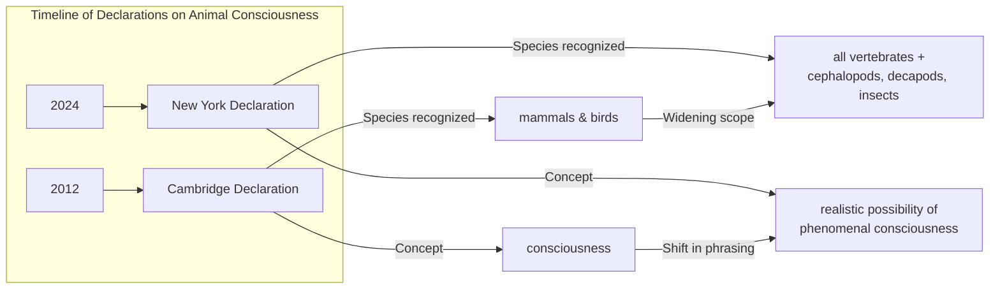

# Beyond Mammals: Why the New Consensus on Animal Consciousness Matters

In 2022, researchers observed something remarkable. In a dedicated arena, bumblebees were seen repeatedly rolling small wooden balls, not for food, shelter, or any other obvious survival benefit. They did it even when fully satiated. The behavior was, for all intents and purposes, play [[35]](https://www.scientificamerican.com/article/ball-rolling-bumble-bees-just-wanna-have-fun?ref=refind). This finding, that an insect might engage in activity just for fun, is a powerful example of a broader shift in science, challenging our long-held assumptions about the inner lives of animals.

This shift has culminated in the 2024 New York Declaration on Animal Consciousness, a landmark document signed by a leading group of biologists, philosophers, and cognitive scientists [[1]](https://www.quantamagazine.org/insects-and-other-animals-have-consciousness-experts-declare-20240419). For decades, a broad consensus held that animals neurologically similar to us, like great apes, have conscious experiences. However, recent research has expanded this view. The new declaration formally embraces this, stating that “the empirical evidence indicates at least a realistic possibility of conscious experience in all vertebrates (including all reptiles, amphibians and fishes) and many invertebrates (including, at minimum, cephalopod mollusks, decapod crustaceans and insects)” [[3]](https://www.animal-ethics.org/the-new-york-declaration-on-animal-consciousness-stresses-the-ethical-implications). The key takeaway is this carefully worded conclusion: the possibility of consciousness is high enough to warrant serious consideration.

The declaration was unveiled on April 19, 2024, at a conference at New York University. It was spearheaded by philosophers Kristin Andrews, Jeff Sebo, and Jonathan Birch and signed by prominent researchers including neuroscientists Anil Seth and Christof Koch, zoologist Lars Chittka, and philosophers David Chalmers and Peter Godfrey-Smith [[1]](https://www.quantamagazine.org/insects-and-other-animals-have-consciousness-experts-declare-20240419).

The document focuses on what is known as phenomenal consciousness. This is not about complex self-awareness but about the basic capacity for subjective experience. The philosopher Thomas Nagel famously framed this in his 1974 essay, asking, “What is it like to be a bat?” [[33]](https://en.wikipedia.org/wiki/What_Is_It_Like_to_Be_a_Bat%3F). As Nagel wrote, “fundamentally an organism has conscious mental states if and only if there is something that it is like to *be* that organism” [[1]](https://www.quantamagazine.org/insects-and-other-animals-have-consciousness-experts-declare-20240419). If an animal can feel pain, pleasure, or hunger, it has phenomenal consciousness.

This stands in stark contrast to today’s AI. While large language models can produce impressive text, they show none of the behavioral or physiological signs of subjective experience we see in animals. As signatory Anil Seth notes, the declaration should galvanize “an understanding and appreciation that we have much more in common with other animals than we do with things like ChatGPT” [[1]](https://www.quantamagazine.org/insects-and-other-animals-have-consciousness-experts-declare-20240419).

Image 1: A conceptual timeline diagram contrasting the 2012 Cambridge Declaration with the 2024 New York Declaration, highlighting the widening scope of species and the shift in the definition of consciousness.

The 2024 Declaration is the formal culmination of a rapid accumulation of behavioral evidence gathered over the last 10 to 15 years. The next section examines that evidence in detail, explains why the field moved to a public declaration, and dismantles the old neural-complexity barrier.

## A Growing Awareness

The New York Declaration did not emerge from a vacuum. It was built on a foundation of striking research over the last decade that has revealed surprisingly rich inner lives in a wide range of animals.

This body of evidence includes several key findings. In 2021, research showed that octopuses exhibit behaviors consistent with pain; after an injury, they groom the wound and learn to avoid locations where they experienced harm. Cuttlefish have demonstrated a form of episodic-like memory, recalling the what, where, and when of past events. Zebrafish have passed versions of the mirror test, a classic indicator of self-recognition, by attempting to remove marks on their bodies they can only see in a reflection. Fruit flies have been found to have distinct active and quiet sleep patterns, which are disrupted by social isolation. And crayfish display anxiety-like behaviors when stressed, which are notably reduced by the same anti-anxiety drugs used in humans, like benzodiazepines.

As this evidence mounted, an informal consensus grew among specialists. The move to a public declaration was a deliberate step to communicate this new understanding to policymakers, funding agencies, and the wider scientific community. As co-organizer Jeff Sebo explained, the declaration is not meant to be comprehensive but “to point to where we think the field is now and where the field is headed” [[17]](https://www.theatlantic.com/science/archive/2024/04/animal-consciousness-declaration-new-york/678223).

This new declaration updates and expands a previous milestone, the 2012 Cambridge Declaration on Consciousness. The 2012 document asserted that mammals and birds possess the "neurological substrates that generate consciousness" [[3]](https://www.animal-ethics.org/the-new-york-declaration-on-animal-consciousness-stresses-the-ethical-implications). The 2024 New York Declaration widens this circle significantly to include all vertebrates and many invertebrates. It also adopts more cautious phrasing, referring to a "realistic possibility of conscious experience," reflecting a nuanced scientific position that avoids claims of absolute certainty [[1]](https://www.quantamagazine.org/insects-and-other-animals-have-consciousness-experts-declare-20240419). As Anil Seth commented, the new declaration "doesn’t try to do science by diktat, but rather emphasizes what we should take seriously" [[1]](httpshttps://www.quantamagazine.org/insects-and-other-animals-have-consciousness-experts-declare-20240419).

A long-standing objection to widespread animal consciousness was the vast difference in neural architecture. This barrier is now being rejected. For one, absolute neuron count is not a prerequisite for subjective experience. A bee’s brain has around 960,000 neurons compared to a human’s 86 billion, yet it supports complex behaviors like play and navigation [[40]](https://bionumbers.hms.harvard.edu/bionumber.aspx?s=n&v=0&id=109328), [[41]](https://www.theguardian.com/science/blog/2012/feb/28/how-many-neurons-human-brain). The complexity lies in the dense network of connections, not just the raw number of cells. Furthermore, nervous systems can be organized in radically different ways. An octopus has a highly distributed nervous system; about two-thirds of its 500 million neurons are in its arms, not its central brain. A severed arm can continue to explore and react, demonstrating that sophisticated sensory integration can occur without constant centralized control [[15]](https://petergodfreysmith.com/wp-content/uploads/2013/06/Cephalopods_PGS_PacConBio_2013.pdf).

Finally, the argument that a mammalian-style cerebral cortex is necessary for consciousness has been disproven. As philosopher Kristin Andrews points out, different brain structures in birds, reptiles, and fish can perform analogous functions [[1]](httpshttps://www.quantamagazine.org/insects-and-other-animals-have-consciousness-experts-declare-20240419). Peter Godfrey-Smith agrees, noting that behaviors indicative of consciousness “can exist in an architecture that looks completely alien to vertebrate or human architecture” [[1]](https://www.quantamagazine.org/insects-and-other-animals-have-consciousness-experts-declare-20240419). The evidentiary and architectural arguments have now shifted the scientific default. This pivot leads to downstream ethical obligations, practical tensions, and policy implications that follow once we accept this realistic possibility.

## Mindful Relations

Accepting a realistic possibility of consciousness in a wider range of animals forces a shift in our ethical considerations. The obligation extends beyond simply preventing pain. As Jeff Sebo argues, "We also have to provide them with the kinds of enrichment and opportunities that allow them to express their instincts and explore their environments and engage in social systems and otherwise be the kinds of complex agents they are" [[17]](https://www.theatlantic.com/science/archive/2024/04/animal-consciousness-declaration-new-york/678223). This means creating conditions for positive well-being, not just minimizing suffering.

However, this principle creates practical tensions, especially with insects. Peter Godfrey-Smith notes that our relationship with some insects is "inevitably a somewhat antagonistic one." We cannot simply "make peace with the mosquitoes" that carry diseases or the pests that destroy crops. Granting them moral consideration does not eliminate all harm but forces us into a world of explicit trade-offs rather than blanket avoidance [[1]](https://www.quantamagazine.org/insects-and-other-animals-have-consciousness-experts-declare-20240419).

This new understanding also exposes a significant welfare gap in laboratory research. While mammals are subject to strict protocols, vast numbers of insects like *Drosophila* (fruit flies) are used in experiments with little to no consideration for their potential sentience [[1]](https://www.quantamagazine.org/insects-and-other-animals-have-consciousness-experts-declare-20240419). This inconsistency is becoming harder to justify.

There is a clear path from scientific consensus to policy change. In the UK, the Animal Welfare (Sentience) Bill was amended in 2021 to include decapod crustaceans (like crabs and lobsters) and cephalopod mollusks (like octopuses) as sentient beings. This decision followed an independent review by the London School of Economics and Political Science which found "strong scientific evidence" for their sentience, establishing a legal precedent for extending protections to invertebrates [[5]](https://www.gov.uk/government/news/lobsters-octopus-and-crabs-recognised-as-sentient-beings).

The rapid evolution in our understanding of animal minds offers a cautionary lesson for the field of AI. While experts like Sebo believe "current AI systems are very unlikely to be conscious," the biological precedent advises humility when evaluating future, more complex systems [[1]](https://www.quantamagazine.org/insects-and-other-animals-have-consciousness-experts-declare-20240419). The same evidentiary standards being developed for animals will inevitably be applied to machines.

The path forward requires more research. The framework for evaluating sentience in invertebrates often relies on a set of criteria, including nociception, associative learning, and motivational trade-offs [[11]](https://forum.effectivealtruism.org/posts/yPDXXxdeK9cgCfLwj/short-research-summary-can-insects-feel-pain-a-review-of-the). Peer-reviewed studies by researchers like Gibbons et al. (2022) have systematically applied these criteria to insect orders, finding strong evidence for nociceptive learning in groups like flies, bees, and moths [[10]](https://chittkalab.sbcs.qmul.ac.uk/2022/Gibbons%20et%20al%202022%20Advances%20Insect%20Physiol.pdf). Neuroscience research has begun to delineate the neural pathways for nociception in insects like *Drosophila* larvae, tracing signals to brain regions involved in learning and memory [[12]](https://www.cambridge.org/core/journals/canadian-entomologist/article/is-it-pain-if-it-does-not-hurt-on-the-unlikelihood-of-insect-pain/9A60617352A45B15E25307F85FF2E8F2).

Kristin Andrews proposes a pragmatic next step: redirecting existing laboratory infrastructure toward these questions. "All these nematode worms and fruit flies that are in almost every university—study consciousness in them," she urges. "You already have them. Somebody in your lab is going to need a project. Make that project a consciousness project. Imagine that!" [[1]](https://www.quantamagazine.org/insects-and-other-animals-have-consciousness-experts-declare-20240419). By doing so, we can continue to expand our awareness of the true scope of consciousness in the animal world.

## References

- [1] https://www.quantamagazine.org/insects-and-other-animals-have-consciousness-experts-declare-20240419
- [2] https://www.theatlantic.com/science/archive/2024/04/animal-consciousness-declaration-new-york/678223
- [3] https://www.animal-ethics.org/the-new-york-declaration-on-animal-consciousness-stresses-the-ethical-implications
- [4] https://www.kimmela.org/2024/05/05/a-new-declaration-on-animal-consciousness
- [5] https://www.gov.uk/government/news/lobsters-octopus-and-crabs-recognised-as-sentient-beings
- [6] https://www.eurogroupforanimals.org/news/decapods-and-cephalopods-be-recognised-sentient-beings-under-uk-law
- [7] https://www.europenowjournal.org/2021/11/07/from-mules-to-cephalopods-animal-sentience-and-the-law
- [8] https://www.rvc.ac.uk/research/research-centres-and-facilities/rvc-animal-welfare-science-and-ethics/news/lobsters-octopus-and-crabs-recognised-as-sentient-beings-in-uk-law
- [9] https://qmro.qmul.ac.uk/xmlui/bitstream/123456789/84883/2/Revised%20Neural%20and%20Behavioural%20Indicators%20of%20Pain%20in%20Insects.pdf
- [10] https://chittkalab.sbcs.qmul.ac.uk/2022/Gibbons%20et%20al%202022%20Advances%20Insect%20Physiol.pdf
- [11] https://forum.effectivealtruism.org/posts/yPDXXxdeK9cgCfLwj/short-research-summary-can-insects-feel-pain-a-review-of-the
- [12] https://www.cambridge.org/core/journals/canadian-entomologist/article/is-it-pain-if-it-does-not-hurt-on-the-unlikelihood-of-insect-pain/9A60617352A45B15E25307F85FF2E8F2
- [13] https://rethinkpriorities.org/research-area/era-beyond-eisemann
- [14] https://www.interaliamag.org/articles/jasper-sharp-book-review-peter-godfrey-smith-minds-octopus-sea-deep-origins-consciousness
- [15] https://petergodfreysmith.com/wp-content/uploads/2013/06/Cephalopods_PGS_PacConBio_2013.pdf
- [16] https://www.scientificamerican.com/article/the-mind-of-an-octopus
- [17] https://www.theatlantic.com/science/archive/2024/04/animal-consciousness-declaration-new-york/678223
- [18] https://www.kimmela.org/2024/05/05/a-new-declaration-on-animal-consciousness
- [19] https://sites.google.com/nyu.edu/nydeclaration/declaration
- [20] http://www.nydeclaration.com/
- [21] https://sites.google.com/nyu.edu/nydeclaration/background?authuser=0
- [22] https://www.multiverses.xyz/podcast/animal-minds-kristin-andrews-on-assuming-consciousness-in-other-species
- [23] https://www.gc.cuny.edu/people/kristin-andrews
- [24] https://millerlab.ca/labsite/docs/pubs/2025_Andrews.pdf
- [25] https://philpeople.org/profiles/kristin-andrews
- [26] https://www.thephilosopher1923.org/post/the-new-basics-animal
- [27] https://sarx.org.uk/articles/human-animal-relations/the-moral-circle-jeff-sebo
- [28] https://jeffsebo.net
- [29] https://utilitarianism.net/guest-essays/utilitarianism-and-nonhuman-animals
- [30] https://philpeople.org/profiles/jeff-sebo
- [31] https://ethics.org.au/ethics-explainer-what-is-it-like-to-be-a-bat
- [32] https://en.wikipedia.org/wiki/What_Is_It_Like_to_Be_a_Bat%3F
- [33] https://www.cs.ox.ac.uk/activities/ieg/e-library/sources/nagel_bat.pdf
- [34] https://www.scientificamerican.com/article/ball-rolling-bumble-bees-just-wanna-have-fun?ref=refind
- [35] https://www.theguardian.com/science/2022/oct/27/bumblebees-playing-wooden-balls-bees-study
- [36] https://www.psychologytoday.com/us/blog/animal-emotions/202211/bumble-bees-play-balls-and-may-even-enjoy-it
- [37] https://www.sciencejournalforkids.org/wp-content/uploads/2024/04/bees-play_article.pdf
- [38] https://www.nationalgeographic.com/animals/article/bees-can-play-study-shows-bumblebees-insect-intelligence
- [39] https://bionumbers.hms.harvard.edu/bionumber.aspx?s=n&v=0&id=109328
- [40] https://www.theguardian.com/science/blog/2012/feb/28/how-many-neurons-human-brain
- [41] https://pmc.ncbi.nlm.nih.gov/articles/PMC2776484
- [42] https://www.psychiatry.wisc.edu/courses/Nitschke/seminar/Lent_EurJNS2011_HowManyNeurons_DogmasofQuantNS-Revised.pdf
- [43] https://forum.effectivealtruism.org/posts/gcMdxLKTgeKty2eoa/shrimp-sentience-research-a-prioritization-guide
- [44] https://elifesciences.org/for-the-press/826a3986/new-drosophila-analysis-tool-opens-up-neuroscience-research-to-resource-limited-settings
- [45] http://brain.harvard.edu/hbi_news/new-insects-in-neuroscience