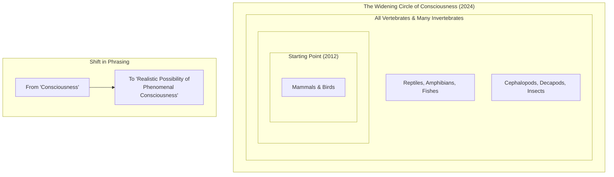

# Beyond Mammals: Why the New Consensus on Animal Consciousness Matters

In 2022, we saw researchers observe something surprising. In a special arena, bumblebees were seen repeatedly rolling small wooden balls, not for food, shelter, or any other clear survival reason. They did it even when they were full. The behavior was, for all practical purposes, play [[1]](https://www.scientificamerican.com/article/ball-rolling-bumble-bees-just-wanna-have-fun?ref=refind). This finding, that an insect might do something just for fun, is a powerful example of a wider shift in science, challenging what we thought we knew about the inner lives of animals.

This shift led to the 2024 New York Declaration on Animal Consciousness, a key document signed by a leading group of biologists, philosophers, and scientists [[2]](https://www.quantamagazine.org/insects-and-other-animals-have-consciousness-experts-declare-20240419). For a long time, we generally agreed that animals with brains like ours, such as great apes, have conscious experiences. But recent research has broadened this view. The new declaration makes this official, stating that there is a "realistic possibility" of conscious experience in all vertebrates and many invertebrates, including octopuses, crabs, and insects. The declaration states, in full:

> First, there is strong scientific support for attributions of conscious experience to other mammals and to birds.
>
> Second, the empirical evidence indicates at least a realistic possibility of conscious experience in all vertebrates (including reptiles, amphibians, and fishes) and many invertebrates (including, at minimum, cephalopod mollusks, decapod crustaceans, and insects).
>
> Third, when there is a realistic possibility of conscious experience in an animal, it is irresponsible to ignore that possibility in decisions affecting that animal. We should consider welfare risks and use the evidence to inform our responses to these risks [[3]](http://www.nydeclaration.com/).

The declaration was introduced on April 19, 2024, at a conference at New York University. It was led by philosophers Kristin Andrews, Jeff Sebo, and Jonathan Birch and signed by well-known researchers like neuroscientists Anil Seth and Christof Koch, zoologist Lars Chittka, and philosophers David Chalmers and Peter Godfrey-Smith [[2]](https://www.quantamagazine.org/insects-and-other-animals-have-consciousness-experts-declare-20240419).

The document focuses on the basic feeling of experience, not on more complex abilities like self-awareness. The philosopher Thomas Nagel famously described this idea in his 1974 essay by asking, “What is it like to be a bat?” [[4]](https://en.wikipedia.org/wiki/What_Is_It_Like_to_Be_a_Bat%3F). As Nagel wrote, “fundamentally an organism has conscious mental states if and only if there is something that it is like to *be* that organism” [[2]](https://www.quantamagazine.org/insects-and-other-animals-have-consciousness-experts-declare-20240419). If an animal can feel pain, pleasure, or hunger, it has this basic form of consciousness.

This is very different from today’s AI. While large language models can write impressive text, they do not show any of the behaviors or physical signs of subjective experience that we see in animals. As signatory Anil Seth points out, the declaration should encourage “an understanding and appreciation that we have much more in common with other animals than we do with things like ChatGPT” [[2]](https://www.quantamagazine.org/insects-and-other-animals-have-consciousness-experts-declare-20240419).

Image 1: A diagram showing the expanding scope of species considered for consciousness from the 2012 Cambridge Declaration to the 2024 New York Declaration.

The 2024 Declaration is the formal result of a fast-growing collection of behavioral evidence from the last 10 to 15 years. In the next section, we will look at that evidence in detail, explain why the scientific community decided to make a public statement, and break down the old arguments against widespread animal consciousness.

## A Growing Awareness

The New York Declaration was not a sudden event. It was built on a foundation of research over the last decade that has shown us the surprisingly rich inner lives of a wide range of animals.

This evidence includes several key findings that you should know about. **Octopuses** show behaviors that suggest they feel pain; after an injury, they clean the wound and learn to avoid places where they were harmed, a behavior confirmed in the "conditioned place preference" test [[5]](https://sites.google.com/nyu.edu/nydeclaration/background?authuser=0). **Cuttlefish** have shown a form of memory similar to our own, recalling the what, where, and when of past events. **Zebrafish** have passed versions of the mirror test, a classic sign of self-recognition, by trying to remove marks on their bodies that they can only see in a mirror [[5]](https://sites.google.com/nyu.edu/nydeclaration/background?authuser=0). **Bumblebees**, as we saw, engage in object play with wooden balls, a behavior that seems to be just for fun [[1]](https://www.scientificamerican.com/article/ball-rolling-bumble-bees-just-wanna-have-fun?ref=refind). **Fruit flies** have been found to have different active and quiet sleep patterns, which are affected by social isolation [[5]](https://sites.google.com/nyu.edu/nydeclaration/background?authuser=0). Finally, **crayfish** show anxiety-like behaviors when stressed, which are reduced by the same anti-anxiety drugs used in humans, like benzodiazepines [[5]](https://sites.google.com/nyu.edu/nydeclaration/background?authuser=0).

As this evidence grew, an informal agreement formed among scientists. The decision to create a public declaration was a deliberate one, meant to share this new understanding with policymakers and the public. As co-organizer Jeff Sebo said, the declaration is not meant to be the final word but “to point to where we think the field is now and where the field is headed” [[6]](https://www.theatlantic.com/science/archive/2024/04/animal-consciousness-declaration-new-york/678223).

This new declaration updates and expands on a previous milestone, the 2012 Cambridge Declaration on Consciousness. The 2012 document stated that mammals and birds have the "neurological substrates that generate consciousness" [[7]](https://www.animal-ethics.org/the-new-york-declaration-on-animal-consciousness-stresses-the-ethical-implications). The 2024 New York Declaration expands this circle to include all vertebrates and many invertebrates. It also uses more careful wording, referring to a "realistic possibility of conscious experience," which reflects a scientific position that avoids claiming total certainty [[2]](https://www.quantamagazine.org/insects-and-other-animals-have-consciousness-experts-declare-20240419). As Anil Seth noted, the new declaration "doesn’t try to do science by diktat, but rather emphasizes what we should take seriously" [[2]](https://www.quantamagazine.org/insects-and-other-animals-have-consciousness-experts-declare-20240419).

A long-held argument against widespread animal consciousness was the major difference in brain structure. We now see this is not a barrier. First, the total number of brain cells is not the only thing that matters for subjective experience. A bee’s brain has about 960,000 neurons compared to a human’s 86 billion, yet it supports complex behaviors like play and navigation [[8]](https://bionumbers.hms.harvard.edu/bionumber.aspx?s=n&v=0&id=109328), [[9]](https://www.theguardian.com/science/blog/2012/feb/28/how-many-neurons-human-brain). The complexity is in the dense network of connections, not just the number of cells. Also, nervous systems can be organized in very different ways. An octopus has a distributed nervous system, with about two-thirds of its 500 million neurons in its arms. A severed arm can continue to explore and react, showing that complex actions can happen without constant control from a central brain [[10]](https://petergodfreysmith.com/wp-content/uploads/2013/06/Cephalopods_PGS_PacConBio_2013.pdf).

Finally, the idea that a brain needs a part like the human cerebral cortex to be conscious has been disproven. As philosopher Kristin Andrews explains, different brain structures in birds, reptiles, and fish can do similar jobs [[2]](https://www.quantamagazine.org/insects-and-other-animals-have-consciousness-experts-declare-20240419). Peter Godfrey-Smith agrees, saying that behaviors that point to consciousness “can exist in an architecture that looks completely alien to vertebrate or human architecture” [[2]](https://www.quantamagazine.org/insects-and-other-animals-have-consciousness-experts-declare-20240419). The evidence has now shifted the default scientific view. This change brings new ethical duties and practical challenges, which we will explore next.

## Mindful Relations

When we accept that there is a realistic possibility of consciousness in more animals, it changes our ethical duties. The responsibility goes beyond just preventing pain. As Jeff Sebo says, "We also have to provide them with the kinds of enrichment and opportunities that allow them to express their instincts and explore their environments and engage in social systems and otherwise be the kinds of complex agents they are" [[6]](https://www.theatlantic.com/science/archive/2024/04/animal-consciousness-declaration-new-york/678223). This means we should create conditions for them to have positive experiences, not just avoid bad ones.

However, this idea creates real-world problems, especially with insects. Peter Godfrey-Smith points out that our relationship with some insects is "inevitably a somewhat antagonistic one." We cannot just "make peace with the mosquitoes" that carry diseases or the pests that eat our crops. Giving them moral consideration does not mean we stop all harm, but it forces us to make careful choices instead of acting without thinking [[2]](https://www.quantamagazine.org/insects-and-other-animals-have-consciousness-experts-declare-20240419).

This new understanding also shows a big gap in how we treat animals in labs. While mammals have strict rules for their care, huge numbers of insects like *Drosophila* (fruit flies) are used in experiments with almost no thought given to their potential to feel. As one consciousness researcher at the University of Pennsylvania who signed the declaration noted, “We think about the welfare of livestock and of mice in research, but we never think about the welfare of the insects” [[2]](https://www.quantamagazine.org/insects-and-other-animals-have-consciousness-experts-declare-20240419).

We have a clear example of how scientific agreement can lead to new laws. In the UK, the Animal Welfare (Sentience) Bill was updated in 2021 to include decapod crustaceans (like crabs and lobsters) and cephalopod mollusks (like octopuses) as sentient beings. This change happened after a report from the London School of Economics and Political Science found "strong scientific evidence" that they can feel pain [[11]](https://www.gov.uk/government/news/lobsters-octopus-and-crabs-recognised-as-sentient-beings). This sets a legal example for giving similar protections to other animals, including insects.

The fast changes in our understanding of animal minds also give us a reason to be careful with AI. While experts like Sebo think "current AI systems are very unlikely to be conscious," the story of animal consciousness teaches us to be humble when we look at future, more advanced systems [[2]](https://www.quantamagazine.org/insects-and-other-animals-have-consciousness-experts-declare-20240419). The same standards we are now using for animals will likely be used for machines one day.

To move forward, we need more research. The system for judging sentience in invertebrates often uses a set of eight criteria, including the ability to detect harm (nociception), learn from experience, and make trade-offs between different needs [[12]](https://forum.effectivealtruism.org/posts/yPDXXxdeK9cgCfLwj/short-research-summary-can-insects-feel-pain-a-review-of-the). Studies by researchers like Gibbons et al. (2022) have used these criteria to study different insect groups, finding strong evidence for learning from harmful events in flies, bees, and moths [[13]](https://chittkalab.sbcs.qmul.ac.uk/2022/Gibbons%20et%20al%202022%20Advances%20Insect%20Physiol.pdf). Other research has started to map the brain pathways for these signals in insects like *Drosophila* larvae, connecting them to parts of the brain used for learning and memory [[14]](https://www.cambridge.org/core/journals/canadian-entomologist/article/is-it-pain-if-it-does-not-hurt-on-the-unlikelihood-of-insect-pain/9A60617352A45B15E25307F85FF2E8F2).

Kristin Andrews suggests a practical next step. "All these nematode worms and fruit flies that are in almost every university—study consciousness in them," she says. "You already have them. Somebody in your lab is going to need a project. Make that project a consciousness project. Imagine that!" [[2]](https://www.quantamagazine.org/insects-and-other-animals-have-consciousness-experts-declare-20240419). By doing this, we can continue to learn more about the true scope of consciousness in the animal world.

## References

- [1] https://www.scientificamerican.com/article/ball-rolling-bumble-bees-just-wanna-have-fun?ref=refind
- [2] https://www.quantamagazine.org/insects-and-other-animals-have-consciousness-experts-declare-20240419
- [3] http://www.nydeclaration.com/
- [4] https://en.wikipedia.org/wiki/What_Is_It_Like_to_Be_a_Bat%3F
- [5] https://sites.google.com/nyu.edu/nydeclaration/background?authuser=0
- [6] https://www.theatlantic.com/science/archive/2024/04/animal-consciousness-declaration-new-york/678223
- [7] https://www.animal-ethics.org/the-new-york-declaration-on-animal-consciousness-stresses-the-ethical-implications
- [8] https://bionumbers.hms.harvard.edu/bionumber.aspx?s=n&v=0&id=109328
- [9] https://www.theguardian.com/science/blog/2012/feb/28/how-many-neurons-human-brain
- [10] https://petergodfreysmith.com/wp-content/uploads/2013/06/Cephalopods_PGS_PacConBio_2013.pdf
- [11] https://www.gov.uk/government/news/lobsters-octopus-and-crabs-recognised-as-sentient-beings
- [12] https://forum.effectivealtruism.org/posts/yPDXXxdeK9cgCfLwj/short-research-summary-can-insects-feel-pain-a-review-of-the
- [13] https://chittkalab.sbcs.qmul.ac.uk/2022/Gibbons%20et%20al%202022%20Advances%20Insect%20Physiol.pdf
- [14] https://www.cambridge.org/core/journals/canadian-entomologist/article/is-it-pain-if-it-does-not-hurt-on-the-unlikelihood-of-insect-pain/9A60617352A45B15E25307F85FF2E8F2