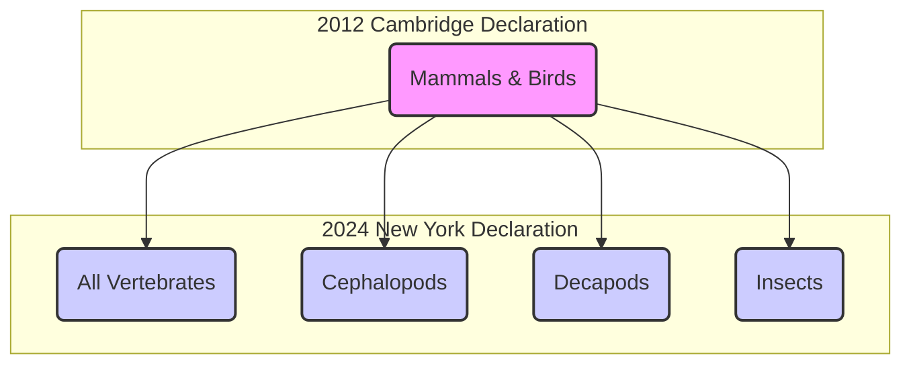

# A New Consensus on Animal Consciousness

As an AI engineer, you likely spend your days thinking about intelligence in terms of computation, algorithms, and emergent behavior. But you might not often talk about consciousness. In 2022, a study on bumblebees caught my attention. Researchers created an arena where bees could choose to interact with small wooden balls. They observed the bees rolling the balls repeatedly, an activity that had no connection to mating or survival, nor was it rewarded by the scientists. Younger bees were more playful, and the behavior was performed voluntarily, seemingly just for fun. This is a powerful reminder that complex inner states can exist in even the smallest of brains. It’s the kind of data point that forces you to update your priors [[1]](https://www.scientificamerican.com/article/ball-rolling-bumble-bees-just-wanna-have-fun?ref=refind), [[2]](https://www.theguardian.com/science/2022/oct/27/bumblebees-playing-wooden-balls-bees-study).

This finding is part of a wave of research that is reshaping the scientific consensus on animal minds. For decades, it has been broadly accepted that animals similar to humans, like other mammals and birds, are conscious. But recently, that consensus has expanded dramatically. This shift was formalized with the 2024 New York Declaration on Animal Consciousness, which states there is a "realistic possibility of conscious experience in all vertebrates... and many invertebrates (including, at minimum, cephalopod mollusks, decapod crustaceans, and insects)". The declaration deliberately uses the phrase “realistic possibility” to reflect scientific caution, but the message is clear: the evidence has shifted [[3]](http://www.nydeclaration.com/).

The declaration was unveiled on April 19, 2024, at a conference at New York University. It was spearheaded by a core group of philosophers—Kristin Andrews, Jeff Sebo, and Jonathan Birch—and signed by an initial group of 39 distinguished researchers. The list of signatories underscores the interdisciplinary nature of this new consensus, including neuroscientists like Anil Seth and Christof Koch, who study the biological basis of consciousness; psychologists like Irene Pepperberg, famous for her work on avian cognition; and philosophers like David Chalmers and Peter Godfrey-Smith, who have shaped the modern debate on mind and experience [[4]](https://www.quantamagazine.org/insects-and-other-animals-have-consciousness-experts-declare-20240419).

The document focuses specifically on phenomenal consciousness, the most basic form of subjective experience. This is what philosopher Thomas Nagel was getting at in his 1974 essay, "What Is It Like to Be a Bat?," when he argued that "an organism has conscious mental states if and only if there is something that it is like to *be* that organism". This is about raw feeling. It includes the capacity to experience sensations like pain, pleasure, and hunger, but does not necessarily imply higher-order capacities like self-awareness, introspection, or the kind of complex reasoning you might associate with human thought [[4]](https://www.quantamagazine.org/insects-and-other-animals-have-consciousness-experts-declare-20240419), [[5]](https://en.wikipedia.org/wiki/What_Is_It_Like_to_Be_a_Bat%3F).

This distinction is critical, especially for you in the AI field. While large language models can generate sophisticated text, they show none of the biological or behavioral signs of subjective experience seen in animals. They do not play, feel pain, or exhibit anxiety-like states that can be modulated by drugs. As neuroscientist Anil Seth put it, the declaration helps galvanize "an understanding and appreciation that we have much more in common with other animals than we do with things like ChatGPT". It’s a recognition of a shared biological heritage of feeling, something current silicon-based systems simply do not possess [[4]](https://www.quantamagazine.org/insects-and-other-animals-have-consciousness-experts-declare-20240419).

Image 1: A conceptual diagram illustrating the widening circle of species considered possibly conscious, from the 2012 Cambridge Declaration to the 2024 New York Declaration.

The 2024 Declaration didn't appear out of nowhere. It’s the formal culmination of over a decade of compelling behavioral evidence. In the next section, we’ll look at the specific studies that built this new consensus and dismantled the old arguments against widespread animal consciousness.

## A Growing Awareness

The New York Declaration was built on a foundation of compelling evidence gathered over the last 15 years. This research has revealed surprisingly rich inner lives in a wide range of animals, forcing a reconsideration of old assumptions.

This body of research includes several key findings. In 2021, cephalopod expert Robyn Crook adapted the "conditioned place preference" test for octopuses. After an injection of acetic acid in one chamber, octopuses developed a lasting aversion to it. When later given a local anesthetic in a different chamber, they developed a preference for that location, mirroring behavior in mammals that is interpreted as valuing pain relief. Cuttlefish have demonstrated a form of episodic-like memory, recalling not just what, where, and when a past event happened, but also how they experienced it. For instance, they could remember whether they saw or smelled a prey item [[7]](https://sites.google.com/nyu.edu/nydeclaration/background?authuser=0).

The evidence extends to fish and other invertebrates as well. Cleaner wrasse fish have passed a version of the mirror-mark test, a classic indicator of self-recognition. The test involves four phases: initial aggression towards the mirror, followed by unusual behaviors, then apparent self-study, and finally, attempting to remove a colored mark on their own body after seeing it in the reflection. Zebrafish have also shown signs of curiosity, voluntarily exploring new objects in their environment without any external reward. Bumblebees, as we've seen, engage in apparent play behavior with wooden balls. Fruit flies have been shown to have distinct "quiet" and "active" sleep phases, similar to slow-wave and REM sleep in humans, and their sleep patterns are disrupted by social isolation. Finally, crayfish exhibit "anxiety-like" states when exposed to electric shocks in a maze, becoming more averse to bright, open pathways. This stress-induced behavior is reversed by benzodiazepines, the same class of anti-anxiety drugs used in humans [[7]](https://sites.google.com/nyu.edu/nydeclaration/background?authuser=0).

As these findings mounted, an informal consensus grew among specialists. The decision to issue a public declaration was made to communicate this new understanding to policymakers, other scientists, and the public. Jeff Sebo, one of the declaration's organizers, explained that the document is not meant to be comprehensive but "to point to where we think the field is now and where the field is headed" [[6]](https://www.theatlantic.com/science/archive/2024/04/animal-consciousness-declaration-new-york/678223).

This new declaration builds upon and expands the 2012 Cambridge Declaration on Consciousness. The 2012 document asserted that non-human animals, including mammals and birds, possess the "neurological substrates that generate consciousness". The 2024 New York Declaration is both broader in scope and more precise in its language. It extends the circle of consideration to all vertebrates and many invertebrates while carefully framing the conclusion as a "realistic possibility of conscious experience," a nod to the inherent challenges of studying subjective states [[3]](http://www.nydeclaration.com/), [[4]](https://www.quantamagazine.org/insects-and-other-animals-have-consciousness-experts-declare-20240419). As octopus researcher Peter Godfrey-Smith notes, the complex, attentive behaviors of these animals make it "very hard not to think that there’s quite a lot going on inside them" [[4]](https://www.quantamagazine.org/insects-and-other-animals-have-consciousness-experts-declare-20240419).

However, the declaration is not without its critics. Neuroscientist Hakwan Lau, among others, has argued that the declaration overstates the evidence by conflating phenomenal consciousness—raw subjective feeling—with flexible, intelligent behavior. Lau points out that the two can dissociate, as seen in human conditions like blindsight, where patients can react to visual stimuli in their blind field without any subjective experience of seeing. In this view, none of the behavioral evidence cited, while impressive, unequivocally points to phenomenal consciousness rather than a non-conscious capacity to learn and react [[13]](https://www.thetransmitter.org/consciousness/premature-declarations-on-animal-consciousness-hinder-progress).

This objection has deep philosophical roots, dating back to René Descartes, who famously argued that animals were mere automata, complex machines without internal feeling [[14]](https://iapwa.org/the-animal-sentience-debate). For a long time, the primary argument against consciousness in these animals was their alien neuroanatomy. This objection is now seen as a failure of imagination. A bee's brain, for example, contains only about 960,000 neurons compared to a human's 86 billion, but its neural network is incredibly dense and complex enough to support sophisticated behaviors like play and navigation [[11]](https://bionumbers.hms.harvard.edu/bionumber.aspx?s=n&v=0&id=109328), [[12]](https://www.theguardian.com/science/blog/2012/feb/28/how-many-neurons-human-brain). The nervous system of an octopus presents a different model entirely. With two-thirds of its 500 million neurons located in its arms, it is highly distributed rather than centralized. A severed octopus arm can continue to explore and manipulate objects, showing that complex sensory-motor control can occur without a central "CEO" [[9]](https://petergodfreysmith.com/wp-content/uploads/2013/06/Cephalopods_PGS_PacConBio_2013.pdf).

Furthermore, the idea that a cerebral cortex is necessary for consciousness has been shown to be neurocentric. As Kristin Andrews points out, birds, reptiles, and fish have very different brain structures, yet "some of those brain structures, we’re finding, are doing the same kind of work that a cerebral cortex does in humans". Godfrey-Smith concurs, stating that behaviors indicative of consciousness "can exist in an architecture that looks completely alien to vertebrate or human architecture". The scientific default has shifted. The burden of proof is no longer on demonstrating consciousness but on justifying its absence. This shift brings with it a new set of ethical and practical considerations [[4]](https://www.quantamagazine.org/insects-and-other-animals-have-consciousness-experts-declare-20240419).

## Mindful Relations

Once you accept the realistic possibility of phenomenal consciousness in a wider range of animals, you have to reconsider your relationship with them. The ethical obligations now extend beyond simply preventing pain. As Jeff Sebo argues, we must also "provide them with the kinds of enrichment and opportunities that allow them to express their instincts and explore their environments and engage in social systems and otherwise be the kinds of complex agents they are". This principle of positive welfare is straightforward for some species, but it creates serious practical tensions with others [[6]](https://www.theatlantic.com/science/archive/2024/04/animal-consciousness-declaration-new-york/678223).

The human relationship with insects, for instance, is often "inevitably a somewhat antagonistic one," as Peter Godfrey-Smith notes. Humans rely on pesticides to protect crops and combat disease-carrying mosquitoes. The idea of making "peace with the mosquitoes" is far more complex than with fish or octopuses, forcing an explicit calculus of trade-offs rather than simple avoidance of harm [[4]](https://www.quantamagazine.org/insects-and-other-animals-have-consciousness-experts-declare-20240419).

This new understanding also exposes a significant welfare gap in the field of research. While lab mice are afforded certain protections, insects like *Drosophila* are used in vast numbers with little to no consideration for their potential to suffer. This highlights an ethical paradox: the very research that establishes consciousness, and thus the basis for welfare advocacy, can itself involve causing harm to sentient beings. As one signatory of the declaration pointed out, "we never think about the welfare of the insects" [[4]](https://www.quantamagazine.org/insects-and-other-animals-have-consciousness-experts-declare-20240419), [[15]](https://www.kimmela.org/2024/05/05/a-new-declaration-on-animal-consciousness). This is changing, but slowly.

The UK provides a legislative model for how scientific consensus can drive policy. In 2021, following a review by the London School of Economics that found strong evidence of sentience, the government amended its Animal Welfare (Sentience) Bill to include all decapod crustaceans (like crabs and lobsters) and cephalopod molluscs (like octopuses). This decision established a clear pathway from scientific evidence to legal protection, setting a precedent that could one day extend to insects [[8]](https://www.gov.uk/government/news/lobsters-octopus-and-crabs-recognised-as-sentient-beings).

The rapid evolution of our understanding of animal minds offers a cautionary lesson for you as an AI engineer. While Sebo and other experts agree that "current AI systems are very unlikely to be conscious," the animal literature demonstrates how quickly a consensus can shift in the face of new evidence. This suggests you should be humble about what you know as you develop increasingly complex AI agents. The study of invertebrates like octopuses is particularly instructive. Their intelligence and capacity for subjective experience evolved on a completely separate branch of the evolutionary tree from mammals. This forces researchers to identify the fundamental computational principles that support consciousness, rather than looking for specific, familiar brain structures. This same approach—looking for analogous processing, not analogous architecture—provides a more robust framework for evaluating potential sentience in future AI systems that will be architecturally alien [[4]](https://www.quantamagazine.org/insects-and-other-animals-have-consciousness-experts-declare-20240419), [[16]](https://undark.org/2023/07/14/interview-the-ethical-puzzle-of-sentient-ai).

To close the knowledge gaps, Kristin Andrews has called for a redirection of existing research infrastructure. "All these nematode worms and fruit flies that are in almost every university—study consciousness in them," she urges. "You already have them... Make that project a consciousness project". Such research could involve testing whether the neural activity in fruit flies correlates with mathematical structures proposed by theories of consciousness, such as Integrated Information Theory, when the flies exhibit complex behaviors like attentional selection. This would allow for a more systematic investigation into the scope and nature of consciousness across the animal kingdom [[4]](https://www.quantamagazine.org/insects-and-other-animals-have-consciousness-experts-declare-20240419), [[17]](https://journals.plos.org/ploscompbiol/article?id=10.1371%2Fjournal.pcbi.1008722).

This call is supported by an increasingly robust body of peer-reviewed work that goes beyond high-level declarations. For instance, a 2022 review by Gibbons et al. applied a framework of eight criteria for sentience to six major insect orders. They found "strong evidence for pain" in adult flies and cockroaches, which satisfied six of the eight criteria, including nociception, motivational trade-offs, and associative learning involving noxious stimuli. The study concluded there was "substantial evidence" for pain in bees, moths, and crickets as well. This research, which provides quantitative behavioral metrics, adds empirical weight to the philosophical and ethical arguments, demonstrating that the question of insect pain is not just a matter of speculation but a tractable scientific problem [[10]](https://chittkalab.sbcs.qmul.ac.uk/2022/Gibbons%20et%20al%202022%20Advances%20Insect%20Physiol.pdf).

## References

- [1] https://www.scientificamerican.com/article/ball-rolling-bumble-bees-just-wanna-have-fun?ref=refind
- [2] https://www.theguardian.com/science/2022/oct/27/bumblebees-playing-wooden-balls-bees-study
- [3] http://www.nydeclaration.com/
- [4] https://www.quantamagazine.org/insects-and-other-animals-have-consciousness-experts-declare-20240419
- [5] https://en.wikipedia.org/wiki/What_Is_It_Like_to_Be_a_Bat%3F
- [6] https://www.theatlantic.com/science/archive/2024/04/animal-consciousness-declaration-new-york/678223
- [7] https://sites.google.com/nyu.edu/nydeclaration/background?authuser=0
- [8] https://www.gov.uk/government/news/lobsters-octopus-and-crabs-recognised-as-sentient-beings
- [9] https://petergodfreysmith.com/wp-content/uploads/2013/06/Cephalopods_PGS_PacConBio_2013.pdf
- [10] https://chittkalab.sbcs.qmul.ac.uk/2022/Gibbons%20et%20al%202022%20Advances%20Insect%20Physiol.pdf
- [11] https://bionumbers.hms.harvard.edu/bionumber.aspx?s=n&v=0&id=109328
- [12] https://www.theguardian.com/science/blog/2012/feb/28/how-many-neurons-human-brain
- [13] https://www.thetransmitter.org/consciousness/premature-declarations-on-animal-consciousness-hinder-progress
- [14] https://iapwa.org/the-animal-sentience-debate
- [15] https://www.kimmela.org/2024/05/05/a-new-declaration-on-animal-consciousness
- [16] https://undark.org/2023/07/14/interview-the-ethical-puzzle-of-sentient-ai
- [17] https://journals.plos.org/ploscompbiol/article?id=10.1371%2Fjournal.pcbi.1008722
</article>