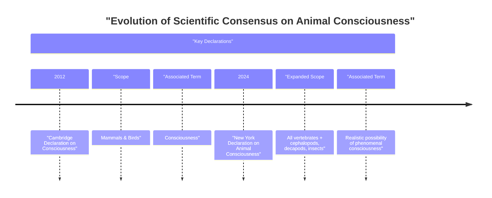

# A New Consensus on Animal Consciousness

In 2022, a study revealed something remarkable about bumblebees. When given small wooden balls in an arena, the bees pushed them around and rotated them, not for any reward or survival advantage, but apparently just for fun [[35]](https://www.scientificamerican.com/article/ball-rolling-bumble-bees-just-wanna-have-fun?ref=refind), [[36]](https://www.theguardian.com/science/2022/oct/27/bumblebees-playing-wooden-balls-bees-study). This behavior, so decoupled from the immediate pressures of foraging or mating, serves as a powerful example of the complex inner lives that can exist in even the smallest of brains. This finding is part of a growing body of research that has led to a major shift in scientific consensus.

For decades, scientists broadly agreed that animals similar to us, like other mammals and birds, experience consciousness. Recently, however, this consensus has expanded to include animals far more distant from humans on the evolutionary tree. This shift was formalized with the 2024 New York Declaration on Animal Consciousness, which states there is a "realistic possibility of conscious experience in all vertebrates... and many invertebrates (including, at minimum, cephalopod mollusks, decapod crustaceans, and insects)" [[2]](http://www.nydeclaration.com/). The declaration deliberately uses the phrase “realistic possibility” to reflect scientific caution while acknowledging where the evidence now points.

The declaration was unveiled on April 19, 2024, at a conference at New York University. It was spearheaded by philosophers Kristin Andrews, Jeff Sebo, and Jonathan Birch and signed by a distinguished group of 39 initial researchers, including neuroscientists Anil Seth and Christof Koch, and philosophers David Chalmers and Peter Godfrey-Smith [[1]](https://www.quantamagazine.org/insects-and-other-animals-have-consciousness-experts-declare-20240419).

The document focuses on phenomenal consciousness, the most basic form of subjective experience. This is what philosopher Thomas Nagel described in his 1974 essay, "What Is It Like to Be a Bat?," arguing that "an organism has conscious mental states if and only if there is something that it is like to *be* that organism" [[33]](https://en.wikipedia.org/wiki/What_Is_It_Like_to_Be_a_Bat%3F). This is about raw feeling—pain, pleasure, hunger—not higher-order capacities like self-awareness or complex reasoning [[1]](https://www.quantamagazine.org/insects-and-other-animals-have-consciousness-experts-declare-20240419).

This distinction is important. While large language models can produce sophisticated text, they lack the biological and behavioral indicators of subjective experience we see in animals. As neuroscientist Anil Seth noted, "we have much more in common with other animals than we do with things like ChatGPT" [[1]](https://www.quantamagazine.org/insects-and-other-animals-have-consciousness-experts-declare-20240419). The declaration is a formal recognition of this shared biological heritage of feeling.

Image 1: A conceptual timeline illustrating the evolution of scientific consensus on animal consciousness, contrasting the 2012 Cambridge Declaration with the 2024 New York Declaration.

The 2024 Declaration is the culmination of over a decade of accumulating behavioral evidence. The next section will examine that evidence, explain the field's move toward a public statement, and dismantle the old arguments against widespread animal consciousness.

## A Growing Awareness

The New York Declaration was not a sudden development but the result of a steady accumulation of evidence over the last 15 years, revealing surprisingly rich inner lives in a wide range of animals.

This body of research includes several key findings. In 2021, cephalopod expert Robyn Crook adapted the "conditioned place preference" test for octopuses. After an injection of acetic acid in one chamber, octopuses developed a lasting aversion to it. When later given a local anesthetic in a different chamber, they developed a preference for that location, mirroring behavior in mammals that we interpret as valuing pain relief [[4]](https://sites.google.com/nyu.edu/nydeclaration/background?authuser=0). Cuttlefish have demonstrated a form of episodic-like memory, recalling not just what, where, and when a past event happened, but also how they experienced it—for instance, whether they saw or smelled a prey item [[4]](https://sites.google.com/nyu.edu/nydeclaration/background?authuser=0).

The evidence extends to fish and invertebrates as well. Cleaner wrasse fish and zebrafish have passed versions of the mirror-mark test, a classic indicator of self-recognition. After seeing a colored mark on their bodies in a mirror, they attempt to scrape it off, suggesting an awareness of their own reflection [[4]](https://sites.google.com/nyu.edu/nydeclaration/background?authuser=0). Bumblebees, as mentioned, engage in apparent play behavior with wooden balls, an activity that seems to be intrinsically rewarding [[35]](https://www.scientificamerican.com/article/ball-rolling-bumble-bees-just-wanna-have-fun?ref=refind). Fruit flies have been shown to have distinct "quiet" and "active" sleep phases, similar to slow-wave and REM sleep in humans, and their sleep patterns are disrupted by social isolation [[4]](https://sites.google.com/nyu.edu/nydeclaration/background?authuser=0). Finally, crayfish exhibit "anxiety-like" states when exposed to electric shocks, becoming more averse to bright, open spaces. This stress-induced behavior is reversed by benzodiazepines, the same class of anti-anxiety drugs used in humans [[4]](https://sites.google.com/nyu.edu/nydeclaration/background?authuser=0).

As these findings mounted, an informal consensus grew among specialists. The decision to issue a public declaration was made to communicate this new understanding to policymakers, other scientists, and the public. Jeff Sebo, one of the declaration's organizers, explained that the document is not meant to be comprehensive but "to point to where we think the field is now and where the field is headed" [[17]](https://www.theatlantic.com/science/archive/2024/04/animal-consciousness-declaration-new-york/678223).

This new declaration builds upon and expands the 2012 Cambridge Declaration on Consciousness. The 2012 document asserted that non-human animals, including mammals and birds, possess the "neurological substrates that generate consciousness" [[1]](https://www.quantamagazine.org/insects-and-other-animals-have-consciousness-experts-declare-20240419). The 2024 New York Declaration is both broader in scope and more precise in its language. It extends the circle of consideration to all vertebrates and many invertebrates while carefully framing the conclusion as a "realistic possibility of conscious experience," a nod to the inherent challenges of studying subjective states [[2]](http://www.nydeclaration.com/). As octopus researcher Peter Godfrey-Smith notes, the complex, attentive behaviors of these animals make it "very hard not to think that there’s quite a lot going on inside them" [[1]](https://www.quantamagazine.org/insects-and-other-animals-have-consciousness-experts-declare-20240419).

However, the declaration is not without its critics. Neuroscientist Hakwan Lau, among others, has argued that the declaration overstates the evidence by conflating phenomenal consciousness—raw subjective feeling—with flexible, intelligent behavior. Lau points out that the two can dissociate, as seen in human conditions like blindsight, where patients can react to visual stimuli without any subjective experience of seeing. In this view, none of the behavioral evidence cited, while impressive, unequivocally points to phenomenal consciousness rather than a non-conscious capacity to learn and react [[52]](https://www.thetransmitter.org/consciousness/premature-declarations-on-animal-consciousness-hinder-progress).

This objection has deep philosophical roots, dating back to René Descartes, who famously argued that animals were mere automata, complex machines without internal feeling [[53]](https://iapwa.org/the-animal-sentience-debate). For a long time, the primary argument against consciousness in these animals was their alien neuroanatomy. This objection is now seen as a failure of imagination. A bee's brain, for example, contains only about 960,000 neurons compared to a human's 86 billion, but its neural network is incredibly dense and complex enough to support sophisticated behaviors like play and navigation [[40]](https://bionumbers.hms.harvard.edu/bionumber.aspx?s=n&v=0&id=109328), [[41]](https://www.theguardian.com/science/blog/2012/feb/28/how-many-neurons-human-brain). The nervous system of an octopus presents a different model entirely. With two-thirds of its 500 million neurons located in its arms, it is highly distributed rather than centralized. A severed octopus arm can continue to explore and manipulate objects, showing that complex sensory-motor control can occur without a central "CEO" [[50]](https://petergodfreysmith.com/wp-content/uploads/2013/06/Cephalopods_PGS_PacConBio_2013.pdf), [[15]](https://petergodfreysmith.com/wp-content/uploads/2013/06/Cephalopods_PGS_PacConBio_2013.pdf).

Furthermore, the idea that a cerebral cortex is necessary for consciousness has been shown to be neurocentric. As Kristin Andrews points out, birds, reptiles, and fish have very different brain structures, yet "some of those brain structures, we’re finding, are doing the same kind of work that a cerebral cortex does in humans" [[1]](https://www.quantamagazine.org/insects-and-other-animals-have-consciousness-experts-declare-20240419). Godfrey-Smith concurs, stating that behaviors indicative of consciousness "can exist in an architecture that looks completely alien to vertebrate or human architecture" [[1]](https://www.quantamagazine.org/insects-and-other-animals-have-consciousness-experts-declare-20240419). The scientific default has shifted; the burden of proof is no longer on demonstrating consciousness but on justifying its absence. This shift brings with it a new set of ethical and practical considerations.

## Mindful Relations

Accepting the realistic possibility of phenomenal consciousness in a wider range of animals forces us to reconsider our relationship with them. The ethical obligations now extend beyond simply preventing pain. As Jeff Sebo argues, we must also "provide them with the kinds of enrichment and opportunities that allow them to express their instincts and explore their environments and engage in social systems and otherwise be the kinds of complex agents they are" [[17]](https://www.theatlantic.com/science/archive/2024/04/animal-consciousness-declaration-new-york/678223). This principle of positive welfare is straightforward for some species, but creates practical tensions with others.

Our relationship with insects, for instance, is often "inevitably a somewhat antagonistic one," as Peter Godfrey-Smith notes [[1]](https://www.quantamagazine.org/insects-and-other-animals-have-consciousness-experts-declare-20240419). We rely on pesticides to protect crops and combat disease-carrying mosquitoes. The idea of making "peace with the mosquitoes" is far more complex than with fish or octopuses, forcing us into a difficult calculus of trade-offs rather than simple avoidance of harm [[1]](https://www.quantamagazine.org/insects-and-other-animals-have-consciousness-experts-declare-20240419).

This new understanding also exposes a significant welfare gap in scientific research. While lab mice are afforded certain protections, insects like *Drosophila* are used in vast numbers with little to no consideration for their potential to suffer. This highlights an ethical paradox: the very research that establishes consciousness, and thus the basis for welfare advocacy, can itself involve causing harm to sentient beings [[55]](https://www.kimmela.org/2024/05/05/a-new-declaration-on-animal-consciousness). As one signatory of the declaration pointed out, "we never think about the welfare of the insects" [[1]](https://www.quantamagazine.org/insects-and-other-animals-have-consciousness-experts-declare-20240419). This is changing, but slowly. The UK provides a legislative model for how scientific consensus can drive policy. In 2021, following a review by the London School of Economics that found strong evidence of sentience, the government amended its Animal Welfare (Sentience) Bill to include all decapod crustaceans and cephalopod molluscs [[5]](https://www.gov.uk/government/news/lobsters-octopus-and-crabs-recognised-as-sentient-beings). This decision established a clear pathway from scientific evidence to legal protection.

The rapid evolution of our understanding of animal minds offers a cautionary lesson for the field of AI. While Sebo and other experts agree that "current AI systems are very unlikely to be conscious," the animal literature demonstrates how quickly a consensus can shift in the face of new evidence [[1]](https://www.quantamagazine.org/insects-and-other-animals-have-consciousness-experts-declare-20240419). This counsels epistemic humility as we develop increasingly complex AI agents.

The study of invertebrates like octopuses is particularly instructive. Their intelligence and capacity for subjective experience evolved on a completely separate branch of the evolutionary tree from mammals. This forces researchers to identify the fundamental computational principles that support consciousness, rather than looking for specific, familiar brain structures. This same approach—looking for analogous processing, not analogous architecture—provides a more robust framework for evaluating potential sentience in future AI systems that will be architecturally alien to us [[54]](https://undark.org/2023/07/14/interview-the-ethical-puzzle-of-sentient-ai).

To close the knowledge gaps, Kristin Andrews has called for a redirection of existing research infrastructure. "All these nematode worms and fruit flies that are in almost every university—study consciousness in them," she urges. "You already have them... Make that project a consciousness project" [[1]](https://www.quantamagazine.org/insects-and-other-animals-have-consciousness-experts-declare-20240419). Such research could involve testing whether the neural activity in fruit flies correlates with mathematical structures proposed by theories of consciousness, such as Integrated Information Theory, when the flies exhibit complex behaviors like attentional selection [[56]](https://journals.plos.org/ploscompbiol/article?id=10.1371%2Fjournal.pcbi.1008722). This would allow for a more systematic investigation into the scope and nature of consciousness across the animal kingdom.

This call is supported by an increasingly robust body of peer-reviewed work that goes beyond high-level declarations. For instance, a 2022 review by Gibbons et al. applied a framework of eight criteria for sentience to six major insect orders. They found "strong evidence for pain" in adult flies and cockroaches, which satisfied six of the eight criteria, including nociception, motivational trade-offs, and associative learning involving noxious stimuli. The study concluded there was "substantial evidence" for pain in bees, moths, and crickets as well [[51]](https://chittkalab.sbcs.qmul.ac.uk/2022/Gibbons%20et%20al%202022%20Advances%20Insect%20Physiol.pdf). This research, which provides quantitative behavioral metrics, adds empirical weight to the philosophical and ethical arguments, demonstrating that the question of insect pain is not just a matter of speculation but a tractable scientific problem.

## References

- [1] https://www.quantamagazine.org/insects-and-other-animals-have-consciousness-experts-declare-20240419
- [2] http://www.nydeclaration.com/
- [3] https://www.animal-ethics.org/the-new-york-declaration-on-animal-consciousness-stresses-the-ethical-implications
- [4] https://sites.google.com/nyu.edu/nydeclaration/background?authuser=0
- [5] https://www.gov.uk/government/news/lobsters-octopus-and-crabs-recognised-as-sentient-beings
- [6] https://www.eurogroupforanimals.org/news/decapods-and-cephalopods-be-recognised-sentient-beings-under-uk-law
- [7] https://www.europenowjournal.org/2021/11/07/from-mules-to-cephalopods-animal-sentience-and-the-law
- [8] https://www.rvc.ac.uk/research/research-centres-and-facilities/rvc-animal-welfare-science-and-ethics/news/lobsters-octopus-and-crabs-recognised-as-sentient-beings-in-uk-law
- [9] https://qmro.qmul.ac.uk/xmlui/bitstream/123456789/84883/2/Revised%20Neural%20and%20Behavioural%20Indicators%20of%20Pain%20in%20Insects.pdf
- [10] https://chittkalab.sbcs.qmul.ac.uk/2022/Gibbons%20et%20al%202022%20Advances%20Insect%20Physiol.pdf
- [11] https://forum.effectivealtruism.org/posts/yPDXXxdeK9cgCfLwj/short-research-summary-can-insects-feel-pain-a-review-of-the
- [12] https://www.cambridge.org/core/journals/canadian-entomologist/article/is-it-pain-if-it-does-not-hurt-on-the-unlikelihood-of-insect-pain/9A60617352A45B15E25307F85FF2E8F2
- [13] https://rethinkpriorities.org/research-area/era-beyond-eisemann
- [14] https://www.interaliamag.org/articles/jasper-sharp-book-review-peter-godfrey-smith-minds-octopus-sea-deep-origins-consciousness
- [15] https://petergodfreysmith.com/wp-content/uploads/2013/06/Cephalopods_PGS_PacConBio_2013.pdf
- [16] https://www.scientificamerican.com/article/the-mind-of-an-octopus
- [17] https://www.theatlantic.com/science/archive/2024/04/animal-consciousness-declaration-new-york/678223
- [18] https://www.kimmela.org/2024/05/05/a-new-declaration-on-animal-consciousness
- [19] https://sites.google.com/nyu.edu/nydeclaration/declaration
- [20] https://www.youtube.com/watch?v=ak3WuQhtoW4
- [21] https://panworks.medium.com/should-and-can-declarations-on-animal-consciousness-do-better-8cda0ecc9735
- [22] https://www.multiverses.xyz/podcast/animal-minds-kristin-andrews-on-assuming-consciousness-in-other-species
- [23] https://mindmatters.ai/2023/12/can-the-simplest-animal-minds-explain-human-minds
- [24] https://www.gc.cuny.edu/people/kristin-andrews
- [25] https://millerlab.ca/labsite/docs/pubs/2025_Andrews.pdf
- [26] https://philpeople.org/profiles/kristin-andrews
- [27] https://www.thephilosopher1923.org/post/the-new-basics-animal
- [28] https://sarx.org.uk/articles/human-animal-relations/the-moral-circle-jeff-sebo
- [29] https://jeffsebo.net
- [30] https://utilitarianism.net/guest-essays/utilitarianism-and-nonhuman-animals
- [31] https://philpeople.org/profiles/jeff-sebo
- [32] https://ethics.org.au/ethics-explainer-what-is-it-like-to-be-a-bat
- [33] https://en.wikipedia.org/wiki/What_Is_It_Like_to_Be_a_Bat%3F
- [34] https://www.cs.ox.ac.uk/activities/ieg/e-library/sources/nagel_bat.pdf
- [35] https://www.scientificamerican.com/article/ball-rolling-bumble-bees-just-wanna-have-fun?ref=refind
- [36] https://www.theguardian.com/science/2022/oct/27/bumblebees-playing-wooden-balls-bees-study
- [37] https://www.psychologytoday.com/us/blog/animal-emotions/202211/bumble-bees-play-balls-and-may-even-enjoy-it
- [38] https://www.sciencejournalforkids.org/wp-content/uploads/2024/04/bees-play_article.pdf
- [39] https://www.nationalgeographic.com/animals/article/bees-can-play-study-shows-bumblebees-insect-intelligence
- [40] https://bionumbers.hms.harvard.edu/bionumber.aspx?s=n&v=0&id=109328
- [41] https://www.theguardian.com/science/blog/2012/feb/28/how-many-neurons-human-brain
- [42] https://pmc.ncbi.nlm.nih.gov/articles/PMC2776484
- [43] https://medicine.yale.edu/lab/colon-ramos/overview
- [44] https://www.psychiatry.wisc.edu/courses/Nitschke/seminar/Lent_EurJNS2011_HowManyNeurons_DogmasofQuantNS-Revised.pdf
- [45] https://forum.effectivealtruism.org/posts/gcMdxLKTgeKty2eoa/shrimp-sentience-research-a-prioritization-guide
- [46] https://www.janelia.org/project-team/flylight/protocols
- [47] https://elifesciences.org/for-the-press/826a3986/new-drosophila-analysis-tool-opens-up-neuroscience-research-to-resource-limited-settings
- [48] http://brain.harvard.edu/hbi_news/new-insects-in-neuroscience
- [49] http://quality4lab.igb.cnr.it/en/guidelines/research-activities/guideline-raising-drosophila-melanogaster-in-the-laboratory
- [50] https://petergodfreysmith.com/wp-content/uploads/2013/06/Cephalopods_PGS_PacConBio_2013.pdf
- [51] https://chittkalab.sbcs.qmul.ac.uk/2022/Gibbons%20et%20al%202022%20Advances%20Insect%20Physiol.pdf
- [52] https://www.thetransmitter.org/consciousness/premature-declarations-on-animal-consciousness-hinder-progress
- [53] https://iapwa.org/the-animal-sentience-debate
- [54] https://undark.org/2023/07/14/interview-the-ethical-puzzle-of-sentient-ai
- [55] https://www.kimmela.org/2024/05/05/a-new-declaration-on-animal-consciousness
- [56] https://journals.plos.org/ploscompbiol/article?id=10.1371%2Fjournal.pcbi.1008722