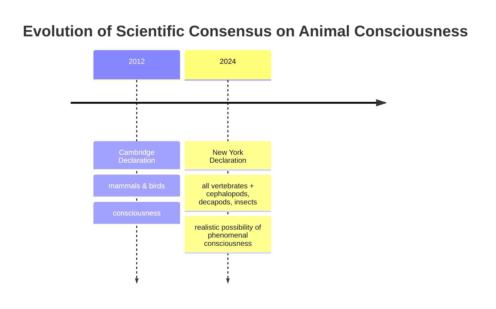

As an AI engineer, you might get caught up in the race to build more capable systems, sometimes forgetting to ask fundamental questions about the nature of intelligence and experience. You debate whether LLMs can "think" or "feel," but these discussions often lack a solid grounding. That is why a recent development in biology is so important for our field. In 2022, researchers observed bumblebees repeatedly rolling small wooden balls, apparently just for fun, with no connection to survival or reward [[35]](https://www.scientificamerican.com/article/ball-rolling-bumble-bees-just-wanna-have-fun?ref=refind), [[36]](https://www.theguardian.com/science/2022/oct/27/bumblebees-playing-wooden-balls-bees-study). This finding, published in *Animal Behaviour*, is a powerful reminder that complex inner states can arise from seemingly simple hardware [[37]](https://www.psychologytoday.com/us/blog/animal-emotions/202211/bumble-bees-play-balls-and-may-even-enjoy-it).

This discovery is part of a wave of research that has reshaped our understanding of animal minds. For decades, a broad scientific consensus held that animals similar to us, like great apes, have conscious experiences. However, recent years have seen a growing acknowledgment that consciousness may be widespread among animals very different from us. This shift was formalized on April 19, 2024, with the release of the New York Declaration on Animal Consciousness [[1]](https://www.quantamagazine.org/insects-and-other-animals-have-consciousness-experts-declare-20240419).

The declaration’s core claim is that “the empirical evidence indicates at least a realistic possibility of conscious experience in all vertebrates (including all reptiles, amphibians and fishes) and many invertebrates (including, at minimum, cephalopod mollusks, decapod crustaceans and insects)” [[19]](http://www.nydeclaration.com/). It deliberately uses the phrase “realistic possibility” to reflect scientific caution while still marking a profound shift in perspective. The declaration's background materials clarify this choice of words, arguing that while "proof" is impossible, the evidence should be treated like symptoms of a disease: they don't prove you have it, but they make it more likely and warrant a response [[47]](https://sites.google.com/nyu.edu/nydeclaration/background).
Image 1: A bumblebee, tagged for research, interacts with colored wooden balls in an experimental setting. (Source https://www.quantamagazine.org/insects-and-other-animals-have-consciousness-experts-declare-20240419)

Unveiled at New York University, the declaration was spearheaded by philosophers Kristin Andrews, Jeff Sebo, and Jonathan Birch. It was signed by 39 leading researchers, including neuroscientists Anil Seth and Christof Koch, zoologist Lars Chittka, and philosophers David Chalmers and Peter Godfrey-Smith, creating a strong interdisciplinary consensus [[1]](https://www.quantamagazine.org/insects-and-other-animals-have-consciousness-experts-declare-20240419).
Image 2: Jonathan Birch, Kristin Andrews, and Jeff Sebo, the organizers of the New York Declaration on Animal Consciousness. (Source https://www.quantamagazine.org/insects-and-other-animals-have-consciousness-experts-declare-20240419)

The document focuses on phenomenal consciousness, the basic capacity for subjective experience. This is what philosopher Thomas Nagel, in his 1974 essay, famously described as the idea that “fundamentally an organism has conscious mental states if and only if there is something that it is like to *be* that organism” [[1]](https://www.quantamagazine.org/insects-and-other-animals-have-consciousness-experts-declare-20240419), [[33]](https://en.wikipedia.org/wiki/What_Is_It_Like_to_Be_a_Bat%3F). This is about raw feeling, not complex self-awareness or metacognition. This distinction is critical. It draws a sharp line between the subjective experience found in the animal kingdom and the linguistic performance of today's AI. As signatory Anil Seth states, "we have much more in common with other animals than we do with things like ChatGPT” [[1]](https://www.quantamagazine.org/insects-and-other-animals-have-consciousness-experts-declare-20240419).

Image 3: A timeline illustrating the evolution of scientific consensus on animal consciousness.

The 2024 Declaration is the formal culmination of over a decade of behavioral evidence that has steadily dismantled old assumptions. For you as an engineer, this story is a case study in how an entire field can update its priors based on new data. The next section examines that evidence, explains the shift to a public declaration, and deconstructs the old neural-complexity barrier.

## A Growing Awareness

The New York Declaration was built on a foundation of striking research from the last 15 years, revealing rich inner lives in a wide range of animals. This evidence forced a re-evaluation of what it takes to be conscious, a process that holds lessons for how you evaluate intelligence in your own artificial systems.

### A Decade of Behavioral Evidence

Scientists have documented complex behaviors that are difficult to explain as mere reflexes. In a key 2021 study, octopuses demonstrated they experience pain by participating in a "conditioned place preference" test. After an injection of acetic acid in one chamber, they developed a lasting aversion to it. When later given an anesthetic in a different chamber, they developed a preference for that location, suggesting the drug provided relief from a negative subjective state [[47]](https://sites.google.com/nyu.edu/nydeclaration/background).

Other studies have revealed sophisticated cognitive abilities. Cuttlefish can remember the "what, where, and when" of specific past events, a form of episodic-like memory. They can even recall how they experienced an item—whether they saw it or smelled it—a capacity known as "source memory" [[47]](https://sites.google.com/nyu.edu/nydeclaration/background). Zebrafish have passed versions of the mirror test, an indicator of self-recognition. After being marked, they see their reflection and attempt to scrape the mark off on a nearby surface. They also show curiosity, exploring new objects without any external reward [[47]](https://sites.google.com/nyu.edu/nydeclaration/background).

The evidence extends deep into the invertebrate world. Bumblebees engage in object play, rolling wooden balls for no apparent reason other than enjoyment [[35]](https://www.scientificamerican.com/article/ball-rolling-bumble-bees-just-wanna-have-fun?ref=refind). Fruit flies have distinct "active" and "quiet" sleep patterns, similar to REM and slow-wave sleep in humans, and their sleep is disrupted by social isolation [[47]](https://sites.google.com/nyu.edu/nydeclaration/background). And crayfish display anxiety-like states—becoming more averse to bright, open spaces after being exposed to stress—that can be reversed with the same anti-anxiety drugs used in people [[1]](https://www.quantamagazine.org/insects-and-other-animals-have-consciousness-experts-declare-20240419).
Image 4: A grid showing a crayfish, octopus, zebrafish, and garter snake, all of which have demonstrated behaviors indicative of complex inner states. (Source https://www.quantamagazine.org/insects-and-other-animals-have-consciousness-experts-declare-20240419)

### From Lab Bench to Public Declaration

As this evidence mounted, an informal consensus began to form among specialists. The move to a public declaration was a deliberate step to communicate this new understanding to a wider audience. As organizer Jeff Sebo explains, the declaration is not meant to be comprehensive but rather “to point to where we think the field is now and where the field is headed” [[17]](https://www.theatlantic.com/science/archive/2024/04/animal-consciousness-declaration-new-york/678223). The goal was to ensure that policymakers, funding agencies, and other scientists were aware of the shift. While this behavioral evidence is compelling, some critics caution that it could be interpreted as complex but unconscious programmed responses, similar to how a sophisticated algorithm might operate without any inner experience [[51]](https://www.animal-ethics.org/invertebrate-sentience-a-review-of-the-neuroscientific-literature).

### A More Cautious Consensus

This new consensus updates and expands a previous milestone, the 2012 Cambridge Declaration on Consciousness. That document asserted that mammals and birds possess the "neurological substrates that generate consciousness" [[3]](https://www.animal-ethics.org/the-new-york-declaration-on-animal-consciousness-stresses-the-ethical-implications). The 2024 New York Declaration is both broader in scope and more nuanced in its language. It extends the circle of consideration to all vertebrates and many invertebrates and carefully frames the conclusion as a "realistic possibility of phenomenal consciousness" rather than a certainty [[19]](http://www.nydeclaration.com/). This reflects a mature scientific perspective that acknowledges uncertainty while still recognizing the weight of evidence. As Peter Godfrey-Smith notes, the complex behaviors of octopuses make it "very hard not to think that there’s quite a lot going on inside them" [[1]](https://www.quantamagazine.org/insects-and-other-animals-have-consciousness-experts-declare-20240419).

### Rethinking the Hardware of the Mind

For a long time, the primary argument against consciousness in invertebrates was their alien neuroanatomy. This barrier is now crumbling. One objection was neuron count. A bee’s brain has around 960,000 neurons, a tiny fraction of the 86 billion in a human brain [[40]](https://bionumbers.hms.harvard.edu/bionumber.aspx?s=n&v=0&id=109328), [[41]](https://www.theguardian.com/science/blog/2012/feb/28/how-many-neurons-human-brain). However, raw numbers are misleading. Each bee neuron can be incredibly complex, forming a dense network where a single neuron may contact 10,000 to 100,000 others, allowing for sophisticated behaviors [[1]](https://www.quantamagazine.org/insects-and-other-animals-have-consciousness-experts-declare-20240419).
Image 5: A macro photograph of a bee's head, showing its large compound eyes and antennae. (Source https://i.imgur.com/x0mQvC4.jpeg)

Another objection was the lack of a centralized brain. The octopus provides a powerful counterexample. Its nervous system is highly distributed, with two-thirds of its 500 million neurons located in its arms [[15]](https://petergodfreysmith.com/wp-content/uploads/2013/06/Cephalopods_PGS_PacConBio_2013.pdf). Godfrey-Smith compares this to an orchestra where the players are "jazz players, inclined to improvisation" [[14]](https://www.interaliamag.org/articles/jasper-sharp-book-review-peter-godfrey-smith-minds-octopus-sea-deep-origins-consciousness). A severed arm can continue to perform complex actions on its own, demonstrating that sophisticated processing can occur without a single control center.

Finally, the absence of a cerebral cortex was seen as a deal-breaker. We now know this is a neurocentric bias. As Kristin Andrews points out, birds, reptiles, and fish have different brain structures that perform analogous functions [[23]](https://mindmatters.ai/2023/12/can-the-simplest-animal-minds-explain-human-minds). Peter Godfrey-Smith agrees, noting that consciousness “can exist in an architecture that looks completely alien” to our own [[1]](https://www.quantamagazine.org/insects-and-other-animals-have-consciousness-experts-declare-20240419). Evolution has found multiple, independent paths to subjective experience. With the old arguments dismantled, the focus shifts to the ethical and practical consequences.

## Mindful Relations

For engineers, the shift in scientific consensus on animal consciousness is not just an academic curiosity. It is a preview of the ethical landscape you will have to navigate as AI systems become more autonomous. Accepting the realistic possibility of phenomenal consciousness in animals forces us to reconsider our relationship with them, moving from simple harm-avoidance to more complex considerations of welfare.

### New Ethical Obligations

The ethical obligations extend beyond preventing pain. As Jeff Sebo argues, we also need to provide animals "with the kinds of enrichment and opportunities that allow them to express their instincts and explore their environments and engage in social systems and otherwise be the kinds of complex agents they are" [[17]](https://www.theatlantic.com/science/archive/2024/04/animal-consciousness-declaration-new-york/678223). This means creating conditions for positive welfare, a much higher bar than simply minimizing suffering. This perspective challenges us to think about our moral duties to all animals, recognizing that human activities like industrial farming and habitat destruction cause immense suffering to trillions of individuals annually [[27]](https://www.thephilosopher1923.org/post/the-new-basics-animal).

### Practical Tensions and Trade-Offs

This raises practical tensions, especially with insects. Our relationship with many insect species is "inevitably a somewhat antagonistic one," as Peter Godfrey-Smith puts it [[1]](https://www.quantamagazine.org/insects-and-other-animals-have-consciousness-experts-declare-20240419). We compete with them for crops, and they can be vectors for disease. This reality requires explicit trade-offs rather than a simple policy of non-harm, a type of complex ethical calculation that will become more common in AI safety.

### The Welfare Gap in the Lab

A significant welfare gap also exists in laboratory research. While mammals are protected by strict protocols, millions of insects like *Drosophila* are used in experiments with little to no consideration for their potential to suffer. As one researcher who signed the declaration noted, “We think about the welfare of livestock and of mice in research, but we never think about the welfare of the insects” [[1]](https://www.quantamagazine.org/insects-and-other-animals-have-consciousness-experts-declare-20240419). This gap highlights an inconsistency in our ethical standards that the new declaration seeks to address.

### From Science to Policy: A UK Precedent

Policy is slowly catching up to the science. The UK's Animal Welfare (Sentience) Bill provides a powerful precedent. In 2021, it was amended to include decapod crustaceans and cephalopod mollusks as sentient beings, based on a scientific review from the London School of Economics [[5]](https://www.gov.uk/government/news/lobsters-octopus-and-crabs-recognised-as-sentient-beings). The law established an Animal Sentience Committee to ensure their welfare is considered in future policymaking. This shows a clear pathway for evidence to translate into law, a model that could one day apply to advanced AI.
Image 6: A sign for the UK's Department for Environment Food & Rural Affairs (Defra). (Source https://i.imgur.com/u10hT7K.jpeg)

### A Cautionary Tale for AI

The rapid evolution of our understanding of animal minds offers a cautionary tale for AI. While experts like Sebo believe that "current AI systems are very unlikely to be conscious," he adds that what he has learned about animal minds "does give me pause and makes me want to approach the topic with caution and humility" [[1]](https://www.quantamagazine.org/insects-and-other-animals-have-consciousness-experts-declare-20240419). The history of underestimating non-human intelligence should make us wary of premature claims about the inner lives of artificial agents. Biases like speciesism could easily be mirrored by "substratism," a prejudice against non-biological forms of intelligence [[86]](https://nycfoodresearchco.org/wp-content/uploads/2025/07/What-will-society-think-about-AI-consciousness-CellPress-2025.pdf).

### The Future of Consciousness Research

The path forward is more research. Kristin Andrews has called for scientists to leverage existing lab infrastructure. "You already have them," she says of the fruit flies and nematode worms in labs worldwide. "Somebody in your lab is going to need a project. Make that project a consciousness project. Imagine that!" [[1]](https://www.quantamagazine.org/insects-and-other-animals-have-consciousness-experts-declare-20240419).

This call is already being answered. A 2022 review by Matilda Gibbons, Lars Chittka, and others applied a rigorous eight-criteria framework to assess the evidence for pain in insects [[46]](https://chittkalab.sbcs.qmul.ac.uk/2022/Gibbons%20et%20al%202022%20Advances%20Insect%20Physiol.pdf). This framework moves beyond simple observation to look for specific neural and behavioral markers, including nociceptors, integrated brain regions, modulation by analgesics, motivational trade-offs, flexible self-protection, and associative learning involving noxious stimuli [[11]](https://forum.effectivealtruism.org/posts/yPDXXxdeK9cgCfLwj/short-research-summary-can-insects-feel-pain-a-review-of-the).

Their findings were striking: adult flies (*Diptera*) and cockroaches (*Blattodea*) met six of the eight criteria, constituting "strong evidence for pain." Bees, wasps, and ants (*Hymenoptera*), along with moths (*Lepidoptera*) and crickets (*Orthoptera*), met three to four criteria, representing "substantial evidence." The science is moving from broad declarations to detailed, species-specific investigation, building a new and more expansive picture of the animal mind. For AI engineers, this is a field to watch.

## References

- [1]  https://www.quantamagazine.org/insects-and-other-animals-have-consciousness-experts-declare-20240419
- [2]  https://www.theatlantic.com/science/archive/2024/04/animal-consciousness-declaration-new-york/678223
- [3]  https://www.animal-ethics.org/the-new-york-declaration-on-animal-consciousness-stresses-the-ethical-implications
- [4]  https://www.kimmela.org/2024/05/05/a-new-declaration-on-animal-consciousness
- [5]  https://www.gov.uk/government/news/lobsters-octopus-and-crabs-recognised-as-sentient-beings
- [6]  https://www.eurogroupforanimals.org/news/decapods-and-cephalopods-be-recognised-sentient-beings-under-uk-law
- [7]  https://www.europenowjournal.org/2021/11/07/from-mules-to-cephalopods-animal-sentience-and-the-law
- [8]  https://www.rvc.ac.uk/research/research-centres-and-facilities/rvc-animal-welfare-science-and-ethics/news/lobsters-octopus-and-crabs-recognised-as-sentient-beings-in-uk-law
- [9]  https://qmro.qmul.ac.uk/xmlui/bitstream/123456789/84883/2/Revised%20Neural%20and%20Behavioural%20Indicators%20of%20Pain%20in%20Insects.pdf
- [10]  https://chittkalab.sbcs.qmul.ac.uk/2022/Gibbons%20et%20al%202022%20Advances%20Insect%20Physiol.pdf
- [11]  https://forum.effectivealtruism.org/posts/yPDXXxdeK9cgCfLwj/short-research-summary-can-insects-feel-pain-a-review-of-the
- [12]  https://www.cambridge.org/core/journals/canadian-entomologist/article/is-it-pain-if-it-does-not-hurt-on-the-unlikelihood-of-insect-pain/9A60617352A45B15E25307F85FF2E8F2
- [13]  https://rethinkpriorities.org/research-area/era-beyond-eisemann
- [14]  https://www.interaliamag.org/articles/jasper-sharp-book-review-peter-godfrey-smith-minds-octopus-sea-deep-origins-consciousness
- [15]  https://petergodfreysmith.com/wp-content/uploads/2013/06/Cephalopods_PGS_PacConBio_2013.pdf
- [16]  https://www.scientificamerican.com/article/the-mind-of-an-octopus
- [17]  https://www.theatlantic.com/science/archive/2024/04/animal-consciousness-declaration-new-york/678223
- [18]  https://www.kimmela.org/2024/05/05/a-new-declaration-on-animal-consciousness
- [19]  https://sites.google.com/nyu.edu/nydeclaration/declaration
- [20]  http://www.nydeclaration.com/
- [21]  https://panworks.medium.com/should-and-can-declarations-on-animal-consciousness-do-better-8cda0ecc9735
- [22]  https://www.multiverses.xyz/podcast/animal-minds-kristin-andrews-on-assuming-consciousness-in-other-species
- [23]  https://mindmatters.ai/2023/12/can-the-simplest-animal-minds-explain-human-minds
- [24]  https://www.gc.cuny.edu/people/kristin-andrews
- [25]  https://millerlab.ca/labsite/docs/pubs/2025_Andrews.pdf
- [26]  https://philpeople.org/profiles/kristin-andrews
- [27]  https://www.thephilosopher1923.org/post/the-new-basics-animal
- [28]  https://sarx.org.uk/articles/human-animal-relations/the-moral-circle-jeff-sebo
- [29]  https://jeffsebo.net
- [30]  https://utilitarianism.net/guest-essays/utilitarianism-and-nonhuman-animals
- [31]  https://philpeople.org/profiles/jeff-sebo
- [32]  https://ethics.org.au/ethics-explainer-what-is-it-like-to-be-a-bat
- [33]  https://en.wikipedia.org/wiki/What_Is_It_Like_to_Be_a_Bat%3F
- [34]  https://www.cs.ox.ac.uk/activities/ieg/e-library/sources/nagel_bat.pdf
- [35]  https://www.scientificamerican.com/article/ball-rolling-bumble-bees-just-wanna-have-fun?ref=refind
- [36]  https://www.theguardian.com/science/2022/oct/27/bumblebees-playing-wooden-balls-bees-study
- [37]  https://www.psychologytoday.com/us/blog/animal-emotions/202211/bumble-bees-play-balls-and-may-even-enjoy-it
- [38]  https://www.sciencejournalforkids.org/wp-content/uploads/2024/04/bees-play_article.pdf
- [39]  https://www.nationalgeographic.com/animals/article/bees-can-play-study-shows-bumblebees-insect-intelligence
- [40]  https://bionumbers.hms.harvard.edu/bionumber.aspx?s=n&v=0&id=109328
- [41]  https://www.theguardian.com/science/blog/2012/feb/28/how-many-neurons-human-brain
- [42]  https://pmc.ncbi.nlm.nih.gov/articles/PMC2776484
- [43]  https://sites.google.com/nyu.edu/nydeclaration/background?authuser=0
- [44]  https://www.psychiatry.wisc.edu/courses/Nitschke/seminar/Lent_EurJNS2011_HowManyNeurons_DogmasofQuantNS-Revised.pdf
- [45]  https://forum.effectivealtruism.org/posts/gcMdxLKTgeKty2eoa/shrimp-sentience-research-a-prioritization-guide
- [46]  https://chittkalab.sbcs.qmul.ac.uk/2022/Gibbons%20et%20al%202022%20Advances%20Insect%20Physiol.pdf
- [47]  https://sites.google.com/nyu.edu/nydeclaration/background
- [48]  https://www.thetransmitter.org/consciousness/premature-declarations-on-animal-consciousness-hinder-progress
- [49]  https://www.animal-ethics.org/invertebrate-sentience-a-review-of-the-neuroscientific-literature
- [50]  https://www.animal-ethics.org/invertebrate-sentience-a-review-of-the-behavioral-evidence
- [51]  https://forum.effectivealtruism.org/posts/5FesXkhArfEXF47mn/interview-with-jon-mallatt-about-invertebrate-consciousness
- [52]  https://pmc.ncbi.nlm.nih.gov/articles/PMC6842945
- [53]  https://mbi-prh.s3.ap-south-1.amazonaws.com/2024/Sep/27-Sep-24/UPJOZ_3724/Revised-ms_UPJOZ_3724_v2.pdf
- [54]  https://worldanimaljustice.org/justice-for-aquatic-invertebrates
- [55]  https://www.congress.gov/crs-product/R47179
- [56]  https://theconversation.com/are-animals-and-ai-conscious-weve-devised-new-theories-for-how-to-test-this-269803
- [57]  https://plato.stanford.edu/archives/fall2018/entries/consciousness-animal
- [58]  https://iep.utm.edu/consciousness
- [59]  https://en.wikipedia.org/wiki/Hard_problem_of_consciousness
- [60]  https://www.nal.usda.gov/animal-health-and-welfare/animal-welfare-act
- [61]  https://research.wayne.edu/iacuc/useofinvertebrateanimalsinresearchteachingandtesting
- [62]  https://www.sci.news/biology/plant-consciousness-07359.html
- [63]  https://pmc.ncbi.nlm.nih.gov/articles/PMC7612530
- [64]  https://news.ucsc.edu/2019/07/plant-consciousness
- [65]  https://forum.effectivealtruism.org/posts/T5fSphiK6sQ6hyptX/opinion-estimating-invertebrate-sentience
- [66]  https://link.springer.com/article/10.1007/s11948-025-00578-5
- [67]  https://nycfoodresearchco.org/wp-content/uploads/2025/07/What-will-society-think-about-AI-consciousness-CellPress-2025.pdf
- [68]  https://eprints.lse.ac.uk/128777/1/PIIS1364661325001470.pdf