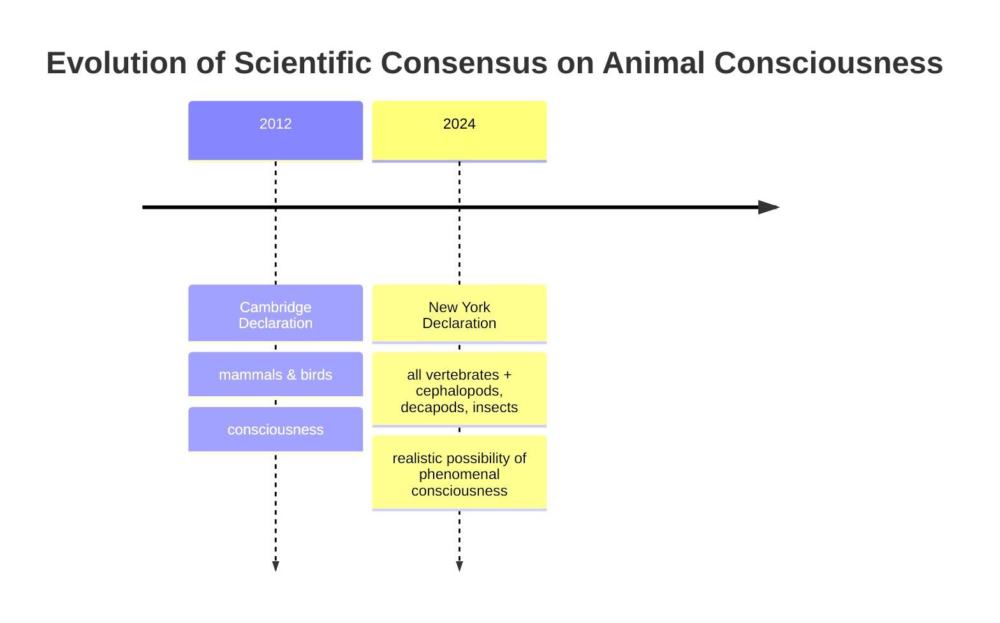

# Beyond Birds and Mammals: A New Consensus on Animal Consciousness

In 2022, researchers observed bumblebees doing something remarkable. In a dedicated arena, with no reward or survival pressure, the bees repeatedly rolled small wooden balls. This behavior, seemingly done just for fun, was decoupled from the usual drives of foraging or mating [[35]](https://www.scientificamerican.com/article/ball-rolling-bumble-bees-just-wanna-have-fun?ref=refind), [[36]](https://www.theguardian.com/science/2022/oct/27/bumblebees-playing-wooden-balls-bees-study). It served as a powerful example that complex affective states might exist in even the tiniest of brains [[37]](https://www.psychologytoday.com/us/blog/animal-emotions/202211/bumble-bees-play-balls-and-may-even-enjoy-it). This finding is part of a wave of research that has reshaped our understanding of animal minds.

For decades, a broad scientific consensus held that animals similar to us, like great apes, have conscious experiences. However, recent years have seen a growing acknowledgment that consciousness may be widespread among animals very different from us. This shift was formalized on April 19, 2024, with the release of the New York Declaration on Animal Consciousness [[1]](https://www.quantamagazine.org/insects-and-other-animals-have-consciousness-experts-declare-20240419). The declaration’s core claim is that “the empirical evidence indicates at least a realistic possibility of conscious experience in all vertebrates (including all reptiles, amphibians and fishes) and many invertebrates (including, at minimum, cephalopod mollusks, decapod crustaceans and insects)” [[19]](http://www.nydeclaration.com/). It deliberately uses the phrase “realistic possibility” to reflect scientific caution while still marking a significant change in perspective.

The declaration's background materials clarify this choice of words, arguing that while "proof" is impossible given the ongoing debates about consciousness, the evidence should be treated like symptoms of a disease. The symptoms don't prove you have the disease, but they make it more likely and warrant a response [[47]](https://sites.google.com/nyu.edu/nydeclaration/background).

The declaration was unveiled at a conference at New York University and was spearheaded by philosophers Kristin Andrews, Jeff Sebo, and Jonathan Birch. It was signed by a diverse group of 39 leading researchers, including neuroscientists Anil Seth and Christof Koch, zoologist Lars Chittka, and philosophers David Chalmers and Peter Godfrey-Smith [[1]](https://www.quantamagazine.org/insects-and-other-animals-have-consciousness-experts-declare-20240419).

The document focuses on phenomenal consciousness, the most basic kind of subjective experience. This is what philosopher Thomas Nagel, in his 1974 essay, famously described as the idea that “fundamentally an organism has conscious mental states if and only if there is something that it is like to *be* that organism” [[1]](https://www.quantamagazine.org/insects-and-other-animals-have-consciousness-experts-declare-20240419), [[33]](https://en.wikipedia.org/wiki/What_Is_It_Like_to_Be_a_Bat%3F). This is about the capacity to have feelings like pain or pleasure, not necessarily more complex states like self-awareness. However, the declaration is not without its critics. Some argue that by relying on evidence of flexible behavior—like learning and problem-solving—to infer phenomenal consciousness, the declaration deviates from its own definition. The link between complex behavior and subjective experience, while plausible, remains an empirical question rather than a settled fact [[48]](https://www.thetransmitter.org/consciousness/premature-declarations-on-animal-consciousness-hinder-progress).

This growing understanding of biological consciousness draws a sharp line between animals and our current AI systems. While large language models can produce impressive text, they lack the underlying biological machinery and evolutionary history that give rise to subjective experience. As signatory Anil Seth notes, "I hope it sparks discussion, informs policy and practice in animal welfare, and galvanizes an understanding and appreciation that we have much more in common with other animals than we do with things like ChatGPT" [[1]](https://www.quantamagazine.org/insects-and-other-animals-have-consciousness-experts-declare-20240419).

Image 3: A timeline illustrating the evolution of scientific consensus on animal consciousness.

The 2024 Declaration did not emerge from a vacuum. It is the formal culmination of over a decade of behavioral evidence that has steadily chipped away at old assumptions. The next section will examine this evidence in detail, explain why the scientific community moved toward a public declaration, and dismantle the long-standing barrier of neural complexity.

## A Growing Awareness

The New York Declaration was built on a foundation of striking research findings from the last 15 years. This evidence revealed surprisingly rich inner lives in a wide range of animals, forcing a re-evaluation of what it takes to be conscious.

Scientists have documented a variety of complex behaviors that are difficult to explain as mere reflexes. For example, octopuses not only avoid places where they have been injured but also show a preference for locations where they have received pain relief, indicating a negative subjective experience [[1]](https://www.quantamagazine.org/insects-and-other-animals-have-consciousness-experts-declare-20240419). Cuttlefish can remember the "what, where, and when" of specific past events, a form of episodic-like memory once thought unique to humans. Zebrafish have passed versions of the mirror test, a classic indicator of self-recognition, and show signs of curiosity by exploring new objects without any external reward. Fruit flies exhibit distinct active and quiet sleep patterns that are disrupted by social isolation, much like in humans. Garter snakes have even been shown to recognize their own scent, hinting at a form of self-awareness [[49]](https://www.animal-ethics.org/the-new-york-declaration-on-animal-consciousness-stresses-the-ethical-implications). And crayfish display anxiety-like behaviors when stressed, which can be reversed with the same anti-anxiety drugs used in people.

Still, interpreting these behaviors is not straightforward. A common criticism is that they could be sophisticated, unconscious responses programmed by evolution, similar to how a complex algorithm can play chess without any inner experience [[50]](https://www.animal-ethics.org/invertebrate-sentience-a-review-of-the-neuroscientific-literature). Proponents counter that the key difference is the shared evolutionary history connecting invertebrates to vertebrates, which makes a shared capacity for consciousness more plausible than in a robot built from scratch [[51]](https://www.animal-ethics.org/invertebrate-sentience-a-review-of-the-behavioral-evidence).

As this evidence mounted, an informal consensus began to form among specialists. The move to a public declaration was a deliberate step to communicate this new understanding to a wider audience. As organizer Jeff Sebo explains, the declaration is not meant to be comprehensive but rather “to point to where we think the field is now and where the field is headed” [[17]](https://www.theatlantic.com/science/archive/2024/04/animal-consciousness-declaration-new-york/678223). The goal was to ensure that policymakers, funding agencies, and other scientists were aware of the shift.

This new consensus updates and expands a previous milestone, the 2012 Cambridge Declaration on Consciousness. That document asserted that mammals and birds possess the "neurological substrates that generate consciousness" [[3]](https://www.animal-ethics.org/the-new-york-declaration-on-animal-consciousness-stresses-the-ethical-implications). The 2024 New York Declaration is both broader in scope and more nuanced in its language. It extends the circle of consideration to all vertebrates and many invertebrates while carefully framing the conclusion as a "realistic possibility of phenomenal consciousness" rather than a certainty [[19]](http://www.nydeclaration.com/). This reflects a mature scientific perspective that acknowledges uncertainty while still recognizing the weight of evidence. As Peter Godfrey-Smith notes, the complex behaviors of octopuses, including problem-solving and play, make it "very hard not to think that there’s quite a lot going on inside them" [[1]](https://www.quantamagazine.org/insects-and-other-animals-have-consciousness-experts-declare-20240419).

For a long time, the primary argument against consciousness in invertebrates was their alien neuroanatomy. This barrier is now crumbling. One objection was neuron count. A bee’s brain, for instance, has around 960,000 neurons, a tiny fraction of the 86 billion in a human brain [[40]](https://bionumbers.hms.harvard.edu/bionumber.aspx?s=n&v=0&id=109328), [[41]](https://www.theguardian.com/science/blog/2012/feb/28/how-many-neurons-human-brain). However, raw numbers are misleading. Each of those bee neurons can be incredibly complex, and their network of connections is extremely dense, allowing for sophisticated behaviors like play and navigation. Researchers who once expressed doubt about insect consciousness due to low neuron counts have since revised their views, concluding that the ability of these compact brains to build detailed world models and learn from reward and punishment is strong evidence for feeling [[52]](https://forum.effectivealtruism.org/posts/5FesXkhArfEXF47mn/interview-with-jon-mallatt-about-invertebrate-consciousness).

Another objection was the lack of a centralized brain like our own. The octopus provides a powerful counterexample. Its nervous system is highly distributed, with two-thirds of its 500 million neurons located in its arms [[15]](https://petergodfreysmith.com/wp-content/uploads/2013/06/Cephalopods_PGS_PacConBio_2013.pdf). A severed octopus arm can continue to perform complex actions, like moving away from a painful stimulus, on its own. This demonstrates that sophisticated processing can occur without a single, dominant control center. Of course, this raises other questions. A key unresolved issue in neuroscience is the "binding problem": how the brain integrates different sensory inputs into a single, unified conscious experience. It is not yet clear how a highly distributed system like an octopus's achieves this [[53]](https://pmc.ncbi.nlm.nih.gov/articles/PMC6842945).

Finally, the absence of a cerebral cortex—the wrinkled outer layer of the mammalian brain associated with higher cognition—was seen as a deal-breaker. We now know this is a neurocentric bias. As Kristin Andrews points out, birds, reptiles, and fish have very different brain structures that perform analogous functions [[23]](https://mindmatters.ai/2023/12/can-the-simplest-animal-minds-explain-human-minds). Peter Godfrey-Smith agrees, noting that behaviors indicative of consciousness “can exist in an architecture that looks completely alien” to our own [[1]](https://www.quantamagazine.org/insects-and-other-animals-have-consciousness-experts-declare-20240419). The evidence now strongly suggests that evolution has found multiple, independent paths to subjective experience.

With the scientific and architectural arguments against widespread animal consciousness now largely dismantled, the focus shifts to the profound ethical and practical consequences of this new understanding.

## Mindful Relations

Accepting the realistic possibility of phenomenal consciousness in a vast range of animals forces us to reconsider our relationship with them. The ethical obligations extend beyond simply preventing pain. As Jeff Sebo argues, we also need to provide them "with the kinds of enrichment and opportunities that allow them to express their instincts and explore their environments and engage in social systems and otherwise be the kinds of complex agents they are" [[17]](https://www.theatlantic.com/science/archive/2024/04/animal-consciousness-declaration-new-york/678223). This means creating conditions for positive welfare, not just minimizing suffering.

However, this raises practical tensions, especially with insects. Our relationship with many insect species is "inevitably a somewhat antagonistic one," as Peter Godfrey-Smith puts it [[1]](https://www.quantamagazine.org/insects-and-other-animals-have-consciousness-experts-declare-20240419). We compete with them for crops and they can be vectors for disease. "The idea that we could just sort of make peace with the mosquitoes," he says, "it’s a very different thought than the idea that we could make peace with fish and octopuses." This reality requires us to engage in explicit trade-offs rather than adopting a simple policy of non-harm. This tension is most acute in agriculture, where the recognition of insect sentience is beginning to influence pest management strategies, pushing for more humane and targeted methods over broad-spectrum chemical use [[54]](https://mbi-prh.s3.ap-south-1.amazonaws.com/2024/Sep/27-Sep-24/UPJOZ_3724/Revised-ms_UPJOZ_3724_v2.pdf).

A significant welfare gap exists in laboratory research. While mammals are protected by strict protocols, millions of insects like *Drosophila* (fruit flies) are used in experiments with little to no consideration for their potential to suffer [[1]](https://www.quantamagazine.org/insects-and-other-animals-have-consciousness-experts-declare-20240419). This is beginning to change. The UK's Animal Welfare (Sentience) Bill provides a powerful precedent. In 2021, the bill was amended to include decapod crustaceans (like crabs and lobsters) and cephalopod mollusks (like octopuses) as sentient beings, based on a government-commissioned review of the scientific evidence [[5]](https://www.gov.uk/government/news/lobsters-octopus-and-crabs-recognised-as-sentient-beings). This shows a clear pathway for scientific consensus to translate into policy. Other nations like Norway have enacted similar protections [[55]](https://worldanimaljustice.org/justice-for-aquatic-invertebrates). In stark contrast, the primary animal welfare law in the United States, the Animal Welfare Act, still explicitly excludes invertebrates, creating a significant policy divergence [[56]](https://www.congress.gov/crs-product/R47179).

The rapid evolution of our understanding of animal minds also offers a cautionary tale for the field of AI. While experts like Sebo believe that "current AI systems are very unlikely to be conscious," he adds that what he has learned about animal minds "does give me pause and makes me want to approach the topic with caution and humility" [[1]](https://www.quantamagazine.org/insects-and-other-animals-have-consciousness-experts-declare-20240419). The history of underestimating non-human intelligence should make us wary of making premature claims about the inner lives of artificial agents. This parallel has led ethicists to advocate for a "precautionary principle for sentience": when the evidence is inconclusive, we should err on the side of caution [[57]](https://theconversation.com/are-animals-and-ai-conscious-weve-devised-new-theories-for-how-to-test-this-269803). It also forces us to confront potential new biases, such as "substratism"—the prejudice against consciousness in artificial substrates—which mirrors the speciesism that has long clouded our judgment of animals.

The path forward is more research. Kristin Andrews has called for scientists to leverage the vast, existing infrastructure of labs already working with animals like nematode worms and fruit flies. "You already have them," she says. "Somebody in your lab is going to need a project. Make that project a consciousness project. Imagine that!" [[1]](https://www.quantamagazine.org/insects-and-other-animals-have-consciousness-experts-declare-20240419).

This call is already being answered. A 2022 review by Matilda Gibbons, Lars Chittka, and others applied a rigorous eight-criteria framework to assess the evidence for pain in insects [[46]](https://chittkalab.sbcs.qmul.ac.uk/2022/Gibbons%20et%20al%202022%20Advances%20Insect%20Physiol.pdf). This framework goes beyond simple reflexes, looking for integrated neural processing and complex behaviors like motivational trade-offs, flexible self-protection, and associative learning from noxious stimuli [[11]](https://forum.effectivealtruism.org/posts/yPDXXxdeK9cgCfLwj/short-research-summary-can-insects-feel-pain-a-review-of-the). Their findings were striking: adult flies and cockroaches met six of the eight criteria, constituting "strong evidence for pain." Bees, ants, moths, and crickets met three to four criteria, representing "substantial evidence." The science is moving from broad declarations to detailed, species-specific investigation, building a new and more expansive picture of the animal mind.

## References

- [1]  https://www.quantamagazine.org/insects-and-other-animals-have-consciousness-experts-declare-20240419
- [2]  https://www.theatlantic.com/science/archive/2024/04/animal-consciousness-declaration-new-york/678223
- [3]  https://www.animal-ethics.org/the-new-york-declaration-on-animal-consciousness-stresses-the-ethical-implications
- [4]  https://www.kimmela.org/2024/05/05/a-new-declaration-on-animal-consciousness
- [5]  https://www.gov.uk/government/news/lobsters-octopus-and-crabs-recognised-as-sentient-beings
- [6]  https://www.eurogroupforanimals.org/news/decapods-and-cephalopods-be-recognised-sentient-beings-under-uk-law
- [7]  https://www.europenowjournal.org/2021/11/07/from-mules-to-cephalopods-animal-sentience-and-the-law
- [8]  https://www.rvc.ac.uk/research/research-centres-and-facilities/rvc-animal-welfare-science-and-ethics/news/lobsters-octopus-and-crabs-recognised-as-sentient-beings-in-uk-law
- [9]  https://qmro.qmul.ac.uk/xmlui/bitstream/123456789/84883/2/Revised%20Neural%20and%20Behavioural%20Indicators%20of%20Pain%20in%20Insects.pdf
- [10]  https://chittkalab.sbcs.qmul.ac.uk/2022/Gibbons%20et%20al%202022%20Advances%20Insect%20Physiol.pdf
- [11]  https://forum.effectivealtruism.org/posts/yPDXXxdeK9cgCfLwj/short-research-summary-can-insects-feel-pain-a-review-of-the
- [12]  https://www.cambridge.org/core/journals/canadian-entomologist/article/is-it-pain-if-it-does-not-hurt-on-the-unlikelihood-of-insect-pain/9A60617352A45B15E25307F85FF2E8F2
- [13]  https://rethinkpriorities.org/research-area/era-beyond-eisemann
- [14]  https://www.interaliamag.org/articles/jasper-sharp-book-review-peter-godfrey-smith-minds-octopus-sea-deep-origins-consciousness
- [15]  https://petergodfreysmith.com/wp-content/uploads/2013/06/Cephalopods_PGS_PacConBio_2013.pdf
- [16]  https://www.scientificamerican.com/article/the-mind-of-an-octopus
- [17]  https://www.theatlantic.com/science/archive/2024/04/animal-consciousness-declaration-new-york/678223
- [18]  https://www.kimmela.org/2024/05/05/a-new-declaration-on-animal-consciousness
- [19]  https://sites.google.com/nyu.edu/nydeclaration/declaration
- [20]  http://www.nydeclaration.com/
- [21]  https://panworks.medium.com/should-and-can-declarations-on-animal-consciousness-do-better-8cda0ecc9735
- [22]  https://www.multiverses.xyz/podcast/animal-minds-kristin-andrews-on-assuming-consciousness-in-other-species
- [23]  https://mindmatters.ai/2023/12/can-the-simplest-animal-minds-explain-human-minds
- [24]  https://www.gc.cuny.edu/people/kristin-andrews
- [25]  https://millerlab.ca/labsite/docs/pubs/2025_Andrews.pdf
- [26]  https://philpeople.org/profiles/kristin-andrews
- [27]  https://www.thephilosopher1923.org/post/the-new-basics-animal
- [28]  https://sarx.org.uk/articles/human-animal-relations/the-moral-circle-jeff-sebo
- [29]  https://jeffsebo.net
- [30]  https://utilitarianism.net/guest-essays/utilitarianism-and-nonhuman-animals
- [31]  https://philpeople.org/profiles/jeff-sebo
- [32]  https://ethics.org.au/ethics-explainer-what-is-it-like-to-be-a-bat
- [33]  https://en.wikipedia.org/wiki/What_Is_It_Like_to_Be_a_Bat%3F
- [34]  https://www.cs.ox.ac.uk/activities/ieg/e-library/sources/nagel_bat.pdf
- [35]  https://www.scientificamerican.com/article/ball-rolling-bumble-bees-just-wanna-have-fun?ref=refind
- [36]  https://www.theguardian.com/science/2022/oct/27/bumblebees-playing-wooden-balls-bees-study
- [37]  https://www.psychologytoday.com/us/blog/animal-emotions/202211/bumble-bees-play-balls-and-may-even-enjoy-it
- [38]  https://www.sciencejournalforkids.org/wp-content/uploads/2024/04/bees-play_article.pdf
- [39]  https://www.nationalgeographic.com/animals/article/bees-can-play-study-shows-bumblebees-insect-intelligence
- [40]  https://bionumbers.hms.harvard.edu/bionumber.aspx?s=n&v=0&id=109328
- [41]  https://www.theguardian.com/science/blog/2012/feb/28/how-many-neurons-human-brain
- [42]  https://pmc.ncbi.nlm.nih.gov/articles/PMC2776484
- [43]  https://sites.google.com/nyu.edu/nydeclaration/background?authuser=0
- [44]  https://www.psychiatry.wisc.edu/courses/Nitschke/seminar/Lent_EurJNS2011_HowManyNeurons_DogmasofQuantNS-Revised.pdf
- [45]  https://forum.effectivealtruism.org/posts/gcMdxLKTgeKty2eoa/shrimp-sentience-research-a-prioritization-guide
- [46]  https://chittkalab.sbcs.qmul.ac.uk/2022/Gibbons%20et%20al%202022%20Advances%20Insect%20Physiol.pdf
- [47]  https://sites.google.com/nyu.edu/nydeclaration/background
- [48]  https://www.thetransmitter.org/consciousness/premature-declarations-on-animal-consciousness-hinder-progress
- [49]  https://www.animal-ethics.org/the-new-york-declaration-on-animal-consciousness-stresses-the-ethical-implications
- [50]  https://www.animal-ethics.org/invertebrate-sentience-a-review-of-the-neuroscientific-literature
- [51]  https://www.animal-ethics.org/invertebrate-sentience-a-review-of-the-behavioral-evidence
- [52]  https://forum.effectivealtruism.org/posts/5FesXkhArfEXF47mn/interview-with-jon-mallatt-about-invertebrate-consciousness
- [53]  https://pmc.ncbi.nlm.nih.gov/articles/PMC6842945
- [54]  https://mbi-prh.s3.ap-south-1.amazonaws.com/2024/Sep/27-Sep-24/UPJOZ_3724/Revised-ms_UPJOZ_3724_v2.pdf
- [55]  https://worldanimaljustice.org/justice-for-aquatic-invertebrates
- [56]  https://www.congress.gov/crs-product/R47179
- [57]  https://theconversation.com/are-animals-and-ai-conscious-weve-devised-new-theories-for-how-to-test-this-269803