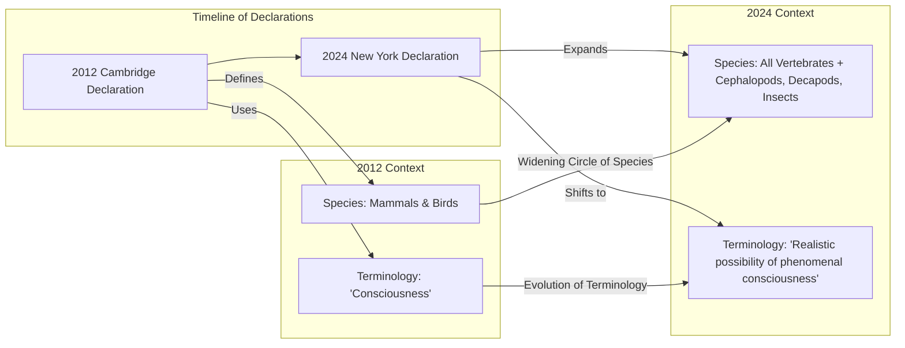

# The Expanding Circle: Why Scientists Now See a “Realistic Possibility” of Consciousness in Insects

In 2022, researchers observed bumblebees doing something remarkable. In a lab setting, these tiny, fuzzy creatures repeatedly rolled small wooden balls, not for food, mating, or any obvious survival benefit. They did it, it seemed, just for fun [[35]](https://www.scientificamerican.com/article/ball-rolling-bumble-bees-just-wanna-have-fun?ref=refind), [[36]](https://www.theguardian.com/science/2022/oct/27/bumblebees-playing-wooden-balls-bees-study). This apparent display of play behavior in an insect is part of a growing body of evidence that is reshaping our understanding of animal minds.
Image 1: A macro photograph of a bee, an insect now considered to have a realistic possibility of conscious experience.

This research buttresses a new consensus formalized in the 2024 New York Declaration on Animal Consciousness. For decades, a broad agreement has existed among scientists that animals similar to us, like great apes, have conscious experiences. However, recent findings have pushed researchers to acknowledge that consciousness may be widespread among animals very different from us. The declaration embraces this view, stating that “the empirical evidence indicates at least a realistic possibility of conscious experience in all vertebrates (including all reptiles, amphibians and fishes) and many invertebrates (including, at minimum, cephalopod mollusks, decapod crustaceans and insects)” [[1]](http://www.nydeclaration.com/). The key takeaway is that the bar for consideration has shifted from certainty to "realistic possibility."

The declaration was unveiled on April 19, 2024, at a conference at New York University. It was spearheaded by philosopher Kristin Andrews, environmental scientist Jeff Sebo, and philosopher Jonathan Birch. It has been signed by dozens of prominent researchers, including neuroscientists Anil Seth and Christof Koch, and philosophers David Chalmers and Peter Godfrey-Smith [[1]](http://www.nydeclaration.com/), [[2]](https://www.quantamagazine.org/insects-and-other-animals-have-consciousness-experts-declare-20240419).
Image 2: The organizers of the declaration, from left: Jeff Sebo, Kristin Andrews, and Jonathan Birch. (Source [https://www.quantamagazine.org/insects-and-other-animals-have-consciousness-experts-declare-20240419](https://www.quantamagazine.org/insects-and-other-animals-have-consciousness-experts-declare-20240419))

The document focuses on phenomenal consciousness, the most basic kind of subjective experience. The philosopher Thomas Nagel defined this in his influential 1974 essay, asking, “What is it like to be a bat?” He argued that “an organism has conscious mental states if and only if there is something that it is like to *be* that organism” [[34]](https://www.cs.ox.ac.uk/activities/ieg/e-library/sources/nagel_bat.pdf). This is about the capacity for raw feelings like pain or pleasure, not necessarily higher-order states like self-awareness.

This growing understanding of animal subjective experience draws a sharp line between biological life and our current AI systems. While a large language model like ChatGPT can process language, it lacks the embodied, evolved history that gives rise to play, pain, or anxiety. As signatory Anil Seth notes, “I hope it sparks discussion… and galvanizes an understanding and appreciation that we have much more in common with other animals than we do with things like ChatGPT” [[2]](https://www.quantamagazine.org/insects-and-other-animals-have-consciousness-experts-declare-20240419).

Image 3: A conceptual timeline contrasting the 2012 Cambridge Declaration with the 2024 New York Declaration, illustrating the widening circle of species now considered possibly conscious and the shift in terminology.

The 2024 Declaration is the formal culmination of a rapid accumulation of behavioral evidence gathered over the last 10–15 years. The next section will examine that evidence in detail, explain why the field moved to a public declaration, and dismantle the old neural-complexity barrier.

## A Growing Awareness

The shift in scientific consensus did not happen overnight. It is the result of over a decade of striking findings that hint at rich inner lives in a wide range of animals. These studies show complex behaviors that, in a mammal, would be readily explained by conscious processing.

Researchers have documented a variety of these behaviors. Octopuses, for example, have been shown to avoid locations where they have experienced pain and prefer places where they have received pain relief [[3]](https://sites.google.com/nyu.edu/nydeclaration/background?authuser=0). Cuttlefish can remember specific details of past events, including what happened, where, and when—a capacity known as episodic-like memory [[3]](https://sites.google.com/nyu.edu/nydeclaration/background?authuser=0). In the fish world, cleaner wrasse and zebrafish have passed versions of the mirror self-recognition test and shown signs of curiosity, respectively [[3]](https://sites.google.com/nyu.edu/nydeclaration/background?authuser=0). In addition to the play behavior of bumblebees, studies on fruit flies have found they have active and quiet sleep states, which are disrupted by social isolation [[3]](https://sites.google.com/nyu.edu/nydeclaration/background?authuser=0). Even crayfish display "anxiety-like" states in response to stress, which can be reversed with the same anti-anxiety drugs used in humans [[3]](https://sites.google.com/nyu.edu/nydeclaration/background?authuser=0). While compelling, some scientists caution that the crayfish response could reflect generalized stress rather than a state homologous to human anxiety [[51]](https://r.jordan.im/download/fish/fossat2014.pdf).
Image 4: A collection of animals including a crayfish, octopus, zebrafish, and garter snake, all of which have demonstrated complex behaviors suggesting a realistic possibility of consciousness.

This growing mountain of evidence created a consensus among specialists that was not being communicated to the public or policymakers. Jeff Sebo, one of the declaration's organizers, notes that while mammals and birds have been accepted as likely conscious for some time, "less attention has been paid to other vertebrate and especially invertebrate taxa" [[17]](https://www.theatlantic.com/science/archive/2024/04/animal-consciousness-declaration-new-york/678223). The declaration aims to correct this by pointing to where the science is now and where it is headed.

However, this consensus is not without its critics. Neuroscientist Hakwan Lau argues that the declaration overstates its case by conflating flexible behavior with phenomenal consciousness—the raw, subjective quality of experience [[52]](https://www.thetransmitter.org/consciousness/premature-declarations-on-animal-consciousness-hinder-progress). Lau points to conditions like blindsight, where humans can react to visual stimuli without any subjective awareness, as proof that complex behavior can exist without conscious experience. He cautions that such declarations, promoted through media rather than rigorous peer review, risk impeding the painstaking work needed to actually measure phenomenal states [[52]](https://www.thetransmitter.org/consciousness/premature-declarations-on-animal-consciousness-hinder-progress).

This new declaration updates and expands a previous milestone, the 2012 Cambridge Declaration on Consciousness. The 2012 document focused on mammals and birds, stating they possess the "neurological substrates that generate consciousness" [[2]](https://www.quantamagazine.org/insects-and-other-animals-have-consciousness-experts-declare-20240419). A footnote, however, acknowledged "very strong evidence" for invertebrates, including insects and cephalopods, but they were not highlighted in the main text [[53]](https://www.animal-ethics.org/the-new-york-declaration-on-animal-consciousness-stresses-the-ethical-implications). The 2024 New York Declaration widens this circle significantly to include all vertebrates and many invertebrates. It also adopts more careful phrasing, emphasizing the "realistic possibility" of phenomenal consciousness, a move that reflects a nuanced scientific position rather than an absolute decree [[2]](https://www.quantamagazine.org/insects-and-other-animals-have-consciousness-experts-declare-20240419).

A long-standing barrier to accepting consciousness in these animals was their vastly different neurobiology. A bee’s brain, for instance, has about a million neurons compared to a human’s 86 billion [[40]](https://bionumbers.hms.harvard.edu/bionumber.aspx?s=n&v=0&id=109328), [[41]](https://www.theguardian.com/science/blog/2012/feb/28/how-many-neurons-human-brain). However, researchers now argue that absolute neuron count is not the deciding factor. The complexity and density of connections may be more important [[2]](https://www.quantamagazine.org/insects-and-other-animals-have-consciousness-experts-declare-20240419). The octopus provides another powerful example. Its nervous system is highly distributed: of its roughly 500 million neurons, over 300 million are located in its arms [[54]](https://spacedaily.com/d-most-of-an-octopuss-brain-cells-live-in-its-arms-not-in-its-head-only-about-8-percent-of-its-500-million-neurons-sit-inside-the-central-brain-with-the-rest-spread-across-the-eight-arms-an). A severed octopus arm can continue to perform complex actions, demonstrating that sophisticated control can exist without a centralized, human-like brain.

Furthermore, the idea that a cerebral cortex is necessary for consciousness is being challenged. Kristin Andrews points out that while fish lack the brain structures we see in mammals, other parts of their brains perform similar functions [[23]](https://mindmatters.ai/2023/12/can-the-simplest-animal-minds-explain-human-minds). Peter Godfrey-Smith agrees, noting that behaviors indicating consciousness "can exist in an architecture that looks completely alien" to our own [[2]](https://www.quantamagazine.org/insects-and-other-animals-have-consciousness-experts-declare-20240419). The evolutionary path of cephalopods represents an independent experiment in the evolution of complex minds, separate from the vertebrate lineage for some 600 million years [[50]](https://petergodfreysmith.com/wp-content/uploads/2013/06/Cephalopods_PGS_PacConBio_2013.pdf). Recent neuroanatomical studies reveal that while the avian pallium lacks the six-layered structure of the mammalian cortex, it contains a remarkably similar fiber architecture, with homologous processing modules connected by radial and tangential fibers. This suggests that evolution has found convergent solutions for complex cognition using different building blocks [[55]](https://luolab.stanford.edu/news/bird-brains-they-are-more-ours-we-thought).

The evidentiary and architectural arguments have now shifted the scientific default. With this shift comes a new set of downstream ethical obligations, practical tensions, and laboratory-policy implications that follow once we accept the realistic possibility of consciousness in these animals.

## Mindful Relations

Accepting a "realistic possibility" of consciousness in a wider range of animals forces us to reconsider our ethical responsibilities. According to Jeff Sebo, this goes beyond simply preventing pain. We also have an obligation to provide captive animals with "the kinds of enrichment and opportunities that allow them to express their instincts and explore their environments and engage in social systems" [[17]](https://www.theatlantic.com/science/archive/2024/04/animal-consciousness-declaration-new-york/678223). It is not enough for them to be free from suffering; they should have the chance to live meaningful lives.

In laboratory settings, this translates into quantifiable welfare metrics. For octopuses, welfare gains from enrichment are measured by observing increases in natural behaviors, such as the use of camouflage patterns associated with calm states, and a reduction in stress indicators. Providing cognitive enrichment with varied objects and physical enrichment like sand allows them to perform species-typical exploration using both visual and tactile senses [[56]](https://pmc.ncbi.nlm.nih.gov/articles/PMC10251970).

However, this principle creates practical tensions, especially with insects. As Peter Godfrey-Smith observes, our relationship with many insects is "inevitably a somewhat antagonistic one" [[2]](https://www.quantamagazine.org/insects-and-other-animals-have-consciousness-experts-declare-20240419). Mosquitoes carry diseases, and other insects destroy crops. The idea of making peace with them is far more complex than with fish or octopuses, forcing us into a world of difficult trade-offs rather than simple avoidance of harm.

These tensions are already surfacing in the rapidly growing insect farming industry. While many farmers previously dismissed the idea of insect pain, the new evidence is forcing a conversation about welfare. Issues now being discussed include humane slaughter methods to replace boiling or microwaving, the stress caused by larval overheating, and whether to feed adult insects that are traditionally starved after they mature [[57]](https://rpstrategicanimalinsights.substack.com/p/the-case-for-insect-sentience-1), [[58]](https://ambrook.com/offrange/livestock/insect-farming-animal-welfare).

This new awareness also exposes a significant welfare gap in scientific research. While lab mice have established welfare standards, insects like *Drosophila* (fruit flies) are used in countless experiments with no protocols addressing their potential sentience [[2]](https://www.quantamagazine.org/insects-and-other-animals-have-consciousness-experts-declare-20240419), [[45]](https://forum.effectivealtruism.org/posts/gcMdxLKTgeKty2eoa/shrimp-sentience-research-a-prioritization-guide). This stands in contrast to the growing oversight for other invertebrates.
Image 5: A red decapod crustacean, a group of animals now recognized as sentient under UK law.

Policy is beginning to catch up to the science. In a key legislative precedent, the United Kingdom amended its Animal Welfare (Sentience) Bill in 2021 to include all decapod crustaceans (like crabs, lobsters, and shrimp) and cephalopod molluscs (like octopus and squid) as sentient beings [[5]](https://www.gov.uk/government/news/lobsters-octopus-and-crabs-recognised-as-sentient-beings). This decision, which makes it illegal to boil crustaceans alive without stunning them first, followed a government-commissioned report from the London School of Economics and Political Science. The report reviewed over 300 scientific studies and found strong evidence for their capacity to feel pain, pleasure, and distress [[5]](https://www.gov.uk/government/news/lobsters-octopus-and-crabs-recognised-as-sentient-beings), [[6]](https://www.eurogroupforanimals.org/news/decapods-and-cephalopods-be-recognised-sentient-beings-under-uk-law). This provides a concrete policy translation pathway that could be extended to insects.
Image 6: The UK's Department for Environment, Food & Rural Affairs, which implemented the Animal Welfare (Sentience) Bill. (Source [https://www.gov.uk/government/news/lobsters-octopus-and-crabs-recognised-as-sentient-beings](https://www.gov.uk/government/news/lobsters-octopus-and-crabs-recognised-as-sentient-beings))

The rapid shift in animal consciousness research also serves as a cautionary tale for the field of AI. While Sebo and others state that "current AI systems are very unlikely to be conscious," the animal literature shows how quickly a scientific consensus can change [[2]](https://www.quantamagazine.org/insects-and-other-animals-have-consciousness-experts-declare-20240419). Ethicists argue that if we ever develop conscious AI, the same principles should apply: "Consciousness is what matters, not species, size, or substrate" [[59]](https://www.animal-ethics.org/the-new-york-declaration-on-animal-consciousness-stresses-the-ethical-implications). The precautionary principle, which suggests erring on the side of protection when sentience is a possibility, may become relevant for future AI systems, just as it is for invertebrates today [[60]](https://www.animal-ethics.org/invertebrate-sentience-a-review-of-the-behavioral-evidence).

The path forward involves more research. Kristin Andrews has called for a redirection of existing lab infrastructure toward this goal. She argues that since "nematode worms and fruit flies that are in almost every university," we should use these accessible models to study consciousness directly [[2]](https://www.quantamagazine.org/insects-and-other-animals-have-consciousness-experts-declare-20240419). Such work is already underway. A 2022 review by Gibbons et al. applied an evidence-based framework to assess sentience across six insect orders, finding high confidence for pain-like experiences in groups like flies, bees, and cockroaches based on criteria such as associative learning with noxious stimuli [[10]](https://chittkalab.sbcs.qmul.ac.uk/2022/Gibbons%20et%20al%202022%20Advances%20Insect%20Physiol.pdf), [[11]](https://forum.effectivealtruism.org/posts/yPDXXxdeK9cgCfLwj/short-research-summary-can-insects-feel-pain-a-review-of-the). These studies are building a quantitative foundation, moving beyond observation to measure the neural and behavioral signatures of what it is like to be an insect.

## References

- [1] The New York Declaration on Animal Consciousness. (2024, April 19). [http://www.nydeclaration.com/](http://www.nydeclaration.com/)
- [2] Falk, D. (2024, April 19). Insects and Other Animals Have Consciousness, Experts Declare. Quanta Magazine. [https://www.quantamagazine.org/insects-and-other-animals-have-consciousness-experts-declare-20240419](https://www.quantamagazine.org/insects-and-other-animals-have-consciousness-experts-declare-20240419)
- [3] Andrews, K., Birch, J., Sebo, J., & Sims, T. (2024). Background to the New York Declaration on Animal Consciousness. [https://sites.google.com/nyu.edu/nydeclaration/background?authuser=0](https://sites.google.com/nyu.edu/nydeclaration/background?authuser=0)
- [4] The New York Declaration on Animal Consciousness stresses the ethical implications. (2024). Animal Ethics. [https://www.animal-ethics.org/the-new-york-declaration-on-animal-consciousness-stresses-the-ethical-implications](https://www.animal-ethics.org/the-new-york-declaration-on-animal-consciousness-stresses-the-ethical-implications)
- [5] Department for Environment, Food & Rural Affairs. (2021, November 19). Lobsters, octopus and crabs recognised as sentient beings. GOV.UK. [https://www.gov.uk/government/news/lobsters-octopus-and-crabs-recognised-as-sentient-beings](https://www.gov.uk/government/news/lobsters-octopus-and-crabs-recognised-as-sentient-beings)
- [6] Decapods and cephalopods to be recognised as sentient beings under UK law. (2021). Eurogroup for Animals. [https://www.eurogroupforanimals.org/news/decapods-and-cephalopods-be-recognised-sentient-beings-under-uk-law](https://www.eurogroupforanimals.org/news/decapods-and-cephalopods-be-recognised-sentient-beings-under-uk-law)
- [7] From Mules to Cephalopods: Animal Sentience and the Law. (2021). EuropeNow. [https://www.europenowjournal.org/2021/11/07/from-mules-to-cephalopods-animal-sentience-and-the-law](https://www.europenowjournal.org/2021/11/07/from-mules-to-cephalopods-animal-sentience-and-the-law)
- [8] Lobsters, octopus and crabs recognised as sentient beings in UK law. (2021). Royal Veterinary College. [https://www.rvc.ac.uk/research/research-centres-and-facilities/rvc-animal-welfare-science-and-ethics/news/lobsters-octopus-and-crabs-recognised-as-sentient-beings-in-uk-law](https://www.rvc.ac.uk/research/research-centres-and-facilities/rvc-animal-welfare-science-and-ethics/news/lobsters-octopus-and-crabs-recognised-as-sentient-beings-in-uk-law)
- [9] Neural and Behavioural Indicators of Pain in Insects. (n.d.). Queen Mary Research Online. [https://qmro.qmul.ac.uk/xmlui/bitstream/123456789/84883/2/Revised%20Neural%20and%20Behavioural%20Indicators%20of%20Pain%20in%20Insects.pdf](https://qmro.qmul.ac.uk/xmlui/bitstream/123456789/84883/2/Revised%20Neural%20and%20Behavioural%20Indicators%20of%20Pain%20in%20Insects.pdf)
- [10] Gibbons, M., et al. (2022). Can insects feel pain? A review of the neural and behavioural evidence. Advances in Insect Physiology. [https://chittkalab.sbcs.qmul.ac.uk/2022/Gibbons%20et%20al%202022%20Advances%20Insect%20Physiol.pdf](https://chittkalab.sbcs.qmul.ac.uk/2022/Gibbons%20et%20al%202022%20Advances%20Insect%20Physiol.pdf)
- [11] Short research summary: Can insects feel pain? A review of the neural and behavioural evidence (Gibbons et al., 2022). (2022). Effective Altruism Forum. [https://forum.effectivealtruism.org/posts/yPDXXxdeK9cgCfLwj/short-research-summary-can-insects-feel-pain-a-review-of-the](https://forum.effectivealtruism.org/posts/yPDXXxdeK9cgCfLwj/short-research-summary-can-insects-feel-pain-a-review-of-the)
- [12] Is it pain if it does not hurt? On the unlikelihood of insect pain. (2022). Cambridge University Press. [https://www.cambridge.org/core/journals/canadian-entomologist/article/is-it-pain-if-it-does-not-hurt-on-the-unlikelihood-of-insect-pain/9A60617352A45B15E25307F85FF2E8F2](https://www.cambridge.org/core/journals/canadian-entomologist/article/is-it-pain-if-it-does-not-hurt-on-the-unlikelihood-of-insect-pain/9A60617352A45B15E25307F85FF2E8F2)
- [13] The Era Beyond Eisemann et al. (1984): Insect pain in the 21st century. (n.d.). Rethink Priorities. [https://rethinkpriorities.org/research-area/era-beyond-eisemann](https://rethinkpriorities.org/research-area/era-beyond-eisemann)
- [14] Book review: Peter Godfrey-Smith’s Other Minds: The Octopus, the Sea, and the Deep Origins of Consciousness. (2017). Interalia Magazine. [https://www.interaliamag.org/articles/jasper-sharp-book-review-peter-godfrey-smith-minds-octopus-sea-deep-origins-consciousness](https://www.interaliamag.org/articles/jasper-sharp-book-review-peter-godfrey-smith-minds-octopus-sea-deep-origins-consciousness)
- [15] Godfrey-Smith, P. (2013). Cephalopods and the Evolution of the Mind. Pacific Conservation Biology. [https://petergodfreysmith.com/wp-content/uploads/2013/06/Cephalopods_PGS_PacConBio_2013.pdf](https://petergodfreysmith.com/wp-content/uploads/2013/06/Cephalopods_PGS_PacConBio_2013.pdf)
- [16] Godfrey-Smith, P. (2017). The Mind of an Octopus. Scientific American. [https://www.scientificamerican.com/article/the-mind-of-an-octopus](https://www.scientificamerican.com/article/the-mind-of-an-octopus)
- [17] Yong, E. (2024). A New Declaration of Animal Consciousness. The Atlantic. [https://www.theatlantic.com/science/archive/2024/04/animal-consciousness-declaration-new-york/678223](https://www.theatlantic.com/science/archive/2024/04/animal-consciousness-declaration-new-york/678223)
- [18] A New Declaration on Animal Consciousness. (2024). The Kimmela Center for Animal Advocacy. [https://www.kimmela.org/2024/05/05/a-new-declaration-on-animal-consciousness](https://www.kimmela.org/2024/05/05/a-new-declaration-on-animal-consciousness)
- [19] The New York Declaration on Animal Consciousness. (2024). [https://sites.google.com/nyu.edu/nydeclaration/declaration](https://sites.google.com/nyu.edu/nydeclaration/declaration)
- [20] A New Declaration on Animal Consciousness. (2024). The Kimmela Center for Animal Advocacy. [https://www.kimmela.org/2024/05/05/a-new-declaration-on-animal-consciousness](https://www.kimmela.org/2024/05/05/a-new-declaration-on-animal-consciousness)
- [21] Should (and can) declarations on animal consciousness do better? (2025). PAN Works. [https://panworks.medium.com/should-and-can-declarations-on-animal-consciousness-do-better-8cda0ecc9735](https://panworks.medium.com/should-and-can-declarations-on-animal-consciousness-do-better-8cda0ecc9735)
- [22] Animal Minds: Kristin Andrews on assuming consciousness in other species. (2023). Multiverses. [https://www.multiverses.xyz/podcast/animal-minds-kristin-andrews-on-assuming-consciousness-in-other-species](https://www.multiverses.xyz/podcast/animal-minds-kristin-andrews-on-assuming-consciousness-in-other-species)
- [23] Can the Simplest Animal Minds Explain Human Minds? (2023). Mind Matters. [https://mindmatters.ai/2023/12/can-the-simplest-animal-minds-explain-human-minds](https://mindmatters.ai/2023/12/can-the-simplest-animal-minds-explain-human-minds)
- [24] A New Declaration on Animal Consciousness. (2024). The Kimmela Center for Animal Advocacy. [https://www.kimmela.org/2024/05/05/a-new-declaration-on-animal-consciousness](https://www.kimmela.org/2024/05/05/a-new-declaration-on-animal-consciousness)
- [25] The social origins of consciousness hypothesis. (2025). [https://millerlab.ca/labsite/docs/pubs/2025_Andrews.pdf](https://millerlab.ca/labsite/docs/pubs/2025_Andrews.pdf)
- [26] A New Declaration on Animal Consciousness. (2024). The Kimmela Center for Animal Advocacy. [https://www.kimmela.org/2024/05/05/a-new-declaration-on-animal-consciousness](https://www.kimmela.org/2024/05/05/a-new-declaration-on-animal-consciousness)
- [27] The New Basics: Animal. (2022). The Philosopher 1923. [https://www.thephilosopher1923.org/post/the-new-basics-animal](https://www.thephilosopher1923.org/post/the-new-basics-animal)
- [28] The Moral Circle: Jeff Sebo. (n.d.). SARX. [https://sarx.org.uk/articles/human-animal-relations/the-moral-circle-jeff-sebo](https://sarx.org.uk/articles/human-animal-relations/the-moral-circle-jeff-sebo)
- [29] Jeff Sebo - Home. (n.d.). [https://jeffsebo.net](https://jeffsebo.net)
- [30] Utilitarianism and Nonhuman Animals. (n.d.). Utilitarianism.net. [https://utilitarianism.net/guest-essays/utilitarianism-and-nonhuman-animals](https://utilitarianism.net/guest-essays/utilitarianism-and-nonhuman-animals)
- [31] A New Declaration on Animal Consciousness. (2024). The Kimmela Center for Animal Advocacy. [https://www.kimmela.org/2024/05/05/a-new-declaration-on-animal-consciousness](https://www.kimmela.org/2024/05/05/a-new-declaration-on-animal-consciousness)
- [32] Ethics Explainer: What is it like to be a bat? (n.d.). The Ethics Centre. [https://ethics.org.au/ethics-explainer-what-is-it-like-to-be-a-bat](https://ethics.org.au/ethics-explainer-what-is-it-like-to-be-a-bat)
- [33] What Is It Like to Be a Bat? (n.d.). Wikipedia. [https://en.wikipedia.org/wiki/What_Is_It_Like_to_Be_a_Bat%3F](https://en.wikipedia.org/wiki/What_Is_It_Like_to_Be_a_Bat%3F)
- [34] Nagel, T. (1974). What is it like to be a bat? The Philosophical Review. [https://www.cs.ox.ac.uk/activities/ieg/e-library/sources/nagel_bat.pdf](https://www.cs.ox.ac.uk/activities/ieg/e-library/sources/nagel_bat.pdf)
- [35] Ball-rolling bumble bees just wanna have fun. (2022). Scientific American. [https://www.scientificamerican.com/article/ball-rolling-bumble-bees-just-wanna-have-fun?ref=refind](https://www.scientificamerican.com/article/ball-rolling-bumble-bees-just-wanna-have-fun?ref=refind)
- [36] Bumblebees learn to ‘play’ with wooden balls, study finds. (2022). The Guardian. [https://www.theguardian.com/science/2022/oct/27/bumblebees-playing-wooden-balls-bees-study](https://www.theguardian.com/science/2022/oct/27/bumblebees-playing-wooden-balls-bees-study)
- [37] Bumble Bees Play With Balls and May Even Enjoy It. (2022). Psychology Today. [https://www.psychologytoday.com/us/blog/animal-emotions/202211/bumble-bees-play-balls-and-may-even-enjoy-it](https://www.psychologytoday.com/us/blog/animal-emotions/202211/bumble-bees-play-balls-and-may-even-enjoy-it)
- [38] Do bees play? (2024). Science Journal for Kids. [https://www.sciencejournalforkids.org/wp-content/uploads/2024/04/bees-play_article.pdf](https://www.sciencejournalforkids.org/wp-content/uploads/2024/04/bees-play_article.pdf)
- [39] Bees can play, study shows, in a first for insects. (2022). National Geographic. [https://www.nationalgeographic.com/animals/article/bees-can-play-study-shows-bumblebees-insect-intelligence](https://www.nationalgeographic.com/animals/article/bees-can-play-study-shows-bumblebees-insect-intelligence)
- [40] Number of neurons in the brain of a honey bee. (n.d.). BioNumbers. [https://bionumbers.hms.harvard.edu/bionumber.aspx?s=n&v=0&id=109328](https://bionumbers.hms.harvard.edu/bionumber.aspx?s=n&v=0&id=109328)
- [41] How many neurons are in the human brain? (2012). The Guardian. [https://www.theguardian.com/science/blog/2012/feb/28/how-many-neurons-human-brain](https://www.theguardian.com/science/blog/2012/feb/28/how-many-neurons-human-brain)
- [42] Equal numbers of neuronal and nonneuronal cells make the human brain an isometrically scaled-up primate brain. (2009). The Journal of Comparative Neurology. [https://pmc.ncbi.nlm.nih.gov/articles/PMC2776484](https://pmc.ncbi.nlm.nih.gov/articles/PMC2776484)
- [43] A New Declaration on Animal Consciousness. (2024). The Kimmela Center for Animal Advocacy. [https://www.kimmela.org/2024/05/05/a-new-declaration-on-animal-consciousness](https://www.kimmela.org/2024/05/05/a-new-declaration-on-animal-consciousness)
- [44] How many neurons do you have? Some dogmas of quantitative neuroscience under revision. (2011). European Journal of Neuroscience. [https://www.psychiatry.wisc.edu/courses/Nitschke/seminar/Lent_EurJNS2011_HowManyNeurons_DogmasofQuantNS-Revised.pdf](https://www.psychiatry.wisc.edu/courses/Nitschke/seminar/Lent_EurJNS2011_HowManyNeurons_DogmasofQuantNS-Revised.pdf)
- [45] Shrimp Sentience Research: A Prioritization Guide. (2023). Effective Altruism Forum. [https://forum.effectivealtruism.org/posts/gcMdxLKTgeKty2eoa/shrimp-sentience-research-a-prioritization-guide](https://forum.effectivealtruism.org/posts/gcMdxLKTgeKty2eoa/shrimp-sentience-research-a-prioritization-guide)
- [46] Protocols. (n.d.). Janelia Research Campus. [https://www.janelia.org/project-team/flylight/protocols](https://www.janelia.org/project-team/flylight/protocols)
- [47] New Drosophila analysis tool opens up neuroscience research to resource-limited settings. (2023). eLife. [https://elifesciences.org/for-the-press/826a3986/new-drosophila-analysis-tool-opens-up-neuroscience-research-to-resource-limited-settings](https://elifesciences.org/for-the-press/826a3986/new-drosophila-analysis-tool-opens-up-neuroscience-research-to-resource-limited-settings)
- [48] New insects in neuroscience. (n.d.). Harvard Brain Science Initiative. [http://brain.harvard.edu/hbi_news/new-insects-in-neuroscience](http://brain.harvard.edu/hbi_news/new-insects-in-neuroscience)
- [49] Guideline: raising Drosophila melanogaster in the laboratory. (n.d.). IGB CNR. [http://quality4lab.igb.cnr.it/en/guidelines/research-activities/guideline-raising-drosophila-melanogaster-in-the-laboratory](http://quality4lab.igb.cnr.it/en/guidelines/research-activities/guideline-raising-drosophila-melanogaster-in-the-laboratory)
- [50] Godfrey-Smith, P. (2013). Cephalopods and the Evolution of the Mind. Pacific Conservation Biology. [https://petergodfreysmith.com/wp-content/uploads/2013/06/Cephalopods_PGS_PacConBio_2013.pdf](https://petergodfreysmith.com/wp-content/uploads/2013/06/Cephalopods_PGS_PacConBio_2013.pdf)
- [51] Fossat, P., et al. (2014). Anxiety-like behavior in crayfish is controlled by serotonin. Science. [https://r.jordan.im/download/fish/fossat2014.pdf](https://r.jordan.im/download/fish/fossat2014.pdf)
- [52] Lau, H. (2024). Premature declarations on animal consciousness hinder progress. The Transmitter. [https://www.thetransmitter.org/consciousness/premature-declarations-on-animal-consciousness-hinder-progress](https://www.thetransmitter.org/consciousness/premature-declarations-on-animal-consciousness-hinder-progress)
- [53] The New York Declaration on Animal Consciousness stresses the ethical implications. (2024). Animal Ethics. [https://www.animal-ethics.org/the-new-york-declaration-on-animal-consciousness-stresses-the-ethical-implications](https://www.animal-ethics.org/the-new-york-declaration-on-animal-consciousness-stresses-the-ethical-implications)
- [54] Most of an octopus's brain cells live in its arms, not in its head. (2024). Spacedaily. [https://spacedaily.com/d-most-of-an-octopuss-brain-cells-live-in-its-arms-not-in-its-head-only-about-8-percent-of-its-500-million-neurons-sit-inside-the-central-brain-with-the-rest-spread-across-the-eight-arms-an](https://spacedaily.com/d-most-of-an-octopuss-brain-cells-live-in-its-arms-not-in-its-head-only-about-8-percent-of-its-500-million-neurons-sit-inside-the-central-brain-with-the-rest-spread-across-the-eight-arms-an)
- [55] Stacho, M., et al. (2020). A cortex-like canonical circuit in the avian forebrain. Science. [https://luolab.stanford.edu/news/bird-brains-they-are-more-ours-we-thought](https://luolab.stanford.edu/news/bird-brains-they-are-more-ours-we-thought)
- [56] Iacovelli, V., et al. (2023). Environmental Enrichment Improves the Welfare of Octopus vulgaris Housed in a Recirculating Aquaculture System. Animals. [https://pmc.ncbi.nlm.nih.gov/articles/PMC10251970](https://pmc.ncbi.nlm.nih.gov/articles/PMC10251970)
- [57] The Case for Insect Sentience. (2024). RP Strategic Animal Insights. [https://rpstrategicanimalinsights.substack.com/p/the-case-for-insect-sentience-1](https://rpstrategicanimalinsights.substack.com/p/the-case-for-insect-sentience-1)
- [58] Insect farming and animal welfare. (2023). Ambrook. [https://ambrook.com/offrange/livestock/insect-farming-animal-welfare](https://ambrook.com/offrange/livestock/insect-farming-animal-welfare)
- [59] The New York Declaration on Animal Consciousness stresses the ethical implications. (2024). Animal Ethics. [https://www.animal-ethics.org/the-new-york-declaration-on-animal-consciousness-stresses-the-ethical-implications](https://www.animal-ethics.org/the-new-york-declaration-on-animal-consciousness-stresses-the-ethical-implications)
- [60] Invertebrate Sentience: A Review of the Behavioral Evidence. (2024). Animal Ethics. [https://www.animal-ethics.org/invertebrate-sentience-a-review-of-the-behavioral-evidence](https://www.animal-ethics.org/invertebrate-sentience-a-review-of-the-behavioral-evidence)