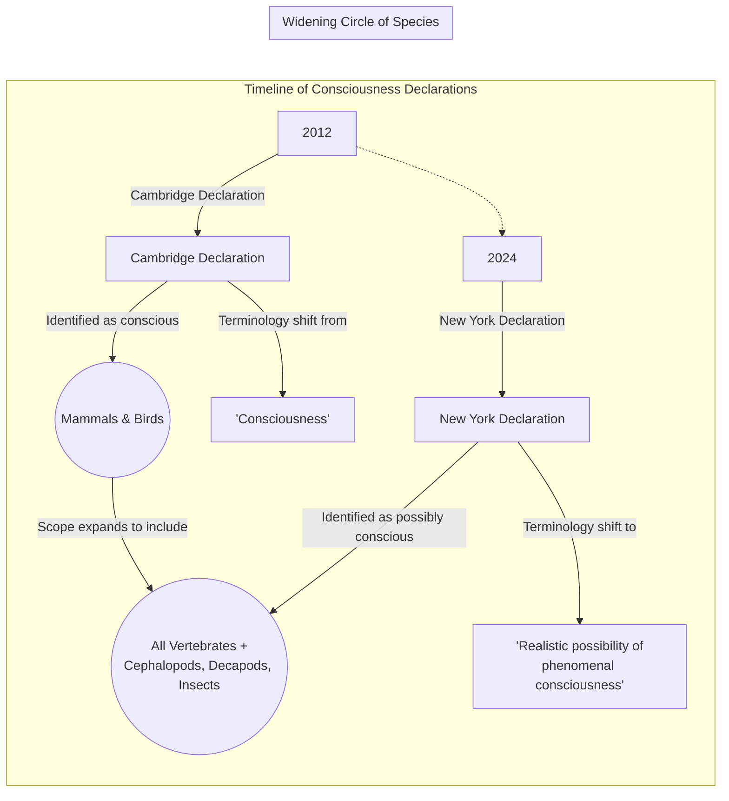

# The Widening Circle of Consciousness

In 2022, researchers observed bumblebees doing something remarkable. In a lab at Queen Mary University of London, the small, fuzzy insects were given wooden balls to play with. The bees pushed and rolled them around, not for food, mating, or any other reward. The behavior had no obvious connection to survival. It was, apparently, just for fun [[1]](https://www.scientificamerican.com/article/ball-rolling-bumble-bees-just-wanna-have-fun?ref=refind), [[2]](https://www.theguardian.com/science/2022/oct/27/bumblebees-playing-wooden-balls-bees-study). This display, so decoupled from instinct, met the five established criteria for animal play: it was not immediately functional, was intrinsically rewarding, differed from other behaviors, was repeated but not stereotyped, and was initiated in a stress-free state. This is one of many recent findings that challenge our assumptions about the inner lives of animals [[25]](https://www.sciencedirect.com/science/article/pii/S0003347222002366).

This experiment is part of a wave of research that has led to a new scientific consensus. For decades, there has been broad agreement that animals similar to us, like other mammals and birds, have conscious experiences. However, recent studies have begun to acknowledge that consciousness may also be widespread among animals very different from us. This shift culminated in the 2024 New York Declaration on Animal Consciousness, which formally embraces this expanded view. The declaration states, "the balance of evidence indicates at least a realistic possibility of conscious experience in all vertebrates (including all reptiles, amphibians and fishes) and many invertebrates (including, at minimum, cephalopod mollusks, decapod crustaceans and insects)" [[3]](http://www.nydeclaration.com/). The key takeaway is its cautious but firm position: the chance of consciousness in these creatures is high enough to take seriously.

Unveiled on April 19, 2024, at a conference at New York University, the declaration was spearheaded by philosophers Kristin Andrews, Jeff Sebo, and Jonathan Birch [[4]](https://www.kimmela.org/2024/05/05/a-new-declaration-on-animal-consciousness/), [[5]](https://www.theatlantic.com/science/archive/2024/04/animal-consciousness-declaration-new-york/678223). It was initially signed by a prominent group of biologists, psychologists, and philosophers, including neuroscientists Anil Seth and Christof Koch, psychologists Nicola Clayton and Irene Pepperberg, zoologist Lars Chittka, and philosophers David Chalmers and Peter Godfrey-Smith. It has since gathered hundreds more signatures [[6]](https://advancedconsciousness.org/revisiting-animal-consciousness), [[5]](https://www.theatlantic.com/science/archive/2024/04/animal-consciousness-declaration-new-york/678223).

The declaration focuses on phenomenal consciousness, the most basic form of subjective experience. This is what philosopher Thomas Nagel, in his influential 1974 essay, described as the "what it is like to be" an organism. As he put it, "fundamentally an organism has conscious mental states if and only if there is something that it is like to be that organism - something it is like for the organism" [[7]](https://www.informationphilosopher.com/solutions/philosophers/nagelt/), [[8]](https://thephilosophicalsalon.com/thomas-nagels-bat-and-ours). This raw feeling is distinct from more complex capacities like self-awareness or metacognition, which the declaration does not claim for these animals [[9]](https://sites.google.com/nyu.edu/nydeclaration/background?authuser=0).

This growing understanding of animal minds draws a sharp line between biological consciousness and artificial intelligence. While large language models like ChatGPT can produce impressive text, they lack the behavioral and physiological indicators of subjective experience we see in animals. As signatory Anil Seth notes, the declaration should galvanize "an understanding and appreciation that we have much more in common with other animals than we do with things like ChatGPT" [[5]](https://www.theatlantic.com/science/archive/2024/04/animal-consciousness-declaration-new-york/678223/), [[10]](https://www.quantamagazine.org/insects-and-other-animals-have-consciousness-experts-declare-20240419).

Image 1: A conceptual timeline contrasting the 2012 Cambridge Declaration with the 2024 New York Declaration, visualizing the widening circle of species considered possibly conscious and noting the shift in terminology.

The 2024 Declaration is the formal culmination of a rapid accumulation of behavioral evidence gathered over the last 10–15 years. The next section examines that evidence in detail, explains why the field moved to a public declaration, and dismantles the old neural-complexity barrier that long excluded invertebrates from consideration.

## A Growing Awareness

The New York Declaration did not emerge from a vacuum. It rests on over a decade of striking experimental results that have consistently pointed toward rich inner lives in a wide range of animals. This accumulation of evidence made the old assumptions untenable [[9]](https://sites.google.com/nyu.edu/nydeclaration/background?authuser=0).

Here are six key examples of the research that shifted the consensus:
1.  **Octopuses** demonstrate behaviors consistent with pain. In a conditioned place preference test, octopuses that received a noxious injection of acetic acid in one chamber developed a lasting aversion to it. They later developed a preference for a different chamber where they received a pain-relieving anesthetic (lidocaine), mirroring responses used to infer pain in mammals [[9]](https://sites.google.com/nyu.edu/nydeclaration/background?authuser=0).
2.  **Cuttlefish** have shown a form of episodic-like memory. They can recall not just what happened, where, and when, but also how they experienced it, such as whether they saw or smelled a prey item like a crab or shrimp after a three-hour delay. This "source memory" suggests a more detailed and integrated recollection of past events [[9]](https://sites.google.com/nyu.edu/nydeclaration/background?authuser=0).
3.  **Zebrafish** have passed a version of the mirror-mark test. This involves four phases: first, they react aggressively to their reflection; second, the aggression fades as they perform unusual behaviors like swimming upside down; third, they appear to study themselves; finally, they attempt to scrape off a colored mark on their body that is only visible in the mirror. This behavior is often linked to a degree of self-recognition [[10]](https://www.quantamagazine.org/insects-and-other-animals-have-consciousness-experts-declare-20240419).
4.  **Bumblebees** engage in apparent play. As mentioned, they voluntarily roll wooden balls without any external reward. The behavior is repeated but not stereotyped, and it increases when the bees are relaxed, suggesting they find the activity intrinsically rewarding [[11]](https://www.sciencedirect.com/science/article/pii/S0003347222002366), [[9]](https://sites.google.com/nyu.edu/nydeclaration/background?authuser=0).
5.  **Fruit flies** exhibit distinct sleep patterns. They have both "quiet sleep" with reduced brain activity and "active sleep" where brain activity persists, similar to the different sleep stages in humans. Social isolation has also been shown to disrupt their sleep, hinting at complex internal states influenced by their social environment [[9]](https://sites.google.com/nyu.edu/nydeclaration/background?authuser=0).
6.  **Crayfish** display "anxiety-like" states. When placed in a maze with both bright and dark pathways, crayfish exposed to mild electric shocks become more averse to exploring the bright, open spaces. This behavior is reversed by benzodiazepines, the same class of drugs used to treat anxiety in humans [[9]](https://sites.google.com/nyu.edu/nydeclaration/background?authuser=0).

As this evidence mounted, an informal agreement grew among specialists. However, this consensus was not reaching policymakers or the public. The declaration was created to bridge that gap. As co-organizer Jeff Sebo explained, the goal was "to point to where we think the field is now and where the field is headed" [[10]](https://www.quantamagazine.org/insects-and-other-animals-have-consciousness-experts-declare-20240419).

This represents a significant evolution from the last major consensus statement, the 2012 Cambridge Declaration on Consciousness. That document asserted that "non-human animals, including all mammals and birds, and many other creatures, including octopuses, also possess these neurological substrates" for consciousness [[12]](http://fcmconference.org/img/CambridgeDeclarationOnConsciousness.pdf). The 2024 New York Declaration expands this circle to include all vertebrates and many invertebrates, while carefully framing the claim as a "realistic possibility" of phenomenal consciousness, reflecting a more nuanced scientific stance [[3]](http://www.nydeclaration.com/). As philosopher Peter Godfrey-Smith notes, the complex behaviors of creatures like octopuses make it "very hard not to think that there’s quite a lot going on inside them" [[10]](https://www.quantamagazine.org/insects-and-other-animals-have-consciousness-experts-declare-20240419).

A major barrier to accepting invertebrate consciousness has been their radically different nervous systems. Yet, this is no longer seen as an insurmountable obstacle. A bee’s brain has only about a million neurons compared to a human’s 86 billion, but those neurons form an incredibly dense and complex network, sufficient for play and social learning [[10]](https://www.quantamagazine.org/insects-and-other-animals-have-consciousness-experts-declare-20240419). The octopus provides another example with its highly distributed nervous system. Of its 500 million neurons, about two-thirds reside in its arms [[13]](https://neuroscience.stanford.edu/news/octopus-brains). This arrangement allows for considerable functional autonomy; severed arms can exhibit grasping reflexes and complex withdrawal movements for up to three hours, proving that sophisticated sensory-motor integration does not require a centralized command center [[14]](https://pmc.ncbi.nlm.nih.gov/articles/PMC8988249/).

Furthermore, the long-held belief that a cerebral cortex is necessary for consciousness has been dismantled. Research shows that other animals achieve similar functions with entirely different brain structures. The avian pallium in birds, which makes up about 75% of the telencephalic volume, and the vertical lobe in octopuses—a dense web of interconnected neurons—perform cortex-like roles in memory and multisensory integration [[15]](https://asknature.org/strategy/complex-memory-processing-in-the-cephalopod-vertical-lobe/), [[16]](https://asknature.org/strategy/bird-brains-use-unique-structure-to-support-high-intelligence). As Kristin Andrews notes, "when you look at birds and reptiles and amphibians, they have very different brain structures... and yet some of those brain structures, we’re finding, are doing the same kind of work that a cerebral cortex does in humans" [[10]](https://www.quantamagazine.org/insects-and-other-animals-have-consciousness-experts-declare-20240419). Peter Godfrey-Smith adds that consciousness arises not from specific hardware but from electrical oscillations in living brains, suggesting it "can exist in an architecture that looks completely alien" to our own [[10]](https://www.quantamagazine.org/insects-and-other-animals-have-consciousness-experts-declare-20240419), [[18]](https://iai.tv/articles/studies-on-animal-minds-suggest-consciousness-is-not-computation-auid-3535).

The evidentiary and architectural arguments have now shifted the scientific default. This new understanding brings with it a host of downstream ethical obligations, practical tensions, and laboratory-policy implications that follow once we accept this realistic possibility.

## Mindful Relations

Accepting the realistic possibility of consciousness in a wider range of animals compels us to rethink our relationship with them. This shift has profound ethical and practical consequences, from the farm to the laboratory. The declaration's core message is that "when there is a realistic possibility of conscious experience in an animal, it is irresponsible to ignore that possibility in decisions affecting that animal" [[3]](http://www.nydeclaration.com/).

This principle extends our ethical obligations beyond simply preventing pain. Jeff Sebo argues that it is not enough to avoid causing physical discomfort. "We also have to provide them with the kinds of enrichment and opportunities that allow them to express their instincts and explore their environments and engage in social systems and otherwise be the kinds of complex agents they are" [[10]](https://www.quantamagazine.org/insects-and-other-animals-have-consciousness-experts-declare-20240419).

However, applying this principle to insects creates practical tensions. As Peter Godfrey-Smith points out, our relationship with many insects is "inevitably a somewhat antagonistic one." Pests destroy crops, and mosquitoes carry deadly diseases. "The idea that we could just sort of make peace with the mosquitoes—it’s a very different thought than the idea that we could make peace with fish and octopuses," he says [[10]](https://www.quantamagazine.org/insects-and-other-animals-have-consciousness-experts-declare-20240419). This forces us into a world of difficult trade-offs rather than simple avoidance of harm.

This new awareness also exposes a significant welfare gap in scientific research. While lab mice are protected by welfare standards, insects like *Drosophila melanogaster* (fruit flies) are used in countless experiments with no equivalent oversight [[15]](https://www.thetransmitter.org/policy/knowledge-gaps-in-cephalopod-care-could-stall-welfare-standards). This stands in contrast to the growing regulations for other invertebrates. The United Kingdom, for example, amended its Animal Welfare (Sentience) Bill in 2022 to include all decapod crustaceans and cephalopod molluscs after a government-commissioned review found strong evidence of their sentience [[21]](https://www.eurogroupforanimals.org/news/uk-sentience-bill-passes-final-stages-recognise-decapod-and-cephalopod-sentience-law), [[22]](https://www.eurogroupforanimals.org/news/decapods-and-cephalopods-be-recognised-sentient-beings-under-uk-law). This sets a clear precedent for how scientific consensus can translate into policy.

The rapid shift in our understanding of animal minds also offers a cautionary lesson for the field of AI. While Sebo and other experts agree that "current AI systems are very unlikely to be conscious," the animal literature shows how quickly a scientific consensus can change. This should encourage "caution and humility" as we develop increasingly complex AI agents [[10]](https://www.quantamagazine.org/insects-and-other-animals-have-consciousness-experts-declare-20240419).

Ultimately, the declaration is a call to action for the scientific community itself. Kristin Andrews urges researchers to leverage the resources they already have. "All these nematode worms and fruit flies that are in almost every university—study consciousness in them," she says. "You already have them... Make that project a consciousness project. Imagine that!" [[10]](https://www.quantamagazine.org/insects-and-other-animals-have-consciousness-experts-declare-20240419). By studying simpler models, we may not only expand our understanding of consciousness across the animal kingdom but also make progress on the fundamental scientific question of what consciousness is and how it arises [[17]](https://www.multiverses.xyz/podcast/animal-minds-kristin-andrews-on-assuming-consciousness-in-other-species).

## References

- [1] [https://www.scientificamerican.com/article/ball-rolling-bumble-bees-just-wanna-have-fun?ref=refind](https://www.scientificamerican.com/article/ball-rolling-bumble-bees-just-wanna-have-fun?ref=refind)
- [2] [https://www.theguardian.com/science/2022/oct/27/bumblebees-playing-wooden-balls-bees-study](https://www.theguardian.com/science/2022/oct/27/bumblebees-playing-wooden-balls-bees-study)
- [3] [http://www.nydeclaration.com/](http://www.nydeclaration.com/)
- [4] [https://www.kimmela.org/2024/05/05/a-new-declaration-on-animal-consciousness](https://www.kimmela.org/2024/05/05/a-new-declaration-on-animal-consciousness)
- [5] [https://www.theatlantic.com/science/archive/2024/04/animal-consciousness-declaration-new-york/678223](https://www.theatlantic.com/science/archive/2024/04/animal-consciousness-declaration-new-york/678223)
- [6] [https://advancedconsciousness.org/revisiting-animal-consciousness](https://advancedconsciousness.org/revisiting-animal-consciousness)
- [7] [https://www.informationphilosopher.com/solutions/philosophers/nagelt](https://www.informationphilosopher.com/solutions/philosophers/nagelt)
- [8] [https://thephilosophicalsalon.com/thomas-nagels-bat-and-ours](https://thephilosophicalsalon.com/thomas-nagels-bat-and-ours)
- [9] [https://sites.google.com/nyu.edu/nydeclaration/background?authuser=0](https://sites.google.com/nyu.edu/nydeclaration/background?authuser=0)
- [10] [https://www.quantamagazine.org/insects-and-other-animals-have-consciousness-experts-declare-20240419](https://www.quantamagazine.org/insects-and-other-animals-have-consciousness-experts-declare-20240419)
- [11] [https://www.sciencedirect.com/science/article/pii/S0003347222002366](https://www.sciencedirect.com/science/article/pii/S0003347222002366)
- [12] [http://fcmconference.org/img/CambridgeDeclarationOnConsciousness.pdf](http://fcmconference.org/img/CambridgeDeclarationOnConsciousness.pdf)
- [13] [https://neuroscience.stanford.edu/news/octopus-brains](https://neuroscience.stanford.edu/news/octopus-brains)
- [14] [https://pmc.ncbi.nlm.nih.gov/articles/PMC8988249/](https://pmc.ncbi.nlm.nih.gov/articles/PMC8988249/)
- [15] [https://asknature.org/strategy/complex-memory-processing-in-the-cephalopod-vertical-lobe](https://asknature.org/strategy/complex-memory-processing-in-the-cephalopod-vertical-lobe)
- [16] [https://asknature.org/strategy/bird-brains-use-unique-structure-to-support-high-intelligence](https://asknature.org/strategy/bird-brains-use-unique-structure-to-support-high-intelligence)
- [17] [https://www.multiverses.xyz/podcast/animal-minds-kristin-andrews-on-assuming-consciousness-in-other-species](https://www.multiverses.xyz/podcast/animal-minds-kristin-andrews-on-assuming-consciousness-in-other-species)
- [18] [https://iai.tv/articles/studies-on-animal-minds-suggest-consciousness-is-not-computation-auid-3535](https://iai.tv/articles/studies-on-animal-minds-suggest-consciousness-is-not-computation-auid-3535)
- [19] [https://jeffsebo.net](https://jeffsebo.net)
- [20] [https://www.thetransmitter.org/policy/knowledge-gaps-in-cephalopod-care-could-stall-welfare-standards](https://www.thetransmitter.org/policy/knowledge-gaps-in-cephalopod-care-could-stall-welfare-standards)
- [21] [https://www.eurogroupforanimals.org/news/uk-sentience-bill-passes-final-stages-recognise-decapod-and-cephalopod-sentience-law](https://www.eurogroupforanimals.org/news/uk-sentience-bill-passes-final-stages-recognise-decapod-and-cephalopod-sentience-law)
- [22] [https://www.eurogroupforanimals.org/news/decapods-and-cephalopods-be-recognised-sentient-beings-under-uk-law](https://www.eurogroupforanimals.org/news/decapods-and-cephalopods-be-recognised-sentient-beings-under-uk-law)
- [23] [https://www.sas.upenn.edu/~cavitch/pdf-library/Nagel_Bat.pdf](https://www.sas.upenn.edu/~cavitch/pdf-library/Nagel_Bat.pdf)