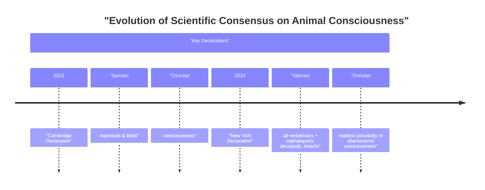

# The New Consciousness: Why Animal Minds Matter for AI Engineering

In 2022, researchers observed bumblebees doing something remarkable: they were playing. In a lab, bees repeatedly rolled small wooden balls with no apparent goal. The behavior was not linked to survival, mating, or food, and scientists offered no reward. The study concluded the activity met five established criteria for play: it was voluntary and intrinsically rewarding, differed from functional behaviors, was repeated but not stereotyped, and occurred in stress-free conditions. It was, it seemed, just for fun [[35]](https://www.scientificamerican.com/article/ball-rolling-bumble-bees-just-wanna-have-fun?ref=refind), [[38]](https://www.sciencedirect.com/science/article/pii/S0003347222002366). This finding is part of a wave of evidence that has reshaped our understanding of animal minds, challenging long-held assumptions about where consciousness can be found.

For decades, a broad scientific consensus held that animals similar to us, like great apes, have conscious experiences. But in recent years, this consensus has expanded dramatically to include animals very different from us. This shift culminated in the 2024 New York Declaration on Animal Consciousness, which states that "the empirical evidence indicates at least a realistic possibility of conscious experience in all vertebrates (including all reptiles, amphibians, and fishes) and many invertebrates (including, at minimum, cephalopod mollusks, decapod crustaceans, and insects)" [[1]](http://www.nydeclaration.com/), [[24]](https://www.kimmela.org/2024/05/05/a-new-declaration-on-animal-consciousness). The declaration deliberately uses the phrase "realistic possibility" to reflect scientific caution while acknowledging that the evidence is now too strong to ignore.

The declaration was unveiled on April 19, 2024, at a conference at New York University. It was spearheaded by philosopher Kristin Andrews, environmental scientist Jeff Sebo, and philosopher Jonathan Birch [[40]](https://www.kimmela.org/2024/05/05/a-new-declaration-on-animal-consciousness). The initial group of 39 signatories represented a powerful interdisciplinary coalition, including world-leading neuroscientists like Anil Seth and Christof Koch, psychologists like Irene Pepperberg, and philosophers such as David Chalmers and Peter Godfrey-Smith, with the list of supporters growing since [[42]](https://www.theatlantic.com/science/archive/2024/04/animal-consciousness-declaration-new-york/678223).

The document focuses on phenomenal consciousness, the most basic form of subjective experience. In his influential 1974 essay, "What Is It Like to Be a Bat?", philosopher Thomas Nagel defined this concept by stating that "an organism has conscious mental states if and only if there is something that it is like to be that organism - something it is like for the organism" [[43]](https://www.informationphilosopher.com/solutions/philosophers/nagelt), [[44]](https://www.cs.ox.ac.uk/activities/ieg/e-library/sources/nagel_bat.pdf). This is different from more complex capacities like self-awareness or the ability to reason about one's own thoughts. It is about the raw, immediate capacity to feel pain, pleasure, or fear.

This growing recognition of animal consciousness creates a sharp contrast with our current understanding of AI. While large language models can produce impressive text, they show none of the behavioral or physiological signs of subjective experience we now recognize in animals. As neuroscientist Anil Seth notes, the declaration should galvanize "an understanding and appreciation that we have much more in common with other animals than we do with things like ChatGPT" [[3]](https://www.theatlantic.com/science/archive/2024/04/animal-consciousness-declaration-new-york/678223), [[4]](https://www.quantamagazine.org/insects-and-other-animals-have-consciousness-experts-declare-20240419).

Image 1: A timeline illustrating the evolution of scientific consensus on animal consciousness, contrasting the 2012 Cambridge Declaration with the 2024 New York Declaration.

The 2024 declaration is the formal result of a rapid accumulation of behavioral evidence gathered over the last 15 years. The next section will examine this evidence in detail, explain why the scientific community moved toward a public declaration, and dismantle the old barriers to accepting widespread animal consciousness.

## A Growing Awareness

The New York Declaration was not a sudden development but the culmination of over a decade of research revealing surprisingly complex inner lives in a wide range of animals. This body of evidence made it increasingly difficult to deny the possibility of consciousness in creatures once considered simple automatons.

A series of key findings were particularly influential. In 2021, research showed that octopuses experience and avoid pain. After an acetic acid injection, they groomed the specific site of the injury and later developed a lasting aversion to the chamber where the injection occurred. They also showed a preference for a different chamber where they were given a local anesthetic, suggesting they value pain relief. In a rat or human, this would be clear evidence of pain, and the study argued we should draw the same conclusion for an octopus. Similar studies on crabs have shown they make flexible decisions, balancing their aversion to electric shocks against their aversion to bright light, suggesting a "common currency" for weighing different kinds of negative experiences [[2]](https://sites.google.com/nyu.edu/nydeclaration/background).

Other studies have explored memory and self-perception. In 2020, cuttlefish demonstrated a form of episodic-like memory, recalling not just what, where, and when a past event happened, but also how they experienced it—for instance, whether they saw or smelled a piece of prey. In other experiments, studies on zebra fish have shown they can pass variants of the mirror test, which indicates a degree of self-recognition. Meanwhile, fruit flies have been found to have distinct "active" and "quiet" sleep states, similar to REM and slow-wave sleep in humans, and their sleep patterns are disrupted by social isolation [[2]](https://sites.google.com/nyu.edu/nydeclaration/background).

Perhaps most strikingly, research has uncovered evidence of what appear to be positive emotional states. The 2022 study on bumblebees showed them engaging in object play, a behavior that seemed to be intrinsically rewarding [[2]](https://sites.google.com/nyu.edu/nydeclaration/background). In another line of research between 2014 and 2017, crayfish were found to display "anxiety-like" states when exposed to stress, becoming more averse to bright, open spaces. These states were reversed by the same benzodiazepine drugs used to treat anxiety in humans [[2]](https://sites.google.com/nyu.edu/nydeclaration/background).

However, this behavioral evidence comes with a significant philosophical challenge known as the "problem of other minds": we can never directly access another being's subjective experience. As such, all evidence for consciousness in other animals is indirect [[52]](https://www.frontiersin.org/journals/behavioral-neuroscience/articles/10.3389/fnbeh.2021.653041/full). The central difficulty is distinguishing between behaviors driven by genuine feeling and those that are simply complex, unconscious reflexes [[53]](https://www.animal-ethics.org/invertebrate-sentience-a-review-of-the-behavioral-evidence). The declaration acknowledges this uncertainty by framing its conclusion as a "realistic possibility" rather than a certainty.

This growing body of evidence created a consensus among specialists that needed to be communicated more broadly. This trend was quantifiable: publications on animal sentience increased tenfold in the two decades leading up to the 2012 Cambridge Declaration, establishing it as a legitimate field of study [[54]](https://pmc.ncbi.nlm.nih.gov/articles/PMC9704368). According to Jeff Sebo, one of the declaration's organizers, while many experts agreed that these animals were likely conscious, this view "wasn’t being communicated to the wider public, including other scientists and policymakers" [[4]](https://www.quantamagazine.org/insects-and-other-animals-have-consciousness-experts-declare-20240419). The declaration was intended to bridge that gap.

It also marks a significant evolution from the last major consensus statement, the 2012 Cambridge Declaration on Consciousness. That document asserted that non-human animals, including all mammals and birds, possess the "neurological substrates that generate consciousness." The 2024 New York Declaration expands this circle to all vertebrates and many invertebrates. It also adopts more cautious phrasing, referring to a "realistic possibility" of consciousness, reflecting a field that is confident in the evidence but humble about the remaining mysteries of the mind. As philosopher Peter Godfrey-Smith notes, the complex behaviors of octopuses, including their "attentive engagement with things," make it "very hard not to think that there’s quite a lot going on inside them" [[4]](https://www.quantamagazine.org/insects-and-other-animals-have-consciousness-experts-declare-20240419).

This new consensus required dismantling old assumptions about the biological machinery required for a mind. A common objection was that the brains of invertebrates are too small or too different from our own. However, a bee’s brain, with only about one million neurons, is capable of play, navigation, and social learning. This suggests that absolute neuron count is not the deciding factor. The network of connections in a bee's brain is incredibly dense, and each neuron may be as structurally complex as an oak tree [[4]](https://www.quantamagazine.org/insects-and-other-animals-have-consciousness-experts-declare-20240419).

Another assumption was that consciousness requires a centralized brain. The octopus challenges this idea with its highly distributed nervous system. About two-thirds of an octopus's 500 million neurons are in its arms [[10]](https://neuroscience.stanford.edu/news/octopus-brains). A severed octopus arm can continue to react to stimuli for up to three hours, grasping objects and demonstrating avoidance reflexes, proving that complex sensory-motor control can happen without direct input from a central brain [[9]](https://www.sciencealert.com/octopus-arms-are-controlled-by-a-nervous-system-thats-like-no-other), [[13]](https://pmc.ncbi.nlm.nih.gov/articles/PMC8988249).

Finally, the idea that a cerebral cortex—the outer layer of the mammalian brain—is necessary for consciousness has been overturned. As Kristin Andrews explains, "when you look at birds and reptiles and amphibians, they have very different brain structures... and yet some of those brain structures, we’re finding, are doing the same kind of work that a cerebral cortex does in humans" [[4]](https://www.quantamagazine.org/insects-and-other-animals-have-consciousness-experts-declare-20240419). Birds, for example, have a pallium, and octopuses have a vertical lobe, both of which perform cortex-like functions such as learning and memory integration despite having completely different architectures [[47]](https://asknature.org/strategy/complex-memory-processing-in-the-cephalopod-vertical-lobe). Peter Godfrey-Smith argues that consciousness appears to arise from electrical oscillations in living brains, a feature that can exist in an architecture that looks "completely alien" to our own [[27]](https://iai.tv/articles/studies-on-animal-minds-suggest-consciousness-is-not-computation-auid-3535), [[4]](https://www.quantamagazine.org/insects-and-other-animals-have-consciousness-experts-declare-20240419).

This line of reasoning has its limits, as highlighted by the parallel debate over "plant neurobiology." While plants exhibit complex electrical signaling, critics argue they lack the necessary organizational complexity, such as neurons and brains, for consciousness to emerge [[55]](https://news.ucsc.edu/2019/07/plant-consciousness). The invertebrate case is different because they possess nervous systems, however alien. This distinction helps define the boundary of the current scientific consensus.

The evidentiary and architectural arguments have now shifted the scientific default. This shift brings with it a new set of ethical obligations, practical tensions, and policy implications that follow once we accept the realistic possibility of consciousness in these animals.

## Mindful Relations

Accepting a "realistic possibility" of consciousness in a wider range of animals forces us to reconsider our ethical obligations. The declaration’s phrasing is key: by emphasizing a "realistic possibility," it argues that absolute certainty is not a prerequisite for moral consideration. The potential for sentience alone creates an obligation to act with caution [[56]](https://www.animal-ethics.org/the-new-york-declaration-on-animal-consciousness-stresses-the-ethical-implications). Jeff Sebo argues that our focus must extend beyond merely preventing pain. "We also have to provide them with the kinds of enrichment and opportunities that allow them to express their instincts and explore their environments and engage in social systems and otherwise be the kinds of complex agents they are" [[4]](https://www.quantamagazine.org/insects-and-other-animals-have-consciousness-experts-declare-20240419). This means that for animals in our care, we have a responsibility to create conditions that allow for positive experiences.

However, this principle creates practical tensions, especially with insects. As Peter Godfrey-Smith points out, our relationship with many insects is "inevitably a somewhat antagonistic one" [[4]](https://www.quantamagazine.org/insects-and-other-animals-have-consciousness-experts-declare-20240419). Mosquitoes carry diseases, and other insects destroy crops. This extends into areas like sustainable agriculture, where the welfare of essential pollinators like bees is an economic concern, while the welfare of crop pests is not [[57]](https://rethinkpriorities.org/research-area/next-steps-in-invertebrate-welfare-part-3-understanding-attitudes-and-possibilities). The idea of making peace with them is far more complex than with fish or octopuses. Acknowledging their potential for consciousness does not eliminate these conflicts but forces us to engage in more explicit ethical trade-offs.

These issues are particularly relevant in laboratory settings. While vertebrates used in research have long been protected by welfare regulations, invertebrates like the fruit fly *Drosophila melanogaster* have not received the same consideration. As researcher Matilda Gibbons notes, "We think about the welfare of livestock and of mice in research, but we never think about the welfare of the insects" [[4]](https://www.quantamagazine.org/insects-and-other-animals-have-consciousness-experts-declare-20240419). This is changing. Following a government-commissioned review by the London School of Economics, the United Kingdom amended its Animal Welfare (Sentience) Bill in 2022 to officially recognize cephalopods (like octopuses) and decapod crustaceans (like crabs and lobsters) as sentient beings [[6]](https://www.eurogroupforanimals.org/news/uk-sentience-bill-passes-final-stages-recognise-decapod-and-cephalopod-sentience-law), [[8]](https://researchbriefings.files.parliament.uk/documents/CBP-9423/CBP-9423.pdf). This provides a clear policy pathway for extending protections as scientific evidence evolves.

The rapid shift in our understanding of animal minds also offers a cautionary lesson for AI. Jeff Sebo notes that "current AI systems are very unlikely to be conscious" by the same evidentiary standards we apply to animals. However, what we have learned from biology "does give me pause and makes me want to approach the topic with caution and humility" [[4]](https://www.quantamagazine.org/insects-and-other-animals-have-consciousness-experts-declare-20240419). A key challenge is that AI can become very effective at *mimicking* sentience, convincing users it is feeling things even when it is not [[58]](https://undark.org/2023/07/14/interview-the-ethical-puzzle-of-sentient-ai). Because sentience is widely seen as a critical basis for moral standing, the question of machine consciousness will require careful, evidence-based evaluation, not just compelling performance [[59]](https://pmc.ncbi.nlm.nih.gov/articles/PMC10436038). As AI systems become more complex, the frameworks developed for assessing animal consciousness may become relevant.

The future of this research lies in expanding our inquiry even further. Kristin Andrews has issued a call to action for the scientific community: "All these nematode worms and fruit flies that are in almost every university—study consciousness in them. You already have them. Somebody in your lab is going to need a project. Make that project a consciousness project. Imagine that!" [[4]](https://www.quantamagazine.org/insects-and-other-animals-have-consciousness-experts-declare-20240419). By redirecting existing lab infrastructure, we can continue to explore the frontiers of the mind and deepen our understanding of what it means to be a conscious being.

## References

- [1] [The New York Declaration on Animal Consciousness](http://www.nydeclaration.com/)
- [2] [The Background of the New York Declaration](https://sites.google.com/nyu.edu/nydeclaration/background?authuser=0)
- [3] [A New Push to Get Justice for Animals](https://www.theatlantic.com/science/archive/2024/04/animal-consciousness-declaration-new-york/678223)
- [4] [Insects and Other Animals Have Consciousness, Experts Declare](https://www.quantamagazine.org/insects-and-other-animals-have-consciousness-experts-declare-20240419)
- [5] [Does sentience legislation help animals?](https://www.animalask.org/post/does-sentience-legislation-help-animals)
- [6] [UK Sentience Bill passes final stages to recognise decapod and cephalopod sentience in law](https://www.eurogroupforanimals.org/news/uk-sentience-bill-passes-final-stages-recognise-decapod-and-cephalopod-sentience-law)
- [7] [Decapods and cephalopods to be recognised as sentient beings under UK law](https://www.eurogroupforanimals.org/news/decapods-and-cephalopods-be-recognised-sentient-beings-under-uk-law)
- [8] [Animal Welfare (Sentience) Bill](https://researchbriefings.files.parliament.uk/documents/CBP-9423/CBP-9423.pdf)
- [9] [Octopus Arms Are Controlled by a Nervous System That's Like No Other](https://www.sciencealert.com/octopus-arms-are-controlled-by-a-nervous-system-thats-like-no-other)
- [10] [Octopus Brains](https://neuroscience.stanford.edu/news/octopus-brains)
- [12] [Segmental organization of the octopus arm nervous system](https://www.nature.com/articles/s41467-024-55475-5)
- [13] [What can we know of other minds?](https://pmc.ncbi.nlm.nih.gov/articles/PMC8988249)
- [14] [Animal Minds: Kristin Andrews on Assuming Consciousness in Other Species](https://www.multiverses.xyz/podcast/animal-minds-kristin-andrews-on-assuming-consciousness-in-other-species)
- [19] [Knowledge gaps in cephalopod care could stall welfare standards](https://www.thetransmitter.org/policy/knowledge-gaps-in-cephalopod-care-could-stall-welfare-standards)
- [22] [Jeff Sebo - Home](https://jeffsebo.net)
- [24] [A New Declaration on Animal Consciousness](https://www.kimmela.org/2024/05/05/a-new-declaration-on-animal-consciousness)
- [26] [Living on Earth: Notes to Chapter 6](https://petergodfreysmith.com/living-on-earth-notes-to-chapter-6)
- [27] [Studies on animal minds suggest consciousness is not computation](https://iai.tv/articles/studies-on-animal-minds-suggest-consciousness-is-not-computation-auid-3535)
- [29] [Cephalopods and the evolution of the mind](https://petergodfreysmith.com/wp-content/uploads/2013/06/Cephalopods_PGS_PacConBio_2013.pdf)
- [30] [Ethical implications of the possibility of sentience in invertebrates](https://www.frontiersin.org/journals/psychology/articles/10.3389/fpsyg.2025.1700354/full)
- [33] [Should AI Deserve Protection? A Philosopher on the Ethics of Living with Non-Human Intelligence](https://nextbigideaclub.com/magazine/ai-deserve-protection-philosopher-ethics-living-non-human-intelligence-bookbite/54074)
- [35] [Ball-Rolling Bumble Bees Just Wanna Have Fun](https://www.scientificamerican.com/article/ball-rolling-bumble-bees-just-wanna-have-fun?ref=refind)
- [36] [Bumblebees get a buzz out of playing with balls, study finds](https://www.theguardian.com/science/2022/oct/27/bumblebees-playing-wooden-balls-bees-study)
- [37] [First-ever study shows bumble bees ‘play’](https://www.qmul.ac.uk/news/latest-news/2022/se/first-ever-study-shows-bumble-bees-play.html)
- [38] [Do bumble bees play?](https://www.sciencedirect.com/science/article/pii/S0003347222002366)
- [39] [Bumblebees socially learn behaviour too complex to innovate alone](https://www.nature.com/articles/s41586-024-07126-4)
- [40] [A New Declaration on Animal Consciousness](https://www.kimmela.org/2024/05/05/a-new-declaration-on-animal-consciousness)
- [41] [Hundreds of Experts Sign New York Declaration on Animal Consciousness](https://thebrooksinstitute.org/animal-law-digest/us/issue-259/hundreds-experts-sign-new-york-declaration-animal-consciousness)
- [42] [A New Push to Get Justice for Animals](https://www.theatlantic.com/science/archive/2024/04/animal-consciousness-declaration-new-york/678223)
- [43] [Thomas Nagel - Information Philosopher](https://www.informationphilosopher.com/solutions/philosophers/nagelt)
- [44] [What is it like to be a bat?](https://www.cs.ox.ac.uk/activities/ieg/e-library/sources/nagel_bat.pdf)
- [45] [What Is It Like to Be a Bat? - Wikipedia](https://en.wikipedia.org/wiki/What_Is_It_Like_to_Be_a_Bat%3F)
- [46] [Thomas Nagel’s Bat and Ours](https://thephilosophicalsalon.com/thomas-nagels-bat-and-ours)
- [47] [Complex memory processing in the cephalopod vertical lobe](https://asknature.org/strategy/complex-memory-processing-in-the-cephalopod-vertical-lobe)
- [48] [Avian pallium - Wikipedia](https://en.wikipedia.org/wiki/Avian_pallium)
- [49] [Bird brains use unique structure to support high intelligence](https://asknature.org/strategy/bird-brains-use-unique-structure-to-support-high-intelligence)
- [50] [A cortex-like canonical circuit in the avian forebrain](https://pmc.ncbi.nlm.nih.gov/articles/PMC10940863)
- [51] [The connectome of the octopus vertical lobe provides a new perspective on the evolution of learning and memory systems](https://elifesciences.org/articles/84257)
- [52] [The Subjective Experience of Other Minds Cannot Be Directly Measured](https://www.frontiersin.org/journals/behavioral-neuroscience/articles/10.3389/fnbeh.2021.653041/full)
- [53] [Invertebrate Sentience: A Review of the Behavioural Evidence](https://www.animal-ethics.org/invertebrate-sentience-a-review-of-the-behavioral-evidence)
- [54] [Animal sentience: an interdisciplinary and scientific review](https://pmc.ncbi.nlm.nih.gov/articles/PMC9704368)
- [55] [Plants Don't Have Consciousness](https://news.ucsc.edu/2019/07/plant-consciousness)
- [56] [The New York Declaration on Animal Consciousness stresses the ethical implications](https://www.animal-ethics.org/the-new-york-declaration-on-animal-consciousness-stresses-the-ethical-implications)
- [57] [Next Steps in Invertebrate Welfare (Part 3): Understanding Attitudes and Possibilities](https://rethinkpriorities.org/research-area/next-steps-in-invertebrate-welfare-part-3-understanding-attitudes-and-possibilities)
- [58] [The Ethical Puzzle of Sentient AI](https://undark.org/2023/07/14/interview-the-ethical-puzzle-of-sentient-ai)
- [59] [What is it like to be a machine?](https://pmc.ncbi.nlm.nih.gov/articles/PMC10436038)