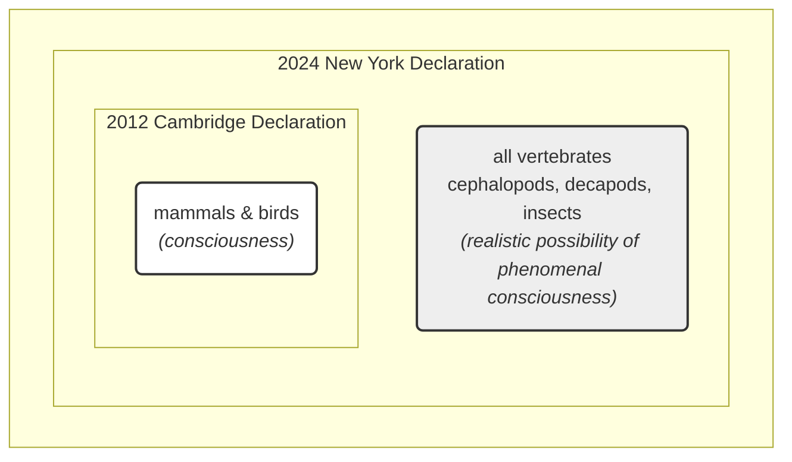

# Beyond Birds and Mammals: The New Science of Animal Consciousness

As an AI engineer, you are used to thinking about intelligence in terms of computation and architecture. But some of the most important lessons about consciousness may come not from silicon, but from a bumblebee playing with a wooden ball. In 2022, researchers observed exactly that: bumblebees in a lab repeatedly rolled small wooden balls, not for food, mating, or any other survival-related reason. They seemed to be doing it just for fun [[29, 30]].

This interpretation is not without its critics; some researchers suggest the behavior could be instinctual or a form of stress relief rather than genuine play [[50]]. The study's authors are also careful to note that this behavior does not imply humanlike reasoning [[51]]. Still, the discovery that an insect could engage in activity so decoupled from survival is part of a wave of findings reshaping your understanding of animal minds.

This growing body of evidence culminated in the 2024 New York Declaration on Animal Consciousness. For decades, a broad scientific consensus held that consciousness was likely present in animals similar to us, like other mammals and birds. However, recent research has challenged this human-centric view. The Declaration formally embraces this shift, stating that "The empirical evidence indicates at least a realistic possibility of conscious experience in all vertebrates (including reptiles, amphibians, and fishes) and many invertebrates (including, at minimum, cephalopod mollusks, decapod crustaceans, and insects)" [[Golden Source: The New York Declaration on Animal Consciousness]]. It deliberately uses the phrase "realistic possibility" to reflect scientific caution while acknowledging that the evidence is now too strong to ignore [[Golden Source: The Background of the New York Declaration]].

Unveiled on April 19, 2024, at a conference at New York University, the declaration was spearheaded by philosophers Kristin Andrews, Jeff Sebo, and Jonathan Birch. The initial 39 signatories included a formidable roster of interdisciplinary experts, from neuroscientists Anil Seth and Christof Koch to philosophers David Chalmers and Peter Godfrey-Smith, uniting leading researchers in the field. The inclusion of both empirical scientists and philosophers highlights the declaration's two-fold nature: it is grounded in a decade of new evidence, but its implications are deeply philosophical, forcing a re-evaluation of humanity's relationship with other living beings [[34, 42]].

The document focuses on what is known as phenomenal consciousness. This is not the capacity for complex self-awareness or reasoning, but the basic, subjective character of experience. In his influential 1974 essay, philosopher Thomas Nagel defined it with a simple question: is there "something that it is like to *be* that organism"? If an animal has raw feelings—the sting of pain, the satisfaction of hunger, the warmth of a sunbeam—it is phenomenally conscious. This is a low bar, intentionally set to capture the most fundamental aspect of experience, distinct from higher-order capacities like self-reflection, planning, or language which the Declaration does not claim for these animals [[43, 44, Golden Source: The Background of the New York Declaration]].

This emerging scientific picture of animal minds draws a sharp line between biological experience and artificial intelligence. While large language models can produce sophisticated text, they lack the underlying biological machinery and behavioral evidence of subjective states. As neuroscientist Anil Seth commented, he hopes the declaration galvanizes "an appreciation that we have much more in common with other animals than we do with things like ChatGPT" [[1, 2]].

The 2024 declaration represents a significant expansion from its predecessor, the 2012 Cambridge Declaration on Consciousness. The journey between these two milestones shows a widening circle of scientific concern, as illustrated in Image 1.

Image 1: A conceptual diagram showing the expansion from the 2012 Cambridge Declaration to the 2024 New York Declaration, with the inner circle representing the initial scope and the outer circle representing the new, wider consensus.

This declaration did not emerge from a vacuum. It is the formal culmination of over a decade of stunning behavioral evidence that has systematically dismantled old assumptions about the uniqueness of the vertebrate brain. The next section will explore these key findings and explain how they shifted the scientific default on animal consciousness.

## A Growing Awareness

Over the last fifteen years, a cascade of experimental results has revealed surprisingly rich inner lives in animals once dismissed as simple automatons. This evidence, which forms the backbone of the New York Declaration, points toward subjective experience in creatures with vastly different evolutionary histories and neural architectures from our own.

### A Decade of Stunning Evidence

One of the most compelling lines of evidence comes from octopuses. Studies show that they do more than just react to injury; they appear to experience the negative affective state of pain. Using a "conditioned place preference" test, researchers found that octopuses will avoid a chamber where they were injected with acetic acid. More tellingly, they will later develop a preference for a different chamber where they received pain-relieving lidocaine. This behavior strongly suggests they are seeking relief from an unpleasant internal feeling, a response that goes beyond simple reflexive action to indicate a memory of the negative state and a motivation to alleviate it [[Golden Source: The Background of the New York Declaration]].

Cuttlefish, another cephalopod, have demonstrated a sophisticated form of episodic-like memory. They can recall not only the what, where, and when of a past event—such as a meal—but also how they first experienced it, distinguishing between information gathered through sight versus smell. This capacity is known as "source memory." It hints at a more detailed and integrated recollection of past personal experiences, a step closer to the autobiographical memory found in humans [[Golden Source: The Background of the New York Declaration]].

The evidence extends to fish as well. Cleaner wrasse fish appear to pass a version of the classic mirror-mark test for self-recognition. When a colored mark is placed on their body, they see it in a mirror and then attempt to scrape it off on a nearby surface. This behavior suggests they recognize the reflection as their own, a capacity once thought to be limited to a handful of large-brained mammals and birds. This finding was met with significant skepticism, with critics like the test's originator, Gordon Gallup, arguing that the fish were not demonstrating true self-recognition. In response, the researchers conducted a series of follow-up experiments addressing the criticisms, ultimately strengthening their case. The controversy itself has prompted a re-evaluation of the mirror test's role as the sole arbiter of self-awareness [[52, Golden Source: The Background of the New York Declaration]].

In the insect world, the playful bumblebees are not alone. Fruit flies (*Drosophila*) have been found to have distinct phases of "quiet" and "active" sleep, analogous to slow-wave and REM sleep in humans. Their sleep patterns are also disrupted by social isolation, indicating that their internal states are influenced by their social environment. Even crustaceans show signs of complex emotions. Crayfish exhibit "anxiety-like" states when exposed to stress, becoming more fearful of bright, open spaces. This response is controlled by the neurochemical serotonin and is reversed by benzodiazepines, the same class of drugs used to treat anxiety in humans, suggesting a deep, shared heritage for these feelings [[53, 54, Golden Source: The Background of the New York Declaration]].

### From Lab Bench to Public Declaration

This flood of data created an informal consensus that needed a formal voice. The declaration's organizers, including Jeff Sebo, felt it was necessary to communicate these findings to policymakers and the public. The core message is that when "there is a realistic possibility of conscious experience in an animal, it is irresponsible to ignore that possibility in decisions affecting that animal". However, not all researchers agree that a public declaration was the right step. Some critics argue that the statement is a "broad overstatement" that could prematurely shut down scientific debate and hinder progress by oversimplifying a deeply complex issue [[22, 55]].

### From Cambridge to New York

The 2024 declaration builds on the 2012 Cambridge Declaration on Consciousness, which stated that mammals and birds possess the "neurological substrates that generate consciousness". The New York Declaration expands this scope to all vertebrates and many invertebrates, while carefully phrasing its claim as a "realistic possibility" to reflect scientific humility. This caution is important. As philosopher Peter Godfrey-Smith notes, the complex, attentive behavior of an octopus makes it "very hard not to think that there’s quite a lot going on inside them," but this is an inference, not a certainty [[49]].

### Dismantling the Neural Barrier

A long-standing barrier to accepting invertebrate consciousness was their alien neuroanatomy. But this objection is crumbling. The bee brain, with only about a million neurons compared to a human's 86 billion, is capable of supporting play, social learning, and navigation, proving that raw neuron count is not the sole determinant of a rich inner life. Furthermore, consciousness does not require a centralized, vertebrate-style brain. The octopus nervous system is highly distributed, with two-thirds of its neurons located in its arms. A severed octopus arm can continue to perform complex, seemingly purposeful actions for up to an hour, a dramatic demonstration of decentralized control [[10, 13, 49]].

### Consciousness Without a Cortex

Finally, the idea that a cerebral cortex is necessary for consciousness has been disproven by convergent evolution. As philosopher Kristin Andrews explains, different brain structures in birds, reptiles, and fish "are doing the same kind of work that a cerebral cortex does in humans". The avian pallium in birds and the vertical lobe in octopuses are powerful examples of how different architectures can achieve cortex-like functions, such as memory and learning. Godfrey-Smith concludes that subjective experience "can exist in an architecture that looks completely alien" to our own. With the scientific and architectural arguments now strongly favoring the possibility of consciousness in a vast range of animals, the conversation is shifting. We are now forced to confront the ethical and practical consequences of this new understanding [[40, 41, 49]].

## Mindful Relations

Accepting the "realistic possibility" of consciousness in invertebrates and other overlooked animals moves the discussion from a scientific debate to an ethical imperative.

### New Ethical Obligations

If these animals have subjective experiences, your obligations extend beyond simply preventing pain. As Jeff Sebo argues, you must also "provide them with the kinds of enrichment and opportunities that allow them to express their instincts and explore their environments and engage in social systems". This means creating conditions that allow for positive welfare, not just the absence of suffering [[31]].

### Practical Tensions

However, this expanded ethical circle creates immediate practical tensions. Your relationship with some insects is fundamentally adversarial, from crop pests to disease vectors. As Peter Godfrey-Smith notes, "The idea that we could just sort of make peace with the mosquitoes—it’s a very different thought than the idea that we could make peace with fish and octopuses". New challenges are also emerging with the rise of industrial insect farming for food and animal feed. In this context, insects are often treated as "biomass" rather than animals, and their slaughter is termed "harvesting," creating a legal and ethical gray area for their welfare [[49, 56]].

### The Laboratory Welfare Gap

A significant welfare gap also exists in the laboratory. While research on vertebrates is highly regulated, invertebrates like fruit flies (*Drosophila*) and nematode worms (*C. elegans*) are used in staggering numbers with virtually no welfare oversight. As researcher Matilda Gibbons points out, "We think about the welfare of livestock and of mice in research, but we never think about the welfare of the insects". This stands in stark contrast to the growing protections for cephalopods, where the lack of standardized welfare metrics remains a critical gap as more scientists enter the field [[15, 49]].

### Policy Following Science

Policy can, however, follow the science. The United Kingdom offers a clear precedent. Following a 2021 review of over 300 scientific studies by the London School of Economics, the government amended its Animal Welfare (Sentience) Bill to include all decapod crustaceans and cephalopod molluscs, legally recognizing animals like crabs, lobsters, and octopuses as sentient beings [[6, 7]].

### A Cautionary Tale for AI

While your understanding of animal minds deepens, experts urge caution when drawing parallels to artificial intelligence. Jeff Sebo states that "Current AI systems are very unlikely to be conscious" by the same evidentiary standards applied to animals. However, he adds that the rapid shift in biology "does give me pause and makes me want to approach the topic with caution and humility" when considering future AI systems. The lesson for you as an AI engineer is that you may need frameworks for assessing moral patienthood that, like those for animals, use probabilistic judgments rather than waiting for absolute certainty [[49, 57]].

### The Path Forward

The most promising path forward may lie in leveraging the animals already ubiquitous in labs worldwide. Kristin Andrews issues a direct call to action to the scientific community: "All these nematode worms and fruit flies that are in almost every university—study consciousness in them," she says. "You already have them. Somebody in your lab is going to need a project. Make that project a consciousness project. Imagine that!". Such programs could use the powerful genetic tools available for these organisms to test specific hypotheses about the neural underpinnings of subjective experience, perhaps even exploring what Jonathan Birch calls "minimal consciousness" in a worm with only 302 neurons. By turning your scientific tools toward these simpler models, you may unlock fundamental insights into how and where consciousness arises across the vast tree of life [[14, 49, 58, 59]].

## References

- [1] [https://www.theatlantic.com/science/archive/2024/04/animal-consciousness-declaration-new-york/678223](https://www.theatlantic.com/science/archive/2024/04/animal-consciousness-declaration-new-york/678223)
- [2] [https://www.quantamagazine.org/insects-and-other-animals-have-consciousness-experts-declare-20240419](https://www.quantamagazine.org/insects-and-other-animals-have-consciousness-experts-declare-20240419)
- [3] [https://advancedconsciousness.org/revisiting-animal-consciousness](https://advancedconsciousness.org/revisiting-animal-consciousness)
- [4] [https://www.animalask.org/post/does-sentience-legislation-help-animals](https://www.animalask.org/post/does-sentience-legislation-help-animals)
- [5] [https://naturewatch.org/study-confirms-animal-sentience-in-crustaceans](https://naturewatch.org/study-confirms-animal-sentience-in-crustaceans)
- [6] [https://www.eurogroupforanimals.org/news/uk-sentience-bill-passes-final-stages-recognise-decapod-and-cephalopod-sentience-law](https://www.eurogroupforanimals.org/news/uk-sentience-bill-passes-final-stages-recognise-decapod-and-cephalopod-sentience-law)
- [7] [https://www.eurogroupforanimals.org/news/decapods-and-cephalopods-be-recognised-sentient-beings-under-uk-law](https://www.eurogroupforanimals.org/news/decapods-and-cephalopods-be-recognised-sentient-beings-under-uk-law)
- [8] [https://researchbriefings.files.parliament.uk/documents/CBP-9423/CBP-9423.pdf](https://researchbriefings.files.parliament.uk/documents/CBP-9423/CBP-9423.pdf)
- [9] [https://www.sciencealert.com/octopus-arms-are-controlled-by-a-nervous-system-thats-like-no-other](https://www.sciencealert.com/octopus-arms-are-controlled-by-a-nervous-system-thats-like-no-other)
- [10] [https://neuroscience.stanford.edu/news/octopus-brains](https://neuroscience.stanford.edu/news/octopus-brains)
- [11] [https://www.youtube.com/watch?v=W9Gnw7B7oGM](https://www.youtube.com/watch?v=W9Gnw7B7oGM)
- [12] [https://www.nature.com/articles/s41467-024-55475-5](https://www.nature.com/articles/s41467-024-55475-5)
- [13] [https://pmc.ncbi.nlm.nih.gov/articles/PMC8988249](https://pmc.ncbi.nlm.nih.gov/articles/PMC8988249)
- [14] [https://www.multiverses.xyz/podcast/animal-minds-kristin-andrews-on-assuming-consciousness-in-other-species](https://www.multiverses.xyz/podcast/animal-minds-kristin-andrews-on-assuming-consciousness-in-other-species)
- [15] [https://www.thetransmitter.org/policy/knowledge-gaps-in-cephalopod-care-could-stall-welfare-standards](https://www.thetransmitter.org/policy/knowledge-gaps-in-cephalopod-care-could-stall-welfare-standards)
- [16] [https://scholar.google.com/citations?user=VkrvWREAAAAJ&hl=en](https://scholar.google.com/citations?user=VkrvWREAAAAJ&hl=en)
- [17] [https://www.youtube.com/watch?v=ak3WuQhtoW4](https://www.youtube.com/watch?v=ak3WuQhtoW4)
- [18] [https://jeffsebo.net](https://jeffsebo.net)
- [19] [https://www.linkedin.com/posts/jeff-sebo-ab6081231_thrilled-to-be-able-to-share-the-2024-annual-activity-7290836697666240512-vGiu](https://www.linkedin.com/posts/jeff-sebo-ab6081231_thrilled-to-be-able-to-share-the-2024-annual-activity-7290836697666240512-vGiu)
- [20] [https://www.youtube.com/watch?v=Mi4-EOThAIc](https://www.youtube.com/watch?v=Mi4-EOThAIc)
- [21] [https://petergodfreysmith.com/living-on-earth-notes-to-chapter-6](https://petergodfreysmith.com/living-on-earth-notes-to-chapter-6)
- [22] [https://iai.tv/articles/studies-on-animal-minds-suggest-consciousness-is-not-computation-auid-3535](https://iai.tv/articles/studies-on-animal-minds-suggest-consciousness-is-not-computation-auid-3535)
- [23] [https://www.youtube.com/watch?v=RkWvrt9GXsc](https://www.youtube.com/watch?v=RkWvrt9GXsc)
- [24] [https://petergodfreysmith.com/wp-content/uploads/2013/06/Cephalopods_PGS_PacConBio_2013.pdf](https://petergodfreysmith.com/wp-content/uploads/2013/06/Cephalopods_PGS_PacConBio_2013.pdf)
- [25] [https://www.frontiersin.org/journals/psychology/articles/10.3389/fpsyg.2025.1700354/full](https://www.frontiersin.org/journals/psychology/articles/10.3389/fpsyg.2025.1700354/full)
- [26] [https://nextbigideaclub.com/magazine/ai-deserve-protection-philosopher-ethics-living-non-human-intelligence-bookbite/54074](https://nextbigideaclub.com/magazine/ai-deserve-protection-philosopher-ethics-living-non-human-intelligence-bookbite/54074)
- [27] [https://www.effectivealtruism.org/stories/jeff-sebo](https://www.effectivealtruism.org/stories/jeff-sebo)
- [28] [https://www.scientificamerican.com/article/ball-rolling-bumble-bees-just-wanna-have-fun?ref=refind](https://www.scientificamerican.com/article/ball-rolling-bumble-bees-just-wanna-have-fun?ref=refind)
- [29] [https://www.theguardian.com/science/2022/oct/27/bumblebees-playing-wooden-balls-bees-study](https://www.theguardian.com/science/2022/oct/27/bumblebees-playing-wooden-balls-bees-study)
- [30] [https://www.qmul.ac.uk/news/latest-news/2022/se/first-ever-study-shows-bumble-bees-play.html](https://www.qmul.ac.uk/news/latest-news/2022/se/first-ever-study-shows-bumble-bees-play.html)
- [31] [https://www.sciencedirect.com/science/article/pii/S0003347222002366](https://www.sciencedirect.com/science/article/pii/S0003347222002366)
- [32] [https://www.nature.com/articles/s41586-024-07126-4](https://www.nature.com/articles/s41586-024-07126-4)
- [33] [https://www.kimmela.org/2024/05/05/a-new-declaration-on-animal-consciousness](https://www.kimmela.org/2024/05/05/a-new-declaration-on-animal-consciousness)
- [34] [https://thebrooksinstitute.org/animal-law-digest/us/issue-259/hundreds-experts-sign-new-york-declaration-animal-consciousness](https://thebrooksinstitute.org/animal-law-digest/us/issue-259/hundreds-experts-sign-new-york-declaration-animal-consciousness)
- [35] [https://www.informationphilosopher.com/solutions/philosophers/nagelt](https://www.informationphilosopher.com/solutions/philosophers/nagelt)
- [36] [https://www.cs.ox.ac.uk/activities/ieg/e-library/sources/nagel_bat.pdf](https://www.cs.ox.ac.uk/activities/ieg/e-library/sources/nagel_bat.pdf)
- [37] [https://en.wikipedia.org/wiki/What_Is_It_Like_to_Be_a_Bat%3F](https://en.wikipedia.org/wiki/What_Is_It_Like_to_Be_a_Bat%3F)
- [38] [https://thephilosophicalsalon.com/thomas-nagels-bat-and-ours](https://thephilosophicalsalon.com/thomas-nagels-bat-and-ours)
- [39] [https://asknature.org/strategy/complex-memory-processing-in-the-cephalopod-vertical-lobe](https://asknature.org/strategy/complex-memory-processing-in-the-cephalopod-vertical-lobe)
- [40] [https://en.wikipedia.org/wiki/Avian_pallium](https://en.wikipedia.org/wiki/Avian_pallium)
- [41] [https://asknature.org/strategy/bird-brains-use-unique-structure-to-support-high-intelligence](https://asknature.org/strategy/bird-brains-use-unique-structure-to-support-high-intelligence)
- [42] [https://pmc.ncbi.nlm.nih.gov/articles/PMC10940863](https://pmc.ncbi.nlm.nih.gov/articles/PMC10940863)
- [43] [https://elifesciences.org/articles/84257](https://elifesciences.org/articles/84257)
- [44] [http://www.nydeclaration.com/](http://www.nydeclaration.com/)
- [45] [https://sites.google.com/nyu.edu/nydeclaration/background?authuser=0](https://sites.google.com/nyu.edu/nydeclaration/background?authuser=0)
- [46] [Low, P. The Cambridge Declaration on Consciousness. Proceedings of the Francis Crick Memorial Conference, Churchill College, Cambridge University, July 7 2012, pp 1-2.](Low, P. The Cambridge Declaration on Consciousness. Proceedings of the Francis Crick Memorial Conference, Churchill College, Cambridge University, July 7 2012, pp 1-2.)
- [47] [https://www.sas.upenn.edu/~cavitch/pdf-library/Nagel_Bat.pdf](https://www.sas.upenn.edu/~cavitch/pdf-library/Nagel_Bat.pdf)
- [48] [https://www.psychologytoday.com/us/blog/animal-emotions/202211/bumble-bees-play-balls-and-may-even-enjoy-it](https://www.psychologytoday.com/us/blog/animal-emotions/202211/bumble-bees-play-balls-and-may-even-enjoy-it)
- [49] [https://www.cnn.com/2026/06/04/science/bumble-bees-insight-problem-solving](https://www.cnn.com/2026/06/04/science/bumble-bees-insight-problem-solving)
- [50] [https://www.theatlantic.com/science/archive/2023/04/fish-mirrors-animal-cognition-self-awareness-science/673718](https://www.theatlantic.com/science/archive/2023/04/fish-mirrors-animal-cognition-self-awareness-science/673718)
- [51] [https://www.bbc.com/news/science-environment-27812367](https://www.bbc.com/news/science-environment-27812367)
- [52] [https://pubmed.ncbi.nlm.nih.gov/24926022](https://pubmed.ncbi.nlm.nih.gov/24926022)
- [53] [https://www.thetransmitter.org/consciousness/premature-declarations-on-animal-consciousness-hinder-progress](https://www.thetransmitter.org/consciousness/premature-declarations-on-animal-consciousness-hinder-progress)
- [54] [https://faunalytics.org/do-consumers-care-about-farmed-insect-welfare](https://faunalytics.org/do-consumers-care-about-farmed-insect-welfare)
- [55] [https://arxiv.org/html/2411.00986v1](https://arxiv.org/html/2411.00986v1)
- [56] [https://pmc.ncbi.nlm.nih.gov/articles/PMC10723751](https://pmc.ncbi.nlm.nih.gov/articles/PMC10723751)
- [57] [https://forum.effectivealtruism.org/posts/Xhhm7GYA8xy6oLoY8/the-conscious-nematode-exploring-hallmarks-of-minimal](https://forum.effectivealtruism.org/posts/Xhhm7GYA8xy6oLoY8/the-conscious-nematode-exploring-hallmarks-of-minimal)
- [58] [https://www.youtube.com/watch?v=aXAoxUXnkug](https://www.youtube.com/watch?v=aXAoxUXnkug)
- [59] [https://www.kimmela.org/2024/05/05/a-new-declaration-on-animal-consciousness](https://www.kimmela.org/2024/05/05/a-new-declaration-on-animal-consciousness)