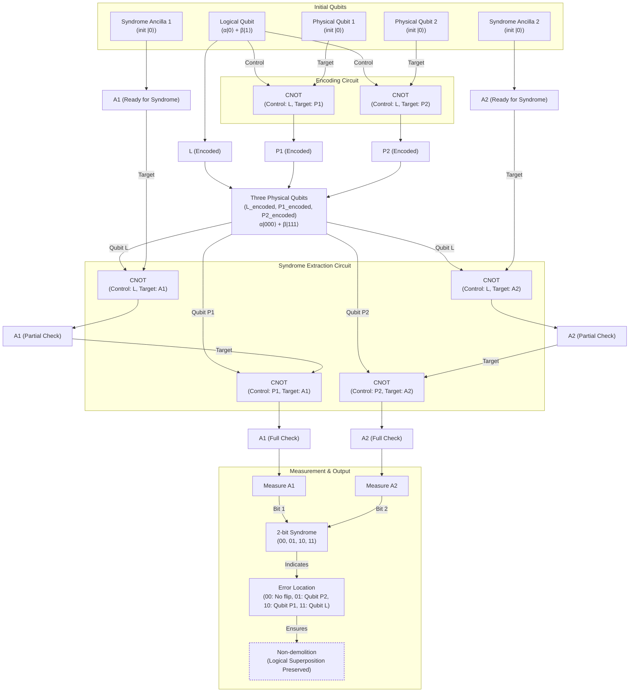
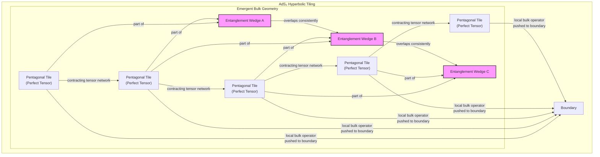

# How Space-Time Could Be a Quantum Error-Correcting Code

## The Quantum Computing Challenge and the Discovery of a Cosmic Connection

In 1994, the mathematician Peter Shor introduced a quantum algorithm that could factor large numbers exponentially faster than any known classical method, promising to break much of modern cryptography [[1]](https://people.eecs.berkeley.edu/~jswright/quantumcodingtheory24/scribe%20notes/lecture01.pdf). This discovery ignited excitement for quantum computers, but a fundamental obstacle stood in the way. The very properties that make quantum computers powerful also make them incredibly fragile, leading to widespread skepticism that a large-scale device could ever be built.

Classical computers use bits, which are definitively either a 0 or a 1. A classical n-bit register can only be in one of 2ⁿ states at any given time. Quantum computers, on the other hand, use "qubits." A qubit can exist in a superposition of both 0 and 1 simultaneously, and multiple qubits can become entangled, their fates intertwined in a complex web of probabilities. An n-qubit register can exist in a coherent superposition of all 2ⁿ states at once, enabling a massive parallelism that powers algorithms like Shor's.

This power comes at a cost. Qubits are extremely sensitive to their environment. The slightest disturbance can cause errors. A stray magnetic field or a random microwave pulse can cause "bit-flips" that swap the probabilities of 0 and 1, or "phase-flips" that invert the mathematical relationship between the states. Crucially, you cannot simply measure the qubits to check for errors, as any direct measurement collapses the superposition, destroying the quantum computation in the process. For a time, it seemed that building a useful, large-scale quantum computer might be impossible.

Just one year later, Shor delivered another breakthrough: a theoretical proof that "quantum error-correcting codes" (QECCs) could exist [[2]](https://en.wikipedia.org/wiki/Quantum_error_correction). This was followed by the threshold theorem, proven independently by groups including Dorit Aharonov and Michael Ben-Or; Emanuel Knill, Raymond Laflamme, and Wojciech Zurek; and Alexei Kitaev [[3]](https://en.wikipedia.org/wiki/Threshold_theorem). Building on Shor's work, they showed that if the error rate of individual quantum gates is below a certain threshold, a quantum computer can actively correct errors faster than they accumulate, making scalable, fault-tolerant computation theoretically possible [[3]](https://en.wikipedia.org/wiki/Threshold_theorem), [[4]](https://www.quantinuum.com/blog/quantinuum-with-partners-princeton-and-nist-deliver-seminal-result-in-quantum-error-correction). This discovery convinced many that building a quantum computer was "merely a staggering problem of engineering," as quantum computer scientist Scott Aaronson put it [[5]](https://www.quantamagazine.org/how-space-and-time-could-be-a-quantum-error-correcting-code-20190103). The design of better codes remains "one of the major thrusts of the field" [[5]](https://www.quantamagazine.org/how-space-and-time-could-be-a-quantum-error-correcting-code-20190103).

Then, in 2014, something unexpected happened. Three quantum gravity researchers, Ahmed Almheiri, Xi Dong, and Daniel Harlow, uncovered a deep connection between quantum error correction and the fabric of space-time itself. They proposed that the holographic principle, specifically the Anti-de Sitter/Conformal Field Theory (AdS/CFT) correspondence, works just like a quantum error-correcting code [[6]](https://errorcorrectionzoo.org/list/holographic), [[5]](https://www.quantamagazine.org/how-space-and-time-could-be-a-quantum-error-correcting-code-20190103). In this picture, the emergent geometry of space-time in the "bulk" of a universe is the protected, logical information encoded in a network of entangled quantum particles living on its outer boundary. Their paper triggered a wave of activity, suggesting that space-time itself is a code [[5]](https://www.quantamagazine.org/how-space-and-time-could-be-a-quantum-error-correcting-code-20190103).

This idea provides a powerful explanation for a fundamental property of our reality. John Preskill, a theoretical physicist at Caltech, argues that QEC explains the "intrinsic robustness" of space-time. "We’re not walking on eggshells to make sure we don’t make the geometry fall apart," he said. "I think this connection with quantum error correction is the deepest explanation we have for why that’s the case" [[5]](https://www.quantamagazine.org/how-space-and-time-could-be-a-quantum-error-correcting-code-20190103). The classical world feels stable because the underlying quantum reality is, in a sense, error-corrected.

This discovery points to a remarkable, two-way street. On one hand, the language of QEC provides a new toolkit for tackling deep mysteries in quantum gravity, like the black hole information paradox. On the other, the structure of space-time might inspire new, more efficient quantum codes for our own computers. As Almheiri noted, "Space-time is a lot smarter than us. The kind of quantum error-correcting code which is implemented in these constructions is a very efficient code" [[5]](https://www.quantamagazine.org/how-space-and-time-could-be-a-quantum-error-correcting-code-20190103).

With the Almheiri-Dong-Harlow conjecture establishing that holographic space-time behaves as a quantum error-correcting code, we now examine the concrete mechanics of how such codes protect logical information in simple qubit systems. This will allow us to recognize the same mathematical signatures when they reappear in the bulk geometry of AdS.

## How Quantum Error-Correcting Codes Work

The trick to protecting information from jittery qubits is to store it not in individual particles, but in patterns of entanglement among many. Instead of entrusting a single, fragile "physical" qubit with our data, we encode one "logical" qubit across a larger, highly entangled system. This redundancy ensures that no local error on a single physical qubit can corrupt the logical information.

A simple, though not fully practical, example is the three-qubit bit-flip code, first proposed by Asher Peres in 1985 [[2]](https://en.wikipedia.org/wiki/Quantum_error_correction). This code protects a logical qubit against bit-flip errors but not phase-flips. The logical state `|0⟩` is encoded as three physical qubits all in the `|000⟩` state, and the logical `|1⟩` is encoded as `|111⟩`. A general logical state `α|0⟩ + β|1⟩` becomes the entangled superposition `α|000⟩ + β|111⟩` [[7]](https://www.cl.cam.ac.uk/teaching/1920/QuantComp/Quantum_Computing_Lecture_13.pdf), [[8]](https://learn.microsoft.com/en-us/azure/quantum/concepts-error-correction). This encoding can be achieved with a circuit of CNOT gates, which entangle the primary qubit with two auxiliary qubits initialized to `|0⟩` [[9]](https://textbook.riverlane.com/en/latest/notebooks/ch2-classical-to-quantum-repcodes/bit-flip-repetition-codes.html).

Now, suppose one of the physical qubits accidentally flips. How do we detect and correct the error without directly measuring any of the qubits and collapsing the computation? The answer lies in "syndrome extraction." We can use two additional auxiliary qubits, or ancillas, to perform parity checks on pairs of the physical qubits [[10]](https://astro.pas.rochester.edu/~aquillen/phy265/lectures/QI_E.pdf). One check compares the first and second qubits, and another compares the first and third.

-   If there are no errors (`|000⟩` or `|111⟩`), both checks show the pairs match. The two-bit syndrome is `00`.
-   If the first qubit flips (`|100⟩` or `|011⟩`), both checks show a mismatch. The syndrome is `11`.
-   If the second qubit flips (`|010⟩` or `|101⟩`), the first check shows a mismatch, but the second shows a match. The syndrome is `10`.
-   If the third qubit flips (`|001⟩` or `|110⟩`), the first check shows a match, but the second shows a mismatch. The syndrome is `01`.

Each of these unique outcomes reveals which qubit, if any, needs to be corrected by applying a bit-flip operation. This process is a non-demolition measurement: it tells us the error's location without revealing anything about the logical state (`α` and `β`), thereby preserving the quantum information.

Image 1: A diagram illustrating the three-qubit bit-flip code, including encoding, syndrome extraction, and non-demolition measurement.

This simple code illustrates a general principle. The best error-correcting codes can typically recover all logical information from slightly more than half of the physical qubits, even if the rest are corrupted or lost [[5]](https://www.quantamagazine.org/how-space-and-time-could-be-a-quantum-error-correcting-code-20190103). It was this "slightly more than half" signature that hinted to Almheiri, Dong, and Harlow that quantum error correction was at play in the emergence of space-time.

Equipped with the concrete mechanics of qubit-based codes, we now show how the holographic principle implements precisely the same structure on a gravitational stage, with AdS geometry emerging from entangled boundary degrees of freedom.

## The Holographic Principle and Space-Time Emerges as a Quantum Error-Correcting Code

To understand the connection to gravity, we first need to distinguish between two types of universes. Our universe is described by de Sitter geometry, which has a positive vacuum energy, or cosmological constant, causing it to expand. In contrast, anti-de Sitter (AdS) space has a negative cosmological constant, giving it a hyperbolic geometry like one of M.C. Escher's *Circle Limit* designs. In these woodcuts, tessellated creatures shrink as they approach the perimeter, which represents an outer boundary at infinity [[11]](https://www.youtube.com/watch?v=IIHucC-HPz0). AdS space became a popular theoretical sandbox in 1997, when Juan Maldacena proposed the AdS/CFT correspondence, a duality suggesting that the gravitational physics within the bulk of an AdS universe is equivalent to a quantum field theory living on its lower-dimensional, gravity-free boundary [[5]](https://www.quantamagazine.org/how-space-and-time-could-be-a-quantum-error-correcting-code-20190103). This correspondence is a strong-weak duality, meaning complex, strongly-coupled problems on one side can be mapped to simpler, weakly-coupled problems on the other [[11]](https://www.youtube.com/watch?v=IIHucC-HPz0).

Exploring this duality, Almheiri and his colleagues noticed that any point in the interior of AdS space could be reconstructed from just over half of the boundary degrees of freedom—the same signature seen in optimal quantum error-correcting codes [[5]](https://www.quantamagazine.org/how-space-and-time-could-be-a-quantum-error-correcting-code-20190103). In their 2014 paper, they introduced a minimal toy model of this holographic principle: a three-qutrit code [[6]](https://errorcorrectionzoo.org/list/holographic). In this model, one logical qutrit (a quantum bit with three states) is encoded in the entanglement of three physical qutrits. This single logical qutrit represents a point in the center of a 2D space, and the code protects it against the erasure of any one of the three physical qutrits on the boundary [[23]](https://research.engineering.nyu.edu/~jbain/Talks/ST_QECC.pdf).

Of course, a single point does not make a universe. A more sophisticated model, developed in 2015 by Fernando Pastawski, Beni Yoshida, Daniel Harlow, and John Preskill, is the HaPPY (Pastawski-Yoshida-Harlow-Preskill) code [[12]](https://errorcorrectionzoo.org/c/happy). This code uses a network of "perfect tensors" arranged on a hyperbolic tiling of pentagons, which mimics the geometry of an AdS space-time slice [[12]](https://errorcorrectionzoo.org/c/happy). Each pentagon in the network is a perfect tensor, a mathematical object representing a state of maximal entanglement across any bipartition. As Stanford's Patrick Hayden described them, these tiles are like "little Tinkertoys" that build up the fabric of space-time [[5]](https://www.quantamagazine.org/how-space-and-time-could-be-a-quantum-error-correcting-code-20190103).

In the HaPPY code, the network of contracted tensors defines the emergent bulk geometry. The uncontracted "legs" of the tensors on the perimeter of the network represent the physical qubits on the boundary, while uncontracted legs in the interior represent logical qubits in the bulk [[13]](https://ncatlab.org/nlab/show/HaPPY+code). The code's structure naturally produces "entanglement wedges"—regions of the bulk whose information can be reconstructed from a corresponding region on the boundary. Because these wedges can overlap, a single logical operator in the bulk can be represented by multiple different operators on the boundary, realizing the core feature of quantum error correction [[5]](https://www.quantamagazine.org/how-space-and-time-could-be-a-quantum-error-correcting-code-20190103).

Image 2: An architecture diagram illustrating the HaPPY tensor-network code, showing hyperbolic tiling, perfect tensors, emergent bulk geometry, entanglement wedges, and holographic quantum error correction.

The general lesson is that QEC provides the natural language for describing how a smooth, classical geometry can emerge from a purely quantum system. "Quantum error correction gives us a more general way of thinking about geometry in this code language," said Preskill. He believes this language "ought to be applicable... to more general situations"—including, perhaps, a de Sitter universe like our own [[5]](https://www.quantamagazine.org/how-space-and-time-could-be-a-quantum-error-correcting-code-20190103).

For now, researchers are sticking with AdS space, which is simpler to study but shares key properties with our universe. Perhaps most importantly, both contain black holes. "The most fundamental property of gravity is that there are black holes," said Harlow. "That’s what makes gravity different from all the other forces. That’s why quantum gravity is hard" [[5]](https://www.quantamagazine.org/how-space-and-time-could-be-a-quantum-error-correcting-code-20190103). The same QEC structure that protects smooth AdS geometry fails in the presence of black holes. We now examine this breakdown of correctability and the paradoxes that result.

## Black Holes: Where Correctability Breaks Down

In the language of QEC, a black hole represents a catastrophic failure of correctability. Patrick Hayden describes the event horizon as a "sink for your ignorance": a point where so many errors have accumulated that you can no longer reconstruct what is happening in the bulk space-time [[5]](https://www.quantamagazine.org/how-space-and-time-could-be-a-quantum-error-correcting-code-20190103).

This failure is at the heart of Stephen Hawking's famous information paradox. In 1974, Hawking performed a semiclassical calculation—one that treats gravity classically but matter quantumly—and found that black holes are not truly black. They radiate thermal energy, now called Hawking radiation. This radiation appears to be completely random and carries no information about the matter that collapsed to form the black hole. As the black hole evaporates, the information it swallowed seems to be permanently lost. This would violate a fundamental principle of quantum mechanics called unitarity, which states that information in a closed system is never destroyed. A complete theory of quantum gravity must explain how this information gets out.

In the simplified context of AdS space, the holographic principle guarantees that information is never truly lost; it is always encoded on the boundary. However, the formation of a black hole dramatically changes the rules of reconstruction. To decode information from a black hole's interior, you no longer need just over half the boundary qubits. Instead, calculations show that you need access to roughly three-quarters of the boundary [[15]](https://indico.ift.uam-csic.es/event/9/attachments/26/36/Wall_Black_Hole_Thermodynamics.pdf), [[16]](https://www.osti.gov/pages/biblio/1803745). Why this specific fraction comes up "is still an open question," according to Almheiri [[5]](https://www.quantamagazine.org/how-space-and-time-could-be-a-quantum-error-correcting-code-20190103).

This shift in correctability leads to another profound puzzle. In 2012, Almheiri and his collaborators pointed out a sharp conflict between a smooth event horizon and the laws of quantum mechanics [[17]](https://arxiv.org/abs/1207.3123). Their argument, known as the firewall paradox, rests on three seemingly reasonable assumptions: (i) Hawking radiation is in a pure state, preserving unitarity; (ii) low-energy effective field theory is valid outside the horizon; and (iii) an infalling observer experiences nothing unusual at the horizon. The problem arises from the monogamy of entanglement, a core principle of quantum mechanics that forbids a single quantum system from being maximally entangled with two other systems at once. To preserve unitarity, the late-time Hawking radiation must be entangled with the early-time radiation. To ensure a smooth horizon, the outgoing radiation must also be entangled with its partner particles just inside the horizon. This creates a contradiction, implying that the entanglement across the horizon must be broken, creating a violent "firewall" of high-energy particles.

Quantum error correction offers a way out of this paradox. It provides a framework where the interior can be reconstructed from the radiation, but only after the information has been sufficiently "scrambled" by the black hole's dynamics. The geometric picture for this is the ER=EPR conjecture, which posits that entanglement is equivalent to a wormhole connecting two regions of space-time. These "entanglement wormholes" could provide a pathway for information to escape the black hole's interior without violating locality at the horizon. Almheiri speculates that QEC is "essential for maintaining the smoothness of space-time at the horizon" and may be how information ultimately gets out, resolving Hawking's paradox [[5]](https://www.quantamagazine.org/how-space-and-time-could-be-a-quantum-error-correcting-code-20190103).

## Implications for Our Universe and Quantum Computing

The connection between quantum gravity and error correction is not just a theoretical curiosity. The U.S. Department of Defense has funded research into holographic codes, partly in the hope that their geometric structure might lead to more efficient and robust QEC schemes for practical quantum computers [[5]](https://www.quantamagazine.org/how-space-and-time-could-be-a-quantum-error-correcting-code-20190103).

On the physics side, a major challenge remains: lifting these insights from the theoretical "sandbox" of AdS space to a de Sitter universe like our own. Our universe's positive cosmological constant means it lacks the clean spatial boundary that makes holography in AdS so tractable. Researchers are exploring primitive holographic descriptions for de Sitter space, but these are far less developed. For example, Dong, Silverstein, and Torroba have taken steps toward a primitive holographic description for de Sitter space, and other work has explored how the HaPPY code might relate to a dS/CFT duality [[5]](https://www.quantamagazine.org/how-space-and-time-could-be-a-quantum-error-correcting-code-20190103), [[12]](https://errorcorrectionzoo.org/c/happy).

Despite these challenges, the core idea remains powerful. As John Preskill summarizes, entanglement is the very "glue" that holds space together. "If you want to weave space-time together out of little pieces, you have to entangle them in the right way," he explained. "And the right way is to build a quantum error-correcting code" [[5]](https://www.quantamagazine.org/how-space-and-time-could-be-a-quantum-error-correcting-code-20190103). This profound insight reframes our understanding of both the cosmos and computation, revealing a shared foundation in the principles of quantum information.

## References

- [1] [Quantum Coding Theory](https://people.eecs.berkeley.edu/~jswright/quantumcodingtheory24/scribe%20notes/lecture01.pdf)
- [2] [Quantum error correction](https://en.wikipedia.org/wiki/Quantum_error_correction)
- [3] [Threshold theorem](https://en.wikipedia.org/wiki/Threshold_theorem)
- [4] [Quantinuum With Partners Princeton and NIST Deliver Seminal Result In Quantum Error Correction](https://www.quantinuum.com/blog/quantinuum-with-partners-princeton-and-nist-deliver-seminal-result-in-quantum-error-correction)
- [5] [How Space and Time Could Be a Quantum Error-Correcting Code](https://www.quantamagazine.org/how-space-and-time-could-be-a-quantum-error-correcting-code-20190103)
- [6] [Holographic codes](https://errorcorrectionzoo.org/list/holographic)
- [7] [Quantum Computing Lecture 13](https://www.cl.cam.ac.uk/teaching/1920/QuantComp/Quantum_Computing_Lecture_13.pdf)
- [8] [Quantum error correction concepts](https://learn.microsoft.com/en-us/azure/quantum/concepts-error-correction)
- [9] [Quantum Repetition Code: Bit-flip error](https://textbook.riverlane.com/en/latest/notebooks/ch2-classical-to-quantum-repcodes/bit-flip-repetition-codes.html)
- [10] [Quantum error correction](https://astro.pas.rochester.edu/~aquillen/phy265/lectures/QI_E.pdf)
- [11] [Albert Einstein, Holograms and Quantum Gravity](https://www.youtube.com/watch?v=IIHucC-HPz0)
- [12] [Pastawski-Yoshida-Harlow-Preskill (HaPPY) code](https://errorcorrectionzoo.org/c/happy)
- [13] [HaPPY code](https://ncatlab.org/nlab/show/HaPPY+code)
- [14] [Holographic codes from hyperinvariant tensor networks](https://www.nature.com/articles/s41467-023-42743-z)
- [15] [Bulk Locality and Quantum Error Correction in AdS/CFT](https://indico.ift.uam-csic.es/event/9/attachments/26/36/Wall_Black_Hole_Thermodynamics.pdf)
- [16] [Bulk locality and quantum error correction in AdS/CFT](https://www.osti.gov/pages/biblio/1803745)
- [17] [Black Holes: Complementarity or Firewalls?](https://arxiv.org/abs/1207.3123)
- [18] [Shor nine-qubit code](https://errorcorrectionzoo.org/c/qecc)
- [19] [AdS/qCFT](https://real.mtak.hu/153229/1/2004.04173v4.pdf)
- [20] [PEE tensor network](https://arxiv.org/html/2512.19452v3)
- [21] [Reconstruction in AdS/CFT?](https://www2.yukawa.kyoto-u.ac.jp/~extremeuniverse/wpsite/wp-content/uploads/2022/10/KyotoOct2022.pdf)
- [22] [Python's lunch of the partially evaporated black hole](https://arxiv.org/html/2507.06046v1)
- [23] [Example: 3 qutrit code](https://research.engineering.nyu.edu/~jbain/Talks/ST_QECC.pdf)
- [24] [A 3-qutrit code](https://ncatlab.org/nlab/show/quantum+error+correction)