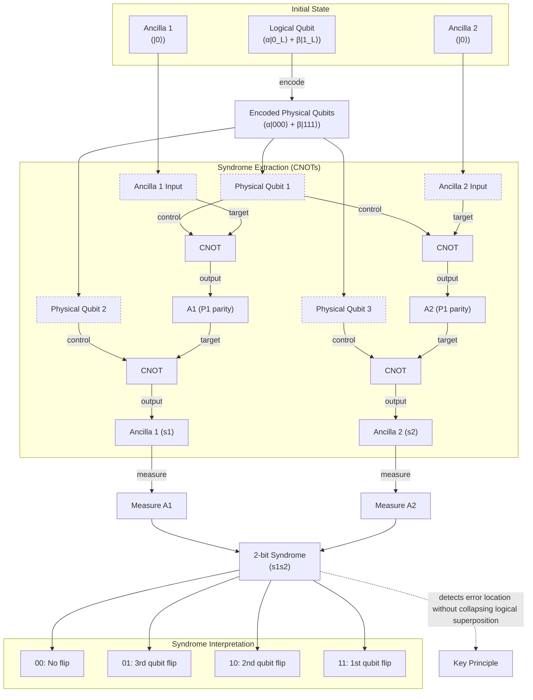
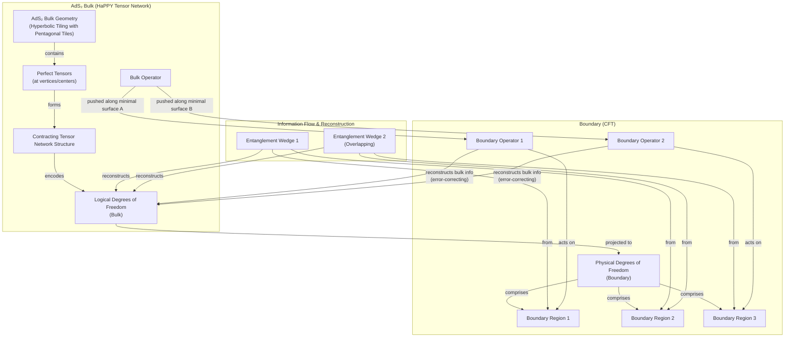

# How Space-Time Could Be a Quantum Error-Correcting Code

In 1994, mathematician Peter Shor developed an algorithm that could, in principle, break most modern cryptography using a quantum computer. The discovery generated immense excitement, promising a new era of computation. But it also highlighted a paradox. The very quantum effects that gave these machines their power—superposition and entanglement—also made them incredibly fragile. A single stray interaction could collapse the whole computation. For years, many believed that building a large-scale quantum computer was a practical impossibility.

Then, in a surprising turn, the solution to this fragility came from Shor himself, in the form of quantum error-correcting codes. This mathematical framework showed that it was theoretically possible to protect quantum information from noise, making scalable quantum computers conceivable. Two decades later, physicists exploring the frontiers of quantum gravity and string theory stumbled upon something remarkable. The mathematical structure describing how space-time emerges from a lower-dimensional quantum system, a concept known as the holographic principle, looked identical to a quantum error-correcting code.

This unexpected connection suggests that the fabric of our universe might be woven from the same principles that could one day power our most advanced computers. It implies that the robustness of space-time, its resilience against the chaos of the quantum world, is not an accident. It is a feature of an underlying cosmic error-correction protocol. In this article, we will explore this profound link, starting with the challenge of building a quantum computer and ending at the event horizon of a black hole. We will see how quantum error correction works, how it appears in holographic models of gravity, and what it tells us about the deepest puzzles in physics.

## The Quantum Computing Challenge and the Discovery of a Cosmic Connection

The promise of quantum computing stems from its departure from classical bits. A classical n-bit register can only store one of 2ⁿ possible states at any given time. An n-qubit register, however, can exist in a coherent superposition of all 2ⁿ basis states simultaneously. This exponential state space, combined with the non-local correlations of entanglement, enables a massive parallelism that classical computers cannot match. Shor's 1994 factoring algorithm was the first "killer app" to exploit this, demonstrating an exponential speedup for a problem with profound implications for cryptography [[2]](#https://en.wikipedia.org/wiki/Quantum_error_correction), [[3]](#https://people.eecs.berkeley.edu/~jswright/quantumcodingtheory24/scribe%20notes/lecture01.pdf).

However, this power comes at a great cost. Qubits are extremely sensitive to their environment. Unwanted interactions, or "noise," can randomly flip a qubit's state (`|0⟩` ↔ `|1⟩`), known as a bit-flip error, or alter the relative sign between the `|0⟩` and `|1⟩` components in a superposition, a phase-flip error. Worse, any attempt to directly measure a qubit to check for errors immediately collapses its superposition, destroying the very information the computation relies on. This fragility led to widespread skepticism that a useful, large-scale quantum computer could ever be built. The quantum state would decohere long before any complex algorithm could finish running.

The breakthrough came just a year later, again from Peter Shor. In 1995, he discovered the first quantum error-correcting code (QEC), a method for protecting a quantum state from noise [[2]](#https://en.wikipedia.org/wiki/Quantum_error_correction), [[3]](#https://people.eecs.berkeley.edu/~jswright/quantumcodingtheory24/scribe%20notes/lecture01.pdf), [[5]](#https://errorcorrectionzoo.org/c/qecc). This work, along with the subsequent threshold theorem, proved something significant. If the error rate of individual quantum gates is below a certain constant threshold, a quantum computer can actively correct errors faster than they accumulate. This allows for arbitrarily long quantum computations with only a modest overhead in the number of qubits and gates [[1]](#https://en.wikipedia.org/wiki/Threshold_theorem), [[4]](#https://www.quantinuum.com/blog/quantinuum-with-partners-princeton-and-nist-deliver-seminal-result-in-quantum-error-correction). As quantum computer scientist Scott Aaronson noted, “This was the central discovery in the ’90s that convinced people that scalable quantum computing should be possible at all... that it is merely a staggering problem of engineering.” [[14]](#https://www.quantamagazine.org/how-space-and-time-could-be-a-quantum-error-correcting-code-20190103/) The threshold theorem convinced the physics community that fault-tolerant quantum computing was not just a fantasy but a real engineering possibility, sparking a global race to build better codes and more stable qubits.

For nearly two decades, QEC remained primarily in the domain of quantum computing. Then, in 2014, a trio of theoretical physicists—Ahmed Almheiri, Xi Dong, and Daniel Harlow—proposed a new idea. They conjectured that the AdS/CFT correspondence, a leading model of quantum gravity, is itself a quantum error-correcting code [[16]](#https://indico.ift.uam-csic.es/event/9/attachments/26/36/Wall_Black_Hole_Thermodynamics.pdf), [[17]](#https://www2.yukawa.kyoto-u.ac.jp/~extremeuniverse/wpsite/wp-content/uploads/2022/10/KyotoOct2022.pdf). The correspondence posits a duality between a theory of gravity in a d+1 dimensional Anti-de Sitter (AdS) space and a quantum field theory without gravity (a Conformal Field Theory, or CFT) living on its d-dimensional boundary. Almheiri, Dong, and Harlow argued that the information about the "bulk" gravitational spacetime is encoded in the "boundary" CFT in a highly redundant, error-protected way. Local operators deep inside the bulk behave like logical qubits, encoded non-locally across the entangled physical qubits of the boundary theory. Their paper triggered a wave of activity in the quantum gravity community, with new codes being discovered that capture more properties of space-time [[14]](#https://www.quantamagazine.org/how-space-and-time-could-be-a-quantum-error-correcting-code-20190103/).

This insight provides a powerful explanation for a fundamental feature of our reality. As Caltech physicist John Preskill noted, spacetime does not seem fragile. “We’re not walking on eggshells to make sure we don’t make the geometry fall apart,” he said. "I think this connection with quantum error correction is the deepest explanation we have for why that’s the case." [[14]](#https://www.quantamagazine.org/how-space-and-time-could-be-a-quantum-error-correcting-code-20190103/) From this perspective, the emergent geometry of space-time is an error-protected logical observable. Small, local fluctuations in the boundary theory are like correctable errors on physical qubits; they leave the macroscopic bulk geometry completely unchanged. The intrinsic robustness of space-time is a feature of its underlying QEC structure.

This discovery opened a two-way street of intellectual exchange. On one hand, the language of QEC provides physicists with a new toolkit for tackling deep problems in quantum gravity, particularly those concerning black holes and the nature of information. On the other hand, the geometric nature of holographic codes may inspire new, more efficient designs for practical quantum error correction in real-world hardware. As Almheiri remarked, “Space-time is a lot smarter than us. The kind of quantum error-correcting code which is implemented in these constructions is a very efficient code.” [[14]](#https://www.quantamagazine.org/how-space-and-time-could-be-a-quantum-error-correcting-code-20190103/)

With the Almheiri-Dong-Harlow conjecture establishing that holographic space-time behaves as a quantum error-correcting code, we now examine the concrete mechanics of how such codes protect logical information in simple qubit systems. This will allow us to recognize the same mathematical signatures when they reappear in the bulk geometry of AdS.

## How Quantum Error-Correcting Codes Work

The central idea behind quantum error correction is to encode information non-locally. Instead of storing a logical piece of information in a single, fragile physical qubit, it is distributed across a highly entangled state of many physical qubits. This redundancy ensures that no single physical qubit holds any information about the logical state, so the loss or corruption of a few qubits does not destroy the encoded message.

A simple, instructive example is the three-qubit bit-flip code [[6]](#https://en.wikipedia.org/wiki/Quantum_error_correction). While not a complete solution, as it cannot protect against phase-flips, it clearly illustrates the core principles. In this code, a single logical qubit is encoded using three physical qubits. The logical basis states `|0_L⟩` and `|1_L⟩` are represented by the entangled states `|000⟩` and `|111⟩`, respectively. A general logical state `α|0_L⟩ + β|1_L⟩` is therefore encoded as the superposition `α|000⟩ + β|111⟩` [[7]](#https://www.cl.cam.ac.uk/teaching/1920/QuantComp/Quantum_Computing_Lecture_13.pdf), [[8]](#https://learn.microsoft.com/en-us/azure/quantum/concepts-error-correction).

https://d2r55xnwy6nx47.cloudfront.net/uploads/2019/01/Qubit-Errors_560.jpg
Image 1: A basic quantum error-correcting code can detect and fix bit-flip errors. (Source [Quanta Magazine](https://www.quantamagazine.org/how-space-and-time-could-be-a-quantum-error-correcting-code-20190103/))

The clever part is detecting errors without destroying the logical state. This is done through "syndrome extraction." We introduce two extra "ancilla" qubits and use a series of controlled-NOT (CNOT) gates to perform parity checks between pairs of the physical data qubits [[9]](#https://textbook.riverlane.com/en/latest/notebooks/ch2-classical-to-quantum-repcodes/bit-flip-repetition-codes.html), [[10]](#https://astro.pas.rochester.edu/~aquillen/phy265/lectures/QI_E.pdf). In layman's terms, one gate checks if the first and second qubits are the same, and another checks if the first and third are the same. If no error has occurred (the state is `α|000⟩ + β|111⟩`), both checks will always report "match." If the second qubit flips, the first check reports "do not match" while the second reports "match." This unique signature reveals exactly which qubit has an error, allowing for a targeted correction.

Image 2: A diagram illustrating the three-qubit bit-flip code for syndrome extraction.

By measuring the two ancilla qubits, we obtain a two-bit syndrome that uniquely identifies which physical qubit, if any, has flipped. A syndrome of "00" means no error occurred. "10" means the second qubit flipped, "01" the third, and "11" the first. Crucially, this measurement tells us only about the error, not about the logical state `α` or `β`. The logical superposition remains intact, and we can apply a correction (another bit-flip) to the identified qubit to restore the original state.

This simple example reveals a general principle. The best quantum error-correcting codes can typically recover all the encoded information even if a large fraction of the physical qubits are lost or corrupted. As a rule of thumb, recovery is possible as long as you have access to slightly more than half of the physical qubits. It was this "slightly more than half" signature that Almheiri, Dong, and Harlow recognized in the structure of holographic spacetimes, leading them to their groundbreaking conjecture.

Equipped with the concrete mechanics and this correctability signature of qubit-based codes, we now show how the holographic principle implements precisely the same structure on a gravitational stage, with AdS geometry emerging from entangled boundary degrees of freedom.

## The Holographic Principle and Space-Time Emerges as a Quantum Error-Correcting Code

To understand the holographic principle, it helps to first distinguish between two types of universes. Our universe is described by de Sitter (dS) space, which has a positive cosmological constant causing it to expand. This geometry lacks a well-defined spatial boundary, making it difficult to study holographically. A much simpler theoretical laboratory is Anti-de Sitter (AdS) space, which has a negative cosmological constant. This gives it a hyperbolic geometry and, importantly, a timelike boundary. You can visualize a 2D slice of AdS space using M.C. Escher's famous *Circle Limit* woodcuts, where identical figures (like fish or angels) tile a disc, shrinking as they approach the circular boundary. The boundary represents infinity in the AdS space.

https://www.quantamagazine.org/wp-content/uploads/2019/01/Escher_1000.jpg
Image 3: M.C. Escher's "Circle Limit III" provides a visual analogy for the hyperbolic geometry of a slice of Anti-de Sitter space. (Image by M.C. Escher from [Wikipedia](https://en.wikipedia.org/wiki/Circle_Limit_III#/media/File:Escher_Circle_Limit_III.jpg))

This boundary is the key to the AdS/CFT correspondence, discovered by Juan Maldacena in 1997. The duality states that a theory of quantum gravity in the (d+1)-dimensional AdS "bulk" is equivalent to a d-dimensional quantum field theory (the CFT) living on its boundary. Every piece of information in the bulk is encoded on the boundary, much like a 3D image is encoded on a 2D hologram.

This holographic mapping, however, presented a puzzle known as the "bulk locality paradox." A single operator deep in the bulk could seemingly be reconstructed from many different, non-overlapping regions of the boundary (such as regions AB, BC, or CA), which would imply the operator is trivial. The language of QEC resolves this: the bulk operator corresponds to different physical operators on different boundary regions, which are all equivalent only within the protected code subspace [[28]](#https://arxiv.org/abs/1411.7041). Almheiri and his colleagues realized this encoding has the exact properties of a QEC code. They found that information about any point deep inside the bulk could be reconstructed from just over half of the boundary, mirroring the recovery property of optimal quantum codes. Their 2014 paper introduced a minimal toy model to demonstrate this: a three-qutrit code that encodes one logical qutrit (a three-level quantum system) into three physical qutrits. This code can protect against the erasure of any single qutrit, meaning you can recover the full logical state from any two of the three physical ones. This simple code serves as a minimal model for the AdS/CFT holographic duality [[19]](#https://errorcorrectionzoo.org/list/holographic), [[20]](#https://research.engineering.nyu.edu/~jbain/Talks/ST_QECC.pdf), [[21]](#https://ncatlab.org/nlab/show/quantum+error+correction).

More complex models like the HaPPY code (named after Harlow, Pastawski, Preskill, and Yoshida) use tensor networks to represent more than one point [[11]](#https://errorcorrectionzoo.org/c/happy), [[12]](#https://ncatlab.org/nlab/show/HaPPY+code). These networks are built from "perfect tensors"—states of maximal entanglement—arranged on a grid of pentagons that tile the hyperbolic plane, mimicking AdS geometry. The network connects logical information in the bulk to physical qubits on the boundary. As Patrick Hayden of Stanford University explained, “These tiles would be playing the role of the fish in an Escher tiling.” [[14]](#https://www.quantamagazine.org/how-space-and-time-could-be-a-quantum-error-correcting-code-20190103/)

Image 4: An architectural diagram of the HaPPY tensor-network code, showing the hyperbolic bulk, tensor network, logical and physical degrees of freedom, overlapping entanglement wedges, and bulk operator pushing to the boundary.

This structure naturally yields complementary recovery. A bulk operator can be reconstructed from different, overlapping boundary regions known as entanglement wedges, a concrete realization of the QEC properties of AdS/CFT. However, while perfect tensor models like the HaPPY code successfully reproduce these QEC features, their rigid structure prevents them from describing the physical correlation functions of a real CFT, which should decay smoothly with distance. More advanced models achieve this by breaking the exact isometry of the encoding, a feature that is expected in the full theory of AdS/CFT and hints at the state-dependent nature of the code [[13]](#https://www.nature.com/articles/s41467-023-42743-z).

The general lesson is profound: quantum error correction provides the natural language for describing how a smooth, classical-looking geometry can emerge from a purely quantum, non-gravitational system. As Preskill puts it, this QEC framework "ought to be applicable... to more general situations," including, hopefully, a de Sitter universe like our own [[14]](#https://www.quantamagazine.org/how-space-and-time-could-be-a-quantum-error-correcting-code-20190103/). For now, researchers stick with AdS spaces, which are simpler but share many key properties with dS space. As Daniel Harlow of MIT notes, "The most fundamental property of gravity is that there are black holes. That’s what makes gravity different from all the other forces. That’s why quantum gravity is hard." [[14]](#https://www.quantamagazine.org/how-space-and-time-could-be-a-quantum-error-correcting-code-20190103/) The same QEC structure that so elegantly protects smooth AdS geometry fails spectacularly in the presence of a black hole. We now examine this breakdown and the paradoxes it creates.

## Black Holes: Where Correctability Breaks Down

Black holes represent the ultimate test for any theory of quantum gravity, and they are precisely where the neat picture of holographic error correction begins to break down. Once a black hole forms, its interior becomes causally disconnected from the boundary. Information that falls in seems to be lost forever, at least from the perspective of any local operator on the boundary. The event horizon acts as a one-way membrane, a "sink for your ignorance," as Patrick Hayden described it [[14]](#https://www.quantamagazine.org/how-space-and-time-could-be-a-quantum-error-correcting-code-20190103/).

This leads to the famous black hole information paradox. Stephen Hawking showed that black holes emit thermal radiation that appears to carry no information about what fell in. As the black hole evaporates, the information seems to be erased, violating the quantum mechanical principle of unitarity. A complete theory of quantum gravity must explain how this information escapes.

The QEC framework provides a new lens through which to view this problem. In the context of AdS/CFT, the correctability of bulk information changes drastically when a black hole is present. For a point in empty AdS space, we saw that its information could be recovered from just over half of the boundary. However, for information inside an evaporating black hole, the situation is different. To reconstruct operators in the interior, one needs access not just to the boundary CFT but also to the early Hawking radiation that has already escaped. The entanglement wedge of the radiation grows over time, and for an old black hole, reconstruction of the interior demands access to roughly three-quarters of the combined boundary-plus-radiation system, a significant shift from the half-threshold [[18]](#https://www.osti.gov/pages/biblio/1803745). As Almheiri noted, why this specific fraction comes up "is still an open question." [[14]](#https://www.quantamagazine.org/how-space-and-time-could-be-a-quantum-error-correcting-code-20190103/)

This tension came to a head in 2012 with the "firewall paradox," formulated by Almheiri and his colleagues Joseph Polchinski, Donald Marolf, and James Sully [[22]](#https://arxiv.org/abs/1207.3123). They argued that three seemingly reasonable assumptions could not all be true: (i) Hawking radiation is pure and carries out the information (preserving unitarity), (ii) an observer falling into the black hole sees nothing unusual at the horizon (a smooth "no-drama" experience), and (iii) low-energy physics works as expected outside the horizon. The paradox arises from the "monogamy of entanglement," a rule stating a quantum system cannot be maximally entangled with two other systems at once. If a late-time Hawking particle is entangled with the early radiation (to satisfy i) and also with its partner particle inside the horizon (to satisfy ii), it violates this rule. The startling conclusion was that the entanglement with the interior partner must be broken, creating a "firewall" of high-energy particles at the event horizon that would instantly incinerate any infalling observer.

Quantum error correction offers a potential way out. From the QEC perspective, the interior can be reconstructed from the radiation, but only after the black hole has had time to "scramble" the information. The ER=EPR conjecture, which equates entanglement with microscopic wormholes, provides a geometric picture for this decoding. Entanglement between the interior and the radiation creates a network of wormholes that allows information to escape without violating locality at the horizon. As Almheiri has suggested, QEC is "essential for maintaining the smoothness of space-time at the horizon" and may be how information ultimately escapes, resolving Hawking's paradox [[14]](#https://www.quantamagazine.org/how-space-and-time-could-be-a-quantum-error-correcting-code-20190103/), [[23]](#https://arxiv.org/abs/1810.02055).

## Implications for Our Universe and Quantum Computing

The deep connection between holographic gravity and quantum error correction has implications that ripple out in both directions, from fundamental physics to applied technology. Recognizing that nature may already be using sophisticated error correction schemes, the U.S. Department of Defense is funding research through programs like the Multidisciplinary University Research Initiative (MURI) to explore holographic tensor-network codes [[14]](#https://www.quantamagazine.org/how-space-and-time-could-be-a-quantum-error-correcting-code-20190103/), [[24]](#https://inspirehep.net/literature/2817311). The hope is that their inherent geometric structure might yield more efficient and robust QEC designs for real-world quantum computers, potentially offering higher error thresholds and lower overhead than conventional codes.

On the physics side, a major challenge remains: lifting these powerful insights from the theoretical playground of AdS to the de Sitter cosmology that describes our own expanding universe [[14]](#https://www.quantamagazine.org/how-space-and-time-could-be-a-quantum-error-correcting-code-20190103/). Because dS space lacks the convenient spatial boundary of AdS, a direct application of the holographic principle is not straightforward. Researchers are actively exploring various proposals, such as a direct dS/CFT correspondence, static patch holography, and DS/dS models, but a full understanding of holography in a realistic cosmology is still out of reach [[25]](#https://arxiv.org/abs/2602.02852).

Ultimately, this convergence reframes quantum entanglement as the fundamental "glue" holding spacetime together. As John Preskill articulated, “It’s really entanglement which is holding the space together... And the right way is to build a quantum error-correcting code.” [[14]](#https://www.quantamagazine.org/how-space-and-time-could-be-a-quantum-error-correcting-code-20190103/) The structure that protects our universe's geometry may be the same one that will one day protect our most powerful computations.

## Conclusion

We have journeyed from the practical challenge of building a quantum computer to the deepest mysteries of quantum gravity. We began with the fragility of qubits, which seemed to render large-scale quantum computation impossible, and saw how quantum error-correcting codes provided a theoretical lifeline. This very same mathematical structure then reappeared in an unexpected context: the holographic principle, where the geometry of space-time emerges from a web of quantum entanglement.

The idea that space-time is a quantum error-correcting code offers a powerful explanation for its robustness and provides a new language for tackling paradoxes like the black hole information problem. While many questions remain, especially regarding our own universe, this convergence of ideas represents a remarkable step forward. It suggests that the principles governing the cosmos at its most fundamental level and the principles we need to harness the ultimate power of computation are one and the same.

## References

- [1] [Threshold theorem - Wikipedia](https://en.wikipedia.org/wiki/Threshold_theorem)
- [2] [Quantum error correction - Wikipedia](https://en.wikipedia.org/wiki/Quantum_error_correction)
- [3] [Quantum Coding Theory](https://people.eecs.berkeley.edu/~jswright/quantumcodingtheory24/scribe%20notes/lecture01.pdf)
- [4] [Quantinuum, with partners Princeton and NIST, deliver seminal result in quantum error correction](https://www.quantinuum.com/blog/quantinuum-with-partners-princeton-and-nist-deliver-seminal-result-in-quantum-error-correction)
- [5] [Quantum error-correcting code (QECC) - Error Correction Zoo](https://errorcorrectionzoo.org/c/qecc)
- [6] [Quantum error correction - Wikipedia](https://en.wikipedia.org/wiki/Quantum_error_correction)
- [7] [Quantum Computing Lecture 13](https://www.cl.cam.ac.uk/teaching/1920/QuantComp/Quantum_Computing_Lecture_13.pdf)
- [8] [Quantum error correction - Azure Quantum](https://learn.microsoft.com/en-us/azure/quantum/concepts-error-correction)
- [9] [Bit-flip repetition codes — The Riverlane Quantum Error Correction Textbook](https://textbook.riverlane.com/en/latest/notebooks/ch2-classical-to-quantum-repcodes/bit-flip-repetition-codes.html)
- [10] [Quantum Information and Error Correction](https://astro.pas.rochester.edu/~aquillen/phy265/lectures/QI_E.pdf)
- [11] [Pastawski-Yoshida-Harlow-Preskill (HaPPY) code - Error Correction Zoo](https://errorcorrectionzoo.org/c/happy)
- [12] [HaPPY code in nLab](https://ncatlab.org/nlab/show/HaPPY+code)
- [13] [Holographic codes from hyperinvariant tensor networks](https://www.nature.com/articles/s41467-023-42743-z)
- [14] [How Space and Time Could Be a Quantum Error-Correcting Code | Quanta Magazine](https://www.quantamagazine.org/how-space-and-time-could-be-a-quantum-error-correcting-code-20190103)
- [15] [Spacetime as a quantum error correcting code - John Preskill](https://www.youtube.com/watch?v=MuklWupCvWU)
- [16] [Bulk Locality and Quantum Error Correction in AdS/CFT](https://indico.ift.uam-csic.es/event/9/attachments/26/36/Wall_Black_Hole_Thermodynamics.pdf)
- [17] [Reconstruction in AdS/CFT?](https://www2.yukawa.kyoto-u.ac.jp/~extremeuniverse/wpsite/wp-content/uploads/2022/10/KyotoOct2022.pdf)
- [18] [Bulk locality and quantum error correction in AdS/CFT](https://www.osti.gov/pages/biblio/1803745)
- [19] [Holographic code - Error Correction Zoo](https://errorcorrectionzoo.org/list/holographic)
- [20] [Example: 3 qutrit code](https://research.engineering.nyu.edu/~jbain/Talks/ST_QECC.pdf)
- [21] [quantum error correction in nLab](https://ncatlab.org/nlab/show/quantum+error+correction)
- [22] [Black Holes: Complementarity or Firewalls?](https://arxiv.org/abs/1207.3123)
- [23] [Holographic Quantum Error Correction and the Projected Black Hole Interior](https://arxiv.org/abs/1810.02055)
- [24] [DARPA MURI: Holographic Quantum Error Correction Codes](https://inspirehep.net/literature/2817311)
- [25] [AdS/CFT to dS/CFT: Some Recent Developments](https://arxiv.org/abs/2602.02852)
- [26] [Albert Einstein, Holograms and Quantum Gravity](https://www.youtube.com/watch?v=IIHucC-HPz0)
- [27] [Is Alice burning? The black hole firewall controversy | Quantum Frontiers](https://quantumfrontiers.com/2012/12/03/is-alice-burning-the-black-hole-firewall-controversy)
- [28] [Bulk Locality and Quantum Error Correction in AdS/CFT](https://arxiv.org/abs/1411.7041)
- [29] [Holographic quantum error-correcting codes: Toy models for the bulk/boundary correspondence](https://arxiv.org/abs/1503.06237)
- [30] [Quantum gravity from quantum error-correcting codes? | Quantum Frontiers](https://quantumfrontiers.com/2015/03/27/quantum-gravity-from-quantum-error-correcting-codes)